# `matplotlib\src\tri\_tri.cpp` 详细设计文档

这是Matplotlib中用于三角剖分（Triangulation）的核心C++实现，提供了2D/3D几何运算、三角网格数据结构、等高线生成以及基于梯形映射的快速点定位功能。主要用于matplotlib的tricontour、tripcolor等可视化功能。

## 整体流程

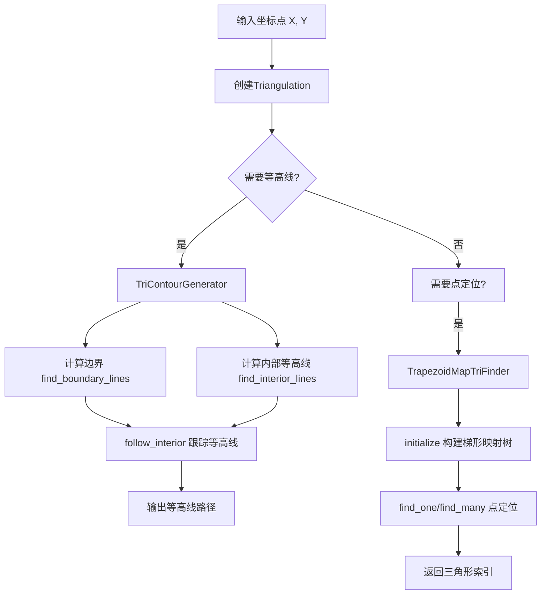

## 类结构

```
TriEdge (三角形边表示)
XY (2D坐标)
XYZ (3D坐标)
BoundingBox (边界框)
ContourLine (等高线路径)
Triangulation (三角剖分核心类)
├── TriContourGenerator (等高线生成器)
└── TrapezoidMapTriFinder (点定位器)
    ├── Edge (边-梯形映射)
    ├── Node (搜索树节点)
    └── Trapezoid (梯形区域)
```

## 全局变量及字段


### `write_contour`
    
输出轮廓信息到标准输出

类型：`void(const Contour&)`
    


### `TriEdge.tri`
    
三角形索引

类型：`int`
    


### `TriEdge.edge`
    
边索引(0-2)

类型：`int`
    


### `XY.x`
    
X坐标

类型：`double`
    


### `XY.y`
    
Y坐标

类型：`double`
    


### `XYZ.x`
    
X坐标

类型：`double`
    


### `XYZ.y`
    
Y坐标

类型：`double`
    


### `XYZ.z`
    
Z坐标

类型：`double`
    


### `BoundingBox.empty`
    
是否为空

类型：`bool`
    


### `BoundingBox.lower`
    
左下角

类型：`XY`
    


### `BoundingBox.upper`
    
右上角

类型：`XY`
    


### `Triangulation._x`
    
X坐标数组

类型：`CoordinateArray`
    


### `Triangulation._y`
    
Y坐标数组

类型：`CoordinateArray`
    


### `Triangulation._triangles`
    
三角形索引

类型：`TriangleArray`
    


### `Triangulation._mask`
    
三角形遮罩

类型：`MaskArray`
    


### `Triangulation._edges`
    
边数组

类型：`EdgeArray`
    


### `Triangulation._neighbors`
    
邻居三角形

类型：`NeighborArray`
    


### `Triangulation._boundaries`
    
边界列表

类型：`Boundaries`
    


### `Triangulation._tri_edge_to_boundary_map`
    
边到边界映射

类型：`std::map<TriEdge, BoundaryEdge>`
    


### `TriContourGenerator._triangulation`
    
三角剖分引用

类型：`Triangulation&`
    


### `TriContourGenerator._z`
    
Z值数组

类型：`CoordinateArray`
    


### `TriContourGenerator._interior_visited`
    
内部访问标记

类型：`std::vector<bool>`
    


### `TriContourGenerator._boundaries_visited`
    
边界访问标记

类型：`std::vector<std::vector<bool>>`
    


### `TriContourGenerator._boundaries_used`
    
边界使用标记

类型：`std::vector<bool>`
    


### `TrapezoidMapTriFinder._triangulation`
    
三角剖分引用

类型：`Triangulation&`
    


### `TrapezoidMapTriFinder._points`
    
点数组

类型：`Point*`
    


### `TrapezoidMapTriFinder._tree`
    
搜索树根节点

类型：`Node*`
    


### `TrapezoidMapTriFinder._edges`
    
边列表

类型：`std::vector<Edge>`
    


### `TrapezoidMapTriFinder::Edge.left`
    
左端点

类型：`const Point*`
    


### `TrapezoidMapTriFinder::Edge.right`
    
右端点

类型：`const Point*`
    


### `TrapezoidMapTriFinder::Edge.triangle_below`
    
下侧三角形

类型：`int`
    


### `TrapezoidMapTriFinder::Edge.triangle_above`
    
上侧三角形

类型：`int`
    


### `TrapezoidMapTriFinder::Edge.point_below`
    
下侧点

类型：`const Point*`
    


### `TrapezoidMapTriFinder::Edge.point_above`
    
上侧点

类型：`const Point*`
    


### `TrapezoidMapTriFinder::Node._type`
    
节点类型

类型：`Type`
    


### `TrapezoidMapTriFinder::Node._union`
    
联合体存储不同类型节点

类型：`Union`
    


### `TrapezoidMapTriFinder::Node._parents`
    
父节点列表

类型：`std::vector<Node*>`
    


### `TrapezoidMapTriFinder::Trapezoid.left`
    
左边界点

类型：`const Point*`
    


### `TrapezoidMapTriFinder::Trapezoid.right`
    
右边界点

类型：`const Point*`
    


### `TrapezoidMapTriFinder::Trapezoid.below`
    
下边界边

类型：`const Edge&`
    


### `TrapezoidMapTriFinder::Trapezoid.above`
    
上边界边

类型：`const Edge&`
    


### `TrapezoidMapTriFinder::Trapezoid.lower_left`
    
左下角梯形

类型：`Trapezoid*`
    


### `TrapezoidMapTriFinder::Trapezoid.lower_right`
    
右下角梯形

类型：`Trapezoid*`
    


### `TrapezoidMapTriFinder::Trapezoid.upper_left`
    
左上角梯形

类型：`Trapezoid*`
    


### `TrapezoidMapTriFinder::Trapezoid.upper_right`
    
右上角梯形

类型：`Trapezoid*`
    


### `TrapezoidMapTriFinder::Trapezoid.trapezoid_node`
    
对应节点

类型：`Node*`
    
    

## 全局函数及方法


### write_contour

该函数用于将轮廓（Contour）对象的内容输出到标准输出流。它接受一个轮廓容器引用，遍历其中的每一条轮廓线并调用其write方法打印详细信息。

参数：

- `contour`：`const Contour&`，待输出的轮廓容器引用，包含多个轮廓线对象

返回值：`void`，无返回值

#### 流程图

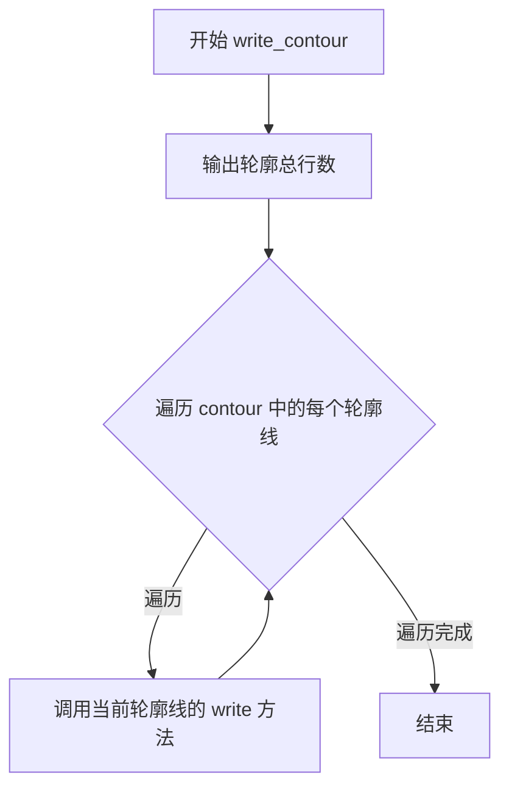

#### 带注释源码

```cpp
// 输出轮廓信息的函数
// 参数 contour: 轮廓容器引用，包含多个 ContourLine 对象
void write_contour(const Contour& contour)
{
    // 首先输出轮廓中包含的轮廓线数量
    std::cout << "Contour of " << contour.size() << " lines." << std::endl;
    
    // 遍历轮廓中的每一条轮廓线
    for (const auto & it : contour) {
        // 调用每条轮廓线的 write 方法输出详细信息
        it.write();
    }
}
```


### `TriEdge::TriEdge()`

#### 描述
这是一个无参构造函数（默认构造函数），用于创建 `TriEdge` 类的实例。它使用成员初始化列表（Member Initializer List）将三角形索引 `tri` 和边索引 `edge` 初始化为 `-1`，表示该对象在初始化时不指向任何有效的三角形边，通常用于表示空边或边界条件。

参数：
- （无）

返回值：`void`，构造函数，不返回具体值，仅初始化对象状态。

#### 流程图

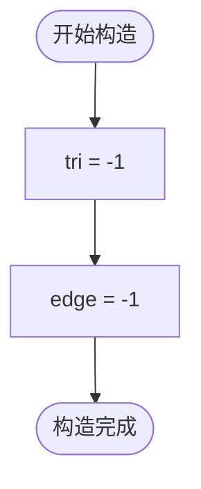

#### 带注释源码

```cpp
// 默认构造函数
TriEdge::TriEdge()
    // 使用成员初始化列表将 tri 和 edge 初始化为 -1
    // -1 通常表示该 TriEdge 未绑定到具体的三角形或边，即无效状态
    : tri(-1), edge(-1)
{}
```


### TriEdge.TriEdge(int, int)

该构造函数是`TriEdge`类的参数化构造函数，用于初始化一个包含三角形索引和边索引的`TriEdge`对象。在三角网格处理中，`TriEdge`用于唯一标识网格中的某一条边（由特定三角形的特定边组成）。

参数：

- `tri_`：`int`，三角形索引，指定该边所属的三角形编号
- `edge_`：`int`，边索引，指定三角形内的边编号（0、1或2，对应三角形的三个边）

返回值：无（构造函数）

#### 流程图

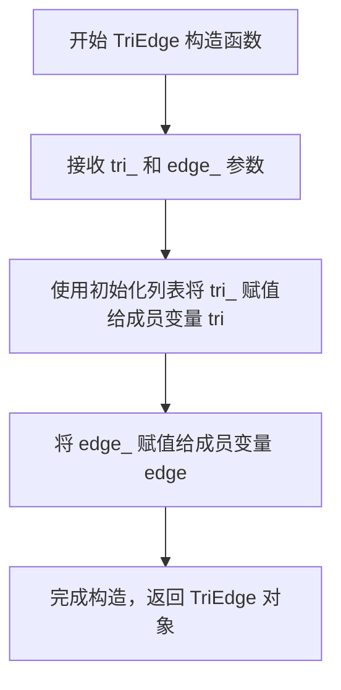

#### 带注释源码

```cpp
// 参数化构造函数定义
// 参数 tri_: 三角形索引，标识该边属于哪个三角形
// 参数 edge_: 边索引，标识该三角形中的哪条边（0、1或2）
TriEdge::TriEdge(int tri_, int edge_)
    : tri(tri_), edge(edge_)  // 初始化列表：将参数值赋给成员变量
{}
```

---

**补充信息：**

`TriEdge`类的完整定义（包含默认构造函数和相关操作符）：

```cpp
// TriEdge 类的默认构造函数
TriEdge::TriEdge()
    : tri(-1), edge(-1)  // 默认将索引设为 -1，表示无效的边
{}

// 比较操作符小于，用于在 std::set 等容器中排序
bool TriEdge::operator<(const TriEdge& other) const
{
    if (tri != other.tri)
        return tri < other.tri;
    else
        return edge < other.edge;
}

// 相等比较操作符
bool TriEdge::operator==(const TriEdge& other) const
{
    return tri == other.tri && edge == other.edge;
}

// 不相等比较操作符
bool TriEdge::operator!=(const TriEdge& other) const
{
    return !operator==(other);
}

// 流输出操作符，用于调试输出
std::ostream& operator<<(std::ostream& os, const TriEdge& tri_edge)
{
    return os << tri_edge.tri << ' ' << tri_edge.edge;
}
```


### TriEdge::operator<

该方法重载了小于运算符，用于比较两个 `TriEdge` 对象。它首先比较两个对象的三角形索引（`tri`），如果相等，则进一步比较边索引（`edge`）。这种字典序比较使得 `TriEdge` 对象可以存储在 `std::set` 等有序容器中，并确保唯一性。

参数：

- `other`：`const TriEdge&`，要比较的另一个 `TriEdge` 实例。

返回值：`bool`，如果当前对象的 `tri` 小于 `other.tri`，或者两者 `tri` 相等且当前对象的 `edge` 小于 `other.edge`，则返回 `true`；否则返回 `false`。

#### 流程图

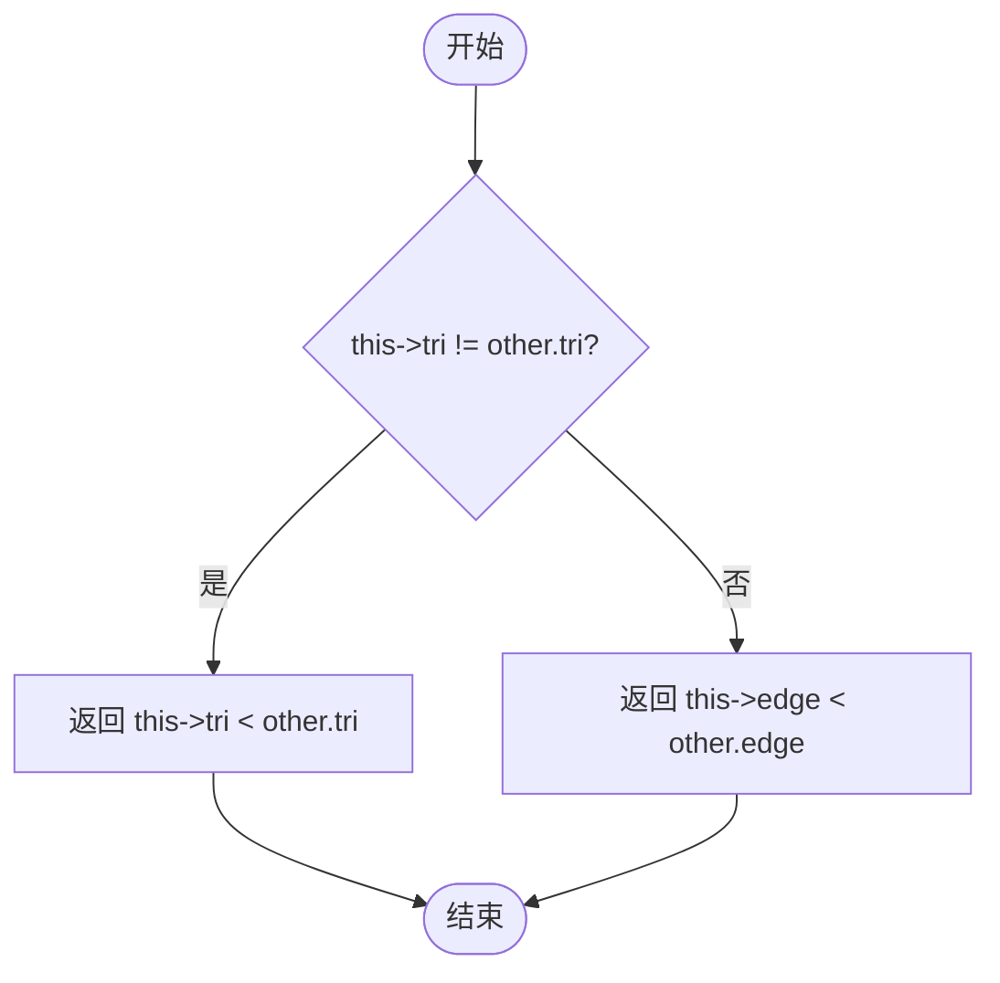

#### 带注释源码

```cpp
bool TriEdge::operator<(const TriEdge& other) const
{
    // 第一步：比较三角形索引 (tri)。
    // 如果三角形索引不同，则根据三角形索引的大小决定排序结果。
    if (tri != other.tri)
        return tri < other.tri;
    else
        // 第二步：如果三角形索引相同 (tri 相等)，则比较边索引 (edge)。
        // 这实现了字典序 (Lexicographical) 的比较逻辑。
        return edge < other.edge;
}
```


### TriEdge::operator==

该函数是 `TriEdge` 类的相等运算符重载，用于比较两个 `TriEdge` 对象是否相等。它通过同时比较两个 `TriEdge` 对象的 `tri` 和 `edge` 成员来判断它们是否相等，这是实现三角网格边比较操作的基础方法。

参数：

- `other`：`const TriEdge&`，要进行比较的目标 `TriEdge` 对象

返回值：`bool`，如果当前对象的 `tri` 和 `edge` 都与 `other` 对象的对应成员相等则返回 `true`，否则返回 `false`

#### 流程图

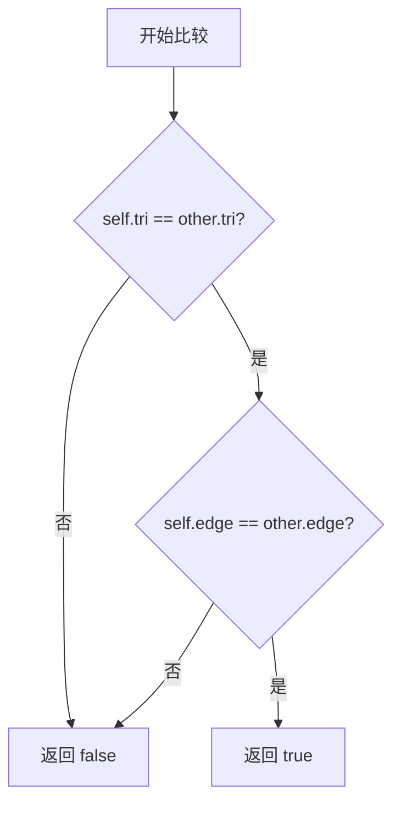

#### 带注释源码

```cpp
// 运算符重载：比较两个 TriEdge 对象是否相等
bool TriEdge::operator==(const TriEdge& other) const
{
    // 同时检查两个成员变量是否都相等
    // tri 表示三角形索引，edge 表示该三角形中的边索引
    return tri == other.tri && edge == other.edge;
}
```


### TriEdge.operator!=

该方法实现了TriEdge类的不等于比较运算符，用于判断两个TriEdge对象是否不相等。

参数：

- `other`：`const TriEdge&`，进行比较的另一个TriEdge对象引用

返回值：`bool`，如果两个TriEdge对象不相等返回true，否则返回false

#### 流程图

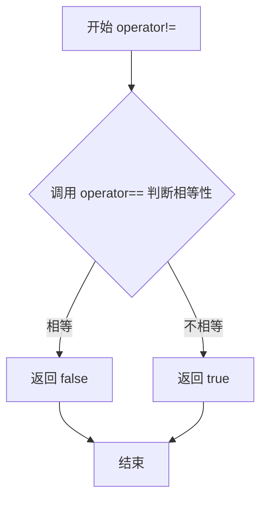

#### 带注释源码

```cpp
bool TriEdge::operator!=(const TriEdge& other) const
{
    // 调用同一个类的 operator== 成员函数来判断是否相等
    // 如果相等返回true，则这里取反返回false
    // 如果不相等返回false，则这里取反返回true
    return !operator==(other);
}
```


### `XY::XY()`

XY 类的默认构造函数和带参数构造函数，用于创建二维坐标点对象。

参数：

- （无参版本）无参数
- （带参版本）`x_`：`const double&`，X 坐标值
- （带参版本）`y_`：`const double&`，Y 坐标值

返回值：无（构造函数）

#### 流程图

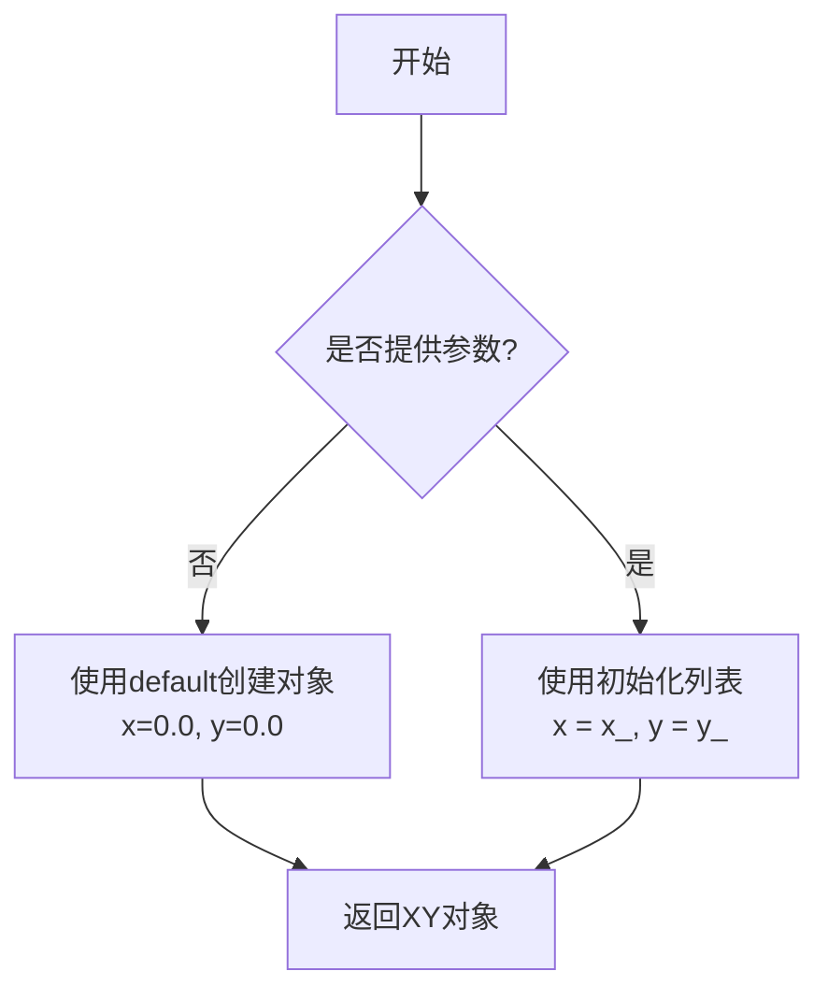

#### 带注释源码

```cpp
// 默认构造函数，使用default关键字
XY::XY() = default;

// 带参数构造函数，使用初始化列表初始化成员变量
XY::XY(const double& x_, const double& y_)
    : x(x_), y(y_)  // 初始化列表：将参数x_和y_分别赋值给成员变量x和y
{}
```


### XY.XY

这是一个XY类的构造函数，用于创建一个具有指定x和y坐标的二维点对象。

参数：

- `x_`：`const double&`，点的x坐标
- `y_`：`const double&`，点的y坐标

返回值：无（构造函数），创建XY对象实例

#### 流程图

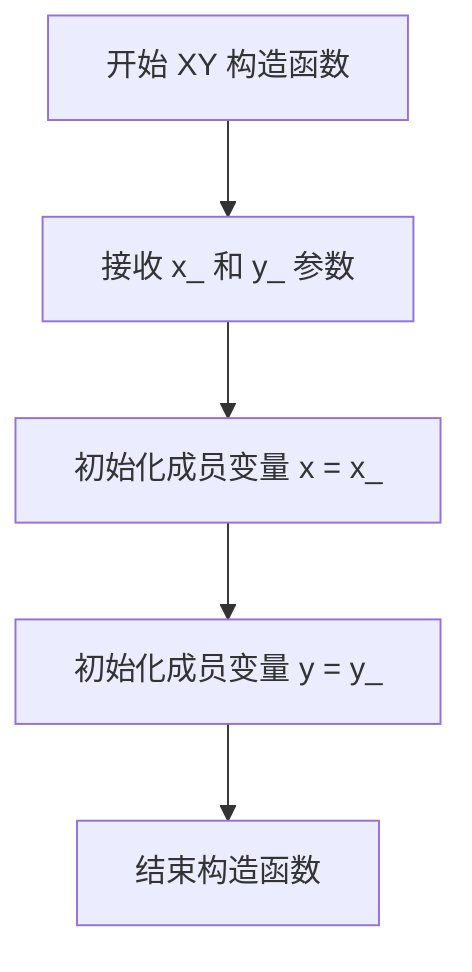

#### 带注释源码

```cpp
// XY 类的构造函数定义
// 参数：
//   x_ - x坐标的常量引用
//   y_ - y坐标的常量引用
XY::XY(const double& x_, const double& y_)
    : x(x_), y(y_)  // 使用初始化列表直接初始化成员变量x和y
{}
```


### XY::angle

该方法计算当前二维坐标点相对于原点的极角（弧度值），使用标准库函数`atan2`实现，是三角剖分和等高线生成等几何计算中的基础工具。

参数：
- （无显式参数，隐含`this`指针指向调用该方法的XY对象）

返回值：`double`，返回从原点指向该点`(x, y)`的向量与x轴正方向之间的角度，单位为弧度，范围通常为`[-π, π]`。

#### 流程图

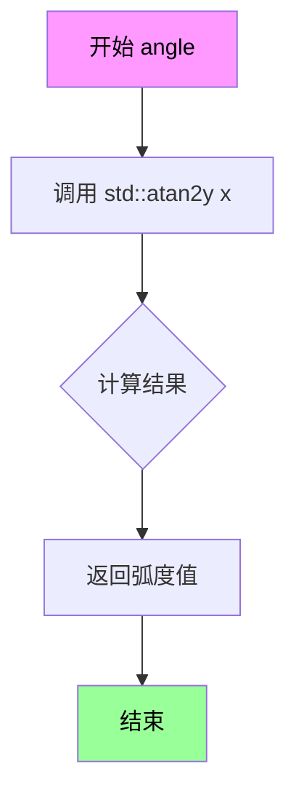

#### 带注释源码

```cpp
// XY类的成员函数：计算当前点相对于原点的极角
// 使用标准库atan2函数，参数顺序为(y, x)，符合数学坐标系
// 返回值范围：[-π, π]，其中正角度逆时针方向为正
double XY::angle() const
{
    // atan2(y, x) 在数学上等价于 atan(y/x)，但能正确处理所有象限
    // 当x=0时，atan2会返回±π/2而不是未定义
    // 当x=y=0时，返回0（虽然数学上未定义，这里采用C标准行为）
    return std::atan2(y, x);
}
```


### `XY.cross_z`

该方法计算当前XY点与另一个XY点所构成向量的叉积Z分量（2D叉积），返回值为一个标量，表示两个向量所在平面的法向量在Z轴上的投影，可用于判断两个向量的相对方向（顺时针或逆时针）。

参数：

- `other`：`const XY&`，另一个XY点对象，用于计算与当前点的叉积Z分量

返回值：`double`，返回2D向量的叉积Z分量（即 `x * other.y - y * other.x`），结果为正表示other在当前向量的左侧，为负表示在右侧，零表示共线。

#### 流程图

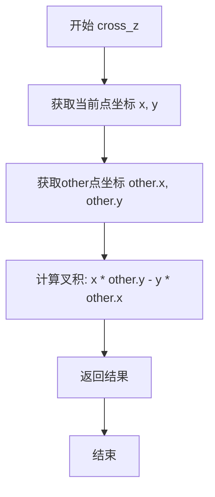

#### 带注释源码

```cpp
/**
 * @brief 计算2D向量的叉积Z分量
 * 
 * 该方法计算当前向量 (x, y) 与 other 向量 (other.x, other.y) 的叉积。
 * 在2D空间中，叉积的结果是一个标量，等同于3D空间中叉积的Z分量。
 * 
 * 数学公式: cross_z = x * other.y - y * other.x
 * 
 * 结果解释:
 *   > 0: other 向量在当前向量的左侧（逆时针方向）
 *   < 0: other 向量在当前向量的右侧（顺时针方向）
 *   = 0: 两个向量共线
 * 
 * @param other 另一个XY点，作为叉积计算的第二个向量
 * @return double 叉积的Z分量值
 */
double XY::cross_z(const XY& other) const
{
    // 计算2D叉积公式: x1*y2 - y1*x2
    // 这等价于将2D向量视为z=0的3D向量，然后计算3D叉积
    return x*other.y - y*other.x;
}
```


### `XY::is_right_of`

判断当前二维坐标点是否位于参数指定点的右侧。该方法首先比较 x 坐标，如果 x 坐标相同则比较 y 坐标，以此建立一种用于空间排序的几何全序关系。

参数：
- `other`：`const XY&`，参与比较的目标二维坐标点。

返回值：`bool`，如果当前点的位置在目标点的右侧（或 x 相同时更靠上），则返回 `true`；否则返回 `false`。

#### 流程图

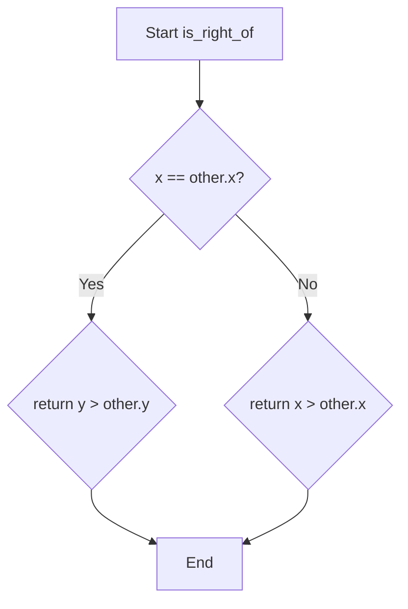

#### 带注释源码

```cpp
/**
 * @brief 判断当前点是否在参数点右侧
 * 
 * 这是一个几何比较器，用于确定点在 2D 空间中的相对位置。
 * 排序规则为：首先比较 x 坐标，如果 x 相等则比较 y 坐标。
 * 这确保了所有点都有一个唯一的“右侧”点，形成全序关系。
 * 
 * @param other 用于比较的目标点
 * @return bool 如果当前点在 other 的右侧（或 x 相同时 y 更大），返回 true
 */
bool XY::is_right_of(const XY& other) const
{
    // 如果 x 坐标相等，则根据 y 坐标判断。
    // y 越大（越靠上），认为越靠右。
    if (x == other.x)
        return y > other.y;
    else
        // x 坐标越大，认为越靠右。
        return x > other.x;
}
```


### `XY.operator==`

该方法重载了相等运算符，用于比较两个XY点对象是否相等。通过比较两个对象的x坐标和y坐标是否同时相等来判断。

参数：

- `other`：`const XY&`，要与之比较的另一个XY对象

返回值：`bool`，如果两个XY对象的x和y坐标都相等则返回true，否则返回false

#### 流程图

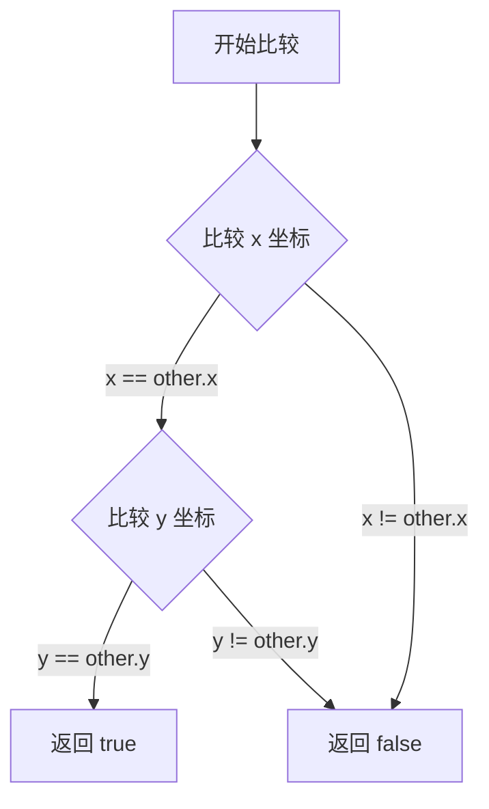

#### 带注释源码

```cpp
bool XY::operator==(const XY& other) const
{
    // 首先比较两个对象的 x 坐标是否相等
    // 然后比较两个对象的 y 坐标是否相等
    // 只有当 x 和 y 坐标都相等时，才认为两个 XY 对象相等
    return x == other.x && y == other.y;
}
```


### XY::operator!=

该方法用于比较两个XY对象是否不相等，如果x坐标或y坐标任意一个不同则返回true，否则返回false。

参数：

- `other`：`const XY&`，要比较的另一个XY对象

返回值：`bool`，如果两个XY对象不相等返回true，否则返回false

#### 流程图

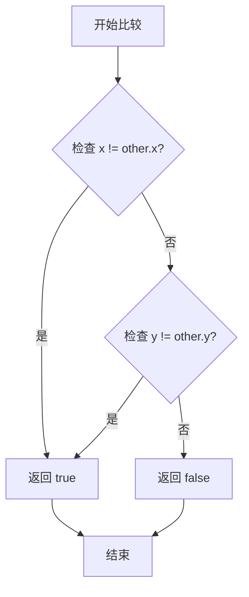

#### 带注释源码

```cpp
bool XY::operator!=(const XY& other) const
{
    // 比较两个XY对象的x和y坐标
    // 如果x坐标或y坐标任意一个不同，则返回true（不相等）
    // 否则返回false（相等）
    return x != other.x || y != other.y;
}
```

---

### 所属类：XY

XY类是一个二维坐标类，表示平面上的一个点(x, y)，提供基本的算术运算和比较操作。

#### 类字段

| 字段名 | 类型 | 描述 |
|--------|------|------|
| `x` | `double` | X坐标值 |
| `y` | `double` | Y坐标值 |

#### 类方法

| 方法名 | 返回类型 | 描述 |
|--------|----------|------|
| `XY()` | 构造函数 | 默认构造函数 |
| `XY(const double&, const double&)` | 构造函数 | 带参构造函数 |
| `angle()` | `double` | 计算从原点到该点的角度 |
| `cross_z(const XY&) const` | `double` | 计算与另一个XY对象的z轴叉积 |
| `is_right_of(const XY&) const` | `bool` | 判断是否在另一个点的右侧 |
| `operator==(const XY&) const` | `bool` | 相等比较运算符 |
| `operator!=(const XY&) const` | `bool` | 不相等比较运算符 |
| `operator*(const double&) const` | `XY` | 标量乘法运算符 |
| `operator+=(const XY&)` | `const XY&` | 复合加法赋值运算符 |
| `operator-=(const XY&)` | `const XY&` | 复合减法赋值运算符 |
| `operator+(const XY&) const` | `XY` | 加法运算符 |
| `operator-(const XY&) const` | `XY` | 减法运算符 |

---

### 技术债务与优化空间

1. **缺乏边界检查**：operator!=直接比较浮点数，可能存在精度问题
2. **功能重复**：operator!=实现依赖于operator==，可以简化为`return !operator==(other);`
3. **缺少文档**：XY类的方法缺少详细的文档注释

### 外部依赖

- 标准库`<cmath>`：`atan2`函数用于角度计算
- 标准库`<ostream>`：用于输出流操作


### `XY.operator*`

该函数是XY类的乘法运算符重载，用于实现XY对象与标量的乘法运算。通过将XY对象的x和y坐标分别与给定的乘数相乘，返回一个新的XY对象。

参数：

- `multiplier`：`const double&`，乘数，用于与XY对象的x和y坐标相乘

返回值：`XY`，返回一个新的XY对象，其x和y坐标分别为原坐标乘以multiplier

#### 流程图

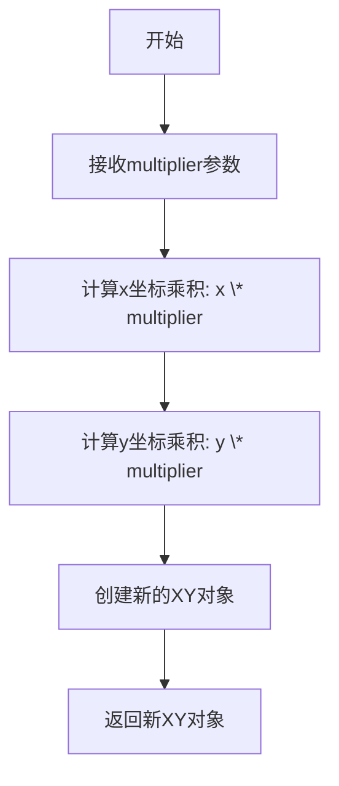

#### 带注释源码

```cpp
// XY类的乘法运算符重载实现
// 参数: multiplier - 常引用double类型, 表示要乘的标量值
// 返回值: XY类型, 返回一个新的XY对象, 其坐标为原坐标与multiplier的乘积
XY XY::operator*(const double& multiplier) const
{
    // 返回一个新的XY对象, 该对象的x坐标为当前对象的x坐标乘以multiplier,
    // y坐标为当前对象的y坐标乘以multiplier
    return XY(x*multiplier, y*multiplier);
}
```


### `XY::operator+=`

该方法是二维坐标类 XY 的复合赋值运算符重载，将另一个 XY 对象的 x 和 y 坐标分别加到当前对象的对应坐标上，并返回对当前对象的引用以支持链式调用。

参数：

- `other`：`const XY&`，要加到当前坐标的另一个 XY 对象

返回值：`const XY&`，返回对当前 XY 对象的引用，用于支持连续加法操作（如 `a += b += c`）

#### 流程图

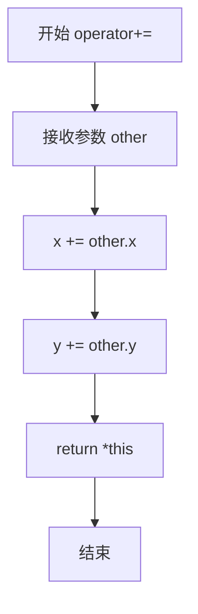

#### 带注释源码

```cpp
// XY 类的复合赋值加法运算符重载
// 参数: other - 要加到当前 XY 对象的另一个 XY 对象
// 返回: 对当前 XY 对象的引用，支持链式赋值
const XY& XY::operator+=(const XY& other)
{
    // 将 other 的 x 坐标加到当前对象的 x 坐标
    x += other.x;
    
    // 将 other 的 y 坐标加到当前对象的 y 坐标
    y += other.y;
    
    // 返回对当前对象的引用，允许链式操作如 a += b += c
    return *this;
}
```


### XY::operator-=

该方法定义了 `XY` 类的减法复合赋值运算符（`operator-=`）。它接受一个 `XY` 类型的常量引用作为参数，将其 x 和 y 分量从当前对象的对应分量中减去，并返回当前对象的引用，以支持连续赋值操作（例如 `a -= b -= c`）。

参数：

- `other`：`const XY&`，需要从当前对象中减去的 XY 对象。

返回值：`const XY&`，减法运算完成后的当前对象（引用）。

#### 流程图

```mermaid
flowchart TD
    A([Start]) --> B[Input: other (const XY&)]
    B --> C[x = x - other.x]
    C --> D[y = y - other.y]
    D --> E[Return *this]
    E --> F([End])
```

#### 带注释源码

```cpp
// XY 类的减法复合赋值运算符实现
const XY& XY::operator-=(const XY& other)
{
    // 将 other 的 x 分量从当前对象的 x 分量中减去
    x -= other.x;
    // 将 other 的 y 分量从当前对象的 y 分量中减去
    y -= other.y;
    // 返回当前对象的引用，允许链式操作
    return *this;
}
```


### `XY.operator+`

该函数是 `XY` 类的一个二元运算符重载，用于实现两个二维坐标点（向量）的加法运算。它将当前对象的 `x` 和 `y` 坐标分别与参数对象的对应坐标相加，并返回一个新的 `XY` 对象作为结果。

参数：

- `other`：`const XY&`，要加上的另一个 XY 坐标点（引用传递，避免拷贝）

返回值：`XY`，返回一个新的 XY 对象，其坐标为两个源坐标点对应坐标之和

#### 流程图

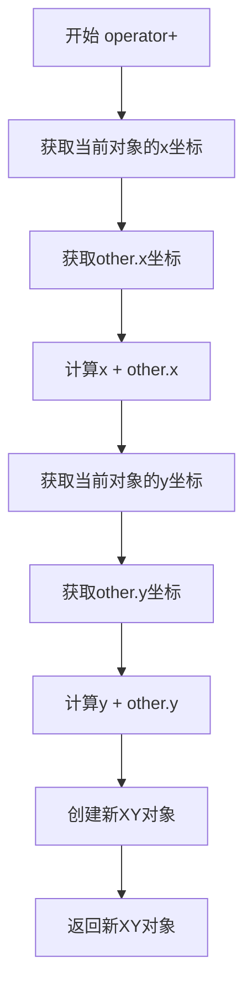

#### 带注释源码

```cpp
/**
 * @brief 二元运算符重载，实现两个XY坐标点的向量加法
 * 
 * 该函数将当前XY对象的x和y坐标与另一个XY对象的x和y坐标
 * 分别相加，返回一个新的XY对象。
 * 
 * @param other 要加上的另一个XY坐标点（常量引用）
 * @return XY 返回一个新的XY对象，其坐标为两个源坐标点对应坐标之和
 */
XY XY::operator+(const XY& other) const
{
    // 创建新的XY对象，x坐标为两个x坐标之和，y坐标为两个y坐标之和
    return XY(x + other.x, y + other.y);
}
```


### `XY.operator-`

该方法是 `XY` 类的减法运算符重载，用于计算两个二维坐标点之间的差值，返回一个新的 `XY` 对象。

参数：

- `other`：`const XY&`，要进行减法运算的另一个 XY 对象

返回值：`XY`，返回当前 XY 对象与另一个 XY 对象的差值（x 分量和 y 分量分别相减）

#### 流程图

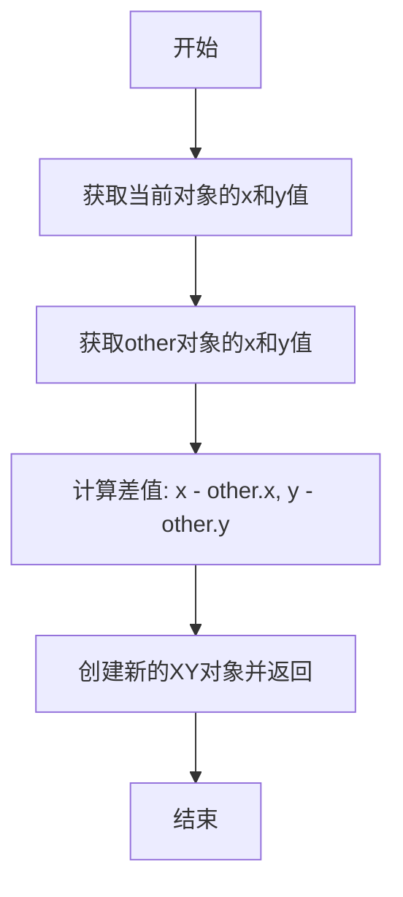

#### 带注释源码

```
XY XY::operator-(const XY& other) const
{
    // 返回一个新的XY对象，其x和y分量分别是当前对象与other对象对应分量的差值
    // 这实现了二维向量的减法运算
    return XY(x - other.x, y - other.y);
}
```


### XYZ::XYZ

该函数是XYZ类的构造函数，用于初始化三维坐标点（x, y, z）。

参数：

- `x_`：`const double&`，x坐标值
- `y_：`const double&`，y坐标值
- `z_：`const double&`，z坐标值

返回值：`无`（构造函数，创建XYZ对象）

#### 流程图

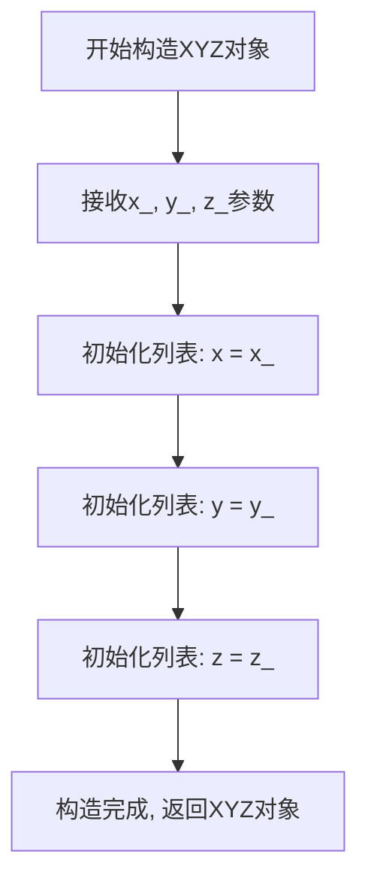

#### 带注释源码

```cpp
// XYZ类的构造函数定义
// 参数：
//   x_ - x坐标的常量引用
//   y_ - y坐标的常量引用
//   z_ - z坐标的常量引用
XYZ::XYZ(const double& x_, const double& y_, const double& z_)
    : x(x_), y(y_), z(z_)  // 使用初始化列表直接初始化成员变量
{}
```


### `XYZ.cross`

该方法是`XYZ`类的成员函数，用于计算三维向量的叉乘（cross product）。它接收一个`const XYZ&`类型的参数，返回一个`XYZ`类型的向量，表示当前向量与参数向量的叉乘结果。叉乘结果是一个垂直于原两向量的新向量。

参数：

- `other`：`const XYZ&`，要进行叉乘运算的另一个三维向量

返回值：`XYZ`，计算得到的叉乘结果向量

#### 流程图

```mermaid
flowchart TD
    A[开始 cross 方法] --> B[获取当前向量分量 x, y, z]
    B --> C[获取 other 向量的分量 other.x, other.y, other.z]
    C --> D[计算 result.x = y*other.z - z*other.y]
    D --> E[计算 result.y = z*other.x - x*other.z]
    E --> F[计算 result.z = x*other.y - y*other.x]
    F --> G[创建并返回新的 XYZ 对象]
    G --> H[结束]
```

#### 带注释源码

```cpp
/**
 * 计算三维向量的叉乘（Cross Product）
 * 
 * 叉乘公式：
 * result.x = y * other.z - z * other.y
 * result.y = z * other.x - x * other.z
 * result.z = x * other.y - y * other.x
 *
 * 叉乘的结果是一个垂直于原两向量的新向量，其方向由右手定则确定
 *
 * @param other 参与叉乘运算的另一个三维向量（const引用，避免拷贝）
 * @return XYZ 返回计算得到的叉乘结果向量
 */
XYZ XYZ::cross(const XYZ& other) const
{
    // 计算结果向量的各分量
    // x分量 = 当前向量的y分量 * other的z分量 - 当前向量的z分量 * other的y分量
    // y分量 = 当前向量的z分量 * other的x分量 - 当前向量的x分量 * other的z分量
    // z分量 = 当前向量的x分量 * other的y分量 - 当前向量的y分量 * other的x分量
    return XYZ(y*other.z - z*other.y,
               z*other.x - x*other.z,
               x*other.y - y*other.x);
}
```


### XYZ.dot

计算当前三维坐标点与另一个三维坐标点的点积（标量积），返回值为标量，表示两个向量在方向上的相似度。

参数：
- `other`：`const XYZ&`，参与点积计算的另一个三维坐标点

返回值：`double`，两个三维坐标点的点积结果（x₁×x₂ + y₁×y₂ + z₁×z₂）

#### 流程图

```mermaid
flowchart TD
    A[开始] --> B[获取当前点坐标 x, y, z]
    B --> C[获取参数点坐标 other.x, other.y, other.z]
    C --> D[计算分量乘积: x\*other.x + y\*other.y + z\*other.z]
    D --> E[返回点积结果]
    E --> F[结束]
```

#### 带注释源码

```cpp
/**
 * 计算三维向量的点积（标量积）
 * 
 * 点积定义：a · b = |a| × |b| × cos(θ)
 * 在笛卡尔坐标系中：a · b = a.x × b.x + a.y × b.y + a.z × b.z
 * 
 * @param other 参与计算的另一个三维坐标点
 * @return double 两位坐标点的点积结果
 */
double XYZ::dot(const XYZ& other) const
{
    // 计算三个坐标轴方向上的分量乘积之和
    // x分量乘积 + y分量乘积 + z分量乘积
    return x*other.x + y*other.y + z*other.z;
}
```


### XYZ.operator-

该重载减法运算符用于计算两个三维坐标点（XYZ）的差值，返回一个新的XYZ对象，其各分量（x、y、z）为当前点与传入点对应分量之差。

参数：

- `other`：`const XYZ&`，要减去的另一个三维坐标点

返回值：`XYZ`，返回两个三维坐标点相减后的结果（即当前点的坐标减去other对应坐标分量得到的新XYZ对象）

#### 流程图

```mermaid
flowchart TD
    A[开始执行 operator-] --> B{输入验证}
    B --> C[计算 x 分量差: x - other.x]
    C --> D[计算 y 分量差: y - other.y]
    D --> E[计算 z 分量差: z - other.z]
    E --> F[构造并返回新XYZ对象]
    F --> G[结束]
```

#### 带注释源码

```cpp
// 重载减法运算符，计算两个XYZ对象的差值
// 参数: other - 要减去的另一个XYZ对象
// 返回值: 返回一个新的XYZ对象，其各分量为当前对象与other对应分量之差
XYZ XYZ::operator-(const XYZ& other) const
{
    // 返回一个新的XYZ对象，计算方式为：
    // new_x = this.x - other.x
    // new_y = this.y - other.y
    // new_z = this.z - other.z
    return XYZ(x - other.x, y - other.y, z - other.z);
}
```


### `BoundingBox.BoundingBox()`

这是`BoundingBox`类的默认构造函数，用于初始化一个空的边界框对象。该构造函数将`empty`标志设置为`true`，并将`lower`和`upper`坐标初始化为原点`(0.0, 0.0)`，表示边界框初始时不包含任何有效点。

参数：无

返回值：无（构造函数，不返回任何值）

#### 流程图

```mermaid
flowchart TD
    A[开始 BoundingBox 构造] --> B[设置 empty = true]
    B --> C[初始化 lower = XY(0.0, 0.0)]
    C --> D[初始化 upper = XY(0.0, 0.0)]
    D --> E[结束构造]
```

#### 带注释源码

```cpp
// BoundingBox类的默认构造函数
// 功能：创建一个空的边界框，初始时不包含任何点
BoundingBox::BoundingBox()
    : empty(true),        // 标记边界框为空，表示尚未添加任何点
      lower(0.0, 0.0),     // 初始化下边界点为原点
      upper(0.0, 0.0)      // 初始化上边界点为原点
{}
```


### `BoundingBox.add`

该方法将二维坐标点添加到边界框中，根据点的坐标更新边界框的最小点(lower)和最大点(upper)，实现边界框的动态扩展。

参数：

- `point`：`const XY&`，要添加到边界框的二维坐标点

返回值：`void`，无返回值

#### 流程图

```mermaid
flowchart TD
    A[开始 add 方法] --> B{empty == true?}
    B -->|是| C[设置 empty = false]
    C --> D[lower = upper = point]
    D --> H[结束]
    B -->|否| E{point.x < lower.x?}
    E -->|是| F[lower.x = point.x]
    F --> G
    E -->|否| I{point.x > upper.x?}
    I -->|是| J[upper.x = point.x]
    J --> G
    I -->|否| G
    G --> K{point.y < lower.y?}
    K -->|是| L[lower.y = point.y]
    L --> M
    K -->|否| N{point.y > upper.y?}
    N -->|是| O[upper.y = point.y]
    O --> M
    N -->|否| M[结束]
```

#### 带注释源码

```cpp
void BoundingBox::add(const XY& point)
{
    // 如果边界框为空（尚未添加任何点）
    if (empty) {
        // 将边界框标记为非空
        empty = false;
        // 初始化 lower 和 upper 为当前点
        // 此时边界框仅包含这一个点
        lower = upper = point;
    } else {
        // 边界框非空，需要更新边界
        // 检查并更新 x 坐标的边界
        if (point.x < lower.x) {
            // 点的 x 坐标小于当前最小 x，更新 lower.x
            lower.x = point.x;
        }
        else if (point.x > upper.x) {
            // 点的 x 坐标大于当前最大 x，更新 upper.x
            upper.x = point.x;
        }

        // 检查并更新 y 坐标的边界
        if (point.y < lower.y) {
            // 点的 y 坐标小于当前最小 y，更新 lower.y
            lower.y = point.y;
        }
        else if (point.y > upper.y) {
            // 点的 y 坐标大于当前最大 y，更新 upper.y
            upper.y = point.y;
        }
    }
}
```


### `BoundingBox::expand`

该方法用于根据给定的偏移量扩展当前包围盒的边界。如果包围盒为空（未初始化），则不执行任何操作；否则，它会将包围盒的下界（lower）向相反方向移动，将上界（upper）向正方向移动，从而扩大包围盒的覆盖范围。

参数：

-  `delta`：`const XY&`，表示在 x 和 y 方向上扩展包围盒的偏移量。

返回值：`void`，无返回值。该方法直接修改对象内部状态。

#### 流程图

```mermaid
flowchart TD
    A([开始]) --> B{!empty}
    B -- True --> C[lower -= delta]
    C --> D[upper += delta]
    D --> E([结束])
    B -- False --> E
```

#### 带注释源码

```cpp
// 扩展包围盒的边界
// delta: 用于扩展包围盒的 XY 向量
void BoundingBox::expand(const XY& delta)
{
    // 仅当包围盒非空时执行扩展操作
    if (!empty) {
        // 将下界向相反方向移动（例如，如果 delta 为 (1,1)，则 lower 变为 lower - (1,1)）
        lower -= delta;
        // 将上界向正方向移动（例如，如果 delta 为 (1,1)，则 upper 变为 upper + (1,1)）
        upper += delta;
    }
}
```


### ContourLine.ContourLine()

这是 ContourLine 类的默认构造函数，使用默认方式初始化基类 `std::vector<XY>`，创建一个空的轮廓线对象。

参数：
- 无

返回值：
- 无（构造函数，用于初始化对象，不返回值）

#### 流程图

```mermaid
graph TD
    A[开始] --> B[调用基类 std::vector<XY> 的默认构造函数]
    B --> C[结束]
```

#### 带注释源码

```cpp
ContourLine::ContourLine()
    : std::vector<XY>()
{}
```


### `ContourLine.push_back`

该方法向轮廓线添加一个点，但会过滤掉与上一个点重复的点，以避免轮廓线中存在连续的重复顶点。

参数：

-  `point`：`const XY&`，要添加到轮廓线的二维坐标点

返回值：`void`，无返回值

#### 流程图

```mermaid
flowchart TD
    A[开始 push_back] --> B{容器是否为空?}
    B -->|是| C[直接调用 vector::push_back]
    B -->|否| D{point != back()?}
    D -->|是| C
    D -->|否| E[不添加 point, 结束]
    C --> F[调用 std::vector<XY>::push_back]
    F --> E
```

#### 带注释源码

```cpp
/**
 * @brief 向轮廓线添加一个点
 * 
 * 该方法重写了基类的 push_back，添加了去重逻辑：
 * 只有当容器为空，或者新点与最后一个点不同时，才真正添加点。
 * 这样可以避免轮廓线中出现连续的重复顶点。
 * 
 * @param point 要添加的二维坐标点 (const XY&)
 * @return void 无返回值
 */
void ContourLine::push_back(const XY& point)
{
    // 只有在以下两种情况之一时才添加点：
    // 1. 容器为空（这是第一个点）
    // 2. 新点与容器中最后一个点不同（避免重复点）
    if (empty() || point != back())
        std::vector<XY>::push_back(point);  // 调用基类的 push_back
}
```


### `ContourLine.write`

该方法将轮廓线的点数据以可读格式输出到标准输出流，首先打印轮廓线的点数量，然后逐个打印所有点的坐标信息。

参数：无

返回值：`void`，无返回值，仅将轮廓线信息打印到标准输出

#### 流程图

```mermaid
flowchart TD
    A[开始] --> B[输出标题: "ContourLine of " + 点数 + " points:"]
    B --> C{遍历 *this 中的每个点}
    C -->|是| D[输出空格 + 当前点 it]
    D --> C
    C -->|否| E[输出换行符 endl]
    E --> F[结束]
```

#### 带注释源码

```cpp
void ContourLine::write() const
{
    // 使用 std::cout 输出标题信息，包含轮廓线的点数量
    // size() 继承自 std::vector<XY>，返回轮廓线中点的数量
    std::cout << "ContourLine of " << size() << " points:";
    
    // 遍历轮廓线中的所有点
    // *this 被解引用为 std::vector<XY>，可以使用范围 for 循环
    for (const auto & it : *this) {
        // 输出空格分隔符，然后输出当前点的坐标
        // XY 重载了 operator<<，因此可以直接输出
        std::cout << ' ' << it;
    }
    
    // 输出换行符，结束当前轮廓线的输出
    std::cout << std::endl;
}
```


### Triangulation::Triangulation

该构造函数是 `Triangulation` 类的构造函数，用于初始化三角剖分对象。它接收坐标数组、三角形索引数组以及可选的掩码、边和邻居数组，并对输入参数进行有效性验证，同时根据需要校正三角形方向。

参数：

- `x`：`const CoordinateArray&`，x 坐标数组
- `y`：`const CoordinateArray&`，y 坐标数组
- `triangles`：`const TriangleArray&`，三角形索引数组，形状为 (?,3)
- `mask`：`const MaskArray&`，可选的掩码数组，用于标记被掩码的三角形
- `edges`：`const EdgeArray&`，可选的边数组，形状为 (?,2)
- `neighbors`：`const NeighborArray&`，可选的邻居数组，与 triangles 形状相同
- `correct_triangle_orientations`：`bool`，是否校正三角形方向为逆时针

返回值：无（构造函数）

#### 流程图

```mermaid
flowchart TD
    A[开始 Triangulation 构造函数] --> B[初始化成员变量: _x, _y, _triangles, _mask, _edges, _neighbors]
    B --> C{验证 x 和 y}
    C -->|不是1D数组或长度不同| D[抛出 invalid_argument 异常]
    C -->|验证通过| E{验证 triangles}
    E -->|不是2D数组或列数不为3| F[抛出 invalid_argument 异常]
    E -->|验证通过| G{验证 mask}
    G -->|mask 存在但维度或长度不对| H[抛出 invalid_argument 异常]
    G -->|验证通过| I{验证 edges}
    I -->|edges 存在但维度或列数不对| J[抛出 invalid_argument 异常]
    I -->|验证通过| K{验证 neighbors}
    K -->|neighbors 存在但形状不对| L[抛出 invalid_argument 异常]
    K -->|验证通过| M{correct_triangle_orientations 为 true?}
    M -->|是| N[调用 correct_triangles 校正三角形方向]
    M -->|否| O[结束]
    N --> O
```

#### 带注释源码

```cpp
/**
 * Triangulation 类的构造函数
 * 
 * @param x 坐标数组（x 坐标）
 * @param y 坐标数组（y 坐标）
 * @param triangles 三角形索引数组，形状为 (?, 3)
 * @param mask 可选的掩码数组，用于标记被掩码的三角形
 * @param edges 可选的边数组，形状为 (?, 2)
 * @param neighbors 可选的邻居数组，与 triangles 形状相同
 * @param correct_triangle_orientations 是否校正三角形方向为逆时针
 */
Triangulation::Triangulation(const CoordinateArray& x,
                             const CoordinateArray& y,
                             const TriangleArray& triangles,
                             const MaskArray& mask,
                             const EdgeArray& edges,
                             const NeighborArray& neighbors,
                             bool correct_triangle_orientations)
    : _x(x),                  // 初始化 x 坐标成员变量
      _y(y),                  // 初始化 y 坐标成员变量
      _triangles(triangles), // 初始化三角形索引成员变量
      _mask(mask),            // 初始化掩码成员变量
      _edges(edges),          // 初始化边成员变量
      _neighbors(neighbors)   // 初始化邻居成员变量
{
    // 验证 x 和 y 必须是 1D 数组且长度相同
    if (_x.ndim() != 1 || _y.ndim() != 1 || _x.shape(0) != _y.shape(0))
        throw std::invalid_argument("x and y must be 1D arrays of the same length");

    // 验证 triangles 必须是 2D 数组且形状为 (?,3)
    if (_triangles.ndim() != 2 || _triangles.shape(1) != 3)
        throw std::invalid_argument("triangles must be a 2D array of shape (?,3)");

    // 验证可选的 mask（如果提供）
    if (_mask.size() > 0 &&
        (_mask.ndim() != 1 || _mask.shape(0) != _triangles.shape(0)))
        throw std::invalid_argument(
            "mask must be a 1D array with the same length as the triangles array");

    // 验证可选的 edges（如果提供）
    if (_edges.size() > 0 &&
        (_edges.ndim() != 2 || _edges.shape(1) != 2))
        throw std::invalid_argument("edges must be a 2D array with shape (?,2)");

    // 验证可选的 neighbors（如果提供）
    if (_neighbors.size() > 0 &&
        (_neighbors.ndim() != 2 || _neighbors.shape() != _triangles.shape()))
        throw std::invalid_argument(
            "neighbors must be a 2D array with the same shape as the triangles array");

    // 如果需要校正三角形方向，则调用校正方法
    if (correct_triangle_orientations)
        correct_triangles();
}
```


### `Triangulation.calculate_boundaries`

该方法用于计算三角剖分的边界。它通过检查所有三角形的边，找出没有相邻三角形的边（即边界边），然后沿边界遍历并构建完整的边界环，同时初始化 `_tri_edge_to_boundary_map` 以便后续快速查询边所属的边界。

参数：无

返回值：`void`，无返回值。该方法将计算结果存储在类的成员变量 `_boundaries` 和 `_tri_edge_to_boundary_map` 中。

#### 流程图

```mermaid
flowchart TD
    A[开始 calculate_boundaries] --> B[调用 get_neighbors 确保邻居数据已创建]
    B --> C[创建空边界边集合 boundary_edges]
    C --> D[遍历所有三角形 tri 从 0 到 ntri-1]
    D --> E{三角形 tri 是否被掩码?}
    E -->|是| D
    E -->|否| F[遍历三角形的三条边 edge 从 0 到 2]
    F --> G{该边是否有邻居三角形?}
    G -->|是| F
    G -->|否| H[将该边界边 TriEdge 加入 boundary_edges]
    H --> F
    F --> D
    D --> I{boundary_edges 是否为空?}
    I -->|是| J[结束]
    I -->|否| K[从 boundary_edges 取第一条边作为新边界起点]
    K --> L[创建新边界 boundary 并加入 _boundaries]
    L --> M[将当前边加入 boundary]
    M --> N[从 boundary_edges 删除该边]
    N --> O[更新 _tri_edge_to_boundary_map]
    O --> P[移动到当前三角形的下一条边: edge = (edge+1) % 3]
    P --> Q[获取该边的起点索引 point]
    Q --> R{当前边是否有邻居三角形?}
    R -->|是| S[移动到邻居三角形 tri = get_neighbor]
    S --> T[在邻居三角形中查找包含 point 的边]
    T --> R
    R -->|否| U{当前边是否回到边界起点?}
    U -->|是| I
    U -->|否| V[在 boundary_edges 中查找当前边]
    V --> M
```

#### 带注释源码

```cpp
void Triangulation::calculate_boundaries()
{
    // 确保邻居信息已计算（如果尚未计算，则会自动计算）
    get_neighbors();  // Ensure _neighbors has been created.

    // 创建所有边界边的集合。边界边是指没有相邻三角形的边。
    // 使用 std::set 以便高效查找和删除
    typedef std::set<TriEdge> BoundaryEdges;
    BoundaryEdges boundary_edges;
    
    // 遍历所有三角形
    for (int tri = 0; tri < get_ntri(); ++tri) {
        // 只处理未被掩码的三角形
        if (!is_masked(tri)) {
            // 检查三角形的每一条边
            for (int edge = 0; edge < 3; ++edge) {
                // 如果该边没有邻居三角形（-1 表示无邻居），则是边界边
                if (get_neighbor(tri, edge) == -1) {
                    boundary_edges.insert(TriEdge(tri, edge));
                }
            }
        }
    }

    // 从任意一条边界边开始，沿着边界遍历直到回到起点，
    // 同时从 boundary_edges 中删除已使用的边。
    // 同时初始化 _tri_edge_to_boundary_map 用于后续查询。
    while (!boundary_edges.empty()) {
        // 开始新的边界
        auto it = boundary_edges.cbegin();
        int tri = it->tri;
        int edge = it->edge;
        // 创建新边界并添加到 _boundaries 列表
        Boundary& boundary = _boundaries.emplace_back();

        while (true) {
            // 将当前边添加到边界
            boundary.emplace_back(tri, edge);
            // 从边界边集合中删除该边
            boundary_edges.erase(it);
            // 更新映射：记录该边属于哪个边界及边界中的索引
            _tri_edge_to_boundary_map[TriEdge(tri, edge)] =
                BoundaryEdge(_boundaries.size()-1, boundary.size()-1);

            // 移动到当前三角形的下一条边（顺时针方向）
            edge = (edge+1) % 3;

            // 找到该边界边的起点索引
            int point = get_triangle_point(tri, edge);

            // 通过遍历邻居来找到下一条边界边（即没有邻居的边）
            while (get_neighbor(tri, edge) != -1) {
                tri = get_neighbor(tri, edge);
                edge = get_edge_in_triangle(tri, point);
            }

            // 检查是否回到该边界的起点
            if (TriEdge(tri,edge) == boundary.front())
                break;  // 已回到边界起点，完成该边界
            else
                // 在边界边集合中查找当前边
                it = boundary_edges.find(TriEdge(tri, edge));
        }
    }
}
```


### `Triangulation.calculate_edges`

该方法用于计算三角剖分中的所有唯一边。它遍历所有非掩码三角形，提取每条边的端点索引（确保起点索引小于终点索引以规范化边），使用std::set去重，最后将结果转换为Python可用的边数组。

参数：无

返回值：`void`，结果存储在成员变量`_edges`中

#### 流程图

```mermaid
flowchart TD
    A[开始 calculate_edges] --> B{assert: 检查 _edges 为空}
    B --> C[创建 EdgeSet]
    C --> D[遍历所有三角形 tri = 0 到 ntri-1]
    D --> E{三角形 tri 未掩码?}
    E -->|是| F[遍历边 edge = 0 到 2]
    E -->|否| G[继续下一个三角形]
    F --> H[获取边的起点 start]
    F --> I[获取边的终点 end]
    H --> J{start > end?}
    J -->|是| K[规范化为 Edge(end, start)]
    J -->|否| L[规范化为 Edge(start, end)]
    K --> M[插入边到 EdgeSet]
    L --> M
    M --> N{还有更多边?}
    N -->|是| F
    N -->|否| O{还有更多三角形?}
    O -->|是| D
    O -->|否| P[创建 Python 边数组 _edges]
    P --> Q[遍历 EdgeSet]
    Q --> R[将边数据写入 _edges 数组]
    R --> S[结束]
    G --> O
```

#### 带注释源码

```cpp
void Triangulation::calculate_edges()
{
    // 断言检查：确保 _edges 数组当前为空，避免重复计算
    // 如果已存在边则抛出断言错误（调试模式下）
    assert(!has_edges() && "Expected empty edges array");

    // 定义边集合类型：使用 std::set 自动去重和排序
    // Edge 是一个包含两个点索引的结构体/类
    typedef std::set<Edge> EdgeSet;
    EdgeSet edge_set;

    // 遍历所有三角形
    for (int tri = 0; tri < get_ntri(); ++tri) {
        // 仅处理非掩码的三角形
        if (!is_masked(tri)) {
            // 遍历三角形的3条边
            for (int edge = 0; edge < 3; edge++) {
                // 获取当前边的起点索引
                int start = get_triangle_point(tri, edge);
                // 获取当前边的终点索引（下一顶点，模3处理循环）
                int end   = get_triangle_point(tri, (edge+1)%3);
                
                // 规范化边：确保 start < end，以避免重复边
                // 例如：边(3,1)规范化为(1,3)，边(2,5)保持为(2,5)
                edge_set.insert(start > end ? Edge(start,end) : Edge(end,start));
            }
        }
    }

    // 将边集合转换为 Python 边数组
    // 计算维度：边数 x 2（每条边两个点索引）
    py::ssize_t dims[2] = {static_cast<py::ssize_t>(edge_set.size()), 2};
    // 创建 EdgeArray（NumPy 数组）
    _edges = EdgeArray(dims);
    // 获取可写的数据指针
    auto edges = _edges.mutable_data();

    // 遍历边集合，将边数据写入数组
    int i = 0;
    for (const auto & it : edge_set) {
        edges[i++] = it.start;  // 写入起点索引
        edges[i++] = it.end;    // 写入终点索引
    }
}
```


### `Triangulation::calculate_neighbors`

该方法用于计算三角剖分中每个三角形的邻居三角形。它通过遍历所有三角形的边，使用映射（map）查找对应的邻居边，当找到匹配的反向边时，将两个三角形设置为邻居关系。未找到邻居的边即为边界边，留待其他方法处理。

参数：
- 该方法无显式参数（隐式依赖类的成员变量 `_triangles` 和 `_mask`）

返回值：`void`，无返回值，结果存储在成员变量 `_neighbors` 中

#### 流程图

```mermaid
flowchart TD
    A[开始 calculate_neighbors] --> B{检查 _neighbors 是否为空}
    B -->|是| C[创建 _neighbors 数组 shape为ntri×3]
    C --> D[初始化所有元素为 -1]
    D --> E[创建空 Edge 到 TriEdge 的映射 edge_to_tri_edge_map]
    E --> F[遍历每个三角形 tri]
    F --> G{tri 是否被屏蔽?}
    G -->|是| H[跳过该三角形]
    G -->|否| I[遍历三角形的3条边 edge]
    I --> J[获取边的起点 start 和终点 end]
    J --> K{在映射中查找反向边 Edge(end, start)}
    K -->|未找到| L[将当前边 Edge(start, end) 加入映射]
    L --> I
    K -->|找到| M[设置 neighbors 数组中对应的两个邻居关系]
    M --> N[从映射中删除该反向边]
    N --> I
    H --> F
    F --> O[结束]
    
    style A fill:#f9f,stroke:#333
    style O fill:#9f9,stroke:#333
```

#### 带注释源码

```cpp
/* 负责计算三角剖分中每个三角形的邻居三角形
 * 邻居关系存储在 _neighbors 数组中，shape 为 (ntri, 3)
 * 每行对应一个三角形的3条边各自的邻居三角形索引，-1表示无边（即边界）
 */
void Triangulation::calculate_neighbors()
{
    // 断言确保_neighbors数组初始为空，避免重复计算
    assert(!has_neighbors() && "Expected empty neighbors array");

    // 创建并初始化_neighbors数组
    // 维度为(三角形数量, 3)，每行对应一个三角形的3条边
    py::ssize_t dims[2] = {get_ntri(), 3};
    _neighbors = NeighborArray(dims);
    auto* neighbors = _neighbors.mutable_data();

    int tri, edge;
    // 将所有邻居初始化为-1，表示暂无邻居（边界情况）
    std::fill(neighbors, neighbors+3*get_ntri(), -1);

    // 使用map存储边到TriEdge的映射，用于查找邻居边
    // 遍历所有三角形的边，将边(start, end)存入map
    // 如果发现反向边(end, start)已存在，则找到了一对邻居
    typedef std::map<Edge, TriEdge> EdgeToTriEdgeMap;
    EdgeToTriEdgeMap edge_to_tri_edge_map;
    
    // 遍历每个未屏蔽的三角形
    for (tri = 0; tri < get_ntri(); ++tri) {
        if (!is_masked(tri)) {
            // 遍历三角形的3条边
            for (edge = 0; edge < 3; ++edge) {
                // 获取当前边的起点和终点索引
                int start = get_triangle_point(tri, edge);
                int end   = get_triangle_point(tri, (edge+1)%3);
                
                // 查找是否存在反向边（即当前边的邻居边）
                const auto it = edge_to_tri_edge_map.find(Edge(end, start));
                if (it == edge_to_tri_edge_map.end()) {
                    // 未找到反向边，将当前边加入map
                    // 键为边(start, end)，值为该边所在的三角形和边索引
                    edge_to_tri_edge_map[Edge(start,end)] = TriEdge(tri,edge);
                } else {
                    // 找到反向边，设置两个三角形为邻居关系
                    // 当前三角形的edge邻居是it->second.tri
                    neighbors[3*tri + edge] = it->second.tri;
                    // 邻居三角形的对应边也设置回当前三角形
                    neighbors[3*it->second.tri + it->second.edge] = tri;
                    // 从map中移除已配对的边
                    edge_to_tri_edge_map.erase(it);
                }
            }
        }
    }

    // 注意：map中剩余的边对应三角形的边界边
    // 边界计算在calculate_boundaries()方法中单独处理
}
```


### `Triangulation.calculate_plane_coefficients`

该方法根据三角形的(x, y, z)坐标计算每个三角形的平面系数，返回一个二维数组，其中每行表示一个三角形的平面方程系数（a, b, c），满足 z = a*x + b*y + c。对于被掩盖的三角形或共线点的情况，系数设为0或使用伪逆处理。

参数：

- `z`：`const CoordinateArray&`，z坐标的一维数组，必须与三角剖分的x、y坐标数组长度相同

返回值：`Triangulation::TwoCoordinateArray`，形状为(ntri, 3)的二维数组，每行包含平面方程的三个系数

#### 流程图

```mermaid
flowchart TD
    A[开始 calculate_plane_coefficients] --> B{验证输入}
    B -->|z维度!=1或长度不匹配| C[抛出invalid_argument异常]
    B -->|验证通过| D[创建planes_array数组]
    D --> E[遍历每个三角形]
    E --> F{三角形是否被掩盖?}
    F -->|是| G[设置平面系数为0.0]
    F -->|否| H[获取三角形的三个顶点坐标]
    H --> I[计算两个边向量side01和side02]
    I --> J[计算法向量normal = cross]
    J --> K{法向量的z分量为0?}
    K -->|是| L[使用Moore-Penrose伪逆计算系数]
    K -->|否| M[直接计算平面系数]
    L --> N[设置平面系数到数组]
    M --> N
    G --> N
    N --> O{还有更多三角形?}
    O -->|是| E
    O -->|否| P[返回planes_array]
    P --> Q[结束]
```

#### 带注释源码

```
Triangulation::TwoCoordinateArray Triangulation::calculate_plane_coefficients(
    const CoordinateArray& z)
{
    // 验证输入：z必须是一维数组且长度与x、y坐标数组相同
    if (z.ndim() != 1 || z.shape(0) != _x.shape(0))
        throw std::invalid_argument(
            "z must be a 1D array with the same length as the triangulation x and y arrays");

    // 创建形状为(ntri, 3)的输出数组，每个三角形3个系数
    int dims[2] = {get_ntri(), 3};
    Triangulation::TwoCoordinateArray planes_array(dims);
    auto planes = planes_array.mutable_unchecked<2>();
    auto triangles = _triangles.unchecked<2>();
    auto x = _x.unchecked<1>();
    auto y = _y.unchecked<1>();
    auto z_ptr = z.unchecked<1>();

    int point;
    // 遍历每个三角形
    for (int tri = 0; tri < get_ntri(); ++tri) {
        // 如果三角形被掩盖，系数设为0
        if (is_masked(tri)) {
            planes(tri, 0) = 0.0;
            planes(tri, 1) = 0.0;
            planes(tri, 2) = 0.0;
        }
        else {
            // 平面方程：r_x*normal_x + r_y*normal_y + r_z*normal_z = p
            // 重新整理为：r_z = (-normal_x/normal_z)*r_x + (-normal_y/normal_z)*r_y + p/normal_z
            // 即：z = a*x + b*y + c，其中a=-normal_x/normal_z, b=-normal_y/normal_z, c=p/normal_z
            
            // 获取三角形的第一个顶点作为参考点
            point = triangles(tri, 0);
            XYZ point0(x(point), y(point), z_ptr(point));
            
            // 获取第二个顶点，计算从point0到该点的边向量
            point = triangles(tri, 1);
            XYZ side01 = XYZ(x(point), y(point), z_ptr(point)) - point0;
            
            // 获取第三个顶点，计算从point0到该点的边向量
            point = triangles(tri, 2);
            XYZ side02 = XYZ(x(point), y(point), z_ptr(point)) - point0;

            // 通过叉积计算法向量
            XYZ normal = side01.cross(side02);

            // 检查法向量是否在x-y平面内（即三点共线）
            if (normal.z == 0.0) {
                // 法向量在x-y平面内，说明三角形由共线点组成
                // 为避免除以零，使用Moore-Penrose伪逆
                double sum2 = (side01.x*side01.x + side01.y*side01.y +
                               side02.x*side02.x + side02.y*side02.y);
                double a = (side01.x*side01.z + side02.x*side02.z) / sum2;
                double b = (side01.y*side01.z + side02.y*side02.z) / sum2;
                planes(tri, 0) = a;
                planes(tri, 1) = b;
                planes(tri, 2) = point0.z - a*point0.x - b*point0.y;
            }
            else {
                // 正常情况：直接计算平面系数
                planes(tri, 0) = -normal.x / normal.z;           // x系数
                planes(tri, 1) = -normal.y / normal.z;           // y系数
                planes(tri, 2) = normal.dot(point0) / normal.z;  // 常数项
            }
        }
    }

    return planes_array;
}
```


### `Triangulation::correct_triangles()`

该函数用于纠正三角形的顶点顺序，确保所有三角形的顶点按照逆时针方向排列（通过计算叉积判断方向，若为顺时针则交换顶点顺序），以符合数学上的标准约定和后续计算的需求。

参数：无（使用类的成员变量 `_triangles` 和 `_neighbors`）

返回值：`void`，无返回值

#### 流程图

```mermaid
flowchart TD
    A[开始 correct_triangles] --> B[获取 _triangles 可变数据指针]
    B --> C[获取 _neighbors 可变数据指针]
    C --> D[初始化循环: tri = 0 到 ntri-1]
    D --> E[获取三角形第0个顶点坐标 point0]
    E --> F[获取三角形第1个顶点坐标 point1]
    F --> G[获取三角形第2个顶点坐标 point2]
    G --> H{计算叉积<br/>point1-point0 × point2-point0 < 0?}
    H -->|是| I[交换顶点1和顶点2顺序]
    H -->|否| J{has_neighbors?}
    I --> J
    J -->|是| K[交换邻居数组中对应边]
    J -->|否| L[继续下一三角形]
    K --> L
    L --> M{tri < ntri?}
    M -->|是| E
    M -->|否| N[结束]
```

#### 带注释源码

```cpp
void Triangulation::correct_triangles()
{
    // 获取三角形数组的可变数据指针，用于后续修改
    auto triangles = _triangles.mutable_data();
    // 获取邻居数组的可变数据指针，用于同步更新邻居信息
    auto neighbors = _neighbors.mutable_data();

    // 遍历所有三角形
    for (int tri = 0; tri < get_ntri(); ++tri) {
        // 获取三角形的三个顶点坐标
        XY point0 = get_point_coords(triangles[3*tri]);       // 第一个顶点坐标
        XY point1 = get_point_coords(triangles[3*tri+1]);     // 第二个顶点坐标
        XY point2 = get_point_coords(triangles[3*tri+2]);     // 第三个顶点坐标
        
        // 计算向量 (point1-point0) 和 (point2-point0) 的 z 轴叉积
        // 叉积 > 0: 逆时针方向 (正确)
        // 叉积 < 0: 顺时针方向 (需要纠正)
        // 叉积 = 0: 三点共线 (退化情况)
        if ( (point1 - point0).cross_z(point2 - point0) < 0.0) {
            // 三角形顶点是顺时针排列，因此将它们改为逆时针
            // 通过交换第二个和第三个顶点的索引实现
            std::swap(triangles[3*tri+1], triangles[3*tri+2]);
            
            // 如果存在邻居信息，也需要同步更新邻居数组中对应边的顺序
            // 以保持三角形和邻居关系的一致性
            if (has_neighbors())
                std::swap(neighbors[3*tri+1], neighbors[3*tri+2]);
        }
    }
}
```


### `Triangulation.get_boundaries`

获取三角剖分的边界。如果边界尚未计算，则先调用`calculate_boundaries()`方法计算边界，然后返回边界的常量引用。

参数：

- （无参数）

返回值：`const Triangulation::Boundaries&`，返回三角剖分的边界集合的常量引用

#### 流程图

```mermaid
flowchart TD
    A[开始 get_boundaries] --> B{_boundaries 是否为空?}
    B -->|是| C[调用 calculate_boundaries 计算边界]
    B -->|否| D[跳过计算]
    C --> E[返回 _boundaries 引用]
    D --> E
    E[结束]
    
    subgraph calculate_boundaries
    F[获取邻居信息] --> G[创建边界边集合]
    G --> H{遍历所有未屏蔽的三角形}
    H --> I{遍历三角形的3条边}
    I --> J{该边是否有邻居?}
    J -->|无邻居| K[将该边加入边界边集合]
    J -->|有邻居| L[跳过]
    K --> I
    L --> I
    I --> M{所有边遍历完?}
    M -->|否| I
    M -->|是| H
    H --> N{边界边集合为空?}
    N -->|否| O[从边界边开始追踪完整边界环]
    O --> P[更新 _tri_edge_to_boundary_map]
    O --> N
    N -->|是| Q[返回]
    end
```

#### 带注释源码

```cpp
/**
 * @brief 获取三角剖分的边界
 * 
 * 这是一个延迟加载的 getter 方法。如果边界尚未计算，
 * 则自动调用 calculate_boundaries() 方法进行计算。
 * 返回边界集合的常量引用，避免不必要的拷贝。
 * 
 * @return const Triangulation::Boundaries& 边界集合的常量引用
 *         - Boundaries 是 std::vector<Boundary> 的别名
 *         - Boundary 是 std::vector<TriEdge> 的别名
 *         - TriEdge 包含 tri（三角形索引）和 edge（边索引，0-2）
 */
const Triangulation::Boundaries& Triangulation::get_boundaries() const
{
    // 检查边界是否已计算
    if (_boundaries.empty()) {
        // 需要使用 const_cast 来调用非 const 的 calculate_boundaries
        // 因为 get_boundaries 本身是 const 方法，但 calculate_boundaries
        // 会修改对象的成员变量（_boundaries 和 _tri_edge_to_boundary_map）
        const_cast<Triangulation*>(this)->calculate_boundaries();
    }
    // 返回边界的常量引用，避免拷贝
    return _boundaries;
}
```

#### 相关类型定义

```cpp
// TriEdge: 表示三角形的一条边
struct TriEdge {
    int tri;   // 三角形索引
    int edge;  // 边索引 (0, 1, 或 2)
};

// Boundary: 一个边界环，由多个 TriEdge 组成
// 实际上是 std::vector<TriEdge>

// Boundaries: 所有边界的集合
// 实际上是 std::vector<Boundary>

// BoundaryEdge: 边界边在边界中的位置信息
struct BoundaryEdge {
    int boundary;  // 边界索引
    int edge;      // 边在边界中的索引
};
```

#### 内部实现说明

`calculate_boundaries()` 方法的详细逻辑：

1. **第一步：识别边界边**
   - 遍历所有未屏蔽的三角形
   - 对每条边检查是否有邻居三角形
   - 没有邻居的边即为边界边，加入 `boundary_edges` 集合

2. **第二步：追踪边界环**
   - 从任意边界边开始
   - 沿着边界遍历：移动到下一条边（在同一个三角形中），然后跨越到相邻三角形，直到回到起点
   - 每条边只能属于一个边界环
   - 过程中维护 `_tri_edge_to_boundary_map` 哈希表，记录每个 TriEdge 对应的边界信息


### Triangulation::get_boundary_edge

根据给定的三角形边（TriEdge）查询其所属的边界（Boundary）信息。该方法通过内部维护的映射表，快速定位任意三角形边所在的闭合边界环索引及其在该环中的边索引。

参数：

-  `triEdge`：`const TriEdge&`，待查询的三角形边，包含三角形索引和边在三角形中的索引。
-  `boundary`：`int&`，输出参数，用于返回该三角形边所属的边界环的索引（从0开始）。
-  `edge`：`int&`，输出参数，用于返回该三角形边在所属边界环中的位置索引。

返回值：`void`，无直接返回值，结果通过引用参数 `boundary` 和 `edge` 输出。

#### 流程图

```mermaid
flowchart TD
    Start([Start get_boundary_edge]) --> CallGetBoundaries[调用 get_boundaries 确保 Map 创建]
    CallGetBoundaries --> FindMap[在 _tri_edge_to_boundary_map 中查找 triEdge]
    FindMap --> CheckFound{是否找到?}
    CheckFound -->|未找到| AssertFail[断言失败: TriEdge is not on a boundary]
    CheckFound -->|找到| ExtractData[提取 it->second 中的 boundary 和 edge]
    ExtractData --> AssignBoundary[boundary = it->second.boundary]
    AssignBoundary --> AssignEdge[edge = it->second.edge]
    AssignEdge --> End([End])
    AssertFail --> End
```

#### 带注释源码

```cpp
void Triangulation::get_boundary_edge(const TriEdge& triEdge,
                                      int& boundary,
                                      int& edge) const
{
    // 1. 确保边界数据已计算。在首次调用时，会构建 _tri_edge_to_boundary_map，
    //    该 Map 存储了每条边界边 (TriEdge) 到其边界信息 (BoundaryEdge) 的映射。
    get_boundaries();  

    // 2. 在 Map 中查找输入的 TriEdge。
    const auto it = _tri_edge_to_boundary_map.find(triEdge);
    
    // 3. 断言检查：确保该 TriEdge 确实是边界边。如果不是（例如它是内部边），则报错。
    assert(it != _tri_edge_to_boundary_map.end() && "TriEdge is not on a boundary");
    
    // 4. 从查找到的结果中提取数据。it->second 是 BoundaryEdge 结构体，
    //    包含 boundary (边界索引) 和 edge (在边界上的边索引)。
    boundary = it->second.boundary;
    edge = it->second.edge;
}
```


### `Triangulation.get_edge_in_triangle`

该方法用于在给定三角形中查找指定点所对应的边索引。如果该点是三角形的顶点之一，则返回该点所在的边索引（0、1或2）；如果该点不在三角形中，则返回-1。

参数：

- `tri`：`int`，三角形索引，用于指定要查询的三角形
- `point`：`int`，点索引，用于指定要查找的顶点

返回值：`int`，返回该点在三角形中对应的边索引（0、1或2），如果点不在三角形中则返回-1

#### 流程图

```mermaid
flowchart TD
    A[开始] --> B{验证三角形索引}
    B -->|无效| C[抛出断言错误]
    B -->|有效| D{验证点索引}
    D -->|无效| C
    D -->|有效| E[获取三角形数据指针]
    E --> F[初始化edge为0]
    F --> G{遍历edge从0到2}
    G -->|未遍历完| H{检查triangles[3*tri + edge] == point}
    H -->|是| I[返回edge]
    H -->|否| J[edge++]
    J --> G
    G -->|遍历完成| K[返回-1]
    I --> L[结束]
    K --> L
```

#### 带注释源码

```cpp
/**
 * @brief 获取指定点在三角形中对应的边索引
 * 
 * 该方法遍历三角形的三个顶点，查找给定点的索引。
 * 如果找到匹配的顶点，则返回该顶点对应的边索引；
 * 否则返回-1表示该点不在三角形中。
 * 
 * @param tri 三角形索引，必须在有效范围内 [0, get_ntri())
 * @param point 点索引，必须在有效范围内 [0, get_npoints())
 * @return int 边索引（0、1或2），如果点不在三角形中则返回-1
 */
int Triangulation::get_edge_in_triangle(int tri, int point) const
{
    // 验证三角形索引是否在有效范围内
    assert(tri >= 0 && tri < get_ntri() && "Triangle index out of bounds");
    // 验证点索引是否在有效范围内
    assert(point >= 0 && point < get_npoints() && "Point index out of bounds.");

    // 获取三角形数组的数据指针
    // _triangles是一个二维数组，存储方式为扁平化数组
    // 每个三角形占3个连续元素，分别存储三个顶点索引
    auto triangles = _triangles.data();

    // 遍历三角形的三个边（每个边对应一个顶点）
    // 边0对应顶点0，边1对应顶点1，边2对应顶点2
    for (int edge = 0; edge < 3; ++edge) {
        // 检查当前边对应的顶点是否等于目标点
        // triangles[3*tri + edge] 计算方式：
        // 每个三角形有3个顶点，所以乘以3来跳过前面的三角形
        // 加上edge来获取当前三角形中特定边的顶点索引
        if (triangles[3*tri + edge] == point)
            return edge;  // 找到匹配，返回边索引
    }
    // 遍历完所有三个边都没有找到匹配的顶点
    return -1;  // point is not in triangle.
}
```


### `Triangulation.get_edges`

获取三角剖分的边列表（Edge List）。如果边数据尚未计算（内部存储为空），则触发计算逻辑；否则直接返回已有的边数据引用。该方法采用了惰性计算（Lazy Evaluation）模式，仅在首次调用时执行计算，后续调用直接返回缓存结果。

参数：
- （无 explicit 参数，隐含 `this` 指针）

返回值：`Triangulation::EdgeArray&`，返回指向内部边数组的引用。数组形状为 `(N, 2)`，每行存储一条边的起点和终点索引。

#### 流程图

```mermaid
flowchart TD
    A([调用 get_edges]) --> B{has_edges? <br/>检查边是否已存在}
    B -- 是 (已有边) --> C[return _edges]
    B -- 否 (边为空) --> D[calculate_edges <br/>计算并填充边数据]
    D --> C
```

#### 带注释源码

```cpp
// 获取三角剖分的边数组引用
Triangulation::EdgeArray& Triangulation::get_edges()
{
    // 1. 检查边数据是否已存在（通过 has_edges 方法判断 _edges.size() > 0）
    if (!has_edges())
        // 2. 如果边数据为空，则调用 calculate_edges 方法进行计算
        calculate_edges();
    
    // 3. 返回内部成员变量 _edges 的引用
    return _edges;
}
```


### `Triangulation.get_neighbor`

获取指定三角形指定边的邻居三角形索引。

参数：

-  `tri`：`int`，三角形索引，表示要查询的三角形在三角形数组中的位置
-  `edge`：`int`，边索引，表示要查询的边的编号（0、1 或 2，对应三角形的三个边）

返回值：`int`，邻居三角形的索引。如果该边没有邻居三角形（即该边是边界边），则返回 -1。

#### 流程图

```mermaid
flowchart TD
    A[开始 get_neighbor] --> B{检查 tri 索引有效性}
    B -->|无效| C[断言失败或抛出异常]
    B -->|有效| D{检查 edge 索引有效性}
    D -->|无效| C
    D -->|有效| E{检查是否有邻居数据}
    E -->|有邻居数据| F[直接返回 _neighbors[3*tri + edge]]
    E -->|无邻居数据| G[调用 calculate_neighbors 计算邻居]
    G --> F
    F --> H[结束，返回邻居三角形索引或-1]
```

#### 带注释源码

```cpp
/**
 * @brief 获取指定三角形指定边的邻居三角形索引
 * 
 * 该方法返回给定三角形指定边所对应的邻居三角形的索引。
 * 如果该边没有邻居（例如边界边），则返回 -1。
 * 
 * @param tri  三角形索引，必须在 [0, get_ntri()) 范围内
 * @param edge 边索引，必须在 [0, 3) 范围内，表示三角形的三条边之一
 * @return int 邻居三角形的索引，如果没有邻居则返回 -1
 */
int Triangulation::get_neighbor(int tri, int edge) const
{
    // 使用断言验证三角形索引的有效性
    assert(tri >= 0 && tri < get_ntri() && "Triangle index out of bounds");
    
    // 使用断言验证边索引的有效性（三角形只有3条边：0, 1, 2）
    assert(edge >= 0 && edge < 3 && "Edge index out of bounds");
    
    // 如果还没有计算邻居关系，则调用 calculate_neighbors 进行计算
    // 注意：这里使用 const_cast 修改非 mutable 成员，因为 const 方法中
    // 需要调用非 const 方法来计算派生数据
    if (!has_neighbors())
        const_cast<Triangulation&>(*this).calculate_neighbors();
    
    // 返回邻居三角形索引
    // _neighbors 是一个二维数组，形状为 (ntri, 3)
    // 使用 3*tri + edge 将二维索引转换为一维索引
    return _neighbors.data()[3*tri + edge];
}
```


### `Triangulation.get_neighbor_edge`

该方法用于获取指定三角形的指定边的相邻三角形信息。它首先查找当前三角形该条边的邻居三角形索引，如果存在邻居，则进一步计算该邻居三角形上对应边的索引，并返回一个 `TriEdge` 对象。如果该边是边界边（无邻居），则返回索引为 (-1, -1) 的 `TriEdge`。

参数：

- `tri`：`int`，当前三角形的索引。
- `edge`：`int`，当前三角形内的边索引（0, 1, 或 2）。

返回值：`TriEdge`，包含邻居三角形的索引（tri 字段）和邻居三角形上对应边的索引（edge 字段）。如果是边界边，则 `tri` 和 `edge` 均为 -1。

#### 流程图

```mermaid
graph TD
    A([Start get_neighbor_edge]) --> B[获取邻居三角形索引: neighbor_tri = get_neighbor(tri, edge)]
    B --> C{neighbor_tri == -1?}
    C -->|Yes| D[返回 TriEdge(-1, -1) 表示边界]
    C -->|No| E[计算公共点: point = get_triangle_point(tri, (edge+1)%3)]
    E --> F[在邻居中查找边: edge_in_neighbor = get_edge_in_triangle(neighbor_tri, point)]
    F --> G[返回 TriEdge(neighbor_tri, edge_in_neighbor)]
```

#### 带注释源码

```cpp
// 获取指定三角形(tri)的指定边(edge)的邻居三角形信息
// 返回值是一个TriEdge对象，包含了邻居三角形的索引以及该邻居三角形上对应边的索引
TriEdge Triangulation::get_neighbor_edge(int tri, int edge) const
{
    // 1. 首先调用 get_neighbor 获取该条边的邻居三角形索引
    int neighbor_tri = get_neighbor(tri, edge);
    
    // 2. 检查是否存在邻居三角形
    if (neighbor_tri == -1)
        // 如果是边界边（没有邻居），返回一个无效的 TriEdge
        return TriEdge(-1,-1);
    else
    {
        // 3. 如果存在邻居，计算对应边的索引
        // 当前边 (tri, edge) 是从点 edge 到点 (edge+1)%3
        // 邻居边连接的是同样的两个点，但方向相反
        // 我们通过寻找点 (edge+1)%3 在邻居三角形中的位置来确定边索引
        
        // 获取当前三角形边上除起点外的另一个顶点（共享点）
        int point = get_triangle_point(tri, (edge+1)%3);
        
        // 在邻居三角形中查找该点对应的边索引
        // (假设网格是有向的，邻居边的起点也是该共享点)
        return TriEdge(neighbor_tri,
                       get_edge_in_triangle(neighbor_tri, point));
    }
}
```


### `Triangulation.get_neighbors`

获取三角剖分的邻居数组，如果尚未计算则先进行计算。

参数：
- （无参数）

返回值：`NeighborArray&`，返回三角形的邻居数组的引用。邻居数组的形状为 `(ntri, 3)`，其中每个元素表示对应三角形每条边的邻居三角形索引，若无邻居则为 -1。

#### 流程图

```mermaid
flowchart TD
    A[开始 get_neighbors] --> B{has_neighbors?}
    B -->|否| C[调用 calculate_neighbors]
    B -->|是| D[跳过计算]
    C --> E[返回 _neighbors 引用]
    D --> E
    E[结束]
```

#### 带注释源码

```cpp
/**
 * @brief 获取三角剖分的邻居数组
 * 
 * 如果邻居数组尚未计算（_neighbors 为空），则先调用 calculate_neighbors()
 * 进行计算，然后返回对 _neighbors 的引用。
 * 
 * @return NeighborArray& 返回邻居数组的引用，形状为 (ntri, 3)
 *         - 每个元素表示对应三角形每条边的邻居三角形索引
 *         - 若无邻居（边界边），则该位置的值为 -1
 */
Triangulation::NeighborArray& Triangulation::get_neighbors()
{
    // 检查邻居数组是否已存在
    if (!has_neighbors())
        // 如果不存在，则计算邻居关系
        calculate_neighbors();
    
    // 返回邻居数组的引用（非拷贝，避免不必要的数据复制）
    return _neighbors;
}
```


### Triangulation::get_npoints

该方法用于获取三角剖分中点的数量，通过返回内部存储x坐标的数组`_x`的第一个维度的大小来确定点的总数。

参数：无

返回值：`int`，返回三角剖分中点的数量

#### 流程图

```mermaid
graph TD
    A[开始 get_npoints] --> B[返回 _x.shape(0)]
    B --> C[结束]
```

#### 带注释源码

```cpp
// 获取三角剖分中点的数量
// 该方法返回内部存储x坐标的数组_x的第一个维度的大小
// 因为_x和_y数组长度相同，所以这就是三角剖分中点的总数
int Triangulation::get_npoints() const
{
    return _x.shape(0);  // 返回x坐标数组的长度，即点的数量
}
```


### `Triangulation.get_ntri`

该函数是 `Triangulation` 类的一个简单的常量访问器（Accessor），用于获取当前网格化对象中包含的三角形数量。它直接返回内部存储三角形数据的数组的第一个维度的大小。

参数：空

返回值：`int`，网格中三角形的数量。

#### 流程图

```mermaid
flowchart TD
    A([开始 get_ntri]) --> B{访问成员变量 _triangles}
    B --> C[获取数组形状的第一个维度]
    C --> D([返回整数 ntri])
```

#### 带注释源码

```cpp
// 获取网格中三角形的数量
// 返回值：_triangles 数组的第一维大小，即三角形总数
int Triangulation::get_ntri() const
{
    // _triangles 是一个 py::array (numpy array)，shape(0) 返回行数
    return _triangles.shape(0);
}
```


### `Triangulation.get_point_coords`

获取指定索引处的点的坐标值。

参数：

-  `point`：`int`，要获取的点的索引，必须在有效范围内（0 <= point < 点总数）

返回值：`XY`，返回包含x和y坐标的二维点对象

#### 流程图

```mermaid
graph TD
    A[开始 get_point_coords] --> B{验证point索引}
    B -->|有效| C[从_x数组获取x坐标]
    B -->|无效| D[断言失败 抛出异常]
    C --> E[从_y数组获取y坐标]
    E --> F[创建XY对象]
    F --> G[返回XY对象]
```

#### 带注释源码

```cpp
XY Triangulation::get_point_coords(int point) const
{
    // 断言检查：确保point索引在有效范围内
    // point必须大于等于0且小于总点数，否则触发断言错误
    assert(point >= 0 && point < get_npoints() && "Point index out of bounds.");
    
    // 从内部存储的_x和_y坐标数组中提取指定索引的坐标值
    // _x.data()返回指向x坐标数组的指针
    // _y.data()返回指向y坐标数组的指针
    // 使用point作为索引访问对应位置的坐标
    return XY(_x.data()[point], _y.data()[point]);
}
```


### `Triangulation.get_triangle_point`

该方法用于根据三角形索引和边索引获取该三角形特定边所对应的顶点索引，是三角网格数据访问的基础方法。

参数：

- `tri`：`int`，三角形索引，范围为 `[0, get_ntri())`
- `edge`：`int`，边索引，范围为 `[0, 3)`，其中 0 表示从第0个顶点到第1个顶点的边，1 表示从第1个顶点到第2个顶点的边，2 表示从第2个顶点到第0个顶点的边

返回值：`int`，返回指定边对应的顶点索引（即该边起点在顶点数组中的索引）

#### 流程图

```mermaid
flowchart TD
    A[开始 get_triangle_point] --> B{验证 tri 索引}
    B -->|合法| C{验证 edge 索引}
    B -->|非法| D[抛出断言错误]
    C -->|合法| E[计算数组偏移量 3*tri + edge]
    C -->|非法| F[抛出断言错误]
    E --> G[从 _triangles 数组读取数据]
    G --> H[返回顶点索引]
    
    style D fill:#ffcccc
    style F fill:#ffcccc
    style H fill:#ccffcc
```

#### 带注释源码

```cpp
/**
 * @brief 获取三角形指定边对应的顶点索引
 * 
 * 在三角网格中，每个三角形由3个顶点组成，每条边对应一个顶点索引。
 * 边0对应顶点0，边1对应顶点1，边2对应顶点2（即每条边的起点索引）
 * 
 * @param tri 三角形索引，从0开始
 * @param edge 边索引，取值0、1或2
 * @return int 对应边的起点顶点索引
 */
int Triangulation::get_triangle_point(int tri, int edge) const
{
    // 断言验证三角形索引在有效范围内
    assert(tri >= 0 && tri < get_ntri() && "Triangle index out of bounds");
    
    // 断言验证边索引在有效范围内（0、1、2）
    assert(edge >= 0 && edge < 3 && "Edge index out of bounds");
    
    // _triangles 是二维数组，存储格式为 (ntriangles, 3)
    // 每行存储一个三角形的3个顶点索引
    // 计算方式：第tri行的起始位置 + edge偏移量
    return _triangles.data()[3*tri + edge];
}

/**
 * @brief 重载版本：通过TriEdge对象获取顶点索引
 * 
 * TriEdge包含tri和edge两个成员，此方法直接将其转发给主方法
 * 
 * @param tri_edge TriEdge对象，包含三角形索引和边索引
 * @return int 对应边的起点顶点索引
 */
int Triangulation::get_triangle_point(const TriEdge& tri_edge) const
{
    return get_triangle_point(tri_edge.tri, tri_edge.edge);
}
```


### `Triangulation.has_edges`

该方法用于检查Triangulation对象是否已经计算过边（edges）。如果_edges数组已分配并包含数据（即大小大于0），则返回true；否则返回false。此方法是惰性计算（lazy evaluation）模式的一部分，用于在访问边数据之前判断是否需要调用calculate_edges()方法进行计算。

参数： 无

返回值：`bool`，返回true表示边数据已存在（已计算），返回false表示边数据尚未计算。

#### 流程图

```mermaid
flowchart TD
    A[开始] --> B{_edges.size > 0?}
    B -->|是| C[返回 true]
    B -->|否| D[返回 false]
    C --> E[结束]
    D --> E
```

#### 带注释源码

```cpp
// 检查是否已经计算了边数据
// 这是一个const成员方法，不会修改对象状态
// @return bool: 如果_edges数组大小大于0返回true，表示边已计算；否则返回false
bool Triangulation::has_edges() const
{
    // 检查_edges内部数组的大小
    // 如果大小大于0，说明边数据已经通过calculate_edges()方法计算并存储
    // 如果大小为0，说明边数据尚未计算，需要在get_edges()中触发计算
    return _edges.size() > 0;
}
```


### `Triangulation.has_mask`

该方法用于检查当前 `Triangulation` 对象是否关联了有效的三角形掩码（Mask）。掩码用于标识网格中哪些三角形是有效的，哪些应该被忽略。

参数：
- （无显式参数，该方法隐式接收 `this` 指针）

返回值：`bool`，如果已设置掩码且掩码大小大于 0 则返回 `true`，否则返回 `false`。

#### 流程图

```mermaid
graph TD
    A([开始]) --> B{_mask.size() > 0?}
    B -- 是 --> C[返回 true]
    B -- 否 --> D[返回 false]
    C --> E([结束])
    D --> E
```

#### 带注释源码

```cpp
// 检查是否设置了掩码的成员方法
bool Triangulation::has_mask() const
{
    // _mask 是 MaskArray 类型，通常包装了 Python 的 NumPy 数组。
    // .size() 返回数组中的元素数量。
    // 如果数量大于 0，表示存在掩码；否则表示没有掩码（所有三角形默认有效）。
    return _mask.size() > 0;
}
```


### `Triangulation.has_neighbors`

该方法用于检查三角剖分对象是否已经计算并存储了邻接关系信息。通过检查内部邻接数组 `_neighbors` 的大小来判断邻接数据是否可用，若大小大于零则表示已计算邻接关系，否则表示尚未计算。

参数：无

返回值：`bool`，返回 true 表示邻接数组已存在（已计算），返回 false 表示邻接数组为空（尚未计算）。

#### 流程图

```mermaid
flowchart TD
    A[开始 has_neighbors] --> B{检查 _neighbors.size}
    B -->|size > 0| C[返回 true]
    B -->|size == 0| D[返回 false]
    C --> E[结束]
    D --> E
```

#### 带注释源码

```cpp
// 检查邻接数组是否已存在
// 该方法为 const，表明不会修改对象状态
bool Triangulation::has_neighbors() const
{
    // 通过检查 _neighbors 数组的大小来判断邻接关系是否已计算
    // _neighbors 是一个 NeighborArray 类型，通常为 py::array 类型
    // size() > 0 表示数组中已有元素，即邻接关系已计算
    return _neighbors.size() > 0;
}
```


### `Triangulation.is_masked(int)`

该方法用于判断指定索引的三角形是否被遮蔽（masked）。如果存在遮蔽数组且该三角形在遮蔽数组中对应的值为真，则返回真；否则返回假。

参数：

- `tri`：`int`，三角形的索引，指定要检查的三角形

返回值：`bool`，如果三角形被遮蔽返回 `true`，否则返回 `false`

#### 流程图

```mermaid
flowchart TD
    A[开始 is_masked] --> B{断言: tri >= 0 && tri < get_ntri}
    B -->|通过| C{has_mask}
    B -->|失败| D[抛出断言错误]
    C -->|true| E{_mask.data tri}
    C -->|false| F[返回 false]
    E -->|true| G[返回 true]
    E -->|false| H[返回 false]
```

#### 带注释源码

```cpp
bool Triangulation::is_masked(int tri) const
{
    // 断言：确保三角形索引在有效范围内 [0, ntri)
    // 如果无效，将抛出 "Triangle index out of bounds." 错误
    assert(tri >= 0 && tri < get_ntri() && "Triangle index out of bounds.");
    
    // 首先检查是否存在遮蔽数组（has_mask 检查 _mask.size() > 0）
    // 如果没有遮蔽数组，直接返回 false
    // 如果有遮蔽数组，返回遮蔽数组中该三角形索引对应的布尔值
    return has_mask() && _mask.data()[tri];
}
```


### `Triangulation.set_mask`

该方法用于设置三角剖分的掩码数组，掩码用于标识哪些三角形被隐藏。设置新掩码后，会自动清除之前缓存的派生数据（边、邻接关系、边界），确保后续访问时能够基于新掩码重新计算。

参数：

- `mask`：`const MaskArray&`，新的掩码数组，用于指定哪些三角形被隐藏。如果为空，则表示不掩码任何三角形。

返回值：`void`，无返回值。

#### 流程图

```mermaid
flowchart TD
    A[开始设置掩码] --> B{检查mask是否有效}
    B -->|mask.size > 0| C{mask是一维数组且长度等于三角形数量?}
    C -->|是| D[_mask = mask]
    C -->|否| E[抛出std::invalid_argument异常]
    D --> F[清除_edges派生数据]
    F --> G[清除_neighbors派生数据]
    G --> H[清除_boundaries派生数据]
    H --> I[结束]
    B -->|mask.size == 0| D
```

#### 带注释源码

```cpp
void Triangulation::set_mask(const MaskArray& mask)
{
    // 验证mask的有效性：
    // 1. 如果mask不为空，则必须是一维数组
    // 2. mask的长度必须与三角形数组的第一维大小相同
    if (mask.size() > 0 &&
        (mask.ndim() != 1 || mask.shape(0) != _triangles.shape(0)))
        throw std::invalid_argument(
            "mask must be a 1D array with the same length as the triangles array");

    // 将新的掩码赋值给成员变量
    _mask = mask;

    // 清除派生的数据成员，这些数据依赖于当前的掩码设置
    // 当后续访问这些数据时，它们将基于新的掩码重新计算
    _edges = EdgeArray();      // 清除边数据
    _neighbors = NeighborArray(); // 清除邻接关系数据
    _boundaries.clear();       // 清除边界数据
}
```


### `Triangulation.write_boundaries`

该方法用于将三角剖分的所有边界信息打印到标准输出，包括边界数量和每个边界上的三角形边点。

参数：无（成员方法，隐式包含 `this` 指针）

返回值：`void`，无返回值

#### 流程图

```mermaid
flowchart TD
    A[开始 write_boundaries] --> B[调用 get_boundaries 获取边界引用]
    B --> C[打印边界总数]
    C --> D{遍历每个边界}
    D -->|对每个边界| E[打印当前边界包含的点数]
    E --> F[遍历边界中的每个 TriEdge 点]
    F --> G[打印 TriEdge 的 tri 和 edge 值]
    G --> H{还有更多点?}
    H -->|是| F
    H -->|否| I{还有更多边界?}
    I -->|是| E
    I -->|否| J[打印换行符]
    J --> K[结束]
```

#### 带注释源码

```cpp
void Triangulation::write_boundaries() const
{
    // 获取三角剖分的边界集合
    // 如果边界尚未计算，会自动调用 calculate_boundaries() 进行计算
    const Boundaries& boundaries = get_boundaries();
    
    // 打印边界总数
    std::cout << "Number of boundaries: " << boundaries.size() << std::endl;
    
    // 遍历所有边界
    for (const auto & boundary : boundaries) {
        // 打印当前边界包含的点数
        std::cout << "  Boundary of " << boundary.size() << " points: ";
        
        // 遍历当前边界中的所有 TriEdge 点
        for (const auto & point : boundary) {
            // 打印每个 TriEdge (tri, edge) 的值
            std::cout << point << ", ";
        }
        
        // 当前边界输出完成，打印换行
        std::cout << std::endl;
    }
}
```


### `TriContourGenerator.TriContourGenerator`

这是 `TriContourGenerator` 类的构造函数，用于初始化三角等值线生成器。它接收三角测量对象和z坐标值，验证输入数据的有效性，并初始化内部数据结构用于后续等值线计算。

参数：

- `triangulation`：`Triangulation&`，三角测量对象，包含x、y坐标和三角形信息
- `z`：`const CoordinateArray&`，与每个网格点关联的z值数组，用于计算等值线

返回值：无（构造函数）

#### 流程图

```mermaid
flowchart TD
    A[开始 TriContourGenerator 构造] --> B[初始化成员变量]
    B --> C[_triangulation = triangulation]
    B --> D[_z = z]
    B --> E[_interior_visited 大小 = 2 * ntri]
    B --> F[_boundaries_visited = 0]
    B --> G[_boundaries_used = 0]
    G --> H{验证 z 数组}
    H --> I{z 维度 != 1?}
    I -->|是| J[抛出 invalid_argument 异常]
    I -->|否| K{z 长度 != 网格点数?}
    K -->|是| J
    K -->|否| L[结束构造]
    J --> L
```

#### 带注释源码

```cpp
TriContourGenerator::TriContourGenerator(Triangulation& triangulation,
                                         const CoordinateArray& z)
    : _triangulation(triangulation),  // 初始化三角测量对象引用
      _z(z),                           // 初始化z坐标数组
      // 分配访问标志数组，大小为三角形数量的2倍
      // 用于区分上轮廓和下轮廓的访问状态
      _interior_visited(2*_triangulation.get_ntri()),
      _boundaries_visited(0),          // 初始化边界访问标志
      _boundaries_used(0)              // 初始化边界使用标志
{
    // 验证z数组的有效性：必须是一维数组且长度与网格点数相同
    if (_z.ndim() != 1 || _z.shape(0) != _triangulation.get_npoints())
        throw std::invalid_argument(
            "z must be a 1D array with the same length as the x and y arrays");
}
```


### TriContourGenerator.clear_visited_flags

该方法用于重置等高线生成过程中的访问标志，包括内部三角形和边界边的访问状态，以确保在新的等高线计算中可以正确追踪未访问的元素。

参数：
- `include_boundaries`：`bool`，指示是否同时清除边界的访问标志。如果为 `true`，则清除边界相关的访问标志；如果为 `false`，则仅清除内部访问标志。

返回值：`void`，无返回值。

#### 流程图

```mermaid
flowchart TD
    A[开始 clear_visited_flags] --> B[清除内部访问标志<br/>_interior_visited 全部设为 false]
    B --> C{include_boundaries == true?}
    C -->|否| H[结束]
    C -->|是| D{_boundaries_visited 为空?}
    D -->|是| E[获取边界列表<br/>初始化 _boundaries_visited 和 _boundaries_used]
    D -->|否| F[清除 _boundaries_visited<br/>每个边界的所有边设为 false]
    E --> F
    F --> G[清除 _boundaries_used<br/>全部设为 false]
    G --> H
```

#### 带注释源码

```cpp
/**
 * @brief 清除等高线生成过程中的访问标志
 * 
 * 该方法重置内部三角形和（可选的）边界边的访问状态。
 * 在开始新的等高线计算前调用，以确保正确追踪未访问的元素。
 * 
 * @param include_boundaries 是否同时清除边界访问标志
 *                           true: 清除边界标志
 *                           false: 仅清除内部标志
 */
void TriContourGenerator::clear_visited_flags(bool include_boundaries)
{
    // 清除内部访问标志数组，将所有元素设置为 false
    // _interior_visited 大小为 2 * ntri，用于区分上轮廓和下轮廓的访问状态
    std::fill(_interior_visited.begin(), _interior_visited.end(), false);

    // 如果需要清除边界访问标志
    if (include_boundaries) {
        // 如果边界访问标志未初始化（首次使用或已重置）
        if (_boundaries_visited.empty()) {
            // 获取边界列表
            const Boundaries& boundaries = get_boundaries();

            // 初始化 _boundaries_visited，每个边界对应一个 vector<bool>
            _boundaries_visited.reserve(boundaries.size());
            for (const auto & boundary : boundaries) {
                _boundaries_visited.emplace_back(boundary.size());
            }

            // 初始化 _boundaries_used，记录哪些边界已被使用
            _boundaries_used = BoundariesUsed(boundaries.size());
        }

        // 清除所有边界的访问标志
        for (auto & it : _boundaries_visited) {
            std::fill(it.begin(), it.end(), false);
        }

        // 清除边界使用记录
        std::fill(_boundaries_used.begin(), _boundaries_used.end(), false);
    }
}
```


### `TriContourGenerator.contour_line_to_segs_and_kinds`

将三角形轮廓生成器产生的轮廓线转换为Python可用的格式（顶点和类型码数组）。每条轮廓线被转换为包含(x,y)坐标的顶点数组和包含路径操作码的代码数组，闭合环的最后一个点与第一个点相同。

参数：

- `contour`：`const Contour&`，输入的轮廓线集合，每个元素是一个`ContourLine`（即`std::vector<XY>`），包含轮廓线的所有顶点

返回值：`py::tuple`，返回一个Python元组，包含两个Python列表：
  - 第一个列表是顶点列表（`vertices_list`），每个元素是一个shape为(npoints, 2)的double型NumPy数组
  - 第二个列表是代码列表（`codes_list`），每个元素是一个shape为(npoints,)的uint8型NumPy数组，包含Path类定义的类型码（MOVETO、LINETO、CLOSEPOLY）

#### 流程图

```mermaid
flowchart TD
    A[开始 contour_line_to_segs_and_kinds] --> B[创建空vertices_list和codes_list]
    B --> C{遍历contour中的每条轮廓线}
    C -->|是| D[获取当前轮廓线的点数npoints]
    D --> E[创建shape为npoints×2的segs数组]
    E --> F[创建shape为npoints的codes数组]
    F --> G[遍历轮廓线中每个点]
    G --> H[将点坐标写入segs数组]
    H --> I[将LINETO码写入codes数组]
    I --> J{点数>0?}
    J -->|是| K[将第一个码设为MOVETO]
    J -->|否| L{首尾点相同?}
    K --> L
    L -->|是| M[将最后一个码设为CLOSEPOLY]
    L -->|否| N[将segs和codes添加到对应列表]
    M --> N
    N --> C
    C -->|否| O[返回vertices_list和codes_list构成的元组]
    O --> P[结束]
```

#### 带注释源码

```cpp
py::tuple TriContourGenerator::contour_line_to_segs_and_kinds(const Contour& contour)
{
    // 将create_contour()调用生成的所有轮廓线转换为其Python等价形式并返回给调用函数。
    // 一条线可以是闭合的线环（最后一个点与第一个点相同），或者是开放的线串。
    // 为每条线创建两个NumPy数组：
    //   vertices是shape为(npoints, 2)的double数组，包含线上点的(x, y)坐标
    //   codes是shape为(npoints,)的uint8数组，包含Path类定义的'类型码'
    // 它们分别被追加到Python列表vertices_list和codes_list中并返回给Python调用函数。

    // 初始化用于返回的Python列表，预分配大小为轮廓线数量
    py::list vertices_list(contour.size());
    py::list codes_list(contour.size());

    // 遍历轮廓中的每一条轮廓线
    for (Contour::size_type i = 0; i < contour.size(); ++i) {
        // 获取当前轮廓线的引用
        const ContourLine& contour_line = contour[i];
        // 将轮廓线点数转换为py::ssize_t类型（Python API使用的数据类型）
        py::ssize_t npoints = static_cast<py::ssize_t>(contour_line.size());

        // 创建用于存储顶点坐标的NumPy数组：npoints行，每行2列(x, y)
        py::ssize_t segs_dims[2] = {npoints, 2};
        CoordinateArray segs(segs_dims);
        double* segs_ptr = segs.mutable_data();

        // 创建用于存储类型码的NumPy数组：npoints个元素
        py::ssize_t codes_dims[1] = {npoints};
        CodeArray codes(codes_dims);
        unsigned char* codes_ptr = codes.mutable_data();

        // 遍历轮廓线中的每个点，将坐标和类型码填充到数组中
        for (const auto & point : contour_line) {
            *segs_ptr++ = point.x;   // 写入x坐标
            *segs_ptr++ = point.y;   // 写入y坐标
            *codes_ptr++ = LINETO;   // 默认类型码为LINETO（画线到该点）
        }

        // 如果轮廓线有点，将第一个类型码设为MOVETO（移动到起点）
        if (npoints > 0) {
            *codes.mutable_data(0) = MOVETO;
        }

        // 闭合线环：首尾点相同表示是闭合多边形
        if (contour_line.size() > 1 &&
            contour_line.front() == contour_line.back())
            *(codes_ptr-1) = CLOSEPOLY;  // 将最后一个码改为CLOSEPOLY（闭合多边形）

        // 将当前轮廓线的顶点和代码数组添加到返回列表中
        vertices_list[i] = segs;
        codes_list[i] = codes;
    }

    // 返回包含顶点列表和代码列表的Python元组
    return py::make_tuple(vertices_list, codes_list);
}
```


### `TriContourGenerator.contour_to_segs_and_kinds`

该函数将填充轮廓生成的多边形数据转换为 Python 可用的格式。它接收一个包含所有多边形轮廓线的 `Contour` 对象，遍历每条轮廓线提取坐标点和路径编码，将所有多边形的顶点和编码分别合并到两个独立的 NumPy 数组中，最后以 Python 列表形式返回供 matplotlib 渲染器使用。

参数：

- `contour`：`const Contour&`，包含由 `create_filled_contour()` 生成的所有多边形轮廓线的容器，每个轮廓线存储了构成该多边形的坐标点序列

返回值：`py::tuple`，返回一个包含两个 Python 列表的元组。第一个列表（vertices_list）包含一个形状为 (n_total_points, 2) 的二维坐标数组，存放所有多边形的 (x, y) 坐标；第二个列表（codes_list）包含一个形状为 (n_total_points,) 的一维编码数组，存放对应的路径指令码（MOVETO、LINETO、CLOSEPOLY）

#### 流程图

```mermaid
flowchart TD
    A[开始: contour_to_segs_and_kinds] --> B[统计所有轮廓线的总点数<br/>n_points = sum(line.size for line in contour)]
    B --> C[创建坐标数组segs<br/>维度: n_points x 2]
    C --> D[创建编码数组codes<br/>维度: n_points]
    D --> E{遍历每条轮廓线}
    E -->|对每条线| F[遍历该线的每个点]
    F --> G[写入点x坐标到segs_ptr]
    G --> H[写入点y坐标到segs_ptr]
    H --> I{判断是否为线的起始点?}
    I -->|是| J[写入MOVETO编码]
    I -->|否| K[写入LINETO编码]
    J --> L{该线点数>1?}
    K --> L
    L -->|是| M[将最后一个编码改为CLOSEPOLY]
    L -->|否| N[继续下一条线]
    M --> N
    N --> E
    E -->|遍历完成| O[将segs和codes分别包装为Python列表]
    O --> P[返回包含两个列表的元组]
    P --> Q[结束]
```

#### 带注释源码

```cpp
py::tuple TriContourGenerator::contour_to_segs_and_kinds(const Contour& contour)
{
    // 此函数将 create_filled_contour() 调用生成的多边形转换为 Python 等效形式返回给调用方。
    // 所有多边形的点和种类码合并到单个 NumPy 数组中，这样就不需要确定哪些多边形是孔洞，
    // 因为这将由渲染器决定。如果所有多边形共有 ntotal 个点，则创建的两个 NumPy 数组为：
    //   vertices 是形状为 (ntotal, 2) 的双精度数组，包含多边形中点的 (x, y) 坐标
    //   codes 是形状为 (ntotal,) 的 uint8 数组，包含在 Path 类中定义的'种类码'
    // 它们分别以 Python 列表 vertices_list 和 codes_list 的形式返回给 Python 调用函数。

    // 统计所有轮廓线中的总点数
    py::ssize_t n_points = 0;
    for (const auto & line : contour) {
        n_points += static_cast<py::ssize_t>(line.size());
    }

    // 创建用于存储点坐标的 segs 数组
    py::ssize_t segs_dims[2] = {n_points, 2};
    TwoCoordinateArray segs(segs_dims);
    double* segs_ptr = segs.mutable_data();

    // 创建用于存储编码类型的 codes 数组
    py::ssize_t codes_dims[1] = {n_points};
    CodeArray codes(codes_dims);
    unsigned char* codes_ptr = codes.mutable_data();

    // 遍历每条轮廓线，将点和编码写入数组
    for (const auto & line : contour) {
        // 遍历该轮廓线中的每个点
        for (auto point = line.cbegin(); point != line.cend(); point++) {
            // 写入点的 x 和 y 坐标
            *segs_ptr++ = point->x;
            *segs_ptr++ = point->y;
            // 第一个点使用 MOVETO，后续点使用 LINETO
            *codes_ptr++ = (point == line.cbegin() ? MOVETO : LINETO);
        }

        // 如果该线有多个点，将最后一个编码改为 CLOSEPOLY（闭合多边形）
        if (line.size() > 1) {
            *(codes_ptr-1) = CLOSEPOLY;
        }
    }

    // 将 segs 和 codes 分别包装为 Python 列表（各包含一个元素，即合并后的数组）
    py::list vertices_list(1);
    vertices_list[0] = segs;

    py::list codes_list(1);
    codes_list[0] = codes;

    // 返回包含 vertices_list 和 codes_list 的元组
    return py::make_tuple(vertices_list, codes_list);
}
```


### `TriContourGenerator.create_contour`

该函数是TriContourGenerator类的核心方法，用于根据给定的层级值（level）从三角化数据中生成等值线。它首先清除访问标志，然后依次查找边界线和内部等值线，最后将结果转换为Python可用的格式（线段坐标和类型码）返回。

参数：
- `level`：`const double&`，等值线的层级值，用于确定等值线的高度/阈值

返回值：`py::tuple`，返回一个Python元组，包含两个NumPy数组：
- 第一个数组是顶点的(x, y)坐标，形状为(npoints, 2)
- 第二个数组是路径类型码，形状为(npoints,)，包含MOVETO、LINETO、CLOSEPOLY等码

#### 流程图

```mermaid
flowchart TD
    A[开始 create_contour] --> B[clear_visited_flags false]
    B --> C[创建空Contour对象]
    C --> D[find_boundary_lines 查找边界等值线]
    D --> E[find_interior_lines 查找内部等值线]
    E --> F[contour_line_to_segs_and_kinds 转换为Python格式]
    F --> G[返回py::tuple]
    
    D -.-> D1[遍历所有边界]
    D1 --> D2{判断z值变化是否穿越level}
    D2 -->|是| D3[调用follow_interior跟踪等值线]
    D2 -->|否| D4[继续下一个边界]
    
    E -.-> E1[遍历所有三角形]
    E1 --> E2{三角形已访问或被遮罩?}
    E2 -->|是| E3[跳过]
    E2 -->|否| E4[计算穿越边]
    E4 --> E5[创建新等值线]
    E5 --> E6[调用follow_interior跟踪]
```

#### 带注释源码

```cpp
/* 
 * 创建等值线（contour line）
 * @param level 等值线的层级值（高度阈值）
 * @return py::tuple 包含线段坐标和类型码的Python元组
 */
py::tuple TriContourGenerator::create_contour(const double& level)
{
    // 1. 清除访问标志（不包括边界）
    // 参数false表示不重置边界访问状态，只重置内部三角形访问状态
    clear_visited_flags(false);
    
    // 2. 创建空轮廓容器
    // Contour是ContourLine的向量，每条ContourLine是一个点序列
    Contour contour;

    // 3. 查找与边界相交的等值线
    // 从三角网格的边界开始，查找所有穿越给定level的边界边
    find_boundary_lines(contour, level);
    
    // 4. 查找完全在网格内部的等值线
    // 遍历所有未访问的三角形，找到穿越level的内部等值线
    // 参数false表示这是下边界（不是上边界）
    find_interior_lines(contour, level, false);

    // 5. 将内部轮廓线转换为Python格式返回
    // 将C++的ContourLine转换为NumPy数组（顶点坐标+类型码）
    return contour_line_to_segs_and_kinds(contour);
}
```


### `TriContourGenerator.create_filled_contour`

该方法用于生成给定上、下阈值之间的填充等值线（filled contour），返回包含多边形顶点坐标和路径编码的Python元组。

参数：

- `lower_level`：`double`，填充等值线的下边界值，必须小于 `upper_level`
- `upper_level`：`double`，填充等值线的上边界值，必须大于 `lower_level`

返回值：`py::tuple`，包含两个Python列表：第一个是顶点坐标数组（形状为 (n_total, 2) 的二维坐标），第二个是对应的路径编码数组（用于描述多边形的绘制方式）

#### 流程图

```mermaid
flowchart TD
    A[开始 create_filled_contour] --> B{lower_level >= upper_level?}
    B -->|是| C[抛出 invalid_argument 异常]
    B -->|否| D[调用 clear_visited_flags 清除访问标志]
    D --> E[创建空的 Contour 容器]
    E --> F[调用 find_boundary_lines_filled 查找边界线]
    F --> G[调用 find_interior_lines 处理下边界]
    G --> H[调用 find_interior_lines 处理上边界]
    H --> I[调用 contour_to_segs_and_kinds 转换为 Segments 和 Kinds]
    I --> J[返回 Python 元组]
```

#### 带注释源码

```cpp
/* 该方法生成填充等值线，返回值为包含多边形顶点坐标和编码的 Python 元组。
 * 填充等值线是指在 lower_level 和 upper_level 之间的区域。
 * 
 * 参数:
 *   lower_level - double 类型，填充等值线的下边界值
 *   upper_level - double 类型，填充等值线的上边界值
 * 
 * 返回:
 *   py::tuple - 包含两个 Python 列表，第一个是顶点坐标数组，第二个是路径编码数组
 */
py::tuple TriContourGenerator::create_filled_contour(const double& lower_level,
                                                     const double& upper_level)
{
    // 参数校验：确保下边界小于上边界
    if (lower_level >= upper_level)
        throw std::invalid_argument("filled contour levels must be increasing");

    // 清除访问标志，包括边界标记，用于新的等值线生成
    clear_visited_flags(true);
    
    // 创建空的等值线容器，用于存储生成的多边形
    Contour contour;

    // 第一步：查找与边界相交的等值线
    // 这些是起始或结束于三角形网格边界的等值线
    find_boundary_lines_filled(contour, lower_level, upper_level);
    
    // 第二步：查找完全在网格内部的等值线（下边界）
    // on_upper = false 表示处理下边界
    find_interior_lines(contour, lower_level, false);
    
    // 第三步：查找完全在网格内部的等值线（上边界）
    // on_upper = true 表示处理上边界
    find_interior_lines(contour, upper_level, true);

    // 将内部的 Contour 对象转换为 Python 可用的格式
    // 返回 (vertices_list, codes_list) 元组
    return contour_to_segs_and_kinds(contour);
}
```


### TriContourGenerator.edge_interp

该方法用于在三角形的指定边上进行线性插值，计算与给定等高线级别的交点坐标。它通过获取三角形两个端点的坐标和z值，利用线性插值公式计算出等高线与边的交点位置。

参数：

- `tri`：`int`，三角形索引，标识在哪个三角形中进行插值
- `edge`：`int`，边索引，取值范围为0、1或2，表示三角形的哪条边
- `level`：`const double&`，等高线级别，用于插值的z值目标

返回值：`XY`，返回等高线与三角形边相交点的(x, y)坐标

#### 流程图

```mermaid
flowchart TD
    A[开始 edge_interp] --> B[获取三角形第edge条边的起点索引]
    C[获取三角形第edge条边终点的下一条边<br/>即 edge+1 mod 3]
    B --> D[调用interp方法]
    C --> D
    D --> E[interp内部: 获取点1坐标和z值]
    F[interp内部: 获取点2坐标和z值]
    E --> G[计算插值比例 fraction]
    F --> G
    G --> H[线性插值计算交点坐标]
    H --> I[返回XY坐标]
    I --> J[返回给调用者]
```

#### 带注释源码

```cpp
/**
 * @brief 在三角形的边上进行线性插值，计算与等高线级别的交点
 * 
 * 该方法是一个便捷封装，直接调用interp方法完成线性插值计算。
 * 它首先获取三角形指定边的两个端点索引，然后调用interp进行插值。
 * 
 * @param tri 三角形索引
 * @param edge 边索引（0、1或2）
 * @param level 等高线级别（z值）
 * @return XY 等高线与边相交点的(x, y)坐标
 */
XY TriContourGenerator::edge_interp(int tri, int edge, const double& level)
{
    // 获取三角形tri的第edge条边的起点索引
    // edge的有效值为0、1、2，分别代表三角形的三条边
    int point1 = _triangulation.get_triangle_point(tri, edge);
    
    // 获取三角形tri的第edge+1条边的终点索引
    // 使用(edge+1)%3确保索引循环：0->1, 1->2, 2->0
    int point2 = _triangulation.get_triangle_point(tri, (edge+1)%3);
    
    // 调用interp方法进行线性插值计算
    // 该方法内部会：
    // 1. 获取两个点的z值
    // 2. 计算插值比例：(z2 - level) / (z2 - z1)
    // 3. 根据比例计算插值点的(x, y)坐标
    return interp(point1, point2, level);
}
```


### `TriContourGenerator.find_boundary_lines`

该方法用于在三角网的边界（Boundary）上寻找轮廓线的起始点。它遍历所有边界边，如果边界边的起点高程高于给定level且终点高程不高于level（即轮廓线穿过该边界边），则在该边界边创建一个新的轮廓线起点，并调用 `follow_interior` 方法将轮廓线追踪至其终点（通常在另一个边界边结束）。

参数：

-  `contour`：`Contour&`，轮廓线容器，用于存储生成的轮廓线对象。
-  `level`：`const double&`，等高线的高程值（阈值）。

返回值：`void`，该方法通过引用修改 `contour` 参数，不直接返回值。

#### 流程图

```mermaid
flowchart TD
    A([开始查找边界轮廓线]) --> B[获取三角网的边界集合]
    B --> C{遍历每一条边界}
    C -->|当前边界| D{遍历边界中的每条边}
    D --> E[获取边的起点和终点的高程值z]
    E --> F{判断起点高程 >= level \n 且 终点高程 < level?}
    F -->|是| G[创建新的轮廓线对象]
    G --> H[调用 follow_interior 追踪轮廓线]
    H --> I[将生成的轮廓线加入 contour]
    I --> D
    F -->|否| D
    C --> J([结束])
```

#### 带注释源码

```cpp
void TriContourGenerator::find_boundary_lines(Contour& contour,
                                              const double& level)
{
    // 遍历边界以找到所有与边界相交的轮廓线的起点。
    // 对于找到的每个起点，在继续之前，先沿着线追踪到终点。
    const Triangulation& triang = _triangulation;
    const Boundaries& boundaries = get_boundaries();
    
    // 遍历所有的外边界和内边界
    for (const auto & boundary : boundaries) {
        bool startAbove, endAbove = false;
        
        // 遍历边界上的每一条边 (TriEdge)
        for (auto itb = boundary.cbegin(); itb != boundary.cend(); ++itb) {
            if (itb == boundary.cbegin())
                // 边的起点高程是否大于等于 level
                startAbove = get_z(triang.get_triangle_point(*itb)) >= level;
            else
                // 这里的逻辑是：startAbove 应该等于上一次循环结束时的 endAbove
                startAbove = endAbove;
            
            // 边的终点高程是否大于等于 level
            // 边的终点是 triangle_point(tri, (edge+1)%3)
            endAbove = get_z(triang.get_triangle_point(itb->tri,
                                                       (itb->edge+1)%3)) >= level;
                                                       
            // 如果边的起点在 level 以上（>=），但终点在 level 以下（<），
            // 说明轮廓线从这里穿过边界。
            if (startAbove && !endAbove) {
                // 该边界边是轮廓线的起点，
                // 因此沿着线进行追踪。
                ContourLine& contour_line = contour.emplace_back();
                TriEdge tri_edge = *itb;
                
                // 追踪函数：参数包括线条对象、当前三角边、是否结束于边界、层级、是否在上方
                follow_interior(contour_line, tri_edge, true, level, false);
            }
        }
    }
}
```


### `TriContourGenerator.find_boundary_lines_filled`

该方法在三角网的边界上寻找与给定的填充等值线（lower level 与 upper level）相交的起始点，随后沿等值线穿越内部三角形与边界形成一个闭合的多边形，并将其加入到 `contour` 列表中。如果某段完整边界位于上下层之间且未被内部等值线使用过，也会被直接添加为闭合多边形。

参数：

- `contour`：`Contour &`，传入的轮廓容器，用于存放生成的填充等值线（闭合多边形）。既是输入也是输出。
- `lower_level`：`const double &`，填充等值线的下界值。
- `upper_level`：`const double &`，填充等值线的上界值。

返回值：`void`，该函数不返回任何值，结果通过 `contour` 参数返回。

#### 流程图

```mermaid
flowchart TD
    A[开始 find_boundary_lines_filled] --> B[获取 Triangulation 与 Boundaries]
    B --> C[遍历每个边界 i]
    C --> D{边界 i 未被使用?}
    D -->|是| E[遍历边界 i 中的每条边 j]
    D -->|否| C
    E --> F{边 j 未被访问?}
    F -->|否| G[继续下一个边]
    F -->|是| H[计算边两端点的 z 值: z_start, z_end]
    H --> I{边跨越 lower_level 或 upper_level?}
    I -->|否| G
    I -->|是| J[创建新的 ContourLine]
    J --> K[初始化 tri_edge 为当前边界边]
    K --> L{do‑while 循环: 沿内部与边界前进直到回到起点}
    L --> M[调用 follow_interior 记录内部点]
    M --> N[调用 follow_boundary 返回 on_upper]
    N --> L
    L --> O{回到起点?}
    O -->|是| P[闭合多边形: 将起点再次加入 ContourLine]
    P --> Q[将 ContourLine 加入 contour]
    Q --> G
    G --> C
    C --> R[主循环结束后，遍历未使用的完整边界]
    R --> S{该边界的任一点 z 在 [lower_level, upper_level) 内?}
    S -->|是| T[创建 ContourLine 并依次加入边界点]
    T --> U[闭合多边形: 将起点加入 ContourLine]
    U --> V[将 ContourLine 加入 contour]
    S -->|否| W[跳过]
    V --> X[结束]
```

#### 带注释源码

```cpp
/* 在三角网的边界上寻找填充等值线的起始点，并沿等值线穿越内部与边界，
 * 形成闭合的多边形，加入到 contour 中。*/
void TriContourGenerator::find_boundary_lines_filled(
    Contour& contour,          // 用于存放生成的填充等值线（闭合多边形）
    const double& lower_level, // 填充等值线的下界
    const double& upper_level) // 填充等值线的上界
{
    // 1. 取得三角网对象与已计算的边界信息
    const Triangulation& triang = _triangulation;
    const Boundaries& boundaries = get_boundaries();

    // 2. 第一次遍历：处理所有与上下层相交的边界边
    for (Boundaries::size_type i = 0; i < boundaries.size(); ++i) {
        const Boundary& boundary = boundaries[i];
        for (Boundary::size_type j = 0; j < boundary.size(); ++j) {
            // 跳过已经处理过的边界边
            if (_boundaries_visited[i][j]) continue;

            // 取出该边界边的起点与终点的索引
            int p_start = triang.get_triangle_point(boundary[j]);
            int p_end   = triang.get_triangle_point(
                              boundary[j].tri, (boundary[j].edge + 1) % 3);

            // 取得对应的 z 值
            double z_start = get_z(p_start);
            double z_end   = get_z(p_end);

            // 判断该边是否跨越上界或下界
            bool incr_upper = (z_start < upper_level && z_end >= upper_level);
            bool decr_lower = (z_start >= lower_level && z_end < lower_level);

            // 若跨越了上界或下界，则以该边为起点生成等值线
            if (decr_lower || incr_upper) {
                // 创建新的轮廓线
                ContourLine& contour_line = contour.emplace_back();

                // 记录起始边并进入内部/边界追踪循环
                TriEdge start_tri_edge = boundary[j];
                TriEdge tri_edge = start_tri_edge;

                // 决定首先追踪的是上界还是下界
                bool on_upper = incr_upper;

                // 循环：先沿内部（follow_interior），再沿边界（follow_boundary），
                // 直到回到起始边为止
                do {
                    // 1) 在当前三角形内部沿等值线前进，记录交点
                    follow_interior(contour_line, tri_edge, true,
                        on_upper ? upper_level : lower_level, on_upper);
                    // 2) 在边界上继续前进，返回新的 on_upper 状态
                    on_upper = follow_boundary(contour_line, tri_edge,
                                   lower_level, upper_level, on_upper);
                } while (tri_edge != start_tri_edge);

                // 闭合多边形：将起点再次加入，使轮廓线首尾相接
                contour_line.push_back(contour_line.front());
            }
        }
    }

    // 3. 第二次遍历：把未被内部等值线使用的完整边界（位于上下层之间）直接添加
    for (Boundaries::size_type i = 0; i < boundaries.size(); ++i) {
        // 已经被内部等值线使用过的边界不再重复添加
        if (_boundaries_used[i]) continue;

        const Boundary& boundary = boundaries[i];
        // 取边界上第一个点的 z 值作为判别依据
        double z = get_z(triang.get_triangle_point(boundary[0]));

        // 若该点位于 [lower_level, upper_level) 区间，则整条边界都是填充区域
        if (z >= lower_level && z < upper_level) {
            ContourLine& contour_line = contour.emplace_back();
            for (auto edge : boundary) {
                // 将边界上的每个点坐标加入轮廓线
                contour_line.push_back(
                    triang.get_point_coords(triang.get_triangle_point(edge)));
            }
            // 闭合该多边形
            contour_line.push_back(contour_line.front());
        }
    }
}
```


### TriContourGenerator.find_interior_lines

该函数用于在三角剖分中查找给定层级的内部等值线。它遍历所有未访问且未被掩码的三角形，确定等值线穿过三角形的出口边，然后跟随等值线在三角形内部移动，生成完整的等值线环。

参数：

- `contour`：`Contour&`，引用到存储等值线的轮廓对象
- `level`：`const double&`，等值线的层级值
- `on_upper`：`bool`，表示当前处理的是上层（true）还是下层（false）

返回值：`void`，无返回值，结果直接存储在 contour 参数中

#### 流程图

```mermaid
flowchart TD
    A[开始 find_interior_lines] --> B[获取三角形数量 ntri]
    B --> C{遍历所有三角形 tri < ntri}
    C -->|是| D[计算 visited_index]
    D --> E{检查三角形是否已访问或被掩码}
    E -->|是| C
    E -->|否| F[标记三角形为已访问]
    F --> G[获取出口边 edge]
    G --> H{edge == -1?}
    H -->|是| C
    H -->|否| I[创建新的等值线]
    I --> J[获取相邻三角形边 tri_edge]
    J --> K[调用 follow_interior 跟随等值线]
    K --> L[闭合等值线环]
    L --> C
    C -->|否| M[结束]
```

#### 带注释源码

```cpp
void TriContourGenerator::find_interior_lines(Contour& contour,
                                              const double& level,
                                              bool on_upper)
{
    // 获取三角剖分对象的常量引用
    const Triangulation& triang = _triangulation;
    // 获取三角形总数
    int ntri = triang.get_ntri();
    
    // 遍历所有三角形
    for (int tri = 0; tri < ntri; ++tri) {
        // 计算访问索引：如果 on_upper 为 true，则使用 tri+ntri 区分上下层的访问状态
        int visited_index = (on_upper ? tri+ntri : tri);

        // 如果该三角形已经访问过或者是被掩码的，则跳过
        if (_interior_visited[visited_index] || triang.is_masked(tri))
            continue;  // Triangle has already been visited or is masked.

        // 标记该三角形为已访问
        _interior_visited[visited_index] = true;

        // 确定离开该三角形的边
        int edge = get_exit_edge(tri, level, on_upper);
        assert(edge >= -1 && edge < 3 && "Invalid exit edge");
        
        // 如果等值线不穿过此三角形，则跳过
        if (edge == -1)
            continue;  // Contour does not pass through this triangle.

        // 找到新的等值线环的起点
        ContourLine& contour_line = contour.emplace_back();
        // 获取相邻三角形的边信息
        TriEdge tri_edge = triang.get_neighbor_edge(tri, edge);
        // 跟随等值线在内部移动
        follow_interior(contour_line, tri_edge, false, level, on_upper);

        // 闭合等值线环：将起始点添加到末尾
        contour_line.push_back(contour_line.front());
    }
}
```


### `TriContourGenerator.follow_boundary`

该函数实现三角等高线生成器中沿三角形网格边界追踪等高线的核心逻辑。它接收等高线轮廓线、三角边、上下限水平和当前所在水平状态，沿着三角网格的边界边遍历，通过比较边界两端点的z值与上下限水平来判断等高线是否穿过边界，并返回等高线是否在上限水平处停止。

参数：

- `contour_line`：`ContourLine&`，等高线轮廓线的引用，用于存储沿边界追踪到的点
- `tri_edge`：`TriEdge&`，三角边引用，既是输入的起始边，也是输出时更新后的当前边
- `lower_level`：`const double&`，填充等高线的下限水平值
- `upper_level`：`const double&`，填充等高线的上限水平值
- `on_upper`：`bool`，输入时表示当前是否在上限水平上追踪，输出时表示等高线停止时是否在上限水平

返回值：`bool`，表示等高线停止时是否位于上限水平（true）或下限水平（false）

#### 流程图

```mermaid
flowchart TD
    A[开始 follow_boundary] --> B[获取边界信息]
    B --> C[根据TriEdge获取对应的边界索引和边索引]
    C --> D[标记该边界为已使用 _boundaries_used[boundary] = true]
    E[循环条件: not stop] --> E
    
    E --> F{第一次遍历边界?}
    F -->|是| G[获取边界边起始点的z值<br/>z_start = get_z(tri_edge起始点)]
    F -->|否| H[z_start = z_end]
    
    G --> I[获取边界边结束点的z值<br/>z_end = get_z(tri_edge结束点)]
    H --> I
    
    I --> J{z_end > z_start?}
    J -->|是 上升| K{z递增分支}
    J -->|否 下降| L{z递减分支}
    
    K --> M{不是首次且不在上限?<br/>且 z_end >= lower_level<br/>且 z_start < lower_level}
    M -->|满足| N[stop = true<br/>on_upper = false]
    M -->|不满足| O{z_end >= upper_level<br/>且 z_start < upper_level}
    O -->|满足| P[stop = true<br/>on_upper = true]
    O -->|不满足| Q[继续]
    
    L --> R{在上限且首次?<br/>且 z_start >= upper_level<br/>且 z_end < upper_level}
    R -->|满足| S[stop = true<br/>on_upper = true]
    R -->|不满足| T{z_start >= lower_level<br/>且 z_end < lower_level}
    T -->|满足| U[stop = true<br/>on_upper = false]
    T -->|不满足| Q
    
    Q --> V[first_edge = false]
    V --> W[移动到下一条边界边<br/>edge = (edge + 1) % boundary_size]
    W --> X[更新tri_edge为新边界边]
    X --> Y[添加点坐标到contour_line]
    Y --> E
    
    N --> Z[返回 on_upper]
    P --> Z
    S --> Z
    U --> Z
```

#### 带注释源码

```cpp
/**
 * @brief 沿三角形网格边界追踪等高线
 * 
 * 该函数在创建填充等高线(filled contour)时被调用。它沿着三角形网格的
 * 外边界或内边界(孔洞)追踪，检查边界边两端的z值何时穿过lower_level或
 * upper_level，以确定等高线多边形的顶点。
 * 
 * @param contour_line 等高线轮廓线，用于存储追踪到的点
 * @param tri_edge 输入的起始三角边，输出时更新为当前三角边
 * @param lower_level 填充等高线的下限水平
 * @param upper_level 填充等高线的上限水平
 * @param on_upper 输入标志，表示当前是否在上限水平上追踪
 * @return bool 返回时等高线是否在上限水平处停止
 */
bool TriContourGenerator::follow_boundary(ContourLine& contour_line,
                                          TriEdge& tri_edge,
                                          const double& lower_level,
                                          const double& upper_level,
                                          bool on_upper)
{
    // 获取三角剖分数据和边界信息
    const Triangulation& triang = _triangulation;
    const Boundaries& boundaries = get_boundaries();

    // 根据三角边获取对应的边界索引和边在边界中的索引
    int boundary, edge;
    triang.get_boundary_edge(tri_edge, boundary, edge);
    
    // 标记该边界已被使用（用于后续识别完整的未被等高线穿过的边界）
    _boundaries_used[boundary] = true;

    // 循环控制标志
    bool stop = false;           // 是否停止追踪
    bool first_edge = true;      // 是否是边界上的第一条边
    
    // z值变量：记录边界边起点和终点的z坐标
    double z_start, z_end = 0;
    
    // 主循环：沿着边界边遍历，直到等高线穿过水平线
    while (!stop)
    {
        // 断言该边界边尚未被访问过（调试用）
        assert(!_boundaries_visited[boundary][edge] && "Boundary already visited");
        
        // 标记该边界边为已访问
        _boundaries_visited[boundary][edge] = true;

        // 获取边界边两端点的z值
        if (first_edge)
            // 首次遍历：获取当前三角边起点的z值
            z_start = get_z(triang.get_triangle_point(tri_edge));
        else
            // 非首次：使用上一次循环的终点z值作为本次的起点
            z_start = z_end;
        
        // 获取当前边界边终点的z值（tri_edge.tri是三角形索引，edge是边索引，
        // (edge+1)%3 获得下一条边的索引）
        z_end = get_z(triang.get_triangle_point(tri_edge.tri,
                                                (tri_edge.edge+1)%3));

        // 判断z值变化方向并检查是否穿过水平线
        if (z_end > z_start) {  // z值上升
            // 条件1：不在下限且非首次，且z值从下限以下升到下限以上
            if (!(!on_upper && first_edge) &&
                z_end >= lower_level && z_start < lower_level) {
                stop = true;       // 停止追踪
                on_upper = false;  // 等高线在下限处停止
            } 
            // 条件2：z值从上限以下升到上限以上
            else if (z_end >= upper_level && z_start < upper_level) {
                stop = true;      // 停止追踪
                on_upper = true; // 等高线在上限处停止
            }
        } 
        else {  // z值下降（或相等）
            // 条件3：在上限且首次，且z值从上限以上降到上限以下
            if (!(on_upper && first_edge) &&
                z_start >= upper_level && z_end < upper_level) {
                stop = true;      // 停止追踪
                on_upper = true; // 等高线在上限处停止
            } 
            // 条件4：z值从下限以上降到下限以下
            else if (z_start >= lower_level && z_end < lower_level) {
                stop = true;       // 停止追踪
                on_upper = false;  // 等高线在下限处停止
            }
        }

        // 更新标志：后续遍历不再是第一条边
        first_edge = false;

        // 如果未停止，则继续沿着边界移动到下一条边
        if (!stop) {
            // 计算边界中下一条边的索引（循环回到边界起点）
            edge = (edge+1) % (int)boundaries[boundary].size();
            
            // 更新当前三角边为新边界边
            tri_edge = boundaries[boundary][edge];
            
            // 将该点的坐标添加到等高线轮廓中
            contour_line.push_back(triang.get_point_coords(
                                       triang.get_triangle_point(tri_edge)));
        }
    }

    // 返回等高线停止时是在上限还是下限
    return on_upper;
}
```


### `TriContourGenerator.follow_interior`

该方法在三角剖分（Triangulation）的内部沿着等高线路径递归遍历，生成等高线的点序列。它根据给定的层级（level）计算当前三角形边上的交点，然后移动到相邻三角形继续追踪，直到遇到已访问的三角形（对于闭合轮廓）或到达边界（对于从边界开始的轮廓）。

参数：

- `contour_line`：`ContourLine&`，用于存储生成的等高线路径点
- `tri_edge`：`TriEdge&`，当前所在的三角形边（包含三角形索引和边索引）
- `end_on_boundary`：`bool`，指示是否在遇到边界时停止追踪
- `level`：`const double&`，等高线的层级值（z 值）
- `on_upper`：`bool`，指示当前是追踪上层还是下层的等高线

返回值：`void`，无返回值，结果通过 `contour_line` 参数返回

#### 流程图

```mermaid
flowchart TD
    A[开始] --> B[将初始点添加到轮廓线<br/>调用 edge_interp 计算交点]
    B --> C{检查是否已访问过<br/>且不在边界结束}
    C -->|是| D[退出循环]
    C -->|否| E[获取当前三角形的出口边<br/>调用 get_exit_edge]
    E --> F[标记当前三角形为已访问]
    F --> G[将出口边的交点添加到轮廓线]
    G --> H[获取相邻三角形边<br/>调用 get_neighbor_edge]
    H --> I{检查是否在边界结束<br/>且相邻三角形为-1}
    I -->|是| D
    I -->|否| J[移动到相邻三角形]
    J --> C
```

#### 带注释源码

```cpp
void TriContourGenerator::follow_interior(ContourLine& contour_line,
                                          TriEdge& tri_edge,
                                          bool end_on_boundary,
                                          const double& level,
                                          bool on_upper)
{
    // 提取三角形索引和边索引的引用，便于后续修改
    int& tri = tri_edge.tri;
    int& edge = tri_edge.edge;

    // 初始点：将当前三角形边与层级level的交点添加到轮廓线
    // edge_interp函数根据两个端点的z值进行线性插值
    contour_line.push_back(edge_interp(tri, edge, level));

    // 无限循环，持续遍历三角形直到满足退出条件
    while (true) {
        // 计算访问索引：如果追踪上层等高线，索引需要偏移ntri
        // 这样可以将上层和下层等高线的访问状态分开存储
        int visited_index = tri;
        if (on_upper)
            visited_index += _triangulation.get_ntri();

        // 检查是否结束且已经访问过该三角形
        // 如果不在边界结束，说明是闭合轮廓，访问过则表示回到起点
        if (!end_on_boundary && _interior_visited[visited_index])
            break;  // 已回到起点，退出循环

        // 确定离开当前三角形的边
        // get_exit_edge根据三角形三个顶点的z值与level的比较
        // 以及on_upper标志来确定轮廓线从哪个边离开
        edge = get_exit_edge(tri, level, on_upper);
        assert(edge >= 0 && edge < 3 && "Invalid exit edge");

        // 标记当前三角形为已访问，防止重复访问
        _interior_visited[visited_index] = true;

        // 将新交点添加到轮廓线
        assert(edge >= 0 && edge < 3 && "Invalid triangle edge");
        contour_line.push_back(edge_interp(tri, edge, level));

        // 移动到下一个相邻三角形
        // get_neighbor_edge获取与当前边相邻的三角形信息
        TriEdge next_tri_edge = _triangulation.get_neighbor_edge(tri, edge);

        // 检查是否需要在边界处结束
        // 如果要求在边界结束且相邻三角形不存在(-1表示边界外)，则退出
        if (end_on_boundary && next_tri_edge.tri == -1)
            break;

        // 更新当前三角形边为相邻三角形边，继续循环
        tri_edge = next_tri_edge;
        assert(tri_edge.tri != -1 && "Invalid triangle for internal loop");
    }
}
```


### `TriContourGenerator.get_boundaries`

获取三角化对象的边界列表，如果边界尚未计算则触发计算。该方法是对内部 `Triangulation` 对象边界数据的只读访问接口。

参数：
- （无）

返回值：`const TriContourGenerator::Boundaries&`，返回对三角形边界列表的常量引用，包含所有外边界和可能的内边界（洞）的信息。

#### 流程图

```mermaid
flowchart TD
    A[调用 get_boundaries] --> B{边界是否已计算}
    B -->|否| C[调用 Triangulation.get_boundaries]
    C --> D{_boundaries 是否为空}
    D -->|是| E[执行 calculate_boundaries 计算边界]
    D -->|否| F[直接返回现有边界]
    E --> G[返回 _boundaries 引用]
    F --> G
    B -->|是| G
```

#### 带注释源码

```cpp
// 获取三角化对象的边界列表
// 这是一个只读接口，返回对内部边界数据的常量引用
const TriContourGenerator::Boundaries& TriContourGenerator::get_boundaries() const
{
    // 委托给 Triangulation 对象的 get_boundaries 方法
    // 该方法会确保边界数据已被计算（如果尚未计算则触发计算）
    return _triangulation.get_boundaries();
}
```

#### 相关说明

该方法的设计采用了**惰性计算模式（Lazy Evaluation）**，边界数据在实际需要时才被计算。`Triangulation::get_boundaries()` 内部会检查 `_boundaries` 是否为空，如果为空则调用 `calculate_boundaries()` 方法进行计算。

**潜在优化空间**：
1. 当前实现中，每次调用都会进行边界是否已计算检查，可考虑缓存结果以减少函数调用开销
2. 如果边界数据在创建后不会改变，可以考虑将边界计算移至构造函数或显式的初始化方法中

**调用此方法的上下文**：
- `find_boundary_lines()` - 查找与边界相交的轮廓线
- `find_boundary_lines_filled()` - 查找填充轮廓的边界
- `follow_boundary()` - 沿边界追踪轮廓


### `TriContourGenerator.get_exit_edge`

该方法通过计算三角形的三个顶点相对于等值线层级（level）的位置关系，确定等值线穿过三角形时的出口边索引。如果等值线不穿过三角形，则返回 -1。

参数：

- `tri`：`int`，三角形的索引，用于指定在三角网格中具体是哪个三角形
- `level`：`const double&`，等值线的层级值，用于确定等值线在三角形中的位置
- `on_upper`：`bool`，标志位，指示当前是处理上层等值线还是下层等值线，用于配置值的取反操作

返回值：`int`，返回等值线离开三角形的边索引（0、1 或 2），如果等值线不穿过该三角形则返回 -1

#### 流程图

```mermaid
flowchart TD
    A[开始 get_exit_edge] --> B{验证三角形索引有效性}
    B -->|无效| C[抛出断言错误]
    B -->|有效| D[获取三角形三个顶点的z值]
    D --> E[计算顶点是否大于等于level]
    E --> F[构建配置值config<br/>顶点0 >= level 作为位0<br/>顶点1 >= level 作为位1<br/>顶点2 >= level 作为位2]
    F --> G{on_upper为真?}
    G -->|是| H[config = 7 - config<br/>取反配置值]
    G -->|否| I[保持config不变]
    H --> J{根据config值选择出口边}
    I --> J
    J --> K0[config=0: 返回-1<br/>无顶点高于level]
    J --> K1[config=1: 返回2<br/>仅顶点0高于level]
    J --> K2[config=2: 返回0<br/>仅顶点1高于level]
    J --> K3[config=3: 返回2<br/>顶点0,1高于level]
    J --> K4[config=4: 返回1<br/>仅顶点2高于level]
    J --> K5[config=5: 返回1<br/>顶点0,2高于level]
    J --> K6[config=6: 返回0<br/>顶点1,2高于level]
    J --> K7[config=7: 返回-1<br/>所有顶点高于level]
    K0 --> L[结束]
    K1 --> L
    K2 --> L
    K3 --> L
    K4 --> L
    K5 --> L
    K6 --> L
    K7 --> L
```

#### 带注释源码

```cpp
/**
 * @brief 获取等值线穿过三角形时的出口边索引
 * 
 * 该方法通过判断三角形的三个顶点相对于等值线层级(level)的位置，
 * 使用位运算生成一个3位的配置值，然后根据该配置值确定等值线应该
 * 从哪条边离开三角形。这是 marching squares 算法在三角形网格中的实现。
 * 
 * @param tri 三角形索引
 * @param level 等值线层级值
 * @param on_upper 标志位，true表示处理上层等值线，false表示下层
 * @return int 出口边索引(0,1,2)，如果等值线不穿过三角形返回-1
 */
int TriContourGenerator::get_exit_edge(int tri,
                                       const double& level,
                                       bool on_upper) const
{
    // 断言验证三角形索引在有效范围内
    assert(tri >= 0 && tri < _triangulation.get_ntri() &&
           "Triangle index out of bounds.");

    // 获取三角形三个顶点的z值，并判断每个顶点是否大于等于level
    // 使用位运算构建配置值：
    // - 顶点0的判断结果作为第0位 (权重1)
    // - 顶点1的判断结果作为第1位 (权重2)  
    // - 顶点2的判断结果作为第2位 (权重4)
    // config的取值范围是0-7，表示3个顶点的z值与level的8种相对关系
    unsigned int config =
        (get_z(_triangulation.get_triangle_point(tri, 0)) >= level) |
        (get_z(_triangulation.get_triangle_point(tri, 1)) >= level) << 1 |
        (get_z(_triangulation.get_triangle_point(tri, 2)) >= level) << 2;

    // 如果on_upper为true，则对配置值取反
    // 这用于处理等值线填充时上层和下层的情况互换
    if (on_upper) config = 7-config;

    // 根据配置值查表返回出口边索引
    // -1表示等值线不穿过该三角形
    switch (config) {
        case 0: return -1;  // 无顶点高于level，等值线在三角形下方
        case 1: return  2; // 仅顶点0高于level，从边2离开
        case 2: return  0; // 仅顶点1高于level，从边0离开
        case 3: return  2; // 顶点0,1高于level，从边2离开
        case 4: return  1; // 仅顶点2高于level，从边1离开
        case 5: return  1; // 顶点0,2高于level，从边1离开
        case 6: return  0; // 顶点1,2高于level，从边0离开
        case 7: return -1; // 所有顶点高于level，等值线在三角形上方
        default: assert(0 && "Invalid config value"); return -1;
    }
}
```


### TriContourGenerator.get_z

This method retrieves the z-coordinate (value) for a specific point index in the triangulation, providing direct access to the height value associated with a point in the triangular mesh.

参数：

- `point`：`int`，The index of the point in the triangulation whose z-coordinate is to be retrieved

返回值：`const double&`，A constant reference to the z-coordinate value at the specified point index in the _z data array

#### 流程图

```mermaid
graph TD
    A[Start get_z] --> B{Is point index valid?}
    B -->|No| C[Assert failure:<br/>Point index out of bounds]
    B -->|Yes| D[Return _z.data()[point]]
    D --> E[End]
```

#### 带注释源码

```cpp
// 获取指定点的z坐标值
// @param point: 点索引，指定要获取哪个点的z值
// @return: 常引用，返回该点对应的z坐标值
const double& TriContourGenerator::get_z(int point) const
{
    // 断言检查：确保点索引在有效范围内
    // point必须大于等于0且小于三角剖分的总点数
    assert(point >= 0 && point < _triangulation.get_npoints() &&
           "Point index out of bounds.");
    
    // 返回_z数组中指定点索引处的z坐标值的常量引用
    return _z.data()[point];
}
```


### `TriContourGenerator.interp`

该函数用于在三角剖分的两个点之间进行线性插值，计算给定z值（level）对应的轮廓线上的(x, y)坐标点。通过计算两点之间的z值比例，使用线性插值公式获得精确的交点位置。

参数：

- `point1`：`int`，第一个点的索引，表示三角剖分中一个顶点的索引
- `point2`：`int`，第二个点的索引，表示三角剖分中另一个顶点的索引
- `level`：`const double&`，轮廓级别，即要插值的z值目标

返回值：`XY`，插值后的(x, y)坐标点

#### 流程图

```mermaid
flowchart TD
    A[开始 interp] --> B{验证 point1 索引有效}
    B -->|无效| C[断言失败]
    B --> D{验证 point2 索引有效}
    D -->|无效| C
    D --> E{验证 point1 != point2}
    E -->|相等| C
    E --> F[获取z值: z1 = get_z(point1), z2 = get_z(point2)]
    F --> G[计算插值比例: fraction = (z2 - level) / (z2 - z1)]
    G --> H[获取点坐标: p1 = get_point_coords(point1), p2 = get_point_coords(point2)]
    H --> I[线性插值: result = p1 * fraction + p2 * (1 - fraction)]
    I --> J[返回结果 XY]
    J --> K[结束]
```

#### 带注释源码

```cpp
XY TriContourGenerator::interp(int point1,
                               int point2,
                               const double& level) const
{
    // 断言检查：验证第一个点索引在有效范围内
    // 必须大于等于0且小于总点数
    assert(point1 >= 0 && point1 < _triangulation.get_npoints() &&
           "Point index 1 out of bounds.");
    
    // 断言检查：验证第二个点索引在有效范围内
    assert(point2 >= 0 && point2 < _triangulation.get_npoints() &&
           "Point index 2 out of bounds.");
    
    // 断言检查：确保两个点不是同一个点
    // 相同点无法进行插值计算（分母为零）
    assert(point1 != point2 && "Identical points");
    
    // 计算线性插值比例 fraction
    // 公式基于线性插值原理：(z2 - level) / (z2 - z1)
    // 表示level在z1和z2之间的相对位置
    double fraction = (get_z(point2) - level) / (get_z(point2) - get_z(point1));
    
    // 使用线性插值公式计算插值点的(x, y)坐标
    // result = point1 * fraction + point2 * (1 - fraction)
    // 当fraction=0时返回point2，当fraction=1时返回point1
    return _triangulation.get_point_coords(point1)*fraction +
           _triangulation.get_point_coords(point2)*(1.0 - fraction);
}
```


### `TrapezoidMapTriFinder.TrapezoidMapTriFinder`

该函数是 `TrapezoidMapTriFinder` 类的构造函数。它接收一个 `Triangulation` 对象的引用，初始化内部成员变量：将引用传递给 `_triangulation`，并将用于存储点数据的 `_points` 指针和用于构建搜索树的 `_tree` 指针初始化为空（`nullptr`）。该构造函数本身不执行复杂的建图逻辑，建图操作通常在后续调用的 `initialize()` 方法中完成。

参数：

-  `triangulation`：`Triangulation&`，对 Triangulation 对象的引用，包含三角化的顶点与拓扑信息，用于后续构建梯形图搜索树。

返回值：`void`，构造函数无显式返回值，仅负责初始化对象状态。

#### 流程图

```mermaid
graph TD
    A[开始: 传入 Triangulation 引用] --> B[初始化成员变量 _triangulation]
    B --> C[初始化成员变量 _points 为 nullptr]
    C --> D[初始化成员变量 _tree 为 nullptr]
    D --> E[结束: 对象构造完成]
```

#### 带注释源码

```cpp
// 构造函数：初始化 TrapezoidMapTriFinder 对象
// 参数：triangulation - 对 Triangulation 对象的引用
TrapezoidMapTriFinder::TrapezoidMapTriFinder(Triangulation& triangulation)
    : _triangulation(triangulation), // 初始化引用成员 _triangulation
      _points(nullptr),              // 初始化点指针为空，等待 initialize 分配
      _tree(nullptr)                 // 初始化搜索树根指针为空，等待 initialize 构建
{}
```


### `TrapezoidMapTriFinder::~TrapezoidMapTriFinder`

析构函数，用于清理 TrapezoidMapTriFinder 类实例所占用的资源。

参数：无

返回值：无（析构函数）

#### 流程图

```mermaid
flowchart TD
    A[开始 ~TrapezoidMapTriFinder] --> B[调用 clear 方法]
    B --> C[delete[] _points 并置空]
    C --> D[_edges.clear]
    D --> E[delete _tree 并置空]
    E --> F[结束]
```

#### 带注释源码

```cpp
TrapezoidMapTriFinder::~TrapezoidMapTriFinder()
{
    // 调用 clear 方法清理所有动态分配的资源
    // 包括：点数组、边向量、搜索树
    clear();
}
```

#### 相关清理操作（clear 方法）

```cpp
void
TrapezoidMapTriFinder::clear()
{
    // 释放点数组内存
    delete [] _points;
    _points = nullptr;

    // 清空边向量
    _edges.clear();

    // 释放搜索树内存
    delete _tree;
    _tree = nullptr;
}
```

#### 说明

该析构函数是 TrapezoidMapTriFinder 类的析构函数，用于释放类实例在生命周期内分配的所有资源。它通过调用 `clear()` 方法来实现资源的清理工作，包括：

1. **点数组（_points）**：动态分配的 Point 数组，用于存储三角测量中的所有点以及包围矩形的四个角点
2. **边向量（_edges）**：存储所有边的向量
3. **搜索树（_tree）**：用于高效查找点所在的三角形的三叉搜索树结构

这种设计确保了在对象销毁时能够正确释放所有动态分配的内存，避免内存泄漏。


### `TrapezoidMapTriFinder.add_edge_to_tree`

该方法将一条边添加到梯形map搜索树中，通过分割与边相交的梯形为多个新梯形，并更新相应的搜索树节点，以维护用于快速点定位的数据结构。

参数：

- `edge`：`const Edge&`，要添加到搜索树的边

返回值：`bool`，如果成功添加边返回true，否则返回false（例如没有梯形与边相交）

#### 流程图

```mermaid
flowchart TD
    A[开始 add_edge_to_tree] --> B[调用 find_trapezoids_intersecting_edge 查找与边相交的梯形]
    B --> C{是否找到相交梯形?}
    C -->|否| D[返回 false]
    C -->|是| E[断言 trapezoids 不为空]
    E --> F[初始化指针: p=edge.left, q=edge.right, left_old/left_below/left_above=nullptr]
    F --> G[遍历所有相交的梯形 i from 0 to ntraps-1]
    G --> H[获取当前旧梯形 old = trapezoids[i]]
    H --> I[判断: start_trap?, end_trap?, have_left?, have_right?]
    I --> J{根据条件分支处理}
    
    J --> K1[起点也是终点: 单个梯形情况]
    J --> K2[起点: 第一个梯形]
    J --> K3[终点: 最后一个梯形]
    J --> K4[中间: 其他梯形]
    
    K1 --> L1[创建 left/below/above/right 四个新梯形]
    K2 --> L2[创建 left/below/above 三个新梯形]
    K3 --> L3[创建 below/above/right 三个新梯形]
    K4 --> L4[创建 below/above 两个新梯形]
    
    L1 --> M[设置梯形邻居关系]
    L2 --> M
    L3 --> M
    L4 --> M
    
    M --> N[创建新的搜索树节点]
    N --> O[用新节点替换旧节点]
    O --> P[删除旧节点]
    P --> Q{是否未到最后一个梯形?}
    Q -->|是| R[更新 left_old/left_above/left_below 为当前梯形]
    Q -->|否| G
    R --> G
    
    G --> S[返回 true]
    
    subgraph 处理细节
        T[case 1: start_trap && end_trap]
        U[case 2: start_trap only]
        V[case 3: end_trap only]
        W[case 4: middle trapezoid]
    end
```

#### 带注释源码

```cpp
bool
TrapezoidMapTriFinder::add_edge_to_tree(const Edge& edge)
{
    // 存储与该边相交的所有梯形
    std::vector<Trapezoid*> trapezoids;
    
    // 查找与边相交的所有梯形
    if (!find_trapezoids_intersecting_edge(edge, trapezoids))
        return false;  // 如果没有相交的梯形，返回失败
    
    // 断言确保确实有相交的梯形
    assert(!trapezoids.empty() && "No trapezoids intersect edge");

    // 获取边的左右端点
    const Point* p = edge.left;   // 边的左端点
    const Point* q = edge.right;  // 边的右端点
    
    // 用于跟踪前一个梯形的指针
    Trapezoid* left_old = nullptr;    // 左侧的旧梯形
    Trapezoid* left_below = nullptr;  // 左侧的下方梯形
    Trapezoid* left_above = nullptr;  // 左侧的上方梯形

    // 从左到右遍历与边相交的所有梯形
    // 用2+个新梯形替换每个旧梯形，并用新节点替换搜索树中的相应节点
    size_t ntraps = trapezoids.size();
    for (size_t i = 0; i < ntraps; ++i) {
        // 当前要替换的旧梯形
        Trapezoid* old = trapezoids[i];
        
        // 判断当前梯形的位置
        bool start_trap = (i == 0);           // 第一个梯形
        bool end_trap = (i == ntraps-1);       // 最后一个梯形
        bool have_left = (start_trap && edge.left != old->left);   // 左边有剩余
        bool have_right = (end_trap && edge.right != old->right);  // 右边有剩余

        // 旧梯形被最多4个新梯形替换：
        // left: 在起点p左侧
        // below/above: 在插入边的下方/上方
        // right: 在终点q右侧
        Trapezoid* left = nullptr;
        Trapezoid* below = nullptr;
        Trapezoid* above = nullptr;
        Trapezoid* right = nullptr;

        // 根据旧梯形是起点和/或终点梯形的4种不同情况
        // 这里有一些代码重复，但比用更多if语句交错4种情况更容易理解
        if (start_trap && end_trap) {
            // 边只与单个梯形相交
            if (have_left)
                left = new Trapezoid(old->left, p, old->below, old->above);
            below = new Trapezoid(p, q, old->below, edge);
            above = new Trapezoid(p, q, edge, old->above);
            if (have_right)
                right = new Trapezoid(q, old->right, old->below, old->above);

            // 设置梯形对邻居关系
            if (have_left) {
                left->set_lower_left(old->lower_left);
                left->set_upper_left(old->upper_left);
                left->set_lower_right(below);
                left->set_upper_right(above);
            }
            else {
                below->set_lower_left(old->lower_left);
                above->set_upper_left(old->upper_left);
            }

            if (have_right) {
                right->set_lower_right(old->lower_right);
                right->set_upper_right(old->upper_right);
                below->set_lower_right(right);
                above->set_upper_right(right);
            }
            else {
                below->set_lower_right(old->lower_right);
                above->set_upper_right(old->upper_right);
            }
        }
        else if (start_trap) {
            // 旧梯形是边相交的2+个梯形中的第一个
            if (have_left)
                left = new Trapezoid(old->left, p, old->below, old->above);
            below = new Trapezoid(p, old->right, old->below, edge);
            above = new Trapezoid(p, old->right, edge, old->above);

            // 设置梯形对邻居关系
            if (have_left) {
                left->set_lower_left(old->lower_left);
                left->set_upper_left(old->upper_left);
                left->set_lower_right(below);
                left->set_upper_right(above);
            }
            else {
                below->set_lower_left(old->lower_left);
                above->set_upper_left(old->upper_left);
            }

            below->set_lower_right(old->lower_right);
            above->set_upper_right(old->upper_right);
        }
        else if (end_trap) {
            // 旧梯形是边相交的2+个梯形中的最后一个
            if (left_below->below == old->below) {
                below = left_below;
                below->right = q;
            }
            else
                below = new Trapezoid(old->left, q, old->below, edge);

            if (left_above->above == old->above) {
                above = left_above;
                above->right = q;
            }
            else
                above = new Trapezoid(old->left, q, edge, old->above);

            if (have_right)
                right = new Trapezoid(q, old->right, old->below, old->above);

            // 设置梯形对邻居关系
            if (have_right) {
                right->set_lower_right(old->lower_right);
                right->set_upper_right(old->upper_right);
                below->set_lower_right(right);
                above->set_upper_right(right);
            }
            else {
                below->set_lower_right(old->lower_right);
                above->set_upper_right(old->upper_right);
            }

            // 连接到替换prevOld的新梯形
            if (below != left_below) {
                below->set_upper_left(left_below);
                if (old->lower_left == left_old)
                    below->set_lower_left(left_below);
                else
                    below->set_lower_left(old->lower_left);
            }

            if (above != left_above) {
                above->set_lower_left(left_above);
                if (old->upper_left == left_old)
                    above->set_upper_left(left_above);
                else
                    above->set_upper_left(old->upper_left);
            }
        }
        else {  // 中间梯形
            // 旧梯形是边相交的3+个梯形中既不是第一个也不是最后一个
            if (left_below->below == old->below) {
                below = left_below;
                below->right = old->right;
            }
            else
                below = new Trapezoid(old->left, old->right, old->below, edge);

            if (left_above->above == old->above) {
                above = left_above;
                above->right = old->right;
            }
            else
                above = new Trapezoid(old->left, old->right, edge, old->above);

            // 连接到替换prevOld的新梯形
            if (below != left_below) {  // below是新的
                below->set_upper_left(left_below);
                if (old->lower_left == left_old)
                    below->set_lower_left(left_below);
                else
                    below->set_lower_left(old->lower_left);
            }

            if (above != left_above) {  // above是新的
                above->set_lower_left(left_above);
                if (old->upper_left == left_old)
                    above->set_upper_left(left_above);
                else
                    above->set_upper_left(old->upper_left);
            }

            below->set_lower_right(old->lower_right);
            above->set_upper_right(old->upper_right);
        }

        // 创建要添加到搜索树的新节点
        // below和above梯形可能已有拥有它们的梯形节点，这种情况下重用它们
        Node* new_top_node = new Node(
            &edge,
            below == left_below ? below->trapezoid_node : new Node(below),
            above == left_above ? above->trapezoid_node : new Node(above));
        if (have_right)
            new_top_node = new Node(q, new_top_node, new Node(right));
        if (have_left)
            new_top_node = new Node(p, new Node(left), new_top_node);

        // 在搜索树中的正确位置插入new_top_node
        Node* old_node = old->trapezoid_node;
        if (old_node == _tree)
            _tree = new_top_node;
        else
            old_node->replace_with(new_top_node);

        // old_node已从所有父节点中移除，不再需要
        assert(old_node->has_no_parents() && "Node should have no parents");
        delete old_node;

        // 清理
        if (!end_trap) {
            // 为下一次循环做准备
            left_old = old;
            left_above = above;
            left_below = below;
        }
    }

    return true;
}
```


### `TrapezoidMapTriFinder.clear()`

该方法用于重置 `TrapezoidMapTriFinder` 对象的内部状态，释放所有动态分配的内存（包括点数组和搜索树），并将边容器清空，从而将对象恢复到初始构造状态。

参数：

- （无）

返回值：`void`，无返回值

#### 流程图

```mermaid
flowchart TD
    A[开始 clear] --> B{delete [] _points}
    B --> C[_points 设为 nullptr]
    C --> D[_edges.clear]
    D --> E{delete _tree}
    E --> F[_tree 设为 nullptr]
    F --> G[结束 clear]
```

#### 带注释源码

```cpp
void
TrapezoidMapTriFinder::clear()
{
    // 释放点数组的动态内存
    delete [] _points;
    // 将指针置空，防止悬挂指针
    _points = nullptr;

    // 清空边容器，释放所有存储的边元素
    _edges.clear();

    // 释放搜索树根节点的内存（递归删除所有子节点）
    delete _tree;
    // 将树指针置空，防止悬挂指针
    _tree = nullptr;
}
```


### `TrapezoidMapTriFinder.find_many`

该函数是 trapezoid map 三角查找器的批量查询方法，接受两个坐标数组（x 和 y 坐标），通过遍历每个坐标点调用 `find_one` 方法来查找每个点所在的三角形索引，最终返回一个包含所有点对应三角形索引的数组。

参数：
- `x`：`const CoordinateArray&`，x 坐标数组
- `y`：`const CoordinateArray&`，y 坐标数组

返回值：`TriIndexArray`，返回与输入坐标点对应的三角形索引数组

#### 流程图

```mermaid
flowchart TD
    A[开始 find_many] --> B{验证输入参数}
    B -->|维度不匹配| C[抛出 invalid_argument 异常]
    B -->|验证通过| D[获取坐标数组长度 n]
    D --> E[创建 TriIndexArray 返回数组]
    E --> F[循环遍历 i 从 0 到 n-1]
    F --> G[调用 find_one 查找第 i 个点所在三角形]
    G --> H[将三角形索引存入返回数组]
    H --> I{i < n-1?}
    I -->|是| F
    I -->|否| J[返回三角形索引数组]
```

#### 带注释源码

```cpp
// 批量查找多个点所在的三角形索引
// 参数：x - x坐标数组，y - y坐标数组
// 返回值：包含每个点对应三角形索引的数组
TrapezoidMapTriFinder::TriIndexArray
TrapezoidMapTriFinder::find_many(const CoordinateArray& x,
                                 const CoordinateArray& y)
{
    // 验证输入数组的维度是否正确（必须是一维数组且长度相同）
    if (x.ndim() != 1 || y.ndim() != 1 || x.shape(0) != y.shape(0))
        throw std::invalid_argument(
            "x and y must be array-like with same shape");

    // 获取坐标点的数量
    auto n = x.shape(0);
    
    // 创建用于返回的三角形索引数组
    TriIndexArray tri_indices_array(n);
    auto tri_indices = tri_indices_array.mutable_unchecked<1>();
    
    // 获取底层数据指针以提高访问效率
    auto x_data = x.data();
    auto y_data = y.data();

    // 遍历每个坐标点，调用 find_one 查找其所在三角形
    for (py::ssize_t i = 0; i < n; ++i)
        tri_indices(i) = find_one(XY(x_data[i], y_data[i]));

    // 返回包含所有三角形索引的数组
    return tri_indices_array;
}
```


### `TrapezoidMapTriFinder.find_one`

该方法通过搜索维护的梯形映射树结构，根据给定的二维坐标点定位其所在的三角形，并返回对应的三角形索引。

参数：

- `xy`：`const XY&`，待查询的二维坐标点引用

返回值：`int`，返回查询点所在三角形的索引标识

#### 流程图

```mermaid
flowchart TD
    A[开始 find_one] --> B[调用 _tree->search(xy) 搜索节点]
    B --> C{节点是否为空?}
    C -->|是| D[断言失败 - 抛出异常]
    C -->|否| E[获取节点关联的三角形索引 node->get_tri()]
    E --> F[返回三角形索引]
```

#### 带注释源码

```cpp
/**
 * @brief 根据给定的二维坐标点查找其所在的三角形索引
 * 
 * 该方法是 TrapezoidMapTriFinder 类的核心查询接口。通过已构建的梯形映射
 * 搜索树结构，以对数时间复杂度定位输入点所在的三角形。
 * 
 * @param xy 待查询的二维坐标点，包含 x 和 y 坐标
 * @return int 所在三角形的索引编号，若返回 -1 表示未找到（不应发生，
 *         因为搜索树覆盖了整个包围矩形）
 */
int
TrapezoidMapTriFinder::find_one(const XY& xy)
{
    // 使用树结构搜索点所在的节点
    // 搜索算法从根节点开始，根据节点类型（XNode/YNode/TrapezoidNode）
    // 递归地比较坐标点与分割线（点或边）的位置关系
    const Node* node = _tree->search(xy);
    
    // 断言确保搜索树返回了有效节点
    // 如果返回空节点，说明搜索树构建有问题或坐标超出范围
    assert(node != nullptr && "Search tree for point returned null node");
    
    // 从搜索到的节点中提取关联的三角形索引
    // 根据节点类型，通过不同的方式获取三角形索引：
    // - XNode: 返回节点关联的点所在的三角形
    // - YNode: 返回边上方或下方的三角形（优先返回上方）
    // - TrapezoidNode: 返回梯形上下边所在三角形的公共索引
    return node->get_tri();
}
```


### `TrapezoidMapTriFinder.find_trapezoids_intersecting_edge`

该方法实现了 FollowSegment 算法（出自 de Berg 等人的计算几何著作），用于在梯形映射（Trapezoid Map）中查找与给定边相交的所有梯形。方法通过从边的左端点开始，沿着边从左到右遍历，依次访问路径上的梯形，直到到达边的右端点为止。在遍历过程中，它通过判断当前梯形的右端点相对于边的位置关系（上方/下方）来决定下一步移动到左下方还是左上方的相邻梯形。

参数：

- `edge`：`const Edge&`，要查找相交集的边，包含左端点（left）、右端点（right）、下方三角形（triangle_below）、上方三角形（triangle_above）以及参考点（point_below、point_above）等信息
- `trapezoids`：`std::vector<Trapezoid*>&`，输出参数，用于存储与边相交的所有梯形指针

返回值：`bool`，如果成功找到所有相交集返回 true，否则返回 false（例如边无法处理或遇到空指针）

#### 流程图

```mermaid
flowchart TD
    A[开始] --> B[清空trapezoids向量]
    B --> C[在树中搜索边所在的初始梯形]
    C --> D{搜索结果是否为空?}
    D -->|是| E[断言失败, 返回false]
    D -->|否| F[将初始梯形加入trapezoids]
    F --> G{边的右端点是否在当前梯形右端点右侧?}
    G -->|否| H[返回true, 完成]
    G -->|是| I[计算边相对于当前梯形右端点的方向]
    I --> J{方向是否为0?}
    J -->|是| K{右端点是否等于edge.point_below?}
    K -->|是| L[设置方向为+1]
    K -->|否| M{右端点是否等于edge.point_above?}
    M -->|是| N[设置方向为-1]
    M -->|否| O[断言失败, 返回false]
    J -->|否| P[方向保持不变]
    L --> Q
    N --> Q
    P --> Q
    Q{方向值}
    Q -->|=-1| R[移动到lower_right相邻梯形]
    Q -->|=-1| R
    Q -->|=+1| S[移动到upper_right相邻梯形]
    Q -->|=+1| S
    R --> T
    S --> T
    T{相邻梯形是否为空?}
    T -->|是| U[断言失败, 返回false]
    T -->|否| V[将新梯形加入trapezoids]
    V --> G
```

#### 带注释源码

```cpp
/**
 * @brief 查找与给定边相交的所有梯形
 * 
 * 这是 de Berg 等人提出的 FollowSegment 算法的实现，包含额外的检查
 * 来处理简单的共线（即无效）三角形情况。
 * 
 * @param edge 要查找相交集的边
 * @param trapezoids 输出参数，用于存储与边相交的所有梯形指针
 * @return bool 成功找到返回true，否则返回false
 */
bool
TrapezoidMapTriFinder::find_trapezoids_intersecting_edge(
    const Edge& edge,
    std::vector<Trapezoid*>& trapezoids)
{
    // 清空输出向量，准备存储相交的梯形
    trapezoids.clear();
    
    // 使用搜索树找到边所在的初始梯形（从边的左端点开始）
    Trapezoid* trapezoid = _tree->search(edge);
    
    // 如果搜索返回空指针，说明搜索失败
    if (trapezoid == nullptr) {
        // 断言：在调试模式下捕获错误
        assert(trapezoid != nullptr && "search(edge) returns null trapezoid");
        return false;
    }

    // 将初始梯形添加到结果集中
    trapezoids.push_back(trapezoid);
    
    // 主循环：从左到右遍历边的路径
    // 当边的右端点位于当前梯形右端点的右侧时，继续遍历
    while (edge.right->is_right_of(*trapezoid->right)) {
        // 计算边的方向：确定当前梯形的右端点是在边的上方还是下方
        int orient = edge.get_point_orientation(*trapezoid->right);
        
        // 处理特殊情况：点在边上（方向为0）
        if (orient == 0) {
            // 如果这个点恰好是边下方的参考点，认为它在边的下方
            if (edge.point_below == trapezoid->right)
                orient = +1;
            // 如果这个点恰好是边上方的参考点，认为它在边的上方
            else if (edge.point_above == trapezoid->right)
                orient = -1;
            else {
                // 无法处理这种情况（点恰好在边上但不是参考点）
                assert(0 && "Unable to deal with point on edge");
                return false;
            }
        }

        // 根据方向决定下一步移动到哪个相邻梯形
        // orient == -1 表示点在边下方，应移动到左下方的梯形
        if (orient == -1)
            trapezoid = trapezoid->lower_right;
        // orient == +1 表示点在边上方的梯形
        else if (orient == +1)
            trapezoid = trapezoid->upper_right;

        // 检查相邻梯形是否存在
        if (trapezoid == nullptr) {
            assert(0 && "Expected trapezoid neighbor");
            return false;
        }
        
        // 将新访问的梯形添加到结果集中
        trapezoids.push_back(trapezoid);
    }

    // 成功完成遍历，返回true
    return true;
}
```


### `TrapezoidMapTriFinder.get_tree_stats`

获取 trapezoid map 搜索树的统计信息，包括节点数、梯形数、最大深度等指标，用于调试和性能分析。

参数：该函数无参数（成员方法，通过 `this` 访问实例成员）

返回值：`py::list`，返回包含7个统计值的 Python 列表：
- `ret[0]`：节点总数 (node_count)
- `ret[1]`：唯一节点数 (unique_nodes.size)
- `ret[2]`：梯形总数 (trapezoid_count)
- `ret[3]`：唯一梯形节点数 (unique_trapezoid_nodes.size)
- `ret[4]`：最大父节点数 (max_parent_count)
- `ret[5]`：树的最大深度 (max_depth)
- `ret[6]`：平均梯形深度 (sum_trapezoid_depth / trapezoid_count)

#### 流程图

```mermaid
flowchart TD
    A[开始 get_tree_stats] --> B[创建 NodeStats 对象 stats]
    B --> C[调用 _tree->get_stats 获取树统计信息]
    C --> D[创建包含7个元素的 py::list]
    D --> E[填充统计值到列表]
    E --> F[返回 Python 列表]
    
    subgraph NodeStats 结构
    G[node_count: 节点总数]
    H[unique_nodes: 唯一节点集合]
    I[trapezoid_count: 梯形总数]
    J[unique_trapezoid_nodes: 唯一梯形节点集合]
    K[max_parent_count: 最大父节点数]
    L[max_depth: 最大深度]
    M[sum_trapezoid_depth: 梯形深度总和]
    end
    
    C -.-> G
    C -.-> H
    C -.-> I
    C -.-> J
    C -.-> K
    C -.-> L
    C -.-> M
```

#### 带注释源码

```cpp
py::list
TrapezoidMapTriFinder::get_tree_stats()
{
    // 创建 NodeStats 结构体用于存储统计信息
    NodeStats stats;
    
    // 调用树的 get_stats 方法，从根节点(深度0)开始递归收集统计信息
    // 该方法会遍历整棵树，收集节点数、深度、梯形数等信息
    _tree->get_stats(0, stats);

    // 创建包含7个元素的 Python 列表用于返回结果
    py::list ret(7);
    
    // 索引0: 树的节点总数（包括XNode、YNode和TrapezoidNode）
    ret[0] = stats.node_count;
    
    // 索引1: 唯一节点的数量（去重后的节点集合大小）
    // 使用 std::set 存储唯一节点指针
    ret[1] = stats.unique_nodes.size(),
    
    // 索引2: 梯形（Trapezoid）对象的总数
    ret[2] = stats.trapezoid_count;
    
    // 索引3: 唯一的梯形节点数量
    ret[3] = stats.unique_trapezoid_nodes.size();
    
    // 索引4: 任意节点的最大父节点数量（用于检测树的复杂度）
    ret[4] = stats.max_parent_count;
    
    // 索引5: 树的最大深度（从根到叶子的最长路径）
    ret[5] = stats.max_depth;
    
    // 索引6: 平均每个梯形的深度（总深度/梯形数）
    ret[6] = stats.sum_trapezoid_depth / stats.trapezoid_count;
    
    // 返回包含7个统计指标的 Python 列表
    return ret;
}
```


### `TrapezoidMapTriFinder.initialize()`

该方法用于初始化梯形映射三角查找器，构建用于高效定位点所在三角形的搜索结构。它首先设置所有三角形顶点作为搜索树的点，然后创建包围矩形的边界，接着遍历所有三角形边并将其插入到搜索树中，最后通过随机化边顺序来优化搜索性能。

参数：
- （无参数）

返回值：`void`，无返回值

#### 流程图

```mermaid
graph TD
    A[开始] --> B[clear 清空现有数据]
    B --> C[获取 triangulation 引用]
    C --> D[获取点数 npoints]
    D --> E[分配 Point 数组: _points = new Point[npoints + 4]]
    E --> F[创建 BoundingBox]
    F --> G{遍历 i 从 0 到 npoints-1}
    G -->|是| H[获取第 i 个点坐标 xy]
    H --> I[处理 -0.0 问题: 转换为 0.0]
    I --> J[_points[i] = Point(xy)]
    J --> K[bbox.add(xy)]
    K --> G
    G -->|否| L{bbox 是否为空?}
    L -->|是| M[添加 (0,0) 和 (1,1) 到 bbox]
    L -->|否| N[expand bbox: 扩大 10%]
    M --> O[设置包围矩形四个角点]
    N --> O
    O --> P[创建底边和顶边加入 _edges]
    P --> Q[遍历所有三角形 tri]
    Q --> R{tri 是否被 mask?}
    R -->|是| S[跳过]
    R -->|否| T[遍历三角形的三条边]
    T --> U[获取边的起点、终点、其他点]
    U --> V{终点是否在起点右侧?}
    V -->|是| W[添加边: 起点->终点]
    V -->|否| X{邻居三角形是否为 -1?}
    X -->|是| Y[添加边: 终点->起点]
    X -->|否| Z[设置起点三角形索引]
    Y --> Z
    W --> AA[设置起点三角形索引]
    Z --> AB[边循环结束]
    AA --> AB
    AB --> Q
    Q -->|否| AC[创建初始梯形和搜索树根节点]
    AC --> AD[随机数生成器 rng 种子 1234]
    AD --> AE[随机打乱边顺序: _edges[2:] 到末尾]
    AE --> AF{遍历 index 从 2 到 nedges-1}
    AF -->|是| AG[add_edge_to_tree 添加边到树]
    AG --> AH{是否成功?}
    AH -->|否| AI[抛出异常: Triangulation is invalid]
    AH -->|是| AJ[_tree->assert_valid 验证树]
    AJ --> AF
    AF -->|否| AK[结束]
    AI --> AK
```

#### 带注释源码

```cpp
void
TrapezoidMapTriFinder::initialize()
{
    // 1. 清空现有的所有数据结构（点、边、搜索树）
    clear();
    const Triangulation& triang = _triangulation;

    // 2. 设置点数组，包含所有三角形顶点加上包围矩形的4个角点
    int npoints = triang.get_npoints();
    _points = new Point[npoints + 4];  // +4 用于包围矩形的角点
    BoundingBox bbox;  // 用于计算包围矩形
    
    // 3. 遍历所有三角形顶点
    for (int i = 0; i < npoints; ++i) {
        XY xy = triang.get_point_coords(i);
        // 避免 -0.0 与 0.0 不同导致的边界问题
        if (xy.x == -0.0)
            xy.x = 0.0;
        if (xy.y == -0.0)
            xy.y = 0.0;
        _points[i] = Point(xy);
        bbox.add(xy);  // 累积计算边界框
    }

    // 4. 设置包围矩形的四个角点
    // 包围矩形略微放大，以防角点已经存在于三角网中
    if (bbox.empty) {
        // 边界为空时使用默认单位矩形
        bbox.add(XY(0.0, 0.0));
        bbox.add(XY(1.0, 1.0));
    }
    else {
        const double small = 0.1;  // 任意 > 0.0 的值
        bbox.expand( (bbox.upper - bbox.lower)*small );  // 放大 10%
    }
    // 依次为: SW 西南, SE 东南, NW 西北, NE 东北
    _points[npoints  ] = Point(bbox.lower);                  // SW point.
    _points[npoints+1] = Point(bbox.upper.x, bbox.lower.y);  // SE point.
    _points[npoints+2] = Point(bbox.lower.x, bbox.upper.y);  // NW point.
    _points[npoints+3] = Point(bbox.upper);                  // NE point.

    // 5. 设置边数组
    // 首先添加包围矩形的底边和顶边
    _edges.emplace_back(&_points[npoints],   &_points[npoints+1], -1, -1,
                        nullptr, nullptr);  // 底边
    _edges.emplace_back(&_points[npoints+2], &_points[npoints+3], -1, -1,
                        nullptr, nullptr);  // 顶边

    // 6. 添加三角网中所有指向右侧的边
    // 不显式包含指向左侧的边，因为相邻三角形会提供
    // 除非没有这样的邻居
    int ntri = triang.get_ntri();
    for (int tri = 0; tri < ntri; ++tri) {
        if (!triang.is_masked(tri)) {  // 跳过被 mask 的三角形
            for (int edge = 0; edge < 3; ++edge) {
                Point* start = _points + triang.get_triangle_point(tri, edge);
                Point* end   = _points + triang.get_triangle_point(tri, (edge+1)%3);
                Point* other = _points + triang.get_triangle_point(tri, (edge+2)%3);
                TriEdge neighbor = triang.get_neighbor_edge(tri, edge);
                
                if (end->is_right_of(*start)) {
                    // 边指向右侧，直接添加
                    const Point* neighbor_point_below = (neighbor.tri == -1) ?
                        nullptr : _points + triang.get_triangle_point(
                                  neighbor.tri, (neighbor.edge+2)%3);
                    _edges.emplace_back(start, end, neighbor.tri, tri,
                                        neighbor_point_below, other);
                }
                else if (neighbor.tri == -1) {
                    // 边指向左侧且没有邻居，添加反向边
                    _edges.emplace_back(end, start, tri, -1, other, nullptr);
                }

                // 设置起点关联的三角形索引（如果尚未设置）
                if (start->tri == -1)
                    start->tri = tri;
            }
        }
    }

    // 7. 初始梯形是包围矩形
    // 使用包围矩形的底边和顶边作为梯形的下边和上边
    _tree = new Node(new Trapezoid(&_points[npoints], &_points[npoints+1],
                                   _edges[0], _edges[1]));
    _tree->assert_valid(false);  // 验证树结构的有效性

    // 8. 随机打乱所有边（除前2个包围矩形边外）
    // 使用固定种子以保证可重复性
    std::mt19937 rng(1234);
    std::shuffle(_edges.begin()+2, _edges.end(), rng);

    // 9. 逐个将边添加到搜索树中
    size_t nedges = _edges.size();
    for (size_t index = 2; index < nedges; ++index) {
        if (!add_edge_to_tree(_edges[index])) {
            // 添加失败说明三角网无效（例如自交）
            throw std::runtime_error("Triangulation is invalid");
        }
        // 在添加完所有边后进行完整验证
        _tree->assert_valid(index == nedges-1);
    }
}
```


### TrapezoidMapTriFinder::print_tree

该方法用于以递归方式打印TrapezoidMapTriFinder内部的搜索树结构，便于调试和可视化二叉搜索树（包含XNode、YNode和TrapezoidNode三种节点类型）的层次关系。

参数：
- 无参数

返回值：`void`，无返回值，仅输出树结构到标准输出

#### 流程图

```mermaid
flowchart TD
    A[开始 print_tree] --> B{检查 _tree 是否为空}
    B -->|为空| C[断言失败, 抛出错误]
    B -->|非空| D[调用 _tree->print 方法]
    
    D --> E{根据节点类型处理}
    
    E -->|Type_XNode| F[打印 XNode 和点坐标]
    F --> G[递归调用 left->print depth+1]
    G --> H[递归调用 right->print depth+1]
    
    E -->|Type_YNode| I[打印 YNode 和边信息]
    I --> J[递归调用 below->print depth+1]
    J --> K[递归调用 above->print depth+1]
    
    E -->|Type_TrapezoidNode| L[打印梯形四顶点坐标]
    
    H --> M[结束]
    K --> M
    L --> M
```

#### 带注释源码

```cpp
void
TrapezoidMapTriFinder::print_tree()
{
    // 断言检查：确保搜索树 _tree 不为空
    // 如果为空则表示树未正确初始化，触发断言失败
    assert(_tree != nullptr && "Null Node tree");
    
    // 调用根节点的 print 方法，以深度为 0 开始递归打印整棵树
    // 该方法会遍历三种节点类型：
    // - Type_XNode: X 节点，表示按 x 坐标划分的搜索节点
    // - Type_YNode: Y 节点，表示按边划分的搜索节点
    // - Type_TrapezoidNode: 梯形节点，树的叶子节点
    _tree->print();
}
```

---

**相关联的 Node::print 方法源码（参考）：**

```cpp
void
TrapezoidMapTriFinder::Node::print(int depth /* = 0 */) const
{
    // 根据 depth 打印缩进空格，每层加深一级缩进
    for (int i = 0; i < depth; ++i) std::cout << "  ";
    
    switch (_type) {
        case Type_XNode:
            // 打印 X 节点及其关联的点坐标
            std::cout << "XNode " << *_union.xnode.point << std::endl;
            // 递归打印左右子树，深度加 1
            _union.xnode.left->print(depth + 1);
            _union.xnode.right->print(depth + 1);
            break;
            
        case Type_YNode:
            // 打印 Y 节点及其关联的边信息
            std::cout << "YNode " << *_union.ynode.edge << std::endl;
            // 递归打印上下子树，深度加 1
            _union.ynode.below->print(depth + 1);
            _union.ynode.above->print(depth + 1);
            break;
            
        case Type_TrapezoidNode:
            // 打印梯形节点的四个顶点坐标：
            // ll = lower left (左下), lr = lower right (右下)
            // ul = upper left (左上), ur = upper right (右上)
            std::cout << "Trapezoid ll="
                << _union.trapezoid->get_lower_left_point()  << " lr="
                << _union.trapezoid->get_lower_right_point() << " ul="
                << _union.trapezoid->get_upper_left_point()  << " ur="
                << _union.trapezoid->get_upper_right_point() << std::endl;
            break;
    }
}
```


### `TrapezoidMapTriFinder::Edge.Edge`

该构造函数是 `TrapezoidMapTriFinder` 类内部嵌套 `Edge` 类的构造函数，用于初始化一条边对象，接收边的左右端点指针、上下三角形索引以及上下参考点指针，并进行有效性验证。

参数：

- `left_`：`const Point*`，边的左端点指针
- `right_`：`const Point*`，边的右端点指针
- `triangle_below_`：`int`，边下方关联的三角形索引（-1 表示无三角形）
- `triangle_above_`：`int`，边上方关联的三角形索引（-1 表示无三角形）
- `point_below_`：`const Point*`，边下方关联的参考点指针（可为空）
- `point_above_`：`const Point*`，边上方关联的参考点指针（可为空）

返回值：`void`（构造函数）

#### 流程图

```mermaid
flowchart TD
    A[开始 Edge 构造函数] --> B[接收6个参数]
    B --> C[使用初始化列表赋值<br/>left, right, triangle_below<br/>triangle_above, point_below, point_above]
    C --> D{验证 left 非空}
    D -->|否| E[断言失败: Null left point]
    D -->|是| F{验证 right 非空}
    F -->|否| G[断言失败: Null right point]
    F -->|是| H{验证 right 在 left 右侧}
    H -->|否| I[断言失败: Incorrect point order]
    H -->|是| J{验证 triangle_below >= -1}
    J -->|否| K[断言失败: Invalid triangle below index]
    J -->|是| L{验证 triangle_above >= -1}
    L -->|否| M[断言失败: Invalid triangle above index]
    L -->|是| N[结束: Edge 对象构造完成]
    E --> N
    G --> N
    I --> N
    K --> N
    M --> N
```

#### 带注释源码

```cpp
TrapezoidMapTriFinder::Edge::Edge(const Point* left_,      // 边的左端点指针
                                  const Point* right_,     // 边的右端点指针
                                  int triangle_below_,     // 边下方三角形索引
                                  int triangle_above_,     // 边上方三角形索引
                                  const Point* point_below_,  // 下方参考点指针
                                  const Point* point_above_)  // 上方参考点指针
    : left(left_),              // 初始化左端点
      right(right_),            // 初始化右端点
      triangle_below(triangle_below_),   // 初始化下方三角形索引
      triangle_above(triangle_above_),   // 初始化上方三角形索引
      point_below(point_below_),          // 初始化下方参考点
      point_above(point_above_)           // 初始化上方参考点
{
    // 验证左端点指针非空
    assert(left != nullptr && "Null left point");
    // 验证右端点指针非空
    assert(right != nullptr && "Null right point");
    // 验证点的顺序正确（右端点必须在左端点右侧）
    assert(right->is_right_of(*left) && "Incorrect point order");
    // 验证下方三角形索引有效（>= -1）
    assert(triangle_below >= -1 && "Invalid triangle below index");
    // 验证上方三角形索引有效（>= -1）
    assert(triangle_above >= -1 && "Invalid triangle above index");
}
```


### `TrapezoidMapTriFinder::Edge.get_point_orientation`

该函数用于确定给定点相对于当前边（有向线段）的方向位置。通过计算叉积的 Z 分量，判断点是在边的左侧、右侧，还是与边共线。这是梯形地图（Trapezoid Map）算法中在搜索树中定位点的关键操作。

参数：

- `xy`：`const XY&`，需要判断方向的二维坐标点

返回值：`int`，返回 +1 表示点在边的左侧，返回 -1 表示点在边的右侧，返回 0 表示点与边共线

#### 流程图

```mermaid
flowchart TD
    A[开始 get_point_orientation] --> B[计算向量 v1 = xy - left]
    B --> C[计算向量 v2 = right - left]
    C --> D[计算叉积 cross_z = v1.cross_z v2]
    D --> E{cross_z > 0?}
    E -->|是| F[返回 +1: 点在左边]
    E -->|否| G{cross_z < 0?}
    G -->|是| H[返回 -1: 点在右边]
    G -->|否| I[返回 0: 点共线]
    F --> J[结束]
    H --> J
    I --> J
```

#### 带注释源码

```cpp
// Edge类的成员函数：获取点相对于有向边的方向
// 参数：xy - 需要判断方向的二维坐标点
// 返回值：int - +1 表示点在边的左侧，-1 表示点在右侧，0 表示共线
int
TrapezoidMapTriFinder::Edge::get_point_orientation(const XY& xy) const
{
    // 计算从边的左端点到目标点xy的向量 (xy - *left)
    // 然后与边的方向向量 (*right - *left) 进行二维叉积运算
    // 叉积的 Z 分量决定了点的相对位置：
    //   - positive: 点在有向边的左侧（上方）
    //   - negative: 点在有向边的右侧（下方）
    //   - zero: 点与边共线
    double cross_z = (xy - *left).cross_z(*right - *left);
    
    // 根据叉积结果返回方向标识
    // 三元运算符链式判断：先判断大于0，再判断小于0，否则为0
    return (cross_z > 0.0) ? +1 : ((cross_z < 0.0) ? -1 : 0);
}
```


### `TrapezoidMapTriFinder::Edge.get_slope`

获取边的斜率（y方向变化量除以x方向变化量）

参数：

- （无显式参数，隐含 `this` 指针）

返回值：`double`，返回边的斜率值（dy/dx）

#### 流程图

```mermaid
flowchart TD
    A[开始 get_slope] --> B[计算差值: diff = right - left]
    B --> C[返回斜率: diff.y / diff.x]
    C --> D[结束]
    
    style A fill:#f9f,color:#000
    style D fill:#9f9,color:#000
```

#### 带注释源码

```cpp
double
TrapezoidMapTriFinder::Edge::get_slope() const
{
    // 除以零在这里是可接受的（对于垂直边会返回 +/-无穷大或NaN）
    // Compute the difference vector between right and left points
    XY diff = *right - *left;
    
    // Return slope = dy / dx
    return diff.y / diff.x;
}
```


### `TrapezoidMapTriFinder::Edge.get_y_at_x`

该方法用于计算给定x坐标处边上的y坐标值。通过判断边是否为垂直边，分别处理垂直边（直接返回左端点的y值）和非垂直边（使用线性插值公式计算y值）。

参数：

- `x`：`const double&`，要查询的x坐标值

返回值：`double`，返回给定x坐标处边上的y坐标值

#### 流程图

```mermaid
flowchart TD
    A[开始 get_y_at_x] --> B{left.x == right.x?}
    B -->|是| C[断言 x == left.x]
    C --> D[返回 left->y]
    B -->|否| E[计算 lambda = (x - left.x) / (right.x - left.x)]
    E --> F[断言 lambda 在 [0, 1.0] 范围内]
    F --> G[计算 y = left.y + lambda * (right.y - left.y)]
    G --> H[返回计算得到的 y 值]
```

#### 带注释源码

```cpp
double
TrapezoidMapTriFinder::Edge::get_y_at_x(const double& x) const
{
    // 检查边是否为垂直边（左右端点x坐标相等）
    if (left->x == right->x) {
        // 如果边是垂直的，返回左端点的y值（最低点）
        // 断言确保查询的x坐标确实在边的范围内
        assert(x == left->x && "x outside of edge");
        return left->y;
    }
    else {
        // 直线方程：left + lambda*(right - left) = xy
        // 即 left.x + lambda(right.x - left.x) = x，y坐标类似
        // 计算参数 lambda，表示查询点在边上的比例位置
        double lambda = (x - left->x) / (right->x - left->x);
        // 断言确保 lambda 在合理范围内 [0, 1.0]
        assert(lambda >= 0 && lambda <= 1.0 && "Lambda out of bounds");
        // 使用线性插值计算 y 坐标
        return left->y + lambda*(right->y - left->y);
    }
}
```


### `TrapezoidMapTriFinder::Edge.has_point`

该方法用于判断给定的点是否为该边的左端点或右端点，是Edge类中最基础的几何查询方法之一，常用于边与点关系的快速判定场景。

参数：
- `point`：`const Point*`，需要检查是否与边的端点匹配的点的指针

返回值：`bool`，如果point等于边的左端点(left)或右端点(right)则返回true，否则返回false

#### 流程图

```mermaid
flowchart TD
    A[开始 has_point] --> B{point == nullptr?}
    B -->|Yes| C[断言失败: Null point]
    B -->|No| D{point == left?}
    D -->|Yes| E[返回 true]
    D -->|No| F{point == right?}
    F -->|Yes| E
    F -->|No| G[返回 false]
```

#### 带注释源码

```cpp
bool
TrapezoidMapTriFinder::Edge::has_point(const Point* point) const
{
    // 断言确保传入的点指针非空，避免空指针解引用
    assert(point != nullptr && "Null point");
    
    // 检查point是否与边的左端点或右端点匹配
    // left和right是Edge类中存储端点坐标的成员变量
    return (left == point || right == point);
}
```


### `TrapezoidMapTriFinder::Edge.operator==`

该方法用于比较两个 `Edge` 对象是否指向内存中的同一实例（即指针相等性比较），而非比较其几何属性（坐标、关联三角形等）。这在需要区分逻辑上不同但属性相同的边时非常有用，例如在构建搜索树或集合时确保边的唯一性。

参数：

-  `other`：`const Edge&`，要比较的目标 `Edge` 对象引用。

返回值：`bool`，如果当前对象与 `other` 在内存中是同一个实例（即 `this` 指针地址相同），返回 `true`；否则返回 `false`。

#### 流程图

```mermaid
graph TD
    A([开始]) --> B{判断 this 指针是否等于 other 的地址}
    B -->|是| C([返回 true])
    B -->|否| D([返回 false])
```

#### 带注释源码

```cpp
bool
TrapezoidMapTriFinder::Edge::operator==(const Edge& other) const
{
    // 比较两个 Edge 对象的指针地址。
    // 如果它们在内存中是同一个对象（身份相等），则返回 true。
    // 这与边几何属性的相等性（值相等）不同。
    return this == &other;
}
```


### `TrapezoidMapTriFinder::Edge::print_debug`

该方法用于输出边的调试信息，包括边的左右端点坐标以及上下三角形索引，帮助开发者在调试阶段查看梯形map中每条边的具体状态。

参数：无

返回值：`void`，无返回值

#### 流程图

```mermaid
graph TD
    A[开始] --> B[接收print_debug调用]
    B --> C[输出边的左端点和右端点]
    C --> D[输出triangle_below索引]
    D --> E[输出triangle_above索引]
    E --> F[输出换行符]
    F --> G[结束]
```

#### 带注释源码

```cpp
void
TrapezoidMapTriFinder::Edge::print_debug() const
{
    // 使用std::cout输出边的调试信息
    // *this 会调用 operator<< 重载输出边的端点坐标 (left 和 right)
    // 然后输出该边下方和上方的三角形索引
    std::cout << "Edge " << *this << " tri_below=" << triangle_below
        << " tri_above=" << triangle_above << std::endl;
}
```


### `TrapezoidMapTriFinder::Node::Node(const Point*, Node*, Node*)`

这是一个Node类的构造函数，用于创建一个X类型节点（XNode），该节点包含一个分割点和左右两个子节点。此构造函数在构建 trapezoid map 的搜索树时用于表示垂直分割线。

参数：

-  `point`：`const Point*`，指向用于在X方向上进行分割的点的指针
-  `left`：`Node*`，指向左侧子树的节点指针
-  `right`：`Node*`，指向右侧子树的节点指针

返回值：`无`（构造函数）

#### 流程图

```mermaid
flowchart TD
    A[开始构造XNode] --> B{验证输入有效性}
    B -->|point为空| C[断言失败: Invalid point]
    B -->|left为空| D[断言失败: Invalid left node]
    B -->|right为空| E[断言失败: Invalid right node]
    B -->|验证通过| F[设置节点类型为Type_XNode]
    F --> G[将point赋值给_union.xnode.point]
    G --> H[将left赋值给_union.xnode.left]
    H --> I[将right赋值给_union.xnode.right]
    I --> J[调用left->add_parent this]
    J --> K[调用right->add_parent this]
    K --> L[结束]
    
    C --> Halt[终止程序]
    D --> Halt
    E --> Halt
```

#### 带注释源码

```cpp
/**
 * @brief 构造一个X类型节点（用于垂直分割）
 * 
 * 此构造函数创建一个XNode，该节点在搜索树中表示一个垂直分割点。
 * XNode将搜索空间在X方向上分成左右两部分。
 * 
 * @param point 分割点的指针，用于在X方向上比较坐标
 * @param left 左侧子树的根节点指针
 * @param right 右侧子树的根节点指针
 */
TrapezoidMapTriFinder::Node::Node(const Point* point, Node* left, Node* right)
    : _type(Type_XNode)  // 设置节点类型为XNode
{
    // 断言检查：确保传入的指针有效
    assert(point != nullptr && "Invalid point");      // point不能为空
    assert(left != nullptr && "Invalid left node");    // 左节点不能为空
    assert(right != nullptr && "Invalid right node");  // 右节点不能为空
    
    // 将参数赋值到联合体中
    _union.xnode.point = point;   // 存储分割点
    _union.xnode.left = left;     // 存储左子树
    _union.xnode.right = right;   // 存储右子树
    
    // 将当前节点添加为左右子树的父节点
    // 这用于维护树的父子关系，便于后续的树操作
    left->add_parent(this);   // 标记当前节点为左子树的父节点
    right->add_parent(this);  // 标记当前节点为右子树的父节点
}
```


### `TrapezoidMapTriFinder::Node::Node(const Edge*, Node*, Node*)`

该构造函数是 `TrapezoidMapTriFinder::Node` 类的 Y 节点（YNode）构造函数，用于创建一个表示梯形图中"边"节点的 Y 类型节点，将给定的边与下方和上方的子节点关联起来，并建立父子关系。

参数：

-  `edge`：`const Edge*`，指向 Edge 对象的指针，表示该 Y 节点代表的分割边
-  `below`：`Node*`，指向位于该边下方（below）的子节点
-  `above`：`Node*`，指向位于该边上方（above）的子节点

返回值：无（构造函数）

#### 流程图

```mermaid
flowchart TD
    A[开始: Node构造函数<br/>edge, below, above] --> B{验证参数有效性}
    B -->|edge为空| F[断言失败: Invalid edge]
    B -->|below为空| G[断言失败: Invalid below node]
    B -->|above为空| H[断言失败: Invalid above node]
    B -->|参数有效| C[设置节点类型为Type_YNode]
    C --> D[将edge赋值给<br/>_union.ynode.edge]
    D --> E[将below赋值给<br/>_union.ynode.below]
    E --> I[将above赋值给<br/>_union.ynode.above]
    I --> J[调用below->add_parent<br/>(this)建立父子关系]
    J --> K[调用above->add_parent<br/>(this)建立父子关系]
    K --> L[结束]
    
    F --> L
    G --> L
    H --> L
```

#### 带注释源码

```cpp
/**
 * @brief Node类的YNode类型构造函数
 * 
 * 创建一个表示梯形图中"边"节点的Y类型节点。该节点在搜索树中表示一条分割边，
 * 下方子节点（below）包含位于该边下方的所有梯形，上方子节点（above）包含
 * 位于该边上方的所有梯形。
 * 
 * @param edge 指向Edge对象的指针，表示该节点代表的分割边，不能为空
 * @param below 指向下方子节点的指针，不能为空
 * @param above 指向上方子节点的指针，不能为空
 */
TrapezoidMapTriFinder::Node::Node(const Edge* edge, Node* below, Node* above)
    : _type(Type_YNode)  // 1. 将节点类型设置为YNode，表示该节点由边分割
{
    // 2. 参数有效性检查，确保传入的指针都有效
    assert(edge != nullptr && "Invalid edge");
    assert(below != nullptr && "Invalid below node");
    assert(above != nullptr && "Invalid above node");
    
    // 3. 将边信息存储到节点的联合体中
    _union.ynode.edge = edge;    // 保存分割边的指针
    _union.ynode.below = below;  // 保存下方子节点指针
    _union.ynode.above = above;  // 保存上方子节点指针
    
    // 4. 建立父子关系，使得子节点知道它的父节点是谁
    //    这样在后续操作中可以方便地遍历和更新树结构
    below->add_parent(this);  // 将当前节点添加为下方子节点的父节点
    above->add_parent(this);  // 将当前节点添加为上方子节点的父节点
}
```


### `TrapezoidMapTriFinder::Node::Node(Trapezoid*)`

这是一个Node类的构造函数，用于创建一个表示梯形（Trapezoid）节点的搜索树节点。该节点存储一个梯形对象，并将自身设置为该梯形的拥有节点。

参数：

- `trapezoid`：`Trapezoid*`，指向要存储在节点中的梯形对象的指针

返回值：无（构造函数）

#### 流程图

```mermaid
flowchart TD
    A[开始] --> B{验证: trapezoid != nullptr}
    B -->|是| C[_type = Type_TrapezoidNode]
    B -->|否| D[断言失败 - Null Trapezoid]
    C --> E[_union.trapezoid = trapezoid]
    E --> F[trapezoid.trapezoid_node = this]
    F --> G[结束]
```

#### 带注释源码

```cpp
// 梯形节点构造函数
// 参数: trapezoid - 指向梯形对象的指针
TrapezoidMapTriFinder::Node::Node(Trapezoid* trapezoid)
    : _type(Type_TrapezoidNode)  // 设置节点类型为梯形节点
{
    // 确保传入的梯形指针有效
    assert(trapezoid != nullptr && "Null Trapezoid");
    
    // 将梯形对象存储在节点的联合体中
    _union.trapezoid = trapezoid;
    
    // 将当前节点设置为此梯形的拥有节点
    trapezoid->trapezoid_node = this;
}
```

#### 备注

- 此构造函数是Node类的三种节点类型之一（另外两种是XNode和YNode）
- `_type` 用于标识节点的类型（X节点、Y节点或梯形节点）
- `_union` 是一个联合体，用于存储不同类型节点的数据
- `trapezoid->trapezoid_node = this` 建立了梯形对象与其拥有节点之间的双向引用关系，方便后续查找操作


### `TrapezoidMapTriFinder::Node::~Node()`

析构函数，用于递归释放节点及其关联的子节点和梯形对象。根据节点类型（XNode、YNode或TrapezoidNode），递归删除子节点，并释放相关的梯形对象。

参数：无（析构函数不接收显式参数）

返回值：`void`，无返回值

#### 流程图

```mermaid
flowchart TD
    A[开始 ~Node] --> B{判断 _type}
    B -->|Type_XNode| C[获取左子节点 left]
    B -->|Type_YNode| D[获取下方子节点 below]
    B -->|Type_TrapezoidNode| E[删除梯形 trapezoid]
    
    C --> C1{left.remove_parent this?}
    C1 -->|true| C2[delete left]
    C1 -->|false| C3[不删除]
    C2 --> C4{right.remove_parent this?}
    C3 --> C4
    C4 -->|true| C5[delete right]
    C4 -->|false| C6[不删除]
    C5 --> F[结束]
    C6 --> F
    
    D --> D1{below.remove_parent this?}
    D1 -->|true| D2[delete below]
    D1 -->|false| D3[不删除]
    D2 --> D4{above.remove_parent this?}
    D3 --> D4
    D4 -->|true| D5[delete above]
    D4 -->|false| D6[不删除]
    D5 --> F
    D6 --> F
    
    E --> F
```

#### 带注释源码

```cpp
TrapezoidMapTriFinder::Node::~Node()
{
    // 根据节点类型执行不同的清理逻辑
    switch (_type) {
        case Type_XNode:
            // XNode 包含一个分割点和左右两个子节点
            // 尝试移除当前节点作为父节点的关系，如果移除后父节点列表为空，则递归删除子节点
            if (_union.xnode.left->remove_parent(this))
                delete _union.xnode.left;  // 递归删除左子节点
            if (_union.xnode.right->remove_parent(this))
                delete _union.xnode.right; // 递归删除右子节点
            break;
            
        case Type_YNode:
            // YNode 包含一条边和上下两个子节点
            // 同样尝试移除父节点关系，如果无其他父节点则递归删除
            if (_union.ynode.below->remove_parent(this))
                delete _union.ynode.below;  // 递归删除下方子节点
            if (_union.ynode.above->remove_parent(this))
                delete _union.ynode.above;  // 递归删除上方子节点
            break;
            
        case Type_TrapezoidNode:
            // TrapezoidNode 包含一个梯形对象，直接删除该梯形
            delete _union.trapezoid;
            break;
    }
}
```


### `TrapezoidMapTriFinder::Node.add_parent`

该方法用于将指定的父节点添加到当前节点的父节点列表中，是搜索树节点管理的一部分，用于维护树结构中的父子关系。

参数：

- `parent`：`Node*`，要添加的父节点指针

返回值：`void`，无返回值

#### 流程图

```mermaid
flowchart TD
    A[开始 add_parent] --> B{parent 是否为空?}
    B -->|是| C[断言失败: Null parent]
    B -->|否| D{parent 是否为自身?}
    D -->|是| E[断言失败: Cannot be parent of self]
    D -->|否| F{parent 是否已在集合中?}
    F -->|是| G[断言失败: Parent already in collection]
    F -->|否| H[将 parent 添加到 _parents 列表]
    H --> I[结束]
```

#### 带注释源码

```
void
TrapezoidMapTriFinder::Node::add_parent(Node* parent)
{
    // 断言1：确保传入的父节点指针不为空
    assert(parent != nullptr && "Null parent");
    
    // 断言2：确保节点不能成为自己的父节点（避免自环）
    assert(parent != this && "Cannot be parent of self");
    
    // 断言3：确保该父节点尚未存在于父节点集合中（避免重复添加）
    assert(!has_parent(parent) && "Parent already in collection");
    
    // 将父节点添加到内部维护的父节点列表中
    _parents.push_back(parent);
}
```


### `TrapezoidMapTriFinder::Node::assert_valid`

该方法用于验证搜索树节点的有效性，确保节点的父母-孩子关系正确，并在调试模式下递归验证整个子树的结构完整性。

参数：

- `tree_complete`：`bool`，表示树是否已完全构建。当为 true 时，会额外验证梯形图边缘的三角形索引一致性。

返回值：`void`，无返回值。

#### 流程图

```mermaid
flowchart TD
    A[开始 assert_valid] --> B{是否在调试模式?}
    B -->|否| Z[直接返回]
    B -->|是| C[遍历所有父节点]
    C --> D{每个父节点}
    D -->|对于每个父| E[验证父节点不能是自己]
    E --> F[验证父节点包含当前节点为子节点]
    F --> G{根据节点类型处理}
    
    G --> H[Type_XNode]
    G --> I[Type_YNode]
    G --> J[Type_TrapezoidNode]
    
    H --> K[验证左子节点不为空且父关系正确]
    K --> L[验证右子节点不为空且父关系正确]
    L --> M[递归调用左子节点的assert_valid]
    M --> N[递归调用右子节点的assert_valid]
    
    I --> O[验证下方子节点不为空且父关系正确]
    O --> P[验证上方子节点不为空且父关系正确]
    P --> Q[递归调用下方子节点的assert_valid]
    Q --> R[递归调用上方子节点的assert_valid]
    
    J --> S[验证梯形图对象不为空]
    S --> T[验证梯形图节点指向当前节点]
    T --> U[递归调用梯形图的assert_valid]
    
    N --> V[结束]
    R --> V
    U --> V
```

#### 带注释源码

```cpp
void
TrapezoidMapTriFinder::Node::assert_valid(bool tree_complete) const
{
#ifndef NDEBUG
    // 检查所有父节点的有效性
    // 遍历当前节点的父节点集合
    for (const auto & parent : _parents) {
        // 验证：节点不能成为自己的父节点
        assert(parent != this && "Cannot be parent of self");
        // 验证：父节点必须包含当前节点作为其子节点
        assert(parent->has_child(this) && "Parent missing child");
    }

    // 根据节点类型检查子节点，并递归验证子树
    switch (_type) {
        case Type_XNode:
            // XNode 表示按 x 坐标划分的节点
            // 验证左子节点存在且父子关系正确
            assert(_union.xnode.left != nullptr && "Null left child");
            assert(_union.xnode.left->has_parent(this) && "Incorrect parent");
            // 验证右子节点存在且父子关系正确
            assert(_union.xnode.right != nullptr && "Null right child");
            assert(_union.xnode.right->has_parent(this) && "Incorrect parent");
            // 递归验证左子树
            _union.xnode.left->assert_valid(tree_complete);
            // 递归验证右子树
            _union.xnode.right->assert_valid(tree_complete);
            break;
        case Type_YNode:
            // YNode 表示按边（y 坐标）划分的节点
            // 验证下方子节点存在且父子关系正确
            assert(_union.ynode.below != nullptr && "Null below child");
            assert(_union.ynode.below->has_parent(this) && "Incorrect parent");
            // 验证上方子节点存在且父子关系正确
            assert(_union.ynode.above != nullptr && "Null above child");
            assert(_union.ynode.above->has_parent(this) && "Incorrect parent");
            // 递归验证下方子树
            _union.ynode.below->assert_valid(tree_complete);
            // 递归验证上方子树
            _union.ynode.above->assert_valid(tree_complete);
            break;
        default:  // Type_TrapezoidNode
            // 梯形图节点：树的叶子节点
            // 验证梯形图对象存在
            assert(_union.trapezoid != nullptr && "Null trapezoid");
            // 验证梯形图节点的指针指向当前节点
            assert(_union.trapezoid->trapezoid_node == this &&
                   "Incorrect trapezoid node");
            // 递归验证梯形图的有效性
            _union.trapezoid->assert_valid(tree_complete);
            break;
    }
#endif
}
```


### `TrapezoidMapTriFinder::Node.get_stats`

该方法递归遍历搜索树节点，收集树的统计信息，包括节点总数、最大深度、唯一节点数、每个节点的父节点数量最大值、梯形节点数、唯一梯形节点数以及梯形节点深度总和等，用于性能分析和调试。

参数：

- `depth`：`int`，当前节点在树中的深度（根节点为0）
- `stats`：`NodeStats&`，统计信息结构体的引用，用于输出统计结果

返回值：`void`，无返回值（结果通过 `stats` 引用参数输出）

#### 流程图

```mermaid
flowchart TD
    A[开始 get_stats] --> B[stats.node_count++]
    B --> C{depth > stats.max_depth?}
    C -->|Yes| D[stats.max_depth = depth]
    C -->|No| E[stats.unique_nodes.insert(this)]
    E --> F{new_node?}
    F -->|Yes| G[更新 max_parent_count]
    F -->|No| H{根据 _type 分支}
    
    H -->|Type_XNode| I[递归调用左子节点 get_stats depth+1]
    I --> J[递归调用右子节点 get_stats depth+1]
    
    H -->|Type_YNode| K[递归调用下方子节点 get_stats depth+1]
    K --> L[递归调用上方子节点 get_stats depth+1]
    
    H -->|Type_TrapezoidNode| M[插入到 unique_trapezoid_nodes]
    M --> N[stats.trapezoid_count++]
    N --> O[stats.sum_trapezoid_depth += depth]
    
    J --> P[结束]
    L --> P
    O --> P
```

#### 带注释源码

```cpp
void
TrapezoidMapTriFinder::Node::get_stats(int depth,
                                       NodeStats& stats) const
{
    // 增加总节点计数
    stats.node_count++;
    
    // 更新最大深度（如果当前深度更大）
    if (depth > stats.max_depth)
        stats.max_depth = depth;
    
    // 尝试将当前节点插入唯一节点集合
    // insert 返回 pair<iterator, bool>，second 表示是否插入成功（新节点返回 true）
    bool new_node = stats.unique_nodes.insert(this).second;
    
    // 如果是新节点，更新最大父节点数量
    if (new_node)
        stats.max_parent_count = std::max(stats.max_parent_count,
                                          static_cast<long>(_parents.size()));

    // 根据节点类型递归处理子节点
    switch (_type) {
        case Type_XNode:
            // XNode 表示点节点，包含左右两个子节点
            // 递归遍历左子树，深度 +1
            _union.xnode.left->get_stats(depth+1, stats);
            // 递归遍历右子树，深度 +1
            _union.xnode.right->get_stats(depth+1, stats);
            break;
            
        case Type_YNode:
            // YNode 表示边节点，包含下方和上方两个子节点
            // 递归遍历下方子节点，深度 +1
            _union.ynode.below->get_stats(depth+1, stats);
            // 递归遍历上方子节点，深度 +1
            _union.ynode.above->get_stats(depth+1, stats);
            break;
            
        default:  // Type_TrapezoidNode:
            // 梯形节点是叶子节点，计算梯形相关的统计信息
            // 将当前节点插入唯一梯形节点集合
            stats.unique_trapezoid_nodes.insert(this);
            // 增加梯形总数
            stats.trapezoid_count++;
            // 累加梯形节点的深度（用于计算平均深度）
            stats.sum_trapezoid_depth += depth;
            break;
    }
}
```


### `TrapezoidMapTriFinder::Node.get_tri`

该函数是梯形图三角查找器中搜索树节点类的成员方法，用于根据节点类型（XNode、YNode或TrapezoidNode）获取并返回当前节点所关联的三角形索引。这是定位算法返回最终结果的最后一环，通过不同的策略从搜索树的不同节点类型中提取对应的三角形标识符。

参数：无（const成员函数，不接受任何参数）

返回值：`int`，返回与当前节点关联的三角形索引值。如果节点是XNode类型，返回该点对应的三角形；如果是YNode类型，返回边所属的上方三角形（若不存在则返回下方三角形）；如果是TrapezoidNode类型，返回梯形下方边界对应的三角形索引。

#### 流程图

```mermaid
flowchart TD
    A[开始 get_tri] --> B{节点类型判断}
    B -->|Type_XNode| C[返回 _union.xnode.point->tri]
    B -->|Type_YNode| D{edge->triangle_above != -1?}
    D -->|是| E[返回 triangle_above]
    D -->|否| F[返回 triangle_below]
    B -->|Type_TrapezoidNode| G[断言: below.triangle_above == above.triangle_below]
    G --> H[返回 below.triangle_above]
    C --> I[结束]
    E --> I
    F --> I
    H --> I
```

#### 带注释源码

```cpp
int
TrapezoidMapTriFinder::Node::get_tri() const
{
    // 根据节点的类型采用不同的策略获取三角形索引
    switch (_type) {
        case Type_XNode:
            // XNode表示该节点关联一个点(顶点)
            // 直接返回该点所对应的三角形索引
            return _union.xnode.point->tri;
            
        case Type_YNode:
            // YNode表示该节点关联一条边
            // 优先返回边上方的三角形索引，若不存在则返回下方三角形
            if (_union.ynode.edge->triangle_above != -1)
                return _union.ynode.edge->triangle_above;
            else
                return _union.ynode.edge->triangle_below;
                
        default:  // Type_TrapezoidNode:
            // TrapezoidNode表示该节点关联一个梯形区域
            // 梯形的下方边的上方三角形应该等于上方边的下方三角形
            // 这是一个一致性检查，确保数据结构正确
            assert(_union.trapezoid->below.triangle_above ==
                   _union.trapezoid->above.triangle_below &&
                   "Inconsistent triangle indices from trapezoid edges");
            // 返回梯形下方边界对应的三角形索引
            return _union.trapezoid->below.triangle_above;
    }
}
```


### `TrapezoidMapTriFinder::Node::has_child`

该方法用于判断当前节点（`Node`）是否为指定子节点（`child`）的父节点。它根据节点的类型（XNode、YNode或TrapezoidNode）来检查传入的节点指针是否与当前节点的子节点指针相匹配。

参数：
- `child`：`const Node*`，需要检查的子节点指针。

返回值：`bool`，如果当前节点包含该子节点（作为直接子节点）则返回 `true`，否则返回 `false`。

#### 流程图

```mermaid
flowchart TD
    A([Start]) --> B{_type == Type_XNode?}
    B -->|Yes| C{child == _union.xnode.left<br/>OR child == _union.xnode.right?}
    C -->|Yes| D[Return true]
    C -->|No| E[Return false]
    B -->|No| F{_type == Type_YNode?}
    F -->|Yes| G{child == _union.ynode.below<br/>OR child == _union.ynode.above?}
    G -->|Yes| D
    G -->|No| E
    F -->|No| H[Return false]
```

#### 带注释源码

```cpp
bool
TrapezoidMapTriFinder::Node::has_child(const Node* child) const
{
    // 断言：确保传入的 child 指针不为空，防止空指针解引用
    assert(child != nullptr && "Null child node");

    // 根据节点的类型进行判断
    switch (_type) {
        case Type_XNode:
            // 对于 XNode，它有两个子节点：左 (_union.xnode.left) 和右 (_union.xnode.right)
            // 检查传入的 child 指针是否指向其中任何一个子节点
            return (_union.xnode.left == child || _union.xnode.right == child);
        case Type_YNode:
            // 对于 YNode，它有两个子节点：下 (_union.ynode.below) 和上 (_union.ynode.above)
            // 检查传入的 child 指针是否指向其中任何一个子节点
            return (_union.ynode.below == child ||
                    _union.ynode.above == child);
        default:  // Type_TrapezoidNode:
            // TrapezoidNode 是叶子节点，不包含子节点，因此返回 false
            return false;
    }
}
```


### `TrapezoidMapTriFinder::Node::has_no_parents()`

该方法用于检查当前节点是否没有任何父节点。在 trapezoid map 的搜索树中，节点通过父子关系链接，此方法用于判断节点是否已成为"孤立的叶子节点"，常用于内存管理场景（如在删除节点前验证其是否可以被安全释放）。

参数：无

返回值：`bool`，如果节点没有父节点返回 `true`，否则返回 `false`

#### 流程图

```mermaid
flowchart TD
    A[开始 has_no_parents] --> B{检查 _parents 容器是否为空}
    B -->|为空| C[返回 true: 节点无父节点]
    B -->|不为空| D[返回 false: 节点有父节点]
```

#### 带注释源码

```cpp
bool
TrapezoidMapTriFinder::Node::has_no_parents() const
{
    // _parents 是一个存储所有父节点指针的容器（std::vector<Node*>）
    // 如果容器为空，说明当前节点没有任何父节点引用
    // 该方法常用于：
    //   1. 在删除节点前验证其是否可以安全释放（确保无其他节点引用此节点）
    //   2. 在树的替换操作中检查节点是否已被完全解引用
    return _parents.empty();
}
```


### `TrapezoidMapTriFinder::Node.has_parent`

检查当前节点是否具有指定的父节点。

参数：

- `parent`：`const Node*`，要检查是否为当前节点父节点的指针

返回值：`bool`，如果指定节点是该节点的父节点则返回 true，否则返回 false

#### 流程图

```mermaid
flowchart TD
    A[开始 has_parent] --> B{parent 是否为空}
    B -->|是| C[抛出断言错误或返回 false]
    B -->|否| D[在 _parents 向量中查找 parent]
    D --> E{找到 parent?}
    E -->|是| F[返回 true]
    E -->|否| G[返回 false]
```

#### 带注释源码

```cpp
/**
 * @brief 检查当前节点是否具有指定的父节点
 * 
 * 该方法通过在 _parents 向量中线性搜索来检查传入的节点指针
 * 是否存在于当前节点的父节点集合中。使用 std::find 进行查找，
 * 时间复杂度为 O(n)，其中 n 为父节点的数量。
 * 
 * @param parent 要检查的父节点指针
 * @return bool 如果 parent 存在于 _parents 中返回 true，否则返回 false
 */
bool
TrapezoidMapTriFinder::Node::has_parent(const Node* parent) const
{
    // 使用标准库 find 算法在 _parents 向量中查找指定父节点
    // _parents 是 std::vector<Node*> 类型，存储所有指向当前节点的父节点
    return (std::find(_parents.begin(), _parents.end(), parent) !=
            _parents.end());
}
```


### `TrapezoidMapTriFinder::Node.print`

该方法递归打印搜索树的结构，以可视化的方式展示XNode、YNode和TrapezoidNode的层次关系，通过缩进深度反映树的层级。

参数：
- `depth`：`int`，递归深度，控制输出缩进的空格数量，默认值为0

返回值：`void`，无返回值描述

#### 流程图

```mermaid
graph TD
    A[Start print depth] --> B[打印缩进空格]
    B --> C{判断 _type 类型}
    C -->|Type_XNode| D[输出 XNode 和点坐标]
    D --> E[递归调用 left->print depth+1]
    E --> F[递归调用 right->print depth+1]
    C -->|Type_YNode| G[输出 YNode 和边信息]
    G --> H[递归调用 below->print depth+1]
    H --> I[递归调用 above->print depth+1]
    C -->|Type_TrapezoidNode| J[输出梯形四边点坐标 ll/lr/ul/ur]
    J --> K[End]
    F --> K
    I --> K
```

#### 带注释源码

```cpp
void
TrapezoidMapTriFinder::Node::print(int depth /* = 0 */) const
{
    // 根据depth打印相应数量的缩进空格，每个层级缩进2个空格
    for (int i = 0; i < depth; ++i) std::cout << "  ";
    
    // 根据节点类型分别处理输出
    switch (_type) {
        case Type_XNode:
            // XNode表示垂直分割点，输出节点关联的点坐标
            std::cout << "XNode " << *_union.xnode.point << std::endl;
            // 递归打印左子树，深度+1
            _union.xnode.left->print(depth + 1);
            // 递归打印右子树，深度+1
            _union.xnode.right->print(depth + 1);
            break;
        case Type_YNode:
            // YNode表示水平分割边，输出节点关联的边信息
            std::cout << "YNode " << *_union.ynode.edge << std::endl;
            // 递归打印下方子树，深度+1
            _union.ynode.below->print(depth + 1);
            // 递归打印上方子树，深度+1
            _union.ynode.above->print(depth + 1);
            break;
        case Type_TrapezoidNode:
            // TrapezoidNode为叶子节点，输出梯形的四个角点坐标
            // ll=lower left, lr=lower right, ul=upper left, ur=upper right
            std::cout << "Trapezoid ll="
                << _union.trapezoid->get_lower_left_point()  << " lr="
                << _union.trapezoid->get_lower_right_point() << " ul="
                << _union.trapezoid->get_upper_left_point()  << " ur="
                << _union.trapezoid->get_upper_right_point() << std::endl;
            break;
    }
}
```


### `TrapezoidMapTriFinder::Node.remove_parent`

该方法用于从当前节点的父节点列表中移除指定的父节点。如果移除后父节点列表为空，则返回 true，表示该节点已不再被任何其他节点引用（可被安全删除）。

参数：

- `parent`：`Node*`，要移除的父节点指针

返回值：`bool`，移除父节点后，若父节点列表为空则返回 true，否则返回 false

#### 流程图

```mermaid
flowchart TD
    A[开始 remove_parent] --> B{parent == nullptr?}
    B -->|Yes| C[断言失败: Null parent]
    B -->|No| D{parent == this?}
    D -->|Yes| D1[断言失败: Cannot be parent of self]
    D -->|No| E[在 _parents 中查找 parent]
    E --> F{找到 parent?}
    F -->|No| G[断言失败: Parent not in collection]
    F -->|Yes| H[从 _parents 中删除 parent]
    H --> I{_parents.empty?}
    I -->|Yes| J[返回 true]
    I -->|No| K[返回 false]
```

#### 带注释源码

```cpp
bool
TrapezoidMapTriFinder::Node::remove_parent(Node* parent)
{
    // 断言：parent 指针不能为空
    assert(parent != nullptr && "Null parent");
    // 断言：节点不能成为自己的父节点
    assert(parent != this && "Cannot be parent of self");
    
    // 在父节点列表中查找指定的 parent 节点
    auto it = std::find(_parents.begin(), _parents.end(), parent);
    // 断言：parent 必须存在于父节点列表中
    assert(it != _parents.end() && "Parent not in collection");
    
    // 从父节点列表中移除该 parent
    _parents.erase(it);
    
    // 返回是否父节点列表已为空
    // 如果为空返回 true，表示该节点已无父节点引用，可被安全删除
    return _parents.empty();
}
```


### `TrapezoidMapTriFinder::Node.replace_child`

该方法用于在搜索树结构中用新节点替换旧子节点，同时正确更新父子关系。当在树中插入或删除节点时，需要更新相关节点的父子链接关系，确保树的完整性。

参数：

- `old_child`：`Node*`，需要被替换的旧子节点指针
- `new_child`：`Node*`，用于替换的新子节点指针

返回值：`void`，无返回值

#### 流程图

```mermaid
flowchart TD
    A[开始 replace_child] --> B{判断节点类型}
    B -->|Type_XNode| C{检查旧子节点是否为左或右子节点}
    B -->|Type_YNode| D{检查旧子节点是否为下方或上方子节点}
    B -->|Type_TrapezoidNode| E[断言失败 - 无效操作]
    
    C --> F{旧子节点是左子节点?}
    F -->|是| G[将左子节点替换为新子节点]
    F -->|否| H[将右子节点替换为新子节点]
    
    D --> I{旧子节点是下方子节点?}
    I -->|是| J[将下方子节点替换为新子节点]
    I -->|否| K[将上方子节点替换为新子节点]
    
    G --> L[从当前节点的父节点集合中移除旧子节点]
    H --> L
    J --> L
    K --> L
    
    L --> M[将新子节点添加到当前节点的父节点集合]
    M --> N[结束]
    
    E --> N
```

#### 带注释源码

```cpp
void
TrapezoidMapTriFinder::Node::replace_child(Node* old_child, Node* new_child)
{
    // 根据节点类型（XNode或YNode）执行不同的替换逻辑
    switch (_type) {
        case Type_XNode:
            // 断言：确保old_child确实是该XNode的子节点（左或右）
            assert((_union.xnode.left == old_child ||
                    _union.xnode.right == old_child) && "Not a child Node");
            // 断言：确保new_child不是空指针
            assert(new_child != nullptr && "Null child node");
            // 根据old_child是左还是右子节点，进行对应的替换
            if (_union.xnode.left == old_child)
                _union.xnode.left = new_child;
            else
                _union.xnode.right = new_child;
            break;
            
        case Type_YNode:
            // 断言：确保old_child确实是该YNode的子节点（下方或上方）
            assert((_union.ynode.below == old_child ||
                    _union.ynode.above == old_child) && "Not a child node");
            // 断言：确保new_child不是空指针
            assert(new_child != nullptr && "Null child node");
            // 根据old_child是下方还是上方子节点，进行对应的替换
            if (_union.ynode.below == old_child)
                _union.ynode.below = new_child;
            else
                _union.ynode.above = new_child;
            break;
            
        case Type_TrapezoidNode:
            // 叶子节点类型，不能进行子节点替换操作
            assert(0 && "Invalid type for this operation");
            break;
    }
    // 更新父子关系：
    // 1. 从当前节点的父节点列表中移除旧子节点（当前节点不再是旧子节点的父节点）
    old_child->remove_parent(this);
    // 2. 将新子节点添加到当前节点的父节点列表（当前节点成为新子节点的父节点）
    new_child->add_parent(this);
}
```


### `TrapezoidMapTriFinder::Node.replace_with(Node*)`

该方法用于在搜索树中用新节点替换当前节点。它通过遍历当前节点的所有父节点，逐一调用父节点的 `replace_child` 方法，将当前节点替换为新节点。这是 trapezoid map 搜索树更新过程中的关键操作，确保树结构在边插入时保持正确性。

参数：

- `new_node`：`Node*`，指向用于替换当前节点的新节点

返回值：`void`，无返回值

#### 流程图

```mermaid
flowchart TD
    A[开始 replace_with] --> B{new_node != nullptr?}
    B -->|否| C[断言失败: Null replacement node]
    B -->|是| D{_parents.empty?}
    D -->|否| E[获取第一个父节点 parent]
    E --> F[parent.replace_child this, new_node]
    F --> D
    D -->|是| G[结束]
    
    style C fill:#ffcccc
    style G fill:#ccffcc
```

#### 带注释源码

```cpp
void
TrapezoidMapTriFinder::Node::replace_with(Node* new_node)
{
    // 断言新节点非空，确保替换操作有效
    assert(new_node != nullptr && "Null replacement node");
    
    // 遍历所有父节点，逐一用新节点替换当前节点
    // 当每个父节点完成子节点替换后，该父节点会从当前节点的 _parents 集合中移除
    while (!_parents.empty())
        _parents.front()->replace_child(this, new_node);
}
```


### `TrapezoidMapTriFinder::Node.search`

该方法递归地在梯形映射搜索树中查找包含给定二维坐标点的节点。根据节点类型（X节点、Y节点或梯形节点）采用不同的搜索策略：X节点根据点的相对位置向左或右递归；Y节点根据点相对于边的方向向上或下递归；梯形节点则返回自身，表示已找到目标区域。

参数：

- `xy`：`const XY&`，要搜索的二维平面坐标点

返回值：`const TrapezoidMapTriFinder::Node*`，返回指向包含输入点或恰好位于节点处的搜索树节点的常量指针。如果找到精确匹配点或到达叶节点（梯形节点），则返回当前节点；否则递归返回子节点的结果。

#### 流程图

```mermaid
flowchart TD
    A[开始: search const XY& xy] --> B{判断节点类型}
    
    B -->|Type_XNode| C{x == xnode.point?}
    C -->|是| D[返回当前节点 this]
    C -->|否| E{xy.is_right_of point?}
    E -->|是| F[递归调用 right->search xy]
    E -->|否| G[递归调用 left->search xy]
    
    B -->|Type_YNode| H[计算 orient = edge.get_point_orientation xy]
    H --> I{orient == 0?}
    I -->|是| J[返回当前节点 this]
    I -->|否| K{orient < 0?}
    K -->|是| L[递归调用 above->search xy]
    K -->|否| M[递归调用 below->search xy]
    
    B -->|Type_TrapezoidNode| N[返回当前节点 this]
    
    F --> O[返回结果节点]
    G --> O
    L --> O
    M --> O
    D --> O
    J --> O
    N --> O
```

#### 带注释源码

```cpp
const TrapezoidMapTriFinder::Node*
TrapezoidMapTriFinder::Node::search(const XY& xy)
{
    // 根据当前节点的类型采用不同的搜索策略
    switch (_type) {
        case Type_XNode:
            // X节点：基于x坐标分割空间
            // 如果查询点恰好等于节点存储的点，返回当前节点
            if (xy == *_union.xnode.point)
                return this;
            // 如果查询点在节点点的右侧，搜索右子树
            else if (xy.is_right_of(*_union.xnode.point))
                return _union.xnode.right->search(xy);
            // 否则搜索左子树
            else
                return _union.xnode.left->search(xy);
        
        case Type_YNode: {
            // Y节点：基于边（y坐标）分割空间
            // 计算查询点相对于节点边的方向
            int orient = _union.ynode.edge->get_point_orientation(xy);
            
            // 点恰好在边上，返回当前节点
            if (orient == 0)
                return this;
            // 点在边的上方（orient < 0），搜索上子树
            else if (orient < 0)
                return _union.ynode.above->search(xy);
            // 点在边的下方（orient > 0），搜索下子树
            else
                return _union.ynode.below->search(xy);
        }
        
        default:  // Type_TrapezoidNode:
            // 梯形节点：搜索树的叶子节点
            // 已到达包含查询点的最小区域，返回当前节点
            return this;
    }
}
```


### `TrapezoidMapTriFinder::Node::search(const Edge&)`

该方法在 trapezoid map（梯形图）搜索树中递归查找与给定 Edge（边）相交的梯形（Trapezoid）。它通过判断节点类型（XNode、YNode 或 TrapezoidNode）以及边与节点的关系（点的位置关系、边的斜率等），沿树结构向下搜索直到找到目标梯形。这是构建 contour（等高线）时定位边所在梯形的核心算法。

参数：

- `edge`：`const Edge&`，要搜索的边，包含左右端点指针（left、right）以及上下相邻三角形信息（triangle_below、triangle_above）

返回值：`TrapezoidMapTriFinder::Trapezoid*`，返回与给定边相交的梯形指针。如果搜索过程中发现无效的三角剖分（例如公共点处的三角形索引不一致），则返回 `nullptr`。

#### 流程图

```mermaid
flowchart TD
    A[Node::search const Edge& edge] --> B{Node 类型?}
    B -->|Type_XNode| C{edge.left == xnode.point?}
    C -->|是| D[递归搜索右子树: right->search]
    C -->|否| E{edge.left 在 point 右侧?}
    E -->|是| F[递归搜索右子树: right->search]
    E -->|否| G[递归搜索左子树: left->search]
    
    B -->|Type_YNode| H{处理 YNode 情况}
    H --> I{edge.left == ynode.edge.left?}
    I -->|是| J{斜率相等?}
    J -->|是| K{三角形索引匹配?}
    K -->|ynode.triangle_above == edge.triangle_below| L[递归搜索上方: above->search]
    K -->|ynode.triangle_below == edge.triangle_above| M[递归搜索下方: below->search]
    K -->|否| N[断言失败返回 nullptr]
    J -->|否| O{edge 斜率 > ynode 斜率?}
    O -->|是| L
    O -->|否| M
    
    I -->|否| P{edge.right == ynode.edge.right?}
    P -->|是| Q{斜率相等?}
    Q -->|是| R{三角形索引匹配?}
    R -->|是| S[递归搜索: 根据比较结果选 above/below]
    R -->|否| N
    Q -->|否| T{edge 斜率 > ynode 斜率?}
    T -->|是| U[搜索下方: below->search]
    T -->|否| V[搜索上方: above->search]
    
    P -->|否| W[计算 edge.left 相对于 ynode.edge 的方向]
    W --> X{方向 orient == 0?}
    X -->|是| Y{确定方向: 检查 point_above/point_below}
    Y -->|找到| Z[根据方向搜索]
    Y -->|未找到| N
    X -->|否| Z
    
    B -->|Type_TrapezoidNode| AA[返回当前梯形: trapezoid]
    
    style N fill:#ffcccc
    style AA fill:#ccffcc
```

#### 带注释源码

```cpp
TrapezoidMapTriFinder::Trapezoid*
TrapezoidMapTriFinder::Node::search(const Edge& edge)
{
    // 根据当前节点的类型采用不同的搜索策略
    switch (_type) {
        case Type_XNode: {
            // XNode 表示一个点节点，比较 edge.left 与节点点的位置关系
            if (edge.left == _union.xnode.point)
                // edge.left 与节点点重合，搜索右子树
                return _union.xnode.right->search(edge);
            else {
                // 否则判断 edge.left 是否在节点点的右侧
                if (edge.left->is_right_of(*_union.xnode.point))
                    return _union.xnode.right->search(edge);
                else
                    return _union.xnode.left->search(edge);
            }
        }
        case Type_YNode: {
            // YNode 表示一个边节点，需要比较 edge 与节点边的关系
            
            // 情况1：边的左端点与节点边的左端点重合
            if (edge.left == _union.ynode.edge->left) {
                // 如果斜率相等，需要检查三角形索引的一致性
                if (edge.get_slope() == _union.ynode.edge->get_slope()) {
                    if (_union.ynode.edge->triangle_above ==
                        edge.triangle_below)
                        // 三角形索引匹配，搜索上方子树
                        return _union.ynode.above->search(edge);
                    else if (_union.ynode.edge->triangle_below ==
                             edge.triangle_above)
                        // 三角形索引匹配，搜索下方子树
                        return _union.ynode.below->search(edge);
                    else {
                        // 三角剖分无效：公共左点处的三角形索引不一致
                        assert(0 &&
                               "Invalid triangulation, common left points");
                        return nullptr;
                    }
                }
                // 斜率不相等，根据斜率大小决定搜索方向
                if (edge.get_slope() > _union.ynode.edge->get_slope())
                    return _union.ynode.above->search(edge);
                else
                    return _union.ynode.below->search(edge);
            }
            // 情况2：边的右端点与节点边的右端点重合
            else if (edge.right == _union.ynode.edge->right) {
                if (edge.get_slope() == _union.ynode.edge->get_slope()) {
                    if (_union.ynode.edge->triangle_above ==
                        edge.triangle_below)
                        return _union.ynode.above->search(edge);
                    else if (_union.ynode.edge->triangle_below ==
                             edge.triangle_above)
                        return _union.ynode.below->search(edge);
                    else {
                        // 三角剖分无效：公共右点处的三角形索引不一致
                        assert(0 &&
                               "Invalid triangulation, common right points");
                        return nullptr;
                    }
                }
                // 注意：斜率比较方向与左端点情况相反
                if (edge.get_slope() > _union.ynode.edge->get_slope())
                    return _union.ynode.below->search(edge);
                else
                    return _union.ynode.above->search(edge);
            }
            // 情况3：边的端点都不与节点边端点重合
            else {
                // 计算 edge.left 相对于节点边的方向
                int orient =
                    _union.ynode.edge->get_point_orientation(*edge.left);
                if (orient == 0) {
                    // edge.left 恰好落在节点边上
                    // 需要根据 edge 上的点来确定方向
                    if (_union.ynode.edge->point_above != nullptr &&
                        edge.has_point(_union.ynode.edge->point_above))
                        orient = -1;
                    else if (_union.ynode.edge->point_below != nullptr &&
                             edge.has_point(_union.ynode.edge->point_below))
                        orient = +1;
                    else {
                        // 三角剖分无效：点落在边上但无法确定关系
                        assert(0 && "Invalid triangulation, point on edge");
                        return nullptr;
                    }
                }
                // 根据方向决定搜索上方还是下方
                if (orient < 0)
                    return _union.ynode.above->search(edge);
                else
                    return _union.ynode.below->search(edge);
            }
        }
        default:  // Type_TrapezoidNode:
            // 到达梯形节点，找到了目标梯形
            return _union.trapezoid;
    }
}
```


### `TrapezoidMapTriFinder::Trapezoid.Trapezoid`

该构造函数是`Trapezoid`类的构造方法，用于创建一个新的梯形区域对象，初始化其左右边界点和上下边界边，并设置相邻梯形指针为空。

参数：

- `left_`：`const Point*`，指向左侧端点的指针
- `right_`：`const Point*`，指向右侧端点的指针
- `below_`：`const Edge&`，梯形下边界的边引用
- `above_`：`const Edge&`，梯形上边界的边引用

返回值：无返回值（构造函数）

#### 流程图

```mermaid
flowchart TD
    A[开始构造函数] --> B[断言检查: left不为空]
    B --> C{left是否为空}
    C -->|否| D[断言检查: right不为空]
    C -->|是| E[抛出断言错误]
    D --> F{right是否为空}
    F -->|否| G[断言检查: right在left右侧]
    F -->|是| E
    G --> H{right是否在left右侧}
    H -->|是| I[初始化成员变量]
    H -->|否| E
    I --> J[left = left_]
    J --> K[right = right_]
    K --> L[below = below_]
    L --> M[above = above_]
    M --> N[lower_left = nullptr]
    N --> O[lower_right = nullptr]
    O --> P[upper_left = nullptr]
    P --> Q[upper_right = nullptr]
    Q --> R[trapezoid_node = nullptr]
    R --> S[结束构造函数]
```

#### 带注释源码

```cpp
// Trapezoid类的构造函数实现
// 参数：
//   left_  - 指向左侧端点(Point)的指针
//   right_ - 指向右侧端点(Point)的指针
//   below_ - 梯形下边界的常量引用(Edge)
//   above_ - 梯形上边界的常量引用(Edge)
TrapezoidMapTriFinder::Trapezoid::Trapezoid(const Point* left_,
                                            const Point* right_,
                                            const Edge& below_,
                                            const Edge& above_)
    // 初始化列表：初始化所有成员变量
    : left(left_),      // 设置左侧端点指针
      right(right_),    // 设置右侧端点指针
      below(below_),    // 设置下边界边
      above(above_),   // 设置上边界边
      // 初始化相邻梯形指针为空
      lower_left(nullptr),   // 左下相邻梯形
      lower_right(nullptr),  // 右下相邻梯形
      upper_left(nullptr),   // 左上相邻梯形
      upper_right(nullptr),  // 右上相邻梯形
      trapezoid_node(nullptr) // 关联的树节点指针
{
    // 断言检查：确保左侧点指针有效
    assert(left != nullptr && "Null left point");
    // 断言检查：确保右侧点指针有效
    assert(right != nullptr && "Null right point");
    // 断言检查：确保右侧点在左侧点的右边（符合梯形的定义）
    assert(right->is_right_of(*left) && "Incorrect point order");
}
```


### `TrapezoidMapTriFinder::Trapezoid::assert_valid(bool)`

该方法是一个调试断言函数，用于验证梯形对象（Trapezoid）的内部一致性。它检查梯形的左右点、相邻梯形的连接关系以及三角形索引的一致性，确保梯形映射结构的完整性。该方法仅在非发布版本（未定义NDEBUG宏）时生效。

参数：

- `tree_complete`：`bool`，表示是否执行完整的树结构验证。当为true时，会额外检查上下边关联的三角形索引是否一致。

返回值：`void`，无返回值。

#### 流程图

```mermaid
flowchart TD
    A[开始 assert_valid] --> B{left != nullptr?}
    B -->|否| C[assert失败: Null left point]
    B -->|是| D{right != nullptr?}
    D -->|否| E[assert失败: Null right point]
    D -->|是| F{lower_left != nullptr?}
    F -->|是| G[检查lower_left相关断言]
    F -->|否| H{lower_right != nullptr?}
    G --> H
    H -->|是| I[检查lower_right相关断言]
    H -->|否| J{upper_left != nullptr?}
    I --> J
    J -->|是| K[检查upper_left相关断言]
    J -->|否| L{upper_right != nullptr?}
    K --> L
    L -->|是| M[检查upper_right相关断言]
    L -->|否| N{trapezoid_node != nullptr?}
    M --> N
    N -->|否| O[assert失败: Null trapezoid_node]
    N -->|是| P{tree_complete?}
    P -->|是| Q[检查三角形索引一致性]
    P -->|否| R[结束]
    Q --> R
```

#### 带注释源码

```cpp
void
TrapezoidMapTriFinder::Trapezoid::assert_valid(bool tree_complete) const
{
#ifndef NDEBUG  // 仅在调试模式下启用断言
    // 验证左右边界点存在
    assert(left != nullptr && "Null left point");
    assert(right != nullptr && "Null right point");

    // 验证左下梯形（lower_left）的连接关系和点坐标一致性
    if (lower_left != nullptr) {
        assert(lower_left->below == below &&
               lower_left->lower_right == this &&
               "Incorrect lower_left trapezoid");
        assert(get_lower_left_point() == lower_left->get_lower_right_point() &&
               "Incorrect lower left point");
    }

    // 验证右下梯形（lower_right）的连接关系和点坐标一致性
    if (lower_right != nullptr) {
        assert(lower_right->below == below &&
               lower_right->lower_left == this &&
               "Incorrect lower_right trapezoid");
        assert(get_lower_right_point() == lower_right->get_lower_left_point() &&
               "Incorrect lower right point");
    }

    // 验证左上梯形（upper_left）的连接关系和点坐标一致性
    if (upper_left != nullptr) {
        assert(upper_left->above == above &&
               upper_left->upper_right == this &&
               "Incorrect upper_left trapezoid");
        assert(get_upper_left_point() == upper_left->get_upper_right_point() &&
               "Incorrect upper left point");
    }

    // 验证右上梯形（upper_right）的连接关系和点坐标一致性
    if (upper_right != nullptr) {
        assert(upper_right->above == above &&
               upper_right->upper_left == this &&
               "Incorrect upper_right trapezoid");
        assert(get_upper_right_point() == upper_right->get_upper_left_point() &&
               "Incorrect upper right point");
    }

    // 验证梯形节点指针存在
    assert(trapezoid_node != nullptr && "Null trapezoid_node");

    // 仅在树完全构建完成后检查三角形索引一致性
    if (tree_complete) {
        assert(below.triangle_above == above.triangle_below &&
               "Inconsistent triangle indices from trapezoid edges");
    }
#endif
}
```


### `TrapezoidMapTriFinder::Trapezoid.get_lower_left_point`

获取梯形左下角顶点的坐标值。

参数：

- （无显式参数，隐式参数为 `this` 指针）

返回值：`XY`，返回梯形左下角顶点的坐标点

#### 流程图

```mermaid
graph TD
    A[开始] --> B[获取 left 指针指向的 x 坐标]
    B --> C[调用 below.get_y_at_x获取对应x位置的y坐标]
    C --> D[构造并返回 XY 对象]
    D --> E[结束]
```

#### 带注释源码

```cpp
XY
TrapezoidMapTriFinder::Trapezoid::get_lower_left_point() const
{
    // 获取梯形左边界点的 x 坐标
    double x = left->x;
    
    // 根据下方边（below edge）在 x 处的 y 坐标，计算并返回左下角点
    // 这里使用线性插值获取下方边在 x 位置处的 y 值
    return XY(x, below.get_y_at_x(x));
}
```

#### 说明

该方法属于 `Trapezoid` 类，用于获取梯形左下角顶点的坐标。在梯形映射（Trapezoid Map）中，每个梯形由以下元素定义：
- `left`：左侧边界点（x 坐标最小）
- `right`：右侧边界点（x 坐标最大）
- `below`：下方边（一条边）
- `above`：上方边（一条边）

`get_lower_left_point()` 方法通过取左侧点的 x 坐标，并利用下边（below edge）的线性方程计算对应 x 处的 y 坐标，从而得到左下角顶点的完整坐标。这是一个纯函数（const 方法），不修改对象状态。


### `TrapezoidMapTriFinder::Trapezoid.get_lower_right_point`

获取梯形右下角（right-bottom）顶点的坐标。该方法通过获取梯形右边点（right）的 x 坐标，并结合下边界（below）计算对应 x 处的 y 坐标，从而构造并返回右下角顶点。

参数：

- 该方法无参数

返回值：`XY`，返回梯形右下角顶点的二维坐标点

#### 流程图

```mermaid
flowchart TD
    A[开始] --> B[获取right点的x坐标: x = right->x]
    B --> C[调用below.get_y_at_x计算对应x的y坐标]
    C --> D[构造并返回XY点: XY(x, y)]
    D --> E[结束]
```

#### 带注释源码

```cpp
XY
TrapezoidMapTriFinder::Trapezoid::get_lower_right_point() const
{
    // 获取梯形右边点(right)的x坐标
    double x = right->x;
    
    // 根据下边界(below)计算在x位置处的y坐标，
    // below是一个Edge对象，get_y_at_x方法返回边上指定x对应的y值
    // 然后构造并返回包含该x,y坐标的XY对象
    return XY(x, below.get_y_at_x(x));
}
```


### TrapezoidMapTriFinder::Trapezoid::get_upper_left_point

该方法用于获取梯形（Trapezoid）的左上角顶点坐标。它根据梯形的左边界点（left）和上边界边（above）计算交点，返回该交点的XY坐标。这是梯形地图三角查找器中用于定位和描述梯形几何特征的关键方法。

参数：
- 无参数

返回值：`XY`，返回梯形左上角顶点的坐标值（包含x和y两个分量）

#### 流程图

```mermaid
flowchart TD
    A[开始 get_upper_left_point] --> B[获取left指针的x坐标]
    B --> C[调用above.get_y_at_x获取x坐标处的y值]
    C --> D[构造XY对象返回]
    D --> E[结束]
```

#### 带注释源码

```cpp
// 获取梯形左上角顶点的坐标
// 该方法计算梯形左边界与上边界边的交点坐标
XY
TrapezoidMapTriFinder::Trapezoid::get_upper_left_point() const
{
    // 步骤1：获取梯形左边界点的x坐标
    // left是梯形的左边界指针，指向一个Point对象
    double x = left->x;
    
    // 步骤2：计算在x坐标处，上边界边（above）的y坐标
    // above是定义梯形上边界的Edge对象
    // get_y_at_x方法根据给定的x值，计算边上的y值
    // 返回在左边界x坐标处，上边界边的y坐标
    
    // 步骤3：构造并返回包含x和y坐标的XY对象
    // 这个XY对象代表梯形的左上角顶点
    return XY(x, above.get_y_at_x(x));
}
```


### `TrapezoidMapTriFinder::Trapezoid::get_upper_right_point`

获取梯形右上角顶点的坐标。

参数：该方法无参数。

返回值：`XY`，返回梯形右上角顶点的 (x, y) 坐标。

#### 流程图

```mermaid
flowchart TD
    A[开始 get_upper_right_point] --> B[获取 right 点的 x 坐标]
    B --> C[调用 above.get_y_at_x 获取对应 x 处上边缘的 y 坐标]
    C --> D[构造并返回 XY 对象]
```

#### 带注释源码

```cpp
XY
TrapezoidMapTriFinder::Trapezoid::get_upper_right_point() const
{
    // 获取梯形右边点的 x 坐标
    double x = right->x;
    
    // 计算在 x 位置处，上边缘（above 边）对应的 y 坐标
    // 这里利用了 Edge 类的 get_y_at_x 方法来获取直线在指定 x 处的 y 值
    return XY(x, above.get_y_at_x(x));
}
```


### `TrapezoidMapTriFinder::Trapezoid::print_debug`

该函数是一个调试辅助方法，用于将梯形对象的所有属性信息输出到标准输出，包括左右端点、上下边界、四角邻居指针、梯形节点指针以及四个角的坐标点，便于开发者在调试过程中查看梯形的完整状态。

参数：
- （无显式参数，仅有隐式的 `this` 指针）

返回值：`void`，无返回值描述（仅执行输出操作）

#### 流程图

```mermaid
graph TD
    A[开始 print_debug] --> B[输出梯形对象地址 this]
    B --> C[输出左端点 left 和右端点 right]
    C --> D[输出下边界 below 和上边界 above]
    D --> E[输出四个邻居指针: lower_left, lower_right, upper_left, upper_right]
    E --> F[输出梯形节点指针 trapezoid_node]
    F --> G[输出四个角点坐标: get_lower_left_point, get_lower_right_point, get_upper_left_point, get_upper_right_point]
    G --> H[输出换行符并结束]
```

#### 带注释源码

```cpp
void
TrapezoidMapTriFinder::Trapezoid::print_debug() const
{
    // 输出梯形对象的内存地址，用于唯一标识
    std::cout << "Trapezoid " << this
        // 输出梯形的左右端点坐标
        << " left=" << *left
        << " right=" << *right
        // 输出梯形的下边界和上边界（Edge对象）
        << " below=" << below
        << " above=" << above
        // 输出四个邻居梯形节点的指针地址
        << " ll=" << lower_left
        << " lr=" << lower_right
        << " ul=" << upper_left
        << " ur=" << upper_right
        // 输出关联的搜索树节点指针
        << " node=" << trapezoid_node
        // 输出计算得到的四个角点坐标（通过插值计算）
        << " llp=" << get_lower_left_point()
        << " lrp=" << get_lower_right_point()
        << " ulp=" << get_upper_left_point()
        << " urp=" << get_upper_right_point() << std::endl;
}
```


### `TrapezoidMapTriFinder::Trapezoid::set_lower_left`

设置梯形的左下邻居梯形，同时维护双向邻居关系。

参数：

- `lower_left_`：`Trapezoid*`，指向要设置为当前梯形左下邻居的梯形指针

返回值：`void`，无返回值

#### 流程图

```mermaid
flowchart TD
    A[开始 set_lower_left] --> B{lower_left_ != nullptr?}
    B -->|是| C[设置 lower_left = lower_left_]
    C --> D[设置 lower_left_->lower_right = this]
    D --> E[结束]
    B -->|否| F[设置 lower_left = lower_left_]
    F --> E
```

#### 带注释源码

```cpp
void
TrapezoidMapTriFinder::Trapezoid::set_lower_left(Trapezoid* lower_left_)
{
    // 将传入的梯形指针设置为当前梯形的左下邻居
    lower_left = lower_left_;
    
    // 如果传入的梯形指针不为空，则建立双向引用关系：
    // 将传入梯形的右下邻居设置为当前梯形（this）
    // 这样可以保持梯形邻居关系的双向一致性
    if (lower_left != nullptr) {
        lower_left->lower_right = this;
    }
}
```


### `TrapezoidMapTriFinder::Trapezoid::set_lower_right`

该方法用于设置梯形图（Trapezoid Map）中当前梯形的右下邻居（lower_right），同时维护双向邻居关系，确保被设置的邻居的左下指针（lower_left）反向指向当前梯形，从而保持梯形结构中相邻关系的双向一致性。

参数：
- `lower_right_`：`Trapezoid*`，指向即将被设置为当前梯形右下邻居的梯形对象的指针

返回值：`void`，无返回值

#### 流程图

```mermaid
flowchart TD
    A[开始 set_lower_right] --> B{lower_right_ 是否为 nullptr?}
    B -- 是 --> C[直接设置 lower_right = lower_right_]
    B -- 否 --> D[设置 lower_right = lower_right_]
    D --> E{lower_right 指针不为 nullptr?}
    E -- 是 --> F[设置 lower_right->lower_left = this]
    E -- 否 --> G[结束]
    C --> G
    F --> G
```

#### 带注释源码

```cpp
/**
 * @brief 设置当前梯形的右下邻居
 * 
 * 该方法维护梯形图结构中相邻梯形的双向关系。当设置当前梯形的
 * lower_right 指针时，同时更新目标梯形的 lower_left 指针，使其
 * 指向当前梯形，从而保持邻接关系的一致性。
 *
 * @param lower_right_ 指向要设置为右下邻居的Trapezoid对象的指针
 */
void
TrapezoidMapTriFinder::Trapezoid::set_lower_right(Trapezoid* lower_right_)
{
    // 第一步：将传入的梯形指针赋值给当前梯形的 lower_right 成员
    lower_right = lower_right_;
    
    // 第二步：如果传入的指针不为 nullptr，则建立双向关系
    // 即让 lower_right 梯形的 lower_left 指向当前梯形(this)
    if (lower_right != nullptr) {
        lower_right->lower_left = this;
    }
}
```

#### 上下文信息

该方法是 `Trapezoid` 类的成员函数，属于 `TrapezoidMapTriFinder` 命名空间。在梯形图（Trapezoid Map）数据结构中，梯形通过四个方向（lower_left, lower_right, upper_left, upper_right）维护与其他梯形的邻接关系。此方法在以下场景中被调用：

1. **初始化梯形时**：在 `Trapezoid` 构造函数中，通过四个 setter 方法设置初始邻居
2. **边插入算法中**（`add_edge_to_tree` 方法）：当一条边将一个梯形分割成多个新梯形时，需要重新连接这些新梯形的邻居关系

#### 技术债务与优化空间

1. **缺乏空指针检查**：当前实现假设调用者不会传入无效指针，但在调用处（如 `add_edge_to_tree`）已经有 assert 检查，可以考虑在方法内部增加更健壮的断言
2. **对称方法的存在**：`set_lower_left`、`set_upper_left`、`set_upper_right` 与此方法结构完全相同，存在代码重复，可以考虑提取公共逻辑或使用模板方法模式
3. **线程安全性**：在多线程环境下对梯形图的并发修改可能导致邻接关系不一致，当前实现未提供任何同步机制


### `TrapezoidMapTriFinder::Trapezoid::set_upper_left`

该方法用于设置当前梯形对象的左上邻居（`upper_left`）。它首先将传入的梯形指针赋值给成员变量 `upper_left`。如果传入的指针有效（非空），则进一步更新该邻居梯形的 `upper_right` 指针指向当前梯形，以此维护梯形图结构中的双向邻接关系。

参数：

- `upper_left_`：`Trapezoid*`，指向要设置为当前梯形左上邻居的 `Trapezoid` 对象的指针。

返回值：`void`，无返回值。

#### 流程图

```mermaid
graph TD
    A[Start] --> B[upper_left = upper_left_]
    B --> C{upper_left_ != nullptr?}
    C -- Yes --> D[upper_left_->upper_right = this]
    C -- No --> E[End]
    D --> E
```

#### 带注释源码

```cpp
void
TrapezoidMapTriFinder::Trapezoid::set_upper_left(Trapezoid* upper_left_)
{
    // 1. 将传入的指针赋值给当前梯形的 upper_left 成员
    upper_left = upper_left_;
    
    // 2. 如果传入的指针有效（非空），则更新邻居的 upper_right 指针
    // 这确保了邻接关系的双向性：当前梯形的左上邻居的右上邻居应指向当前梯形
    if (upper_left != nullptr) {
        upper_left->upper_right = this;
    }
}
```


### `TrapezoidMapTriFinder::Trapezoid.set_upper_right`

设置梯形的右上邻接梯形，同时维护双向邻接关系。

参数：

- `upper_right_`：`Trapezoid*`，指向要设置为当前梯形右上邻接的梯形对象

返回值：`void`，无返回值

#### 流程图

```mermaid
flowchart TD
    A[set_upper_right 调用] --> B{upper_right_ 是否为空?}
    B -->|是| C[直接设置 upper_right = upper_right_]
    B -->|否| D[设置 upper_right = upper_right_]
    D --> E[设置 upper_right_.upper_left = this]
    C --> F[结束]
    E --> F
```

#### 带注释源码

```cpp
void
TrapezoidMapTriFinder::Trapezoid::set_upper_right(Trapezoid* upper_right_)
{
    // 将传入的梯形指针设置为当前梯形的右上邻接
    upper_right = upper_right_;
    
    // 如果传入的梯形不为空，则建立双向邻接关系
    // 将传入梯形的左上邻接设置为当前梯形
    if (upper_right != nullptr) {
        upper_right->upper_left = this;
    }
}
```

## 关键组件


### Triangulation - 三角剖分管理核心

Triangulation类是整个代码库的核心，负责管理三角剖分数据结构和执行基本计算。它包含x、y坐标数组、三角形索引数组、掩码、边和邻接关系，并提供了惰性加载机制（get_edges()、get_neighbors()、get_boundaries()等方法仅在首次访问时才计算），避免了不必要的初始化开销。

### 梯形映射（TrapezoidMap）数据结构

这是一个复杂的空间索引数据结构，用于在O(log n)时间复杂度内快速查找点所在的三角形。TrapezoidMapTriFinder类使用梯形映射（Trapezoid Map）算法，将三角剖分转换为梯形集合，并维护一个搜索树（Node类，包含XNode、YNode和TrapezoidNode三种节点类型）来支持高效的空间查询。这种设计特别适合动态三角剖分的点定位需求。

### 等高线生成算法（Contour Generation）

TriContourGenerator类实现了 marching squares 算法的变体，用于从三角剖分数据中生成等高线。该组件支持两种模式：create_contour()生成单值等高线，create_filled_contour()生成填充等高线。它通过find_boundary_lines()和find_interior_lines()方法遍历三角形的边，使用edge_interp()进行线性插值计算等高线与三角形边的交点。

### 邻接关系计算与边界追踪

calculate_neighbors()方法通过遍历所有三角形边构建邻接关系图，使用Edge到TriEdge的映射来高效查找相邻三角形。calculate_boundaries()方法则从邻接关系中提取边界边，使用TriEdge集合追踪完整的边界环。这两个方法共同支持了等高线生成中的边界处理。

### 三角形方向校正

correct_triangles()方法确保所有三角形的顶点顺序为逆时针方向（anti-clockwise），通过计算叉积判断方向并在需要时交换顶点。这是后续法向量计算和面法线推断的基础，保证了三维平面系数计算的数学一致性。

### 平面系数计算引擎

calculate_plane_coefficients()方法为每个三角形计算其在三维空间中的平面方程系数（ax + by + c = z格式）。该方法处理了退化情况（法向量z分量为零，即共线点），使用Moore-Penrose伪逆来避免除零错误。这是等高线插值和z值推断的核心数学基础。


## 问题及建议


### 已知问题

-   **内存管理不当**：`TrapezoidMapTriFinder`类中使用原始指针和手动`new`/`delete`操作，未使用智能指针（如`std::unique_ptr`），存在内存泄漏风险，特别是在异常情况下。
-   **断言依赖调试模式**：代码大量使用`assert`进行关键检查，但根据注释，标准构建中断言被禁用（通过NDEBUG宏），这意味着生产环境中关键的调试检查被跳过，可能隐藏边界条件错误。
-   **除零风险**：在`TriContourGenerator::interp`函数中，计算`fraction`时未检查`get_z(point1) == get_z(point2)`的情况，可能导致除零错误。
-   **固定随机种子**：`std::mt19937 rng(1234);`使用固定种子，虽然可能保证确定性，但在需要随机性的场景中不够灵活。
-   **输入验证不足**：`Triangulation`构造函数中未验证`x`和`y`数组是否包含重复点或无效值（如NaN、Inf），这可能导致后续计算中的未定义行为。
-   **算法复杂度**：`calculate_boundaries`、`calculate_edges`等方法使用`std::set`存储边界或边，在最坏情况下时间复杂度为O(n log n)，对于大型数据集可能成为性能瓶颈。
-   **错误处理不详细**：`add_edge_to_tree`等函数在失败时仅返回布尔值，调用者无法获取具体失败原因（如无效的三角剖分），不利于调试和问题追踪。
-   **代码重复**：`TrapezoidMapTriFinder`类中处理`XNode`、`YNode`和`TrapezoidNode`的操作存在大量相似逻辑，可通过模板或策略模式重构。
-   **边界框计算逻辑**：`BoundingBox::add`函数中使用`else if`处理`x`坐标，可能在某些边界情况下（如`point.x == lower.x`）导致`upper.x`未正确更新。
-   **类型转换风险**：在多个地方使用`static_cast`和C风格转换（如`py::ssize_t`），可能存在潜在的数据截断或精度损失问题。

### 优化建议

-   **使用智能指针**：将所有动态分配的内存改为使用`std::unique_ptr`或`std::shared_ptr`，例如将`Node*`、`Trapezoid*`等改为`std::unique_ptr<Node>`。
-   **添加运行时检查**：将关键断言改为运行时检查（如使用`if`语句和异常），确保在生产环境中也能捕获错误，而不是依赖编译时标志。
-   **增强输入验证**：在`Triangulation`构造函数中添加对重复点、无效数值（NaN、Inf）的检查，并在`interp`函数中添加除零保护。
-   **优化数据结构**：考虑使用哈希表（如`std::unordered_set`/`std::unordered_map`）替代`std::set`以提高查找性能，尤其是在边和边界计算中。
-   **改进错误处理**：为`add_edge_to_tree`等函数引入自定义异常或错误码，提供详细的失败信息。
-   **消除代码重复**：提取`Node`类中相似操作的公共逻辑，使用模板方法或访问者模式简化代码。
-   **参数化随机种子**：允许外部配置随机种子，或在需要时使用时间种子，提高灵活性。
-   **统一类型使用**：尽量使用C++的类型转换函数（如`static_cast`）替代C风格转换，并添加显式的范围检查。
-   **文档化边界行为**：为关键函数（如`BoundingBox::add`、`get_exit_edge`）添加详细的边界条件说明和测试用例。
-   **性能分析**：对核心算法（如`calculate_boundaries`、`find_many`）进行性能分析，识别热点并优化。


## 其它


### 设计目标与约束

本代码是Matplotlib库中用于三角剖分（Triangulation）和等高线生成的核心模块，主要实现以下目标：1）提供高效的二维三角剖分数据结构；2）支持等高线（contour）和填充等高线（filled contour）的生成；3）实现基于梯形图（Trapezoid Map）的点定位算法。设计约束包括：使用Python C API进行Python绑定；依赖NumPy数组作为数据接口；代码需兼容标准Matplotlib构建（禁用assert以保证性能）。

### 错误处理与异常设计

代码采用C++异常机制处理错误情况。主要异常类型为`std::invalid_argument`，用于参数验证：1）Triangulation构造函数中检查x、y数组维度与长度一致性；2）检查triangles数组维度；3）验证mask、edges、neighbors数组的合法性；4）z数组维度检查；5）TriContourGenerator中检查z数组长度；6）filled contour生成时检查上下边界大小关系；7）find_many方法中检查x、y数组形状。代码使用assert进行内部一致性检查，在Debug模式下捕获编程错误。运行时错误如无效三角剖分会抛出`std::runtime_error`。

### 数据流与状态机

Triangulation类采用延迟计算模式（Lazy Evaluation），根据需要计算edges、neighbors和boundaries。状态转换如下：初始化状态（仅有原始数据）→计算edges（若需要）→计算neighbors（若需要）→计算boundaries（若需要）。TriContourGenerator的等高线生成流程：create_contour或create_filled_contour调用clear_visited_flags重置访问标志→find_boundary_lines遍历边界→find_interior_lines遍历内部三角形→follow_interior沿三角形边追踪等高线路径。点定位使用TrapezoidMapTriFinder的搜索树结构，支持find_one和find_many两种查询模式。

### 外部依赖与接口契约

本文件依赖以下外部组件：1）mplutils.h - Matplotlib工具函数；2）_tri.h - Python绑定头文件；3）`<algorithm>`、`<random>`、`<set>` - 标准库；4）NumPy C API（py::ssize_t等类型）。Python接口契约：Triangulation构造函数接受x、y坐标数组（1D）、triangles数组（(n,3)形状）、可选mask（1D）、可选edges（(n,2)形状）、可选neighbors（与triangles同形状）、是否校正三角形方向标志；TriContourGenerator构造函数接受Triangulation引用和z坐标数组；TrapezoidMapTriFinder::find_many返回整数数组表示每个点所在的三角形索引。

### 关键算法描述

本代码包含三个核心算法：1）邻居计算算法（calculate_neighbors）- 遍历所有三角形边，使用map记录边到TriEdge的映射，时间复杂度O(n log n)；2）等高线追踪算法（follow_interior）- 使用Marching Squares变体，基于三顶点z值与level的比较确定出口边，配置值config（0-7）查表得到穿越路径；3）梯形图点定位算法 - 使用随机化增量构造（O(n log n)），搜索树由XNode（点划分）、YNode（边划分）和TrapezoidNode（叶子节点）三种节点类型组成，支持对数时间复杂度的点定位查询。

### 并发性与线程安全

代码本身不包含线程同步机制。设计为单线程使用：Triangulation类的派生数据（_edges、_neighbors、_boundaries）在首次访问时计算，后续直接返回；TriContourGenerator的interior和boundary访问标志为实例成员，非线程安全。在多线程环境下使用需自行加锁或进行深拷贝。

### 性能优化策略

代码采用以下性能优化：1）延迟计算 - 派生数据仅在需要时计算；2）内存预分配 - 使用reserve预分配容器空间；3）assert条件编译 - 通过NDEBUG宏在发布版禁用断言检查；4）三角剖分边随机化 - 使用固定种子（1234）的Mersenne Twister随机打乱边顺序以优化梯形图平衡性；5）连续内存访问 - 使用unchecked访问器优化NumPy数组遍历。

### 边界条件处理

代码对以下边界情况进行特殊处理：1）空边界框 - 若所有点位于原点则扩展为(0,0)-(1,1)矩形；2）-0.0值规范化 - 避免-0.0与0.0比较问题；3）共线点检测 - calculate_plane_coefficients中使用Moore-Penrose伪逆避免除零；4）masked三角形跳过 - 所有遍历循环中检查is_masked(tri)；5）边界边处理 - 邻居为-1表示边界；6）退化边处理 - find_trapezoids_intersecting_edge中检测点共线情况。

### 配置与构建选项

代码支持Meson构建系统配置：1）b_ndebug=false参数可启用assert用于调试；2）标准Matplotlib构建禁用assert以消除性能开销；3）Debug模式下启用assert_valid检查树结构完整性和父子关系一致性。

### 内存管理

代码使用以下内存管理策略：1）值语义类（XY、XYZ、TriEdge）- 栈分配或作为容器元素；2）指针所有权 - TrapezoidMapTriFinder中使用new创建Node和Trapezoid对象，在clear()中显式delete；3）父指针管理 - Node类维护_parent集合，跟踪所有父节点引用，析构函数递归删除无父节点的子树；4）NumPy数组 - 使用py::array包装，引用计数自动管理。

### 命名规范与代码风格

代码遵循Matplotlib C++编码规范：1）类名使用首字母大写的PascalCase（TriEdge、Triangulation、TriContourGenerator）；2）私有成员变量前缀下划线（_x、_triangulation、_edges）；3）方法名使用小写字母加下划线的snake_case（calculate_boundaries、get_neighbor_edge）；4）常量使用全大写字母（NodeStats相关字段）；5）类型别名使用typedef（C++11前风格）。

### 测试与调试支持

代码提供以下调试功能：1）write_boundaries方法 - 文本输出所有边界信息；2）print_tree方法 - 递归打印搜索树结构；3）get_tree_stats方法 - 返回节点统计信息（节点数、唯一节点数、梯形数、最大深度等）；4）Node::print_debug和Trapezoid::print_debug方法 - 输出详细信息；5）assert_valid方法 - 验证树结构完整性（仅Debug模式）。

### 潜在扩展方向

代码可考虑以下扩展：1）支持三维三角剖分；2）添加自适应网格精化；3）实现并行化等高线生成；4）支持其他等高线算法（如marching squares）；5）添加C++11后置类型声明（using别名）替代typedef；6）考虑使用智能指针管理动态对象生命周期。

### 关键数据结构

主要数据结构包括：1）Edge - 有向边（左端点、右端点、上下三角形索引、上下参考点）；2）Point - 2D点扩展（含三角形关联）；3）Node - 联合体结构（XNode/YNode/TrapezoidNode）；4）Trapezoid - 梯形区域（含左右顶点和上下边界边及四邻接指针）；5）Boundary - vector<TriEdge>表示闭合边界环；6）Contour - vector<ContourLine>表示等高线集合。

### 数值精度考量

代码处理以下数值精度问题：1）浮点比较 - 使用严格不等式（>、<）而非epsilon近似；2）边方向判定 - is_right_of使用x==other.x比较处理垂直情况；3）角度计算 - 使用atan2处理完整角度范围；4）插值计算 - 使用线性插值公式fraction = (z2-level)/(z2-z1)避免除零（已通过前置检查确保z1≠z2）。


    