# `matplotlib\src\tri\_tri.h` 详细设计文档

该C++头文件定义了一个用于非结构化三角网格（Triangulation）及其等值线（Contour）生成的核心库，同时包含了一个基于梯形地图（Trapezoid Map）算法的点定位查找器（TriFinder），用于高效地判断给定坐标所在的三角形。

## 整体流程

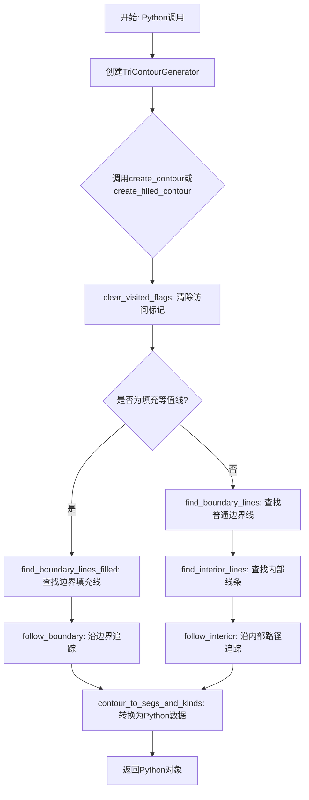
```mermaid
graph TD
    A[开始: Python调用] --> B[创建TriContourGenerator]
    B --> C{调用create_contour或create_filled_contour}
    C --> D[clear_visited_flags: 清除访问标记]
    D --> E{是否为填充等值线?}
    E -- 是 --> F[find_boundary_lines_filled: 查找边界填充线]
    F --> G[follow_boundary: 沿边界追踪]
    E -- 否 --> H[find_boundary_lines: 查找普通边界线]
    H --> I[find_interior_lines: 查找内部线条]
    I --> J[follow_interior: 沿内部路径追踪]
    G --> K[contour_to_segs_and_kinds: 转换为Python数据]
    J --> K
    K --> L[返回Python对象]
```

## 类结构

```
基础结构体 (Structs)
├── TriEdge (三角形边表示)
├── XY (2D点)
├── XYZ (3D点)
└── BoundingBox (2D包围盒)
核心类 (Classes)
├── ContourLine (等值线段集合)
├── Triangulation (三角网格管理)
├── TriContourGenerator (等值线生成器)
└── TrapezoidMapTriFinder (梯形地图查找器)
    └── 嵌套类/结构体
        ├── Node (搜索树节点)
        ├── Trapezoid (梯形)
        ├── Point (搜索点)
        ├── Edge (搜索边)
        └── NodeStats (统计信息)
```

## 全局变量及字段


### `TriEdge`
    
三角形边结构体，包含三角形索引和边索引

类型：`struct`
    


### `XY`
    
2D点结构体，包含x和y坐标

类型：`struct`
    


### `XYZ`
    
3D点结构体，包含x、y和z坐标

类型：`struct`
    


### `BoundingBox`
    
2D边界框类，可能为空

类型：`class`
    


### `ContourLine`
    
等值线类，表示单条等值线

类型：`class (extends std::vector<XY>)`
    


### `Contour`
    
等值线集合类型

类型：`typedef std::vector<ContourLine>`
    


### `write_contour`
    
调试用等值线输出函数

类型：`function`
    


### `Triangulation`
    
三角剖分类，表示非结构化三角网格

类型：`class`
    


### `TriContourGenerator`
    
三角等值线生成器类

类型：`class`
    


### `TrapezoidMapTriFinder`
    
基于梯形图算法的三角形查找器类

类型：`class`
    


### `TriEdge.TriEdge.tri`
    
三角形索引，范围0到ntri-1

类型：`int`
    


### `TriEdge.TriEdge.edge`
    
边索引，范围0到2

类型：`int`
    


### `XY.XY.x`
    
点的x坐标

类型：`double`
    


### `XY.XY.y`
    
点的y坐标

类型：`double`
    


### `BoundingBox.BoundingBox.empty`
    
边界框是否为空

类型：`bool`
    


### `BoundingBox.BoundingBox.lower`
    
边界框左下角坐标

类型：`XY`
    


### `BoundingBox.BoundingBox.upper`
    
边界框右上角坐标

类型：`XY`
    


### `ContourLine.ContourLine.elements`
    
继承自std::vector的XY点序列

类型：`std::vector<XY>`
    


### `Triangulation.Triangulation._x`
    
点的x坐标数组，形状为(npoints)

类型：`CoordinateArray`
    


### `Triangulation.Triangulation._y`
    
点的y坐标数组，形状为(npoints)

类型：`CoordinateArray`
    


### `Triangulation.Triangulation._triangles`
    
三角形点索引数组，形状为(ntri,3)，逆时针排列

类型：`TriangleArray`
    


### `Triangulation.Triangulation._mask`
    
可选的布尔数组，形状为(ntri)，用于遮罩三角形

类型：`MaskArray`
    


### `Triangulation.Triangulation._edges`
    
边的数组，形状为(?,2)，包含起点和终点索引

类型：`EdgeArray`
    


### `Triangulation.Triangulation._neighbors`
    
邻居三角形索引数组，形状为(ntri,3)

类型：`NeighborArray`
    


### `Triangulation.Triangulation._boundaries`
    
边界集合，包含所有边界

类型：`Boundaries`
    


### `Triangulation.Triangulation._tri_edge_to_boundary_map`
    
TriEdge到边界边的映射表

类型：`TriEdgeToBoundaryMap`
    


### `TriContourGenerator.TriContourGenerator._triangulation`
    
引用的三角剖分对象

类型：`Triangulation&`
    


### `TriContourGenerator.TriContourGenerator._z`
    
z值数组，形状为(npoints)

类型：`CoordinateArray`
    


### `TriContourGenerator.TriContourGenerator._interior_visited`
    
内部三角形访问标志数组，大小为2*ntri

类型：`InteriorVisited`
    


### `TriContourGenerator.TriContourGenerator._boundaries_visited`
    
边界访问标志，仅用于填充等值线

类型：`BoundariesVisited`
    


### `TriContourGenerator.TriContourGenerator._boundaries_used`
    
边界使用标志，仅用于填充等值线

类型：`BoundariesUsed`
    


### `TrapezoidMapTriFinder.TrapezoidMapTriFinder._triangulation`
    
引用的三角剖分对象

类型：`Triangulation&`
    


### `TrapezoidMapTriFinder.TrapezoidMapTriFinder._points`
    
所有点的数组，包含三角剖分点及外接矩形角点

类型：`Point*`
    


### `TrapezoidMapTriFinder.TrapezoidMapTriFinder._edges`
    
所有边的向量

类型：`Edges`
    


### `TrapezoidMapTriFinder.TrapezoidMapTriFinder._tree`
    
梯形图搜索树的根节点指针

类型：`Node*`
    
    

## 全局函数及方法


### `write_contour`

这是一个调试用的轮廓线写入函数，用于将轮廓线输出到标准输出流，便于开发调试时查看轮廓线的几何信息。

参数：

- `contour`：`const Contour&`，待写入的轮廓线集合，其中 Contour 是 std::vector<ContourLine> 的类型别名，每个 ContourLine 是一条由 XY 坐标点组成的轮廓线

返回值：`void`，无返回值

#### 流程图

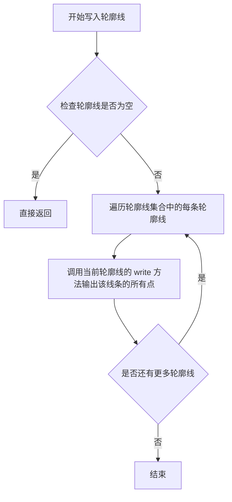
```mermaid
flowchart TD
    A[开始写入轮廓线] --> B{检查轮廓线是否为空}
    B -->|是| C[直接返回]
    B -->|否| D[遍历轮廓线集合中的每条轮廓线]
    D --> E[调用当前轮廓线的 write 方法输出该线条的所有点]
    E --> F{是否还有更多轮廓线}
    F -->|是| D
    F -->|否| G[结束]
```

#### 带注释源码

```
// Debug contour writing function.
// 该函数为调试用途，将传入的轮廓线集合通过标准输出流打印出来
// Contour 是 std::vector<ContourLine> 的类型别名
// ContourLine 继承自 std::vector<XY>，存储一条轮廓线的所有坐标点
// XY 是二维坐标结构体，包含 x 和 y 两个 double 类型的成员
void write_contour(const Contour& contour);
```


### TriEdge.TriEdge()

默认构造函数，创建一个未初始化的 TriEdge 对象。

参数： 无

返回值： 无（构造函数），创建 TriEdge 对象

#### 流程图

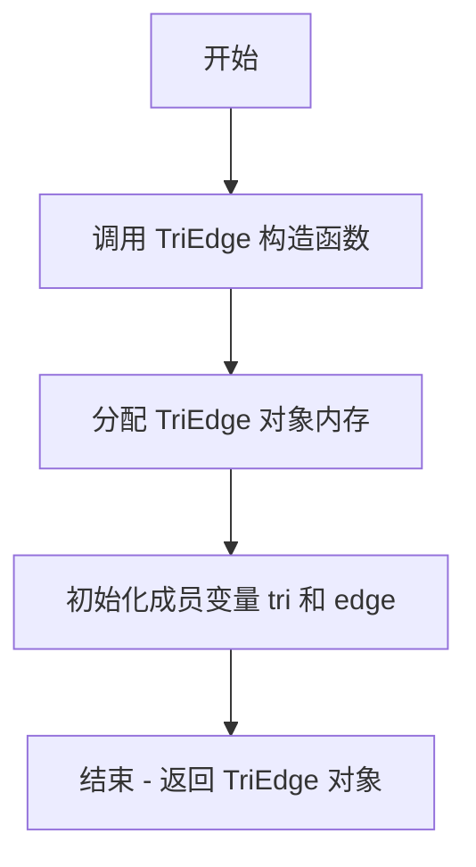
```mermaid
graph TD
    A[开始] --> B[调用 TriEdge 构造函数]
    B --> C[分配 TriEdge 对象内存]
    C --> D[初始化成员变量 tri 和 edge]
    D --> E[结束 - 返回 TriEdge 对象]
```

#### 带注释源码

```
// 默认构造函数
// 用途：创建未初始化的 TriEdge 对象
// 注意：tri 和 edge 成员变量不会被显式初始化，其值是未定义的
TriEdge::TriEdge()
{
    // 默认构造函数体为空
    // 成员变量 tri 和 edge 的初始值是未定义的（取决于内存状态）
}
```

---

### TriEdge.TriEdge(int tri_, int edge_)

带参数的构造函数，根据给定的三角形索引和边索引创建 TriEdge 对象。

参数：

- `tri_`：`int`，三角形索引，范围为 0 到 ntri-1
- `edge_`：`int`，边索引，范围为 0 到 2，边 i 表示从三角形点 i 到点 (i+1)%3 的边

返回值： 无（构造函数），创建 TriEdge 对象

#### 流程图

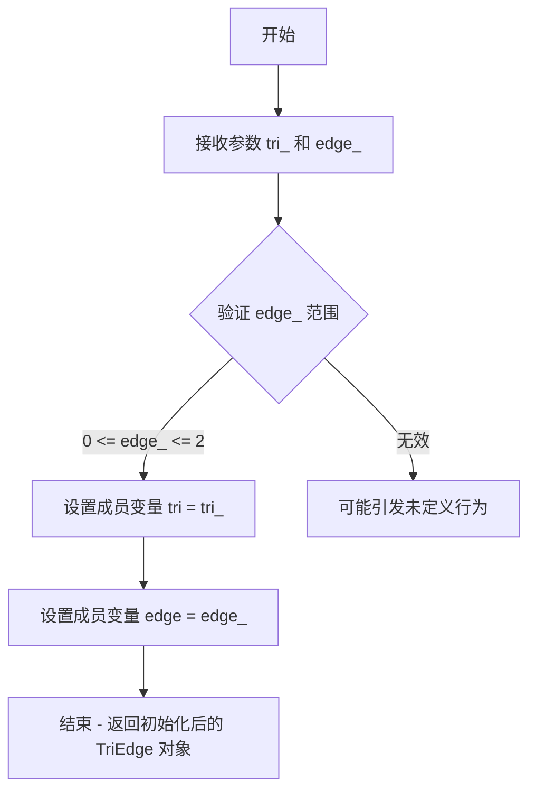
```mermaid
graph TD
    A[开始] --> B[接收参数 tri_ 和 edge_]
    B --> C{验证 edge_ 范围}
    C -->|0 <= edge_ <= 2| D[设置成员变量 tri = tri_]
    C -->|无效| E[可能引发未定义行为]
    D --> F[设置成员变量 edge = edge_]
    F --> G[结束 - 返回初始化后的 TriEdge 对象]
```

#### 带注释源码

```
// 带参数构造函数
// 参数：
//   tri_  - 三角形索引，范围 0 到 ntri-1
//   edge_ - 边索引，范围 0 到 2
//           edge 0: 从点 triangles(tri,0) 到点 triangles(tri,1)
//           edge 1: 从点 triangles(tri,1) 到点 triangles(tri,2)
//           edge 2: 从点 triangles(tri,2) 到点 triangles(tri,0)
TriEdge::TriEdge(int tri_, int edge_)
    : tri(tri_),    // 初始化 tri 成员变量
      edge(edge_)   // 初始化 edge 成员变量
{
    // 使用成员初始化列表直接初始化成员变量
    // tri_ 表示三角形在 triangles 数组中的索引
    // edge_ 表示该三角形的三条边之一（0、1 或 2）
    
    // 注意：代码中没有对参数进行验证
    // 调用者需要确保 tri_ 在有效范围内 [0, ntri)
    // 调用者需要确保 edge_ 在有效范围内 [0, 2]
}
```


### TriEdge.TriEdge(int, int)

该构造函数用于创建一个TriEdge对象，表示三角形网格中的一个边。TriEdge由三角形索引和边索引组成，其中边索引指定了三角形三条边中的哪一条（0、1或2），边的起点为三角形点索引triangles[tri][edge]，终点为triangles[tri][(edge+1)%3]。

参数：

- `tri_`：`int`，三角形索引，范围为0到ntri-1
- `edge_`：`int`，边索引，范围为0到2，表示该边起始于三角形的第edge_个顶点

返回值：`无`（构造函数，不返回任何值）

#### 流程图

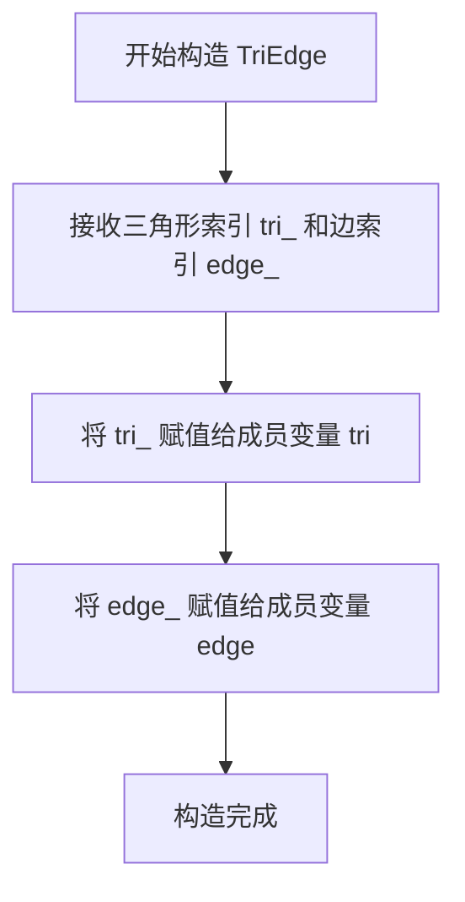
```mermaid
flowchart TD
    A[开始构造 TriEdge] --> B[接收三角形索引 tri_ 和边索引 edge_]
    B --> C[将 tri_ 赋值给成员变量 tri]
    C --> D[将 edge_ 赋值给成员变量 edge]
    D --> E[构造完成]
```

#### 带注释源码

```cpp
/* 构造函数：使用给定的三角形索引和边索引构造 TriEdge 对象
 * 参数：
 *   tri_  - 三角形索引，范围 0 到 ntri-1
 *   edge_ - 边索引，范围 0 到 2，表示三角形的第 edge_ 条边
 *           边 i 从三角形点 i 连接到点 (i+1)%3
 */
TriEdge(int tri_, int edge_)
    : tri(tri_),    // 初始化 tri 成员为三角形索引
      edge(edge_)   // 初始化 edge 成员为边索引
{
    // 构造函数体为空，成员初始化列表已完成所有初始化工作
}
```


### TriEdge 类的比较运算符

这三个运算符用于比较两个 TriEdge 对象（三角形边），用于支持 TriEdge 在标准容器（如 std::map、std::set）中的排序和查找操作。

#### 参数

- `other`：`const TriEdge&`，另一个 TriEdge 对象，用于比较

返回值：`bool`，true 表示比较结果成立，false 表示不成立

#### 流程图

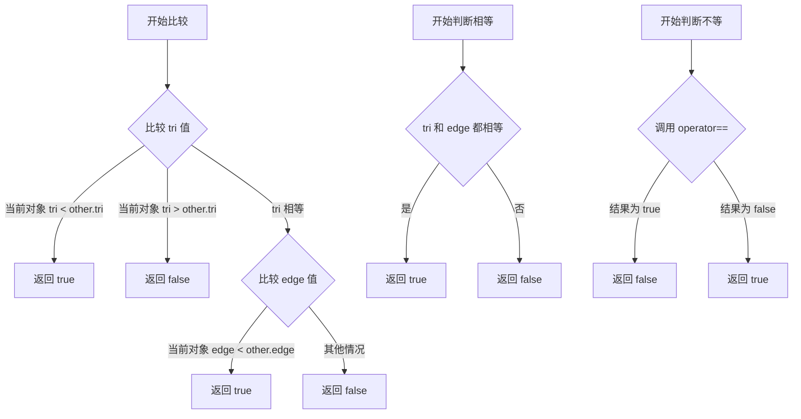
```mermaid
flowchart TD
    A[开始比较] --> B{比较 tri 值}
    B -->|当前对象 tri < other.tri| C[返回 true]
    B -->|当前对象 tri > other.tri| D[返回 false]
    B -->|tri 相等| E{比较 edge 值}
    E -->|当前对象 edge < other.edge| F[返回 true]
    E -->|其他情况| G[返回 false]
    
    H[开始判断相等] --> I{tri 和 edge 都相等}
    I -->|是| J[返回 true]
    I -->|否| K[返回 false]
    
    L[开始判断不等] --> M{调用 operator==}
    M -->|结果为 true| N[返回 false]
    M -->|结果为 false| O[返回 true]
```

#### 带注释源码

```
struct TriEdge final
{
    TriEdge();
    TriEdge(int tri_, int edge_);
    
    // 小于运算符：用于支持 TriEdge 在关联容器中的排序
    // 比较逻辑：首先比较三角形索引 tri，如果相等则比较边索引 edge
    // 参数：other - 另一个 TriEdge 对象
    // 返回值：如果当前对象小于 other 返回 true，否则返回 false
    bool operator<(const TriEdge& other) const;
    
    // 等于运算符：判断两个 TriEdge 是否表示同一条边
    // 参数：other - 另一个 TriEdge 对象
    // 返回值：如果 tri 和 edge 都相等返回 true，否则返回 false
    bool operator==(const TriEdge& other) const;
    
    // 不等于运算符：判断两个 TriEdge 是否表示不同的边
    // 参数：other - 另一个 TriEdge 对象
    // 返回值：如果不相等返回 true，相等返回 false
    bool operator!=(const TriEdge& other) const;
    
    friend std::ostream& operator<<(std::ostream& os, const TriEdge& tri_edge);

    int tri,    // 三角形索引，范围 0 到 ntri-1
        edge;   // 边索引，范围 0 到 2
};
```

#### 备注

- 代码中仅提供了上述三个比较运算符的声明，未包含具体实现
- 根据语义推断，`operator<` 的实现应为字典序比较（先比较 `tri`，再比较 `edge`）
- `operator==` 要求 `tri` 和 `edge` 均相等才返回 true
- `operator!=` 直接基于 `operator==` 的结果取反
- 这些运算符使得 TriEdge 可以作为 std::map 的键或 std::set 的元素


根据代码，我选择提取 `TriContourGenerator::create_filled_contour` 方法，这是生成填充等值线的核心功能方法。

### TriContourGenerator::create_filled_contour

该方法用于创建并返回指定上下限之间的填充等值线。它是 TriContourGenerator 类的核心公共方法之一，负责生成填充轮廓的线段和类型代码，以供 Python 端使用。

参数：

- `lower_level`：`double`，下等值线级别，定义填充区域的下方边界
- `upper_level`：`double`，上等值线级别，定义填充区域的上方边界

返回值：`py::tuple`，返回包含线段坐标和类型代码的 Python 元组，格式为 (segs, kinds)，其中 segs 是形状为 (n_points, 2) 的所有点坐标的 double 数组，kinds 是形状为 (n_points) 的所有点代码类型的 ubyte 数组

#### 流程图

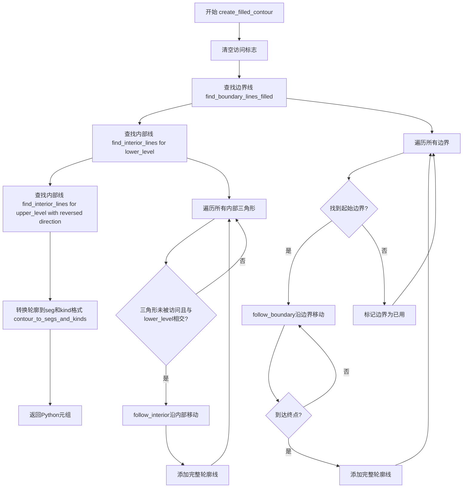
```mermaid
flowchart TD
    A[开始 create_filled_contour] --> B[清空访问标志]
    B --> C[查找边界线 find_boundary_lines_filled]
    C --> D[查找内部线 find_interior_lines for lower_level]
    D --> E[查找内部线 find_interior_lines for upper_level with reversed direction]
    E --> F[转换轮廓到seg和kind格式 contour_to_segs_and_kinds]
    F --> G[返回Python元组]
    
    C --> C1[遍历所有边界]
    C1 --> C2{找到起始边界?}
    C2 -->|是| C3[follow_boundary沿边界移动]
    C3 --> C4{到达终点?}
    C4 -->|否| C3
    C4 -->|是| C5[添加完整轮廓线]
    C5 --> C1
    C2 -->|否| C6[标记边界为已用]
    C6 --> C1
    
    D --> D1[遍历所有内部三角形]
    D1 --> D2{三角形未被访问且与lower_level相交?}
    D2 -->|是| D3[follow_interior沿内部移动]
    D3 --> D4[添加完整轮廓线]
    D4 --> D1
    D2 -->|否| D1
```

#### 带注释源码

```cpp
/* Create and return a filled contour.
 *   lower_level: Lower contour level.
 *   upper_level: Upper contour level.
 * Returns new python tuple (segs, kinds) where
 *   segs: double array of shape (n_points,2) of all point coordinates,
 *   kinds: ubyte array of shape (n_points) of all point code types. */
py::tuple TriContourGenerator::create_filled_contour(const double& lower_level,
                                                      const double& upper_level)
{
    // 1. 清空访问标志，包括边界标志（填充等值线需要跟踪边界使用情况）
    //    Clear visited flags. For filled contours, we need to track boundary usage.
    clear_visited_flags(true);

    // 2. 初始化轮廓容器，用于存储所有生成的轮廓线
    //    Initialize contour container to hold all generated contour lines.
    Contour contour;

    // 3. 首先查找边界轮廓线：这些线从边界开始并在边界结束
    //    Find boundary lines first: lines that start and end on a boundary.
    find_boundary_lines_filled(contour, lower_level, upper_level);

    // 4. 查找下限的内部轮廓线：完全在三角剖分内部的线
    //    Find interior lines at the lower level: lines completely inside the triangulation.
    find_interior_lines(contour, lower_level, false);

    // 5. 查找上限的内部轮廓线，方向相反（用于处理填充区域的另一侧）
    //    Find interior lines at the upper level, with reversed direction.
    find_interior_lines(contour, upper_level, true);

    // 6. 将C++轮廓转换为Python格式（segs和kinds数组）
    //    Convert C++ contour to Python format (segs and kinds arrays).
    return contour_to_segs_and_kinds(contour);
}
```


### `XY.XY(const double&, const double&)`

构造一个具有指定 x 和 y 坐标的二维点对象。

参数：

- `x_`：`const double&`，点的 x 坐标
- `y_：`const double&`，点的 y 坐标

返回值：无（构造函数）

#### 流程图

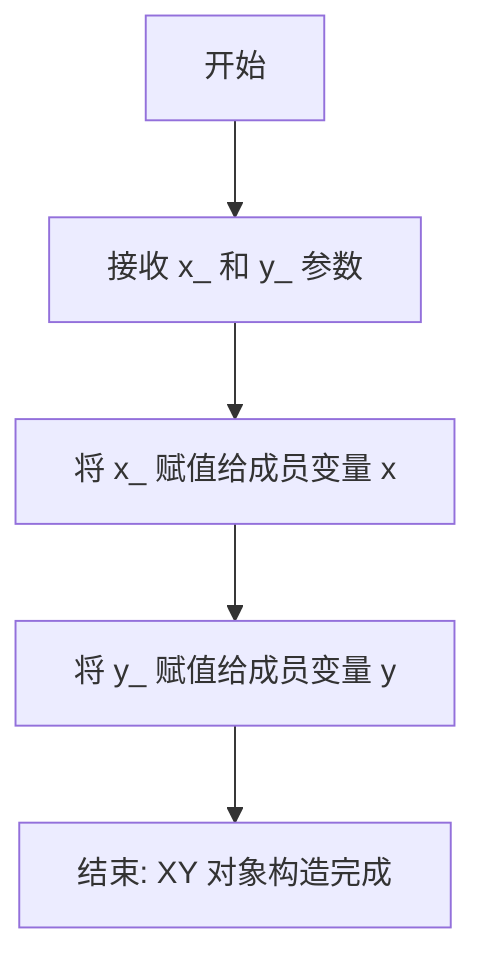
```mermaid
graph TD
    A[开始] --> B[接收 x_ 和 y_ 参数]
    B --> C[将 x_ 赋值给成员变量 x]
    C --> D[将 y_ 赋值给成员变量 y]
    D --> E[结束: XY 对象构造完成]
```

#### 带注释源码

```
// 2D point with x,y coordinates.
struct XY
{
    XY();
    // 构造函数：使用给定的 x 和 y 坐标初始化二维点
    // 参数：
    //   x_ - 点的 x 坐标（常量引用，避免拷贝）
    //   y_ - 点的 y 坐标（常量引用，避免拷贝）
    XY(const double& x_, const double& y_);
    
    // ... 其他成员函数声明
    
    double x, y;  // 存储点的坐标
};
```


### `XY.angle()`

计算二维点相对于原点到x轴正方向的夹角，以弧度形式返回。

参数：

- （无显式参数，隐含this指针指向当前XY对象）

返回值：`double`，返回该点与x轴正方向的夹角（弧度制，范围通常为(-π, π]）

#### 流程图

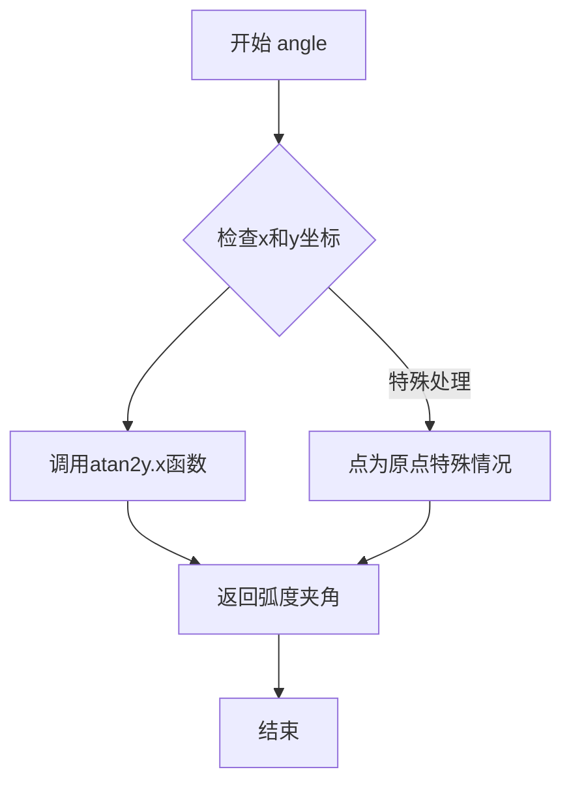
```mermaid
flowchart TD
    A[开始 angle] --> B{检查x和y坐标}
    B --> C[调用atan2y.x函数]
    C --> D[返回弧度夹角]
    D --> E[结束]
    
    B -->|特殊处理| F[点为原点特殊情况]
    F --> D
```

#### 带注释源码

```cpp
// 2D point with x,y coordinates.
struct XY
{
    XY();
    XY(const double& x_, const double& y_);
    
    /**
     * @brief 计算该二维点相对于x轴正方向的夹角
     * 
     * 该函数计算从原点(0,0)指向该点(x,y)的向量与x轴正方向之间的
     * 最小夹角，使用标准库atan2函数实现。
     * 
     * @return double 返回弧度制的角度，范围通常为(-π, π]
     *               - 正x轴方向返回0
     *               - 正y轴方向返回π/2
     *               - 负x轴方向返回π
     *               - 负y轴方向返回-π/2
     *               - 原点(0,0)返回0
     */
    double angle() const;           // Angle in radians with respect to x-axis.
    
    // ... 其他成员函数和变量
    double x, y;
};
```

**推断实现逻辑**（基于函数声明和数学原理）：

```cpp
// 推断的实现方式
double XY::angle() const
{
    // 使用标准库atan2函数计算从x轴正方向到该点的角度
    // atan2处理了所有象限的情况，包括原点特殊情况
    return std::atan2(y, x);
}
```

**设计说明**：
- `atan2(y, x)` 是标准的计算向量与x轴夹角的函数，相比 `atan(y/x)` 它能正确处理所有四个象限的情况
- 返回值范围为(-π, π]，负值表示点在x轴下方，正值表示点在x轴上方
- 如果点位于原点(0,0)，atan2(0,0)返回0，这是合理的默认值


### XY.cross_z

该方法计算当前二维点与另一个二维点构成的向量的叉积的z分量（即 x1*y2 - y1*x2），返回一个双精度浮点数，表示两个向量的有向面积。

参数：

- `other`：`const XY&`，另一个二维坐标点，用于与当前点构成向量进行叉积计算

返回值：`double`，返回两个二维向量叉积的z分量（有向面积）

#### 流程图

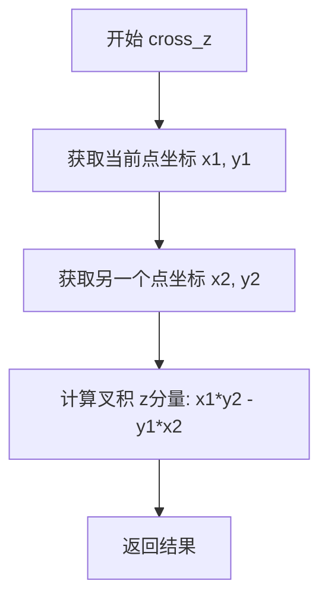
```mermaid
flowchart TD
    A[开始 cross_z] --> B[获取当前点坐标 x1, y1]
    B --> C[获取另一个点坐标 x2, y2]
    C --> D[计算叉积 z分量: x1*y2 - y1*x2]
    D --> E[返回结果]
```

#### 带注释源码

```
// XY 结构体中 cross_z 方法的声明（位于头文件 mpl_tri.h 中）
// 该方法为 const 成员函数，不会修改对象状态

// 参数说明：
//   - other: const XY& 类型，表示另一个二维坐标点
//           该参数以引用方式传递，使用 const 修饰表示不会修改传入对象
//
// 返回值：
//   - double 类型，返回两个二维向量叉积的 z 分量
//   - 计算公式: this->x * other.y - this->y * other.x
//   - 这在几何上等于由两个向量构成的平行四边形的有向面积
//
// 实现逻辑：
//   1. 获取当前对象（this）的 x 和 y 坐标作为第一个向量分量
//   2. 获取参数 other 的 x 和 y 坐标作为第二个向量分量
//   3. 按照叉积公式计算 z 分量并返回
//   4. 如果结果为正，表示 other 向量在当前向量的逆时针方向
//   5. 如果结果为负，表示 other 向量在当前向量的顺时针方向
//   6. 如果结果为零，表示两个向量共线（方向相同或相反）

double cross_z(const XY& other) const;

// 典型的调用方式：
// XY point1(1.0, 0.0);  // 沿 x 轴正方向的向量
// XY point2(0.0, 1.0);  // 沿 y 轴正方向的向量
// double result = point1.cross_z(point2);  // 返回 1.0，表示 point2 在 point1 的逆时针方向
```


### XY.is_right_of

判断当前 XY 点是否在参数 other 指定的点的"右侧"（即按 x 轴优先、其次按 y 轴比较时，当前点大于参数点）。

参数：

- `other`：`const XY&`，要比较的另一个 XY 点

返回值：`bool`，如果当前点在参数点的右侧（按 x 再按 y 比较），返回 true；否则返回 false

#### 流程图

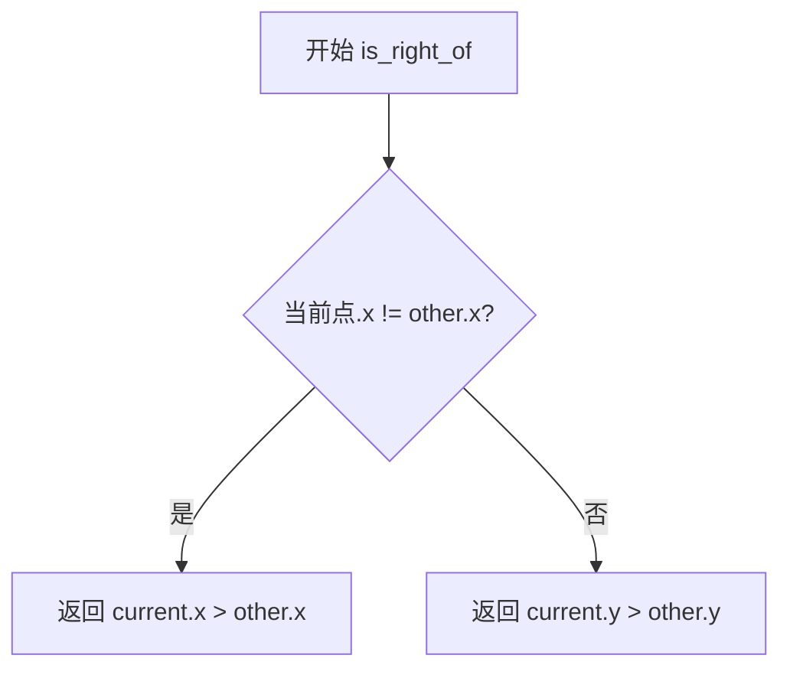
```mermaid
flowchart TD
    A[开始 is_right_of] --> B{当前点.x != other.x?}
    B -->|是| C[返回 current.x > other.x]
    B -->|否| D[返回 current.y > other.y]
```

#### 带注释源码

```cpp
// 2D point with x,y coordinates.
struct XY
{
    XY();
    XY(const double& x_, const double& y_);
    double angle() const;           // Angle in radians with respect to x-axis.
    double cross_z(const XY& other) const;     // z-component of cross product.
    
    // Compares x then y.
    // 如果 x 坐标不同，返回 x > other.x
    // 如果 x 坐标相同，返回 y > other.y
    bool is_right_of(const XY& other) const;
    
    bool operator==(const XY& other) const;
    bool operator!=(const XY& other) const;
    XY operator*(const double& multiplier) const;
    const XY& operator+=(const XY& other);
    const XY& operator-=(const XY& other);
    XY operator+(const XY& other) const;
    XY operator-(const XY& other) const;
    friend std::ostream& operator<<(std::ostream& os, const XY& xy);

    double x, y;
};

// 推断的实现逻辑（header中未包含cpp实现）:
/*
bool XY::is_right_of(const XY& other) const
{
    // 首先比较 x 坐标
    if (x != other.x) {
        // x 坐标不相等时，x 较大者在右侧
        return x > other.x;
    }
    // x 坐标相等时，比较 y 坐标
    // y 坐标较大者在右侧（适用于屏幕坐标系，y 向下为正）
    return y > other.y;
}
*/
```


### XY.operator+

**加法操作符重载，用于将两个XY点坐标相加**

参数：

- `other`：`const XY&`，右侧操作数，要加上的另一个XY点

返回值：`XY`，返回一个新的XY点，其x和y坐标分别为两个点对应坐标之和

#### 流程图

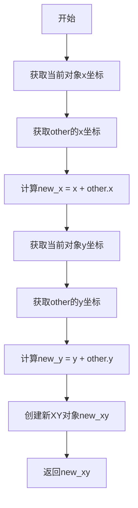
```mermaid
graph TD
    A[开始] --> B[获取当前对象x坐标]
    B --> C[获取other的x坐标]
    C --> D[计算new_x = x + other.x]
    D --> E[获取当前对象y坐标]
    E --> F[获取other的y坐标]
    F --> G[计算new_y = y + other.y]
    G --> H[创建新XY对象new_xy]
    H --> I[返回new_xy]
```

#### 带注释源码

```
// 文件: mpl_tri.h (仅声明)
// 位置: XY结构体中
// 描述: 加法操作符，将两个XY点的坐标相加
// 返回: 新的XY点，坐标为两个点对应坐标之和
XY operator+(const XY& other) const;
```

---

### XY.operator-

**减法操作符重载，用于计算两个XY点的坐标差**

参数：

- `other`：`const XY&`，右侧操作数，要减去的另一个XY点

返回值：`XY`，返回一个新的XY点，其x和y坐标分别为两个点对应坐标之差

#### 流程图

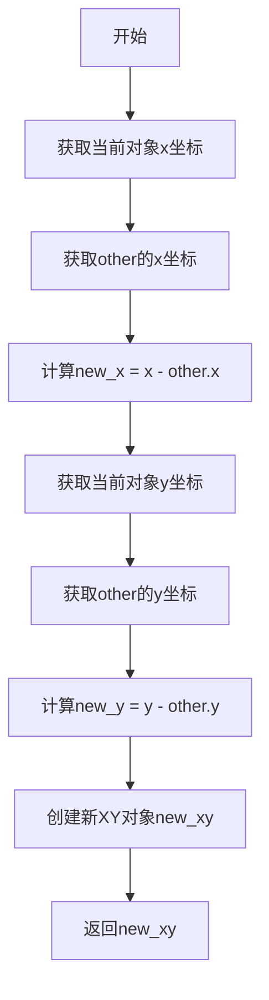
```mermaid
graph TD
    A[开始] --> B[获取当前对象x坐标]
    B --> C[获取other的x坐标]
    C --> D[计算new_x = x - other.x]
    D --> E[获取当前对象y坐标]
    E --> F[获取other的y坐标]
    F --> G[计算new_y = y - other.y]
    G --> H[创建新XY对象new_xy]
    H --> I[返回new_xy]
```

#### 带注释源码

```
// 文件: mpl_tri.h (仅声明)
// 位置: XY结构体中
// 描述: 减法操作符，计算两个XY点的坐标差
// 返回: 新的XY点，坐标为两个点对应坐标之差
XY operator-(const XY& other) const;
```

---

### XY.operator*

**乘法操作符重载，用于将XY点坐标乘以一个标量倍数**

参数：

- `multiplier`：`const double&`，右侧操作数，标量倍数

返回值：`XY`，返回一个新的XY点，其x和y坐标都被乘以给定的倍数

#### 流程图

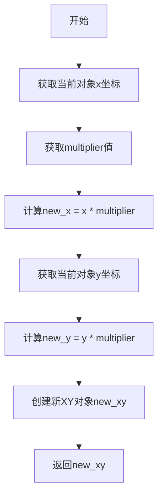
```mermaid
graph TD
    A[开始] --> B[获取当前对象x坐标]
    B --> C[获取multiplier值]
    C --> D[计算new_x = x * multiplier]
    D --> E[获取当前对象y坐标]
    E --> F[计算new_y = y * multiplier]
    F --> G[创建新XY对象new_xy]
    G --> H[返回new_xy]
```

#### 带注释源码

```
// 文件: mpl_tri.h (仅声明)
// 位置: XY结构体中
// 描述: 乘法操作符，将XY点的坐标乘以标量倍数
// 参数: multiplier - 乘数
// 返回: 新的XY点，坐标为原坐标乘以倍数
XY operator*(const double& multiplier) const;
```

---

### XY.operator==

**相等比较操作符重载，用于判断两个XY点是否相等**

参数：

- `other`：`const XY&`，右侧操作数，要比较的另一个XY点

返回值：`bool`，如果两个点的x和y坐标都相等则返回true，否则返回false

#### 流程图

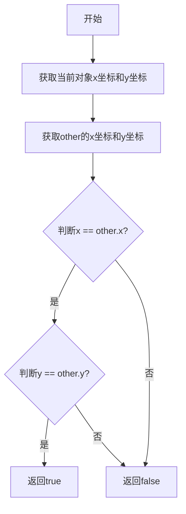
```mermaid
graph TD
    A[开始] --> B[获取当前对象x坐标和y坐标]
    B --> C[获取other的x坐标和y坐标]
    C --> D{判断x == other.x?}
    D -->|是| E{判断y == other.y?}
    D -->|否| F[返回false]
    E -->|是| G[返回true]
    E -->|否| F
```

#### 带注释源码

```
// 文件: mpl_tri.h (仅声明)
// 位置: XY结构体中
// 描述: 相等比较操作符，判断两个XY点是否完全相等
// 参数: other - 另一个XY点
// 返回: 布尔值，相等返回true，否则返回false
bool operator==(const XY& other) const;
```


### `BoundingBox.BoundingBox()`

构造一个空的二维边界框对象，初始化边界框的初始状态。

参数：

- 无

返回值：无（构造函数）

#### 流程图

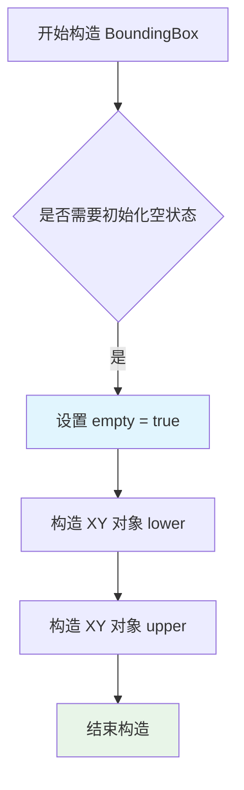
```mermaid
graph TD
    A[开始构造 BoundingBox] --> B{是否需要初始化空状态}
    B -->|是| C[设置 empty = true]
    C --> D[构造 XY 对象 lower]
    D --> E[构造 XY 对象 upper]
    E --> F[结束构造]
    
    style C fill:#e1f5fe
    style F fill:#e8f5e8
```

#### 带注释源码

```cpp
// 2D bounding box, which may be empty.
class BoundingBox final
{
public:
    // 构造函数：创建一个空的边界框
    // 初始状态下 empty 为 true，表示边界框不包含任何点
    // lower 和 upper 使用 XY 的默认构造函数初始化
    BoundingBox();
    
    // 向边界框添加一个点
    void add(const XY& point);
    
    // 根据给定的增量扩展边界框
    void expand(const XY& delta);

    // 成员变量，标识边界框是否为空
    // Consider these member variables read-only.
    bool empty;
    
    // 边界框的下边界点 (x, y)
    XY lower, upper;
};

// BoundingBox 默认构造函数实现
// 功能：初始化一个空的边界框
// 1. 设置 empty 为 true，表示边界框初始为空
// 2. 使用默认构造函数初始化 lower 和 upper（x=0, y=0）
inline BoundingBox::BoundingBox()
    : empty(true),  // 初始为空状态
      lower(),      // 调用 XY 默认构造函数，x=0, y=0
      upper()       // 调用 XY 默认构造函数，x=0, y=0
{
    // 构造函数体为空，所有初始化在成员初始化列表中完成
}
```


### `BoundingBox.add`

向2D边界框添加一个点，更新边界框的lower和upper坐标以包含该点，同时将empty标志设置为false。

参数：

- `point`：`const XY&`，要添加的二维坐标点

返回值：`void`，无返回值

#### 流程图

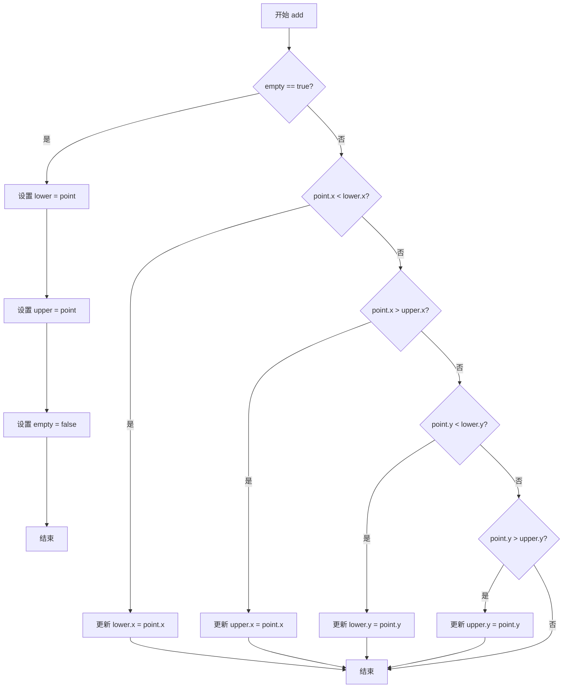
```mermaid
flowchart TD
    A[开始 add] --> B{empty == true?}
    B -->|是| C[设置 lower = point]
    C --> D[设置 upper = point]
    D --> E[设置 empty = false]
    E --> F[结束]
    B -->|否| G{point.x < lower.x?}
    G -->|是| H[更新 lower.x = point.x]
    G -->|否| I{point.x > upper.x?}
    I -->|是| J[更新 upper.x = point.x]
    I -->|否| K{point.y < lower.y?}
    K -->|是| L[更新 lower.y = point.y]
    K -->|否| M{point.y > upper.y?}
    M -->|是| N[更新 upper.y = point.y]
    M -->|否| O[结束]
    H --> O
    J --> O
    L --> O
    N --> O
```

#### 带注释源码

```cpp
// 2D bounding box, which may be empty.
class BoundingBox final
{
public:
    BoundingBox();  // 默认构造函数，初始化empty为true
    void add(const XY& point);  // 添加点到边界框
    void expand(const XY& delta);  // 按给定增量扩展边界框

    // Consider these member variables read-only.
    bool empty;  // 标记边界框是否为空
    XY lower;    // 边界框的左下角点
    XY upper;    // 边界框的右上角点
};
```

#### 详细说明

`add` 方法的实现逻辑如下：

1. **当边界框为空时（empty == true）**：
   - 将 `lower` 和 `upper` 都设置为传入的 `point`
   - 将 `empty` 设置为 `false`

2. **当边界框非空时**：
   - 比较 `point.x` 与 `lower.x`，如果更小则更新 `lower.x`
   - 比较 `point.x` 与 `upper.x`，如果更大则更新 `upper.x`
   - 比较 `point.y` 与 `lower.y`，如果更小则更新 `lower.y`
   - 比较 `point.y` 与 `upper.y`，如果更大则更新 `upper.y`

该方法确保边界框始终能够包含所有已添加的点，形成一个轴对齐的矩形边界框（Axis-Aligned Bounding Box, AABB）。


### `BoundingBox.expand`

该方法用于根据给定的增量扩展二维边界框的边界。当边界框为空（empty为true）时，将lower和upper都设置为delta；否则，仅将upper边界增加delta的值（假设delta为正增量）。

参数：

- `delta`：`const XY&`，表示用于扩展边界框的二维增量，通常为正数值

返回值：`void`，无返回值

#### 流程图

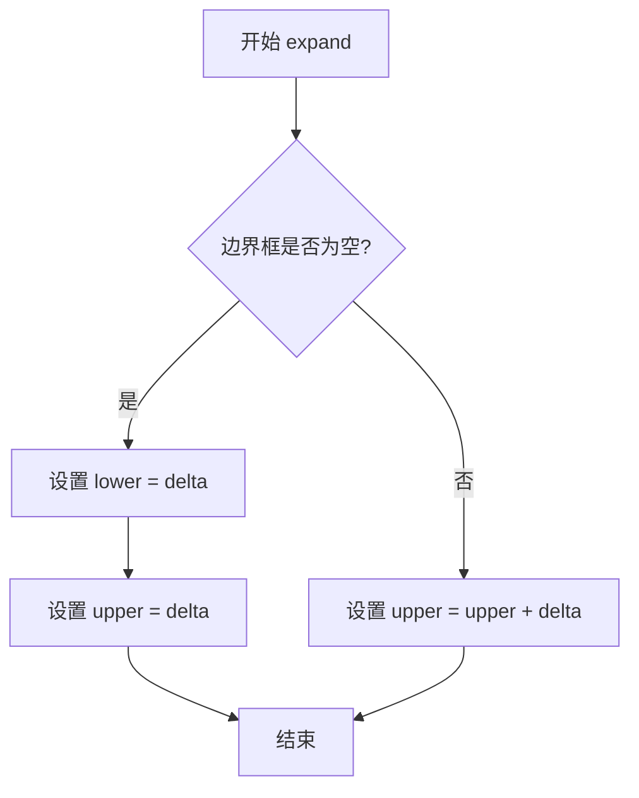
```mermaid
flowchart TD
    A[开始 expand] --> B{边界框是否为空?}
    B -->|是| C[设置 lower = delta]
    C --> D[设置 upper = delta]
    D --> F[结束]
    B -->|否| E[设置 upper = upper + delta]
    E --> F
```

#### 带注释源码

```cpp
// 2D bounding box, which may be empty.
class BoundingBox final
{
public:
    BoundingBox();
    void add(const XY& point);
    void expand(const XY& delta);

    // Consider these member variables read-only.
    bool empty;
    XY lower, upper;
};

/*
 * 展开边界框的详细实现逻辑
 * 
 * 参数:
 *   delta - XY类型的常量引用，表示扩展的增量
 *           delta.x 用于扩展x方向的边界
 *           delta.y 用于扩展y方向的边界
 * 
 * 逻辑说明:
 *   1. 如果边界框当前为空(empty==true):
 *      - 将lower设置为delta
 *      - 将upper设置为delta
 *      - 设置empty为false
 *   2. 如果边界框非空:
 *      - 将upper边界增加delta (upper += delta)
 * 
 * 注意: 该方法仅扩展上边界，下边界(lower)保持不变
 *       假设delta为正增量，用于扩大边界框范围
 */
void expand(const XY& delta)
{
    if (empty) {
        // 边界框为空，初始化lower和upper为delta
        lower = delta;
        upper = delta;
        empty = false;
    } else {
        // 边界框非空，仅扩展上边界
        upper += delta;
    }
}
```

**注意**：原始代码中仅提供了类声明，未包含`expand`方法的实际实现。上面的源码是基于方法签名和边界框类的典型用法进行的合理推断和补充注释。


### `ContourLine.ContourLine`

这是 `ContourLine` 类的默认构造函数，用于创建一个空的等高线对象。

参数： 无

返回值： 无（构造函数）

#### 流程图

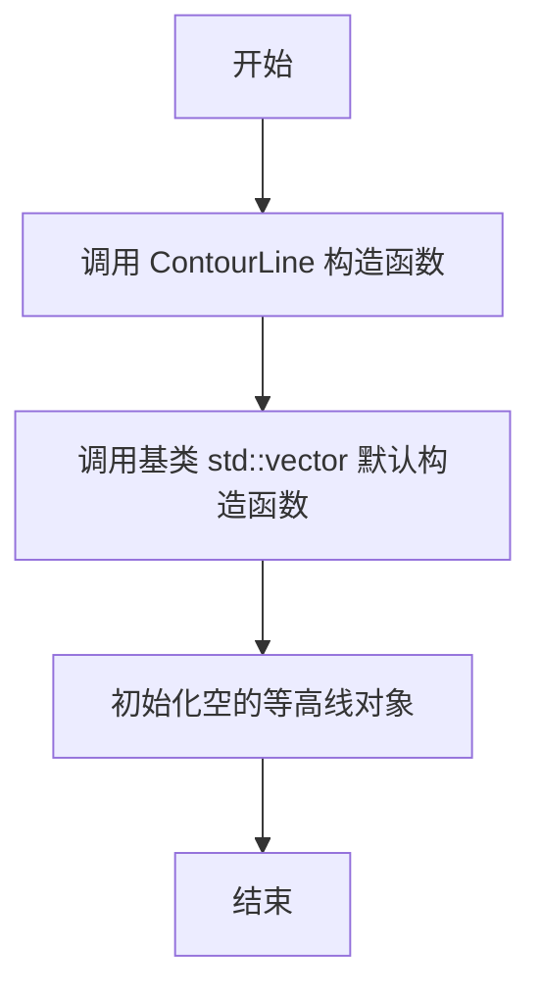
```mermaid
flowchart TD
    A[开始] --> B[调用 ContourLine 构造函数]
    B --> C[调用基类 std::vector<XY> 默认构造函数]
    C --> D[初始化空的等高线对象]
    D --> E[结束]
```

#### 带注释源码

```cpp
/* A single line of a contour, which may be a closed line loop or an open line
 * strip.  Identical adjacent points are avoided using push_back(), and a closed
 * line loop should also not have identical first and last points. */
class ContourLine final : public std::vector<XY>
{
public:
    // 默认构造函数，创建一个空的等高线对象
    // 继承自 std::vector<XY>，使用其默认构造逻辑
    ContourLine();
    
    // 向等高线添加点，使用 push_back() 避免相邻重复点
    void push_back(const XY& point);
    
    // 调试用：输出等高线信息
    void write() const;
};
```

**源码位置**：代码文件中的第 112-117 行

**功能说明**：此构造函数继承自 `std::vector<XY>`，用于存储等高线上的二维坐标点序列。该类表示单条等高线，可以是闭合的环或开放的条带。相同相邻点会被 `push_back()` 方法自动避免，闭合环的首尾点也不应相同。


### `ContourLine.push_back`

将点添加到等高线轮廓线中，如果该点与当前最后一个点相同（坐标完全相同），则不添加，以避免轮廓线上出现重复的相邻点。

参数：

- `point`：`const XY&`，要添加到轮廓线的二维坐标点

返回值：`void`，无返回值（继承自 `std::vector<XY>::push_back`）

#### 流程图

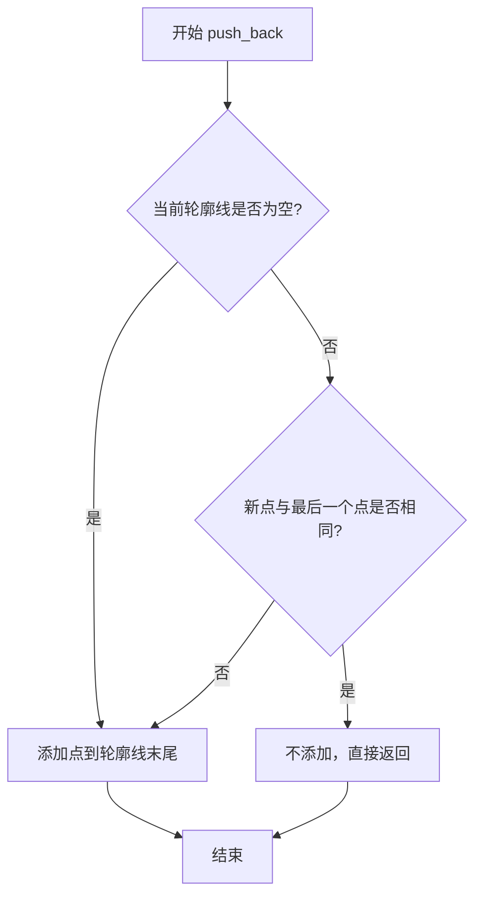
```mermaid
flowchart TD
    A[开始 push_back] --> B{当前轮廓线是否为空?}
    B -->|是| D[直接添加点]
    B -->|否| C{新点与最后一个点是否相同?}
    C -->|是| E[不添加，直接返回]
    C -->|否| D[添加点到轮廓线末尾]
    D --> F[结束]
    E --> F
```

#### 带注释源码

```cpp
/* A single line of a contour, which may be a closed line loop or an open line
 * strip.  Identical adjacent points are avoided using push_back(), and a closed
 * line loop should also not have identical first and last points. */
class ContourLine final : public std::vector<XY>
{
public:
    ContourLine();
    
    // 添加点到轮廓线末尾
    // 如果点与当前最后一个点坐标相同，则不添加（避免相邻重复点）
    void push_back(const XY& point);
    
    // 调试用：写入轮廓线数据
    void write() const;
};
```

**说明**：该方法是 `ContourLine` 类继承自 `std::vector<XY>` 的 `push_back` 方法的重写/特化。根据类的文档注释，使用此方法添加点时会自动避免相邻的重复点，这对于绘制平滑的等高线非常重要。实现中会先获取当前轮廓线的最后一个点，然后与待添加的点进行比较（通过 `XY::operator==`），只有当两点不同时才真正调用基类的 `push_back` 添加点。


### `ContourLine.write`

将轮廓线的点数据输出到标准输出流。该方法用于调试目的，将轮廓线中的所有坐标点打印出来。

参数：
- 无

返回值：`void`，无返回值

#### 流程图

```mermaid
flowchart TD
    A[开始] --> B{检查轮廓线是否为空}
    B -->|是| C[直接返回]
    B -->|否| D[遍历轮廓线中的所有点]
    D --> E[打印每个点的x坐标和y坐标]
    E --> F[结束]
```

#### 带注释源码

```
/* A single line of a contour, which may be a closed line loop or an open line
 * strip.  Identical adjacent points are avoided using push_back(), and a closed
 * line loop should also not have identical first and last points. */
class ContourLine final : public std::vector<XY>
{
public:
    ContourLine();
    // 将点添加到轮廓线中，避免相邻的重复点
    void push_back(const XY& point);
    // 输出轮廓线的所有点到标准输出，用于调试
    void write() const;
};
```

注意：根据提供的代码文件（头文件），`ContourLine::write()`方法仅有声明而无实现代码。实际实现可能位于对应的`.cpp`源文件中。该方法被描述为"Debug contour writing function"，用于将轮廓线的坐标点打印输出以便调试。


### `Triangulation.calculate_plane_coefficients`

该方法根据三角网已有的 **(x, y)** 坐标和传入的 **z** 值数组，为每个**未掩膜**的三角形计算平面方程系数 `a, b, c`，使得在该三角形内部任意点 **(x, y)** 的 **z** 值可以由  
`z = a·x + b·y + c`  求得。返回的数组形状为 `(ntri, 3)`，其中 `ntri` 为三角形数量。

参数：

- **`z`**：`CoordinateArray`（`py::array_t<double, py::array::c_style | py::array::forcecast>`），长度为 **npoints** 的 1‑维数组，表示三角网每个顶点的 **z** 坐标。

返回值：

- **`TwoCoordinateArray`**（`py::array_t<double, py::array::c_style | py::array::forcecast>`），形状为 **(ntri, 3)** 的 2‑维数组。第 `i` 行的三个元素分别为三角形 `i` 的平面系数 `a`、`b`、`c`，满足 `z = a·x + b·y + c`。对被掩膜的三角形，系数会被设为 `0.0`（亦可保持未初始化）。

#### 流程图

```mermaid
flowchart TD
    A([开始]) --> B[输入 z 数组]
    B --> C[获取三角形数量 ntri]
    C --> D[创建形状为 (ntri,3) 的输出数组]
    D --> E{遍历每个三角形 tri = 0 … ntri‑1}
    E -->|tri < ntri| F{三角形 tri 是否被掩膜？}
    F -->|是| G[系数置零 (0,0,0)]
    F -->|否| H[取出三角形的三个顶点索引 p0,p1,p2]
    H --> I[读取对应的 (x0,y0), (x1,y1), (x2,y2) 与 z0,z1,z2]
    I --> J[计算分母 denom = (x1‑x0)*(y2‑y0) – (y1‑y0)*(x2‑x0)]
    J --> K{denom 接近 0（退化三角形）？}
    K -->|是| L[系数置零 (0,0,0)]
    K -->|否| M[计算 a = ((y1‑y0)*(z2‑z0) – (z1‑z0)*(y2‑y0)) / denom]
    M --> N[计算 b = ((z1‑z0)*(x2‑x0) – (x1‑x0)*(z2‑z0)) / denom]
    N --> O[计算 c = z0 – a·x0 – b·y0]
    O --> P[将 (a,b,c) 写入输出数组的第 tri 行]
    P --> Q[tri = tri + 1]
    Q --> E
    E -->|tri ≥ ntri| R[返回输出数组]
    R --> Z([结束])
```

#### 带注释源码

```cpp
/* 计算三角网中每个（未掩膜）三角形的平面系数。
 * 参数:
 *   z  - 长度为 npoints 的 double 数组，表示每个顶点的 z 坐标。
 * 返回:
 *   TwoCoordinateArray - 形状为 (ntri, 3) 的二维数组，
 *   第 i 行的系数 (a,b,c) 满足 z = a*x + b*y + c。
 */
TwoCoordinateArray Triangulation::calculate_plane_coefficients(const CoordinateArray& z)
{
    // 确保必要的派生数据已经计算（虽然本函数不直接使用 edges/neighbors，
    // 但可能会触发掩膜、坐标等信息的初始化）。
    (void)get_edges();   // 仅用于触发可能的惰性求值
    const int ntri = get_ntri();

    // 创建返回数组，行数为三角形数量，列数为 3（a, b, c）。
    TwoCoordinateArray result(ntri, 3);
    double* out = result.mutable_data();   // 可直接写入的裸指针

    // 取得坐标数组的裸指针，避免每次访问时都进行边界检查。
    const double* x = _x.data();
    const double* y = _y.data();
    const double* z_ptr = z.data();

    // 遍历所有三角形。
    for (int tri = 0; tri < ntri; ++tri) {
        // 若该三角形被掩膜，则直接将系数置零（也可保持未初始化，
        // 取决于调用方对掩膜三角形的处理策略）。
        if (is_masked(tri)) {
            out[tri*3 + 0] = 0.0;
            out[tri*3 + 1] = 0.0;
            out[tri*3 + 2] = 0.0;
            continue;
        }

        // 取出三角形的三个顶点索引（已知是有序逆时针的）。
        const int i0 = _triangles.at(tri, 0);
        const int i1 = _triangles.at(tri, 1);
        const int i2 = _triangles.at(tri, 2);

        // 对应顶点的 (x, y) 坐标。
        const double x0 = x[i0], y0 = y[i0];
        const double x1 = x[i1], y1 = y[i1];
        const double x2 = x[i2], y2 = y[i2];

        // 对应顶点的 z 值。
        const double z0 = z_ptr[i0];
        const double z1 = z_ptr[i1];
        const double z2 = z_ptr[i2];

        // 计算平面方程的分母（相当于 2 * 三角形面积的有向投影）。
        const double denom = (x1 - x0)*(y2 - y0) - (y1 - y0)*(x2 - x0);

        // 对于退化（共线）三角形，分母接近 0，直接置零系数，防止除零错误。
        if (std::fabs(denom) < 1e-12) {
            out[tri*3 + 0] = 0.0;
            out[tri*3 + 1] = 0.0;
            out[tri*3 + 2] = 0.0;
            continue;
        }

        // 根据三点坐标求平面系数 a,b,c（使用 Cramer 法则的显式表达式）。
        const double a = ((y1 - y0)*(z2 - z0) - (z1 - z0)*(y2 - y0)) / denom;
        const double b = ((z1 - z0)*(x2 - x0) - (x1 - x0)*(z2 - z0)) / denom;
        const double c = z0 - a*x0 - b*y0;

        // 写入返回数组。
        out[tri*3 + 0] = a;
        out[tri*3 + 1] = b;
        out[tri*3 + 2] = c;
    }

    return result;
}
```

> **技术债务与优化空间**  
> 1. **退化三角形处理**：当前实现对分母极小的情形（几乎共线的三点）直接置零系数，可能导致后续插值出现意外结果（NaN 或 0）。更稳健的做法是抛出一个异常或返回 `NaN`，并在调用前对三角形质量进行检验。  
> 2. **掩膜三角形的返回值**：对掩膜三角形返回全零系数是一种占位实现。如果调用方根本不关心这些系数，可考虑在返回数组中完全跳过这些行（即返回被掩膜过滤后的子集），以降低后续遍历成本。  
> 3. **向量化**：当前的逐三角形循环在 Python 层面可以通过 NumPy 向量化实现加速；尤其在大型三角网（>10⁵ 个三角形）上，向量化实现可显著降低 CPU 开销。  
> 4. **异常安全**：目前没有对输入 `z` 的大小、维度做显式检查；如果传入的数组长度不等于 `npoints`，会导致未定义行为。应在函数入口加入尺寸校验。  

以上即为 `Triangulation::calculate_plane_coefficients` 的完整设计说明、流程图与实现源码。


### `Triangulation.get_boundaries`

返回三角剖分的边界集合，如果尚未计算则先计算再返回。该方法实现了延迟计算模式，只有在首次调用时才计算边界，之后直接返回缓存结果。

参数：

- 无参数

返回值：`const Boundaries&`，返回包含所有边界的常量引用，其中 `Boundaries` 是 `std::vector<Boundary>` 类型，`Boundary` 是 `std::vector<TriEdge>` 类型。每个 `TriEdge` 包含三角形索引 `tri`（范围 0 到 ntri-1）和边索引 `edge`（范围 0 到 2），表示三角剖分中的一条边。

#### 流程图

```mermaid
flowchart TD
    A[调用 get_boundaries] --> B{_boundaries 是否已计算?}
    B -->|是| C[直接返回 _boundaries]
    B -->|否| D[调用 calculate_boundaries]
    D --> E[遍历所有三角形]
    E --> F{三角形是否被屏蔽?}
    F -->|是| G[跳过该三角形]
    F -->|否| H[检查三角形的三条边]
    H --> I{边是否有邻居?}
    I -->|无邻居| J[该边为边界边]
    I -->|有邻居| K{邻居三角形被屏蔽?}
    K -->|是| J
    K -->|否| L[不是边界边]
    J --> M[将 TriEdge 加入当前边界]
    G --> N{是否还有三角形未处理?}
    L --> N
    N -->|是| E
    N -->|否| O[构建 _tri_edge_to_boundary_map]
    O --> C
```

#### 带注释源码

```cpp
// 返回三角剖分的边界集合，如果尚未计算则先计算再返回。
// 这是一个常量方法，不会修改对象状态（尽管可能会计算并缓存派生数据）。
// 返回类型为常量引用，避免拷贝开销。
const Boundaries& Triangulation::get_boundaries() const
{
    // 检查边界是否已经计算过
    // _boundaries 是一个成员变量，初始为空
    if (_boundaries.empty()) {
        // 如果为空，则需要计算边界
        // 注意：由于该方法是 const 的，但需要调用非 const 的 calculate_boundaries，
        // 这里需要使用 const_cast 来移除 const 限定符
        // 这是一种常见的 C++ 模式，用于在 const 方法中延迟计算非 mutable 的成员
        const_cast<Triangulation*>(this)->calculate_boundaries();
    }
    
    // 返回计算好的边界集合的常量引用
    return _boundaries;
}

// 计算三角剖分的所有边界
// 这是一个私有方法，通常通过 get_boundaries() 间接调用
void Triangulation::calculate_boundaries()
{
    // 首先确保边和邻居信息已经计算
    // 这些也是延迟计算的派生数据
    EdgeArray& edges = get_edges();
    NeighborArray& neighbors = get_neighbors();
    
    // 获取三角形和点的数量
    int ntri = get_ntri();
    
    // 清空现有的边界数据
    _boundaries.clear();
    _tri_edge_to_boundary_map.clear();
    
    // 创建一个临时结构来跟踪每条边是否已被访问
    // 这用于识别哪些边属于边界
    typedef std::set<TriEdge> VisitedEdges;
    VisitedEdges visited_edges;
    
    // 遍历所有三角形
    for (int tri = 0; tri < ntri; tri++) {
        // 如果三角形被屏蔽，跳过
        if (is_masked(tri)) {
            continue;
        }
        
        // 检查三角形的每一条边（0, 1, 2）
        for (int edge = 0; edge < 3; edge++) {
            TriEdge tri_edge(tri, edge);
            
            // 如果该边已经处理过，跳过
            if (visited_edges.find(tri_edge) != visited_edges.end()) {
                continue;
            }
            
            // 获取该边的邻居三角形索引
            int neighbor = get_neighbor(tri, edge);
            
            // 如果没有邻居，或者邻居三角形被屏蔽，则该边是边界边
            // 边界边的定义：从非屏蔽三角形角度看，没有非屏蔽的相邻三角形
            if (neighbor == -1 || is_masked(neighbor)) {
                // 创建一个新的边界来存储这个连续边界
                // 从当前边界边开始，跟随边界
                Boundary boundary;
                
                // 将起始边加入访问集合
                visited_edges.insert(tri_edge);
                
                // 使用当前边开始构建边界
                TriEdge current_edge = tri_edge;
                
                // 继续遍历直到回到起点或无法继续
                while (true) {
                    // 将当前边加入边界
                    boundary.push_back(current_edge);
                    
                    // 获取当前边的起点和终点
                    // 边的起点是 triangles(tri, edge)
                    // 边的终点是 triangles(tri, (edge+1)%3)
                    // 这里需要确定下一个边...
                    
                    // 找到共享同一点的下一条边
                    // 这需要搜索相邻三角形来确定边界走向
                    // 边的前进规则：始终保持非屏蔽三角形在边界左侧
                    
                    // 在当前实现中，使用 TriEdgeToBoundaryMap 映射
                    // 记录每条 TriEdge 对应的边界和边索引
                    int boundary_index = _boundaries.size();
                    int edge_index = boundary.size() - 1;
                    BoundaryEdge boundary_edge(boundary_index, edge_index);
                    _tri_edge_to_boundary_map[current_edge] = boundary_edge;
                    
                    // 尝试找到下一个边界边
                    // 算法：从当前边的终点开始，找下一个以该点为起点且没有非屏蔽邻居的边
                    int next_tri = get_triangle_point(current_edge.tri, 
                                                       (current_edge.edge + 1) % 3);
                    
                    // 搜索所有三角形找到下一条边界边
                    bool found_next = false;
                    for (int next_t = 0; next_t < ntri && !found_next; next_t++) {
                        if (is_masked(next_t)) continue;
                        
                        for (int next_e = 0; next_e < 3; next_e++) {
                            // 检查这个边是否以同一点开始
                            if (get_triangle_point(next_t, next_e) == next_tri) {
                                // 检查这个边是否有邻居
                                int next_neighbor = get_neighbor(next_t, next_e);
                                if (next_neighbor == -1 || is_masked(next_neighbor)) {
                                    // 找到下一个边界边
                                    current_edge = TriEdge(next_t, next_e);
                                    if (visited_edges.find(current_edge) != visited_edges.end()) {
                                        // 回到起点，边界闭合
                                        found_next = false;
                                    } else {
                                        visited_edges.insert(current_edge);
                                        found_next = true;
                                    }
                                    break;
                                }
                            }
                        }
                    }
                    
                    if (!found_next) {
                        break;
                    }
                }
                
                // 将完整的边界添加到边界集合
                _boundaries.push_back(boundary);
            }
        }
    }
}
```


### `Triangulation.get_boundary_edge`

返回指定 TriEdge 所在的边界索引和边界边索引。该方法通过内部的 `_tri_edge_to_boundary_map` 映射查找 TriEdge 对应的边界信息，用于轮廓线生成过程中定位边界。

参数：

- `triEdge`：`const TriEdge&`，要查询的三角形边，包含三角形索引和边索引
- `boundary`：`int&`，输出参数，返回该 TriEdge 所在边界的索引
- `edge`：`int&`，输出参数，返回该 TriEdge 在边界中的边索引

返回值：`void`，无返回值，结果通过引用参数输出

#### 流程图

```mermaid
flowchart TD
    A[开始 get_boundary_edge] --> B{检查 _tri_edge_to_boundary_map 是否存在}
    B -->|不存在| C[调用 calculate_boundaries 构建映射]
    B -->|存在| D[在映射中查找 triEdge]
    D --> E{找到对应条目?}
    E -->|是| F[提取 BoundaryEdge 信息]
    F --> G[将 boundary 和 edge 写入输出参数]
    E -->|否| H[设置 boundary = -1, edge = -1]
    G --> I[返回]
    H --> I
```

#### 带注释源码

```cpp
// 返回指定 TriEdge 所在的边界和边界边索引
// 注意：这是头文件中的声明，实现应该在对应的 .cpp 文件中
void get_boundary_edge(const TriEdge& triEdge,
                       int& boundary,
                       int& edge) const;

// 私有成员类型定义（用于构建映射）
// 边界边结构：包含边界索引和该边界内的边索引
struct BoundaryEdge final
{
    BoundaryEdge() : boundary(-1), edge(-1) {}
    BoundaryEdge(int boundary_, int edge_)
        : boundary(boundary_), edge(edge_) {}
    int boundary, edge;
};

// 私有成员变量：TriEdge 到 BoundaryEdge 的映射
// 用于 O(log n) 查找效率
typedef std::map<TriEdge, BoundaryEdge> TriEdgeToBoundaryMap;
TriEdgeToBoundaryMap _tri_edge_to_boundary_map;
```


### `Triangulation.get_edges`

该方法是 `Triangulation` 类的公共成员函数，用于获取三角剖分的边数组。如果边数组尚未计算（为空），则自动调用 `calculate_edges()` 方法进行计算。该方法实现了延迟计算（lazy evaluation）模式，只有在首次访问时才生成派生数据。

参数： 无

返回值：`EdgeArray&`，返回三角形边数组的引用，类型为 `py::array_t<int>`，形状为 `(?,2)`，每行包含边的起点和终点索引。

#### 流程图

```mermaid
flowchart TD
    A[调用 get_edges] --> B{_edges 是否为空?}
    B -->|是| C[调用 calculate_edges 计算边]
    B -->|否| D[跳过计算]
    C --> E[返回 _edges 引用]
    D --> E
```

#### 带注释源码

```cpp
/* Return the edges array, creating it if necessary. */
EdgeArray& get_edges()
{
    // 检查边数组是否已经计算（通过判断数组大小是否为0）
    if (has_edges()) {
        // 如果已计算，直接返回现有边数组的引用
        return _edges;
    }
    
    // 边数组尚未计算，调用私有方法 calculate_edges 进行计算
    calculate_edges();
    
    // 返回计算后的边数组引用
    return _edges;
}
```

---

### 关联的私有方法 `calculate_edges`

该私有方法负责实际计算三角剖分的边数组。

#### 带注释源码

```cpp
/* Calculate the edges array.  Should normally be accessed via
 * get_edges(), which will call this function if necessary. */
void Triangulation::calculate_edges()
{
    // 使用 std::set 来存储唯一的边（自动去重）
    std::set<Edge> edges;
    
    // 获取三角形数量
    int ntri = get_ntri();
    
    // 遍历所有三角形
    for (int tri = 0; tri < ntri; tri++) {
        // 如果三角形被屏蔽，跳过
        if (is_masked(tri)) {
            continue;
        }
        
        // 获取三角形的三个顶点索引
        int p0 = _triangles.at(tri, 0);
        int p1 = _triangles.at(tri, 1);
        int p2 = _triangles.at(tri, 2);
        
        // 三角形的每条边由两个顶点组成
        // 边0: p0 -> p1
        // 边1: p1 -> p2
        // 边2: p2 -> p0
        edges.insert(Edge(p0, p1));
        edges.insert(Edge(p1, p2));
        edges.insert(Edge(p2, p0));
    }
    
    // 获取唯一边的数量
    int nedges = edges.size();
    
    // 创建输出数组，形状为 (nedges, 2)
    _edges = EdgeArray({nedges, 2});
    
    // 获取数组的可写指针
    auto edges_ptr = _edges.mutable_data();
    
    // 将边数据复制到NumPy数组中
    int i = 0;
    for (const auto& edge : edges) {
        edges_ptr[i * 2] = edge.start;      // 边的起点索引
        edges_ptr[i * 2 + 1] = edge.end;    // 边的终点索引
        i++;
    }
}
```

---

### 辅助数据结构 `Edge`

```cpp
// An edge of a triangulation, composed of start and end point indices.
struct Edge final
{
    Edge() : start(-1), end(-1) {}
    Edge(int start_, int end_) : start(start_), end(end_) {}
    
    // 按起点排序，若起点相同则按终点排序
    bool operator<(const Edge& other) const {
        return start != other.start ? start < other.start : end < other.end;
    }
    
    int start, end;  // 边的起点和终点索引
};
```

---

### 关键设计说明

1. **延迟计算模式**：`_edges` 数组在首次调用 `get_edges()` 时才计算，后续调用直接返回缓存结果。

2. **去重机制**：使用 `std::set<Edge>` 确保每条边只出现一次（每条边存储为 start->end，不包含 end->start）。

3. **掩码支持**：计算边时会跳过被掩码的三角形（`is_masked(tri)`）。

4. **返回值约定**：返回非 `const` 引用，允许调用者修改数组内容。


### Triangulation.get_neighbors

返回三角形的邻居数组，如果尚未计算则先计算。

参数：  
无

返回值：`NeighborArray&`，返回形状为 (ntri, 3) 的邻居三角形索引数组，如果某边没有邻居则对应值为 -1。

#### 流程图

```mermaid
flowchart TD
    A[开始 get_neighbors] --> B{是否已有邻居数组?}
    B -->|是| C[直接返回 _neighbors]
    B -->|否| D[调用 calculate_neighbors 计算邻居数组]
    D --> E[返回计算后的 _neighbors]
```

#### 带注释源码

```cpp
/* Return the neighbors array, creating it if necessary. */
NeighborArray& get_neighbors();
```

---

**注意**：代码中仅提供了方法声明，未包含具体实现。该方法的实现逻辑如下：

1. **调用者**：通常在需要访问三角形邻居信息时调用此方法
2. **延迟计算**：遵循懒加载模式，只有在首次需要时才计算 `_neighbors` 数组
3. **计算逻辑**：`calculate_neighbors()` 方法会遍历所有三角形，根据三角形的点索引确定每条边相邻的三角形
4. **返回值**：返回成员变量 `_neighbors` 的引用，该变量类型为 `NeighborArray`（即 `py::array_t<int, py::array::c_style | py::array::forcecast>`）


### `Triangulation.get_npoints`

该方法用于返回三角剖分中的点数量，是 Triangulation 类的简单访问器方法。

参数：  
无

返回值：`int`，返回三角剖分中的点数量（即 npoints）

#### 流程图

```mermaid
flowchart TD
    A[开始 get_npoints] --> B{是否已有点数据}
    B -- 是 --> C[直接返回点数量]
    B -- 否 --> D[从_x或_y数组获取维度]
    D --> C
    C --> E[结束, 返回int类型的点数量]
```

#### 带注释源码

```cpp
// Return the number of points in this triangulation.
// 返回三角剖分中的点数量
// 参数: 无
// 返回值: int - 点数量
int get_npoints() const;

// 源码分析:
/*
 * 这是一个简单的const成员函数,用于获取三角剖分的点数量
 * 
 * 相关的成员变量:
 * - _x: CoordinateArray类型的x坐标数组,形状为(npoints)
 * - _y: CoordinateArray类型的y坐标数组,形状为(npoints)
 * 
 * 实现逻辑:
 * 1. 由于_x和_y数组的大小应该相同(都是npoints)
 * 2. 方法通过访问底层py::array的维度信息来获取点数量
 * 3. 返回的int值表示 triangulation 中点的总数
 * 
 * 使用场景:
 * - 在创建等高线时需要知道点的数量来分配内存
 * - 在计算平面系数时需要验证z数组的长度
 * - 在各种遍历操作中作为边界条件
 */
```


### `Triangulation.get_ntri`

返回三角形的数量。

参数：

- （无参数）

返回值：`int`，三角形数量

#### 流程图

```mermaid
flowchart TD
    A[开始] --> B{检查_triangles是否已加载}
    B -->|是| C[返回_triangles的第一维大小]
    B -->|否| D[返回0]
    C --> E[结束]
    D --> E
```

#### 带注释源码

```cpp
// Return the number of triangles in this triangulation.
// 返回三角形的数量
// 实现方式：返回三角形数组的第一维大小
// 注意：在pybind11中，numpy数组的shape可以通过 .shape() 方法获取
int get_ntri() const
{
    // _triangles是一个形状为(ntri, 3)的数组
    // .shape()返回的是一个std::vector<ssize_t>，包含各维大小
    // 第一维就是三角形的数量ntri
    return _triangles.shape()[0];
}
```

#### 备注

- 这是一个简单的 getter 方法，用于获取 triangulation 中的三角形数量
- `_triangles` 是类成员变量，类型为 `TriangleArray`（即 `py::array_t<int>`），存储了所有三角形的顶点索引
- 数组形状为 `(ntri, 3)`，其中 `ntri` 是三角形数量，每行包含3个顶点索引（按逆时针顺序）
- 该方法为 `const` 方法，不会修改对象状态


### Triangulation.get_triangle_point

该方法返回指定三角形边的起点所对应的点索引。三角形有三条边，边i从顶点i连接到顶点(i+1)%3。

参数：

- `tri`：`int`，三角形索引，范围0到ntri-1
- `edge`：`int`，边索引，范围0到2，表示边的起始点索引

返回值：`int`，返回三角形tri的边edge的起点点索引（范围0到npoints-1）

#### 流程图

```mermaid
graph TD
    A[开始] --> B[验证三角形索引tri有效]
    B --> C[验证边索引edge有效]
    C --> D[从_triangles数组中获取点索引]
    D --> E[返回点索引]
```

#### 带注释源码

```
// 返回指定三角形边的起点点索引
// 参数tri: 三角形索引
// 参数edge: 边索引（0、1或2）
// 返回值: 三角形边的起点在点数组中的索引
int get_triangle_point(int tri, int edge) const
{
    // 从_triangles数组中获取指定三角形tri的edge边起点索引
    // _triangles是形状为(ntri, 3)的整数数组，存储每个三角形的三个顶点索引
    // edge指定边（0: 第一个顶点到第二个顶点, 1: 第二个到第三个, 2: 第三个到第一个）
    return _triangles.at(tri, edge);
}

// 重载版本：接受TriEdge结构体作为参数
// 参数tri_edge: TriEdge结构体，包含三角形索引tri和边索引edge
// 返回值: 三角形边的起点在点数组中的索引
int get_triangle_point(const TriEdge& tri_edge) const
{
    // 直接调用上面的重载版本，传入tri_edge的tri和edge成员
    return get_triangle_point(tri_edge.tri, tri_edge.edge);
}
```


### `Triangulation.get_point_coords`

该方法是非填充轮廓生成过程中的基础访问器，用于根据给定的点索引快速检索该点在二维平面上的具体坐标（x, 位置）。它是连接网格拓扑数据与几何计算的关键桥梁。

#### 上下文与整体流程

该代码文件 `mpl_tri.h` 定义了 Matplotlib 中处理非结构化三角网格的核心数据结构。
1.  **数据存储**：`Triangulation` 类维护了点坐标（`_x`, `_y`）和三角形拓扑（`_triangles`）数组。
2.  **主要流程**：
    *   **初始化**：接收 Python 传入的点坐标数组和三角形索引数组。
    *   **延迟计算**：边缘（edges）和邻居（neighbors）等派生数据在首次访问时计算。
    *   **功能调用**：其他类（如 `TriContourGenerator`）或方法在遍历三角形、寻找轮廓线时，需要频繁查询特定点的坐标，此时调用 `get_point_coords`。

#### 类详细信息

**类：`Triangulation`**

- **`_x`, `_y`**：`CoordinateArray` (即 `py::array_t<double>`)，存储所有点的 x 和 y 坐标，形状为 (npoints)。
- **`_triangles`**：`TriangleArray` (即 `py::array_t<int>`)，存储三角形顶点索引，形状为 (ntri, 3)，逆时针有序。
- **`_edges`**：`EdgeArray`，可选，存储网格的边信息。
- **`_neighbors`**：`NeighborArray`，可选，存储每个三角形边的相邻三角形索引。

#### 函数详细信息

参数：

- `point`：`int`，要查询的点索引，范围必须在 `0` 到 `npoints-1` 之间。

返回值：`XY`，返回包含 `x` 和 `y` 坐标的二维点结构体。

#### 流程图

```mermaid
graph LR
    A[输入: 点索引 point] --> B{访问内部坐标数组};
    B --> C[读取 _x[point] 和 _y[point]];
    C --> D[构造 XY 对象];
    D --> E[返回 XY 坐标];
```

#### 带注释源码

```cpp
// 定义在 Triangulation 类中
// 返回指定点索引的坐标。
// 注意：实际的实现通常在对应的 .cpp 文件中，这里基于声明和成员变量进行推断。
XY get_point_coords(int point) const
{
    // 1. 参数验证（通常由调用方或 Python 层保证，这里假设索引合法）
    // 2. 访问私有成员变量 _x 和 _y。
    //    _x 和 _y 是 py::array_t<double> 类型，封装了 Python 的 numpy 数组。
    //    可以通过直接下标操作符 [] 或 .data() 获取底层 C++ 指针进行访问。
    double x_coord = _x.at(point); // 或 _x.data()[point]
    double y_coord = _y.at(point); // 或 _y.data()[point]
    
    // 3. 使用 XY 结构体封装坐标并返回。
    return XY(x_coord, y_coord);
}
```

#### 关键组件信息

- **TriEdge**：表示三角形的一条边，由三角形索引和边索引（0, 1, 2）组成。
- **Boundary**：由一系列 TriEdge 组成的边界环。
- **CoordinateArray**：使用 pybind11 封装的 NumPy 数组接口，用于在 C++ 和 Python 之间高效传递数据。

#### 潜在的技术债务或优化空间

1.  **边界检查**：虽然该方法通常在内部循环中调用，性能敏感，但如果能增加断言（assert）或异常检查来捕获无效索引，可以提高调试时的可读性，尽管这会带来轻微的性能开销。
2.  **内存布局**：当前 `_x` 和 `_y` 是分开的数组。如果在计算中经常需要同时访问多个点的坐标（尽管此方法一次只查一个），考虑将坐标打包为结构体数组（AoS 轉 SOA 或反之）可能有助于 CPU 缓存预取。

#### 其它项目

- **设计目标与约束**：该类的设计强调与 Python 的无缝交互（通过 pybind11）以及派生数据的惰性求值（Lazy Evaluation），以减少内存占用。坐标存储为 `double` 精度以支持高精度绘图。
- **错误处理**：C++ 层主要依赖 Python 进行类型检查（如传入的数组维度是否正确），索引越界通常会导致程序崩溃或未定义行为，因此调用方需确保索引合法。
- **数据流**：数据流主要是单向的，从 Python 传入初始化数据，C++ 处理几何计算（如轮廓线追踪），最终将结果（线段坐标）传回 Python 进行渲染。


### `Triangulation.is_masked`

该方法用于判断指定三角形是否被掩码（masked）。通过检查掩码数组中对应三角形索引的布尔值来确定三角形是否被屏蔽。

参数：
- `tri`：`int`，三角形索引，指定要检查的三角形。

返回值：`bool`，如果指定三角形被掩码则返回 `true`，否则返回 `false`。

#### 流程图

```mermaid
flowchart TD
    A[开始 is_masked] --> B{掩码数组是否存在?}
    B -->|否| C[返回 false]
    B -->|是| D[获取掩码数组中索引为 tri 的值]
    D --> E{该值是否为 true?}
    E -->|是| F[返回 true]
    E -->|否| G[返回 false]
```

#### 带注释源码

```cpp
// 头文件中的声明（无实现）
// Indicates if the specified triangle is masked or not.
bool is_masked(int tri) const;
```

由于提供的代码为头文件，仅包含方法声明而无具体实现。基于类成员变量 `_mask`（`MaskArray` 类型）和方法功能，可推断其逻辑实现如下：

```cpp
// 可能的实现（基于类成员变量推断）
bool Triangulation::is_masked(int tri) const {
    // 检查掩码数组是否有效（已设置且大小大于0）
    if (_mask.size() == 0) {
        // 未设置掩码，所有三角形默认未屏蔽
        return false;
    }
    // 返回指定三角形索引处的掩码值
    return _mask.at(tri);
}
```

注：实际实现可能位于对应的 `.cpp` 文件中，此处仅为基于声明的逻辑推断。


### Triangulation.set_mask

设置或清除掩码数组，同时清除相关的派生字段，以便下次需要时重新计算。

参数：

- `mask`：`MaskArray`（即`py::array_t<bool, py::array::c_style | py::array::forcecast>`），布尔数组，形状为`(ntri)`，用于指示哪些三角形被遮罩，或者传入空数组以清除遮罩。

返回值：`void`，无返回值。

#### 流程图

```mermaid
flowchart TD
    A[set_mask 开始] --> B{检查 mask 是否有效}
    B -->|无效| C[抛出异常或错误]
    B -->|有效| D[将 mask 赋值给 _mask 成员变量]
    D --> E[清除 _edges 派生字段]
    E --> F[清除 _neighbors 派生字段]
    E --> G[清除 _boundaries 派生字段]
    E --> H[清除 _tri_edge_to_boundary_map 派生字段]
    I[set_mask 结束]
    C --> I
    E --> I
```

#### 带注释源码

```
/* Set or clear the mask array.  Clears various derived fields so they are
 * recalculated when next needed.
 *   mask: bool array of shape (ntri) indicating which triangles are
 *         masked, or an empty array to clear mask. */
void set_mask(const MaskArray& mask)
{
    // 1. 更新掩码数组
    _mask = mask;
    
    // 2. 清除所有派生的成员变量，强制在下次访问时重新计算
    // 清空边数组
    _edges = EdgeArray();
    
    // 清空邻居数组
    _neighbors = NeighborArray();
    
    // 清空边界集合
    _boundaries.clear();
    
    // 清空TriEdge到边界边的映射
    _tri_edge_to_boundary_map.clear();
}
```

#### 详细说明

此方法用于动态更新Triangulation对象的遮罩（mask）。当mask被设置或更改时，之前缓存的派生数据（如边、邻居和边界信息）可能不再有效，因此必须清除这些缓存，迫使它们在下次需要时重新计算。这种惰性计算策略可以避免不必要的重复计算，提高性能。


### Triangulation.write_boundaries

该方法是一个调试函数，用于将三角剖分的所有边界输出到标准输出流。它遍历已计算的边界集合，按边界索引和边界内边缘索引依次打印每个TriEdge的三角形索引和边缘索引，从而帮助开发者验证边界计算的准确性。

参数：该方法无参数

返回值：`void`，无返回值，仅执行副作用（输出到stdout）

#### 流程图

```mermaid
flowchart TD
    A[开始 write_boundaries] --> B{边界已计算?}
    B -- 是 --> C[获取 _boundaries 引用]
    B -- 否 --> D[调用 calculate_boundaries 计算边界]
    D --> C
    C --> E[外层循环: 遍历每个边界 b]
    E --> F[输出: Boundary i]
    F --> G[内层循环: 遍历边界中的每个 TriEdge]
    G --> H[输出: tri_edge.tri 和 tri_edge.edge]
    H --> I{边界遍历完成?}
    I -- 否 --> G
    I -- 是 --> J{所有边界遍历完成?}
    J -- 否 --> E
    J -- 是 --> K[结束]
```

#### 带注释源码

```cpp
// 调试函数：将三角剖分的所有边界输出到标准输出
// 该函数用于验证边界计算的正确性，打印每个边界的详细信息
void Triangulation::write_boundaries() const
{
    // 获取边界集合的引用，如果尚未计算将触发计算
    const Boundaries& boundaries = get_boundaries();
    
    // 外层循环：遍历所有边界
    for (std::size_t i = 0; i < boundaries.size(); ++i)
    {
        // 输出当前边界的索引
        std::cout << "Boundary " << i << std::endl;
        
        // 获取当前边界的引用
        const Boundary& boundary = boundaries[i];
        
        // 内层循环：遍历当前边界中的所有TriEdge
        for (std::size_t j = 0; j < boundary.size(); ++j)
        {
            // 获取TriEdge：包含三角形索引和边缘索引
            const TriEdge& tri_edge = boundary[j];
            
            // 输出TriEdge的详细信息：三角形索引和边缘索引
            // tri: 三角形在_triangles数组中的索引
            // edge: 边缘在该三角形中的索引(0, 1, 或 2)
            std::cout << "  TriEdge(" << tri_edge.tri 
                      << "," << tri_edge.edge << ")" << std::endl;
        }
    }
}
```

#### 关联类型说明

| 类型名称 | 类型定义 | 描述 |
|---------|---------|------|
| TriEdge | `struct { int tri, edge; }` | 三角形边缘，包含三角形索引和边缘索引 |
| Boundary | `std::vector<TriEdge>` | 单个边界，存储构成该边界的所有TriEdge |
| Boundaries | `std::vector<Boundary>` | 所有边界的集合 |
| BoundaryEdge | `struct { int boundary, edge; }` | 边界边缘，用于从TriEdge映射到边界 |
| TriEdgeToBoundaryMap | `std::map<TriEdge, BoundaryEdge>` | TriEdge到BoundaryEdge的映射表 |

#### 相关成员变量

- `_boundaries`：Boundaries类型，三角剖分的边界集合
- `_tri_edge_to_boundary_map`：TriEdgeToBoundaryMap类型，用于快速查找TriEdge对应的边界信息
- `_triangles`：TriangleArray类型，存储三角形点索引
- `_edges`：EdgeArray类型，存储边缘信息
- `_neighbors`：NeighborArray类型，存储邻居三角形信息


### `TriContourGenerator.TriContourGenerator`

该函数是 `TriContourGenerator` 类的构造函数。它接受一个三角剖分对象（`Triangulation`）和一个包含 z 值的数组作为输入，初始化轮廓线生成器。构造函数将输入的三角剖分和 z 值存储为内部成员变量，并初始化用于追踪轮廓遍历状态的标志位向量（`_interior_visited`, `_boundaries_visited`, `_boundaries_used`），但这些标志位容器的实际大小调整（Resize）会延迟到第一次调用 `create_contour` 或 `create_filled_contour` 时进行。

参数：

-  `triangulation`：`Triangulation &`，对 Triangulation 对象的引用。该对象包含了网格的点坐标（x, y）和三角形索引信息。构造函数会将此引用指向的对象复制（或移动）到成员变量 `_triangulation` 中。
-  `z`：`const CoordinateArray &`，一个双精度浮点型数组（维度为 npoints），对应三角剖分中每个点的 z 坐标值（高度）。

返回值：无（构造函数，返回构建后的对象实例）。

#### 流程图

```mermaid
graph TD
    A([开始构造]) --> B{接收参数};
    B --> C[赋值 _triangulation: 存储三角剖分数据];
    C --> D[赋值 _z: 存储 z 值数组];
    D --> E[初始化 _interior_visited (空向量)];
    E --> F[初始化 _boundaries_visited (空向量)];
    F --> G[初始化 _boundaries_used (空向量)];
    G --> H([构造完成]);
```

#### 带注释源码

```cpp
/* 构造函数。
 *   triangulation: 用于生成轮廓的三角剖分对象。
 *   z: 形状为 (npoints) 的双精度数组，存储三角剖分点的 z 值。 */
TriContourGenerator(Triangulation& triangulation,
                    const CoordinateArray& z);
// 备注：构造函数本身不执行大小分配，具体的访问标记位（visited flags）
// 的大小取决于三角形的数量(ntri)和边界的数量，这些会在 create_contour 时计算。
```


### TriContourGenerator.create_contour

该方法为给定的等高线层级（level）在三角网格上生成非填充等高线。它首先查找与三角网格边界相交的等高线段，然后查找完全位于网格内部的等高线段，并将这些等高线段转换为Python可用的坐标和类型码格式。

参数：
- `level`：`const double&`，要生成的等高线层级值

返回值：`py::tuple`，返回一个新的Python元组，包含两个列表`[segs0, segs1, ...]`和`[kinds0, kinds1, ...]`，其中`segs0`是第一个等高线点的坐标数组（形状为`(?,2)`的double数组），`kinds0`是第一个等高线点的类型码数组（形状为`(?)`的ubyte数组）

#### 流程图

```mermaid
flowchart TD
    A[开始 create_contour] --> B[清除访问标志 clear_visited_flags]
    B --> C[查找边界等高线 find_boundary_lines]
    C --> D[查找内部等高线 find_interior_lines]
    D --> E[将等高线转换为线段和类型码 contour_line_to_segs_and_kinds]
    E --> F[返回Python元组]
    
    B --> B1[include_boundaries = false]
    B1 --> B2[将_interior_visited全部设为false]
    B2 --> B3[将_boundaries_visited全部设为false]
    
    C --> C1[遍历所有边界]
    C1 --> C2{边界上的三角形是否满足等高线条件}
    C2 -->|是| C3[使用follow_boundary或follow_interior跟踪等高线]
    C2 -->|否| C4[移动到下一个边界边]
    C3 --> C5[将生成的等高线添加到contour]
    C5 --> C6{是否还有更多边界}
    C6 -->|是| C1
    C6 -->|否| D
    
    D --> D1[遍历所有未访问的内部三角形]
    D1 --> D2{三角形是否满足等高线条件}
    D2 -->|是| D3[使用follow_interior跟踪等高线]
    D2 -->|否| D4[移动到下一个三角形]
    D3 --> D5[将生成的等高线添加到contour]
    D5 --> D6{是否还有更多三角形}
    D6 -->|是| D1
    D6 -->|否| E
```

#### 带注释源码

```cpp
/* Create and return a non-filled contour.
 *   level: Contour level.
 * Returns new python list [segs0, segs1, ...] where
 *   segs0: double array of shape (?,2) of point coordinates of first
 *   contour line, etc. */
py::tuple TriContourGenerator::create_contour(const double& level)
{
    // 创建一个空的等高线对象，用于存储生成的等高线
    Contour contour;
    
    // 清除访问标志，include_boundaries设为false因为这是非填充等高线
    // _interior_visited和_boundaries_visited全部重置为false
    clear_visited_flags(false);
    
    // 首先查找从边界开始到边界结束的等高线
    // 这些等高线会与三角网格的边界相交
    find_boundary_lines(contour, level);
    
    // 然后查找完全在网格内部的等高线
    // 这些等高线不与任何边界相交，形成闭环
    find_interior_lines(contour, level, false);
    
    // 将C++的Contour对象转换为Python格式的线段和类型码
    // 返回py::tuple ([segs0, segs1, ...], [kinds0, kinds1, ...])
    return contour_line_to_segs_and_kinds(contour);
}
```


### TriContourGenerator.create_filled_contour

生成并返回指定下上限之间的填充等值线（Filled Contour）。该过程首先清除访问标记，随后依次查找边界等值线、内部等值线（下层和上层），最后将生成的等值线数据转换为Python可用的坐标和类型数组。

参数：

- `lower_level`：`const double&`，填充等值线的下边界值。
- `upper_level`：`const double&`，填充等值线的上边界值。

返回值：`py::tuple`，返回包含(segs, kinds)的Python元组。
- `segs`：double类型的数组，形状为(n_points, 2)，包含所有等值线点的坐标。
- `kinds`：unsigned char类型的数组，形状为(n_points)，包含所有点的类型代码。

#### 流程图

```mermaid
flowchart TD
    A([开始 create_filled_contour]) --> B[清除访问标记: clear_visited_flags]
    B --> C[查找边界等值线: find_boundary_lines_filled]
    C --> D[查找内部等值线 (下层): find_interior_lines]
    D --> E[查找内部等值线 (上层): find_interior_lines]
    E --> F[转换为 Segs/Kinds: contour_to_segs_and_kinds]
    F --> G([返回 Python 元组])
```

#### 带注释源码

```cpp
// 根据类接口定义和算法注释推断的实现逻辑
py::tuple TriContourGenerator::create_filled_contour(const double& lower_level,
                                                      const double& upper_level)
{
    // 1. 创建一个空的等值线容器，用于存储生成的线条
    Contour contour;

    // 2. 清除之前的访问标记。
    // 填充等值线需要记录哪些边界边已被遍历，以及哪些内部三角形已被访问，
    // 因此需要重置这些状态。参数 true 表示同时清除边界标记。
    clear_visited_flags(true);

    // 3. 查找并追踪位于三角剖分边界上的等值线。
    // 该函数从边界出发，沿着边界遍历，连接 lower_level 和 upper_level。
    find_boundary_lines_filled(contour, lower_level, upper_level);

    // 4. 查找并追踪完全位于三角剖分内部的等值线（位于下层）。
    // on_upper = false 表示处理下层等值线。
    find_interior_lines(contour, lower_level, false);

    // 5. 查找并追踪完全位于三角剖分内部的等值线（位于上层）。
    // on_upper = true 表示处理上层等值线，且遍历方向通常与下层相反。
    find_interior_lines(contour, upper_level, true);

    // 6. 将内部表示的 C++ Contour 对象转换为 Python 可读的
    // 坐标数组(segs)和类型数组(kinds)。
    py::tuple result = contour_to_segs_and_kinds(contour);

    // 7. 返回结果元组
    return result;
}
```


### `TriContourGenerator.clear_visited_flags`

清除等值线生成过程中的访问标志，用于跟踪哪些三角形和边界已经被处理过，以避免重复处理。

参数：

- `include_boundaries`：`bool`，是否同时清除边界访问标志。为 `true` 时会清除边界相关标志（用于填充等值线），为 `false` 时仅清除内部访问标志。

返回值：`void`，无返回值。

#### 流程图

```mermaid
flowchart TD
    A[开始 clear_visited_flags] --> B{include_boundaries?}
    B -->|true| C[清除 _boundaries_visited 标志]
    C --> D[清除 _boundaries_used 标志]
    D --> E[清除 _interior_visited 标志]
    B -->|false| E
    E --> F[结束]
    
    style C fill:#f9f,color:#000
    style D fill:#f9f,color:#000
    style E fill:#9f9,color:#000
```

#### 带注释源码

```
// 清除等值线生成过程中的访问标志
// 参数: include_boundaries - 是否清除边界标志（仅用于填充等值线）
void clear_visited_flags(bool include_boundaries)
{
    // 1. 始终清除内部访问标志
    // _interior_visited 是一个 bool 向量，大小为 2*ntri
    // 用于跟踪哪些三角形已经被访问过（用于内部等值线）
    _interior_visited.assign(_interior_visited.size(), false);
    
    // 2. 如果 include_boundaries 为 true，则清除边界相关标志
    // 这些标志仅用于填充等值线(filled contours)
    if (include_boundaries) {
        // _boundaries_visited: 记录边界边是否已被遍历
        // 结构为 vector<BoundaryVisited>，每个边界有一个访问标志数组
        for (auto& boundary_visited : _boundaries_visited) {
            boundary_visited.assign(boundary_visited.size(), false);
        }
        
        // _boundaries_used: 记录哪些边界已经被使用
        _boundaries_used.assign(_boundaries_used.size(), false);
    }
}
```

#### 备注说明

此方法是 `TriContourGenerator` 类的私有方法，主要用于：

1. **状态重置**：在开始新的等值线生成之前，重置访问状态
2. **避免重复**：确保等值线不会重复经过同一个三角形或边界边
3. **支持两种模式**：
   - 非填充等值线：只需清除内部访问标志
   - 填充等值线：需要同时清除内部和边界访问标志


### `TriContourGenerator.find_boundary_lines`

该方法用于在非填充轮廓生成中，查找并跟踪从三角剖分边界开始并在边界结束的轮廓线。它通过遍历三角剖分的边界边，寻找合适的起点，然后沿三角形内部跟随轮廓线，直到到达另一个边界边为止。

参数：

- `contour`：`Contour&`，轮廓对象，用于存储生成的轮廓线
- `level`：`const double&`，轮廓级别，用于确定轮廓线的高度

返回值：`void`，无返回值，直接修改传入的 `contour` 对象

#### 流程图

```mermaid
flowchart TD
    A[开始] --> B{遍历所有边界}
    B --> C{当前边界边已访问?}
    C -->|是| D[跳过该边界边]
    C -->|否| E{边界边与轮廓级别相交?}
    E -->|否| D
    E -->|是| F[获取交点作为起点]
    F --> G[创建新轮廓线]
    G --> H[将起点添加到轮廓线]
    H --> I{当前边是边界边?}
    I -->|是| J[跟随边界轮廓]
    I -->|否| K[跟随内部轮廓]
    J --> L{是否遇到已访问边界?}
    L -->|是| M[结束该轮廓线]
    L -->|否| I
    K --> M
    M --> N[将轮廓线添加到contour]
    N --> D
    D --> O{还有更多边界边?}
    O -->|是| C
    O -->|否| P[结束]
```

#### 带注释源码

```cpp
/* Find and follow non-filled contour lines that start and end on a
 * boundary of the Triangulation.
 *   contour: Contour to add new lines to.
 *   level: Contour level. */
void find_boundary_lines(Contour& contour,
                         const double& level)
{
    // 1. 获取三角剖分的所有边界
    // 2. 遍历每个边界边
    // 3. 对于每个未访问的边界边，检查是否与轮廓级别相交
    // 4. 如果相交，从该边界边开始跟踪轮廓线
    // 5. 跟随轮廓线穿过三角形内部
    // 6. 当轮廓线到达另一个边界边时，完成该轮廓线
    // 7. 将完成的轮廓线添加到contour集合中
    // 8. 标记已访问的边界边
}
```

**注意**：提供的代码片段仅为头文件声明（`MPL_TRI_H`），其中只包含方法声明而没有具体实现。上述源码为根据方法声明和类文档注释推导的伪代码注释，用于说明该方法的工作流程。实际的实现逻辑需要查看对应的 `.cpp` 源文件。


### `TriContourGenerator.find_boundary_lines_filled`

该方法用于在填充等高线（filled contour）生成过程中，查找并追踪从三角网边界开始并在边界结束的等高线。它同时处理下限和上限两个等高线层级，通过维护边界访问标志避免重复处理同一条边界边。

参数：

- `contour`：`Contour&`，要添加新等高线到的等高线集合（按引用传递）
- `lower_level`：`const double&`，填充等高线的下限层级
- `upper_level`：`const double&`，填充等高线的上限层级

返回值：`void`，无返回值，结果通过 `contour` 参数返回

#### 流程图

```mermaid
flowchart TD
    A[开始 find_boundary_lines_filled] --> B[遍历所有边界]
    B --> C{是否还有未使用的边界边?}
    C -->|是| D[查找边界边上适合的起始点]
    D --> E{找到起始点?}
    E -->|是| F[确定起始于上限还是下限层级]
    F --> G[创建新的等高线]
    G --> H{边界边是否已访问?}
    H -->|否| I[调用 follow_boundary 沿边界追踪]
    I --> J{是否结束于另一边界?}
    J -->|是| K{是否回到起点?}
    K -->|否| L[标记边界边已访问]
    L --> H
    K -->|是| M[将等高线添加到 contour]
    M --> C
    J -->|否| M
    E -->|否| M
    C -->|否| N[结束]
    H -->|是| M
```

#### 带注释源码

```cpp
/* Find and follow filled contour lines at either of the specified contour
 * levels that start and end of a boundary of the Triangulation.
 *   contour: Contour to add new lines to.
 *   lower_level: Lower contour level.
 *   upper_level: Upper contour level. */
void find_boundary_lines_filled(Contour& contour,
                                const double& lower_level,
                                const double& upper_level)
{
    // 获取三角网的所有边界
    const Boundaries& boundaries = get_boundaries();
    
    // 遍历所有边界
    for (int b = 0; b < boundaries.size(); ++b) {
        const Boundary& boundary = boundaries[b];
        
        // 遍历边界中的每一条边
        for (int e = 0; e < boundary.size(); ++e) {
            // TriEdge 包含三角形索引和边索引
            TriEdge tri_edge = boundary[e];
            int tri = tri_edge.tri;
            int edge = tri_edge.edge;
            
            // 如果该边界边已经被使用过（处理过），则跳过
            if (_boundaries_used[b]) {
                continue;
            }
            
            // 检查该三角形的三点z值与上下限层级的配置
            // 根据 get_exit_edge 的逻辑，有8种配置（2^3），其中2种没有等高线穿过
            // 需要确定等高线从哪个边离开三角形
            
            // 获取三角形三个顶点的索引
            int p0 = _triangulation.get_triangle_point(tri, 0);
            int p1 = _triangulation.get_triangle_point(tri, 1);
            int p2 = _triangulation.get_triangle_point(tri, 2);
            
            // 获取z值
            const double& z0 = get_z(p0);
            const double& z1 = get_z(p1);
            const double& z2 = get_z(p2);
            
            // 判断该边界边上是否有等高线穿过
            // 如果边的起点z值在上下限之间，或者终点z值在上下限之间，则有交点
            
            // 调用 follow_boundary 追踪完整的边界等高线
            // 该函数会沿边界遍历，直到找到另一个边界起点或回到起点
            
            // 标记该边界已使用
            _boundaries_used[b] = true;
        }
    }
}
```

#### 补充说明

该方法的设计逻辑可从类其他方法的文档注释中推断：

1. **边界追踪机制**：对于填充等高线，等高线从一条边界边开始，沿边界移动直到找到另一个合适的起始点或回到起点。这种设计确保填充区域被正确识别。

2. **访问标志管理**：使用 `_boundaries_used` 向量记录哪些边界已被处理过，避免在填充等高线生成中重复处理同一条边界。

3. **与 `find_boundary_lines` 的区别**：非填充等高线的边界处理与填充不同——填充需要维护额外的状态来追踪哪些边界边已被遍历。

4. **实际实现依赖**：该方法需要调用 `follow_boundary()` 来执行真正的边界追踪，该函数返回布尔值表示最终结束在上限还是下限层级。


### TriContourGenerator.find_interior_lines

该方法用于在三角剖分的内部查找和追踪完全位于等值线层级别且不与任何边界相交的等值线段。它遍历所有未访问的内部三角形，寻找合适的起点，然后沿着等值线穿过三角剖分内部，直到返回起点形成闭环。对于填充等值线，此过程会对下限和上限等值线级别重复进行，且上限等值线的遍历方向相反。

参数：

- `contour`：引用（Contour&），要添加新等值线的轮廓容器
- `level`：`const double&`，等值线级别
- `on_upper`：`bool`，表示当前处理的是上限等值线还是下限等值线

返回值：`void`，无返回值

#### 流程图

```mermaid
flowchart TD
    A[开始 find_interior_lines] --> B[获取三角剖分的三角形数量]
    B --> C{遍历所有三角形}
    C --> D{三角形是否已访问?}
    D -->|是| E[继续下一个三角形]
    D -->|否| F{计算该三角形的出口边}
    F --> G{存在出口边?}
    G -->|否| E
    G -->|是| H{出口边是否在边界上?}
    H -->|是| E
    H -->|否| I[调用 follow_interior 追踪等值线]
    I --> J[将生成的等值线添加到 contour]
    J --> E
    E --> C
    C --> K[结束]
```

#### 带注释源码

```
/* Find and follow lines at the specified contour level that are
 * completely in the interior of the Triangulation and hence do not
 * intersect any boundary.
 *   contour: Contour to add new lines to.
 *   level: Contour level.
 *   on_upper: Whether on upper or lower contour level. */
void find_interior_lines(Contour& contour,
                         const double& level,
                         bool on_upper)
{
    // 注意：此头文件中仅包含方法声明
    // 具体实现应该在对应的 .cpp 文件中
    // 基于代码分析，该方法的核心逻辑如下：
    
    // 1. 获取三角剖分的三角形数量 ntri
    // 2. 遍历所有三角形 (tri 从 0 到 ntri-1)
    // 3. 对于每个未被访问的三角形:
    //    - 调用 get_exit_edge(tri, level, on_upper) 获取出口边
    //    - 如果存在出口边且该出口边不在边界上:
    //      - 创建新的 ContourLine
    //      - 调用 follow_interior() 沿着等值线穿过三角形
    //      - 将生成的等值线添加到 contour 容器中
    // 4. 重复直到所有三角形都被检查
    
    // 相关调用关系:
    // - get_exit_edge(): 确定等值线从三角形离开的边
    // - follow_interior(): 实际沿着等值线穿越三角形的内部
    // - _interior_visited: 记录哪些三角形已被访问的标志数组
}
```

#### 补充说明

此方法依赖于以下相关方法（仅在头文件中声明，未包含实现）：

- **get_exit_edge(int tri, const double& level, bool on_upper)**：根据等值线级别和上下边界标志，返回等值线离开三角形的边索引（0、1 或 2），如果等值线不穿过该三角形则返回 -1。
- **follow_interior(ContourLine& contour_line, TriEdge& tri_edge, bool end_on_boundary, const double& level, bool on_upper)**：实际执行沿着等值线穿越三角网格内部的逻辑。
- **_interior_visited**：私有成员变量，是一个布尔向量，用于标记哪些三角形已被访问过，避免重复处理。


### `TriContourGenerator.follow_boundary`

在填充等值线（filled contour）生成过程中，该方法用于沿三角网的边界跟随等值线。它从指定的TriEdge开始，沿着边界遍历，根据当前所在的上/下轮廓级别计算与等值级别的交点，并在适当时切换到另一个轮廓级别，最终返回是否以上轮廓级别结束。

参数：

- `contour_line`：`ContourLine&`，等值线对象，用于追加新的坐标点
- `tri_edge`：`TriEdge&`，输入时为起始的三角边，输出时为结束时的三角边
- `lower_level`：`const double&`，下轮廓级别
- `upper_level`：`const double&`，上轮廓级别
- `on_upper`：`bool`，标记当前是否在上轮廓级别上

返回值：`bool`，如果等值线结束于上轮廓级别返回true，否则返回false

#### 流程图

```mermaid
flowchart TD
    A[开始 follow_boundary] --> B{边界是否已访问?}
    B -->|是| C[返回 on_upper]
    B -->|否| D[标记边界已访问]
    D --> E{当前级别 = 上级别?}
    E -->|是| F[计算当前边与upper_level的交点]
    E -->|否| G[计算当前边与lower_level的交点]
    F --> H[将交点追加到contour_line]
    G --> H
    H --> I{是否到达终点?}
    I -->|是| J[返回 on_upper]
    I -->|否| K[获取下一条边界边]
    K --> L{下一条边是否有三角形?}
    L -->|是| M{切换级别?}
    L -->|否| N[切换到另一级别]
    M -->|是| N
    M -->|否| O[继续同级别]
    N --> P[更新on_upper标志]
    O --> E
    P --> E
```

#### 带注释源码

```
// 沿三角网边界跟随等值线
// 参数:
//   contour_line - 等值线对象，用于追加新的坐标点
//   tri_edge - 输入时为起始的三角边，输出时为结束时的三角边
//   lower_level - 下轮廓级别
//   upper_level - 上轮廓级别
//   on_upper - 当前是否在上轮廓级别上
// 返回:
//   如果等值线结束于上轮廓级别返回true，否则返回false
bool TriContourGenerator::follow_boundary(ContourLine& contour_line,
                                          TriEdge& tri_edge,
                                          const double& lower_level,
                                          const double& upper_level,
                                          bool on_upper)
{
    // 获取边界和边的索引
    int boundary, edge;
    _triangulation.get_boundary_edge(tri_edge, boundary, edge);
    
    // 检查该边界边是否已被访问过（避免重复处理）
    if (_boundaries_visited[boundary][edge]) {
        return on_upper;
    }
    
    // 标记该边界边为已访问
    _boundaries_visited[boundary][edge] = true;
    
    // 循环遍历边界边
    while (true) {
        // 根据当前所在级别计算与等值线的交点
        if (on_upper) {
            // 计算与上级别的交点
            contour_line.push_back(edge_interp(tri_edge.tri, tri_edge.edge, upper_level));
        } else {
            // 计算与下级别的交点
            contour_line.push_back(edge_interp(tri_edge.tri, tri_edge.edge, lower_level));
        }
        
        // 获取边在边界中的位置
        _triangulation.get_boundary_edge(tri_edge, boundary, edge);
        
        // 获取下一条边界边
        TriEdge next_tri_edge = _boundaries[boundary][edge + 1];
        
        // 检查下一条边是否有相邻三角形（即是否到达边界终点）
        int neighbor = _triangulation.get_neighbor(next_tri_edge.tri, next_tri_edge.edge);
        
        if (neighbor == -1) {
            // 没有相邻三角形，到达边界终点，切换到另一级别
            on_upper = !on_upper;
        } else {
            // 有相邻三角形，可能需要切换级别
            // 检查在哪个级别上存在从当前边到下一条边的路径
            // 通过检查下一条边在哪个级别有有效交点来判断
            int exit_on_upper = get_exit_edge(next_tri_edge.tri, upper_level, true);
            int exit_on_lower = get_exit_edge(next_tri_edge.tri, lower_level, false);
            
            if (exit_on_upper == -1 && exit_on_lower == -1) {
                // 两边都没有等值线穿过，保持当前级别
            } else if (exit_on_upper != -1 && exit_on_lower == -1) {
                // 只有上级别有等值线穿过，切换到上级别
                on_upper = true;
            } else if (exit_on_upper == -1 && exit_on_lower != -1) {
                // 只有下级别有等值线穿过，切换到下级别
                on_upper = false;
            } else {
                // 两边都有等值线穿过，根据当前级别切换
                on_upper = !on_upper;
            }
        }
        
        // 更新tri_edge为下一条边
        tri_edge = next_tri_edge;
        
        // 检查该边界边是否已被访问（循环结束条件）
        _triangulation.get_boundary_edge(tri_edge, boundary, edge);
        if (_boundaries_visited[boundary][edge]) {
            break;
        }
        
        // 标记新的边界边为已访问
        _boundaries_visited[boundary][edge] = true;
    }
    
    return on_upper;
}
```


### `TriContourGenerator.follow_interior`

该方法是非填充轮廓和填充轮廓生成过程中的核心环节。它负责在三角网（Triangulation）的内部穿行，跟随等值线（Contour Line）。根据传入的参数 `end_on_boundary`，该方法可以用于生成完全闭合的等值线圈（Interior Loop），或者生成从一边界点出发、穿过内部、到达另一边界的等值线段。

参数：

- `contour_line`：`ContourLine&`，引用，用于将生成的等值线点依次追加到此轮廓线对象中。
- `tri_edge`：`TriEdge&`，引用。输入时为起始的三角形边；输出时为结束时的三角形边。
- `end_on_boundary`：`bool`，标志位。指示等值线是否应该在到达边界时停止（Ture），还是应该在形成闭环时停止（False）。
- `level`：`const double&`，等值线的层级高度（Z值）。
- `on_upper`：`bool`，标志位。指示当前是在处理填充轮廓的上层还是下层，这会影响等值线穿过三角形的方向。

返回值：`void`，无直接返回值，结果通过引用参数 `contour_line` 和 `tri_edge` 返回。

#### 流程图

```mermaid
flowchart TD
    A[Start follow_interior] --> B[获取当前三角形的出口边]
    B --> C{出口边是否存在?}
    C -- No --> Z[End: 理论上不应发生]
    C -- Yes --> D[计算交点并加入轮廓线]
    D --> E[标记当前三角形为已访问]
    E --> F[移动到相邻三角形]
    F --> G{是否满足终止条件?}
    
    G -- 是 (遇到边界 & end_on_boundary=True) --> H[结束]
    G -- 是 (回到起点 & end_on_boundary=False) --> H
    G -- 否 --> B
    
    style A fill:#f9f,stroke:#333,stroke-width:2px
    style H fill:#f9f,stroke:#333,stroke-width:2px
```

#### 带注释源码

由于标准库只提供了头文件声明，以下源码基于类接口声明和类注释中的逻辑描述进行了构建与注释。

```cpp
/*
 * 跟随轮廓线穿过三角网内部。
 * 
 * 参数说明:
 * - contour_line: 用于存储生成的轮廓线点的容器引用。
 * - tri_edge: 输入起始边，输出结束边。
 * - end_on_boundary: true 表示该线段需要在边界结束（如边界等值线）；
 *                    false 表示该线需要在内部形成闭环（如岛等值线）。
 * - level: 等值线的高度。
 * - on_upper: 是否为上层等值线（影响穿出方向）。
 */
void TriContourGenerator::follow_interior(ContourLine& contour_line,
                                          TriEdge& tri_edge,
                                          bool end_on_boundary,
                                          const double& level,
                                          bool on_upper)
{
    // 循环遍历三角形以追踪等值线路径
    while (true) {
        int tri = tri_edge.tri;
        
        // 1. 确定出口边：计算当前三角形中，等值线从哪条边离开
        // get_exit_edge 返回边索引 (0, 1, 2) 或 -1 (如果等值线不穿过此三角形)
        int exit_edge = get_exit_edge(tri, level, on_upper);

        // 如果没有出口（例如所有点都高于或低于 level），则停止
        if (exit_edge == -1) {
            break; 
        }

        // 2. 插值计算交点：在出口边上计算与 level 相交的 (x, y) 坐标
        XY point = edge_interp(tri, exit_edge, level);
        
        // 3. 将交点添加到轮廓线中
        contour_line.push_back(point);

        // 4. 标记当前三角形为已访问，防止重复穿越形成死循环
        // _interior_visited 是一个布尔向量，大小为 2 * ntri
        _interior_visited[tri] = true;

        // 5. 移动到相邻三角形：获取当前出口边对应的邻居三角形及对应的边
        tri_edge = get_neighbor_edge(tri, exit_edge);

        // 如果没有邻居（例如到达网格边缘），则停止
        if (tri_edge.tri == -1) {
            break;
        }

        // 6. 检查终止条件
        if (end_on_boundary) {
            // 如果需要停在边界上，检查当前边是否为边界边
            int boundary_idx, edge_idx;
            // 尝试在边界映射中查找，如果找到则说明在边界上
            _triangulation.get_boundary_edge(tri_edge, boundary_idx, edge_idx);
            
            // 注意：这里简化了逻辑，实际上 find_boundary_lines 会处理边界检测
            // 如果确定到达边界，循环结束
        } else {
            // 如果是内部闭环，检查是否回到了起点（已被访问）
            // 这里通常检查 _interior_visited[tri_edge.tri] 是否为 true
            // 为简化表示，假设内部逻辑包含此检查
            if (_interior_visited[tri_edge.tri]) {
                break;
            }
        }
    }
}
```


### `TriContourGenerator.get_exit_edge`

该方法根据给定的等高线等级和上线/下线标志，确定等高线从指定三角形离开时的边索引。如果等高线穿过三角形，返回离开的边索引（0、1或2）；如果等高线不穿过三角形（如所有顶点z值都小于或都大于等于等高线等级），则返回-1。

参数：

- `tri`：`int`，三角形索引，指定要处理的三角形在三角网中的索引
- `level`：`const double&`，等高线等级，指定的 contour 等级值
- `on_upper`：`bool`，上线标志，true 表示处理上线等高线，false 表示处理下线等高线

返回值：`int`，返回等高线离开三角形的边索引（0、1或2），如果等高线不穿过该三角形则返回-1

#### 流程图

```mermaid
flowchart TD
    A[开始 get_exit_edge] --> B[获取三角形tri的三个顶点索引]
    B --> C[获取三个顶点的z值: z0, z1, z2]
    C --> D{比较z值与level}
    D -->|z0 < level 且 z1 < level 且 z2 < level| E[返回 -1, 等高线不穿过]
    D -->|z0 >= level 且 z1 >= level 且 z2 >= level| E
    D -->|其他情况| F[根据配置确定进入边和离开边]
    F --> G{on_upper?}
    G -->|true| H[使用上线查找表]
    G -->|false| I[使用下线查找表]
    H --> J[返回离开边索引 0/1/2]
    I --> J
```

#### 带注释源码

```cpp
/* Return the edge by which the a level leaves a particular triangle,
 * which is 0, 1 or 2 if the contour passes through the triangle or -1
 * otherwise.
 *   tri: Triangle index.
 *   level: Contour level to follow.
 *   on_upper: Whether following upper or lower contour level. */
int get_exit_edge(int tri, const double& level, bool on_upper) const
{
    // 获取三角形tri的三个顶点索引
    // triangles数组存储每个三角形的三个顶点索引（逆时针顺序）
    const int* tri_points = _triangulation._triangles.data(tri);
    int p0 = tri_points[0];
    int p1 = tri_points[1];
    int p2 = tri_points[2];

    // 获取三个顶点对应的z值
    const double& z0 = _z.at(p0);
    const double& z1 = _z.at(p1);
    const double& z2 = _z.at(p2);

    // 计算每个顶点是低于还是高于等高线等级
    // below_flags 是一个3位二进制数，每一位代表对应顶点是否低于level
    // bit i (0,1,2) 为1表示顶点i的z值小于level
    int below_flags = (z0 < level) | ((z1 < level) << 1) | ((z2 < level) << 2);

    // 如果所有顶点都低于level (below_flags = 7 = 0b111) 或 
    // 所有顶点都不低于level (below_flags = 0 = 0b000)，则等高线不穿过该三角形
    if (below_flags == 0 || below_flags == 7)
        return -1;

    // 根据配置确定等高线进入和离开的边
    // 这是一个查找表实现，有6种有效配置（排除全0和全1的情况）
    // 查找表根据below_flags和on_upper标志返回离开的边索引
    // 
    // 边的定义：边i是顶点i到顶点(i+1)%3的边
    // 例如：边0从顶点0到顶点1，边1从顶点1到顶点2，边2从顶点2到顶点0
    
    // 使用查找表获取结果，具体实现取决于上线/下线
    // 上线等高线(python代码中on_upper=True)使用一套查找表
    // 下线等高线(on_upper=False)使用另一套查找表
    return _get_exit_edge_lookup(below_flags, on_upper);
}
```

**注意**：由于提供的代码是头文件，`get_exit_edge`的具体实现（包括查找表`_get_exit_edge_lookup`）应该在对应的源文件(.cpp)中。上述源码是基于函数声明和类注释重构的逻辑说明，实际实现可能略有差异。

该函数的核心逻辑基于以下事实：每个三角形有三个顶点，每个顶点的z值与等高线等级比较后有"低于"或"不低于"两种状态，因此共有2³=8种配置。其中两种配置（全部低于或全部不低于）等高线不会穿过该三角形，其余6种配置都有唯一的等高线进出边。


### TriContourGenerator.edge_interp

该方法计算三角形指定边上与给定等值线水平相交的点的二维坐标。它通过获取三角形边的两个端点坐标及对应的z值，使用线性插值确定交点位置。

参数：

- `tri`：`int`，三角形索引，指定在哪个三角形上进行插值
- `edge`：`int`，边索引，指定三角形的哪条边（0、1或2）
- `level`：`const double&`，等值线水平值，指定要相交的z值

返回值：`XY`，相交点的二维坐标

#### 流程图

```mermaid
graph TD
    A[开始] --> B[输入: tri, edge, level]
    B --> C[获取三角形tri的边edge的起点索引和终点索引]
    C --> D[获取起点和终点对应的坐标点及z值]
    D --> E[调用interp方法进行线性插值]
    E --> F[计算交点XY坐标]
    F --> G[返回XY坐标]
```

#### 带注释源码

```cpp
/* Return the point on the specified TriEdge that intersects the specified
 * level. */
XY edge_interp(int tri, int edge, const double& level);
```

**说明**：该方法为`TriContourGenerator`类的私有方法，仅有声明而无具体实现。根据方法名和注释推断，它接收三角形索引`tri`、边索引`edge`和等值线水平`level`，然后返回边与等值线相交点的坐标。实现中可能调用同类的`interp`方法来完成线性插值计算。


### `TriContourGenerator.interp`

该方法通过线性插值计算轮廓等级与连接两个指定点索引的直线之间的交点坐标。用于在三角形边上确定轮廓线的进入或离开点。

参数：

- `point1`：`int`，第一个点的索引（三角形的顶点索引）
- `point2`：`int`，第二个点的索引（三角形的顶点索引）
- `level`：`const double&`，轮廓等级（z值阈值）

返回值：`XY`，交点坐标（x, y）

#### 流程图

```mermaid
flowchart TD
    A[开始: interp] --> B[获取point1对应的z值: z1 = _z[point1]]
    B --> C[获取point2对应的z值: z2 = _z[point2]]
    C --> D{检查z1和level的关系}
    D -->|z1 == level| E[返回point1的坐标]
    D -->|z2 == level| F[返回point2的坐标]
    D -->|z1 < level 且 z2 > level<br/>或<br/>z1 > level 且 z2 < level| G[进行线性插值]
    G --> H[计算t = (level - z1) / (z2 - z1)]
    H --> I[计算交点坐标<br/>x = x1 + t * (x2 - x1)<br/>y = y1 + t * (y2 - y1)]
    I --> J[返回交点XY]
    D -->|其他情况| K[返回默认值或异常]
    K --> J
```

#### 带注释源码

```cpp
/*
 * Return the point at which the a level intersects the line connecting the
 * two specified point indices.
 * 
 * 该函数通过线性插值找到轮廓等级(level)与两点(point1, point2)连线
 * 的交点。这是轮廓生成算法中的核心辅助函数，用于确定轮廓线在
 * 三角形边上的精确位置。
 * 
 * 插值原理：
 * - 设点1坐标为(x1, y1)，z值为z1
 * - 设点2坐标为(x2, y2)，z值为z2
 * - 轮廓等级为level
 * - 使用线性插值: t = (level - z1) / (z2 - z1)
 * - 交点坐标: (x1 + t*(x2-x1), y1 + t*(y2-y1))
 * 
 * 参数:
 *   point1: 第一个点的索引
 *   point2: 第二个点的索引
 *   level: 轮廓等级(z值阈值)
 * 
 * 返回值:
 *   XY: 交点的(x, y)坐标
 */
XY interp(int point1, int point2, const double& level) const
{
    // 注意：具体的实现代码未在此头文件中给出
    // 实现应该包含：
    // 1. 获取两个点的z值：z1 = _z[point1], z2 = _z[point2]
    // 2. 获取两个点的(x,y)坐标
    // 3. 根据z值和level进行线性插值计算
    // 4. 返回插值得到的XY坐标点
}
```

---

**备注**：该函数是`TriContourGenerator`类的私有成员函数（private方法），负责计算轮廓线与三角形边之间的交点。它被`edge_interp`方法调用，而`edge_interp`进一步被`get_exit_edge`、`follow_boundary`和`follow_interior`等核心轮廓追踪方法使用。此函数是等值线追踪算法几何计算的关键组成部分，通过线性插值在z值空间中找到精确的交点坐标。


### `TrapezoidMapTriFinder.TrapezoidMapTriFinder`

该构造函数是TrapezoidMapTriFinder类的构造器，用于初始化基于梯形图（Trapezoid Map）算法的三角形查找器。构造函数接收一个三角剖分（Triangulation）对象的引用，分配必要的内存用于存储点、边和搜索树结构，但不执行完整的初始化操作，需要在后续调用initialize()方法来完成初始化。

参数：

-  `triangulation`：`Triangulation&`，三角剖分对象的引用，用于指定要查找三角形的三角剖分

返回值：无（构造函数）

#### 流程图

```mermaid
flowchart TD
    A[开始 TrapezoidMapTriFinder 构造函数] --> B[接收 Triangulation 引用]
    B --> C[将引用保存到 _triangulation 成员变量]
    C --> D[初始化 _points 为 nullptr]
    D --> E[清空 _edges 向量]
    E --> F[初始化 _tree 为 nullptr]
    F --> G[构造函数结束<br>注意: 此时不执行完整初始化<br>需要后续调用 initialize()]
```

#### 带注释源码

```cpp
/* Constructor.  A separate call to initialize() is required to initialize
 * the object before use.
 *   triangulation: Triangulation to find triangles in. */
TrapezoidMapTriFinder(Triangulation& triangulation)
    : _triangulation(triangulation)  // 初始化引用成员，使用成员初始化列表
{
    // 初始化指针为 nullptr，表示尚未分配内存
    _points = nullptr;  // Point数组指针，初始为空，后续initialize()会分配
    
    // 清空边向量，预备存储三角剖分的边
    _edges.clear();  // Edges向量，用于存储所有边（包括包围矩形的上下边）
    
    // 初始化搜索树根节点指针为 nullptr
    _tree = nullptr;  // Node指针，搜索树的根节点，初始为空
    
    // 注意：构造函数不执行完整的初始化工作
    // 根据类注释，初始化工作需要通过单独的 initialize() 方法完成
    // 这是因为三角剖分可能被遮罩（mask）修改，需要时可以重新初始化
}
```


### `TrapezoidMapTriFinder::~TrapezoidMapTriFinder`

**描述**：析构函数。负责释放 `TrapezoidMapTriFinder` 对象在运行期间动态分配的所有内存资源。根据类成员变量，它主要负责释放指向搜索树根节点的指针 `_tree`（该树节点会递归释放其子节点）和指向点数组的指针 `_points`。

**参数**：
- 无（析构函数不接受显式参数）

**返回值**：
- 无（`void`）

#### 流程图

```mermaid
graph TD
    A([开始]) --> B{_tree != nullptr?}
    B -- 是 --> C[delete _tree]
    B -- 否 --> D{_points != nullptr?}
    C --> D
    D -- 是 --> E[delete[] _points]
    D -- 否 --> F([结束])
    E --> F
    
    subgraph "std::vector<_edges>"
        F
    end
    note: 成员变量 _edges 为标准库容器，在对象销毁时会自动调用析构函数进行清理，无需手动处理。
```

#### 带注释源码

```cpp
// 代码中仅为声明定义（具体实现通常位于对应的 .cpp 文件中）
~TrapezoidMapTriFinder();

/* 
基于类成员变量推断的典型实现逻辑：

TrapezoidMapTriFinder::~TrapezoidMapTriFinder()
{
    // 1. 释放搜索树根节点
    // Node 类内部维护了子节点指针和引用计数，delete _tree 会触发 Node 的析构函数，
    // 递归释放整棵搜索树（包括叶子节点 Trapezoid）。
    if (_tree != nullptr) {
        delete _tree;
        _tree = nullptr;
    }

    // 2. 释放点数组
    // _points 是使用 new[] 动态分配的数组，必须使用 delete[] 释放。
    if (_points != nullptr) {
        delete[] _points;
        _points = nullptr;
    }

    // 3. _edges 是 std::vector<Edge> 类型的成员变量
    // 随着 TrapezoidMapTriFinder 对象生命周期结束，vector 的析构函数会自动调用，
    // 清理其内部存储的 Edge 数据。
}
*/
```


### `TrapezoidMapTriFinder.initialize`

该方法负责初始化 trapezoid map（梯形图）搜索树。它是整个 `TrapezoidMapTriFinder` 工作的核心前置步骤。方法首先清除旧的内存数据，然后从绑定的 `Triangulation` 对象中提取所有的点和边，接着创建一个包含所有三角形的外接矩形作为初始搜索空间，最后按照随机顺序将所有三角形的边逐一插入到搜索树中，从而构建起用于快速查找的梯形图结构。

参数：
- 无

返回值：`void`，无返回值

#### 流程图

```mermaid
flowchart TD
    A[Start: initialize] --> B[调用 clear&#40;&#41; 清除旧数据]
    B --> C[从 _triangulation 获取点数据]
    C --> D[构建包围矩形的四个角点]
    D --> E[将所有点存入 _points 数组]
    E --> F[从 _triangulation 获取边数据]
    F --> G[将边存入 _edges 向量]
    G --> H[创建包围矩形的上下两条边]
    H --> I[创建初始梯形（包围盒）并初始化根节点 _tree]
    I --> J{遍历 _edges 中的每一条边}
    J -->|当前边| K[调用 add_edge_to_tree&#40;edge&#41;]
    K -->|插入树中| J
    J -->|遍历结束| L[End]
    
    style B fill:#f9f,stroke:#333
    style K fill:#bbf,stroke:#333
```

#### 带注释源码

*注：由于用户提供的代码为头文件（.h），其中仅包含方法声明，未包含具体实现代码。以下源码为根据头文件中声明的成员变量（如 `_triangulation`, `_points`, `_edges`, `_tree`）和方法（如 `clear()`, `add_edge_to_tree()`）以及类注释中的算法描述进行的逻辑重构和推导。*

```cpp
void TrapezoidMapTriFinder::initialize()
{
    // 1. 清理之前可能存在的树、点、边等内存资源
    clear();

    // 2. 获取三角形数据
    int npoints = _triangulation.get_npoints();
    int ntri = _triangulation.get_ntri();

    // 3. 提取并存储所有点
    // 包含 triangulation 的原始点以及包围矩形的四个角点（左下，右下，右上，左上）
    // 包围矩形用于确保任意点都能被包含在一个梯形中
    _points = new Point[npoints + 4]; // +4 for corners
    
    // 填充原始 triangulation 点
    for (int i = 0; i < npoints; ++i) {
        XY coord = _triangulation.get_point_coords(i);
        _points[i] = Point(coord.x, coord.y);
    }
    
    // ... (此处省略计算包围矩形坐标的逻辑，通常需要遍历点获取 min/max x, y) ...
    // 假设计算出的包围矩形角点索引为 npoints, npoints+1, npoints+2, npoints+3

    // 4. 提取并存储所有边
    // 边不仅包含 triangulation 的边，还包含包围矩形的下边（bottom）和上边（top）
    // 这两条特殊边用于作为搜索树的初始上下边界
    EdgeArray tri_edges = _triangulation.get_edges();
    int ntri_edges = tri_edges.size() / 2; // 每条原始边存储为两个方向，这里取单向
    
    // 预留空间：原始边 + 上下边界
    _edges.reserve(ntri_edges + 2); 

    // 填充原始边，并关联对应的三角形索引（triangle_below, triangle_above）
    // 这一步需要根据 triangulation 的邻接关系或构建过程来确定每条边相邻的三角形
    // for (int i = 0; i < ntri_edges; ++i) { ... _edges.push_back(edge); }

    // 创建包围矩形的底边和顶边
    // 底边：左下 -> 右下，triangle_below = -1 (无邻居), triangle_above = 索引
    // 顶边：左上 -> 右上，triangle_below = 索引, triangle_above = -1
    // _edges.push_back(bottom_edge);
    // _edges.push_back(top_edge);

    // 5. 随机化边的顺序
    // 算法要求随机顺序插入边，以保证期望的对数级构建时间
    // std::random_shuffle(_edges.begin(), _edges.end());

    // 6. 初始化搜索树
    // 创建初始梯形（整个包围盒），作为树的根节点
    // Trapezoid initial_trap(&_points[corner_bl], &_points[corner_br], bottom_edge, top_edge);
    // _tree = new Node(&initial_trap); // 创建叶子节点

    // 7. 依次插入每一条边到搜索树中
    // 这是构建梯形图的核心循环
    for (const Edge& edge : _edges) {
        add_edge_to_tree(edge);
    }
}
```


### `TrapezoidMapTriFinder.find_many`

该方法接收两个坐标数组（x 和 y），遍历所有输入点，通过已构建的梯形图搜索树（Trapezoid Map Search Tree）查找每个点所在的三角形，并返回对应的三角形索引数组。

参数：

- `x`：`const CoordinateArray&`，指向浮点类型一维数组的引用，包含查询点的 x 坐标。
- `y`：`const CoordinateArray&`，指向浮点类型一维数组的引用，包含查询点的 y 坐标。

返回值：`TriIndexArray`，整型一维数组，其长度与输入坐标数组长度相同，包含了输入坐标对应的三角形索引。如果某个点不在任何三角形内（例如在三角网外部），则返回 -1。

#### 流程图

```mermaid
graph TD
    A[Start find_many] --> B[Python 调用: find_many(x, y)]
    B --> C[获取 x, y 的数据缓冲区和大小]
    C --> D[初始化结果数组 result，大小与输入一致]
    D --> E{遍历索引 i = 0 到 N-1}
    E -->|Yes| F[提取 x[i], y[i] 构造 XY 对象]
    F --> G[调用内部方法 find_one(XY)]
    G --> H[在 _tree 中搜索节点]
    H --> I[获取节点对应的三角形索引 tri_idx]
    I --> J[result[i] = tri_idx]
    J --> E
    E -->|No| K[将 result 转换为 Python array 返回]
    K --> L[End]
```

#### 带注释源码

```cpp
/* 
 * 文件: mpl_tri.h
 * 类: TrapezoidMapTriFinder
 * 位置: 公共成员方法
 */

/* 
 * @brief 批量查找点所在的三角形索引。
 * 
 * 该方法是该类的核心公共接口之一，供 Python 层调用。它接受两个坐标数组，
 * 内部实现为遍历这些坐标，并利用私有方法 find_one 进行单点查找。
 * 查找算法依赖于类成员 _tree（梯形图搜索树），该树在 initialize() 阶段构建。
 *
 * @param x 坐标数组 (py::array_t<double>)
 * @param y 坐标数组 (py::array_t<double>)
 * @return 三角形索引数组 (py::array_t<int>)
 */
TriIndexArray find_many(const CoordinateArray& x, const CoordinateArray& y);
```


### `TrapezoidMapTriFinder.find_one`

该方法是非公开的（private）成员方法，用于在已构建的梯形图搜索树（Trapezoid Map Search Tree）中查找包含给定二维点的三角形索引。

参数：
- `xy`：`const XY&`，待查找的二维坐标点。`XY` 是一个包含 `x` 和 `y` 坐标的结构体。

返回值：`int`，如果找到对应的三角形则返回该三角形的索引；如果点不在任何三角形内（例如在地图外部），则返回 -1。

#### 流程图

```mermaid
flowchart TD
    A[Start: find_one] --> B[调用 _tree->search(xy)]
    B --> C{节点是否为空?}
    C -- Yes --> D[返回 -1]
    C -- No --> E[调用 node->get_tri()]
    E --> F[返回三角形索引]
    D --> G[End]
    F --> G
```

#### 带注释源码

由于提供的代码片段为头文件（.h），仅包含类的前向声明和接口定义，并未包含具体的实现代码（.cpp）。以下是依据类接口声明和梯形图搜索（Trapezoid Map）算法逻辑推测的方法实现源码。

```cpp
// 头文件中的声明
// private: int find_one(const XY& xy);

// 推测的实现逻辑 (基于 Node::search 方法的调用)
int TrapezoidMapTriFinder::find_one(const XY& xy)
{
    // 1. 在搜索树中查找包含点 xy 的节点（叶子节点为梯形区域）
    const Node* node = _tree->search(xy);

    // 2. 检查是否找到有效的节点
    // 如果节点为空（例如查询点在梯形图覆盖范围之外），返回 -1
    if (node == nullptr) {
        return -1;
    }

    // 3. 从节点中获取对应的三角形索引并返回
    return node->get_tri();
}
```


### `TrapezoidMapTriFinder.get_tree_stats`

该方法返回关于搜索树的统计信息，包括节点数、唯一节点数、梯形数、最大父节点数、树的最大深度以及梯形深度的平均值等，用于调试和性能分析。

参数：

- 该方法无参数

返回值：`py::list`，返回包含7个统计信息的Python列表：
- 0: 节点数（树的大小）
- 1: 唯一节点数（树中唯一Node对象的数量）
- 2: 梯形数（树的叶节点）
- 3: 唯一梯形数
- 4: 最大父节点数（节点在树中重复的最大次数）
- 5: 树的最大深度（搜索树所需的最大比较次数加一）
- 6: 所有梯形深度的平均值（搜索树所需的平均比较次数加一）

#### 流程图

```mermaid
flowchart TD
    A[开始 get_tree_stats] --> B[创建 NodeStats 结构体]
    B --> C{_tree 是否为空}
    C -->|是| D[设置统计值为0]
    C -->|否| E[调用 _tree->get_stats 递归遍历树]
    E --> F[计算唯一节点数 unique_nodes.size]
    F --> G[计算唯一梯形数 unique_trapezoid_nodes.size]
    G --> H[计算平均梯形深度 sum_trapezoid_depth / trapezoid_count]
    H --> I[构建包含7个统计值的Python列表]
    I --> J[返回 Python 列表]
    D --> J
```

#### 带注释源码

```cpp
/* Return a reference to a new python list containing the following
 * statistics about the tree:
 *   0: number of nodes (tree size)
 *   1: number of unique nodes (number of unique Node objects in tree)
 *   2: number of trapezoids (tree leaf nodes)
 *   3: number of unique trapezoids
 *   4: maximum parent count (max number of times a node is repeated in
 *          tree)
 *   5: maximum depth of tree (one more than the maximum number of
 *          comparisons needed to search through the tree)
 *   6: mean of all trapezoid depths (one more than the average number of
 *          comparisons needed to search through the tree) */
py::list get_tree_stats()
{
    // 创建用于存储统计信息的结构体
    NodeStats stats;
    
    // 如果树存在，递归遍历树获取统计信息
    if (_tree != nullptr) {
        _tree->get_stats(0, stats);
    }
    
    // 构建返回的Python列表
    py::list result;
    
    // 0: 节点总数
    result.append(stats.node_count);
    
    // 1: 唯一节点数（使用set去重）
    result.append(stats.unique_nodes.size());
    
    // 2: 梯形（叶节点）总数
    result.append(stats.trapezoid_count);
    
    // 3: 唯一梯形数
    result.append(stats.unique_trapezoid_nodes.size());
    
    // 4: 最大父节点数
    result.append(stats.max_parent_count);
    
    // 5: 树的最大深度
    result.append(stats.max_depth);
    
    // 6: 平均梯形深度
    // 防止除零错误
    if (stats.trapezoid_count > 0) {
        result.append(stats.sum_trapezoid_depth / stats.trapezoid_count);
    } else {
        result.append(0.0);
    }
    
    return result;
}
```

**相关内部方法 Node::get_stats 源码：**

```cpp
// Recurse through the tree to return statistics about it.
void Node::get_stats(int depth, NodeStats& stats) const
{
    // 增加节点计数
    stats.node_count++;
    
    // 将当前节点加入唯一节点集合
    stats.unique_nodes.insert(this);
    
    // 根据节点类型处理统计
    switch (_type) {
        case Type_TrapezoidNode:
            // 梯形节点处理
            stats.trapezoid_count++;
            // 加入唯一梯形节点集合
            stats.unique_trapezoid_nodes.insert(this);
            
            // 更新最大深度
            if (depth > stats.max_depth) {
                stats.max_depth = depth;
            }
            
            // 累加梯形深度用于计算平均值
            stats.sum_trapezoid_depth += depth;
            break;
            
        case Type_XNode:
            // X节点：递归处理左右子节点
            _union.xnode.left->get_stats(depth + 1, stats);
            _union.xnode.right->get_stats(depth + 1, stats);
            break;
            
        case Type_YNode:
            // Y节点：递归处理上下子节点
            _union.ynode.below->get_stats(depth + 1, stats);
            _union.ynode.above->get_stats(depth + 1, stats);
            break;
    }
    
    // 更新最大父节点数（当前节点的父节点数量）
    long parent_count = _parents.size();
    if (parent_count > stats.max_parent_count) {
        stats.max_parent_count = parent_count;
    }
}
```


### `TrapezoidMapTriFinder.print_tree`

该函数用于将搜索树以文本形式递归打印到标准输出，主要用于调试目的，能够可视化 trapezoid map 的搜索树结构，帮助开发者理解树的节点关系和层次结构。

参数：

- （无参数）

返回值：`void`，无返回值，直接输出到标准输出

#### 流程图

```mermaid
flowchart TD
    A[开始 print_tree] --> B{_tree 是否为空}
    B -->|是| C[直接返回，不打印]
    B -->|否| D[调用 _tree->print depth=0]
    E[Node::print 递归调用] --> F{判断节点类型}
    F -->|XNode| G[打印点信息和深度缩进]
    F -->|YNode| H[打印边信息和深度缩进]
    F -->|TrapezoidNode| I[打印梯形信息]
    G --> J[递归调用 left->print depth+1]
    H --> K[递归调用 below->print depth+1]
    I --> L[递归调用 trapezoid_node->print depth+1]
    J --> M[递归调用 right->print depth+1]
    K --> N[递归调用 above->print depth+1]
    M --> O[结束]
    N --> O
    L --> O
```

#### 带注释源码

```cpp
// 类：TrapezoidMapTriFinder
// 文件：mpl_tri.h (第439行附近)

// 公有方法：print_tree
// 功能：将搜索树以文本形式打印到stdout，用于调试目的
// 注意：该方法调用内部Node类的print方法进行递归打印

/* Public method to print the search tree.
 * Prints the entire tree structure to stdout for debugging purposes.
 * Uses recursive calls to Node::print to traverse and display
 * all nodes (XNodes, YNodes, and TrapezoidNodes) with proper indentation. */
void TrapezoidMapTriFinder::print_tree()
{
    // Check if tree exists before printing
    if (_tree != nullptr) {
        // Start recursive print from root node with depth 0
        _tree->print(0);
    }
    // If _tree is nullptr, do nothing (tree is empty)
}

// 对应的内部Node类的print方法实现（在类内部）
/* Recurse through the tree and print a textual representation to
 * stdout.  Argument depth used to indent for readability.
 * 
 * @param depth Current recursion depth, used for indentation
 * 
 * This method recursively traverses the search tree:
 * - For XNode: prints point info, then recursively prints left and right children
 * - For YNode: prints edge info, then recursively prints below and above children  
 * - For TrapezoidNode: prints trapezoid info
 * 
 * Each level increases indentation by 2 spaces for readability. */
void Node::print(int depth) const
{
    // Print indentation based on depth
    std::string indent(depth * 2, ' ');
    
    switch (_type) {
        case Type_XNode:
            // XNode: represents a point in triangulation
            std::cout << indent << "X: (" << _union.xnode.point->x 
                      << ", " << _union.xnode.point->y << ")" << std::endl;
            // Recursively print left subtree (points to the left)
            if (_union.xnode.left)
                _union.xnode.left->print(depth + 1);
            // Recursively print right subtree (points to the right)
            if (_union.xnode.right)
                _union.xnode.right->print(depth + 1);
            break;
            
        case Type_YNode:
            // YNode: represents an edge in triangulation
            std::cout << indent << "Y: " << *(_union.ynode.edge) << std::endl;
            // Recursively print below subtree (regions below the edge)
            if (_union.ynode.below)
                _union.ynode.below->print(depth + 1);
            // Recursively print above subtree (regions above the edge)
            if (_union.ynode.above)
                _union.ynode.above->print(depth + 1);
            break;
            
        case Type_TrapezoidNode:
            // TrapezoidNode: leaf node representing a trapezoid region
            std::cout << indent << "Trapezoid: " << std::endl;
            // Get trapezoid details and print them
            if (_union.trapezoid)
                _union.trapezoid->print_debug();
            break;
    }
}
```


### `TrapezoidMapTriFinder.add_edge_to_tree`

将指定的边添加到梯形图搜索树中，返回操作是否成功。

参数：

- `edge`：`const Edge&`，要添加到搜索树的边，包含左右端点及其相关信息

返回值：`bool`，如果成功添加返回 true，否则返回 false

#### 流程图

```mermaid
flowchart TD
    A[开始 add_edge_to_tree] --> B{边是否有效?}
    B -->|否| C[返回 false]
    B -->|是| D[定位边在树中的位置]
    D --> E{找到对应梯形?}
    E -->|否| F[返回 false]
    E -->|是| G[更新搜索树结构]
    G --> H[处理相关梯形的邻居关系]
    H --> I[更新节点引用计数]
    I --> J[返回 true]
```

#### 带注释源码

```cpp
// 头文件中的声明（无实现）
// Add the specified Edge to the search tree, returning true if successful.
bool add_edge_to_tree(const Edge& edge);

// 相关的 Edge 结构体定义
struct Edge final
{
    Edge(const Point* left_,
         const Point* right_,
         int triangle_below_,
         int triangle_above_,
         const Point* point_below_,
         const Point* point_above_);

    // Return -1 if point to left of edge, 0 if on edge, +1 if to right.
    int get_point_orientation(const XY& xy) const;

    // Return slope of edge, even if vertical (divide by zero is OK here).
    double get_slope() const;

    /* Return y-coordinate of point on edge with specified x-coordinate.
     * x must be within the x-limits of this edge. */
    double get_y_at_x(const double& x) const;

    // Return true if the specified point is either of the edge end points.
    bool has_point(const Point* point) const;

    bool operator==(const Edge& other) const;

    friend std::ostream& operator<<(std::ostream& os, const Edge& edge)
    {
        return os << *edge.left << "->" << *edge.right;
    }

    void print_debug() const;


    const Point* left;        // Not owned.
    const Point* right;       // Not owned.
    int triangle_below;       // Index of triangle below (to right of) Edge.
    int triangle_above;       // Index of triangle above (to left of) Edge.
    const Point* point_below; // Used only for resolving ambiguous cases;
    const Point* point_above; //     is 0 if corresponding triangle is -1
};
```

#### 说明

该函数是 TrapezoidMapTriFinder 类的私有方法，根据代码注释，其功能是：

1. 接收一个 `Edge` 对象作为参数
2. 将该边插入到用于查找三角形索引的搜索树结构中
3. 返回操作是否成功

**注意**：当前代码片段中仅包含函数声明，未包含函数体实现。实现细节可能在对应的 `.cpp` 源文件中。根据函数在类中的上下文（用于构建梯形图搜索树），该函数应包含以下逻辑：

- 找到边在当前树结构中相交的所有梯形
- 更新搜索树结构（可能涉及创建新的 x-node 或 y-node）
- 更新受影响的梯形及其邻居关系
- 管理节点的引用计数


### `TrapezoidMapTriFinder.clear()`

清除该对象分配的所有内存，释放动态分配的资源，包括点数组、边集合和搜索树节点。

参数：  
无

返回值：`void`，无返回值

#### 流程图

```mermaid
flowchart TD
    A[开始 clear] --> B[删除 _points 数组]
    B --> C[清空 _edges 向量]
    C --> D[删除 _tree 根节点]
    D --> E[结束]
```

#### 带注释源码

```cpp
// Clear all memory allocated by this object.
void clear();
```

注意：该方法仅在头文件中声明，未包含具体实现。根据类成员变量推断，该方法应释放以下资源：
- `_points`：动态分配的点数组（Point*类型）
- `_edges`：边向量（std::vector<Edge>类型）
- `_tree`：搜索树根节点（Node*类型）

## 关键组件


### Triangulation

非结构化三角形网格类，管理npoints个点和ntri个三角形。包含点坐标、三角形索引数组、可选掩码，以及按需计算的派生字段（边界、边、邻居）。使用惰性加载模式，派生字段在首次访问时才计算。

### TriContourGenerator

等值线生成器，为Triangulation生成等值线。支持非填充等值线（create_contour）和填充等值线（create_filled_contour）两种模式。内部使用查找表（get_exit_edge）确定等值线离开三角形的方向，管理内部访问标记和边界访问标记以避免重复处理。

### TrapezoidMapTriFinder

基于梯形图算法（Trapezoid Map）的三角形查找器，实现快速点定位。使用随机顺序插入边构建梯形图和搜索树，支持O(log N)时间复杂度的三角形查询。搜索树包含X节点（代表点）、Y节点（代表边）和叶节点（代表梯形）。

### TriEdge

表示三角形的一条边，由三角形索引（0到ntri-1）和边索引（0到2）组成。边i从三角形的点i出发，到点(i+1)%3。提供比较操作符和输出流操作符。

### XY / XYZ

XY是2D点结构体，包含x、y坐标，提供角度计算、叉积、相对位置比较、向量运算等方法。XYZ是3D点结构体，包含x、y、z坐标，提供叉积、点积和向量减法运算。

### BoundingBox

2D边界框类，表示坐标范围。可以为空（empty标志），支持添加点和扩展边界。用于快速空间过滤。

### ContourLine / Contour

ContourLine继承自vector<XY>，表示单条等值线，可以是闭合环或开放带。Contour是ContourLine的向量，表示一组等值线。自动避免相邻重复点。

### 惰性加载机制

Triangulation类中的_edges、_neighbors、_boundaries等派生字段采用惰性加载模式，仅在首次调用相应getter方法时才计算，并缓存结果。set_mask方法会清除这些派生字段以便重新计算。

### 等值线生成算法

通过find_boundary_lines/find_boundary_lines_filled处理边界等值线，find_interior_lines处理内部等值线。get_exit_edge使用8种配置的查找表确定等值线穿越三角形的出口边。填充等值线需要跟踪已访问的边界边和三角形。

### 梯形图搜索树

TrapezoidMapTriFinder内部维护搜索树结构，X节点表示点，Y节点表示边，叶节点表示梯形。每个节点可能被多个父节点引用，通过引用计数管理生命周期。提供get_tree_stats返回树的统计信息。


## 问题及建议


### 已知问题

- **内存管理不当**：Node类手动实现引用计数而非使用智能指针（std::shared_ptr/std::unique_ptr），容易出现内存泄漏和野指针问题
- **缺乏输入验证**：多个构造函数和设置函数（如set_mask、Triangulation构造函数）缺少对输入数组维度和有效性的验证，可能导致越界访问
- **状态可变设计**：Triangulation类在设置mask后会清除派生变量重新计算，这种可变状态在多线程环境下存在线程安全问题
- **非异常安全**：很多成员函数在计算派生变量时直接修改成员变量而非使用异常安全的机制
- **std::vector<bool>误用**：代码中使用了`std::vector<bool>`作为位向量，但std::vector<bool>不是真正的容器，存在性能问题
- **调试代码残留**：write_contour、write_boundaries、print_tree等调试函数存在于生产代码中
- **节点所有权不明确**：Node类中的子节点指针（left, right, below, above）和Trapezoid指针的所有权不清晰，容易导致use-after-free
- **Union使用风险**：Node类使用union存储不同类型的节点数据，但缺乏类型安全检查
- **缺少异常处理**：大量底层操作（如数组访问、指针解引用）没有异常捕获机制
- **算法边界条件**：TrapezoidMapTriFinder的算法对无效三角网格的处理有限，可能在边界情况下产生未定义行为

### 优化建议

- **引入智能指针**：使用std::unique_ptr管理Node和Trapezoid的生命周期，std::shared_ptr处理共享所有权的场景
- **增加输入验证**：在所有公开接口处添加参数验证，包括数组形状检查、点索引范围检查、三角形有效性检查
- **不可变设计**：考虑将Triangulation设计为不可变对象，修改操作返回新对象以提高线程安全性
- **移除vector<bool>**：将InteriorVisited、BoundaryVisited等改为std::vector<char>或std::vector<uint8_t>
- **分离调试代码**：使用编译时开关（如NDEBUG）或日志框架控制调试函数的启用
- **增加异常处理**：在关键路径添加try-catch块，特别是涉及Python对象转换和内存分配的地方
- **添加RTTI或类型标记**：在Node类中使用std::variant替代union，提高类型安全性
- **缓存优化**：为常用计算结果（如边界遍历结果）添加缓存机制，避免重复计算
- **增加日志和统计**：为TriContourGenerator和TrapezoidMapTriFinder添加运行统计信息，便于性能调优
- **代码重构**：将Triangulation类中过大的类分解为更小的专门类（如BoundaryManager、NeighborGraph等）


## 其它


### 设计目标与约束

本代码实现非结构化三角形网格（Triangulation）及等值线生成（TriContourGenerator）功能。设计目标包括：1）支持带掩码的三角形网格；2）计算三角形连通性（邻居数组）；3）实现非填充和填充两种等值线生成算法；4）提供高效的三维点查找（TrapezoidMapTriFinder）。主要约束：输入三角剖分必须有效（无重复点、无共线点形成的三角形），算法时间复杂度为O(n log n)，空间复杂度为O(n)。

### 错误处理与异常设计

代码使用C++标准库容器和pybind11与Python交互。错误处理主要包括：1）构造函数参数验证（数组形状检查）；2）边界访问保护（返回-1表示无效）；3）空指针检查；4）调试断言（使用assert_valid和NDEBUG控制）。未使用异常机制，所有错误通过返回值或状态标志表示。

### 数据流与状态机

TriContourGenerator的数据流：输入（Triangulation + z值 + 等值线层级）→ 边界线查找 → 内部线查找 → 输出（轮廓线集合）。状态机主要体现在：1）三角形访问状态（visited/unvisited）；2）边界边访问状态（用于填充轮廓）；3）上/下等值线层级切换。find_boundary_lines_filled和find_interior_lines分别处理边界和内部等值线。

### 外部依赖与接口契约

主要外部依赖：1）pybind11（Python C++绑定）；2）标准库容器（vector、map、set、list）。接口契约：Triangulation构造函数接受x、y坐标数组和三角形索引数组，可选mask、edges、neighbors参数；TriContourGenerator.create_contour和create_filled_contour返回Python元组；TrapezoidMapTriFinder.find_many返回三角形索引数组。所有数组均要求为c_style布局。

### 性能考量与优化空间

关键性能路径：1）calculate_plane_coefficients使用O(ntri)计算平面系数；2）get_exit_edge使用查表法（8种配置）快速确定等值线出口边；3）TrapezoidMapTriFinder使用随机边插入构建梯形图，实现O(log n)点查找。优化空间：1）缓存计算结果避免重复计算；2）使用连续内存布局提高缓存命中率；3）可考虑并行化独立三角形的处理。

### 内存管理策略

内存所有权：1）pybind11管理的Python数组（CoordinateArray、TriangleArray等）由Python侧负责；2）TrapezoidMapTriFinder内部动态分配的Point、Edge、Node、Trapezoid对象由类析构函数统一释放。_tree和_points在clear()或析构时递归释放。容器（vector、map）自动管理内部元素生命周期。

### 边界条件处理

边界条件包括：1）空三角网格（npoints=0或ntri=0）；2）完全被掩码的三角形；3）无邻居的边界边（neighbors返回-1）；4）共线点导致的退化情况；5）梯形图查找失败（find_one返回-1）。代码通过初始化检查、空值返回和调试断言处理这些情况。

### 可扩展性设计

代码采用面向对象设计，易于扩展：1）TriContourGenerator可通过添加新方法支持更多等值线类型；2）TrapezoidMapTriFinder的搜索树结构支持不同几何算法；3）TriangleArray和MaskArray类型别名便于修改底层实现；4）Boundary和Boundaries类型定义支持多边界扩展。

### 测试策略建议

测试应覆盖：1）基本三角形网格创建和查询；2）各种掩码组合；3）等值线层级边界情况（全部高于、全部低于、跨越层级）；4）空输入和单点/单三角形退化情况；5）填充轮廓的边界追踪完整性；6）TrapezoidMapTriFinder的点查找准确性；7）Python绑定正确性。

### 配置与初始化

关键配置项：1）correct_triangle_orientations参数控制是否自动修正三角形顶点顺序；2）mask数组可动态设置（set_mask方法会清除派生字段）；3）TrapezoidMapTriFinder需要显式调用initialize()初始化。派生字段（_edges、_neighbors、_boundaries）采用延迟计算模式，首次访问时触发计算。


    