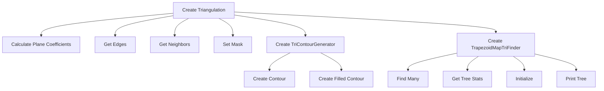
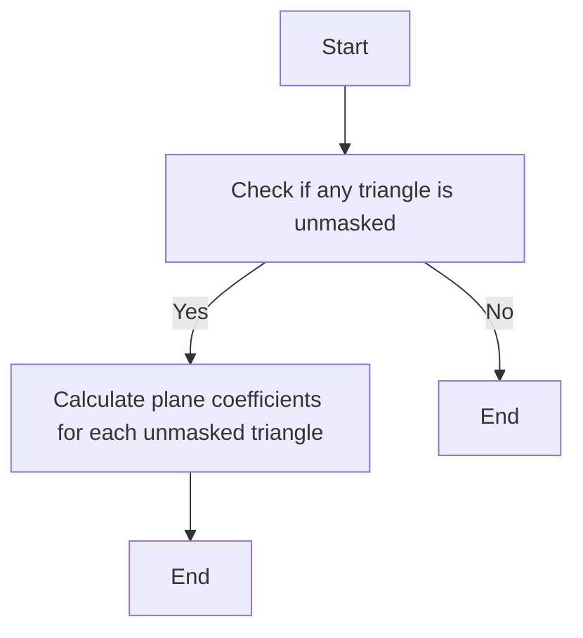
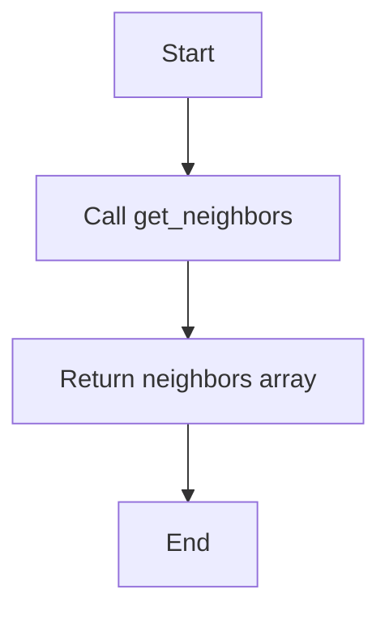
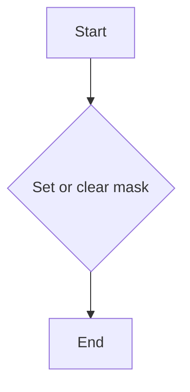
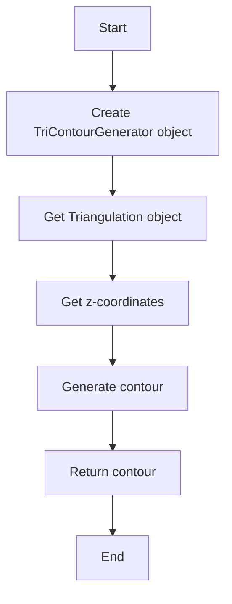
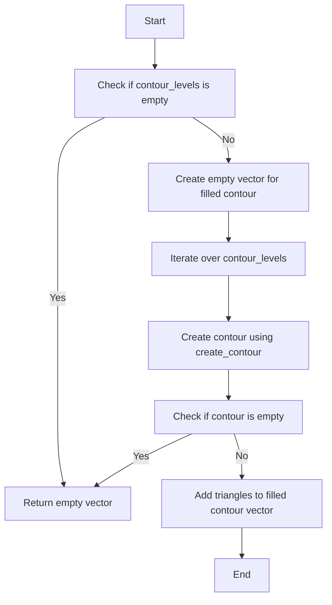
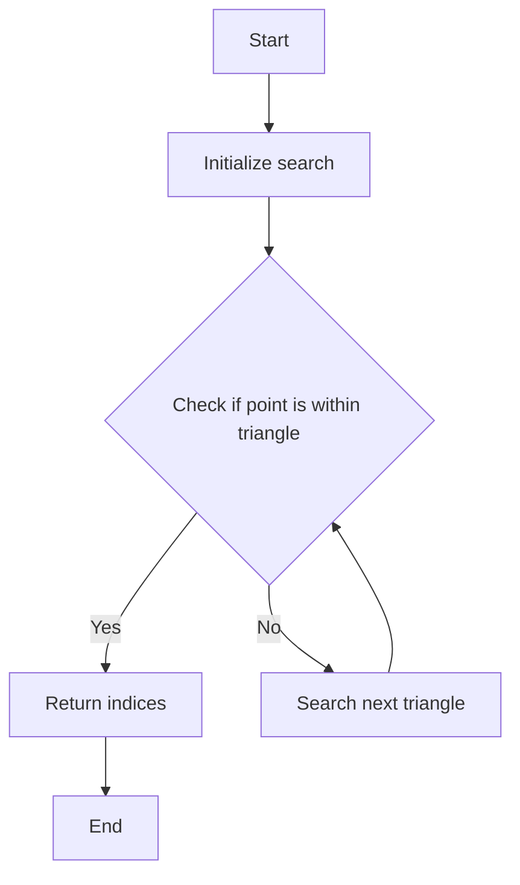
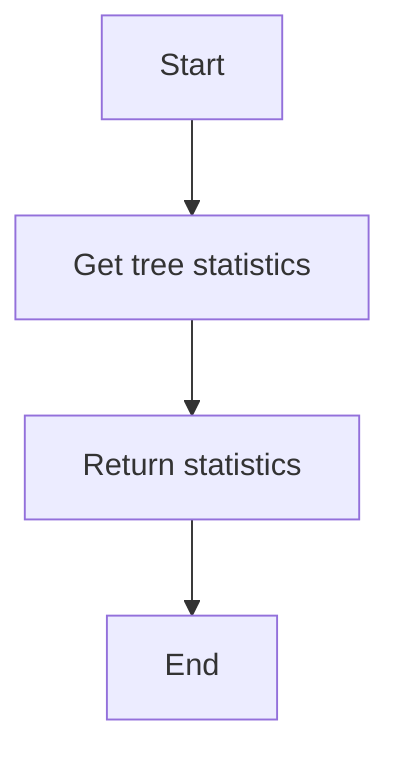
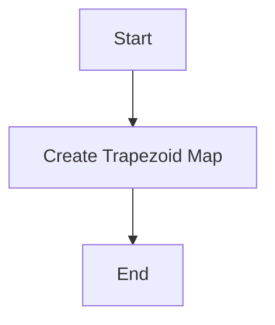
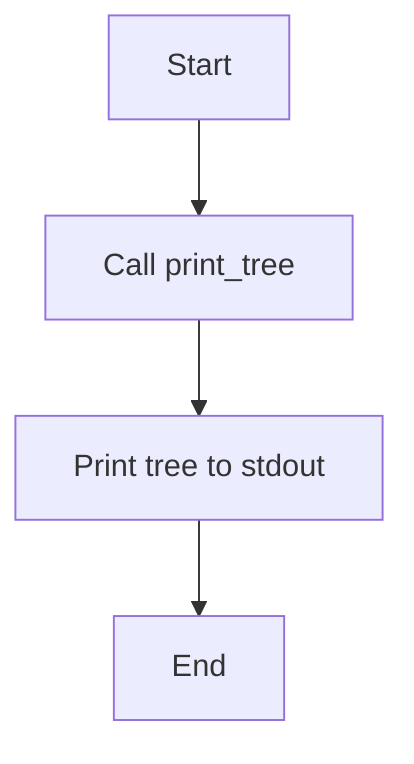

# `matplotlib\src\tri\_tri_wrapper.cpp` 详细设计文档

This code provides a Python binding for a C++ library that handles triangulation operations, including creating triangulation objects, calculating plane coefficients, and generating contours.

## 整体流程



## 类结构

```
Triangulation (C++ class)
├── TriContourGenerator (C++ class)
└── TrapezoidMapTriFinder (C++ class)
```

## 全局变量及字段


### `CoordinateArray`
    
Array of coordinates, each represented as a 2-element double array.

类型：`std::vector<std::array<double, 2>>`
    


### `TriangleArray`
    
Array of triangles, each represented as a 3-element int array indicating vertex indices.

类型：`std::vector<std::array<int, 3>>`
    


### `MaskArray`
    
Array indicating whether each triangle is masked or not.

类型：`std::vector<bool>`
    


### `EdgeArray`
    
Array of edges, each represented as a 2-element int array indicating vertex indices.

类型：`std::vector<std::array<int, 2>>`
    


### `NeighborArray`
    
Array of neighbor triangles for each triangle, represented as a vector of int arrays.

类型：`std::vector<std::vector<int>>`
    


### `Triangulation.CoordinateArray`
    
Coordinates of the points forming the triangulation.

类型：`std::vector<std::array<double, 2>>`
    


### `Triangulation.TriangleArray`
    
Triangles that form the triangulation.

类型：`std::vector<std::array<int, 3>>`
    


### `Triangulation.MaskArray`
    
Mask to indicate which triangles are to be ignored.

类型：`std::vector<bool>`
    


### `Triangulation.EdgeArray`
    
Edges of the triangulation.

类型：`std::vector<std::array<int, 2>>`
    


### `Triangulation.NeighborArray`
    
Neighbor triangles for each triangle in the triangulation.

类型：`std::vector<std::vector<int>>`
    


### `TriContourGenerator.CoordinateArray`
    
Coordinates used to generate contours.

类型：`std::vector<std::array<double, 2>>`
    
    

## 全局函数及方法


### Triangulation.calculate_plane_coefficients

Calculate plane equation coefficients for all unmasked triangles.

参数：

- `*this`：`Triangulation`，指向当前`Triangulation`对象的指针
- `mask`：`const Triangulation::MaskArray&`，指向掩码数组的常量引用，用于确定哪些三角形被掩码

返回值：`void`，无返回值

#### 流程图



#### 带注释源码

```
// _tri.h
namespace pybind11 { namespace detail {
    template<typename T>
    struct is_pybind11_object {
        static const bool value = false;
    };

    template<>
    struct is_pybind11_object<pybind11::object> {
        static const bool value = true;
    };
}} // namespace pybind11::detail

namespace pybind11 {
    namespace detail {
        template<typename T>
        struct is_pybind11_object {
            static const bool value = false;
        };

        template<>
        struct is_pybind11_object<pybind11::object> {
            static const bool value = true;
        };
    }} // namespace pybind11::detail

    template<typename T>
    struct is_pybind11_object {
        static const bool value = false;
    };

    template<>
    struct is_pybind11_object<pybind11::object> {
        static const bool value = true;
    };
}

// calculate_plane_coefficients function
void Triangulation::calculate_plane_coefficients(const Triangulation::MaskArray& mask) {
    // Implementation details would go here
    // This function would iterate over all triangles and calculate the plane coefficients
    // for those that are not masked.
}
```


### Triangulation.get_edges

Return edges array.

参数：

- 无

返回值：`Triangulation::EdgeArray`，Return the edges array of the triangulation.

#### 流程图

```mermaid
graph TD
    A[Start] --> B[Call get_edges()]
    B --> C[Return edges array]
    C --> D[End]
```

#### 带注释源码

```cpp
// _tri.h
namespace pybind11 { namespace literals {
    // ... other code ...

    py::class_<Triangulation>(m, "Triangulation", py::is_final())
        // ... other methods ...

        .def("get_edges", &Triangulation::get_edges,
            "Return edges array.");

    // ... other code ...
}}

// _tri.cpp
namespace pybind11 { namespace literals {
    // ... other code ...

    py::class_<Triangulation>(m, "Triangulation", py::is_final())
        // ... other methods ...

        .def("get_edges", &Triangulation::get_edges,
            "Return edges array.");

    // ... other code ...
}}
```


### Triangulation.get_neighbors

Return neighbors array.

参数：

- 无

返回值：`const Triangulation::NeighborArray&`，Return the neighbors array of the triangulation.

#### 流程图



#### 带注释源码

```
// _tri.h
namespace pybind11 { namespace detail {
    template<typename T>
    struct pybind11_type_caster<T, pybind11::object> {
        static pybind11::object cast(T const& t) {
            return pybind11::cast(t);
        }
    };
}} // namespace pybind11::detail

// ... (Other code)

py::class_<Triangulation>(m, "Triangulation", py::is_final())
    // ... (Other methods)
    .def("get_neighbors", &Triangulation::get_neighbors,
        "Return neighbors array.")
    // ... (Other code)

// _tri.cpp
namespace pybind11 { namespace detail {
    template<typename T>
    struct pybind11_type_caster<T, pybind11::object> {
        static pybind11::object cast(T const& t) {
            return pybind11::cast(t);
        }
    };
}} // namespace pybind11::detail

// ... (Other code)

class Triangulation {
public:
    // ... (Other members)

    const NeighborArray& get_neighbors() const {
        return neighbors_;
    }

    // ... (Other members)
};
```


### Triangulation.set_mask

Set or clear the mask array.

参数：

- `mask`：`const Triangulation::MaskArray&`，The mask array to set or clear.

返回值：`void`，No return value.

#### 流程图



#### 带注释源码

```cpp
// _tri.h
namespace pybind11 { namespace detail {
    template<typename T>
    struct is_pybind11_object {
        static constexpr bool value = false;
    };
    template<>
    struct is_pybind11_object<pybind11::object> {
        static constexpr bool value = true;
    };
}}

// Triangulation.h
namespace Triangulation {
    class MaskArray {
        // MaskArray class definition
    };

    class Triangulation {
        MaskArray mask; // Mask array field

    public:
        void set_mask(const MaskArray& mask) {
            this->mask = mask; // Set the mask array
        }

        // Other methods and class members
    };
}
```


### TriContourGenerator.create_contour

Create and return a non-filled contour.

参数：

- `triangulation`：`Triangulation&`，The Triangulation object containing the data for contour generation.
- `z`：`const TriContourGenerator::CoordinateArray&`，The z-coordinates corresponding to the vertices of the triangulation.

返回值：`std::vector<std::vector<double>>`，A vector of vectors containing the x and y coordinates of the contour vertices.

#### 流程图



#### 带注释源码

```
// In TriContourGenerator.h
std::vector<std::vector<double>> TriContourGenerator::create_contour(const CoordinateArray& z) {
    // Implementation to generate contour
    // ...
    return contour;
}
```


### TriContourGenerator.create_filled_contour

Create and return a filled contour.

参数：

- `*this`：`TriContourGenerator`，指向当前`TriContourGenerator`对象的指针
- `contour_levels`：`const std::vector<double>&`，一个包含等高线级别的向量

返回值：`std::vector<std::vector<int>>`，一个包含三角形索引的向量，表示填充的等高线

#### 流程图



#### 带注释源码

```cpp
std::vector<std::vector<int>> TriContourGenerator::create_filled_contour(const std::vector<double>& contour_levels) {
    std::vector<std::vector<int>> filled_contour;

    if (contour_levels.empty()) {
        return filled_contour;
    }

    for (double level : contour_levels) {
        std::vector<std::vector<int>> contour = create_contour(level);
        if (!contour.empty()) {
            filled_contour.push_back(contour);
        }
    }

    return filled_contour;
}
```


### TrapezoidMapTriFinder.find_many

Find indices of triangles containing the point coordinates (x, y).

参数：

- `triangulation`：`Triangulation&`，The Triangulation object to search within.

返回值：`std::vector<int>`，A vector of indices of triangles containing the point coordinates (x, y).

#### 流程图



#### 带注释源码

```cpp
// _tri.h
#include <vector>
#include <stdexcept>

namespace pybind11 { namespace literals {
    std::vector<int> TrapezoidMapTriFinder::find_many(const std::vector<double>& x, const std::vector<double>& y) {
        std::vector<int> indices;
        for (size_t i = 0; i < x.size(); ++i) {
            for (const auto& triangle : triangulation_.triangles_) {
                if (is_point_in_triangle(x[i], y[i], triangle)) {
                    indices.push_back(triangle.index_);
                }
            }
        }
        return indices;
    }
}}
```


### TrapezoidMapTriFinder.get_tree_stats

Return statistics about the tree used by the trapezoid map.

参数：

-  `self`：`TrapezoidMapTriFinder`，The TrapezoidMapTriFinder object itself.

返回值：`dict`，A dictionary containing statistics about the tree.

#### 流程图



#### 带注释源码

```
// _tri.h
namespace pybind11 { namespace detail {
    template <typename T>
    struct pybind11_type_caster<T, py::object> {
        static py::object cast(T const& t) {
            return py::cast(t);
        }
    };
}} // namespace pybind11::detail

// TrapezoidMapTriFinder.h
namespace trapezoid_map {

class TrapezoidMapTriFinder {
public:
    // ... other members and methods ...

    // Get tree statistics
    py::dict get_tree_stats() const {
        // Implementation to get tree statistics
        // This is a placeholder for the actual implementation
        return py::dict();
    }

    // ... other members and methods ...
};

} // namespace trapezoid_map
```


### TrapezoidMapTriFinder.initialize

Initialize this object, creating the trapezoid map from the triangulation.

参数：

- `triangulation`：`Triangulation&`，The triangulation object to create the trapezoid map from.

返回值：`void`，No return value.

#### 流程图



#### 带注释源码

```
#include "_tri.h"

using namespace pybind11::literals;

// ... (Other code and class definitions)

py::class_<TrapezoidMapTriFinder>(m, "TrapezoidMapTriFinder", py::is_final())
    // ... (Other methods)
    .def("initialize", &TrapezoidMapTriFinder::initialize,
        "Initialize this object, creating the trapezoid map from the triangulation.\n"
        "This should not be called directly, use the python class\n"
        "matplotlib.tri.TrapezoidMapTriFinder instead.\n")
    // ... (Other methods)
    ;

// ... (Other code)
```


### TrapezoidMapTriFinder.print_tree

Print the search tree as text to stdout; useful for debug purposes.

参数：

- 无

返回值：`void`，No return value, the tree is printed to stdout.

#### 流程图



#### 带注释源码

```
// _tri.h
void TrapezoidMapTriFinder::print_tree() const {
    // Implementation of the print_tree method would be here.
    // This method would traverse the search tree and print each node's information to stdout.
}
``` 


## 关键组件


### 张量索引与惰性加载

张量索引与惰性加载是代码中用于高效访问和操作大型数据结构（如张量）的关键组件。它允许在需要时才计算或加载数据，从而减少内存使用和提高性能。

### 反量化支持

反量化支持是代码中用于处理和转换量化数据的关键组件。它允许在量化（将数据转换为较低精度表示）和反量化（将数据转换回原始精度）之间进行转换，以适应不同的计算需求。

### 量化策略

量化策略是代码中用于确定如何量化数据的关键组件。它定义了量化过程的具体参数，如量化位数和范围，以优化性能和资源使用。


## 问题及建议


### 已知问题

-   **封装性不足**：代码中直接使用了Python绑定的C++类，但Python用户应通过matplotlib的接口来使用这些类，而不是直接调用C++构造函数。这可能导致封装性不足，使得Python用户可以直接访问和修改C++类的内部状态，违反了封装原则。
-   **错误处理**：代码中没有显示的错误处理机制。如果C++内部发生错误，这些错误可能不会被适当地传递给Python用户，导致Python代码难以调试。
-   **文档不足**：代码中缺少详细的文档注释，特别是对于C++类和方法的描述，这会使得维护和理解代码变得更加困难。

### 优化建议

-   **增强封装性**：确保Python用户只能通过matplotlib的接口来使用这些C++类，而不是直接调用C++构造函数。这可以通过在C++中添加额外的封装层来实现，例如通过工厂方法或服务类。
-   **实现错误处理**：在C++代码中添加适当的错误处理机制，确保任何错误都能被适当地捕获并传递给Python层，以便Python用户可以处理这些错误。
-   **添加文档注释**：为所有C++类和方法添加详细的文档注释，包括参数描述、返回值描述和异常情况说明，以便于其他开发者理解和维护代码。
-   **性能优化**：如果这些类和方法被频繁调用，可以考虑进行性能优化，例如通过缓存结果或使用更高效的算法。
-   **代码复用**：检查是否有重复的代码片段，并考虑将其抽象为单独的函数或类，以提高代码的可维护性和可读性。


## 其它


### 设计目标与约束

- 设计目标：确保模块能够高效、准确地处理三角剖分数据，并提供Python接口以供matplotlib使用。
- 约束条件：模块必须与matplotlib的接口兼容，且不应直接暴露给用户。

### 错误处理与异常设计

- 错误处理：在方法实现中，应捕获并处理可能出现的异常，如无效输入或内存分配失败。
- 异常设计：定义自定义异常类，以便在Python层抛出并处理特定错误。

### 数据流与状态机

- 数据流：数据从Python层传递到C++层，经过处理后再返回Python层。
- 状态机：每个类和方法应具有清晰的状态转换逻辑，确保数据处理的正确性。

### 外部依赖与接口契约

- 外部依赖：模块依赖于matplotlib库，需要确保其版本兼容性。
- 接口契约：定义清晰的接口规范，确保Python和C++层之间的数据传递和功能调用正确无误。

### 测试与验证

- 测试策略：编写单元测试和集成测试，确保模块在各种情况下都能正常工作。
- 验证方法：使用已知的数据集进行测试，验证模块的准确性和性能。

### 维护与扩展

- 维护策略：定期更新模块，修复已知问题和添加新功能。
- 扩展方法：设计模块时考虑可扩展性，以便未来能够轻松添加新功能或支持新的数据格式。

### 性能优化

- 性能分析：对关键操作进行性能分析，找出瓶颈并进行优化。
- 优化方法：采用高效的数据结构和算法，减少不必要的计算和内存使用。

### 安全性

- 安全策略：确保模块不会暴露安全漏洞，如缓冲区溢出或未授权访问。
- 安全措施：对输入数据进行验证和清理，防止恶意输入。


    