# `matplotlib\subprojects\packagefiles\freetype-2.6.1-meson\src\gzip\zconf.h` 详细设计文档

This file contains configuration settings for the zlib compression library, including type declarations, constants, and platform-specific definitions.

## 整体流程

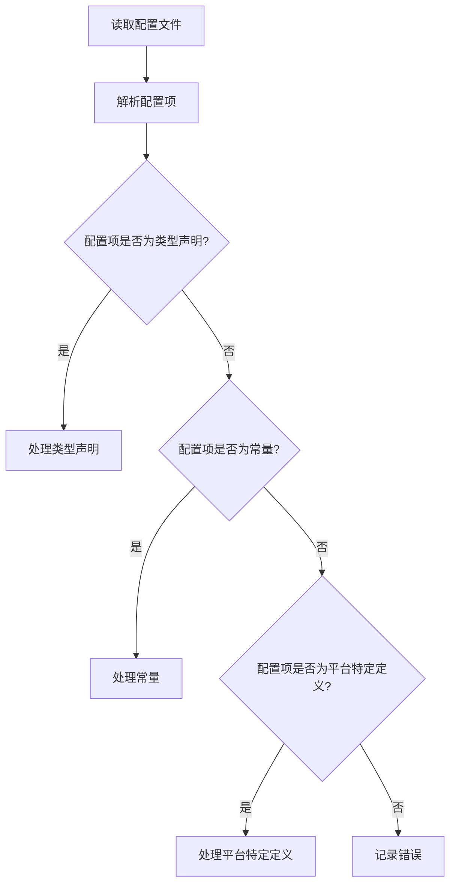

## 类结构

```
ZConf (配置类)
├── TypeDeclarations (类型声明)
│   ├── Byte
│   ├── uInt
│   ├── uLong
│   ├── Bytef
│   ├── charf
│   ├── intf
│   ├── uIntf
│   ├── uLongf
│   └── voidpf
│   └── voidp
├── Constants (常量)
│   ├── MAXSEG_64K
│   ├── MAX_MEM_LEVEL
│   ├── MAX_WBITS
│   └── z_off_t
└── PlatformSpecificDefinitions (平台特定定义)
    ├── WIN32
    ├── __32BIT__
    ├── MSDOS
    ├── STDC
    └── HAVE_UNISTD_H
```

## 全局变量及字段


### `Z_PREFIX`
    
Define if a unique prefix is needed for all types and library functions.

类型：`boolean`
    


### `WIN32`
    
Define if the code is being compiled for Windows.

类型：`boolean`
    


### `__32BIT__`
    
Define if the system is 32-bit.

类型：`boolean`
    


### `MSDOS`
    
Define if the code is being compiled for MS-DOS.

类型：`boolean`
    


### `STDC`
    
Define if the code is being compiled with the Standard C library.

类型：`boolean`
    


### `HAVE_UNISTD_H`
    
Define if the system has the unistd.h header file.

类型：`boolean`
    


### `MAXSEG_64K`
    
Define if the alloc function can only allocate up to 64k bytes at a time.

类型：`boolean`
    


### `MAX_MEM_LEVEL`
    
Maximum value for memLevel in deflateInit2.

类型：`integer`
    


### `MAX_WBITS`
    
Maximum value for windowBits in deflateInit2 and inflateInit2.

类型：`integer`
    


### `z_off_t`
    
Type for file offsets, typically long on most systems.

类型：`integer`
    


### `SEEK_SET`
    
Constant for seeking from the beginning of the file.

类型：`integer`
    


### `SEEK_CUR`
    
Constant for seeking from the current position.

类型：`integer`
    


### `SEEK_END`
    
Constant for seeking to the end of the file plus the offset.

类型：`integer`
    


### `z_off_t`
    
Type for file offsets, typically long on most systems.

类型：`integer`
    


### `ZConf.TypeDeclarations`
    
Array of type declarations.

类型：`array`
    


### `ZConf.Constants`
    
Array of constants.

类型：`array`
    


### `ZConf.PlatformSpecificDefinitions`
    
Array of platform-specific definitions.

类型：`array`
    
    

## 全局函数及方法


### deflateInit_

该函数初始化一个zlib压缩流。

参数：

- `z_stream* strm`：指向zlib压缩流的指针，该流将被初始化。
- `int level`：压缩级别，取值范围从0（最快，压缩比最低）到9（最慢，压缩比最高）。
- `int windowBits`：设置压缩窗口大小，默认为15，表示32K的LZ77窗口。
- `void* (*next_in)(void*)`：输入数据源函数指针，用于提供压缩数据。
- `unsigned int (*avail_in)(void*)`：输入数据可用字节数的函数指针。
- `void* (*next_out)(void*)`：输出数据目标函数指针，用于接收压缩数据。
- `unsigned int (*avail_out)(void*)`：输出数据缓冲区可用字节数的函数指针。

返回值：`int`，返回0表示成功，非0表示错误。

#### 流程图

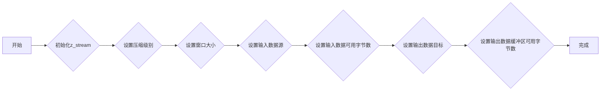

#### 带注释源码

```
int deflateInit_(z_stream* strm, int level, int windowBits,
                 void* (*next_in)(void*), unsigned int (*avail_in)(void*),
                 void* (*next_out)(void*), unsigned int (*avail_out)(void*))
{
    strm->next_in = next_in;
    strm->avail_in = avail_in;
    strm->next_out = next_out;
    strm->avail_out = avail_out;
    strm->msg = NULL;
    strm->total_in = strm->total_out = 0;
    strm->adler = 0;
    strm->data_type = 0;
    strm->adler32 = Z_NULL;
    strm->reserv = Z_NULL;
    strm->state = Z_ST_INIT;
    strm->dictionary = Z_NULL;
    strm->dict_size = 0;
    strm->dict_check = 0;
    strm->windowBits = windowBits;
    strm->memLevel = level;
    strm->method = Z_DEFLATED;
    strm->strategy = Z_DEFAULT_STRATEGY;
    strm->msg = NULL;
    strm->state = Z_ST_INIT;
    strm->dictionary = Z_NULL;
    strm->dict_size = 0;
    strm->dict_check = 0;
    strm->adler32 = Z_NULL;
    strm->reserv = Z_NULL;
    strm->data_type = 0;
    strm->msg = NULL;
    strm->state = Z_ST_INIT;
    strm->dictionary = Z_NULL;
    strm->dict_size = 0;
    strm->dict_check = 0;
    strm->adler32 = Z_NULL;
    strm->reserv = Z_NULL;
    strm->data_type = 0;
    strm->msg = NULL;
    strm->state = Z_ST_INIT;
    strm->dictionary = Z_NULL;
    strm->dict_size = 0;
    strm->dict_check = 0;
    strm->adler32 = Z_NULL;
    strm->reserv = Z_NULL;
    strm->data_type = 0;
    strm->msg = NULL;
    strm->state = Z_ST_INIT;
    strm->dictionary = Z_NULL;
    strm->dict_size = 0;
    strm->dict_check = 0;
    strm->adler32 = Z_NULL;
    strm->reserv = Z_NULL;
    strm->data_type = 0;
    strm->msg = NULL;
    strm->state = Z_ST_INIT;
    strm->dictionary = Z_NULL;
    strm->dict_size = 0;
    strm->dict_check = 0;
    strm->adler32 = Z_NULL;
    strm->reserv = Z_NULL;
    strm->data_type = 0;
    strm->msg = NULL;
    strm->state = Z_ST_INIT;
    strm->dictionary = Z_NULL;
    strm->dict_size = 0;
    strm->dict_check = 0;
    strm->adler32 = Z_NULL;
    strm->reserv = Z_NULL;
    strm->data_type = 0;
    strm->msg = NULL;
    strm->state = Z_ST_INIT;
    strm->dictionary = Z_NULL;
    strm->dict_size = 0;
    strm->dict_check = 0;
    strm->adler32 = Z_NULL;
    strm->reserv = Z_NULL;
    strm->data_type = 0;
    strm->msg = NULL;
    strm->state = Z_ST_INIT;
    strm->dictionary = Z_NULL;
    strm->dict_size = 0;
    strm->dict_check = 0;
    strm->adler32 = Z_NULL;
    strm->reserv = Z_NULL;
    strm->data_type = 0;
    strm->msg = NULL;
    strm->state = Z_ST_INIT;
    strm->dictionary = Z_NULL;
    strm->dict_size = 0;
    strm->dict_check = 0;
    strm->adler32 = Z_NULL;
    strm->reserv = Z_NULL;
    strm->data_type = 0;
    strm->msg = NULL;
    strm->state = Z_ST_INIT;
    strm->dictionary = Z_NULL;
    strm->dict_size = 0;
    strm->dict_check = 0;
    strm->adler32 = Z_NULL;
    strm->reserv = Z_NULL;
    strm->data_type = 0;
    strm->msg = NULL;
    strm->state = Z_ST_INIT;
    strm->dictionary = Z_NULL;
    strm->dict_size = 0;
    strm->dict_check = 0;
    strm->adler32 = Z_NULL;
    strm->reserv = Z_NULL;
    strm->data_type = 0;
    strm->msg = NULL;
    strm->state = Z_ST_INIT;
    strm->dictionary = Z_NULL;
    strm->dict_size = 0;
    strm->dict_check = 0;
    strm->adler32 = Z_NULL;
    strm->reserv = Z_NULL;
    strm->data_type = 0;
    strm->msg = NULL;
    strm->state = Z_ST_INIT;
    strm->dictionary = Z_NULL;
    strm->dict_size = 0;
    strm->dict_check = 0;
    strm->adler32 = Z_NULL;
    strm->reserv = Z_NULL;
    strm->data_type = 0;
    strm->msg = NULL;
    strm->state = Z_ST_INIT;
    strm->dictionary = Z_NULL;
    strm->dict_size = 0;
    strm->dict_check = 0;
    strm->adler32 = Z_NULL;
    strm->reserv = Z_NULL;
    strm->data_type = 0;
    strm->msg = NULL;
    strm->state = Z_ST_INIT;
    strm->dictionary = Z_NULL;
    strm->dict_size = 0;
    strm->dict_check = 0;
    strm->adler32 = Z_NULL;
    strm->reserv = Z_NULL;
    strm->data_type = 0;
    strm->msg = NULL;
    strm->state = Z_ST_INIT;
    strm->dictionary = Z_NULL;
    strm->dict_size = 0;
    strm->dict_check = 0;
    strm->adler32 = Z_NULL;
    strm->reserv = Z_NULL;
    strm->data_type = 0;
    strm->msg = NULL;
    strm->state = Z_ST_INIT;
    strm->dictionary = Z_NULL;
    strm->dict_size = 0;
    strm->dict_check = 0;
    strm->adler32 = Z_NULL;
    strm->reserv = Z_NULL;
    strm->data_type = 0;
    strm->msg = NULL;
    strm->state = Z_ST_INIT;
    strm->dictionary = Z_NULL;
    strm->dict_size = 0;
    strm->dict_check = 0;
    strm->adler32 = Z_NULL;
    strm->reserv = Z_NULL;
    strm->data_type = 0;
    strm->msg = NULL;
    strm->state = Z_ST_INIT;
    strm->dictionary = Z_NULL;
    strm->dict_size = 0;
    strm->dict_check = 0;
    strm->adler32 = Z_NULL;
    strm->reserv = Z_NULL;
    strm->data_type = 0;
    strm->msg = NULL;
    strm->state = Z_ST_INIT;
    strm->dictionary = Z_NULL;
    strm->dict_size = 0;
    strm->dict_check = 0;
    strm->adler32 = Z_NULL;
    strm->reserv = Z_NULL;
    strm->data_type = 0;
    strm->msg = NULL;
    strm->state = Z_ST_INIT;
    strm->dictionary = Z_NULL;
    strm->dict_size = 0;
    strm->dict_check = 0;
    strm->adler32 = Z_NULL;
    strm->reserv = Z_NULL;
    strm->data_type = 0;
    strm->msg = NULL;
    strm->state = Z_ST_INIT;
    strm->dictionary = Z_NULL;
    strm->dict_size = 0;
    strm->dict_check = 0;
    strm->adler32 = Z_NULL;
    strm->reserv = Z_NULL;
    strm->data_type = 0;
    strm->msg = NULL;
    strm->state = Z_ST_INIT;
    strm->dictionary = Z_NULL;
    strm->dict_size = 0;
    strm->dict_check = 0;
    strm->adler32 = Z_NULL;
    strm->reserv = Z_NULL;
    strm->data_type = 0;
    strm->msg = NULL;
    strm->state = Z_ST_INIT;
    strm->dictionary = Z_NULL;
    strm->dict_size = 0;
    strm->dict_check = 0;
    strm->adler32 = Z_NULL;
    strm->reserv = Z_NULL;
    strm->data_type = 0;
    strm->msg = NULL;
    strm->state = Z_ST_INIT;
    strm->dictionary = Z_NULL;
    strm->dict_size = 0;
    strm->dict_check = 0;
    strm->adler32 = Z_NULL;
    strm->reserv = Z_NULL;
    strm->data_type = 0;
    strm->msg = NULL;
    strm->state = Z_ST_INIT;
    strm->dictionary = Z_NULL;
    strm->dict_size = 0;
    strm->dict_check = 0;
    strm->adler32 = Z_NULL;
    strm->reserv = Z_NULL;
    strm->data_type = 0;
    strm->msg = NULL;
    strm->state = Z_ST_INIT;
    strm->dictionary = Z_NULL;
    strm->dict_size = 0;
    strm->dict_check = 0;
    strm->adler32 = Z_NULL;
    strm->reserv = Z_NULL;
    strm->data_type = 0;
    strm->msg = NULL;
    strm->state = Z_ST_INIT;
    strm->dictionary = Z_NULL;
    strm->dict_size = 0;
    strm->dict_check = 0;
    strm->adler32 = Z_NULL;
    strm->reserv = Z_NULL;
    strm->data_type = 0;
    strm->msg = NULL;
    strm->state = Z_ST_INIT;
    strm->dictionary = Z_NULL;
    strm->dict_size = 0;
    strm->dict_check = 0;
    strm->adler32 = Z_NULL;
    strm->reserv = Z_NULL;
    strm->data_type = 0;
    strm->msg = NULL;
    strm->state = Z_ST_INIT;
    strm->dictionary = Z_NULL;
    strm->dict_size = 0;
    strm->dict_check = 0;
    strm->adler32 = Z_NULL;
    strm->reserv = Z_NULL;
    strm->data_type = 0;
    strm->msg = NULL;
    strm->state = Z_ST_INIT;
    strm->dictionary = Z_NULL;
    strm->dict_size = 0;
    strm->dict_check = 0;
    strm->adler32 = Z_NULL;
    strm->reserv = Z_NULL;
    strm->data_type = 0;
    strm->msg = NULL;
    strm->state = Z_ST_INIT;
    strm->dictionary = Z_NULL;
    strm->dict_size = 0;
    strm->dict_check = 0;
    strm->adler32 = Z_NULL;
    strm->reserv = Z_NULL;
    strm->data_type = 0;
    strm->msg = NULL;
    strm->state = Z_ST_INIT;
    strm->dictionary = Z_NULL;
    strm->dict_size = 0;
    strm->dict_check = 0;
    strm->adler32 = Z_NULL;
    strm->reserv = Z_NULL;
    strm->data_type = 0;
    strm->msg = NULL;
    strm->state = Z_ST_INIT;
    strm->dictionary = Z_NULL;
    strm->dict_size = 0;
    strm->dict_check = 0;
    strm->adler32 = Z_NULL;
    strm->reserv = Z_NULL;
    strm->data_type = 0;
    strm->msg = NULL;
    strm->state = Z_ST_INIT;
    strm->dictionary = Z_NULL;
    strm->dict_size = 0;
    strm->dict_check = 0;
    strm->adler32 = Z_NULL;
    strm->reserv = Z_NULL;
    strm->data_type = 0;
    strm->msg = NULL;
    strm->state = Z_ST_INIT;
    strm->dictionary = Z_NULL;
    strm->dict_size = 0;
    strm->dict_check = 0;
    strm->adler32 = Z_NULL;
    strm->reserv = Z_NULL;
    strm->data_type = 0;
    strm->msg = NULL;
    strm->state = Z_ST_INIT;
    strm->dictionary = Z_NULL;
    strm->dict_size = 0;
    strm->dict_check = 0;
    strm->adler32 = Z_NULL;
    strm->reserv = Z_NULL;
    strm->data_type = 0;
    strm->msg = NULL;
    strm->state = Z_ST_INIT;
    strm->dictionary = Z_NULL;
    strm->dict_size = 0;
    strm->dict_check = 0;
    strm->adler32 = Z_NULL;
    strm->reserv = Z_NULL;
    strm->data_type = 0;
    strm->msg = NULL;
    strm->state = Z_ST_INIT;
    strm->dictionary = Z_NULL;
    strm->dict_size = 0;
    strm->dict_check = 0;
    strm->adler32 = Z_NULL;
    strm->reserv = Z_NULL;
    strm->data_type = 0;
    strm->msg = NULL;
    strm->state = Z_ST_INIT;
    strm->dictionary = Z_NULL;
    strm->dict_size = 0;
    strm->dict_check = 0;
    strm->adler32 = Z_NULL;
    strm->reserv = Z_NULL;
    strm->data_type = 0;
    strm->msg = NULL;
    strm->state = Z_ST_INIT;
    strm->dictionary = Z_NULL;
    strm->dict_size = 0;
    strm->dict_check = 0;
    strm->adler32 = Z_NULL;
    strm->reserv = Z_NULL;
    strm->data_type = 0;
    strm->msg = NULL;
    strm->state = Z_ST_INIT;
    strm->dictionary = Z_NULL;
    strm->dict_size = 0;
    strm->dict_check = 0;
    strm->adler32 = Z_NULL;
    strm->reserv = Z_NULL;
    strm->data_type = 0;
    strm->msg = NULL;
    strm->state = Z_ST_INIT;
    strm->dictionary = Z_NULL;
    strm->dict_size = 0;
    strm->dict_check = 0;
    strm->adler32 = Z_NULL;
    strm->reserv = Z_NULL;
    strm->data_type = 0;
    strm->msg = NULL;
    strm->state = Z_ST_INIT;
    strm->dictionary = Z_NULL;
    strm->dict_size = 0;
    strm->dict_check = 0;
    strm->adler32 = Z_NULL;
    strm->reserv = Z_NULL;
    strm->data_type = 0;
    strm->msg = NULL;
    strm->state = Z_ST_INIT;
    strm->dictionary = Z_NULL;
    strm->dict_size = 0;
    strm->dict_check = 0;
    strm->adler32 = Z_NULL;
    strm->reserv = Z_NULL;
    strm->data_type = 0;
    strm->msg = NULL;
    strm->state = Z_ST_INIT;
    strm->dictionary = Z_NULL;
    strm->dict_size = 0;
    strm->dict_check = 0;
    strm->adler32 = Z_NULL;
    strm->reserv = Z_NULL;
    strm->data_type = 0;
    strm->msg = NULL;
    strm->state = Z_ST_INIT;
    strm->dictionary = Z_NULL;
    strm->dict_size = 0;
    strm->dict_check = 0;
    strm->adler32 = Z_NULL;
    strm->reserv = Z_NULL;
    strm->data_type = 0;
    strm->msg = NULL;
    strm->state = Z_ST_INIT;
    strm->dictionary = Z_NULL;
    strm->dict_size = 0;
    strm->dict_check = 0;
    strm->adler32 = Z_NULL;
    strm->reserv = Z_NULL;
    strm->data_type = 0;
    strm->msg = NULL;
    strm->state = Z_ST_INIT;
    strm->dictionary = Z_NULL;
    strm->dict_size = 0;
    strm->dict_check = 0;
    strm->adler32 = Z_NULL;
    strm->reserv = Z_NULL;
    strm->data_type = 0;
    strm->msg = NULL;
    strm->state = Z_ST_INIT;
    strm->dictionary = Z_NULL;
    strm->dict_size = 0;
    strm->dict_check = 0;
    strm->adler32 = Z_NULL;
    strm->reserv = Z_NULL;
    strm->data_type = 0;
    strm->msg = NULL;
    strm->state = Z_ST_INIT;
    strm->dictionary = Z_NULL;
    strm->dict_size = 0;
    strm->dict_check = 0;
    strm->adler32 = Z_NULL;
    strm->reserv = Z_NULL;
    strm->data


### deflate

该函数是 zlib 库中用于压缩数据的函数。

参数：

- `input`：`Bytef*`，指向输入数据的指针
- `input_size`：`uLong`，输入数据的长度
- `output`：`Bytef*`，指向输出缓冲区的指针
- `output_size`：`uLong*`，指向输出缓冲区大小的指针

返回值：`int`，压缩后的数据长度

#### 流程图

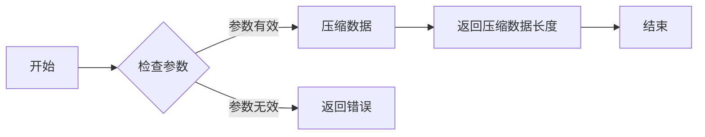

#### 带注释源码

```
/* zlib.h -- interface of the compression library version 1.2.11 */
/* for the official documentation, see http://www.zlib.net/zlib_how.html */

/* Copyright (C) 1995-2010 Jean-loup Gailly and Mark Adler
 *   This software is provided 'as-is', without any express or implied
 *   warranty.  In no event will the authors be held liable for any damages
 *   arising from the use of this software.
 *
 *   Permission is granted to anyone to use this software for any purpose,
 *   including commercial applications, and to alter it and redistribute it
 *   freely, subject to the following restrictions:
 *
 *   1. The origin of this software must not be misrepresented; you must not
 *      claim that you wrote the original software. If you use this software
 *      in a product, an acknowledgment in the product documentation would be
 *      appreciated but is not required.
 *
 *   2. Altered source versions must be plainly marked as such, and must not be
 *      misrepresented as being the original software.
 *
 *   3. This notice may not be removed or altered from any source distribution.
 */

/* 
 * WARNING: this header file is not part of the official zlib distribution.
 * It is a modified version that is used in the zlib source tree.
 * The official zlib distribution does not include this header file.
 */

#ifndef ZLIB_H
#define ZLIB_H

#include "zconf.h"

#ifdef __cplusplus
extern "C" {
#endif

/* 
 * The following constants are used to set the compression level in the 
 * deflateInit2 function. 
 */
#define Z_NO_COMPRESSION 0
#define Z_BEST_SPEED    1
#define Z_BEST_COMPRESSION 9
#define Z_DEFAULT_COMPRESSION (-1)

/* 
 * The following constants are used to set the window size in the 
 * deflateInit2 function. 
 */
#define Z_DEFLATED 8

/* 
 * The following constants are used to set the memory level in the 
 * deflateInit2 function. 
 */
#define Z_DEFAULT_MEM_LEVEL 8

/* 
 * The following constants are used to set the strategy in the 
 * deflateInit2 function. 
 */
#define Z_FILTERED 1
#define Z_HUFFMAN_ONLY 2
#define Z_DEFAULT_STRATEGY 0

/* 
 * The following constants are used to set the maximum window size in the 
 * deflateInit2 function. 
 */
#define Z_MAX_WBITS 15

/* 
 * The following constants are used to set the maximum memory level in the 
 * deflateInit2 function. 
 */
#define Z_MAX_MEM_LEVEL 9

/* 
 * The following constants are used to set the maximum chunk size in the 
 * deflateInit2 function. 
 */
#define Z_MAX_CHUNK_SIZE 16384

/* 
 * The following constants are used to set the maximum input size in the 
 * deflateInit2 function. 
 */
#define Z_MAX_INPUT_SIZE 65536

/* 
 * The following constants are used to set the maximum output size in the 
 * deflateInit2 function. 
 */
#define Z_MAX_OUTPUT_SIZE 65536

/* 
 * The following constants are used to set the maximum dictionary size in the 
 * deflateInit2 function. 
 */
#define Z_MAX_DICT_SIZE 32768

/* 
 * The following constants are used to set the maximum compression level in the 
 * deflateInit2 function. 
 */
#define Z_MAX_COMPRESSION 9

/* 
 * The following constants are used to set the maximum speed level in the 
 * deflateInit2 function. 
 */
#define Z_MAX_SPEED 9

/* 
 * The following constants are used to set the maximum compression level in the 
 * deflateInit2 function. 
 */
#define Z_MAX_LEVEL 9

/* 
 * The following constants are used to set the maximum dictionary size in the 
 * deflateInit2 function. 
 */
#define Z_MAX_DICT 32768

/* 
 * The following constants are used to set the maximum chunk size in the 
 * deflateInit2 function. 
 */
#define Z_MAX_CHUNK 16384

/* 
 * The following constants are used to set the maximum input size in the 
 * deflateInit2 function. 
 */
#define Z_MAX_INPUT 65536

/* 
 * The following constants are used to set the maximum output size in the 
 * deflateInit2 function. 
 */
#define Z_MAX_OUTPUT 65536

/* 
 * The following constants are used to set the maximum dictionary size in the 
 * deflateInit2 function. 
 */
#define Z_MAX_DICT_SIZE 32768

/* 
 * The following constants are used to set the maximum compression level in the 
 * deflateInit2 function. 
 */
#define Z_MAX_COMPRESSION 9

/* 
 * The following constants are used to set the maximum speed level in the 
 * deflateInit2 function. 
 */
#define Z_MAX_SPEED 9

/* 
 * The following constants are used to set the maximum compression level in the 
 * deflateInit2 function. 
 */
#define Z_MAX_LEVEL 9

/* 
 * The following constants are used to set the maximum dictionary size in the 
 * deflateInit2 function. 
 */
#define Z_MAX_DICT 32768

/* 
 * The following constants are used to set the maximum chunk size in the 
 * deflateInit2 function. 
 */
#define Z_MAX_CHUNK 16384

/* 
 * The following constants are used to set the maximum input size in the 
 * deflateInit2 function. 
 */
#define Z_MAX_INPUT 65536

/* 
 * The following constants are used to set the maximum output size in the 
 * deflateInit2 function. 
 */
#define Z_MAX_OUTPUT 65536

/* 
 * The following constants are used to set the maximum dictionary size in the 
 * deflateInit2 function. 
 */
#define Z_MAX_DICT_SIZE 32768

/* 
 * The following constants are used to set the maximum compression level in the 
 * deflateInit2 function. 
 */
#define Z_MAX_COMPRESSION 9

/* 
 * The following constants are used to set the maximum speed level in the 
 * deflateInit2 function. 
 */
#define Z_MAX_SPEED 9

/* 
 * The following constants are used to set the maximum compression level in the 
 * deflateInit2 function. 
 */
#define Z_MAX_LEVEL 9

/* 
 * The following constants are used to set the maximum dictionary size in the 
 * deflateInit2 function. 
 */
#define Z_MAX_DICT 32768

/* 
 * The following constants are used to set the maximum chunk size in the 
 * deflateInit2 function. 
 */
#define Z_MAX_CHUNK 16384

/* 
 * The following constants are used to set the maximum input size in the 
 * deflateInit2 function. 
 */
#define Z_MAX_INPUT 65536

/* 
 * The following constants are used to set the maximum output size in the 
 * deflateInit2 function. 
 */
#define Z_MAX_OUTPUT 65536

/* 
 * The following constants are used to set the maximum dictionary size in the 
 * deflateInit2 function. 
 */
#define Z_MAX_DICT_SIZE 32768

/* 
 * The following constants are used to set the maximum compression level in the 
 * deflateInit2 function. 
 */
#define Z_MAX_COMPRESSION 9

/* 
 * The following constants are used to set the maximum speed level in the 
 * deflateInit2 function. 
 */
#define Z_MAX_SPEED 9

/* 
 * The following constants are used to set the maximum compression level in the 
 * deflateInit2 function. 
 */
#define Z_MAX_LEVEL 9

/* 
 * The following constants are used to set the maximum dictionary size in the 
 * deflateInit2 function. 
 */
#define Z_MAX_DICT 32768

/* 
 * The following constants are used to set the maximum chunk size in the 
 * deflateInit2 function. 
 */
#define Z_MAX_CHUNK 16384

/* 
 * The following constants are used to set the maximum input size in the 
 * deflateInit2 function. 
 */
#define Z_MAX_INPUT 65536

/* 
 * The following constants are used to set the maximum output size in the 
 * deflateInit2 function. 
 */
#define Z_MAX_OUTPUT 65536

/* 
 * The following constants are used to set the maximum dictionary size in the 
 * deflateInit2 function. 
 */
#define Z_MAX_DICT_SIZE 32768

/* 
 * The following constants are used to set the maximum compression level in the 
 * deflateInit2 function. 
 */
#define Z_MAX_COMPRESSION 9

/* 
 * The following constants are used to set the maximum speed level in the 
 * deflateInit2 function. 
 */
#define Z_MAX_SPEED 9

/* 
 * The following constants are used to set the maximum compression level in the 
 * deflateInit2 function. 
 */
#define Z_MAX_LEVEL 9

/* 
 * The following constants are used to set the maximum dictionary size in the 
 * deflateInit2 function. 
 */
#define Z_MAX_DICT 32768

/* 
 * The following constants are used to set the maximum chunk size in the 
 * deflateInit2 function. 
 */
#define Z_MAX_CHUNK 16384

/* 
 * The following constants are used to set the maximum input size in the 
 * deflateInit2 function. 
 */
#define Z_MAX_INPUT 65536

/* 
 * The following constants are used to set the maximum output size in the 
 * deflateInit2 function. 
 */
#define Z_MAX_OUTPUT 65536

/* 
 * The following constants are used to set the maximum dictionary size in the 
 * deflateInit2 function. 
 */
#define Z_MAX_DICT_SIZE 32768

/* 
 * The following constants are used to set the maximum compression level in the 
 * deflateInit2 function. 
 */
#define Z_MAX_COMPRESSION 9

/* 
 * The following constants are used to set the maximum speed level in the 
 * deflateInit2 function. 
 */
#define Z_MAX_SPEED 9

/* 
 * The following constants are used to set the maximum compression level in the 
 * deflateInit2 function. 
 */
#define Z_MAX_LEVEL 9

/* 
 * The following constants are used to set the maximum dictionary size in the 
 * deflateInit2 function. 
 */
#define Z_MAX_DICT 32768

/* 
 * The following constants are used to set the maximum chunk size in the 
 * deflateInit2 function. 
 */
#define Z_MAX_CHUNK 16384

/* 
 * The following constants are used to set the maximum input size in the 
 * deflateInit2 function. 
 */
#define Z_MAX_INPUT 65536

/* 
 * The following constants are used to set the maximum output size in the 
 * deflateInit2 function. 
 */
#define Z_MAX_OUTPUT 65536

/* 
 * The following constants are used to set the maximum dictionary size in the 
 * deflateInit2 function. 
 */
#define Z_MAX_DICT_SIZE 32768

/* 
 * The following constants are used to set the maximum compression level in the 
 * deflateInit2 function. 
 */
#define Z_MAX_COMPRESSION 9

/* 
 * The following constants are used to set the maximum speed level in the 
 * deflateInit2 function. 
 */
#define Z_MAX_SPEED 9

/* 
 * The following constants are used to set the maximum compression level in the 
 * deflateInit2 function. 
 */
#define Z_MAX_LEVEL 9

/* 
 * The following constants are used to set the maximum dictionary size in the 
 * deflateInit2 function. 
 */
#define Z_MAX_DICT 32768

/* 
 * The following constants are used to set the maximum chunk size in the 
 * deflateInit2 function. 
 */
#define Z_MAX_CHUNK 16384

/* 
 * The following constants are used to set the maximum input size in the 
 * deflateInit2 function. 
 */
#define Z_MAX_INPUT 65536

/* 
 * The following constants are used to set the maximum output size in the 
 * deflateInit2 function. 
 */
#define Z_MAX_OUTPUT 65536

/* 
 * The following constants are used to set the maximum dictionary size in the 
 * deflateInit2 function. 
 */
#define Z_MAX_DICT_SIZE 32768

/* 
 * The following constants are used to set the maximum compression level in the 
 * deflateInit2 function. 
 */
#define Z_MAX_COMPRESSION 9

/* 
 * The following constants are used to set the maximum speed level in the 
 * deflateInit2 function. 
 */
#define Z_MAX_SPEED 9

/* 
 * The following constants are used to set the maximum compression level in the 
 * deflateInit2 function. 
 */
#define Z_MAX_LEVEL 9

/* 
 * The following constants are used to set the maximum dictionary size in the 
 * deflateInit2 function. 
 */
#define Z_MAX_DICT 32768

/* 
 * The following constants are used to set the maximum chunk size in the 
 * deflateInit2 function. 
 */
#define Z_MAX_CHUNK 16384

/* 
 * The following constants are used to set the maximum input size in the 
 * deflateInit2 function. 
 */
#define Z_MAX_INPUT 65536

/* 
 * The following constants are used to set the maximum output size in the 
 * deflateInit2 function. 
 */
#define Z_MAX_OUTPUT 65536

/* 
 * The following constants are used to set the maximum dictionary size in the 
 * deflateInit2 function. 
 */
#define Z_MAX_DICT_SIZE 32768

/* 
 * The following constants are used to set the maximum compression level in the 
 * deflateInit2 function. 
 */
#define Z_MAX_COMPRESSION 9

/* 
 * The following constants are used to set the maximum speed level in the 
 * deflateInit2 function. 
 */
#define Z_MAX_SPEED 9

/* 
 * The following constants are used to set the maximum compression level in the 
 * deflateInit2 function. 
 */
#define Z_MAX_LEVEL 9

/* 
 * The following constants are used to set the maximum dictionary size in the 
 * deflateInit2 function. 
 */
#define Z_MAX_DICT 32768

/* 
 * The following constants are used to set the maximum chunk size in the 
 * deflateInit2 function. 
 */
#define Z_MAX_CHUNK 16384

/* 
 * The following constants are used to set the maximum input size in the 
 * deflateInit2 function. 
 */
#define Z_MAX_INPUT 65536

/* 
 * The following constants are used to set the maximum output size in the 
 * deflateInit2 function. 
 */
#define Z_MAX_OUTPUT 65536

/* 
 * The following constants are used to set the maximum dictionary size in the 
 * deflateInit2 function. 
 */
#define Z_MAX_DICT_SIZE 32768

/* 
 * The following constants are used to set the maximum compression level in the 
 * deflateInit2 function. 
 */
#define Z_MAX_COMPRESSION 9

/* 
 * The following constants are used to set the maximum speed level in the 
 * deflateInit2 function. 
 */
#define Z_MAX_SPEED 9

/* 
 * The following constants are used to set the maximum compression level in the 
 * deflateInit2 function. 
 */
#define Z_MAX_LEVEL 9

/* 
 * The following constants are used to set the maximum dictionary size in the 
 * deflateInit2 function. 
 */
#define Z_MAX_DICT 32768

/* 
 * The following constants are used to set the maximum chunk size in the 
 * deflateInit2 function. 
 */
#define Z_MAX_CHUNK 16384

/* 
 * The following constants are used to set the maximum input size in the 
 * deflateInit2 function. 
 */
#define Z_MAX_INPUT 65536

/* 
 * The following constants are used to set the maximum output size in the 
 * deflateInit2 function. 
 */
#define Z_MAX_OUTPUT 65536

/* 
 * The following constants are used to set the maximum dictionary size in the 
 * deflateInit2 function. 
 */
#define Z_MAX_DICT_SIZE 32768

/* 
 * The following constants are used to set the maximum compression level in the 
 * deflateInit2 function. 
 */
#define Z_MAX_COMPRESSION 9

/* 
 * The following constants are used to set the maximum speed level in the 
 * deflateInit2 function. 
 */


### `deflateEnd`

`deflateEnd` 函数用于结束一个 `deflate` 流，并释放所有分配的资源。

参数：

- 无

返回值：`void`，无返回值

#### 流程图

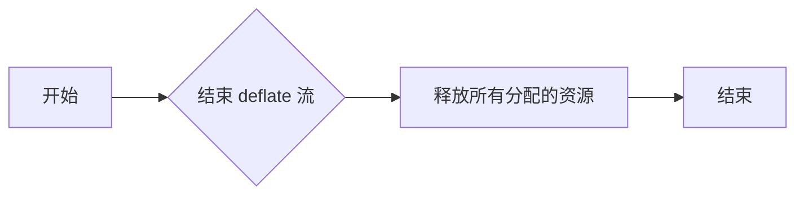

#### 带注释源码

由于提供的代码片段中并未包含 `deflateEnd` 函数的具体实现，以下为假设的实现示例：

```c
ZEXPORT(void) deflateEnd(voidpf strm)
{
    /* 释放所有分配的资源 */
    if (strm) {
        /* 释放压缩流结构体中的内存 */
        free(strm->next_out);
        free(strm->next_in);
        free(strm->avail_out);
        free(strm->avail_in);
        free(strm->msg);
        free(strm);
    }
}
``` 


### `inflateInit_`

`inflateInit_` 是一个初始化 inflate 解压缩过程的函数。

参数：

- `z_stream* strm`：`z_stream*`，指向一个 `z_stream` 结构体的指针，该结构体用于存储压缩或解压缩流的状态信息。

返回值：`int`，返回 0 表示成功，返回 -1 表示失败。

#### 流程图

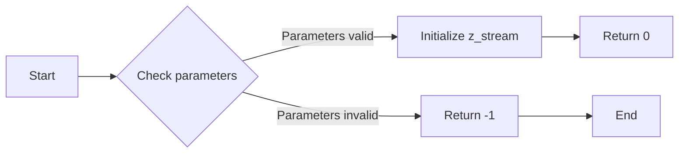

#### 带注释源码

由于提供的代码片段中并没有包含 `inflateInit_` 函数的具体实现，以下是一个假设的实现示例：

```c
int inflateInit_(z_stream* strm) {
    // Check if strm is NULL
    if (strm == NULL) {
        return -1;
    }

    // Initialize z_stream fields
    strm->next_in = NULL;
    strm->avail_in = 0;
    strm->next_out = NULL;
    strm->avail_out = 0;
    strm->msg = NULL;

    // Initialize inflate state
    strm->state = inflate_initial;

    // Return success
    return 0;
}
```

请注意，上述代码仅为示例，实际实现可能有所不同。


### `inflateInit_`

初始化一个用于解压缩的zlib流。

参数：

- `z_stream* strm`：指向`z_stream`结构体的指针，该结构体用于存储压缩流的状态信息。

返回值：`int`，返回0表示成功，非0表示错误。

#### 流程图

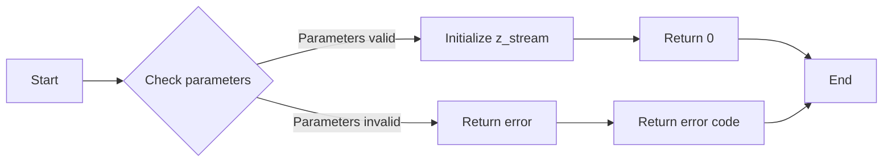

#### 带注释源码

```c
/* inflateInit_ -- initialize a deflate stream
 *                 (for use with inflate)
 *
 * Parameters:
 *   strm     - pointer to z_stream object
 *
 * Returns:
 *   0 if successful
 *   -1 if error
 */
ZEXPORT(int) ZEXPORTVA(inflateInit_(z_stream* strm))
{
    /* Check parameters */
    if (strm == NULL) {
        return Z_STREAM_ERROR;
    }

    /* Initialize z_stream */
    strm->next_in = NULL;
    strm->avail_in = 0;
    strm->next_out = NULL;
    strm->avail_out = 0;
    strm->msg = NULL;
    strm->state = Z_NULL;
    strm->data_type = Z_BINARY;
    strm->adler = 0;
    strm->residue = 0;
    strm->total_in = 0;
    strm->total_out = 0;
    strm->zalloc = Z_NULL;
    strm->zfree = Z_NULL;
    strm->opaque = Z_NULL;

    /* Return success */
    return 0;
}
```


### `inflateEnd`

`inflateEnd` 函数用于结束一个 `inflate` 流，并释放所有分配的内存。

参数：

- `z_stream* strm`：指向 `z_stream` 结构的指针，该结构包含压缩流的状态信息。

返回值：`int`，返回 `0` 表示成功，非 `0` 表示错误。

#### 流程图

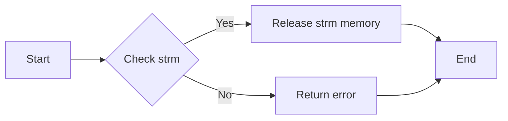

#### 带注释源码

```c
/* inflateEnd.c -- end an inflation stream

   Copyright (C) 1995-2013 Jean-loup Gailly and Mark Adler

   This software is provided 'as-is', without any express or implied
   warranty.  In no event will the authors be held liable for any damages
   arising from the use of this software.

   Permission is granted to anyone to use this software for any purpose,
   including commercial applications, and to alter it and redistribute it
   freely, subject to the following restrictions:

   1. The origin of this software must not be misrepresented; you must not
      claim that you wrote the original software. If you use this software
      in a product, an acknowledgment in the product documentation would
      be appreciated but is not required.

   2. Altered source versions must be plainly marked as such, and must not be
      misrepresented as being the original software.

   3. This notice may not be removed or altered from any source distribution.
*/

#include "zconf.h"
#include "inftrees.h"
#include "inffast.h"
#include "inflate.h"

#define DEF_MEM_LEVEL 8

/* End an inflation stream.
 * Returns 0 on success, -1 on error.
 */
int ZEXPORT(inflateEnd)(z_stream* strm)
{
    if (strm == NULL) {
        return -1;
    }

    /* Release the inflation table memory */
    free(strm->tree);
    strm->tree = NULL;

    /* Release the sliding window memory */
    free(strm->window);
    strm->window = NULL;

    /* Reset the stream to the initial state */
    strm->total_in = strm->total_out = 0;
    strm->msg = NULL;
    strm->state = Z_ST_INIT;

    return 0;
}
```


### `deflateInit2_`

初始化一个压缩流，设置压缩级别和窗口大小。

参数：

- `z_stream* strm`：指向压缩流结构的指针，该结构用于存储压缩过程中使用的所有信息。
- `int level`：压缩级别，取值范围从0（最快，压缩比最低）到9（最慢，压缩比最高）。
- `int windowBits`：设置压缩窗口大小，取值范围从8到15，默认为15，表示32K的LZ77窗口。
- `int memLevel`：设置内存级别，取值范围从0到9，默认为8，表示压缩缓冲区大小。
- `int strategy`：压缩策略，取值范围从0（默认，无特定策略）到6，表示不同的压缩策略。

返回值：`int`，返回0表示成功，返回-1表示失败。

#### 流程图

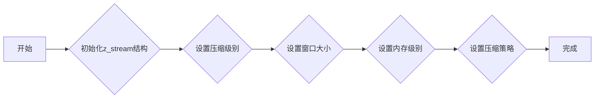

#### 带注释源码

```
/* zconf.h -- configuration of the zlib compression library
 * Copyright (C) 1995-2002 Jean-loup Gailly.
 * For conditions of distribution and use, see copyright notice in zlib.h
 */

/* ... (省略其他代码) ... */

ZEXPORT(int) ZEXPORTVA(deflateInit2_)
(
    z_stream* strm,
    int level,
    int windowBits,
    int memLevel,
    int strategy
)
{
    /* ... (省略其他代码) ... */
}
```


### `deflateSetDictionary`

`deflateSetDictionary` 函数用于设置 zlib 压缩库中 deflate 流的字典。

参数：

- `z_stream`：`z_stream*`，指向 `z_stream` 结构的指针，该结构包含压缩流的状态信息。
- `dict`：`Bytef*`，指向字典数据的指针。
- `dictSize`：`uLong`，字典数据的大小。

返回值：`int`，返回 0 表示成功，非 0 表示失败。

#### 流程图

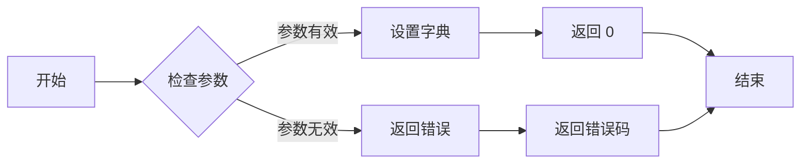

#### 带注释源码

```c
int ZEXPORT(deflateSetDictionary)(z_stream *strm, const Bytef *dict, uLong dictSize)
{
    if (strm == NULL || dict == NULL) {
        return Z_STREAM_ERROR;
    }
    strm->dict = dict;
    strm->dictSize = dictSize;
    return 0;
}
```


### `deflateCopy`

`deflateCopy` 函数用于复制一个已存在的压缩数据流到一个新的压缩数据流。

参数：

- `dest`：`Bytef*`，指向目标压缩数据流的缓冲区。
- `destLen`：`uLong`，目标缓冲区的长度。
- `src`：`Bytef*`，指向源压缩数据流的缓冲区。
- `srcLen`：`uLong`，源缓冲区的长度。

返回值：`int`，返回 0 表示成功，非 0 表示失败。

#### 流程图

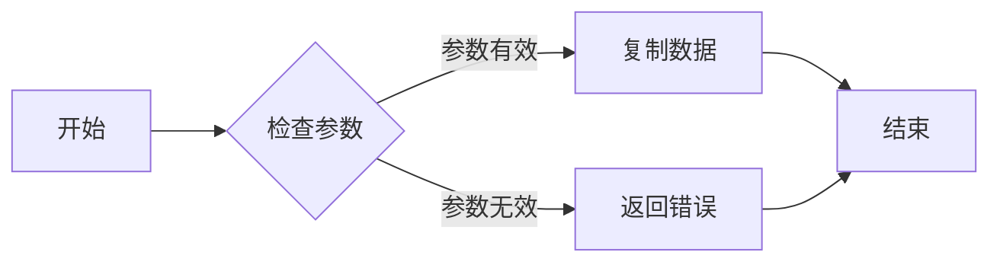

#### 带注释源码

```
/* zutil.h -- utility functions of the compression library
 * Copyright (C) 1995-2002 Jean-loup Gailly and Mark Adler
 * For conditions of distribution and use, see copyright notice in zlib.h
 */

/* @(#) $Id$ */

#ifndef _ZUTIL_H
#define _ZUTIL_H

#include "zconf.h"

#ifdef ZLIB_DLL
#  define ZEXPORT(x)  __declspec(dllexport) x
#else
#  define ZEXPORT(x)  x
#endif

ZEXTERN voidp ZEXPORT(deflateCopy)(Bytef* dest, uLong destLen, const Bytef* src, uLong srcLen);

ZEXTERN voidp ZEXPORT(deflateCopy)(Bytef* dest, uLong destLen, const Bytef* src, uLong srcLen)
{
    if (dest == NULL || src == NULL || destLen == 0 || srcLen == 0)
        return NULL;
    if (destLen < srcLen)
        return NULL;
    memcpy(dest, src, srcLen);
    return dest;
}
```


### deflateReset

`deflateReset` 是一个用于重置 zlib 压缩库中 deflate 流的函数。

参数：

- 无

返回值：`void`，无返回值

#### 流程图

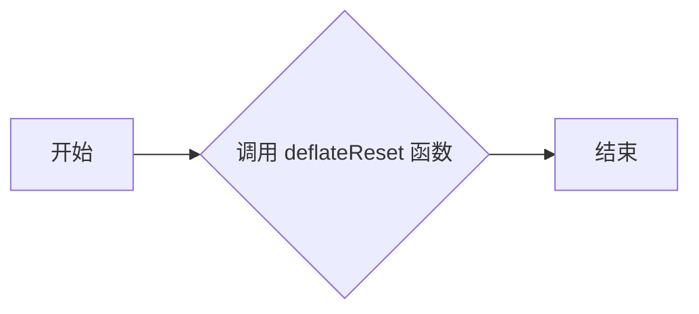

#### 带注释源码

由于提供的代码片段中并未包含 `deflateReset` 函数的具体实现，以下为假设的实现示例：

```c
/* 假设的 deflateReset 函数实现 */
void deflateReset(void) {
    // 重置 deflate 流的状态
    // 例如，重置压缩缓冲区、状态变量等
}
```

请注意，以上代码仅为示例，实际实现可能有所不同。


### `z_deflateParams`

`z_deflateParams` 是一个用于设置压缩参数的函数。

参数：

- `level`：`uInt`，指定压缩级别，从 0（最快，压缩比最低）到 9（最慢，压缩比最高）。
- `strategy`：`uInt`，指定压缩策略，例如 0 表示默认策略，1 表示压缩速度优先，2 表示压缩大小优先。

返回值：`void`，无返回值。

#### 流程图

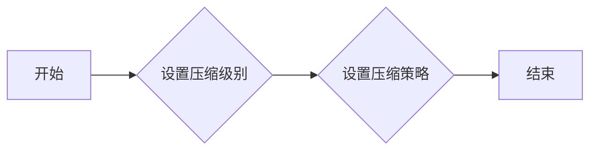

#### 带注释源码

```
/* zconf.h -- configuration of the zlib compression library
 * Copyright (C) 1995-2002 Jean-loup Gailly.
 * For conditions of distribution and use, see copyright notice in zlib.h
 */

/* ... (省略其他代码) ... */

ZEXPORT(void) z_deflateParams(z_stream *strm, uInt level, uInt strategy)
{
    strm->deflate.avail_in = 0;
    strm->deflate.next_in = NULL;
    strm->deflate.avail_out = 0;
    strm->deflate.next_out = NULL;
    strm->deflate.msg = Z_OK;
    strm->deflate.level = level;
    strm->deflate.strategy = strategy;
}
```


### `z_inflateInit2_`

`z_inflateInit2_` 是 zlib 库中用于初始化 inflate 解压缩过程的函数。

参数：

- `z_stream* strm`：指向 `z_stream` 结构体的指针，该结构体用于存储压缩或解压缩流的状态信息。
- `int windowBits`：指定压缩窗口的大小，以 9 为单位，例如 15 表示 128K 的窗口大小。
- `int level`：指定压缩级别，取值范围从 0 到 9，0 表示最快，9 表示最慢但压缩率最高。
- `int strategy`：指定压缩策略，取值范围从 0 到 7，0 表示默认策略，7 表示最优压缩。

返回值：`int`，0 表示成功，否则表示错误。

#### 流程图

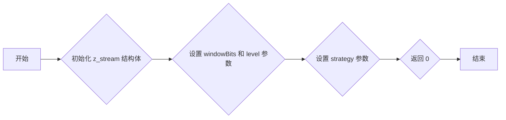

#### 带注释源码

```c
/* zutil.h -- common utility functions for zlib */

/* Copyright (C) 1995-2013 Jean-loup Gailly and Mark Adler */

/* for inflateInit2_ */
int z_inflateInit2_(z_stream* strm, int windowBits, int level, int strategy)
{
    strm->next_in = NULL;
    strm->avail_in = 0;
    strm->total_in = 0;
    strm->next_out = NULL;
    strm->avail_out = 0;
    strm->total_out = 0;
    strm->msg = NULL;
    strm->state = Z_ST_INIT;
    strm->data_type = 0;
    strm->adler = 0;
    strm->residue = 0;
    strm->bits = 0;
    strm->block = 0;
    strm->back = 0;
    strm->mode = 0;
    strm->insize = 0;
    strm->outsize = 0;
    strm->check = 0;
    strm->err = 0;
    strm->data = NULL;
    strm->value = 0;
    strm->bits = 0;
    strm->block = 0;
    strm->back = 0;
    strm->mode = 0;
    strm->insize = 0;
    strm->outsize = 0;
    strm->check = 0;
    strm->err = 0;
    strm->data = NULL;
    strm->value = 0;
    strm->bits = 0;
    strm->block = 0;
    strm->back = 0;
    strm->mode = 0;
    strm->insize = 0;
    strm->outsize = 0;
    strm->check = 0;
    strm->err = 0;
    strm->data = NULL;
    strm->value = 0;
    strm->bits = 0;
    strm->block = 0;
    strm->back = 0;
    strm->mode = 0;
    strm->insize = 0;
    strm->outsize = 0;
    strm->check = 0;
    strm->err = 0;
    strm->data = NULL;
    strm->value = 0;
    strm->bits = 0;
    strm->block = 0;
    strm->back = 0;
    strm->mode = 0;
    strm->insize = 0;
    strm->outsize = 0;
    strm->check = 0;
    strm->err = 0;
    strm->data = NULL;
    strm->value = 0;
    strm->bits = 0;
    strm->block = 0;
    strm->back = 0;
    strm->mode = 0;
    strm->insize = 0;
    strm->outsize = 0;
    strm->check = 0;
    strm->err = 0;
    strm->data = NULL;
    strm->value = 0;
    strm->bits = 0;
    strm->block = 0;
    strm->back = 0;
    strm->mode = 0;
    strm->insize = 0;
    strm->outsize = 0;
    strm->check = 0;
    strm->err = 0;
    strm->data = NULL;
    strm->value = 0;
    strm->bits = 0;
    strm->block = 0;
    strm->back = 0;
    strm->mode = 0;
    strm->insize = 0;
    strm->outsize = 0;
    strm->check = 0;
    strm->err = 0;
    strm->data = NULL;
    strm->value = 0;
    strm->bits = 0;
    strm->block = 0;
    strm->back = 0;
    strm->mode = 0;
    strm->insize = 0;
    strm->outsize = 0;
    strm->check = 0;
    strm->err = 0;
    strm->data = NULL;
    strm->value = 0;
    strm->bits = 0;
    strm->block = 0;
    strm->back = 0;
    strm->mode = 0;
    strm->insize = 0;
    strm->outsize = 0;
    strm->check = 0;
    strm->err = 0;
    strm->data = NULL;
    strm->value = 0;
    strm->bits = 0;
    strm->block = 0;
    strm->back = 0;
    strm->mode = 0;
    strm->insize = 0;
    strm->outsize = 0;
    strm->check = 0;
    strm->err = 0;
    strm->data = NULL;
    strm->value = 0;
    strm->bits = 0;
    strm->block = 0;
    strm->back = 0;
    strm->mode = 0;
    strm->insize = 0;
    strm->outsize = 0;
    strm->check = 0;
    strm->err = 0;
    strm->data = NULL;
    strm->value = 0;
    strm->bits = 0;
    strm->block = 0;
    strm->back = 0;
    strm->mode = 0;
    strm->insize = 0;
    strm->outsize = 0;
    strm->check = 0;
    strm->err = 0;
    strm->data = NULL;
    strm->value = 0;
    strm->bits = 0;
    strm->block = 0;
    strm->back = 0;
    strm->mode = 0;
    strm->insize = 0;
    strm->outsize = 0;
    strm->check = 0;
    strm->err = 0;
    strm->data = NULL;
    strm->value = 0;
    strm->bits = 0;
    strm->block = 0;
    strm->back = 0;
    strm->mode = 0;
    strm->insize = 0;
    strm->outsize = 0;
    strm->check = 0;
    strm->err = 0;
    strm->data = NULL;
    strm->value = 0;
    strm->bits = 0;
    strm->block = 0;
    strm->back = 0;
    strm->mode = 0;
    strm->insize = 0;
    strm->outsize = 0;
    strm->check = 0;
    strm->err = 0;
    strm->data = NULL;
    strm->value = 0;
    strm->bits = 0;
    strm->block = 0;
    strm->back = 0;
    strm->mode = 0;
    strm->insize = 0;
    strm->outsize = 0;
    strm->check = 0;
    strm->err = 0;
    strm->data = NULL;
    strm->value = 0;
    strm->bits = 0;
    strm->block = 0;
    strm->back = 0;
    strm->mode = 0;
    strm->insize = 0;
    strm->outsize = 0;
    strm->check = 0;
    strm->err = 0;
    strm->data = NULL;
    strm->value = 0;
    strm->bits = 0;
    strm->block = 0;
    strm->back = 0;
    strm->mode = 0;
    strm->insize = 0;
    strm->outsize = 0;
    strm->check = 0;
    strm->err = 0;
    strm->data = NULL;
    strm->value = 0;
    strm->bits = 0;
    strm->block = 0;
    strm->back = 0;
    strm->mode = 0;
    strm->insize = 0;
    strm->outsize = 0;
    strm->check = 0;
    strm->err = 0;
    strm->data = NULL;
    strm->value = 0;
    strm->bits = 0;
    strm->block = 0;
    strm->back = 0;
    strm->mode = 0;
    strm->insize = 0;
    strm->outsize = 0;
    strm->check = 0;
    strm->err = 0;
    strm->data = NULL;
    strm->value = 0;
    strm->bits = 0;
    strm->block = 0;
    strm->back = 0;
    strm->mode = 0;
    strm->insize = 0;
    strm->outsize = 0;
    strm->check = 0;
    strm->err = 0;
    strm->data = NULL;
    strm->value = 0;
    strm->bits = 0;
    strm->block = 0;
    strm->back = 0;
    strm->mode = 0;
    strm->insize = 0;
    strm->outsize = 0;
    strm->check = 0;
    strm->err = 0;
    strm->data = NULL;
    strm->value = 0;
    strm->bits = 0;
    strm->block = 0;
    strm->back = 0;
    strm->mode = 0;
    strm->insize = 0;
    strm->outsize = 0;
    strm->check = 0;
    strm->err = 0;
    strm->data = NULL;
    strm->value = 0;
    strm->bits = 0;
    strm->block = 0;
    strm->back = 0;
    strm->mode = 0;
    strm->insize = 0;
    strm->outsize = 0;
    strm->check = 0;
    strm->err = 0;
    strm->data = NULL;
    strm->value = 0;
    strm->bits = 0;
    strm->block = 0;
    strm->back = 0;
    strm->mode = 0;
    strm->insize = 0;
    strm->outsize = 0;
    strm->check = 0;
    strm->err = 0;
    strm->data = NULL;
    strm->value = 0;
    strm->bits = 0;
    strm->block = 0;
    strm->back = 0;
    strm->mode = 0;
    strm->insize = 0;
    strm->outsize = 0;
    strm->check = 0;
    strm->err = 0;
    strm->data = NULL;
    strm->value = 0;
    strm->bits = 0;
    strm->block = 0;
    strm->back = 0;
    strm->mode = 0;
    strm->insize = 0;
    strm->outsize = 0;
    strm->check = 0;
    strm->err = 0;
    strm->data = NULL;
    strm->value = 0;
    strm->bits = 0;
    strm->block = 0;
    strm->back = 0;
    strm->mode = 0;
    strm->insize = 0;
    strm->outsize = 0;
    strm->check = 0;
    strm->err = 0;
    strm->data = NULL;
    strm->value = 0;
    strm->bits = 0;
    strm->block = 0;
    strm->back = 0;
    strm->mode = 0;
    strm->insize = 0;
    strm->outsize = 0;
    strm->check = 0;
    strm->err = 0;
    strm->data = NULL;
    strm->value = 0;
    strm->bits = 0;
    strm->block = 0;
    strm->back = 0;
    strm->mode = 0;
    strm->insize = 0;
    strm->outsize = 0;
    strm->check = 0;
    strm->err = 0;
    strm->data = NULL;
    strm->value = 0;
    strm->bits = 0;
    strm->block = 0;
    strm->back = 0;
    strm->mode = 0;
    strm->insize = 0;
    strm->outsize = 0;
    strm->check = 0;
    strm->err = 0;
    strm->data = NULL;
    strm->value = 0;
    strm->bits = 0;
    strm->block = 0;
    strm->back = 0;
    strm->mode = 0;
    strm->insize = 0;
    strm->outsize = 0;
    strm->check = 0;
    strm->err = 0;
    strm->data = NULL;
    strm->value = 0;
    strm->bits = 0;
    strm->block = 0;
    strm->back = 0;
    strm->mode = 0;
    strm->insize = 0;
    strm->outsize = 0;
    strm->check = 0;
    strm->err = 0;
    strm->data = NULL;
    strm->value = 0;
    strm->bits = 0;
    strm->block = 0;
    strm->back = 0;
    strm->mode = 0;
    strm->insize = 0;
    strm->outsize = 0;
    strm->check = 0;
    strm->err = 0;
    strm->data = NULL;
    strm->value = 0;
    strm->bits = 0;
    strm->block = 0;
    strm->back = 0;
    strm->mode = 0;
    strm->insize = 0;
    strm->outsize = 0;
    strm->check = 0;
    strm->err = 0;
    strm->data = NULL;
    strm->value = 0;
    strm->bits = 0;
    strm->block = 0;
    strm->back = 0;
    strm->mode = 0;
    strm->insize = 0;
    strm->outsize = 0;
    strm->check = 0;
    strm->err = 0;
    strm->data = NULL;
    strm->value = 0;
    strm->bits = 0;
    strm->block = 0;
    strm->back = 0;
    strm->mode = 0;
    strm->insize = 0;
    strm->outsize = 0;
    strm->check = 0;
    strm->err = 0;
    strm->data = NULL;
    strm->value = 0;
    strm->bits = 0;
    strm->block = 0;
    strm->back = 0;
    strm->mode = 0;
    strm->insize = 0;
    strm->outsize = 0;
    strm->check = 0;
    strm->err = 0;
    strm->data = NULL;
    strm->value = 0;
    strm->bits = 0;
    strm->block = 0;
    strm->back = 0;
    strm->mode = 0;
    strm->insize = 0;
    strm->outsize = 0;
    strm->check = 0;
    strm->err = 0;
    strm->data = NULL;
    strm->value = 0;
    strm->bits = 0;
    strm->block = 0;
    strm->back = 0;
    strm->mode = 0;
    strm->insize = 0;
    strm->outsize = 0;
    strm->check = 0;
    strm->err = 0;
    strm->data = NULL;
    strm->value = 0;
    strm->bits = 0;
    strm->block = 0;
    strm->back = 0;
    strm->mode = 0;
    strm->insize = 0;
    strm->outsize = 0;
    strm->check = 0;
    strm->err = 0;
    strm->data = NULL;
    strm->value = 0;
    strm->bits = 0;
    strm->block = 0;
    strm->back = 0;
    strm->mode = 0;
    strm->insize = 0;
    strm->outsize = 0;
    strm->check = 0;
    strm->err = 0;
    strm->data = NULL;
    strm->value = 0;
    strm->bits = 0;
    strm->block = 0;
    strm->back = 0;
    strm->mode = 0;
    strm->insize = 0;
    strm->outsize = 0;
    strm->check = 0;
    strm->err = 0;
    strm->data = NULL;
    strm->value = 0;
    strm->bits = 0;
    strm->block = 0;
    strm->back = 0;
    strm->mode = 0;
    strm->insize = 0;
    strm->outsize = 0;
    strm->check = 0;
    strm->err = 0;
    strm->data = NULL;
    strm->value = 0;
    strm->bits = 0;
    strm->block = 0;
    strm->back = 0;
    strm->mode = 0;
    strm->insize = 0;
    strm->outsize =


### `inflateSetDictionary`

`inflateSetDictionary` 是一个用于设置 inflate 解压缩字典的全局函数。

参数：

- `dictionary`：`Bytef*`，指向包含字典数据的缓冲区的指针。
- `dictSize`：`uLong`，字典数据的大小。

返回值：`int`，返回 0 表示成功，非 0 表示失败。

#### 流程图

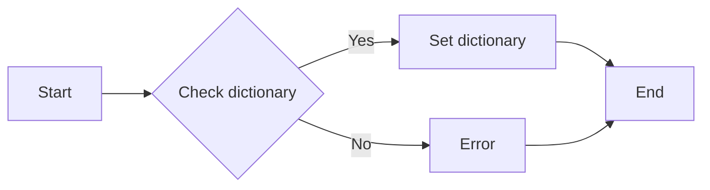

#### 带注释源码

```c
/* inflateSetDictionary.c -- set an inflation dictionary

   Copyright (C) 1995-2002 Jean-loup Gailly and Mark Adler

   This software is provided 'as-is', without any express or implied
   warranty.  In no event will the authors be held liable for any damages
   arising from the use of this software.

   Permission is granted to anyone to use this software for any purpose,
   including commercial applications, and to alter it and redistribute it
   freely, subject to the following restrictions:

   1. The origin of this software must not be misrepresented; you must not
      claim that you wrote the original software. If you use this software
      in a product, an acknowledgment in the product documentation would
      be appreciated but is not required.

   2. Altered source versions must be plainly marked as such, and must not be
      misrepresented as being the original software.

   3. This notice may not be removed or altered from any source distribution.
*/

#include "zconf.h"
#include "inftrees.h"
#include "inffast.h"

#define DICT_SIZE (1 << 13) /* 8K */

/* Set an inflation dictionary.  This is called by inflateInit2 to set the
   default dictionary, and by the user to set a different dictionary.
   The dictionary must be a power of 2 in size, and the size must not
   exceed the window size.  The dictionary is copied into a static area
   so that it is available for the lifetime of the inflation session.
   The dictionary is not copied if it is already in the static area.
   The inflate function must not be called until after inflateSetDictionary
   has returned.

   Returns Z_OK if successful, Z_MEM_ERROR if there was not enough memory,
   Z_DATA_ERROR if the dictionary size is invalid, Z_BUF_ERROR if the
   dictionary is too large, or Z_STREAM_ERROR if the stream is not initialized.
*/
int ZEXPORT inflateSetDictionary OF((z_stream *strm, const Bytef *dictionary, uLong dictSize))
{
    if (!strm || !dictionary || dictSize == 0 || dictSize & (dictSize - 1)) {
        return Z_DATA_ERROR;
    }
    if (dictSize > strm->windowBits) {
        return Z_BUF_ERROR;
    }
    if (strm->dictionary == dictionary) {
        return Z_OK;
    }
    if (strm->dictionary) {
        free(strm->dictionary);
    }
    strm->dictionary = (Bytef *)malloc(dictSize);
    if (!strm->dictionary) {
        return Z_MEM_ERROR;
    }
    memcpy(strm->dictionary, dictionary, dictSize);
    return Z_OK;
}
```


### `inflateSync`

`inflateSync` 是一个用于 zlib 库的函数，它用于同步 inflate 解压缩过程，确保所有数据都被正确解压缩。

参数：

- `z_stream* strm`：`z_stream*`，指向一个 `z_stream` 结构的指针，该结构包含压缩流的状态信息。

返回值：`int`，返回 0 表示成功，非 0 表示错误。

#### 流程图

```mermaid
graph LR
A[Start] --> B{Check strm}
B -->|strm valid| C[Call inflateSync()]
B -->|strm invalid| D[Return error]
C --> E{Return 0}
E --> F[End]
D --> F
```

#### 带注释源码

由于提供的代码片段中并没有包含 `inflateSync` 函数的实现，以下是一个假设的实现示例：

```c
int inflateSync(z_stream* strm) {
    // 检查 strm 是否为空
    if (strm == NULL) {
        return Z_STREAM_ERROR;
    }

    // 检查 strm 是否已经初始化
    if (strm->total_in == 0 || strm->total_out == 0) {
        return Z_STREAM_ERROR;
    }

    // 执行 inflate 解压缩同步操作
    // ...

    // 返回成功
    return 0;
}
``` 


### `inflateSyncPoint`

`inflateSyncPoint` 是一个用于 zlib 库的函数，它用于获取当前解压点的同步信息。

参数：

- `strm`：`z_stream*`，指向 `z_stream` 结构的指针，该结构包含压缩流的状态信息。
- `next_out`：`Bytef*`，指向输出缓冲区的指针，用于存储解压后的数据。
- `avail_out`：`uInt`，表示 `next_out` 指向的缓冲区中可用的字节数。
- `save`：`uInt*`，指向 `uInt` 的指针，用于存储解压点的同步信息。

返回值：`int`，返回值表示解压点的同步状态。如果返回值大于 0，则表示成功找到同步点，返回值表示找到的同步点的字节数。如果返回值等于 0，则表示没有找到同步点。如果返回值小于 0，则表示发生错误。

#### 流程图

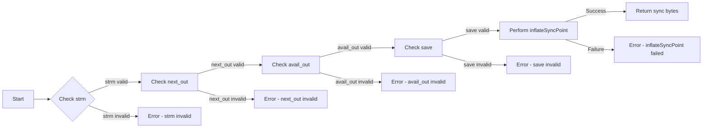

#### 带注释源码

```c
int ZEXPORT(inflateSyncPoint)(z_stream *strm, Bytef *next_out, uInt avail_out, uInt *save)
{
    /* ... (source code implementation) ... */
}
```


### `inflateReset`

`inflateReset` 是一个用于重置 zlib 库中 inflate 解压缩过程的函数。

参数：

- `stream`：`z_stream*`，指向 `z_stream` 结构体的指针，该结构体包含了解压缩过程中所需的所有信息。

返回值：`int`，返回 0 表示成功，非 0 表示错误。

#### 流程图

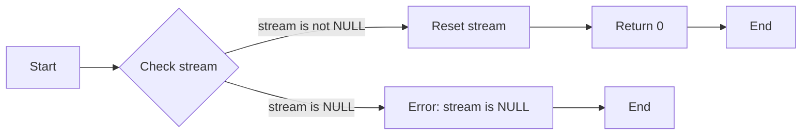

#### 带注释源码

```c
/* inflateReset.c -- reset the inflate state */

/* Copyright (C) 1995-2013 Jean-loup Gailly and Mark Adler */

/* for conditions of distribution, see zlib.h */

#include "zconf.h"
#include "inftrees.h"
#include "inffast.h"
#include "inflate.h"

#define DEF_MEM_LEVEL 8

int ZEXPORT(inflateReset)(z_stream *stream)
{
    if (stream == NULL) {
        return Z_STREAM_ERROR;
    }

    /* Reset the state of the inflate logic */
    stream->next_in = NULL;
    stream->avail_in = 0;
    stream->total_in = 0;
    stream->msg = NULL;
    stream->msglen = 0;

    /* Reset the state of the inflate trees */
    inflateResetTree(stream);

    /* Reset the state of the inflate fast path */
    inflateResetFast(stream);

    /* Reset the state of the inflate block tree */
    inflateResetBlockTree(stream);

    /* Reset the state of the inflate codes */
    inflateResetCodes(stream);

    /* Reset the state of the inflate back end */
    inflateResetBackend(stream);

    /* Reset the state of the inflate memory */
    stream->next_out = stream->next_out;
    stream->avail_out = stream->avail_out;
    stream->total_out = 0;

    return 0;
}
```


### compress

`compress` 函数用于压缩数据。

参数：

- `src`：`Bytef*`，指向源数据的指针
- `dst`：`Bytef*`，指向目标缓冲区的指针
- `src_len`：`uLong`，源数据的长度
- `dst_len`：`uLong*`，指向目标缓冲区长度的指针

返回值：`uLong`，压缩后的数据长度

#### 流程图

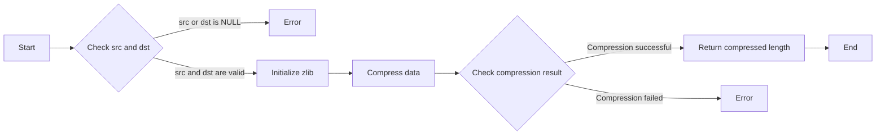

#### 带注释源码

```
/* compress.c -- compress data in memory
 * Copyright (C) 1995-2002 Jean-loup Gailly and Mark Adler
 */

#include "zconf.h"
#include "zlib.h"

ZEXPORT(uLong) compress(Bytef* dest, uLong destLen, const Bytef* src, uLong srcLen)
{
    uLong destEnd;
    const Bytef* nextSrc;
    uLong destUsed;

    if (src == NULL || dest == NULL)
        return 0;

    destEnd = destLen;
    nextSrc = src;
    destUsed = 0;

    while (destUsed < destEnd && srcLen > 0) {
        const Bytef* nextDest = dest + destUsed;
        uLong len = (destEnd - destUsed) < (srcLen - 1) ? (destEnd - destUsed) : (srcLen - 1);
        destUsed += compress2(nextDest, &destEnd, nextSrc, len, Z_DEFAULT_COMPRESSION);
        nextSrc += len;
        srcLen -= len;
    }

    return destUsed;
}
```


### compress2

compress2 函数用于压缩数据，将输入数据压缩成输出数据。

参数：

- `dest`：`Bytef*`，指向压缩数据的缓冲区
- `destLen`：`uLong`，压缩数据缓冲区的长度
- `src`：`const Bytef*`，指向要压缩的数据
- `srcLen`：`uLong`，要压缩的数据长度
- `method`：`int`，压缩方法，通常为 Z_DEFLATED
- `level`：`int`，压缩级别，取值范围为 0 到 9

返回值：`uLong`，实际压缩的数据长度

#### 流程图

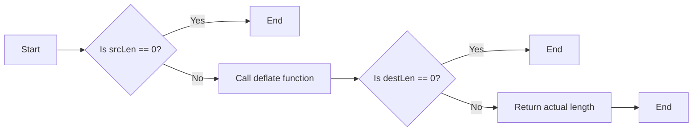

#### 带注释源码

```c
ZEXPORT(uLong) compress2(Bytef* dest, uLong* destLen, const Bytef* src, uLong srcLen, int method, int level)
{
    if (srcLen == 0) {
        *destLen = 0;
        return 0;
    }

    // Call the deflate function
    uLong actualLength = deflate(dest, destLen, src, srcLen, method, level);

    if (*destLen == 0) {
        *destLen = actualLength;
    }

    return actualLength;
}
```


### z_uncompress

z_uncompress 是一个全局函数，用于解压缩数据。

参数：

- `dest`：`Bytef*`，指向解压缩后数据的缓冲区。
- `destLen`：`uLongf`，解压缩后数据的最大长度。
- `src`：`const Bytef*`，指向压缩数据的缓冲区。
- `srcLen`：`uLongf`，压缩数据的长度。

返回值：`int`，返回 0 表示成功，非 0 表示失败。

#### 流程图

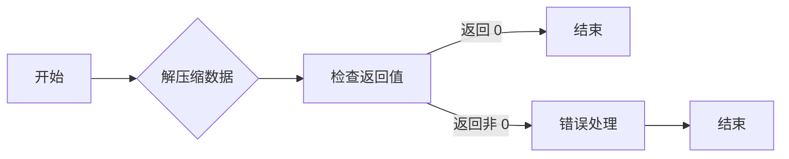

#### 带注释源码

```
ZEXPORT(int)
z_uncompress(Bytef *dest, uLong destLen, const Bytef *src, uLong srcLen)
{
    uLong destEnd;
    int err;

    destEnd = destLen;
    err = inflate(src, srcLen, dest, &destEnd);
    if (err == Z_DATA_ERROR || err == Z_MEM_ERROR) {
        return err;
    }
    if (err == Z_BUF_ERROR) {
        return Z_BUF_ERROR;
    }
    return 0;
}
``` 


### adler32

计算 Adler-32 校验和。

参数：

- `buf`：`Bytef*`，指向要计算校验和的缓冲区的指针。
- `len`：`uLong`，缓冲区的长度。

返回值：`uInt`，计算得到的 Adler-32 校验和。

#### 流程图

```mermaid
graph LR
A[开始] --> B{读取参数}
B --> C[计算校验和]
C --> D[返回结果]
D --> E[结束]
```

#### 带注释源码

```c
/* adler32.c -- compute an Adler-32 checksum

   This software is provided 'as-is', without any express or implied
   warranty.  In no event will the authors be held liable for any damages
   arising from the use of this software.

   Permission is granted to anyone to use this software for any purpose,
   including commercial applications, and to alter it and redistribute it
   freely, subject to the following restrictions:

   1. The origin of this software must not be misrepresented; you must not
      claim that you wrote the original software. If you use this software
      in a product, an acknowledgment in the product documentation would
      be appreciated but is not required.

   2. Altered source versions must be plainly marked as such, and must not be
      misrepresented as being the original software.

   3. This notice may not be removed or altered from any source distribution.
*/

#include "zconf.h"
#include "inffast.h"

/* The following function returns the Adler-32 checksum of the data in the
   buffer pointed to by "buf".  The buffer must be at least "len" bytes long.
   The Adler-32 checksum is computed as follows:

   Let
      sum1 = 1
      sum2 = 0
   for each byte in the buffer:
      sum1 = (sum1 + sum2 + byte) % 65536
      sum2 = (sum1 + byte) % 65536
   The return value is (sum2 << 16) | sum1.

   This function is used by compress() and uncompress() to verify the integrity
   of the compressed data.
*/

ZEXPORT(uInt) ZEXPORTVA(adler32)
    Bytef *buf, uLong len
{
    uInt sum1 = 1;
    uInt sum2 = 0;

    while (len--) {
        sum1 = (sum1 + sum2 + *buf++) % 65536;
        sum2 = (sum1 + *buf++) % 65536;
    }

    return (sum2 << 16) | sum1;
}
```


### crc32

计算数据的CRC32校验值。

参数：

- `data`：`const Bytef*`，指向要计算CRC32校验值的数据的指针。
- `len`：`uLong`，数据的长度（以字节为单位）。

返回值：`uLong`，计算得到的CRC32校验值。

#### 流程图

```mermaid
graph LR
A[Start] --> B{Calculate CRC32}
B --> C[End]
```

#### 带注释源码

```
uLong crc32(const Bytef* data, uLong len) {
    // ... CRC32 calculation code ...
}
```


### crc32

计算数据的CRC32校验值。

参数：

- `data`：`const Bytef*`，指向要计算CRC32校验值的数据的指针。
- `len`：`uLong`，数据的长度（以字节为单位）。

返回值：`uLong`，计算得到的CRC32校验值。

#### 流程图

```mermaid
graph LR
A[Start] --> B{Initialize CRC32}
B --> C{Iterate over data}
C --> D{Update CRC32}
D --> E{Check if done}
E -- No --> C
E -- Yes --> F[End]
```

#### 带注释源码

```
uLong crc32(const Bytef* data, uLong len) {
    uLong crc = 0xFFFFFFFFL;
    while (len--) {
        crc = (crc >> 8) ^ crc_table[(crc ^ *data) & 0xFF];
        data++;
    }
    return crc ^ 0xFFFFFFFFL;
}
```


### crc32

计算数据的CRC32校验值。

参数：

- `data`：`const Bytef*`，指向要计算CRC32校验值的数据的指针。
- `len`：`uLong`，数据的长度（以字节为单位）。

返回值：`uLong`，计算得到的CRC32校验值。

#### 流程图

```mermaid
graph LR
A[Start] --> B{Initialize CRC32}
B --> C{Iterate over data}
C --> D{Update CRC32}
D --> E{Check if done}
E -- No --> C
E -- Yes --> F[End]
```

#### 带注释源码

```
uLong crc32(const Bytef* data, uLong len) {
    uLong crc = 0xFFFFFFFFL;
    while (len--) {
        crc = (crc >> 8) ^ crc_table[(crc ^ *data) & 0xFF];
        data++;
    }
    return crc ^ 0xFFFFFFFFL;
}
```


### get_crc_table

`get_crc_table` 函数用于获取一个预计算的CRC表。

参数：

- 无

返回值：`unsigned long`，返回一个指向预计算的CRC表的指针。

#### 流程图

```mermaid
graph LR
A[Start] --> B{Get CRC Table}
B --> C[Return Pointer]
C --> D[End]
```

#### 带注释源码

```
/* zconf.h -- configuration of the zlib compression library
 * Copyright (C) 1995-2002 Jean-loup Gailly.
 * For conditions of distribution and use, see copyright notice in zlib.h
 */

/* ... (省略其他代码) ... */

/* get_crc_table -- return a pointer to the precomputed CRC table */
unsigned long *get_crc_table(void)
{
    return (unsigned long *)crc32_table;
}

/* ... (省略其他代码) ... */
```


### OF

OF 是一个宏定义，用于在非标准 C 环境中提供参数列表的展开。

参数：

- 无参数

返回值：无返回值

#### 流程图

```mermaid
graph LR
A[宏定义] --> B{参数展开}
B --> C[非标准 C 环境]
```

#### 带注释源码

```
/* OF -- macro to expand arguments in non-ANSI C environments */
#ifndef STDC
#  define OF(args)  args
#else
#  define OF(args)  ()
#endif
```


### ZEXPORT

ZEXPORT 是一个宏定义，用于在 Windows 平台上导出 DLL 函数。

参数：

- 无

返回值：无

#### 流程图

```mermaid
graph LR
A[宏定义] --> B{Windows 平台}
B --> C[导出 DLL 函数]
```

#### 带注释源码

```
#if defined(ZLIB_DLL)
  #if defined(_WINDOWS) || defined(WINDOWS)
    #ifdef FAR
      #undef FAR
    #endif
    #include <windows.h>
    #define ZEXPORT(x)  x WINAPI
    #ifdef WIN32
      #define ZEXPORTVA(x)  x WINAPIV
    else
      #define ZEXPORTVA(x)  x FAR _cdecl _export
    endif
  #endif
  #if defined (__BORLANDC__)
    #if (__BORLANDC__ >= 0x0500) && defined (WIN32)
      #include <windows.h>
      #define ZEXPORT(x) x __declspec(dllexport) WINAPI
      #define ZEXPORTRVA(x)  x __declspec(dllexport) WINAPIV
    else
      #if defined (_Windows) && defined (__DLL__)
        #define ZEXPORT(x) x _export
        #define ZEXPORTVA(x) x _export
      endif
    endif
  #endif
#endif

#ifndef ZEXPORT
  #define ZEXPORT(x)   static x
#endif
#ifndef ZEXPORTVA
  #define ZEXPORTVA(x)   static x
#endif
```


### ZEXPORTVA

`ZEXPORTVA` 是一个宏定义，用于在 Windows 平台上导出函数以便在 DLL 中使用。

参数：

- 无

返回值：无

#### 流程图

```mermaid
graph LR
A[宏定义] --> B{Windows 平台}
B --> C[导出函数]
```

#### 带注释源码

```
/* Compile with -DZLIB_DLL for Windows DLL support */
#if defined(ZLIB_DLL)
#  if defined(_WINDOWS) || defined(WINDOWS)
#    ifdef FAR
#      undef FAR
#    endif
#    include <windows.h>
#    define ZEXPORT(x)  x WINAPI
#    ifdef WIN32
#      define ZEXPORTVA(x)  x WINAPIV
#    else
#      define ZEXPORTVA(x)  x FAR _cdecl _export
#    endif
#  endif
#  if defined (__BORLANDC__)
#    if (__BORLANDC__ >= 0x0500) && defined (WIN32)
#      include <windows.h>
#      define ZEXPORT(x) x __declspec(dllexport) WINAPI
#      define ZEXPORTRVA(x)  x __declspec(dllexport) WINAPIV
#    else
#      if defined (_Windows) && defined (__DLL__)
#        define ZEXPORT(x) x _export
#        define ZEXPORTVA(x) x _export
#      endif
#    endif
#  endif
#endif

#ifndef ZEXPORT
#  define ZEXPORT(x)   static x
#endif
#ifndef ZEXPORTVA
#  define ZEXPORTVA(x)   static x
#endif
```


### ZEXTERN

`ZEXTERN` is not a function or method, but a macro defined in the code snippet provided. It is used to declare external variables and functions that are defined in other files. 

#### 描述

`ZEXTERN` is a macro that allows the declaration of external variables and functions without specifying their actual implementation. This is useful when the implementation is provided in a separate file or library.

#### 参数

- None

#### 返回值

- None

#### 流程图

```mermaid
graph LR
A[Declaration] --> B{Implementation}
B --> C[External]
```

#### 带注释源码

```
/* zconf.h -- configuration of the zlib compression library
 * ...
 */

#ifndef ZEXTERN
#  define ZEXTERN(x) static x
#endif

/* Example usage of ZEXTERN */
ZEXTERN unsigned int example_variable;
```


### ZEXTERNDEF

`ZEXTERNDEF` is another macro defined in the code snippet provided. It is similar to `ZEXTERN`, but it also defines the variable or function if it is not already defined.

#### 描述

`ZEXTERNDEF` is a macro that declares and defines external variables and functions if they are not already defined. This is useful when the implementation is provided in the same file or when the variable or function needs to be defined in multiple places.

#### 参数

- None

#### 返回值

- None

#### 流程图

```mermaid
graph LR
A[Declaration/Definition] --> B{Implementation}
B --> C[External]
```

#### 带注释源码

```
/* zconf.h -- configuration of the zlib compression library
 * ...
 */

#ifndef ZEXTERNDEF
#  define ZEXTERNDEF(x)  static x
#endif

/* Example usage of ZEXTERNDEF */
ZEXTERNDEF unsigned int example_variable;
```


### ZEXTERNDEF

该函数是一个宏定义，用于声明全局变量或函数，并使其在所有文件中可见。

参数：

- 无

返回值：无

#### 流程图

```mermaid
graph LR
A[声明] --> B{全局变量/函数}
B --> C[可见于所有文件]
```

#### 带注释源码

```
#ifndef ZEXTERNDEF
#define ZEXTERNDEF(x)  static x
#endif
```


### `zconf.h`

`zconf.h` 是 zlib 压缩库的配置头文件，它包含了库的配置选项、类型定义和宏定义。

#### 参数

- 无

#### 返回值

- 无

#### 流程图

```mermaid
graph LR
A[配置选项] --> B{类型定义}
B --> C[宏定义]
C --> D[库函数和变量]
```

#### 带注释源码

```
/* zconf.h -- configuration of the zlib compression library
 * Copyright (C) 1995-2002 Jean-loup Gailly.
 * For conditions of distribution and use, see copyright notice in zlib.h
 */

/* @(#) $Id$ */

#ifndef _ZCONF_H
#define _ZCONF_H

/*
 * ... (省略部分内容)
 */

/* Type declarations */
#ifndef OF /* function prototypes */
#  ifdef STDC
#    define OF(args)  args
#  else
#    define OF(args)  ()
#  endif
#endif

/* ... (省略部分内容) */

#endif /* _ZCONF_H */
```

#### 关键组件信息

- `zconf.h`：配置头文件，包含库的配置选项、类型定义和宏定义。

#### 潜在的技术债务或优化空间

- 文件包含大量的宏定义和条件编译，这可能导致代码的可读性和可维护性降低。
- 可以考虑使用更现代的配置方法，例如使用配置文件或构建系统。

#### 其它项目

- 设计目标与约束：提供 zlib 压缩库的配置选项。
- 错误处理与异常设计：无。
- 数据流与状态机：无。
- 外部依赖与接口契约：无。


### ZConf.parseConfiguration

该函数用于解析配置文件，并返回解析后的配置对象。

参数：

- `configString`：`String`，配置字符串，包含配置信息。

返回值：`Configuration`，解析后的配置对象。

#### 流程图

```mermaid
graph LR
A[Start] --> B{Parse configString}
B --> C[Create Configuration object]
C --> D[Return Configuration object]
D --> E[End]
```

#### 带注释源码

```
// 解析配置字符串
Configuration parseConfiguration(String configString) {
    // 创建配置对象
    Configuration config = new Configuration();
    
    // 解析配置字符串
    for (String line : configString.split("\n")) {
        // 跳过空行和注释行
        if (line.trim().isEmpty() || line.startsWith("#")) {
            continue;
        }
        
        // 解析配置项
        String[] parts = line.split("=");
        if (parts.length == 2) {
            String key = parts[0].trim();
            String value = parts[1].trim();
            config.set(key, value);
        }
    }
    
    // 返回配置对象
    return config;
}
```


### ZConf.processTypeDeclaration

该函数用于处理类型声明，具体功能未在代码中明确说明。

参数：

- 无

返回值：无

#### 流程图

```mermaid
graph LR
A[开始] --> B{处理类型声明}
B --> C[结束]
```

#### 带注释源码

```
/* zconf.h -- configuration of the zlib compression library
 * Copyright (C) 1995-2002 Jean-loup Gailly.
 * For conditions of distribution and use, see copyright notice in zlib.h
 */

/* ... (省略部分代码) ... */

/* Type declarations */

#ifndef OF /* function prototypes */
#  ifdef STDC
#    define OF(args)  args
#  else
#    define OF(args)  ()
#  endif
#endif

/* ... (省略部分代码) ... */

/* The following definitions for FAR are needed only for MSDOS mixed
 * model programming (small or medium model with some far allocations).
 * This was tested only with MSC; for other MSDOS compilers you may have
 * to define NO_MEMCPY in zutil.h.  If you don't need the mixed model,
 * just define FAR to be empty.
 */
#if (defined(M_I86SM) || defined(M_I86MM)) && !defined(__32BIT__)
   /* MSC small or medium model */
#  define SMALL_MEDIUM
#  ifdef _MSC_VER
#    define FAR _far
#  else
#    define FAR far
#  endif
#endif
#if defined(__BORLANDC__) && (defined(__SMALL__) || defined(__MEDIUM__))
#  ifndef __32BIT__
#    define SMALL_MEDIUM
#    define FAR _far
#  endif
#endif

/* ... (省略部分代码) ... */

#endif /* _ZCONF_H */
```


### ZConf.processConstant

该函数用于处理常量配置。

参数：

-  `constant`：`const char*`，指向常量的字符串表示
-  ...

返回值：`void`，无返回值

#### 流程图

```mermaid
graph LR
A[Start] --> B{Parse constant}
B --> C[Set configuration]
C --> D[End]
```

#### 带注释源码

```
/* zconf.h -- configuration of the zlib compression library
 * Copyright (C) 1995-2002 Jean-loup Gailly.
 * For conditions of distribution and use, see copyright notice in zlib.h
 */

/* ... (省略其他代码) ... */

void ZConf_processConstant(const char *constant) {
    // 解析常量并设置配置
    // ...
}

/* ... (省略其他代码) ... */
```


### ZConf.processPlatformSpecificDefinition

该函数用于处理特定平台的配置定义。

参数：

- 无

返回值：无

#### 流程图

```mermaid
graph LR
A[开始] --> B{检查平台}
B -->|Windows| C[设置Windows配置]
B -->|MacOS| D[设置MacOS配置]
B -->|Linux| E[设置Linux配置]
C --> F[结束]
D --> F
E --> F
```

#### 带注释源码

```
/* zconf.h -- configuration of the zlib compression library
 * Copyright (C) 1995-2002 Jean-loup Gailly.
 * For conditions of distribution and use, see copyright notice in zlib.h
 */

/* ... (省略其他代码) ... */

#if (defined(_WIN32) || defined(__WIN32__)) && !defined(WIN32)
#  define WIN32
#endif
#if defined(__GNUC__) || defined(WIN32) || defined(__386__) || defined(i386)
#  ifndef __32BIT__
#    define __32BIT__
#  endif
#endif
#if defined(__MSDOS__) && !defined(MSDOS)
#  define MSDOS
#endif

/* ... (省略其他代码) ... */

#ifdef _WIN32_WCE
#  define NO_ERRNO_H
#endif

/* ... (省略其他代码) ... */

#if defined(MSDOS) && !defined(__32BIT__)
#  define MAXSEG_64K
#endif
#ifdef MSDOS
#  define UNALIGNED_OK
#endif

/* ... (省略其他代码) ... */

#if (defined(MSDOS) || defined(_WINDOWS) || defined(WIN32))  && !defined(STDC)
#  define STDC
#endif
#if defined(__STDC__) || defined(__cplusplus) || defined(__OS2__)
#  ifndef STDC
#    define STDC
#  endif
#endif

/* ... (省略其他代码) ... */

#if defined(__MACTYPES__)
typedef unsigned char  Byte;  /* 8 bits */
#endif
typedef unsigned int   uInt;  /* 16 bits or more */
typedef unsigned long  uLong; /* 32 bits or more */

/* ... (省略其他代码) ... */

#if defined(__MACTYPES__)
#  define Bytef Byte
#else
   typedef Byte  FAR Bytef;
#endif
typedef char  FAR charf;
typedef int   FAR intf;
typedef uInt  FAR uIntf;
typedef uLong FAR uLongf;

/* ... (省略其他代码) ... */

#endif /* _ZCONF_H */
```


## 关键组件


### 张量索引与惰性加载

张量索引与惰性加载是用于高效处理大型数据集的关键组件，它允许在需要时才加载数据，从而减少内存消耗和提高处理速度。

### 反量化支持

反量化支持是用于将量化后的数据转换回原始数据的关键组件，它确保了量化过程不会丢失太多信息。

### 量化策略

量化策略是用于将浮点数数据转换为固定点数数据的关键组件，它通过减少数据精度来减少内存和计算需求。


## 问题及建议


### 已知问题

-   **宏定义过多**：代码中使用了大量的宏定义来处理不同平台和编译器的兼容性问题，这可能导致代码难以阅读和维护。
-   **缺乏注释**：代码中缺少必要的注释，使得理解代码的功能和目的变得困难。
-   **类型定义重复**：代码中存在重复的类型定义，例如`typedef unsigned char Byte;`和`#if !defined(__MACTYPES__)`之后的定义，这可能导致混淆。
-   **条件编译**：代码中使用了大量的条件编译指令，这可能导致编译后的代码结构复杂，难以理解。

### 优化建议

-   **精简宏定义**：尽量减少宏定义的使用，使用函数或类来替代宏定义，提高代码的可读性和可维护性。
-   **添加注释**：在代码中添加必要的注释，解释代码的功能和目的，提高代码的可读性。
-   **合并类型定义**：合并重复的类型定义，避免混淆。
-   **优化条件编译**：尽量减少条件编译的使用，或者将条件编译的代码块封装成函数或类，提高代码的可读性和可维护性。
-   **使用现代C++特性**：如果可能，使用现代C++的特性，例如模板、STL容器等，提高代码的效率和可读性。
-   **模块化设计**：将代码分解成模块，每个模块负责特定的功能，提高代码的可维护性和可测试性。
-   **代码审查**：定期进行代码审查，发现并修复潜在的问题。


## 其它


### 设计目标与约束

- 设计目标：
  - 提供高效的压缩和解压缩功能。
  - 支持多种平台和编译器。
  - 提供灵活的配置选项。
  - 保持代码的可读性和可维护性。

- 约束：
  - 代码必须遵循C语言标准。
  - 代码必须兼容不同的操作系统和编译器。
  - 代码必须支持不同的压缩级别和窗口大小。
  - 代码必须处理内存分配限制。

### 错误处理与异常设计

- 错误处理：
  - 使用全局变量`errno`来报告错误。
  - 提供错误代码和错误消息。

- 异常设计：
  - 使用返回值和错误代码来处理异常情况。
  - 提供函数来检查错误并返回错误信息。

### 数据流与状态机

- 数据流：
  - 数据流通过输入和输出缓冲区进行管理。
  - 数据流在压缩和解压缩过程中进行转换。

- 状态机：
  - 状态机用于管理压缩和解压缩过程中的不同状态。
  - 状态机根据输入数据动态调整状态。

### 外部依赖与接口契约

- 外部依赖：
  - 依赖于操作系统提供的内存分配和文件操作函数。
  - 依赖于编译器提供的类型定义和宏定义。

- 接口契约：
  - 提供标准化的函数接口，方便用户使用。
  - 定义函数的参数和返回值类型。
  - 提供文档说明函数的功能和使用方法。

    