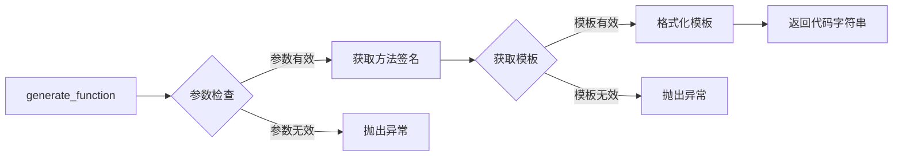
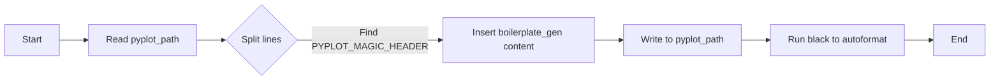
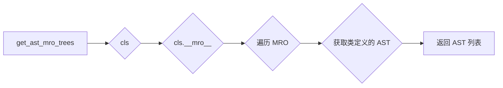
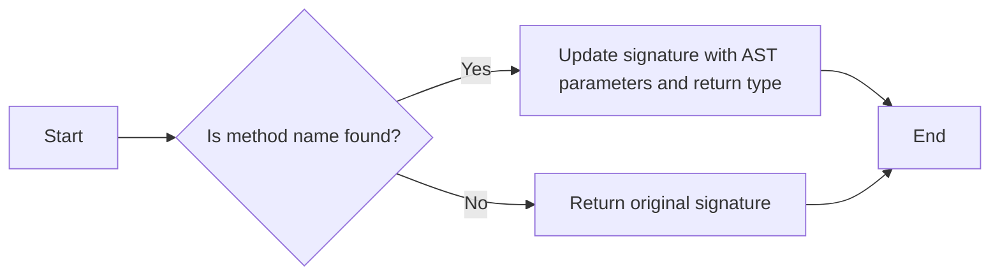
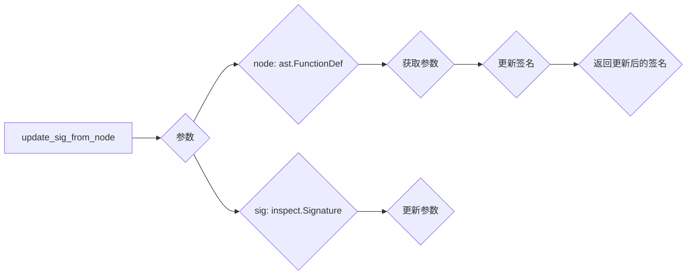

# `matplotlib\tools\boilerplate.py` 详细设计文档

This script generates the automatically generated part of the matplotlib.pyplot module, creating wrapper functions for methods of Figure and Axes classes, and colormap setter functions.

## 整体流程

```mermaid
graph TD
    A[开始] --> B{读取pyplot.py文件?}
    B -- 是 --> C[定位PYPLOT_MAGIC_HEADER标记}
    C --> D[读取pyplot.py文件内容]
    D --> E[生成自动生成部分的内容]
    E --> F[将自动生成部分内容写入pyplot.py文件]
    F --> G[格式化pyplot.py文件]
    G --> H[结束]
```

## 类结构

```
pyplot.py (主文件)
├── boilerplate_gen() (生成器函数)
│   ├── _figure_commands (图例命令列表)
│   ├── _axes_commands (轴命令列表)
│   ├── cmappable (可映射方法字典)
│   └── cmaps (颜色映射列表)
├── build_pyplot(pyplot_path) (构建pyplot.py文件)
│   ├── pyplot_orig (原始pyplot.py文件内容)
│   ├── PYPLOT_MAGIC_HEADER (标记自动生成内容)
│   └── pyplot_path (pyplot.py文件路径)
└── 其他辅助函数 (如get_ast_tree, get_ast_mro_trees, get_matching_signature等)
```

## 全局变量及字段


### `AUTOGEN_MSG`
    
Message indicating that the code is autogenerated.

类型：`str`
    


### `AXES_CMAPPABLE_METHOD_TEMPLATE`
    
Template for generating methods that are colormap capable.

类型：`str`
    


### `AXES_METHOD_TEMPLATE`
    
Template for generating methods that are not colormap capable.

类型：`str`
    


### `FIGURE_METHOD_TEMPLATE`
    
Template for generating methods that belong to the Figure class.

类型：`str`
    


### `CMAP_TEMPLATE`
    
Template for generating colormap setter functions.

类型：`str`
    


### `_figure_commands`
    
Tuple containing method names that are simple wrappers of Axes methods.

类型：`tuple`
    


### `_axes_commands`
    
Tuple containing method names that are simple wrappers of Axes methods.

类型：`tuple`
    


### `cmappable`
    
Dictionary mapping method names to additional commands for colormap methods.

类型：`dict`
    


### `cmaps`
    
Tuple containing names of colormaps.

类型：`tuple`
    


### `PYPLOT_MAGIC_HEADER`
    
Header indicating the start of the automatically generated part of the code.

类型：`str`
    


### `pyplot_orig`
    
List containing the original lines of the pyplot file before the automatically generated part.

类型：`list`
    


### `pyplot_path`
    
Path to the pyplot file being processed.

类型：`pathlib.Path`
    


    

## 全局函数及方法

### generate_function

#### 描述

`generate_function` 函数用于创建一个包装函数，该函数调用指定的方法。

#### 参数

- `name`：`str`，要创建的函数的名称。
- `called_fullname`：`str`，要包装的方法的完整名称，格式为 `"Class.method"`。
- `template`：`str`，要使用的模板。模板必须包含 `{}` 风格的格式占位符。以下占位符将被填充：

  - `name`：函数名称。
  - `signature`：函数签名（包括括号）。
  - `called_name`：被调用函数的名称。
  - `call`：传递给 `called_name` 的参数（包括括号）。

#### 返回值

- 返回创建的包装函数的代码字符串。

#### 流程图



#### 带注释源码

```python
def generate_function(name, called_fullname, template, **kwargs):
    # 获取方法签名
    class_name, called_name = called_fullname.split('.')
    class_ = {'Axes': Axes, 'Figure': Figure}[class_name]
    meth = getattr(class_, called_name)
    decorator = _api.deprecation.DECORATORS.get(meth)
    if decorator and decorator.func is _api.make_keyword_only:
        meth = meth.__wrapped__
    annotated_trees = get_ast_mro_trees(class_)
    signature = get_matching_signature(meth, annotated_trees)

    # 格式化模板
    params = list(signature.parameters.values())[1:]
    has_return_value = str(signature.return_annotation) != 'None'
    signature = str(signature.replace(parameters=[
        param.replace(default=value_formatter(param.default))
        if param.default is not param.empty else param
        for param in params]))
    call = '(' + ', '.join((
        '{0}'
        if param.kind in [
            Parameter.POSITIONAL_OR_KEYWORD]
           and param.default is Parameter.empty else
        '**({{"data": data}} if data is not None else {{}})'
        if param.name == "data" else
        '{0}={0}'
        if param.kind in [
            Parameter.POSITIONAL_OR_KEYWORD,
            Parameter.KEYWORD_ONLY] else
        '{0}'
        if param.kind is Parameter.POSITIONAL_ONLY else
        '*{0}'
        if param.kind is Parameter.VAR_POSITIONAL else
        '**{0}'
        if param.kind is Parameter.VAR_KEYWORD else
        None).format(param.name)
        for param in params) + ')'
    return_statement = 'return ' if has_return_value else ''
    # 替换 self 参数
    for reserved in ('gca', 'gci', 'gcf', '__ret'):
        if reserved in params:
            raise ValueError(
                f'Method {called_fullname} has kwarg named {reserved}')
    return template.format(
        name=name,
        called_name=called_name,
        signature=signature,
        call=call,
        return_statement=return_statement,
        **kwargs)
```

### boilerplate_gen

#### 描述

`boilerplate_gen` 函数是一个生成器，用于生成 `pyplot.py` 文件中自动生成的部分。它负责生成调用 `Figure` 和 `Axes` 类方法的包装函数，以及设置颜色映射的函数。

#### 参数

无

#### 返回值

生成器，每次调用返回一行代码。

#### 流程图

```mermaid
graph LR
A[boilerplate_gen()] --> B{生成Figure方法}
B --> C{生成Axes方法}
C --> D{生成颜色映射方法}
D --> E[结束]
```

#### 带注释源码

```python
def boilerplate_gen():
    """Generator of lines for the automated part of pyplot."""

    _figure_commands = (
        'figimage',
        'figtext:text',
        'gca',
        'gci:_gci',
        'ginput',
        'subplots_adjust',
        'suptitle',
        'tight_layout',
        'waitforbuttonpress',
    )

    # These methods are all simple wrappers of Axes methods by the same name.
    _axes_commands = (
        'acorr',
        'angle_spectrum',
        'annotate',
        'arrow',
        'autoscale',
        'axhline',
        'axhspan',
        'axis',
        'axline',
        'axvline',
        'axvspan',
        'bar',
        'barbs',
        'barh',
        'bar_label',
        'boxplot',
        'broken_barh',
        'clabel',
        'cohere',
        'contour',
        'contourf',
        'csd',
        'ecdf',
        'errorbar',
        'eventplot',
        'fill',
        'fill_between',
        'fill_betweenx',
        'grid',
        'grouped_bar',
        'hexbin',
        'hist',
        'stairs',
        'hist2d',
        'hlines',
        'imshow',
        'legend',
        'locator_params',
        'loglog',
        'magnitude_spectrum',
        'margins',
        'minorticks_off',
        'minorticks_on',
        'pcolor',
        'pcolormesh',
        'phase_spectrum',
        'pie',
        'pie_label',
        'plot',
        'psd',
        'quiver',
        'quiverkey',
        'scatter',
        'semilogx',
        'semilogy',
        'specgram',
        'spy',
        'stackplot',
        'stem',
        'step',
        'streamplot',
        'table',
        'text',
        'tick_params',
        'ticklabel_format',
        'tricontour',
        'tricontourf',
        'tripcolor',
        'triplot',
        'violinplot',
        'vlines',
        'xcorr',
        # pyplot name : real name
        'sci:_sci',
        'title:set_title',
        'xlabel:set_xlabel',
        'ylabel:set_ylabel',
        'xscale:set_xscale',
        'yscale:set_yscale',
    )

    cmappable = {
        'contour': (
            'if __ret._A is not None:  # type: ignore[attr-defined]\n'
            '        sci(__ret)'
        ),
        'contourf': (
            'if __ret._A is not None:  # type: ignore[attr-defined]\n'
            '        sci(__ret)'
        ),
        'hexbin': 'sci(__ret)',
        'scatter': 'sci(__ret)',
        'pcolor': 'sci(__ret)',
        'pcolormesh': 'sci(__ret)',
        'hist2d': 'sci(__ret[-1])',
        'imshow': 'sci(__ret)',
        'spy': (
            'if isinstance(__ret, _ColorizerInterface):\n'
            '        sci(__ret)'
        ),
        'quiver': 'sci(__ret)',
        'specgram': 'sci(__ret[-1])',
        'streamplot': 'sci(__ret.lines)',
        'tricontour': (
            'if __ret._A is not None:  # type: ignore[attr-defined]\n'
            '        sci(__ret)'
        ),
        'tricontourf': (
            'if __ret._A is not None:  # type: ignore[attr-defined]\n'
            '        sci(__ret)'
        ),
        'tripcolor': 'sci(__ret)',
    }

    for spec in _figure_commands:
        if ':' in spec:
            name, called_name = spec.split(':')
        else:
            name = called_name = spec
        yield generate_function(name, f'Figure.{called_name}',
                                FIGURE_METHOD_TEMPLATE)

    for spec in _axes_commands:
        if ':' in spec:
            name, called_name = spec.split(':')
        else:
            name = called_name = spec

        template = (AXES_CMAPPABLE_METHOD_TEMPLATE if name in cmappable else
                    AXES_METHOD_TEMPLATE)
        yield generate_function(name, f'Axes.{called_name}', template,
                                sci_command=cmappable.get(name))

    cmaps = (
        'autumn',
        'bone',
        'cool',
        'copper',
        'flag',
        'gray',
        'hot',
        'hsv',
        'jet',
        'pink',
        'prism',
        'spring',
        'summer',
        'winter',
        'magma',
        'inferno',
        'plasma',
        'viridis',
        "nipy_spectral"
    )
    # add all the colormaps (autumn, hsv, ....)
    for name in cmaps:
        yield AUTOGEN_MSG
        yield CMAP_TEMPLATE.format(name=name)
```

### build_pyplot

#### 描述

`build_pyplot` 函数负责生成 `pyplot.py` 文件的自动生成部分，该文件是 Matplotlib 库的一部分。该函数读取指定的 `pyplot_path` 文件，插入由 `boilerplate_gen` 生成的内容，并使用 `black` 工具进行格式化。

#### 参数

- `pyplot_path`：`Path` 对象，指定 `pyplot.py` 文件的路径。

#### 返回值

无返回值。

#### 流程图



#### 带注释源码

```python
def build_pyplot(pyplot_path):
    # Read the original content of the pyplot file.
    pyplot_orig = pyplot_path.read_text().splitlines(keepends=True)
    try:
        pyplot_orig = pyplot_orig[:pyplot_orig.index(PYPLOT_MAGIC_HEADER) + 1]
    except IndexError as err:
        raise ValueError('The pyplot.py file *must* have the exact line: %s'
                         % PYPLOT_MAGIC_HEADER) from err

    # Open the pyplot file for writing.
    with pyplot_path.open('w') as pyplot:
        # Write the original content up to the magic header.
        pyplot.writelines(pyplot_orig)
        # Write the automatically generated content.
        pyplot.writelines(boilerplate_gen())
        # Run black to autoformat the file.
        subprocess.run(
            [sys.executable, "-m", "black", "--line-length=88", pyplot_path],
            check=True
        )
```

### `get_ast_tree(cls)`

**描述**：此函数用于从给定类的pyi文件中获取AST（抽象语法树）。

**参数**：

- `cls`：要获取AST的类的实例。

**返回值**：

- 返回一个`ast.ClassDef`对象，该对象表示给定类的AST。

#### 流程图

```mermaid
graph LR
A[get_ast_tree(cls)] --> B{pyi文件存在?}
B -- 是 --> C[读取pyi文件]
B -- 否 --> D[读取源文件]
C --> E[解析AST]
D --> E
E --> F[返回ast.ClassDef对象]
```

#### 带注释源码

```python
def get_ast_tree(cls):
    path = Path(inspect.getfile(cls))
    stubpath = path.with_suffix(".pyi")
    path = stubpath if stubpath.exists() else path
    tree = ast.parse(path.read_text())
    for item in tree.body:
        if isinstance(item, ast.ClassDef) and item.name == cls.__name__:
            return item
    raise ValueError(f"Cannot find {cls.__name__} in ast")
```

### get_ast_mro_trees

#### 描述

`get_ast_mro_trees` 函数用于获取给定类的 MRO（Method Resolution Order）树中的所有类定义的 AST（Abstract Syntax Tree）。

#### 参数

- `cls`: 类型，需要获取 AST MRO 树的类。

#### 返回值

- 列表，包含给定类 MRO 树中所有类定义的 AST。

#### 流程图



#### 带注释源码

```python
@functools.lru_cache
def get_ast_mro_trees(cls):
    # 获取类的 MRO 列表
    mro_list = cls.__mro__
    # 遍历 MRO 列表，获取每个类的 AST
    ast_trees = [get_ast_tree(c) for c in mro_list if c.__module__ != "builtins"]
    return ast_trees
```

### `get_matching_signature`

#### 描述

`get_matching_signature` 函数用于从提供的 AST 树中找到与给定方法匹配的签名。它首先获取方法的签名，然后遍历 AST 树以查找具有相同名称的方法定义，并更新签名以反映该方法的参数和返回类型。

#### 参数

- `method`: `inspect.Signature`，要匹配签名的目标方法。
- `trees`: `list`，包含类层次结构中所有相关类的 AST 树。

#### 返回值

- `inspect.Signature`，更新后的签名，包含从 AST 树中找到的参数和返回类型。

#### 流程图



#### 带注释源码

```python
def get_matching_signature(method, trees):
    sig = inspect.signature(method)
    for tree in trees:
        for item in tree.body:
            if not isinstance(item, ast.FunctionDef):
                continue
            if item.name == method.__name__:
                return update_sig_from_node(item, sig)
    # The following methods are implemented outside of the mro of Axes
    # and thus do not get their annotated versions found with current code
    #     stackplot
    #     streamplot
    #     table
    #     tricontour
    #     tricontourf
    #     tripcolor
    #     triplot

    # import warnings
    # warnings.warn(f"'{method.__name__}' not found")
    return sig
```

### update_sig_from_node

#### 描述

`update_sig_from_node` 函数用于从 AST 节点更新函数签名。它接受一个 AST 节点和一个现有的签名，然后根据 AST 节点中的参数和返回类型更新签名。

#### 参数

- `node`：`ast.FunctionDef` 类型，表示 AST 中的函数定义节点。
- `sig`：`inspect.Signature` 类型，表示现有的函数签名。

#### 返回值

- `inspect.Signature` 类型，表示更新后的函数签名。

#### 流程图



#### 带注释源码

```python
def update_sig_from_node(node, sig):
    params = dict(sig.parameters)
    args = node.args
    allargs = (
        *args.posonlyargs,
        *args.args,
        args.vararg,
        *args.kwonlyargs,
        args.kwarg,
    )
    for param in allargs:
        if param is None:
            continue
        if param.annotation is None:
            continue
        annotation = direct_repr(ast.unparse(param.annotation))
        params[param.arg] = params[param.arg].replace(annotation=annotation)

    if node.returns is not None:
        return inspect.Signature(
            params.values(),
            return_annotation=direct_repr(ast.unparse(node.returns))
        )
    else:
        return inspect.Signature(params.values())
```


### value_formatter.__init__

该函数用于初始化`value_formatter`类，将传入的值格式化为字符串表示。

参数：

- `value`：`Any`，要格式化的值。

返回值：无

#### 流程图

```mermaid
graph LR
A[Start] --> B{Is value mlab.detrend_none?}
B -- Yes --> C[Set _repr to "mlab.detrend_none"]
B -- No --> D{Is value mlab.window_hanning?}
D -- Yes --> E[Set _repr to "mlab.window_hanning"]
D -- No --> F{Is value np.mean?}
F -- Yes --> G[Set _repr to "np.mean"]
F -- No --> H{Is value _api.deprecation._deprecated_parameter?}
H -- Yes --> I[Set _repr to "_api.deprecation._deprecated_parameter"]
H -- No --> J{Is value Enum?}
J -- Yes --> K[Set _repr to f'{type(value).__name__}.{value.name}']
J -- No --> L[Set _repr to repr(value)]
L --> M[End]
```

#### 带注释源码

```python
def __init__(self, value):
    if value is mlab.detrend_none:
        self._repr = "mlab.detrend_none"
    elif value is mlab.window_hanning:
        self._repr = "mlab.window_hanning"
    elif value is np.mean:
        self._repr = "np.mean"
    elif value is _api.deprecation._deprecated_parameter:
        self._repr = "_api.deprecation._deprecated_parameter"
    elif isinstance(value, Enum):
        self._repr = f'{type(value).__name__}.{value.name}'
    else:
        self._repr = repr(value)
``` 


### value_formatter.__repr__

该函数用于格式化函数默认值，以便于 `inspect.formatargspec` 使用。

参数：

- `value`：`Any`，要格式化的值。

返回值：`str`，格式化后的字符串。

#### 流程图

```mermaid
graph LR
A[开始] --> B{value is mlab.detrend_none?}
B -- 是 --> C[设置 _repr 为 "mlab.detrend_none"]
B -- 否 --> D{value is mlab.window_hanning?}
D -- 是 --> E[设置 _repr 为 "mlab.window_hanning"]
D -- 否 --> F{value is np.mean?}
F -- 是 --> G[设置 _repr 为 "np.mean"]
F -- 否 --> H{value is _api.deprecation._deprecated_parameter?}
H -- 是 --> I[设置 _repr 为 "_api.deprecation._deprecated_parameter"]
H -- 否 --> J{isinstance(value, Enum)?}
J -- 是 --> K[设置 _repr 为 f'{type(value).__name__}.{value.name}']
J -- 否 --> L[设置 _repr 为 repr(value)]
L --> M[返回 _repr]
```

#### 带注释源码

```python
class value_formatter:
    """
    Format function default values as needed for inspect.formatargspec.
    The interesting part is a hard-coded list of functions used
    as defaults in pyplot methods.
    """

    def __init__(self, value):
        if value is mlab.detrend_none:
            self._repr = "mlab.detrend_none"
        elif value is mlab.window_hanning:
            self._repr = "mlab.window_hanning"
        elif value is np.mean:
            self._repr = "np.mean"
        elif value is _api.deprecation._deprecated_parameter:
            self._repr = "_api.deprecation._deprecated_parameter"
        elif isinstance(value, Enum):
            # Enum str is Class.Name whereas their repr is <Class.Name: value>.
            self._repr = f'{type(value).__name__}.{value.name}'
        else:
            self._repr = repr(value)

    def __repr__(self):
        return self._repr
``` 


### direct_repr.__init__

`direct_repr.__init__` 是 `direct_repr` 类的构造函数，用于初始化 `direct_repr` 对象。

参数：

- `value`：`Any`，要转换的值。

返回值：无

#### 流程图

```mermaid
classDiagram
    direct_repr <|-- value
    direct_repr {
        - _repr: str
    }
    direct_repr +--init(value: Any)
    direct_repr +--__repr__()
}
```

#### 带注释源码

```python
class direct_repr:
    """
    A placeholder class to destringify annotations from ast
    """
    def __init__(self, value):
        self._repr = value

    def __repr__(self):
        return self._repr
```


### direct_repr.__repr__

`direct_repr` 类的 `__repr__` 方法用于将传入的值转换为字符串表示形式。

参数：

- `value`：`any`，要转换的值。

返回值：`str`，转换后的字符串表示形式。

#### 流程图

```mermaid
classDiagram
    direct_repr --|> any : value
    direct_repr <<interface>>
    direct_repr : __repr__()
    direct_repr : _repr str
end
```

#### 带注释源码

```python
class direct_repr:
    """
    A placeholder class to destringify annotations from ast
    """
    def __init__(self, value):
        self._repr = value

    def __repr__(self):
        return self._repr
```


## 关键组件


### 张量索引与惰性加载

张量索引与惰性加载是代码中用于处理大型数据集的机制，它允许在需要时才计算数据，从而减少内存消耗和提高性能。

### 反量化支持

反量化支持是代码中用于处理量化数据的一种机制，它允许在量化前后进行数据转换，确保量化过程不会影响数据的准确性。

### 量化策略

量化策略是代码中用于优化模型性能的一种机制，它通过减少模型中使用的数值范围来减少模型大小和计算量，从而提高模型的效率。


## 问题及建议


### 已知问题

-   **代码维护性**：代码中存在大量的字符串替换和模板生成，这可能导致代码难以维护和理解。如果API发生变化，需要手动更新模板和生成代码，增加了维护成本。
-   **错误处理**：代码中没有明确的错误处理机制，如果生成过程中出现错误，可能会导致整个生成过程失败，需要额外的错误处理逻辑来确保生成过程的稳定性。
-   **性能**：代码中使用了大量的字符串操作和模板生成，这可能会影响性能，尤其是在处理大量函数时。可以考虑使用更高效的方法来生成代码。
-   **依赖性**：代码依赖于`ast`模块来解析Python代码，这可能会增加代码的复杂性和维护成本。可以考虑使用其他方法来生成代码，例如使用正则表达式或抽象语法树（AST）的库。

### 优化建议

-   **代码重构**：重构代码，使用更清晰和可维护的代码结构，例如使用函数和类来组织代码，并添加注释来提高代码的可读性。
-   **错误处理**：添加异常处理逻辑，确保在生成过程中出现错误时能够捕获并处理异常，避免整个生成过程失败。
-   **性能优化**：优化代码性能，例如使用更高效的数据结构和算法，减少字符串操作和模板生成。
-   **减少依赖性**：减少对`ast`模块的依赖，考虑使用其他方法来生成代码，例如使用正则表达式或抽象语法树（AST）的库。
-   **自动化测试**：编写自动化测试来验证生成代码的正确性和稳定性，确保在API变化时能够及时发现问题。


## 其它


### 设计目标与约束

- 设计目标：
  - 自动生成 `pyplot.py` 中的自动生成部分，以保持代码的更新和一致性。
  - 提供一个简单且易于维护的脚本，以便在 `pyplot` API 更改时更新自动生成的代码。
  - 确保生成的代码具有良好的可读性和可维护性。

- 约束：
  - 代码必须遵循 `pyplot.py` 的现有结构和命名约定。
  - 代码必须与 `matplotlib` 库的版本兼容。
  - 代码必须能够处理 `Axes` 和 `Figure` 类的所有相关方法。

### 错误处理与异常设计

- 错误处理：
  - 当 `pyplot.py` 文件中缺少必要的标记行时，脚本将抛出 `ValueError`。
  - 当找不到指定的类或方法时，脚本将抛出 `ValueError`。
  - 当 `Axes` 或 `Figure` 类的导入路径不正确时，脚本将抛出 `RuntimeError`。

- 异常设计：
  - 使用 `try-except` 块来捕获和处理可能发生的异常。
  - 提供清晰的错误消息，以便开发人员能够快速定位和解决问题。

### 数据流与状态机

- 数据流：
  - 脚本从 `Axes` 和 `Figure` 类中检索方法签名。
  - 脚本使用模板生成自动化的代码行。
  - 脚本将生成的代码写入 `pyplot.py` 文件。

- 状态机：
  - 脚本没有明确的状态机，因为它主要执行数据处理和文件操作。

### 外部依赖与接口契约

- 外部依赖：
  - `ast`：用于解析 Python 代码。
  - `enum`：用于定义枚举类型。
  - `functools`：用于缓存函数调用结果。
  - `inspect`：用于获取对象的信息。
  - `numpy`：用于数学运算。
  - `pathlib`：用于文件路径操作。
  - `subprocess`：用于运行外部命令。
  - `sys`：用于访问系统特定的参数和函数。

- 接口契约：
  - 脚本遵循 `matplotlib` 库的 API 规范。
  - 脚本生成的代码遵循 `pyplot.py` 的命名约定和结构。
  - 脚本生成的代码应与 `matplotlib` 库的其他部分兼容。

    