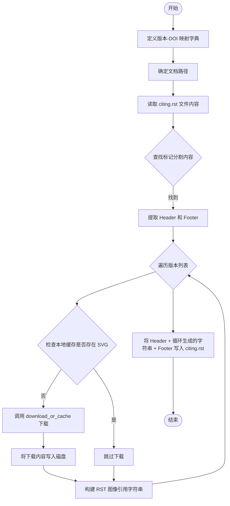
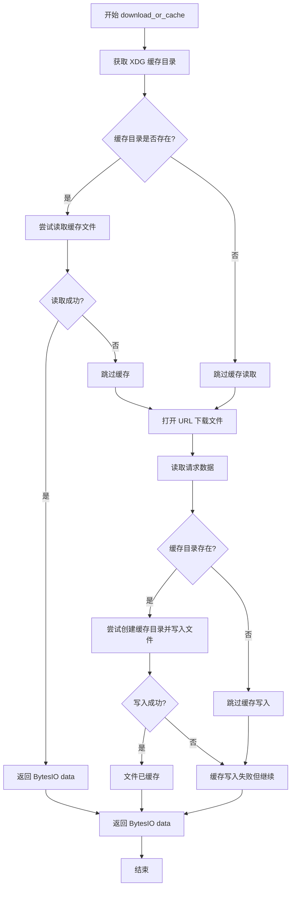
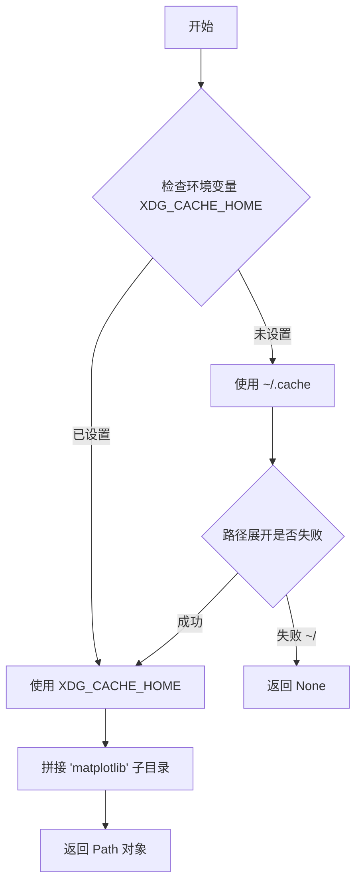
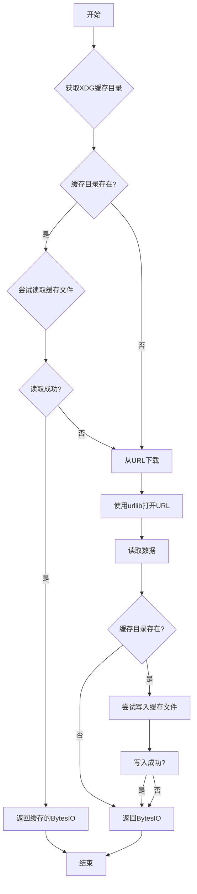

# `matplotlib\tools\cache_zenodo_svg.py` 详细设计文档

该脚本自动化地将 Zenodo DOI 徽章（SVG 图片）下载到本地缓存，并依据预定义的版本号与 DOI 映射关系，动态更新 Sphinx 文档的 RST 源文件，以在文档中展示对应版本的引用徽章。

## 整体流程



## 类结构

```
Module: zenodo_badge_updater
├── Global Config (全局配置)
│   └── data (版本号与 DOI 映射字典)
├── Utility Functions (工具函数)
│   ├── download_or_cache (下载或读取缓存)
│   └── _get_xdg_cache_dir (获取 XDG 标准缓存目录)
└── Main Execution Block (主执行逻辑)
```

## 全局变量及字段


### `data`
    
A dictionary mapping version strings to DOI numbers for matplotlib releases

类型：`dict[str, str]`
    


### `doc_dir`
    
Absolute path to the documentation directory

类型：`Path`
    


### `target_dir`
    
Path to the zenodo_cache directory for storing SVG badge files

类型：`Path`
    


### `citing`
    
Path to the citing.rst file containing citation information

类型：`Path`
    


### `header`
    
List of lines representing the header content before the autogenerated section

类型：`list[str]`
    


### `footer`
    
List of lines representing the footer content after the autogenerated section

类型：`list[str]`
    


### `url`
    
The URL to download the Zenodo DOI badge SVG from

类型：`str`
    


### `payload`
    
File content loaded into memory, returned from download_or_cache function

类型：`BytesIO`
    


### `svg_path`
    
Path to the local SVG file to be saved or checked for existence

类型：`Path`
    


### `version`
    
The version string of matplotlib being processed in the loop

类型：`str`
    


### `doi`
    
The Digital Object Identifier associated with a specific matplotlib version

类型：`str`
    


### `ln`
    
A single line read from the citing.rst input file

类型：`str`
    


### `target`
    
Reference to either header or footer list, used for accumulating lines during parsing

类型：`list[str]`
    


    

## 全局函数及方法


### `download_or_cache`

该函数实现了一个简单的下载并缓存机制：尝试从本地缓存目录读取指定版本的文件，如果缓存不存在则从 URL 下载，下载成功后尝试写入缓存，最终将数据以 BytesIO 对象形式返回。

参数：

- `url`：`str`，要下载的文件 URL 地址
- `version`：`str`，缓存文件使用的版本标识符（作为缓存文件名）

返回值：`BytesIO`，将文件内容加载到内存中的字节流对象

#### 流程图



#### 带注释源码

```python
def download_or_cache(url, version):
    """
    Get bytes from the given url or local cache.

    Parameters
    ----------
    url : str
        The url to download.
    sha : str
        The sha256 of the file.  # 注意：文档注释与实际参数名不符

    Returns
    -------
    BytesIO
        The file loaded into memory.
    """
    # 获取 XDG 缓存目录（matplotlib 子目录）
    cache_dir = _get_xdg_cache_dir()

    # 尝试从本地缓存读取
    if cache_dir is not None:
        try:
            # 尝试读取缓存文件（使用 version 作为文件名）
            data = (cache_dir / version).read_bytes()
        except OSError:
            # 文件不存在或读取错误时静默跳过
            pass
        else:
            # 读取成功，直接返回 BytesIO 对象
            return BytesIO(data)

    # 缓存不存在或读取失败，从 URL 下载
    with urllib.request.urlopen(
        urllib.request.Request(url, headers={"User-Agent": ""})
    ) as req:
        # 读取下载的数据
        data = req.read()

    # 尝试将下载的文件写入缓存
    if cache_dir is not None:
        try:
            # 创建缓存目录（如果不存在）
            cache_dir.mkdir(parents=True, exist_ok=True)
            # 以独占创建模式写入缓存文件
            with open(cache_dir / version, "xb") as fout:
                fout.write(data)
        except OSError:
            # 写入失败时静默跳过（如权限问题或文件已存在）
            pass

    # 返回内存中的字节流对象
    return BytesIO(data)
```


### `_get_xdg_cache_dir`

获取 XDG 缓存目录，根据 XDG Base Directory 规范返回 matplotlib 专用的缓存路径。

参数： 无

返回值：`Path` 或 `None`，返回 XDG 规范下的 matplotlib 缓存目录路径，若路径展开失败则返回 None

#### 流程图



#### 带注释源码

```python
def _get_xdg_cache_dir():
    """
    Return the XDG cache directory.

    See
    https://specifications.freedesktop.org/basedir-spec/basedir-spec-latest.html
    """
    # 优先尝试从环境变量获取 XDG_CACHE_HOME
    cache_dir = os.environ.get("XDG_CACHE_HOME")
    
    # 如果环境变量未设置，则回退到默认的 ~/.cache
    if not cache_dir:
        cache_dir = os.path.expanduser("~/.cache")
        # 检查路径展开是否失败（如果仍以~/开头说明展开失败）
        if cache_dir.startswith("~/"):  # Expansion failed.
            return None
    
    # 返回拼接了 'matplotlib' 子目录的 Path 对象
    return Path(cache_dir, "matplotlib")
```

## 关键组件


### 核心功能概述

该代码是一个缓存管理工具，用于从Zenodo下载matplotlib项目的DOI徽章SVG图像，并将其缓存到本地XDG缓存目录，同时自动生成RST文档中的版本引用信息。

### 文件整体运行流程

1. 定义版本数据字典（DOI与版本号映射）
2. 确定目标目录（doc/_static/zenodo_cache）
3. 读取citing.rst文件，提取header和footer部分
4. 遍历版本数据，对每个版本：
   - 检查本地是否已存在SVG文件
   - 如不存在，则调用download_or_cache从远程URL下载
   - 将版本信息和DOI徽章写入RST文件

### 函数详细信息

#### download_or_cache

- **名称**: download_or_cache
- **参数**: 
  - url (str): 远程URL地址
  - version (str): 缓存文件名（版本标识）
- **参数描述**: 根据version检查本地缓存，如存在则直接读取，否则从url下载并缓存
- **返回值类型**: BytesIO
- **返回值描述**: 文件内容的内存对象
- **流程图**: 

- **源码**:
```python
def download_or_cache(url, version):
    """
    Get bytes from the given url or local cache.

    Parameters
    ----------
    url : str
        The url to download.
    sha : str
        The sha256 of the file.

    Returns
    -------
    BytesIO
        The file loaded into memory.
    """
    cache_dir = _get_xdg_cache_dir()

    if cache_dir is not None:  # Try to read from cache.
        try:
            data = (cache_dir / version).read_bytes()
        except OSError:
            pass
        else:
            return BytesIO(data)

    with urllib.request.urlopen(
        urllib.request.Request(url, headers={"User-Agent": ""})
    ) as req:
        data = req.read()

    if cache_dir is not None:  # Try to cache the downloaded file.
        try:
            cache_dir.mkdir(parents=True, exist_ok=True)
            with open(cache_dir / version, "xb") as fout:
                fout.write(data)
        except OSError:
            pass

    return BytesIO(data)
```

#### _get_xdg_cache_dir

- **名称**: _get_xdg_cache_dir
- **参数**: 无
- **返回值类型**: Path | None
- **返回值描述**: 返回matplotlib的XDG缓存目录路径，如无法确定则返回None
- **流程图**:
```mermaid
flowchart TD
    A[开始] --> B[检查XDG_CACHE_HOME环境变量]
    B --> C{环境变量存在?}
    C -->|是| D[返回Path(cache_dir, matplotlib)]
    C -->|否| E[使用~/.cache]
    E --> F{路径展开成功?}
    F -->|是| D
    F -->|否| G[返回None]
```
- **源码**:
```python
def _get_xdg_cache_dir():
    """
    Return the XDG cache directory.

    See
    https://specifications.freedesktop.org/basedir-spec/basedir-spec-latest.html
    """
    cache_dir = os.environ.get("XDG_CACHE_HOME")
    if not cache_dir:
        cache_dir = os.path.expanduser("~/.cache")
        if cache_dir.startswith("~/"):  # Expansion failed.
            return None
    return Path(cache_dir, "matplotlib")
```

### 关键组件信息

#### 版本数据字典
映射matplotlib版本号到Zenodo DOI编号，用于生成引用链接

#### XDG缓存管理
遵循XDG基础目录规范，将下载的SVG文件存储在标准缓存位置

#### RST文档生成器
自动更新citing.rst文件，插入版本- DOI对应关系，保持文档与发布同步

#### HTTP下载器
使用urllib进行轻量级HTTP请求，带有自定义User-Agent头

### 潜在技术债务与优化空间

1. **缺少版本校验**: 下载文件后未验证SHA256哈希值（函数文档中提到sha参数但未使用）
2. **错误处理不完善**: 网络失败时静默忽略异常，可能导致调试困难
3. **缓存失效机制**: 无缓存过期策略，长期使用可能积累过期文件
4. **并发支持缺失**: 串行下载多个版本，效率较低
5. **硬编码数据**: 版本信息嵌入代码而非从外部配置或API获取

### 其它项目

#### 设计目标与约束
- 目标：减少重复网络请求，加速文档构建
- 约束：依赖标准库，无第三方依赖

#### 错误处理与异常设计
- OSError: 缓存读写失败时静默降级到网络下载
- 网络异常直接抛出，由调用方处理

#### 数据流与状态机
- 缓存命中 → 直接返回
- 缓存未命中 → 下载 → 尝试缓存 → 返回

#### 外部依赖与接口契约
- 依赖：urllib、os、pathlib、io
- 外部接口：Zenodo API (https://zenodo.org/badge/doi/)


## 问题及建议


### 已知问题

-   **错误处理不完善**：使用空的 `except OSError` 静默捕获所有异常，没有任何日志记录，导致缓存读写失败时用户无法感知发生了什么问题
-   **文档注释与实际参数不一致**：`download_or_cache` 函数的参数名为 `version`，但文档注释写的是 `sha`，容易造成误解
-   **网络请求缺少超时设置**：`urllib.request.urlopen` 没有设置 timeout 参数，可能导致请求无限期等待，在网络不稳定时造成程序卡死
-   **缺少 HTTP 错误处理**：只读取响应数据，没有检查 HTTP 状态码，遇到 404、500 等错误时可能返回无效数据或抛出异常
-   **User-Agent 为空字符串**：直接使用空的 `User-Agent` 头，某些服务器可能会拒绝此类请求或返回错误响应
-   **缓存验证机制缺失**：仅根据文件名（version 参数）作为缓存键，没有验证缓存文件的完整性（如 SHA256），如果缓存文件损坏或被篡改，将返回错误数据
-   **内存使用问题**：`req.read()` 一次性将整个文件读入内存，对于大型文件可能导致内存溢出，应该使用流式处理
-   **文件写入模式风险**：使用 `xb` 模式写入缓存文件，文件存在时会抛出异常，虽然被捕获但不会进行重试或更新操作
-   **并发安全问题**：在多线程环境下，对缓存目录的创建和文件写入操作存在竞态条件，缺乏锁机制保护
-   **硬编码数据**：版本和 DOI 数据硬编码在代码中，不利于维护和扩展

### 优化建议

-   添加日志记录功能，记录缓存命中/未命中、网络请求状态、异常信息等，便于调试和监控
-   为网络请求添加合理的超时设置（如 `timeout=30`），并处理 `urllib.error.URLError` 和 `urllib.error.HTTPError`
-   修正文档注释，将 `version` 参数的描述改为更准确的表述，或者将参数名改为 `filename`
-   在缓存读取时增加文件完整性验证机制，例如额外存储 SHA256 校验值
-   使用流式写入替代一次性读取：`urllib.request.urlopen` 返回的对象支持迭代读取，可以分块写入文件
-   考虑使用 `shutil.copyfileobj` 进行流式文件复制，提高大文件处理的内存效率
-   将 `xb` 模式改为 `wb` 配合异常处理，或者先检查文件是否存在
-   如果需要在多线程环境使用，添加线程锁（如 `threading.Lock`）保护缓存读写操作
-   将版本数据迁移至外部配置文件（如 JSON 或 YAML），便于后续维护和更新
-   添加重试机制，对于临时性网络错误进行自动重试
-   考虑使用 `requests` 库替代 `urllib.request`，其 API 更友好且功能更完善

## 其它


### 设计目标与约束

本代码的主要设计目标是为matplotlib项目自动生成zenodo引用文档，包含DOI徽章的SVG图像。核心约束包括：1) 使用XDG标准确定缓存目录；2) 优先使用本地缓存减少网络请求；3) 缓存失败时静默降级到网络下载；4) 支持Python标准库功能，不引入额外依赖。

### 错误处理与异常设计

本代码采用静默失败策略，主要通过try-except捕获OSError异常。当缓存目录创建失败或文件写入失败时，异常被捕获并忽略，程序继续执行下载逻辑。同样，当缓存读取失败时，程序继续尝试从网络下载。这种设计确保了部分功能可用时不影响整体流程，但也可能导致用户无法感知潜在问题。代码未对网络请求失败（HTTP错误）、URL格式错误等进行处理。

### 数据流与状态机

数据流主要分为两条路径：缓存命中路径和缓存未命中路径。缓存命中路径：检查缓存目录是否存在 → 尝试以版本号为文件名读取字节 → 成功则返回BytesIO对象。缓存未命中路径：发起HTTP请求 → 读取响应数据 → 尝试写入缓存目录 → 返回BytesIO对象。主程序流程：读取citing.rst文件 → 解析版本和DOI数据 → 遍历版本列表 → 检查/下载SVG文件 → 写入目标文件。

### 外部依赖与接口契约

本代码依赖Python标准库：urllib.request用于HTTP请求，io.BytesIO用于内存缓冲区，os和pathlib.Path用于文件系统操作。没有外部依赖包。download_or_cache函数接受url(str)和version(str)两个参数，返回BytesIO对象。_get_xdg_cache_dir函数无参数，返回Path对象或None。

### 安全性考虑

代码存在以下安全隐患：1) User-Agent设置为空字符串，可能被某些服务器拒绝或返回不同内容；2) 未验证下载文件的完整性（应结合sha256校验）；3) 未对URL进行验证，可能存在SSRF风险；4) 缓存文件未设置权限保护。

### 性能考虑

当前实现存在性能瓶颈：1) 串行下载SVG文件，当版本数量多时耗时长；2) 未实现并发下载机制；3) 每次运行都会检查文件是否存在，可考虑使用If-Modified-Since等HTTP缓存头；4) 文件使用"xb"模式创建，文件已存在时会抛出异常，应先检查或使用"wb"模式。

### 测试策略建议

当前代码缺少测试覆盖。建议补充：1) 单元测试：测试_get_xdg_cache_dir在不同环境变量下的行为；2) 模拟测试：使用mock模拟urllib.request.urlopen；3) 集成测试：验证缓存和下载流程的完整性；4) 异常场景测试：模拟缓存目录不可写、网络请求失败等情况。

### 配置管理

配置通过环境变量和代码内嵌数据控制。XDG_CACHE_HOME环境变量用于指定缓存目录（默认~/.cache），缓存子目录固定为"matplotlib"。版本数据以字典形式硬编码在代码中，DOI数据与版本号耦合，未来维护成本较高。

### 版本兼容性

代码使用Python 3语法（pathlib、f-string等），需要Python 3.4+。urllib.request.Request的headers参数需要Python 3环境。BytesIO和Path对象在Python 2中不存在。


    