# `matplotlib\tools\check_typehints.py` 详细设计文档

This script performs AST checks to validate the consistency of type hints with implementation in Python code.

## 整体流程

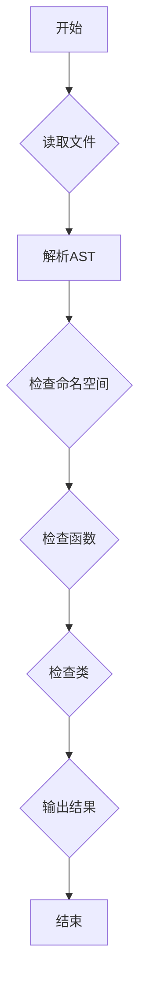

## 类结构

```
check_typehints.py (主脚本)
├── check_file
│   ├── check_namespace
│   │   ├── get_subtree
│   │   └── check_function
│   └── check_class
└── main
```

## 全局变量及字段


### `MISSING_STUB`
    
Indicates a missing stub in the code.

类型：`int`
    


### `MISSING_IMPL`
    
Indicates a missing implementation in the code.

类型：`int`
    


### `POS_ARGS`
    
Indicates that a function has positional only arguments.

类型：`int`
    


### `ARGS`
    
Indicates that a function has positional arguments.

类型：`int`
    


### `VARARG`
    
Indicates that a function has variadic positional arguments.

类型：`int`
    


### `KWARGS`
    
Indicates that a function has keyword arguments.

类型：`int`
    


### `VARKWARG`
    
Indicates that a function has variadic keyword arguments.

类型：`int`
    


### `basedir`
    
The base directory path for the project.

类型：`pathlib.Path`
    


### `per_file_ignore`
    
A dictionary containing ignore flags for specific files.

类型：`dict`
    


### `out`
    
The total number of errors found during the check.

类型：`int`
    


### `count`
    
The count of total errors found during the check.

类型：`int`
    


    

## 全局函数及方法


### `check_file`

This function checks the consistency of type hints with the implementation in a Python file. It compares the items defined in the stub file and the implementation file, checks the signatures of functions and methods, and reports any inconsistencies.

参数：

- `path`：`pathlib.Path`，The path to the Python file to be checked.
- `ignore`：`int`，An integer representing the flags to ignore certain checks. Defaults to 0.

返回值：`tuple`，A tuple containing the return code and the count of errors found.

#### 流程图

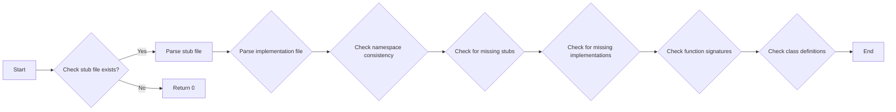

#### 带注释源码

```python
def check_file(path, ignore=0):
    stubpath = path.with_suffix(".pyi")
    ret = 0
    if not stubpath.exists():
        return 0, 0
    tree = ast.parse(path.read_text())
    stubtree = ast.parse(stubpath.read_text())
    return check_namespace(tree, stubtree, path, ignore)
```


### `check_namespace`

This function checks the consistency of type hints with implementation in a given namespace (module or class).

参数：

- `tree`: `ast.Node`，The abstract syntax tree of the source code.
- `stubtree`: `ast.Node`，The abstract syntax tree of the stub code.
- `path`: `pathlib.Path`，The path to the source code file.
- `ignore`: `int`，The bitwise OR of flags to ignore certain checks.

返回值：`int`，The error code indicating the type of errors found.

#### 流程图

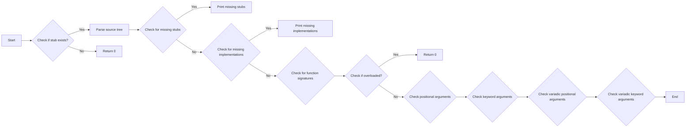

#### 带注释源码

```python
def check_namespace(tree, stubtree, path, ignore=0):
    ret = 0
    count = 0
    # ... (rest of the function code)
```


### `get_subtree`

查找给定名称的子树节点。

参数：

- `tree`：`ast.Node`，要搜索的AST树。
- `name`：`str`，要查找的节点名称。

返回值：`ast.Node`，找到的节点。

#### 流程图

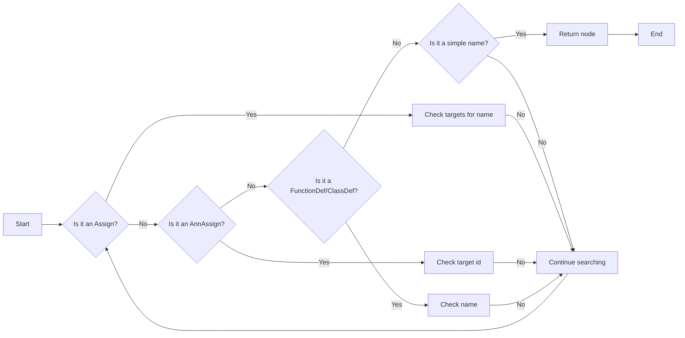

#### 带注释源码

```python
def get_subtree(tree, name):
    for item in tree.body:
        if isinstance(item, ast.Assign):
            if name in [i.id for i in item.targets if hasattr(i, "id")]:
                return item
            for target in item.targets:
                if isinstance(target, ast.Tuple):
                    if name in [i.id for i in target.elts]:
                        return item
        if isinstance(item, ast.AnnAssign):
            if name == item.target.id:
                return item
        if not hasattr(item, "name"):
            continue
        if item.name == name:
            return item
    raise ValueError(f"no such item {name} in tree")
```


### check_function

This function checks the consistency of type hints with the implementation of a function or method.

参数：

- `item`：`ast.FunctionDef`，The AST node representing the function or method to be checked.
- `stubitem`：`ast.FunctionDef`，The AST node representing the stub of the function or method to be checked.
- `path`：`str`，The path to the file containing the function or method.
- `ignore`：`int`，An integer representing the flags to ignore certain checks.

返回值：`tuple`，A tuple containing an integer representing the error flags and an integer representing the count of errors.

#### 流程图

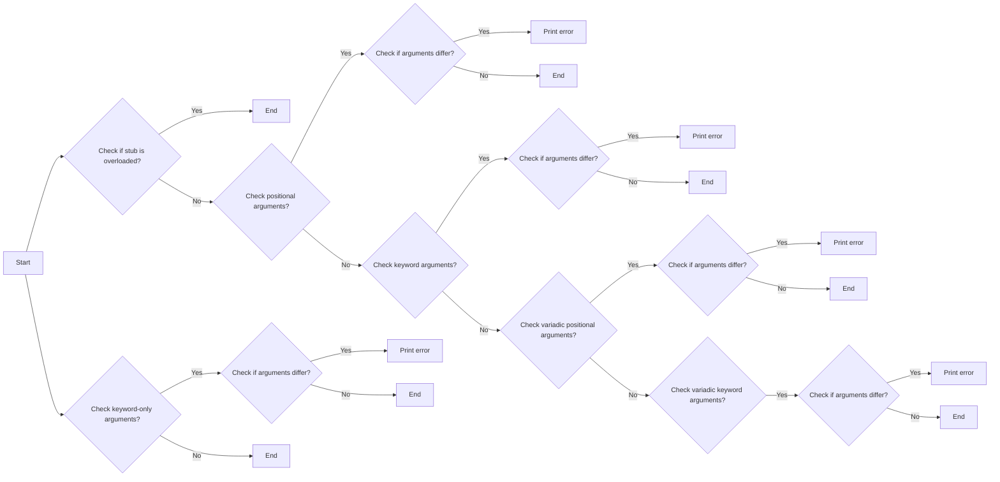

#### 带注释源码

```python
def check_function(item, stubitem, path, ignore):
    ret = 0
    count = 0

    # if the stub calls overload, assume it knows what its doing
    overloaded = "overload" in [
        i.id for i in stubitem.decorator_list if hasattr(i, "id")
    ]
    if overloaded:
        return 0, 0

    item_posargs = [a.arg for a in item.args.posonlyargs]
    stubitem_posargs = [a.arg for a in stubitem.args.posonlyargs]
    if item_posargs != stubitem_posargs and ~ignore & POS_ARGS:
        print(
            f"{path} {item.name} posargs differ: {item_posargs} vs {stubitem_posargs}"
        )
        ret |= POS_ARGS
        count += 1

    item_args = [a.arg for a in item.args.args]
    stubitem_args = [a.arg for a in stubitem.args.args]
    if item_args != stubitem_args and ~ignore & ARGS:
        print(f"{path} args differ for {item.name}: {item_args} vs {stubitem_args}")
        ret |= ARGS
        count += 1

    item_vararg = item.args.vararg
    stubitem_vararg = stubitem.args.vararg
    if ~ignore & VARARG:
        if (item_vararg is None) ^ (stubitem_vararg is None):
            if item_vararg:
                print(
                    f"{path} {item.name} vararg differ: "
                    f"{item_vararg.arg} vs {stubitem_vararg}"
                )
            else:
                print(
                    f"{path} {item.name} vararg differ: "
                    f"{item_vararg} vs {stubitem_vararg.arg}"
                )
            ret |= VARARG
            count += 1
        elif item_vararg is None:
            pass
        elif item_vararg.arg != stubitem_vararg.arg:
            print(
                f"{path} {item.name} vararg differ: "
                f"{item_vararg.arg} vs {stubitem_vararg.arg}"
            )
            ret |= VARARG
            count += 1

    item_kwonlyargs = [a.arg for a in item.args.kwonlyargs]
    stubitem_kwonlyargs = [a.arg for a in stubitem.args.kwonlyargs]
    if item_kwonlyargs != stubitem_kwonlyargs and ~ignore & KWARGS:
        print(
            f"{path} {item.name} kwonlyargs differ: "
            f"{item_kwonlyargs} vs {stubitem_kwonlyargs}"
        )
        ret |= KWARGS
        count += 1

    item_kwarg = item.args.kwarg
    stubitem_kwarg = stubitem.args.kwarg
    if ~ignore & VARKWARG:
        if (item_kwarg is None) ^ (stubitem_kwarg is None):
            if item_kwarg:
                print(
                    f"{path} {item.name} varkwarg differ: "
                    f"{item_kwarg.arg} vs {stubitem_kwarg}"
                )
            else:
                print(
                    f"{path} {item.name} varkwarg differ: "
                    f"{item_kwarg} vs {stubitem_kwarg.arg}"
                )
            ret |= VARKWARG
            count += 1
        elif item_kwarg is None:
            pass
        elif item_kwarg.arg != stubitem_kwarg.arg:
            print(
                f"{path} {item.name} varkwarg differ: "
                f"{item_kwarg.arg} vs {stubitem_kwarg.arg}"
            )
            ret |= VARKWARG
            count += 1

    return ret, count
```


### `check_file`

检查给定文件中的类型提示与实现的一致性。

参数：

- `path`：`pathlib.Path`，要检查的文件路径。
- `ignore`：`int`，用于忽略某些检查的标志。

返回值：`int`，表示检查结果的状态码。

#### 流程图

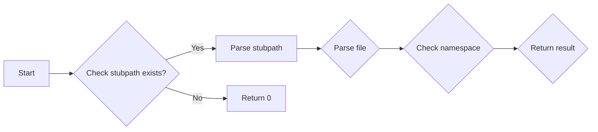

#### 带注释源码

```python
def check_file(path, ignore=0):
    stubpath = path.with_suffix(".pyi")
    ret = 0
    if not stubpath.exists():
        return 0, 0
    tree = ast.parse(path.read_text())
    stubtree = ast.parse(stubpath.read_text())
    return check_namespace(tree, stubtree, path, ignore)
```


### `check_namespace`

检查给定命名空间中的类型提示与实现的一致性。

参数：

- `tree`：`ast.Node`，源代码的AST树。
- `stubtree`：`ast.Node`，类型提示的AST树。
- `path`：`pathlib.Path`，文件路径。
- `ignore`：`int`，用于忽略某些检查的标志。

返回值：`int`，表示检查结果的状态码。

#### 流程图

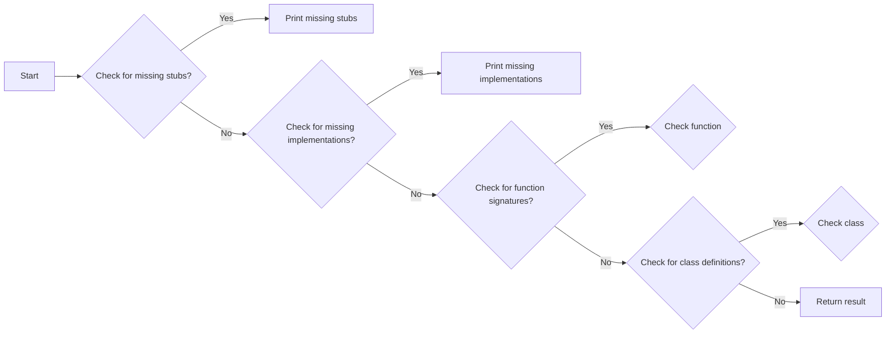

#### 带注释源码

```python
def check_namespace(tree, stubtree, path, ignore=0):
    ret = 0
    count = 0
    # ... (omitted for brevity)
    for item_name in tree_items & stubtree_items:
        item = get_subtree(tree, item_name)
        stubitem = get_subtree(stubtree, item_name)
        if isinstance(item, ast.FunctionDef) and isinstance(stubitem, ast.FunctionDef):
            err, c = check_function(item, stubitem, f"{path}::{item_name}", ignore)
            ret |= err
            count += c
        if isinstance(item, ast.ClassDef):
            # ... (omitted for brevity)
```


### `check_function`

检查给定函数的类型提示与实现的一致性。

参数：

- `item`：`ast.FunctionDef`，源代码中的函数定义。
- `stubitem`：`ast.FunctionDef`，类型提示中的函数定义。
- `path`：`str`，文件路径。
- `ignore`：`int`，用于忽略某些检查的标志。

返回值：`int`，表示检查结果的状态码。

#### 流程图

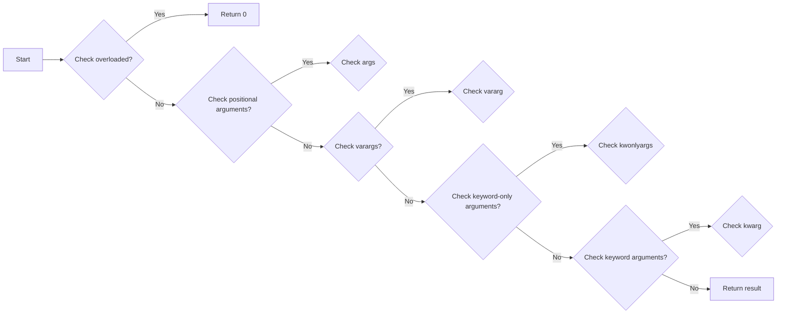

#### 带注释源码

```python
def check_function(item, stubitem, path, ignore):
    ret = 0
    count = 0
    # ... (omitted for brevity)
    item_posargs = [a.arg for a in item.args.posonlyargs]
    stubitem_posargs = [a.arg for a in stubitem.args.posonlyargs]
    if item_posargs != stubitem_posargs and ~ignore & POS_ARGS:
        # ... (omitted for brevity)
    # ... (omitted for brevity)
```


### `check_file`

检查给定文件中的类型提示与实现的一致性。

参数：

- `path`：`pathlib.Path`，要检查的文件路径。
- `ignore`：`int`，用于忽略某些检查的标志。

返回值：`int`，表示检查结果。

#### 流程图


#### 带注释源码

```python
def check_file(path, ignore=0):
    stubpath = path.with_suffix(".pyi")
    ret = 0
    if not stubpath.exists():
        return 0, 0
    tree = ast.parse(path.read_text())
    stubtree = ast.parse(stubpath.read_text())
    return check_namespace(tree, stubtree, path, ignore)
```


### `check_namespace`

检查给定命名空间中的类型提示与实现的一致性。

参数：

- `tree`：`ast.Node`，源代码的AST树。
- `stubtree`：`ast.Node`，类型提示的AST树。
- `path`：`pathlib.Path`，文件路径。
- `ignore`：`int`，用于忽略某些检查的标志。

返回值：`int`，表示检查结果。

#### 流程图

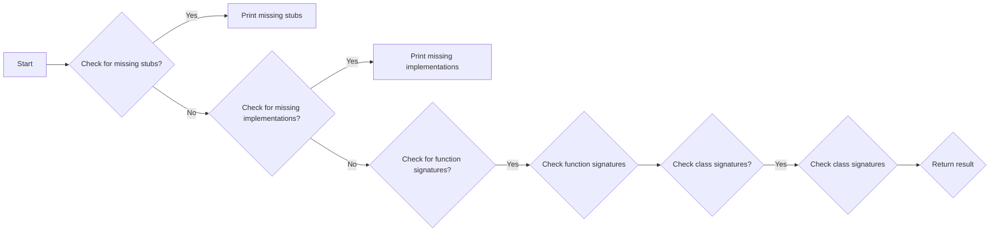

#### 带注释源码

```python
def check_namespace(tree, stubtree, path, ignore=0):
    ret = 0
    count = 0
    tree_items = set(
        i.name
        for i in tree.body
        if hasattr(i, "name") and (not i.name.startswith("_") or i.name.endswith("__"))
    )
    stubtree_items = set(
        i.name
        for i in stubtree.body
        if hasattr(i, "name") and (not i.name.startswith("_") or i.name.endswith("__"))
    )
    # ... (rest of the code)
    return ret, count
```


### `check_function`

检查给定函数的类型提示与实现的一致性。

参数：

- `item`：`ast.FunctionDef`，源代码中的函数定义。
- `stubitem`：`ast.FunctionDef`，类型提示中的函数定义。
- `path`：`str`，文件路径。
- `ignore`：`int`，用于忽略某些检查的标志。

返回值：`int`，表示检查结果。

#### 流程图

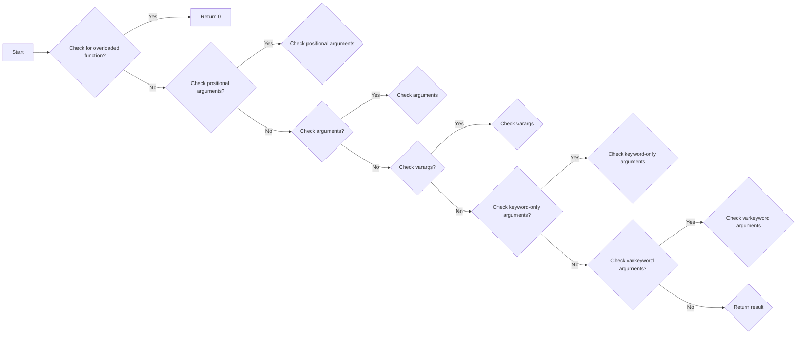

#### 带注释源码

```python
def check_function(item, stubitem, path, ignore):
    ret = 0
    count = 0
    # ... (rest of the code)
    return ret, count
```


### `get_subtree`

获取给定名称的子树。

参数：

- `tree`：`ast.Node`，AST树。
- `name`：`str`，要查找的名称。

返回值：`ast.Node`，找到的子树。

#### 流程图

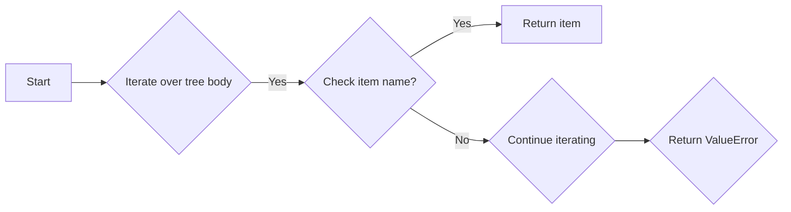

#### 带注释源码

```python
def get_subtree(tree, name):
    for item in tree.body:
        if isinstance(item, ast.Assign):
            if name in [i.id for i in item.targets if hasattr(i, "id")]:
                return item
            for target in item.targets:
                if isinstance(target, ast.Tuple):
                    if name in [i.id for i in target.elts]:
                        return item
        if isinstance(item, ast.AnnAssign):
            if name == item.target.id:
                return item
        if not hasattr(item, "name"):
            continue
        if item.name == name:
            return item
    raise ValueError(f"no such item {name} in tree")
```


### `main`

程序的主入口点。

#### 流程图

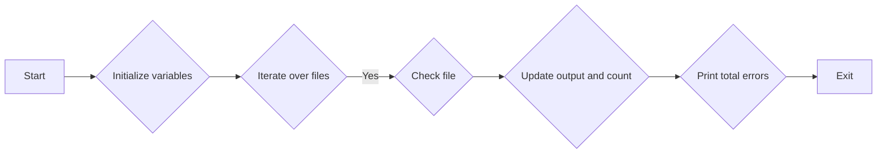

#### 带注释源码

```python
if __name__ == "__main__":
    out = 0
    count = 0
    basedir = pathlib.Path("lib/matplotlib")
    per_file_ignore = {
        # ... (rest of the code)
    }
    for f in basedir.rglob("**/*.py"):
        err, c = check_file(f, ignore=0 | per_file_ignore.get(f, 0))
        out |= err
        count += c
    print("\n")
    print(f"{count} total errors found")
    sys.exit(out)
```


### `check_file`

This function checks the consistency of type hints with the implementation in a Python file. It compares the items defined in the stub file and the implementation file, checks the signatures of functions and methods, and reports any inconsistencies.

参数：

- `path`：`pathlib.Path`，The path to the Python file to be checked.
- `ignore`：`int`，An integer representing the flags to ignore certain checks. Defaults to 0.

返回值：`tuple`，A tuple containing the return value and the count of errors found.

#### 流程图


#### 带注释源码

```python
def check_file(path, ignore=0):
    stubpath = path.with_suffix(".pyi")
    ret = 0
    if not stubpath.exists():
        return 0, 0
    tree = ast.parse(path.read_text())
    stubtree = ast.parse(stubpath.read_text())
    return check_namespace(tree, stubtree, path, ignore)
```


### check_namespace.check_namespace

This function performs AST checks to validate the consistency of type hints with implementation. It compares the items defined in the source code with those in the stubs and checks the signatures of functions and methods.

参数：

- `tree`: `ast.Node`，The abstract syntax tree of the source code.
- `stubtree`: `ast.Node`，The abstract syntax tree of the stub code.
- `path`: `pathlib.Path`，The path to the source code file.
- `ignore`: `int`，The bitwise OR of flags to ignore certain checks.

返回值：`tuple`，A tuple containing the return code and the count of errors.

#### 流程图

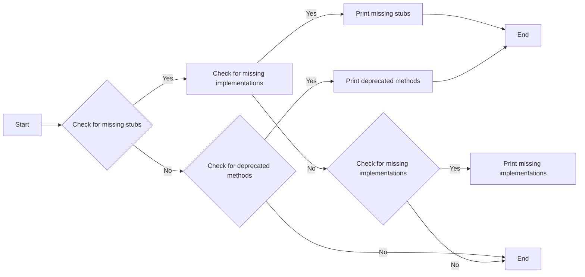

#### 带注释源码

```python
def check_namespace(tree, stubtree, path, ignore=0):
    ret = 0
    count = 0
    # ... (rest of the function code)
    return ret, count
```


### `check_namespace.get_subtree`

该函数用于在AST（抽象语法树）中查找并返回具有指定名称的节点。

参数：

- `tree`：`ast.Node`，表示AST的根节点。
- `name`：`str`，要查找的节点的名称。

返回值：`ast.Node`，找到的节点。

#### 流程图

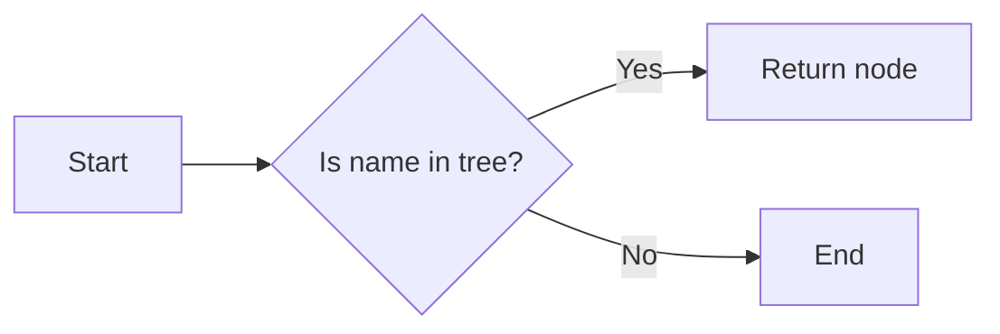

#### 带注释源码

```python
def get_subtree(tree, name):
    for item in tree.body:
        if isinstance(item, ast.Assign):
            if name in [i.id for i in item.targets if hasattr(i, "id")]:
                return item
            for target in item.targets:
                if isinstance(target, ast.Tuple):
                    if name in [i.id for i in target.elts]:
                        return item
        if isinstance(item, ast.AnnAssign):
            if name == item.target.id:
                return item
        if not hasattr(item, "name"):
            continue
        if item.name == name:
            return item
    raise ValueError(f"no such item {name} in tree")
```


### check_function

该函数用于比较两个函数定义的签名是否一致，并输出不一致的地方。

#### 参数

- `item`：`ast.FunctionDef`，表示源代码中的函数定义。
- `stubitem`：`ast.FunctionDef`，表示存根代码中的函数定义。
- `path`：`str`，表示函数所在的文件路径。
- `ignore`：`int`，表示忽略的检查类型。

#### 返回值

- `ret`：`int`，表示检查结果，通过位运算表示不同的错误类型。
- `count`：`int`，表示检查到的错误数量。

#### 流程图

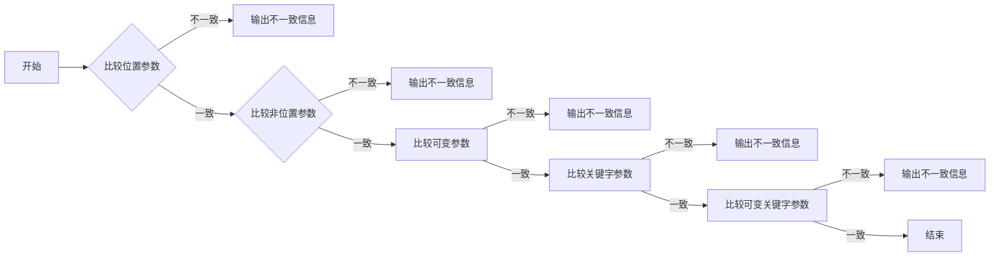

#### 带注释源码

```python
def check_function(item, stubitem, path, ignore):
    ret = 0
    count = 0

    # if the stub calls overload, assume it knows what its doing
    overloaded = "overload" in [
        i.id for i in stubitem.decorator_list if hasattr(i, "id")
    ]
    if overloaded:
        return 0, 0

    item_posargs = [a.arg for a in item.args.posonlyargs]
    stubitem_posargs = [a.arg for a in stubitem.args.posonlyargs]
    if item_posargs != stubitem_posargs and ~ignore & POS_ARGS:
        print(
            f"{path} {item.name} posargs differ: {item_posargs} vs {stubitem_posargs}"
        )
        ret |= POS_ARGS
        count += 1

    item_args = [a.arg for a in item.args.args]
    stubitem_args = [a.arg for a in stubitem.args.args]
    if item_args != stubitem_args and ~ignore & ARGS:
        print(f"{path} args differ for {item.name}: {item_args} vs {stubitem_args}")
        ret |= ARGS
        count += 1

    item_vararg = item.args.vararg
    stubitem_vararg = stubitem.args.vararg
    if ~ignore & VARARG:
        if (item_vararg is None) ^ (stubitem_vararg is None):
            if item_vararg:
                print(
                    f"{path} {item.name} vararg differ: "
                    f"{item_vararg.arg} vs {stubitem_vararg}"
                )
            else:
                print(
                    f"{path} {item.name} vararg differ: "
                    f"{item_vararg} vs {stubitem_vararg.arg}"
                )
            ret |= VARARG
            count += 1
        elif item_vararg is None:
            pass
        elif item_vararg.arg != stubitem_vararg.arg:
            print(
                f"{path} {item.name} vararg differ: "
                f"{item_vararg.arg} vs {stubitem_vararg.arg}"
            )
            ret |= VARARG
            count += 1

    item_kwonlyargs = [a.arg for a in item.args.kwonlyargs]
    stubitem_kwonlyargs = [a.arg for a in stubitem.args.kwonlyargs]
    if item_kwonlyargs != stubitem_kwonlyargs and ~ignore & KWARGS:
        print(
            f"{path} {item.name} kwonlyargs differ: "
            f"{item_kwonlyargs} vs {stubitem_kwonlyargs}"
        )
        ret |= KWARGS
        count += 1

    item_kwarg = item.args.kwarg
    stubitem_kwarg = stubitem.args.kwarg
    if ~ignore & VARKWARG:
        if (item_kwarg is None) ^ (stubitem_kwarg is None):
            if item_kwarg:
                print(
                    f"{path} {item.name} varkwarg differ: "
                    f"{item_kwarg.arg} vs {stubitem_kwarg}"
                )
            else:
                print(
                    f"{path} {item.name} varkwarg differ: "
                    f"{item_kwarg} vs {stubitem_kwarg.arg}"
                )
            ret |= VARKWARG
            count += 1
        elif item_kwarg is None:
            pass
        elif item_kwarg.arg != stubitem_kwarg.arg:
            print(
                f"{path} {item.name} varkwarg differ: "
                f"{item_kwarg.arg} vs {stubitem_kwarg.arg}"
            )
            ret |= VARKWARG
            count += 1

    return ret, count
```

### check_file

该函数用于检查给定文件中的类型提示与实现的一致性。

参数：

- `path`：`pathlib.Path`，表示要检查的文件路径。
- `ignore`：`int`，表示要忽略的检查类型。

返回值：`tuple`，包含两个元素，第一个元素是检查结果，第二个元素是错误计数。

#### 流程图

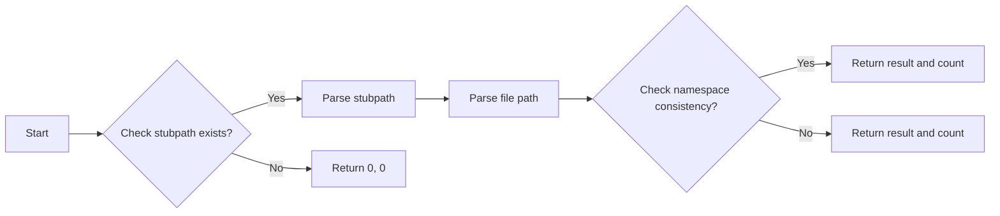

#### 带注释源码

```python
def check_file(path, ignore=0):
    stubpath = path.with_suffix(".pyi")
    ret = 0
    if not stubpath.exists():
        return 0, 0
    tree = ast.parse(path.read_text())
    stubtree = ast.parse(stubpath.read_text())
    return check_namespace(tree, stubtree, path, ignore)
```

### check_namespace

该函数用于检查给定命名空间中的类型提示与实现的一致性。

参数：

- `tree`：`ast.Node`，表示要检查的AST树。
- `stubtree`：`ast.Node`，表示要检查的stub AST树。
- `path`：`pathlib.Path`，表示文件路径。
- `ignore`：`int`，表示要忽略的检查类型。

返回值：`tuple`，包含两个元素，第一个元素是检查结果，第二个元素是错误计数。

#### 流程图

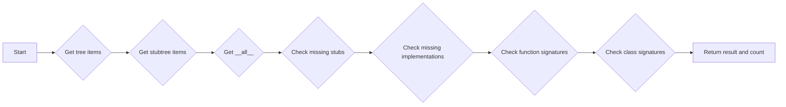

#### 带注释源码

```python
def check_namespace(tree, stubtree, path, ignore=0):
    ret = 0
    count = 0
    tree_items = set(
        i.name
        for i in tree.body
        if hasattr(i, "name") and (not i.name.startswith("_") or i.name.endswith("__"))
    )
    stubtree_items = set(
        i.name
        for i in stubtree.body
        if hasattr(i, "name") and (not i.name.startswith("_") or i.name.endswith("__"))
    )
    # ... (rest of the code)
```


### check_function.check_function

This function checks the consistency of type hints with the implementation of functions or methods in the AST (Abstract Syntax Tree) of Python code.

参数：

- `item`：`ast.FunctionDef`，The AST node representing the function or method to be checked.
- `stubitem`：`ast.FunctionDef`，The AST node representing the stub (type hint) of the function or method.
- `path`：`str`，The path to the file containing the function or method.
- `ignore`：`int`，An integer representing the bitwise OR of flags to ignore certain checks.

返回值：`tuple`，A tuple containing an integer representing the error flags and an integer representing the count of errors.

#### 流程图

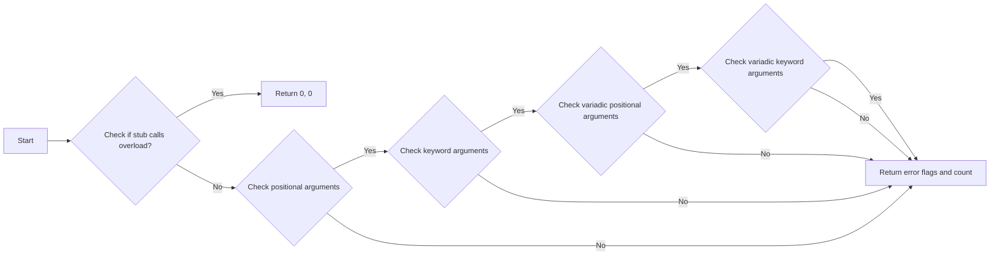

#### 带注释源码

```python
def check_function(item, stubitem, path, ignore):
    ret = 0
    count = 0

    # if the stub calls overload, assume it knows what its doing
    overloaded = "overload" in [
        i.id for i in stubitem.decorator_list if hasattr(i, "id")
    ]
    if overloaded:
        return 0, 0

    item_posargs = [a.arg for a in item.args.posonlyargs]
    stubitem_posargs = [a.arg for a in stubitem.args.posonlyargs]
    if item_posargs != stubitem_posargs and ~ignore & POS_ARGS:
        print(
            f"{path} {item.name} posargs differ: {item_posargs} vs {stubitem_posargs}"
        )
        ret |= POS_ARGS
        count += 1

    item_args = [a.arg for a in item.args.args]
    stubitem_args = [a.arg for a in stubitem.args.args]
    if item_args != stubitem_args and ~ignore & ARGS:
        print(f"{path} args differ for {item.name}: {item_args} vs {stubitem_args}")
        ret |= ARGS
        count += 1

    item_vararg = item.args.vararg
    stubitem_vararg = stubitem.args.vararg
    if ~ignore & VARARG:
        if (item_vararg is None) ^ (stubitem_vararg is None):
            if item_vararg:
                print(
                    f"{path} {item.name} vararg differ: "
                    f"{item_vararg.arg} vs {stubitem_vararg}"
                )
            else:
                print(
                    f"{path} {item.name} vararg differ: "
                    f"{item_vararg} vs {stubitem_vararg.arg}"
                )
            ret |= VARARG
            count += 1
        elif item_vararg is None:
            pass
        elif item_vararg.arg != stubitem_vararg.arg:
            print(
                f"{path} {item.name} vararg differ: "
                f"{item_vararg.arg} vs {stubitem_vararg.arg}"
            )
            ret |= VARARG
            count += 1

    item_kwonlyargs = [a.arg for a in item.args.kwonlyargs]
    stubitem_kwonlyargs = [a.arg for a in stubitem.args.kwonlyargs]
    if item_kwonlyargs != stubitem_kwonlyargs and ~ignore & KWARGS:
        print(
            f"{path} {item.name} kwonlyargs differ: "
            f"{item_kwonlyargs} vs {stubitem_kwonlyargs}"
        )
        ret |= KWARGS
        count += 1

    item_kwarg = item.args.kwarg
    stubitem_kwarg = stubitem.args.kwarg
    if ~ignore & VARKWARG:
        if (item_kwarg is None) ^ (stubitem_kwarg is None):
            if item_kwarg:
                print(
                    f"{path} {item.name} varkwarg differ: "
                    f"{item_kwarg.arg} vs {stubitem_kwarg}"
                )
            else:
                print(
                    f"{path} {item.name} varkwarg differ: "
                    f"{item_kwarg} vs {stubitem_kwarg.arg}"
                )
            ret |= VARKWARG
            count += 1
        elif item_kwarg is None:
            pass
        elif item_kwarg.arg != stubitem_kwarg.arg:
            print(
                f"{path} {item.name} varkwarg differ: "
                f"{item_kwarg.arg} vs {stubitem_kwarg.arg}"
            )
            ret |= VARKWARG
            count += 1

    return ret, count
```


### check_file

检查给定文件中的类型提示与实现的一致性。

参数：

- `path`：`pathlib.Path`，要检查的文件路径。
- `ignore`：`int`，忽略的检查类型，使用位运算符组合。

返回值：`int`，返回检查结果，使用位运算符组合。

#### 流程图

```mermaid
graph LR
A[Start] --> B{Check stubpath exists?}
B -- Yes --> C[Parse stubpath]
B -- No --> D[Return 0]
C --> E{Parse file}
E --> F{Check namespace}
F --> G{Return result}
```

#### 带注释源码

```python
def check_file(path, ignore=0):
    stubpath = path.with_suffix(".pyi")
    ret = 0
    if not stubpath.exists():
        return 0, 0
    tree = ast.parse(path.read_text())
    stubtree = ast.parse(stubpath.read_text())
    return check_namespace(tree, stubtree, path, ignore)
```


### check_namespace

检查命名空间中的类型提示与实现的一致性。

参数：

- `tree`：`ast.Node`，源代码的AST树。
- `stubtree`：`ast.Node`，类型提示的AST树。
- `path`：`pathlib.Path`，文件路径。
- `ignore`：`int`，忽略的检查类型，使用位运算符组合。

返回值：`int`，返回检查结果，使用位运算符组合。

#### 流程图

```mermaid
graph LR
A[Start] --> B{Check tree_items and stubtree_items}
B --> C{Check __all__}
C --> D{Check missing and deprecated}
D --> E{Check missing stub}
E --> F{Check missing implementation}
F --> G{Check functions and classes}
G --> H{Return result}
```

#### 带注释源码

```python
def check_namespace(tree, stubtree, path, ignore=0):
    ret = 0
    count = 0
    tree_items = set(
        i.name
        for i in tree.body
        if hasattr(i, "name") and (not i.name.startswith("_") or i.name.endswith("__"))
    )
    stubtree_items = set(
        i.name
        for i in stubtree.body
        if hasattr(i, "name") and (not i.name.startswith("_") or i.name.endswith("__"))
    )
    # ... (rest of the code)
```

## 关键组件


### 张量索引与惰性加载

张量索引与惰性加载是代码中处理数据结构的核心组件，它允许对大型数据集进行高效访问，同时减少内存消耗。

### 反量化支持

反量化支持是代码中用于处理量化策略的组件，它允许在量化过程中进行反向量化，以便在量化后能够恢复原始数据。

### 量化策略

量化策略是代码中用于优化数据表示和处理的组件，它通过减少数据精度来减少内存和计算需求。


## 问题及建议


### 已知问题

-   **代码复杂度**：代码中存在大量的条件检查和异常处理，这可能导致代码难以理解和维护。
-   **性能问题**：代码中使用了大量的集合操作和字符串操作，这可能会影响性能，尤其是在处理大型代码库时。
-   **代码重复**：在 `check_function` 和 `check_namespace` 函数中存在大量的代码重复，这可以通过提取公共代码来优化。
-   **错误处理**：代码中的错误处理不够明确，例如在 `get_subtree` 函数中，如果找不到指定的项，会抛出一个异常，但没有提供足够的上下文信息。

### 优化建议

-   **重构代码**：将重复的代码提取到单独的函数中，以减少代码重复并提高可读性。
-   **性能优化**：对于集合操作和字符串操作，考虑使用更高效的数据结构和算法。
-   **错误处理**：改进错误处理，提供更详细的错误信息，以便于调试和修复。
-   **代码注释**：增加代码注释，解释代码的功能和逻辑，以提高代码的可读性。
-   **测试**：编写单元测试来验证代码的功能，确保代码的正确性和稳定性。
-   **使用更现代的Python特性**：例如，使用 `f-strings` 替代字符串操作，使用 `type hinting` 来提高代码的可读性和可维护性。
-   **模块化**：将代码分解成更小的模块，以提高代码的可重用性和可维护性。
-   **文档**：编写详细的文档，包括代码的功能、使用方法和维护指南。


## 其它


### 设计目标与约束

- 设计目标：该代码旨在验证类型提示与实现的一致性，确保类型提示正确反映了函数和方法签名。
- 约束：代码需要与Python的AST（抽象语法树）进行交互，因此需要处理AST解析和遍历的复杂性。

### 错误处理与异常设计

- 错误处理：代码通过返回错误代码和计数来报告错误，错误代码表示不同的错误类型，如缺少存根或缺少实现。
- 异常设计：代码使用`ValueError`来处理在AST中找不到指定项的情况。

### 数据流与状态机

- 数据流：代码从文件系统读取Python源文件和存根文件，然后解析它们并比较AST。
- 状态机：代码通过一系列函数调用执行状态转换，如`check_file`、`check_namespace`和`check_function`。

### 外部依赖与接口契约

- 外部依赖：代码依赖于`ast`和`pathlib`模块。
- 接口契约：代码通过函数参数和返回值定义了清晰的接口契约，例如`check_file`函数接受文件路径和忽略标志，返回错误代码和计数。


    