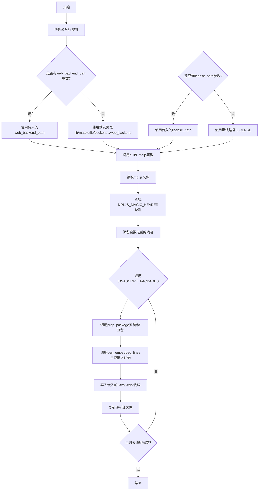
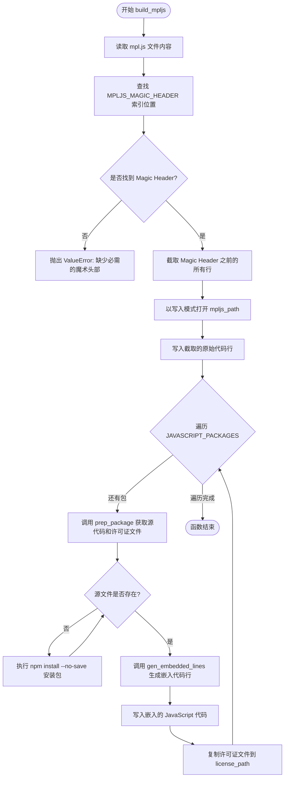

# `matplotlib\tools\embed_js.py` 详细设计文档

该脚本用于将JavaScript依赖包嵌入到mpl.js文件中，通过npm安装所需的JavaScript包，将源代码合并到mpl.js的特定位置，并复制相应的许可证文件到目标目录。

## 整体流程



## 类结构

```
embed_js.py (脚本模块)
├── Package (namedtuple定义)
├── JAVASCRIPT_PACKAGES (全局列表)
├── MPLJS_MAGIC_HEADER (全局常量)
├── safe_name() (函数)
├── prep_package() (函数)
├── gen_embedded_lines() (函数)
└── build_mpljs() (函数)
```

## 全局变量及字段


### `JAVASCRIPT_PACKAGES`
    
要嵌入的JavaScript包列表，包含包名、源文件路径和许可证文件路径

类型：`list[Package]`
    


### `MPLJS_MAGIC_HEADER`
    
mpl.js中用于标记嵌入位置的魔数头部，嵌入式JavaScript将追加到此行之后

类型：`str`
    


### `Package.name`
    
npm包名，用于标识要嵌入的JavaScript包

类型：`str`
    


### `Package.source`
    
包内源文件路径，指定要嵌入的具体JavaScript文件

类型：`str`
    


### `Package.license`
    
包内许可证文件路径，用于复制LICENSE文件

类型：`str`
    
    

## 全局函数及方法


### `safe_name`

将给定的包名转换为安全的 JavaScript 变量名，通过替换特殊字符（@、/、-）为下划线并转换为大写来确保符合 JavaScript 变量命名规范。

参数：

- `name`：`str`，需要转换的包名（例如 `@jsxtools/resize-observer`）

返回值：`str`，安全的 JavaScript 变量名（例如 `JSXTOOLS_RESIZE_OBSERVER`）

#### 流程图

```mermaid
flowchart TD
    A[开始: name] --> B{检查输入}
    B -->|有效输入| C[使用正则表达式 split r'[@/-]' 分割字符串]
    C --> D[用 '_' 连接分割后的部分]
    D --> E[转换为大写 upper]
    E --> F[返回安全的变量名]
    
    B -->|空或无效| G[返回空字符串或原始值]
```

#### 带注释源码

```python
def safe_name(name):
    """
    Make *name* safe to use as a JavaScript variable name.
    
    将包名转换为符合 JavaScript 变量命名规则的格式。
    JavaScript 变量名不能包含 @、/、- 等特殊字符，
    此函数通过将这些字符替换为下划线并转换为大写来生成安全的变量名。
    
    示例:
        '@jsxtools/resize-observer' -> 'JSXTOOLS_RESIZE_OBSERVER'
        'some-package' -> 'SOME_PACKAGE'
    """
    # 使用正则表达式按 @、/、- 分割字符串，然后使用下划线连接，最后转为大写
    return '_'.join(re.split(r'[@/-]', name)).upper()
```


### `prep_package`

该函数用于准备（获取或验证）JavaScript 包的源文件和许可证文件。它首先检查本地 node_modules 中是否存在指定包及其源文件/许可证，若不存在则通过 npm 安装，最后验证文件存在性并返回源文件和许可证文件的 Path 对象。

参数：

- `web_backend_path`：`Path`，web 后端的根路径，用于定位 `node_modules` 目录
- `pkg`：`Package`，命名元组，包含 `name`（包名）、`source`（源文件相对路径）、`license`（许可证文件相对路径）

返回值：`Tuple[Path, Path]`，元组第一个元素为源文件 Path 对象，第二个元素为许可证文件 Path 对象

#### 流程图

```mermaid
flowchart TD
    A[开始 prep_package] --> B[构建 source 路径]
    B --> C[构建 license 路径]
    C --> D{源文件是否存在?}
    D -- 是 --> F{许可证文件是否存在?}
    D -- 否 --> E[执行 npm install --no-save]
    E --> G{源文件是否存在?}
    G -- 否 --> H[抛出 ValueError: 包缺失源文件]
    G -- 是 --> F
    F -- 是 --> I[返回 (source, license)]
    F -- 否 --> J[抛出 ValueError: 包缺失许可证]
```

#### 带注释源码

```python
def prep_package(web_backend_path, pkg):
    """
    准备 JavaScript 包的源文件和许可证文件。
    
    参数:
        web_backend_path: Path, web 后端根目录路径
        pkg: Package, 包含 name/source/license 的命名元组
    
    返回:
        Tuple[Path, Path], 源文件路径和许可证文件路径
    """
    # 拼接完整路径: web_backend_path/node_modules/{包名}/{源文件路径}
    source = web_backend_path / 'node_modules' / pkg.name / pkg.source
    # 拼接完整路径: web_backend_path/node_modules/{包名}/{许可证路径}
    license = web_backend_path / 'node_modules' / pkg.name / pkg.license
    
    # 检查源文件是否存在，若不存在则尝试安装
    if not source.exists():
        # Exact version should already be saved in package.json, so we use
        # --no-save here.
        try:
            # 执行 npm install --no-save 安装指定包
            subprocess.run(['npm', 'install', '--no-save', pkg.name],
                           cwd=web_backend_path)
        except FileNotFoundError as err:
            # npm 未安装时抛出友好错误信息
            raise ValueError(
                f'npm must be installed to fetch {pkg.name}') from err
    
    # 再次验证源文件存在性，安装后仍不存在则报错
    if not source.exists():
        raise ValueError(
            f'{pkg.name} package is missing source in {pkg.source}')
    # 验证许可证文件存在性，不存在则报错
    elif not license.exists():
        raise ValueError(
            f'{pkg.name} package is missing license in {pkg.license}')

    # 返回源文件和许可证文件的路径元组
    return source, license
```


### `gen_embedded_lines`

该函数是一个生成器函数，用于将 JavaScript 包的源代码转换为嵌入式代码。它通过安全名称处理、替换模块导出语句以及添加注释来生成可在 mpl.js 中嵌入的 JavaScript 代码行。

参数：

- `pkg`：`Package`（namedtuple），包含要嵌入的 JavaScript 包的元数据（name、source、license）
- `source`：`Path`，指向要嵌入的 JavaScript 源文件路径

返回值：`Generator[str, None, None]`，生成修改后的 JavaScript 代码行

#### 流程图

```mermaid
flowchart TD
    A[开始 gen_embedded_lines] --> B[调用 safe_name 获取安全的 JavaScript 变量名]
    B --> C[打印嵌入信息]
    C --> D[yield '// prettier-ignore\n']
    D --> E{遍历 source 文件的每一行}
    E -->|读取行| F[替换 'module.exports=function' 为 'var {name}=function']
    F --> G[添加 ' // eslint-disable-line\n' 注释]
    G --> H[yield 修改后的行]
    H --> E
    E -->|遍历完成| I[结束]
```

#### 带注释源码

```python
def gen_embedded_lines(pkg, source):
    """
    生成嵌入到 mpl.js 的 JavaScript 代码行。
    
    该生成器函数将 JavaScript 源文件转换为可嵌入的格式：
    1. 将包名转换为安全的 JavaScript 变量名
    2. 输出 prettier-ignore 注释
    3. 将 module.exports=function 替换为 var {name}=function
    4. 为每行添加 eslint-disable-line 注释
    """
    # 使用 safe_name 函数将包名（如 @jsxtools/resize-observer）
    # 转换为安全的 JavaScript 变量名（如 _JSTOOLS_RESIZE_OBSERVER）
    name = safe_name(pkg.name)
    
    # 打印嵌入操作的日志信息，便于调试和追踪
    print('Embedding', source, 'as', name)
    
    # 输出 Prettier 忽略注释，防止代码被格式化
    yield '// prettier-ignore\n'
    
    # 读取源文件并逐行处理
    for line in source.read_text().splitlines():
        # 替换 CommonJS 模块导出语句为 JavaScript 变量声明
        # 例如：module.exports=function -> var _JSTOOLS_RESIZE_OBSERVER=function
        yield (
            line.replace('module.exports=function', f'var {name}=function')
            # 添加 ESLint 禁用注释，绕过特定规则的检查
            + ' // eslint-disable-line\n'
        )
```


### `build_mpljs`

该函数是嵌入 JavaScript 依赖到 mpl.js 文件的核心逻辑，通过读取 web 后端路径下的 mpl.js 文件，在指定的魔术头部位置插入所有预定义的 JavaScript 包源代码，并同时复制对应的许可证文件到指定目录。

参数：

- `web_backend_path`：`Path`，web 后端目录路径，用于定位 node_modules 和 js/mpl.js 文件
- `license_path`：`Path`，许可证输出目录路径，用于存放复制的许可证文件

返回值：`None`，该函数无返回值，仅执行文件写入操作

#### 流程图



#### 带注释源码

```python
def build_mpljs(web_backend_path, license_path):
    """
    构建 mpl.js 文件，将 JavaScript 依赖嵌入到指定位置。
    
    Parameters:
        web_backend_path: Path - web 后端目录路径
        license_path: Path - 许可证文件输出目录路径
    """
    # 构造 mpl.js 文件的完整路径
    mpljs_path = web_backend_path / "js/mpl.js"
    # 读取 mpl.js 文件所有行，保留行结束符
    mpljs_orig = mpljs_path.read_text().splitlines(keepends=True)
    
    try:
        # 查找魔术头部的索引位置
        magic_index = mpljs_orig.index(MPLJS_MAGIC_HEADER)
        # 截取从开始到魔术头部（包括魔术头部）的所有行
        mpljs_orig = mpljs_orig[:magic_index + 1]
    except IndexError as err:
        # 如果未找到魔术头部，抛出明确的错误信息
        raise ValueError(
            f'The mpl.js file *must* have the exact line: {MPLJS_MAGIC_HEADER}'
        ) from err

    # 以写入模式打开 mpl.js 文件
    with mpljs_path.open('w') as mpljs:
        # 首先写入原始的魔术头部之前的内容
        mpljs.writelines(mpljs_orig)

        # 遍历所有需要嵌入的 JavaScript 包
        for pkg in JAVASCRIPT_PACKAGES:
            # 准备包：获取或安装源代码和许可证文件
            source, license = prep_package(web_backend_path, pkg)
            # 生成嵌入的代码行（替换模块导出为变量声明）
            mpljs.writelines(gen_embedded_lines(pkg, source))

            # 复制许可证文件到目标目录，文件名添加安全名称前缀
            shutil.copy(license,
                        license_path / f'LICENSE{safe_name(pkg.name)}')
```

## 关键组件


### Package 命名元组

用于定义要嵌入的 JavaScript 包的结构，包含 name（包名）、source（源文件路径）和 license（许可证文件路径）三个字段。

### JAVASCRIPT_PACKAGES 列表

定义了需要嵌入的 JavaScript 包列表，当前只包含 @jsxtools/resize-observer 包，用于提供 ResizeObserver 的 polyfill/ponyfill 功能。

### MPLJS_MAGIC_HEADER 魔法头

一个特殊的注释行，作为 mpl.js 文件中的标记，嵌入的 JavaScript 代码将附加在该行之后。

### safe_name 函数

将包名转换为合法的 JavaScript 变量名，通过正则分割并用下划线替换特殊字符（@、/、-），最后转换为大写。

### prep_package 函数

准备要嵌入的包，检查源文件和许可证文件是否存在，如不存在则调用 npm install 安装，验证包的完整性并返回源文件和许可证文件的路径。

### gen_embedded_lines 函数

生成嵌入的 JavaScript 代码行，将模块导出函数替换为具名变量，并添加 eslint 禁用注释，返回可迭代的代码行。

### build_mpljs 函数

主构建函数，读取原始 mpl.js 文件，截取到魔法头之前，遍历所有要嵌入的包，将处理后的 JavaScript 代码写入文件，并复制许可证文件到目标目录。

### 命令行参数处理

处理脚本的两个可选参数：web_backend_path（Web 后端路径，默认为 lib/matplotlib/backends/web_backend）和 license_path（许可证输出路径，默认为项目根目录的 LICENSE 文件）。


## 问题及建议


### 已知问题

- **硬编码的包列表**：`JAVASCRIPT_PACKAGES` 列表是硬编码在代码中的，缺乏灵活性，难以动态配置需要嵌入的包。
- **subprocess.run 未检查返回码**：调用 `npm install` 时未检查进程的返回码，可能导致安装失败但脚本继续执行。
- **错误处理不完整**：`subprocess.run` 只捕获了 `FileNotFoundError`，其他如网络错误、安装失败等异常未被处理。
- **魔法字符串缺乏文档**：`MPLJS_MAGIC_HEADER` 作为关键标记字符串，其作用和重要性未在注释中充分说明。
- **文件覆盖风险**：`shutil.copy` 复制许可证文件时未检查目标文件是否已存在，可能导致意外覆盖。
- **正则表达式重复编译**：在 `safe_name` 函数中每次调用都重新编译正则表达式 `re.split(r'[@/-]', name)`，性能可优化。
- **缺少类型注解**：代码未使用 Python 类型提示，降低了代码的可读性和静态分析能力。
- **print 语句用于调试**：`gen_embedded_lines` 中使用 `print` 输出进度，不适合生产环境的日志记录。
- **路径验证不足**：`web_backend_path` 和 `license_path` 未验证其有效性或是否存在必要权限。

### 优化建议

- 将 `JAVASCRIPT_PACKAGES` 迁移至配置文件（如 JSON/YAML）或环境变量，提升可配置性。
- 在 `subprocess.run` 调用中添加 `check=True` 或手动检查返回码，确保安装成功。
- 使用 `logging` 模块替代 `print`，并添加更细粒度的异常处理。
- 为关键路径和字符串添加类型注解，使用 `pathlib.Path` 的更多方法进行路径验证。
- 预编译正则表达式或使用缓存（如 `functools.lru_cache`）优化 `safe_name` 函数。
- 在复制文件前检查目标是否存在，必要时提示覆盖或使用唯一命名策略。

## 其它


### 设计目标与约束

将JavaScript依赖项（@jsxtools/resize-observer）嵌入式打包到mpl.js中，减少外部依赖，提高matplotlib web后端的独立性和加载速度。约束：必须在mpl.js中保留magic header，许可证文件必须单独保存。

### 错误处理与异常设计

使用try-except捕获npm命令未安装的FileNotFoundError，转换为ValueError并添加友好提示。对缺失的源文件和许可证文件主动检查并抛出详细错误信息，包括包名和缺失的文件路径。使用异常链（from err）保留原始错误上下文。

### 外部依赖与接口契约

外部依赖：npm必须已安装，node_modules目录可写。输入契约：web_backend_path指向包含js/mpl.js和package.json的目录，license_path指向可写入的目录。输出契约：mpl.js文件被修改（保留magic header前内容），LICENSE目录新增许可证文件。

### 性能考虑

使用生成器yield逐行处理源代码，减少内存占用。只在源文件不存在时才执行npm install，避免重复网络请求。

### 安全性考虑

代码替换使用安全的变量名转换函数safe_name()，将包名中的特殊字符转换为下划线。使用eslint-disable-line注释避免嵌入代码的lint检查。

### 配置与可扩展性

通过JAVASCRIPT_PACKAGES列表配置要嵌入的包，每个包使用Package namedtuple定义name、source、license路径。添加新包只需在列表中追加，无需修改核心逻辑。

### 版权和许可证处理

每个包的许可证文件单独复制到LICENSE目录，文件名格式为LICENSE{SAFE_NAME}，确保符合开源许可证要求。

### 文件路径约定

使用pathlib.Path进行跨平台路径处理。默认路径基于脚本文件位置计算，优先使用命令行参数覆盖。

### 与构建系统的集成

作为构建后处理步骤运行，接受两个路径参数：web_backend_path（必需）和license_path（可选）。设计为独立运行，不依赖其他构建系统。

### 状态机与数据流

数据流：输入参数 → 读取mpl.js → 遍历包列表 → 安装包（如需要） → 读取源文件 → 转换代码 → 写入mpl.js → 复制许可证。无复杂状态机，仅顺序执行。
    