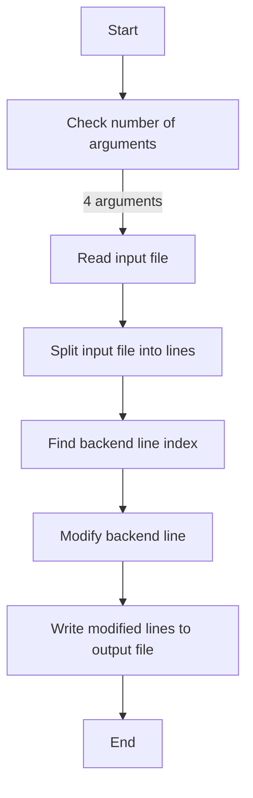
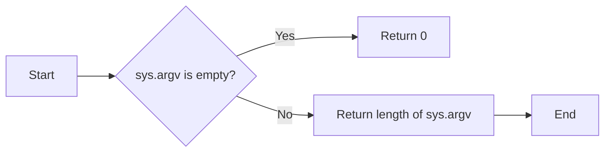
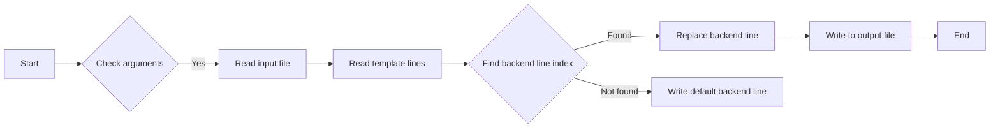
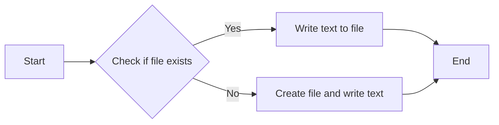
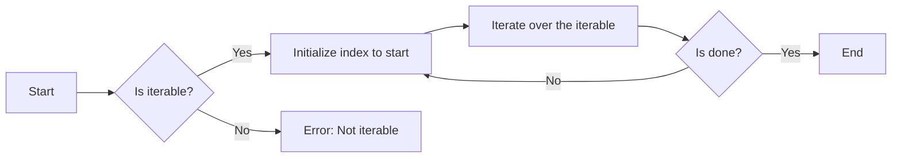
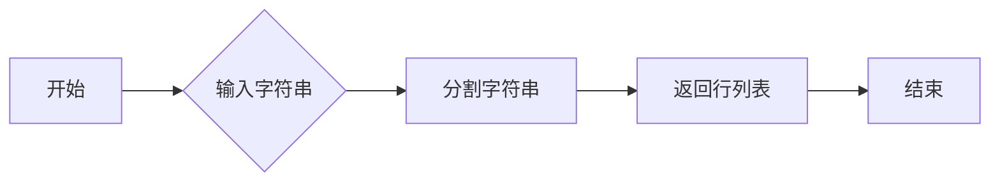
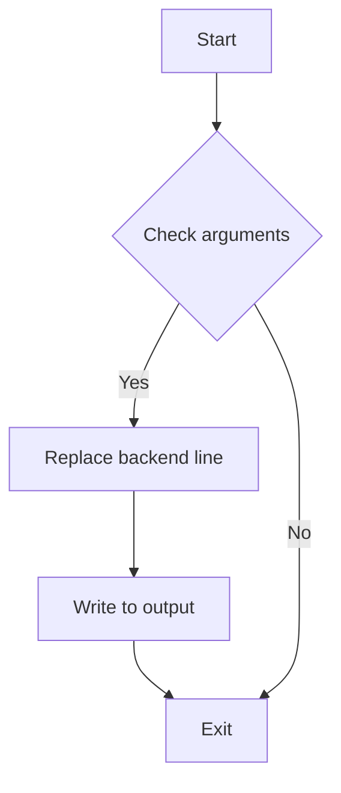

# `matplotlib\tools\generate_matplotlibrc.py` 详细设计文档

This script modifies a template file to set the matplotlib backend for a given installation.

## 整体流程



## 类结构

```
Main (主程序)
```

## 全局变量及字段


### `sys`
    
The Python interpreter's built-in namespace.

类型：`module`
    


### `sys.argv`
    
A list of command-line arguments passed to the script.

类型：`list of str`
    


### `input`
    
The input file path as a pathlib.Path object.

类型：`pathlib.Path`
    


### `output`
    
The output file path as a pathlib.Path object.

类型：`pathlib.Path`
    


### `backend`
    
The backend to use for matplotlib.

类型：`str`
    


### `template_lines`
    
The lines of the input file as a list of strings.

类型：`list of str`
    


### `backend_line_idx`
    
The index of the line containing the backend setting in the template_lines list.

类型：`int`
    


### `pathlib.Path.encoding`
    
The encoding to use when opening files with pathlib.Path objects.

类型：`str`
    


### `pathlib.Path.Path.encoding`
    
The encoding to use when opening files with pathlib.Path objects.

类型：`str`
    
    

## 全局函数及方法


### len(sys.argv)

该函数返回sys.argv列表的长度。

参数：

- `sys.argv`：`list`，包含命令行参数的列表。

返回值：`int`，表示sys.argv列表中元素的数量。

#### 流程图



#### 带注释源码

```
#!/usr/bin/env python3
# ...
if len(sys.argv) != 4:
    raise SystemExit('usage: {sys.argv[0]} <input> <output> <backend>')
# ...
```


### `Path`

`Path` 是一个用于表示文件系统路径的对象。

参数：

- `sys.argv[1]`：`str`，输入文件路径
- `sys.argv[2]`：`str`，输出文件路径
- `sys.argv[3]`：`str`，后端类型

返回值：无

#### 流程图



#### 带注释源码

```python
#!/usr/bin/env python3
"""
Generate matplotlirc for installs.

If packagers want to change the default backend, insert a `#backend: ...` line.
Otherwise, use the default `##backend: Agg` which has no effect even after
decommenting, which allows _auto_backend_sentinel to be filled in at import time.
"""

import sys
from pathlib import Path

if len(sys.argv) != 4:
    raise SystemExit('usage: {sys.argv[0]} <input> <output> <backend>')

input = Path(sys.argv[1])
output = Path(sys.argv[2])
backend = sys.argv[3]

template_lines = input.read_text(encoding="utf-8").splitlines(True)
backend_line_idx, = (  # Also asserts that there is a single such line.
    idx for idx, line in enumerate(template_lines)
    if "#backend:" in line)
template_lines[backend_line_idx] = (
    f"#backend: {backend}\n" if backend not in ['', 'auto'] else "##backend: Agg\n")
output.write_text("".join(template_lines), encoding="utf-8")
```

### `read_text`

`read_text` 是 `Path` 类的一个方法，用于读取文件内容。

参数：

- `encoding="utf-8"`：`str`，指定编码方式

返回值：`str`，文件内容

### `splitlines(True)`

`splitlines(True)` 是 `str` 类的一个方法，用于按行分割字符串，保留行结束符。

参数：

- `True`：`bool`，保留行结束符

返回值：`list`，分割后的行列表

### `enumerate`

`enumerate` 是一个内置函数，用于在迭代过程中返回元素的索引和值。

参数：

- `enumerate(template_lines)`：`enumerate` 对象，包含索引和值

返回值：`tuple`，包含索引和值

### `if`

`if` 是一个条件语句，用于根据条件执行代码块。

参数：

- `if len(sys.argv) != 4:`：条件表达式

返回值：无

### `raise SystemExit`

`raise SystemExit` 是一个语句，用于抛出一个异常并退出程序。

参数：

- `'usage: {sys.argv[0]} <input> <output> <backend>'`：异常信息

返回值：无

### `Path`

`Path` 是一个用于表示文件系统路径的对象。

参数：

- `sys.argv[1]`：`str`，输入文件路径
- `sys.argv[2]`：`str`，输出文件路径
- `sys.argv[3]`：`str`，后端类型

返回值：`Path` 对象

### `write_text`

`write_text` 是 `Path` 类的一个方法，用于写入文件内容。

参数：

- `encoding="utf-8"`：`str`，指定编码方式

返回值：无
```


### Path.read_text

读取指定路径的文件内容，返回一个包含文件所有行的列表。

参数：

- `self`：`Path`，当前路径对象
- `encoding`：`str`，读取文件时使用的编码方式，默认为"utf-8"

返回值：`list`，包含文件所有行的列表

#### 流程图


#### 带注释源码

```python
def read_text(self, encoding="utf-8"):
    """
    读取指定路径的文件内容，返回一个包含文件所有行的列表。

    :param self: Path, 当前路径对象
    :param encoding: str, 读取文件时使用的编码方式，默认为"utf-8"
    :return: list, 包含文件所有行的列表
    """
    with open(self, 'r', encoding=encoding) as file:
        return file.readlines()
```


### Path.write_text

`Path.write_text` is a method that writes text to a file, replacing the file contents if it already exists.

参数：

- `self`：`Path`，表示文件路径的对象
- `text`：`str`，要写入文件的内容
- `encoding`：`str`，可选，指定编码方式，默认为 'utf-8'

返回值：`None`

#### 流程图



#### 带注释源码

```
def write_text(self, text: str, encoding: str = 'utf-8') -> None:
    with open(self, 'w', encoding=encoding) as f:
        f.write(text)
```


### enumerate

enumerate 函数用于将可迭代对象（如列表、元组、字符串等）转换为索引和值的元组列表。

参数：

- `iterable`：`iterable`，一个可迭代的对象，如列表、元组、字符串等。
- `start`：`int`，可选，迭代器开始的索引，默认为 0。

返回值：`enumerate` 返回一个迭代器，它产生一个元组 `(index, value)`，其中 `index` 是迭代器的当前索引，`value` 是迭代器中当前元素的值。

#### 流程图



#### 带注释源码

```python
def enumerate(iterable, start=0):
    # Initialize the index to start
    index = start
    # Iterate over the iterable
    for value in iterable:
        # Yield a tuple of the current index and value
        yield index, value
        # Increment the index
        index += 1
```


### splitlines

`splitlines` 是一个内置的 Python 函数，用于将字符串分割成行列表。

参数：

- `string`：`str`，要分割的字符串。

返回值：`list`，包含字符串中所有行的列表。

#### 流程图



#### 带注释源码

```python
def splitlines(string: str) -> list:
    # 分割字符串为行列表
    return string.splitlines()
```


### raise SystemExit

`raise SystemExit` 是一个全局函数，用于触发一个异常，导致程序立即退出。

参数：

- 无参数

返回值：无返回值，程序退出

#### 流程图



#### 带注释源码

```
#!/usr/bin/env python3
"""
Generate matplotlirc for installs.

If packagers want to change the default backend, insert a `#backend: ...` line.
Otherwise, use the default `##backend: Agg` which has no effect even after
decommenting, which allows _auto_backend_sentinel to be filled in at import time.
"""

import sys
from pathlib import Path

# Check if the number of arguments is correct
if len(sys.argv) != 4:
    # Raise an exception to exit the program
    raise SystemExit('usage: {sys.argv[0]} <input> <output> <backend>')

input = Path(sys.argv[1])
output = Path(sys.argv[2])
backend = sys.argv[3]

template_lines = input.read_text(encoding="utf-8").splitlines(True)
backend_line_idx, = (  # Also asserts that there is a single such line.
    idx for idx, line in enumerate(template_lines)
    if "#backend:" in line)
template_lines[backend_line_idx] = (
    f"#backend: {backend}\n" if backend not in ['', 'auto'] else "##backend: Agg\n")
output.write_text("".join(template_lines), encoding="utf-8")
```


## 关键组件


### 张量索引与惰性加载

张量索引与惰性加载是深度学习框架中用于高效处理大型数据集的关键技术，它允许在需要时才计算数据，从而节省内存和提高计算效率。

### 反量化支持

反量化支持是深度学习模型优化中的一种技术，它允许将量化后的模型转换回浮点数模型，以便进行进一步的分析或训练。

### 量化策略

量化策略是深度学习模型压缩中的一种方法，它通过减少模型中使用的数值精度来减小模型大小和加速推理过程。


## 问题及建议


### 已知问题

-   **参数验证不足**：代码仅检查了命令行参数的数量，但没有对参数的格式或内容进行验证。例如，输入和输出路径可能需要是有效的文件路径，而`backend`参数可能需要是预定义的后端之一。
-   **错误处理**：代码在参数数量不正确时抛出异常，但没有提供任何关于错误原因的详细信息，这可能会使调试变得困难。
-   **代码可读性**：代码中使用了列表推导和生成器表达式，这些在简单的场景下可能不是最佳选择，尤其是在没有明确说明其目的的情况下。
-   **硬编码**：代码中硬编码了默认后端`Agg`，这可能会在未来的版本中导致问题，如果需要支持新的后端。

### 优化建议

-   **增强参数验证**：添加对输入和输出路径的验证，确保它们是有效的文件路径。同时，验证`backend`参数是否是有效的后端名称。
-   **改进错误处理**：提供更详细的错误信息，例如，如果输入文件不存在，应通知用户。
-   **提高代码可读性**：对于简单的操作，使用更直观的代码结构，例如使用循环而不是列表推导。
-   **移除硬编码**：将默认后端作为配置参数或环境变量，而不是硬编码在代码中。
-   **文档化**：添加文档说明代码的功能、参数和错误处理，以便其他开发者或用户更容易理解和使用代码。
-   **单元测试**：编写单元测试来验证代码的功能，确保在未来的修改中不会破坏现有功能。


## 其它


### 设计目标与约束

- 设计目标：实现一个简单的脚本，用于生成matplotlib配置文件，允许用户指定后端。
- 约束条件：脚本必须接受命令行参数，包括输入文件、输出文件和后端类型。

### 错误处理与异常设计

- 错误处理：如果命令行参数数量不正确，脚本将抛出`SystemExit`异常并显示使用说明。
- 异常设计：使用`try-except`块捕获可能的文件操作错误，如文件不存在或无法读取。

### 数据流与状态机

- 数据流：脚本从命令行接收输入，读取输入文件，修改后端配置行，然后将修改后的内容写入输出文件。
- 状态机：脚本没有复杂的状态转换，主要执行读取、修改和写入操作。

### 外部依赖与接口契约

- 外部依赖：脚本依赖于Python标准库中的`sys`和`pathlib`模块。
- 接口契约：脚本通过命令行参数与用户交互，并期望用户按照预期格式提供输入。

### 安全性与合规性

- 安全性：脚本不处理任何外部输入，因此不存在注入攻击的风险。
- 合规性：脚本遵循Python编程规范，没有使用任何非标准库或第三方库。

### 性能考量

- 性能考量：脚本设计为轻量级，主要操作为文件读取和写入，对性能要求不高。

### 可维护性与可扩展性

- 可维护性：代码结构清晰，易于理解和维护。
- 可扩展性：脚本可以通过添加新的命令行参数来支持更多的功能。

### 测试与验证

- 测试：脚本应通过单元测试验证其功能，包括参数处理、文件读写和错误处理。
- 验证：通过实际运行脚本并检查输出文件来验证其正确性。

### 文档与帮助

- 文档：提供详细的文档，包括安装、配置和使用说明。
- 帮助：实现命令行帮助功能，提供脚本的使用方法和参数说明。


    