# `matplotlib\tools\gh_api.py` 详细设计文档

该代码是一个GitHub API工具库，提供了一系列用于与GitHub API交互的函数，包括获取认证令牌、发送issue评论、创建gist、获取pull request和issues列表、管理milestones、上传文件到GitHub下载区域等功能。

## 整体流程

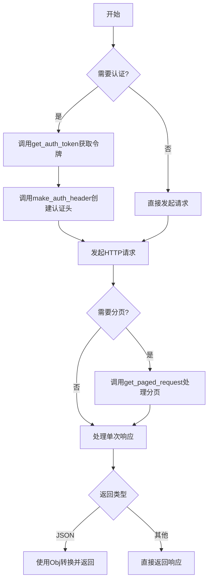

## 类结构

```
Obj (字典子类，支持属性访问)
无继承类层次结构，主要为函数集合
```

## 全局变量及字段


### `fake_username`
    
用于keyring存储的虚拟用户名，GitHub API认证时作为标识符

类型：`str`
    


### `token`
    
缓存的GitHub OAuth认证令牌，避免重复读取或请求

类型：`str | None`
    


### `Obj.Obj`
    
继承自dict的字典子类，支持属性访问方式获取和设置字典键值

类型：`class(dict)`
    
    

## 全局函数及方法


### `get_auth_token`

获取 GitHub API 认证令牌（token），优先使用缓存的 token，若缓存不存在则依次尝试从本地文件、keyring 读取，若均不存在则提示用户输入 GitHub 凭据并向 GitHub API 申请新的 OAuth token，最后将 token 存储到 keyring 以供后续使用。

参数：  
无

返回值：`str`，GitHub API 认证用的 OAuth token 字符串

#### 流程图

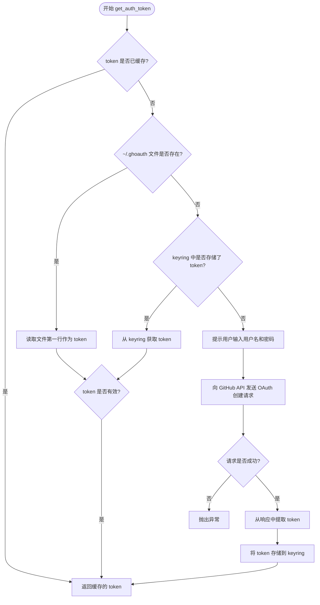

#### 带注释源码

```python
def get_auth_token():
    """获取 GitHub API 认证令牌，若无缓存则申请新令牌并存储到 keyring"""
    global token  # 声明使用全局变量 token 用于缓存

    # 第一步：检查是否已有缓存的 token
    if token is not None:
        return token  # 直接返回缓存的 token，避免重复获取

    # 第二步：尝试从 ~/.ghoauth 文件读取 token
    try:
        # 打开用户主目录下的 .ghoauth 文件
        with open(os.path.join(os.path.expanduser('~'), '.ghoauth')) as f:
            # 读取文件第一行作为 token（使用解包赋值给 token）
            token, = f
            return token  # 文件读取成功则直接返回
    except Exception:
        # 文件不存在或读取失败时静默处理，继续下一步
        pass

    # 第三步：尝试从系统 keyring（密钥环）获取已存储的 token
    import keyring  # 延迟导入 keyring 库
    token = keyring.get_password('github', fake_username)  # 从密钥环获取 token
    if token is not None:
        return token  # keyring 中有存储的 token 则直接返回

    # 第四步：若前两步均失败，则需要用户输入凭据申请新 token
    print("Please enter your github username and password. These are not "
           "stored, only used to get an oAuth token. You can revoke this at "
           "any time on GitHub.")
    user = input("Username: ")  # 提示用户输入 GitHub 用户名
    pw = getpass.getpass("Password: ")  # 安全输入密码（不显示明文）

    # 构造 OAuth token 创建请求的参数
    auth_request = {
      "scopes": [  # 指定 token 的权限范围
        "public_repo",  # 允许访问公共仓库
        "gist"           # 允许使用 Gist 功能
      ],
      "note": "IPython tools",  # token 的备注说明
      "note_url": "https://github.com/ipython/ipython/tree/master/tools",  # 备注链接
    }
    
    # 向 GitHub API 发送 POST 请求创建 OAuth token
    response = requests.post('https://api.github.com/authorizations',
                            auth=(user, pw), data=json.dumps(auth_request))
    response.raise_for_status()  # 检查 HTTP 响应状态，若失败则抛出异常
    
    # 解析响应JSON，提取新创建的 token
    token = json.loads(response.text)['token']
    
    # 将新 token 存储到 keyring，方便后续使用
    keyring.set_password('github', fake_username, token)
    return token  # 返回新获取的 token
```


### `make_auth_header`

该函数用于生成GitHub API请求所需的Authorization头部，通过调用`get_auth_token()`获取认证令牌，并将其包装为符合GitHub API规范的HTTP头部字典。

参数： 无

返回值：`dict`，返回包含Authorization信息的字典，格式为`{'Authorization': 'token <token_value>'}`，用于在GitHub API请求中提供身份认证信息。

#### 流程图

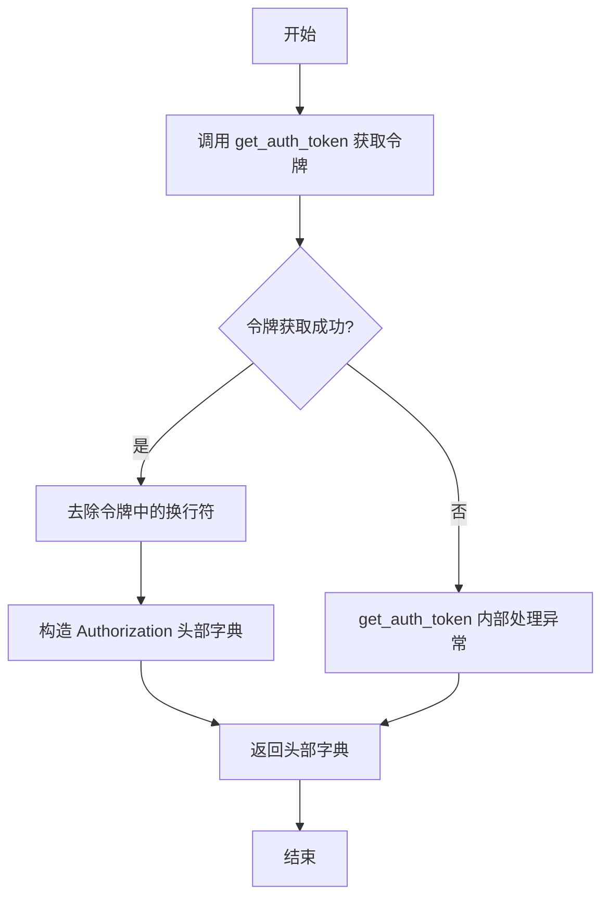

#### 带注释源码

```python
def make_auth_header():
    """
    生成GitHub API请求所需的Authorization认证头部。
    
    该函数内部调用get_auth_token()获取GitHub OAuth令牌，
    并将其格式化为符合GitHub API规范的Authorization头部。
    
    Returns:
        dict: 包含Authorization信息的字典，格式为
              {'Authorization': 'token <token_value>'}
    """
    # 调用get_auth_token()函数获取OAuth认证令牌
    # 该函数会尝试从本地文件、keyring或交互式输入获取令牌
    token = get_auth_token()
    
    # 去除令牌中可能存在的换行符，确保令牌格式正确
    # 某些情况下令牌可能包含末尾换行符，需要清理
    token_cleaned = token.replace("\n", "")
    
    # 构造Authorization头部，按照GitHub API规范格式化为 'token <token>'
    # GitHub API支持两种认证方式：token和bearer，这里使用token方式
    auth_header = {'Authorization': 'token ' + token_cleaned}
    
    # 返回构造好的认证头部字典，可直接作为requests库的headers参数使用
    return auth_header
```


### `post_issue_comment`

该函数用于向指定GitHub仓库的特定Issue提交评论内容，通过GitHub API以POST请求方式发送JSON格式的评论数据，并使用OAuth Token进行身份验证。

参数：

- `project`：`str`，目标GitHub仓库名称，格式为`owner/repo`
- `num`：`int`，目标Issue的编号
- `body`：`str`，评论的正文内容

返回值：`None`，该函数不返回任何值，仅执行HTTP POST请求

#### 流程图

```mermaid
flowchart TD
    A[开始 post_issue_comment] --> B[构建API URL]
    B --> C[将评论body序列化为JSON]
    C --> D[调用make_auth_header获取认证头]
    D --> E[发送POST请求到GitHub API]
    E --> F[结束]
    
    B --> B1[URL格式: https://api.github.com/repos/{project}/issues/{num}/comments]
    D --> D1[Authorization: token {token}]
```

#### 带注释源码

```python
def post_issue_comment(project, num, body):
    """
    向GitHub仓库的指定Issue发送评论。
    
    参数:
        project: str, GitHub仓库名称，格式为'owner/repo'
        num: int, Issue的编号
        body: str, 评论内容
    返回:
        None
    """
    # 构建GitHub API的评论endpoint URL
    # 格式: https://api.github.com/repos/{owner}/{repo}/issues/{issue_number}/comments
    url = f'https://api.github.com/repos/{project}/issues/{num}/comments'
    
    # 将评论内容封装为JSON格式的请求体
    # GitHub API要求body字段为字符串
    payload = json.dumps({'body': body})
    
    # 发送POST请求到GitHub API
    # 使用make_auth_header()获取OAuth token认证头
    # data参数会自动编码为application/x-www-form-urlencoded
    # 但GitHub API v3需要JSON格式，所以使用json.dumps预处理
    requests.post(url, data=payload, headers=make_auth_header())
```


### `post_gist`

该函数用于将文本内容发布到 GitHub Gist，并返回创建的 Gist 的 URL。

参数：

- `content`：`str`，要发布到 Gist 的文本内容
- `description`：`str`，可选，Gist 的描述信息，默认为空字符串
- `filename`：`str`，可选，Gist 中文件的名称，默认为 `'file'`
- `auth`：`bool`，可选，是否使用认证头进行请求，默认为 `False`

返回值：`str`，返回创建的 Gist 的 HTML URL

#### 流程图

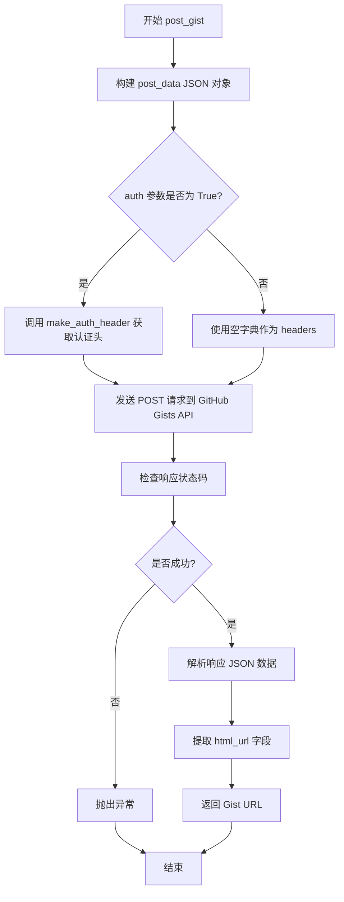

#### 带注释源码

```python
def post_gist(content, description='', filename='file', auth=False):
    """Post some text to a Gist, and return the URL."""
    # 构建要发送到 GitHub Gist API 的 JSON 数据
    post_data = json.dumps({
      "description": description,  # Gist 的描述
      "public": True,               # Gist 是否公开
      "files": {                    # 文件内容字典
        filename: {
          "content": content        # 文件的实际内容
        }
      }
    }).encode('utf-8')               # 将 JSON 字符串编码为 UTF-8 字节

    # 根据 auth 参数决定是否添加认证头
    headers = make_auth_header() if auth else {}
    
    # 向 GitHub Gists API 发送 POST 请求
    response = requests.post("https://api.github.com/gists", data=post_data, headers=headers)
    
    # 如果响应状态码表示错误，则抛出异常
    response.raise_for_status()
    
    # 解析响应 JSON 数据
    response_data = json.loads(response.text)
    
    # 返回创建的 Gist 的 HTML URL
    return response_data['html_url']
```


### `get_pull_request`

获取指定仓库中特定编号的 GitHub Pull Request（拉取请求）信息，返回一个支持属性访问的字典对象。

参数：

- `project`：`str`，GitHub 仓库标识，格式为 `"owner/repo"`
- `num`：`int`，Pull Request 的编号
- `auth`：`bool`，是否使用认证方式请求，默认为 `False`

返回值：`Obj`，包含 Pull Request 详细信息的字典，支持属性访问（如 `pr.title`、`pr.number`）

#### 流程图

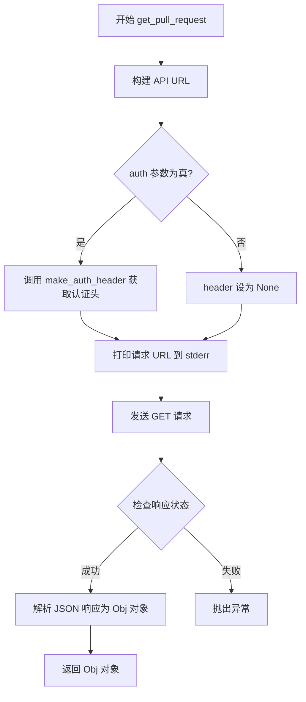

#### 带注释源码

```python
def get_pull_request(project, num, auth=False):
    """Return the pull request info for a given PR number."""
    # 1. 拼接 GitHub API URL，格式：https://api.github.com/repos/{owner}/{repo}/pulls/{number}
    url = f"https://api.github.com/repos/{project}/pulls/{num}"
    
    # 2. 根据 auth 参数决定是否添加认证头部
    if auth:
        # 当需要认证时，调用 make_auth_header() 生成 Authorization 头
        header = make_auth_header()
    else:
        # 匿名请求，无需认证头
        header = None
    
    # 3. 打印请求的 URL 到标准错误流，便于调试和日志记录
    print("fetching %s" % url, file=sys.stderr)
    
    # 4. 发送 GET 请求到 GitHub API
    response = requests.get(url, headers=header)
    
    # 5. 检查 HTTP 响应状态，若为错误状态码则抛出异常
    response.raise_for_status()
    
    # 6. 解析 JSON 响应，使用 object_hook 将字典转换为 Obj 对象
    # Obj 类实现了 __getattr__ 和 __setattr__，支持字典的属性访问方式
    return json.loads(response.text, object_hook=Obj)
```


### `get_pull_request_files`

获取指定仓库中某个 Pull Request 的文件列表。

参数：

- `project`：`str`，目标仓库名称，格式为 `owner/repo`（例如 `ipython/ipython`）。
- `num`：`int`，Pull Request 的编号。
- `auth`：`bool`，可选，是否使用 GitHub 认证信息（默认为 `False`）。若为 `True`，则调用 `make_auth_header()` 生成认证头。

返回值：`list`，返回一个包含多个字典的列表，每个字典对应 PR 中的一个文件及其详细信息（如路径、状态、变更行数等）。

#### 流程图

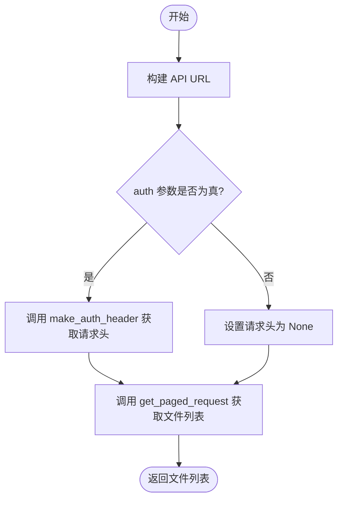

#### 带注释源码

```python
def get_pull_request_files(project, num, auth=False):
    """get list of files in a pull request"""
    # 1. 构造获取 PR 文件的 GitHub API 端点 URL
    # 示例: https://api.github.com/repos/owner/repo/pulls/123/files
    url = f"https://api.github.com/repos/{project}/pulls/{num}/files"
    
    # 2. 根据 auth 参数决定是否添加认证头
    if auth:
        # 如果需要认证，调用 make_auth_header 生成 token 头
        header = make_auth_header()
    else:
        # 默认不使用认证，发送公开请求
        header = None
        
    # 3. 调用通用的分页请求函数获取所有页面的数据并返回
    # 该函数内部处理了 API 分页 (per_page) 和结果合并
    return get_paged_request(url, headers=header)
```


### `get_paged_request`

获取 GitHub API 分页数据的完整列表，自动处理分页逻辑并返回所有页面的合并结果。

参数：

- `url`：`str`，目标 GitHub API 端点的 URL
- `headers`：`dict` 或 `None`，可选的 HTTP 请求头，用于身份验证等
- `**params`：`dict`，关键字参数，作为 URL 查询参数传递（如 `per_page`、`page`、`state` 等）

返回值：`list`，返回所有分页数据的合并列表

#### 流程图

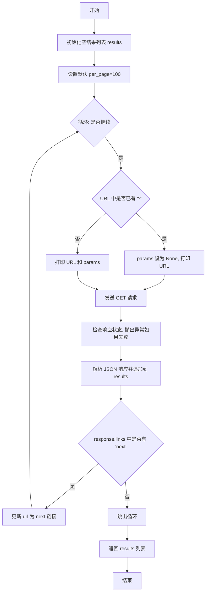

#### 带注释源码

```python
def get_paged_request(url, headers=None, **params):
    """
    获取完整的分页列表，处理 GitHub API v3 的分页机制。
    
    该函数会自动遍历所有分页并返回合并后的完整数据。
    
    参数:
        url: str, GitHub API 端点的完整 URL
        headers: dict or None, 可选的 HTTP 请求头
        **params: dict, URL 查询参数（如 per_page, page, state 等）
    
    返回:
        list: 包含所有分页数据的列表
    """
    results = []  # 初始化结果列表，用于存储所有页面的数据
    params.setdefault("per_page", 100)  # 默认每页获取100条记录（GitHub API 最大值）
    
    while True:  # 进入分页循环
        if '?' in url:  # 判断 URL 是否已包含查询参数
            params = None  # 如果已有参数，后续请求不再传递 params（避免重复参数）
            print(f"fetching {url}", file=sys.stderr)  # 记录日志到标准错误
        else:
            print(f"fetching {url} with {params}", file=sys.stderr)  # 记录完整请求信息
        
        # 发送 GET 请求到 GitHub API
        response = requests.get(url, headers=headers, params=params)
        
        # 检查 HTTP 响应状态，失败时抛出异常
        response.raise_for_status()
        
        # 解析 JSON 响应并将数据追加到结果列表
        results.extend(response.json())
        
        # 检查响应头中的链接信息，判断是否有下一页
        if 'next' in response.links:
            url = response.links['next']['url']  # 更新 URL 为下一页链接
        else:
            break  # 没有更多页面，退出循环
    
    return results  # 返回合并后的完整数据列表
```


### `get_pulls_list`

获取指定项目的Pull Request列表，支持分页处理和可选的GitHub认证。

参数：

- `project`：`str`，GitHub仓库名称，格式为`owner/repo`
- `auth`：`bool`，是否使用认证（可选，默认为`False`）
- `**params`：`dict`，传递给GitHub API的额外查询参数（可选）

返回值：`list[dict]`，返回Pull Request列表，每个元素是一个包含PR信息的字典

#### 流程图

```mermaid
flowchart TD
    A[开始 get_pulls_list] --> B[设置默认state=closed]
    B --> C[构建API URL: https://api.github.com/repos/{project}/pulls]
    C --> D{auth参数是否为True?}
    D -->|是| E[调用make_auth_header获取认证头]
    D -->|否| F[headers设为None]
    E --> G[调用get_paged_request获取分页数据]
    F --> G
    G --> H[返回所有页面的合并结果]
    H --> I[结束]
```

#### 带注释源码

```python
def get_pulls_list(project, auth=False, **params):
    """get pull request list"""
    # 1. 设置默认参数：如果params中没有指定state，默认获取已关闭(closed)的PR
    params.setdefault("state", "closed")
    
    # 2. 构建GitHub API URL，格式为 https://api.github.com/repos/{owner}/{repo}/pulls
    url = f"https://api.github.com/repos/{project}/pulls"
    
    # 3. 根据auth参数决定是否添加认证头
    if auth:
        # 如果需要认证，调用make_auth_header()生成Authorization头
        headers = make_auth_header()
    else:
        # 不需要认证时，headers设为None
        headers = None
    
    # 4. 调用get_paged_request函数处理分页请求，获取所有页面的数据
    #    该函数会自动处理GitHub API的分页机制，合并所有页面的结果
    pages = get_paged_request(url, headers=headers, **params)
    
    # 5. 返回完整的PR列表
    return pages
```


### `get_issues_list`

该函数用于从GitHub仓库获取issues列表，支持分页处理，可选择是否使用认证，并允许通过可选参数自定义查询。

参数：

- `project`：`str`，GitHub仓库名称，格式为"owner/repo"（如"ipython/ipython"）
- `auth`：`bool`，可选参数，默认为False，是否使用GitHub认证token进行API请求
- `**params`：`dict`，可选关键字参数，用于传递给GitHub API的其他查询参数（如state、labels、sort等）

返回值：`list`，返回包含所有issues的列表（已处理分页，合并了所有页面的数据）

#### 流程图

```mermaid
flowchart TD
    A[开始 get_issues_list] --> B[设置默认参数 state=closed]
    B --> C[构建API URL: https://api.github.com/repos/{project}/issues]
    C --> D{auth参数为真?}
    D -->|是| E[调用make_auth_header获取认证头]
    D -->|否| F[headers设为None]
    E --> G[调用get_paged_request发送请求]
    F --> G
    G --> H[处理分页响应,合并所有页面数据]
    H --> I[返回issues列表]
```

#### 带注释源码

```python
def get_issues_list(project, auth=False, **params):
    """
    获取GitHub仓库的issues列表
    
    参数:
        project: GitHub仓库名称,格式为'owner/repo'
        auth: 是否使用认证,默认为False
        **params: 传递给GitHub API的可选查询参数
    
    返回:
        包含所有issues的列表(已处理分页)
    """
    # 设置默认参数:获取已关闭的issues
    params.setdefault("state", "closed")
    
    # 构建GitHub API端点URL
    url = f"https://api.github.com/repos/{project}/issues"
    
    # 根据auth参数决定是否添加认证头部
    if auth:
        headers = make_auth_header()
    else:
        headers = None
    
    # 调用分页请求函数获取所有页面的issues
    # get_paged_request会自动处理GitHub API的分页,返回完整列表
    pages = get_paged_request(url, headers=headers, **params)
    
    # 返回合并后的issues列表
    return pages
```


### `get_milestones`

获取指定GitHub项目的里程碑列表，支持认证和非认证模式，并处理分页请求。

参数：

- `project`：`str`，GitHub仓库名称，格式为"owner/repo"（例如："ipython/ipython"）
- `auth`：`bool`，是否使用认证（默认为False）。若为True，则使用OAuth token进行认证请求
- `**params`：`dict`，可选的查询参数，会被传递给GitHub API（如state、sort、direction等）

返回值：`list`，返回GitHub里程碑对象的列表，每个元素是一个包含里程碑信息的字典（如title、number、state、description等）

#### 流程图

```mermaid
flowchart TD
    A[开始 get_milestones] --> B[设置params默认参数: state=all]
    B --> C[构建API URL: https://api.github.com/repos/{project}/milestones]
    C --> D{auth参数是否为True?}
    D -->|是| E[调用make_auth_header获取认证头]
    D -->|否| F[设置headers为None]
    E --> G[调用get_paged_request函数]
    F --> G
    G --> H[接收返回的milestones列表]
    H --> I[结束 - 返回milestones列表]
```

#### 带注释源码

```python
def get_milestones(project, auth=False, **params):
    """获取指定GitHub项目的里程碑列表
    
    Args:
        project: GitHub仓库名称，格式为"owner/repo"
        auth: 是否使用认证进行请求，默认为False
        **params: 额外的查询参数，会直接传递给GitHub API
    
    Returns:
        list: 里程碑对象列表，每个对象包含title、number、state等字段
    """
    # 设置默认参数：如果params中没有指定state，默认获取所有状态的milestones
    params.setdefault('state', 'all')
    
    # 构建GitHub API的milestones端点URL
    url = f"https://api.github.com/repos/{project}/milestones"
    
    # 根据auth参数决定是否添加认证头
    if auth:
        # 调用make_auth_header获取包含token的认证头
        headers = make_auth_header()
    else:
        # 非认证请求，headers设为None
        headers = None
    
    # 调用get_paged_request函数处理分页请求
    # 该函数会自动处理GitHub API的分页机制，获取完整的milestones列表
    milestones = get_paged_request(url, headers=headers, **params)
    
    # 返回获取到的milestones列表
    return milestones
```


### `get_milestone_id`

根据给定的里程碑标题在 GitHub 项目中查找对应的里程碑编号。

参数：

- `project`：`str`，项目仓库名称（格式为 `owner/repo`）
- `milestone`：`str`，要查找的里程碑标题
- `auth`：`bool`，是否使用认证（默认 `False`）
- `**params`：`dict`，可选参数，会传递给 `get_milestones` API 调用

返回值：`int`，返回匹配里程碑的编号（number 字段）

#### 流程图

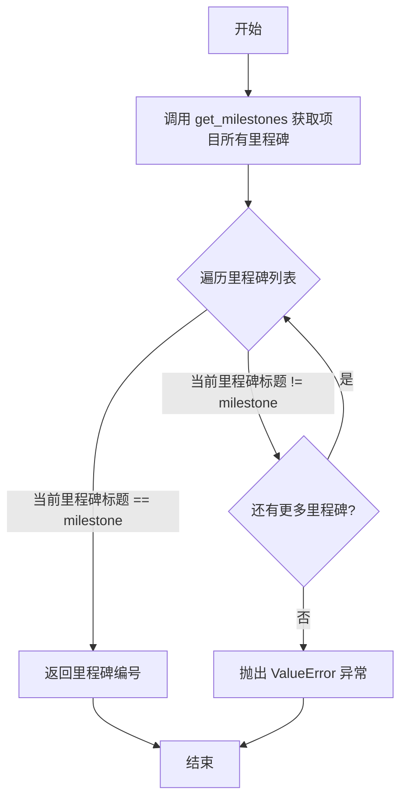

#### 带注释源码

```python
def get_milestone_id(project, milestone, auth=False, **params):
    """
    根据里程碑标题查找对应的里程碑编号。
    
    参数:
        project: str, GitHub 项目名称 (格式: owner/repo)
        milestone: str, 里程碑的标题
        auth: bool, 是否使用认证访问 API
        **params: dict, 额外的查询参数
    
    返回:
        int: 匹配里程碑的编号
    
    异常:
        ValueError: 当找不到指定标题的里程碑时抛出
    """
    # 调用 get_milestones 获取项目的所有里程碑列表
    milestones = get_milestones(project, auth=auth, **params)
    
    # 遍历每个里程碑，查找标题匹配的项
    for mstone in milestones:
        # 比较里程碑标题是否与给定的 milestone 相等
        if mstone['title'] == milestone:
            # 找到匹配项，返回里程碑的编号（number 字段）
            return mstone['number']
    
    # 遍历完所有里程碑都没有找到匹配，抛出异常
    raise ValueError("milestone %s not found" % milestone)
```


### `is_pull_request(issue)`

检查给定的issue对象是否是pull request，通过检查issue字典中是否存在`pull_request`字段及其`html_url`属性来判断。

参数：

- `issue`：`dict`，GitHub API返回的issue对象字典

返回值：`bool`，如果该issue是pull request则返回`True`，否则返回`False`

#### 流程图

```mermaid
graph TD
    A[开始] --> B{issue.get('pull_request', {})}
    B -->|返回字典d| C{d.get('html_url', None)}
    C -->|html_url存在| D[返回True]
    C -->|html_url为None| E[返回False]
    B -->|返回空字典| E
```

#### 带注释源码

```python
def is_pull_request(issue):
    """Return True if the given issue is a pull request."""
    # 获取issue中的'pull_request'字段，如果不存在则返回空字典
    # GitHub的API中，pull request会在issue对象中添加一个pull_request字段
    pull_request_info = issue.get('pull_request', {})
    
    # 从pull_request_info中获取html_url，如果不存在则返回None
    # html_url的存在表明这确实是一个pull request
    html_url = pull_request_info.get('html_url', None)
    
    # 使用bool()将结果转换为布尔值
    # - 如果html_url存在，返回True
    # - 如果html_url为None，返回False
    return bool(html_url)
```

---

## 补充信息

### 关键组件信息

| 名称 | 描述 |
|------|------|
| `Obj` | 字典子类，支持属性访问方式获取字典值 |
| `get_auth_token()` | 获取GitHub OAuth认证令牌 |
| `make_auth_header()` | 构建包含认证令牌的HTTP请求头 |
| `get_paged_request()` | 处理GitHub API的分页请求 |
| `get_pull_request()` | 获取单个pull request信息 |
| `is_pull_request()` | 判断issue是否为pull request |

### 潜在的技术债务或优化空间

1. **硬编码的token存储路径**：`.ghoauth`文件路径是硬编码的，可配置性差
2. **缺乏类型注解**：整个文件没有使用Python类型注解，不利于静态分析和IDE支持
3. **全局变量`token`**：使用全局变量存储token，可能导致状态管理混乱
4. **异常处理过于宽泛**：在`get_auth_token()`中使用`except Exception`捕获所有异常，可能隐藏潜在问题
5. **缓存依赖可选**：`requests_cache`是可选依赖，没有提供配置机制
6. **认证流程不够健壮**：没有处理token过期、撤销等场景

### 其它项目

**设计目标与约束**：
- 目标：简化GitHub API的认证和常见操作（issues、pull requests、gists等）
- 约束：使用GitHub API v3，需要OAuth token进行认证操作

**错误处理与异常设计**：
- 使用`response.raise_for_status()`检查HTTP错误
- 自定义异常用于特定场景（如`ValueError`表示milestone未找到）
- 认证失败时提示用户输入凭据

**数据流与状态机**：
- 认证流程：缓存token → 读取文件 → keyring → 交互式输入
- API请求流程：构建URL → 添加认证头 → 发送请求 → 处理分页 → 返回结果

**外部依赖与接口契约**：
- `requests`：HTTP请求库
- `keyring`：系统密钥环访问
- `requests_cache`：可选的HTTP缓存层


### `get_authors`

该函数通过调用 GitHub API 获取给定 Pull Request 的所有提交作者信息，并将作者名称和邮箱格式化为字符串列表返回。

参数：

- `pr`：`dict`，包含 `number`（PR 编号）和 `commits_url`（提交列表 API 地址）的 Pull Request 字典对象

返回值：`list[str]`，返回作者列表，每个元素格式为 `"name <email>"` 的字符串

#### 流程图

```mermaid
flowchart TD
    A[开始 get_authors] --> B[打印日志: 获取 PR #number 的作者]
    B --> C[调用 make_auth_header 生成认证头]
    C --> D[使用认证头请求 pr['commits_url']]
    D --> E{请求是否成功}
    E -->|否| F[抛出异常]
    E -->|是| G[解析 JSON 响应获取提交列表]
    G --> H[初始化空作者列表 authors]
    H --> I{遍历提交列表}
    I -->|每个 commit| J[提取 commit['commit']['author']]
    J --> K[格式化: name <email>]
    K --> L[添加到 authors 列表]
    L --> I
    I -->|遍历完成| M[返回 authors 列表]
    M --> N[结束]
```

#### 带注释源码

```python
def get_authors(pr):
    """
    获取 Pull Request 的所有提交作者列表
    
    参数:
        pr: 包含 'number' 和 'commits_url' 属性的 Pull Request 字典对象
    
    返回:
        list: 作者字符串列表，格式为 "name <email>"
    """
    # 打印进度日志到标准错误输出
    print("getting authors for #%i" % pr['number'], file=sys.stderr)
    
    # 生成 GitHub API 认证头（包含 token）
    h = make_auth_header()
    
    # 向 GitHub API 发送 GET 请求获取提交列表
    r = requests.get(pr['commits_url'], headers=h)
    
    # 检查 HTTP 响应状态，若出错则抛出异常
    r.raise_for_status()
    
    # 解析 JSON 响应为 Python 对象（提交列表）
    commits = r.json()
    
    # 初始化空列表用于存储作者信息
    authors = []
    
    # 遍历每个提交对象
    for commit in commits:
        # 提取提交中的作者信息（Git 提交作者，非 GitHub 用户）
        author = commit['commit']['author']
        
        # 格式化为 "name <email>" 字符串并添加到列表
        authors.append(f"{author['name']} <{author['email']}>")
    
    # 返回作者列表
    return authors
```


### `iter_fields`

该函数是一个生成器函数，用于将字典类型的字段数据转换为键值对元组，并确保特定的键顺序（主要用于S3的multipart/form-data表单上传场景）。

参数：

- `fields`：`dict`，需要处理的字段字典，包含各种表单字段

返回值：`Generator[tuple, None, None]`，生成键值对元组的生成器对象

#### 流程图

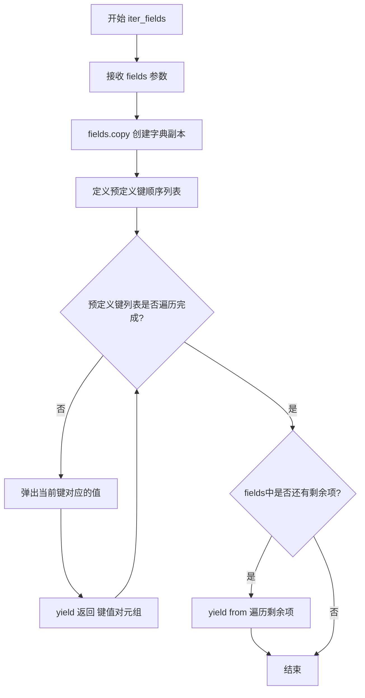

#### 带注释源码

```python
def iter_fields(fields):
    """生成器函数，按特定顺序yield字典的键值对
    
    用于确保S3 multipart表单上传时字段的特定顺序要求
    """
    # 创建字典的浅拷贝，避免修改原始字典
    fields = fields.copy()
    
    # 遍历预定义的键顺序列表（确保S3 API要求的键顺序）
    for key in [
            'key', 'acl', 'Filename', 'success_action_status',
            'AWSAccessKeyId', 'Policy', 'Signature', 'Content-Type', 'file']:
        # pop方法会同时返回并删除该键的值
        yield key, fields.pop(key)
    
    # 使用yield from将剩余字段全部yield出去
    # 这些是未在预定义列表中的额外字段
    yield from fields.items()
```


### `encode_multipart_formdata`

该函数用于将字典类型的字段编码为 multipart/form-data MIME 格式，常用于构建 HTTP multipart 请求体，特别是上传文件到 S3 或类似服务时。

参数：

- `fields`：`Dict[str, Any] | List[Tuple[str, Any]]`，字段字典或键值对元组列表。键作为字段名，值作为 form-data 的内容。若值为包含两个元素的元组，则第一个元素视为文件名。
- `boundary`：`str | None`，分隔符字符串。若未指定，则使用 `mimetools.choose_boundary` 自动生成随机边界。

返回值：`Tuple[bytes, str]`，返回编码后的请求体（字节流）和对应的 `Content-Type` 头部值（字符串）。

#### 流程图

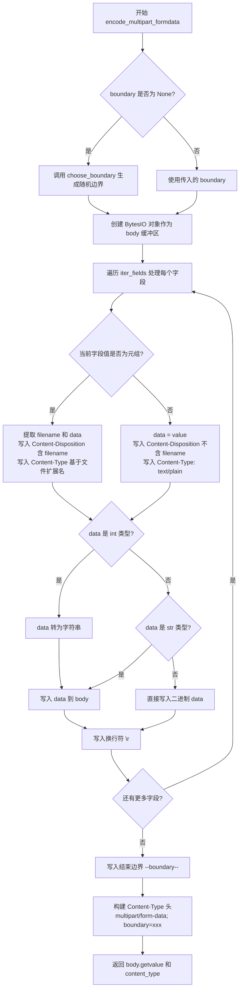

#### 带注释源码

```python
def encode_multipart_formdata(fields, boundary=None):
    """
    Encode a dictionary of ``fields`` using the multipart/form-data mime format.

    :param fields:
        Dictionary of fields or list of (key, value) field tuples.  The key is
        treated as the field name, and the value as the body of the form-data
        bytes. If the value is a tuple of two elements, then the first element
        is treated as the filename of the form-data section.

        Field names and filenames must be str.

    :param boundary:
        If not specified, then a random boundary will be generated using
        :func:`mimetools.choose_boundary`.
    """
    # 复制 requests 库的导入到本函数作用域，避免全局依赖问题
    from io import BytesIO
    from requests.packages.urllib3.filepost import (
        choose_boundary, writer, b, get_content_type
    )
    
    # 创建内存缓冲区用于构建请求体
    body = BytesIO()
    
    # 如果未提供边界，则自动生成随机边界字符串
    if boundary is None:
        boundary = choose_boundary()

    # 遍历处理每个字段，按特定顺序（适合 S3 API）
    for fieldname, value in iter_fields(fields):
        # 写入分界符前缀
        body.write(b('--%s\r\n' % (boundary)))

        # 判断是否为文件上传（值为元组）
        if isinstance(value, tuple):
            # 元组第一个元素是文件名，第二个是文件内容
            filename, data = value
            # 写入包含文件名的 Content-Disposition 头
            writer(body).write('Content-Disposition: form-data; name="%s"; '
                               'filename="%s"\r\n' % (fieldname, filename))
            # 根据文件名自动推断 Content-Type
            body.write(b('Content-Type: %s\r\n\r\n' %
                       (get_content_type(filename))))
        else:
            # 普通文本字段
            data = value
            # 写入不含文件名的 Content-Disposition 头
            writer(body).write('Content-Disposition: form-data; name="%s"\r\n'
                               % (fieldname))
            # 默认使用纯文本类型
            body.write(b'Content-Type: text/plain\r\n\r\n')

        # 兼容处理：整数类型需转换为字符串
        if isinstance(data, int):
            data = str(data)  # Backwards compatibility
        # 字符串类型使用 writer 写入（处理编码）
        if isinstance(data, str):
            writer(body).write(data)
        else:
            # 二进制数据直接写入
            body.write(data)

        # 字段结束后写入换行符
        body.write(b'\r\n')

    # 写入结束边界（前后都有 --）
    body.write(b('--%s--\r\n' % (boundary)))

    # 构建完整的 Content-Type 头
    content_type = b('multipart/form-data; boundary=%s' % boundary)

    # 返回编码后的请求体字节和 Content-Type 头
    return body.getvalue(), content_type
```


### `post_download`

该函数用于将本地文件上传到 GitHub 的下载区域（Downloads area）。它首先通过 GitHub API 创建一个下载记录，获取 S3 上传所需的凭证，然后使用 multipart/form-data 格式将文件上传到 Amazon S3。

参数：

- `project`：`str`，GitHub 仓库标识符，格式为 "owner/repo"
- `filename`：`str`，要上传的本地文件的路径
- `name`：`str`，可选参数，上传后的文件名，默认为本地文件的 basename
- `description`：`str`，可选参数，下载文件的描述信息，默认为空字符串

返回值：`requests.Response`，返回 S3 上传请求的响应对象

#### 流程图

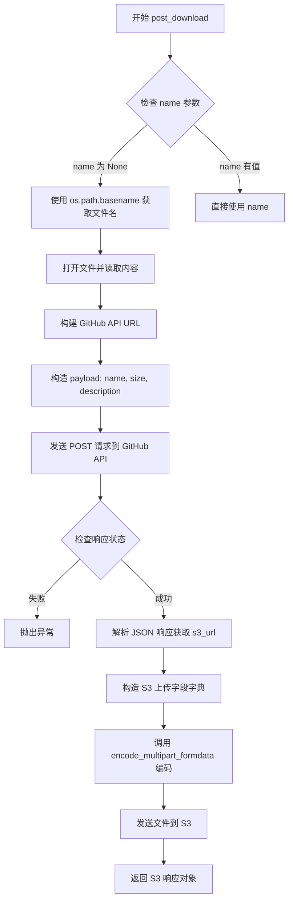

#### 带注释源码

```python
def post_download(project, filename, name=None, description=""):
    """
    Upload a file to the GitHub downloads area
    
    Args:
        project: GitHub repository identifier (e.g., "owner/repo")
        filename: Local file path to upload
        name: Optional name for the download, defaults to basename of filename
        description: Optional description for the download
    
    Returns:
        Response object from S3 upload request
    """
    # 如果未指定名称，则使用文件的 basename 作为名称
    if name is None:
        name = os.path.basename(filename)
    
    # 读取本地文件内容（二进制模式）
    with open(filename, 'rb') as f:
        filedata = f.read()

    # 构建 GitHub Downloads API URL
    url = f"https://api.github.com/repos/{project}/downloads"

    # 构造请求 payload，包含文件名、文件大小和描述
    payload = json.dumps(dict(name=name, size=len(filedata),
                    description=description))
    
    # 发送 POST 请求到 GitHub API 创建下载记录
    # 使用 make_auth_header() 生成授权头
    response = requests.post(url, data=payload, headers=make_auth_header())
    response.raise_for_status()
    
    # 解析响应获取 S3 上传所需信息
    reply = json.loads(response.content)
    s3_url = reply['s3_url']

    # 构造 S3 上传所需的字段字典
    fields = dict(
        key=reply['path'],                  # S3 对象路径
        acl=reply['acl'],                   # 访问控制列表
        success_action_status=201,          # 成功上传返回的状态码
        Filename=reply['name'],             # 文件名
        AWSAccessKeyId=reply['accesskeyid'], # AWS 访问密钥
        Policy=reply['policy'],             # 上传策略
        Signature=reply['signature'],       # 签名
        file=(reply['name'], filedata),     # 要上传的文件 (文件名, 数据)
    )
    
    # 设置 Content-Type
    fields['Content-Type'] = reply['mime_type']
    
    # 使用 multipart/form-data 编码格式
    data, content_type = encode_multipart_formdata(fields)
    
    # 发送文件到 S3
    s3r = requests.post(s3_url, data=data, headers={'Content-Type': content_type})
    
    return s3r
```


### `Obj.__getattr__`

该方法是`Obj`类的属性访问实现，通过字典键查找方式提供类似字典的动态属性访问功能，当访问不存在的属性时会抛出`AttributeError`异常。

参数：

- `self`：`Obj`实例，隐式参数，表示当前对象本身
- `name`：`str`，要访问的属性名称（字典键名）

返回值：`任意类型`，返回字典中指定键对应的值；如果键不存在则抛出`AttributeError`

#### 流程图

```mermaid
flowchart TD
    A[开始访问属性] --> B{尝试访问self[name]}
    B -->|成功| C[返回self[name]的值]
    B -->|KeyError异常| D[捕获KeyError异常]
    D --> E[抛出AttributeError异常]
    E --> F[异常信息包含属性名name]
    
    style C fill:#90EE90
    style E fill:#FFB6C1
```

#### 带注释源码

```python
def __getattr__(self, name):
    """
    通过属性访问方式获取字典中的值
    
    当使用obj.name而不是obj['name']访问时调用此方法。
    如果name作为键存在于字典中，返回对应值；否则抛出AttributeError。
    
    参数:
        name (str): 要访问的属性/键名称
        
    返回:
        任意类型: 字典中name键对应的值
        
    异常:
        AttributeError: 当name不存在于字典中时抛出
    """
    try:
        # 尝试通过字典键的方式获取值
        return self[name]
    except KeyError as err:
        # 如果键不存在，将KeyError转换为AttributeError
        # 这是Python属性访问的规范行为
        raise AttributeError(name) from err
```

#### 设计说明

| 项目 | 说明 |
|------|------|
| **设计目标** | 让`Obj`类的实例既能像字典一样通过`[]`操作符访问，也能通过`.`属性方式访问 |
| **异常转换** | 将`KeyError`转换为`AttributeError`是Python的特殊方法规范要求，保证属性访问的一致性 |
| **异常链** | 使用`from err`保留原始异常信息，便于调试时追溯问题根源 |
| **优化空间** | 可以考虑添加`__getattribute__`方法以更细粒度控制属性访问，或实现`__contains__`方法提供更高效的键存在性检查 |


### `Obj.__setattr__`

该方法是 `Obj` 类的属性设置魔术方法（Magic Method），允许使用点号语法（`obj.name = val`）向继承自 `dict` 的对象中添加键值对，实现属性访问与字典操作的统一。

参数：

- `name`：`str`，要设置的属性名称，将作为字典的键（key）
- `val`：`任意类型`，要设置的值，将作为字典的值（value）

返回值：`None`，该方法无返回值（Python 方法默认返回 `None`）

#### 流程图

```mermaid
flowchart TD
    A[开始 __setattr__] --> B{检查 name 是否合法}
    B -->|是| C[执行 self[name] = val]
    C --> D[将键值对存入底层字典]
    D --> E[结束, 返回 None]
    
    style A fill:#e1f5fe
    style C fill:#fff3e0
    style E fill:#e8f5e9
```

#### 带注释源码

```python
def __setattr__(self, name, val):
    """
    设置对象属性的魔术方法
    
    参数:
        name: 属性名称，将作为字典的键
        val:  属性值，将作为字典的值
    返回:
        无返回值（返回 None）
    """
    # 将传入的 name 作为键，val 作为值，存入字典 self 中
    # 由于 Obj 继承自 dict，这里实际上是调用 dict 的 __setitem__ 方法
    # 这样就可以通过 obj.attr = value 的方式向字典中添加元素
    self[name] = val
```

## 关键组件


### 认证与授权模块

负责GitHub OAuth token的获取、缓存和管理，支持从文件、keyring或交互式输入获取认证信息。

### API请求封装模块

提供统一的GitHub API请求接口，包括获取pull request、issues、milestones列表，以及提交评论、发布Gist等功能，支持认证与非认证模式。

### 分页处理模块

处理GitHub API的分页机制，自动遍历多页结果，将所有数据合并返回。

### 多部分表单编码模块

实现multipart/form-data编码功能，用于文件上传场景（如GitHub下载区域），支持自定义字段顺序以兼容S3的API要求。

### 字典增强类（Obj）

将普通字典转换为支持属性访问的对象，提供类似JavaScript对象的语法糖。

### 工具函数集

包含判断pull request、获取提交者信息、获取milestone ID等辅助功能。


## 问题及建议


### 已知问题

-   **全局状态管理问题**：`token` 使用全局变量和 `global` 声明，在多线程环境下存在竞态条件风险
-   **异常处理过于宽泛**：`get_auth_token()` 中使用 `except Exception` 捕获所有异常，无法区分文件不存在、权限问题、网络错误等不同类型的错误
-   **交互式输入无错误处理**：当用户通过 `input()` 和 `getpass.getpass()` 交互式输入时，如果用户直接回车或取消，会导致后续代码以空值继续执行而失败
-   **GitHub API 已弃用**：`post_download()` 函数使用的 GitHub Downloads API 已被 GitHub 弃用，该函数将无法正常工作
-   **授权端点已过时**：使用 `https://api.github.com/authorizations` 创建 OAuth token 的端点已被 GitHub 弃用，应使用 OAuth Apps 或 GitHub Apps
-   **敏感信息文件权限**：`~/.ghoauth` 文件包含认证令牌，但没有检查或设置适当的文件权限（应检查为 600）
-   **缓存导入失败处理不完善**：`requests_cache` 导入失败时仅打印警告然后继续，可能导致意外行为，应使用条件分支处理
-   **requests_cache 版本兼容**：`requests_cache.install_cache()` 的参数在不同版本间可能有差异，缺少版本检查
-   **内部模块导入**：`encode_multipart_formdata` 中使用 `requests.packages.urllib3.filepost`，这是私有内部模块，在 requests 未来版本中可能不可用

### 优化建议

-   **重构认证逻辑**：将 `token` 改为类属性或使用线程安全的单例模式，避免全局状态
-   **细化异常处理**：针对不同错误类型（FileNotFoundError、PermissionError、requests.exceptions.RequestException 等）分别处理
-   **添加输入验证**：在获取用户名密码后进行非空验证，必要时提示重试或退出
-   **移除或替换弃用功能**：删除 `post_download()` 函数或改用 GitHub Releases API 替代；更新 OAuth token 获取方式使用官方推荐的 OAuth Apps 流程
-   **改进缓存逻辑**：使用 `try/except ImportError` 包裹完整的功能使用逻辑，或提供纯 requests 的备选方案
-   **添加类型注解**：为所有函数参数和返回值添加类型提示，提高代码可维护性
-   **使用现代字符串格式化**：将 `%` 格式化逐步迁移到 f-string 或 `.format()`
-   **添加重试机制**：对网络请求添加重试逻辑（使用 `urllib3.util.retry` 或 `tenacity`）
-   **统一请求封装**：提取重复的认证头构建逻辑为一个共享函数，避免在多个函数中重复
-   **添加日志替代 print**：使用 `logging` 模块替代 `print` 输出，便于生产环境日志管理

## 其它


### 设计目标与约束

本模块旨在为IPython工具提供GitHub API交互能力，支持认证、问题管理、Pull Request操作、Gist发布等功能。设计约束包括：依赖Python标准库和requests/requests_cache/keyring第三方库；需要有效的GitHub账号和网络连接；使用OAuth token进行认证；遵循GitHub API v3的速率限制（每小时5000次请求）。

### 错误处理与异常设计

代码采用多种错误处理策略：使用`response.raise_for_status()`捕获HTTP错误并抛出异常；`get_auth_token()`中使用空的`except Exception`捕获所有异常；`Obj`类自定义`__getattr__`将KeyError转换为AttributeError。改进建议：应区分不同异常类型（如网络超时、认证失败、API限制），提供具体错误码和用户友好的错误信息；关键操作应添加重试机制处理临时性失败。

### 外部依赖与接口契约

主要外部依赖包括：`requests`（HTTP请求）、`requests_cache`（可选，API响应缓存）、`keyring`（安全存储密码）、`getpass`（安全密码输入）、`json`（数据序列化）。接口契约方面：所有API函数接受`project`（仓库名）、`auth`（是否认证）等参数；返回JSON解析后的字典或列表对象；认证token通过`Authorization: token xxx`头传递。

### 安全性考虑

存在以下安全风险：用户密码以明文输入且仅用于获取OAuth token；`.ghoauth`文件包含明文token（应使用文件系统权限保护）；`get_auth_token()`中的裸`except Exception`可能隐藏关键错误；`make_auth_header()`直接返回包含token的字典。建议：使用环境变量或更安全的密钥存储方案；添加token过期和刷新机制；对敏感操作添加双因素认证支持。

### 性能考量

代码通过`requests_cache`实现1小时缓存减少重复请求；`get_paged_request`自动处理分页获取完整数据集。潜在性能瓶颈：`get_authors()`同步获取所有提交作者信息，大型PR可能耗时较长；所有HTTP请求为同步阻塞模式。建议：对于大量数据操作考虑异步实现；添加请求超时配置（当前无超时设置）。

### 兼容性考虑

代码针对GitHub API v3设计；Python 3兼容性需确认（使用了f-string等语法）；`encode_multipart_formdata`依赖`requests.packages.urllib3`内部API，存在版本脆弱性。建议：使用标准库或稳定API替代；添加Python版本检测；为GitHub API版本升级预留适配层。

### 日志记录与可观测性

当前使用`print()`和`sys.stderr`输出日志（如"fetching URL"、"getting authors"），无结构化日志记录。改进建议：引入Python logging模块实现分级日志；记录请求耗时、响应状态等可观测性指标；添加调试模式开关。

### 配置管理

当前配置硬编码或依赖环境/文件系统：缓存过期时间为3600秒；OAuth scopes为`["public_repo", "gist"]`；API基础URL固定为`https://api.github.com`。建议：提取为可配置参数；支持配置文件或环境变量覆盖；添加配置验证逻辑。

    