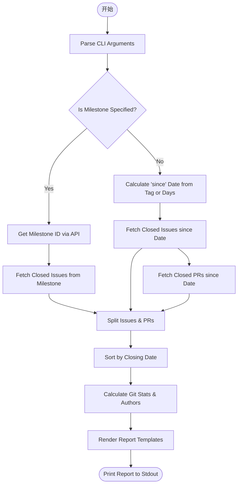
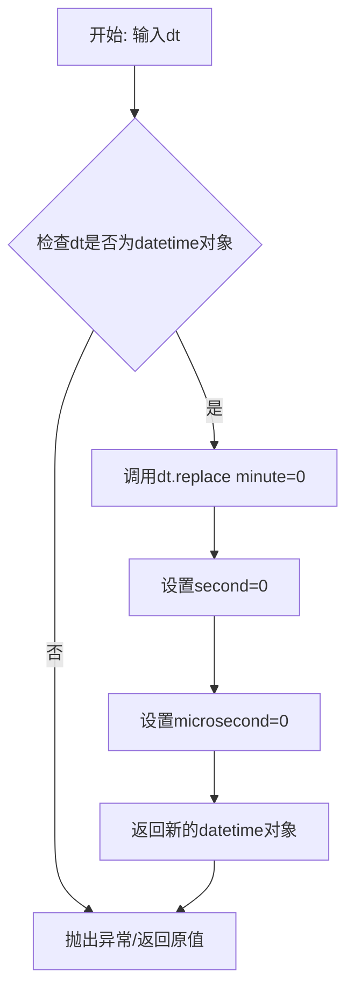
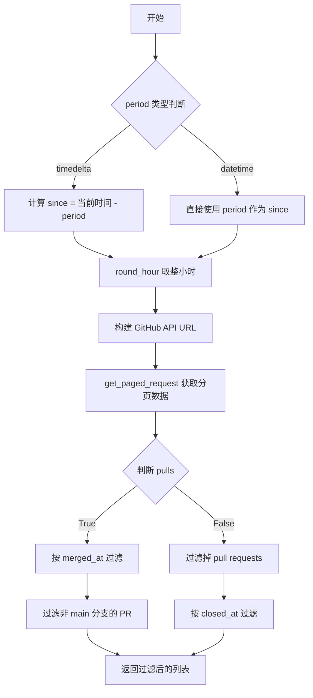
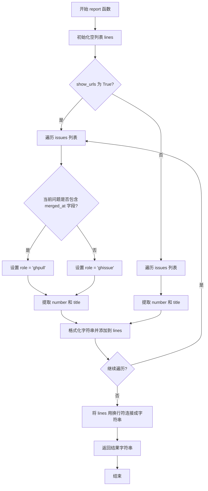
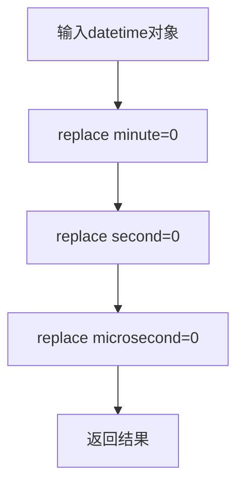
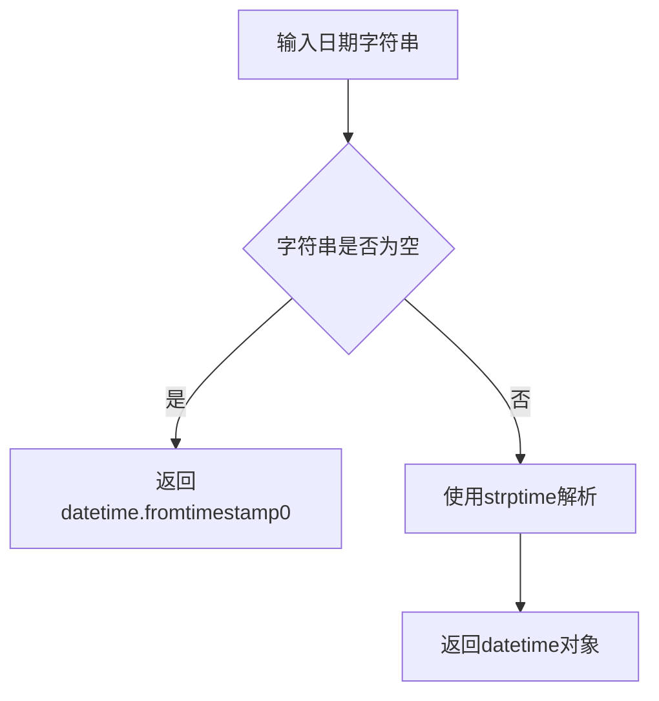
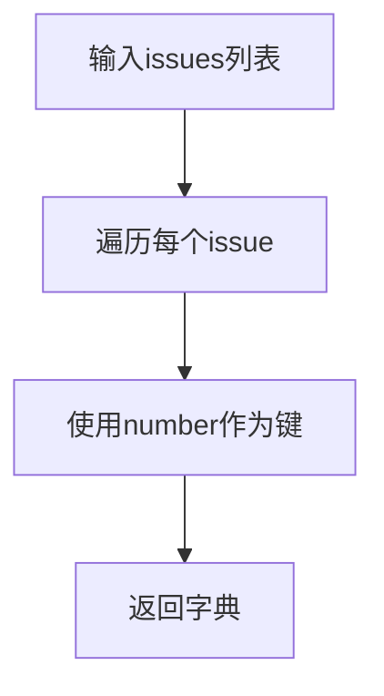
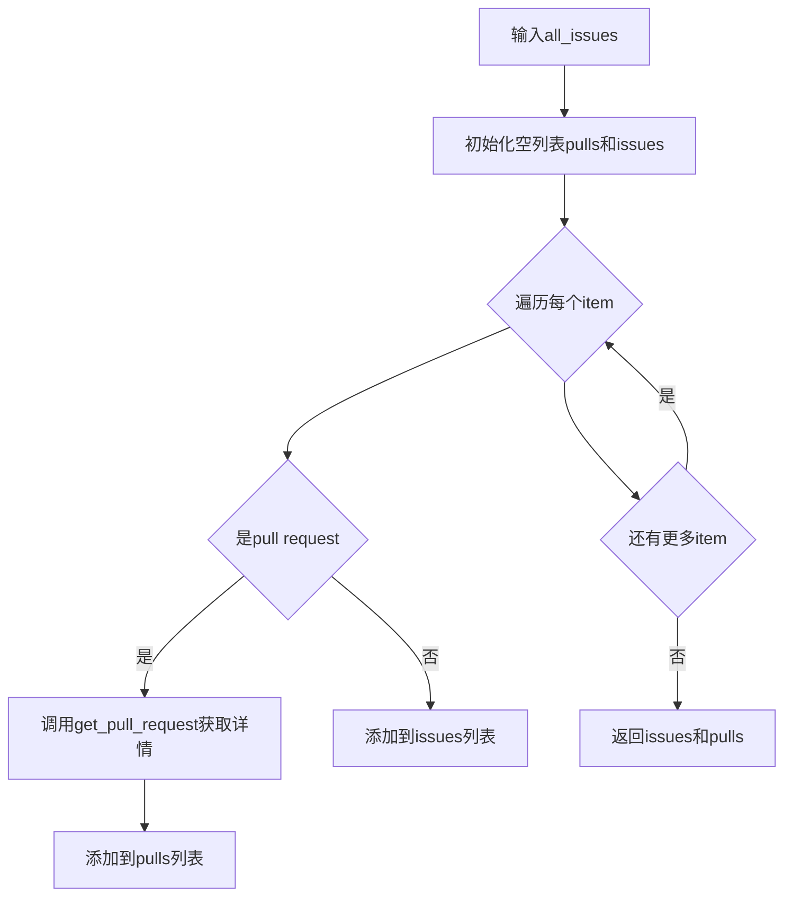
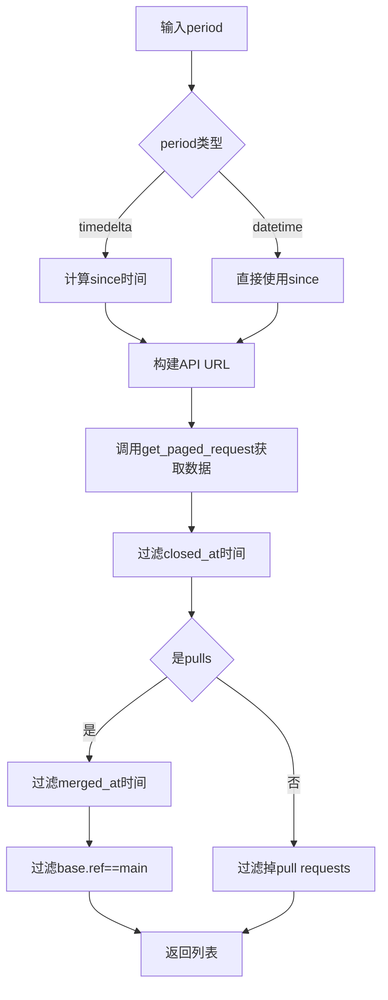
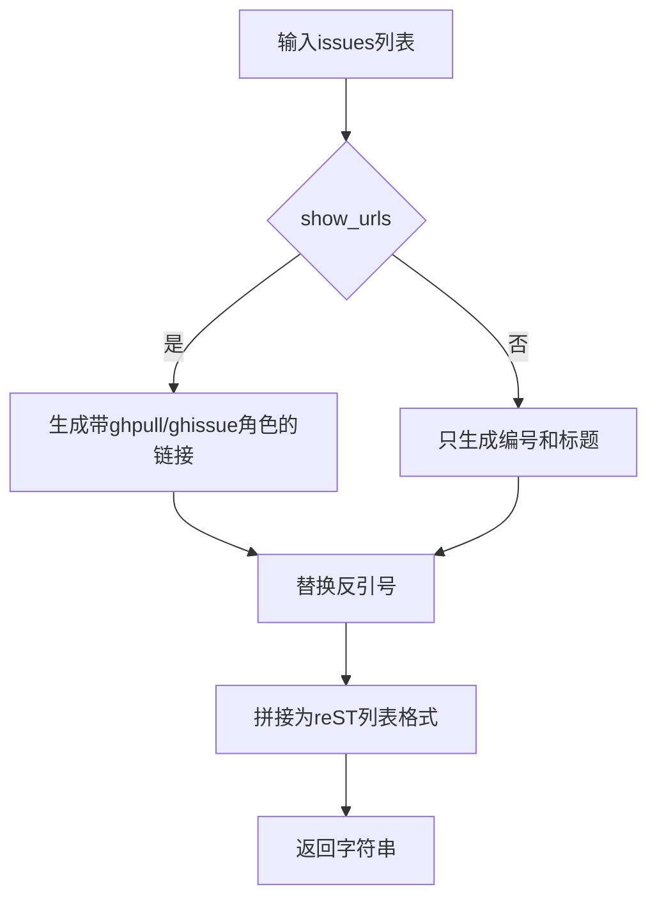

# `matplotlib\tools\github_stats.py` 详细设计文档

A command-line utility script that queries the GitHub API to retrieve closed issues and pull requests for a specified project (defaulting to matplotlib/matplotlib). It aggregates data based on a milestone or a date range (via git tags), calculates commit and author statistics using local git commands, and generates a reStructuredText report suitable for release notes.

## 整体流程



## 类结构

```
github_stats.py (Procedural Script - No Class Definition)
├── Global Variables
│   ├── ISO8601 (Date Format)
│   ├── PER_PAGE (Pagination)
│   └── Templates (Report, Milestone, Links)
└── Functions
    ├── Data Processing
    │   ├── round_hour
    │   ├── _parse_datetime
    │   ├── issues2dict
    │   ├── split_pulls
    │   ├── issues_closed_since
    │   └── sorted_by_field
    ├── Reporting
    │   └── report
    └── Main Execution Block
```

## 全局变量及字段


### `ISO8601`
    
日期时间格式字符串，用于解析和格式化GitHub API返回的ISO 8601格式时间戳

类型：`str`
    


### `PER_PAGE`
    
分页请求每页返回的结果数量，用于GitHub API的per_page参数

类型：`int`
    


### `REPORT_TEMPLATE`
    
生成GitHub统计报告的主模板，包含标题、问题/PR数量、贡献者列表等内容的RST格式字符串

类型：`str`
    


### `MILESTONE_TEMPLATE`
    
里程碑信息的格式化模板字符串，用于生成指向GitHub里程碑页面的链接

类型：`str`
    


### `LINKS_TEMPLATE`
    
链接部分的模板字符串，用于在报告中列出所有关闭的Issue和PR的链接

类型：`str`
    


    

## 全局函数及方法


### `round_hour`

该函数用于将给定的 datetime 对象四舍五入到整点小时，即移除分钟、秒和微秒部分，只保留年月日小时信息。

参数：

- `dt`：`datetime`，需要进行四舍五入的 datetime 对象

返回值：`datetime`，返回一个新的 datetime 对象，其分钟、秒和微秒均被设置为 0

#### 流程图



#### 带注释源码

```python
def round_hour(dt):
    """
    将 datetime 对象四舍五入到整点小时。
    
    该函数移除分钟、秒和微秒部分，只保留年、月、日、小时信息，
    用于将时间精度对齐到小时级别。
    
    参数:
        dt: datetime 类型的时间对象
        
    返回:
        新的 datetime 对象，分钟、秒、微秒均设为 0
    """
    return dt.replace(minute=0, second=0, microsecond=0)
```


### `_parse_datetime`

解析GitHub API返回的ISO8601格式日期字符串为datetime对象。如果输入为空字符串或None，则返回epoch时间（1970-01-01 00:00:00）。

参数：

- `s`：`str`，日期字符串，格式为ISO8601（例如：2023-01-01T00:00:00Z）

返回值：`datetime.datetime`，解析后的datetime对象；如果输入为空则返回epoch起始时间

#### 流程图

```mermaid
flowchart TD
    A[开始] --> B{判断 s 是否为空}
    B -->|s 为空/None| C[返回 datetime.fromtimestamp(0)<br/>即 1970-01-01 00:00:00]
    B -->|s 非空| D[使用 datetime.strptime<br/>解析 ISO8601 格式]
    D --> E[返回解析后的 datetime 对象]
    C --> F[结束]
    E --> F
```

#### 带注释源码

```python
def _parse_datetime(s):
    """
    Parse dates in the format returned by the GitHub API.
    
    参数:
        s (str): ISO8601 格式的日期字符串，如 '2023-01-01T00:00:00Z'
    
    返回:
        datetime: 解析后的 datetime 对象。如果 s 为空/None，
                 则返回 datetime.fromtimestamp(0)（即 epoch 时间）
    """
    # 使用三元表达式判断：
    # - 如果 s 存在：使用 strptime 按 ISO8601 格式解析字符串
    # - 如果 s 为空/None：返回时间戳为0的datetime（即1970-01-01）
    return datetime.strptime(s, ISO8601) if s else datetime.fromtimestamp(0)
```


### `issues2dict`

将一个问题列表（list）转换为一个字典（dict），以问题的编号（number）为键，整个问题对象为值，从而实现通过问题编号快速查找对应问题对象的功能。

参数：

- `issues`：`list`，一个问题列表，其中每个元素是一个包含 'number' 键的字典（dict），代表一个 GitHub issue 或 pull request

返回值：`dict`，键为问题编号（整数），值为对应的问题对象字典

#### 流程图

```mermaid
graph TD
    A[开始] --> B[接收 issues 列表]
    B --> C[遍历列表中的每个元素 i]
    C --> D[提取 i['number'] 作为键]
    D --> E[将 i 作为值]
    E --> F{列表遍历完毕?}
    F -->|否| C
    F -->|是| G[返回生成的字典]
    G --> H[结束]
```

#### 带注释源码

```python
def issues2dict(issues):
    """Convert a list of issues to a dict, keyed by issue number."""
    # 使用字典推导式，将每个问题的编号作为键，整个问题对象作为值
    # 输入: [{'number': 1, 'title': 'Bug1'}, {'number': 2, 'title': 'Bug2'}]
    # 输出: {1: {'number': 1, 'title': 'Bug1'}, 2: {'number': 2, 'title': 'Bug2'}}
    return {i['number']: i for i in issues}
```

---

### 补充信息

#### 关键组件信息

| 名称 | 一句话描述 |
|------|-----------|
| `issues2dict` | 将问题列表转换为以问题编号为键的字典的转换函数 |
| `gh_api` 模块 | 提供与 GitHub API 交互的辅助函数集合 |

#### 潜在的技术债务或优化空间

1. **缺乏输入验证**：函数未检查 `issues` 是否为空列表或列表元素是否包含 'number' 键，可能在数据不符合预期时抛出 `KeyError`
2. **异常处理缺失**：没有处理可能的类型错误或空值情况
3. **文档可以更详细**：可以添加参数示例和异常说明

#### 其它项目

- **设计目标**：提供一个简单高效的问题列表转字典的转换功能，便于后续通过问题编号快速检索
- **错误处理**：当前实现依赖输入数据格式正确性，调用方需确保传入的列表元素包含 'number' 键
- **数据流**：该函数是数据处理流水线中的一个环节，接收来自 GitHub API 的问题列表数据，输出结构化字典供其他函数使用


### `split_pulls`

该函数用于将 GitHub 关闭的 issues 列表拆分为两部分：一类是普通的 Issues（非 PR），另一类是 Pull Requests。它遍历所有 issues，通过 `is_pull_request` 判断是否为 PR，如果是则调用 `get_pull_request` 获取完整的 PR 详情并添加到 pulls 列表，否则直接添加到 issues 列表，最后返回两个列表组成的元组。

参数：

- `all_issues`：`list`，传入的待分类的 issues 列表，每个元素为包含 issue 信息的字典
- `project`：`str`，GitHub 项目名称，默认为 "matplotlib/matplotlib"，用于构建 API 请求

返回值：`tuple`，返回包含两个列表的元组，格式为 `(issues, pulls)`

- 第一个元素 `issues`：list，普通 Issues 列表
- 第二个元素 `pulls`：list，Pull Request 列表

#### 流程图

```mermaid
flowchart TD
    A([开始 split_pulls]) --> B[初始化空列表: pulls = [], issues = []]
    B --> C{遍历 all_issues 中的每个 issue}
    C --> D{is_pull_request(i)?}
    D -->|Yes| E[调用 get_pull_request 获取PR详情]
    E --> F[将 pull 添加到 pulls 列表]
    F --> G{是否还有更多 issue?}
    D -->|No| H[将 issue 添加到 issues 列表]
    H --> G
    G -->|Yes| C
    G -->|No| I[返回 (issues, pulls) 元组]
    I --> J([结束])
```

#### 带注释源码

```python
def split_pulls(all_issues, project="matplotlib/matplotlib"):
    """
    将关闭的 issues 列表拆分为非PR Issues和Pull Requests。
    
    Args:
        all_issues: 包含所有issues的列表，每个元素为字典
        project: GitHub项目名称，格式为 'owner/repo'
    
    Returns:
        tuple: (issues列表, pulls列表)
    """
    # 初始化用于存储两类数据的空列表
    pulls = []
    issues = []
    
    # 遍历每一个 issue 或 PR
    for i in all_issues:
        # 判断当前项是否为 Pull Request
        if is_pull_request(i):
            # 如果是 PR，调用 API 获取完整的 PR 详情
            # 包含更详细的信息如合并状态、审查信息等
            pull = get_pull_request(project, i['number'], auth=True)
            pulls.append(pull)
        else:
            # 如果不是 PR，则作为普通 issue 处理
            issues.append(i)
    
    # 返回两个列表：issues 和 pulls
    return issues, pulls
```


### `issues_closed_since`

获取指定时间点以来已关闭的所有issues或pull requests。

参数：

- `period`：`timedelta` 或 `datetime`，时间范围。可以是 datetime 对象或 timedelta 对象。如果是 timedelta 对象，则表示距离当前时间的时间间隔（默认 365 天）
- `project`：`str`，要查询的项目仓库（默认值为 'matplotlib/matplotlib'）
- `pulls`：`bool`，是否查询 pull requests 而非 issues（默认为 False）

返回值：`list`，返回已关闭的 issues 或 pull requests 列表

#### 流程图



#### 带注释源码

```python
def issues_closed_since(period=timedelta(days=365),
                        project='matplotlib/matplotlib', pulls=False):
    """
    Get all issues closed since a particular point in time.

    *period* can either be a datetime object, or a timedelta object. In the
    latter case, it is used as a time before the present.
    """

    # 根据 pulls 参数决定查询类型：'pulls' 或 'issues'
    which = 'pulls' if pulls else 'issues'

    # 处理时间参数：如果是 timedelta，计算起始时间；否则直接使用
    if isinstance(period, timedelta):
        since = round_hour(datetime.utcnow() - period)
    else:
        since = period
    
    # 构建 GitHub API URL，查询指定时间后关闭的 issues/PRs
    url = (
        f'https://api.github.com/repos/{project}/{which}'
        f'?state=closed'
        f'&sort=updated'
        f'&since={since.strftime(ISO8601)}'
        f'&per_page={PER_PAGE}')
    
    # 调用分页请求获取所有关闭的 issues/PRs
    allclosed = get_paged_request(url, headers=make_auth_header())

    # 初步过滤：只保留 closed_at 时间晚于 since 的项
    filtered = (i for i in allclosed
                if _parse_datetime(i['closed_at']) > since)
    
    # 如果查询的是 pull requests，进一步过滤
    if pulls:
        # 只保留合并时间晚于 since 的 PR
        filtered = (i for i in filtered
                    if _parse_datetime(i['merged_at']) > since)
        # 过滤掉非 main 分支的 PR（排除 backport PRs）
        filtered = (i for i in filtered if i['base']['ref'] == 'main')
    else:
        # 过滤掉 pull requests，只保留真正的 issues
        filtered = (i for i in filtered if not is_pull_request(i))

    # 返回过滤后的列表
    return list(filtered)
```


### `sorted_by_field`

该函数用于将 GitHub Issues（字典列表）按照指定的字段（如关闭时间 `closed_at`）进行排序。

参数：

-  `issues`：`List[Dict]`，需要进行排序的 Issues 列表（字典列表）。
-  `field`：`str`，排序所依据的字段名，默认为 `'closed_at'`（关闭时间）。
-  `reverse`：`bool`，是否降序排序，默认为 `False`（升序）。

返回值：`List[Dict]`，返回排序后的列表。

#### 流程图

```mermaid
graph LR
    A[输入: issues, field, reverse] --> B{调用 sorted 函数}
    B -->|key func| C[提取 i[field] 进行比较]
    C --> D[输出: 排序后的列表]
```

#### 带注释源码

```python
def sorted_by_field(issues, field='closed_at', reverse=False):
    """Return a list of issues sorted by closing date."""
    # 使用 Python 内置的 sorted 函数
    # key 参数定义排序规则：提取字典中 field 字段的值进行排序
    # reverse 参数决定是升序还是降序
    return sorted(issues, key=lambda i: i[field], reverse=reverse)
```


### `report`

生成GitHub问题或拉取请求的摘要报告，将问题列表格式化为包含编号和标题的字符串，支持两种格式：带GitHub reST链接和不带链接。

参数：

- `issues`：`list`，待处理的问题/拉取请求列表，每个元素为包含'number'和'title'字段的字典
- `show_urls`：`bool`，可选参数，默认为False，指定是否在输出中包含GitHub的reStructuredText格式链接

返回值：`str`，格式化的问题列表报告字符串，每行以"* "开头，包含编号和标题

#### 流程图



#### 带注释源码

```python
def report(issues, show_urls=False):
    """Summary report about a list of issues, printing number and title."""
    # 初始化用于存储输出行的空列表
    lines = []
    
    # 根据 show_urls 标志选择不同的处理逻辑
    if show_urls:
        # 遍历每个问题/拉取请求
        for i in issues:
            # 判断是否为拉取请求（通过检查是否包含 merged_at 字段）
            role = 'ghpull' if 'merged_at' in i else 'ghissue'
            # 提取问题编号
            number = i['number']
            # 提取问题标题，并处理反引号（替换为双反引号以避免reST格式冲突）
            title = i['title'].replace('`', '``').strip()
            # 格式化为reST链接并添加到列表
            lines.append(f'* :{role}:`{number}`: {title}')
    else:
        # 不带URL链接的简单格式
        for i in issues:
            # 提取问题编号
            number = i['number']
            # 提取问题标题，处理反引号并去除首尾空白
            title = i['title'].replace('`', '``').strip()
            # 格式化字符串并添加到列表（注意：此处有bug，使用了字符串而非f-string）
            lines.append('* {number}: {title}')
    
    # 将所有行用换行符连接成最终报告字符串
    return '\n'.join(lines)
```

## 关键组件


### GitHub API 交互模块

负责与 GitHub API 的底层通信，包括分页请求、认证头生成、PR 判断、里程碑 ID 获取、issues 列表查询及作者信息获取等功能。

### 日期时间处理模块

包含 `round_hour` 函数用于将时间四舍五入到整点，`_parse_datetime` 函数用于解析 GitHub API 返回的 ISO8601 格式日期字符串。

### Issues 数据转换模块

包含 `issues2dict` 函数将 issues 列表转换为以 issue 编号为键的字典结构，以及 `split_pulls` 函数用于区分普通 issues 和 Pull Requests。

### 数据过滤与排序模块

包含 `issues_closed_since` 函数用于获取指定时间后关闭的 issues/PRs，并支持过滤非 main 分支的 backport PRs；`sorted_by_field` 函数用于按指定字段（如 closed_at）对 issues 进行排序。

### 报告生成模块

包含 `report` 函数用于生成 issues 和 PRs 的摘要报告，支持可选的 reST 格式 URL 链接，以及 `REPORT_TEMPLATE`、`MILESTONE_TEMPLATE`、`LINKS_TEMPLATE` 模板用于格式化最终输出。

### 命令行参数解析模块

使用 `ArgumentParser` 解析命令行参数，支持 `--since-tag`、`--milestone`、`--days`、`--project`、`--links` 等选项，用于控制统计的时间范围和输出格式。

### 主执行流程模块

包含 `if __name__ == "__main__"` 块下的主逻辑，负责协调各模块完成：从 git 标签或天数计算起始时间、获取里程碑或时间范围内的 issues/PRs、收集作者和提交信息、生成最终统计报告。


## 问题及建议


### 已知问题

-   **硬编码分支名称**：在 `issues_closed_since` 函数中，`'main'` 分支名称被硬编码，无法支持其他分支（如 `master`）的项目
-   **缺乏错误处理**：所有 API 调用（`get_paged_request`、`check_output` 等）均无 try-except 异常捕获，网络故障或 API 限流会导致程序直接崩溃
-   **使用已弃用的 API**：`datetime.utcnow()` 在 Python 3.12+ 中已弃用，应使用 `datetime.now(timezone.utc)` 替代
-   **缺少类型注解**：整个代码库无任何类型提示（type hints），不利于静态分析和 IDE 支持
-   **无输入验证**：`opts.project` 参数未进行有效性验证，可能导致 URL 注入风险
-   **全局状态混乱**：大量模板字符串定义为全局变量（`REPORT_TEMPLATE`、`MILESTONE_TEMPLATE` 等），增加耦合度
-   **重复计算**：在主循环中多次调用 `len(pr_authors)` 和 `len(pulls)`，存在冗余计算
-   **时间处理不一致**：部分使用 `datetime.fromtimestamp(0)` 构造默认时间，但后续比较未考虑时区
-   **魔法数字**：`timedelta(days=365)` 等硬编码数值散布在代码中，缺乏配置管理

### 优化建议

-   **引入异常处理机制**：为所有外部调用（API、subprocess）添加 try-except-finally 块，实现优雅失败和重试逻辑
-   **添加类型注解**：为所有函数参数、返回值及变量添加类型提示，提升代码可维护性
-   **修复时间处理**：统一使用 `datetime.now(timezone.utc)` 替代 `utcnow()`，并确保时区一致性
-   **配置外部化**：将分支名称、默认时间范围、每页数量等配置提取到命令行参数或配置文件
-   **模块化重构**：将模板字符串、数据模型、API 调用逻辑分离到独立模块，降低耦合度
-   **增加日志系统**：使用 `logging` 模块替代 `print` 到 stderr，实现分级日志记录
-   **添加缓存层**：对 GitHub API 响应实现内存或磁盘缓存，减少重复请求
-   **输入验证**：对 project 名称、tag 名称等进行正则校验，防止注入攻击

## 其它


### 一段话描述

这是一个用于查询GitHub仓库（主要针对matplotlib项目）并生成issues和pull requests统计报告的Python脚本工具，通过GitHub API获取指定时间段或里程碑关闭的问题和PR信息，并输出为reStructuredText格式的统计文档。

### 文件的整体运行流程

1. **初始化阶段**：解析命令行参数（--since-tag, --milestone, --days, --project, --links）
2. **时间计算阶段**：根据参数计算查询起始时间（since），支持从git标签或指定天数计算
3. **数据获取阶段**：通过GitHub API获取关闭的issues和pull requests，可按里程碑过滤
4. **数据处理阶段**：分离PR和issues，按关闭时间排序，统计作者和提交数
5. **报告生成阶段**：使用模板生成reStructuredText格式的统计报告并输出

### 全局变量

**ISO8601**
- 类型：str
- 描述：GitHub API返回的日期时间格式字符串"%Y-%m-%dT%H:%M:%SZ"

**PER_PAGE**
- 类型：int
- 描述：GitHub API每页返回的记录数，设置为100

**REPORT_TEMPLATE**
- 类型：str
- 描述：主报告的reStructuredText模板，包含标题、统计信息、作者列表等占位符

**MILESTONE_TEMPLATE**
- 描述：里程碑信息的模板，用于生成指向GitHub里程碑页面的链接

**LINKS_TEMPLATE**
- 描述：PR和issues链接列表的模板，包含详细的问题编号和标题

### 全局函数

**round_hour**
- 参数：dt (datetime) - 要四舍五入的datetime对象
- 参数类型：datetime
- 参数描述：输入的datetime对象
- 返回值类型：datetime
- 返回值描述：四舍五入到整点后的datetime对象（分钟、秒、微秒设为0）
- 流程图：

- 源码：
```python
def round_hour(dt):
    return dt.replace(minute=0, second=0, microsecond=0)
```

**_parse_datetime**
- 参数：s (str) - ISO8601格式的日期字符串
- 参数类型：str
- 参数描述：GitHub API返回的日期时间字符串
- 返回值类型：datetime
- 返回值描述：解析后的datetime对象，如果输入为空则返回epoch起始时间
- 流程图：

- 源码：
```python
def _parse_datetime(s):
    """Parse dates in the format returned by the GitHub API."""
    return datetime.strptime(s, ISO8601) if s else datetime.fromtimestamp(0)
```

**issues2dict**
- 参数：issues (list) - issues列表
- 参数类型：list
- 参数描述：从GitHub API获取的issues列表
- 返回值类型：dict
- 返回值描述：以issue编号为键、issue详情字典为值的字典
- 流程图：

- 源码：
```python
def issues2dict(issues):
    """Convert a list of issues to a dict, keyed by issue number."""
    return {i['number']: i for i in issues}
```

**split_pulls**
- 参数：all_issues (list) - 所有关闭的issues列表
- 参数类型：list
- 参数描述：包含PR和普通issues的混合列表
- 参数：project (str) - GitHub项目名称，默认为'matplotlib/matplotlib'
- 参数类型：str
- 参数描述：目标仓库
- 返回值类型：tuple
- 返回值描述：(issues列表, pulls列表)的元组
- 流程图：

- 源码：
```python
def split_pulls(all_issues, project="matplotlib/matplotlib"):
    """Split a list of closed issues into non-PR Issues and Pull Requests."""
    pulls = []
    issues = []
    for i in all_issues:
        if is_pull_request(i):
            pull = get_pull_request(project, i['number'], auth=True)
            pulls.append(pull)
        else:
            issues.append(i)
    return issues, pulls
```

**issues_closed_since**
- 参数：period (timedelta或datetime) - 时间段或起始时间
- 参数类型：timedelta或datetime
- 参数描述：查询的时间范围
- 参数：project (str) - GitHub项目名称
- 参数类型：str
- 参数描述：目标仓库
- 参数：pulls (bool) - 是否查询pull requests
- 参数类型：bool
- 参数描述：决定查询类型
- 返回值类型：list
- 返回值描述：过滤后的issues或pulls列表
- 流程图：

- 源码：
```python
def issues_closed_since(period=timedelta(days=365),
                        project='matplotlib/matplotlib', pulls=False):
    """
    Get all issues closed since a particular point in time.

    *period* can either be a datetime object, or a timedelta object. In the
    latter case, it is used as a time before the present.
    """

    which = 'pulls' if pulls else 'issues'

    if isinstance(period, timedelta):
        since = round_hour(datetime.utcnow() - period)
    else:
        since = period
    url = (
        f'https://api.github.com/repos/{project}/{which}'
        f'?state=closed'
        f'&sort=updated'
        f'&since={since.strftime(ISO8601)}'
        f'&per_page={PER_PAGE}')
    allclosed = get_paged_request(url, headers=make_auth_header())

    filtered = (i for i in allclosed
                if _parse_datetime(i['closed_at']) > since)
    if pulls:
        filtered = (i for i in filtered
                    if _parse_datetime(i['merged_at']) > since)
        # filter out PRs not against main (backports)
        filtered = (i for i in filtered if i['base']['ref'] == 'main')
    else:
        filtered = (i for i in filtered if not is_pull_request(i))

    return list(filtered)
```

**sorted_by_field**
- 参数：issues (list) - issues列表
- 参数类型：list
- 参数描述：待排序的issues列表
- 参数：field (str) - 排序字段名，默认为'closed_at'
- 参数类型：str
- 参数描述：用于排序的字段
- 参数：reverse (bool) - 是否逆序
- 参数类型：bool
- 参数描述：决定排序方向
- 返回值类型：list
- 返回值描述：排序后的issues列表
- 源码：
```python
def sorted_by_field(issues, field='closed_at', reverse=False):
    """Return a list of issues sorted by closing date."""
    return sorted(issues, key=lambda i: i[field], reverse=reverse)
```

**report**
- 参数：issues (list) - issues列表
- 参数类型：list
- 参数描述：需要生成报告的issues列表
- 参数：show_urls (bool) - 是否显示URL
- 参数类型：bool
- 参数描述：决定是否包含reST链接
- 返回值类型：str
- 返回值描述：格式化的issues报告字符串
- 流程图：

- 源码：
```python
def report(issues, show_urls=False):
    """Summary report about a list of issues, printing number and title."""
    lines = []
    if show_urls:
        for i in issues:
            role = 'ghpull' if 'merged_at' in i else 'ghissue'
            number = i['number']
            title = i['title'].replace('`', '``').strip()
            lines.append(f'* :{role}:`{number}`: {title}')
    else:
        for i in issues:
            number = i['number']
            title = i['title'].replace('`', '``').strip()
            lines.append('* {number}: {title}')
    return '\n'.join(lines)
```

### 关键组件信息

**gh_api模块**
- 描述：GitHub API封装模块，提供认证、分页请求、PR/Issue判断等功能

**ArgumentParser**
- 描述：命令行参数解析器，用于接收用户输入的查询条件

**Git命令集成**
- 描述：通过subprocess调用git命令获取标签日期和提交历史

### 设计目标与约束

**主要目标**
- 自动生成matplotlib项目的GitHub统计报告
- 支持按里程碑或时间范围筛选issues和PRs
- 输出可直接嵌入release notes的reStructuredText格式

**约束条件**
- 依赖外部GitHub API，有API rate limit限制
- 需要有效的GitHub认证 token 才能访问私有数据
- 假设目标仓库存在且可访问

### 错误处理与异常设计

**异常处理策略**
- 使用try-except处理subprocess调用失败（git命令不存在或仓库不是git仓库）
- API调用失败会导致脚本终止，没有重试机制
- 编码错误使用errors='replace'处理，避免因特殊字符导致崩溃

**潜在问题**
- 网络请求无超时设置，可能无限等待
- 没有对API返回的错误状态码进行处理
- 缺少日志记录，调试困难

### 数据流与状态机

**主要数据流**
1. 用户输入参数 → ArgumentParser解析
2. 参数 → 时间计算逻辑（计算since）
3. since + 项目信息 → GitHub API请求
4. API响应 → 数据过滤（时间、类型）
5. 过滤后数据 → 排序处理
6. 排序后数据 + Git历史 → 模板填充
7. 模板 → 最终报告输出

**状态转换**
- 初始状态 → 参数解析状态 → 数据获取状态 → 数据处理状态 → 报告生成状态 → 完成

### 外部依赖与接口契约

**外部依赖**
- gh_api：自定义模块，提供GitHub API封装
- argparse：标准库，命令行参数解析
- datetime：标准库，日期时间处理
- subprocess：标准库，Git命令执行

**接口契约**
- get_paged_request(url, headers)：返回分页的JSON数据
- make_auth_header()：返回认证头
- is_pull_request(issue_dict)：判断是否为PR
- get_pull_request(project, number, auth)：获取PR详情
- get_milestone_id(project, milestone, auth)：获取里程碑ID
- get_issues_list(project, milestone_id, state, auth)：获取issues列表
- get_authors(pr)：获取PR作者列表

### 潜在的技术债务与优化空间

1. **硬编码项目名称**：默认项目硬编码为'matplotlib/matplotlib'，可配置性差

2. **API调用效率**：每个PR单独调用get_pull_request，应考虑批量处理或缓存

3. **日期处理**：使用datetime.utcnow()在Python 3.12+已废弃，应使用datetime.now(timezone.utc)

4. **错误处理不足**：缺少网络超时、API限流处理、重试机制

5. **代码复用性**：主脚本逻辑与函数混杂，可重构为独立的Collector类

6. **测试缺失**：没有任何单元测试或集成测试

7. **安全性**：认证信息通过函数返回，应确保token不泄露到日志或输出

8. **编码处理**：虽然使用了errors='replace'，但可能导致数据丢失，应更优雅地处理

9. **时间时区**：GitHub API使用UTC，但最终报告显示的today使用本地时区，可能导致日期不一致

10. **过滤逻辑**：PR过滤假设目标分支为'main'，硬编码不灵活
    