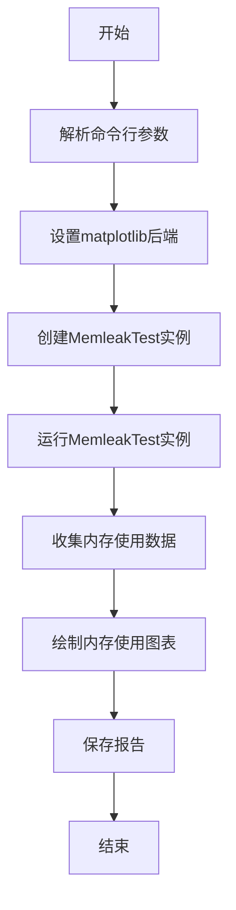
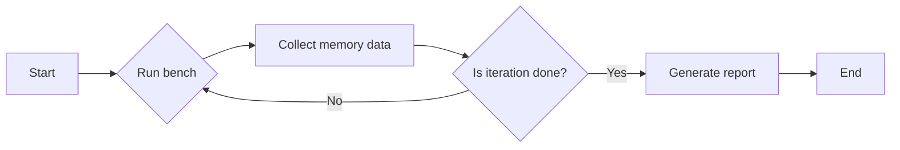
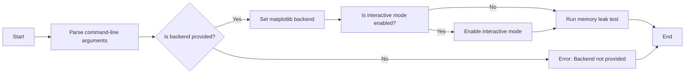
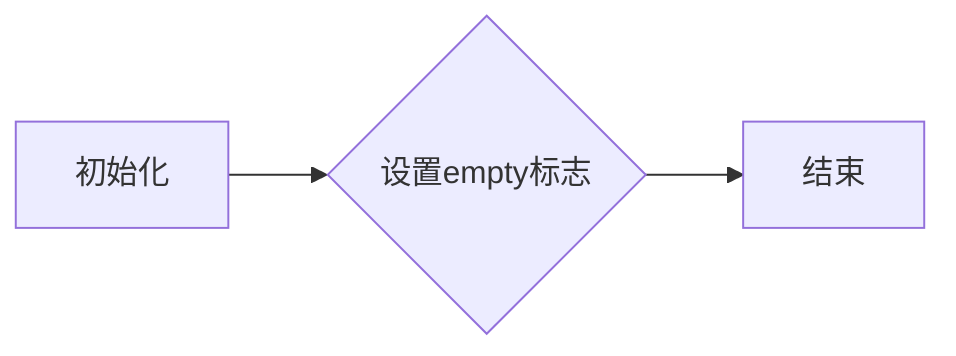
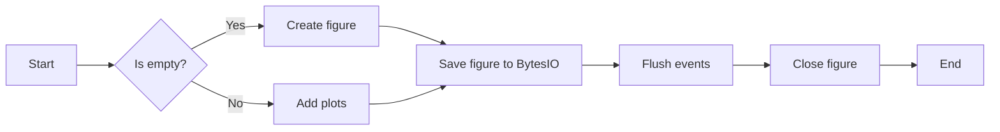

# `matplotlib\tools\memleak.py` 详细设计文档

This script is designed to test for memory leaks in a Python application by running a specified benchmark function multiple times and tracking memory usage over time.

## 整体流程



## 类结构

```
MemleakTest (测试类)
├── matplotlib.pyplot (绘图库)
```

## 全局变量及字段


### `bench`
    
The function to be tested for memory leaks.

类型：`function`
    


### `iterations`
    
The number of iterations to run the memory leak test.

类型：`int`
    


### `report`
    
The filename to save the report of the memory leak test.

类型：`str`
    


### `empty`
    
Flag to indicate whether to plot any content or not.

类型：`bool`
    


### `interactive`
    
Flag to indicate whether to turn on interactive mode for plotting.

类型：`bool`
    


### `MemleakTest.empty`
    
Flag to indicate whether to plot any content or not.

类型：`bool`
    
    

## 全局函数及方法


### run_memleak_test

This function runs a memory leak test by executing a given benchmark function multiple times, collecting memory usage data, and generating a report.

参数：

- `bench`：`function`，The benchmark function to be executed.
- `iterations`：`int`，The number of times to execute the benchmark function.
- `report`：`str`，The filename to save the report.

返回值：`None`，This function does not return a value.

#### 流程图



#### 带注释源码

```python
def run_memleak_test(bench, iterations, report):
    tracemalloc.start()

    starti = min(50, iterations // 2)
    endi = iterations

    malloc_arr = np.empty(endi, dtype=np.int64)
    rss_arr = np.empty(endi, dtype=np.int64)
    rss_peaks = np.empty(endi, dtype=np.int64)
    nobjs_arr = np.empty(endi, dtype=np.int64)
    garbage_arr = np.empty(endi, dtype=np.int64)
    open_files_arr = np.empty(endi, dtype=np.int64)
    rss_peak = 0

    p = psutil.Process()

    for i in range(endi):
        bench()

        gc.collect()

        rss = p.memory_info().rss
        malloc, peak = tracemalloc.get_traced_memory()
        nobjs = len(gc.get_objects())
        garbage = len(gc.garbage)
        open_files = len(p.open_files())
        print(f"{i: 4d}: pymalloc {malloc: 10d}, rss {rss: 10d}, "
              f"nobjs {nobjs: 10d}, garbage {garbage: 4d}, "
              f"files: {open_files: 4d}")
        if i == starti:
            print(f'{" warmup done ":-^86s}')
        malloc_arr[i] = malloc
        rss_arr[i] = rss
        if rss > rss_peak:
            rss_peak = rss
        rss_peaks[i] = rss_peak
        nobjs_arr[i] = nobjs
        garbage_arr[i] = garbage
        open_files_arr[i] = open_files

    print('Average memory consumed per loop: {:1.4f} bytes\n'.format(
        np.sum(rss_peaks[starti+1:] - rss_peaks[starti:-1]) / (endi - starti)))

    from matplotlib import pyplot as plt
    from matplotlib.ticker import EngFormatter
    bytes_formatter = EngFormatter(unit='B')
    fig, (ax1, ax2, ax3) = plt.subplots(3)
    for ax in (ax1, ax2, ax3):
        ax.axvline(starti, linestyle='--', color='k')
    ax1b = ax1.twinx()
    ax1b.yaxis.set_major_formatter(bytes_formatter)
    ax1.plot(malloc_arr, 'C0')
    ax1b.plot(rss_arr, 'C1', label='rss')
    ax1b.plot(rss_peaks, 'C1', linestyle='--', label='rss max')
    ax1.set_ylabel('pymalloc', color='C0')
    ax1b.set_ylabel('rss', color='C1')
    ax1b.legend()

    ax2b = ax2.twinx()
    ax2.plot(nobjs_arr, 'C0')
    ax2b.plot(garbage_arr, 'C1')
    ax2.set_ylabel('total objects', color='C0')
    ax2b.set_ylabel('garbage objects', color='C1')

    ax3.plot(open_files_arr)
    ax3.set_ylabel('open file handles')

    if not report.endswith('.pdf'):
        report = report + '.pdf'
    fig.tight_layout()
    fig.savefig(report, format='pdf')
```


### main

The main function is the entry point of the script, which parses command-line arguments and runs the memory leak test.

参数：

- `backend`：`str`，The backend to test for memory leaks.
- `iterations`：`int`，The number of iterations to run the memory leak test.
- `report`：`str`，The filename to save the report of the memory leak test.
- `--empty`：`bool`，Whether to run the test without plotting any content.
- `--interactive`：`bool`，Whether to turn on interactive mode to actually open windows.

返回值：`None`，The main function does not return a value.

#### 流程图



#### 带注释源码

```python
if __name__ == '__main__':
    import argparse

    parser = argparse.ArgumentParser('Run memory leak tests')
    parser.add_argument('backend', type=str, nargs=1,
                        help='backend to test')
    parser.add_argument('iterations', type=int, nargs=1,
                        help='number of iterations')
    parser.add_argument('report', type=str, nargs=1,
                        help='filename to save report')
    parser.add_argument('--empty', action='store_true',
                        help="Don't plot any content, just test creating "
                        "and destroying figures")
    parser.add_argument('--interactive', action='store_true',
                        help="Turn on interactive mode to actually open "
                        "windows.  Only works with some GUI backends.")

    args = parser.parse_args()

    import matplotlib
    matplotlib.use(args.backend[0])

    if args.interactive:
        import matplotlib.pyplot as plt
        plt.ion()

    run_memleak_test(
        MemleakTest(args.empty), args.iterations[0], args.report[0])
```


### MemleakTest.__init__

初始化MemleakTest类实例，设置是否绘制图形的标志。

参数：

- `empty`：`bool`，如果为True，则不绘制任何内容，仅测试创建和销毁图形。

返回值：无

#### 流程图



#### 带注释源码

```python
def __init__(self, empty):
    # 初始化MemleakTest类实例
    self.empty = empty  # 设置是否绘制图形的标志
```


### MemleakTest.__call__

This method is used to perform a memory leak test by creating and destroying matplotlib figures.

参数：

- `self`：`MemleakTest`对象，表示当前实例
- `empty`：`bool`，表示是否创建内容

返回值：`None`，没有返回值

#### 流程图



#### 带注释源码

```python
def __call__(self):
    import matplotlib.pyplot as plt

    fig = plt.figure(1)

    if not self.empty:
        t1 = np.arange(0.0, 2.0, 0.01)
        y1 = np.sin(2 * np.pi * t1)
        y2 = np.random.rand(len(t1))
        X = np.random.rand(50, 50)

        ax = fig.add_subplot(221)
        ax.plot(t1, y1, '-')
        ax.plot(t1, y2, 's')

        ax = fig.add_subplot(222)
        ax.imshow(X)

        ax = fig.add_subplot(223)
        ax.scatter(np.random.rand(50), np.random.rand(50),
                   s=100 * np.random.rand(50), c=np.random.rand(50))

        ax = fig.add_subplot(224)
        ax.pcolor(10 * np.random.rand(50, 50))

    fig.savefig(BytesIO(), dpi=75)
    fig.canvas.flush_events()
    plt.close(1)
```


## 关键组件


### 张量索引与惰性加载

张量索引与惰性加载是代码中用于处理大型数据集的机制，它允许在需要时才计算数据，从而减少内存消耗和提高性能。

### 反量化支持

反量化支持是代码中用于处理量化数据的一种机制，它允许在量化前后进行数据转换，确保数据的准确性和一致性。

### 量化策略

量化策略是代码中用于优化模型性能的一种技术，它通过减少模型中使用的数值范围来减少模型大小和计算量。


## 问题及建议


### 已知问题

-   **全局状态管理**：代码中使用了全局变量和全局函数，这可能导致代码难以维护和测试。例如，`matplotlib` 的使用和配置在全局范围内进行，这可能会与其他模块或测试冲突。
-   **异常处理**：代码中没有明确的异常处理机制，如果出现错误，可能会导致程序崩溃或产生不可预测的行为。
-   **资源管理**：代码中使用了 `psutil` 和 `matplotlib`，但没有显式地管理这些资源的释放，可能会造成资源泄漏。
-   **代码重复**：`run_memleak_test` 函数中存在重复的代码，例如打印输出和内存信息的收集，这可以通过提取公共函数来优化。

### 优化建议

-   **模块化**：将全局变量和全局函数封装到类或模块中，以减少全局状态的影响，并提高代码的可维护性。
-   **异常处理**：添加异常处理来捕获和处理可能发生的错误，例如使用 `try-except` 块来捕获 `ImportError` 和其他潜在的错误。
-   **资源管理**：确保所有资源在使用后都被正确释放，例如使用 `with` 语句来管理文件和图形资源。
-   **代码重构**：提取重复的代码到单独的函数中，以减少代码冗余并提高代码的可读性。
-   **测试**：编写单元测试来验证代码的功能，并确保在修改代码时不会引入新的错误。
-   **性能优化**：考虑使用更高效的数据结构和算法来提高代码的性能，例如使用 `array` 而不是列表来存储数据。
-   **文档**：为代码添加详细的文档，包括函数和类的说明，以及如何使用该代码的指南。


## 其它


### 设计目标与约束

- 设计目标：
  - 实现一个内存泄漏测试工具，用于检测和报告Python程序中的内存泄漏。
  - 提供一个用户友好的命令行界面，允许用户指定测试参数和报告文件。
  - 使用matplotlib库生成内存泄漏报告，包括内存分配、RSS、对象数量、垃圾对象和打开的文件句柄等信息。

- 约束：
  - 必须使用psutil库来获取进程内存信息。
  - 必须使用matplotlib库来生成报告。
  - 必须遵循Python 3的语法和标准库。

### 错误处理与异常设计

- 错误处理：
  - 如果psutil库不可用，则抛出ImportError异常。
  - 如果matplotlib库不可用，则抛出ImportError异常。
  - 如果无法解析命令行参数，则抛出ArgumentError异常。

- 异常设计：
  - 使用try-except块捕获和处理可能发生的异常。
  - 提供清晰的错误消息，帮助用户了解问题所在。

### 数据流与状态机

- 数据流：
  - 用户通过命令行界面输入测试参数。
  - 程序读取参数并执行内存泄漏测试。
  - 测试结果通过matplotlib库生成报告。

- 状态机：
  - 程序从初始化状态开始，读取参数，执行测试，生成报告，最后退出。

### 外部依赖与接口契约

- 外部依赖：
  - psutil库：用于获取进程内存信息。
  - matplotlib库：用于生成内存泄漏报告。

- 接口契约：
  - `run_memleak_test`函数接受一个测试函数、迭代次数和报告文件名作为参数。
  - `MemleakTest`类接受一个布尔值参数，用于控制是否绘制内容。
  - `argparse`库用于解析命令行参数。


    