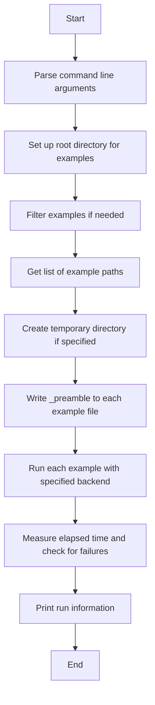
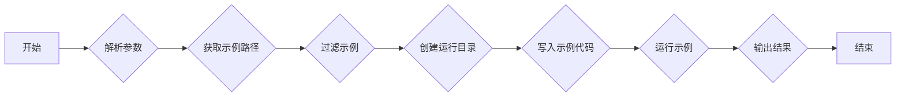
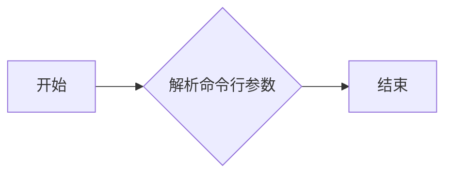
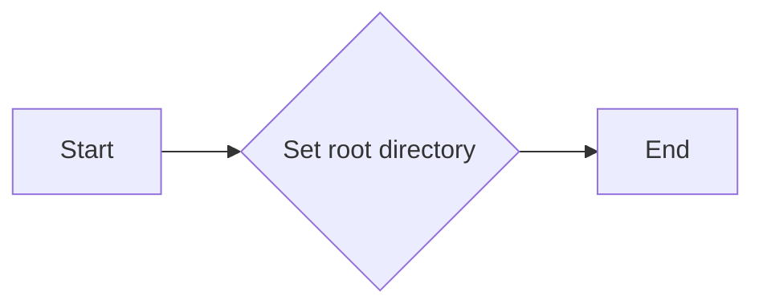
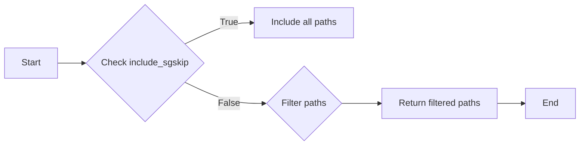
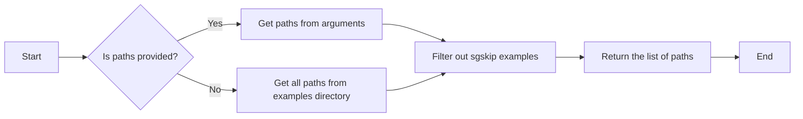
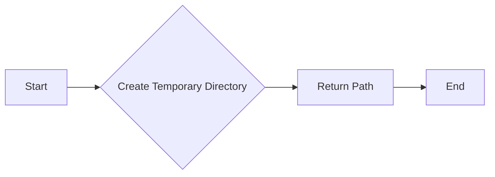
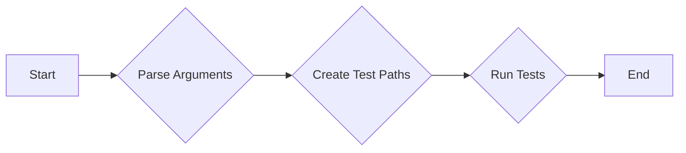
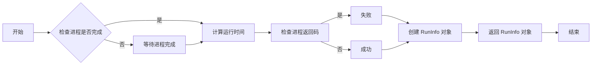
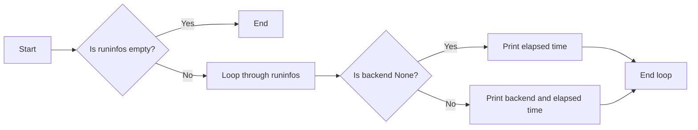

# `matplotlib\tools\run_examples.py` 详细设计文档

This code runs and times selected examples from a specified directory, using a specified backend and filtering out certain examples if needed.

## 整体流程



## 类结构

```
RunInfo (Class)
├── main (Function)
```

## 全局变量及字段


### `_preamble`
    
A string containing the code to be prepended to the test files.

类型：`str`
    


### `root`
    
The root directory containing the examples.

类型：`pathlib.Path`
    


### `paths`
    
A list of paths to the examples to be run.

类型：`list of pathlib.Path`
    


### `relpaths`
    
A list of relative paths to the examples to be run.

类型：`list of str`
    


### `width`
    
The maximum width of the relative paths for formatting purposes.

类型：`int`
    


### `runinfos`
    
A list of RunInfo objects containing the run information for each example.

类型：`list of RunInfo`
    


### `cwd`
    
The current working directory where the tests are run.

类型：`pathlib.Path`
    


### `env`
    
A dictionary containing the environment variables for the subprocess.

类型：`dict`
    


### `start`
    
The start time of the test in seconds since the epoch.

类型：`float`
    


### `proc`
    
The subprocess object representing the running test process.

类型：`subprocess.Popen`
    


### `elapsed`
    
The elapsed time in milliseconds for the test to complete.

类型：`int`
    


### `RunInfo.backend`
    
The backend used for the test.

类型：`str`
    


### `RunInfo.elapsed`
    
The elapsed time in milliseconds for the test to complete.

类型：`int`
    


### `RunInfo.failed`
    
A boolean indicating whether the test failed or not.

类型：`bool`
    
    

## 全局函数及方法


### main()

运行并计时一些或所有示例。

参数：

- `--backend`: `action="append"`，指定要测试的后端；可以多次传递；默认为默认后端
- `--include-sgskip`: `action="store_true"`，不过滤掉`*_sgskip.py`示例
- `--rundir`: `type=Path`，从哪里运行测试的目录；默认为临时目录
- `paths`: `nargs="*"`，要运行的示例；默认为所有示例（除了`*_sgskip.py`）

返回值：无

#### 流程图



#### 带注释源码

```python
def main():
    parser = ArgumentParser(description=__doc__)
    parser.add_argument(
        "--backend", action="append",
        help=("backend to test; can be passed multiple times; defaults to the "
              "default backend"))
    parser.add_argument(
        "--include-sgskip", action="store_true",
        help="do not filter out *_sgskip.py examples")
    parser.add_argument(
        "--rundir", type=Path,
        help=("directory from where the tests are run; defaults to a "
              "temporary directory"))
    parser.add_argument(
        "paths", nargs="*", type=Path,
        help="examples to run; defaults to all examples (except *_sgskip.py)")
    args = parser.parse_args()

    root = Path(__file__).resolve().parent.parent / "examples"
    paths = args.paths if args.paths else sorted(root.glob("**/*.py"))
    if not args.include_sgskip:
        paths = [path for path in paths if not path.stem.endswith("sgskip")]
    relpaths = [path.resolve().relative_to(root) for path in paths]
    width = max(len(str(relpath)) for relpath in relpaths)
    for relpath in relpaths:
        print(str(relpath).ljust(width + 1), end="", flush=True)
        runinfos = []
        with ExitStack() as stack:
            if args.rundir:
                cwd = args.rundir / relpath.with_suffix("")
                cwd.mkdir(parents=True)
            else:
                cwd = stack.enter_context(TemporaryDirectory())
            with tokenize.open(root / relpath) as src:
                Path(cwd, relpath.name).write_text(
                    _preamble + src.read(), encoding="utf-8")
            for backend in args.backend or [None]:
                env = {**os.environ}
                if backend is not None:
                    env["MPLBACKEND"] = backend
                start = time.perf_counter()
                proc = subprocess.run([sys.executable, relpath.name],
                                      cwd=cwd, env=env)
                elapsed = round(1000 * (time.perf_counter() - start))
                runinfos.append(RunInfo(backend, elapsed, proc.returncode))
        print("\t".join(map(str, runinfos)))
```


### parse_command_line_arguments

该函数用于解析命令行参数。

参数：

- `args`：`Namespace`，包含解析后的命令行参数

返回值：无

#### 流程图



#### 带注释源码

```python
def main():
    parser = ArgumentParser(description=__doc__)
    parser.add_argument(
        "--backend", action="append",
        help=("backend to test; can be passed multiple times; defaults to the "
              "default backend"))
    parser.add_argument(
        "--include-sgskip", action="store_true",
        help="do not filter out *_sgskip.py examples")
    parser.add_argument(
        "--rundir", type=Path,
        help=("directory from where the tests are run; defaults to a "
              "temporary directory"))
    parser.add_argument(
        "paths", nargs="*", type=Path,
        help="examples to run; defaults to all examples (except *_sgskip.py)")
    args = parser.parse_args()
```


### set_up_root_directory

该函数用于设置根目录路径。

参数：

- `root`：`Path`，指定根目录路径。

返回值：无

#### 流程图



#### 带注释源码

```python
def set_up_root_directory(root):
    # Set the root directory path
    root = Path(root)
    # Return the root directory path
    return root
```


### filter_examples

This function is not explicitly defined in the provided code snippet, but it seems to be a hypothetical function that could be used to filter out examples based on certain criteria, such as excluding those with a specific suffix.

参数：

- `paths`：`Path`，A list of example paths to be filtered.
- `include_sgskip`：`bool`，A flag indicating whether to include examples with the `_sgskip.py` suffix.

返回值：`List[Path]`，A filtered list of example paths.

#### 流程图



#### 带注释源码

```python
# Hypothetical implementation of filter_examples
def filter_examples(paths, include_sgskip):
    # If include_sgskip is True, include all paths
    if include_sgskip:
        return paths
    
    # Otherwise, filter out paths with '_sgskip.py' suffix
    return [path for path in paths if not path.stem.endswith("sgskip")]
```


### get_list_of_example_paths

获取要运行的示例路径列表。

参数：

- `paths`：`Path`，指定要运行的示例路径，默认为所有示例（除了`*_sgskip.py`）。

返回值：`List[Path]`，返回一个包含示例路径的列表。

#### 流程图



#### 带注释源码

```python
paths = args.paths if args.paths else sorted(root.glob("**/*.py"))
```


### create_temporary_directory

创建一个临时目录，并在退出时自动删除。

参数：

- `prefix`：`str`，用于生成临时目录的名称前缀。
- `suffix`：`str`，用于生成临时目录的名称后缀。

返回值：`Path`，临时目录的路径。

#### 流程图



#### 带注释源码

```python
from tempfile import TemporaryDirectory
import pathlib

def create_temporary_directory(prefix: str = "", suffix: str = "") -> pathlib.Path:
    with TemporaryDirectory(prefix=prefix, suffix=suffix) as temp_dir:
        temp_path = pathlib.Path(temp_dir)
    return temp_path
```


### write_preamble_to_each_example_file

This function writes the preamble code to each example file before running it.

参数：

- `src`: `Path`，The source file path to write the preamble to.
- `_preamble`: `str`，The string containing the preamble code to be written.

返回值：`None`，This function does not return a value.

#### 流程图


#### 带注释源码

```python
from pathlib import Path

_preamble = """\
from matplotlib import pyplot as plt

def pseudo_show(block=True):
    for num in plt.get_fignums():
        plt.figure(num).savefig(f"{num}")

plt.show = pseudo_show
"""

def write_preamble_to_each_example_file(src, _preamble):
    with tokenize.open(src) as f:
        Path(src).write_text(_preamble + f.read(), encoding="utf-8")
```


### run_each_example_with_specified_backend

This function runs each example with a specified backend and times the execution.

参数：

- `backend`: `str`，The backend to use for the test. If `None`, the default backend is used.
- `include_sgskip`: `bool`，Whether to include `_sgskip.py` examples in the test.
- `rundir`: `Path`，The directory from where the tests are run. Defaults to a temporary directory.
- `paths`: `list of Path`，The examples to run. Defaults to all examples (except `_sgskip.py`).

返回值：`None`，This function does not return a value.

#### 流程图



#### 带注释源码

```python
def main():
    # ... (other code)
    paths = args.paths if args.paths else sorted(root.glob("**/*.py"))
    if not args.include_sgskip:
        paths = [path for path in paths if not path.stem.endswith("sgskip")]
    relpaths = [path.resolve().relative_to(root) for path in paths]
    width = max(len(str(relpath)) for relpath in relpaths)
    for relpath in relpaths:
        # ... (other code)
        with ExitStack() as stack:
            if args.rundir:
                cwd = args.rundir / relpath.with_suffix("")
                cwd.mkdir(parents=True)
            else:
                cwd = stack.enter_context(TemporaryDirectory())
            with tokenize.open(root / relpath) as src:
                Path(cwd, relpath.name).write_text(
                    _preamble + src.read(), encoding="utf-8")
            for backend in args.backend or [None]:
                env = {**os.environ}
                if backend is not None:
                    env["MPLBACKEND"] = backend
                start = time.perf_counter()
                proc = subprocess.run([sys.executable, relpath.name],
                                      cwd=cwd, env=env)
                elapsed = round(1000 * (time.perf_counter() - start))
                runinfos.append(RunInfo(backend, elapsed, proc.returncode))
        # ... (other code)
```


### measure_elapsed_time_and_check_for_failures

该函数运行测试并记录所需时间和检查是否有失败。

参数：

- `proc`：`subprocess.Popen`，表示正在运行的子进程
- `backend`：`str`，表示使用的图形后端

返回值：`RunInfo`，包含后端名称、运行时间和是否失败的信息

#### 流程图



#### 带注释源码

```python
def measure_elapsed_time_and_check_for_failures(proc, backend):
    start = time.perf_counter()
    # 等待进程完成
    proc.wait()
    elapsed = round(1000 * (time.perf_counter() - start))
    # 检查进程返回码
    if proc.returncode:
        return RunInfo(backend, elapsed, True)
    else:
        return RunInfo(backend, elapsed, False)
``` 


### print_run_information

This function prints the run information for each example, including the backend used, the elapsed time, and whether the example failed.

参数：

- `runinfos`：`list`，A list of `RunInfo` objects containing the run information for each example.

返回值：`None`，This function does not return a value.

#### 流程图



#### 带注释源码

```python
def main():
    # ... (other code)
    print("\t".join(map(str, runinfos)))
    # ...
```


### RunInfo.__init__

初始化`RunInfo`类实例，设置后端名称、运行时间和失败状态。

参数：

- `backend`：`str`，后端名称，如果未指定则为`None`。
- `elapsed`：`float`，运行时间（以毫秒为单位）。
- `failed`：`bool`，是否失败。

返回值：无

#### 流程图

```mermaid
classDiagram
    RunInfo <|-- backend: str
    RunInfo <|-- elapsed: float
    RunInfo <|-- failed: bool
    RunInfo {
        +__init__(backend: str, elapsed: float, failed: bool)
    }
```

#### 带注释源码

```python
class RunInfo:
    def __init__(self, backend, elapsed, failed):
        # 设置后端名称
        self.backend = backend
        # 设置运行时间
        self.elapsed = elapsed
        # 设置失败状态
        self.failed = failed
``` 


### RunInfo.__str__

This method returns a string representation of the RunInfo object, which includes the backend used, the elapsed time in milliseconds, and a status indicating if the run failed.

参数：

- `self`：`RunInfo`，The instance of the RunInfo class itself.

返回值：`str`，A string representation of the RunInfo object.

#### 流程图

```mermaid
graph LR
A[Start] --> B{Check backend}
B -->|Yes| C[Concatenate backend and elapsed time]
B -->|No| C[Concatenate only elapsed time]
C --> D{Check failed status}
D -->|Yes| E[Concatenate " (failed!)" to string]
D -->|No| E[Do not add " (failed!)" to string]
E --> F[Return string]
```

#### 带注释源码

```python
def __str__(self):
    s = ""
    if self.backend:
        s += f"{self.backend}: "
    s += f"{self.elapsed}ms"
    if self.failed:
        s += " (failed!)"
    return s
```

## 关键组件


### 张量索引与惰性加载

支持对张量进行索引操作，并实现惰性加载机制，以优化内存使用和计算效率。

### 反量化支持

提供反量化功能，允许在量化过程中对张量进行反量化处理，以保持精度。

### 量化策略

实现多种量化策略，包括全局量化、局部量化等，以适应不同的应用场景。


## 问题及建议


### 已知问题

-   **环境变量管理**: 代码中使用了`os.environ`来创建新的环境变量，这可能导致环境变量污染，尤其是在多线程或分布式环境中。建议使用更细粒度的环境变量管理，例如使用`os.environ.copy()`来创建环境变量的副本。
-   **异常处理**: 代码中没有明确的异常处理机制。在执行子进程时，如果发生错误，可能会导致程序崩溃。建议添加异常处理来捕获和处理可能发生的异常。
-   **资源管理**: 使用`ExitStack`来管理临时目录的创建和销毁是好的做法，但代码中没有处理其他可能的资源泄漏，如文件句柄或网络连接。
-   **代码重复**: 在处理每个测试用例时，代码中存在重复的字符串操作和格式化。建议使用函数或类来减少代码重复。
-   **性能**: 对于大量的测试用例，代码可能需要较长时间来执行。可以考虑使用并行处理或异步执行来提高性能。

### 优化建议

-   **环境变量管理**: 使用`os.environ.copy()`来创建环境变量的副本，并仅在必要时修改副本。
-   **异常处理**: 在执行子进程时添加`try-except`块来捕获`subprocess.CalledProcessError`异常，并适当处理。
-   **资源管理**: 确保所有打开的资源（如文件、网络连接）在使用完毕后都得到正确关闭。
-   **代码重复**: 创建一个函数或类来处理测试用例的运行和结果收集，以减少代码重复。
-   **性能**: 考虑使用`concurrent.futures`模块中的`ThreadPoolExecutor`或`ProcessPoolExecutor`来并行执行测试用例，以提高性能。


## 其它


### 设计目标与约束

- 设计目标：
  - 确保代码能够高效地运行测试用例。
  - 提供灵活的测试配置选项，如后端选择、测试目录和测试用例过滤。
  - 确保测试结果能够准确反映测试用例的执行情况。

- 约束：
  - 代码应遵循Python编程规范。
  - 代码应兼容Python 3.x版本。
  - 代码应避免使用外部依赖，除非必要。

### 错误处理与异常设计

- 错误处理：
  - 当测试用例执行失败时，应记录失败信息。
  - 当遇到不可恢复的错误时，应优雅地终止程序并输出错误信息。

- 异常设计：
  - 使用try-except语句捕获和处理可能发生的异常。
  - 定义自定义异常类，以便更清晰地表示特定的错误情况。

### 数据流与状态机

- 数据流：
  - 输入：测试用例路径、后端选择、测试目录等。
  - 处理：执行测试用例、记录执行时间、处理失败情况。
  - 输出：测试结果列表。

- 状态机：
  - 初始化：解析命令行参数、设置测试环境。
  - 执行：运行测试用例、收集结果。
  - 输出：显示测试结果。

### 外部依赖与接口契约

- 外部依赖：
  - matplotlib：用于生成测试结果图表。
  - subprocess：用于执行测试用例。
  - tokenize：用于读取和解析Python源代码。

- 接口契约：
  - main函数：负责解析命令行参数、设置测试环境、执行测试用例和输出结果。
  - RunInfo类：用于存储测试用例的执行信息。
  - ArgumentParser：用于解析命令行参数。
  - TemporaryDirectory：用于创建临时目录。
  - Path：用于处理文件路径。


    