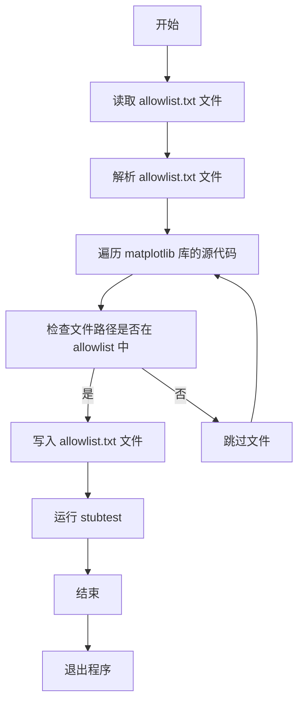
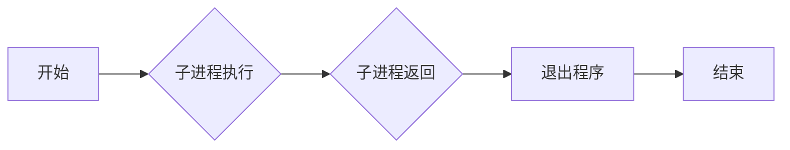
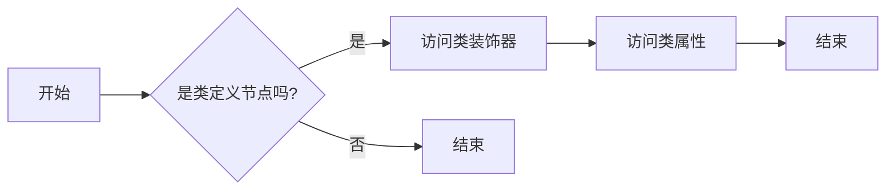
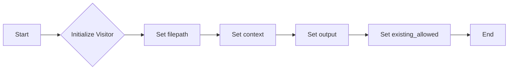
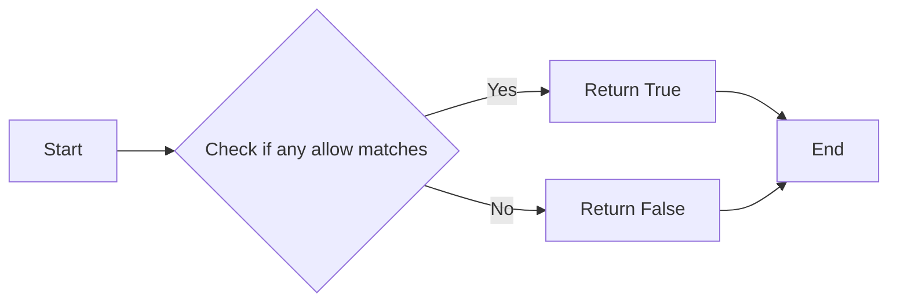

# `matplotlib\tools\stubtest.py` 详细设计文档

The code generates an allowlist for the stubtest tool used in the continuous integration process of the matplotlib library. It scans the source code for specific patterns and generates a list of allowed paths for stub generation.

## 整体流程



## 类结构

```
Visitor (类)
├── _is_already_allowed (方法)
│   ├── parts (列表)
│   └── allow (列表)
├── visit_FunctionDef (方法)
│   ├── node (ast.FunctionDef)
│   └── decorator_list (列表)
├── visit_ClassDef (方法)
│   ├── node (ast.ClassDef)
│   └── decorator_list (列表)
└── ... (其他方法)
```

## 全局变量及字段


### `root`
    
The root directory of the project.

类型：`pathlib.Path`
    


### `lib`
    
The 'lib' directory within the project root.

类型：`pathlib.Path`
    


### `mpl`
    
The 'matplotlib' directory within the 'lib' directory.

类型：`pathlib.Path`
    


### `existing_allowed`
    
A list of compiled regular expressions for allowed paths.

类型：`list`
    


### `d`
    
A temporary directory created for the allowlist file.

类型：`pathlib.Path`
    


### `p`
    
The path to the allowlist file within the temporary directory.

类型：`pathlib.Path`
    


### `tree`
    
The abstract syntax tree of the Python file being processed.

类型：`ast.Module`
    


### `proc`
    
The subprocess object representing the stubtest command being run.

类型：`subprocess.Popen`
    


### `sys`
    
The sys module, providing access to some variables used or maintained by the interpreter and to functions that interact strongly with the interpreter.

类型：`sys`
    


### `Visitor.filepath`
    
The file path of the Python file being visited.

类型：`pathlib.Path`
    


### `Visitor.context`
    
The context path of the file relative to the 'lib' directory.

类型：`list`
    


### `Visitor.output`
    
The output file where the paths to be allowed are written.

类型：`file`
    


### `Visitor.existing_allowed`
    
A list of compiled regular expressions for allowed paths, used to determine if a path should be skipped.

类型：`list`
    
    

## 全局函数及方法


### Visitor.visit_FunctionDef

该函数是`Visitor`类的一个方法，用于访问AST（抽象语法树）中的函数定义节点。

参数：

- `node`：`ast.FunctionDef`，表示当前访问的函数定义节点。

返回值：无

#### 流程图

```mermaid
graph LR
A[Start] --> B{Is decorator "delete_parameter"?}
B -- Yes --> C[Write function path to output]
B -- No --> D[End]
C --> E[End]
```

#### 带注释源码

```python
def visit_FunctionDef(self, node):
    # delete_parameter adds a private sentinel value that leaks
    # we do not want that sentinel value in the type hints but it breaks typing
    # Does not apply to variadic arguments (args/kwargs)
    for dec in node.decorator_list:
        if "delete_parameter" in ast.unparse(dec):
            deprecated_arg = dec.args[1].value
            if (
                node.args.vararg is not None
                and node.args.vararg.arg == deprecated_arg
            ):
                continue
            if (
                node.args.kwarg is not None
                and node.args.kwarg.arg == deprecated_arg
            ):
                continue

            parents = []
            if hasattr(node, "parent"):
                parent = node.parent
                while hasattr(parent, "parent") and not isinstance(
                    parent, ast.Module
                ):
                    parents.insert(0, parent.name)
                    parent = parent.parent
            parts = [*self.context, *parents, node.name]
            if not self._is_already_allowed(parts):
                self.output.write("\\.".join(parts) + "\n")
            break
```


### Visitor.visit_FunctionDef

该函数是`Visitor`类的一个方法，用于访问AST（抽象语法树）中的函数定义节点。

参数：

- `node`：`ast.FunctionDef`，表示当前访问的函数定义节点。

返回值：无

#### 流程图

```mermaid
graph LR
A[Start] --> B{Is decorator "delete_parameter"?}
B -- Yes --> C[Write function name]
B -- No --> D[End]
C --> E[End]
```

#### 带注释源码

```python
def visit_FunctionDef(self, node):
    # delete_parameter adds a private sentinel value that leaks
    # we do not want that sentinel value in the type hints but it breaks typing
    # Does not apply to variadic arguments (args/kwargs)
    for dec in node.decorator_list:
        if "delete_parameter" in ast.unparse(dec):
            deprecated_arg = dec.args[1].value
            if (
                node.args.vararg is not None
                and node.args.vararg.arg == deprecated_arg
            ):
                continue
            if (
                node.args.kwarg is not None
                and node.args.kwarg.arg == deprecated_arg
            ):
                continue

            parents = []
            if hasattr(node, "parent"):
                parent = node.parent
                while hasattr(parent, "parent") and not isinstance(
                    parent, ast.Module
                ):
                    parents.insert(0, parent.name)
                    parent = parent.parent
            parts = [*self.context, *parents, node.name]
            if not self._is_already_allowed(parts):
                self.output.write("\\.".join(parts) + "\n")
            break
```


### Visitor.visit_FunctionDef

该函数是`Visitor`类的一个方法，用于访问AST（抽象语法树）中的函数定义节点。

参数：

- `node`：`ast.FunctionDef`，表示当前访问的函数定义节点。

返回值：无

#### 流程图

```mermaid
graph LR
A[Start] --> B{Is decorator "delete_parameter"?}
B -- Yes --> C[Write function path to output]
B -- No --> D[End]
C --> E[End]
```

#### 带注释源码

```python
def visit_FunctionDef(self, node):
    # delete_parameter adds a private sentinel value that leaks
    # we do not want that sentinel value in the type hints but it breaks typing
    # Does not apply to variadic arguments (args/kwargs)
    for dec in node.decorator_list:
        if "delete_parameter" in ast.unparse(dec):
            deprecated_arg = dec.args[1].value
            if (
                node.args.vararg is not None
                and node.args.vararg.arg == deprecated_arg
            ):
                continue
            if (
                node.args.kwarg is not None
                and node.args.kwarg.arg == deprecated_arg
            ):
                continue

            parents = []
            if hasattr(node, "parent"):
                parent = node.parent
                while hasattr(parent, "parent") and not isinstance(
                    parent, ast.Module
                ):
                    parents.insert(0, parent.name)
                    parent = parent.parent
            parts = [*self.context, *parents, node.name]
            if not self._is_already_allowed(parts):
                self.output.write("\\.".join(parts) + "\n")
            break
```


### Visitor.visit_FunctionDef

该函数是`Visitor`类的一个方法，用于访问AST（抽象语法树）中的函数定义节点，并处理特定的装饰器。

参数：

- `node`：`ast.FunctionDef`，表示当前访问的函数定义节点。

返回值：无

#### 流程图

```mermaid
graph LR
A[Start] --> B{Is decorator "delete_parameter"?}
B -- Yes --> C[Write function path to output]
B -- No --> D[End]
C --> E[End]
```

#### 带注释源码

```python
def visit_FunctionDef(self, node):
    # delete_parameter adds a private sentinel value that leaks
    # we do not want that sentinel value in the type hints but it breaks typing
    # Does not apply to variadic arguments (args/kwargs)
    for dec in node.decorator_list:
        if "delete_parameter" in ast.unparse(dec):
            deprecated_arg = dec.args[1].value
            if (
                node.args.vararg is not None
                and node.args.vararg.arg == deprecated_arg
            ):
                continue
            if (
                node.args.kwarg is not None
                and node.args.kwarg.arg == deprecated_arg
            ):
                continue

            parents = []
            if hasattr(node, "parent"):
                parent = node.parent
                while hasattr(parent, "parent") and not isinstance(
                    parent, ast.Module
                ):
                    parents.insert(0, parent.name)
                    parent = parent.parent
            parts = [*self.context, *parents, node.name]
            if not self._is_already_allowed(parts):
                self.output.write("\\.".join(parts) + "\n")
            break
```


### sys.exit(proc.returncode)

退出程序，返回子进程的返回码。

参数：

- `proc.returncode`：`int`，子进程的返回码。如果子进程成功执行，则返回码为0；如果子进程失败，则返回非0值。

返回值：无

#### 流程图



#### 带注释源码

```python
sys.exit(proc.returncode)
```


### Visitor.visit_ClassDef

该函数是`Visitor`类的一个方法，用于访问AST（抽象语法树）中的类定义节点。

参数：

- `node`：`ast.ClassDef`，表示正在访问的类定义节点。

返回值：无

#### 流程图



#### 带注释源码

```python
def visit_ClassDef(self, node):
    for dec in node.decorator_list:
        if "define_aliases" in ast.unparse(dec):
            parents = []
            if hasattr(node, "parent"):
                parent = node.parent
                while hasattr(parent, "parent") and not isinstance(parent, ast.Module):
                    parents.insert(0, parent.name)
                    parent = parent.parent
            aliases = ast.literal_eval(dec.args[0])
            # Written as a regex rather than two lines to avoid unused entries
            # for setters on items with only a getter
            for substitutions in aliases.values():
                parts = self.context + parents + [node.name]
                for a in substitutions:
                    if not (self._is_already_allowed([*parts, f"get_{a}"]) and
                            self._is_already_allowed([*parts, f"set_{a}"])):
                        self.output.write("\\.".join([*parts, f"[gs]et_{a}\n"]))
    for child in ast.iter_child_nodes(node):
        self.visit(child)
```


### Visitor.visit_FunctionDef

该函数是`Visitor`类的一个方法，用于访问AST（抽象语法树）中的函数定义节点。

参数：

- `node`：`ast.FunctionDef`，表示当前访问的函数定义节点。

返回值：无

#### 流程图

```mermaid
graph LR
A[Start] --> B{Is decorator "delete_parameter"?}
B -- Yes --> C[Write function path to output]
B -- No --> D[End]
C --> E[End]
```

#### 带注释源码

```python
def visit_FunctionDef(self, node):
    # delete_parameter adds a private sentinel value that leaks
    # we do not want that sentinel value in the type hints but it breaks typing
    # Does not apply to variadic arguments (args/kwargs)
    for dec in node.decorator_list:
        if "delete_parameter" in ast.unparse(dec):
            deprecated_arg = dec.args[1].value
            if (
                node.args.vararg is not None
                and node.args.vararg.arg == deprecated_arg
            ):
                continue
            if (
                node.args.kwarg is not None
                and node.args.kwarg.arg == deprecated_arg
            ):
                continue

            parents = []
            if hasattr(node, "parent"):
                parent = node.parent
                while hasattr(parent, "parent") and not isinstance(
                    parent, ast.Module
                ):
                    parents.insert(0, parent.name)
                    parent = parent.parent
            parts = [*self.context, *parents, node.name]
            if not self._is_already_allowed(parts):
                self.output.write("\\.".join(parts) + "\n")
            break
```


### ast.unparse(dec)

将AST节点转换为字符串表示。

描述：

该函数用于将AST（抽象语法树）节点转换为字符串表示。在代码中，它被用于将装饰器节点转换为字符串，以便进行后续处理。

参数：

- `dec`：`ast.AST`，表示装饰器节点。

返回值：`str`，表示转换后的字符串。

#### 流程图

```mermaid
graph LR
A[ast.unparse(dec)] --> B{转换装饰器}
B --> C[输出字符串]
```

#### 带注释源码

```python
def unparse(node):
    # Implementation of ast.unparse function
    # This is a placeholder as the actual implementation is not shown in the provided code
    pass
```

由于代码中没有提供`ast.unparse`函数的具体实现，以上仅为流程图和描述。实际实现可能包含对AST节点的遍历和字符串构建逻辑。


### literal_eval

该函数用于将字符串解析为Python表达式，并返回表达式的值。

#### 参数

- `dec.args[0]`：`str`，包含别名定义的字符串。
- `substitutions`：`dict`，包含别名替换的字典。

#### 返回值

- `None`：没有返回值，函数用于修改`Visitor`类的方法。

#### 流程图

```mermaid
graph LR
A[开始] --> B{解析dec.args[0]}
B --> C{解析substitutions}
C --> D[结束]
```

#### 带注释源码

```python
def visit_ClassDef(self, node):
    for dec in node.decorator_list:
        if "define_aliases" in ast.unparse(dec):
            parents = []
            if hasattr(node, "parent"):
                parent = node.parent
                while hasattr(parent, "parent") and not isinstance(parent, ast.Module):
                    parents.insert(0, parent.name)
                    parent = parent.parent
            aliases = ast.literal_eval(dec.args[0])
            # Written as a regex rather than two lines to avoid unused entries
            # for setters on items with only a getter
            for substitutions in aliases.values():
                parts = self.context + parents + [node.name]
                for a in substitutions:
                    if not (self._is_already_allowed([*parts, f"get_{a}"]) and
                            self._is_already_allowed([*parts, f"set_{a}"])):
                        self.output.write("\\.".join([*parts, f"[gs]et_{a}\n"]))
        for child in ast.iter_child_nodes(node):
            self.visit(child)
```


### `Visitor.visit_FunctionDef`

This method is a visitor function that is called for each function definition (`FunctionDef`) node in the abstract syntax tree (AST). It checks for the presence of a decorator named `delete_parameter` and, if found, outputs the function's path to the output file.

参数：

- `node`：`ast.FunctionDef`，The function definition node being visited.

返回值：无

#### 流程图

```mermaid
graph LR
A[Start] --> B{Check for "delete_parameter" decorator}
B -- Yes --> C[Output function path]
B -- No --> D[End]
C --> D
```

#### 带注释源码

```python
def visit_FunctionDef(self, node):
    # delete_parameter adds a private sentinel value that leaks
    # we do not want that sentinel value in the type hints but it breaks typing
    # Does not apply to variadic arguments (args/kwargs)
    for dec in node.decorator_list:
        if "delete_parameter" in ast.unparse(dec):
            deprecated_arg = dec.args[1].value
            if (
                node.args.vararg is not None
                and node.args.vararg.arg == deprecated_arg
            ):
                continue
            if (
                node.args.kwarg is not None
                and node.args.kwarg.arg == deprecated_arg
            ):
                continue

            parents = []
            if hasattr(node, "parent"):
                parent = node.parent
                while hasattr(parent, "parent") and not isinstance(
                    parent, ast.Module
                ):
                    parents.insert(0, parent.name)
                    parent = parent.parent
            parts = [*self.context, *parents, node.name]
            if not self._is_already_allowed(parts):
                self.output.write("\\.".join(parts) + "\n")
            break
```


### Visitor.__init__

This method initializes the `Visitor` class, setting up the necessary attributes to traverse and process Python code files.

参数：

- `filepath`：`pathlib.Path`，The path to the Python file to be visited.
- `output`：`file-like object`，The output file where the processed paths will be written.
- `existing_allowed`：`list`，A list of compiled regular expressions representing paths that are already allowed.

返回值：无

#### 流程图



#### 带注释源码

```python
def __init__(self, filepath, output, existing_allowed):
    self.filepath = filepath  # The path to the Python file to be visited
    self.context = list(filepath.with_suffix("").relative_to(lib).parts)  # The relative path context
    self.output = output  # The output file where the processed paths will be written
    self.existing_allowed = existing_allowed  # A list of compiled regular expressions representing paths that are already allowed
```


### Visitor._is_already_allowed

This method checks if a given path is already allowed based on the existing allowed patterns.

参数：

- `parts`：`list`，A list of parts representing the path to be checked.

返回值：`bool`，Returns `True` if the path is already allowed, otherwise `False`.

#### 流程图



#### 带注释源码

```python
def _is_already_allowed(self, parts):
    # Skip outputting a path if it's already allowed before.
    candidates = ['.'.join(parts[:s]) for s in range(1, len(parts))]
    for allow in self.existing_allowed:
        if any(allow.fullmatch(path) for path in candidates):
            return True
    return False
```


### Visitor.visit_FunctionDef

This method is a visitor method within the `Visitor` class that is used to traverse the abstract syntax tree (AST) of Python code. It specifically handles `FunctionDef` nodes, which represent function definitions in the AST.

参数：

- `node`：`ast.FunctionDef`，The AST node representing the function definition to be visited.

返回值：无

#### 流程图

```mermaid
graph LR
A[Start] --> B{Is decorator "delete_parameter"?}
B -- Yes --> C[Check if vararg or kwarg is deprecated]
C -- Yes --> D[Skip]
D --> E[End]
B -- No --> F[Get context and parts]
F --> G{Is already allowed?}
G -- Yes --> H[End]
G -- No --> I[Write to output]
I --> J[End]
```

#### 带注释源码

```python
def visit_FunctionDef(self, node):
    # delete_parameter adds a private sentinel value that leaks
    # we do not want that sentinel value in the type hints but it breaks typing
    # Does not apply to variadic arguments (args/kwargs)
    for dec in node.decorator_list:
        if "delete_parameter" in ast.unparse(dec):
            deprecated_arg = dec.args[1].value
            if (
                node.args.vararg is not None
                and node.args.vararg.arg == deprecated_arg
            ):
                continue
            if (
                node.args.kwarg is not None
                and node.args.kwarg.arg == deprecated_arg
            ):
                continue

            parents = []
            if hasattr(node, "parent"):
                parent = node.parent
                while hasattr(parent, "parent") and not isinstance(
                    parent, ast.Module
                ):
                    parents.insert(0, parent.name)
                    parent = parent.parent
            parts = [*self.context, *parents, node.name]
            if not self._is_already_allowed(parts):
                self.output.write("\\.".join(parts) + "\n")
            break
```


### Visitor.visit_ClassDef

This method is a visitor method that traverses the AST (Abstract Syntax Tree) of a Python file to find class definitions and their associated decorators. It checks for decorators that define aliases and outputs the paths of the classes and their getter/setter methods if they are not already allowed.

参数：

- `node`：`ast.ClassDef`，The class definition node in the AST.

返回值：无

#### 流程图

```mermaid
graph LR
A[Start] --> B{Check for "define_aliases" decorator}
B -- Yes --> C[Extract aliases]
C --> D{Check if getter/setter methods are allowed}
D -- No --> E[Output paths]
E --> F[End]
D -- Yes --> F
B -- No --> F
```

#### 带注释源码

```python
def visit_ClassDef(self, node):
    for dec in node.decorator_list:
        if "define_aliases" in ast.unparse(dec):
            parents = []
            if hasattr(node, "parent"):
                parent = node.parent
                while hasattr(parent, "parent") and not isinstance(parent, ast.Module):
                    parents.insert(0, parent.name)
                    parent = parent.parent
            aliases = ast.literal_eval(dec.args[0])
            for substitutions in aliases.values():
                parts = self.context + parents + [node.name]
                for a in substitutions:
                    if not (self._is_already_allowed([*parts, f"get_{a}"]) and
                            self._is_already_allowed([*parts, f"set_{a}"])):
                        self.output.write("\\.".join([*parts, f"[gs]et_{a}\n"]))
    for child in ast.iter_child_nodes(node):
        self.visit(child)
```


### Visitor.visit_FunctionDef

This method is a visitor method that checks for the presence of a decorator named "delete_parameter" in a function definition. If the decorator is found, it outputs the function's path to the output file, unless the function is already allowed.

参数：

- `node`：`ast.FunctionDef`，The function definition node to visit.

返回值：无

#### 流程图

```mermaid
graph LR
A[Start] --> B{Check for "delete_parameter" decorator}
B -- Yes --> C[Output function path]
B -- No --> D[End]
C --> D
```

#### 带注释源码

```python
def visit_FunctionDef(self, node):
    # delete_parameter adds a private sentinel value that leaks
    # we do not want that sentinel value in the type hints but it breaks typing
    # Does not apply to variadic arguments (args/kwargs)
    for dec in node.decorator_list:
        if "delete_parameter" in ast.unparse(dec):
            deprecated_arg = dec.args[1].value
            if (
                node.args.vararg is not None
                and node.args.vararg.arg == deprecated_arg
            ):
                continue
            if (
                node.args.kwarg is not None
                and node.args.kwarg.arg == deprecated_arg
            ):
                continue

            parents = []
            if hasattr(node, "parent"):
                parent = node.parent
                while hasattr(parent, "parent") and not isinstance(
                    parent, ast.Module
                ):
                    parents.insert(0, parent.name)
                    parent = parent.parent
            parts = [*self.context, *parents, node.name]
            if not self._is_already_allowed(parts):
                self.output.write("\\.".join(parts) + "\n")
            break
```


## 关键组件


### 张量索引与惰性加载

张量索引与惰性加载是代码中处理数据结构的核心组件，它允许对大型数据集进行高效访问，同时延迟计算直到实际需要时。

### 反量化支持

反量化支持是代码中用于处理数学表达式的组件，它能够将量化表达式转换为可执行的形式，从而支持更广泛的数学运算。

### 量化策略

量化策略是代码中用于优化计算过程的组件，它通过选择合适的量化方法来减少计算资源的使用，提高程序的执行效率。


## 问题及建议


### 已知问题

-   **代码重复**：`Visitor` 类中的 `_is_already_allowed` 方法被重复使用，可以考虑将其提取为一个独立的函数以减少代码重复。
-   **潜在的性能问题**：在 `visit_FunctionDef` 和 `visit_ClassDef` 方法中，使用了 `ast.unparse` 来检查装饰器，这可能会对性能有影响，尤其是在处理大型代码库时。
-   **异常处理**：代码中没有明显的异常处理机制，如果 `subprocess.run` 调用失败，可能会导致程序异常终止。
-   **资源管理**：使用 `tempfile.TemporaryDirectory` 创建临时目录，但在删除文件时可能会遇到 `OSError`，应该添加适当的异常处理。

### 优化建议

-   **提取重复代码**：将 `_is_already_allowed` 方法提取为一个独立的函数，并在需要的地方调用它。
-   **性能优化**：考虑使用更高效的方式来检查装饰器，例如直接比较字符串而不是使用 `ast.unparse`。
-   **异常处理**：添加异常处理来捕获和处理可能发生的错误，例如在调用 `subprocess.run` 时。
-   **资源管理**：确保在删除临时文件时处理可能出现的 `OSError`。
-   **代码注释**：添加必要的注释来解释代码的意图和逻辑，以提高代码的可读性和可维护性。
-   **代码风格**：检查代码风格，确保遵循一致的命名约定和代码格式。
-   **测试**：编写单元测试来验证代码的功能和性能，确保代码的稳定性和可靠性。


## 其它


### 设计目标与约束

- 设计目标：
  - 自动化生成matplotlib库的stub文件，以支持类型检查。
  - 确保生成的stub文件不包含特定于实现的类型提示，如删除参数的占位符。
  - 允许通过配置文件定义允许的路径，以避免不必要的类型检查警告。

- 约束：
  - 必须使用Python标准库中的模块。
  - 必须遵循matplotlib库的代码风格和命名约定。
  - 必须在Linux环境下运行，因为使用了特定的命令行工具。

### 错误处理与异常设计

- 错误处理：
  - 使用`try-except`块捕获可能发生的异常，如文件读取错误、子进程执行错误等。
  - 在捕获异常时，记录错误信息并优雅地退出程序。

- 异常设计：
  - 定义自定义异常类，以提供更具体的错误信息。
  - 使用`raise`语句抛出异常，以便调用者可以处理它们。

### 数据流与状态机

- 数据流：
  - 从配置文件读取允许的路径列表。
  - 读取matplotlib库的源代码文件。
  - 使用AST遍历源代码，收集需要生成stub的信息。
  - 将收集到的信息写入临时文件。
  - 使用`stubtest`工具生成stub文件。

- 状态机：
  - 程序从初始化状态开始，读取配置文件并设置初始状态。
  - 进入读取源代码状态，处理源代码并收集信息。
  - 进入生成stub状态，使用`stubtest`工具生成stub文件。
  - 进入结束状态，清理临时文件并退出程序。

### 外部依赖与接口契约

- 外部依赖：
  - `ast`：用于解析和遍历Python源代码。
  - `pathlib`：用于处理文件和目录路径。
  - `re`：用于正则表达式匹配。
  - `subprocess`：用于执行外部命令。
  - `tempfile`：用于创建临时文件。

- 接口契约：
  - `Visitor`类：用于遍历AST并收集信息。
  - `stubtest`工具：用于生成stub文件。
  - `pyproject.toml`：用于配置mypy的配置文件。


    