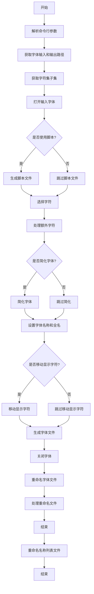
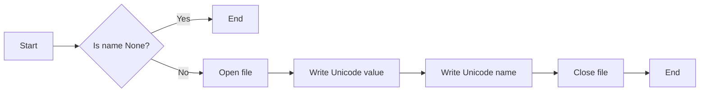
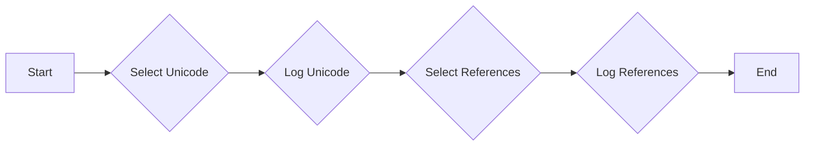
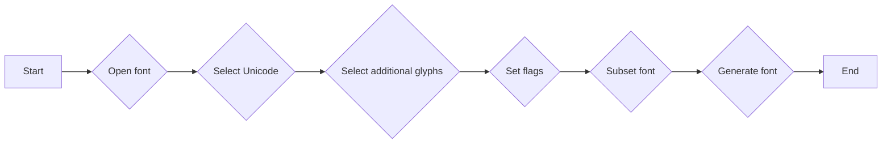
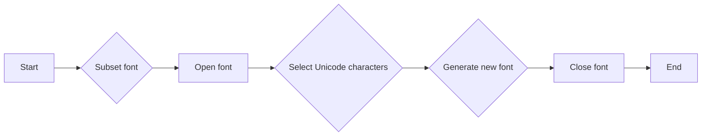
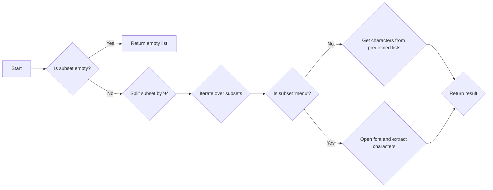
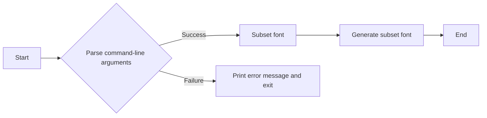
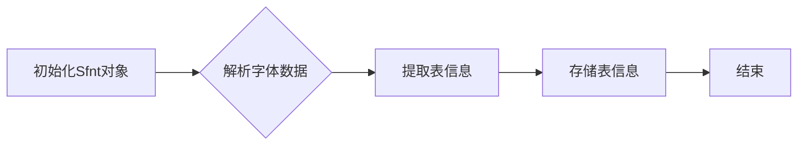
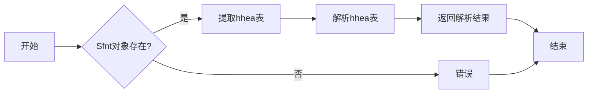
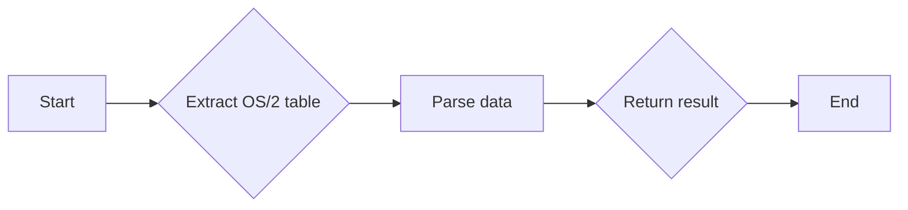

# `matplotlib\tools\subset.py` 详细设计文档

This script is designed to subset a font using FontForge, allowing users to specify which characters to include in the output font file.

## 整体流程



## 类结构

```
Sfnt (类)
├── Sfnt (构造函数)
│   ├── __init__ (初始化方法)
│   ├── hhea (方法)
│   └── os2 (方法)
└── subset_font (函数)
    ├── subset_font_raw (函数)
    ├── subset_font (函数)
    ├── getsubset (函数)
    └── main (函数)
```

## 全局变量及字段


### `font_in`
    
The input font file path.

类型：`str`
    


### `font_out`
    
The output font file path.

类型：`str`
    


### `opts`
    
A dictionary containing command line options.

类型：`dict`
    


### `subset`
    
A list of Unicode values to include in the subset font.

类型：`list`
    


### `name`
    
A file object for writing the namelist if the '--namelist' option is used.

类型：`file object`
    


### `pe`
    
A file object for writing the script if the '--script' option is used.

类型：`file object`
    


### `addl_glyphs`
    
A list of additional glyphs to include in the subset font.

类型：`list`
    


### `flags`
    
A tuple of flags to pass to the font generation function.

类型：`tuple`
    


### `font`
    
The FontForge font object representing the input font.

类型：`fontforge.font`
    


### `new`
    
A new FontForge font object for the subset font if the '--new' option is used.

类型：`fontforge.font`
    


### `font2`
    
A FontForge font object used for round-tripping the font if the '--roundtrip' option is used.

类型：`fontforge.font`
    


    

## 全局函数及方法

### log_namelist

该函数用于将Unicode字符的名称和对应的十六进制值写入指定的文件。

#### 参数

- `name`：`str`，输出文件的名称，如果为`None`则不输出到文件。
- `unicode`：`int`，Unicode字符的值。

#### 返回值

无返回值。

#### 流程图



#### 带注释源码

```python
def log_namelist(name, unicode):
    if name and isinstance(unicode, int):
        print(f"0x{unicode:04X}", fontforge.nameeFromUnicode(unicode),
              file=name)
```

### select_with_refs

This function selects specific Unicode characters and their references from a font using FontForge.

#### 参数

- `font`：`fontforge.font`，The font object to be modified.
- `unicode`：`int`，The Unicode code point to select.
- `newfont`：`fontforge.font`，The new font object where the selection will be applied.
- `pe`：`file`，Optional file object to write the FontForge script to.
- `name`：`file`，Optional file object to write the name list to.

#### 返回值

- `None`：This function does not return a value.

#### 流程图



#### 带注释源码

```python
def select_with_refs(font, unicode, newfont, pe=None, name=None):
    newfont.selection.select(('more', 'unicode'), unicode)
    log_namelist(name, unicode)
    if pe:
        print(f"SelectMore({unicode})", file=pe)
    try:
        for ref in font[unicode].references:
            newfont.selection.select(('more',), ref[0])
            log_namelist(name, ref[0])
            if pe:
                print(f'SelectMore("{ref[0]}")', file=pe)
    except Exception:
        print(f'Resolving references on u+{unicode:04x} failed')
```

### subset_font_raw

This function is responsible for subsetting a font using FontForge based on a list of Unicode values and additional options provided by the user.

#### 参数

- `font_in`：`str`，The input font file path.
- `font_out`：`str`，The output font file path.
- `unicodes`：`list`，A list of Unicode values to include in the subset font.
- `opts`：`dict`，A dictionary of additional options provided by the user.

#### 返回值

- None

#### 流程图



#### 带注释源码

```python
def subset_font_raw(font_in, font_out, unicodes, opts):
    if '--namelist' in opts:
        name_fn = f'{font_out}.name'
        name = open(name_fn, 'w')
    else:
        name = None
    if '--script' in opts:
        pe_fn = "/tmp/script.pe"
        pe = open(pe_fn, 'w')
    else:
        pe = None
    font = fontforge.open(font_in)
    if pe:
        print(f'Open("{font_in}")', file=pe)
        extract_vert_to_script(font_in, pe)
    for i in unicodes:
        select_with_refs(font, i, font, pe, name)
    addl_glyphs = []
    if '--nmr' in opts:
        addl_glyphs.append('nonmarkingreturn')
    if '--null' in opts:
        addl_glyphs.append('.null')
    if '--nd' in opts:
        addl_glyphs.append('.notdef')
    for glyph in addl_glyphs:
        font.selection.select(('more',), glyph)
        if name:
            print(f"0x{fontforge.unicodeFromName(glyph):0.4X}", glyph,
                  file=name)
        if pe:
            print(f'SelectMore("{glyph}")', file=pe)
    flags = ()
    if '--opentype-features' in opts:
        flags += ('opentype',)
    if '--simplify' in opts:
        font.simplify()
        font.round()
        flags += ('omit-instructions',)
    if '--strip_names' in opts:
        font.sfnt_names = ()
    if '--new' in opts:
        font.copy()
        new = fontforge.font()
        new.encoding = font.encoding
        new.em = font.em
        new.layers['Fore'].is_quadratic = font.layers['Fore'].is_quadratic
        for i in unicodes:
            select_with_refs(font, i, new, pe, name)
        new.paste()
        font.selection.select('space')
        font.copy()
        new.selection.select('space')
        new.paste()
        new.sfnt_names = font.sfnt_names
        font = new
    else:
        font.selection.invert()
        print("SelectInvert()", file=pe)
        font.cut()
        print("Clear()", file=pe)
    if '--move-display' in opts:
        print("Moving display glyphs into Unicode ranges...")
        font.familyname += " Display"
        font.fullname += " Display"
        font.fontname += "Display"
        font.appendSFNTName('English (US)', 'Family', font.familyname)
        font.appendSFNTName('English (US)', 16, font.familyname)
        font.appendSFNTName('English (US)', 17, 'Display')
        font.appendSFNTName('English (US)', 'Fullname', font.fullname)
        for glname in unicodes:
            font.selection.none()
            if isinstance(glname, str):
                if glname.endswith('.display'):
                    font.selection.select(glname)
                    font.copy()
                    font.selection.none()
                    newgl = glname.replace('.display', '')
                    font.selection.select(newgl)
                    font.paste()
                font.selection.select(glname)
                font.cut()
    if name:
        print("Writing NameList", end="")
        name.close()
    if pe:
        print(f'Generate("{font_out}")', file=pe)
        pe.close()
        subprocess.call(["fontforge", "-script", pe_fn])
    else:
        font.generate(font_out, flags=flags)
    font.close()
    if '--roundtrip' in opts:
        font2 = fontforge.open(font_out)
        font2.generate(font_out, flags=flags)
```

### subset_font

This function subsets a font by selecting specific Unicode characters and generating a new font file with only those characters.

#### 参数

- `font_in`：`str`，输入字体文件的路径。
- `font_out`：`str`，输出字体文件的路径。
- `unicodes`：`list`，包含要保留的Unicode字符的列表。
- `opts`：`dict`，包含命令行选项的字典。

#### 返回值

无

#### 流程图



#### 带注释源码

```python
def subset_font_raw(font_in, font_out, unicodes, opts):
    if '--namelist' in opts:
        name_fn = f'{font_out}.name'
        name = open(name_fn, 'w')
    else:
        name = None
    if '--script' in opts:
        pe_fn = "/tmp/script.pe"
        pe = open(pe_fn, 'w')
    else:
        pe = None
    font = fontforge.open(font_in)
    if pe:
        print(f'Open("{font_in}")', file=pe)
        extract_vert_to_script(font_in, pe)
    for i in unicodes:
        select_with_refs(font, i, font, pe, name)
    # ... (rest of the function)
```

### getsubset

该函数用于根据给定的子集名称生成对应的Unicode字符集列表。

#### 参数

- `subset`：`str`，表示子集名称，可以是多个子集名称通过加号连接。
- `font_in`：`str`，表示输入字体文件的路径。

#### 返回值

- `list`，包含对应子集的Unicode字符集列表。

#### 流程图



#### 带注释源码

```python
def getsubset(subset, font_in):
    subsets = subset.split('+')
    quotes = [
        0x2013,  # endash
        0x2014,  # emdash
        0x2018,  # quoteleft
        0x2019,  # quoteright
        0x201A,  # quotesinglbase
        0x201C,  # quotedblleft
        0x201D,  # quotedblright
        0x201E,  # quotedblbase
        0x2022,  # bullet
        0x2039,  # guilsinglleft
        0x203A,  # guilsinglright
    ]

    latin = [
        *range(0x20, 0x7f),  # Basic Latin (A-Z, a-z, numbers)
        *range(0xa0, 0x100),  # Western European symbols and diacritics
        0x20ac,  # Euro
        0x0152,  # OE
        0x0153,  # oe
        0x003b,  # semicolon
        0x00b7,  # periodcentered
        0x0131,  # dotlessi
        0x02c6,  # circumflex
        0x02da,  # ring
        0x02dc,  # tilde
        0x2074,  # foursuperior
        0x2215,  # division slash
        0x2044,  # fraction slash
        0xe0ff,  # PUA: Font logo
        0xeffd,  # PUA: Font version number
        0xf000,  # PUA: font ppem size indicator: run
                 # `ftview -f 1255 10 Ubuntu-Regular.ttf` to see it in action!
    ]

    result = quotes

    if 'menu' in subsets:
        font = fontforge.open(font_in)
        result = [
            *map(ord, font.familyname),
            0x0020,
        ]

    if 'latin' in subsets:
        result += latin
    if 'latin-ext' in subsets:
        # These ranges include Extended A, B, C, D, and Additional with the
        # exception of Vietnamese, which is a separate range
        result += [
            *range(0x100, 0x370),
            *range(0x1d00, 0x1ea0),
            *range(0x1ef2, 0x1f00),
            *range(0x2070, 0x20d0),
            *range(0x2c60, 0x2c80),
            *range(0xa700, 0xa800),
        ]
    if 'vietnamese' in subsets:
        # 2011-07-16 DC: Charset from
        # http://vietunicode.sourceforge.net/charset/ + U+1ef9 from Fontaine
        result += [0x00c0, 0x00c1, 0x00c2, 0x00c3, 0x00C8, 0x00C9,
                   0x00CA, 0x00CC, 0x00CD, 0x00D2, 0x00D3, 0x00D4,
                   0x00D5, 0x00D9, 0x00DA, 0x00DD, 0x00E0, 0x00E1,
                   0x00E2, 0x00E3, 0x00E8, 0x00E9, 0x00EA, 0x00EC,
                   0x00ED, 0x00F2, 0x00F3, 0x00F4, 0x00F5, 0x00F9,
                   0x00FA, 0x00FD, 0x0102, 0x0103, 0x0110, 0x0111,
                   0x0128, 0x0129, 0x01A0, 0x01A1, 0x01AF, 0x01B0,
                   0x20AB, *range(0x1EA0, 0x1EFA)]
    if 'greek' in subsets:
        # Could probably be more aggressive here and exclude archaic
        # characters, but lack data
        result += [*range(0x370, 0x400)]
    if 'greek-ext' in subsets:
        result += [*range(0x370, 0x400), *range(0x1f00, 0x2000)]
    if 'cyrillic' in subsets:
        # Based on character frequency analysis
        result += [*range(0x400, 0x460), 0x490, 0x491, 0x4b0, 0x4b1, 0x2116]
    if 'cyrillic-ext' in subsets:
        result += [
            *range(0x400, 0x530),
            0x20b4,
            # 0x2116 is the russian No, a number abbreviation similar to the
            # latin #, suggested by Alexei Vanyashin
            0x2116,
            *range(0x2de0, 0x2e00),
            *range(0xa640, 0xa6a0),
        ]
    if 'arabic' in subsets:
        # Based on Droid Arabic Kufi 1.0
        result += [0x000D, 0x0020, 0x0621, 0x0627, 0x062D,
                   0x062F, 0x0631, 0x0633, 0x0635, 0x0637, 0x0639,
                   0x0643, 0x0644, 0x0645, 0x0647, 0x0648, 0x0649,
                   0x0640, 0x066E, 0x066F, 0x0660, 0x0661, 0x0662,
                   0x0663, 0x0664, 0x0665, 0x0666, 0x0667, 0x0668,
                   0x0669, 0x06F4, 0x06F5, 0x06F6, 0x06BE, 0x06D2,
                   0x06A9, 0x06AF, 0x06BA, 0x066A, 0x061F, 0x060C,
                   0x061B, 0x066B, 0x066C, 0x066D, 0x064B, 0x064D,
                   0x064E, 0x064F, 0x064C, 0x0650, 0x0651, 0x0652,
                   0x0653, 0x0654, 0x0655, 0x0670, 0x0656, 0x0615,
                   0x0686, 0x0623, 0x0625, 0x0622, 0x0671, 0x0628,
                   0x067E, 0x062A, 0x062B, 0x0679, 0x0629, 0x062C,
                   0x062E, 0x062F, 0x0630, 0x0688, 0x0632, 0x0691, 0x0698,
                   0x0634, 0x0636, 0x0638, 0x063A, 0x0641, 0x0642,
                   0x0646, 0x06D5, 0x06C0, 0x0624, 0x064A, 0x06CC,
                   0x06D3, 0x0626, 0x06C2, 0x06C1, 0x06C3, 0x06F0,
                   0x06F1, 0x06F2, 0x06F3, 0x06F9, 0x06F7, 0x06F8,
                   0xFC63, 0x0672, 0x0673, 0x0675, 0x0676, 0x0677,

### extract_vert_to_script

This function extracts vertical metrics data directly from a TrueType font file and emits script code to set the values in the generated font. It is a workaround for an issue with FontForge's incorrect calculation of advanceWidthMax in the hhea table.

#### 参数

- `font_in`：`str`，输入字体文件的路径。
- `pe`：`file`，用于写入脚本代码的文件对象。

#### 返回值

无返回值。

#### 流程图


#### 带注释源码

```python
def extract_vert_to_script(font_in, pe):
    with open(font_in, 'rb') as in_file:
        data = in_file.read()
    sfnt = Sfnt(data)
    hhea = sfnt.hhea()
    os2 = sfnt.os2()
    set_os2_vert(pe, "WinAscent", os2['usWinAscender'])
    set_os2_vert(pe, "WinDescent", os2['usWinDescender'])
    set_os2_vert(pe, "TypoAscent", os2['sTypoAscender'])
    set_os2_vert(pe, "TypoDescent", os2['sTypoDescender'])
    set_os2_vert(pe, "HHeadAscent", hhea['Ascender'])
    set_os2_vert(pe, "HHeadDescent", hhea['Descender'])
```


### main

The `main` function is the entry point of the script, responsible for parsing command-line arguments and invoking the appropriate functions to subset a font.

参数：

- `argv`：`list`，The command-line arguments passed to the script.

返回值：`None`，The function does not return a value.

#### 流程图



#### 带注释源码

```python
def main(argv):
    # Parse command-line arguments
    optlist, args = getopt.gnu_getopt(argv, '', [
        'string=', 'strip_names', 'opentype-features', 'simplify', 'new',
        'script', 'nmr', 'roundtrip', 'subset=', 'namelist', 'null', 'nd',
        'move-display'])

    font_in, font_out = args
    opts = dict(optlist)
    if '--string' in opts:
        subset = map(ord, opts['--string'])
    else:
        subset = getsubset(opts.get('--subset', 'latin'), font_in)
    subset_font(font_in, font_out, subset, opts)
```


### Sfnt.__init__

该函数初始化一个`Sfnt`对象，用于从TrueType字体文件中提取垂直度量数据。

#### 参数

- `data`：`bytes`，包含字体文件数据的字节串。

#### 返回值

无返回值。

#### 流程图



#### 带注释源码

```python
def __init__(self, data):
    _, numTables, _, _, _ = struct.unpack('>IHHHH', data[:12])
    self.tables = {}
    for i in range(numTables):
        tag, _, offset, length = struct.unpack(
            '>4sIII', data[12 + 16 * i: 28 + 16 * i])
        self.tables[tag] = data[offset: offset + length]
```

### `Sfnt.hhea()`

该函数从Sfnt对象中提取水平头表（hhea）的信息。

#### 参数

- 无

#### 返回值

- `dict`，包含以下键：
  - `Ascender`：`int`，字体中最高字符的顶部与基线之间的距离。
  - `Descender`：`int`，字体中最低字符的底部与基线之间的距离。
  - `LineGap`：`int`，行间距。

#### 流程图



#### 带注释源码

```python
def hhea(self):
    r = {}
    d = self.tables['hhea']
    r['Ascender'], r['Descender'], r['LineGap'] = struct.unpack('>hhh', d[4:10])
    return r
```

### Sfnt.os2

该函数从Sfnt对象中提取OS/2表的信息。

#### 参数

- 无

#### 返回值

- `dict`，包含以下键和值：
  - `fsSelection`：`int`，字体选择标志。
  - `sTypoAscender`：`int`，典型ascender值。
  - `sTypoDescender`：`int`，典型descender值。
  - `sTypoLineGap`：`int`，典型行间距值。
  - `usWinAscender`：`int`，Windows ascender值。
  - `usWinDescender`：`int`，Windows descender值。

#### 流程图



#### 带注释源码

```python
def os2(self):
    r = {}
    d = self.tables['OS/2']
    r['fsSelection'], = struct.unpack('>H', d[62:64])
    r['sTypoAscender'], r['sTypoDescender'], r['sTypoLineGap'] = \
        struct.unpack('>hhh', d[68:74])
    r['usWinAscender'], r['usWinDescender'] = struct.unpack(
        '>HH', d[74:78])
    return r
```

## 关键组件


### 张量索引与惰性加载

张量索引与惰性加载是代码中用于高效处理和访问大型数据结构（如张量）的关键组件。它允许在需要时才计算或加载数据，从而优化内存使用和性能。

### 反量化支持

反量化支持是代码中用于处理和转换量化数据的关键组件。它允许将量化数据转换回原始数据格式，以便进行进一步处理或分析。

### 量化策略

量化策略是代码中用于优化数据表示和存储的关键组件。它通过减少数据精度来减少内存使用和计算需求，同时保持可接受的精度损失。


## 问题及建议


### 已知问题

-   **代码复杂度**：代码中存在大量的硬编码值和复杂的逻辑，这可能导致代码难以维护和理解。
-   **错误处理**：代码中缺乏详细的错误处理机制，可能会在遇到异常情况时导致程序崩溃。
-   **代码重复**：在多个地方存在相似的代码片段，这增加了代码维护的难度。
-   **全局变量**：代码中使用了全局变量，这可能导致代码难以测试和调试。
-   **依赖性**：代码依赖于外部工具（如FontForge），这可能会增加部署和维护的复杂性。

### 优化建议

-   **重构代码**：将复杂的逻辑分解为更小的函数，并使用更清晰的命名来提高代码的可读性。
-   **增加错误处理**：在关键操作中添加异常处理，并记录错误信息，以便于调试和问题追踪。
-   **减少代码重复**：使用函数或类来封装重复的代码，以减少代码冗余。
-   **避免全局变量**：使用局部变量或参数传递来避免全局变量的使用，以提高代码的可测试性和可维护性。
-   **模块化**：将代码分解为更小的模块，每个模块负责特定的功能，以提高代码的可维护性和可扩展性。
-   **文档化**：为代码添加详细的文档，包括函数和类的说明、参数和返回值的描述等，以提高代码的可读性和可维护性。
-   **单元测试**：编写单元测试来验证代码的功能，确保代码的正确性和稳定性。
-   **性能优化**：对代码进行性能分析，并针对性能瓶颈进行优化。
-   **代码风格**：遵循一致的代码风格指南，以提高代码的可读性和可维护性。


## 其它


### 设计目标与约束

- 设计目标：
  - 提供一个脚本，用于从字体文件中提取特定字符集的字体。
  - 支持多种字符集和字体格式。
  - 提供详细的日志记录和错误处理。
  - 允许用户自定义输出字体文件名和字符集。
- 约束：
  - 依赖于FontForge库进行字体操作。
  - 需要Python环境。
  - 输入字体文件必须是有效的字体文件。

### 错误处理与异常设计

- 错误处理：
  - 捕获并处理FontForge库相关的异常。
  - 捕获并处理文件操作相关的异常，如文件不存在、无法读取等。
  - 捕获并处理命令行参数解析相关的异常。
- 异常设计：
  - 定义自定义异常类，用于处理特定错误情况。
  - 使用try-except语句捕获和处理异常。

### 数据流与状态机

- 数据流：
  - 用户输入字体文件名和字符集。
  - 程序解析命令行参数，获取字体文件名、输出文件名、字符集等信息。
  - 程序读取字体文件，提取指定字符集的字体。
  - 程序生成新的字体文件，并保存到指定位置。
- 状态机：
  - 程序从初始状态开始，根据用户输入和命令行参数进行状态转换。
  - 程序在处理字体文件时，会经历多个状态，如打开字体文件、提取字符集、生成新字体文件等。

### 外部依赖与接口契约

- 外部依赖：
  - FontForge库：用于字体操作。
  - Python标准库：用于文件操作、命令行参数解析等。
- 接口契约：
  - FontForge库的接口：用于打开、读取、修改和保存字体文件。
  - Python标准库的接口：用于文件操作、命令行参数解析等。
  - 程序的接口：用于接收用户输入、处理命令行参数、生成新的字体文件等。

    