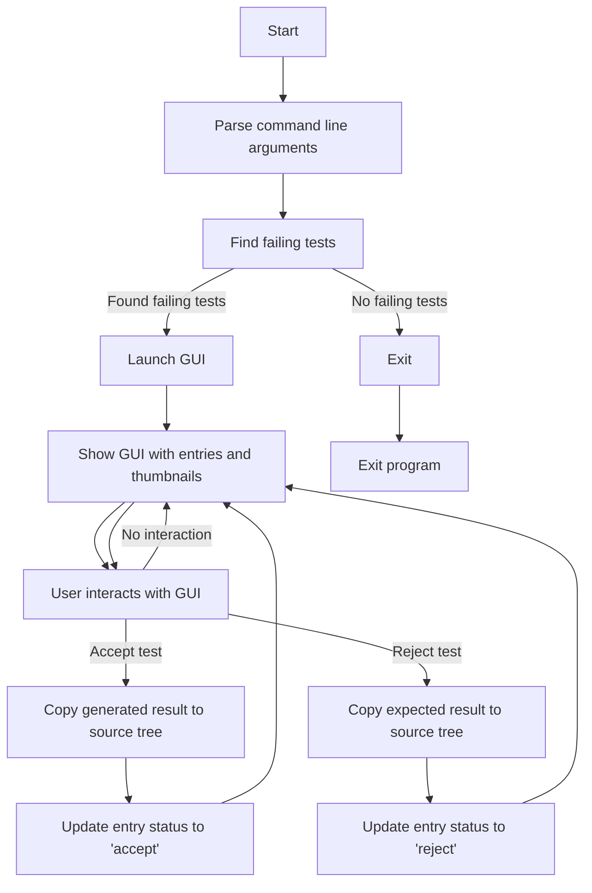
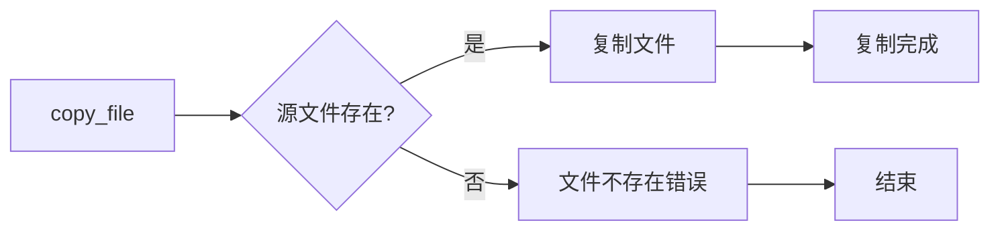
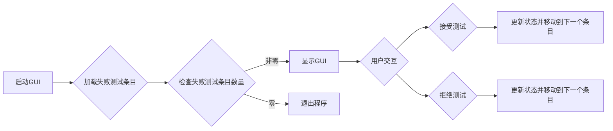
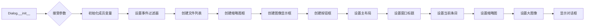
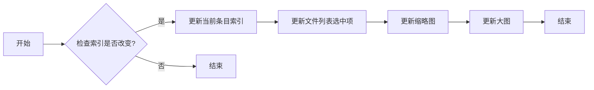
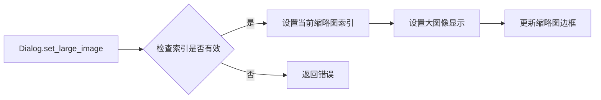
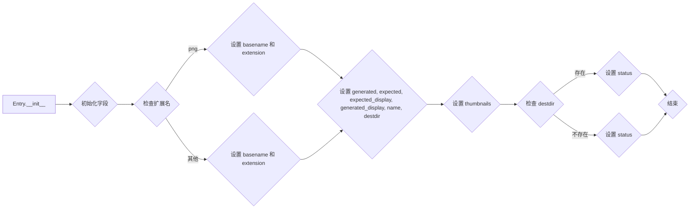
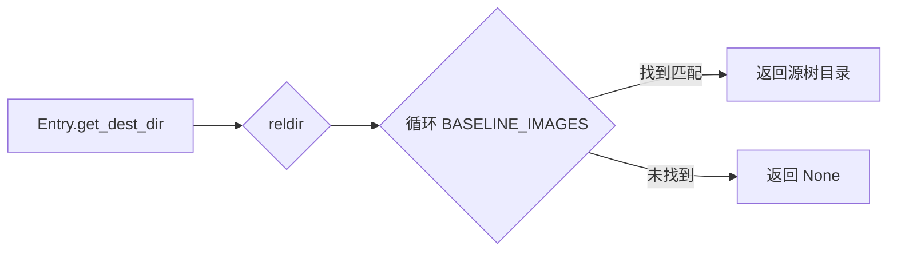
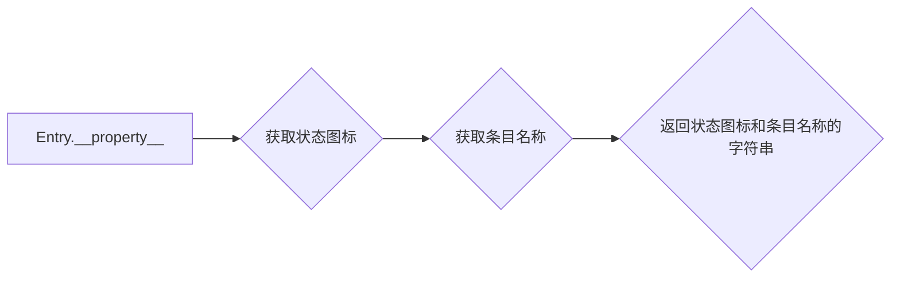

# `matplotlib\tools\triage_tests.py` 详细设计文档

This file provides a GUI-based utility for analyzing and triaging image comparison failures in matplotlib tests. It allows users to view and accept or reject test results, updating the source tree accordingly.

## 整体流程



## 类结构

```
Entry (Model for a single image comparison test)
├── Dialog (The main dialog window)
│   ├── Thumbnail (Represents one of the three thumbnails at the top of the window)
│   ├── EventFilter (A hack to handle keypresses globally)
└── ... 
```

## 全局变量及字段


### `BASELINE_IMAGES`
    
List of paths to search for baseline images.

类型：`list of Path`
    


### `exts`
    
List of non-PNG image extensions.

类型：`list of str`
    


### `event_filter`
    
Event filter object for handling keypresses globally.

类型：`EventFilter`
    


### `app`
    
The main application object.

类型：`QApplication`
    


### `dialog`
    
The main dialog window object.

类型：`Dialog`
    


### `filter`
    
Event filter object for the dialog window.

类型：`EventFilter`
    


### `args`
    
Parsed command line arguments.

类型：`Namespace`
    


### `source_dir`
    
The path to the source directory of the project.

类型：`Path`
    


### `parser`
    
The argument parser object for command line arguments.

类型：`ArgumentParser`
    


### `Thumbnail.parent`
    
The parent widget of the thumbnail.

类型：`QtWidgets.QFrame`
    


### `Thumbnail.index`
    
The index of the thumbnail in the parent widget.

类型：`int`
    


### `Thumbnail.name`
    
The name of the thumbnail.

类型：`str`
    


### `EventFilter.window`
    
The window to which the event filter is attached.

类型：`QtWidgets.QDialog`
    


### `Dialog.entries`
    
The list of entries for the dialog.

类型：`list of Entry`
    


### `Dialog.current_entry`
    
The current entry index in the entries list.

类型：`int`
    


### `Dialog.current_thumbnail`
    
The current thumbnail index in the thumbnails list.

类型：`int`
    


### `Dialog.filelist`
    
The file list widget in the dialog.

类型：`QListWidget`
    


### `Dialog.thumbnails`
    
The list of thumbnail widgets in the dialog.

类型：`list of Thumbnail`
    


### `Dialog.image_display`
    
The image display widget in the dialog.

类型：`QLabel`
    


### `Entry.source`
    
The source directory of the project.

类型：`Path`
    


### `Entry.root`
    
The root directory of the project.

类型：`Path`
    


### `Entry.dir`
    
The directory of the entry.

类型：`Path`
    


### `Entry.diff`
    
The filename of the diff image.

类型：`str`
    


### `Entry.reldir`
    
The relative directory of the entry.

类型：`Path`
    


### `Entry.basename`
    
The basename of the entry without extension.

类型：`str`
    


### `Entry.extension`
    
The file extension of the entry.

类型：`str`
    


### `Entry.generated`
    
The filename of the generated image.

类型：`str`
    


### `Entry.expected`
    
The filename of the expected image.

类型：`str`
    


### `Entry.expected_display`
    
The display name of the expected image.

类型：`str`
    


### `Entry.generated_display`
    
The display name of the generated image.

类型：`str`
    


### `Entry.name`
    
The full path of the entry.

类型：`Path`
    


### `Entry.destdir`
    
The destination directory for the entry.

类型：`Path`
    


### `Entry.thumbnails`
    
The list of thumbnail filenames for the entry.

类型：`list of Path`
    


### `Entry.status`
    
The status of the entry (e.g., 'accept', 'reject', 'autogen').

类型：`str`
    
    

## 全局函数及方法

### copy_file

#### 描述

Copy file from `a` to `b`.

#### 参数

- `a`：`Path`，源文件路径。
- `b`：`Path`，目标文件路径。

#### 返回值

无返回值。

#### 流程图



#### 带注释源码

```python
def copy_file(a, b):
    """Copy file from *a* to *b*."""
    print(f'copying: {a} to {b}')
    shutil.copyfile(a, b)
```

### find_failing_tests

#### 描述

`find_failing_tests` 函数用于查找所有失败的测试。它通过搜索文件名中包含 `-failed-diff` 的文件来识别失败的测试。

#### 参数

- `result_images`：`Path`，表示包含测试结果的目录。
- `source`：`Path`，表示包含源代码的目录。

#### 返回值

- 返回值类型：`list`，包含 `Entry` 对象的列表。
- 返回值描述：每个 `Entry` 对象代表一个失败的测试。

#### 流程图

```mermaid
graph LR
A[Start] --> B{Is there a file with "-failed-diff" in the basename?}
B -- Yes --> C[Create Entry object]
B -- No --> D[End]
C --> E[Add Entry to list]
E --> F[End]
```

#### 带注释源码

```python
def find_failing_tests(result_images, source):
    """
    Find all of the failing tests by looking for files with
    `-failed-diff` at the end of the basename.
    """
    return [Entry(path, result_images, source)
            for path in sorted(Path(result_images).glob("**/*-failed-diff.*"))]
```

### launch

该函数启动图形用户界面(GUI)，用于分析并处理图像比较失败的情况。

#### 参数

- `result_images`：`Path`，指定结果图像目录的路径。
- `source`：`Path`，指定matplotlib源代码树的路径。

#### 返回值

无返回值。

#### 流程图



#### 带注释源码

```python
def launch(result_images, source):
    """
    Launch the GUI.
    """
    entries = find_failing_tests(result_images, source)

    if len(entries) == 0:
        print("No failed tests")
        sys.exit(0)

    app = QtWidgets.QApplication(sys.argv)
    dialog = Dialog(entries)
    dialog.show()
    filter = EventFilter(dialog)
    app.installEventFilter(filter)
    sys.exit(_exec(app))
```

### Thumbnail.__init__

#### 描述

`Thumbnail.__init__` 方法是 `Thumbnail` 类的构造函数，用于初始化一个表示窗口顶部三个缩略图之一的 `Thumbnail` 对象。

#### 参数

- `parent`：`QtWidgets.QFrame`，父窗口对象。
- `index`：`int`，缩略图在父窗口中的索引。
- `name`：`str`，缩略图显示的名称。

#### 返回值

无返回值。

#### 流程图

```mermaid
classDiagram
    Thumbnail <|-- QtWidgets.QFrame
    Thumbnail {
        +parent: QtWidgets.QFrame
        +index: int
        +name: str
        +__init__(parent: QtWidgets.QFrame, index: int, name: str)
    }
```

#### 带注释源码

```python
def __init__(self, parent, index, name):
    super().__init__()

    self.parent = parent
    self.index = index

    layout = QtWidgets.QVBoxLayout()

    label = QtWidgets.QLabel(name)
    label.setAlignment(QtCore.Qt.AlignmentFlag.AlignHCenter |
                       QtCore.Qt.AlignmentFlag.AlignVCenter)
    layout.addWidget(label, 0)

    self.image = QtWidgets.QLabel()
    self.image.setAlignment(QtCore.Qt.AlignmentFlag.AlignHCenter |
                            QtCore.Qt.AlignmentFlag.AlignVCenter)
    self.image.setMinimumSize(800 // 3, 600 // 3)
    layout.addWidget(self.image)
    self.setLayout(layout)
```

### Thumbnail.mousePressEvent

#### 描述

`Thumbnail.mousePressEvent` 方法是 `Thumbnail` 类的一个方法，它处理鼠标点击事件。当用户在缩略图上点击时，该方法会被调用。

#### 参数

- `event`：`QtGui.QMouseEvent`，表示鼠标事件。

#### 返回值

- 无返回值。

#### 流程图

```mermaid
graph LR
A[Thumbnail.mousePressEvent] --> B{事件类型}
B -- 鼠标点击 --> C[set_large_image(self.index)]
B -- 其他事件 --> D[忽略]
```

#### 带注释源码

```python
def mousePressEvent(self, event):
    # 调用父类的鼠标点击事件处理方法
    super().mousePressEvent(event)
    # 如果是鼠标点击事件，则设置大图
    if event.type() == QtCore.QEvent.Type.MouseButtonPress:
        self.parent.set_large_image(self.index)
```

### EventFilter.__init__

**描述**

`EventFilter.__init__` 是 `EventFilter` 类的构造函数，用于初始化 `EventFilter` 对象。

**参数**

- `window`：`QtWidgets.QDialog` 类型，表示关联的对话框窗口。

**返回值**

无

#### 流程图

```mermaid
classDiagram
    EventFilter <|-- QtWidgets.QObject
    EventFilter {
        +__init__(window: QtWidgets.QDialog)
    }
```

#### 带注释源码

```python
class EventFilter(QtCore.QObject):
    # A hack keypresses can be handled globally and aren't swallowed
    # by the individual widgets

    def __init__(self, window):
        super().__init__()
        self.window = window
```

### EventFilter.eventFilter

#### 描述

`EventFilter.eventFilter` 是一个事件过滤器方法，它被用来处理键盘事件。当键盘事件发生时，它会调用 `window.keyPressEvent(event)` 来处理这些事件。

#### 参数

- `receiver`：`QObject`，事件接收者。
- `event`：`QEvent`，事件对象。

#### 返回值

- `bool`，如果事件被处理则返回 `True`，否则返回 `False`。

#### 流程图

```mermaid
graph LR
A[EventFilter.eventFilter] --> B{event.type()}
B -- QEvent.Type.KeyPress --> C[window.keyPressEvent(event)]
B -- 其他类型 --> D[super().eventFilter(receiver, event)]
C --> E[返回 True]
D --> E
```

#### 带注释源码

```python
def eventFilter(self, receiver, event):
    # 如果事件类型是按键按下
    if event.type() == QtCore.QEvent.Type.KeyPress:
        # 调用窗口的按键事件处理方法
        self.window.keyPressEvent(event)
        # 返回 True 表示事件已被处理
        return True
    else:
        # 否则，调用父类的 eventFilter 方法
        return super().eventFilter(receiver, event)
```

### Dialog.__init__

#### 描述

`Dialog.__init__` 是 `Dialog` 类的构造函数，用于初始化对话框窗口。它接受一个 `entries` 参数，该参数是一个包含图像比较测试条目的列表。

#### 参数

- `entries`：`list`，包含图像比较测试条目的列表。

#### 返回值

无

#### 流程图



#### 带注释源码

```python
def __init__(self, entries):
    super().__init__()

    self.entries = entries
    self.current_entry = -1
    self.current_thumbnail = -1

    event_filter = EventFilter(self)
    self.installEventFilter(event_filter)

    # The list of files on the left-hand side.
    self.filelist = QtWidgets.QListWidget()
    self.filelist.setMinimumWidth(400)
    for entry in entries:
        self.filelist.addItem(entry.display)
    self.filelist.currentRowChanged.connect(self.set_entry)

    thumbnails_box = QtWidgets.QWidget()
    thumbnails_layout = QtWidgets.QVBoxLayout()
    self.thumbnails = []
    for i, name in enumerate(('test', 'expected', 'diff')):
        thumbnail = Thumbnail(self, i, name)
        thumbnails_layout.addWidget(thumbnail)
        self.thumbnails.append(thumbnail)
    thumbnails_box.setLayout(thumbnails_layout)

    images_layout = QtWidgets.QVBoxLayout()
    images_box = QtWidgets.QWidget()
    self.image_display = QtWidgets.QLabel()
    self.image_display.setAlignment(
        QtCore.Qt.AlignmentFlag.AlignHCenter |
        QtCore.Qt.AlignmentFlag.AlignVCenter)
    self.image_display.setMinimumSize(800, 600)
    images_layout.addWidget(self.image_display, 6)
    images_box.setLayout(images_layout)

    buttons_box = QtWidgets.QWidget()
    buttons_layout = QtWidgets.QHBoxLayout()
    accept_button = QtWidgets.QPushButton("Accept (A)")
    accept_button.clicked.connect(self.accept_test)
    buttons_layout.addWidget(accept_button)
    reject_button = QtWidgets.QPushButton("Reject (R)")
    reject_button.clicked.connect(self.reject_test)
    buttons_layout.addWidget(reject_button)
    buttons_box.setLayout(buttons_layout)
    images_layout.addWidget(buttons_box)

    main_layout = QtWidgets.QHBoxLayout()
    main_layout.addWidget(self.filelist, 1)
    main_layout.addWidget(thumbnails_box, 1)
    main_layout.addWidget(images_box, 3)

    self.setLayout(main_layout)

    self.setWindowTitle("matplotlib test triager")

    self.set_entry(0)

    def set_entry(self, index):
        if self.current_entry == index:
            return

        self.current_entry = index
        entry = self.entries[index]

        self.pixmaps = []
        for fname, thumbnail in zip(entry.thumbnails, self.thumbnails):
            pixmap = QtGui.QPixmap(os.fspath(fname))
            scaled_pixmap = pixmap.scaled(
                thumbnail.size(),
                QtCore.Qt.AspectRatioMode.KeepAspectRatio,
                QtCore.Qt.TransformationMode.SmoothTransformation)
            thumbnail.image.setPixmap(scaled_pixmap)
            self.pixmaps.append(scaled_pixmap)

        self.set_large_image(0)
        self.filelist.setCurrentRow(self.current_entry)

    def set_large_image(self, index):
        self.thumbnails[self.current_thumbnail].setFrameShape(
            QtWidgets.QFrame.Shape.NoFrame)
        self.current_thumbnail = index
        pixmap = QtGui.QPixmap(os.fspath(
            self.entries[self.current_entry]
            .thumbnails[self.current_thumbnail]))
        self.image_display.setPixmap(pixmap)
        self.thumbnails[self.current_thumbnail].setFrameShape(
            QtWidgets.QFrame.Shape.Box)
```

### Dialog.set_entry

#### 描述

`set_entry` 方法用于设置当前选中的条目，并更新界面以显示相应的图像。

#### 参数

- `index`：`int`，当前选中的条目索引。

#### 返回值

- 无

#### 流程图



#### 带注释源码

```python
def set_entry(self, index):
    if self.current_entry == index:
        return

    self.current_entry = index
    entry = self.entries[index]

    self.pixmaps = []
    for fname, thumbnail in zip(entry.thumbnails, self.thumbnails):
        pixmap = QtGui.QPixmap(os.fspath(fname))
        scaled_pixmap = pixmap.scaled(
            thumbnail.size(),
            QtCore.Qt.AspectRatioMode.KeepAspectRatio,
            QtCore.Qt.TransformationMode.SmoothTransformation)
        thumbnail.image.setPixmap(scaled_pixmap)
        self.pixmaps.append(scaled_pixmap)

    self.set_large_image(0)
    self.filelist.setCurrentRow(self.current_entry)
```

### Dialog.set_large_image

#### 描述

`set_large_image` 方法用于设置主窗口中显示的大图像。当用户点击任何一个缩略图时，该方法会被调用，并显示相应的大图像。

#### 参数

- `index`：`int`，表示缩略图的索引，范围从 0 到 2，分别对应测试、预期和差异图像。

#### 返回值

- 无返回值。

#### 流程图



#### 带注释源码

```python
def set_large_image(self, index):
    self.thumbnails[self.current_thumbnail].setFrameShape(QtWidgets.QFrame.Shape.NoFrame)
    self.current_thumbnail = index
    pixmap = QtGui.QPixmap(os.fspath(
        self.entries[self.current_entry]
        .thumbnails[self.current_thumbnail]))
    self.image_display.setPixmap(pixmap)
    self.thumbnails[self.current_thumbnail].setFrameShape(QtWidgets.QFrame.Shape.Box)
```

### Dialog.accept_test

This method is responsible for accepting a test by copying the generated result to the source tree.

参数：

- `self`：`Dialog` 类的实例，表示当前对话框对象。

返回值：无

#### 流程图

```mermaid
graph LR
A[Dialog.accept_test] --> B{检查 entry.status 是否为 'autogen'}
B -- 是 --> C[打印 "Cannot accept autogenerated test cases." 并返回]
B -- 否 --> D[调用 entry.accept() 方法]
D --> E[更新 filelist.currentItem().setText 为 entries[current_entry].display]
E --> F[自动移动到下一个条目]
```

#### 带注释源码

```python
def accept_test(self):
    entry = self.entries[self.current_entry]
    if entry.status == 'autogen':
        print('Cannot accept autogenerated test cases.')
        return
    entry.accept()
    self.filelist.currentItem().setText(
        self.entries[self.current_entry].display)
    # Auto-move to the next entry
    self.set_entry(min((self.current_entry + 1), len(self.entries) - 1))
```

### Dialog.reject_test

This method is responsible for rejecting a test by copying the expected result to the source tree.

#### 参数

- `self`：`Dialog` 类的实例，表示当前对话框。

#### 返回值

- 无返回值。

#### 流程图

```mermaid
graph LR
A[Dialog.reject_test] --> B{检查 entry.status 是否为 'autogen'}
B -- 是 --> C[打印 "Cannot reject autogenerated test cases." 并返回]
B -- 否 --> D[获取 entry 的 expected 文件路径]
D --> E[检查 expected 文件是否存在]
E -- 是 --> F[调用 copy_file 函数复制 expected 文件到 destdir]
E -- 否 --> G[打印 "Expected file does not exist." 并返回]
F --> H[设置 entry.status 为 'reject']
H --> I[更新 filelist 中的当前项文本]
I --> J[自动移动到下一个条目]
```

#### 带注释源码

```python
def reject_test(self):
    entry = self.entries[self.current_entry]
    if entry.status == 'autogen':
        print('Cannot reject autogenerated test cases.')
        return
    entry.reject()
    self.filelist.currentItem().setText(
        self.entries[self.current_entry].display)
    # Auto-move to the next entry
    self.set_entry(min((self.current_entry + 1), len(self.entries) - 1))
```

### Dialog.keyPressEvent

This method handles key press events in the `Dialog` class, allowing navigation and interaction with the image comparison test results.

#### 参数

- `e`：`QtCore.QEvent`，The key press event object.

#### 返回值

- `None`：This method does not return a value.

#### 流程图

```mermaid
graph LR
A[Start] --> B{Is key Left?}
B -- Yes --> C[Set large image to (current_thumbnail - 1) % 3]
B -- No --> D{Is key Right?}
D -- Yes --> E[Set large image to (current_thumbnail + 1) % 3]
D -- No --> F{Is key Up?}
F -- Yes --> G[Set entry to max(current_entry - 1, 0)]
F -- No --> H{Is key Down?}
H -- Yes --> I[Set entry to min(current_entry + 1, len(entries) - 1)]
H -- No --> J{Is key A?}
J -- Yes --> K[Accept test]
J -- No --> L{Is key R?}
L -- Yes --> M[Reject test]
L -- No --> N[Call super().keyPressEvent(e)]
N --> O[End]
```

#### 带注释源码

```python
def keyPressEvent(self, e):
    if e.key() == QtCore.Qt.Key.Key_Left:
        self.set_large_image((self.current_thumbnail - 1) % 3)
    elif e.key() == QtCore.Qt.Key.Key_Right:
        self.set_large_image((self.current_thumbnail + 1) % 3)
    elif e.key() == QtCore.Qt.Key.Key_Up:
        self.set_entry(max(self.current_entry - 1, 0))
    elif e.key() == QtCore.Qt.Key.Key_Down:
        self.set_entry(min(self.current_entry + 1, len(self.entries) - 1))
    elif e.key() == QtCore.Qt.Key.Key_A:
        self.accept_test()
    elif e.key() == QtCore.Qt.Key.Key_R:
        self.reject_test()
    else:
        super().keyPressEvent(e)
```

### Entry.__init__

#### 描述

`Entry.__init__` 方法是 `Entry` 类的构造函数，用于初始化一个图像比较测试的模型实例。

#### 参数

- `path`：`Path`，表示测试图像的路径。
- `root`：`Path`，表示源代码树的根目录。
- `source`：`Path`，表示结果图像目录的根目录。

#### 返回值

无返回值。

#### 参数描述

- `path`：图像比较测试的图像文件路径。
- `root`：源代码树的根目录，用于查找对应的源代码文件。
- `source`：结果图像目录的根目录，用于查找对应的基准图像文件。

#### 流程图



#### 带注释源码

```python
def __init__(self, path, root, source):
    self.source = source
    self.root = root
    self.dir = path.parent
    self.diff = path.name
    self.reldir = self.dir.relative_to(self.root)

    basename = self.diff[:-len('-failed-diff.png')]
    for ext in exts:
        if basename.endswith(f'_{ext}'):
            display_extension = f'_{ext}'
            extension = ext
            basename = basename[:-len(display_extension)]
            break
    else:
        display_extension = ''
        extension = 'png'

    self.basename = basename
    self.extension = extension
    self.generated = f'{basename}.{extension}'
    self.expected = f'{basename}-expected.{extension}'
    self.expected_display = f'{basename}-expected{display_extension}.png'
    self.generated_display = f'{basename}{display_extension}.png'
    self.name = self.reldir / self.basename
    self.destdir = self.get_dest_dir(self.reldir)

    self.thumbnails = [
        self.generated_display,
        self.expected_display,
        self.diff
    ]
    self.thumbnails = [self.dir / x for x in self.thumbnails]

    if self.destdir is None or not Path(self.destdir, self.generated).exists():
        # This case arises from a check_figures_equal test.
        self.status = 'autogen'
    elif ((self.dir / self.generated).read_bytes()
          == (self.destdir / self.generated).read_bytes()):
        self.status = 'accept'
    else:
        self.status = 'unknown'
```

### Entry.get_dest_dir

#### 描述

`get_dest_dir` 方法用于查找与给定结果图像子目录相对应的源树目录。

#### 参数

- `reldir`：`Path`，表示相对目录路径。

#### 返回值

- `Path`，表示源树目录路径，如果找不到则返回 `None`。

#### 流程图



#### 带注释源码

```python
def get_dest_dir(self, reldir):
    """
    Find the source tree directory corresponding to the given
    result_images subdirectory.
    """
    for baseline_dir in BASELINE_IMAGES:
        path = self.source / baseline_dir / reldir
        if path.is_dir():
            return path
    return None
```

### Entry.__property__

#### 描述

`Entry.__property__` 是 `Entry` 类的一个特殊方法，用于获取该条目的显示字符串。这个字符串用于在列表视图中显示，包含条目的状态图标和名称。

#### 参数

- 无

#### 返回值

- `str`：包含状态图标和条目名称的字符串。

#### 流程图



#### 带注释源码

```python
    @property
    def display(self):
        """
        Get the display string for this entry.  This is the text that
        appears in the list widget.
        """
        status_map = {
            'unknown': '\N{BALLOT BOX}',
            'accept':  '\N{BALLOT BOX WITH CHECK}',
            'reject':  '\N{BALLOT BOX WITH X}',
            'autogen': '\N{WHITE SQUARE CONTAINING BLACK SMALL SQUARE}',
        }
        box = status_map[self.status]
        return f'{box} {self.name} [{self.extension}]'
```

### Entry.accept

#### 描述

`Entry.accept` 方法用于接受当前图像比较测试，将生成的结果复制到源代码树中。

#### 参数

- 无

#### 返回值

- 无

#### 流程图

```mermaid
graph LR
A[Entry.accept] --> B{检查状态}
B -- "autogen" --> C[打印错误信息]
B -- "accept" --> D[复制文件]
B -- "reject" --> E[复制文件]
D --> F[设置状态为 "accept"]
E --> G[设置状态为 "reject"]
```

#### 带注释源码

```python
def accept(self):
    """
    Accept this test by copying the generated result to the source tree.
    """
    copy_file(self.dir / self.generated, self.destdir / self.generated)
    self.status = 'accept'
```

#### 关键组件信息

- `copy_file`: 复制文件的函数
- `self.dir`: 包含测试图像的目录
- `self.generated`: 生成的图像文件名
- `self.destdir`: 目标目录
- `self.status`: 当前测试的状态（"accept", "reject", "autogen", "unknown"）

### Entry.reject

This method is part of the `Entry` class and is used to reject a test by copying the expected result to the source tree.

#### 参数

- `self`：`Entry`对象本身，表示当前测试条目。

#### 返回值

- 无返回值。

#### 流程图

```mermaid
graph LR
A[Entry.reject] --> B{检查状态}
B -- "autogen" --> C[打印错误信息]
B -- "accept" --> C
B -- "reject" --> D[复制期望结果到源树]
D --> E[更新状态为"reject"]
E --> F[结束]
```

#### 带注释源码

```python
def reject(self):
    """
    Reject this test by copying the expected result to the source tree.
    """
    expected = self.dir / self.expected
    if not expected.is_symlink():
        copy_file(expected, self.destdir / self.generated)
    self.status = 'reject'
```

## 关键组件


### 张量索引与惰性加载

张量索引与惰性加载是代码中处理图像数据的关键组件，它允许在需要时才加载图像数据，从而提高内存使用效率和程序响应速度。

### 反量化支持

反量化支持是代码中用于处理图像量化过程的关键组件，它允许在量化后的图像数据中恢复原始图像数据，以便进行后续处理。

### 量化策略

量化策略是代码中用于控制图像量化过程的关键组件，它决定了图像数据在量化过程中的精度和范围，从而影响图像质量和处理速度。

## 问题及建议


### 已知问题

-   **代码重复**：`Entry` 类中的 `get_dest_dir` 方法在多个地方被调用，可以考虑将其提取为一个全局函数或类方法，以减少代码重复。
-   **异常处理**：代码中没有明显的异常处理机制，例如在文件操作或路径解析时可能会遇到异常，应该添加适当的异常处理来增强代码的健壮性。
-   **代码风格**：代码中存在一些不一致的缩进和命名风格，这可能会影响代码的可读性和可维护性。
-   **全局变量**：`BASELINE_IMAGES` 是一个全局变量，它可能会在代码的其他部分被意外修改，应该考虑将其封装在类中或使用配置文件来管理。

### 优化建议

-   **提取 `get_dest_dir` 方法**：将 `get_dest_dir` 方法提取为一个全局函数或类方法，以减少代码重复并提高代码的可维护性。
-   **添加异常处理**：在文件操作、路径解析和其他可能抛出异常的地方添加异常处理，以确保程序的稳定性和可靠性。
-   **统一代码风格**：使用代码风格指南（如 PEP 8）来统一代码的缩进和命名风格，以提高代码的可读性和可维护性。
-   **使用配置文件**：将 `BASELINE_IMAGES` 等全局变量移到配置文件中，以减少硬编码并提高配置的灵活性。
-   **模块化**：将代码分解为更小的、更易于管理的模块，以提高代码的可重用性和可测试性。
-   **日志记录**：添加日志记录功能，以便于跟踪程序的执行过程和调试问题。
-   **用户界面**：考虑使用更现代的图形界面库（如 PyQt5 的 QWidgets）来构建用户界面，以提高用户体验。
-   **性能优化**：对于性能敏感的部分，考虑使用更高效的算法或数据结构来提高程序的执行效率。


## 其它


### 设计目标与约束

- **设计目标**:
  - 提供一个用户界面，允许用户查看和比较图像比较测试的结果。
  - 允许用户接受或拒绝测试结果，并将结果复制到源代码树中。
  - 确保用户界面直观易用，便于快速处理大量测试结果。

- **约束**:
  - 必须与现有的测试框架兼容，能够处理图像比较测试的结果。
  - 用户界面应尽可能轻量级，以减少对系统资源的需求。

### 错误处理与异常设计

- **错误处理**:
  - 当无法找到预期的结果图像时，应提供明确的错误消息。
  - 当用户尝试接受或拒绝自动生成的测试用例时，应提供警告消息。

- **异常设计**:
  - 使用try-except块来捕获和处理可能发生的异常，例如文件操作错误。

### 数据流与状态机

- **数据流**:
  - 用户通过命令行或用户界面输入结果图像和源代码的位置。
  - 程序搜索结果图像目录，找到失败的测试用例。
  - 用户通过用户界面查看测试结果，并选择接受或拒绝。

- **状态机**:
  - 程序的状态包括：初始化、搜索测试结果、显示结果、用户交互（接受/拒绝）。

### 外部依赖与接口契约

- **外部依赖**:
  - Matplotlib库，用于图像处理和显示。
  - PyQt5库，用于创建图形用户界面。

- **接口契约**:
  - `Entry`类用于表示单个图像比较测试，定义了如何获取和设置测试状态。
  - `Dialog`类定义了用户界面的行为，包括如何处理用户输入和显示测试结果。
  - `copy_file`函数定义了如何复制文件，包括错误处理。
  - `find_failing_tests`函数定义了如何搜索失败的测试用例。


    