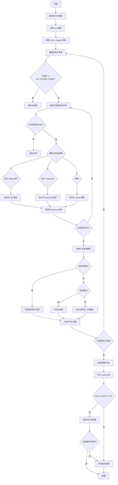
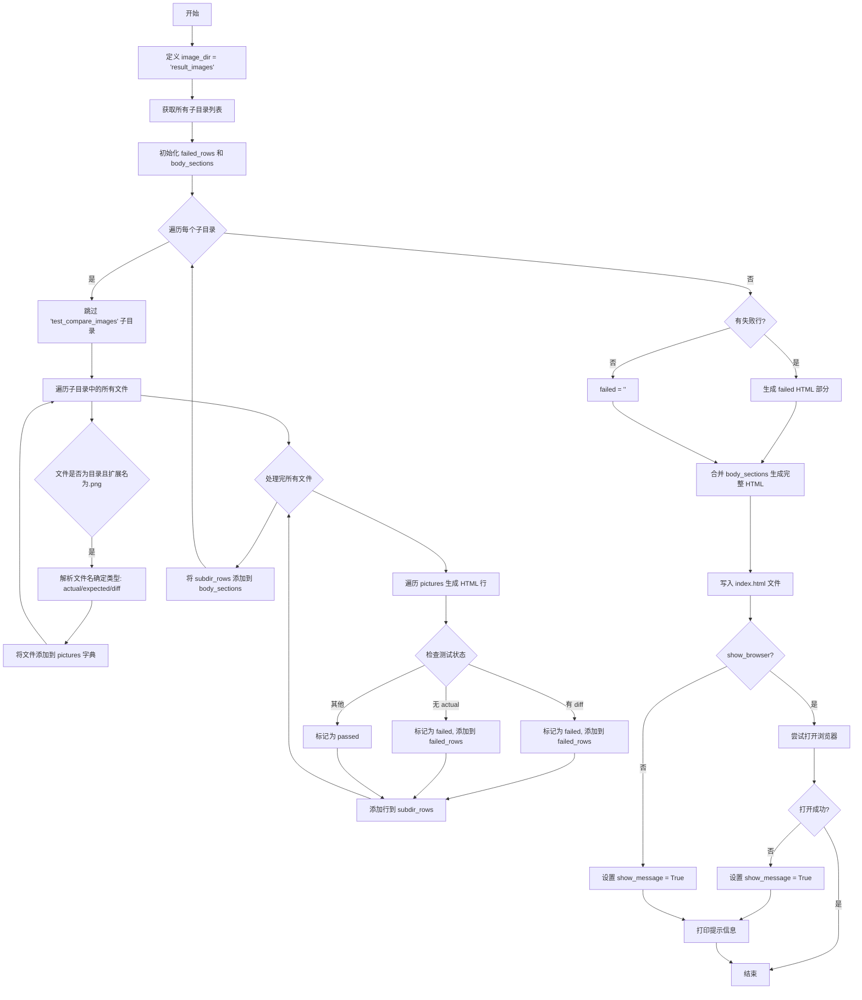
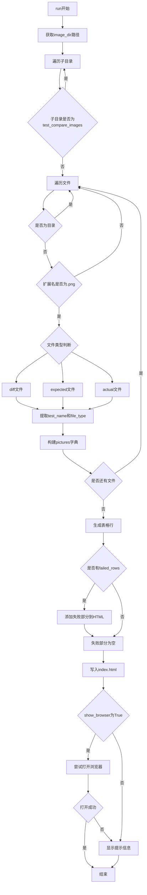
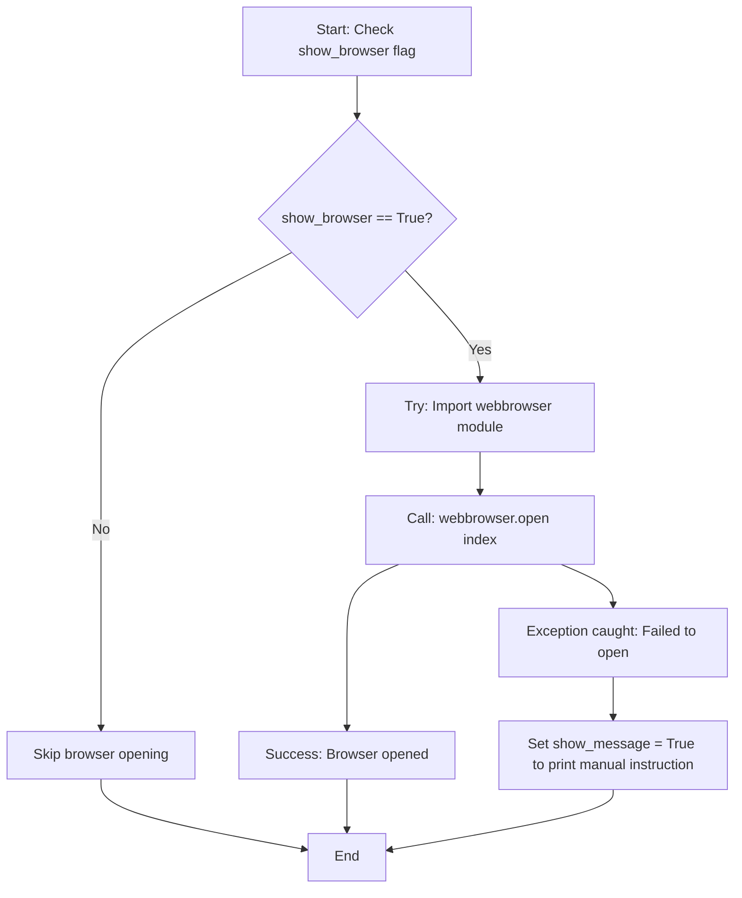

# `matplotlib\tools\visualize_tests.py` 详细设计文档

该脚本是一个可视化测试工具，用于扫描matplotlib图像比较测试的结果目录，生成包含所有测试图像对比（实际、预期、差异）的HTML页面，并可选地在浏览器中打开该页面进行视觉对比。

## 整体流程



## 类结构

```
无类结构 (脚本文件)
```

## 全局变量及字段


### `NON_PNG_EXTENSIONS`
    
非PNG图像扩展名列表

类型：`list`
    


### `html_template`
    
HTML页面主模板

类型：`str`
    


### `subdir_template`
    
子目录表格HTML模板

类型：`str`
    


### `failed_template`
    
失败测试表格HTML模板

类型：`str`
    


### `row_template`
    
表格行HTML模板

类型：`str`
    


### `linked_image_template`
    
带链接的图像HTML模板

类型：`str`
    


    

## 全局函数及方法


### `run`

构建可视化网站，展示图像比较测试结果，并可选打开浏览器查看。

参数：
- `show_browser`：`bool`，默认为 True，是否在生成 HTML 页面后自动打开浏览器

返回值：`None`，该函数无返回值（隐式返回 None）

#### 流程图



#### 带注释源码

```python
def run(show_browser=True):
    """
    Build a website for visual comparison
    """
    # 定义图像目录路径
    image_dir = "result_images"
    
    # 获取 image_dir 下的所有子目录名称
    _subdirs = (name
                for name in os.listdir(image_dir)
                if os.path.isdir(os.path.join(image_dir, name)))

    # 用于存储失败的测试行
    failed_rows = []
    # 用于存储页面的各个部分
    body_sections = []
    
    # 遍历所有子目录并排序
    for subdir in sorted(_subdirs):
        # 跳过测试比较图像的目录
        if subdir == "test_compare_images":
            # These are the images which test the image comparison functions.
            continue

        # 使用 defaultdict 存储每个测试的图片
        pictures = defaultdict(dict)
        
        # 遍历子目录中的所有文件
        for file in os.listdir(os.path.join(image_dir, subdir)):
            # 跳过目录
            if os.path.isdir(os.path.join(image_dir, subdir, file)):
                continue
            
            # 分离文件名和扩展名
            fn, fext = os.path.splitext(file)
            
            # 只处理 PNG 文件
            if fext != ".png":
                continue
            
            # 根据文件名后缀判断文件类型
            if "-failed-diff" in fn:
                file_type = 'diff'
                test_name = fn[:-len('-failed-diff')]
            elif "-expected" in fn:
                # 处理非 PNG 的预期图像（如 PDF、SVG、EPS）
                for ext in NON_PNG_EXTENSIONS:
                    if fn.endswith(f'_{ext}'):
                        display_extension = f'_{ext}'
                        extension = ext
                        fn = fn[:-len(display_extension)]
                        break
                else:
                    display_extension = ''
                    extension = 'png'
                file_type = 'expected'
                test_name = fn[:-len('-expected')] + display_extension
            else:
                file_type = 'actual'
                test_name = fn
            
            # Always use / for URLs.
            # 将文件路径存入 pictures 字典，使用子目录名作为路径前缀
            pictures[test_name][file_type] = '/'.join((subdir, file))

        # 用于存储当前子目录的表格行
        subdir_rows = []
        
        # 遍历所有测试图片
        for name, test in sorted(pictures.items()):
            expected_image = test.get('expected', '')
            actual_image = test.get('actual', '')

            if 'diff' in test:
                # A real failure in the image generation, resulting in
                # different images.
                status = " (failed)"
                # 生成 diff 链接
                failed = f'<a href="{test["diff"]}">diff</a>'
                current = linked_image_template.format(actual_image)
                # 添加到失败行列表
                failed_rows.append(row_template.format(name, "", current,
                                                       expected_image, failed))
            elif 'actual' not in test:
                # A failure in the test, resulting in no current image
                status = " (failed)"
                failed = '--'
                current = '(Failure in test, no image produced)'
                failed_rows.append(row_template.format(name, "", current,
                                                       expected_image, failed))
            else:
                status = " (passed)"
                failed = '--'
                current = linked_image_template.format(actual_image)

            # 添加当前行到子目录行列表
            subdir_rows.append(row_template.format(name, status, current,
                                                   expected_image, failed))

        # 将当前子目录部分添加到页面 sections
        body_sections.append(
            subdir_template.format(subdir=subdir, rows='\n'.join(subdir_rows)))

    # 根据是否有失败行生成失败部分
    if failed_rows:
        failed = failed_template.format(rows='\n'.join(failed_rows))
    else:
        failed = ''
    
    # 合并所有部分生成完整 HTML
    body = ''.join(body_sections)
    html = html_template.format(failed=failed, body=body)
    
    # 定义输出 HTML 文件路径
    index = os.path.join(image_dir, "index.html")
    
    # 写入 HTML 文件
    with open(index, "w") as f:
        f.write(html)

    # 决定是否显示提示信息
    show_message = not show_browser
    
    # 如果需要打开浏览器
    if show_browser:
        try:
            import webbrowser
            # 打开浏览器显示页面
            webbrowser.open(index)
        except Exception:
            # 打开失败，设置显示提示信息
            show_message = True

    # 如果需要显示提示信息
    if show_message:
        print(f"Open {index} in a browser for a visual comparison.")
```


## 分析结果

### `argparse` - 命令行参数解析模块

这是 `visualize_tests.py` 脚本中的命令行参数解析模块，用于处理用户输入的可选参数 `--no-browser`，控制程序是否在生成HTML可视化页面后自动打开浏览器。

参数：

- 无（模块级使用）

返回值：`args`，一个命名空间对象，包含解析后的命令行参数。

#### 流程图

```mermaid
graph TD
    A[开始] --> B[创建 ArgumentParser 实例]
    B --> C[调用 add_argument 添加 --no-browser 参数]
    C --> D[调用 parse_args 解析命令行输入]
    D --> E{是否包含 --no-browser}
    E -->|是| F[args.no_browser = True]
    E -->|否| G[args.no_browser = False]
    F --> H[run(show_browser=False)]
    G --> I[run(show_browser=True)]
    H --> J[结束]
    I --> J
```

#### 带注释源码

```python
if __name__ == '__main__':
    """
    程序入口点
    """
    # 创建ArgumentParser实例，用于解析命令行参数
    # description参数可省略，默认不显示任何描述
    parser = argparse.ArgumentParser()
    
    # 添加--no-browser参数
    # action='store_true': 当命令行中包含--no-browser时，该参数值为True；否则为False
    # help: 提供帮助信息，当用户使用-h或--help时显示
    parser.add_argument('--no-browser', action='store_true',
                        help="Don't show browser after creating index page.")
    
    # 解析命令行参数，从sys.argv中读取
    args = parser.parse_args()
    
    # 根据args.no_browser的值决定是否显示浏览器
    # 如果传入--no-browser，则show_browser=False，不打开浏览器
    # 否则show_browser=True，默认打开浏览器
    run(show_browser=not args.no_browser)
```

---

## 详细设计文档

### 1. 一段话描述

`visualize_tests.py` 是一个用于可视化 matplotlib 测试结果的工具脚本，它遍历 `result_images` 目录中的测试图像，生成包含测试对比信息的 HTML 页面，并通过可选的 `--no-browser` 命令行参数控制是否自动在浏览器中打开生成的结果页面。

### 2. 文件的整体运行流程

```
┌─────────────────────────────────────────────────────────────────┐
│                        程序启动                                  │
└────────────────────────────┬────────────────────────────────────┘
                             ▼
┌─────────────────────────────────────────────────────────────────┐
│              解析命令行参数 (argparse)                           │
│  - 创建ArgumentParser                                          │
│  - 添加--no-browser参数                                         │
│  - 解析参数到args命名空间                                        │
└────────────────────────────┬────────────────────────────────────┘
                             ▼
┌─────────────────────────────────────────────────────────────────┐
│                    调用 run(show_browser)                        │
│  - 遍历result_images目录                                        │
│  - 筛选.png文件并分类                                            │
│  - 生成HTML表格                                                  │
│  - 可选：打开浏览器                                              │
└────────────────────────────┬────────────────────────────────────┘
                             ▼
┌─────────────────────────────────────────────────────────────────┐
│                        程序结束                                  │
└─────────────────────────────────────────────────────────────────┘
```

### 3. 类/模块详细信息

#### 3.1 全局变量

| 名称 | 类型 | 描述 |
|------|------|------|
| `NON_PNG_EXTENSIONS` | `list` | 非PNG图片扩展名列表，用于识别特殊格式的测试图像 |
| `html_template` | `str` | HTML页面主模板，包含CSS样式 |
| `subdir_template` | `str` | 子目录表格行的模板 |
| `failed_template` | `str` | 仅显示失败测试的表格模板 |
| `row_template` | `str` | 表格行模板 |
| `linked_image_template` | `str` | 带链接的图片模板 |

#### 3.2 全局函数

##### `run(show_browser: bool) -> None`

**参数：**
- `show_browser`：`bool`，控制是否在生成HTML后打开浏览器

**返回值：** `None`

**功能描述：** 构建可视化测试结果的HTML网站

**流程图：**



**带注释源码：**

```python
def run(show_browser=True):
    """
    Build a website for visual comparison
    
    Args:
        show_browser: 如果为True，生成HTML后尝试在浏览器中打开
    """
    # 定义存放测试结果的图像目录
    image_dir = "result_images"
    
    # 使用生成器表达式获取所有子目录
    _subdirs = (name
                for name in os.listdir(image_dir)
                if os.path.isdir(os.path.join(image_dir, name)))

    failed_rows = []      # 存储所有失败的测试行
    body_sections = []    # 存储各子目录的HTML部分
    
    # 遍历每个子目录
    for subdir in sorted(_subdirs):
        if subdir == "test_compare_images":
            # 跳过用于测试比较功能的图像目录
            continue

        pictures = defaultdict(dict)  # defaultdict简化了字典操作
        # 遍历子目录中的所有文件
        for file in os.listdir(os.path.join(image_dir, subdir)):
            # 跳过子目录
            if os.path.isdir(os.path.join(image_dir, subdir, file)):
                continue
            
            # 分离文件名和扩展名
            fn, fext = os.path.splitext(file)
            if fext != ".png":
                continue
            
            # 判断文件类型：diff/expected/actual
            if "-failed-diff" in fn:
                file_type = 'diff'
                test_name = fn[:-len('-failed-diff')]
            elif "-expected" in fn:
                # 处理非PNG的期望图像
                for ext in NON_PNG_EXTENSIONS:
                    if fn.endswith(f'_{ext}'):
                        display_extension = f'_{ext}'
                        extension = ext
                        fn = fn[:-len(display_extension)]
                        break
                else:
                    display_extension = ''
                    extension = 'png'
                file_type = 'expected'
                test_name = fn[:-len('-expected')] + display_extension
            else:
                file_type = 'actual'
                test_name = fn
            
            # 使用正斜杠构建URL路径（兼容性）
            pictures[test_name][file_type] = '/'.join((subdir, file))

        subdir_rows = []  # 当前子目录的行
        
        # 遍历每个测试图片
        for name, test in sorted(pictures.items()):
            expected_image = test.get('expected', '')
            actual_image = test.get('actual', '')

            # 处理有diff的情况（真实失败）
            if 'diff' in test:
                status = " (failed)"
                failed = f'<a href="{test["diff"]}">diff</a>'
                current = linked_image_template.format(actual_image)
                failed_rows.append(row_template.format(name, "", current,
                                                       expected_image, failed))
            # 处理无actual的情况（测试失败，无图像生成）
            elif 'actual' not in test:
                status = " (failed)"
                failed = '--'
                current = '(Failure in test, no image produced)'
                failed_rows.append(row_template.format(name, "", current,
                                                       expected_image, failed))
            else:
                # 测试通过
                status = " (passed)"
                failed = '--'
                current = linked_image_template.format(actual_image)

            subdir_rows.append(row_template.format(name, status, current,
                                                   expected_image, failed))

        # 添加子目录部分到body
        body_sections.append(
            subdir_template.format(subdir=subdir, rows='\n'.join(subdir_rows)))

    # 构建最终HTML
    if failed_rows:
        failed = failed_template.format(rows='\n'.join(failed_rows))
    else:
        failed = ''
    body = ''.join(body_sections)
    html = html_template.format(failed=failed, body=body)
    
    # 写入index.html
    index = os.path.join(image_dir, "index.html")
    with open(index, "w") as f:
        f.write(html)

    # 处理浏览器显示逻辑
    show_message = not show_browser
    if show_browser:
        try:
            import webbrowser
            webbrowser.open(index)
        except Exception:
            # 浏览器打开失败，回退到显示消息
            show_message = True

    if show_message:
        print(f"Open {index} in a browser for a visual comparison.")
```

### 4. 关键组件信息

| 组件名称 | 一句话描述 |
|----------|------------|
| `ArgumentParser` | 命令行参数解析器，用于处理程序入口参数 |
| `html_template` | HTML页面主模板，定义可视化页面的整体结构 |
| `pictures` 字典 | 存储测试图像的分类信息（actual/expected/diff） |
| `webbrowser` 模块 | 用于在浏览器中打开生成的HTML页面 |

### 5. 潜在的技术债务或优化空间

1. **硬编码路径**：`image_dir = "result_images"` 是硬编码的，应该考虑通过参数或配置文件指定
2. **异常处理过于宽泛**：`except Exception:` 捕获了所有异常，建议区分不同类型的异常进行处理
3. **缺少日志记录**：使用 `print` 输出信息，不利于生产环境的日志管理
4. **文件路径处理**：虽然代码注释提到"Always use / for URLs"，但路径拼接在不同操作系统上可能存在问题
5. **HTML模板未转义**：如果测试名称包含特殊字符，可能导致HTML注入问题
6. **重复代码**：`row_template.format()` 调用有重复模式，可以提取为函数

### 6. 其它项目

#### 设计目标与约束

- **设计目标**：快速生成matplotlib测试结果的可视化对比页面
- **约束**：依赖 `result_images` 目录结构，需要预先运行测试生成图像

#### 错误处理与异常设计

- 浏览器打开失败时回退到打印消息提示用户手动打开
- 目录不存在时 `os.listdir` 会抛出 `FileNotFoundError`，当前未处理
- 文件读取异常未单独捕获

#### 数据流与状态机

程序状态流：
```
初始状态 → 解析参数 → 扫描目录 → 构建数据结构 → 生成HTML → (可选)打开浏览器 → 结束
```

#### 外部依赖与接口契约

- **argparse**: 标准库，用于命令行解析
- **os**: 标准库，文件系统操作
- **collections.defaultdict**: 标准库，简化字典操作
- **webbrowser**: 标准库，浏览器控制
- **result_images/**: 输入目录约定，包含按子目录组织的测试图像


### `webbrowser.open`

该函数用于在默认的浏览器中打开生成的测试结果可视化 HTML 页面（index.html），方便开发者直观地查看测试失败的图片差异。

参数：

-  `url`：`str`，要打开的 HTML 文件路径。在此代码中，它对应变量 `index` 的值（即 `result_images/index.html`）。

返回值：`bool`，如果成功打开浏览器则返回 `True`，否则返回 `False`。在该代码逻辑中，返回值被忽略，主要通过捕获异常来判断是否打开失败。

#### 流程图



#### 带注释源码

```python
    # 检查是否需要打开浏览器
    if show_browser:
        try:
            # 动态导入 webbrowser 模块
            import webbrowser
            # 调用 open 函数在默认浏览器中打开生成的 index.html
            webbrowser.open(index)
        except Exception:
            # 如果打开失败（例如找不到浏览器），则设置标志位以显示提示信息
            show_message = True
```


## 关键组件


### HTML模板组件

用于生成可视化测试结果页面的HTML模板，包含主页面模板、子目录表格模板、失败测试表格模板和行模板。

### 图像分类逻辑

识别并分类测试图像为actual（实际输出）、expected（预期结果）和diff（差异图像）三种类型，支持PNG和非PNG格式（如PDF、SVG、EPS）。

### 目录遍历模块

遍历result_images目录下的子目录，跳过test_compare_images子目录，收集所有测试图像文件并按测试名称组织。

### 浏览器集成模块

在生成HTML页面后尝试使用webbrowser模块自动在浏览器中打开页面，支持--no-browser参数控制是否打开浏览器。

### 文件解析器

解析图像文件名，提取测试名称和文件类型，通过文件名后缀（-failed-diff、-expected）判断图像类别。


## 问题及建议


### 已知问题

-   **硬编码路径**：`image_dir = "result_images"` 硬编码在函数内部，无法通过参数配置，降低了灵活性和可测试性
-   **魔法字符串**：大量使用如 `"-failed-diff"`、`"-expected"` 等字符串硬编码在逻辑中，散布于代码各处，难以维护
-   **错误处理不足**：`os.listdir()`、`os.path.isdir()` 等文件操作未进行异常捕获，可能导致程序在目录不存在或权限不足时直接崩溃
-   **函数职责不单一**：`run()` 函数承担了目录扫描、文件分类、HTML生成、浏览器打开等多个职责，违背了单一职责原则
-   **类型注解缺失**：Python代码中未使用类型提示（type hints），降低了代码可读性和IDE支持
-   **模板字符串分散**：HTML模板（`html_template`、`subdir_template` 等）作为全局变量定义，与代码逻辑耦合
-   **代码重复**：`row_template.format()` 调用在多处出现相似逻辑，可提取为独立方法
-   **字符串格式化方式不统一**：混合使用了 `%` 格式化（旧式）与 `f-string`，风格不一致
-   **缺少日志记录**：使用 `print()` 输出信息，无法满足生产环境的日志需求
-   **命令行参数验证不足**：`argparse` 未验证目录是否存在

### 优化建议

-   **参数化路径**：将 `image_dir` 作为 `run()` 函数的参数，添加默认值或从环境变量读取
-   **常量集中管理**：将魔法字符串提取为模块级常量（如 `FAILED_DIFF_SUFFIX = "-failed-diff"`），或使用枚举
-   **添加异常处理**：对文件操作添加 `try-except` 捕获，提供友好的错误信息和回退机制
-   **函数拆分**：将 `run()` 拆分为 `load_images()`、`generate_html()`、`open_browser()` 等独立函数
-   **添加类型注解**：为函数参数、返回值添加类型提示，提升代码可维护性
-   **统一字符串格式化**：统一使用 `f-string` 或 `.format()` 方法
-   **引入日志模块**：使用 `logging` 模块替代 `print()`，支持配置日志级别
-   **添加输入验证**：使用 `argparse` 的 `type` 参数验证目录路径是否存在
-   **提取配置**：将 HTML 模板放入单独文件或使用模板引擎（如 Jinja2），提高模板可维护性
-   **添加单元测试**：重构后为各独立函数添加单元测试，提升代码质量

## 其它


### 设计目标与约束

该工具旨在为Matplotlib的图像比较测试提供可视化的HTML报告，帮助开发者快速识别测试失败的原因。核心约束包括：输入目录固定为"result_images"，仅支持PNG格式的图像文件（除PDF/SVG/EPS外），生成的HTML文件保存在输入目录中，且依赖Python标准库无需额外安装。

### 错误处理与异常设计

代码包含以下错误处理机制：使用try-except捕获webbrowser.open可能抛出的异常，避免因浏览器启动失败导致程序崩溃；对于不存在的目录或文件，通过os.listdir的迭代自然跳过（无结果则生成空页面）；对文件命名格式不符合预期的图片，采用默认actual类型处理。潜在改进：可增加对result_images目录不存在时的明确错误提示，而非静默退出。

### 数据流与状态机

数据处理流程如下：1) 扫描image_dir获取所有子目录；2) 遍历每个子目录中的文件，根据文件命名规则（-failed-diff、-expected后缀）分类为diff/expected/actual三种类型；3) 按test_name聚合同一测试的所有相关图片；4) 根据图片类型生成对应的HTML行内容；5) 汇总所有子目录生成完整HTML并写入index.html。无复杂状态机，仅有顺序执行的主流程。

### 外部依赖与接口契约

该脚本依赖Python标准库：argparse（命令行参数解析）、os（文件系统操作）、collections.defaultdict（数据结构）、webbrowser（浏览器启动）。外部接口契约：输入必须存在名为"result_images"的目录结构，目录内按子目录组织测试结果，每个测试包含actual/expected/diff三种图片（可选），文件命名遵循特定约定。

### 性能考虑

当前实现使用生成器表达式和列表推导式进行惰性求值，对大规模测试结果具有一定的处理效率。潜在优化点：可考虑增量更新而非每次全量生成HTML；可添加缓存机制避免重复处理未变化的图片。

### 可维护性与扩展性

代码结构清晰，模板与逻辑分离，便于维护。扩展建议：1) 可将硬编码的"result_images"、NON_PNG_EXTENSIONS等配置抽取为命令行参数或配置文件；2) HTML模板可考虑使用模板引擎（如Jinja2）增强可读性；3) 可添加命令行参数指定输出路径、过滤特定测试等。

### 可测试性

当前代码将所有逻辑封装在run()函数中，便于单元测试。建议改进：可将子目录处理、图片分类逻辑抽取为独立函数，提高函数级别的可测试性；可添加单元测试验证文件命名解析逻辑的正确性。

### 安全性考虑

代码仅读取文件系统和生成HTML输出，无用户输入处理、网络请求等安全风险。需注意：生成的HTML中直接使用文件名拼接URL，理论上需对文件名进行HTML转义防止XSS（但当前场景下文件名来自测试框架内部生成，风险较低）。

### 部署与运行环境

依赖Python 3.6+（使用f-string等语法）；运行前需确保result_images目录存在且包含测试输出；支持Linux/macOS/Windows跨平台运行。


    