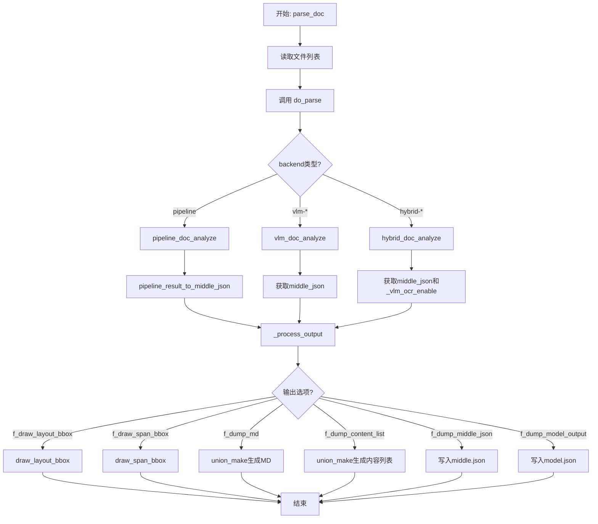
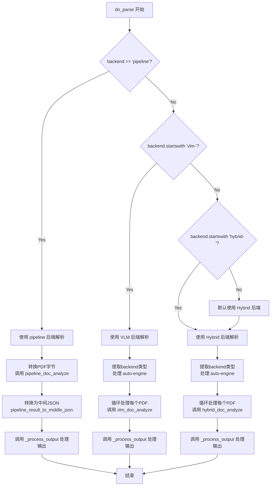
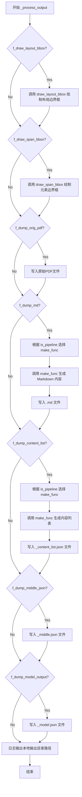
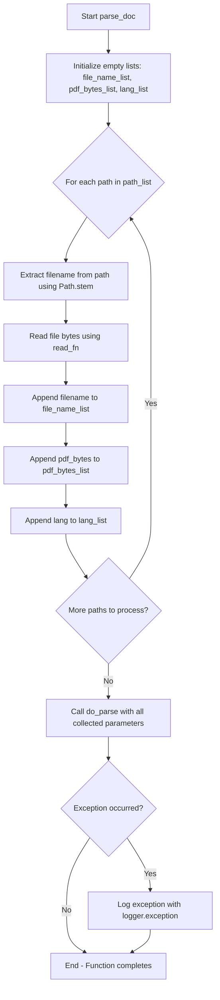

# `MinerU\demo\demo.py` 详细设计文档

这是一个PDF文档解析工具的入口模块，支持多种后端（pipeline、vlm、hybrid）对PDF进行解析，能够提取文本、表格、公式等内容，并输出Markdown、JSON等格式的结果

## 整体流程



## 类结构

```
该文件为模块入口，无类定义
所有功能由全局函数实现
```

## 全局变量及字段


### `__dir__`
    
当前脚本文件所在的目录路径

类型：`str`
    


### `pdf_files_dir`
    
存放待解析PDF文件的输入目录路径

类型：`str`
    


### `output_dir`
    
输出解析结果的目录路径

类型：`str`
    


### `pdf_suffixes`
    
支持的PDF文件后缀名列表，当前仅支持pdf格式

类型：`list[str]`
    


### `image_suffixes`
    
支持的图片文件后缀名列表，包含png、jpeg、jp2、webp、gif、bmp、jpg等格式

类型：`list[str]`
    


### `doc_path_list`
    
待解析的文档路径列表，通过筛选pdf和图片文件得到

类型：`list[Path]`
    


    

## 全局函数及方法


### `do_parse`

`do_parse` 是文档解析的核心入口函数，支持多种后端（pipeline、vlm、hybrid）解析PDF文件，将PDF字节流转为结构化的中间JSON、Markdown文档和可视化边界框，并提供丰富的输出选项控制。

参数：

- `output_dir`：`str`，输出目录，用于存储解析结果
- `pdf_file_names`：`list[str]`，待解析的PDF文件名列表
- `pdf_bytes_list`：`list[bytes]`，待解析的PDF字节列表
- `p_lang_list`：`list[str]`，每个PDF的语言列表，默认为 'ch'（中文）
- `backend`：`str`，解析PDF的后端，默认为 'hybrid-auto-engine'
- `parse_method`：`str`，解析PDF的方法，默认为 'auto'
- `formula_enable`：`bool`，是否启用公式解析
- `table_enable`：`bool`，是否启用表格解析
- `server_url`：`str`，vlm-http-client 后端的服务器URL
- `f_draw_layout_bbox`：`bool`，是否绘制布局边界框
- `f_draw_span_bbox`：`bool`，是否绘制span边界框
- `f_dump_md`：`bool`，是否导出markdown文件
- `f_dump_middle_json`：`bool`，是否导出中间JSON文件
- `f_dump_model_output`：`bool`，是否导出模型输出文件
- `f_dump_orig_pdf`：`bool`，是否导出原始PDF文件
- `f_dump_content_list`：`bool`，是否导出内容列表文件
- `f_make_md_mode`：`MakeMode`，制作markdown内容的模式，默认为 MM_MD
- `start_page_id`：`int`，解析的起始页码，默认为0
- `end_page_id`：`int`，解析的结束页码，默认为None（解析到文档末尾）

返回值：`None`，该函数直接处理PDF解析并将结果写入指定目录，无返回值

#### 流程图



#### 带注释源码

```python
def do_parse(
    output_dir,  # Output directory for storing parsing results
    pdf_file_names: list[str],  # List of PDF file names to be parsed
    pdf_bytes_list: list[bytes],  # List of PDF bytes to be parsed
    p_lang_list: list[str],  # List of languages for each PDF, default is 'ch' (Chinese)
    backend="hybrid-auto-engine",  # The backend for parsing PDF, default is 'hybrid-auto-engine'
    parse_method="auto",  # The method for parsing PDF, default is 'auto'
    formula_enable=True,  # Enable formula parsing
    table_enable=True,  # Enable table parsing
    server_url=None,  # Server URL for vlm-http-client backend
    f_draw_layout_bbox=True,  # Whether to draw layout bounding boxes
    f_draw_span_bbox=True,  # Whether to draw span bounding boxes
    f_dump_md=True,  # Whether to dump markdown files
    f_dump_middle_json=True,  # Whether to dump middle JSON files
    f_dump_model_output=True,  # Whether to dump model output files
    f_dump_orig_pdf=True,  # Whether to dump original PDF files
    f_dump_content_list=True,  # Whether to dump content list files
    f_make_md_mode=MakeMode.MM_MD,  # The mode for making markdown content, default is MM_MD
    start_page_id=0,  # Start page ID for parsing, default is 0
    end_page_id=None,  # End page ID for parsing, default is None (parse all pages until the end of the document)
):
    """
    文档解析核心入口函数，支持多种后端解析PDF
    
    支持的后端类型：
    - pipeline: 通用解析引擎
    - vlm-*: 基于视觉语言模型的解析
    - hybrid-*: 混合解析方案（下一代高精度方案）
    """
    
    # 判断使用哪种后端进行解析
    if backend == "pipeline":
        # ========== Pipeline 后端处理流程 ==========
        
        # 1. 转换PDF字节（按页码范围裁剪）
        for idx, pdf_bytes in enumerate(pdf_bytes_list):
            new_pdf_bytes = convert_pdf_bytes_to_bytes_by_pypdfium2(pdf_bytes, start_page_id, end_page_id)
            pdf_bytes_list[idx] = new_pdf_bytes

        # 2. 执行pipeline文档分析（推理）
        infer_results, all_image_lists, all_pdf_docs, lang_list, ocr_enabled_list = \
            pipeline_doc_analyze(
                pdf_bytes_list, 
                p_lang_list, 
                parse_method=parse_method, 
                formula_enable=formula_enable,
                table_enable=table_enable
            )

        # 3. 遍历每个PDF的处理结果
        for idx, model_list in enumerate(infer_results):
            # 深拷贝模型输出，保留原始结果
            model_json = copy.deepcopy(model_list)
            pdf_file_name = pdf_file_names[idx]
            
            # 准备输出环境（创建图像和markdown目录）
            local_image_dir, local_md_dir = prepare_env(output_dir, pdf_file_name, parse_method)
            image_writer, md_writer = FileBasedDataWriter(local_image_dir), FileBasedDataWriter(local_md_dir)

            images_list = all_image_lists[idx]
            pdf_doc = all_pdf_docs[idx]
            _lang = lang_list[idx]
            _ocr_enable = ocr_enabled_list[idx]
            
            # 4. 转换模型结果为中间JSON格式
            middle_json = pipeline_result_to_middle_json(
                model_list, images_list, pdf_doc, image_writer, _lang, _ocr_enable, formula_enable
            )

            pdf_info = middle_json["pdf_info"]
            pdf_bytes = pdf_bytes_list[idx]
            
            # 5. 处理输出（生成markdown、边界框可视化等）
            _process_output(
                pdf_info, pdf_bytes, pdf_file_name, local_md_dir, local_image_dir,
                md_writer, f_draw_layout_bbox, f_draw_span_bbox, f_dump_orig_pdf,
                f_dump_md, f_dump_content_list, f_dump_middle_json, f_dump_model_output,
                f_make_md_mode, middle_json, model_json, is_pipeline=True
            )
    else:
        # ========== 非Pipeline后端处理 ==========
        
        # VLM和Hybrid后端不支持span边界框绘制
        f_draw_span_bbox = False

        # 判断是否使用VLM后端
        if backend.startswith("vlm-"):
            # 提取实际的backend类型（如 auto-engine, http-client）
            backend = backend[4:]

            # 处理自动引擎选择
            if backend == "auto-engine":
                backend = get_vlm_engine(inference_engine='auto', is_async=False)

            parse_method = "vlm"
            
            # 遍历每个PDF进行处理
            for idx, pdf_bytes in enumerate(pdf_bytes_list):
                pdf_file_name = pdf_file_names[idx]
                # 转换PDF字节
                pdf_bytes = convert_pdf_bytes_to_bytes_by_pypdfium2(pdf_bytes, start_page_id, end_page_id)
                
                # 准备输出环境
                local_image_dir, local_md_dir = prepare_env(output_dir, pdf_file_name, parse_method)
                image_writer, md_writer = FileBasedDataWriter(local_image_dir), FileBasedDataWriter(local_md_dir)
                
                # 调用VLM文档分析
                middle_json, infer_result = vlm_doc_analyze(
                    pdf_bytes, 
                    image_writer=image_writer, 
                    backend=backend, 
                    server_url=server_url
                )

                pdf_info = middle_json["pdf_info"]

                # 处理输出
                _process_output(
                    pdf_info, pdf_bytes, pdf_file_name, local_md_dir, local_image_dir,
                    md_writer, f_draw_layout_bbox, f_draw_span_bbox, f_dump_orig_pdf,
                    f_dump_md, f_dump_content_list, f_dump_middle_json, f_dump_model_output,
                    f_make_md_mode, middle_json, infer_result, is_pipeline=False
                )
        
        # 判断是否使用Hybrid后端
        elif backend.startswith("hybrid-"):
            # 提取实际的backend类型
            backend = backend[7:]

            # 处理自动引擎选择
            if backend == "auto-engine":
                backend = get_vlm_engine(inference_engine='auto', is_async=False)

            # 设置解析方法为hybrid模式
            parse_method = f"hybrid_{parse_method}"
            
            # 遍历每个PDF进行处理
            for idx, pdf_bytes in enumerate(pdf_bytes_list):
                pdf_file_name = pdf_file_names[idx]
                # 转换PDF字节
                pdf_bytes = convert_pdf_bytes_to_bytes_by_pypdfium2(pdf_bytes, start_page_id, end_page_id)
                
                # 准备输出环境
                local_image_dir, local_md_dir = prepare_env(output_dir, pdf_file_name, parse_method)
                image_writer, md_writer = FileBasedDataWriter(local_image_dir), FileBasedDataWriter(local_md_dir)
                
                # 调用Hybrid文档分析
                middle_json, infer_result, _vlm_ocr_enable = hybrid_doc_analyze(
                    pdf_bytes,
                    image_writer=image_writer,
                    backend=backend,
                    parse_method=parse_method,
                    language=p_lang_list[idx],
                    inline_formula_enable=formula_enable,
                    server_url=server_url,
                )

                pdf_info = middle_json["pdf_info"]

                # 处理输出
                _process_output(
                    pdf_info, pdf_bytes, pdf_file_name, local_md_dir, local_image_dir,
                    md_writer, f_draw_layout_bbox, f_draw_span_bbox, f_dump_orig_pdf,
                    f_dump_md, f_dump_content_list, f_dump_middle_json, f_dump_model_output,
                    f_make_md_mode, middle_json, infer_result, is_pipeline=False
                )
```


### `_process_output`

该函数是PDF文档解析流程中的核心输出处理模块，负责将解析结果（布局信息、Markdown内容、中间JSON、模型输出等）根据配置条件写入磁盘，并可选地生成可视化边界框的PDF文件。

参数：

- `pdf_info`：`dict`，包含PDF文档的结构化信息，如页面布局、元素位置等
- `pdf_bytes`：`bytes`，PDF文件的原始字节数据
- `pdf_file_name`：`str`，原始PDF文件的名称（不含路径）
- `local_md_dir`：`str`，本地用于存储Markdown输出文件的目录路径
- `local_image_dir`：`str`，本地用于存储图像文件的目录路径
- `md_writer`：`FileBasedDataWriter`，用于将数据写入本地文件系统的写入器实例
- `f_draw_layout_bbox`：`bool`，是否绘制并输出包含布局边界框的可视化PDF文件
- `f_draw_span_bbox`：`bool`，是否绘制并输出包含元素边界框的可视化PDF文件
- `f_dump_orig_pdf`：`bool`，是否将原始PDF文件拷贝到输出目录
- `f_dump_md`：`bool`，是否生成并写入Markdown格式的文档内容
- `f_dump_content_list`：`bool`，是否生成并写入JSON格式的内容列表文件
- `f_dump_middle_json`：`bool`，是否将中间JSON格式的解析结果写入文件
- `f_dump_model_output`：`bool`，是否将模型原始输出写入JSON文件
- `f_make_md_mode`：`MakeMode`，Markdown内容生成的模式枚举值
- `middle_json`：`dict`，包含文档结构化解析结果的中间JSON数据
- `model_output`：`dict`，可选，模型推理的原始输出结果
- `is_pipeline`：`bool`，指示当前解析流程使用的是pipeline后端还是vlm/hybrid后端

返回值：`None`，该函数无返回值，仅执行文件写入和日志输出操作

#### 流程图



#### 带注释源码

```python
def _process_output(
        pdf_info,                   # PDF文档的结构化信息（布局、元素位置等）
        pdf_bytes,                  # PDF文件的原始字节数据
        pdf_file_name,              # PDF文件名（不含路径）
        local_md_dir,               # 本地Markdown输出目录
        local_image_dir,            # 本地图像输出目录
        md_writer,                  # 文件写入器实例
        f_draw_layout_bbox,         # 是否绘制布局边界框
        f_draw_span_bbox,           # 是否绘制span边界框
        f_dump_orig_pdf,            # 是否保留原始PDF
        f_dump_md,                  # 是否生成Markdown
        f_dump_content_list,        # 是否生成内容列表JSON
        f_dump_middle_json,         # 是否生成中间JSON
        f_dump_model_output,        # 是否保存模型输出
        f_make_md_mode,             # Markdown生成模式
        middle_json,                # 中间解析结果JSON
        model_output=None,          # 模型原始输出（可选）
        is_pipeline=True            # 是否使用pipeline后端
):
    """处理输出文件：根据配置条件生成各种输出文件（可视化PDF、Markdown、JSON等）"""
    
    # 1. 如果启用布局边界框绘制，则生成包含布局区域可视化的PDF
    if f_draw_layout_bbox:
        draw_layout_bbox(pdf_info, pdf_bytes, local_md_dir, f"{pdf_file_name}_layout.pdf")

    # 2. 如果启用span边界框绘制，则生成包含详细元素边界框的PDF
    if f_draw_span_bbox:
        draw_span_bbox(pdf_info, pdf_bytes, local_md_dir, f"{pdf_file_name}_span.pdf")

    # 3. 如果启用原始PDF转储，则将原始PDF文件拷贝到输出目录
    if f_dump_orig_pdf:
        md_writer.write(
            f"{pdf_file_name}_origin.pdf",
            pdf_bytes,
        )

    # 提取图像目录的基础名称，用于Markdown中的图像引用
    image_dir = str(os.path.basename(local_image_dir))

    # 4. 如果启用Markdown生成，则根据后端类型选择对应的生成函数
    if f_dump_md:
        # pipeline后端和vlm/hybrid后端使用不同的内容生成函数
        make_func = pipeline_union_make if is_pipeline else vlm_union_make
        # 生成Markdown格式的文档内容字符串
        md_content_str = make_func(pdf_info, f_make_md_mode, image_dir)
        # 写入Markdown文件
        md_writer.write_string(
            f"{pdf_file_name}.md",
            md_content_str,
        )

    # 5. 如果启用内容列表生成，则生成结构化的内容列表JSON
    if f_dump_content_list:
        make_func = pipeline_union_make if is_pipeline else vlm_union_make
        content_list = make_func(pdf_info, MakeMode.CONTENT_LIST, image_dir)
        md_writer.write_string(
            f"{pdf_file_name}_content_list.json",
            json.dumps(content_list, ensure_ascii=False, indent=4),
        )

    # 6. 如果启用中间JSON转储，则将完整的解析中间结果写入文件
    if f_dump_middle_json:
        md_writer.write_string(
            f"{pdf_file_name}_middle.json",
            json.dumps(middle_json, ensure_ascii=False, indent=4),
        )

    # 7. 如果启用模型输出转储，则将模型推理的原始结果写入文件
    if f_dump_model_output:
        md_writer.write_string(
            f"{pdf_file_name}_model.json",
            json.dumps(model_output, ensure_ascii=False, indent=4),
        )

    # 8. 日志记录输出目录路径，便于用户查找结果
    logger.info(f"local output dir is {local_md_dir}")
```


### `parse_doc`

该函数是文档解析的主入口函数，用于解析PDF或图像文档。它接收文件路径列表，根据指定的语言、解析方法和后端引擎对文档进行处理，并将结果输出到指定目录。

参数：

- `path_list`：`list[Path]`，待解析的文档路径列表，支持PDF或图像文件
- `output_dir`：目录路径，用于存储解析结果的输出目录
- `lang`：`str`，语言选项，默认为'ch'（中文），可选值包括'ch', 'ch_server', 'ch_lite', 'en', 'korean', 'japan', 'chinese_cht', 'ta', 'te', 'ka', 'th', 'el', 'latin', 'arabic', 'east_slavic', 'cyrillic', 'devanagari'
- `backend`：`str`，解析后端，默认为'hybrid-auto-engine'，可选值包括'pipeline', 'vlm-auto-engine', 'vlm-http-client', 'hybrid-auto-engine', 'hybrid-http-client'
- `method`：`str`，解析方法，默认为'auto'，可选值包括'auto', 'txt', 'ocr'
- `server_url`：`Optional[str]`，当backend为'http-client'时需要指定服务器URL，例如'http://127.0.0.1:30000'
- `start_page_id`：`int`，解析起始页码，默认为0
- `end_page_id`：`Optional[int]`，解析结束页码，默认为None（解析到文档最后一页）

返回值：`None`，该函数不返回任何值，仅执行文档解析和输出操作

#### 流程图



#### 带注释源码

```python
def parse_doc(
        path_list: list[Path],
        output_dir,
        lang="ch",
        backend="hybrid-auto-engine",
        method="auto",
        server_url=None,
        start_page_id=0,
        end_page_id=None
):
    """
        Parameter description:
        path_list: List of document paths to be parsed, can be PDF or image files.
        output_dir: Output directory for storing parsing results.
        lang: Language option, default is 'ch', optional values include['ch', 'ch_server', 'ch_lite', 'en', 'korean', 'japan', 'chinese_cht', 'ta', 'te', 'ka', 'th', 'el',
                       'latin', 'arabic', 'east_slavic', 'cyrillic', 'devanagari']。
            Input the languages in the pdf (if known) to improve OCR accuracy.  Optional.
            Adapted only for the case where the backend is set to 'pipeline' and 'hybrid-*'
        backend: the backend for parsing pdf:
            pipeline: More general.
            vlm-auto-engine: High accuracy via local computing power.
            vlm-http-client: High accuracy via remote computing power(client suitable for openai-compatible servers).
            hybrid-auto-engine: Next-generation high accuracy solution via local computing power.
            hybrid-http-client: High accuracy but requires a little local computing power(client suitable for openai-compatible servers).
            Without method specified, hybrid-auto-engine will be used by default.
        method: the method for parsing pdf:
            auto: Automatically determine the method based on the file type.
            txt: Use text extraction method.
            ocr: Use OCR method for image-based PDFs.
            Without method specified, 'auto' will be used by default.
            Adapted only for the case where the backend is set to 'pipeline' and 'hybrid-*'.
        server_url: When the backend is `http-client`, you need to specify the server_url, for example:`http://127.0.0.1:30000`
        start_page_id: Start page ID for parsing, default is 0
        end_page_id: End page ID for parsing, default is None (parse all pages until the end of the document)
    """
    try:
        # 初始化空列表，用于存储文件名、PDF字节和语言列表
        file_name_list = []
        pdf_bytes_list = []
        lang_list = []
        
        # 遍历所有输入路径，读取文件内容
        for path in path_list:
            # 从路径中提取文件名（不含扩展名）
            file_name = str(Path(path).stem)
            # 读取文件为字节流
            pdf_bytes = read_fn(path)
            # 将文件名、文件字节、语言添加到对应列表
            file_name_list.append(file_name)
            pdf_bytes_list.append(pdf_bytes)
            lang_list.append(lang)
        
        # 调用核心解析函数do_parse，传入所有收集的参数
        do_parse(
            output_dir=output_dir,
            pdf_file_names=file_name_list,
            pdf_bytes_list=pdf_bytes_list,
            p_lang_list=lang_list,
            backend=backend,
            parse_method=method,
            server_url=server_url,
            start_page_id=start_page_id,
            end_page_id=end_page_id
        )
    except Exception as e:
        # 捕获所有异常并记录日志
        logger.exception(e)
```

## 关键组件


### do_parse 函数

主解析入口函数，支持多种后端（pipeline、vlm-*、hybrid-*）解析PDF文件，根据backend参数分发到不同的解析流程，处理PDF字节列表并生成中间JSON结果

### _process_output 函数

输出处理函数，负责将解析结果写入多种格式的文件，包括：绘制布局边界框、绘制span边界框、存储原始PDF、生成markdown文件、生成内容列表JSON、生成中间JSON和模型输出JSON

### parse_doc 函数

文档解析的公开API入口，接收文件路径列表和配置参数，负责文件读取、参数预处理，然后调用do_parse执行实际解析工作

### pipeline 后端解析流程

使用传统的pipeline_doc_analyze进行文档分析，通过pipeline_result_to_middle_json转换结果，使用pipeline_union_make生成markdown内容，支持完整的OCR和表格解析

### vlm 后端解析流程

基于视觉语言模型（VLM）的解析方案，支持auto-engine本地引擎和http-client远程服务器调用，通过vlm_doc_analyze执行分析，vlm_union_make生成输出

### hybrid 后端解析流程

混合解析引擎，结合本地计算和VLM能力，通过hybrid_doc_analyze实现，支持hybrid_auto-engine和http-client模式，提供更高精度的解析结果

### 多后端自动选择机制

通过get_vlm_engine实现推理引擎的自动选择，支持inference_engine='auto'参数，根据系统环境自动配置最优的VLM计算后端

### 灵活的配置参数系统

支持丰富的解析配置，包括：公式解析开关、表格解析开关、起始/结束页码指定、多种输出格式开关（markdown/JSON/原始PDF/模型输出）、markdown生成模式选择

### 文件读写抽象层

使用FileBasedDataWriter实现文件写入抽象，封装了本地文件系统的操作，通过prepare_env创建输出目录结构，实现图像和markdown文件的分离存储


## 问题及建议


### 已知问题

-   **参数过多（代码异味）**：`do_parse` 函数包含20+参数，`parse_doc` 包含8个参数，参数过多导致函数签名复杂、难以维护和调用，增加出错概率。
-   **代码重复**：`do_parse` 函数中 pipeline、vlm、hybrid 三个分支存在大量重复的 PDF 转换、目录创建、文件写入逻辑；`_process_output` 中 `make_func = pipeline_union_make if is_pipeline else vlm_union_make` 重复出现。
-   **魔法字符串和硬编码**：后端名称（"pipeline"、"vlm-"、"hybrid-"、"auto-engine"等）以硬编码字符串形式散布在代码中，缺乏统一的常量或枚举定义。
-   **PDF 转换逻辑不一致**：pipeline 分支在循环外部对整个 `pdf_bytes_list` 进行转换，而 vlm/hybrid 分支在循环内部对每个 PDF 单独转换，这种不一致可能导致行为差异和维护困难。
-   **错误处理过于宽泛**：`parse_doc` 中使用 `except Exception as e` 捕获所有异常，无法针对特定错误类型进行差异化处理，且无重试机制或降级策略。
-   **内存使用隐患**：使用 `copy.deepcopy(model_list)` 深拷贝模型输出，在处理大型 PDF 时可能导致内存占用翻倍；整个 PDF 字节列表一次性加载到内存中。
-   **日志记录不足**：仅在处理完成后输出 `logger.info`，中间过程缺乏日志记录，难以排查问题。
-   **缺乏文件存在性检查**：在 `parse_doc` 中直接调用 `read_fn(path)` 读取文件，未检查文件是否存在或路径是否有效。
-   **类型注解不完整**：部分变量如 `infer_result` 在某些分支中缺少明确的类型注解。

### 优化建议

-   **参数封装**：创建配置类（如 `ParseConfig`、`BackendOptions`）将相关参数分组，减少函数签名复杂度，提高可读性和可维护性。
-   **提取公共逻辑**：将 PDF 转换、环境准备（目录创建、writer 初始化）等重复代码提取为独立函数或方法，消除代码重复。
-   **定义常量/枚举**：创建后端类型枚举（如 `BackendType`）和常量类，统一管理后端名称和解析方法字符串，避免硬编码。
-   **统一转换逻辑**：重构代码结构，统一各后端的 PDF 转换时机和方式，消除不一致性。
-   **细化错误处理**：针对不同异常类型（文件不存在、网络超时、模型加载失败等）设计不同的处理策略，考虑增加重试机制。
-   **优化内存使用**：考虑使用浅拷贝或引用而非深拷贝；针对大型 PDF 可考虑流式处理或分批处理。
-   **完善日志记录**：在关键步骤（开始解析、模型推理、文件输出等）添加日志，便于问题追踪和性能监控。
-   **增加前置检查**：在读取文件前检查路径有效性、文件是否存在，提升代码健壮性。
-   **补充类型注解**：为所有公共函数和复杂逻辑补充完整的类型注解，提升代码可读性和静态检查能力。


## 其它


### 设计目标与约束

本项目旨在提供一个通用的PDF文档解析工具，支持多种后端引擎（pipeline、vlm、hybrid）将PDF文档解析为结构化的Markdown和JSON格式。核心目标包括：1）支持多种语言的中文/英文/多语言文档解析；2）支持表格、公式、布局等复杂元素的提取；3）支持本地和远程两种推理模式；4）提供灵活的配置选项以适应不同场景。主要约束包括：依赖pypdfium2进行PDF处理，VLM后端需要兼容OpenAI接口的服务器，hybrid模式需要一定的本地计算资源。

### 错误处理与异常设计

代码采用多层异常处理机制：1）在`parse_doc`函数中使用try-except捕获所有异常并通过`logger.exception(e)`记录完整堆栈信息；2）后端调用返回None或空列表时未做空值检查，可能导致后续处理失败；3）文件读取失败（`read_fn`）会直接抛出异常；4）网络相关错误（如VLM HTTP客户端）未实现重试机制。建议增加：a) 对空输入列表的校验；b) 对解析结果为空的处理；c) 关键步骤的前置条件检查；d) 分层异常处理策略。

### 数据流与状态机

数据流主要分为三个阶段：1）输入阶段：读取PDF文件字节流和语言参数；2）处理阶段：根据backend选择调用`pipeline_doc_analyze`、`vlm_doc_analyze`或`hybrid_doc_analyze`进行解析，生成模型推理结果→中间JSON→最终输出；3）输出阶段：调用`_process_output`生成多种格式文件（MD/JSON/PDF/图片）。状态转换主要体现在backend类型判断（pipeline/vlm-*/hybrid-*）和解析方法选择（auto/txt/ocr），不同backend对应不同的处理流程和数据转换函数。

### 外部依赖与接口契约

核心依赖包括：1）`pypdfium2`：PDF字节流转换；2）`loguru`：日志记录；3）`mineru.internal`模块：各后端解析引擎（pipeline_analyze、vlm_analyze、hybrid_analyze）；4）`FileBasedDataWriter`：文件写入；5）`draw_bbox`系列：可视化绑定框绘制；6）VLM引擎通过`get_vlm_engine`获取，支持本地推理和HTTP客户端两种模式。接口契约：后端函数需返回包含`pdf_info`和`middle_json`结构的数据，`union_make`函数负责生成Markdown和内容列表。

### 性能考虑与优化空间

性能瓶颈主要集中在：1）PDF字节流重复转换（pipeline模式在循环内外都有转换）；2）逐个文件串行处理，未利用批量处理；3）深拷贝`copy.deepcopy(model_list)`造成内存开销；4）JSON序列化（`json.dumps`）在大文件时可能较慢。优化方向：1）缓存转换后的PDF字节；2）实现文件级别的并行处理（多进程）；3）减少不必要的深拷贝；4）考虑使用`orjson`替代`json`提升序列化性能；5）对于大PDF文件实现流式处理。

### 配置管理

配置主要通过函数参数传递，包括：1）解析后端（backend）：pipeline/vlm-*/hybrid-*；2）解析方法（method）：auto/txt/ocr；3）语言参数（lang）：支持20+种语言；4）功能开关：formula_enable、table_enable、各类dump开关；5）页码范围：start_page_id、end_page_id；6）输出模式：f_make_md_mode。配置特点：静态配置（运行时不可变）、无配置文件支持、环境变量主要用于模型源切换（MINERU_MODEL_SOURCE）。

### 安全性考虑

当前代码安全性考量有限，主要包括：1）文件路径处理使用`Path`对象防止路径注入；2）日志输出可能包含敏感信息（文件路径、PDF内容片段）；3）HTTP客户端模式（server_url）未实现SSL验证配置；4）未对输入文件大小进行限制，可能导致内存溢出；5）`eval`或`exec`类危险函数未使用。改进建议：增加文件大小校验、敏感信息脱敏、HTTP请求安全配置。

### 测试策略建议

当前代码缺少显式测试。测试策略应包括：1）单元测试：各后端解析函数的mock测试；2）集成测试：端到端的PDF解析流程测试；3）基准测试：不同backend的性能对比；4）边界测试：空PDF、多页PDF、特殊字符文档、损坏PDF文件；5）回归测试：确保不同版本的输出一致性。建议使用pytest框架， fixtures管理测试数据和临时目录。

    