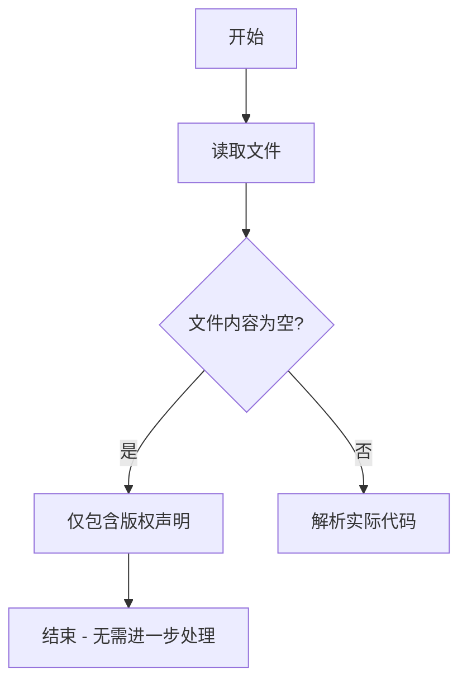

# `MinerU\mineru\__init__.py` 详细设计文档

该文件仅包含版权声明(# Copyright (c) Opendatalab. All rights reserved.)，没有实际的代码实现，是一个空文件或仅包含法律声明的占位文件。

## 整体流程



## 类结构

```

```

## 全局变量及字段


    

## 全局函数及方法


## 关键组件


## 问题及建议


### 已知问题

-   代码文件仅包含版权声明信息，无实际功能代码实现，无法进行有效的架构分析和设计文档生成
-   缺少源代码文件的具体路径和内容，无法提取类、方法、全局变量等设计元素

### 优化建议

-   提供完整的源代码文件内容，以便进行详细的设计文档分析
-   如果这是项目初始化阶段，建议先完成基础代码框架后再进行文档生成工作
-   如需基于版权信息生成文档，建议补充项目的主要功能模块、核心类和方法的具体实现代码


## 其它


### 设计目标与约束

由于提供的代码仅为版权声明（Copyright (c) Opendatalab. All rights reserved.），未包含任何功能实现代码，无法从中提取具体的设计目标与约束。设计文档需要基于实际功能代码才能明确项目的目标、约束条件和业务需求。

### 错误处理与异常设计

当前代码片段中没有包含任何业务逻辑或函数实现，因此无法定义错误处理机制、异常类型、错误码规范或异常传播策略。完整的错误处理设计应包括异常类层次结构、错误消息模板、错误日志规范以及降级策略。

### 数据流与状态机

由于代码中不存在任何数据处理逻辑、状态管理或业务流程，无法绘制数据流图或状态机转换图。详细设计文档需要包含数据输入、处理流程、数据输出以及状态变更的完整描述。

### 外部依赖与接口契约

代码中未声明任何外部依赖库、模块导入或接口定义。详细设计文档应包含所有第三方依赖的版本要求、API接口规范、模块间调用契约以及数据交换格式定义。

### 安全性考虑

当前代码片段为版权声明，不涉及任何安全敏感的功能实现。详细设计文档应包含身份认证、授权控制、数据加密、输入验证、SQL注入防护、XSS防护等安全设计内容。

### 性能要求

由于没有任何功能代码，无法确定性能关键路径、响应时间要求、吞吐量指标、资源利用率限制或性能优化策略。详细设计文档应包含性能基准、瓶颈分析、缓存策略等内容。

### 兼容性设计

代码中未包含任何兼容性相关的实现，如浏览器兼容、操作系统兼容、版本向后兼容或数据格式兼容等。详细设计文档应明确兼容性范围和支持策略。

### 部署和运维考虑

当前代码片段不包含任何部署配置、容器化配置、环境变量定义或运维脚本。详细设计文档应包含部署架构、运维流程、监控告警、备份恢复等运维相关设计。

### 测试策略

由于没有功能代码，无法制定单元测试、集成测试、系统测试或端到端测试的具体策略。详细设计文档应包含测试覆盖率要求、测试用例设计、测试环境规划等内容。

### 监控和日志

代码中未包含任何日志记录语句或监控指标采集逻辑。详细设计文档应定义日志级别、日志格式、关键指标、告警阈值和监控看板的设计。

### 配置管理

当前代码片段没有包含任何配置项或配置管理逻辑。详细设计文档应包含配置项清单、配置存储方式、配置更新机制和配置验证规则的设计。

### 命名规范和代码风格

由于没有实际代码实现，无法定义具体的命名规范（如变量命名、函数命名、类命名）、代码格式化规则、注释规范或代码审查标准。详细设计文档应包含统一的编码规范文档。

### 许可证和法律合规

当前代码片段仅包含版权声明"Copyright (c) Opendatalab. All rights reserved."，但未指定具体的开源许可证类型（如MIT、Apache、GPL等）。详细设计文档应明确项目的许可证条款、第三方组件合规性要求以及法律风险评估。

    