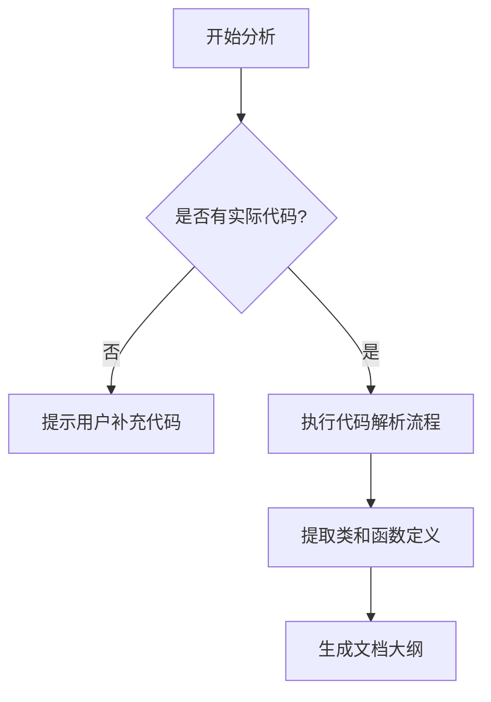

# `MinerU\mineru\backend\__init__.py` 详细设计文档

该文件仅包含版权声明信息，无实际代码实现，无法提取功能描述、类结构、方法和变量等信息。需要提供完整的源代码才能进行详细设计文档的分析和生成。

## 整体流程



## 类结构

```
无法确定 - 代码为空
```

## 全局变量及字段


    

## 全局函数及方法


## 关键组件


## 一段话描述

该代码文件仅包含版权声明信息，无实际功能实现代码，因此无法提取核心功能描述。

## 文件的整体运行流程

由于代码仅包含版权声明，该文件不执行任何运行时逻辑流程。

## 类的详细信息

由于代码中不存在任何类定义，无法提取类信息。

## 关键组件信息

由于代码中不包含任何功能实现代码，无法识别张量索引与惰性加载、反量化支持、量化策略等关键组件。

## 潜在的技术债务或优化空间

由于代码中无功能实现，无法评估技术债务或优化空间。

## 其它项目

- **设计目标与约束**：未提供
- **错误处理与异常设计**：未提供
- **数据流与状态机**：未提供
- **外部依赖与接口契约**：未提供


## 问题及建议


### 已知问题

-   未提供实际代码进行分析，当前仅包含版权声明头，无任何可执行的代码逻辑
-   无法提取类、方法、全局变量等组件信息
-   无法进行流程分析和技术债务评估

### 优化建议

-   请提供完整的源代码以便进行详细的技术分析和设计文档生成
-   如果这是项目的初始阶段，建议先完善核心业务逻辑代码后再进行文档化工作
-   可考虑添加基本的代码框架结构（如必要的类定义、接口定义等）后再进行深度分析


## 其它


### 设计目标与约束

由于提供的代码仅包含版权声明，未包含任何功能性代码，因此无法提取具体的设计目标与约束。在实际项目中，设计目标应明确阐明系统的核心功能、性能指标、技术选型原则以及业务约束条件。

### 错误处理与异常设计

代码中未包含任何错误处理或异常设计逻辑。在实际详细设计文档中，应详细定义异常类型、错误码体系、异常传播机制、降级策略以及日志记录规范。

### 数据流与状态机

由于代码不包含任何业务逻辑实现，无法提取数据流与状态机信息。详细设计文档应包含数据输入输出定义、数据转换流程、状态转换图以及状态管理机制。

### 外部依赖与接口契约

代码中未定义任何外部依赖或接口契约。详细设计文档应列出所有外部依赖库、API接口规范、数据格式约定、版本兼容性要求以及第三方服务集成规范。

### 性能要求与优化空间

代码未包含任何性能相关的实现细节。详细设计文档应包含性能指标定义（如响应时间、吞吐量、资源利用率）、性能测试场景、性能优化策略以及缓存机制设计。

### 安全考虑

代码未包含任何安全相关的实现。详细设计文档应包含身份认证机制、授权策略、数据加密方案、输入验证规则、安全审计日志以及常见安全漏洞防护措施。

### 兼容性设计

代码未包含任何兼容性设计。详细设计文档应定义向前向后兼容性策略、版本演进方案、数据迁移方案、多平台支持计划以及浏览器或环境兼容性要求。

### 测试策略

代码未包含任何测试相关的内容。详细设计文档应包含单元测试策略、集成测试策略、端到端测试计划、测试覆盖率要求、测试环境定义以及回归测试方案。

### 部署与运维

代码未包含任何部署或运维相关的内容。详细设计文档应包含部署架构、配置文件管理、监控告警策略、日志管理规范、备份恢复方案以及容灾设计。

### 架构决策记录

由于代码仅包含版权声明，无法提取具体的架构决策。在实际项目中，架构决策记录应包含关键技术选型理由、架构模式选择、模块划分依据、设计原则遵循情况以及替代方案分析。


    