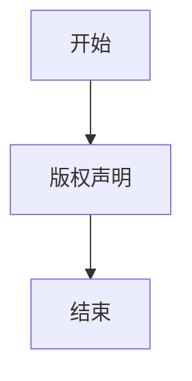

# `MinerU\mineru\backend\hybrid\__init__.py` 详细设计文档

该代码文件仅包含版权声明信息（Copyright (c) Opendatalab. All rights reserved.），没有实际的业务逻辑代码可供分析。

## 整体流程



## 类结构

```

```

## 全局变量及字段


    

## 全局函数及方法


## 关键组件


### 一段话描述

provided code sample contains only a copyright header comment ("# Copyright (c) Opendatalab. All rights reserved.") without any actual functional implementation, therefore no core functionality, class structures, methods, or components can be identified for analysis.

### 文件的整体运行流程

No executable code provided in the given source file; the file contains only a copyright notice and no functional logic, classes, or methods that would define a runtime flow.

### 类的详细信息

No classes are defined in the provided code sample.

### 关键组件信息

No key components (such as tensor indexing, lazy loading, dequantization support, or quantization strategies) are present in the given code.

### 潜在的技术债务或优化空间

No technical debt or optimization opportunities can be identified as there is no actual implementation code to analyze.

### 其它项目

由于提供的代码仅包含版权声明，未包含任何实际实现代码，因此无法提供以下信息：

- 设计目标与约束
- 错误处理与异常设计
- 数据流与状态机
- 外部依赖与接口契约

请提供包含实际功能实现的代码样本，以便进行完整的设计文档分析。


## 问题及建议


### 已知问题

-   该文件仅为版权声明文件，不包含任何实际功能代码，无法进行有效的技术债务分析
-   缺少实际的业务逻辑实现，无法评估代码结构和设计模式
-   缺少错误处理、异常设计等相关代码

### 优化建议

-   这是版权声明文件，后续需要提供实际的业务代码才能进行完整的技术分析和优化建议
-   建议补充完整的业务实现代码以进行详细的技术架构分析
-   若此仓库仅包含版权声明，建议确认代码仓库的完整性


## 其它


### 设计目标与约束

本项目为Opendatalab的开源项目，代码中未包含具体功能实现，无法确定具体的设计目标与约束。基于版权声明推测，该项目旨在提供数据处理或分析相关的工具或库。设计目标需根据实际代码功能确定，可能包括性能优化、易用性、可扩展性等。约束条件可能包括技术栈限制、兼容性要求、许可证约束等。

### 错误处理与异常设计

由于代码中未包含具体功能实现，无法提供详细的错误处理与异常设计信息。通常，错误处理应包括：异常类型定义（如自定义业务异常、系统异常）、异常捕获机制、错误码定义、错误信息日志记录、异常传播策略等。应确保所有可能失败的操作都有相应的错误处理，避免未捕获异常导致程序崩溃。

### 数据流与状态机

代码中未包含数据流或状态机相关实现。数据流设计应描述数据从输入到输出的完整处理过程，包括数据来源、处理步骤、转换逻辑、输出结果等。状态机设计（如有状态转换）应描述状态定义、状态转换条件、触发事件、转换动作等。

### 外部依赖与接口契约

代码中未包含外部依赖信息。根据项目名称Opendatalab推测，该项目可能依赖数据处理相关的第三方库（如pandas、numpy等数据处理库）。接口契约应定义模块间或对外提供的API接口，包括接口名称、参数列表、返回值、异常抛出、调用示例等。

### 性能要求

代码中未包含性能相关实现。性能要求应包括：响应时间、吞吐量、并发处理能力、资源占用（CPU、内存）等指标。这些要求应基于业务需求和用户期望设定，并可通过性能测试验证。

### 安全性考虑

代码中未包含安全相关实现。安全性设计应包括：输入验证、权限控制、数据加密、敏感信息保护、SQL注入防护、XSS防护等。应确保系统符合相关安全标准和最佳实践。

### 兼容性设计

代码中未包含兼容性相关实现。兼容性设计应包括：Python版本支持（至少Python 3.7+）、操作系统兼容性、浏览器兼容性（如Web应用）、第三方库版本兼容性等。应明确声明支持的版本范围。

### 配置管理

代码中未包含配置管理相关实现。配置管理应包括：配置项定义（如数据库连接、API密钥、日志级别）、配置加载方式（环境变量、配置文件、命令行参数）、配置验证、配置加密等。应确保配置与代码分离，便于部署和维护。

### 测试策略

代码中未包含测试代码。测试策略应包括：单元测试（覆盖核心业务逻辑）、集成测试（验证模块间协作）、端到端测试（验证完整业务流程）、测试覆盖率要求（建议80%以上）、测试数据管理、Mock使用规范等。

### 部署架构

代码中未包含部署相关配置。部署架构应包括：部署环境（开发、测试、生产）、部署方式（Docker、Kubernetes、物理机）、服务架构（单体、微服务、Serverless）、负载均衡、缓存策略、数据库部署等。

### 监控与日志

代码中未包含监控与日志相关实现。监控与日志应包括：日志级别定义（日志、警告、错误、调试）、日志格式、日志存储（文件、数据库、第三方服务）、监控指标（性能指标、业务指标）、告警机制、链路追踪等。

### 命名规范

代码中未包含具体代码，无法确定命名规范。通常，命名规范应包括：变量命名（驼峰式、下划线式）、函数命名（动词或动词短语）、类命名（名词或名词短语）、常量命名、文件命名、目录结构等。应保持代码风格一致性。

### 版本控制

代码仓库使用Git进行版本控制。版本控制规范应包括：分支策略（如Git Flow）、提交信息规范、代码审查流程、标签管理、发布流程等。应确保团队协作高效，代码历史可追溯。

### 参考文献

代码中未包含参考文献。参考文献应包括：技术文档、第三方库文档、相关论文、标准规范、算法说明等。这些资料有助于理解设计决策和技术选型。


    