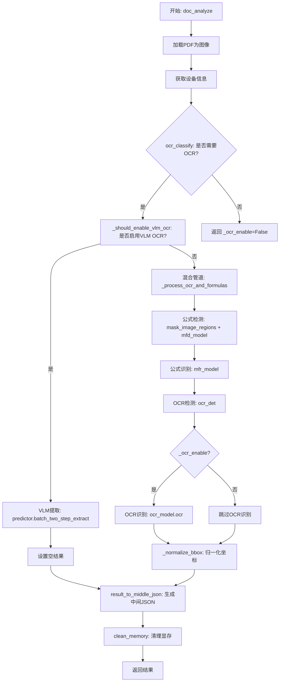
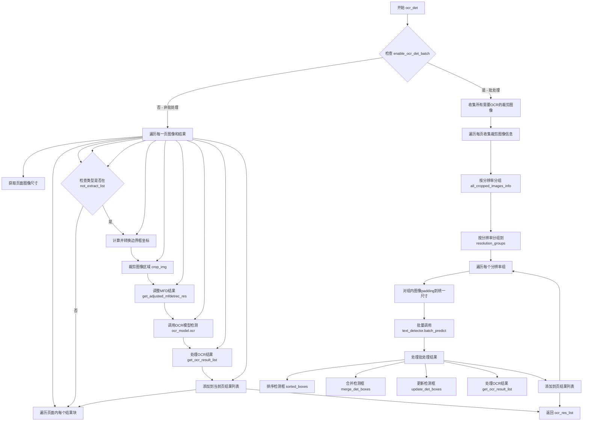
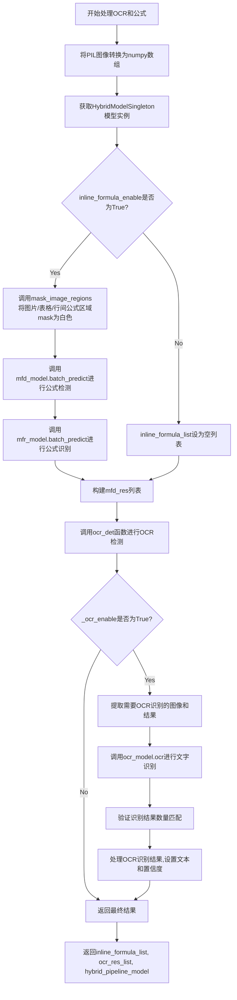
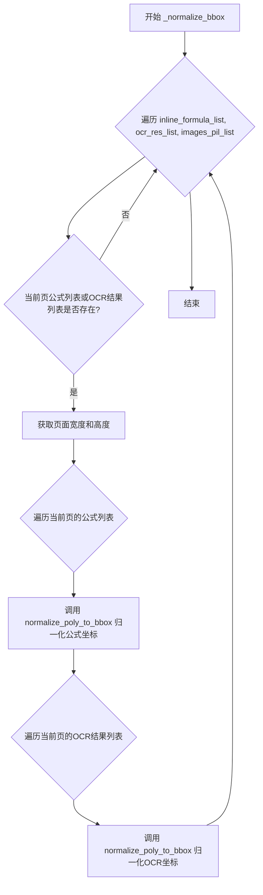
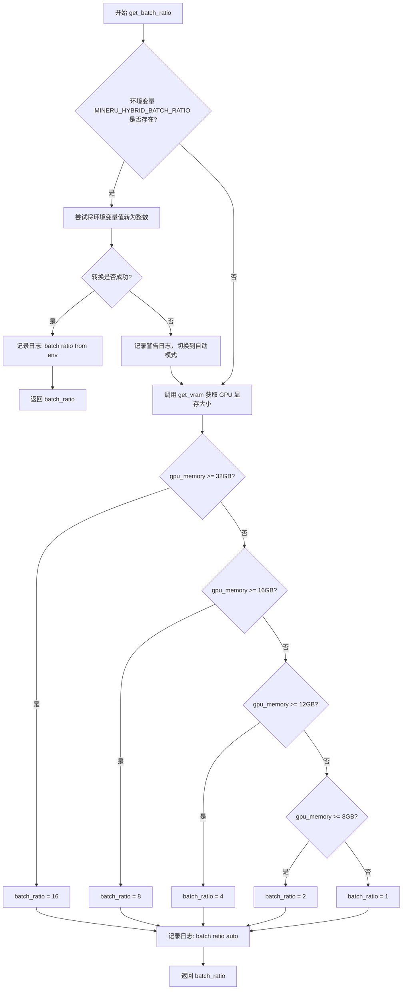
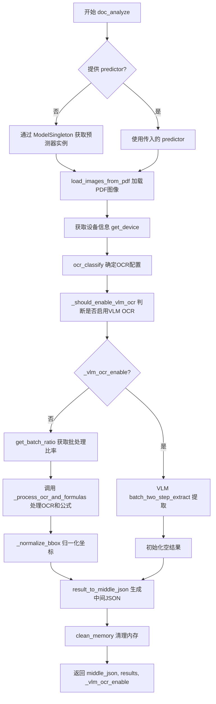
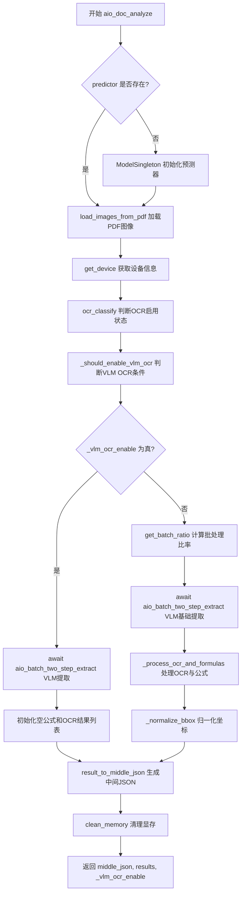
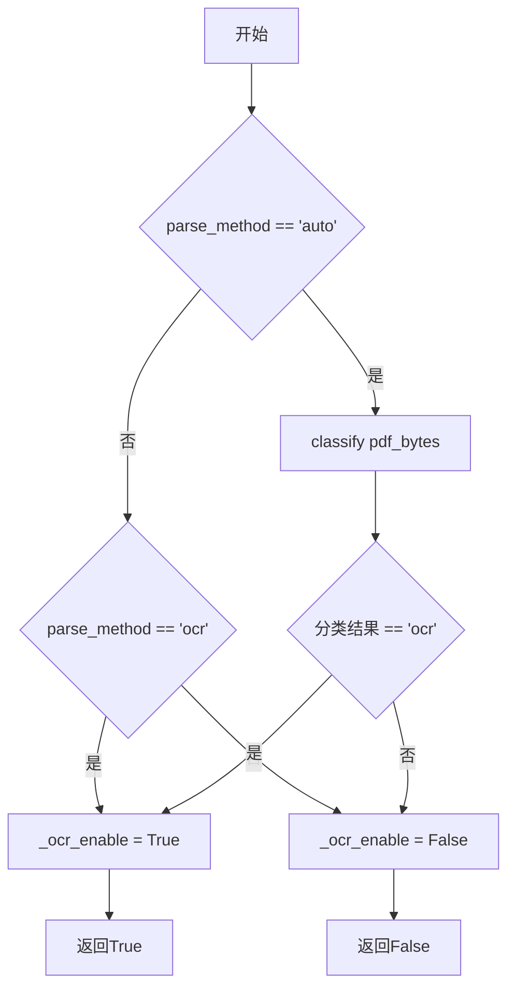
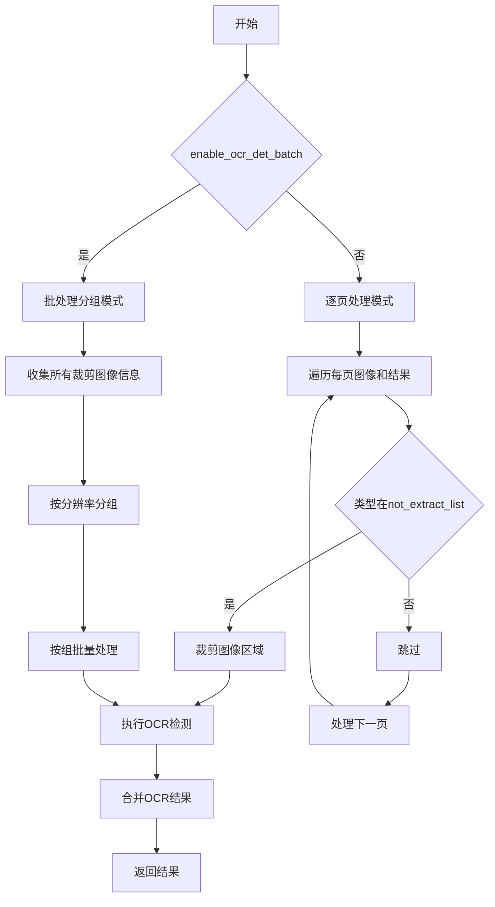
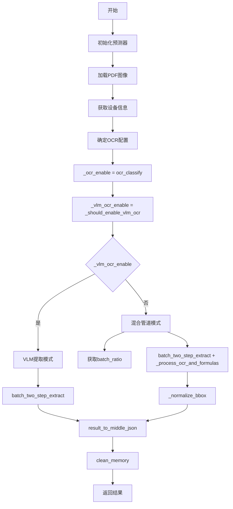

# `MinerU\mineru\backend\hybrid\hybrid_analyze.py` 详细设计文档

这是一个PDF文档分析pipeline，通过结合VLM（视觉语言模型）和传统OCR技术来提取PDF文档中的文本、表格、图像、公式等元素，并生成结构化的JSON数据。

## 整体流程



## 类结构

```
document_analyze.py (模块文件)
└── 主要函数:
    ├── doc_analyze (主入口函数)
    ├── aio_doc_analyze (异步主入口)
    ├── ocr_classify
    ├── ocr_det
    ├── mask_image_regions
    ├── normalize_poly_to_bbox
    ├── _process_ocr_and_formulas
    ├── _normalize_bbox
    ├── get_batch_ratio
    └── _should_enable_vlm_ocr
```

## 全局变量及字段


### `MFR_BASE_BATCH_SIZE`
    
基础批处理大小，用于公式识别模型的批处理推理

类型：`int`
    


### `OCR_DET_BASE_BATCH_SIZE`
    
基础批处理大小，用于OCR文本检测模型的批处理推理

类型：`int`
    


### `not_extract_list`
    
不提取的元素类型列表，用于过滤掉不需要进行OCR检测的块类型

类型：`list[str]`
    


### `RESOLUTION_GROUP_STRIDE`
    
分辨率分组步长，用于将图像按分辨率分组进行批处理时的对齐尺寸

类型：`int`
    


    

## 全局函数及方法


### ocr_classify

该函数用于判断当前PDF文档是否需要启用OCR（光学字符识别）功能。它通过检查解析方法参数（`parse_method`）以及调用分类器对PDF字节数据进行分析，来决定是否开启OCR引擎。

参数：

-  `pdf_bytes`：`bytes`，PDF文件的原始字节流，用于分类器进行内容分析。
-  `parse_method`：`str`，解析模式。默认为 'auto'（自动判断），当设置为 'ocr' 时强制启用OCR。

返回值：`bool`，返回 `True` 表示启用OCR，返回 `False` 表示不启用。

#### 流程图

```mermaid
flowchart TD
    A([Start ocr_classify]) --> B{parse_method == 'auto'}
    B -- Yes --> C[调用 classify(pdf_bytes) 进行分类]
    C --> D{分类结果 == 'ocr'}
    D -- Yes --> E[_ocr_enable = True]
    D -- No --> F[_ocr_enable = False]
    B -- No --> G{parse_method == 'ocr'}
    G -- Yes --> E
    G -- No --> F
    E --> H([Return True])
    F --> I([Return False])
```

#### 带注释源码

```python
def ocr_classify(pdf_bytes, parse_method: str = 'auto',) -> bool:
    # 确定OCR设置
    _ocr_enable = False
    if parse_method == 'auto':
        # 如果是自动模式，则调用分类函数判断是否为OCR文档
        if classify(pdf_bytes) == 'ocr':
            _ocr_enable = True
    elif parse_method == 'ocr':
        # 如果手动指定为ocr模式，则强制启用
        _ocr_enable = True
    return _ocr_enable
```


### `ocr_det`

该函数是 OCR 检测的核心入口，负责对 PDF 页面中的图像、表格、公式等区域进行文字检测。它支持两种模式：非批处理模式逐页处理图像，批处理模式则按分辨率分组后批量处理，以提高推理效率。

参数：

-  `hybrid_pipeline_model`：`HybridPipelineModel`，混合管道模型实例，包含 OCR 模型
-  `np_images`：`List[np.ndarray]`，PDF 页面转换后的 NumPy 图像列表
-  `results`：`List[List[dict]]`，VLM（视觉语言模型）输出的每页布局分析结果
-  `mfd_res`：`List[List[dict]]`，行内公式检测结果列表
-  `_ocr_enable`：`bool`，是否启用 OCR 识别（仅检测或检测+识别）
-  `batch_radio`：`int`，批处理倍率，默认为 1，用于调整批处理大小

返回值：`List[List[dict]]`，返回每页的 OCR 检测结果列表，外层列表索引对应页码，内层列表包含该页所有检测到的文字块信息

#### 流程图



#### 带注释源码

```python
def ocr_det(
    hybrid_pipeline_model,  # 混合管道模型，包含ocr_model
    np_images,              # PDF页面的NumPy图像列表
    results,                # VLM输出的布局分析结果
    mfd_res,                # 行内公式检测结果
    _ocr_enable,            # 是否启用OCR标志
    batch_radio: int = 1,   # 批处理倍率，控制batch大小
):
    """
    OCR检测函数，支持批处理和非批处理两种模式
    - 非批处理：逐页逐区域处理，适用于小批量或资源受限场景
    - 批处理：按分辨率分组后批量处理，提高GPU利用率
    """
    ocr_res_list = []  # 存储最终的OCR结果
    
    # 判断是否启用批处理模式
    if not hybrid_pipeline_model.enable_ocr_det_batch:
        # ==================== 非批处理模式 ====================
        # 逐页处理：对每一页图像单独进行OCR检测
        for np_image, page_mfd_res, page_results in tqdm(
            zip(np_images, mfd_res, results),
            total=len(np_images),
            desc="OCR-det"
        ):
            ocr_res_list.append([])  # 初始化当前页的结果列表
            img_height, img_width = np_image.shape[:2]  # 获取图像尺寸
            
            # 遍历页面内的每个布局块
            for res in page_results:
                # 仅对特定类型（图像、表格、公式等）进行OCR检测
                if res['type'] not in not_extract_list:
                    continue
                
                # 将归一化坐标转换为像素坐标，并进行边界检查
                x0 = max(0, int(res['bbox'][0] * img_width))
                y0 = max(0, int(res['bbox'][1] * img_height))
                x1 = min(img_width, int(res['bbox'][2] * img_width))
                y1 = min(img_height, int(res['bbox'][3] * img_height))
                
                # 过滤无效的边界框
                if x1 <= x0 or y1 <= y0:
                    continue
                
                # 为结果添加poly多边形坐标（用于后续处理）
                res['poly'] = [x0, y0, x1, y0, x1, y1, x0, y1]
                
                # 裁剪图像区域，四周扩展50像素（防止文字被截断）
                new_image, useful_list = crop_img(
                    res, np_image, crop_paste_x=50, crop_paste_y=50
                )
                
                # 根据裁剪区域调整公式检测结果坐标
                adjusted_mfdetrec_res = get_adjusted_mfdetrec_res(
                    page_mfd_res, useful_list
                )
                
                # 转换颜色通道：RGB转BGR（OCR模型需要BGR）
                bgr_image = cv2.cvtColor(new_image, cv2.COLOR_RGB2BGR)
                
                # 调用OCR模型进行文字检测（rec=False只检测不识别）
                ocr_res = hybrid_pipeline_model.ocr_model.ocr(
                    bgr_image, mfd_res=adjusted_mfdetrec_res, rec=False
                )[0]
                
                # 处理OCR检测结果
                if ocr_res:
                    ocr_result_list = get_ocr_result_list(
                        ocr_res, useful_list, _ocr_enable, bgr_image, hybrid_pipeline_model.lang
                    )
                    # 将当前页的结果添加到总结果中
                    ocr_res_list[-1].extend(ocr_result_list)
    else:
        # ==================== 批处理模式 ====================
        # 1. 收集所有需要OCR检测的裁剪图像信息
        all_cropped_images_info = []

        for np_image, page_mfd_res, page_results in zip(
                np_images, mfd_res, results
        ):
            ocr_res_list.append([])
            img_height, img_width = np_image.shape[:2]
            
            # 遍历页面内的每个布局块（与非批处理相同的逻辑）
            for res in page_results:
                if res['type'] not in not_extract_list:
                    continue
                
                x0 = max(0, int(res['bbox'][0] * img_width))
                y0 = max(0, int(res['bbox'][1] * img_height))
                x1 = min(img_width, int(res['bbox'][2] * img_width))
                y1 = min(img_height, int(res['bbox'][3] * img_height))
                
                if x1 <= x0 or y1 <= y0:
                    continue
                
                res['poly'] = [x0, y0, x1, y0, x1, y1, x0, y1]
                new_image, useful_list = crop_img(
                    res, np_image, crop_paste_x=50, crop_paste_y=50
                )
                adjusted_mfdetrec_res = get_adjusted_mfdetrec_res(
                    page_mfd_res, useful_list
                )
                bgr_image = cv2.cvtColor(new_image, cv2.COLOR_RGB2BGR)
                
                # 保存裁剪图像及相关信息，供后续批处理使用
                all_cropped_images_info.append((
                    bgr_image, useful_list, adjusted_mfdetrec_res, ocr_res_list[-1]
                ))

        # 2. 按分辨率分组（对齐到64像素边界）
        RESOLUTION_GROUP_STRIDE = 64  

        resolution_groups = defaultdict(list)
        for crop_info in all_cropped_images_info:
            cropped_img = crop_info[0]
            h, w = cropped_img.shape[:2]
            # 计算目标尺寸并用作分组键（向上对齐到stride倍数）
            target_h = ((h + RESOLUTION_GROUP_STRIDE - 1) // RESOLUTION_GROUP_STRIDE) * RESOLUTION_GROUP_STRIDE
            target_w = ((w + RESOLUTION_GROUP_STRIDE - 1) // RESOLUTION_GROUP_STRIDE) * RESOLUTION_GROUP_STRIDE
            group_key = (target_h, target_w)
            resolution_groups[group_key].append(crop_info)

        # 3. 对每个分辨率组进行批处理
        for (target_h, target_w), group_crops in tqdm(resolution_groups.items(), desc=f"OCR-det"):
            # 对所有图像进行padding到统一尺寸（白色背景）
            batch_images = []
            for crop_info in group_crops:
                img = crop_info[0]
                h, w = img.shape[:2]
                # 创建目标尺寸的白色背景图像
                padded_img = np.ones((target_h, target_w, 3), dtype=np.uint8) * 255
                padded_img[:h, :w] = img  # 将原图粘贴到左上角
                batch_images.append(padded_img)

            # 计算批处理大小并执行批量检测
            det_batch_size = min(len(batch_images), batch_radio*OCR_DET_BASE_BATCH_SIZE)
            batch_results = hybrid_pipeline_model.ocr_model.text_detector.batch_predict(batch_images, det_batch_size)

            # 4. 处理批处理结果
            for crop_info, (dt_boxes, _) in zip(group_crops, batch_results):
                bgr_image, useful_list, adjusted_mfdetrec_res, ocr_page_res_list = crop_info

                if dt_boxes is not None and len(dt_boxes) > 0:
                    # 对检测框进行排序（从左到右、从上到下）
                    dt_boxes_sorted = sorted_boxes(dt_boxes)
                    # 合并相邻的检测框
                    dt_boxes_merged = merge_det_boxes(dt_boxes_sorted) if dt_boxes_sorted else []

                    # 根据公式位置更新检测框坐标
                    dt_boxes_final = (update_det_boxes(dt_boxes_merged, adjusted_mfdetrec_res)
                                      if dt_boxes_merged and adjusted_mfdetrec_res
                                      else dt_boxes_merged)

                    if dt_boxes_final:
                        # 转换numpy数组为列表
                        ocr_res = [box.tolist() if hasattr(box, 'tolist') else box for box in dt_boxes_final]
                        # 处理OCR结果
                        ocr_result_list = get_ocr_result_list(
                            ocr_res, useful_list, _ocr_enable, bgr_image, hybrid_pipeline_model.lang
                        )
                        # 添加到当前页的结果列表
                        ocr_page_res_list.extend(ocr_result_list)
    
    return ocr_res_list
```


### `mask_image_regions`

该函数根据VLM（Vision-Language Model）返回的检测结果，在每一页图像中将IMAGE、TABLE、EQUATION类型的区块覆盖为白色背景，主要用于在进行行内公式检测前屏蔽这些区域，以避免干扰公式识别。

参数：

- `np_images`：`List[np.ndarray]`，待处理的图像列表，每个元素为numpy数组格式的图像
- `results`：`List[List[dict]]`，VLM模型输出的页面级检测结果列表，每个页面包含多个区块块信息

返回值：`List[np.ndarray]`，处理后的图像列表，原始图像的指定区域已被覆盖为白色（像素值255）

#### 流程图

```mermaid
flowchart TD
    A[开始: mask_image_regions] --> B[遍历np_images和results<br/>按页配对处理]
    B --> C[获取当前页图像尺寸<br/>img_height, img_width]
    C --> D[初始化mask_regions空列表]
    D --> E{遍历当前页所有区块}
    E -->|是| F{区块类型为<br/>IMAGE/TABLE/EQUATION?}
    F -->|否| E
    F -->|是| G[获取区块bbox归一化坐标]
    G --> H[计算像素坐标并边界检查]
    H --> I{有效区域?<br/>x1>x0 且 y1>y0}
    I -->|否| E
    I -->|是| J[添加区域到mask_regions<br/>格式: (y0, y1, x0, x1)]
    J --> E
    E -->|遍历完成| K{遍历mask_regions}
    K -->|还有区域| L[将区域覆盖为白色<br/>np_image[y0:y1, x0:x1, :] = 255]
    L --> K
    K -->|完成| M[返回处理后的np_images]
    M --> N[结束]
```

#### 带注释源码

```python
def mask_image_regions(np_images, results):
    """
    根据vlm返回的结果，在每一页中将image、table、equation块mask成白色背景图像
    
    该函数主要用于以下场景：
    1. 在进行行内公式检测（MFR）前，需要将图像、表格、行间公式区域屏蔽
    2. 这样可以避免这些区域干扰公式识别模型，提高识别准确率
    
    Args:
        np_images: 图像列表，每个元素为numpy数组格式的图像
        results: VLM模型输出的检测结果列表，每个元素是页面的区块列表
        
    Returns:
        处理后的图像列表，原始图像的IMAGE/TABLE/EQUATION区域被覆盖为白色
    """
    
    # 遍历每一页图像和对应的VLM检测结果
    for np_image, vlm_page_results in zip(np_images, results):
        # 获取当前页图像的高度和宽度
        img_height, img_width = np_image.shape[:2]
        
        # 收集需要mask的区域
        mask_regions = []
        
        # 遍历当前页的所有检测区块
        for block in vlm_page_results:
            # 只处理IMAGE、TABLE、EQUATION类型的区块
            if block['type'] in [BlockType.IMAGE, BlockType.TABLE, BlockType.EQUATION]:
                bbox = block['bbox']
                
                # 批量转换归一化坐标到像素坐标,并进行边界检查
                # bbox格式为[x0, y0, x1, y1]，值为0-1的归一化坐标
                x0 = max(0, int(bbox[0] * img_width))
                y0 = max(0, int(bbox[1] * img_height))
                x1 = min(img_width, int(bbox[2] * img_width))
                y1 = min(img_height, int(bbox[3] * img_height))
                
                # 只添加有效区域（宽度和高度都大于0）
                if x1 > x0 and y1 > y0:
                    # 存储格式为(y0, y1, x0, x1)，便于numpy数组切片操作
                    mask_regions.append((y0, y1, x0, x1))
        
        # 批量应用mask：将所有指定区域覆盖为白色（RGB=255）
        for y0, y1, x0, x1 in mask_regions:
            np_image[y0:y1, x0:x1, :] = 255
    
    return np_images
```


### `normalize_poly_to_bbox`

将多边形坐标（poly）归一化为边界框坐标（bbox），将像素坐标转换为相对于页面尺寸的归一化坐标（0-1范围内），并用bbox替换原有的poly字段。

参数：

- `item`：`dict`，包含'poly'键的字典对象，待处理的元素（如公式或OCR结果），其poly坐标将被归一化为bbox
- `page_width`：`int` 或 `float`，页面的宽度（像素单位），用于将poly的x坐标归一化到[0,1]范围
- `page_height`：`int` 或 `float`，页面的高度（像素单位），用于将poly的y坐标归一化到[0,1]范围

返回值：`None`，该函数直接修改传入的`item`字典，无返回值

#### 流程图

```mermaid
flowchart TD
    A[开始] --> B[从item中获取poly坐标]
    B --> C[计算x0: poly[0]/page_width 并限制在0-1范围]
    C --> D[计算y0: poly[1]/page_height 并限制在0-1范围]
    D --> E[计算x1: poly[4]/page_width 并限制在0-1范围]
    E --> F[计算y1: poly[5]/page_height 并限制在0-1范围]
    F --> G[将x0,y0,x1,y1保留3位小数并组合为bbox]
    G --> H[将bbox存入item['bbox']]
    H --> I[从item中删除poly字段]
    I --> J[结束]
```

#### 带注释源码

```
def normalize_poly_to_bbox(item, page_width, page_height):
    """将poly坐标归一化为bbox"""
    # 从item中获取poly坐标列表
    # poly格式: [x0, y0, x1, y0, x1, y1, x0, y1] - 矩形四边形的四个顶点
    poly = item['poly']
    
    # 计算归一化后的x0坐标: poly[0]是左上角x坐标
    # 先除以page_width转换为相对坐标,再用min/max限制在[0,1]范围
    x0 = min(max(poly[0] / page_width, 0), 1)
    
    # 计算归一化后的y0坐标: poly[1]是左上角y坐标
    y0 = min(max(poly[1] / page_height, 0), 1)
    
    # 计算归一化后的x1坐标: poly[4]是右下角x坐标
    x1 = min(max(poly[4] / page_width, 0), 1)
    
    # 计算归一化后的y1坐标: poly[5]是右下角y坐标
    y1 = min(max(poly[5] / page_height, 0), 1)
    
    # 将归一化坐标保留3位小数,组合为bbox格式 [x0, y0, x1, y1]
    item['bbox'] = [round(x0, 3), round(y0, 3), round(x1, 3), round(y1, 3)]
    
    # 删除item中的poly字段,完成从poly到bbox的转换
    item.pop('poly', None)
```


### `_process_ocr_and_formulas`

该函数是文档分析流程中的核心处理模块，负责协调OCR（光学字符识别）和行内公式（inline formula）的检测与识别工作。它首先将PIL图像转换为numpy数组，然后根据配置调用混合管道模型执行公式检测（MFD）、公式识别（MFR）以及OCR检测和识别任务，最后返回识别结果列表和模型实例供后续流程使用。

参数：

- `images_pil_list`：`list[PIL.Image]`，待处理的PIL格式图像列表，每张图像代表PDF的一页
- `results`：`list[list[dict]]`，VLM（视觉语言模型）分析结果，包含每页的文本块、图像块、表格块等信息
- `language`：`str`，语言代码（如'ch'、'en'），用于选择对应的OCR和公式识别模型
- `inline_formula_enable`：`bool`，是否启用行内公式检测与识别，True时执行公式处理流程，False时跳过
- `_ocr_enable`：`bool`，是否启用OCR功能，True时执行OCR检测和识别，False时仅进行检测
- `batch_radio`：`int`，批处理比率参数，用于调整批处理大小，默认为1

返回值：`tuple[list, list, object]`，返回一个三元组，包含行内公式列表（inline_formula_list）、OCR结果列表（ocr_res_list）和混合管道模型实例（hybrid_pipeline_model）

#### 流程图



#### 带注释源码

```python
def _process_ocr_and_formulas(
    images_pil_list,
    results,
    language,
    inline_formula_enable,
    _ocr_enable,
    batch_radio: int = 1,
):
    """处理OCR和公式识别"""

    # 遍历results,对文本块截图交由OCR识别
    # 根据_ocr_enable决定ocr只开det还是det+rec
    # 根据inline_formula_enable决定是使用mfd和ocr结合的方式,还是纯ocr方式

    # 将PIL图片转换为numpy数组
    # 使用copy()确保原始图像不被修改
    np_images = [np.asarray(pil_image).copy() for pil_image in images_pil_list]

    # 获取混合模型实例
    # HybridModelSingleton是单例模式,确保全局只有一个模型实例
    hybrid_model_singleton = HybridModelSingleton()
    hybrid_pipeline_model = hybrid_model_singleton.get_model(
        lang=language,
        formula_enable=inline_formula_enable,
    )

    # 判断是否需要进行行内公式处理
    if inline_formula_enable:
        # 在进行`行内`公式检测和识别前，先将图像中的图片、表格、`行间`公式区域mask掉
        # 这样可以避免这些区域干扰公式检测
        np_images = mask_image_regions(np_images, results)
        
        # 公式检测: 使用MFD(Formula Detection)模型检测图像中的公式区域
        images_mfd_res = hybrid_pipeline_model.mfd_model.batch_predict(np_images, batch_size=1, conf=0.5)
        
        # 公式识别: 使用MFR(Formula Recognition)模型识别检测到的公式内容
        # interline_enable=True表示同时处理行内和行间公式
        inline_formula_list = hybrid_pipeline_model.mfr_model.batch_predict(
            images_mfd_res,
            np_images,
            batch_size=batch_radio*MFR_BASE_BATCH_SIZE,
            interline_enable=True,
        )
    else:
        # 如果不启用行内公式,则返回空列表
        inline_formula_list = [[] for _ in range(len(images_pil_list))]

    # 整理MFD检测结果,构建符合规范的mfd_res格式
    # 为每个公式设置category_id=13(公式类型)
    mfd_res = []
    for page_inline_formula_list in inline_formula_list:
        page_mfd_res = []
        for formula in page_inline_formula_list:
            formula['category_id'] = 13
            page_mfd_res.append({
                # 从poly坐标中提取bbox坐标
                "bbox": [int(formula['poly'][0]), int(formula['poly'][1]),
                         int(formula['poly'][4]), int(formula['poly'][5])],
            })
        mfd_res.append(page_mfd_res)

    # 调用OCR检测函数
    # 根据hybrid_pipeline_model.enable_ocr_det_batch配置决定批处理或逐页处理
    ocr_res_list = ocr_det(
        hybrid_pipeline_model,
        np_images,
        results,
        mfd_res,
        _ocr_enable,
        batch_radio=batch_radio,
    )

    # 如果需要OCR则进行识别(OCR Rec)
    if _ocr_enable:
        # 收集需要OCR识别的图像块和对应结果
        need_ocr_list = []
        img_crop_list = []
        for page_ocr_res_list in ocr_res_list:
            for ocr_res in page_ocr_res_list:
                if 'np_img' in ocr_res:
                    need_ocr_list.append(ocr_res)
                    # 提取图像后从原结果中移除,避免重复处理
                    img_crop_list.append(ocr_res.pop('np_img'))
        
        # 执行OCR文字识别
        if len(img_crop_list) > 0:
            # Process OCR (只执行识别,不执行检测)
            ocr_result_list = hybrid_pipeline_model.ocr_model.ocr(img_crop_list, det=False, tqdm_enable=True)[0]

            # 验证识别结果数量与请求数量一致
            assert len(ocr_result_list) == len(need_ocr_list), f'ocr_result_list: {len(ocr_result_list)}, need_ocr_list: {len(need_ocr_list)}'

            # 处理每条OCR识别结果
            for index, need_ocr_res in enumerate(need_ocr_list):
                ocr_text, ocr_score = ocr_result_list[index]
                need_ocr_res['text'] = ocr_text
                # 保留三位小数
                need_ocr_res['score'] = float(f"{ocr_score:.3f}")
                
                # 根据置信度和特殊规则调整category_id
                if ocr_score < OcrConfidence.min_confidence:
                    # 置信度过低,标记为不可信文本
                    need_ocr_res['category_id'] = 16
                else:
                    # 计算文本块宽高
                    layout_res_bbox = [need_ocr_res['poly'][0], need_ocr_res['poly'][1],
                                       need_ocr_res['poly'][4], need_ocr_res['poly'][5]]
                    layout_res_width = layout_res_bbox[2] - layout_res_bbox[0]
                    layout_res_height = layout_res_bbox[3] - layout_res_bbox[1]
                    
                    # 特殊规则: 检测可疑的公式误识别为文本的情况
                    # 这些模式通常是公式符号被错误识别为普通文本
                    if (
                            ocr_text in [
                                '（204号', '（20', '（2', '（2号', '（20号', '号','（204',
                                '(cid:)', '(ci:)', '(cd:1)', 'cd:)', 'c)', '(cd:)', 'c', 'id:)',
                                ':)', '√:)', '√i:)', '−i:)', '−:' , 'i:)',
                            ]
                            and ocr_score < 0.8
                            and layout_res_width < layout_res_height  # 竖向文本更可能是公式
                    ):
                        need_ocr_res['category_id'] = 16

    # 返回处理结果: 公式列表、OCR结果列表、模型实例
    return inline_formula_list, ocr_res_list, hybrid_pipeline_model
```


### `_normalize_bbox`

该函数负责将行内公式列表和OCR结果列表中的多边形坐标(poly)归一化为边界框坐标(bbox)，基于对应页面的图像尺寸完成坐标系的转换。

参数：

- `inline_formula_list`：`list`，行内公式列表，每个元素包含公式的多边形坐标(poly)等信息
- `ocr_res_list`：`list`，OCR检测结果列表，每个元素包含OCR检测框的多边形坐标(poly)等信息
- `images_pil_list`：`list`，PIL图像列表，用于获取每页图像的宽度和高度以进行坐标归一化

返回值：`None`，该函数直接修改传入的列表中的元素，将poly坐标转换为归一化的bbox坐标

#### 流程图



#### 带注释源码

```python
def _normalize_bbox(
    inline_formula_list,
    ocr_res_list,
    images_pil_list,
):
    """归一化坐标并生成最终结果"""
    # 遍历每一页的公式列表、OCR结果和PIL图像
    for page_inline_formula_list, page_ocr_res_list, page_pil_image in zip(
            inline_formula_list, ocr_res_list, images_pil_list
    ):
        # 仅当该页有公式或OCR结果时才进行处理
        if page_inline_formula_list or page_ocr_res_list:
            # 获取当前页图像的尺寸（宽度, 高度）
            page_width, page_height = page_pil_image.size
            # 处理公式列表 - 将每个公式的poly坐标归一化为bbox
            for formula in page_inline_formula_list:
                normalize_poly_to_bbox(formula, page_width, page_height)
            # 处理OCR结果列表 - 将每个OCR结果的poly坐标归一化为bbox
            for ocr_res in page_ocr_res_list:
                normalize_poly_to_bbox(ocr_res, page_width, page_height)
```


### `get_batch_ratio`

根据显存大小或环境变量动态获取批处理比率（batch ratio），用于控制 OCR 和公式识别等任务的批处理大小，以适配不同显存的硬件环境。

参数：

-  `device`：设备标识（如 `'cuda:0'`、`'cpu'` 等），用于查询显存大小

返回值：`int`，返回计算得到的批处理比率值（1、2、4、8 或 16）

#### 流程图



#### 带注释源码

```python
def get_batch_ratio(device):
    """
    根据显存大小或环境变量获取 batch ratio
    """
    # 1. 优先尝试从环境变量获取
    """
    c/s架构分离部署时，建议通过设置环境变量 MINERU_HYBRID_BATCH_RATIO 来指定 batch ratio
    建议的设置值如下，以下配置值已考虑一定的冗余，单卡多终端部署时为了保证稳定性，可以额外保留一个client端的显存作为整体冗余
    单个client端显存大小 | MINERU_HYBRID_BATCH_RATIO
    ------------------|------------------------
    <= 6   GB         | 8
    <= 4.5 GB         | 4
    <= 3   GB         | 2
    <= 2.5 GB         | 1
    例如：
    export MINERU_HYBRID_BATCH_RATIO=4
    """
    # 尝试从环境变量读取用户指定的 batch ratio
    env_val = os.getenv("MINERU_HYBRID_BATCH_RATIO")
    if env_val:
        try:
            # 将环境变量值转换为整数
            batch_ratio = int(env_val)
            logger.info(f"hybrid batch ratio (from env): {batch_ratio}")
            return batch_ratio
        except ValueError as e:
            # 如果环境变量值无效，记录警告并回退到自动推断模式
            logger.warning(f"Invalid MINERU_HYBRID_BATCH_RATIO value: {env_val}, switching to auto mode. Error: {e}")

    # 2. 根据显存自动推断
    """
    根据总显存大小粗略估计 batch ratio，需要排除掉vllm等推理框架占用的显存开销
    """
    # 调用工具函数获取当前设备的可用显存大小（单位：GB）
    gpu_memory = get_vram(device)
    # 根据显存大小区间映射到对应的 batch ratio 值
    if gpu_memory >= 32:
        batch_ratio = 16
    elif gpu_memory >= 16:
        batch_ratio = 8
    elif gpu_memory >= 12:
        batch_ratio = 4
    elif gpu_memory >= 8:
        batch_ratio = 2
    else:
        batch_ratio = 1

    logger.info(f"hybrid batch ratio (auto, vram={gpu_memory}GB): {batch_ratio}")
    return batch_ratio
```


### `_should_enable_vlm_ocr`

该函数用于判断是否启用 VLM OCR（视觉语言模型光学字符识别），通过检查环境变量强制标志、OCR配置、语言类型和行内公式启用状态来确定最终的 OCR 策略。

参数：

- `ocr_enable`：`bool`，表示是否启用了基础 OCR 功能
- `language`：`str`，表示文档的语言类型（如 "ch" 或 "en"）
- `inline_formula_enable`：`bool`，表示是否启用了行内公式识别功能

返回值：`bool`，返回 True 表示启用 VLM OCR，返回 False 表示使用传统 Pipeline OCR

#### 流程图

```mermaid
flowchart TD
    A[开始] --> B{检查环境变量 MINERU_FORCE_VLM_OCR_ENABLE}
    B -->|值为1/true/yes| C[返回 True]
    B -->|其他值| D{检查环境变量 MINERU_HYBRID_FORCE_PIPELINE_ENABLE}
    D -->|值为1/true/yes| E[返回 False]
    D -->|其他值| F{ocr_enable 为 True?}
    F -->|Yes| G{language in ['ch', 'en']?}
    F -->|No| H[返回 False]
    G -->|Yes| I{inline_formula_enable 为 True?}
    G -->|No| H
    I -->|Yes| J[返回 True]
    I -->|No| H
```

#### 带注释源码

```python
def _should_enable_vlm_ocr(ocr_enable: bool, language: str, inline_formula_enable: bool) -> bool:
    """
    判断是否启用VLM OCR
    
    该函数决定了在文档分析过程中使用哪种OCR策略：
    - VLM OCR: 使用视觉语言模型进行OCR识别
    - 传统Pipeline OCR: 使用混合模型（OCR + 公式检测）进行识别
    
    决策逻辑：
    1. 首先检查强制启用标志（环境变量）
    2. 然后检查强制使用Pipeline的标志（环境变量）
    3. 最后根据OCR配置、语言和公式配置进行判断
    
    参数:
        ocr_enable: 基础OCR是否启用
        language: 文档语言类型
        inline_formula_enable: 行内公式识别是否启用
    
    返回:
        bool: True启用VLM OCR，False使用传统Pipeline
    """
    # 检查强制启用VLM OCR的环境变量
    # 支持多种配置方式: "1", "true", "yes" 均可触发强制启用
    force_enable = os.getenv("MINERU_FORCE_VLM_OCR_ENABLE", "0").lower() in ("1", "true", "yes")
    if force_enable:
        # 强制启用VLM OCR，直接返回True，忽略其他条件
        return True

    # 检查是否强制使用传统Pipeline的环境变量
    # 当设置为1/true/yes时，优先使用混合模型Pipeline而非VLM
    force_pipeline = os.getenv("MINERU_HYBRID_FORCE_PIPELINE_ENABLE", "0").lower() in ("1", "true", "yes")
    
    # 综合判断是否启用VLM OCR
    # 条件说明:
    # - ocr_enable: 必须启用OCR功能
    # - language in ["ch", "en"]: 目前仅支持中英文文档的VLM OCR
    # - inline_formula_enable: 必须启用行内公式识别
    # - not force_pipeline: 不能强制使用传统Pipeline
    return (
            ocr_enable
            and language in ["ch", "en"]
            and inline_formula_enable
            and not force_pipeline
    )
```


### `doc_analyze`

该函数是文档分析的核心入口函数，负责将PDF字节流转换为结构化的中间JSON表示。它首先加载PDF中的图像，然后根据配置选择使用VLM（视觉语言模型）提取或混合管道（包含OCR和公式识别）进行处理，最后生成包含文本、布局、表格等信息的中间JSON结果。

参数：

- `pdf_bytes`：`bytes`，PDF文件的原始字节数据，作为待分析的输入
- `image_writer`：`DataWriter | None`，可选的图像数据写入器，用于保存处理过程中的图像
- `predictor`：`MinerUClient | None`，可选的预测器实例，若未提供则自动创建
- `backend`：`str`，模型推理后端，默认为"transformers"
- `parse_method`：`str`，解析方法，"auto"表示自动检测，"ocr"表示强制OCR模式
- `language`：`str`，文档语言，"ch"为中文，"en"为英文，默认为"ch"
- `inline_formula_enable`：`bool`，是否启用行内公式检测与识别，默认为True
- `model_path`：`str | None`，自定义模型路径，若为None则使用默认模型
- `server_url`：`str | None`，远程推理服务器URL，用于分布式部署场景
- `**kwargs`：可变关键字参数，用于传递额外的配置参数

返回值：`(dict, list, bool)`，返回一个元组，包含：
- `middle_json`：字典，结构化的中间JSON数据，包含页面布局、文本块、公式等信息
- `results`：列表，每页的VLM提取结果
- `_vlm_ocr_enable`：布尔值，标识是否启用了VLM OCR模式

#### 流程图



#### 带注释源码

```python
def doc_analyze(
        pdf_bytes,                          # PDF文件的字节数据
        image_writer: DataWriter | None,     # 可选的图像写入器
        predictor: MinerUClient | None = None,  # 可选的预测器实例
        backend="transformers",              # 推理后端类型
        parse_method: str = 'auto',          # 解析方法: auto/ocr/manual
        language: str = 'ch',                # 文档语言: ch/en
        inline_formula_enable: bool = True, # 是否启用行内公式识别
        model_path: str | None = None,      # 自定义模型路径
        server_url: str | None = None,      # 远程服务器URL
        **kwargs,                            # 其他配置参数
):
    # 1. 初始化预测器
    # 如果未提供预测器，则通过ModelSingleton单例获取
    if predictor is None:
        predictor = ModelSingleton().get_model(backend, model_path, server_url, **kwargs)

    # 2. 加载PDF图像
    # 使用load_images_from_pdf将PDF转换为PIL图像列表
    load_images_start = time.time()
    images_list, pdf_doc = load_images_from_pdf(pdf_bytes, image_type=ImageType.PIL)
    # 提取所有页面的PIL图像
    images_pil_list = [image_dict["img_pil"] for image_dict in images_list]
    # 记录图像加载耗时
    load_images_time = round(time.time() - load_images_start, 2)
    logger.debug(f"load images cost: {load_images_time}, speed: {round(len(images_pil_list)/load_images_time, 3)} images/s")

    # 3. 获取设备信息
    # 根据环境获取可用设备(CPU/CUDA/MPS)
    device = get_device()

    # 4. 确定OCR配置
    # 通过ocr_classify函数判断是否需要启用OCR
    _ocr_enable = ocr_classify(pdf_bytes, parse_method=parse_method)
    # 判断是否启用VLM OCR(视觉语言模型的OCR)
    _vlm_ocr_enable = _should_enable_vlm_ocr(_ocr_enable, language, inline_formula_enable)

    # 5. 执行推理提取
    infer_start = time.time()
    
    # 根据_vlm_ocr_enable选择不同的处理流程
    if _vlm_ocr_enable:
        # 路径A: 使用VLM进行提取(快速模式)
        results = predictor.batch_two_step_extract(images=images_pil_list)
        hybrid_pipeline_model = None  # 不使用混合管道模型
        # 初始化空结果
        inline_formula_list = [[] for _ in images_pil_list]
        ocr_res_list = [[] for _ in images_pil_list]
    else:
        # 路径B: 使用混合管道(包含OCR和公式识别)
        # 根据设备显存计算批处理比率
        batch_ratio = get_batch_ratio(device)
        # 调用VLM提取初步结果
        results = predictor.batch_two_step_extract(
            images=images_pil_list,
            not_extract_list=not_extract_list  # 排除不需要处理的块类型
        )
        # 处理OCR和行内公式识别
        inline_formula_list, ocr_res_list, hybrid_pipeline_model = _process_ocr_and_formulas(
            images_pil_list,
            results,
            language,
            inline_formula_enable,
            _ocr_enable,
            batch_radio=batch_ratio,
        )
        # 归一化坐标到[0,1]范围
        _normalize_bbox(inline_formula_list, ocr_res_list, images_pil_list)
    
    # 记录推理耗时
    infer_time = round(time.time() - infer_start, 2)
    logger.debug(f"infer finished, cost: {infer_time}, speed: {round(len(results)/infer_time, 3)} page/s")

    # 6. 生成中间JSON
    # 将各种结果合并为统一的中间JSON格式
    middle_json = result_to_middle_json(
        results,
        inline_formula_list,
        ocr_res_list,
        images_list,
        pdf_doc,
        image_writer,
        _ocr_enable,
        _vlm_ocr_enable,
        hybrid_pipeline_model,
    )

    # 7. 清理内存
    # 释放GPU显存
    clean_memory(device)
    
    # 8. 返回结果
    return middle_json, results, _vlm_ocr_enable
```


### `aio_doc_analyze`

该函数是一个异步PDF文档分析入口函数，通过VLM模型和OCR技术实现对PDF内容的深度理解与元素提取，支持自动判断OCR需求、行内公式识别、批量推理，并生成结构化的中间JSON结果供后续处理。

参数：

- `pdf_bytes`：`bytes`，PDF文件的原始字节数据
- `image_writer`：`DataWriter | None`，图像数据写入器，用于保存处理过程中的图像资源
- `predictor`：`MinerUClient | None`，文档预测器实例，若未提供则自动初始化
- `backend`：`str`，模型后端类型，默认为 "transformers"
- `parse_method`：`str`，解析方法策略，"auto"表示自动检测，"ocr"表示强制OCR
- `language`：`str`，目标语言，默认为 "ch"（中文）
- `inline_formula_enable`：`bool`，是否启用行内公式检测与识别，默认为 True
- `model_path`：`str | None`，自定义模型路径，未指定时使用默认模型
- `server_url`：`str | None`，远程推理服务地址
- `**kwargs`：可变关键字参数，传递给预测器初始化配置

返回值：`(dict, list, bool)`，返回一个元组包含中间JSON结果（dict）、VLM提取的页面元素列表（list）以及是否启用VLM OCR的布尔标志（bool）

#### 流程图



#### 带注释源码

```python
async def aio_doc_analyze(
    pdf_bytes,                           # PDF文件原始字节数据
    image_writer: DataWriter | None,     # 图像写入器（可选）
    predictor: MinerUClient | None = None,  # 预测器实例（可选）
    backend="transformers",              # 模型后端类型
    parse_method: str = 'auto',          # 解析方法：auto/ocr/manual
    language: str = 'ch',                # 目标语言：ch/en等
    inline_formula_enable: bool = True,  # 是否启用行内公式识别
    model_path: str | None = None,       # 自定义模型路径
    server_url: str | None = None,       # 远程服务URL
    **kwargs,                            # 其他预测器参数
):
    """
    异步PDF文档分析主入口函数
    负责协调VLM模型、OCR引擎、公式识别器的完整处理流程
    """
    # 步骤1: 初始化预测器（单例模式）
    # 若调用方未提供predictor，则通过ModelSingleton自动创建
    if predictor is None:
        predictor = ModelSingleton().get_model(backend, model_path, server_url, **kwargs)

    # 步骤2: 加载PDF图像
    # 将PDF转换为PIL图像列表，同时保留PDF文档对象用于后续处理
    load_images_start = time.time()
    images_list, pdf_doc = load_images_from_pdf(pdf_bytes, image_type=ImageType.PIL)
    # 提取所有页面的PIL图像对象
    images_pil_list = [image_dict["img_pil"] for image_dict in images_list]
    load_images_time = round(time.time() - load_images_start, 2)
    # 记录图像加载性能指标
    logger.debug(f"load images cost: {load_images_time}, speed: {round(len(images_pil_list)/load_images_time, 3)} images/s")

    # 步骤3: 获取设备信息
    # 根据环境确定CPU/GPU设备类型
    device = get_device()

    # 步骤4: 确定OCR配置
    # 通过ocr_classify判断当前PDF是否需要OCR处理
    _ocr_enable = ocr_classify(pdf_bytes, parse_method=parse_method)
    # 进一步判断是否启用VLM级别的OCR（需要特定条件组合）
    _vlm_ocr_enable = _should_enable_vlm_ocr(_ocr_enable, language, inline_formula_enable)

    # 步骤5: 执行推理提取
    infer_start = time.time()
    
    if _vlm_ocr_enable:
        # 路径A: VLM OCR模式
        # 适用于中文/英文 + 启用行内公式 + 未强制使用pipeline的场景
        # 直接使用VLM完成端到端提取，无需后续OCR处理
        results = await predictor.aio_batch_two_step_extract(images=images_pil_list)
        hybrid_pipeline_model = None  # 无需混合pipeline模型
        # 公式和OCR结果置空（由VLM统一处理）
        inline_formula_list = [[] for _ in images_pil_list]
        ocr_res_list = [[] for _ in images_pil_list]
    else:
        # 路径B: Hybrid Pipeline模式
        # VLM基础提取 + OCR + 公式识别的混合处理方案
        batch_ratio = get_batch_ratio(device)  # 根据显存动态计算批处理比率
        results = await predictor.aio_batch_two_step_extract(
            images=images_pil_list,
            not_extract_list=not_extract_list  # 排除不需要提取的块类型
        )
        # 调用混合处理流程：包含公式检测、识别、OCR检测与识别
        inline_formula_list, ocr_res_list, hybrid_pipeline_model = _process_ocr_and_formulas(
            images_pil_list,
            results,
            language,
            inline_formula_enable,
            _ocr_enable,
            batch_radio=batch_ratio,
        )
        # 坐标归一化：将poly坐标转换为标准化bbox
        _normalize_bbox(inline_formula_list, ocr_res_list, images_pil_list)
    
    infer_time = round(time.time() - infer_start, 2)
    logger.debug(f"infer finished, cost: {infer_time}, speed: {round(len(results)/infer_time, 3)} page/s")

    # 步骤6: 生成中间JSON
    # 将VLM结果、公式结果、OCR结果合并为统一中间格式
    middle_json = result_to_middle_json(
        results,
        inline_formula_list,
        ocr_res_list,
        images_list,
        pdf_doc,
        image_writer,
        _ocr_enable,
        _vlm_ocr_enable,
        hybrid_pipeline_model,
    )

    # 步骤7: 资源清理
    # 释放GPU显存资源
    clean_memory(device)
    
    # 返回三元组：中间JSON、原始结果、OCR启用标志
    return middle_json, results, _vlm_ocr_enable
```

## 关键组件


## 文档分析系统架构设计文档

### 一段话描述

该代码是一个PDF文档智能分析系统，通过混合使用视觉语言模型(VLM)和传统OCR技术，实现对PDF文档中的文本、表格、图像和公式等内容的高精度提取，并支持动态批处理优化以适应不同显存环境。

### 文件的整体运行流程

该系统的核心流程包含以下主要阶段：首先通过`doc_analyze`或`aio_doc_analyze`入口函数加载PDF文档并将其转换为图像列表；然后根据配置和文档类型判断是否启用VLM OCR或传统OCR混合模式；对于非VLM模式，系统会进行公式检测与识别、OCR文字检测与识别；最后将所有结果统一归一化并转换为中间JSON格式输出。系统支持同步和异步两种调用方式，并具备显存自适应批处理优化能力。

### 类的详细信息

#### 全局变量

| 名称 | 类型 | 描述 |
|------|------|------|
| not_extract_list | List | 不需要提取的元素类型列表 |
| MFR_BASE_BATCH_SIZE | int | 公式识别基础批大小，默认为16 |
| OCR_DET_BASE_BATCH_SIZE | int | OCR检测基础批大小，默认为16 |

#### 全局函数

##### ocr_classify

```python
def ocr_classify(pdf_bytes, parse_method: str = 'auto',) -> bool:
```

**参数：**
- pdf_bytes: PDF文件字节数据
- parse_method: 解析方法，'auto'自动检测或'ocr'强制使用OCR

**返回值：** bool，是否启用OCR

**流程图：**


**带注释源码：**
```python
def ocr_classify(pdf_bytes, parse_method: str = 'auto',) -> bool:
    # 确定OCR设置
    _ocr_enable = False
    # 自动模式下根据PDF内容类型决定是否启用OCR
    if parse_method == 'auto':
        if classify(pdf_bytes) == 'ocr':
            _ocr_enable = True
    # 强制指定OCR模式
    elif parse_method == 'ocr':
        _ocr_enable = True
    return _ocr_enable
```

##### ocr_det

```python
def ocr_det(
    hybrid_pipeline_model,
    np_images,
    results,
    mfd_res,
    _ocr_enable,
    batch_radio: int = 1,
):
```

**参数：**
- hybrid_pipeline_model: 混合管道模型实例
- np_images: numpy格式的图像列表
- results: VLM提取结果列表
- mfd_res: 公式检测结果列表
- _ocr_enable: 是否启用OCR标志
- batch_radio: 批处理比率

**返回值：** list，OCR结果列表

**流程图：**


**带注释源码：**
```python
def ocr_det(
    hybrid_pipeline_model,
    np_images,
    results,
    mfd_res,
    _ocr_enable,
    batch_radio: int = 1,
):
    ocr_res_list = []
    # 根据配置选择非批处理或批处理模式
    if not hybrid_pipeline_model.enable_ocr_det_batch:
        # 非批处理模式 - 逐页处理
        for np_image, page_mfd_res, page_results in tqdm(
            zip(np_images, mfd_res, results),
            total=len(np_images),
            desc="OCR-det"
        ):
            ocr_res_list.append([])
            img_height, img_width = np_image.shape[:2]
            # 遍历每个需要OCR的区域
            for res in page_results:
                if res['type'] not in not_extract_list:
                    continue
                # 坐标转换和边界检查
                x0 = max(0, int(res['bbox'][0] * img_width))
                y0 = max(0, int(res['bbox'][1] * img_height))
                x1 = min(img_width, int(res['bbox'][2] * img_width))
                y1 = min(img_height, int(res['bbox'][3] * img_height))
                if x1 <= x0 or y1 <= y0:
                    continue
                res['poly'] = [x0, y0, x1, y0, x1, y1, x0, y1]
                # 裁剪图像
                new_image, useful_list = crop_img(
                    res, np_image, crop_paste_x=50, crop_paste_y=50
                )
                # 调整公式检测结果
                adjusted_mfdetrec_res = get_adjusted_mfdetrec_res(
                    page_mfd_res, useful_list
                )
                # 执行OCR检测
                bgr_image = cv2.cvtColor(new_image, cv2.COLOR_RGB2BGR)
                ocr_res = hybrid_pipeline_model.ocr_model.ocr(
                    bgr_image, mfd_res=adjusted_mfdetrec_res, rec=False
                )[0]
                if ocr_res:
                    ocr_result_list = get_ocr_result_list(
                        ocr_res, useful_list, _ocr_enable, bgr_image, hybrid_pipeline_model.lang
                    )
                    ocr_res_list[-1].extend(ocr_result_list)
    else:
        # 批处理模式 - 按语言和分辨率分组
        all_cropped_images_info = []
        # 收集所有裁剪信息
        for np_image, page_mfd_res, page_results in zip(
                np_images, mfd_res, results
        ):
            ocr_res_list.append([])
            img_height, img_width = np_image.shape[:2]
            for res in page_results:
                if res['type'] not in not_extract_list:
                    continue
                # 坐标计算（同上）
                x0 = max(0, int(res['bbox'][0] * img_width))
                y0 = max(0, int(res['bbox'][1] * img_height))
                x1 = min(img_width, int(res['bbox'][2] * img_width))
                y1 = min(img_height, int(res['bbox'][3] * img_height))
                if x1 <= x0 or y1 <= y0:
                    continue
                res['poly'] = [x0, y0, x1, y0, x1, y1, x0, y1]
                new_image, useful_list = crop_img(
                    res, np_image, crop_paste_x=50, crop_paste_y=50
                )
                adjusted_mfdetrec_res = get_adjusted_mfdetrec_res(
                    page_mfd_res, useful_list
                )
                bgr_image = cv2.cvtColor(new_image, cv2.COLOR_RGB2BGR)
                all_cropped_images_info.append((
                    bgr_image, useful_list, adjusted_mfdetrec_res, ocr_res_list[-1]
                ))

        # 按分辨率分组并同时完成padding
        RESOLUTION_GROUP_STRIDE = 64  # 分组步长
        resolution_groups = defaultdict(list)
        # 按目标尺寸分组以优化批处理
        for crop_info in all_cropped_images_info:
            cropped_img = crop_info[0]
            h, w = cropped_img.shape[:2]
            target_h = ((h + RESOLUTION_GROUP_STRIDE - 1) // RESOLUTION_GROUP_STRIDE) * RESOLUTION_GROUP_STRIDE
            target_w = ((w + RESOLUTION_GROUP_STRIDE - 1) // RESOLUTION_GROUP_STRIDE) * RESOLUTION_GROUP_STRIDE
            group_key = (target_h, target_w)
            resolution_groups[group_key].append(crop_info)

        # 对每个分辨率组进行批处理
        for (target_h, target_w), group_crops in tqdm(resolution_groups.items(), desc=f"OCR-det"):
            batch_images = []
            # 填充图像到统一尺寸
            for crop_info in group_crops:
                img = crop_info[0]
                h, w = img.shape[:2]
                padded_img = np.ones((target_h, target_w, 3), dtype=np.uint8) * 255
                padded_img[:h, :w] = img
                batch_images.append(padded_img)

            # 批量检测
            det_batch_size = min(len(batch_images), batch_radio*OCR_DET_BASE_BATCH_SIZE)
            batch_results = hybrid_pipeline_model.ocr_model.text_detector.batch_predict(batch_images, det_batch_size)

            # 处理批处理结果
            for crop_info, (dt_boxes, _) in zip(group_crops, batch_results):
                bgr_image, useful_list, adjusted_mfdetrec_res, ocr_page_res_list = crop_info
                if dt_boxes is not None and len(dt_boxes) > 0:
                    dt_boxes_sorted = sorted_boxes(dt_boxes)
                    dt_boxes_merged = merge_det_boxes(dt_boxes_sorted) if dt_boxes_sorted else []
                    dt_boxes_final = (update_det_boxes(dt_boxes_merged, adjusted_mfdetrec_res)
                                      if dt_boxes_merged and adjusted_mfdetrec_res
                                      else dt_boxes_merged)
                    if dt_boxes_final:
                        ocr_res = [box.tolist() if hasattr(box, 'tolist') else box for box in dt_boxes_final]
                        ocr_result_list = get_ocr_result_list(
                            ocr_res, useful_list, _ocr_enable, bgr_image, hybrid_pipeline_model.lang
                        )
                        ocr_page_res_list.extend(ocr_result_list)
    return ocr_res_list
```

##### mask_image_regions

```python
def mask_image_regions(np_images, results):
```

**参数：**
- np_images: numpy格式的图像列表
- results: VLM提取结果列表

**返回值：** list，处理后的图像列表

**带注释源码：**
```python
def mask_image_regions(np_images, results):
    # 根据vlm返回的结果，在每一页中将image、table、equation块mask成白色背景图像
    for np_image, vlm_page_results in zip(np_images, results):
        img_height, img_width = np_image.shape[:2]
        mask_regions = []
        # 收集需要mask的区域
        for block in vlm_page_results:
            if block['type'] in [BlockType.IMAGE, BlockType.TABLE, BlockType.EQUATION]:
                bbox = block['bbox']
                # 批量转换归一化坐标到像素坐标,并进行边界检查
                x0 = max(0, int(bbox[0] * img_width))
                y0 = max(0, int(bbox[1] * img_height))
                x1 = min(img_width, int(bbox[2] * img_width))
                y1 = min(img_height, int(bbox[3] * img_height))
                # 只添加有效区域
                if x1 > x0 and y1 > y0:
                    mask_regions.append((y0, y1, x0, x1))
        # 批量应用mask
        for y0, y1, x0, x1 in mask_regions:
            np_image[y0:y1, x0:x1, :] = 255
    return np_images
```

##### normalize_poly_to_bbox

```python
def normalize_poly_to_bbox(item, page_width, page_height):
```

**参数：**
- item: 包含poly坐标的字典
- page_width: 页面宽度
- page_height: 页面高度

**返回值：** 无（原地修改）

**带注释源码：**
```python
def normalize_poly_to_bbox(item, page_width, page_height):
    """将poly坐标归一化为bbox"""
    poly = item['poly']
    # 计算归一化坐标并限制在[0,1]范围内
    x0 = min(max(poly[0] / page_width, 0), 1)
    y0 = min(max(poly[1] / page_height, 0), 1)
    x1 = min(max(poly[4] / page_width, 0), 1)
    y1 = min(max(poly[5] / page_height, 0), 1)
    item['bbox'] = [round(x0, 3), round(y0, 3), round(x1, 3), round(y1, 3)]
    item.pop('poly', None)
```

##### _process_ocr_and_formulas

```python
def _process_ocr_and_formulas(
    images_pil_list,
    results,
    language,
    inline_formula_enable,
    _ocr_enable,
    batch_radio: int = 1,
):
```

**参数：**
- images_pil_list: PIL图像列表
- results: VLM提取结果列表
- language: 语言代码
- inline_formula_enable: 是否启用行内公式识别
- _ocr_enable: 是否启用OCR
- batch_radio: 批处理比率

**返回值：** tuple，(inline_formula_list, ocr_res_list, hybrid_pipeline_model)

**带注释源码：**
```python
def _process_ocr_and_formulas(
    images_pil_list,
    results,
    language,
    inline_formula_enable,
    _ocr_enable,
    batch_radio: int = 1,
):
    """处理OCR和公式识别"""

    # 将PIL图片转换为numpy数组
    np_images = [np.asarray(pil_image).copy() for pil_image in images_pil_list]

    # 获取混合模型实例
    hybrid_model_singleton = HybridModelSingleton()
    hybrid_pipeline_model = hybrid_model_singleton.get_model(
        lang=language,
        formula_enable=inline_formula_enable,
    )

    if inline_formula_enable:
        # 在进行`行内`公式检测和识别前，先将图像中的图片、表格、`行间`公式区域mask掉
        np_images = mask_image_regions(np_images, results)
        # 公式检测
        images_mfd_res = hybrid_pipeline_model.mfd_model.batch_predict(np_images, batch_size=1, conf=0.5)
        # 公式识别
        inline_formula_list = hybrid_pipeline_model.mfr_model.batch_predict(
            images_mfd_res,
            np_images,
            batch_size=batch_radio*MFR_BASE_BATCH_SIZE,
            interline_enable=True,
        )
    else:
        inline_formula_list = [[] for _ in range(len(images_pil_list))]

    # 构建mfd结果
    mfd_res = []
    for page_inline_formula_list in inline_formula_list:
        page_mfd_res = []
        for formula in page_inline_formula_list:
            formula['category_id'] = 13
            page_mfd_res.append({
                "bbox": [int(formula['poly'][0]), int(formula['poly'][1]),
                         int(formula['poly'][4]), int(formula['poly'][5])],
            })
        mfd_res.append(page_mfd_res)

    # 执行OCR检测
    ocr_res_list = ocr_det(
        hybrid_pipeline_model,
        np_images,
        results,
        mfd_res,
        _ocr_enable,
        batch_radio=batch_radio,
    )

    # 如果需要ocr则做ocr_rec
    if _ocr_enable:
        need_ocr_list = []
        img_crop_list = []
        for page_ocr_res_list in ocr_res_list:
            for ocr_res in page_ocr_res_list:
                if 'np_img' in ocr_res:
                    need_ocr_list.append(ocr_res)
                    img_crop_list.append(ocr_res.pop('np_img'))
        if len(img_crop_list) > 0:
            # 执行OCR识别
            ocr_result_list = hybrid_pipeline_model.ocr_model.ocr(img_crop_list, det=False, tqdm_enable=True)[0]

            # 验证结果数量匹配
            assert len(ocr_result_list) == len(need_ocr_list), f'ocr_result_list: {len(ocr_result_list)}, need_ocr_list: {len(need_ocr_list)}'

            # 处理OCR结果
            for index, need_ocr_res in enumerate(need_ocr_list):
                ocr_text, ocr_score = ocr_result_list[index]
                need_ocr_res['text'] = ocr_text
                need_ocr_res['score'] = float(f"{ocr_score:.3f}")
                # 根据置信度设置category_id
                if ocr_score < OcrConfidence.min_confidence:
                    need_ocr_res['category_id'] = 16
                else:
                    layout_res_bbox = [need_ocr_res['poly'][0], need_ocr_res['poly'][1],
                                       need_ocr_res['poly'][4], need_ocr_res['poly'][5]]
                    layout_res_width = layout_res_bbox[2] - layout_res_bbox[0]
                    layout_res_height = layout_res_bbox[3] - layout_res_bbox[1]
                    # 特殊规则处理某些误识别情况
                    if (
                            ocr_text in [
                                '（204号', '（20', '（2', '（2号', '（20号', '号','（204',
                                '(cid:)', '(ci:)', '(cd:1)', 'cd:)', 'c)', '(cd:)', 'c', 'id:)',
                                ':)', '√:)', '√i:)', '−i:)', '−:' , 'i:)',
                            ]
                            and ocr_score < 0.8
                            and layout_res_width < layout_res_height
                    ):
                        need_ocr_res['category_id'] = 16

    return inline_formula_list, ocr_res_list, hybrid_pipeline_model
```

##### get_batch_ratio

```python
def get_batch_ratio(device):
```

**参数：**
- device: 计算设备

**返回值：** int，批处理比率

**带注释源码：**
```python
def get_batch_ratio(device):
    """
    根据显存大小或环境变量获取 batch ratio
    """
    # 1. 优先尝试从环境变量获取
    env_val = os.getenv("MINERU_HYBRID_BATCH_RATIO")
    if env_val:
        try:
            batch_ratio = int(env_val)
            logger.info(f"hybrid batch ratio (from env): {batch_ratio}")
            return batch_ratio
        except ValueError as e:
            logger.warning(f"Invalid MINERU_HYBRID_BATCH_RATIO value: {env_val}, switching to auto mode. Error: {e}")

    # 2. 根据显存自动推断
    gpu_memory = get_vram(device)
    if gpu_memory >= 32:
        batch_ratio = 16
    elif gpu_memory >= 16:
        batch_ratio = 8
    elif gpu_memory >= 12:
        batch_ratio = 4
    elif gpu_memory >= 8:
        batch_ratio = 2
    else:
        batch_ratio = 1

    logger.info(f"hybrid batch ratio (auto, vram={gpu_memory}GB): {batch_ratio}")
    return batch_ratio
```

##### _should_enable_vlm_ocr

```python
def _should_enable_vlm_ocr(ocr_enable: bool, language: str, inline_formula_enable: bool) -> bool:
```

**参数：**
- ocr_enable: 是否启用OCR
- language: 语言代码
- inline_formula_enable: 是否启用行内公式

**返回值：** bool，是否启用VLM OCR

**带注释源码：**
```python
def _should_enable_vlm_ocr(ocr_enable: bool, language: str, inline_formula_enable: bool) -> bool:
    """判断是否启用VLM OCR"""
    # 强制启用检查
    force_enable = os.getenv("MINERU_FORCE_VLM_OCR_ENABLE", "0").lower() in ("1", "true", "yes")
    if force_enable:
        return True

    # 强制管道模式检查
    force_pipeline = os.getenv("MINERU_HYBRID_FORCE_PIPELINE_ENABLE", "0").lower() in ("1", "true", "yes")
    return (
            ocr_enable
            and language in ["ch", "en"]
            and inline_formula_enable
            and not force_pipeline
    )
```

##### doc_analyze

```python
def doc_analyze(
        pdf_bytes,
        image_writer: DataWriter | None = None,
        predictor: MinerUClient | None = None,
        backend="transformers",
        parse_method: str = 'auto',
        language: str = 'ch',
        inline_formula_enable: bool = True,
        model_path: str | None = None,
        server_url: str | None = None,
        **kwargs,
):
```

**参数：**
- pdf_bytes: PDF文件字节数据
- image_writer: 数据写入器
- predictor: 预测器实例
- backend: 后端类型
- parse_method: 解析方法
- language: 语言
- inline_formula_enable: 是否启用行内公式
- model_path: 模型路径
- server_url: 服务器URL

**返回值：** tuple，(middle_json, results, _vlm_ocr_enable)

**流程图：**


**带注释源码：**
```python
def doc_analyze(
        pdf_bytes,
        image_writer: DataWriter | None = None,
        predictor: MinerUClient | None = None,
        backend="transformers",
        parse_method: str = 'auto',
        language: str = 'ch',
        inline_formula_enable: bool = True,
        model_path: str | None = None,
        server_url: str | None = None,
        **kwargs,
):
    # 初始化预测器
    if predictor is None:
        predictor = ModelSingleton().get_model(backend, model_path, server_url, **kwargs)

    # 加载图像
    load_images_start = time.time()
    images_list, pdf_doc = load_images_from_pdf(pdf_bytes, image_type=ImageType.PIL)
    images_pil_list = [image_dict["img_pil"] for image_dict in images_list]
    load_images_time = round(time.time() - load_images_start, 2)
    logger.debug(f"load images cost: {load_images_time}, speed: {round(len(images_pil_list)/load_images_time, 3)} images/s")

    # 获取设备信息
    device = get_device()

    # 确定OCR配置
    _ocr_enable = ocr_classify(pdf_bytes, parse_method=parse_method)
    _vlm_ocr_enable = _should_enable_vlm_ocr(_ocr_enable, language, inline_formula_enable)

    infer_start = time.time()
    # VLM提取
    if _vlm_ocr_enable:
        results = predictor.batch_two_step_extract(images=images_pil_list)
        hybrid_pipeline_model = None
        inline_formula_list = [[] for _ in images_pil_list]
        ocr_res_list = [[] for _ in images_pil_list]
    else:
        batch_ratio = get_batch_ratio(device)
        results = predictor.batch_two_step_extract(
            images=images_pil_list,
            not_extract_list=not_extract_list
        )
        inline_formula_list, ocr_res_list, hybrid_pipeline_model = _process_ocr_and_formulas(
            images_pil_list,
            results,
            language,
            inline_formula_enable,
            _ocr_enable,
            batch_radio=batch_ratio,
        )
        _normalize_bbox(inline_formula_list, ocr_res_list, images_pil_list)
    infer_time = round(time.time() - infer_start, 2)
    logger.debug(f"infer finished, cost: {infer_time}, speed: {round(len(results)/infer_time, 3)} page/s")

    # 生成中间JSON
    middle_json = result_to_middle_json(
        results,
        inline_formula_list,
        ocr_res_list,
        images_list,
        pdf_doc,
        image_writer,
        _ocr_enable,
        _vlm_ocr_enable,
        hybrid_pipeline_model,
    )

    clean_memory(device)
    return middle_json, results, _vlm_ocr_enable
```

##### aio_doc_analyze

```python
async def aio_doc_analyze(
    pdf_bytes,
    image_writer: DataWriter | None = None,
    predictor: MinerUClient | None = None,
    backend="transformers",
    parse_method: str = 'auto',
    language: str = 'ch',
    inline_formula_enable: bool = True,
    model_path: str | None = None,
    server_url: str | None = None,
    **kwargs,
):
```

（参数和返回值与doc_analyze相同，为异步版本）

### 关键组件信息

#### 张量索引与分辨率分组批处理

该组件位于`ocr_det`函数中，通过将裁剪图像按目标尺寸（target_h, target_w）对齐到64像素网格，实现高效的批量处理。这种设计使得相同分辨率的图像可以合并成批次进行处理，显著提升GPU利用率。

#### 惰性加载与动态模型初始化

使用`HybridModelSingleton`和`ModelSingleton`实现模型的单例模式管理，仅在需要时才加载相应的模型实例，节省内存开销。

#### 反量化与坐标归一化

`normalize_poly_to_bbox`函数负责将像素坐标转换为归一化的[0,1]坐标，同时使用`min(max(...))`模式确保坐标始终在有效范围内。

#### 量化策略与批处理比率自适应

`get_batch_ratio`函数根据GPU显存大小动态调整批处理比率，支持从1到16的不同级别，实现显存自适应。

#### 图像区域掩码处理

`mask_image_regions`函数在公式识别前将图像、表格和公式区域掩码为白色背景，防止这些区域干扰行内公式的检测。

### 潜在的技术债务或优化空间

#### 代码重复

`doc_analyze`和`aio_doc_analyze`函数中存在大量重复代码，包括图像加载、OCR配置判断、结果处理等逻辑，建议抽取为共享的内部函数。

#### 批处理策略优化

当前`get_batch_ratio`使用离散的显存阈值（32GB、16GB、12GB、8GB）来设置批处理比率，可以考虑引入更细粒度的动态调整策略。

#### 错误处理完善

当前代码中错误处理相对简单，缺少对模型加载失败、OCR识别失败等异常情况的详细处理。

#### 常量配置

`MFR_BASE_BATCH_SIZE`和`OCR_DET_BASE_BATCH_SIZE`虽然定义为全局变量，但部分硬编码值（如batch_size=1、conf=0.5）仍然散落在代码中，建议统一管理。

### 其它项目

#### 设计目标与约束

- 支持PDF文档的自动化解析和内容提取
- 支持多种语言（中英文）的OCR识别
- 支持公式、表格、图像等复杂元素的检测
- 支持不同显存大小的硬件环境
- 支持同步和异步两种调用方式

#### 错误处理与异常设计

- 使用环境变量控制强制行为（MINERU_FORCE_VLM_OCR_ENABLE、MINERU_HYBRID_FORCE_PIPELINE_ENABLE）
- 使用logger记录运行时信息
- 使用assertion验证OCR结果数量匹配

#### 数据流与状态机

- 状态1：PDF加载与图像转换
- 状态2：VLM初步提取（可选）
- 状态3：混合管道处理（OCR+公式）
- 状态4：坐标归一化
- 状态5：中间JSON生成

#### 外部依赖与接口契约

- `MinerUClient`: 视觉语言模型客户端
- `HybridModelSingleton`: 混合模型单例
- `DataWriter`: 数据写入接口
- `result_to_middle_json`: 结果转换接口
- `load_images_from_pdf`: PDF图像加载接口

## 问题及建议


### 已知问题

- **代码重复**: `doc_analyze` 和 `aio_doc_analyze` 函数存在大量重复代码，仅在调用提取方法时区分同步/异步，应提取公共逻辑到私有函数
- **OCR检测逻辑重复**: `ocr_det` 函数中批处理和非批处理模式存在大量重复的图像预处理代码（坐标转换、裁剪、mask区域计算等），应统一为单一逻辑分支
- **魔法数字和硬编码**: 存在多个硬编码值如 `MFR_BASE_BATCH_SIZE=16`、`OCR_DET_BASE_BATCH_SIZE=16`、`RESOLUTION_GROUP_STRIDE=64`、`crop_paste_x/y=50`、语言白名单 `["ch", "en"]`、类别ID `13` 和 `16` 等，缺乏配置化管理
- **缺少异常处理**: 关键操作如 `hybrid_pipeline_model.ocr_model.ocr()`、`batch_predict`、`cv2.cvtColor` 等均无 try-except 保护，异常会直接中断流程
- **资源未正确释放**: 大量创建的大数组（如 padding 后的图像）依赖 Python 垃圾回收，缺乏显式内存管理，可能导致大文档处理时内存峰值过高
- **类型提示不完整**: 部分函数参数和返回值缺少类型注解，如 `get_ocr_result_list`、`crop_img` 等内部调用函数
- **边界条件检查不一致**: 部分位置使用 `if x1 <= x0 or y1 <= y0: continue` 检查，但后续仍有空值或越界风险
- **断言用于生产逻辑**: `assert len(ocr_result_list) == len(need_ocr_list)` 在生产环境中可能被 Python 优化忽略，应改为显式异常
- **函数职责过于耦合**: `_process_ocr_and_formulas` 同时处理公式检测、OCR、图像转换、模型调用等多重职责，难以测试和维护

### 优化建议

- **提取公共逻辑**: 将 `doc_analyze` 和 `aio_doc_analyze` 的共同逻辑提取到内部函数，仅保留提取器调用方式的差异
- **重构 OCR 检测流程**: 将批处理和非批处理的图像预处理逻辑统一，通过标志位控制执行策略
- **配置化管理**: 引入配置类或配置文件集中管理批大小、步长、语言支持列表、类别映射等常量
- **完善异常处理**: 对外部调用（模型推理、OpenCV操作、文件IO）添加 try-except 并记录详细错误上下文
- **显式资源管理**: 使用上下文管理器或显式 del 和 gc.collect() 管理大型中间结果的生命周期
- **补充类型注解**: 为所有公共函数添加完整的类型提示，提升代码可读性和静态分析能力
- **边界值统一校验**: 封装统一的坐标校验函数，处理归一化坐标转换、边界裁剪等通用逻辑
- **使用自定义异常**: 用自定义异常类替代 assert 验证，提供更丰富的错误信息和恢复机制
- **函数职责拆分**: 将 `_process_ocr_and_formulas` 拆分为独立的子函数，如 `_run_formula_detection`、`_run_ocr_detection`、`_apply_image_mask` 等
- **异步优化**: 审慎评估内部同步调用对异步入口的性能影响，必要时引入线程池或异步IO优化

## 其它


### 设计目标与约束

1. **核心目标**：实现PDF文档的智能解析，支持文本、表格、图片、公式等多种元素的提取与识别
2. **支持的语言**：中文(ch)和英文(en)
3. **支持的解析方法**：auto（自动判断）、ocr（纯OCR）、default（默认混合模式）
4. **功能约束**：
   - 支持行内公式检测与识别（inline_formula_enable）
   - 支持OCR检测（det）和识别（rec）分离
   - 支持批处理模式和非批处理模式
5. **性能目标**：
   - 根据显存自动调整batch_ratio（1-16）
   - 支持通过环境变量MINERU_HYBRID_BATCH_RATIO手动配置
6. **部署约束**：
   - C/S架构分离部署时建议通过环境变量配置
   - 单客户端需保留额外显存作为冗余

### 错误处理与异常设计

1. **环境变量验证**：
   - MINERU_HYBRID_BATCH_RATIO：非整数时回退到自动模式，记录warning日志
   - MINERU_FORCE_VLM_OCR_ENABLE：强制启用VLM OCR
   - MINERU_HYBRID_FORCE_PIPELINE_ENABLE：强制使用pipeline模式
2. **断言检查**：
   - OCR识别结果数量与请求数量必须一致，否则抛出AssertionError
3. **异常捕获**：
   - get_batch_ratio中捕获ValueError处理无效环境变量
4. **日志记录**：
   - 使用loguru记录各阶段耗时和配置信息
   - 关键决策点记录debug级别日志

### 数据流与状态机

1. **主流程状态机**：
   - 状态1：PDF加载 -> 图像列表
   - 状态2：OCR分类判断 -> _ocr_enable
   - 状态3：VLM/Hybrid模式选择 -> _vlm_ocr_enable
   - 状态4a（VLM模式）：VLM批量提取 -> results
   - 状态4b（Hybrid模式）：公式检测 -> 公式识别 -> OCR检测 -> OCR识别 -> 结果归一化
   - 状态5：生成中间JSON
2. **OCR检测分支**：
   - 非批处理模式：逐页逐框处理
   - 批处理模式：按分辨率分组 -> padding统一尺寸 -> 批量预测 -> 结果合并
3. **公式处理分支**：
   - 行内公式：先mask图片/表格/行间公式区域，再进行MFD检测和MFR识别

### 外部依赖与接口契约

1. **核心依赖**：
   - MinerUClient：VLM模型推理客户端
   - HybridModelSingleton：混合模型单例
   - DataWriter：图像数据写入器
2. **工具模块依赖**：
   - mineru_vl_utils.structs.BlockType：块类型定义
   - mineru.backend.hybrid.hybrid_model_output_to_middle_json：结果转换
   - mineru.backend.pipeline.model_init：模型初始化
   - mineru.backend.vlm.vlm_analyze：VLM分析
   - mineru.utils.*：各类工具函数（config、enum、model、ocr、pdf_classify、pdf_image_tools）
3. **第三方库**：
   - cv2：图像处理
   - numpy：数值计算
   - loguru：日志
   - tqdm：进度条

### 性能考量

1. **批处理优化**：
   - MFR_BASE_BATCH_SIZE=16
   - OCR_DET_BASE_BATCH_SIZE=16
   - batch_ratio根据显存动态调整（1-16倍）
2. **分辨率分组**：
   - 按RESOLUTION_GROUP_STRIDE=64对齐分组
   - 减少padding开销
3. **内存管理**：
   - 使用clean_memory清理GPU显存
   - 图像采用copy()避免原始数据被修改
4. **异步支持**：
   - 提供aio_doc_analyze异步接口

### 安全性考虑

1. **环境变量安全**：
   - 环境变量值进行有效性校验
   - 无效值回退到默认行为而非直接报错
2. **内存安全**：
   - 坐标边界检查防止越界
   - bbox有效性和空值检查

### 配置管理

1. **静态配置**：
   - MFR_BASE_BATCH_SIZE、OCR_DET_BASE_BATCH_SIZE：批处理基础大小
   - RESOLUTION_GROUP_STRIDE=64：分辨率分组步长
   - not_extract_list：不可提取类型列表
2. **动态配置**：
   - 通过参数传递：parse_method、language、inline_formula_enable、model_path、server_url
   - 通过环境变量：MINERU_HYBRID_BATCH_RATIO、MINERU_FORCE_VLM_OCR_ENABLE、MINERU_HYBRID_FORCE_PIPELINE_ENABLE

### 资源管理

1. **GPU资源**：
   - 根据get_vram获取显存大小
   - 自动计算合适的batch_ratio
   - 推理完成后调用clean_memory释放
2. **模型资源**：
   - HybridModelSingleton：单例模式管理混合模型
   - ModelSingleton：单例模式管理VLM模型

### 监控与日志

1. **性能监控**：
   - 图像加载耗时：load_images_time
   - 推理耗时：infer_time
   - 吞吐量：images/s、page/s
2. **配置日志**：
   - batch_ratio来源（环境变量/自动）
   - VLM OCR启用状态
   - 显存大小信息

### 测试策略建议

1. **单元测试**：
   - ocr_classify函数：测试不同parse_method的OCR启用逻辑
   - get_batch_ratio函数：测试环境变量解析和显存推断
   - _should_enable_vlm_ocr函数：测试各类条件组合
2. **集成测试**：
   - 完整流程：从PDF到中间JSON
   - 两种模式：VLM模式和Hybrid模式
   - 边界条件：空PDF、大尺寸图像

### 部署注意事项

1. **环境要求**：
   - 设置PYTORCH_ENABLE_MPS_FALLBACK=1支持MPS fallback
   - 设置NO_ALBUMENTATIONS_UPDATE=1禁止albumentations更新检查
2. **显存配置建议**：
   - <=6GB：batch_ratio=8
   - <=4.5GB：batch_ratio=4
   - <=3GB：batch_ratio=2
   - <=2.5GB：batch_ratio=1
3. **模型路径**：
   - 支持本地model_path
   - 支持远程server_url

### 版本兼容性

1. **Python版本**：需支持Python 3.8+
2. **PyTorch版本**：需支持CPU/MPS/CUDA多种后端
3. **依赖版本**：
   - opencv-python
   - numpy
   - loguru
   - tqdm
   - mineru_vl_utils
   - mineru（内部包）

    