# `MinerU\mineru\backend\hybrid\hybrid_magic_model.py` 详细设计文档

MagicModel是一个文档布局解析模型，用于处理PDF/页面块、OCR结果和内联公式，提取并分类不同类型的内容（文本、图像、表格、代码、公式等），支持VLM OCR模式和传统OCR模式，能够修复两层结构块（图像、表格、代码）并处理列表块的文本关联。

## 整体流程

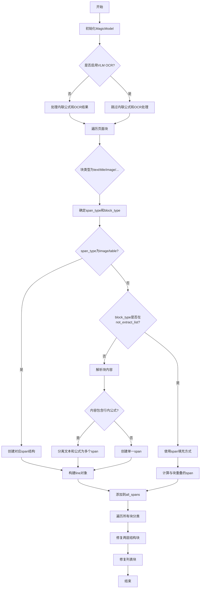

## 类结构

```
MagicModel (主类)
├── 内部处理函数
│   ├── isolated_formula_clean
│   ├── code_content_clean
│   ├── clean_content
│   ├── __tie_up_category_by_index
│   ├── get_type_blocks_by_index
│   ├── fix_two_layer_blocks
│   └── fix_list_blocks
```

## 全局变量及字段


### `not_extract_list`
    
不可提取的块类型列表，从NotExtractType枚举中提取

类型：`list`
    


### `MagicModel.page_blocks`
    
页面块列表

类型：`list`
    


### `MagicModel.page_inline_formula`
    
页面内联公式

类型：`page_inline_formula`
    


### `MagicModel.page_ocr_res`
    
页面OCR结果

类型：`page_ocr_res`
    


### `MagicModel.width`
    
页面宽度

类型：`int`
    


### `MagicModel.height`
    
页面高度

类型：`int`
    


### `MagicModel.all_spans`
    
所有span列表

类型：`list`
    


### `MagicModel.image_blocks`
    
图像块列表

类型：`list`
    


### `MagicModel.table_blocks`
    
表格块列表

类型：`list`
    


### `MagicModel.interline_equation_blocks`
    
行间公式块列表

类型：`list`
    


### `MagicModel.text_blocks`
    
文本块列表

类型：`list`
    


### `MagicModel.title_blocks`
    
标题块列表

类型：`list`
    


### `MagicModel.code_blocks`
    
代码块列表

类型：`list`
    


### `MagicModel.discarded_blocks`
    
丢弃块列表

类型：`list`
    


### `MagicModel.ref_text_blocks`
    
引用文本块列表

类型：`list`
    


### `MagicModel.phonetic_blocks`
    
音标块列表

类型：`list`
    


### `MagicModel.list_blocks`
    
列表块列表

类型：`list`
    
    

## 全局函数及方法


### `isolated_formula_clean`

该函数用于清理孤立公式（interline equation）的 LaTeX 内容，移除常见的数学公式标记符号（如 `\[` 和 `\]`），并返回清理后的纯 LaTeX 字符串。

参数：

- `txt`：`str`，输入的 LaTeX 公式字符串，可能包含 `\[` 和 `\]` 作为数学公式的起止标记

返回值：`str`，清理后的 LaTeX 字符串，已移除 `\[` 和 `\]` 标记并去除首尾空白

#### 流程图

```mermaid
flowchart TD
    A[开始: 输入txt] --> B[创建副本: latex = txt[:]]
    B --> C{检查是否以\[开头?}
    C -->|是| D[移除\[: latex = latex[2:]]
    C -->|否| E{检查是否以\]结尾?}
    D --> E
    E -->|是| F[移除\]: latex = latex[:-2]]
    E -->|否| G[去除首尾空白: latex.strip()]
    F --> G
    G --> H[返回清理后的latex]
```

#### 带注释源码

```python
def isolated_formula_clean(txt):
    """
    清理孤立公式的LaTeX内容，移除\[和\]标记
    
    Args:
        txt: 输入的LaTeX公式字符串，可能包含\[和\]作为数学公式的起止标记
        
    Returns:
        清理后的LaTeX字符串，已移除\[和\]标记并去除首尾空白
    """
    # 创建输入字符串的副本，避免修改原始数据
    latex = txt[:]
    
    # 如果字符串以\[开头，则移除前两个字符
    if latex.startswith("\\["): 
        latex = latex[2:]
    
    # 如果字符串以\]结尾，则移除最后两个字符
    if latex.endswith("\\]"): 
        latex = latex[:-2]
    
    # 去除首尾空白字符
    latex = latex.strip()
    
    # 返回清理后的LaTeX字符串
    return latex
```


### `code_content_clean`

清理代码内容，移除Markdown代码块的开始和结束标记（如 ```python ... ```）。

参数：

-  `content`：`str`，需要清理的代码内容字符串

返回值：`str`，移除Markdown代码块标记后的代码内容

#### 流程图

```mermaid
flowchart TD
    A[开始 code_content_clean] --> B{content是否为空}
    B -->|是| C[返回空字符串]
    B -->|否| D[按行分割content]
    E[初始化start_idx = 0, end_idx = 行数] --> F{检查第一行是否以```开头}
    F -->|是| G[start_idx = 1]
    F -->|否| H[保持start_idx = 0]
    G --> I{检查最后一行是否等于```}
    H --> I
    I -->|是| J[end_idx = end_idx - 1]
    I -->|否| K[保持end_idx不变]
    J --> L{start_idx < end_idx?}
    K --> L
    L -->|是| M[返回 lines[start_idx:end_idx] 合并的字符串并去除首尾空白]
    L -->|否| N[返回空字符串]
    M --> O[结束]
    N --> O
```

#### 带注释源码

```python
def code_content_clean(content):
    """清理代码内容，移除Markdown代码块的开始和结束标记"""
    # 如果内容为空，直接返回空字符串
    if not content:
        return ""

    # 将内容按行分割成列表
    lines = content.splitlines()
    start_idx = 0
    end_idx = len(lines)

    # 处理开头的三个反引号（Markdown代码块开始标记）
    if lines and lines[0].startswith("```"):
        start_idx = 1

    # 处理结尾的三个反引号（Markdown代码块结束标记）
    if lines and end_idx > start_idx and lines[end_idx - 1].strip() == "```":
        end_idx -= 1

    # 只有在有有效内容时才进行join操作
    if start_idx < end_idx:
        return "\n".join(lines[start_idx:end_idx]).strip()
    return ""
```


### `clean_content`

该函数用于清理文本内容中的 LaTeX 块公式标记，将 `\[...\]` 格式转换为 `[...]` 格式，便于后续处理和渲染。

参数：
-  `content`：`str`，需要清理的文本内容，可能包含 LaTeX 块公式标记

返回值：`str`，清理后的文本内容，如果内容为空或不包含需处理的模式则原样返回

#### 流程图

```mermaid
flowchart TD
    A[开始] --> B{content 是否为空}
    B -->|是| C[直接返回 content]
    B -->|否| D{\\[ 数量是否等于 \\] 数量且大于 0}
    D -->|否| C
    D -->|是| E[定义 replace_pattern 函数]
    E --> F[使用正则表达式匹配 \\[.*?\\]]
    F --> G[对每个匹配调用 replace_pattern]
    G --> H[将 \\[x\\] 替换为 [x]]
    H --> I[返回清理后的 content]
```

#### 带注释源码

```python
def clean_content(content):
    """清理内容中的 LaTeX 块公式标记 \[...\] 转换为 [...] 格式"""
    # 检查内容是否存在，且 \[ 和 \] 数量相等且大于 0
    if content and content.count("\\[") == content.count("\\]") and content.count("\\[") > 0:
        
        # 定义内部替换函数，用于处理每个正则匹配
        def replace_pattern(match):
            # 提取 \[ 和 \] 之间的内容
            inner_content = match.group(1)
            # 将内容包装为普通方括号格式
            return f"[{inner_content}]"

        # 定义正则表达式模式，匹配 \[...\] 格式的内容（非贪婪匹配）
        pattern = r'\\\[(.*?)\\\]'
        # 使用 re.sub 进行替换，对每个匹配调用 replace_pattern 函数
        content = re.sub(pattern, replace_pattern, content)

    # 返回处理后的内容（如果未满足条件则原样返回）
    return content
```


### `{函数名}`

__tie_up_category_by_index

#### 描述

基于index的主客体关联包装函数，用于将主体块（如image_body、table_body、code_body）和客体块（如image_caption、table_caption、code_caption或对应的footnote）进行关联匹配，通过filter筛选对应类型的块，并调用通用方法tie_up_category_by_index完成最终关联。

#### 参数

- `blocks`：`list`，输入的块列表，包含多种类型的块（如body、caption、footnote等）
- `subject_block_type`：`str`，主体块的类型字符串，如"image_body"、"table_body"、"code_body"
- `object_block_type`：`str`，客体块的类型字符串，如"image_caption"、"table_caption"、"code_caption"或对应的footnote类型

#### 返回值

`Any`，返回 `tie_up_category_by_index` 通用方法的结果，通常是关联匹配后的结果列表，包含主体和客体的边界框信息

#### 流程图

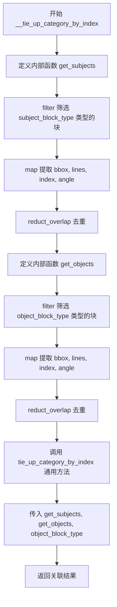

#### 带注释源码

```python
def __tie_up_category_by_index(blocks, subject_block_type, object_block_type):
    """基于index的主客体关联包装函数"""
    # 定义获取主体对象的内部函数
    def get_subjects():
        # 使用 filter 过滤出类型为 subject_block_type 的块
        # 例如：image_body, table_body, code_body
        return reduct_overlap(
            list(
                map(
                    # 提取块的关键信息：bbox, lines, index, angle
                    lambda x: {"bbox": x["bbox"], "lines": x["lines"], "index": x["index"], "angle": x["angle"]},
                    filter(
                        lambda x: x["type"] == subject_block_type,
                        blocks,
                    ),
                )
            )
        )

    # 定义获取客体对象的内部函数
    def get_objects():
        # 使用 filter 过滤出类型为 object_block_type 的块
        # 例如：image_caption, table_caption, code_caption 或对应的 footnote
        return reduct_overlap(
            list(
                map(
                    # 提取块的关键信息：bbox, lines, index, angle
                    lambda x: {"bbox": x["bbox"], "lines": x["lines"], "index": x["index"], "angle": x["angle"]},
                    filter(
                        lambda x: x["type"] == object_block_type,
                        blocks,
                    ),
                )
            )
        )

    # 调用通用方法，传入主体获取器、客体获取器和客体类型
    return tie_up_category_by_index(
        get_subjects,
        get_objects,
        object_block_type=object_block_type
    )
```


### `get_type_blocks_by_index`

该函数使用基于索引的匹配策略，将页面中的主体块（如 image_body、table_body、code_body）与其对应的标题块（caption）和脚注块（footnote）进行关联组织，形成结构化的返回数据。

参数：

- `blocks`：`list`，输入的页面块列表，包含需要关联的 body、caption 和 footnote 块
- `block_type`：`Literal["image", "table", "code"]`，块类型，用于确定要关联的具体类型（如 "image" 会关联 image_body、image_caption、image_footnote）

返回值：`list`，返回结构化列表，每个元素包含 `{block_type}_body`、`{block_type}_caption_list` 和 `{block_type}_footnote_list` 三个键对应的值

#### 流程图

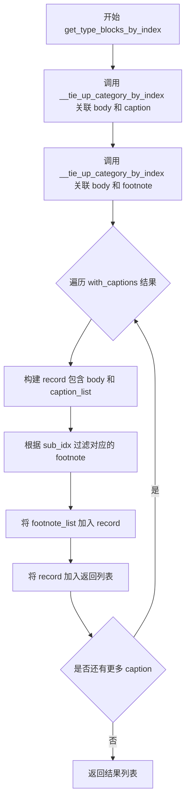

#### 带注释源码

```python
def get_type_blocks_by_index(blocks, block_type: Literal["image", "table", "code"]):
    """使用基于index的匹配策略来组织blocks"""
    # 第一步：通过 __tie_up_category_by_index 函数将 body 块与 caption 块进行关联
    # 例如：block_type="image" 时，关联 image_body 和 image_caption
    with_captions = __tie_up_category_by_index(blocks, f"{block_type}_body", f"{block_type}_caption")
    
    # 第二步：通过 __tie_up_category_by_index 函数将 body 块与 footnote 块进行关联
    # 例如：block_type="image" 时，关联 image_body 和 image_footnote
    with_footnotes = __tie_up_category_by_index(blocks, f"{block_type}_body", f"{block_type}_footnote")
    
    # 初始化返回列表
    ret = []
    
    # 第三步：遍历所有带 caption 的块记录，构建最终的数据结构
    for v in with_captions:
        # 构建单条记录，包含 body 的边界框信息
        record = {
            f"{block_type}_body": v["sub_bbox"],  # 主体的边界框
            f"{block_type}_caption_list": v["obj_bboxes"],  # 关联的 caption 列表
        }
        
        # 获取当前 body 块的索引，用于匹配对应的 footnote
        filter_idx = v["sub_idx"]
        
        # 第四步：从 with_footnotes 中过滤出与当前 body 块关联的 footnote
        # 使用 next 函数配合 filter 查找 sub_idx 等于 filter_idx 的记录
        d = next(filter(lambda x: x["sub_idx"] == filter_idx, with_footnotes))
        
        # 将 footnote 列表添加到记录中
        record[f"{block_type}_footnote_list"] = d["obj_bboxes"]
        
        # 将构建好的记录添加到返回列表
        ret.append(record)
    
    # 返回最终的组织结果
    return ret
```


### `fix_two_layer_blocks`

该函数用于修复两层结构的块（图像、表格或代码），将主体（body）、标题（caption）和注脚（footnote）组合成两层结构，同时处理位置不合理的情况（如caption在body之后、footnote在body之前），并确保caption和footnote的索引连续性。

参数：

- `blocks`：`list`，需要修复的两层结构块列表
- `fix_type`：`Literal["image", "table", "code"]`，块类型（图像、表格或代码）

返回值：`tuple[list, list]`，返回两个列表——`fixed_blocks`（修复后的两层结构块列表）和`not_include_blocks`（未能纳入两层结构的普通块列表）

#### 流程图

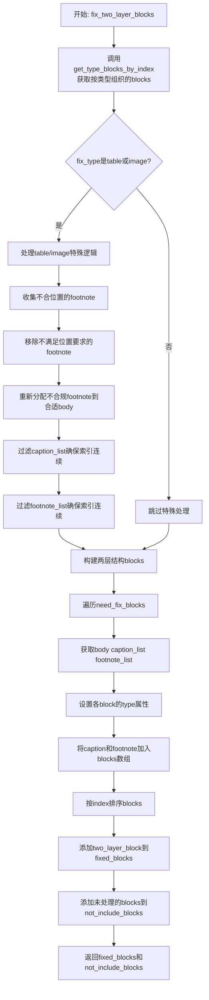

#### 带注释源码

```python
def fix_two_layer_blocks(blocks, fix_type: Literal["image", "table", "code"]):
    """
    修复两层结构的块（图像、表格或代码）
    将body、caption、footnote组合成两层结构，处理位置不合理的情况
    
    参数:
        blocks: 需要修复的两层结构块列表
        fix_type: 块类型（image/table/code）
    
    返回:
        tuple: (fixed_blocks, not_include_blocks)
              fixed_blocks: 修复后的两层结构块列表
              not_include_blocks: 未能纳入两层结构的普通块列表
    """
    # 1. 调用get_type_blocks_by_index获取按类型组织的blocks
    #    返回格式: [{body: {}, caption_list: [{}], footnote_list: [{}]}, ...]
    need_fix_blocks = get_type_blocks_by_index(blocks, fix_type)
    
    # 2. 初始化结果列表
    fixed_blocks = []       # 存储修复后的两层结构块
    not_include_blocks = [] # 存储未能纳入两层结构的块
    processed_indices = set() # 记录已处理的block索引

    # 3. 特殊处理表格和图像类型，确保标题在表格前，注脚在表格后
    if fix_type in ["table", "image"]:
        # 存储(footnote, 原始block索引)，用于后续重新分配
        misplaced_footnotes = []

        # ===== 第一步：移除不符合位置要求的footnote =====
        # footnote应在body之后或同位置，否则视为位置不合规
        for block_idx, block in enumerate(need_fix_blocks):
            body = block[f"{fix_type}_body"]
            body_index = body["index"]

            # 检查每个footnote是否在body之后
            valid_footnotes = []
            for footnote in block[f"{fix_type}_footnote_list"]:
                if footnote["index"] >= body_index:
                    valid_footnotes.append(footnote)
                else:
                    # 位置不合规，记录下来后续重新分配
                    misplaced_footnotes.append((footnote, block_idx))
            
            # 更新footnote_list，移除不合规的footnote
            block[f"{fix_type}_footnote_list"] = valid_footnotes

        # ===== 第三步：重新分配不合规的footnote到合适的body =====
        # 寻找索引小于等于footnote_index的最近body进行匹配
        for footnote, original_block_idx in misplaced_footnotes:
            footnote_index = footnote["index"]
            best_block_idx = None
            min_distance = float('inf')

            # 遍历所有block，寻找最近的合法body
            for idx, block in enumerate(need_fix_blocks):
                body_index = block[f"{fix_type}_body"]["index"]
                # body必须在footnote之前或同位置，且不是原始所属block
                if body_index <= footnote_index and idx != original_block_idx:
                    distance = footnote_index - body_index
                    if distance < min_distance:
                        min_distance = distance
                        best_block_idx = idx

            # 找到合适的body，添加到对应block的footnote_list
            if best_block_idx is not None:
                need_fix_blocks[best_block_idx][f"{fix_type}_footnote_list"].append(footnote)
            else:
                # 没找到合适的body，作为普通block处理
                not_include_blocks.append(footnote)

        # ===== 第四步：过滤caption和footnote，确保索引连续 =====
        # 处理caption_list (caption应在body之前，从body往前看)
        for block in need_fix_blocks:
            caption_list = block[f"{fix_type}_caption_list"]
            footnote_list = block[f"{fix_type}_footnote_list"]
            body_index = block[f"{fix_type}_body"]["index"]

            # === 过滤caption_list ===
            if caption_list:
                # 按index降序排列，从最接近body的开始检查
                caption_list.sort(key=lambda x: x["index"], reverse=True)
                filtered_captions = [caption_list[0]]
                
                # 检查每个caption与前一个是否连续
                for i in range(1, len(caption_list)):
                    prev_index = caption_list[i - 1]["index"]
                    curr_index = caption_list[i]["index"]

                    # 检查是否连续（curr_index == prev_index - 1）
                    if curr_index == prev_index - 1:
                        filtered_captions.append(caption_list[i])
                    else:
                        # 检查gap中是否只有body_index
                        gap_indices = set(range(curr_index + 1, prev_index))
                        if gap_indices == {body_index}:
                            # gap中只有body_index，不算真正的gap
                            filtered_captions.append(caption_list[i])
                        else:
                            # 出现真正的gap，后续所有caption都作为普通block
                            not_include_blocks.extend(caption_list[i:])
                            break
                
                # 恢复升序排列
                filtered_captions.reverse()
                block[f"{fix_type}_caption_list"] = filtered_captions

            # === 过滤footnote_list ===
            # footnote应在body之后，从body往后看
            if footnote_list:
                # 按index升序排列，从最接近body的开始检查
                footnote_list.sort(key=lambda x: x["index"])
                filtered_footnotes = [footnote_list[0]]
                
                # 检查每个footnote与前一个是否连续
                for i in range(1, len(footnote_list)):
                    if footnote_list[i]["index"] == footnote_list[i - 1]["index"] + 1:
                        filtered_footnotes.append(footnote_list[i])
                    else:
                        # 出现gap，后续所有footnote都作为普通block
                        not_include_blocks.extend(footnote_list[i:])
                        break
                
                block[f"{fix_type}_footnote_list"] = filtered_footnotes

    # ===== 第五步：构建两层结构blocks =====
    for block in need_fix_blocks:
        # 提取body、caption_list、footnote_list
        body = block[f"{fix_type}_body"]
        caption_list = block[f"{fix_type}_caption_list"]
        footnote_list = block[f"{fix_type}_footnote_list"]

        # 设置各block的type属性
        body["type"] = f"{fix_type}_body"
        for caption in caption_list:
            caption["type"] = f"{fix_type}_caption"
            processed_indices.add(caption["index"])
        for footnote in footnote_list:
            footnote["type"] = f"{fix_type}_footnote"
            processed_indices.add(footnote["index"])

        processed_indices.add(body["index"])

        # 构建两层结构block
        two_layer_block = {
            "type": fix_type,              # 外层类型：image/table/code
            "bbox": body["bbox"],          # 使用body的bbox
            "blocks": [body],               # blocks数组包含body
            "index": body["index"],         # 使用body的index
        }
        
        # 将caption和footnote添加到blocks数组
        two_layer_block["blocks"].extend([*caption_list, *footnote_list])
        
        # 对blocks按index排序，确保顺序正确
        two_layer_block["blocks"].sort(key=lambda x: x["index"])

        # 添加到修复后的块列表
        fixed_blocks.append(two_layer_block)

    # ===== 第六步：添加未处理的blocks到not_include_blocks =====
    for block in blocks:
        block.pop("type", None)  # 移除原有的type属性
        # 如果block未被处理且不在not_include_blocks中，添加到not_include_blocks
        if block["index"] not in processed_indices and block not in not_include_blocks:
            not_include_blocks.append(block)

    # 返回修复后的blocks和未纳入的blocks
    return fixed_blocks, not_include_blocks
```


### `fix_list_blocks`

该函数用于处理文档中的列表块（list_block），将与之重叠度较高的文本块（text_blocks和ref_text_blocks）移入列表块的blocks属性中，并自动推断列表块的子类型（sub_type），最终返回处理后的列表块、文本块和引用文本块。

参数：

- `list_blocks`：`list`，待处理的列表块列表，每个元素包含bbox（边界框）等信息
- `text_blocks`：`list`，文本块列表，函数会从中移除与列表块重叠度≥0.8的块
- `ref_text_blocks`：`list`，引用文本块列表，函数会从中移除与列表块重叠度≥0.8的块

返回值：`tuple`，包含三个元素——处理后的列表块列表、处理后的文本块列表、处理后的引用文本块列表

#### 流程图

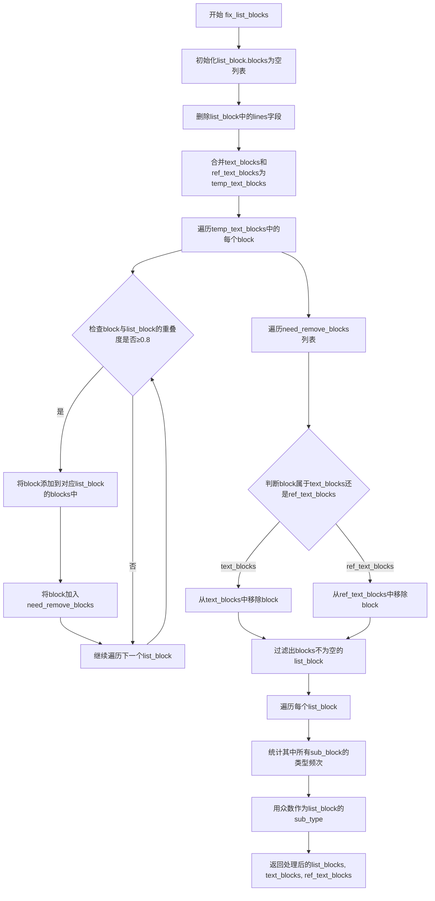

#### 带注释源码

```python
def fix_list_blocks(list_blocks, text_blocks, ref_text_blocks):
    """
    处理列表块，将与之重叠的文本块纳入列表块，并推断子类型
    
    参数:
        list_blocks: 列表块列表
        text_blocks: 文本块列表
        ref_text_blocks: 引用文本块列表
    
    返回:
        处理后的(列表块, 文本块, 引用文本块)元组
    """
    # 第一步：初始化每个list_block的blocks容器，清理lines字段
    for list_block in list_blocks:
        list_block["blocks"] = []
        if "lines" in list_block:
            del list_block["lines"]

    # 第二步：合并text和ref_text块，统一遍历
    temp_text_blocks = text_blocks + ref_text_blocks
    need_remove_blocks = []
    
    # 第三步：遍历所有文本块，筛选出与列表块重叠度>=0.8的块
    for block in temp_text_blocks:
        for list_block in list_blocks:
            # 调用工具函数计算两个bbox的重叠面积比
            if calculate_overlap_area_in_bbox1_area_ratio(block["bbox"], list_block["bbox"]) >= 0.8:
                # 将符合条件的块移入列表块的blocks集合
                list_block["blocks"].append(block)
                # 记录待移除的块，后续统一删除
                need_remove_blocks.append(block)
                # 一个文本块只能匹配一个list_block，跳出内层循环
                break

    # 第四步：从原始块列表中移除已被纳入list_block的块
    for block in need_remove_blocks:
        if block in text_blocks:
            text_blocks.remove(block)
        elif block in ref_text_blocks:
            ref_text_blocks.remove(block)

    # 第五步：过滤掉空列表块（没有成功纳入任何子块的list_block）
    list_blocks = [lb for lb in list_blocks if lb["blocks"]]

    # 第六步：为每个list_block推断sub_type（子类型）
    for list_block in list_blocks:
        # 统计该list_block内所有子块的类型出现频次
        type_count = {}
        for sub_block in list_block["blocks"]:
            sub_block_type = sub_block["type"]
            if sub_block_type not in type_count:
                type_count[sub_block_type] = 0
            type_count[sub_block_type] += 1

        # 使用众数（出现次数最多的类型）作为list_block的sub_type
        if type_count:
            list_block["sub_type"] = max(type_count, key=type_count.get)
        else:
            list_block["sub_type"] = "unknown"

    return list_blocks, text_blocks, ref_text_blocks
```


### `MagicModel.__init__`

这是`MagicModel`类的构造函数，负责初始化文档解析模型，处理页面中的各类块（文本、图像、表格、代码、公式等），并进行分类、清洗和结构化处理。

参数：

- `page_blocks`：`list`，页面块列表，包含所有需要解析的块结构
- `page_inline_formula`：内联公式列表，从页面提取的内联公式内容
- `page_ocr_res`：OCR识别结果列表，包含文本识别信息
- `page`：页面对象，用于文本提取
- `scale`：缩放因子，用于坐标转换
- `page_pil_img`：PIL图像对象，页面的图像表示
- `width`：页面宽度
- `height`：页面高度
- `_ocr_enable`：布尔值，是否启用OCR功能
- `_vlm_ocr_enable`：布尔值，是否启用VLM OCR模式

返回值：`None`，构造函数不返回任何值

#### 流程图

```mermaid
flowchart TD
    A[开始 __init__ 初始化] --> B[初始化实例变量: page_blocks, page_inline_formula, page_ocr_res, width, height]
    B --> C{_vlm_ocr_enable?}
    C -->|是| D[跳过内联公式和OCR处理]
    C -->|否| E[遍历内联公式: 计算真实bbox, 提取latex内容]
    E --> F[遍历OCR结果: 计算真实bbox, 处理category_id=15的文本]
    F --> G{_ocr_enable?}
    G -->|是| H[保持原有span]
    G -->|否| I[使用txt_spans_extract提取文本span]
    I --> J[遍历page_blocks解析每个块]
    J --> K[计算block真实bbox和类型]
    K --> L{块类型处理}
    L -->|text/title/header等| M[设置span_type为TEXT]
    L -->|image| N[设置span_type为IMAGE, block_type为IMAGE_BODY]
    L -->|table| O[设置span_type为TABLE, block_type为TABLE_BODY]
    L -->|code/algorithm| P[清理代码内容, 猜测语言类型]
    L -->|equation| Q[设置span_type为INTERLINE_EQUATION]
    P --> R[检查块内容是否包含行内公式\(...\)]
    R -->|是| S[分解为多个span: 文本和公式]
    R -->|否| T[创建单一span]
    M --> U{是否需要提取?}
    U -->|是| V[使用span填充方式]
    U -->|否| W[直接使用block内容]
    V --> X[计算span与block的重叠面积]
    X --> Y[过滤符合条件的span]
    Y --> Z[构建block对象]
    W --> Z
    S --> Z
    T --> Z
    Z --> AA[将span添加到all_spans]
    AA --> BB[创建line对象]
    BB --> CC[构建完整block结构]
    CC --> DD{还有更多block?}
    DD -->|是| J
    DD -->|否| EE[初始化各类块列表]
    EE --> FF[遍历所有blocks进行分类]
    FF --> GG[根据block.type添加到对应列表]
    GG --> HH[调用fix_list_blocks修复列表块]
    HH --> II[调用fix_two_layer_blocks修复图像/表格/代码块]
    II --> JJ[处理code_block的子类型和语言]
    JJ --> KK[将未包含的块转换为文本块]
    KK --> L1[结束 __init__]
```

#### 带注释源码

```python
def __init__(self,
    page_blocks: list,
    page_inline_formula,
    page_ocr_res,
    page,
    scale,
    page_pil_img,
    width,
    height,
    _ocr_enable,
    _vlm_ocr_enable,
):
    """MagicModel构造函数，初始化文档解析模型"""
    # 1. 初始化实例变量
    self.page_blocks = page_blocks
    self.page_inline_formula = page_inline_formula
    self.page_ocr_res = page_ocr_res

    self.width = width
    self.height = height

    blocks = []
    self.all_spans = []

    page_text_inline_formula_spans = []
    
    # 2. 处理内联公式和OCR结果（非VLM模式）
    if not _vlm_ocr_enable:
        # 处理内联公式：计算真实坐标，提取latex内容
        for inline_formula in page_inline_formula:
            inline_formula["bbox"] = self.cal_real_bbox(inline_formula["bbox"])
            inline_formula_latex = inline_formula.pop("latex", "")
            if inline_formula_latex:
                page_text_inline_formula_spans.append({
                    "bbox": inline_formula["bbox"],
                    "type": ContentType.INLINE_EQUATION,
                    "content": inline_formula_latex,
                    "score": inline_formula["score"],
                })
        
        # 处理OCR结果：计算真实坐标，处理category_id=15的文本
        for ocr_res in page_ocr_res:
            ocr_res["bbox"] = self.cal_real_bbox(ocr_res["bbox"])
            if ocr_res['category_id'] == 15:
                page_text_inline_formula_spans.append({
                    "bbox": ocr_res["bbox"],
                    "type": ContentType.TEXT,
                    "content": ocr_res["text"],
                    "score": ocr_res["score"],
                })
        
        # 如果OCR禁用，使用txt_spans_extract提取文本span
        if not _ocr_enable:
            virtual_block = [0, 0, width, height, None, None, None, "text"]
            page_text_inline_formula_spans = txt_spans_extract(page, page_text_inline_formula_spans, page_pil_img, scale, [virtual_block],[])

    # 3. 解析每个块
    for index, block_info in enumerate(page_blocks):
        try:
            block_bbox = self.cal_real_bbox(block_info["bbox"])
            block_type = block_info["type"]
            block_content = block_info["content"]
            block_angle = block_info["angle"]
        except Exception as e:
            # 如果解析失败，跳过这个块
            logger.warning(f"Invalid block format: {block_info}, error: {e}")
            continue

        span_type = "unknown"
        code_block_sub_type = None
        guess_lang = None

        # 4. 根据块类型设置span_type
        if block_type in [
            "text", "title", "image_caption", "image_footnote",
            "table_caption", "table_footnote", "code_caption",
            "ref_text", "phonetic", "header", "footer",
            "page_number", "aside_text", "page_footnote", "list"
        ]:
            span_type = ContentType.TEXT
        elif block_type in ["image"]:
            block_type = BlockType.IMAGE_BODY
            span_type = ContentType.IMAGE
        elif block_type in ["table"]:
            block_type = BlockType.TABLE_BODY
            span_type = ContentType.TABLE
        elif block_type in ["code", "algorithm"]:
            block_content = code_content_clean(block_content)
            code_block_sub_type = block_type
            block_type = BlockType.CODE_BODY
            span_type = ContentType.TEXT
            guess_lang = guess_language_by_text(block_content)
        elif block_type in ["equation"]:
            block_type = BlockType.INTERLINE_EQUATION
            span_type = ContentType.INTERLINE_EQUATION

        # 检查是否需要将code切换为algorithm
        switch_code_to_algorithm = False

        span = None
        
        # 5. 处理图像和表格块
        if span_type in ["image", "table"]:
            span = {
                "bbox": block_bbox,
                "type": span_type,
            }
            if span_type == ContentType.TABLE:
                span["html"] = block_content
        # 6. 处理行间公式
        elif span_type in [ContentType.INTERLINE_EQUATION]:
            span = {
                "bbox": block_bbox,
                "type": span_type,
                "content": isolated_formula_clean(block_content),
            }
        # 7. 处理文本块
        elif _vlm_ocr_enable or block_type not in not_extract_list:
            # 清理内容
            if block_content:
                block_content = clean_content(block_content)

            # 检查是否包含行内公式 \(...\)
            if block_content and block_content.count("\\(") == block_content.count("\\)") and block_content.count("\\(") > 0:
                switch_code_to_algorithm = True

                # 8. 解析行内公式，将文本和公式分离为多个span
                spans = []
                last_end = 0

                # 使用正则查找所有 \(...\) 模式
                for match in re.finditer(r'\\\((.+?)\\\)', block_content):
                    start, end = match.span()

                    # 添加公式前的文本
                    if start > last_end:
                        text_before = block_content[last_end:start]
                        if text_before.strip():
                            spans.append({
                                "bbox": block_bbox,
                                "type": ContentType.TEXT,
                                "content": text_before
                            })

                    # 添加公式span（去除\(和\)）
                    formula = match.group(1)
                    spans.append({
                        "bbox": block_bbox,
                        "type": ContentType.INLINE_EQUATION,
                        "content": formula.strip()
                    })

                    last_end = end

                # 添加最后一个公式后的文本
                if last_end < len(block_content):
                    text_after = block_content[last_end:]
                    if text_after.strip():
                        spans.append({
                            "bbox": block_bbox,
                            "type": ContentType.TEXT,
                            "content": text_after
                        })

                span = spans
            else:
                # 创建单一文本span
                span = {
                    "bbox": block_bbox,
                    "type": span_type,
                    "content": block_content,
                }

        # 9. 处理span并添加到all_spans
        if (
                span_type in ["image", "table", ContentType.INTERLINE_EQUATION]
                or (_vlm_ocr_enable or block_type not in not_extract_list)
        ):
            if span is None:
                continue
            
            # 处理span类型
            if isinstance(span, dict) and "bbox" in span:
                self.all_spans.append(span)
                spans = [span]
            elif isinstance(span, list):
                self.all_spans.extend(span)
                spans = span
            else:
                raise ValueError(f"Invalid span type: {span_type}, expected dict or list, got {type(span)}")

            # 10. 构造line对象
            if block_type in [BlockType.CODE_BODY]:
                if switch_code_to_algorithm and code_block_sub_type == "code":
                    code_block_sub_type = "algorithm"
                line = {"bbox": block_bbox, "spans": spans,
                        "extra": {"type": code_block_sub_type, "guess_lang": guess_lang}}
            else:
                line = {"bbox": block_bbox, "spans": spans}

            # 11. 构造block对象
            block = {
                "bbox": block_bbox,
                "type": block_type,
                "angle": block_angle,
                "lines": [line],
                "index": index,
            }

        else:  # 12. 使用span填充方式处理非提取块
            block_spans = []
            # 计算span与block的重叠面积
            for span in page_text_inline_formula_spans:
                if calculate_overlap_area_in_bbox1_area_ratio(span['bbox'], block_bbox) > 0.5:
                    block_spans.append(span)
            
            # 从spans删除已放入block_spans中的span
            if len(block_spans) > 0:
                for span in block_spans:
                    page_text_inline_formula_spans.remove(span)

            block = {
                "bbox": block_bbox,
                "type": block_type,
                "angle": block_angle,
                "spans": block_spans,
                "index": index,
            }
            block = fix_text_block(block)

        blocks.append(block)

    # 13. 初始化各类块列表
    self.image_blocks = []
    self.table_blocks = []
    self.interline_equation_blocks = []
    self.text_blocks = []
    self.title_blocks = []
    self.code_blocks = []
    self.discarded_blocks = []
    self.ref_text_blocks = []
    self.phonetic_blocks = []
    self.list_blocks = []
    
    # 14. 遍历所有blocks进行分类
    for block in blocks:
        if block["type"] in [BlockType.IMAGE_BODY, BlockType.IMAGE_CAPTION, BlockType.IMAGE_FOOTNOTE]:
            self.image_blocks.append(block)
        elif block["type"] in [BlockType.TABLE_BODY, BlockType.TABLE_CAPTION, BlockType.TABLE_FOOTNOTE]:
            self.table_blocks.append(block)
        elif block["type"] in [BlockType.CODE_BODY, BlockType.CODE_CAPTION]:
            self.code_blocks.append(block)
        elif block["type"] == BlockType.INTERLINE_EQUATION:
            self.interline_equation_blocks.append(block)
        elif block["type"] == BlockType.TEXT:
            self.text_blocks.append(block)
        elif block["type"] == BlockType.TITLE:
            self.title_blocks.append(block)
        elif block["type"] in [BlockType.REF_TEXT]:
            self.ref_text_blocks.append(block)
        elif block["type"] in [BlockType.PHONETIC]:
            self.phonetic_blocks.append(block)
        elif block["type"] in [BlockType.HEADER, BlockType.FOOTER, BlockType.PAGE_NUMBER, BlockType.ASIDE_TEXT, BlockType.PAGE_FOOTNOTE]:
            self.discarded_blocks.append(block)
        elif block["type"] == BlockType.LIST:
            self.list_blocks.append(block)
        else:
            continue

    # 15. 调用fix函数修复块结构
    self.list_blocks, self.text_blocks, self.ref_text_blocks = fix_list_blocks(self.list_blocks, self.text_blocks, self.ref_text_blocks)
    self.image_blocks, not_include_image_blocks = fix_two_layer_blocks(self.image_blocks, BlockType.IMAGE)
    self.table_blocks, not_include_table_blocks = fix_two_layer_blocks(self.table_blocks, BlockType.TABLE)
    self.code_blocks, not_include_code_blocks = fix_two_layer_blocks(self.code_blocks, BlockType.CODE)
    
    # 16. 处理code_block的子类型和语言
    for code_block in self.code_blocks:
        for block in code_block['blocks']:
            if block['type'] == BlockType.CODE_BODY:
                if len(block["lines"]) > 0:
                    line = block["lines"][0]
                    code_block["sub_type"] = line["extra"]["type"]
                    if code_block["sub_type"] in ["code"]:
                        code_block["guess_lang"] = line["extra"]["guess_lang"]
                    del line["extra"]
                else:
                    code_block["sub_type"] = "code"
                    code_block["guess_lang"] = "txt"

    # 17. 将未包含的块转换为文本块
    for block in not_include_image_blocks + not_include_table_blocks + not_include_code_blocks:
        block["type"] = BlockType.TEXT
        self.text_blocks.append(block)
```


### `MagicModel.cal_real_bbox`

该方法用于将归一化的边界框坐标（0-1范围内的浮点数）转换为实际像素坐标，并确保坐标的合法性（x1 <= x2, y1 <= y2）。

参数：

- `bbox`：`<class 'tuple'> | <class 'list'>`，包含四个归一化坐标值的边界框 `[x1, y1, x2, y2]`，其中 x1、y1 为左上角坐标，x2、y2 为右下角坐标（值为 0-1 范围的浮点数）

返回值：`<class 'tuple'>`，转换后的实际像素坐标边界框 `(x_1, y_1, x_2, y_2)`，x_1 ≤ x_2，y_1 ≤ y_2

#### 流程图

```mermaid
flowchart TD
    A[开始: cal_real_bbox] --> B[输入: bbox归一化坐标]
    B --> C[解包坐标: x1, y1, x2, y2 = bbox]
    C --> D[转换为像素坐标]
    D --> D1[x_1 = int(x1 × width)]
    D --> D2[y_1 = int(y1 × height)]
    D --> D3[x_2 = int(x2 × width)]
    D --> D4[y_2 = int(y2 × height)]
    D4 --> E{检查 x_2 < x_1?}
    E -->|是| F[交换: x_1, x_2 = x_2, x_1]
    E -->|否| G{检查 y_2 < y_1?}
    F --> G
    G -->|是| H[交换: y_1, y_2 = y_2, y_1]
    G -->|否| I[组装: bbox = (x_1, y_1, x_2, y_2)]
    H --> I
    I --> J[返回: 像素坐标边界框]
```

#### 带注释源码

```python
def cal_real_bbox(self, bbox):
    """
    将归一化的边界框坐标转换为实际像素坐标
    
    参数:
        bbox: 归一化坐标 [x1, y1, x2, y2]，值为0-1范围的浮点数
    
    返回:
        实际像素坐标 (x_1, y_1, x_2, y_2)
    """
    # 解包归一化坐标
    x1, y1, x2, y2 = bbox
    
    # 将归一化坐标转换为实际像素坐标
    # 通过乘以页面宽高并取整得到像素值
    x_1, y_1, x_2, y_2 = (
        int(x1 * self.width),   # x1坐标 × 页面宽度
        int(y1 * self.height),  # y1坐标 × 页面高度
        int(x2 * self.width),   # x2坐标 × 页面宽度
        int(y2 * self.height),  # y2坐标 × 页面高度
    )
    
    # 确保 x 坐标合法性：左上角 x ≤ 右下角 x
    if x_2 < x_1:
        x_1, x_2 = x_2, x_1  # 交换坐标
    
    # 确保 y 坐标合法性：左上角 y ≤ 右下角 y
    if y_2 < y_1:
        y_1, y_2 = y_2, y_1  # 交换坐标
    
    # 组装规范化的边界框
    bbox = (x_1, y_1, x_2, y_2)
    
    return bbox
```


### `MagicModel.get_list_blocks`

获取页面中已处理的列表块（list blocks），该方法返回在文档解析过程中识别并经过修复处理的列表类型块。

参数：
- 该方法无显式参数（`self` 为实例自身）

返回值：`list`，返回包含所有列表块的列表，每个元素为表示列表块的字典对象。

#### 流程图

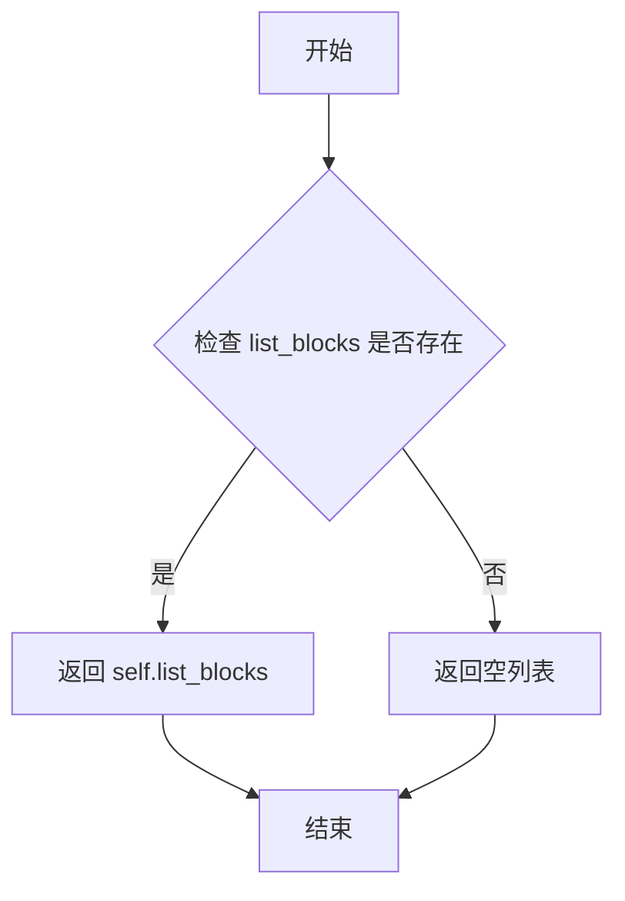

#### 带注释源码

```python
def get_list_blocks(self):
    """
    获取页面中的列表块
    
    返回在文档解析过程中被识别并经过 fix_list_blocks 处理的列表块。
    这些块通常包含多个子块（如文本块、引用文本块等），并根据子块的类型确定了列表块的 sub_type。
    
    返回:
        list: 列表块字典的列表，每个字典包含块的所有信息（如 bbox、blocks、sub_type 等）
    """
    return self.list_blocks
```


### `MagicModel.get_image_blocks`

该方法用于获取当前页面中所有识别为图像类型的块（Image Blocks），包括图像主体（IMAGE_BODY）、图像标题（IMAGE_CAPTION）和图像脚注（IMAGE_FOOTNOTE）。在页面解析初始化阶段，这些块会根据其类型被分类并存储到 `self.image_blocks` 列表中，该方法直接返回该列表以供外部调用。

参数：
- `self`：`MagicModel` 实例本身，隐式参数，表示当前对象。

返回值：`list`，返回存储在 `self.image_blocks` 中的图像块列表，列表中的每个元素是一个字典（dict），代表一个图像块，包含键如 `bbox`（边界框）、`type`（块类型）、`angle`（角度）、`lines`（行内容）和 `index`（索引）等信息。

#### 流程图

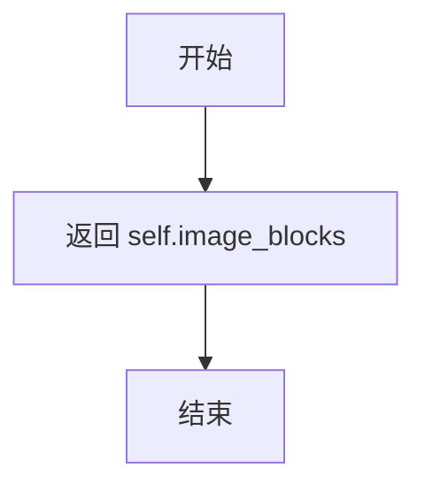

#### 带注释源码

```python
def get_image_blocks(self):
    """
    获取图像块列表
    
    该方法简单返回在 __init__ 初始化过程中收集的图像块列表。
    这些块是在解析 page_blocks 时，根据 block_type 被识别为图像类型
    (BlockType.IMAGE_BODY, BlockType.IMAGE_CAPTION, BlockType.IMAGE_FOOTNOTE)
    并添加到 self.image_blocks 列表中的。
    
    Returns:
        list: 包含所有图像块的列表，每个元素为字典类型
    """
    return self.image_blocks
```


### `MagicModel.get_table_blocks`

该方法用于获取页面中所有的表格块（Table Blocks），包括表格主体、表格标题和表格脚注。

参数： 无

返回值：`list`，返回页面中所有表格块的列表，每个元素是一个包含 `bbox`、`type`、`angle`、`lines` 或 `spans`、`index` 等属性的字典。

#### 流程图

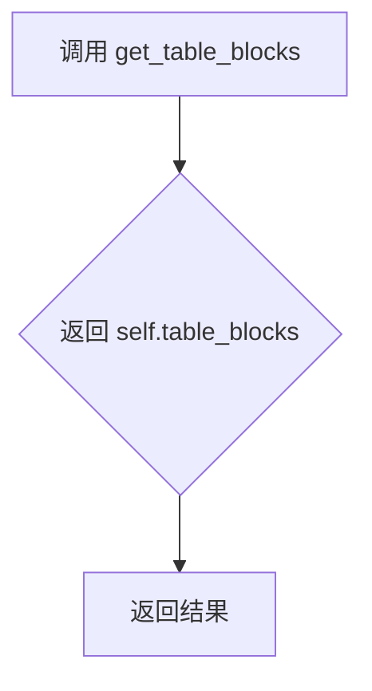

#### 带注释源码

```python
def get_table_blocks(self):
    """
    获取页面中所有的表格块（Table Blocks）。
    
    该方法返回在 __init__ 方法中收集的所有表格类型块，包括：
    - BlockType.TABLE_BODY: 表格主体内容
    - BlockType.TABLE_CAPTION: 表格标题/说明
    - BlockType.TABLE_FOOTNOTE: 表格脚注
    
    Returns:
        list: 包含所有表格块的列表，每个元素是一个字典，包含以下键：
            - bbox: 表格块的边界框坐标 (x1, y1, x2, y2)
            - type: 块类型 (TABLE_BODY, TABLE_CAPTION, TABLE_FOOTNOTE)
            - angle: 旋转角度
            - lines: 表格行内容列表（仅 TABLE_BODY 类型）
            - spans: 表格内容片段列表（仅 TABLE_CAPTION 和 TABLE_FOOTNOTE 类型）
            - index: 块在原始列表中的索引
    """
    return self.table_blocks
```


### `MagicModel.get_code_blocks`

该方法是一个简单的访问器方法（Getter），用于获取在`MagicModel`实例初始化过程中已分类和存储的所有代码块（code blocks）。它直接返回实例属性`self.code_blocks`，该属性包含了页面中所有类型为`CODE_BODY`和`CODE_CAPTION`的块。

参数： 无

返回值：`list`，返回当前页面中所有代码块对象的列表，每个代码块包含边界框、类型、角度、索引等信息。

#### 流程图

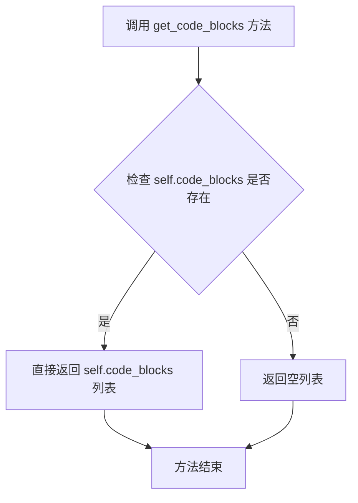

#### 带注释源码

```python
def get_code_blocks(self):
    """
    获取当前页面的所有代码块
    
    该方法是一个简单的访问器（Getter），返回在 __init__ 方法中
    已经过分类和处理的代码块列表。代码块在初始化时被识别并存储
    在 self.code_blocks 属性中。
    
    Returns:
        list: 包含所有代码块的列表，每个代码块是一个字典，
              包含 bbox、type、angle、lines、index 等键
    """
    return self.code_blocks
```


### `MagicModel.get_ref_text_blocks`

获取引用文本块列表的简单getter方法，用于返回在文档解析过程中识别并分类的引用文本块（如参考文献引用等）。

参数： 无

返回值：`list`，返回存储在类实例中的引用文本块列表，每个元素为一个包含 `bbox`、`type`、`angle`、`lines`、`index` 等字段的字典。

#### 流程图

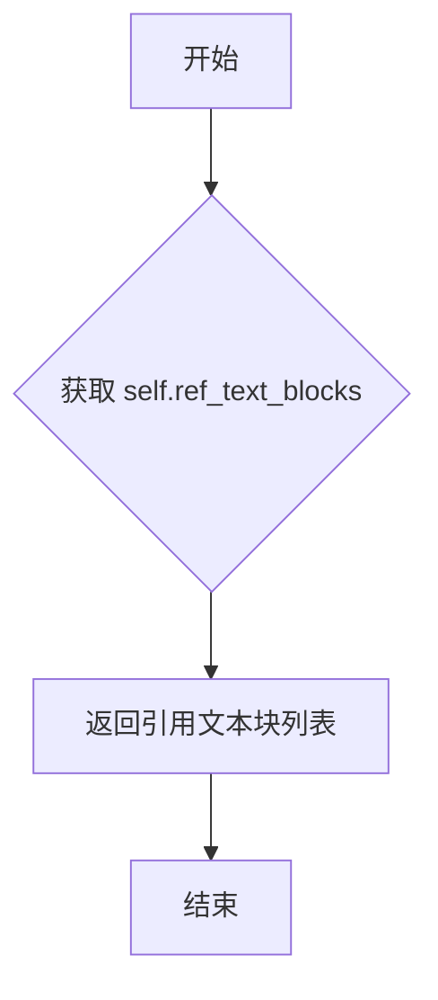

#### 带注释源码

```python
def get_ref_text_blocks(self):
    """
    获取引用文本块列表
    
    该方法是一个简单的getter方法，用于返回在MagicModel初始化过程中
    被分类为BlockType.REF_TEXT类型的文本块。
    
    这些块是在解析page_blocks时，根据block_type为'ref_text'的块
    被筛选并存储到self.ref_text_blocks列表中的。
    
    返回:
        list: 引用文本块列表，每个元素为一个包含以下键的字典:
            - bbox: 块的边界框坐标 (x1, y1, x2, y2)
            - type: 块类型，值为BlockType.REF_TEXT
            - angle: 块的角度
            - lines: 块包含的文本行列表
            - index: 块在原始列表中的索引
    """
    return self.ref_text_blocks
```


### `MagicModel.get_phonetic_blocks`

该方法为 `MagicModel` 类的获取器方法，用于返回在文档解析过程中识别并存储的所有音标（phonetic）类型的内容块。

参数：
- 该方法无显式参数（`self` 为实例隐式参数）

返回值：`list`，返回文档中所有类型为 `BlockType.PHONETIC` 的块组成的列表，这些块在初始化时通过遍历页面块并根据类型筛选后存储在 `self.phonetic_blocks` 中。

#### 流程图

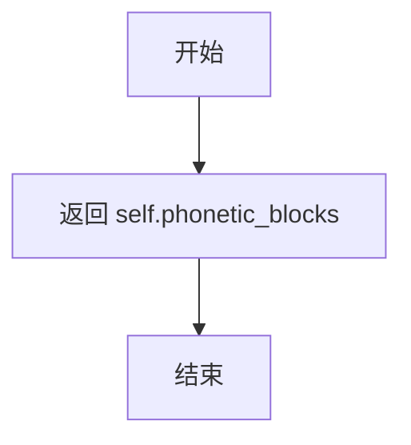

#### 带注释源码

```python
def get_phonetic_blocks(self):
    """
    获取音标块列表
    
    该方法是一个简单的获取器（Getter），返回在 __init__ 方法初始化阶段
    被筛选并存储到 self.phonetic_blocks 中的所有 PHONETIC 类型的块。
    这些块是在遍历 page_blocks 时，根据 block_type == BlockType.PHONETIC
    条件筛选出来的。
    
    Returns:
        list: 包含所有音标块的列表，每个元素是一个字典结构，
              包含 bbox, type, angle, lines/spans 等信息
    """
    return self.phonetic_blocks
```


### `MagicModel.get_title_blocks`

该方法是一个简单的getter方法，用于获取在文档解析过程中被分类为标题类型的所有块（title_blocks）。该方法直接返回初始化时存储在实例变量 `self.title_blocks` 中的标题块列表，这些块是在 `__init__` 方法中根据 `block_type` 枚举为 `BlockType.TITLE` 的块筛选出来的。

参数： 无

返回值：`list`，返回存储在类实例中的标题块列表，列表中每个元素都是一个包含 `bbox`、`type`、`angle`、`lines`、`index` 等字段的字典对象，代表文档中识别出的标题内容块。

#### 流程图

```mermaid
flowchart TD
    A[调用 get_title_blocks] --> B{返回 self.title_blocks}
    B --> C[返回类型: list[dict]]
    C --> D[调用方接收标题块列表]
```

#### 带注释源码

```python
def get_title_blocks(self):
    """
    获取文档中所有标题块的列表。
    
    该方法是一个简单的getter访问器，返回在__init__方法初始化期间
    根据block_type筛选出的所有BlockType.TITLE类型的块。
    这些块在文档解析过程中被识别并存储在self.title_blocks实例变量中。
    
    Returns:
        list: 包含所有标题块的列表，每个元素是一个字典结构，
              包含 bbox(边界框)、type(块类型)、angle(角度)、
              lines(行内容)、index(索引)等字段。
    """
    return self.title_blocks
```


### `MagicModel.get_text_blocks`

该方法是 `MagicModel` 类的简单取值器方法，用于返回在构造函数中分类好的文本块列表（text_blocks）。该列表包含了所有被识别为文本类型的页面块，如纯文本段落等。

参数： 无

返回值：`list`，返回存储在实例中的文本块列表（`self.text_blocks`），该列表在构造函数中经过解析、分类和修复后得到。

#### 流程图

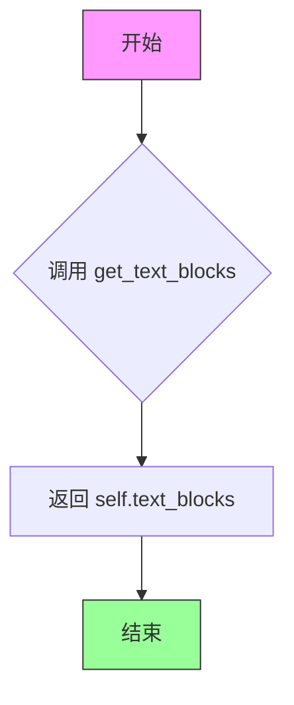

#### 带注释源码

```python
def get_text_blocks(self):
    """
    获取文本块列表的简单取值器方法。
    
    该方法返回在 __init__ 构造函数中经过解析和分类后的文本块列表。
    文本块包括所有类型为 BlockType.TEXT 的块，这些块可能是普通段落、
    图像标题、表格标题等被识别为文本内容的块。
    
    Returns:
        list: 文本块列表，每个元素是一个包含 bbox、type、angle、lines/index 等字段的字典。
    """
    return self.text_blocks
```


### `MagicModel.get_interline_equation_blocks`

该方法是一个简单的访问器方法，用于获取页面中所有行间公式块（interline equation blocks）的列表。这些块在文档解析过程中被识别并存储，用于后续的内容提取和处理。

参数：无需参数

返回值：`list`，返回存储在 `self.interline_equation_blocks` 中的行间公式块列表，每个元素是一个包含 `bbox`、`type`、`angle`、`lines`、`index` 等字段的字典对象。

#### 流程图

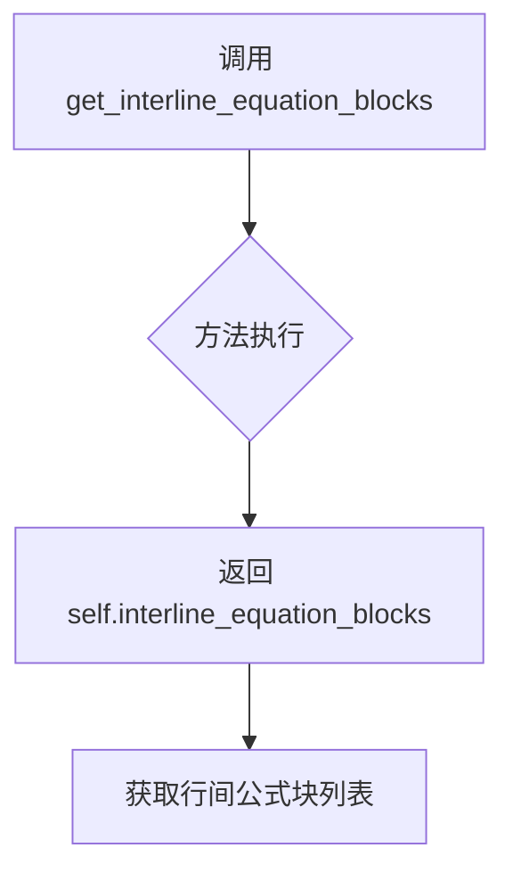

#### 带注释源码

```python
def get_interline_equation_blocks(self):
    """
    获取行间公式块的列表
    
    这是一个简单的访问器方法，返回在__init__方法中收集的
    所有类型为BlockType.INTERLINE_EQUATION的块。
    
    返回:
        list: 行间公式块列表，每个元素是一个包含以下键的字典:
            - bbox: 块的边界框坐标 (x1, y1, x2, y2)
            - type: 块类型 (BlockType.INTERLINE_EQUATION)
            - angle: 块的旋转角度
            - lines: 块包含的行数据
            - index: 块在原始列表中的索引
    """
    return self.interline_equation_blocks
```

#### 关联信息

**数据来源**

`self.interline_equation_blocks` 在 `MagicModel.__init__` 方法中被填充：

```python
# 在__init__中初始化
self.interline_equation_blocks = []

# 在解析块时添加
elif block_type == BlockType.INTERLINE_EQUATION:
    self.interline_equation_blocks.append(block)
```

**块的类型识别逻辑**

在 `__init__` 方法中，当 `block_type` 为 `"equation"` 时，会被转换为 `BlockType.INTERLINE_EQUATION`：

```python
elif block_type in ["equation"]:
    block_type = BlockType.INTERLINE_EQUATION
    span_type = ContentType.INTERLINE_EQUATION
```

**设计意图**

该方法采用数据类（Data Class）模式中的访问器方法设计，将内部数据结构暴露给外部，遵循了面向对象编程的封装原则。行间公式块在文档解析流程中属于重要的语义内容，通常需要单独处理以提取 LaTeX 或其他公式表示。


### `MagicModel.get_discarded_blocks`

该方法用于获取在文档解析过程中被识别为非主要内容并被丢弃的块（如页眉、页脚、页码、旁注和脚注等），返回之前收集的 discarded_blocks 列表。

参数：无

返回值：`list`，返回被丢弃的块列表，这些块的类型通常为 HEADER、FOOTER、PAGE_NUMBER、ASIDE_TEXT 或 PAGE_FOOTNOTE

#### 流程图

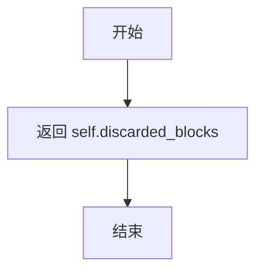

#### 带注释源码

```python
def get_discarded_blocks(self):
    """
    获取被丢弃的块
    
    该方法返回在文档解析过程中被识别为非主要内容的块。
    这些块包括：
    - HEADER: 页眉
    - FOOTER: 页脚
    - PAGE_NUMBER: 页码
    - ASIDE_TEXT: 旁注
    - PAGE_FOOTNOTE: 脚注
    
    在 __init__ 方法中，当遍历所有块时，会根据 block["type"] 来判断
    如果块的类型属于上述类型，就会将其添加到 self.discarded_blocks 列表中。
    
    返回:
        list: 包含所有被丢弃块的列表
    """
    return self.discarded_blocks
```


### `MagicModel.get_all_spans`

该方法用于获取文档页面中所有已被解析和提取的span元素（包括文本、图片、表格、行内公式等），是MagicModel类对外暴露页面内容解析结果的核心接口。

参数：

- 该方法无显式参数（仅包含隐式参数`self`，指向MagicModel实例本身）

返回值：`list`，返回存储在实例属性`self.all_spans`中的所有span元素列表，每个span通常包含`bbox`、`type`、`content`等字段。

#### 流程图

```mermaid
flowchart TD
    A[开始 get_all_spans] --> B{检查 all_spans 是否存在}
    B -->|是| C[直接返回 self.all_spans 列表]
    B -->|否| D[返回空列表 [] 或 None]
    C --> E[结束]
    D --> E
    
    %% 补充上下文：all_spans 的填充流程
    F[__init__ 初始化] --> G[遍历 page_blocks 解析每个块]
    G --> H{根据 block_type 确定 span_type}
    H -->|TEXT| I[处理文本块内容]
    H -->|IMAGE| J[处理图片块]
    H -->|TABLE| K[处理表格块]
    H -->|INTERLINE_EQUATION| L[处理行间公式块]
    
    I --> M{块内容是否包含行内公式}
    M -->|是| N[拆分文本和公式为多个span]
    M -->|否| O[创建单一span]
    N --> P[将span添加到 self.all_spans]
    O --> P
    J --> P
    K --> P
    L --> P
    
    P --> Q[返回 get_all_spans 调用]
```

#### 带注释源码

```python
class MagicModel:
    """
    MagicModel 类：文档页面结构化解析模型
    
    该类负责将原始的页面块信息（page_blocks）、行内公式、OCR结果等
    解析并转换为结构化的块（blocks）和span列表（all_spans）
    """
    
    def __init__(self,
        page_blocks: list,
        page_inline_formula,
        page_ocr_res,
        page,
        scale,
        page_pil_img,
        width,
        height,
        _ocr_enable,
        _vlm_ocr_enable,
    ):
        """
        初始化方法：解析页面块并填充各类属性
        
        参数：
            page_blocks: 页面中的块列表（如文本、图片、表格等）
            page_inline_formula: 行内公式列表
            page_ocr_res: OCR识别结果列表
            page: 页面对象
            scale: 缩放比例
            page_pil_img: PIL图像对象
            width, height: 页面宽高
            _ocr_enable: 是否启用OCR
            _vlm_ocr_enable: 是否启用VLM OCR
        """
        # ... 初始化各种属性 ...
        
        # 关键：初始化 all_spans 列表，用于存储所有解析出的span
        self.all_spans = []
        
        # ... 处理逻辑中会向 self.all_spans 添加元素 ...
        
        # 方式1：当 span 是单个字典时
        if isinstance(span, dict) and "bbox" in span:
            self.all_spans.append(span)  # 添加单个span到列表
            spans = [span]
            
        # 方式2：当 span 是字典列表时（包含多个span，如文本+公式混合）
        elif isinstance(span, list):
            self.all_spans.extend(span)  # 批量添加多个span到列表
            spans = span
        
        # ... 其他初始化逻辑 ...
    
    def get_all_spans(self):
        """
        获取页面中所有解析后的span元素
        
        该方法是MagicModel类的核心数据输出接口之一，
        返回的all_spans列表包含了页面的主要结构化内容信息。
        
        返回值：
            list: 包含所有span的列表，每个span通常是包含以下字段的字典：
                - bbox: 边界框坐标 (x1, y1, x2, y2)
                - type: span类型（如ContentType.TEXT, ContentType.IMAGE等）
                - content: 文本内容（可选）
                - score: 置信度分数（可选）
                - html: 表格HTML内容（可选，仅表格类型）
        """
        return self.all_spans
```

## 关键组件


### MagicModel 类

文档智能分析核心类，负责解析和处理PDF页面中的各类内容块（文本、图像、表格、代码、公式等），并将其组织成结构化的数据模型。

### 张量索引与惰性加载

通过 `get_xxx_blocks()` 系列方法（如 `get_image_blocks()`、`get_table_blocks()` 等）实现按需加载各类块，避免一次性处理所有数据，提高内存效率。

### 反量化支持

`cal_real_bbox()` 方法将归一化坐标（0-1范围）转换为实际像素坐标，支持从模型输出到实际图像尺寸的反量化映射。

### 量化策略识别

代码通过 `ContentType` 和 `BlockType` 枚举类识别不同内容类型（文本、图像、表格、公式、代码等），并根据类型应用不同的处理策略。

### 行内公式解析

使用正则表达式 `r'\\\((.+?)\\\)'` 匹配行内公式（\( formula \)），将文本和公式分离为独立的 span 对象，支持混合内容块的解析。

### 两层块结构修复

`fix_two_layer_blocks()` 函数处理图像、表格、代码的标题（caption）和注脚（footnote），确保它们在正确的位置（标题在前，注脚在后）并与主体块关联。

### 列表块整合

`fix_list_blocks()` 函数通过重叠面积计算（≥0.8）将文本块和引用文本块整合到对应的列表块中，并使用众数算法确定列表子类型。

### 内容清理机制

提供多个清理函数（`clean_content()`、`code_content_clean()`、`isolated_formula_clean()`）处理Markdown标记、LaTeX公式格式和代码块标记。

### 块类型分类

代码末尾的分类逻辑将处理后的块按类型分别存储到 `image_blocks`、`table_blocks`、`code_blocks`、`text_blocks`、`title_blocks` 等列表中，便于后续处理。

### OCR与VLM集成

支持传统OCR和VLM OCR两种模式，根据 `_ocr_enable` 和 `_vlm_ocr_enable` 标志选择不同的文本提取策略。

### 类别关联包装器

`__tie_up_category_by_index()` 和 `get_type_blocks_by_index()` 函数实现基于索引的客体（caption/footnote）与主体（body）块关联。


## 问题及建议


### 已知问题

-   **MagicModel.__init__ 方法过于庞大**：整个类的核心逻辑全部堆积在 __init__ 方法中，超过 300 行代码，违反单一职责原则，难以维护和测试
-   **全局变量 not_extract_list**：该变量在模块级别定义但仅在类中使用，应移入类内部或定义为模块级常量以提高内聚性
- **列表删除操作效率低下**：在循环中使用 `list.remove()` 删除元素（如 `page_text_inline_formula_spans.remove(span)`），每次操作时间复杂度为 O(n)，应在循环前标记需删除元素，循环后统一处理
- **正则表达式未预编译**：在循环内部多次调用 `re.finditer` 和 `re.sub`，每次都会重新编译正则表达式，应在模块级别预编译
- **重复代码模式**：块类型判断使用大量 if-elif 链（如第 86-102 行），可使用字典映射替代，提高可读性和可维护性
- **魔法数字和硬编码阈值**：多处使用硬编码数值（如重叠率阈值 0.5、0.8），应提取为类常量或配置参数
- **输入参数被直接修改**：方法内部直接修改传入的字典对象（如 `inline_formula["bbox"]`、`ocr_res["bbox"]`），违反函数纯度原则，可能导致意外的副作用
- **数据结构不一致**：span 的类型在代码中动态变化（dict 或 list），缺乏统一的类型定义和明确的类型标注
- **缺少类型注解**：部分函数参数和返回值缺少完整的类型注解，影响代码可读性和 IDE 支持
- **调试代码残留**：存在被注释掉的 print 语句（打印坐标、类型、内容等），发布前应清理

### 优化建议

-   **重构 __init__ 方法**：将块解析、分类、修复等逻辑拆分为独立的私有方法，如 `_parse_blocks()`、`_classify_blocks()`、`_fix_blocks()` 等，每个方法职责单一
-   **使用字典映射替换 if-elif 链**：建立 block_type 到 span_type、BlockType 的映射字典，利用字典的 get 方法进行查找转换
-   **预编译正则表达式**：在模块顶部预编译所有使用的正则表达式，如 `INLINE_EQUATION_PATTERN = re.compile(r'\\\((.+?)\\\)')`
-   **优化列表删除操作**：使用集合记录待删除索引或对象，循环结束后统一过滤；或使用列表推导式生成新列表
-   **提取配置常量**：将重叠率阈值、代码块标记等魔法数字提取为类常量或配置文件
-   **防御性拷贝**：对输入的可变参数进行深拷贝，避免修改原始数据
-   **统一数据结构**：明确定义 span 的数据结构类或 dataclass，确保类型一致
-   **完善类型注解**：为所有函数添加完整的类型注解，包括泛型类型
-   **添加 docstring**：为关键方法和类添加详细的文档字符串，说明参数、返回值和异常
-   **清理调试代码**：移除所有 print 语句和注释掉的调试代码

## 其它


### 设计目标与约束

本模块的设计目标是将原始页面块（page_blocks）解析、分类并重组为结构化的文档对象，同时支持内联公式识别、代码语言推断、多层块（如图注、脚注）关联等功能。核心约束包括：输入的page_blocks必须包含bbox、type、content、angle字段；支持的内容类型受限于ContentType和BlockType枚举；OCR和VLM模式互斥，需要根据配置选择不同的处理路径。

### 错误处理与异常设计

模块采用分层异常处理策略。对于块解析失败的情况（如缺少必填字段），使用try-except捕获并记录warning日志后跳过该块，确保整体流程不中断。对于span类型不合法的情况，抛出ValueError并明确错误信息。内部函数如isolated_formula_clean、code_content_clean、clean_content均为纯函数设计，无异常抛出风险。关键函数fix_two_layer_blocks、fix_list_blocks通过返回元组（固定块，未包含块）来处理边界情况，避免异常扩散。

### 数据流与状态机

数据流遵循"输入预处理→块解析→span生成→块分类→块修复→输出分类块"的流水线。初始状态为page_blocks原始列表，经过cal_real_bbox坐标转换后进入块解析循环，根据block_type映射到对应的span_type。对于image/table块，直接构建span对象；对于text块，根据_vlm_ocr_enable标志决定是直接使用content还是通过page_text_inline_formula_spans填充。最后通过fix_two_layer_blocks和fix_list_blocks进行结构修复，进入最终分类状态，输出到对应的_blocks列表中。

### 外部依赖与接口契约

本模块依赖以下外部模块：loguru用于结构化日志；mineru.utils.boxbase提供calculate_overlap_area_in_bbox1_area_ratio用于计算重叠区域；mineru.utils.enum_class提供ContentType、BlockType、NotExtractType枚举定义；mineru.utils.guess_suffix_or_lang提供guess_language_by_text用于代码语言识别；mineru.utils.magic_model_utils提供reduct_overlap和tie_up_category_by_index用于块去重和关联；mineru.utils.span_block_fix提供fix_text_block用于文本块修复；mineru.utils.span_pre_proc提供txt_spans_extract用于span提取。输入参数page_blocks、page_inline_formula、page_ocr_res均为list类型，page为对象，scale、width、height为数值类型，_ocr_enable和_vlm_ocr_enable为布尔类型。

### 性能考虑与优化空间

当前实现的主要性能瓶颈包括：page_text_inline_formula_spans列表的remove操作时间复杂度为O(n)；fix_two_layer_blocks中存在多重循环遍历；正则表达式re.finditer在每个文本块中可能重复执行。优化方向包括：使用set替代list存储索引以加速查找；预编译正则表达式避免重复编译；对于大量块的情况考虑分批处理或并行化。此外，fix_list_blocks中多次使用list.remove可改为标记删除后统一过滤。

### 并发与线程安全性

本模块为无状态设计，所有操作均在单个MagicModel实例内部完成，不涉及共享状态修改。类的所有方法均为实例方法，不存在类变量或静态变量的并发访问问题。在多线程场景下，每个线程应创建独立的MagicModel实例。若需要并发处理多个页面，建议为每个页面分配独立的实例，避免锁竞争。

### 配置与可扩展性

当前硬编码的阈值包括：calculate_overlap_area_in_bbox1_area_ratio的0.5重叠率阈值、fix_list_blocks的0.8重叠率阈值。可通过将这些阈值提取为构造函数参数或配置文件来实现可扩展性。对于新的块类型支持，需要在block_type到span_type的映射逻辑中新增分支，并确保在块分类循环中添加对应的分类逻辑。

### 测试策略建议

建议针对以下场景编写单元测试：正常输入下的块解析与分类流程；OCR禁用且VLM OCR禁用时的txt_spans_extract调用路径；包含内联公式的文本块解析；code块的语言推断准确性；fix_two_layer_blocks对caption和footnote位置异常的修复能力；fix_list_blocks对列表块的重叠判断；边界情况如空输入、缺失字段输入、异常bbox坐标的处理。

### 日志与监控

模块使用loguru.logger进行结构化日志记录，关键日志点包括：块解析失败时记录warning日志（包含block_info和error信息）；建议在块分类统计、修复操作完成等关键节点增加info级别日志，便于追踪处理流水线状态。日志格式遵循loguru默认的彩色结构化格式，包含时间戳、级别、文件名行号及消息内容。

### 版本兼容性说明

本模块代码基于Python 3.8+编写，使用typing.Literal需要Python 3.8+支持。依赖的枚举类ContentType、BlockType、NotExtractType来自mineru.utils.enum_class模块，需确保版本兼容性。正则表达式r'\\\((.+?)\\\)'和r'\\\[(.*?)\\\]'假设公式使用\( \)或\[ \]包裹，需与上游公式检测模块保持一致。

### 代码规范与重构建议

当前代码存在以下可改进点：MagicModel.__init__方法过长（超过200行），建议拆分为多个私有方法如_preprocess_inline_formula_and_ocr、_parse_blocks、_classify_blocks、_fix_blocks；多处硬编码的block_type字符串建议提取为常量或枚举；get_list_blocks、get_image_blocks等getter方法可使用@property装饰器简化访问；fix_two_layer_blocks函数过长，建议拆分为_collect_misplaced_footnotes、_redistribute_footnotes、_filter_continuous_indices、_build_two_layer_blocks等子函数。


    