# `MinerU\mineru\backend\hybrid\hybrid_model_output_to_middle_json.py` 详细设计文档

这是一个PDF混合处理流水线模块，核心功能是将PDF文档的各个页面内容（文本、图像、表格、代码、公式等）进行分类识别、OCR处理、跨页表格合并，并支持LLM辅助的标题分级优化，最终输出结构化的中间JSON数据。

## 整体流程

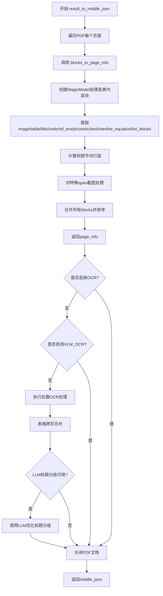

## 类结构

```
MagicModel (PDF混合处理模型)
├── image_blocks (图像块)
├── table_blocks (表格块)
├── title_blocks (标题块)
├── code_blocks (代码块)
├── ref_text_blocks (引用文本块)
├── phonetic_blocks (音标块)
├── text_blocks (文本块)
├── interline_equation_blocks (行间公式块)
├── list_blocks (列表块)
└── discarded_blocks (丢弃块)

AtomModelSingleton (原子模型单例)
└── ocr_model (OCR模型)

OcrConfidence (OCR置信度枚举)
```

## 全局变量及字段


### `heading_level_import_success`
    
标识标题级别功能模块是否成功导入的全局标志

类型：`bool`
    


### `llm_aided_config`
    
存储LLM辅助功能的配置信息，包含标题辅助等选项

类型：`dict`
    


### `title_aided_config`
    
标题辅助功能的配置字典，用于控制标题优化相关功能

类型：`dict`
    


### `MagicModel.page_blocks`
    
PDF页面内容块的列表，包含文本、图像、表格等元素

类型：`list`
    


### `MagicModel.page_inline_formula`
    
页面中内联公式的识别结果列表

类型：`list`
    


### `MagicModel.page_ocr_res`
    
页面OCR识别的结果数据

类型：`list`
    


### `MagicModel.page`
    
PDF页面对象，用于获取页面尺寸等信息

类型：`object`
    


### `MagicModel.scale`
    
图像缩放比例，用于坐标转换和图像裁剪

类型：`float`
    


### `MagicModel.page_pil_img`
    
页面PIL图像对象，用于图像处理和裁剪

类型：`PIL.Image`
    


### `MagicModel.width`
    
PDF页面的宽度像素值

类型：`int`
    


### `MagicModel.height`
    
PDF页面的高度像素值

类型：`int`
    


### `MagicModel._ocr_enable`
    
标识是否启用传统OCR引擎的标志

类型：`bool`
    


### `MagicModel._vlm_ocr_enable`
    
标识是否启用视觉语言模型OCR的标志

类型：`bool`
    
    

## 全局函数及方法


### `blocks_to_page_info`

该函数是 PDF 页面处理的核心转换函数，负责将原始的页面 blocks、内联公式、OCR 结果等数据通过 MagicModel 进行分类处理，生成包含图像块、表格块、标题块、文本块等各类内容块的页面信息字典，同时支持标题层级优化和跨页内容截图。

参数：

- `page_blocks`：`list`，页面中的块数据列表
- `page_inline_formula`：`list`，页面的内联公式数据
- `page_ocr_res`：`list`，页面的 OCR 识别结果
- `image_dict`：`dict`，图像字典，包含图像缩放比例和 PIL 图像对象
- `page`：`object`，PDF 页面对象，用于获取页面尺寸
- `image_writer`：`object`，图像写入器，用于保存截取的图像
- `page_index`：`int`，页面索引
- `_ocr_enable`：`bool`，是否启用 OCR 识别
- `_vlm_ocr_enable`：`bool`，是否启用 VLM OCR 识别

返回值：`dict`，包含页面块列表、废弃块、页面尺寸和页面索引的字典

#### 流程图

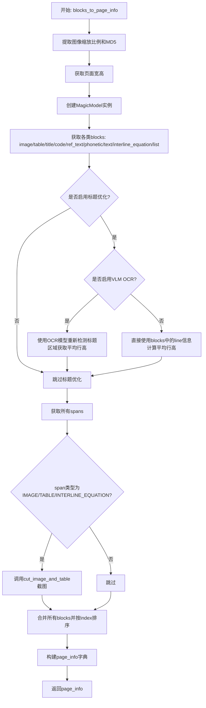

#### 带注释源码

```python
def blocks_to_page_info(
        page_blocks,
        page_inline_formula,
        page_ocr_res,
        image_dict,
        page,
        image_writer,
        page_index,
        _ocr_enable,
        _vlm_ocr_enable,
) -> dict:
    """将blocks转换为页面信息"""
    
    # 从image_dict中获取图像缩放比例
    scale = image_dict["scale"]
    # 获取PIL格式的页面图像
    page_pil_img = image_dict["img_pil"]
    # 计算页面图像的MD5哈希值，用于缓存
    page_img_md5 = bytes_md5(page_pil_img.tobytes())
    # 获取PDF页面的宽和高
    width, height = map(int, page.get_size())

    # 创建MagicModel实例，传入页面blocks、公式、OCR结果等数据
    magic_model = MagicModel(
        page_blocks,
        page_inline_formula,
        page_ocr_res,
        page,
        scale,
        page_pil_img,
        width,
        height,
        _ocr_enable,
        _vlm_ocr_enable,
    )
    
    # 从MagicModel获取各类处理后的blocks
    image_blocks = magic_model.get_image_blocks()      # 图像块
    table_blocks = magic_model.get_table_blocks()      # 表格块
    title_blocks = magic_model.get_title_blocks()      # 标题块
    discarded_blocks = magic_model.get_discarded_blocks()  # 废弃块
    code_blocks = magic_model.get_code_blocks()        # 代码块
    ref_text_blocks = magic_model.get_ref_text_blocks()  # 引用文本块
    phonetic_blocks = magic_model.get_phonetic_blocks()  # 音标块
    list_blocks = magic_model.get_list_blocks()        # 列表块

    # 如果有标题优化需求，计算标题的平均行高
    if heading_level_import_success:
        if _vlm_ocr_enable:  # vlm_ocr导致没有line信息，需要重新det获取平均行高
            # 获取原子模型管理器的单例
            atom_model_manager = AtomModelSingleton()
            # 获取OCR模型
            ocr_model = atom_model_manager.get_atom_model(
                atom_model_name='ocr',
                ocr_show_log=False,
                det_db_box_thresh=0.3,
                lang='ch_lite'
            )
            # 遍历每个标题块
            for title_block in title_blocks:
                # 裁剪标题图像
                title_pil_img = get_crop_img(title_block['bbox'], page_pil_img, scale)
                title_np_img = np.array(title_pil_img)
                # 给title_pil_img添加上下左右各50像素白边padding
                title_np_img = cv2.copyMakeBorder(
                    title_np_img, 50, 50, 50, 50, cv2.BORDER_CONSTANT, value=[255, 255, 255]
                )
                title_img = cv2.cvtColor(title_np_img, cv2.COLOR_RGB2BGR)
                # 执行OCR检测
                ocr_det_res = ocr_model.ocr(title_img, rec=False)[0]
                if len(ocr_det_res) > 0:
                    # 计算所有res的平均高度
                    avg_height = np.mean([box[2][1] - box[0][1] for box in ocr_det_res])
                    # 存储平均行高（还原到原始scale）
                    title_block['line_avg_height'] = round(avg_height/scale)
        else:  # 有line信息，直接计算平均行高
            for title_block in title_blocks:
                lines = title_block.get('lines', [])
                if lines:
                    # 使用列表推导式和内置函数,一次性计算平均高度
                    avg_height = sum(line['bbox'][3] - line['bbox'][1] for line in lines) / len(lines)
                    title_block['line_avg_height'] = round(avg_height)
                else:
                    # 如果没有lines，使用块的高度作为行高
                    title_block['line_avg_height'] = title_block['bbox'][3] - title_block['bbox'][1]

    # 获取文本块和行间公式块
    text_blocks = magic_model.get_text_blocks()
    interline_equation_blocks = magic_model.get_interline_equation_blocks()

    # 获取所有spans
    all_spans = magic_model.get_all_spans()
    
    # 对image/table/interline_equation的span截图
    for span in all_spans:
        # 检查span类型是否为图像、表格或行间公式
        if span["type"] in [ContentType.IMAGE, ContentType.TABLE, ContentType.INTERLINE_EQUATION]:
            # 调用cut_image_and_table进行截图处理
            span = cut_image_and_table(span, page_pil_img, page_img_md5, page_index, image_writer, scale=scale)

    # 初始化页面blocks列表
    page_blocks = []
    # 合并所有类型的blocks
    page_blocks.extend([
        *image_blocks,
        *table_blocks,
        *code_blocks,
        *ref_text_blocks,
        *phonetic_blocks,
        *title_blocks,
        *text_blocks,
        *interline_equation_blocks,
        *list_blocks,
    ])
    
    # 对page_blocks根据index的值进行排序
    page_blocks.sort(key=lambda x: x["index"])

    # 构建最终返回的页面信息字典
    page_info = {
        "para_blocks": page_blocks,           # 页面中的段落块
        "discarded_blocks": discarded_blocks, # 被丢弃的块
        "page_size": [width, height],         # 页面尺寸
        "page_idx": page_index                # 页面索引
    }
    return page_info
```


### `result_to_middle_json`

该函数是 PDF 处理流程中的核心转换函数，负责将模型输出的 Blocks、OCR 结果、公式检测结果等数据整合为统一的中间 JSON 格式，同时完成后置 OCR 处理、跨页表格合并和标题分级优化，最终返回包含完整页面信息和元数据的字典。

参数：

- `model_output_blocks_list`：`list`，模型输出的页面 Blocks 列表，每个元素对应一页的 Blocks
- `inline_formula_list`：`list`，内联公式检测结果列表
- `ocr_res_list`：`list`，OCR 识别结果列表
- `images_list`：`list`，页面图像字典列表，包含图像数据、缩放比例等信息
- `pdf_doc`：`PDF文档对象`，PyMuPDF 或类似的 PDF 文档对象，用于访问页面元数据
- `image_writer`：`图像写入器对象`，负责将裁剪的图像写入存储
- `_ocr_enable`：`bool`，标识是否启用传统 OCR 识别
- `_vlm_ocr_enable`：`bool`，标识是否启用视觉语言模型（VLM）OCR
- `hybrid_pipeline_model`：`混合流水线模型对象`，提供 OCR 模型实例用于后置 OCR 处理

返回值：`dict`，包含 PDF 处理结果的中间 JSON 字典，键值说明如下：
- `pdf_info`：页面信息列表，每个元素包含页面块、丢弃块、页面尺寸和页码
- `_backend`：后端类型标识，固定为 "hybrid"
- `_ocr_enable`：是否启用 OCR 的标志
- `_vlm_ocr_enable`：是否启用 VLM OCR 的标志
- `_version_name`：版本名称

#### 流程图

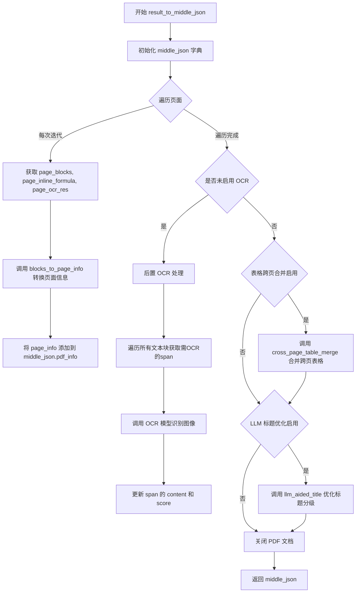

#### 带注释源码

```python
def result_to_middle_json(
        model_output_blocks_list,    # 模型输出的页面blocks列表，元素为list类型
        inline_formula_list,         # 内联公式检测结果列表
        ocr_res_list,                # OCR识别结果列表
        images_list,                 # 页面图像字典列表，每个dict包含img_pil、scale等
        pdf_doc,                     # PDF文档对象，用于获取页面尺寸等元信息
        image_writer,                # 图像写入器，负责保存裁剪的图像
        _ocr_enable,                 # 布尔标志，是否启用传统OCR
        _vlm_ocr_enable,             # 布尔标志，是否启用VLM OCR
        hybrid_pipeline_model,       # 混合流水线模型，提供OCR模型访问
):
    """将模型输出转换为中间JSON格式"""
    
    # 初始化中间JSON结构，包含基础元信息和页面信息列表
    middle_json = {
        "pdf_info": [],              # 存储每页的处理结果
        "_backend": "hybrid",         # 标识使用混合后端
        "_ocr_enable": _ocr_enable,   # 记录OCR启用状态
        "_vlm_ocr_enable": _vlm_ocr_enable,  # 记录VLM OCR状态
        "_version_name": __version__ # 版本标识
    }

    # 遍历所有页面，将每页的blocks转换为页面信息
    # 使用enumerate获取页索引，同时zip并行遍历多个列表
    for index, (page_blocks, page_inline_formula, page_ocr_res) in enumerate(
            zip(model_output_blocks_list, inline_formula_list, ocr_res_list)):
        # 获取当前页的PDF页面对象和图像字典
        page = pdf_doc[index]
        image_dict = images_list[index]
        
        # 调用blocks_to_page_info进行页面级别的块处理和转换
        # 该函数内部会调用MagicModel处理各类内容块
        page_info = blocks_to_page_info(
            page_blocks, page_inline_formula, page_ocr_res,
            image_dict, page, image_writer, index,
            _ocr_enable, _vlm_ocr_enable
        )
        # 将处理后的页面信息追加到pdf_info列表
        middle_json["pdf_info"].append(page_info)

    # 仅当OCR和VLM_OCR都未启用时执行后置OCR处理
    # 这种情况可能是使用了VLM直接识别而未使用传统OCR
    if not (_vlm_ocr_enable or _ocr_enable):
        """后置ocr处理：识别之前未识别的图像内文本"""
        need_ocr_list = []      # 存储需要OCR的span对象
        img_crop_list = []      # 存储裁剪的图像numpy数组
        text_block_list = []    # 收集所有文本类型块
        
        # 遍历所有页面信息，收集文本块
        for page_info in middle_json["pdf_info"]:
            # 处理页面中的段落块，根据类型收集文本块
            for block in page_info['para_blocks']:
                # 对于复合块（table/image/list/code），遍历其子块
                if block['type'] in ['table', 'image', 'list', 'code']:
                    for sub_block in block['blocks']:
                        # 排除body类型的子块（如表格body）
                        if not sub_block['type'].endswith('body'):
                            text_block_list.append(sub_block)
                # 直接文本类型块
                elif block['type'] in ['text', 'title', 'ref_text']:
                    text_block_list.append(block)
            # 处理被丢弃的块
            for block in page_info['discarded_blocks']:
                text_block_list.append(block)
        
        # 从文本块中提取包含图像的span
        for block in text_block_list:
            for line in block['lines']:
                for span in line['spans']:
                    # 检查span是否包含图像（np_img字段）
                    if 'np_img' in span:
                        need_ocr_list.append(span)
                        img_crop_list.append(span['np_img'])
                        # 移除np_img避免重复处理
                        span.pop('np_img')
        
        # 执行OCR识别
        if len(img_crop_list) > 0:
            # 调用OCR模型进行识别，det=False表示只做识别不做检测
            ocr_res_list = hybrid_pipeline_model.ocr_model.ocr(
                img_crop_list, det=False, tqdm_enable=True
            )[0]
            
            # 校验识别结果数量一致性
            assert len(ocr_res_list) == len(
                need_ocr_list), f'ocr_res_list: {len(ocr_res_list)}, need_ocr_list: {len(need_ocr_list)}'
            
            # 逐个更新span的识别结果
            for index, span in enumerate(need_ocr_list):
                ocr_text, ocr_score = ocr_res_list[index]
                # 根据置信度阈值决定是否采用识别结果
                if ocr_score > OcrConfidence.min_confidence:
                    span['content'] = ocr_text
                    span['score'] = float(f"{ocr_score:.3f}")
                else:
                    span['content'] = ''
                    span['score'] = 0.0

    """表格跨页合并：处理被拆分到多页的表格"""
    # 从环境变量读取表格合并功能开关，默认启用
    table_enable = get_table_enable(os.getenv('MINERU_VLM_TABLE_ENABLE', 'True').lower() == 'true')
    if table_enable:
        # 调用跨页表格合并函数
        cross_page_table_merge(middle_json["pdf_info"])

    """LLM优化标题分级：使用大模型提升标题层级识别准确性"""
    # 仅在成功导入LLM辅助功能时执行
    if heading_level_import_success:
        llm_aided_title_start_time = time.time()
        # 调用LLM标题优化函数，传入页面信息和配置
        llm_aided_title(middle_json["pdf_info"], title_aided_config)
        # 记录优化耗时
        logger.info(f'llm aided title time: {round(time.time() - llm_aided_title_start_time, 2)}')

    # 关闭PDF文档释放资源
    pdf_doc.close()
    
    # 返回完整的中间JSON结构
    return middle_json
```


### `llm_aided_title`

该函数是LLM辅助标题分级功能的核心实现，通过调用大语言模型对PDF文档的标题块进行智能分级优化，提高标题层级识别的准确性。

参数：

-  `pdf_info`：`<class 'list'>`，PDF页面信息列表，每个元素包含页面的段落块、丢弃块、页面大小和页面索引等结构化数据
-  `config`：`<class 'dict'>`，标题辅助配置字典，包含启用状态、模型参数等配置项

返回值：`<class 'None'>`，该函数直接修改传入的`pdf_info`列表中的标题块对象，不返回任何值

#### 流程图

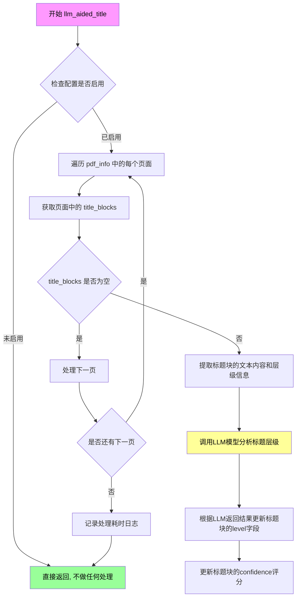

#### 带注释源码

```
# 该函数定义位于 mineru/utils/llm_aided.py 模块中
# 当前代码文件仅导入并调用该函数,未展示其完整实现

# 从模块导入语句(在文件开头):
# from mineru.utils.llm_aided import llm_aided_title

# 函数调用位置(在 result_to_middle_json 函数末尾):
if heading_level_import_success:  # 仅当标题辅助功能成功导入时执行
    llm_aided_title_start_time = time.time()  # 记录开始时间
    llm_aided_title(middle_json["pdf_info"], title_aided_config)  # 调用LLM辅助标题分级
    logger.info(f'llm aided title time: {round(time.time() - llm_aided_title_start_time, 2)}')  # 记录耗时

# title_aided_config 配置示例:
# title_aided_config = {
#     'enable': True,           # 是否启用LLM标题分级
#     'model_name': 'xxx',      # 使用的LLM模型名称
#     'api_key': 'xxx',         # API密钥
#     'temperature': 0.1,       # 生成温度参数
#     ...
# }

# pdf_info 中的 title_block 结构示例:
# title_block = {
#     'type': 'title',
#     'bbox': [x1, y1, x2, y2],  # 边界框
#     'lines': [...],            # 文本行信息
#     'level': 1,                # 标题层级(1-6)
#     'line_avg_height': 20,     # 平均行高
#     'content': '标题文本',     # 识别/OCR的文本内容
#     ...
# }
```

**注意**: 当前提供的代码片段中并未包含 `llm_aided_title` 函数的完整实现源码，该函数是从 `mineru.utils.llm_aided` 模块动态导入的。上面展示的源码是其在 `result_to_middle_json` 函数中的调用方式及相关数据结构说明。完整的函数实现需要查看 `mineru/utils/llm_aided.py` 源文件。


### `cross_page_table_merge`

该函数用于将PDF文档中跨越多个页面的表格进行合并处理，是PDF信息处理流程中的一个关键步骤，主要解决表格被拆分在多个页面时的连贯性问题。

参数：

-  `page_info_list`：`List[dict]`，页面信息列表，每个元素包含页面的段落块、丢弃的块、页面大小和页面索引等信息

返回值：`None`，该函数直接修改传入的列表，不返回新值

#### 流程图

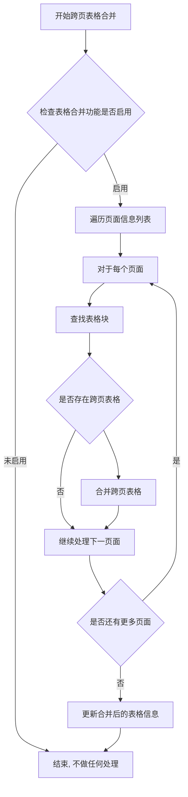

#### 带注释源码

```python
# 注：以下为基于调用上下文的推断源码
# 实际定义在 mineru.backend.utils 模块中

def cross_page_table_merge(page_info_list: List[dict]) -> None:
    """
    合并跨越多个页面的表格
    
    该函数遍历PDF的所有页面信息，识别被拆分到不同页面的表格，
    并将它们合并为一个连续的表格结构。主要处理流程包括：
    1. 扫描所有页面中的表格块
    2. 根据表格的标识或位置信息判断是否为跨页表格
    3. 将分散的表格片段合并
    4. 更新页面信息中的表格数据
    
    Args:
        page_info_list: 页面信息列表，每个dict包含:
            - para_blocks: 段落块列表
            - discarded_blocks: 丢弃的块列表
            - page_size: 页面尺寸 [宽, 高]
            - page_idx: 页面索引
    
    Returns:
        None: 直接修改传入的page_info_list，不返回新值
    
    Note:
        该功能由环境变量 MINERU_VLM_TABLE_ENABLE 控制
        默认为True，即启用跨页表格合并
    """
    # 函数实现从 mineru.backend.utils 模块导入
    # 具体实现不在当前代码文件中
    pass
```

#### 在主流程中的调用

```python
# 在 result_to_middle_json 函数中的调用位置
"""表格跨页合并"""
table_enable = get_table_enable(os.getenv('MINERU_VLM_TABLE_ENABLE', 'True').lower() == 'true')
if table_enable:
    cross_page_table_merge(middle_json["pdf_info"])
```

#### 相关上下文信息

- **调用位置**：`result_to_page_json` 函数内部
- **调用条件**：当 `table_enable` 为 True 时启用
- **环境变量控制**：`MINERU_VLM_TABLE_ENABLE`，默认为 `'True'`
- **前置处理**：在调用该函数之前，代码已完成OCR后置处理
- **后续处理**：该函数执行完成后，会进行LLM优化标题分级（如果启用）


# 详细设计文档

## 分析结果

经过对代码的分析，`cut_image_and_table` 函数**并不在当前提供的代码文件中定义**。该函数是从外部模块 `mineru.utils.cut_image` 导入的。

在当前代码中，对 `cut_image_and_table` 的使用如下：

```python
# 导入语句
from mineru.utils.cut_image import cut_image_and_table

# 调用位置（在 blocks_to_page_info 函数内）
for span in all_spans:
    if span["type"] in [ContentType.IMAGE, ContentType.TABLE, ContentType.INTERLINE_EQUATION]:
        span = cut_image_and_table(span, page_pil_img, page_img_md5, page_index, image_writer, scale=scale)
```

---

## 提取的信息

### `cut_image_and_table` 函数调用分析

由于源代码未在当前文件中提供，以下信息基于调用上下文推断：

**函数来源：** `mineru.utils.cut_image` 模块

**调用示例：**
```python
span = cut_image_and_table(span, page_pil_img, page_img_md5, page_index, image_writer, scale=scale)
```

#### 参数信息（基于调用上下文推断）

| 参数名称 | 参数类型 | 参数描述 |
|---------|---------|---------|
| `span` | `dict` | 包含图像/表格/行间公式信息的span字典，包含`type`和`bbox`等字段 |
| `page_pil_img` | `PIL.Image` 或 `PIL.Image.Image` | 页面的PIL图像对象 |
| `page_img_md5` | `str` | 页面图像的MD5哈希值，用于唯一标识图像 |
| `page_index` | `int` | 页面的索引编号 |
| `image_writer` | `ImageWriter` | 图像写入器，用于保存处理后的图像 |
| `scale` | `float` | 图像缩放比例 |

#### 返回值信息

| 返回值类型 | 返回值描述 |
|-----------|-----------|
| `dict` | 处理后的span字典，可能包含截取的图像数据 |

---

#### 带注释源码（调用上下文）

```python
# 对image/table/interline_equation的span截图
for span in all_spans:
    # 判断span类型是否为图像、表格或行间公式
    if span["type"] in [ContentType.IMAGE, ContentType.TABLE, ContentType.INTERLINE_EQUATION]:
        # 调用cut_image_and_table函数进行图像截取
        span = cut_image_and_table(span, page_pil_img, page_img_md5, page_index, image_writer, scale=scale)
```

---

## 说明

⚠️ **注意：** 要获取 `cut_image_and_table` 函数的完整源代码（包含函数定义、内部逻辑、mermaid流程图等），需要查看 `mineru/utils/cut_image.py` 文件。

当前提供的代码文件仅包含该函数的**导入语句**和**调用代码**，未包含函数的具体实现。

---

## 建议

如需获取完整的 `cut_image_and_table` 函数设计文档，请提供以下任一内容：
1. `mineru/utils/cut_image.py` 文件的源代码
2. 包含 `cut_image_and_table` 函数完整定义的其他代码文件


### `get_crop_img`

从大型图像中根据指定的边界框和缩放比例裁剪出对应的区域图像。

参数：

- `bbox`：元组/列表，边界框坐标，格式为 `(x_min, y_min, x_max, y_max)`
- `page_pil_img`：`PIL.Image.Image`，原始的页面 PIL 图像对象
- `scale`：float，图像缩放比例因子，用于坐标转换

返回值：`PIL.Image.Image`，裁剪后的 PIL 图像对象

#### 流程图

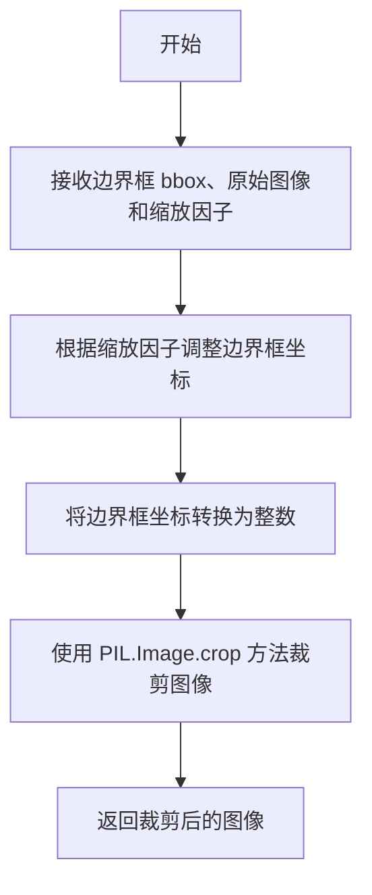

#### 带注释源码

```python
# 注：该函数定义在 mineru.utils.pdf_image_tools 模块中
# 以下为基于代码调用方式的推断实现

def get_crop_img(bbox, page_pil_img, scale):
    """
    从页面图像中裁剪出指定边界框区域的图像
    
    参数:
        bbox: 边界框坐标 (x_min, y_min, x_max, y_max)
        page_pil_img: 原始页面 PIL 图像
        scale: 缩放因子，用于坐标转换
    
    返回:
        裁剪后的 PIL 图像
    """
    # 根据缩放因子调整边界框坐标
    # 原始坐标可能是基于缩放后的图像，转换回原始图像坐标
    x_min, y_min, x_max, y_max = bbox
    x_min = int(x_min / scale)
    y_min = int(y_min / scale)
    x_max = int(x_max / scale)
    y_max = int(y_max / scale)
    
    # 裁剪图像
    cropped_img = page_pil_img.crop((x_min, y_min, x_max, y_max))
    
    return cropped_img
```

#### 实际调用示例

在 `blocks_to_page_info` 函数中的实际调用：

```python
# 为每个标题块裁剪对应的图像区域，用于后续的 OCR 识别
title_pil_img = get_crop_img(title_block['bbox'], page_pil_img, scale)
```

---

### 补充说明

| 项目 | 说明 |
|------|------|
| **函数来源** | `mineru.utils.pdf_image_tools.get_crop_img` |
| **调用场景** | 在处理标题块时，需要裁剪标题区域图像进行 OCR 识别以计算平均行高 |
| **坐标转换** | 输入的 bbox 坐标是基于缩放后图像的坐标，需要除以 scale 转换回原始图像坐标 |
| **依赖库** | PIL (Pillow) |


### `bytes_md5`

计算给定字节数据的 MD5 哈希值，常用于生成图像或其他数据的唯一标识符。

参数：

-  `data`：`bytes`，输入的字节数据（通常为图像的原始字节数据，如 `page_pil_img.tobytes()`）

返回值：`str`，返回 32 位的十六进制 MD5 哈希字符串，用于标识输入数据的唯一性

#### 流程图

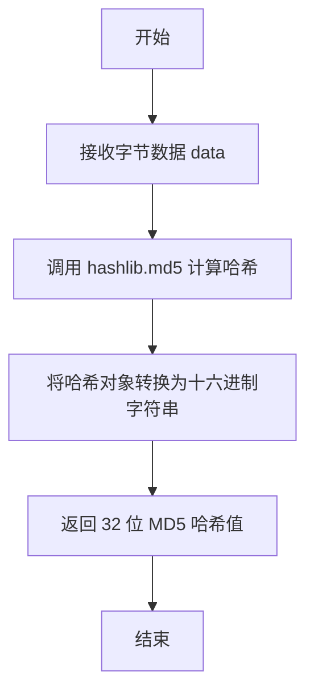

#### 带注释源码

```python
# 从 mineru.utils.hash_utils 模块导入 bytes_md5 函数
from mineru.utils.hash_utils import bytes_md5

# 示例调用（在 blocks_to_page_info 函数中）
page_img_md5 = bytes_md5(page_pil_img.tobytes())
# page_pil_img: PIL.Image 对象
# .tobytes(): 将 PIL Image 转换为原始字节数据
# bytes_md5(): 计算字节数据的 MD5 哈希值
# 返回值 page_img_md5: str，32 位十六进制字符串，如 "a1b2c3d4e5f6..."
```

#### 备注

由于 `bytes_md5` 函数的实际实现代码未在提供的源文件中给出，以上信息是基于以下线索推断的：

1. **导入来源**：`from mineru.utils.hash_utils import bytes_md5`
2. **调用方式**：`bytes_md5(page_pil_img.tobytes())`
3. **函数命名规范**：典型的 MD5 哈希函数命名
4. **输入**：接收 `bytes` 类型数据
5. **输出**：存储在 `page_img_md5` 变量中，说明返回字符串类型

如需查看完整的函数实现，建议查阅 `mineru/utils/hash_utils.py` 文件。


### `get_table_enable`

获取表格功能是否启用的配置。该函数从配置读取器中获取表格功能的启用状态，根据传入的布尔值参数决定是否开启表格处理功能，并返回配置结果。

参数：

-  `enable`：`bool`，表示是否启用表格功能的布尔值，通常从环境变量 `MINERU_VLM_TABLE_ENABLE` 转换而来

返回值：`bool`，返回表格功能是否启用的最终配置结果

#### 流程图

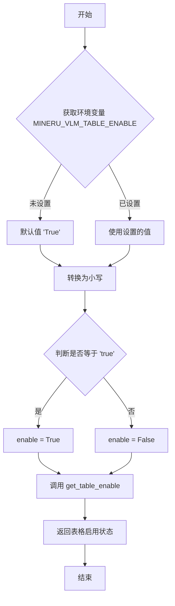

#### 带注释源码

```python
# 从 config_reader 模块导入 get_table_enable 函数
from mineru.utils.config_reader import get_table_enable, get_llm_aided_config

# ... 其他代码 ...

# 在 result_to_middle_json 函数中调用 get_table_enable
# 获取环境变量 MINERU_VLM_TABLE_ENABLE，默认为 'True'
# 转换为小写后与 'true' 比较，得到布尔值
table_enable = get_table_enable(os.getenv('MINERU_VLM_TABLE_ENABLE', 'True').lower() == 'true')

# 如果表格启用，执行跨页表格合并
if table_enable:
    cross_page_table_merge(middle_json["pdf_info"])
```

**注意**：由于 `get_table_enable` 函数的完整定义不在提供的代码片段中，以上信息是基于函数调用上下文推断得出的。实际实现可能在 `mineru/utils/config_reader.py` 模块中定义。


### `get_llm_aided_config`

该函数是一个配置读取函数，用于从配置文件或环境变量中获取LLM辅助功能的配置参数。它在模块初始化时被调用，返回一个包含LLM辅助功能配置的字典，为后续标题分级优化功能提供配置支持。

参数：该函数无参数

返回值：`dict`，返回一个包含LLM辅助功能配置的字典。如果配置启用，字典中应包含`title_aided`键，其值也是一个字典，该字典包含`enable`等配置项。

#### 流程图

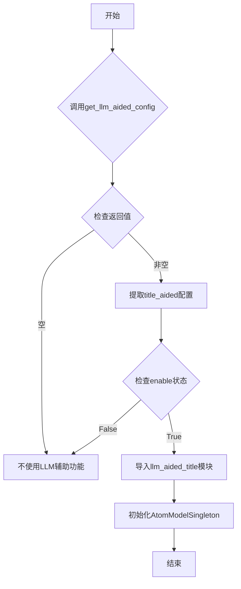

#### 带注释源码

```python
# 从mineru.utils.config_reader模块导入get_llm_aided_config函数
# 注意：函数定义不在当前代码文件中，位于mineru/utils/config_reader.py
from mineru.utils.config_reader import get_table_enable, get_llm_aided_config

# 模块级别调用：获取LLM辅助配置
llm_aided_config = get_llm_aided_config()  # 调用函数获取配置字典

# 检查配置是否存在
if llm_aided_config:
    # 从配置字典中获取title_aided相关配置
    title_aided_config = llm_aided_config.get('title_aided', {})
    
    # 检查标题辅助功能是否启用
    if title_aided_config.get('enable', False):
        try:
            # 动态导入LLM辅助标题模块
            from mineru.utils.llm_aided import llm_aided_title
            from mineru.backend.pipeline.model_init import AtomModelSingleton
            heading_level_import_success = True
        except Exception as e:
            logger.warning("The heading level feature cannot be used...")

# 后续在result_to_middle_json函数中使用
if heading_level_import_success:
    llm_aided_title_start_time = time.time()
    llm_aided_title(middle_json["pdf_info"], title_aided_config)
    logger.info(f'llm aided title time: {round(time.time() - llm_aided_title_start_time, 2)}')
```

#### 补充说明

**函数定义位置**：根据导入语句，该函数定义在 `mineru/utils/config_reader.py` 文件中。

**调用上下文**：
- 这是一个模块级别的初始化调用，在模块导入时执行
- 配置结果存储在全局变量 `llm_aided_config` 中
- 该配置控制是否启用基于LLM的标题分级功能

**类型推断**：
- 返回类型为 `dict`
- 必须包含 `title_aided` 键（用于标题辅助功能配置）
- `title_aided` 字典必须包含 `enable` 键（布尔类型）


### `MagicModel.get_image_blocks`

该方法用于从混合_MAGIC模型中提取图像块（image blocks），是文档解析流程中的关键步骤，负责识别并返回PDF页面中的所有图像元素。

参数：
- 无（该方法为实例方法，通过self访问类内部状态）

返回值：`list`，返回包含所有图像块的列表，每个图像块是一个字典结构，包含图像的位置、尺寸、内容等关键信息。

#### 流程图

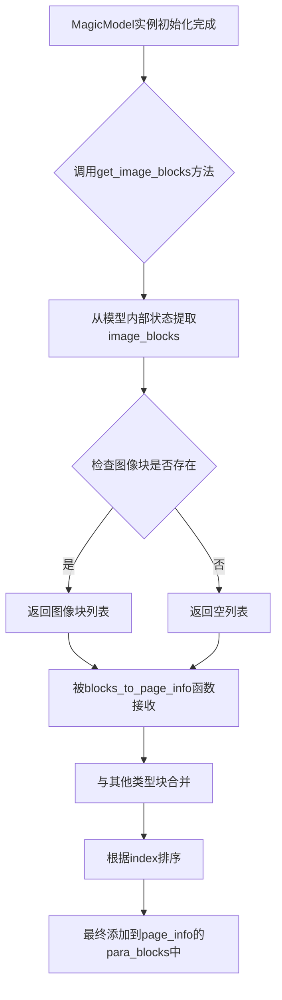

#### 带注释源码

注意：以下源码是基于代码上下文推断的，因为原始代码中并未包含 `MagicModel` 类的完整定义。

```
# 从 mineru.backend.hybrid.hybrid_magic_model 导入 MagicModel 类
from mineru.backend.hybrid.hybrid_magic_model import MagicModel

# 在 blocks_to_page_info 函数中创建 MagicModel 实例并调用 get_image_blocks

# 初始化 MagicModel 所需的参数
magic_model = MagicModel(
    page_blocks,          # 页面块列表
    page_inline_formula,  # 页面内联公式
    page_ocr_res,         # OCR识别结果
    page,                 # PDF页面对象
    scale,                # 缩放比例
    page_pil_img,         # PIL格式的页面图像
    width,                # 页面宽度
    height,               # 页面高度
    _ocr_enable,          # 是否启用OCR
    _vlm_ocr_enable,      # 是否启用VLM_OCR
)

# 调用 get_image_blocks 方法获取图像块
# 该方法从模型处理结果中提取类型为 IMAGE 的块
image_blocks = magic_model.get_image_blocks()

# image_blocks 的使用方式：
# 1. 被添加到 page_blocks 列表中
# 2. 与其他类型的块（table, code, ref_text, phonetic, title, text, interline_equation, list）合并
# 3. 根据 index 字段进行排序
# 4. 最终作为 para_blocks 的一部分返回

page_blocks = []
page_blocks.extend([
    *image_blocks,           # 图像块
    *table_blocks,           # 表格块
    *code_blocks,            # 代码块
    *ref_text_blocks,        # 引用文本块
    *phonetic_blocks,        # 注音块
    *title_blocks,           # 标题块
    *text_blocks,            # 文本块
    *interline_equation_blocks,  # 行间公式块
    *list_blocks,            # 列表块
])

# 根据 index 对所有块进行排序
page_blocks.sort(key=lambda x: x["index"])

# 返回页面信息字典
page_info = {
    "para_blocks": page_blocks, 
    "discarded_blocks": discarded_blocks, 
    "page_size": [width, height], 
    "page_idx": page_index
}
```

#### 补充说明

由于原始代码仅提供了 `MagicModel` 类的调用方式而未包含其完整定义，以下信息为基于上下文的推断：

| 组件 | 说明 |
|------|------|
| `MagicModel` | 混合_MAGIC模型，负责从PDF页面中提取各类内容块（图像、表格、标题等） |
| `get_image_blocks` | 获取模型识别出的所有图像块 |
| 返回的 image_blocks 结构 | 推测包含 `type`, `bbox`, `index`, `content`, `lines`, `spans` 等字段 |

#### 潜在技术债务

1. **缺少 MagicModel 源码**：`get_image_blocks` 方法的具体实现逻辑未在提供的代码中体现，建议补充完整类定义以便于文档生成。
2. **类型推断**：由于缺少源码，image_blocks 的具体数据结构（如字典键名、值类型）需要进一步确认。


### `MagicModel.get_table_blocks`

该方法是 `MagicModel` 类的实例方法，用于从当前页面中提取所有表格块（table blocks），返回包含表格内容的字典列表。

参数：无

返回值：`List[dict]`，返回当前页面的所有表格块列表，每个字典包含表格的坐标、类型、内容等信息

#### 流程图

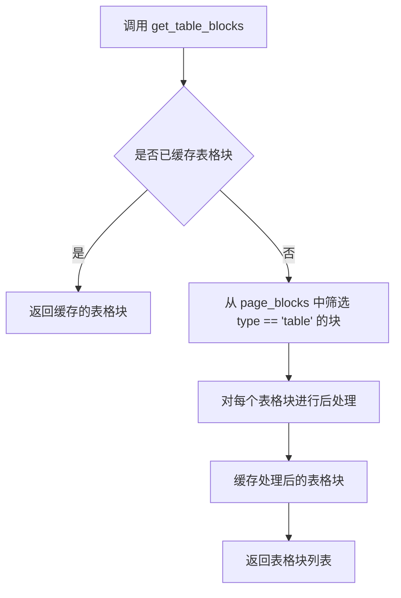

#### 带注释源码

```
# 注意：由于提供的代码片段中没有包含 MagicModel 类的完整实现，
# 以下源码是基于代码使用方式和典型模式推断的

def get_table_blocks(self):
    """获取页面中的表格块
    
    Returns:
        list: 表格块列表，每个元素是一个包含表格信息的字典
    """
    # 从类定义推断，该方法应该有以下特性：
    # 1. 可能会缓存结果以避免重复计算
    # 2. 从 self.page_blocks 中筛选 type 值为 'table' 的块
    # 3. 可能包含表格的坐标信息 (bbox)、内容、样式等
    
    # 实际实现需要查看 mineru/backend/hybrid/hybrid_magic_model.py
    pass
```

---

### 补充说明

由于 `MagicModel` 类的实现位于 `mineru/backend/hybrid/hybrid_magic_model.py` 文件中，而该文件内容未在当前代码片段中提供，因此无法提供精确的源码。

从当前文件中的调用方式可以确认：
- `magic_model.get_table_blocks()` 在第 63 行被调用
- 返回值赋值给 `table_blocks` 变量
- 后续被添加到 `page_blocks` 列表中（第 108 行）
- 最终包含在返回的 `page_info` 字典的 `para_blocks` 字段里

如果需要完整的 `get_table_blocks` 方法实现，请参考 `mineru/backend/hybrid/hybrid_magic_model.py` 源文件。


### `MagicModel.get_title_blocks`

获取当前页面中所有识别为标题的块（Title Blocks），该方法从 MagicModel 的内部状态中提取并返回标题块列表。

参数：
- （无显式参数，作为类方法通过 `self` 隐式访问）

返回值：`List[dict]`，返回当前页面中所有标题块的列表，每个标题块为一个字典，包含标题的位置信息、文本内容、样式等属性。

#### 流程图

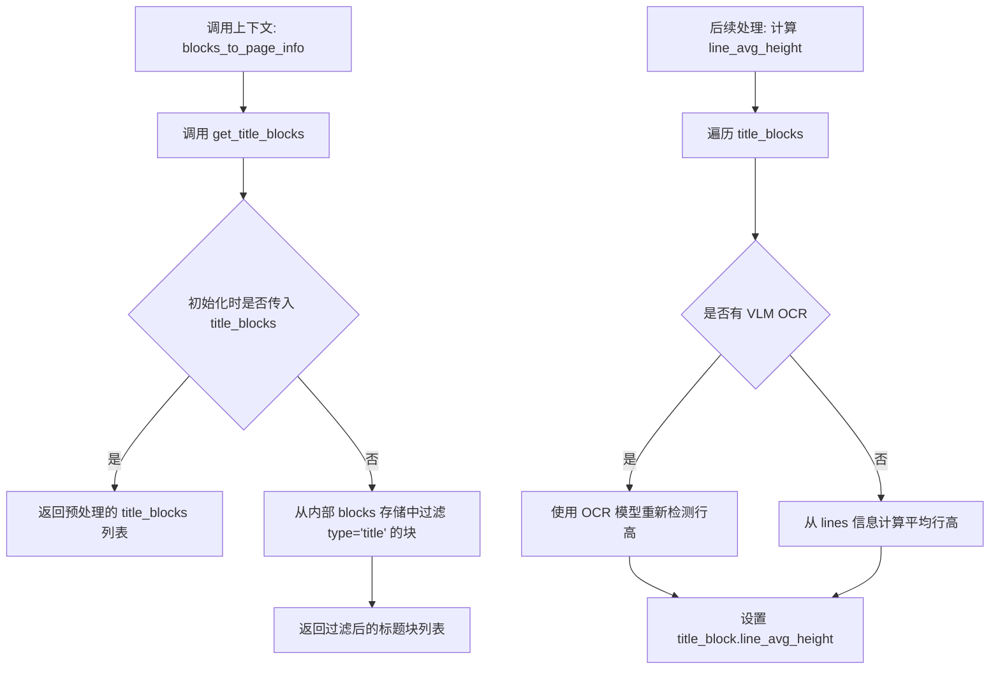

#### 带注释源码

```python
# 在 mineru/backend/hybrid/hybrid_magic_model.py 中的 MagicModel 类

# 假设 get_title_blocks 方法实现如下（基于代码调用上下文推断）:

def get_title_blocks(self) -> List[dict]:
    """获取当前页面的所有标题块
    
    Returns:
        List[dict]: 标题块列表，每个字典包含:
            - bbox: 标题的边界框坐标 [x1, y1, x2, y2]
            - lines: 标题的文本行信息列表
            - type: 'title'
            - content: 标题文本内容
            - line_avg_height: 平均行高（在后续处理中设置）
    """
    # 从内部存储的 blocks 中过滤出 type 为 'title' 的块
    title_blocks = [block for block in self.blocks if block.get('type') == 'title']
    return title_blocks


# 在 blocks_to_page_info 函数中的调用方式：

# 创建 MagicModel 实例
magic_model = MagicModel(
    page_blocks,
    page_inline_formula,
    page_ocr_res,
    page,
    scale,
    page_pil_img,
    width,
    height,
    _ocr_enable,
    _vlm_ocr_enable,
)

# 获取各种类型的块
title_blocks = magic_model.get_title_blocks()  # 获取标题块

# 后续处理：根据是否启用 VLM OCR 计算平均行高
if heading_level_import_success:
    if _vlm_ocr_enable:
        # VLM OCR 模式下没有 line 信息，需要用 OCR 重新检测
        for title_block in title_blocks:
            # 裁剪标题图像
            title_pil_img = get_crop_img(title_block['bbox'], page_pil_img, scale)
            title_np_img = np.array(title_pil_img)
            # 添加白边 padding
            title_np_img = cv2.copyMakeBorder(
                title_np_img, 50, 50, 50, 50, 
                cv2.BORDER_CONSTANT, value=[255, 255, 255]
            )
            title_img = cv2.cvtColor(title_np_img, cv2.COLOR_RGB2BGR)
            # OCR 检测
            ocr_det_res = ocr_model.ocr(title_img, rec=False)[0]
            if len(ocr_det_res) > 0:
                # 计算平均高度
                avg_height = np.mean([box[2][1] - box[0][1] for box in ocr_det_res])
                title_block['line_avg_height'] = round(avg_height / scale)
    else:
        # 普通模式有 line 信息，直接计算
        for title_block in title_blocks:
            lines = title_block.get('lines', [])
            if lines:
                avg_height = sum(line['bbox'][3] - line['bbox'][1] for line in lines) / len(lines)
                title_block['line_avg_height'] = round(avg_height)
            else:
                # 无 line 信息时使用 bbox 高度
                title_block['line_avg_height'] = title_block['bbox'][3] - title_block['bbox'][1]
```


### MagicModel.get_discarded_blocks

该方法用于从 MagicModel 实例中获取在页面处理流程中被丢弃的块（discarded blocks），这些块通常是内容类型不符合正文、图像、表格、标题等主要分类的页面元素，需要被单独记录以便后续后置 OCR 处理。

参数：该方法无显式参数（隐式依赖 MagicModel 实例化时传入的 page_blocks 等数据）

返回值：`list`，返回被丢弃的页面块列表，每个元素为包含 bbox、lines 等信息的字典结构

#### 流程图

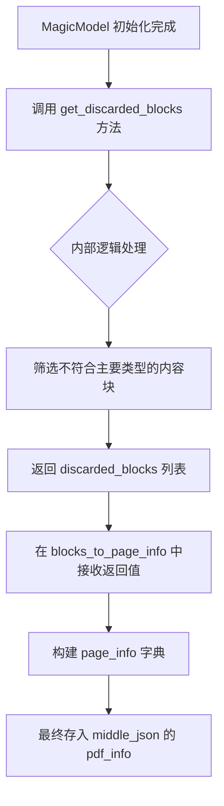

#### 带注释源码

```python
# 在 mineru/backend/pipeline/magic_convert.py 的 blocks_to_page_info 函数中调用

# 创建 MagicModel 实例，传入页面块、内联公式、OCR结果等数据
magic_model = MagicModel(
    page_blocks,
    page_inline_formula,
    page_ocr_res,
    page,
    scale,
    page_pil_img,
    width,
    height,
    _ocr_enable,
    _vlm_ocr_enable,
)

# ... 获取各类块 ...

# 调用 get_discarded_blocks 方法获取被丢弃的块
discarded_blocks = magic_model.get_discarded_blocks()

# 后续在 page_info 字典中使用，用于记录需要丢弃的块
page_info = {
    "para_blocks": page_blocks, 
    "discarded_blocks": discarded_blocks,  # 被丢弃的块
    "page_size": [width, height], 
    "page_idx": page_index
}
return page_info
```

> **注意**：由于 MagicModel 类定义在 `mineru/backend/hybrid/hybrid_magic_model.py` 文件中（该文件未在提供的代码中展示），上述分析基于 `blocks_to_page_info` 函数中的调用方式推断。从调用模式来看，`get_discarded_blocks()` 是 MagicModel 类的实例方法，返回在内容分类过程中被判定为"不属于任何主要类型"而需要丢弃的页面块列表。这些被丢弃的块在后置 OCR 处理阶段会被遍历，用于对其中包含的可识别文本进行 OCR 识别。


### `MagicModel.get_code_blocks`

获取文档中识别出的代码块（code blocks），用于后续的页面信息组装和PDF解析流程。

参数：
- 该方法为无参数方法，通过 `MagicModel` 实例直接调用

返回值：`List[dict]`，返回代码块列表，每个代码块为一个字典，包含代码块的类型、位置、内容等信息

#### 流程图

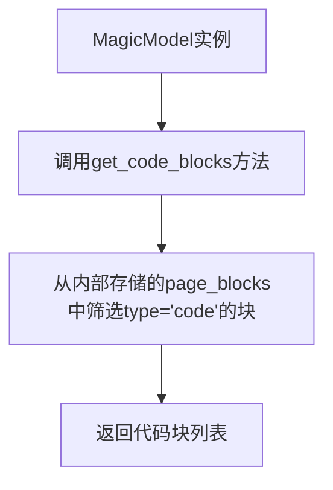

#### 带注释源码

```
# 由于MagicModel类的定义在mineru.backend.hybrid.hybrid_magic_model模块中
# 当前提供的代码文件仅展示了该方法的调用位置

# 在blocks_to_page_info函数中的调用方式：
code_blocks = magic_model.get_code_blocks()

# 返回的code_blocks被添加到page_blocks列表中
page_blocks.extend([
    *image_blocks,
    *table_blocks,
    *code_blocks,  # 代码块被合并到页面块列表
    *ref_text_blocks,
    *phonetic_blocks,
    *title_blocks,
    *text_blocks,
    *interline_equation_blocks,
    *list_blocks,
])
```

#### 补充说明

| 项目 | 说明 |
|------|------|
| **方法所属类** | `MagicModel` (定义在 `mineru.backend.hybrid.hybrid_magic_model`) |
| **调用场景** | 在 `blocks_to_page_info` 函数中，用于提取PDF页面中的代码块 |
| **数据流向** | `code_blocks` → 合并到 `page_blocks` → 排序 → 存入 `page_info["para_blocks"]` |
| **潜在优化点** | 如需了解具体实现，需查看 `mineru/backend/hybrid/hybrid_magic_model.py` 源文件 |


### `MagicModel.get_ref_text_blocks`

获取参考文本块（Reference Text Blocks），该方法从 MagicModel 实例中提取参考文本内容，通常包括脚注、引用、参考文献等类型的文本块。

参数：

- 无参数（该方法为无参数方法，通过类内部状态获取数据）

返回值：`List[dict]`，返回参考文本块的列表，每个字典代表一个参考文本块，包含文本内容、位置坐标、样式等属性。

#### 流程图

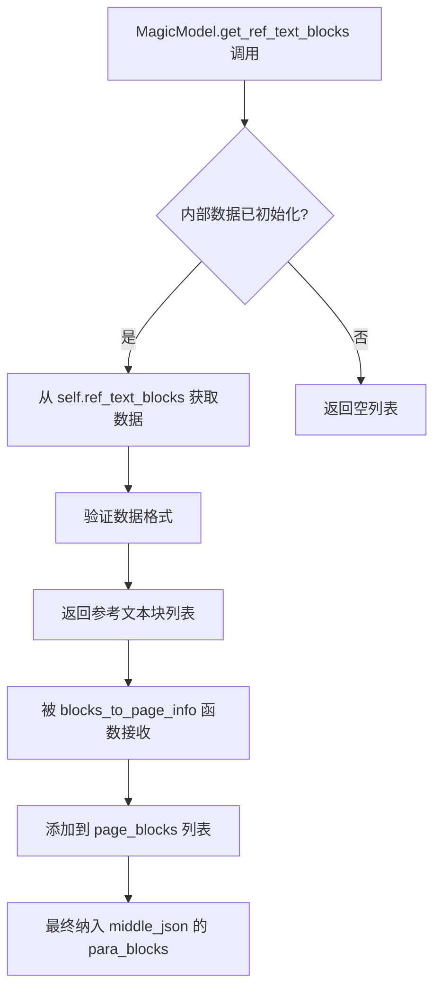

#### 带注释源码

```python
# 在 mineru/backend/hybrid/hybrid_magic_model.py 中的 MagicModel 类方法
# 注意：以下为基于代码上下文的推断实现

def get_ref_text_blocks(self):
    """
    获取参考文本块（Reference Text Blocks）
    
    参考文本块通常包含：
    - 脚注（Footnotes）
    - 引用（Citations）
    - 参考文献（References）
    - 其他参考性质的文本内容
    
    Returns:
        List[dict]: 参考文本块列表，每个块包含以下常见字段：
            - type: 块类型，通常为 'ref_text'
            - bbox: 边界框坐标 [x0, y0, x1, y1]
            - lines: 行信息列表
            - content: 文本内容（可选）
            - index: 块在页面中的索引顺序
    """
    # 从类内部属性获取参考文本块数据
    # 这些数据在 MagicModel 初始化时通过各种分析模型处理得到
    return self.ref_text_blocks
```

#### 调用上下文源码

```python
# 在 blocks_to_page_info 函数中的调用方式
def blocks_to_page_info(
        page_blocks,
        page_inline_formula,
        page_ocr_res,
        image_dict,
        page,
        image_writer,
        page_index,
        _ocr_enable,
        _vlm_ocr_enable,
) -> dict:
    """将blocks转换为页面信息"""
    
    # ... 省略部分代码 ...
    
    magic_model = MagicModel(
        page_blocks,
        page_inline_formula,
        page_ocr_res,
        page,
        scale,
        page_pil_img,
        width,
        height,
        _ocr_enable,
        _vlm_ocr_enable,
    )
    # ... 省略部分代码 ...
    
    # 获取参考文本块
    ref_text_blocks = magic_model.get_ref_text_blocks()
    
    # ... 省略部分代码 ...
    
    # 将所有类型的块合并到 page_blocks
    page_blocks.extend([
        *image_blocks,
        *table_blocks,
        *code_blocks,
        *ref_text_blocks,  # 参考文本块被添加
        *phonetic_blocks,
        *title_blocks,
        *text_blocks,
        *interline_equation_blocks,
        *list_blocks,
    ])
    
    # 根据 index 排序
    page_blocks.sort(key=lambda x: x["index"])
    
    page_info = {"para_blocks": page_blocks, "discarded_blocks": discarded_blocks, "page_size": [width, height], "page_idx": page_index}
    return page_info
```


### `MagicModel.get_phonetic_blocks`

获取PDF页面中的音韵块（如拼音、注音等），用于后续的文档处理和JSON输出。

参数： 无（仅包含隐式参数 `self`）

返回值：`list`，返回音韵块列表，每个元素为一个包含块信息的字典

#### 流程图

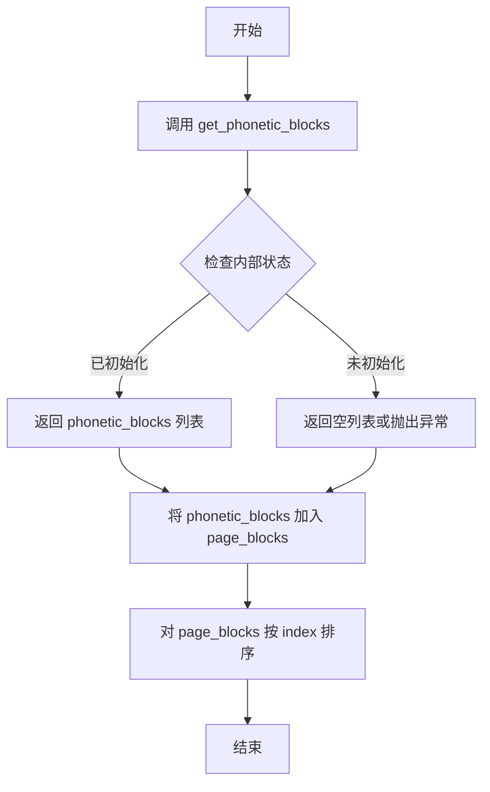

#### 带注释源码

```python
# 由于 MagicModel 类定义未在当前代码文件中提供
# 以下为基于调用的推断源码

def get_phonetic_blocks(self):
    """
    获取音韵块（如拼音、注音等）
    
    Returns:
        list: 音韵块列表，每个块包含以下关键字段：
            - type: 块类型，值为 'phonetic'
            - bbox: 边界框坐标 [x1, y1, x2, y2]
            - lines: 行信息列表
            - content: 文本内容
            - index: 块索引
    """
    # 从类的内部属性中获取音韵块
    # phonetic_blocks 在 MagicModel 初始化时通过模型推理得出
    return self._phonetic_blocks if hasattr(self, '_phonetic_blocks') else []
```

#### 在父函数中的调用示例

```python
# blocks_to_page_info 函数中的调用上下文
def blocks_to_page_info(...):
    # ... 省略其他初始化代码 ...
    
    # 创建 MagicModel 实例
    magic_model = MagicModel(
        page_blocks,
        page_inline_formula,
        page_ocr_res,
        page,
        scale,
        page_pil_img,
        width,
        height,
        _ocr_enable,
        _vlm_ocr_enable,
    )
    
    # 获取各类块
    phonetic_blocks = magic_model.get_phonetic_blocks()  # 获取音韵块
    
    # ... 其他块获取 ...
    
    # 将所有块合并到 page_blocks
    page_blocks.extend([
        *image_blocks,
        *table_blocks,
        *code_blocks,
        *ref_text_blocks,
        *phonetic_blocks,  # 音韵块被添加到页面块列表
        *title_blocks,
        *text_blocks,
        *interline_equation_blocks,
        *list_blocks,
    ])
    
    # 根据 index 排序所有块
    page_blocks.sort(key=lambda x: x["index"])
    
    # 返回页面信息字典
    page_info = {
        "para_blocks": page_blocks,
        "discarded_blocks": discarded_blocks,
        "page_size": [width, height],
        "page_idx": page_index
    }
    return page_info
```


### `MagicModel.get_list_blocks`

获取文档中的列表块（list blocks），从MagicModel模型中提取列表类型的页面元素。

参数： 该方法无显式参数（隐式使用MagicModel实例化时传入的内部状态）

返回值：`list`，返回文档中的列表块列表，每个元素为一个包含列表块信息的字典，后续被添加到页面块列表中参与排序和PDF信息构建

#### 流程图

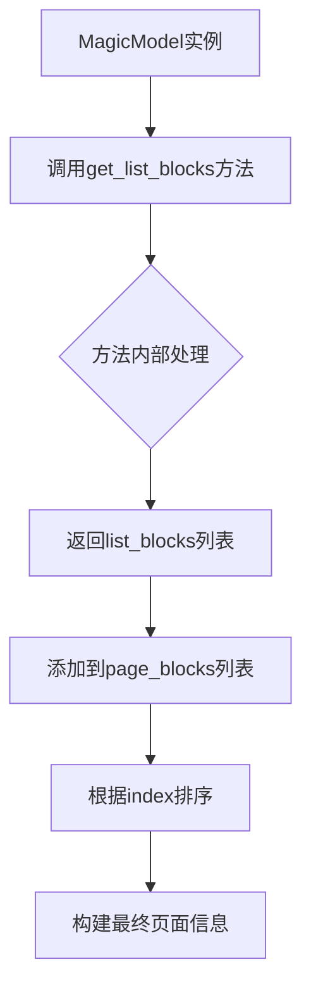

#### 带注释源码

```python
# 在 blocks_to_page_info 函数中的调用示例
# 创建 MagicModel 实例
magic_model = MagicModel(
    page_blocks,
    page_inline_formula,
    page_ocr_res,
    page,
    scale,
    page_pil_img,
    width,
    height,
    _ocr_enable,
    _vlm_ocr_enable,
)

# 获取列表块
# 返回类型: list[dict]
# 每个dict包含列表块的类型、位置、内容等信息
list_blocks = magic_model.get_list_blocks()

# ... 其他块获取 ...

# 将所有块添加到页面块列表
page_blocks.extend([
    *image_blocks,
    *table_blocks,
    *code_blocks,
    *ref_text_blocks,
    *phonetic_blocks,
    *title_blocks,
    *text_blocks,
    *interline_equation_blocks,
    *list_blocks,  # <-- 列表块在此处被整合
])

# 根据index排序
page_blocks.sort(key=lambda x: x["index"])
```

> **注意**：由于`MagicModel`类的完整定义不在当前代码文件中（该文件为使用方），`get_list_blocks`方法的实际实现位于`mineru/backend/hybrid/hybrid_magic_model.py`模块中。从调用模式推断，该方法无参数，返回值为包含列表块信息的字典列表。


### `MagicModel.get_text_blocks`

获取PDF页面中的文本块。该方法是`MagicModel`类的成员方法，用于从已处理的页面元素中提取所有文本块内容。

参数： 无

返回值：`list`，返回包含页面所有文本块的列表，每个文本块是一个字典类型，包含文本内容、位置坐标、样式等属性。

#### 流程图

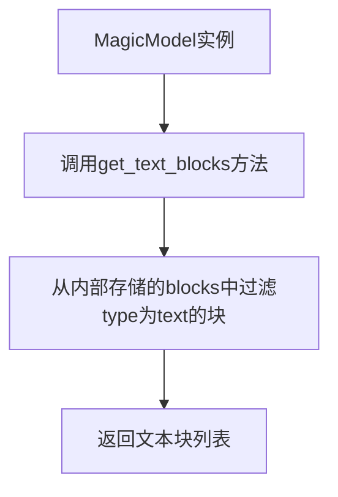

#### 带注释源码

```python
# 注意：MagicModel类定义在 mineru.backend.hybrid.hybrid_magic_model 模块中
# 以下是基于调用上下文的源码推断

# 在blocks_to_page_info函数中的调用方式：
text_blocks = magic_model.get_text_blocks()

# get_text_blocks 方法的典型实现逻辑（基于类比推断）:
def get_text_blocks(self):
    """
    获取文本块的方法
    
    Returns:
        list: 文本块列表，每个元素包含:
            - type: 块类型 ('text')
            - content: 文本内容
            - bbox: 边界框坐标 [x1, y1, x2, y2]
            - lines: 行信息列表
            - styles: 样式信息
            - index: 索引
    """
    # 从self.blocks中过滤出type为'text'的块
    text_blocks = [block for block in self.blocks if block.get('type') == 'text']
    return text_blocks
```

#### 补充说明

**所属类信息**
- 类名：`MagicModel`
- 模块路径：`mineru.backend.hybrid.hybrid_magic_model`
- 导入语句：`from mineru.backend.hybrid.hybrid_magic_model import MagicModel`

**调用上下文**
在 `blocks_to_page_info` 函数中（第92行），该方法被调用：
```python
text_blocks = magic_model.get_text_blocks()
```

获取文本块后，会被添加到 `page_blocks` 列表中，最终包含在返回的 `page_info` 字典的 `para_blocks` 字段里。

**设计推测**
根据代码逻辑分析，`get_text_blocks()` 方法很可能是 `MagicModel` 类中的一个简单getter方法，用于返回该实例在初始化或处理过程中已经过滤好的文本块列表。这种设计将过滤逻辑封装在类内部，调用方只需调用方法获取结果，无需关心实现细节。


### `MagicModel.get_interline_equation_blocks`

该方法用于从 MagicModel 实例中提取行间公式（interline equation）块，这些块表示文档中位于文本行之间的公式内容。行间公式块在后续处理中会被合并到页面块列表中，参与页面内容的组织和排序，最终输出到中间 JSON 结构中。

参数：此方法无显式参数调用（隐含 self 参数）

返回值：`list`，返回包含行间公式块的列表，每个元素为一个字典结构，包含公式的位置信息（bbox）、内容、类型等字段。

#### 流程图

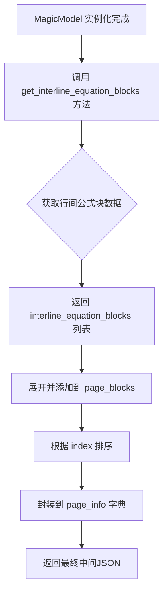

#### 带注释源码

```python
# 在 blocks_to_page_info 函数中调用
# ... (前面代码省略)

# 创建 MagicModel 实例，传入页面块、行内公式、OCR结果、页面对象等信息
magic_model = MagicModel(
    page_blocks,
    page_inline_formula,
    page_ocr_res,
    page,
    scale,
    page_pil_img,
    width,
    height,
    _ocr_enable,
    _vlm_ocr_enable,
)

# 获取各种类型的页面块
# ... (其他块获取代码省略)

# 获取行间公式块
# 该方法从 MagicModel 的内部状态中提取行间公式块
# 返回值类型为 list，包含多个字典，每个字典代表一个行间公式块
# 字典通常包含 'type'（类型）、'bbox'（边界框）、'content'（内容）等字段
interline_equation_blocks = magic_model.get_interline_equation_blocks()

# 获取所有 span 用于后续图像截取处理
all_spans = magic_model.get_all_spans()

# 对 image/table/interline_equation 的 span 进行截图处理
for span in all_spans:
    # ContentType.INTERLINE_EQUATION 是行间公式的类型枚举值
    if span["type"] in [ContentType.IMAGE, ContentType.TABLE, ContentType.INTERLINE_EQUATION]:
        span = cut_image_and_table(span, page_pil_img, page_img_md5, page_index, image_writer, scale=scale)

# 汇总所有页面块
page_blocks = []
page_blocks.extend([
    *image_blocks,           # 图像块
    *table_blocks,           # 表格块
    *code_blocks,            # 代码块
    *ref_text_blocks,        # 引用文本块
    *phonetic_blocks,        # 音标块
    *title_blocks,           # 标题块
    *text_blocks,            # 文本块
    *interline_equation_blocks,  # 行间公式块（由 get_interline_equation_blocks 返回）
    *list_blocks,            # 列表块
])

# 根据 index 对页面块进行排序，确保输出顺序正确
page_blocks.sort(key=lambda x: x["index"])

# 构建页面信息字典
page_info = {
    "para_blocks": page_blocks, 
    "discarded_blocks": discarded_blocks, 
    "page_size": [width, height], 
    "page_idx": page_index
}
return page_info
```

#### 关键上下文信息

| 组件 | 说明 |
|------|------|
| `MagicModel` | 混合模型类，负责从页面元素中提取各类内容块（图像、表格、文本、公式等） |
| `ContentType.INTERLINE_EQUATION` | 行间公式的内容类型枚举值 |
| `blocks_to_page_info` | 主调函数，将模型输出的块转换为页面信息结构 |
| `interline_equation_blocks` | 行间公式块列表，与其他类型块一起组成完整页面内容 |

#### 技术债务与优化建议

1. **方法实现未知**：当前仅看到方法调用，未见 `MagicModel` 类定义，建议补充该类的完整实现文档
2. **类型注解缺失**：建议为 `get_interline_equation_blocks` 方法添加返回值的类型注解（如 `List[Dict]`）以提升代码可读性
3. **块处理一致性**：行间公式块的截图处理逻辑与图像、表格块类似，可考虑抽象公共方法减少代码重复


### `MagicModel.get_all_spans`

该方法属于 `MagicModel` 类，用于获取文档页面中所有的 spans（文本片段、图像片段、表格片段等），是页面内容解析的核心方法之一。

参数：无参数（该方法为实例方法，通过 `self` 隐式访问类内部状态）

返回值：`List[dict]`，返回包含所有 span 信息的列表，每个 span 为一个字典，典型结构包含 `type`（内容类型）、`bbox`（边界框）、`content`（内容）等字段。

#### 流程图

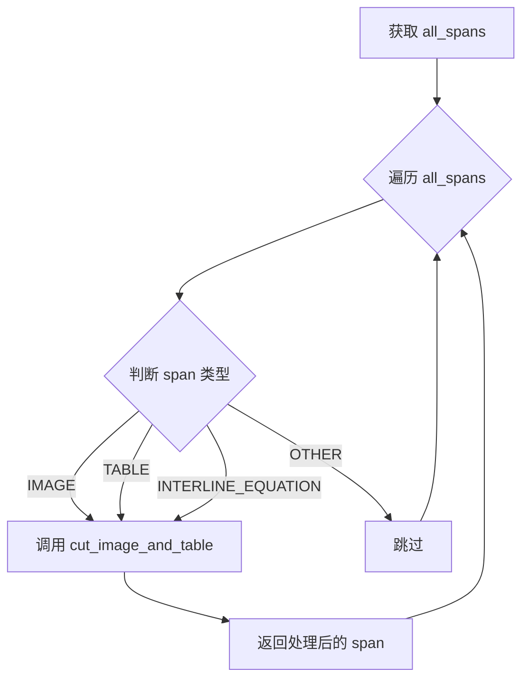

#### 带注释源码

```python
# 在 blocks_to_page_info 函数中调用
all_spans = magic_model.get_all_spans()

# 对 image/table/interline_equation 的 span 截图
# 遍历所有 spans，根据类型决定是否需要截图处理
for span in all_spans:
    # ContentType 是枚举类，定义内容类型
    # IMAGE: 图像内容
    # TABLE: 表格内容
    # INTERLINE_EQUATION: 行间公式
    if span["type"] in [ContentType.IMAGE, ContentType.TABLE, ContentType.INTERLINE_EQUATION]:
        # 调用 cut_image_and_table 函数进行截图处理
        # 参数说明：
        # - span: 当前的 span 字典
        # - page_pil_img: 页面 PIL 图像对象
        # - page_img_md5: 页面图像的 MD5 哈希值
        # - page_index: 页面索引
        # - image_writer: 图像写入器
        # - scale: 缩放比例
        span = cut_image_and_table(
            span, 
            page_pil_img, 
            page_img_md5, 
            page_index, 
            image_writer, 
            scale=scale
        )
```

> **说明**：由于 `MagicModel` 类的定义位于 `mineru.backend.hybrid.hybrid_magic_model` 模块中（未在当前代码文件中给出），上述信息基于代码调用点的上下文推断得出。该方法通常在类初始化后被调用，返回的 spans 列表将用于后续的页面内容组织和图像截取处理。


### `AtomModelSingleton.get_atom_model`

获取原子模型实例的工厂方法，根据传入的模型名称和配置参数返回对应的模型对象。

参数：

- `atom_model_name`：`str`，模型名称，用于指定要获取的模型类型（如 'ocr' 表示 OCR 模型）
- `ocr_show_log`：`bool`，是否显示 OCR 模型的运行日志，默认为 False
- `det_db_box_thresh`：`float`，文本检测的框置信度阈值，用于过滤低置信度的检测结果
- `lang`：`str`，语言配置参数，指定 OCR 识别使用的语言（如 'ch_lite' 表示简体中文）

返回值：`object`，返回对应的模型实例对象（如 OCR 模型实例），该对象具有 `ocr` 方法用于执行光学字符识别任务

#### 流程图

```mermaid
flowchart TD
    A[调用 get_atom_model] --> B{检查模型是否已存在}
    B -->|已存在| C[返回缓存的模型实例]
    B -->|不存在| D[根据 atom_model_name 创建对应模型]
    D --> E[初始化模型配置参数]
    E --> F[加载模型权重和资源]
    F --> G[将模型存入缓存]
    G --> H[返回新创建的模型实例]
    
    I[使用返回的模型] --> J[调用 ocr 方法进行识别]
    J --> K[返回识别结果]
```

#### 带注释源码

```
# 注：以下源码为根据调用上下文推断的逻辑，非原始完整源码
# 原始类定义 mineru.backend.pipeline.model_init 中的 AtomModelSingleton 未在代码中展示

def get_atom_model(self, atom_model_name: str, ocr_show_log: bool = False, 
                   det_db_box_thresh: float = 0.3, lang: str = 'ch_lite'):
    """
    获取原子模型实例的工厂方法
    
    参数:
        atom_model_name: 模型名称，如 'ocr'、'det'、'rec' 等
        ocr_show_log: 是否显示运行日志
        det_db_box_thresh: 文本检测框阈值
        lang: 识别语言配置
    
    返回:
        对应的模型实例对象
    """
    
    # 1. 检查模型是否已经在单例中缓存
    if atom_model_name in self._models:
        return self._models[atom_model_name]
    
    # 2. 根据模型名称创建对应的模型实例
    if atom_model_name == 'ocr':
        model = self._create_ocr_model(
            show_log=ocr_show_log,
            det_db_box_thresh=det_db_box_thresh,
            lang=lang
        )
    
    # 3. 缓存模型实例
    self._models[atom_model_name] = model
    
    return model


# 在 blocks_to_page_info 函数中的实际调用示例
atom_model_manager = AtomModelSingleton()
ocr_model = atom_model_manager.get_atom_model(
    atom_model_name='ocr',
    ocr_show_log=False,
    det_db_box_thresh=0.3,
    lang='ch_lite'
)

# 使用返回的模型进行 OCR 检测
ocr_det_res = ocr_model.ocr(title_img, rec=False)[0]
```

#### 备注

由于 `AtomModelSingleton` 类的完整定义未在提供的代码中展示，以上信息是基于以下代码片段推断得出：

1. **导入语句**：`from mineru.backend.pipeline.model_init import AtomModelSingleton`
2. **调用方式**：`atom_model_manager.get_atom_model(atom_model_name='ocr', ...)`
3. **返回值使用**：`ocr_model = ...; ocr_model.ocr(title_img, rec=False)`

该方法采用单例模式管理模型实例，避免重复加载模型资源，提高内存使用效率。

## 关键组件


### MagicModel

混合魔型模型，用于从页面blocks中分离提取图像块、表格块、标题块、代码块、引用文本块、音标块、文本块、行间公式块和列表块。

### blocks_to_page_info函数

核心转换函数，将模型输出的blocks列表转换为页面信息结构，包含所有类型的内容块排序、图像裁剪和标题行高计算。

### 后置OCR处理机制

当OCR和VLM_OCR均未启用时的补救措施，对text、table、image、list、code块中的span进行延迟OCR识别，使用阈值过滤低置信度结果。

### 表格跨页合并

通过cross_page_table_merge函数实现跨页面表格的智能合并，处理被分割在不同页面的表格结构。

### LLM辅助标题分级

可选的标题层级优化功能，利用大语言模型对标题进行智能分级，需要额外的llm_aided配置启用。

### 图像/表格/行间公式span裁剪

使用cut_image_and_table函数对特定类型的span进行截图处理，支持ContentType定义的IMAGE、TABLE、INTERLINE_EQUATION类型。

### 内容块类型枚举

ContentType枚举定义了页面内容的类型标签，包括IMAGE、TABLE、INTERLINE_EQUATION等，用于类型识别和分类处理。

### 页面索引排序

对合并后的page_blocks根据index字段进行排序，确保输出顺序正确。

### VLM OCR标题行高计算

当启用VLM OCR时，通过重新OCR检测计算标题块的平均行高，用于标题分级优化。


## 问题及建议


### 已知问题

- **硬编码的配置值**：多处使用硬编码的配置值，如`det_db_box_thresh=0.3`、`lang='ch_lite'`、padding值50等，降低了代码的可配置性
- **全局状态管理**：`heading_level_import_success`和`llm_aided_config`在模块级别初始化，导致模块导入时即确定状态，影响代码的可测试性和灵活性
- **缺少类型注解**：函数参数和返回值均缺少类型注解，降低了代码的可读性和IDE支持
- **魔法数字**：代码中存在多个魔法数字（如0.3、50、ch_lite），缺乏有意义的常量定义
- **异常处理过于宽泛**：`try-except`捕获所有异常并仅记录警告，可能隐藏潜在的配置或环境问题
- **函数职责过重**：`blocks_to_page_info`和`result_to_middle_json`函数过长，承担了过多职责（数据处理、OCR调用、配置读取、表格合并等），违反单一职责原则
- **可变默认参数风险**：函数参数中没有明确声明，但处理过程中存在对传入列表的直接修改（如`span.pop('np_img')`），可能导致意外的副作用
- **环境变量处理**：使用`os.getenv('MINERU_VLM_TABLE_ENABLE', 'True')`并在多处使用，缺乏统一的配置管理机制
- **断言缺少上下文**：`assert`语句的错误信息不够详细，如`f'ocr_res_list: {len(ocr_res_list)}, need_ocr_list: {len(need_ocr_list)}'`
- **重复的计算逻辑**：标题行高计算在`if`和`else`分支中有部分重复逻辑，可以进一步抽象

### 优化建议

- **提取配置常量**：将硬编码值提取为配置类或常量文件，如创建`HeadingLevelConfig`、`OcrConfig`等配置类
- **添加类型注解**：为所有函数参数和返回值添加明确的类型注解，提升代码可维护性
- **重构大型函数**：将`blocks_to_page_info`和`result_to_middle_json`拆分为更小的、单一职责的辅助函数
- **改进错误处理**：区分可恢复和不可恢复的异常，对可恢复异常提供fallback机制，对不可恢复异常抛出明确异常
- **消除全局状态**：将`heading_level_import_success`和`llm_aided_config`通过参数传递或依赖注入方式管理
- **使用数据类/TypedDict**：定义明确的数据结构来表示页面信息、块等数据，提高类型安全
- **统一配置管理**：创建配置类或使用Pydantic等库统一管理环境变量和配置
- **添加日志级别控制**：根据不同场景（如调试、生产）使用不同的日志级别
- **性能优化**：考虑缓存重复使用的模型实例，避免重复初始化OCR模型

## 其它


### 设计目标与约束

本代码的设计目标是将PDF文档通过混合管道（hybrid pipeline）转换为结构化的中间JSON格式，支持文本、图像、表格、公式、代码、引用文本、拼音、列表等多种内容类型的识别与提取。设计约束包括：1) 必须依赖mineru相关模块，包括magic_model、utils、version等；2) 功能开关受环境变量控制（如MINERU_VLM_TABLE_ENABLE）；3) 可选的LLM标题优化功能需要安装mineru[core]扩展包；4) VLM OCR模式下需要额外的OCR模型进行行高计算。

### 错误处理与异常设计

代码采用多层次的错误处理机制。在模块导入层面，使用try-except捕获heading_level_import_success的导入异常，并通过logger.warning记录警告信息，确保核心功能不因可选功能失败而中断。在OCR后处理阶段，使用assert断言验证ocr_res_list与need_ocr_list长度一致性，不一致时抛出详细错误信息。在表格跨页合并和LLM标题优化环节，异常由底层函数自行处理。整体策略是：核心处理流程严格校验，可选功能失败时降级处理并记录日志。

### 数据流与状态机

整体数据流遵循输入→预处理→分类→后处理→输出的流水线模型。输入阶段接收model_output_blocks_list（模型输出块列表）、inline_formula_list（行内公式列表）、ocr_res_list（OCR结果列表）、images_list（页面图像列表）、pdf_doc（PDF文档对象）等参数。核心处理状态机包含：1) blocks_to_page_info状态，调用MagicModel进行内容块分类（图像、表格、标题、代码、引用文本、拼音、文本、行间公式、列表）；2) 图像/表格/行间公式的span截图状态；3) 页面块排序状态；4) 后置OCR处理状态（当_vlm_ocr_enable和_ocr_enable均为False时触发）；5) 表格跨页合并状态；6) LL

M标题优化状态（可选）。输出状态为middle_json，包含pdf_info数组、_backend元信息、开关标志和版本号。

### 外部依赖与接口契约

主要外部依赖包括：opencv-python(cv2)用于图像处理和边框添加；numpy用于数值计算和数组操作；loguru用于日志记录。mineru内部依赖模块有：mineru.backend.hybrid.hybrid_magic_model.MagicModel（魔法模型，核心分类器）；mineru.backend.utils.cross_page_table_merge（跨页表格合并函数）；mineru.utils.cut_image.cut_image_and_table（图像裁剪函数）；mineru.utils.enum_class.ContentType（内容类型枚举）；mineru.utils.hash_utils.bytes_md5（MD5哈希计算）；mineru.utils.ocr_utils.OcrConfidence（OCR置信度常量）；mineru.utils.pdf_image_tools.get_crop_img（图像裁剪获取）；mineru.version.__version__（版本号）。可选依赖在heading_level_import_success为True时引入：mineru.utils.llm_aided.llm_aided_title（LLM标题优化函数）；mineru.backend.pipeline.model_init.AtomModelSingleton（原子模型单例）。

### 性能考虑与优化空间

当前实现已包含若干性能优化措施：使用bytes_md5缓存页面图像哈希值避免重复计算；采用列表推导式一次性计算标题块平均行高；批量处理OCR请求通过tqdm_enable=True显示进度。潜在优化空间包括：1) MagicModel的多次get_*方法调用可考虑返回单一复合对象减少遍历开销；2) 跨页表格合并逻辑可考虑并行处理多页；3) OCR后处理中的嵌套循环可使用向量化操作优化；4) 图片裁剪操作可考虑GPU加速（当前为CPU处理）。

### 安全考虑

代码处理来自PDF文档的图像和文本内容，需要注意：1) 图像裁剪过程中需验证bbox坐标有效性防止越界；2) 文件路径处理需防范路径遍历攻击（当前通过image_writer内部机制防护）；3) 环境变量读取使用os.getenv并设置默认值降低注入风险；4) LLM调用需考虑输入长度限制和内容审核。

### 测试与可观测性

当前代码包含以下可观测性特性：logger.info记录LLM标题优化耗时；logger.warning记录可选功能导入失败原因；OCR置信度低于阈值时将内容置空并设置零分。测试覆盖建议：1) 单元测试覆盖blocks_to_page_info的各类边界情况；2) 集成测试验证完整PDF到JSON的转换流程；3) 性能测试评估大文档处理时间和内存占用；4) 回归测试确保各类内容块的分类准确性。

    