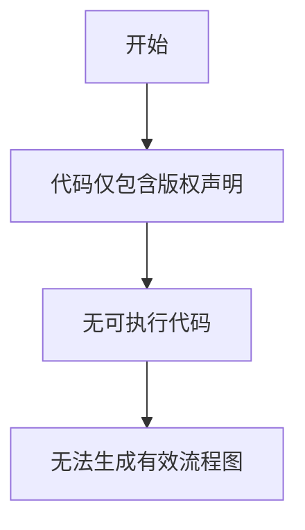

# `MinerU\mineru\backend\pipeline\__init__.py` 详细设计文档

该代码文件仅包含版权声明信息(# Copyright (c) Opendatalab. All rights reserved.)，未包含任何实际的功能实现代码、类定义、函数或业务逻辑，因此无法进行详细的设计文档分析。

## 整体流程



## 类结构

```
无有效类结构 - 代码仅包含版权声明
```

## 全局变量及字段


    

## 全局函数及方法


## 关键组件


由于提供的源代码仅包含版权声明，未包含任何实际功能代码，因此无法识别关键组件（如张量索引与惰性加载、反量化支持、量化策略等）或生成详细设计文档。


## 问题及建议


### 已知问题

-   **代码缺失**：提供的代码仅包含版权声明（`# Copyright (c) Opendatalab. All rights reserved.`），没有任何实际的实现代码、类定义、函数或业务逻辑可供分析。
-   **无法进行技术评估**：由于缺乏实际代码，无法识别技术债务、性能问题、架构设计缺陷或潜在的优化空间。
-   **文档完整性受限**：无法生成包含类详细信息、方法流程图、组件信息等的设计文档内容。

### 优化建议

-   **提供完整代码**：请提供需要分析的完整源代码文件，以便进行全面的技术分析和文档生成。
-   **补充业务逻辑**：如果代码存在多个模块或文件，请提供完整的项目结构或主要的实现文件。
-   **明确分析范围**：建议说明重点关注的模块或功能，以便进行针对性的架构分析和技术债务识别。


## 其它


### 设计目标与约束

由于提供的代码仅包含版权声明，无法确定具体的设计目标和约束。通常设计目标应包括性能指标（如响应时间、吞吐量）、可扩展性要求、兼容性要求等。约束条件可能包括技术栈限制、第三方库依赖、部署环境要求等。

### 错误处理与异常设计

由于代码仅包含版权声明，无具体错误处理机制。详细设计文档应包含异常分类、错误码定义、异常传播机制、日志记录策略、降级方案等内容。

### 数据流与状态机

无具体数据流信息。详细设计文档应包含数据输入来源、数据处理流程、数据输出目的地、状态转换图（如果涉及状态机）、数据一致性保证策略等。

### 外部依赖与接口契约

无具体外部依赖。详细设计文档应包含第三方库依赖说明、API接口定义、接口版本管理、依赖版本约束、第三方服务SLA要求等。

### 安全性设计

由于代码仅包含版权声明，无具体安全设计。详细设计文档应包含认证授权机制、敏感数据保护、输入验证、加密策略、安全审计等。

### 性能与资源管理

无具体性能相关代码。详细设计文档应包含性能基准、资源限制、缓存策略、连接池管理、内存管理、并发控制等。

### 部署与运维

无具体部署相关代码。详细设计文档应包含部署架构、配置管理、环境要求、监控告警、备份恢复、扩容策略等。

### 测试策略

无具体测试代码。详细设计文档应包含单元测试、集成测试、系统测试策略、测试覆盖率要求、测试数据管理、性能测试计划等。

### 版本演进与兼容性

无具体版本信息。详细设计文档应包含版本号规范、API版本管理、向后兼容性策略、升级路径、废弃机制等。

### 质量属性

详细设计文档还应包含可靠性（可用性、容错性）、可维护性（模块化、可测试性）、可扩展性等质量属性的具体设计考虑。


    