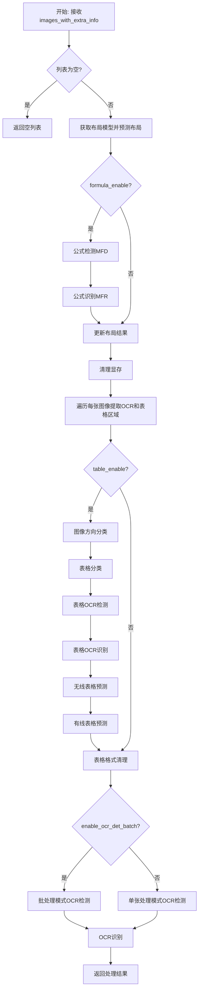
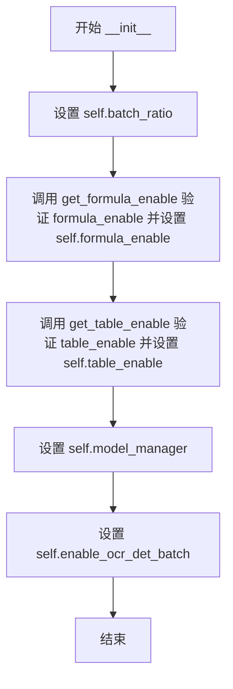

# `MinerU\mineru\backend\pipeline\batch_analyze.py` 详细设计文档

这是一个批量文档图像分析处理类，负责对输入的图像列表进行完整的文档理解处理，包括布局分析、公式检测与识别、表格检测与识别（包含无线表格和有线表格）、OCR文字检测与识别等多个环节，支持批处理模式优化性能。

## 整体流程



## 类结构

```
BatchAnalyze (主处理类)
```

## 全局变量及字段


### `YOLO_LAYOUT_BASE_BATCH_SIZE`
    
布局模型批处理大小

类型：`int`
    


### `MFD_BASE_BATCH_SIZE`
    
公式检测模型批处理大小

类型：`int`
    


### `MFR_BASE_BATCH_SIZE`
    
公式识别模型批处理大小

类型：`int`
    


### `OCR_DET_BASE_BATCH_SIZE`
    
OCR检测批处理大小

类型：`int`
    


### `TABLE_ORI_CLS_BATCH_SIZE`
    
表格方向分类批处理大小

类型：`int`
    


### `TABLE_Wired_Wireless_CLS_BATCH_SIZE`
    
表格类型分类批处理大小

类型：`int`
    


### `BatchAnalyze.batch_ratio`
    
批处理比例参数

类型：`int`
    


### `BatchAnalyze.formula_enable`
    
是否启用公式识别

类型：`bool`
    


### `BatchAnalyze.table_enable`
    
是否启用表格识别

类型：`bool`
    


### `BatchAnalyze.model_manager`
    
模型管理器实例

类型：`ModelManager`
    


### `BatchAnalyze.enable_ocr_det_batch`
    
是否启用OCR检测批处理模式

类型：`bool`
    


### `BatchAnalyze.model`
    
布局+公式模型实例

类型：`Model`
    
    

## 全局函数及方法


### `BatchAnalyze.__init__`

这是 `BatchAnalyze` 类的初始化方法，用于配置批处理分析所需的各种参数和模型管理器，设置公式识别、表格识别和OCR批处理的开关状态。

参数：

- `model_manager`：模型管理器，负责管理和获取各种AI模型（如布局模型、公式模型、表格模型、OCR模型等）
- `batch_ratio: int`，批处理比率，用于调整批处理的大小，影响公式识别和OCR检测的批处理参数
- `formula_enable`：是否启用公式检测和识别的标志位
- `table_enable`：是否启用表格检测和识别的标志位
- `enable_ocr_det_batch: bool`，是否启用OCR检测的批处理模式，默认为 True

返回值：`None`，初始化方法不返回值，仅设置实例属性

#### 流程图



#### 带注释源码

```python
def __init__(self, model_manager, batch_ratio: int, formula_enable, table_enable, enable_ocr_det_batch: bool = True):
    """
    初始化 BatchAnalyze 实例
    
    参数:
        model_manager: 模型管理器，用于获取布局模型、公式模型、表格模型、OCR模型等
        batch_ratio: 批处理比率，用于调整批处理大小
        formula_enable: 是否启用公式识别
        table_enable: 是否启用表格识别
        enable_ocr_det_batch: 是否启用OCR检测批处理模式，默认为True
    """
    # 设置批处理比率，用于后续公式识别和OCR检测的批处理参数计算
    self.batch_ratio = batch_ratio
    
    # 通过配置验证函数处理公式启用标志，确保配置正确后存储
    self.formula_enable = get_formula_enable(formula_enable)
    
    # 通过配置验证函数处理表格启用标志，确保配置正确后存储
    self.table_enable = get_table_enable(table_enable)
    
    # 保存模型管理器引用，供后续获取各类模型使用
    self.model_manager = model_manager
    
    # 保存OCR检测批处理开关，决定后续使用批处理还是单张处理模式
    self.enable_ocr_det_batch = enable_ocr_det_batch
```


### `BatchAnalyze.__call__`

该方法是文档分析的核心处理函数，接收一批图像及其元数据（如语言、OCR启用标志），依次执行布局检测、公式识别、表格识别与OCR处理，最终返回包含所有分析结果（布局区域、文本、表格等）的列表。

参数：

-  `images_with_extra_info`：`list`，输入的图像列表，每个元素为(image, ocr_enable, lang)元组，其中image为PIL图像，ocr_enable为布尔值表示是否启用OCR，lang为语言代码

返回值：`list`，返回每个页面处理后的布局结果列表，每个元素为布局检测结果列表，包含各区域的类别、坐标、文本等信息

#### 流程图

```mermaid
flowchart TD
    A[开始 __call__] --> B{images_with_extra_info 是否为空?}
    B -->|是| C[返回空列表 []]
    B -->|否| D[获取 layout_model]
    D --> E[提取 PIL 图像和 NumPy 图像]
    E --> F[执行布局检测: layout_model.batch_predict]
    F --> G{formula_enable 是否启用?}
    G -->|是| H[执行公式检测: mfd_model.batch_predict]
    H --> I[执行公式识别: mfr_model.batch_predict]
    I --> J[将公式结果加入布局结果]
    G -->|否| J
    J --> K[清理显存 clean_vram]
    K --> L[遍历每页图像提取 OCR 和表格区域]
    L --> M[构建 ocr_res_list_all_page 和 table_res_list_all_page]
    M --> N{table_enable 是否启用?}
    N -->|是| O[图像方向分类模型预测]
    O --> P[表格分类模型预测]
    P --> Q[OCR 检测: 遍历表格区域进行文本检测]
    Q --> R[OCR 识别: 按语言分批识别]
    R --> S[无线表格模型预测]
    S --> T[有线表格模型预测]
    T --> U[表格格式清理]
    N -->|否| V
    U --> V{enable_ocr_det_batch 是否启用?}
    V -->|是| W[批处理模式: 按语言和分辨率分组]
    V -->|否| X[单张处理模式: 逐页处理]
    W --> Y[OCR 识别: 按语言处理文本识别]
    X --> Y
    Y --> Z[返回 images_layout_res]
```

#### 带注释源码

```python
def __call__(self, images_with_extra_info: list) -> list:
    """
    主处理方法，执行完整的文档分析流程
    
    参数:
        images_with_extra_info: 图像列表，每个元素为 (image, ocr_enable, lang) 元组
            - image: PIL 图像对象
            - ocr_enable: 是否启用 OCR 的布尔标志
            - lang: 语言代码字符串
    
    返回:
        list: 处理后的布局结果列表，每个元素为包含各类别区域的列表
    """
    # 1. 边界检查：空输入直接返回空列表
    if len(images_with_extra_info) == 0:
        return []

    # 初始化布局结果列表
    images_layout_res = []

    # 2. 获取布局分析模型（包含 layout、mfd、mfr 子模型）
    self.model = self.model_manager.get_model(
        lang=None,
        formula_enable=self.formula_enable,
        table_enable=self.table_enable,
    )
    # 获取原子模型管理器（用于 OCR、表格分类等独立模型）
    atom_model_manager = AtomModelSingleton()

    # 3. 从输入数据中分离图像
    # 提取所有 PIL 图像用于布局检测
    pil_images = [image for image, _, _ in images_with_extra_info]
    # 提取所有 NumPy 数组图像用于公式检测
    np_images = [np.asarray(image) for image, _, _ in images_with_extra_info]

    # 4. 文档布局检测（YOLO 模型）
    # 批量预测文档布局，返回各页面的布局区域（文本、表格、公式等）
    images_layout_res += self.model.layout_model.batch_predict(
        pil_images, YOLO_LAYOUT_BASE_BATCH_SIZE
    )

    # 5. 公式检测与识别（可选）
    if self.formula_enable:
        # 公式检测：定位公式区域
        images_mfd_res = self.model.mfd_model.batch_predict(
            np_images, MFD_BASE_BATCH_SIZE
        )

        # 公式识别：将检测到的区域识别为 LaTeX 公式
        images_formula_list = self.model.mfr_model.batch_predict(
            images_mfd_res,
            np_images,
            batch_size=self.batch_ratio * MFR_BASE_BATCH_SIZE,
        )
        # 统计公式数量并合并到布局结果中
        mfr_count = 0
        for image_index in range(len(np_images)):
            images_layout_res[image_index] += images_formula_list[image_index]
            mfr_count += len(images_formula_list[image_index])

    # 6. 清理显存，释放不需要的模型资源
    clean_vram(self.model.device, vram_threshold=8)

    # 7. 预处理：分离 OCR 区域和表格区域
    ocr_res_list_all_page = []    # 存储每页的 OCR 区域信息
    table_res_list_all_page = []  # 存储每页的表格信息
    for index in range(len(np_images)):
        # 获取当前页面的额外信息
        _, ocr_enable, _lang = images_with_extra_info[index]
        layout_res = images_layout_res[index]
        np_img = np_images[index]

        # 从布局结果中分离 OCR 区域和表格区域
        ocr_res_list, table_res_list, single_page_mfdetrec_res = (
            get_res_list_from_layout_res(layout_res)
        )

        # 保存当前页面的 OCR 相关信息
        ocr_res_list_all_page.append({
            'ocr_res_list': ocr_res_list,
            'lang': _lang,
            'ocr_enable': ocr_enable,
            'np_img': np_img,
            'single_page_mfdetrec_res': single_page_mfdetrec_res,
            'layout_res': layout_res,
        })

        # 处理表格区域：裁剪不同缩放级别的表格图像
        for table_res in table_res_list:
            # 动态定义表格裁剪函数
            def get_crop_table_img(scale):
                crop_xmin, crop_ymin = int(table_res['poly'][0]), int(table_res['poly'][1])
                crop_xmax, crop_ymax = int(table_res['poly'][4]), int(table_res['poly'][5])
                # 根据缩放比例调整边界框
                bbox = (int(crop_xmin / scale), int(crop_ymin / scale), 
                       int(crop_xmax / scale), int(crop_ymax / scale))
                return get_crop_np_img(bbox, np_img, scale=scale)

            # 生成两种规格的表格图像（无线和有线场景）
            wireless_table_img = get_crop_table_img(scale=1)
            wired_table_img = get_crop_table_img(scale=10/3)

            table_res_list_all_page.append({
                'table_res': table_res,
                'lang': _lang,
                'table_img': wireless_table_img,
                'wired_table_img': wired_table_img,
            })

    # 8. 表格识别处理（可选）
    if self.table_enable:
        # 8.1 图像方向分类：检测表格图像是否需要旋转
        img_orientation_cls_model = atom_model_manager.get_atom_model(
            atom_model_name=AtomicModel.ImgOrientationCls,
        )
        try:
            if self.enable_ocr_det_batch:
                # 批处理模式
                img_orientation_cls_model.batch_predict(
                    table_res_list_all_page,
                    det_batch_size=self.batch_ratio * OCR_DET_BASE_BATCH_SIZE,
                    batch_size=TABLE_ORI_CLS_BATCH_SIZE
                )
            else:
                # 单张处理模式
                for table_res in table_res_list_all_page:
                    rotate_label = img_orientation_cls_model.predict(table_res['table_img'])
                    img_orientation_cls_model.img_rotate(table_res, rotate_label)
        except Exception as e:
            logger.warning(f"Image orientation classification failed: {e}, using original image")

        # 8.2 表格分类：区分有线表格和无线表格
        table_cls_model = atom_model_manager.get_atom_model(
            atom_model_name=AtomicModel.TableCls,
        )
        try:
            table_cls_model.batch_predict(
                table_res_list_all_page,
                batch_size=TABLE_Wired_Wireless_CLS_BATCH_SIZE
            )
        except Exception as e:
            logger.warning(f"Table classification failed: {e}, using default model")

        # 8.3 OCR 检测：识别表格内的文本位置
        rec_img_lang_group = defaultdict(list)  # 按语言分组待识别图像
        det_ocr_engine = atom_model_manager.get_atom_model(
            atom_model_name=AtomicModel.OCR,
            det_db_box_thresh=0.5,
            det_db_unclip_ratio=1.6,
            enable_merge_det_boxes=False,
        )
        for index, table_res_dict in enumerate(tqdm(table_res_list_all_page, desc="Table-ocr det")):
            bgr_image = cv2.cvtColor(table_res_dict["table_img"], cv2.COLOR_RGB2BGR)
            ocr_result = det_ocr_engine.ocr(bgr_image, rec=False)[0]
            # 构造需要 OCR 识别的图片字典，按语言分组
            for dt_box in ocr_result:
                rec_img_lang_group[_lang].append({
                    "cropped_img": get_rotate_crop_image(
                        bgr_image, np.asarray(dt_box, dtype=np.float32)
                    ),
                    "dt_box": np.asarray(dt_box, dtype=np.float32),
                    "table_id": index,
                })

        # 8.4 OCR 识别：识别表格内文本内容
        for _lang, rec_img_list in rec_img_lang_group.items():
            ocr_engine = atom_model_manager.get_atom_model(
                atom_model_name=AtomicModel.OCR,
                det_db_box_thresh=0.5,
                det_db_unclip_ratio=1.6,
                lang=_lang,
                enable_merge_det_boxes=False,
            )
            cropped_img_list = [item["cropped_img"] for item in rec_img_list]
            ocr_res_list = ocr_engine.ocr(
                cropped_img_list, det=False, 
                tqdm_enable=True, 
                tqdm_desc=f"Table-ocr rec {_lang}"
            )[0]
            # 按 table_id 回填识别结果
            for img_dict, ocr_res in zip(rec_img_list, ocr_res_list):
                if table_res_list_all_page[img_dict["table_id"]].get("ocr_result"):
                    table_res_list_all_page[img_dict["table_id"]]["ocr_result"].append(
                        [img_dict["dt_box"], html.escape(ocr_res[0]), ocr_res[1]]
                    )
                else:
                    table_res_list_all_page[img_dict["table_id"]]["ocr_result"] = [
                        [img_dict["dt_box"], html.escape(ocr_res[0]), ocr_res[1]]
                    ]

        # 清理显存
        clean_vram(self.model.device, vram_threshold=8)

        # 8.5 无线表格结构识别
        wireless_table_model = atom_model_manager.get_atom_model(
            atom_model_name=AtomicModel.WirelessTable,
        )
        wireless_table_model.batch_predict(table_res_list_all_page)

        # 8.6 有线表格结构识别
        wired_table_res_list = []
        for table_res_dict in table_res_list_all_page:
            # 筛选需要有线模型处理的高风险表格
            if (
                (table_res_dict["table_res"]["cls_label"] == AtomicModel.WirelessTable 
                 and table_res_dict["table_res"]["cls_score"] < 0.9)
                or table_res_dict["table_res"]["cls_label"] == AtomicModel.WiredTable
            ):
                wired_table_res_list.append(table_res_dict)
            # 移除分类标签和置信度（不再需要）
            del table_res_dict["table_res"]["cls_label"]
            del table_res_dict["table_res"]["cls_score"]
        
        # 对有线表格进行预测
        if wired_table_res_list:
            for table_res_dict in tqdm(wired_table_res_list, desc="Table-wired Predict"):
                if not table_res_dict.get("ocr_result", None):
                    continue

                wired_table_model = atom_model_manager.get_atom_model(
                    atom_model_name=AtomicModel.WiredTable,
                    lang=table_res_dict["lang"],
                )
                table_res_dict["table_res"]["html"] = wired_table_model.predict(
                    table_res_dict["wired_table_img"],
                    table_res_dict["ocr_result"],
                    table_res_dict["table_res"].get("html", None)
                )

        # 8.7 表格格式清理：提取完整的表格 HTML
        for table_res_dict in table_res_list_all_page:
            html_code = table_res_dict["table_res"].get("html", "") or ""

            # 检查并提取 <table>...</table> 部分
            if "<table>" in html_code and "</table>" in html_code:
                start_index = html_code.find("<table>")
                end_index = html_code.rfind("</table>") + len("</table>")
                table_res_dict["table_res"]["html"] = html_code[start_index:end_index]

    # 9. 非表格区域的 OCR 检测（可选）
    if self.enable_ocr_det_batch:
        # === 批处理模式 ===
        all_cropped_images_info = []

        # 9.1 收集所有需要 OCR 检测的裁剪图像
        for ocr_res_list_dict in ocr_res_list_all_page:
            _lang = ocr_res_list_dict['lang']

            for res in ocr_res_list_dict['ocr_res_list']:
                # 裁剪图像区域
                new_image, useful_list = crop_img(
                    res, ocr_res_list_dict['np_img'], 
                    crop_paste_x=50, crop_paste_y=50
                )
                adjusted_mfdetrec_res = get_adjusted_mfdetrec_res(
                    ocr_res_list_dict['single_page_mfdetrec_res'], useful_list
                )

                # BGR 颜色空间转换
                bgr_image = cv2.cvtColor(new_image, cv2.COLOR_RGB2BGR)

                all_cropped_images_info.append((
                    bgr_image, useful_list, ocr_res_list_dict, 
                    res, adjusted_mfdetrec_res, _lang
                ))

        # 9.2 按语言分组
        lang_groups = defaultdict(list)
        for crop_info in all_cropped_images_info:
            lang = crop_info[5]
            lang_groups[lang].append(crop_info)

        # 9.3 对每种语言按分辨率分组并批处理
        for lang, lang_crop_list in lang_groups.items():
            if not lang_crop_list:
                continue

            # 获取 OCR 模型
            ocr_model = atom_model_manager.get_atom_model(
                atom_model_name=AtomicModel.OCR,
                det_db_box_thresh=0.3,
                lang=lang
            )

            # 9.4 按分辨率分组并填充至统一尺寸
            RESOLUTION_GROUP_STRIDE = 64
            resolution_groups = defaultdict(list)
            for crop_info in lang_crop_list:
                cropped_img = crop_info[0]
                h, w = cropped_img.shape[:2]
                # 计算目标尺寸（对齐到 STRIDE）
                target_h = ((h + RESOLUTION_GROUP_STRIDE - 1) // RESOLUTION_GROUP_STRIDE) * RESOLUTION_GROUP_STRIDE
                target_w = ((w + RESOLUTION_GROUP_STRIDE - 1) // RESOLUTION_GROUP_STRIDE) * RESOLUTION_GROUP_STRIDE
                group_key = (target_h, target_w)
                resolution_groups[group_key].append(crop_info)

            # 9.5 对每个分辨率组进行批处理
            for (target_h, target_w), group_crops in tqdm(resolution_groups.items(), desc=f"OCR-det {lang}"):
                # 填充图像至统一尺寸
                batch_images = []
                for crop_info in group_crops:
                    img = crop_info[0]
                    h, w = img.shape[:2]
                    padded_img = np.ones((target_h, target_w, 3), dtype=np.uint8) * 255
                    padded_img[:h, :w] = img
                    batch_images.append(padded_img)

                # 批量文本检测
                det_batch_size = min(len(batch_images), 
                                     self.batch_ratio * OCR_DET_BASE_BATCH_SIZE)
                batch_results = ocr_model.text_detector.batch_predict(
                    batch_images, det_batch_size
                )

                # 处理批处理结果
                for crop_info, (dt_boxes, _) in zip(group_crops, batch_results):
                    bgr_image, useful_list, ocr_res_list_dict, res, \
                        adjusted_mfdetrec_res, _lang = crop_info

                    if dt_boxes is not None and len(dt_boxes) > 0:
                        # 排序和合并检测框
                        dt_boxes_sorted = sorted_boxes(dt_boxes)
                        dt_boxes_merged = merge_det_boxes(dt_boxes_sorted) \
                            if dt_boxes_sorted else []

                        # 根据公式位置更新检测框
                        dt_boxes_final = (
                            update_det_boxes(dt_boxes_merged, adjusted_mfdetrec_res)
                            if dt_boxes_merged and adjusted_mfdetrec_res
                            else dt_boxes_merged
                        )

                        if dt_boxes_final:
                            ocr_res = [box.tolist() if hasattr(box, 'tolist') else box 
                                      for box in dt_boxes_final]
                            ocr_result_list = get_ocr_result_list(
                                ocr_res, useful_list, 
                                ocr_res_list_dict['ocr_enable'], 
                                bgr_image, _lang
                            )
                            ocr_res_list_dict['layout_res'].extend(ocr_result_list)

    else:
        # === 原始单张处理模式 ===
        for ocr_res_list_dict in tqdm(ocr_res_list_all_page, desc="OCR-det Predict"):
            _lang = ocr_res_list_dict['lang']
            
            # 获取 OCR 模型
            ocr_model = atom_model_manager.get_atom_model(
                atom_model_name=AtomicModel.OCR,
                ocr_show_log=False,
                det_db_box_thresh=0.3,
                lang=_lang
            )
            
            for res in ocr_res_list_dict['ocr_res_list']:
                # 裁剪图像区域
                new_image, useful_list = crop_img(
                    res, ocr_res_list_dict['np_img'], 
                    crop_paste_x=50, crop_paste_y=50
                )
                adjusted_mfdetrec_res = get_adjusted_mfdetrec_res(
                    ocr_res_list_dict['single_page_mfdetrec_res'], useful_list
                )
                
                # OCR 检测
                bgr_image = cv2.cvtColor(new_image, cv2.COLOR_RGB2BGR)
                ocr_res = ocr_model.ocr(
                    bgr_image, mfd_res=adjusted_mfdetrec_res, rec=False
                )[0]

                # 整合结果
                if ocr_res:
                    ocr_result_list = get_ocr_result_list(
                        ocr_res, useful_list, 
                        ocr_res_list_dict['ocr_enable'],
                        bgr_image, _lang
                    )
                    ocr_res_list_dict['layout_res'].extend(ocr_result_list)

    # 10. OCR 文本识别（针对文本区域）
    need_ocr_lists_by_lang = {}    # 按语言存储需要识别的布局项
    img_crop_lists_by_lang = {}     # 按语言存储待识别图像

    for layout_res in images_layout_res:
        for layout_res_item in layout_res:
            # 筛选需要 OCR 识别的类别（category_id=15 通常为文本行）
            if layout_res_item['category_id'] in [15]:
                if 'np_img' in layout_res_item and 'lang' in layout_res_item:
                    lang = layout_res_item['lang']

                    # 初始化语言对应的列表
                    if lang not in need_ocr_lists_by_lang:
                        need_ocr_lists_by_lang[lang] = []
                        img_crop_lists_by_lang[lang] = []

                    # 添加到对应语言的列表
                    need_ocr_lists_by_lang[lang].append(layout_res_item)
                    img_crop_lists_by_lang[lang].append(layout_res_item['np_img'])

                    # 移除临时字段（避免重复存储）
                    layout_res_item.pop('np_img')
                    layout_res_item.pop('lang')

    # 11. 按语言批量执行 OCR 识别
    if len(img_crop_lists_by_lang) > 0:
        total_processed = 0

        for lang, img_crop_list in img_crop_lists_by_lang.items():
            if len(img_crop_list) > 0:
                # 获取该语言的 OCR 模型
                ocr_model = atom_model_manager.get_atom_model(
                    atom_model_name=AtomicModel.OCR,
                    det_db_box_thresh=0.3,
                    lang=lang
                )
                
                # 批量识别
                ocr_res_list = ocr_model.ocr(
                    img_crop_list, det=False, tqdm_enable=True
                )[0]

                # 验证结果数量匹配
                assert len(ocr_res_list) == len(need_ocr_lists_by_lang[lang]), \
                    f'ocr_res_list: {len(ocr_res_list)}, need_ocr_list: ' \
                    f'{len(need_ocr_lists_by_lang[lang])} for lang: {lang}'

                # 处理识别结果
                for index, layout_res_item in enumerate(need_ocr_lists_by_lang[lang]):
                    ocr_text, ocr_score = ocr_res_list[index]
                    layout_res_item['text'] = ocr_text
                    layout_res_item['score'] = float(f"{ocr_score:.3f}")
                    
                    # 低置信度标记为无效文本（category_id=16）
                    if ocr_score < OcrConfidence.min_confidence:
                        layout_res_item['category_id'] = 16
                    else:
                        # 特殊规则：过滤疑似噪声的短文本
                        layout_res_bbox = [
                            layout_res_item['poly'][0], layout_res_item['poly'][1],
                            layout_res_item['poly'][4], layout_res_item['poly'][5]
                        ]
                        layout_res_width = layout_res_bbox[2] - layout_res_bbox[0]
                        layout_res_height = layout_res_bbox[3] - layout_res_bbox[1]
                        
                        if (
                            ocr_text in [
                                '（204号', '（20', '（2', '（2号', '（20号', '号', '（204',
                                '(cid:)', '(ci:)', '(cd:1)', 'cd:)', 'c)', '(cd:)', 'c', 'id:)',
                                ':)', '√:)', '√i:)', '−i:)', '−:', 'i:)',
                            ]
                            and ocr_score < 0.8
                            and layout_res_width < layout_res_height
                        ):
                            layout_res_item['category_id'] = 16

                total_processed += len(img_crop_list)

    # 12. 返回所有页面的布局结果
    return images_layout_res
```

## 关键组件


### 张量索引与惰性加载

该组件通过`AtomModelSingleton`单例模式和`atom_model_manager.get_atom_model()`方法实现模型的惰性加载，按需加载所需的原子模型（如OCR、表格分类、表格识别等），避免一次性加载所有模型导致的内存浪费。

### 反量化支持

该组件负责图像的反量化处理，包括表格图像的多尺度裁剪（`get_crop_table_img`函数支持scale=1和scale=10/3两种模式）、图像旋转校正（`img_rotate`）、OCR图像的padding处理（将不同分辨率的图像pad到统一尺寸）以及BGR颜色空间转换。

### 量化策略

该组件通过`batch_ratio`参数配合多种基础批量大小常量（YOLO_LAYOUT_BASE_BATCH_SIZE、MFD_BASE_BATCH_SIZE、MFR_BASE_BATCH_SIZE、OCR_DET_BASE_BATCH_SIZE等）实现动态批处理策略，并根据语言和分辨率进行分组批处理，优化计算资源的利用率。

### 布局分析模块

该模块使用`doclayout_yolo`模型对输入图像进行布局分析，识别文档中的不同区域，为后续的公式检测、表格识别和OCR处理提供位置信息。

### 公式检测与识别模块

该模块包含公式检测模型（mfd_model）和公式识别模型（mfr_model），分别用于定位公式区域和识别公式内容，支持公式区域的批量预测和处理。

### 表格处理流水线

该模块实现完整的表格处理流程，包括方向分类、表格分类（有线/无线）、表格OCR检测与识别，以及最终的表格HTML生成，支持有线表格和无线表格的分别处理。

### OCR处理引擎

该模块支持两种OCR处理模式（批处理模式和单张处理模式），按语言和分辨率进行分组，实现文本检测（det）和识别（rec）的分离处理，并使用`update_det_boxes`根据公式位置动态更新检测框。

### 图像裁剪与增强

该模块提供`crop_img`函数进行图像裁剪，使用`get_rotate_crop_image`进行旋转校正，以及通过`get_adjusted_mfdetrec_res`根据公式位置调整检测结果，提高OCR的准确性。


## 问题及建议


### 已知问题

-   **代码重复与冗余**：OCR检测存在两套分支逻辑（`enable_ocr_det_batch=True/False`），代码结构高度相似但未抽象复用，造成维护困难
-   **魔法数字和硬编码**：大量阈值和参数直接写死在代码中，如`det_db_box_thresh=0.5/0.3`、`cls_score<0.9`、`crop_paste_x=50`、`RESOLUTION_GROUP_STRIDE=64`等，配置散落各处难以统一调整
-   **方法职责过载**：`__call__`方法代码行数超过300行，聚合了布局检测、公式处理、表格识别、OCR等所有逻辑，违反单一职责原则
-   **变量作用域混乱**：循环中`_lang`变量被重复赋值（外层循环和解包赋值），容易造成逻辑混淆
-   **异常处理不完善**：表格分类和方向分类的异常捕获仅记录警告日志后继续执行，可能导致后续处理使用未初始化的数据
-   **硬编码业务规则**：OCR识别中的`category_id=15/16`判断、特定文本列表（包含`（204号`、`√:)`等）直接写在业务逻辑中，缺乏业务配置化
-   **资源管理分散**：`clean_vram`调用分散在多处，没有统一的资源生命周期管理，可能存在显存泄漏风险

### 优化建议

-   **提取配置类**：创建配置类或配置文件，将所有阈值、批量大小、路径等常量统一管理
-   **方法拆分重构**：将`__call__`拆分为多个私有方法，如`_process_layout`、`_process_formula`、`_process_table`、`_process_ocr`等
-   **消除重复代码**：将OCR检测的两套分支提取为统一的方法，通过参数控制行为差异
-   **引入类型注解**：为所有方法参数和返回值添加类型提示，提高代码可读性和IDE支持
-   **统一异常处理**：建立分层的异常处理机制，区分可恢复和不可恢复异常，提供降级策略
-   **重构变量命名**：统一变量命名规范，避免单字母变量和易混淆的下划线变量
-   **资源管理封装**：使用上下文管理器或装饰器统一管理模型和显存资源
-   **业务规则配置化**：将业务规则（如category_id映射、特殊文本列表）迁移到配置文件或数据库


## 其它


### 设计目标与约束

本模块旨在实现高效的文档分析流水线，支持版面布局检测、公式识别、表格识别与OCR处理的批量操作。核心约束包括：1) 仅支持PIL图像输入；2) 批处理大小受限于显存（VRAM threshold=8GB）；3) 必须按语言分组处理OCR任务；4) 表格识别需区分无线表格和有线表格模型；5) OCR检测支持批处理模式（enable_ocr_det_batch）和单张处理模式两种路径。

### 错误处理与异常设计

异常处理采用分层策略：1) 图像方向分类失败时使用原图继续处理（warning级别日志）；2) 表格分类模型异常时使用默认模型；3) OCR检测/识别过程中的异常向上传播；4) 公式检测与识别失败时仅记录日志不中断流程。所有外部模型调用均包裹在try-except块中，确保单点故障不影响整体流水线。关键函数如`get_rotate_crop_image`、`batch_predict`等需确保返回值的有效性检查。

### 数据流与状态机

整体数据流分为五个阶段：阶段一（布局检测）调用layout_model.batch_predict生成images_layout_res；阶段二（公式处理）当formula_enable=True时执行MFD和MFR模型；阶段三（表格处理）当table_enable=True时依次执行方向分类、表格分类、OCR检测/识别、无线/有线表格模型；阶段四（通用OCR检测）根据enable_ocr_det_batch选择批处理或单张模式；阶段五（OCR识别）对category_id=15的布局项进行文字识别。最终返回增强后的images_layout_res列表。

### 外部依赖与接口契约

核心依赖包括：1) AtomModelSingleton提供原子模型单例管理；2) model_manager.get_model获取布局/公式模型；3) atom_model_manager.get_atom_model获取OCR/表格等原子模型；4) 工具函数crop_img、get_res_list_from_layout_res、merge_det_boxes等。输入契约：images_with_extra_info为list格式，每个元素为(image, ocr_enable, lang)三元组；输出契约：返回list，每个元素为包含layout_res的列表，其中layout_res包含category_id、poly、text、score等字段。

### 性能考虑与优化空间

性能瓶颈主要在于：1) 显存管理（clean_vram调用间隔）；2) OCR按语言和分辨率分组批处理的效率；3) 表格OCR串行检测循环。优化建议：1) 增加VRAM阈值自适应调整；2) 对小尺寸图像跳过padding直接批处理；3) 表格OCR检测改为批量调用；4) 公式识别batch_size计算公式可优化为更激进的批处理策略；5) 可引入异步处理和预取机制提升吞吐量。

### 资源管理与生命周期

模型资源通过model_manager和atom_model_manager统一管理，显存清理通过clean_vram函数在公式处理后和表格处理后调用。图像资源在np_images列表中缓存，处理完成后自动释放。临时变量如rec_img_lang_group、resolution_groups等在循环结束后自动回收。

### 并发与线程安全

本模块为同步执行模式，未使用多线程或多进程。batch_predict调用通常在模型内部实现GPU并行。lang_groups和resolution_groups字典操作需注意线程安全，当前为单线程环境无竞态条件。

### 配置参数说明

关键配置参数：YOLO_LAYOUT_BASE_BATCH_SIZE=1、MFD_BASE_BATCH_SIZE=1、MFR_BASE_BATCH_SIZE=16、OCR_DET_BASE_BATCH_SIZE=16、TABLE_ORI_CLS_BATCH_SIZE=16、TABLE_Wired_Wireless_CLS_BATCH_SIZE=16、RESOLUTION_GROUP_STRIDE=64。batch_ratio用于动态调整实际批处理大小。det_db_box_thresh=0.5/0.3控制检测阈值，det_db_unclip_ratio=1.6控制文本框扩展比例。

### 扩展性设计

模块支持：1) 通过enable_ocr_det_batch开关切换OCR检测模式；2) formula_enable和table_enable配置项控制功能模块启用/禁用；3) 原子模型通过AtomicModel枚举扩展新模型类型；4) 表格处理流程支持自定义有线/无线分类阈值（当前0.9）；5) OCR置信度阈值OcrConfidence.min_confidence可配置。

### 测试策略建议

单元测试应覆盖：1) 空输入边界条件；2) 公式/表格功能开关组合；3) OCR批处理与单张模式输出一致性；4) 多语言场景处理；5) 异常场景下的优雅降级。集成测试需验证完整流水线的输出格式正确性和性能基准。

    