# `MinerU\mineru\backend\pipeline\model_init.py` 详细设计文档

这是 Mineru 文档分析系统的核心模型管理与初始化模块。它通过单例模式（AtomModelSingleton 和 HybridModelSingleton）统一管理 OCR、表格识别、公式检测（MFD）、公式识别（MFR）、布局分析等原子模型的实例化与缓存，并提供了 MineruPipelineModel 和 MineruHybridModel 两种配置化方案来构建文档处理管道。

## 整体流程

```mermaid
graph TD
    A[开始: 请求模型实例] --> B{选择模型入口}
    B --> C[MineruPipelineModel.__init__]
    B --> D[MineruHybridModel.__init__]
    C --> E[调用 AtomModelSingleton.get_atom_model]
    D --> E
    E --> F{检查模型缓存 _models}
    F -- 已命中 --> G[直接返回缓存模型]
    F -- 未命中 --> H[调用 atom_model_init]
    H --> I{根据 model_name 分发]
    I --> J[OCR Init: ocr_model_init]
    I --> K[Layout Init: doclayout_yolo_model_init]
    I --> L[MFD Init: mfd_model_init]
    I --> M[MFR Init: mfr_model_init]
    I --> N[Table Init: wired/wireless_table_model_init]
    J --> O[实例化具体模型类 (PyTorch/Paddle)]
    K --> O
    L --> O
    M --> O
    N --> O
    O --> P[存入 AtomModelSingleton._models 缓存]
    P --> G
    G --> Q[End: 模型就绪]
```

## 类结构

```
ModelManager (核心模块)
├── AtomModelSingleton (原子模型单例缓存器)
├── MineruPipelineModel (旧版流水线模型类)
├── HybridModelSingleton (混合模型单例缓存器)
└── MineruHybridModel (混合模型实现类)
```

## 全局变量及字段


### `MFR_MODEL`
    
全局变量，根据环境变量MINERU_FORMULA_CH_SUPPORT决定使用'pp_formulanet_plus_m'还是'unimernet_small'公式识别模型

类型：`str`
    


### `AtomModelSingleton._instance`
    
单例实例，保证全局只有一个AtomModelSingleton对象

类型：`AtomModelSingleton`
    


### `AtomModelSingleton._models`
    
模型缓存字典，存储已初始化的原子模型实例

类型：`dict`
    


### `MineruPipelineModel.formula_config`
    
公式配置，包含公式检测和识别的相关参数

类型：`dict`
    


### `MineruPipelineModel.apply_formula`
    
是否启用公式处理功能

类型：`bool`
    


### `MineruPipelineModel.table_config`
    
表格配置，包含表格处理的相关参数

类型：`dict`
    


### `MineruPipelineModel.apply_table`
    
是否启用表格处理功能

类型：`bool`
    


### `MineruPipelineModel.lang`
    
语言设置，用于模型的语言参数配置

类型：`str`
    


### `MineruPipelineModel.device`
    
计算设备，指定模型运行的硬件平台

类型：`str`
    


### `MineruPipelineModel.mfd_model`
    
公式检测模型，用于检测图像中的数学公式区域

类型：`YOLOv8MFDModel`
    


### `MineruPipelineModel.mfr_model`
    
公式识别模型，用于识别检测到的数学公式内容

类型：`Union[UnimernetModel, FormulaRecognizer]`
    


### `MineruPipelineModel.layout_model`
    
布局模型，用于文档的布局分析

类型：`DocLayoutYOLOModel`
    


### `MineruPipelineModel.ocr_model`
    
OCR模型，用于文字识别

类型：`PytorchPaddleOCR`
    


### `MineruPipelineModel.wired_table_model`
    
有线表格模型，用于识别有边框的表格

类型：`UnetTableModel`
    


### `MineruPipelineModel.wireless_table_model`
    
无线表格模型，用于识别无边框的表格

类型：`RapidTableModel`
    


### `MineruPipelineModel.table_cls_model`
    
表格分类模型，用于判断表格类型

类型：`PaddleTableClsModel`
    


### `MineruPipelineModel.img_orientation_cls_model`
    
图像方向分类模型，用于识别图像方向

类型：`PaddleOrientationClsModel`
    


### `HybridModelSingleton._instance`
    
单例实例，保证全局只有一个HybridModelSingleton对象

类型：`HybridModelSingleton`
    


### `HybridModelSingleton._models`
    
模型缓存字典，存储不同配置的混合模型实例

类型：`dict`
    


### `MineruHybridModel.device`
    
计算设备，指定模型运行的硬件平台

类型：`str`
    


### `MineruHybridModel.lang`
    
语言设置，用于模型的语言参数配置

类型：`str`
    


### `MineruHybridModel.enable_ocr_det_batch`
    
是否启用OCR检测批处理模式

类型：`bool`
    


### `MineruHybridModel.atom_model_manager`
    
原子模型管理器单例，负责模型的获取和缓存

类型：`AtomModelSingleton`
    


### `MineruHybridModel.ocr_model`
    
OCR模型，用于文字识别

类型：`PytorchPaddleOCR`
    


### `MineruHybridModel.mfd_model`
    
公式检测模型，用于检测图像中的数学公式区域

类型：`YOLOv8MFDModel`
    


### `MineruHybridModel.mfr_model`
    
公式识别模型，用于识别检测到的数学公式内容

类型：`Union[UnimernetModel, FormulaRecognizer]`
    
    

## 全局函数及方法


### `img_orientation_cls_model_init`

该函数负责初始化图像方向分类模型（Image Orientation Classification Model）。它通过单例模式获取原子模型管理器，并利用预先配置好的 OCR 引擎来实例化 PaddleOCR 方向分类模型，以便对图像中的文字方向进行识别和校正。

参数： 无

返回值： `PaddleOrientationClsModel` (或 `cls_model`)，返回初始化完成的图像方向分类模型实例。

#### 流程图

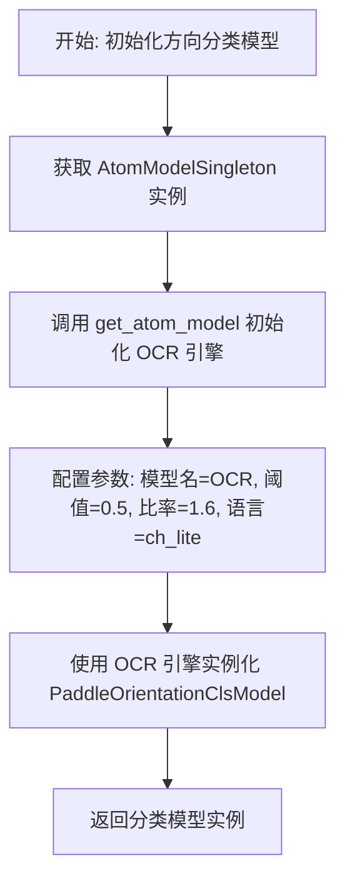

#### 带注释源码

```python
def img_orientation_cls_model_init():
    """
    初始化图像方向分类模型。
    该模型通常依赖于底层的OCR引擎来进行特征提取或后处理。
    """
    # 1. 获取原子模型管理器的单例实例，用于统一管理模型生命周期
    atom_model_manager = AtomModelSingleton()
    
    # 2. 获取OCR引擎实例。
    # 图像方向分类模型往往需要借助OCR的检测结果或文本特征来辅助判断方向，
    # 因此这里先初始化一个特定的OCR模型（文字 lite 版）。
    # 参数包括：检测阈值、膨胀比率、语言（中文轻量版）以及禁止合并检测框
    ocr_engine = atom_model_manager.get_atom_model(
        atom_model_name=AtomicModel.OCR,
        det_db_box_thresh=0.5,         # 检测框置信度阈值
        det_db_unclip_ratio=1.6,       # 检测框膨胀比率
        lang="ch_lite",                # 使用中文轻量模型
        enable_merge_det_boxes=False   # 不合并检测框
    )
    
    # 3. 使用获取到的 OCR 引擎初始化方向分类模型
    cls_model = PaddleOrientationClsModel(ocr_engine)
    
    # 4. 返回封装好的方向分类模型
    return cls_model
```


### `table_cls_model_init`

该函数用于初始化表格分类模型，创建一个 `PaddleTableClsModel` 实例并返回，供后续表格分类任务使用。

参数： 无

返回值：`PaddleTableClsModel`，返回初始化后的表格分类模型实例

#### 流程图

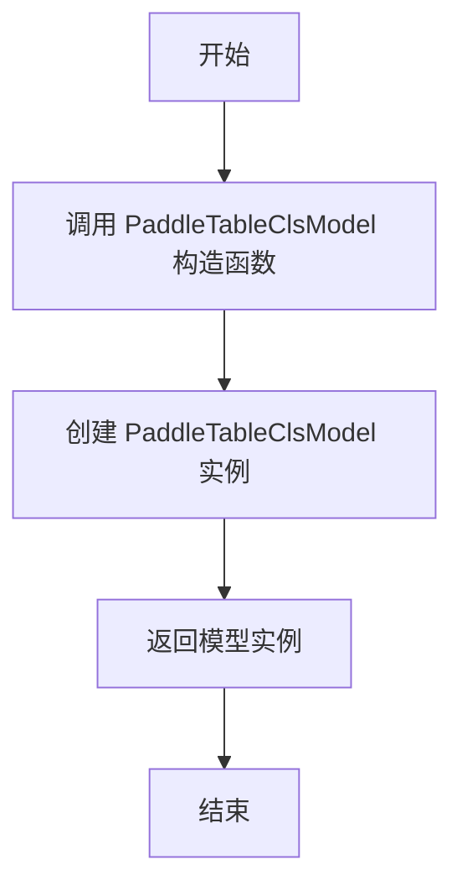

#### 带注释源码

```python
def table_cls_model_init():
    """
    初始化表格分类模型
    
    该函数创建一个 PaddleTableClsModel 实例，用于表格分类任务。
    PaddleTableClsModel 是基于 PaddlePaddle 框架的表格分类模型，
    继承自相应的基类并实现表格分类的推理逻辑。
    
    Returns:
        PaddleTableClsModel: 初始化后的表格分类模型实例
    """
    # 直接调用 PaddleTableClsModel 的构造函数创建实例
    # 该模型内部会加载预训练权重并完成模型初始化
    return PaddleTableClsModel()
```

---

#### 补充信息

**关键组件信息**

| 组件名称 | 描述 |
|---------|------|
| `PaddleTableClsModel` | 基于 PaddlePaddle 框架的表格分类模型类，负责表格的结构化分类任务 |
| `AtomicModel.TableCls` | 枚举值，表示表格分类模型的原子模型标识 |

**潜在技术债务或优化空间**

1. **缺乏灵活性**：当前函数无任何参数配置，无法动态指定模型路径、设备、是否启用 GPU 等，建议增加可选配置参数以提升灵活性。

2. **缺少错误处理**：函数直接返回模型实例，未对模型加载失败、权重文件缺失等异常情况进行捕获和处理，建议增加 try-except 块。

3. **日志缺失**：函数执行过程中无任何日志输出，无法追踪模型初始化状态，建议添加日志记录关键步骤。

4. **未使用单例模式**：与 `AtomModelSingleton` 中的其他模型初始化函数不同，该函数每次调用都会创建新实例，可能造成资源浪费，建议纳入单例管理。

**在项目中的调用关系**

```python
# 在 atom_model_init 中被调用
elif model_name == AtomicModel.TableCls:
    atom_model = table_cls_model_init()

# 在 MineruPipelineModel 中通过 AtomModelSingleton 调用
self.table_cls_model = atom_model_manager.get_atom_model(
    atom_model_name=AtomicModel.TableCls,
)
```


### `wired_table_model_init`

该函数用于初始化有线表格识别模型（UnetTableModel），通过 AtomModelSingleton 单例获取 OCR 引擎，并将 OCR 引擎作为参数传递给 UnetTableModel 完成有线表格模型的初始化。

参数：

-  `lang`：`<class 'str'>` 或 `None`，可选参数，用于指定 OCR 引擎的语言支持，默认值为 `None`

返回值：`<class 'UnetTableModel'>`，返回初始化后的有线表格识别模型实例

#### 流程图

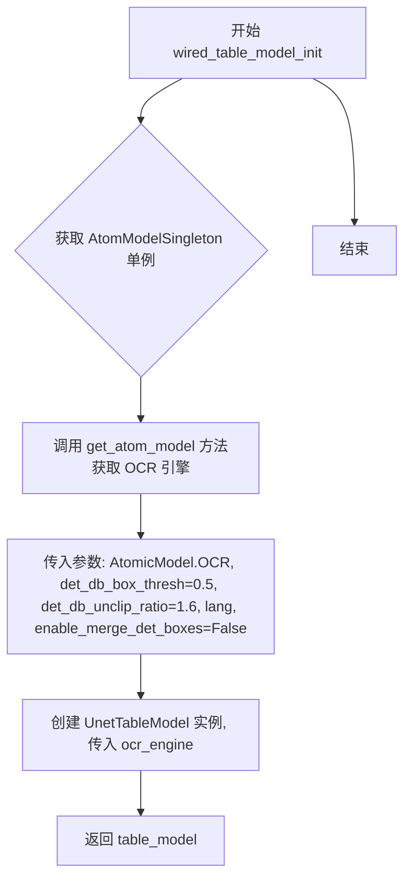

#### 带注释源码

```python
def wired_table_model_init(lang=None):
    """
    初始化有线表格识别模型
    
    参数:
        lang: 可选参数, 指定OCR引擎的语言支持, 默认为None
    
    返回:
        返回初始化后的UnetTableModel有线表格识别模型实例
    """
    # 获取 AtomModelSingleton 单例管理器
    atom_model_manager = AtomModelSingleton()
    
    # 通过单例获取 OCR 引擎
    # 参数说明:
    # - atom_model_name: 原子模型名称, 这里指定为 OCR 模型
    # - det_db_box_thresh: 检测框置信度阈值, 设为 0.5
    # - det_db_unclip_ratio: 检测框扩张比例, 设为 1.6
    # - lang: 语言参数, 透传传入的 lang 值
    # - enable_merge_det_boxes: 是否合并检测框, 设为 False
    ocr_engine = atom_model_manager.get_atom_model(
        atom_model_name=AtomicModel.OCR,
        det_db_box_thresh=0.5,
        det_db_unclip_ratio=1.6,
        lang=lang,
        enable_merge_det_boxes=False
    )
    
    # 使用 OCR 引擎初始化 UnetTableModel 有线表格识别模型
    table_model = UnetTableModel(ocr_engine)
    
    # 返回初始化后的表格模型
    return table_model
```


### `wireless_table_model_init`

该函数用于初始化无线表格识别模型（Wireless Table Model），通过单例模式的原子模型管理器获取OCR引擎，并使用该引擎实例化RapidTableModel表格识别模型。

参数：

- `lang`：`str | None`，语言参数，用于指定OCR识别所使用的语言模型

返回值：`RapidTableModel`，初始化后的无线表格识别模型实例

#### 流程图

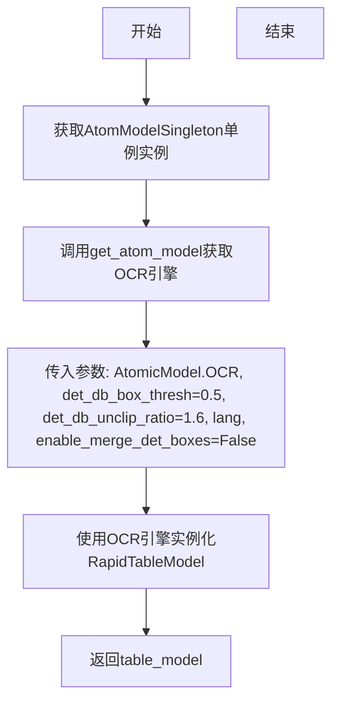

#### 带注释源码

```python
def wireless_table_model_init(lang=None):
    """
    初始化无线表格识别模型
    
    参数:
        lang: 语言参数，用于指定OCR识别语言
        
    返回:
        RapidTableModel: 无线表格识别模型实例
    """
    # 1. 获取原子模型单例管理器（确保模型只初始化一次）
    atom_model_manager = AtomModelSingleton()
    
    # 2. 通过单例获取OCR引擎，用于表格中的文字识别
    #    - det_db_box_thresh=0.5: 检测框置信度阈值
    #    - det_db_unclip_ratio=1.6: 检测框扩展比例
    #    - lang: 识别语言
    #    - enable_merge_det_boxes=False: 不合并检测框
    ocr_engine = atom_model_manager.get_atom_model(
        atom_model_name=AtomicModel.OCR,
        det_db_box_thresh=0.5,
        det_db_unclip_ratio=1.6,
        lang=lang,
        enable_merge_det_boxes=False
    )
    
    # 3. 使用OCR引擎实例化无线表格识别模型（RapidTableModel）
    table_model = RapidTableModel(ocr_engine)
    
    # 4. 返回初始化后的表格模型
    return table_model
```


### `mfd_model_init`

该函数用于初始化公式检测模型（YOLOv8），根据传入的权重路径和设备参数，创建并返回一个配置好的 YOLOv8MFDModel 实例，支持 CPU、GPU 以及华为 NPU 设备。

参数：

-  `weight`：`str`，模型权重文件路径
-  `device`：`str`，默认为 `'cpu'`，指定运行设备（如 'cpu'、'cuda'、'npu:0' 等）

返回值：`YOLOv8MFDModel`，返回初始化后的公式检测模型实例

#### 流程图

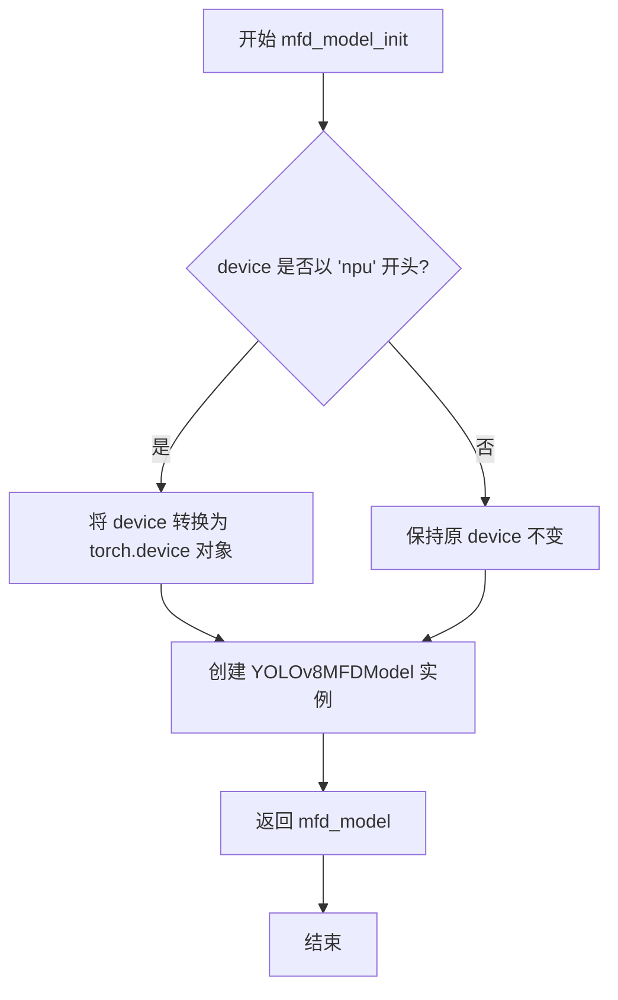

#### 带注释源码

```python
def mfd_model_init(weight, device='cpu'):
    """
    初始化公式检测模型（YOLOv8）
    
    参数:
        weight: 模型权重文件路径
        device: 运行设备，默认为 'cpu'
    
    返回:
        YOLOv8MFDModel: 初始化后的公式检测模型实例
    """
    # 检查设备是否为华为 NPU（Ascend）
    if str(device).startswith('npu'):
        # 将字符串设备名转换为 torch.device 对象
        device = torch.device(device)
    
    # 使用权重路径和设备创建 YOLOv8 公式检测模型
    mfd_model = YOLOv8MFDModel(weight, device)
    
    # 返回初始化后的模型实例
    return mfd_model
```


### `mfr_model_init`

该函数根据全局环境变量 `MFR_MODEL` 的配置，初始化公式识别模型（Unimernet 或 FormulaNet），支持通过 `weight_dir` 和 `device` 参数指定模型权重路径和计算设备。

参数：

- `weight_dir`：`str`，模型权重目录路径，用于指定公式识别模型的权重文件位置
- `device`：`str`，计算设备，默认为 `'cpu'`，支持 `'cuda'`、`'npu'` 等设备

返回值：`Union[UnimernetModel, FormulaRecognizer]`，返回初始化后的公式识别模型实例，可能是 `UnimernetModel` 或 `FormulaRecognizer` 类型

#### 流程图

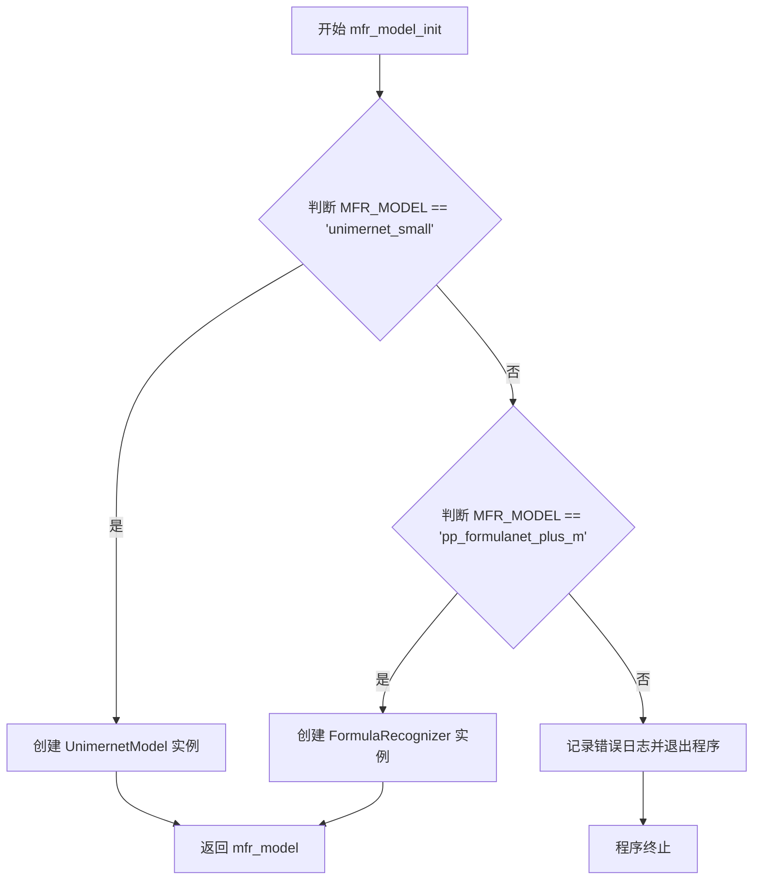

#### 带注释源码

```python
def mfr_model_init(weight_dir, device='cpu'):
    """
    初始化公式识别模型（Unimernet 或 FormulaNet）
    
    参数:
        weight_dir: 模型权重目录路径
        device: 计算设备，默认为 'cpu'
    
    返回:
        公式识别模型实例
    """
    # 判断全局配置 MFR_MODEL 的值
    if MFR_MODEL == "unimernet_small":
        # 使用 Unimernet 小模型进行公式识别
        mfr_model = UnimernetModel(weight_dir, device)
    elif MFR_MODEL == "pp_formulanet_plus_m":
        # 使用 PaddlePaddle 的 FormulaNet Plus M 模型进行公式识别
        mfr_model = FormulaRecognizer(weight_dir, device)
    else:
        # MFR_MODEL 配置值无效，记录错误日志并退出程序
        logger.error('MFR model name not allow')
        exit(1)
    return mfr_model
```


### `doclayout_yolo_model_init`

该函数用于初始化布局分析模型 DocLayoutYOLO，根据传入的权重路径和设备参数创建并返回一个配置好的文档布局检测模型实例，支持 CPU、NPU 等多种计算设备。

参数：

- `weight`：`str`，模型权重文件的路径，用于加载预训练的 DocLayoutYOLO 模型权重
- `device`：`str`，默认为 `'cpu'`，指定模型运行设备，支持 'cpu'、'cuda'、'npu' 等设备类型

返回值：`DocLayoutYOLOModel`，返回初始化后的 DocLayoutYOLO 模型实例，可用于后续的文档布局分析任务

#### 流程图

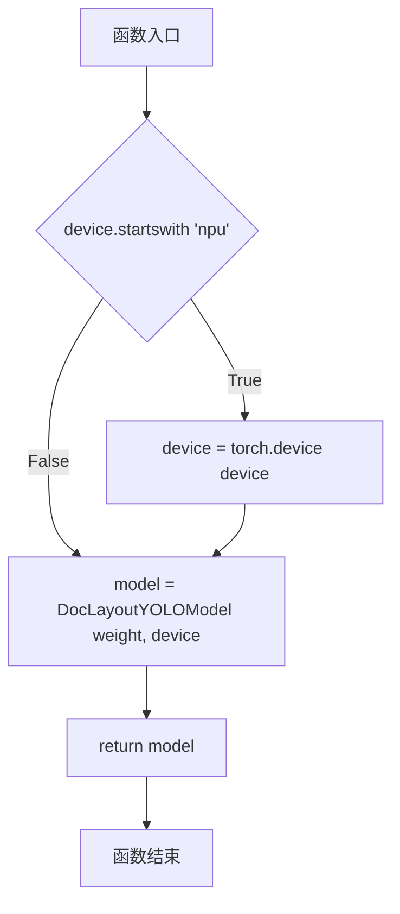

#### 带注释源码

```python
def doclayout_yolo_model_init(weight, device='cpu'):
    """
    初始化布局分析模型 DocLayoutYOLO
    
    参数:
        weight: 模型权重文件路径
        device: 运行设备，默认为 'cpu'
    
    返回:
        DocLayoutYOLOModel: 初始化后的模型实例
    """
    # 检查设备是否为 NPU（华为昇腾处理器）
    if str(device).startswith('npu'):
        # 将字符串设备名转换为 torch 的 device 对象
        device = torch.device(device)
    
    # 创建 DocLayoutYOLO 模型实例，传入权重路径和设备
    model = DocLayoutYOLOModel(weight, device)
    
    # 返回初始化后的模型
    return model
```


### `ocr_model_init`

该函数是 OCR（光学字符识别）模型的初始化工厂方法。它根据传入的参数（主要是语言设置）构建并返回一个配置好的 `PytorchPaddleOCR` 模型实例，用于文档中的文本检测与识别。函数内部处理了语言参数为空或 None 时的默认逻辑，并默认启用了图像膨胀以提升检测效果。

参数：

- `det_db_box_thresh`：`float`，默认 0.3。文本检测框的置信度阈值，用于过滤低置信度的检测结果。
- `lang`：`Optional[str]`，默认 None。OCR 识别的语言类型（例如 'ch_lite', 'en' 等）。如果为 None 或空字符串，则使用默认语言配置。
- `det_db_unclip_ratio`：`float`，默认 1.8。文本检测框的扩边比例，用于将紧密的文本框适当地向外扩展以包含完整文本。
- `enable_merge_det_boxes`：`bool`，默认 True。是否允许合并检测到的文本框，用于处理多行文本或段落。

返回值：`PytorchPaddleOCR`。返回初始化后的 PaddleOCR 模型实例。

#### 流程图

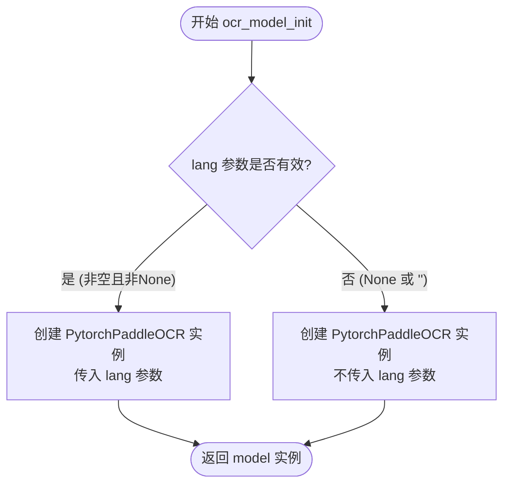

#### 带注释源码

```python
def ocr_model_init(det_db_box_thresh=0.3,
                   lang=None,
                   det_db_unclip_ratio=1.8,
                   enable_merge_det_boxes=True
                   ):
    """
    初始化 PytorchPaddleOCR 模型。
    
    Args:
        det_db_box_thresh (float): 文本检测的置信度阈值。
        lang (str, optional): OCR 识别的语言。
        det_db_unclip_ratio (float): 文本框的扩边比例。
        enable_merge_det_boxes (bool): 是否合并检测到的文本框。

    Returns:
        PytorchPaddleOCR: 初始化后的 OCR 模型实例。
    """
    # 判断语言参数是否有效，如果有效则在初始化时传入
    if lang is not None and lang != '':
        model = PytorchPaddleOCR(
            det_db_box_thresh=det_db_box_thresh,
            lang=lang, # 使用传入的语言
            use_dilation=True, # 默认使用图像膨胀增强检测
            det_db_unclip_ratio=det_db_unclip_ratio,
            enable_merge_det_boxes=enable_merge_det_boxes,
        )
    else:
        # 语言参数无效时，使用默认配置初始化
        model = PytorchPaddleOCR(
            det_db_box_thresh=det_db_box_thresh,
            use_dilation=True, # 默认使用图像膨胀增强检测
            det_db_unclip_ratio=det_db_unclip_ratio,
            enable_merge_det_boxes=enable_merge_det_boxes,
        )
    return model
```


### `atom_model_init`

该函数是核心工厂函数，根据传入的枚举类型（`AtomicModel`）分发初始化不同的模型实例（如布局模型、公式检测MFD、公式识别MFR、OCR、表格模型等），并返回初始化后的模型对象。

参数：

- `model_name`：`str`，模型枚举名称，对应 `AtomicModel` 中的具体模型类型（如 Layout、MFD、MFR、OCR 等）
- `**kwargs`：`任意类型`，可变关键字参数，包含初始化特定模型所需的额外参数（如权重路径 `doclayout_yolo_weights`、`mfd_weights`、`mfr_weight_dir`，设备 `device`，语言 `lang`，检测阈值 `det_db_box_thresh` 等）

返回值：`任意模型类型`，返回初始化成功的模型实例；若初始化失败或模型类型不支持则程序退出

#### 流程图

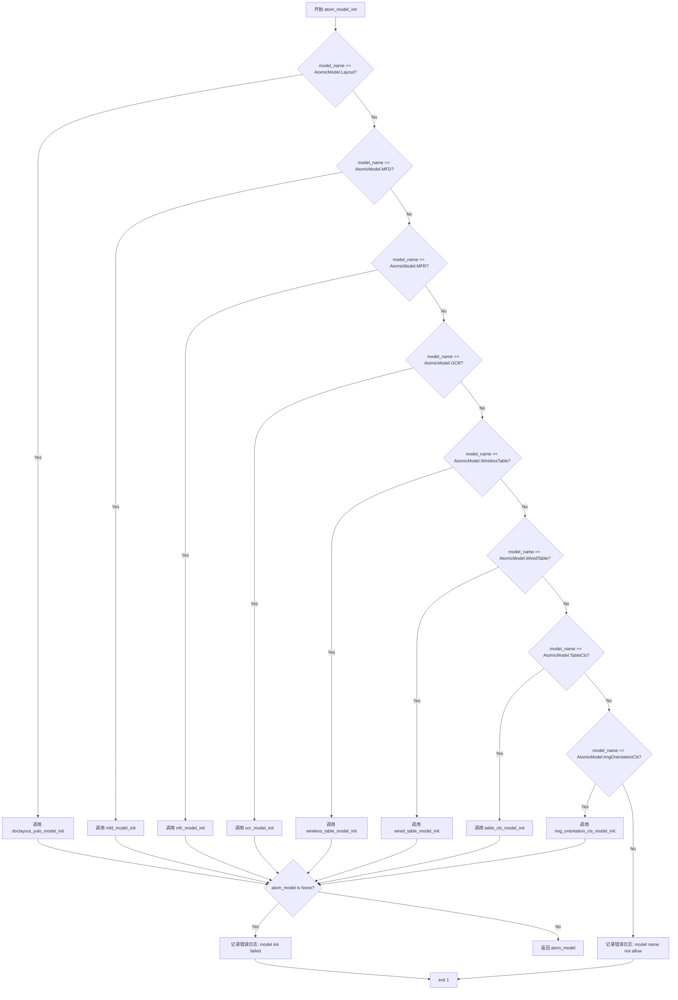

#### 带注释源码

```python
def atom_model_init(model_name: str, **kwargs):
    """
    核心工厂函数，根据枚举类型分发初始化不同的原子模型
    
    参数:
        model_name: str, 模型枚举名称，对应 AtomicModel 中的具体模型类型
        **kwargs: 可变关键字参数，包含初始化特定模型所需的额外参数
            - doclayout_yolo_weights: layout 模型权重路径
            - mfd_weights: 公式检测模型权重路径
            - mfr_weight_dir: 公式识别模型权重目录
            - device: 计算设备 (cpu/cuda/npu 等)
            - lang: 语言设置 (ch_lite/en 等)
            - det_db_box_thresh: OCR 检测框阈值
            - det_db_unclip_ratio: OCR 检测框扩展比例
            - enable_merge_det_boxes: 是否合并检测框
    """
    # 初始化模型对象为 None
    atom_model = None
    
    # 根据模型名称分发到对应的初始化函数
    if model_name == AtomicModel.Layout:
        # 初始化布局检测模型 (DocLayoutYOLO)
        atom_model = doclayout_yolo_model_init(
            kwargs.get('doclayout_yolo_weights'),
            kwargs.get('device')
        )
    elif model_name == AtomicModel.MFD:
        # 初始化公式检测模型 (YOLOv8 MFD)
        atom_model = mfd_model_init(
            kwargs.get('mfd_weights'),
            kwargs.get('device')
        )
    elif model_name == AtomicModel.MFR:
        # 初始化公式识别模型 (Unimernet 或 pp_formulanet_plus_m)
        atom_model = mfr_model_init(
            kwargs.get('mfr_weight_dir'),
            kwargs.get('device')
        )
    elif model_name == AtomicModel.OCR:
        # 初始化 OCR 模型 (PytorchPaddleOCR)
        atom_model = ocr_model_init(
            kwargs.get('det_db_box_thresh', 0.3),       # 默认阈值 0.3
            kwargs.get('lang'),                         # 语言设置
            kwargs.get('det_db_unclip_ratio', 1.8),    # 默认扩展比例 1.8
            kwargs.get('enable_merge_det_boxes', True) # 默认启用合并
        )
    elif model_name == AtomicModel.WirelessTable:
        # 初始化无线表格模型 (RapidTable)
        atom_model = wireless_table_model_init(
            kwargs.get('lang'),
        )
    elif model_name == AtomicModel.WiredTable:
        # 初始化有线表格模型 (UnetTable)
        atom_model = wired_table_model_init(
            kwargs.get('lang'),
        )
    elif model_name == AtomicModel.TableCls:
        # 初始化表格分类模型
        atom_model = table_cls_model_init()
    elif model_name == AtomicModel.ImgOrientationCls:
        # 初始化图像方向分类模型
        atom_model = img_orientation_cls_model_init()
    else:
        # 不支持的模型类型，记录错误并退出
        logger.error('model name not allow')
        exit(1)

    # 检查模型是否初始化成功
    if atom_model is None:
        logger.error('model init failed')
        exit(1)
    else:
        return atom_model
```


### `ocr_det_batch_setting`

该函数用于检测当前运行环境（PyTorch版本、设备类型、环境变量），根据检测结果决定是否启用OCR检测的批处理模式。在PyTorch版本较新（≥2.8.0）、使用Apple MPS加速或使用Corex设备时，批处理可能被认为不稳定或不推荐，因此返回False；否则返回True以启用批处理提升性能。

参数：

- `device`：`str`，目标计算设备标识（如'cpu'、'cuda'、'mps'、'npu'等），用于判断设备类型并结合环境变量决定是否开启批处理

返回值：`bool`，返回是否启用OCR检测批处理的标志，True表示启用，False表示禁用

#### 流程图

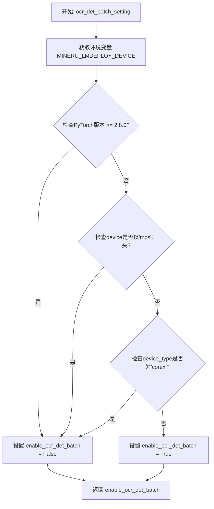

#### 带注释源码

```python
def ocr_det_batch_setting(device):
    """
    检测环境以决定是否开启OCR批处理
    
    该函数通过检查PyTorch版本、设备类型和环境变量来判断当前环境
    是否适合启用OCR检测的批处理模式。在较新版本的PyTorch或特定
    设备（MPS、Corex）上，批处理可能存在兼容性问题，因此默认禁用。
    
    Args:
        device: 目标计算设备标识，支持'cpu'、'cuda'、'mps'、'npu'等
        
    Returns:
        bool: 是否启用OCR检测批处理，True为启用，False为禁用
    """
    # 导入torch用于版本检测和设备判断
    import torch
    # 导入version用于解析和比较语义化版本号
    from packaging import version

    # 获取LMDeploy设备类型环境变量，用于判断是否使用Corex加速
    device_type = os.getenv("MINERU_LMDEPLOY_DEVICE", "")

    # 判断条件：满足以下任一条件则禁用OCR批处理
    if (
            # 条件1: PyTorch版本大于等于2.8.0（新版可能存在API变化）
            version.parse(torch.__version__) >= version.parse("2.8.0")
            # 条件2: 设备为Apple MPS（Metal Performance Shaders）
            or str(device).startswith('mps')
            # 条件3: 使用Corex加速（通过环境变量指定）
            or device_type.lower() in ["corex"]
    ):
        # 上述任一条件满足时，禁用OCR批处理
        enable_ocr_det_batch = False
    else:
        # 环境兼容，启用OCR批处理以提升性能
        enable_ocr_det_batch = True
    
    # 返回最终决策结果
    return enable_ocr_det_batch
```


### `AtomModelSingleton.__new__`

实现单例模式，确保 `AtomModelSingleton` 类只有一个实例，并在首次创建后返回该实例的引用。

参数：

- `cls`：`class`，Python 类方法隐式参数，代表调用该方法的类本身
- `*args`：`tuple`，可变位置参数列表，用于传递给父类 `object.__new__` 的构造参数（当前实现中未使用）
- `**kwargs`：`dict`，可变关键字参数列表，用于传递给父类 `object.__new__` 的构造参数（当前实现中未使用）

返回值：`AtomModelSingleton`，返回单例实例引用，确保全局唯一

#### 流程图

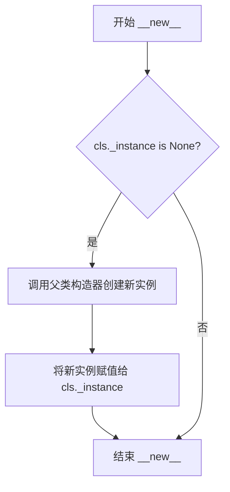

#### 带注释源码

```python
def __new__(cls, *args, **kwargs):
    """
    单例模式的 __new__ 方法实现
    
    Args:
        cls: 类本身，Python类方法隐式传入的第一个参数
        *args: 可变位置参数，传递给父类object.__new__的额外位置参数
        **kwargs: 可变关键字参数，传递给父类object.__new__的额外关键字参数
    
    Returns:
        AtomModelSingleton: 返回单例实例引用
    """
    # 检查类属性 _instance 是否为空（是否已有实例）
    if cls._instance is None:
        # 首次调用时，调用父类object的__new__方法创建新实例
        cls._instance = super().__new__(cls)
    # 无论是否创建新实例，都返回同一个实例引用
    return cls._instance
```


### `AtomModelSingleton.get_atom_model`

该方法是原子模型单例类的核心方法，负责根据模型名称和动态参数获取或初始化模型实例，并利用缓存机制避免重复创建相同的模型，以提升性能和资源利用效率。

参数：

- `self`：隐式参数，单例实例自身
- `atom_model_name`：`str`，模型名称，指定要获取的原子模型类型（如OCR、Layout、MFD、MFR等）
- `**kwargs`：`dict`，动态关键字参数，包含可选配置参数：
  - `lang`：`str`，语言代码（如"ch_lite"、"en"等），用于OCR和表格模型
  - `det_db_box_thresh`：`float`，OCR检测的box阈值，默认为0.3
  - `det_db_unclip_ratio`：`float`，OCR检测的unclip比率，默认为1.8
  - `enable_merge_det_boxes`：`bool`，是否合并检测框，默认为True
  - `mfd_weights`：`str`，公式检测模型权重路径
  - `mfr_weight_dir`：`str`，公式识别模型权重目录
  - `doclayout_yolo_weights`：`str`，布局检测模型权重路径
  - `device`：`str`，计算设备（如"cpu"、"cuda"等）

返回值：`object`，返回初始化后的模型实例对象，具体类型取决于`atom_model_name`（如PytorchPaddleOCR、YOLOv8MFDModel、UnimernetModel等）

#### 流程图

```mermaid
flowchart TD
    A[开始 get_atom_model] --> B{atom_model_name in<br/>[WiredTable, WirelessTable]?}
    B -- 是 --> C[构建key = (atom_model_name, lang)]
    B -- 否 --> D{atom_model_name == OCR?}
    D -- 是 --> E[构建key = (atom_model_name, det_db_box_thresh, lang,<br/>det_db_unclip_ratio, enable_merge_det_boxes)]
    D -- 否 --> F[key = atom_model_name]
    C --> G{key in _models?}
    E --> G
    F --> G
    G -- 是 --> H[返回缓存的模型实例]
    G -- 否 --> I[调用atom_model_init初始化模型]
    I --> J[存入_models缓存]
    J --> H
```

#### 带注释源码

```python
def get_atom_model(self, atom_model_name: str, **kwargs):
    """
    根据模型名称和参数获取或初始化模型实例
    
    参数:
        atom_model_name: str, 模型名称
        **kwargs: 动态参数，包含lang、det_db_box_thresh等
    
    返回:
        初始化后的模型实例
    """
    
    # 从kwargs中提取可选的lang参数
    lang = kwargs.get('lang', None)

    # 根据模型类型构建不同的缓存key
    # WiredTable和WirelessTable需要区分lang
    if atom_model_name in [AtomicModel.WiredTable, AtomicModel.WirelessTable]:
        key = (
            atom_model_name,
            lang
        )
    # OCR模型需要更多参数来区分不同的配置
    elif atom_model_name in [AtomicModel.OCR]:
        key = (
            atom_model_name,
            kwargs.get('det_db_box_thresh', 0.3),
            lang,
            kwargs.get('det_db_unclip_ratio', 1.8),
            kwargs.get('enable_merge_det_boxes', True)
        )
    # 其他模型使用模型名称作为key即可
    else:
        key = atom_model_name

    # 检查模型是否已存在于缓存中
    if key not in self._models:
        # 缓存未命中，调用初始化函数创建新模型
        self._models[key] = atom_model_init(model_name=atom_model_name, **kwargs)
    
    # 返回模型实例（无论是从缓存获取还是新创建的）
    return self._models[key]
```


### `MineruPipelineModel.__init__`

该方法是 `MineruPipelineModel` 类的构造函数，负责根据配置初始化所有启用的模型（包括公式检测模型 MFD、公式识别模型 MFR、布局模型 Layout、OCR 模型、表格模型等），并通过 `AtomModelSingleton` 单例模式管理模型实例，确保同一模型只初始化一次。

参数：

- `**kwargs`：`dict`，可变关键字参数，包含 `formula_config`（公式配置）、`table_config`（表格配置）、`lang`（语言）、`device`（设备）等配置项

返回值：`None`，该方法无返回值，主要通过实例属性存储初始化后的模型对象

#### 流程图

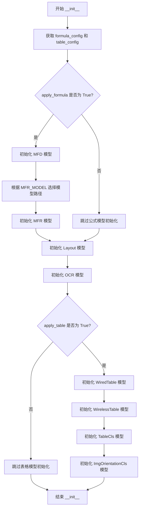

#### 带注释源码

```python
class MineruPipelineModel:
    def __init__(self, **kwargs):
        """
        初始化 MineruPipelineModel 实例
        根据配置初始化所有启用的模型（公式、表格、布局、OCR 等）
        """
        # 从 kwargs 中获取公式配置，默认启用公式模型
        self.formula_config = kwargs.get('formula_config')
        self.apply_formula = self.formula_config.get('enable', True)
        
        # 从 kwargs 中获取表格配置，默认启用表格模型
        self.table_config = kwargs.get('table_config')
        self.apply_table = self.table_config.get('enable', True)
        
        # 获取语言设置，默认为 None
        self.lang = kwargs.get('lang', None)
        # 获取设备设置，默认为 'cpu'
        self.device = kwargs.get('device', 'cpu')
        
        # 记录初始化开始日志
        logger.info('DocAnalysis init, this may take some times......')
        
        # 获取 AtomModelSingleton 单例，用于管理所有原子模型
        atom_model_manager = AtomModelSingleton()

        # 如果启用公式模型，则初始化公式检测和识别模型
        if self.apply_formula:
            # 初始化公式检测模型 (MFD - Math Formula Detection)
            self.mfd_model = atom_model_manager.get_atom_model(
                atom_model_name=AtomicModel.MFD,
                mfd_weights=str(
                    os.path.join(
                        auto_download_and_get_model_root_path(ModelPath.yolo_v8_mfd),
                        ModelPath.yolo_v8_mfd
                    )
                ),
                device=self.device,
            )

            # 根据环境变量选择公式识别模型 (MFR - Math Formula Recognition)
            if MFR_MODEL == "unimernet_small":
                mfr_model_path = ModelPath.unimernet_small
            elif MFR_MODEL == "pp_formulanet_plus_m":
                mfr_model_path = ModelPath.pp_formulanet_plus_m
            else:
                logger.error('MFR model name not allow')
                exit(1)

            # 初始化公式识别模型
            self.mfr_model = atom_model_manager.get_atom_model(
                atom_model_name=AtomicModel.MFR,
                mfr_weight_dir=str(
                    os.path.join(
                        auto_download_and_get_model_root_path(mfr_model_path),
                        mfr_model_path
                    )
                ),
                device=self.device,
            )

        # 初始化布局检测模型 (Layout)
        self.layout_model = atom_model_manager.get_atom_model(
            atom_model_name=AtomicModel.Layout,
            doclayout_yolo_weights=str(
                os.path.join(
                    auto_download_and_get_model_root_path(ModelPath.doclayout_yolo),
                    ModelPath.doclayout_yolo
                )
            ),
            device=self.device,
        )
        
        # 初始化 OCR 模型
        self.ocr_model = atom_model_manager.get_atom_model(
            atom_model_name=AtomicModel.OCR,
            det_db_box_thresh=0.3,
            lang=self.lang
        )
        
        # 如果启用表格模型，则初始化相关表格模型
        if self.apply_table:
            # 初始化有线表格模型
            self.wired_table_model = atom_model_manager.get_atom_model(
                atom_model_name=AtomicModel.WiredTable,
                lang=self.lang,
            )
            # 初始化无线表格模型
            self.wireless_table_model = atom_model_manager.get_atom_model(
                atom_model_name=AtomicModel.WirelessTable,
                lang=self.lang,
            )
            # 初始化表格分类模型
            self.table_cls_model = atom_model_manager.get_atom_model(
                atom_model_name=AtomicModel.TableCls,
            )
            # 初始化图像方向分类模型
            self.img_orientation_cls_model = atom_model_manager.get_atom_model(
                atom_model_name=AtomicModel.ImgOrientationCls,
                lang=self.lang,
            )

        # 记录初始化完成日志
        logger.info('DocAnalysis init done!')
```


### `HybridModelSingleton.__new__`

实现单例模式的`__new__`方法，确保`HybridModelSingleton`类在整个应用程序中只有一个实例，并返回该实例。

参数：

- `cls`：`<class type>`，Python 类方法隐式传入的类本身参数，用于创建类的实例
- `*args`：`<tuple>`，可变位置参数列表，预留给子类扩展或未来兼容
- `**kwargs`：`<dict>`，可变关键字参数字典，用于传递额外的配置参数

返回值：`<HybridModelSingleton>`，返回单例实例（如果是首次调用则创建新实例，否则返回已存在的实例）

#### 流程图

```mermaid
flowchart TD
    A[开始 __new__] --> B{cls._instance 是否为 None?}
    B -- 是 --> C[调用 super().__new__ 创建新实例]
    C --> D[将新实例赋值给 cls._instance]
    D --> E[返回 cls._instance]
    B -- 否 --> E
    E --> F[结束]
    
    style A fill:#f9f,color:#333
    style E fill:#9f9,color:#333
    style F fill:#9f9,color:#333
```

#### 带注释源码

```python
class HybridModelSingleton:
    """
    混合模型单例类，用于管理 MineruHybridModel 的全局唯一实例
    通过字典 _models 缓存不同配置组合的模型实例
    """
    _instance = None          # 类变量，存储单例实例，初始化为 None
    _models = {}              # 类变量，缓存已创建的模型实例，键为 (lang, formula_enable) 元组

    def __new__(cls, *args, **kwargs):
        """
        单例模式的 __new__ 方法实现
        
        工作原理：
        1. 首次调用时，cls._instance 为 None，创建新实例
        2. 后续调用时，直接返回已创建的实例
        
        参数:
            cls: 指向当前类的引用（Python自动传入）
            *args: 可变位置参数，预留给子类调用
            **kwargs: 可变关键字参数，预留给子类调用
        
        返回值:
            HybridModelSingleton: 单例实例对象
        """
        # 检查是否已存在实例
        if cls._instance is None:
            # 使用父类的 __new__ 方法创建新实例
            # 这里不传递 *args 和 **kwargs，因为单例通常不需要额外参数
            cls._instance = super().__new__(cls)
        
        # 返回单例实例（无论新建还是已存在）
        return cls._instance

    def get_model(
        self,
        lang=None,
        formula_enable=None,
    ):
        """
        根据语言和公式启用配置获取或创建模型实例
        
        使用 (lang, formula_enable) 作为缓存键，实现多配置支持
        """
        key = (lang, formula_enable)
        if key not in self._models:
            self._models[key] = MineruHybridModel(
                lang=lang,
                formula_enable=formula_enable,
            )
        return self._models[key]
```


### `HybridModelSingleton.get_model`

获取混合模型实例，根据语言(lang)和公式启用状态(formula_enable)返回对应的MineruHybridModel单例。

参数：

- `lang`：`Optional[str]`，语言参数，用于指定OCR等模型的语言支持，默认为None
- `formula_enable`：`Optional[bool]`，公式启用标志，用于控制是否加载公式检测(MFD)和公式识别(MFR)模型，默认为None

返回值：`MineruHybridModel`，返回根据lang和formula_enable配置构建的混合模型实例

#### 流程图

```mermaid
flowchart TD
    A[开始 get_model] --> B[构建缓存key = (lang, formula_enable)]
    B --> C{key 是否在 _models 中?}
    C -->|是| D[返回缓存的模型实例]
    C -->|否| E[创建新的 MineruHybridModel]
    E --> F[lang=lang, formula_enable=formula_enable]
    F --> G[存入 _models[key] 缓存]
    G --> D
```

#### 带注释源码

```python
def get_model(
    self,
    lang=None,
    formula_enable=None,
):
    """
    获取混合模型实例
    
    根据lang和formula_enable构建缓存key，
    如果已存在则返回缓存的模型，否则创建新模型并缓存
    """
    # 使用(lang, formula_enable)元组作为缓存键
    key = (lang, formula_enable)
    
    # 检查模型是否已缓存
    if key not in self._models:
        # 未缓存时创建新的MineruHybridModel实例
        self._models[key] = MineruHybridModel(
            lang=lang,
            formula_enable=formula_enable,
        )
    
    # 返回模型实例（从缓存或新创建）
    return self._models[key]
```


### `MineruHybridModel.__init__`

该方法是 `MineruHybridModel` 类的构造函数，负责初始化OCR（光学字符识别）及公式相关模型（MFD公式检测和MFR公式解析），支持CPU、GPU、NPU等多种设备，并提供公式模型的启用/禁用功能。

参数：

- `device`：`str | None`，计算设备，默认为None（自动选择）
- `lang`：`str | None`，OCR识别语言，默认None
- `formula_enable`：`bool`，是否启用公式检测和解析模型，默认为True

返回值：`None`，该方法无返回值，直接在实例上初始化模型属性

#### 流程图

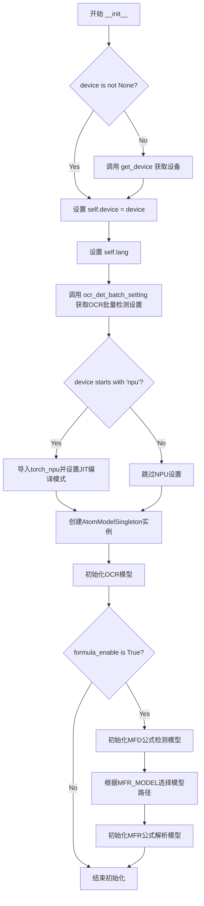

#### 带注释源码

```python
def __init__(
        self,
        device=None,
        lang=None,
        formula_enable=True,
):
    """
    MineruHybridModel 构造函数
    
    参数:
        device: 计算设备，None时自动选择
        lang: OCR识别语言
        formula_enable: 是否启用公式模型
    """
    # 1. 设备初始化：如果未提供设备，则自动获取
    if device is not None:
        self.device = device
    else:
        self.device = get_device()

    # 2. 设置语言参数
    self.lang = lang

    # 3. 获取OCR批量检测设置（根据PyTorch版本和设备类型）
    self.enable_ocr_det_batch = ocr_det_batch_setting(self.device)

    # 4. NPU设备特殊处理：设置JIT编译模式
    if str(self.device).startswith('npu'):
        try:
            import torch_npu
            if torch_npu.npu.is_available():
                # 禁用JIT编译以兼容NPU
                torch_npu.npu.set_compile_mode(jit_compile=False)
        except Exception as e:
            raise RuntimeError(
                "NPU is selected as device, but torch_npu is not available. "
                "Please ensure that the torch_npu package is installed correctly."
            ) from e

    # 5. 创建原子模型单例管理器
    self.atom_model_manager = AtomModelSingleton()

    # 6. 初始化OCR模型（文字检测与识别）
    self.ocr_model = self.atom_model_manager.get_atom_model(
        atom_model_name=AtomicModel.OCR,
        det_db_box_thresh=0.3,  # 文字检测阈值
        lang=self.lang
    )

    # 7. 条件初始化公式相关模型
    if formula_enable:
        # 7.1 初始化公式检测模型(MFD)
        self.mfd_model = self.atom_model_manager.get_atom_model(
            atom_model_name=AtomicModel.MFD,
            mfd_weights=str(
                os.path.join(
                    auto_download_and_get_model_root_path(ModelPath.yolo_v8_mfd), 
                    ModelPath.yolo_v8_mfd
                )
            ),
            device=self.device,
        )

        # 7.2 根据环境变量选择公式识别模型(MFR)
        if MFR_MODEL == "unimernet_small":
            mfr_model_path = ModelPath.unimernet_small
        elif MFR_MODEL == "pp_formulanet_plus_m":
            mfr_model_path = ModelPath.pp_formulanet_plus_m
        else:
            logger.error('MFR model name not allow')
            exit(1)

        # 7.3 初始化公式识别模型(MFR)
        self.mfr_model = self.atom_model_manager.get_atom_model(
            atom_model_name=AtomicModel.MFR,
            mfr_weight_dir=str(
                os.path.join(
                    auto_download_and_get_model_root_path(mfr_model_path), 
                    mfr_model_path
                )
            ),
            device=self.device,
        )
```

## 关键组件


### AtomModelSingleton

单例模式的原子模型管理器，负责集中管理和惰性加载所有底层原子模型（如OCR、MFD、MFR、Layout、Table等）。通过字典缓存已初始化的模型实例，避免重复初始化，支持按模型类型和参数（如语言、阈值等）作为缓存键进行模型复用。

### MineruPipelineModel

文档分析主管道模型类，封装了文档版面布局分析、公式检测与识别（MFD+MFR）、OCR文字识别、表格识别等核心功能。通过配置开关控制是否启用公式和表格模块，支持多语言，采用AtomModelSingleton进行模型实例管理。

### HybridModelSingleton

轻量级混合模型单例类，仅管理OCR和公式模型（MFD/MFR），适用于对资源占用敏感的场景。通过语言和公式启用状态作为缓存键，按需初始化对应的模型实例。

### 模型工厂函数组

包含多个原子模型初始化函数：`img_orientation_cls_model_init`（图像方向分类）、`table_cls_model_init`（表格分类）、`wired_table_model_init`（有线表格识别）、`wireless_table_model_init`（无线表格识别）、`mfd_model_init`（公式检测）、`mfr_model_init`（公式识别）、`doclayout_yolo_model_init`（版面布局分析）、`ocr_model_init`（文字识别）。各函数封装特定模型的配置参数和初始化逻辑。

### atom_model_init

模型初始化工厂函数，根据传入的`atom_model_name`参数匹配并调用对应的模型初始化函数。采用条件分支（if-elif-else）实现模型类型的分发，是整个原子模型注册与实例化的核心枢纽。

### MFR_MODEL 全局配置

通过环境变量`MINERU_FORMULA_CH_SUPPORT`动态控制公式识别模型策略，支持在`unimernet_small`（轻量）和`pp_formulanet_plus_m`（高精度）之间切换，实现运行时量化策略选择。

### ocr_det_batch_setting

OCR检测批处理配置函数，基于PyTorch版本、硬件设备类型（NPU/MPS/CoreX）自动判断是否启用批处理。通过版本解析和设备类型检测，动态调整推理策略以适配不同硬件环境。

### MineruHybridModel

轻量化混合模型类，简化版的文档分析模型，仅保留OCR和公式处理能力。包含NPU设备兼容性检查、模型缓存管理、批处理开关等特性，适用于资源受限场景。

### Lazy Loading 机制

代码中大量使用惰性加载模式：AtomModelSingleton仅在首次请求时才调用atom_model_init创建模型，后续请求直接返回缓存实例。这种设计显著减少了启动时的内存占用和模型加载时间。


## 问题及建议


### 已知问题

-   **代码重复**：多个模型初始化函数（如 `img_orientation_cls_model_init`、`wired_table_model_init`、`wireless_table_model_init`）中重复创建 `AtomModelSingleton` 和 OCR 引擎；`MineruPipelineModel` 和 `MineruHybridModel` 存在大量重复的初始化逻辑
-   **全局状态与单例模式缺陷**：`AtomModelSingleton._models` 和 `HybridModelSingleton._models` 使用类变量而非实例变量，在多线程环境下存在竞态条件风险；且单例未实现线程锁保护
-   **硬编码参数**：OCR 检测阈值 `det_db_box_thresh`、`det_db_unclip_ratio` 等参数在多处硬编码，修改需涉及多处代码
-   **错误处理不当**：使用 `exit(1)` 终止程序而非抛出异常，导致调用方无法捕获错误进行恢复；缺乏对模型初始化失败的容错机制
-   **Magic Values**：字符串 "unimernet_small"、"pp_formulanet_plus_m" 等作为 magic strings 分散在代码中，应抽取为枚举或配置常量
-   **类型注解缺失**：多数函数参数和返回值缺少类型注解，影响代码可读性和静态分析工具的有效性
-   **环境变量副作用**：`MFR_MODEL` 在模块导入时读取环境变量，降低了代码的可测试性，且未做缓存处理
-   **配置传递方式混乱**：通过 `kwargs.get()` 传递参数，缺乏统一的配置对象定义，参数校验逻辑分散
-   **NPU 设备处理分支过多**：设备判断逻辑（`startswith('npu')`）在多处重复，未抽象为统一的设备管理模块

### 优化建议

-   **提取公共初始化逻辑**：将 OCR 模型创建抽取为独立函数 `create_ocr_engine(lang, **kwargs)`，避免在多个初始化函数中重复；合并 `MineruPipelineModel` 和 `MineruHybridModel` 的公共逻辑到基类或混入类
-   **改进单例实现**：使用线程锁（`threading.Lock`）保护单例实例化；考虑将 `_models` 改为实例变量或使用线程安全的数据结构（如 `threading.local`）
-   **配置集中管理**：创建配置类或数据类（`dataclass`）统一定义模型参数，支持从配置文件或环境变量加载默认配置
-   **异常处理规范化**：将 `exit(1)` 替换为自定义异常类（如 `ModelInitializationError`），让调用方决定如何处理
-   **抽取常量与枚举**：定义 `MFRModelType` 枚举和配置常量类，将 magic strings 转换为有意义的常量
-   **完善类型注解**：为所有公开函数添加类型注解，提升代码可维护性和 IDE 支持
-   **设备抽象层**：创建 `DeviceManager` 类统一处理 CPU/GPU/NPU/MPS 等设备的判断和初始化逻辑
-   **延迟加载与懒初始化**：对于非核心模型（如表格分类、方向分类），采用懒加载策略，减少启动时间和内存占用


## 其它


### 设计目标与约束

本代码是Mineru文档分析流水线模型的初始化模块，核心目标是提供一个统一的模型管理框架，实现对文档布局分析（Layout）、公式检测（MFD）、公式识别（MFR）、OCR、表格检测与识别、图像方向分类等多种原子模型的统一加载、缓存和调用。设计约束包括：1）采用单例模式管理模型实例，确保同一模型只初始化一次；2）支持通过环境变量动态配置公式识别模型；3）主要支持CPU、GPU、NPU三种设备类型；4）模型权重通过自动下载工具获取。

### 错误处理与异常设计

代码中的错误处理主要采用日志记录加进程退出的方式。在`atom_model_init`函数中，当模型名称不合法或模型初始化失败时，使用`logger.error`记录错误日志并调用`exit(1)`终止进程。在`MineruHybridModel`初始化中，对NPU设备进行了异常捕获，若torch_npu包不可用则抛出RuntimeError。环境变量`MINERU_FORMULA_CH_SUPPORT`的值校验也会产生警告日志。整体错误处理策略较为简单，缺乏重试机制和详细的错误分类，建议增加更细粒度的异常类型定义和恢复策略。

### 数据流与状态机

系统采用分层模型管理架构，数据流主要分为三个层次：最底层是原子模型初始化层，通过`atom_model_init`函数根据模型类型调用对应的初始化函数；中间层是`AtomModelSingleton`单例类，负责模型的缓存和获取，采用字典结构存储已初始化的模型实例，键值设计考虑了不同模型实例化参数的差异；最上层是`MineruPipelineModel`和`MineruHybridModel`，它们通过原子模型管理器获取所需的模型实例。状态机方面，模型实例的状态转换相对简单，主要是从"未初始化"到"已初始化"的单向转换，已初始化的模型会被缓存复用。

### 外部依赖与接口契约

代码依赖多个外部模块和包。在模型方面，依赖`DocLayoutYOLOModel`（布局分析）、`YOLOv8MFDModel`（公式检测）、`UnimernetModel`和`FormulaRecognizer`（公式识别）、`PytorchPaddleOCR`（OCR）、`PaddleOrientationClsModel`（方向分类）、`PaddleTableClsModel`（表格分类）、`RapidTableModel`和`UnetTableModel`（表格识别）。在工具方面，依赖`loguru`进行日志记录，`torch`进行张量计算，`os`进行环境变量读取，`packaging`进行版本比较。配置方面依赖`get_device`获取设备信息，`ModelPath`枚举类定义模型路径，`auto_download_and_get_model_root_path`进行模型自动下载。

### 配置管理

配置管理主要通过环境变量和构造函数参数两种方式进行。环境变量`MINERU_FORMULA_CH_SUPPORT`用于控制公式识别模型的类型（支持中文或不支持中文），`MINERU_LMDEPLOY_DEVICE`用于控制OCR检测的批处理设置。构造函数参数方面，`MineruPipelineModel`和`MineruHybridModel`都接受`formula_config`、`table_config`、`lang`、`device`等参数。模型权重路径通过`ModelPath`枚举类和`auto_download_and_get_model_root_path`函数自动构建，支持模型的自动下载和路径管理。

### 设备兼容性

代码设计了较为完善的设备兼容性支持。设备类型包括CPU（默认）、GPU（cuda）、NPU（npu）三种。在`mfd_model_init`和`doclayout_yolo_model_init`函数中，当设备以"npu"开头时会转换为torch的NPU设备对象。在`MineruHybridModel`初始化中，对NPU设备进行了特殊处理，包括尝试导入torch_npu模块、检查NPU可用性、设置编译模式等。此外，还通过`ocr_det_batch_setting`函数根据torch版本、mps设备、corex设备等因素动态决定是否启用OCR检测的批处理功能。

### 性能优化

性能优化主要体现在模型缓存和批处理设置两个方面。`AtomModelSingleton`采用单例模式并缓存已初始化的模型实例，避免重复初始化带来的性能开销。键值设计考虑了不同实例化参数的组合，确保相同参数下的模型实例只创建一次。`ocr_det_batch_setting`函数根据设备类型和torch版本动态决定是否启用OCR批处理，在不支持的版本上自动关闭批处理以避免兼容性问题。后续可以考虑增加模型预热、异步加载、内存管理等进一步的优化措施。

### 可扩展性

代码在可扩展性方面采用了工厂模式的思想，通过`atom_model_init`函数和`AtomicModel`枚举类统一管理不同类型模型的初始化。要添加新的模型类型，只需要在`AtomicModel`枚举中添加新的模型名称，在`atom_model_init`函数中添加对应的初始化分支即可。模型单例管理也支持不同配置参数下的模型实例共存，如不同语言、不同检测阈值的OCR模型可以同时存在。接口契约清晰，便于后续扩展新的原子模型。

### 安全性

代码在安全性方面没有进行特别的处理。主要的安全考虑包括：1）模型权重路径通过`auto_download_and_get_model_root_path`自动获取，避免硬编码路径；2）环境变量读取使用了默认值和错误处理，防止异常输入导致的问题；3）NPU设备检查包含了导入异常捕获，防止依赖缺失导致程序崩溃。建议后续可以增加模型来源验证、输入数据校验等安全措施。

### 监控与日志

日志记录采用`loguru`库，主要包含两类日志：初始化进度日志和错误日志。在`MineruPipelineModel`和`MineruHybridModel`初始化时，会打印"DocAnalysis init, this may take some times......"和"DocAnalysis init done!"两条日志，用于标识初始化开始和完成。错误日志包括模型名称不合法时的错误提示、模型初始化失败时的错误提示、环境变量值无效时的警告等。建议后续增加更详细的性能监控日志、模型调用统计等信息。

### 部署注意事项

部署时需要注意以下事项：1）确保所有依赖的模型权重文件已正确下载或配置；2）根据硬件环境设置合适的`device`参数；3）如使用NPU设备，需安装`torch_npu`包并确保NPU驱动正常工作；4）环境变量`MINERU_FORMULA_CH_SUPPORT`用于控制公式识别模型的能力，根据需求设置；5）内存需求取决于同时加载的模型数量，`AtomModelSingleton`的缓存机制会保持模型实例在内存中，建议根据实际需求选择初始化的模型组合。

### 测试策略建议

建议针对以下方面编写测试用例：1）单元测试：测试各个模型初始化函数能否正确返回模型实例；2）单例模式测试：验证`AtomModelSingleton`和`HybridModelSingleton`的单例特性；3）参数组合测试：测试不同参数（如不同语言、不同阈值）下的模型实例化是否正确；4）设备兼容性测试：在不同设备环境下测试模型初始化；5）错误处理测试：测试异常输入（如无效的模型名称、缺失的依赖）时的错误处理是否正确。
    