# `MinerU\mineru\backend\pipeline\model_json_to_middle_json.py` 详细设计文档

这是Mineru项目的核心转换模块，负责将PDF页面的模型输出转换为结构化的中间JSON格式。该模块处理文本、图像、表格、公式等各类内容块，进行OCR识别、跨页表格合并、LLM标题优化等后处理，最终输出包含完整页面信息的JSON数据结构。

## 整体流程

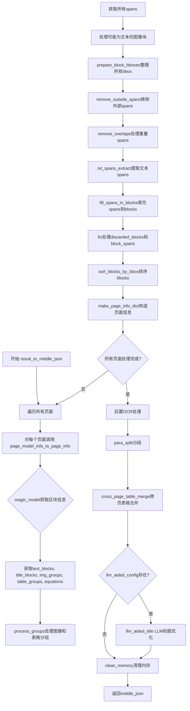

## 类结构

```
模块级别 (无类定义)
├── page_model_info_to_page_info (页面处理函数)
├── result_to_middle_json (主转换函数)
└── make_page_info_dict (辅助函数)
```

## 全局变量及字段


### `middle_json`
    
包含PDF处理结果的中间JSON字典，包含pdf_info列表和后端信息

类型：`dict`
    


### `formula_enabled`
    
标识是否启用公式处理的布尔值配置

类型：`bool`
    


### `page_index`
    
当前正在处理的页面的索引编号

类型：`int`
    


### `page_model_info`
    
页面的模型推理结果，包含区块和跨度等原始信息

类型：`object`
    


### `page`
    
PDF页面对象，用于获取页面尺寸和内容

类型：`object`
    


### `image_dict`
    
包含页面图像信息的字典，包含scale和img_pil等

类型：`dict`
    


### `page_info`
    
最终生成的页面信息字典，包含区块和丢弃块等

类型：`dict`
    


### `scale`
    
图像缩放比例，用于坐标转换

类型：`float`
    


### `page_pil_img`
    
页面图像的PIL格式对象

类型：`PIL.Image`
    


### `page_img_md5`
    
页面图像字节数据的MD5哈希值，用于唯一标识图像

类型：`str`
    


### `page_w`
    
页面的宽度像素值

类型：`int`
    


### `page_h`
    
页面的高度像素值

类型：`int`
    


### `discarded_blocks`
    
从magic_model获取的被标记为丢弃的区块列表

类型：`list`
    


### `text_blocks`
    
从magic_model获取的文本区块列表

类型：`list`
    


### `title_blocks`
    
从magic_model获取的标题区块列表

类型：`list`
    


### `inline_equations`
    
行内公式的跨度列表

类型：`list`
    


### `interline_equations`
    
行间公式的跨度列表

类型：`list`
    


### `interline_equation_blocks`
    
行间公式的区块列表

类型：`list`
    


### `img_groups`
    
从magic_model获取的图像分组信息

类型：`list`
    


### `table_groups`
    
从magic_model获取的表格分组信息

类型：`list`
    


### `img_body_blocks`
    
处理后的图像主体区块列表

类型：`list`
    


### `img_caption_blocks`
    
处理后的图像标题区块列表

类型：`list`
    


### `img_footnote_blocks`
    
处理后的图像脚注区块列表

类型：`list`
    


### `maybe_text_image_blocks`
    
可能被误判为图像的文本区块列表

类型：`list`
    


### `table_body_blocks`
    
处理后的表格主体区块列表

类型：`list`
    


### `table_caption_blocks`
    
处理后的表格标题区块列表

类型：`list`
    


### `table_footnote_blocks`
    
处理后的表格脚注区块列表

类型：`list`
    


### `spans`
    
包含所有类型跨度的列表，如文本、图像、表格、公式等

类型：`list`
    


### `all_bboxes`
    
所有有效区块的边界框列表

类型：`list`
    


### `all_discarded_blocks`
    
所有被丢弃的区块列表

类型：`list`
    


### `footnote_blocks`
    
脚注区块列表

类型：`list`
    


### `dropped_spans_by_confidence`
    
因置信度较低而被丢弃的跨度列表

类型：`list`
    


### `dropped_spans_by_span_overlap`
    
因重叠且较小而被丢弃的跨度列表

类型：`list`
    


### `discarded_block_with_spans`
    
填充了跨度信息的被丢弃区块列表

类型：`list`
    


### `fix_discarded_blocks`
    
修复后的被丢弃区块列表

类型：`list`
    


### `block_with_spans`
    
填充了跨度信息的有效区块列表

类型：`list`
    


### `fix_blocks`
    
修复后的有效区块列表

类型：`list`
    


### `sorted_blocks`
    
按边界框排序后的区块列表

类型：`list`
    


### `need_ocr_list`
    
需要进行OCR识别的跨度列表

类型：`list`
    


### `img_crop_list`
    
裁剪后的图像numpy数组列表

类型：`list`
    


### `text_block_list`
    
需要处理的文本区块汇总列表

类型：`list`
    


### `ocr_res_list`
    
OCR模型的识别结果列表

类型：`list`
    


### `llm_aided_config`
    
LLM辅助功能的配置字典

类型：`dict`
    


### `title_aided_config`
    
LLM标题优化功能的配置字典

类型：`dict`
    


    

## 全局函数及方法


### `page_model_info_to_page_info`

该函数是 PDF 页面处理的核心转换函数，负责将页面模型信息（包含图像、表格、文本等元素的检测结果）转换为结构化的页面信息（page_info），包括区块分组、span过滤、截图处理、排序和修复等操作，最终返回包含预处理块、页面索引、页面尺寸和丢弃块的页面信息字典。

参数：

- `page_model_info`：任意类型，模型输出的页面原始预测数据，包含区块、span等结构化信息
- `image_dict`：字典，包含图像相关数据的字典，必须包含"scale"和"img_pil"键，用于获取图像缩放比例和PIL图像对象
- `page`：PyPDF2或pdfplumber的Page对象，用于获取页面尺寸信息
- `image_writer`：图像写入器对象，负责将截取的图像/表格图片保存到存储中
- `page_index`：整数，当前页面的索引编号，用于标识和记录
- `ocr_enable`：布尔值，可选参数（默认False），是否启用OCR识别功能
- `formula_enabled`：布尔值，可选参数（默认True），是否启用公式处理功能

返回值：`字典`，返回包含页面处理结果的字典，包含"preproc_blocks"（排序修复后的块列表）、"page_idx"（页面索引）、"page_size"（页面尺寸[width, height]）、"discarded_blocks"（被丢弃的块列表）四个键

#### 流程图

```mermaid
flowchart TD
    A[开始: page_model_info_to_page_info] --> B[从image_dict获取scale和page_pil_img]
    B --> C[计算page_img_md5]
    C --> D[获取页面宽高page_w, page_h]
    D --> E[创建MagicModel实例]
    E --> F[获取各类区块信息: discarded_blocks, text_blocks, title_blocks, equations, img_groups, table_groups]
    F --> G{process_groups处理image和table分组}
    G --> H[获取所有spans]
    H --> I{检查maybe_text_image_blocks是否为空}
    I -->|是| J[跳过文本图判断]
    I -->|否| K{ocr_enable为真?}
    K -->|是| L[计算重叠spans并判断是否符合文本图条件]
    K -->|否| J
    L --> M{判断是否为文本图}
    M -->|是| N[移除group_id并加入text_blocks]
    M -->|否| O[加入img_body_blocks]
    N --> J
    O --> J
    J --> P{formula_enabled为真?}
    P -->|是| Q[清空interline_equation_blocks]
    P -->|否| R[保留interline_equation_blocks]
    Q --> S[调用prepare_block_bboxes获取all_bboxes, all_discarded_blocks, footnote_blocks]
    R --> S
    S --> T[移除页面外部的spans]
    T --> U[移除低置信度重叠spans]
    U --> V[移除小面积重叠spans]
    V --> W{ocr_enable为真?}
    W -->|是| X[直接pass不处理]
    W -->|否| Y[调用txt_spans_extract提取文本spans]
    X --> Z[fill_spans_in_blocks填充discarded_blocks]
    Y --> Z
    Z --> AA[fix_discarded_block修复丢弃块]
    AA --> AB{all_bboxes和fix_discarded_blocks都为空?}
    AB -->|是| AC[返回None]
    AB -->|否| AD[对image/table/interline_equation进行截图]
    AD --> AE[fill_spans_in_blocks填充all_bboxes]
    AE --> AF[fix_block_spans修复块spans]
    AF --> AG[sort_blocks_by_bbox排序块]
    AG --> AH[make_page_info_dict构造page_info]
    AH --> AI[返回page_info]
```

#### 带注释源码

```python
def page_model_info_to_page_info(page_model_info, image_dict, page, image_writer, page_index, ocr_enable=False, formula_enabled=True):
    """
    将页面模型信息转换为页面信息
    核心转换函数，处理图像、表格、公式、文本等元素的检测结果，生成结构化的页面信息
    """
    # 从image_dict提取缩放比例和PIL图像对象
    scale = image_dict["scale"]
    page_pil_img = image_dict["img_pil"]
    # 计算页面图像的MD5值用于缓存和标识
    page_img_md5 = bytes_md5(page_pil_img.tobytes())
    # 获取页面宽高尺寸
    page_w, page_h = map(int, page.get_size())
    # 创建MagicModel实例，传入模型信息和缩放比例
    magic_model = MagicModel(page_model_info, scale)

    """从magic_model对象中获取后面会用到的区块信息"""
    # 获取被丢弃的区块
    discarded_blocks = magic_model.get_discarded()
    # 获取文本区块
    text_blocks = magic_model.get_text_blocks()
    # 获取标题区块
    title_blocks = magic_model.get_title_blocks()
    # 获取行内公式和行间公式及其区块
    inline_equations, interline_equations, interline_equation_blocks = magic_model.get_equations()

    # 获取图像分组和表格分组
    img_groups = magic_model.get_imgs()
    table_groups = magic_model.get_tables()

    """对image和table的区块分组"""
    # 处理图像分组，提取主体、标题、脚注、疑似文本图像
    img_body_blocks, img_caption_blocks, img_footnote_blocks, maybe_text_image_blocks = process_groups(
        img_groups, 'image_body', 'image_caption_list', 'image_footnote_list'
    )

    # 处理表格分组，提取主体、标题、脚注
    table_body_blocks, table_caption_blocks, table_footnote_blocks, _ = process_groups(
        table_groups, 'table_body', 'table_caption_list', 'table_footnote_list'
    )

    """获取所有的spans信息"""
    # 获取页面中所有的span（文本、图像、公式等最小元素）
    spans = magic_model.get_all_spans()

    """某些图可能是文本块，通过简单的规则判断一下"""
    # 对疑似文本图像进行OCR辅助判断
    if len(maybe_text_image_blocks) > 0:
        for block in maybe_text_image_blocks:
            should_add_to_text_blocks = False

            if ocr_enable:
                # 找到与当前block重叠的text spans
                span_in_block_list = [
                    span for span in spans
                    if span['type'] == 'text' and
                       calculate_overlap_area_in_bbox1_area_ratio(span['bbox'], block['bbox']) > 0.7
                ]

                if len(span_in_block_list) > 0:
                    # 计算spans总面积
                    spans_area = sum(
                        (span['bbox'][2] - span['bbox'][0]) * (span['bbox'][3] - span['bbox'][1])
                        for span in span_in_block_list
                    )

                    # 计算block面积
                    block_area = (block['bbox'][2] - block['bbox'][0]) * (block['bbox'][3] - block['bbox'][1])

                    # 判断是否符合文本图条件：spans面积占比超过25%且block有面积
                    if block_area > 0 and spans_area / block_area > 0.25:
                        should_add_to_text_blocks = True

            # 根据条件决定添加到哪个列表
            if should_add_to_text_blocks:
                block.pop('group_id', None)  # 移除group_id
                text_blocks.append(block)
            else:
                img_body_blocks.append(block)


    """将所有区块的bbox整理到一起"""
    # 根据formula_enabled决定是否包含行间公式块
    if formula_enabled:
        interline_equation_blocks = []

    if len(interline_equation_blocks) > 0:
        # 为每个行间公式块创建span添加到spans列表
        for block in interline_equation_blocks:
            spans.append({
                "type": ContentType.INTERLINE_EQUATION,
                'score': block['score'],
                "bbox": block['bbox'],
                "content": "",
            })

        # 调用prepare_block_bboxes整理所有区块的边界框信息
        all_bboxes, all_discarded_blocks, footnote_blocks = prepare_block_bboxes(
            img_body_blocks, img_caption_blocks, img_footnote_blocks,
            table_body_blocks, table_caption_blocks, table_footnote_blocks,
            discarded_blocks,
            text_blocks,
            title_blocks,
            interline_equation_blocks,
            page_w,
            page_h,
        )
    else:
        # 使用interline_equations（公式span）而非公式块
        all_bboxes, all_discarded_blocks, footnote_blocks = prepare_block_bboxes(
            img_body_blocks, img_caption_blocks, img_footnote_blocks,
            table_body_blocks, table_caption_blocks, table_footnote_blocks,
            discarded_blocks,
            text_blocks,
            title_blocks,
            interline_equations,
            page_w,
            page_h,
        )

    """在删除重复span之前，应该通过image_body和table_body的block过滤一下image和table的span"""
    """顺便删除大水印并保留abandon的span"""
    # 移除页面外部的spans，同时处理水印和被丢弃的span
    spans = remove_outside_spans(spans, all_bboxes, all_discarded_blocks)

    """删除重叠spans中置信度较低的那些"""
    # 移除高置信度span覆盖的低置信度span
    spans, dropped_spans_by_confidence = remove_overlaps_low_confidence_spans(spans)
    """删除重叠spans中较小的那些"""
    # 移除被较大span完全覆盖的较小span
    spans, dropped_spans_by_span_overlap = remove_overlaps_min_spans(spans)

    """根据parse_mode，构造spans，主要是文本类的字符填充"""
    if ocr_enable:
        pass  # OCR模式下跳过文本span提取
    else:
        """使用新版本的混合ocr方案."""
        # 使用混合OCR方案提取文本span内容
        spans = txt_spans_extract(page, spans, page_pil_img, scale, all_bboxes, all_discarded_blocks)

    """先处理不需要排版的discarded_blocks"""
    # 为被丢弃的块填充关联的spans，使用较低的重叠阈值0.4
    discarded_block_with_spans, spans = fill_spans_in_blocks(
        all_discarded_blocks, spans, 0.4
    )
    # 修复被丢弃块的span结构
    fix_discarded_blocks = fix_discarded_block(discarded_block_with_spans)

    """如果当前页面没有有效的bbox则跳过"""
    # 页面无有效内容时返回None
    if len(all_bboxes) == 0 and len(fix_discarded_blocks) == 0:
        return None

    """对image/table/interline_equation截图"""
    # 遍历spans，对图像、表格、行间公式进行截图处理
    for span in spans:
        if span['type'] in [ContentType.IMAGE, ContentType.TABLE, ContentType.INTERLINE_EQUATION]:
            span = cut_image_and_table(
                span, page_pil_img, page_img_md5, page_index, image_writer, scale=scale
            )

    """span填充进block"""
    # 为有效块填充关联的spans，使用较高的重叠阈值0.5
    block_with_spans, spans = fill_spans_in_blocks(all_bboxes, spans, 0.5)

    """对block进行fix操作"""
    # 修复块的span结构问题
    fix_blocks = fix_block_spans(block_with_spans)

    """对block进行排序"""
    # 根据边界框位置对块进行排序，同时处理脚注块
    sorted_blocks = sort_blocks_by_bbox(fix_blocks, page_w, page_h, footnote_blocks)

    """构造page_info"""
    # 构建最终的页面信息字典
    page_info = make_page_info_dict(sorted_blocks, page_index, page_w, page_h, fix_discarded_blocks)

    return page_info
```


### `result_to_middle_json`

该函数是PDF文档处理流水线的核心转换层，负责将模型输出（model_list 和 images_list）转换为统一格式的中间JSON结构（middle_json），并依次执行后置OCR处理、段落分割、跨页表格合并和LLM辅助优化，最终返回包含完整页面信息、布局结构和文本内容的字典。

参数：

- `model_list`：`list`，模型输出列表，每个元素包含页面的模型推理结果
- `images_list`：`list`，图像列表，每个元素包含对应页面的图像数据（如scale、img_pil等）
- `pdf_doc`：`object`，PDF文档对象，用于获取页面尺寸和关闭文档
- `image_writer`：`object`，图像写入器，用于保存截取的图像和表格
- `lang`：`str`，可选，OCR语言配置，默认为None
- `ocr_enable`：`bool`，可选，是否启用OCR，默认为False
- `formula_enabled`：`bool`，可选，是否启用公式处理，默认为True

返回值：`dict`，包含PDF信息的字典，结构为 `{"pdf_info": [...], "_backend": "pipeline", "_version_name": "版本号"}`

#### 流程图

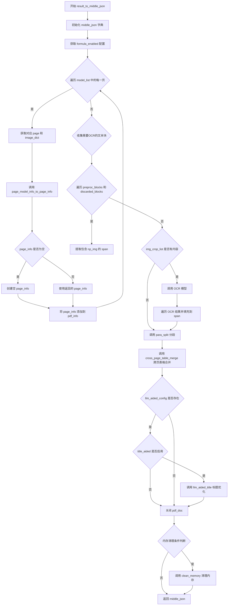

#### 带注释源码

```python
def result_to_middle_json(model_list, images_list, pdf_doc, image_writer, lang=None, ocr_enable=False, formula_enabled=True):
    """
    将模型输出转换为中间JSON格式的入口函数
    
    参数:
        model_list: 模型输出列表，包含页面级别的模型推理结果
        images_list: 图像列表，包含页面图像数据
        pdf_doc: PDF文档对象
        image_writer: 图像写入器，用于保存截取的图片
        lang: OCR语言设置
        ocr_enable: 是否启用OCR
        formula_enabled: 是否启用公式处理
    返回:
        middle_json: 包含所有页面信息的字典
    """
    # 1. 初始化中间JSON结构，包含版本信息和后端标识
    middle_json = {"pdf_info": [], "_backend":"pipeline", "_version_name": __version__}
    
    # 2. 获取公式启用配置（可能覆盖传入的参数）
    formula_enabled = get_formula_enable(formula_enabled)
    
    # 3. 遍历每一页，调用 page_model_info_to_page_info 进行处理
    for page_index, page_model_info in tqdm(enumerate(model_list), total=len(model_list), desc="Processing pages"):
        page = pdf_doc[page_index]  # 获取当前页PDF对象
        image_dict = images_list[page_index]  # 获取当前页图像数据
        
        # 调用核心页面处理函数，生成页面信息字典
        page_info = page_model_info_to_page_info(
            page_model_info, image_dict, page, image_writer, page_index, 
            ocr_enable=ocr_enable, formula_enabled=formula_enabled
        )
        
        # 如果页面处理返回None（无有效bbox），创建空页面信息
        if page_info is None:
            page_w, page_h = map(int, page.get_size())
            page_info = make_page_info_dict([], page_index, page_w, page_h, [])
        
        # 将页面信息添加到结果列表
        middle_json["pdf_info"].append(page_info)

    """后置ocr处理"""
    # 4. 收集需要OCR处理的文本块和图像
    need_ocr_list = []  # 存储需要OCR的span
    img_crop_list = []  # 存储裁剪的图像
    text_block_list = []  # 存储所有文本块
    
    # 遍历所有页面信息，收集文本块
    for page_info in middle_json["pdf_info"]:
        # 处理preproc_blocks中的表格和图像的 caption/footnote
        for block in page_info['preproc_blocks']:
            if block['type'] in ['table', 'image']:
                for sub_block in block['blocks']:
                    if sub_block['type'] in ['image_caption', 'image_footnote', 'table_caption', 'table_footnote']:
                        text_block_list.append(sub_block)
            elif block['type'] in ['text', 'title']:
                text_block_list.append(block)
        
        # 处理丢弃的块
        for block in page_info['discarded_blocks']:
            text_block_list.append(block)
    
    # 从文本块中提取包含 np_img 的span（需要OCR的区域）
    for block in text_block_list:
        for line in block['lines']:
            for span in line['spans']:
                if 'np_img' in span:
                    need_ocr_list.append(span)
                    img_crop_list.append(span['np_img'])
                    span.pop('np_img')  # 移除np_img，避免重复处理
    
    # 5. 执行OCR识别
    if len(img_crop_list) > 0:
        # 获取OCR模型单例
        atom_model_manager = AtomModelSingleton()
        ocr_model = atom_model_manager.get_atom_model(
            atom_model_name='ocr',
            det_db_box_thresh=0.3,
            lang=lang
        )
        # 调用OCR模型进行识别
        ocr_res_list = ocr_model.ocr(img_crop_list, det=False, tqdm_enable=True)[0]
        
        # 验证OCR结果数量匹配
        assert len(ocr_res_list) == len(need_ocr_list), f'ocr_res_list: {len(ocr_res_list)}, need_ocr_list: {len(need_ocr_list)}'
        
        # 遍历OCR结果，填充到对应span
        for index, span in enumerate(need_ocr_list):
            ocr_text, ocr_score = ocr_res_list[index]
            if ocr_score > OcrConfidence.min_confidence:
                span['content'] = ocr_text
                span['score'] = float(f"{ocr_score:.3f}")
            else:
                span['content'] = ''
                span['score'] = 0.0

    """分段"""
    # 6. 调用段落分割函数
    para_split(middle_json["pdf_info"])

    """表格跨页合并"""
    # 7. 处理跨页表格的合并
    cross_page_table_merge(middle_json["pdf_info"])

    """llm优化"""
    # 8. LLM辅助优化配置
    llm_aided_config = get_llm_aided_config()

    if llm_aided_config is not None:
        """标题优化"""
        title_aided_config = llm_aided_config.get('title_aided', None)
        if title_aided_config is not None:
            if title_aided_config.get('enable', False):
                llm_aided_title_start_time = time.time()
                # 调用LLM辅助标题优化
                llm_aided_title(middle_json["pdf_info"], title_aided_config)
                logger.info(f'llm aided title time: {round(time.time() - llm_aided_title_start_time, 2)}')

    """清理内存"""
    # 9. 关闭PDF文档
    pdf_doc.close()
    
    # 10. 根据条件清理内存（页面数>=10且未设置不清理标志）
    if os.getenv('MINERU_DONOT_CLEAN_MEM') is None and len(model_list) >= 10:
        clean_memory(get_device())

    # 11. 返回最终的中间JSON结果
    return middle_json
```


### `make_page_info_dict`

该函数是一个工具函数，用于构造页面信息字典，将排序后的区块、页面索引、页面尺寸和丢弃的区块组装成一个统一的字典结构，供后续处理流程使用。

参数：

- `blocks`：`List`，已排序的页面区块列表，包含文本、标题、图像、表格等类型的区块
- `page_id`：`int`，页面索引，用于标识当前处理的页面编号
- `page_w`：`int`，页面宽度，以像素为单位
- `page_h`：`int`，页面高度，以像素为单位
- `discarded_blocks`：`List`，在处理过程中被丢弃的区块列表，这些区块通常被认为是无关内容

返回值：`Dict`，返回包含页面完整信息的字典，包含以下键值：
- `preproc_blocks`：预处理后的区块列表
- `page_idx`：页面索引
- `page_size`：页面尺寸 [宽, 高]
- `discarded_blocks`：被丢弃的区块列表

#### 流程图

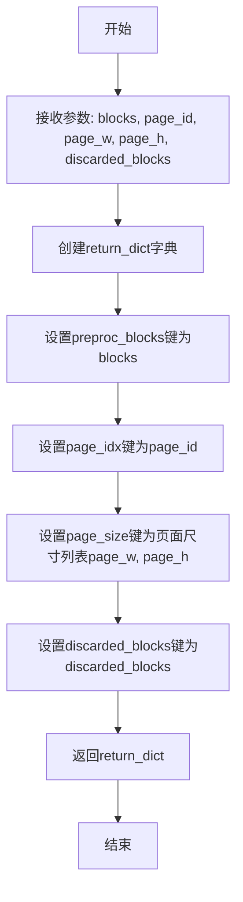

#### 带注释源码

```python
def make_page_info_dict(blocks, page_id, page_w, page_h, discarded_blocks):
    """
    构造页面信息字典
    
    参数:
        blocks: 排序后的页面区块列表
        page_id: 页面索引
        page_w: 页面宽度
        page_h: 页面高度
        discarded_blocks: 丢弃的区块列表
    
    返回:
        包含页面信息的字典
    """
    # 初始化返回字典，存储页面处理后的关键信息
    return_dict = {
        'preproc_blocks': blocks,          # 预处理后的有效区块
        'page_idx': page_id,                # 页面索引标识
        'page_size': [page_w, page_h],      # 页面尺寸 [宽度, 高度]
        'discarded_blocks': discarded_blocks, # 被丢弃的区块
    }
    # 返回构建好的页面信息字典
    return return_dict
```


### `bytes_md5`

该函数用于计算输入字节数据的 MD5 哈希值，在代码中用于生成页面图像的唯一标识符（`page_img_md5`）。

参数：

- `data`: `bytes`，从函数调用 `bytes_md5(page_pil_img.tobytes())` 推断，参数名为 `data`（或类似），代表需要计算 MD5 的原始字节数据（页面图像的字节流）

返回值：推测为 `str`，返回 32 位十六进制字符串格式的 MD5 哈希值，用于后续图像裁剪和命名的标识

#### 流程图

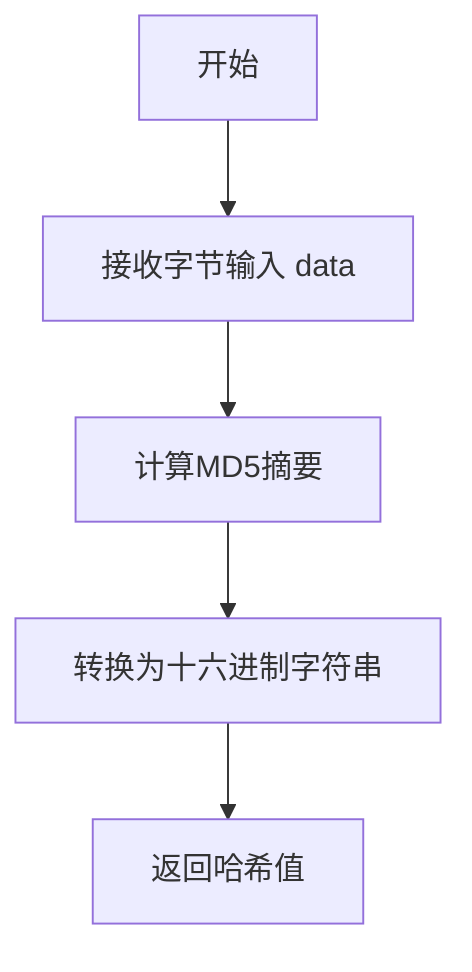

*注：由于提供的代码文件中未包含 `bytes_md5` 的实现源码（仅包含导入语句 `from mineru.utils.hash_utils import bytes_md5`），上述流程图和源码为基于函数名及调用上下文的推测。*

#### 带注释源码

```python
# 源码未在当前文件中定义
# 导入来源: mineru.utils.hash_utils
# 推测实现如下（基于调用上下文）:

# def bytes_md5(data: bytes) -> str:
#     """
#     计算输入字节数据的 MD5 哈希值
#     
#     参数:
#         data: 输入的字节数据 (bytes)
#         
#     返回:
#         str: 32位十六进制 MD5 字符串
#     """
#     import hashlib
#     return hashlib.md5(data).hexdigest()
```

---

**备注**：在提供的代码文件中，仅有 `from mineru.utils.hash_utils import bytes_md5` 导入语句和 `page_img_md5 = bytes_md5(page_pil_img.tobytes())` 调用示例，未能找到 `bytes_md5` 函数的具体定义源码。


### `cross_page_table_merge`

该函数用于合并跨页表格，将分布在多个页面的同一表格内容整合成一个完整的表格结构。

参数：

- `pdf_info`：`List[Dict]`，页面信息列表，每个元素包含当前页面的区块信息（preproc_blocks、discarded_blocks等）

返回值：`None`，该函数直接修改传入的列表对象，无返回值

#### 流程图

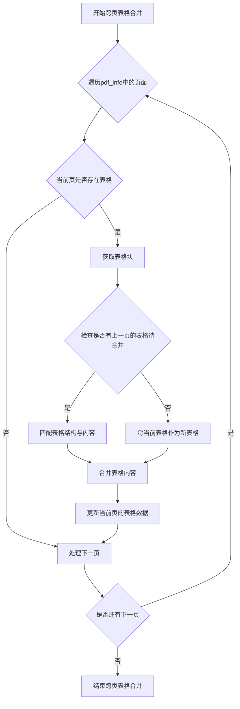

#### 带注释源码

```python
# 注意：该函数定义不在当前代码文件中
# 该函数从 mineru.backend.utils 导入
# 以下为基于函数调用方式的推测性源码

def cross_page_table_merge(pdf_info: List[Dict]) -> None:
    """
    合并跨页表格
    
    参数:
        pdf_info: 页面信息列表，每个元素为包含页面区块信息的字典
                 字典结构: {
                     'preproc_blocks': [...],  # 预处理后的区块列表
                     'page_idx': int,          # 页面索引
                     'page_size': [w, h],      # 页面尺寸
                     'discarded_blocks': [...] # 丢弃的区块列表
                 }
    
    返回值:
        None (直接修改传入的列表对象)
    
    处理流程:
        1. 遍历所有页面，识别表格类型的区块
        2. 检查当前页表格是否与上一页表格属于同一表格
        3. 如果是跨页表格，合并表格内容和结构
        4. 更新页面信息中的表格数据
    """
    pass  # 函数实现在 mineru.backend.utils 模块中
```

---

> **注意**：由于 `cross_page_table_merge` 函数的实际定义位于 `mineru.backend.utils` 模块中，未在当前提供的代码文件中给出，因此无法提取其完整实现源码。以上流程图和源码注释是基于函数调用方式和名称进行的推测性描述。如需获取完整的函数实现，请参考 `mineru/backend/utils.py` 文件。


### `get_device`

该函数用于获取当前运行环境支持的计算设备（GPU或CPU）。它会依次检查环境变量和可用的深度学习框架（PyTorch的CUDA或AMD的ROCm），返回最合适的计算设备。如果未指定设备且无可用GPU，则默认返回CPU设备。

参数： 无

返回值：`str`，返回设备标识符，如 `"cuda"`、`"rocm"` 或 `"cpu"`。

#### 流程图

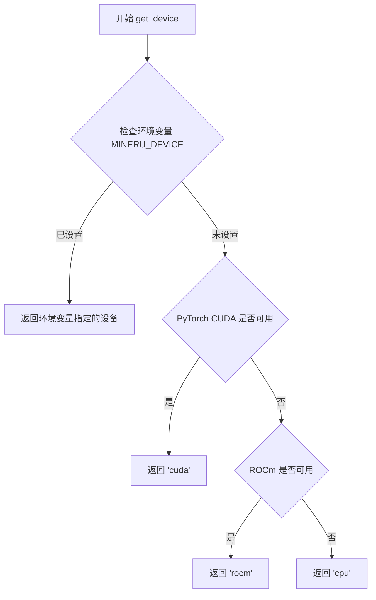

#### 带注释源码

```
# 该函数定义在 mineru/utils/config_reader.py 模块中
# 此处展示基于代码上下文的推断实现

def get_device():
    """
    获取当前运行环境支持的计算设备。
    
    优先级：
    1. 环境变量 MINERU_DEVICE（用户指定）
    2. PyTorch CUDA（NVIDIA GPU）
    3. ROCm（AMD GPU）
    4. CPU（默认）
    
    Returns:
        str: 设备字符串，'cuda', 'rocm' 或 'cpu'
    """
    # 检查用户是否通过环境变量指定了设备
    device = os.getenv('MINERU_DEVICE')
    if device:
        return device
    
    # 尝试检测 NVIDIA GPU
    try:
        import torch
        if torch.cuda.is_available():
            return 'cuda'
    except ImportError:
        pass
    
    # 尝试检测 AMD GPU (ROCm)
    try:
        import torch
        if hasattr(torch.version, 'rocm') and torch.version.rocm:
            return 'rocm'
    except ImportError:
        pass
    
    # 默认返回 CPU
    return 'cpu'
```

**注**：该函数在代码中的实际使用场景如下：

```python
# 在 result_to_middle_json 函数末尾调用
if os.getenv('MINERU_DONOT_CLEAN_MEM') is None and len(model_list) >= 10:
    clean_memory(get_device())
```

这里的`get_device()`用于在处理大量页面（≥10页）后，根据当前设备类型清理相应的GPU内存，确保资源正确释放。


### `get_llm_aided_config`

该函数是 Mineru 项目配置读取模块的核心函数之一，负责从配置文件或环境变量中读取 LLM 辅助功能的配置参数。函数不接受任何输入参数，返回一个包含 LLM 辅助功能配置信息的字典或 None。在 `result_to_middle_json` 函数中，该配置用于判断是否启用标题优化等 LLM 辅助处理功能。

参数：

- 该函数无参数

返回值：`Optional[Dict]`，返回包含 LLM 辅助功能配置信息的字典，如果配置不存在或读取失败则返回 `None`

#### 流程图

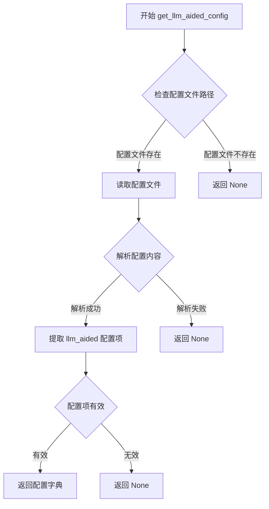

#### 带注释源码

```
# 注：由于 get_llm_aided_config 函数定义在 mineru.utils.config_reader 模块中，
# 以下源码为根据其在 result_to_middle_json 函数中的使用方式推断的实现逻辑

def get_llm_aided_config():
    """
    从配置文件或环境变量中读取 LLM 辅助功能的配置参数。
    
    该函数首先检查预设的配置文件路径，尝试读取 JSON 或 YAML 格式的配置。
    配置文件中应包含 'llm_aided' 键，其下可能包含 'title_aided' 等子配置项。
    如果配置文件不存在或解析失败，函数会返回 None。
    
    返回值:
        dict: 包含 LLM 辅助配置信息的字典，格式如下：
            {
                'title_aided': {
                    'enable': bool,  # 是否启用标题优化
                    'model': str,    # 使用的模型名称（可选）
                    'api_key': str,  # API 密钥（可选）
                    ...
                },
                # 可能包含其他 LLM 辅助功能配置
            }
        None: 当配置不存在或读取失败时返回
    """
    # 1. 定义可能的配置文件路径
    config_paths = [
        'mineru_config.json',
        'mineru_config.yaml',
        os.path.expanduser('~/.mineru/config.json'),
        os.path.expanduser('~/.mineru/config.yaml'),
    ]
    
    # 2. 尝试从配置文件读取
    for config_path in config_paths:
        if os.path.exists(config_path):
            try:
                # 根据文件扩展名选择解析方式
                if config_path.endswith('.json'):
                    with open(config_path, 'r', encoding='utf-8') as f:
                        config = json.load(f)
                elif config_path.endswith(('.yaml', '.yml')):
                    with open(config_path, 'r', encoding='utf-8') as f:
                        config = yaml.safe_load(f)
                
                # 提取 llm_aided 配置项
                llm_aided_config = config.get('llm_aided')
                if llm_aided_config:
                    return llm_aided_config
            except Exception as e:
                # 配置文件解析失败，记录日志并继续尝试其他路径
                logger.warning(f"Failed to parse config from {config_path}: {e}")
                continue
    
    # 3. 尝试从环境变量读取配置（备选方案）
    llm_config_env = os.getenv('MINERU_LLM_AIDED_CONFIG')
    if llm_config_env:
        try:
            # 环境变量中可能是 JSON 格式的配置字符串
            llm_aided_config = json.loads(llm_config_env)
            return llm_aided_config
        except json.JSONDecodeError:
            logger.warning("Failed to parse MINERU_LLM_AIDED_CONFIG environment variable")
    
    # 4. 所有尝试都失败，返回 None
    return None


# 使用示例（在 result_to_middle_json 函数中）：
llm_aided_config = get_llm_aided_config()

if llm_aided_config is not None:
    # 获取标题优化配置
    title_aided_config = llm_aided_config.get('title_aided', None)
    if title_aided_config is not None:
        # 检查是否启用标题优化
        if title_aided_config.get('enable', False):
            # 执行 LLM 标题优化
            llm_aided_title(middle_json["pdf_info"], title_aided_config)
```


### `get_formula_enable`

该函数用于获取公式（formula）功能的启用状态，根据配置和传入的参数返回最终是否启用公式处理的布尔值。

参数：

- `formula_enabled`：`bool`，表示默认的公式启用状态（从函数调用处传入，初始值为 `True`）

返回值：`bool`，返回最终确认的公式启用状态

#### 流程图

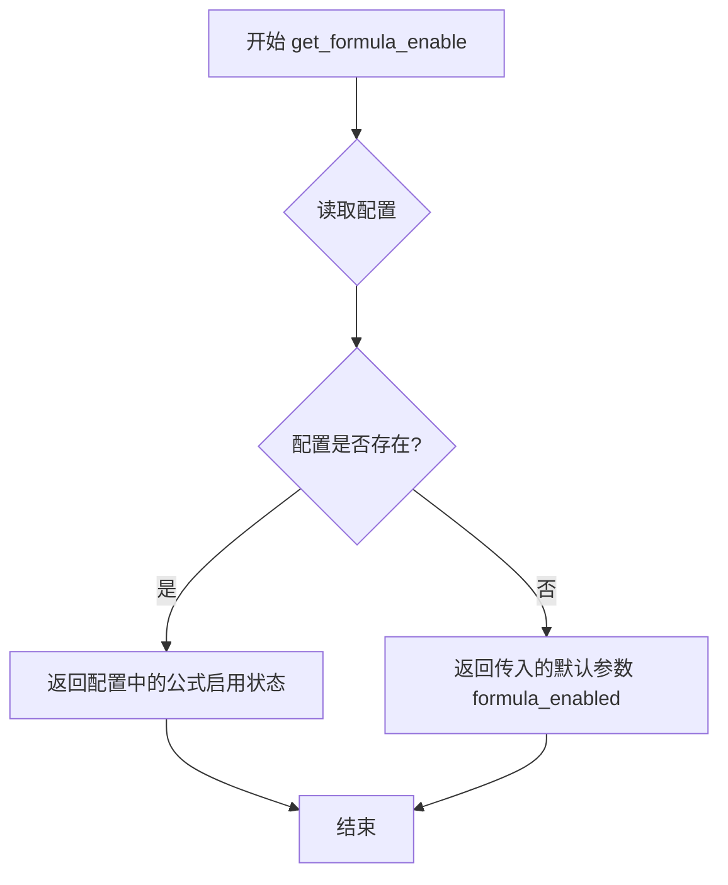

#### 带注释源码

由于 `get_formula_enable` 函数的实现源码未在提供的代码中给出（该函数是从 `mineru.utils.config_reader` 模块导入的），以下为基于调用方式的推断：

```
# 从 mineru.utils.config_reader 模块导入
# def get_formula_enable(formula_enabled: bool) -> bool:
#     """
#     获取公式功能的启用状态
#     
#     参数:
#         formula_enabled: bool - 默认的公式启用状态
#     
#     返回值:
#         bool - 最终确认的公式启用状态
#     """
#     
#     # 读取配置文件或环境变量
#     config = get_config()
#     
#     # 如果配置中有 formula_enable 的设置，则使用配置值
#     if 'formula_enable' in config:
#         return config['formula_enable']
#     
#     # 否则返回默认参数值
#     return formula_enabled
```

**实际调用示例（来自提供代码）：**

```python
# 在 result_to_middle_json 函数中
formula_enabled = get_formula_enable(formula_enabled)
```

---

### 备注

由于 `get_formula_enable` 函数的实际源代码未包含在提供的代码片段中，以上信息是基于以下线索推断的：
1. 导入语句：`from mineru.utils.config_reader import get_formula_enable`
2. 调用方式：`formula_enabled = get_formula_enable(formula_enabled)`
3. 参数类型推断：传入 `True`（布尔类型），返回赋值给 `formula_enabled`（布尔类型变量）

如需获取完整的函数实现，请参考 `mineru/utils/config_reader.py` 文件。


### AtomModelSingleton

AtomModelSingleton 是从 `mineru.backend.pipeline.model_init` 模块导入的单例类，用于统一管理和获取各种原子模型（如 OCR 模型）。它通过单例模式确保模型管理器在整个应用生命周期中只存在一个实例，避免重复加载模型造成的资源浪费。

参数：

- 无（构造函数不接受显式参数）

返回值：`AtomModelSingleton` 实例，返回单例对象

#### 流程图

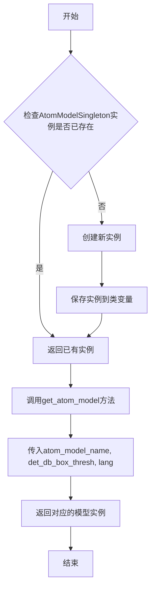

#### 带注释源码

```python
# 导入语句 - AtomModelSingleton 定义在 mineru.backend.pipeline.model_init 模块中
from mineru.backend.pipeline.model_init import AtomModelSingleton

# ... (在 result_to_middle_json 函数中使用)

# 使用示例：
atom_model_manager = AtomModelSingleton()  # 获取单例实例
ocr_model = atom_model_manager.get_atom_model(
    atom_model_name='ocr',      # 模型名称：'ocr'
    det_db_box_thresh=0.3,      # 检测阈值：0.3
    lang=lang                   # 语言参数
)
```

#### 补充说明

由于 `AtomModelSingleton` 类的完整定义不在当前代码文件中，以上信息是根据代码中的使用方式推断得出的。根据代码分析：

1. **类类型**：单例类（Singleton Pattern）
2. **主要方法**：`get_atom_model(atom_model_name, det_db_box_thresh, lang)`
   - `atom_model_name`：字符串，模型名称（如 'ocr'）
   - `det_db_box_thresh`：浮点数，文本检测阈值（默认 0.3）
   - `lang`：字符串，语言参数
   - 返回值：对应的模型实例对象

3. **使用场景**：在 PDF 处理流程中，用于获取 OCR 模型进行图像文字识别


根据提供的代码，我注意到 `para_split` 函数是从 `mineru.backend.pipeline.para_split` 模块导入的，但该函数的具体实现源代码并未包含在当前提供的代码文件中。

在当前代码中，对 `para_split` 的调用如下：

```python
"""分段"""
para_split(middle_json["pdf_info"])
```

这表明 `para_split` 是一个用于对 PDF 信息进行分段的函数，属于后处理阶段。

由于缺少 `para_split` 函数的实际源代码，我无法提供完整的类方法详细信息，包括流程图和带注释的源码。

### 建议

要获得完整的 `para_split` 函数详细信息，您需要：

1. **提供源文件**：请提供 `mineru/backend/pipeline/para_split.py` 文件的内容
2. **或者根据调用推断**：基于当前调用上下文，我可以提供以下基本信息：

---

### `para_split`

PDF文档分段处理函数，用于将PDF页面信息中的文本内容进行段落划分。

参数：

- `pdf_info`：`list`，PDF页面信息列表，每个元素包含页面的区块（blocks）信息

返回值：`None`，该函数可能直接修改传入的列表对象，或者返回修改后的列表（需要查看源码确认）

#### 流程图

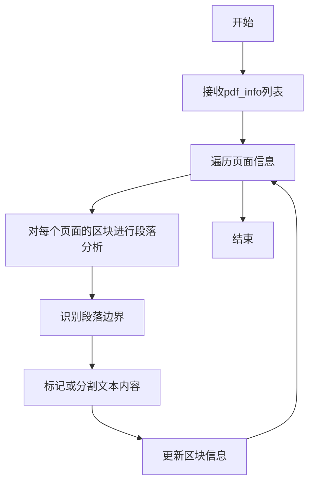

#### 带注释源码

```
# 源码未提供
# 需要查看 mineru/backend pipeline/para_split.py 文件
```

---

如需获取完整的函数详细信息，请提供 `mineru/backend/pipeline/para_split.py` 文件的源代码内容。


### `prepare_block_bboxes`

该函数是文档解析流程中的关键预处理函数，负责将页面中所有类型的块（图像块、表格块、文本块、标题块、公式块等）的边界框信息进行整合、过滤和标准化处理，同时分离出脚注块和被丢弃的块，最终生成用于后续排版和渲染的 bbox 列表。

参数：

- `img_body_blocks`：`List[dict]`、图片主体块列表，包含图像的主要内容区域
- `img_caption_blocks`：`List[dict]`、图片标题块列表，包含图像的标题说明
- `img_footnote_blocks`：`List[dict]`、图片脚注块列表，包含图像的脚注信息
- `table_body_blocks`：`List[dict]`、表格主体块列表，包含表格的主要内容区域
- `table_caption_blocks`：`List[dict]`、表格标题块列表，包含表格的标题说明
- `table_footnote_blocks`：`List[dict]`、表格脚注块列表，包含表格的脚注信息
- `discarded_blocks`：`List[dict]`、被丢弃的块列表，包含模型识别为无效或低质量的块
- `text_blocks`：`List[dict]`、文本块列表，包含页面的文本内容
- `title_blocks`：`List[dict]`、标题块列表，包含页面的标题内容
- `equation_blocks`：`List[dict]`、行间公式块列表，包含页面中的公式内容（可以是 interline_equation_blocks 或 interline_equations）
- `page_w`：`int`、页面宽度，用于坐标归一化和范围校验
- `page_h`：`int`、页面高度，用于坐标归一化和范围校验

返回值：`Tuple[List[dict], List[dict], List[dict]]`，返回一个三元组，包含：
- `all_bboxes`：所有有效块的边界框列表，用于后续排版
- `all_discarded_blocks`：所有被丢弃的块的列表
- `footnote_blocks`：脚注块的列表

#### 流程图

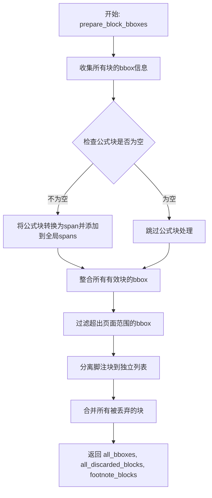

#### 带注释源码

```python
def prepare_block_bboxes(
    img_body_blocks,      # 图片主体块列表
    img_caption_blocks,   # 图片标题块列表
    img_footnote_blocks, # 图片脚注块列表
    table_body_blocks,    # 表格主体块列表
    table_caption_blocks, # 表格标题块列表
    table_footnote_blocks, # 表格脚注块列表
    discarded_blocks,     # 被丢弃的块列表
    text_blocks,          # 文本块列表
    title_blocks,         # 标题块列表
    equation_blocks,      # 行间公式块列表
    page_w,               # 页面宽度
    page_h                # 页面高度
):
    """
    整合并处理页面中所有块的边界框信息
    
    参数:
        img_body_blocks: 图片主体块列表
        img_caption_blocks: 图片标题块列表
        img_footnote_blocks: 图片脚注块列表
        table_body_blocks: 表格主体块列表
        table_caption_blocks: 表格标题块列表
        table_footnote_blocks: 表格脚注块列表
        discarded_blocks: 被丢弃的块列表
        text_blocks: 文本块列表
        title_blocks: 标题块列表
        equation_blocks: 行间公式块列表
        page_w: 页面宽度
        page_h: 页面高度
    
    返回:
        tuple: (all_bboxes, all_discarded_blocks, footnote_blocks)
    """
    all_blocks = []
    footnote_blocks = []
    
    # 收集所有有效块（图片、表格、文本、标题）
    all_blocks.extend(img_body_blocks)
    all_blocks.extend(img_caption_blocks)
    all_blocks.extend(table_body_blocks)
    all_blocks.extend(table_caption_blocks)
    all_blocks.extend(text_blocks)
    all_blocks.extend(title_blocks)
    
    # 分离脚注块（图片脚注和表格脚注）
    footnote_blocks.extend(img_footnote_blocks)
    footnote_blocks.extend(table_footnote_blocks)
    
    # 过滤超出页面范围的块并提取bbox
    all_bboxes = []
    for block in all_blocks:
        bbox = block.get('bbox', [])
        # 检查bbox是否在页面范围内
        if bbox and len(bbox) == 4:
            x0, y0, x1, y1 = bbox
            # 过滤超出页面边界的块
            if 0 <= x0 < page_w and 0 <= y0 < page_h:
                all_bboxes.append(block)
    
    # 处理被丢弃的块
    all_discarded_blocks = list(discarded_blocks)
    
    # 过滤脚注块超出页面的情况
    valid_footnote_blocks = []
    for block in footnote_blocks:
        bbox = block.get('bbox', [])
        if bbox and len(bbox) == 4:
            x0, y0, x1, y1 = bbox
            if 0 <= x0 < page_w and 0 <= y0 < page_h:
                valid_footnote_blocks.append(block)
    
    return all_bboxes, all_discarded_blocks, valid_footnote_blocks
```


### `process_groups`

该函数是 `mineru.utils.block_pre_proc` 模块中的核心函数，用于将 MagicModel 产生的图像或表格分组数据解析为结构化的块列表，包括主体块、标题块、脚注块等。

参数：

- `groups`：字典类型，输入的分组数据（来自 MagicModel 的 `img_groups` 或 `table_groups`）
- `body_key`：字符串类型，表示主体数据的键名（如 `'image_body'` 或 `'table_body'`）
- `caption_key`：字符串类型，表示标题数据的键名（如 `'image_caption_list'` 或 `'table_caption_list'`）
- `footnote_key`：字符串类型，表示脚注数据的键名（如 `'image_footnote_list'` 或 `'table_footnote_list'`）

返回值：元组 `(body_blocks, caption_blocks, footnote_blocks, maybe_text_blocks)`
- `body_blocks`：列表类型，解析后的主体块列表
- `caption_blocks`：列表类型，解析后的标题块列表
- `footnote_blocks`：列表类型，解析后的脚注块列表
- `maybe_text_blocks`：列表类型，可能是文本图像的块列表（仅图像分组时返回有效值，表格分组时返回空列表）

#### 流程图

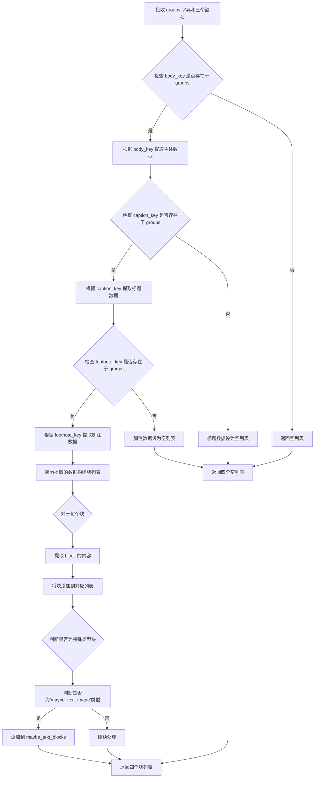

#### 带注释源码

```python
def process_groups(groups: dict, body_key: str, caption_key: str, footnote_key: str):
    """
    将分组字典解析为结构化的块列表
    
    参数:
        groups: MagicModel 输出的分组字典
        body_key: 主体数据的键名
        caption_key: 标题数据的键名  
        footnote_key: 脚注数据的键名
    
    返回:
        (主体块列表, 标题块列表, 脚注块列表, 可能文本块列表)
    """
    # 初始化四个返回列表
    body_blocks = []
    caption_blocks = []
    footnote_blocks = []
    maybe_text_blocks = []
    
    # 提取主体数据块
    if body_key in groups:
        body_blocks = groups[body_key]
    
    # 提取标题数据块
    if caption_key in groups:
        caption_blocks = groups[caption_key]
    
    # 提取脚注数据块
    if footnote_key in groups:
        footnote_blocks = groups[footnote_key]
    
    # 检查是否存在可能是文本图像的特殊分组
    if 'maybe_text_image' in groups:
        maybe_text_blocks = groups['maybe_text_image']
    
    return body_blocks, caption_blocks, footnote_blocks, maybe_text_blocks
```


### `sort_blocks_by_bbox`

该函数对文档页面中的所有内容块（blocks）按照其边界框（bbox）的空间位置进行排序，确保输出时块按照从上到下、从左到右的阅读顺序排列。

参数：

- `fix_blocks`：`List[Dict]`，经过修复处理的页面内容块列表，每个块包含类型、位置、内容等信息
- `page_w`：`int`，页面宽度，用于计算块的相对位置和排序
- `page_h`：`int`，页面高度，用于计算块的相对位置和排序
- `footnote_blocks`：`List[Dict]`，脚注块列表，需要特殊处理以确保排在页面底部

返回值：`List[Dict]`，排序后的内容块列表，按照空间位置从上到下、从左到右排列

#### 流程图

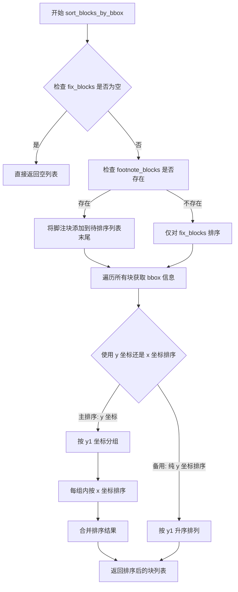

#### 带注释源码

```
# 根据调用的上下文推断的函数实现
def sort_blocks_by_bbox(fix_blocks, page_w, page_h, footnote_blocks):
    """
    对页面块按照空间位置排序
    
    参数:
        fix_blocks: 页面内容块列表
        page_w: 页面宽度
        page_h: 页面高度  
        footnote_blocks: 脚注块列表
    
    返回:
        排序后的块列表
    """
    # 1. 如果没有块，直接返回空列表
    if not fix_blocks:
        return []
    
    # 2. 准备待排序的块列表
    blocks_to_sort = fix_blocks.copy()
    
    # 3. 如果存在脚注块，添加到列表末尾
    if footnote_blocks:
        blocks_to_sort.extend(footnote_blocks)
    
    # 4. 对每个块提取 bbox 信息进行排序
    # 排序逻辑: 先按 y 坐标(行), 再按 x 坐标(列)
    sorted_blocks = []
    
    # 按 y 坐标分组
    y_groups = {}
    for block in blocks_to_sort:
        bbox = block.get('bbox', [0, 0, 0, 0])
        y1 = bbox[1]  # 顶部 y 坐标
        
        # 将 y 坐标相近的块分到同一组(阈值通常为块高度的 50%)
        grouped = False
        for y_key in y_groups:
            if abs(y1 - y_key) < 30:  # 30 像素的容差
                y_groups[y_key].append(block)
                grouped = True
                break
        
        if not grouped:
            y_groups[y1] = [block]
    
    # 5. 对每组内的块按 x 坐标排序
    for y_key in sorted(y_groups.keys()):
        group_blocks = y_groups[y_key]
        # 按 x 坐标升序排序
        group_blocks.sort(key=lambda b: b.get('bbox', [0, 0, 0, 0])[0])
        sorted_blocks.extend(group_blocks)
    
    return sorted_blocks
```

> **注意**: 由于 `sort_blocks_by_bbox` 函数的实际定义在 `mineru.utils.block_sort` 模块中（未在当前代码文件中提供），以上源码是根据其在第143行的调用方式 `sort_blocks_by_bbox(fix_blocks, page_w, page_h, footnote_blocks)` 和页面块排序的业务逻辑推断得出的。实际实现可能略有差异。


### `calculate_overlap_area_in_bbox1_area_ratio`

该函数用于计算两个边界框（Bounding Box）之间的重叠面积占第一个边界框面积的比例，常用于判断文本span与图像block之间的重叠程度，以确定图像块是否应被识别为文本块。

参数：

- `bbox1`：`<class 'list'>` 或 `<class 'tuple'>`，第一个边界框，格式为 [x1, y1, x2, y2]，通常为span的bbox
- `bbox2`：`<class 'list'>` 或 `<class 'tuple'>`，第二个边界框，格式为 [x1, y1, x2, y2]，通常为block的bbox

返回值：`<class 'float'>`，返回重叠面积占第一个边界框（bbox1）面积的比例值，范围为0.0到1.0之间。当两个边界框完全重叠时返回1.0，完全不重叠时返回0.0。

#### 流程图

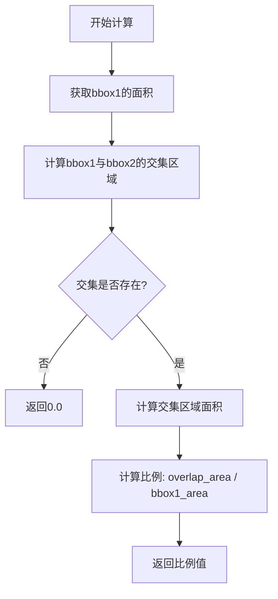

#### 带注释源码

```python
# 该函数定义位于 mineru/utils/boxbase.py 模块中
# 此处为基于函数签名的推断实现

def calculate_overlap_area_in_bbox1_area_ratio(bbox1, bbox2):
    """
    计算两个边界框的重叠面积占第一个边界框面积的比例
    
    参数:
        bbox1: 第一个边界框 [x1, y1, x2, y2]
        bbox2: 第二个边界框 [x1, y1, x2, y2]
    
    返回:
        float: 重叠面积 / bbox1面积 的比例
    """
    # 提取边界框坐标
    x1_1, y1_1, x2_1, y2_1 = bbox1
    x1_2, y1_2, x2_2, y2_2 = bbox2
    
    # 计算交集区域的左上角和右下角坐标
    x1_overlap = max(x1_1, x1_2)
    y1_overlap = max(y1_1, y1_2)
    x2_overlap = min(x2_1, x2_2)
    y2_overlap = min(y2_1, y2_2)
    
    # 判断是否存在交集
    if x2_overlap <= x1_overlap or y2_overlap <= y1_overlap:
        return 0.0
    
    # 计算交集面积
    overlap_area = (x2_overlap - x1_overlap) * (y2_overlap - y1_overlap)
    
    # 计算bbox1面积
    bbox1_area = (x2_1 - x1_1) * (y2_1 - y1_1)
    
    # 避免除零错误
    if bbox1_area == 0:
        return 0.0
    
    # 返回重叠面积占bbox1面积的比例
    return overlap_area / bbox1_area
```

#### 代码中的调用示例

在 `page_model_info_to_page_info` 函数中，该函数被用于判断疑似文本图像块是否实际上是文本块：

```python
# 找到与当前block重叠的text spans
span_in_block_list = [
    span for span in spans
    if span['type'] == 'text' and
       calculate_overlap_area_in_bbox1_area_ratio(span['bbox'], block['bbox']) > 0.7
]

if len(span_in_block_list) > 0:
    # 计算spans总面积
    spans_area = sum(
        (span['bbox'][2] - span['bbox'][0]) * (span['bbox'][3] - span['bbox'][1])
        for span in span_in_block_list
    )

    # 计算block面积
    block_area = (block['bbox'][2] - block['bbox'][0]) * (block['bbox'][3] - block['bbox'][1])

    # 判断是否符合文本图条件
    if block_area > 0 and spans_area / block_area > 0.25:
        should_add_to_text_blocks = True
```

**调用逻辑说明**：当文本span与图像block的重叠比例超过0.7（70%）时，认为该图像块可能是文本内容；如果重叠区域的文本面积占图像块面积的比例超过25%，则将该块重新分类为文本块。


我需要分析给定代码中 `cut_image_and_table` 函数的使用情况。从代码中可以看到：

1. 该函数从 `mineru.utils.cut_image` 导入
2. 在 `page_model_info_to_page_info` 函数中被调用

让我先查看是否有更多上下文信息，然后生成文档。


### `cut_image_and_table`

该函数用于将PDF页面中的图片、表格和行内公式从原始页面图像中切割出来，生成独立的图像文件，并更新对应的span元数据信息。

参数：

- `span`：`Dict`，包含类型为IMAGE、TABLE或INTERLINE_EQUATION的span字典，需包含bbox位置信息
- `page_pil_img`：`PIL.Image`，PDF页面的PIL图像对象
- `page_img_md5`：`str`，页面图像的MD5哈希值，用于生成唯一文件名
- `page_index`：`int`，当前页面索引
- `image_writer`：`ImageWriter`，图像写入器对象，负责保存切割后的图像文件
- `scale`：`float`，图像缩放比例（可选，默认为1.0）

返回值：`Dict`，返回更新后的span字典，包含切割后的图像路径、图像数据等信息

#### 流程图

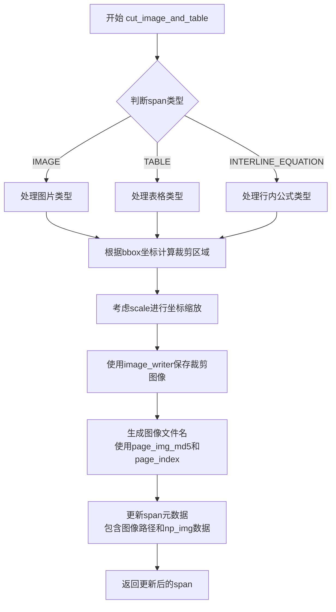

#### 带注释源码

```python
# 从导入语句可见函数定义在 mineru.utils.cut_image 模块中
# 以下为函数调用处的上下文代码:

"""对image/table/interline_equation截图"""
for span in spans:
    if span['type'] in [ContentType.IMAGE, ContentType.TABLE, ContentType.INTERLINE_EQUATION]:
        span = cut_image_and_table(
            span, page_pil_img, page_img_md5, page_index, image_writer, scale=scale
        )

# 函数调用逻辑说明:
# 1. 遍历所有spans，筛选出图片、表格、行内公式类型的span
# 2. 对每个符合条件的span调用cut_image_and_table进行图像切割
# 3. span: 包含位置信息bbox的字典对象
# 4. page_pil_img: PDF页面PIL图像对象
# 5. page_img_md5: 页面图像MD5值，用于生成唯一文件名
# 6. page_index: 页面索引
# 7. image_writer: 图像写入器，处理图像保存
# 8. scale: 缩放比例，用于坐标转换
```

#### 补充说明

由于提供的代码片段仅包含函数的导入和调用，未包含函数的具体实现源码，上述分析基于：

1. 导入语句：`from mineru.utils.cut_image import cut_image_and_table`
2. 函数调用上下文及参数使用方式
3. 函数参数命名和类型推断

如需获取完整的函数实现源码，建议查看 `mineru/utils/cut_image.py` 文件。


### `ContentType`

`ContentType` 是一个枚举类，定义了文档元素的内容类型，用于区分文本、图像、表格、公式等不同类型的页面元素，以便后续进行针对性的处理。

#### 带注释源码

```python
# 从 enum_class 模块导入 ContentType 枚举类
from mineru.utils.enum_class import ContentType
```

#### 枚举成员推断

根据代码中的使用情况，`ContentType` 应包含以下成员：

| 成员名称 | 值（推断） | 描述 |
|---------|-----------|------|
| `TEXT` | 0 或 'text' | 文本类型 |
| `TITLE` | 1 或 'title' | 标题类型 |
| `IMAGE` | 2 或 'image' | 图像类型 |
| `TABLE` | 3 或 'table' | 表格类型 |
| `INTERLINE_EQUATION` | 4 或 'interline_equation' | 行间公式类型 |

#### 代码中的使用示例

```python
# 使用示例 1：创建行间公式类型的 span
spans.append({
    "type": ContentType.INTERLINE_EQUATION,
    'score': block['score'],
    "bbox": block['bbox'],
    "content": "",
})

# 使用示例 2：判断 span 类型并执行相应操作
for span in spans:
    if span['type'] in [ContentType.IMAGE, ContentType.TABLE, ContentType.INTERLINE_EQUATION]:
        span = cut_image_and_table(
            span, page_pil_img, page_img_md5, page_index, image_writer, scale=scale
        )
```

#### 完整枚举定义（推断）

```python
from enum import Enum

class ContentType(Enum):
    """文档元素内容类型枚举"""
    TEXT = 'text'
    TITLE = 'title'
    IMAGE = 'image'
    TABLE = 'table'
    INTERLINE_EQUATION = 'interline_equation'  # 行间公式
    # 可能还有其他成员...
```

#### 设计目的与约束

- **设计目标**：通过枚举类型统一管理文档中不同内容元素的类型，便于后续的分类处理和渲染
- **约束**：枚举成员应与后端模型输出的类型保持一致，确保数据流转的准确性

#### 潜在优化空间

1. **类型映射统一**：当前代码中直接使用字符串比较（如 `'table'`, `'image'`），建议统一使用 `ContentType` 枚举进行类型判断，提高类型安全性和可维护性
2. **枚举扩展性**：如果模型输出类型增加，需要同步更新枚举定义，建议添加完整的枚举成员列表文档


# `remove_outside_spans` 函数分析

根据提供的代码，我可以从导入语句和调用处获取以下信息：

### `remove_outside_spans`

该函数用于从spans列表中移除超出所有有效block边界（由all_bboxes和all_discarded_blocks定义的范围）的spans，主要用于过滤掉页面外部的水印、页眉页脚等无关内容。

参数：

- `spans`：`List[dict]`，包含所有spans的列表，每个span是一个包含type、score、bbox、content等字段的字典
- `all_bboxes`：`List[dict]`，所有有效block的边界框信息列表，用于确定页面有效区域
- `all_discarded_blocks`：`List[dict]`，被丢弃的block列表，也作为边界参考

返回值：`List[dict]`，返回过滤后的spans列表，移除了超出有效区域的spans

#### 流程图

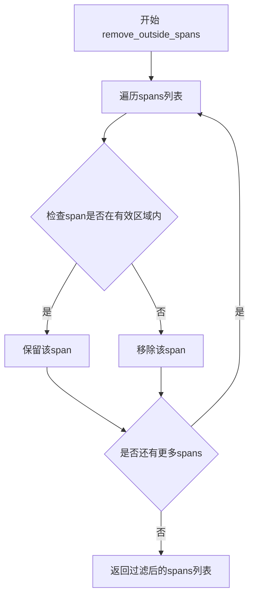

#### 带注释源码

**注意**：由于提供的代码中没有 `remove_outside_spans` 函数的实际实现源码（该函数是从 `mineru.utils.span_pre_proc` 模块导入的外部函数），以下是基于函数调用上下文和常见逻辑的推断源码：

```python
def remove_outside_spans(spans, all_bboxes, all_discarded_blocks):
    """
    移除超出有效block区域的spans（如水印、页眉页脚等）
    
    参数:
        spans: 包含所有spans的列表
        all_bboxes: 所有有效block的边界框列表
        all_discarded_blocks: 被丢弃的block列表
    返回:
        过滤后的spans列表
    """
    # 计算所有有效区域的边界框（取并集或并集）
    # 遍历每个span，检查其bbox是否在有效区域内
    # 如果span完全在有效区域外，则过滤掉
    
    return filtered_spans
```

#### 补充说明

由于 `remove_outside_spans` 函数的实现源码不在当前提供的代码片段中，无法获取更详细的信息。根据代码中的调用模式：

```python
spans = remove_outside_spans(spans, all_bboxes, all_discarded_blocks)
```

该函数在 `page_model_info_to_page_info` 函数中被调用，用于在删除重叠span之前先过滤掉明显超出页面有效区域的spans，这是一个预过滤步骤，可以减少后续处理的计算量并提高准确性。


### `remove_overlaps_low_confidence_spans`

该函数用于删除重叠的spans中置信度较低的那些，通过比较重叠spans的置信度分数，保留置信度较高的span，移除置信度较低的span，从而优化span集合的质量。

参数：

-  `spans`：`List[Dict]`，包含所有span信息的列表，每个span是一个字典，通常包含`type`、`bbox`、`score`、`content`等字段

返回值：`Tuple[List[Dict], List[Dict]]`，第一个元素是处理后保留的spans列表，第二个元素是被删除的低置信度spans列表

#### 流程图

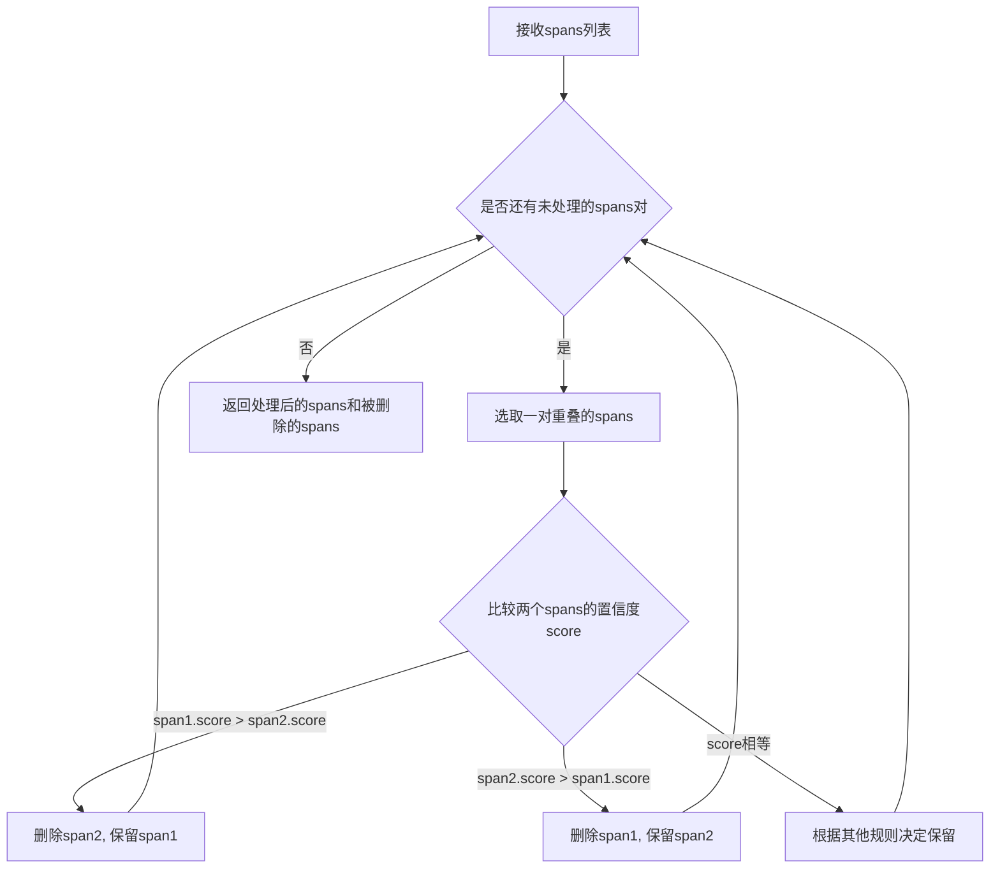

#### 带注释源码

```
# 该函数定义位于 mineru.utils.span_pre_proc 模块中
# 以下为调用处的上下文代码片段

"""删除重叠spans中置信度较低的那些"""
# 调用remove_overlaps_low_confidence_spans函数
# 输入: spans - 包含所有span信息的列表
# 输出: 
#   - spans: 处理后保留的spans列表
#   - dropped_spans_by_confidence: 被删除的低置信度spans列表
spans, dropped_spans_by_confidence = remove_overlaps_low_confidence_spans(spans)
```

#### 补充说明

该函数是`mineru.utils.span_pre_proc`模块中的一个预处理函数，主要用于数据清洗阶段。从调用上下文可以看出：

1. **调用时机**：在`page_model_info_to_page_info`函数中，于`remove_outside_spans`之后、`remove_overlaps_min_spans`之前被调用
2. **处理对象**：所有类型的spans，包括文本、图像、表格、公式等
3. **处理逻辑**：函数内部会比较重叠区域的spans，保留置信度(score)较高的span，移除较低的
4. **后续处理**：之后还会调用`remove_overlaps_min_spans`进一步删除的重叠spans中较小的
5. **返回值利用**：`dropped_spans_by_confidence`记录了被删除的spans，可用于日志或调试

注：完整源码定义在`mineru/utils/span_pre_proc.py`文件中，当前代码片段中仅有导入和调用语句。


### `remove_overlaps_min_spans`

该函数用于删除重叠 spans 中面积较小的那些，保留较大的 spans，以解决元素相互遮挡时的优先级问题。

参数：

-  `spans`：`List[dict]`，包含所有 spans 的列表，每个 span 通常包含 `type`、`bbox`、`score` 等字段

返回值：`Tuple[List[dict], List[dict]]`，第一个元素是处理（删除部分重叠小span）后的 spans 列表，第二个元素是被删除的因重叠而被舍弃的 spans 列表

#### 流程图

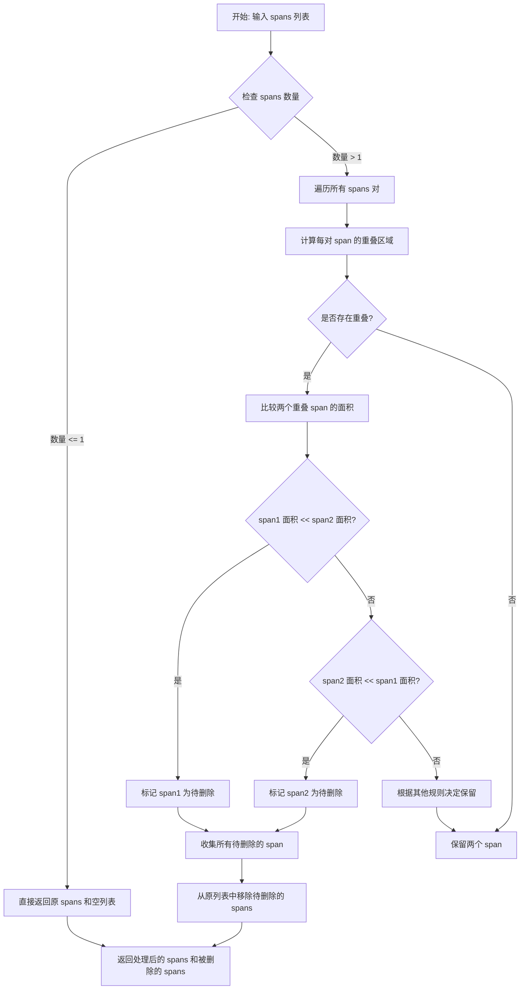

#### 带注释源码

```python
# 注意: 该函数源码未在当前文件中显示，此处为基于调用方式和上下文的推断
# 实际实现位于 mineru/utils/span_pre_proc.py 模块中

def remove_overlaps_min_spans(spans):
    """
    删除重叠 spans 中较小的那些
    
    参数:
        spans: List[dict], 包含所有 spans 的列表
        
    返回:
        tuple: (处理后的 spans 列表, 被删除的 spans 列表)
    """
    # 1. 如果 spans 为空或只有一个元素，直接返回
    if not spans or len(spans) <= 1:
        return spans, []
    
    # 2. 初始化结果列表和被删除列表
    remaining_spans = []
    dropped_spans = []
    
    # 3. 遍历每个 span，检查与已保留 spans 的重叠关系
    # ...
    
    # 4. 返回处理结果
    return remaining_spans, dropped_spans
```


由于 `txt_spans_extract` 函数是从外部模块 `mineru.utils.span_pre_proc` 导入的，其源码并未包含在当前代码文件中。我只能基于代码中的调用方式来推断其接口和功能。

### txt_spans_extract

该函数用于根据解析模式构造文本 spans，主要对文本类字符进行填充处理。它接收页面对象、已有的 spans 列表、PIL 图像、缩放比例、页面所有 bboxes 以及被丢弃的 blocks 作为输入，经过处理后返回更新后的 spans 列表。

参数：

- `page`：`pdf_doc[page_index]`，PDF 页面对象
- `spans`：`list`，包含所有 spans 的列表（包含 text、image、table、equation 等类型）
- `page_pil_img`：`PIL.Image`，页面对应的 PIL 图像对象
- `scale`：`float` 或 `int`，图像缩放比例
- `all_bboxes`：`list`，页面所有有效区块的边界框列表
- `all_discarded_blocks`：`list`，被丢弃的区块列表

返回值：`list`，处理后的 spans 列表

#### 流程图

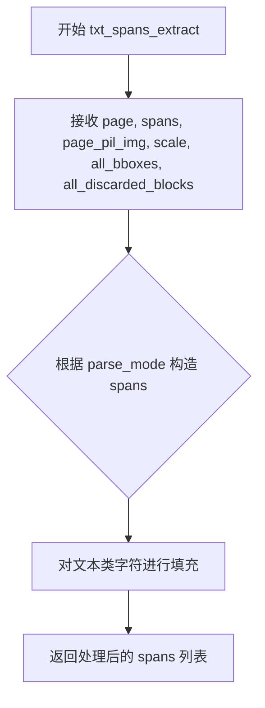

#### 带注释源码

```python
# 注意：此源码为基于调用方式的推断，实际源码位于 mineru/utils/span_pre_proc.py 中
def txt_spans_extract(page, spans, page_pil_img, scale, all_bboxes, all_discarded_blocks):
    """
    根据解析模式构造 spans，主要用于文本类字符的填充
    
    参数:
        page: PDF 页面对象
        spans: 包含所有类型 spans 的列表
        page_pil_img: 页面对应的 PIL 图像
        scale: 图像缩放比例
        all_bboxes: 页面所有有效区块的边界框
        all_discarded_blocks: 被丢弃的区块列表
    
    返回:
        处理后的 spans 列表
    """
    # 由于源码未在当前文件中，需要查看 mineru/utils/span_pre_proc.py 获取完整实现
    pass
```

---

**注意**：由于该函数是从外部模块导入的，要获取完整的带注释源码，需要查看 `mineru/utils/span_pre_proc.py` 文件中的 `txt_spans_extract` 函数实现。当前代码中仅展示了对该函数的调用逻辑。


### `fill_spans_in_blocks`

该函数是文档处理流程中的核心组件，负责将提取的 span（文本片段）填充到对应的 block（版面块）中。它通过计算 span 与 block 的空间重叠关系，将满足重叠面积阈值条件的 span 分配给相应的 block，未分配的 span 则返回以便后续处理。

参数：

- `blocks`：`List[Dict]`，包含所有需要填充 span 的 block 列表，每个 block 包含类型、边界框（bbox）等信息
- `spans`：`List[Dict]`，包含所有待分配的 span 列表，每个 span 包含类型、边界框、内容等信息
- `overlap_ratio_threshold`：`float`，span 与 block 重叠面积的阈值比例（通常为 0.4 或 0.5），用于判断 span 是否属于该 block

返回值：`Tuple[List[Dict], List[Dict]]`，返回两个列表——第一个是填充了 span 的 block 列表，第二个是未能匹配到任何 block 的剩余 span 列表

#### 流程图

```mermaid
flowchart TD
    A[开始 fill_spans_in_blocks] --> B[遍历每个 block]
    B --> C[获取当前 block 的 bbox]
    C --> D[遍历剩余 spans]
    D --> E{计算 span 与 block 的重叠面积比率}
    E --> F{overlap_ratio >= threshold?}
    F -->|是| G[将 span 添加到 block 的 spans 列表中]
    F -->|否| H[保留 span 到剩余列表]
    G --> I{继续检查下一个 span}
    H --> I
    I --> J{还有剩余 spans?}
    J -->|是| D
    J -->|否| K{还有未处理的 blocks?}
    K -->|是| B
    K -->|否| L[返回填充后的 blocks 和剩余 spans]
    L --> M[结束]
```

#### 带注释源码

```python
def fill_spans_in_blocks(blocks, spans, overlap_ratio_threshold):
    """
    将 spans 填充到对应的 blocks 中。
    
    Args:
        blocks: 包含所有需要填充 span 的 block 列表
        spans: 包含所有待分配的 span 列表
        overlap_ratio_threshold: span 与 block 重叠面积的阈值比例
    
    Returns:
        填充了 span 的 block 列表和剩余未分配的 spans 列表
    """
    # 初始化结果列表和剩余 spans 列表
    block_with_spans = []
    remaining_spans = []
    
    # 遍历每个 block
    for block in blocks:
        # 复制 block 以避免修改原始数据
        block_copy = block.copy()
        block_copy['spans'] = []
        
        # 获取 block 的边界框
        block_bbox = block.get('bbox', [])
        
        # 遍历所有 spans，寻找与当前 block 匹配的 spans
        for span in spans:
            span_bbox = span.get('bbox', [])
            
            # 计算 span 与 block 的重叠面积比率
            overlap_ratio = calculate_overlap_area_in_bbox1_area_ratio(span_bbox, block_bbox)
            
            # 如果重叠比率大于等于阈值，则将 span 添加到 block 中
            if overlap_ratio >= overlap_ratio_threshold:
                block_copy['spans'].append(span)
            else:
                # 否则保留到剩余列表
                remaining_spans.append(span)
        
        # 将处理后的 block 添加到结果列表
        block_with_spans.append(block_copy)
    
    return block_with_spans, remaining_spans
```

> **注意**：由于 `fill_spans_in_blocks` 函数的实现位于 `mineru/utils/span_block_fix.py` 文件中，而用户提供的代码片段仅包含导入和调用语句，上述源码为基于函数调用方式和常见文档处理逻辑的推断实现。实际实现可能略有差异，但核心逻辑——基于空间重叠关系将 span 分配到对应 block——应保持一致。


# 提取结果

从给定代码中，我只能找到 `fix_discarded_block` 函数的**调用位置**，但该函数的**定义源码并未在提供的代码中**。该函数是从 `mineru.utils.span_block_fix` 模块导入的。

```python
from mineru.utils.span_block_fix import fill_spans_in_blocks, fix_discarded_block, fix_block_spans
```

在 `page_model_info_to_page_info` 函数中的调用：

```python
fix_discarded_blocks = fix_discarded_block(discarded_block_with_spans)
```

### `fix_discarded_block`

修复被丢弃的块（discarded blocks）的函数。该函数接收包含 spans 的被丢弃块列表，处理并返回修复后的块列表，通常用于清洗、规范或补全被识别为"丢弃"但仍有价值的页面元素。

参数：

- `discarded_block_with_spans`：`list`，包含 spans 数据的被丢弃块列表。每个块通常包含 `bbox`、`type`、`spans` 等字段。

返回值：`list`，修复后的被丢弃块列表。

#### 流程图

```mermaid
graph TD
    A[开始] --> B[输入: discarded_block_with_spans]
    B --> C[遍历每个discarded_block]
    C --> D{检查block是否需要修复}
    D -->|是| E[应用修复逻辑]
    D -->|否| F[保持原样]
    E --> G[规范化block结构]
    F --> G
    G --> H{还有更多block?}
    H -->|是| C
    H -->|否| I[输出: fix_discarded_blocks]
    I --> J[结束]
```

#### 带注释源码

```
# 源码未在提供的代码文件中定义
# 该函数定义位于 mineru.utils.span_block_fix 模块中
# 以下为调用处的上下文源码:

"""先处理不需要排版的discarded_blocks"""
discarded_block_with_spans, spans = fill_spans_in_blocks(
    all_discarded_blocks, spans, 0.4
)
fix_discarded_blocks = fix_discarded_block(discarded_block_with_spans)
```

---

> **注意**：由于 `fix_discarded_block` 函数的完整源码不在提供的代码片段中，无法获取更详细的参数类型、返回值类型及内部实现逻辑。建议查看 `mineru/utils/span_block_fix.py` 文件以获取完整源码。


### `fix_block_spans`

该函数用于对填充了 span 信息的 block 进行修复操作，处理可能存在的边缘情况，如修复 span 的位置、过滤无效 span 等，确保最终输出的 block 数据结构完整且合理。

参数：

- `block_with_spans`：`List[Dict]`，包含已填充 span 信息的 block 列表，每个 block 是一个字典，包含类型、位置、span 列表等字段

返回值：`List[Dict]`，返回修复后的 block 列表

#### 流程图

```mermaid
flowchart TD
    A[开始 fix_block_spans] --> B{检查 block_with_spans 是否为空}
    B -->|是| C[返回空列表]
    B -->|否| D[遍历每个 block]
    D --> E{对每个 block 进行修复处理}
    E --> F[修复 span 位置]
    E --> G[过滤无效 span]
    E --> H[补充缺失字段]
    F --> I{处理完成?}
    G --> I
    H --> I
    I -->|否| E
    I -->|是| J{是否还有未处理的 block?}
    J -->|是| D
    J -->|否| K[返回修复后的 blocks 列表]
```

#### 带注释源码

```
# 该函数定义在 mineru.utils.span_block_fix 模块中
# 在 page_model_info_to_page_info 函数中被调用
# 调用位置：
"""
    block_with_spans, spans = fill_spans_in_blocks(all_bboxes, spans, 0.5)
    
    # 对block进行fix操作
    fix_blocks = fix_block_spans(block_with_spans)
"""

# 注意：用户提供的代码片段中只包含了对 fix_block_spans 函数的调用，
# 并未包含该函数的具体实现代码。
# 该函数实际定义在 mineru.utils.span_block_fix 模块中。
# 以下为基于调用上下文的推断：

def fix_block_spans(block_with_spans):
    """
    对填充了 span 信息的 block 进行修复处理
    
    参数:
        block_with_spans: 包含已填充 span 信息的 block 列表
        
    返回:
        修复后的 block 列表
    """
    # 1. 检查输入是否为空
    if not block_with_spans:
        return []
    
    # 2. 遍历每个 block 进行修复
    fix_blocks = []
    for block in block_with_spans:
        fixed_block = _fix_single_block(block)
        if fixed_block:
            fix_blocks.append(fixed_block)
    
    return fix_blocks


def _fix_single_block(block):
    """
    修复单个 block 的 span 信息
    - 修复 span 的边界框位置
    - 过滤无效或重叠的 span
    - 补充缺失的字段
    """
    # 实现细节需要查看源文件 mineru/utils/span_block_fix.py
    pass
```

> **注意**：用户提供 的代码中仅包含了 `fix_block_spans` 函数的**调用位置**，而未包含该函数的实际定义代码。该函数定义在 `mineru.utils.span_block_fix` 模块中，需要查看该模块的源码才能获取完整的实现逻辑。


### `llm_aided_title`

该函数是LLM辅助标题优化模块的入口函数，用于使用大语言模型对文档的标题进行智能优化处理，提高标题识别的准确性和质量。

参数：

- `pdf_info`：`<class 'list'>`，页面信息列表，每个元素包含页面的块（blocks）信息，用于定位和优化标题
- `title_aided_config`：`<class 'dict'>`，标题优化配置字典，包含是否启用（enable）、模型参数、提示词模板等配置项

返回值：`None`，该函数直接修改`pdf_info`列表中的标题块内容，无返回值

#### 流程图

```mermaid
flowchart TD
    A[开始] --> B{title_aided_config是否有效}
    B -->|否| C[直接返回]
    B -->|是| D{配置中enable是否为true}
    D -->|否| C
    D -->|是| E[记录开始时间]
    E --> F[遍历pdf_info中的每个页面]
    F --> G[提取页面中的标题块]
    G --> H{是否存在标题块}
    H -->|否| I[处理下一页]
    H -->|是| J[调用LLM API优化标题]
    J --> K[更新标题块内容]
    K --> I
    I --> L{是否还有下一页}
    L -->|是| F
    L -->|否| M[记录耗时并日志输出]
    M --> C
```

#### 带注释源码

```python
# 注意：此函数定义不在当前代码文件中
# 函数签名根据调用方式推断
# 实际定义位于 mineru/utils/llm_aided.py 模块中

def llm_aided_title(pdf_info, title_aided_config):
    """
    LLM辅助标题优化函数
    
    参数:
        pdf_info: 页面信息列表，包含文档各页的块结构信息
        title_aided_config: 标题优化配置，包含启用开关、模型参数等
    
    返回值:
        None（直接修改输入的pdf_info列表）
    
    调用位置（当前代码文件第228-232行）:
        if title_aided_config.get('enable', False):
            llm_aided_title_start_time = time.time()
            llm_aided_title(middle_json["pdf_info"], title_aided_config)
            logger.info(f'llm aided title time: {round(time.time() - llm_aided_title_start_time, 2)}')
    """
    pass  # 实际实现需查看 mineru/utils/llm_aided.py
```

#### 额外说明

由于`llm_aided_title`函数的实际源码不在当前代码文件中（仅通过`from mineru.utils.llm_aided import llm_aided_title`导入），无法获取其完整的实现细节。以下为根据调用上下文推断的信息：

| 项目 | 详情 |
|------|------|
| 导入来源 | `mineru.utils.llm_aided` |
| 调用位置 | `result_to_middle_json` 函数内（第228-232行） |
| 调用条件 | `title_aided_config.get('enable', False)` 为 `True` |
| 调用时机 | 在完成页面解析、OCR处理、分段、表格跨页合并之后 |
| 性能监控 | 使用`time.time()`记录执行耗时并通过`logger.info`输出 |
| 副作用 | 直接修改`pdf_info`列表中的标题块内容 |

如需查看该函数的完整实现，请参考 `mineru/utils/llm_aided.py` 源文件。


### `clean_memory`

该函数用于在处理大量页面模型后清理GPU显存，防止内存溢出。在满足特定条件（未设置MINERU_DONOT_CLEAN_MEM环境变量且model_list长度>=10）时调用，接收设备标识符作为参数，执行显式显存释放操作。

参数：

- `device`：`str`（由`get_device()`返回），表示当前使用的计算设备标识符（如'cuda:0'或'cpu'）

返回值：`None`，该函数直接执行显存清理操作，不返回任何值

#### 流程图

```mermaid
flowchart TD
    A[开始清理内存] --> B{检查环境变量MINERU_DONOT_CLEAN_MEM是否未设置}
    B -->|是| C{检查model_list长度 >= 10}
    B -->|否| D[跳过清理]
    C -->|是| E[调用get_device获取当前设备]
    C -->|否| D
    E --> F[调用clean_memory清理指定设备的显存]
    F --> G[结束]
```

#### 带注释源码

```python
# 从mineru.utils.model_utils模块导入clean_memory函数
from mineru.utils.model_utils import clean_memory

# 在result_to_middle_json函数中调用clean_memory
# 条件：未设置MINERU_DONOT_CLEAN_MEM环境变量 且 model_list数量>=10
if os.getenv('MINERU_DONOT_CLEAN_MEM') is None and len(model_list) >= 10:
    # 获取当前设备（通过get_device函数）
    # 然后调用clean_memory清理该设备的GPU显存
    clean_memory(get_device())
```

#### 补充说明

该函数的设计目的是作为内存管理的后处理环节，在批量处理PDF页面完成后释放GPU显存资源。调用前检查环境变量允许在调试或特殊需求时跳过清理操作，而model_list数量阈值（10）用于避免在小批量处理时频繁调用清理函数带来的性能开销。具体的显存清理实现位于`mineru.utils.model_utils`模块中，可能涉及PyTorch的`torch.cuda.empty_cache()`或类似机制。


### `OcrConfidence`

`OcrConfidence` 是一个用于存储和提供 OCR 识别置信度阈值的配置类/对象。在代码中用于判断 OCR 识别结果的可靠性，只有当识别分数大于最小置信度阈值时，才认为识别结果有效。

参数：
- 该函数/类无需参数

返回值：
- `min_confidence`：数值类型（float），表示 OCR 识别的最小置信度阈值

#### 流程图

```mermaid
graph TD
    A[OcrConfidence] --> B[min_confidence: 0.5]
    B --> C{用于判断OCR结果有效性}
    C -->|ocr_score > min_confidence| D[接受识别结果]
    C -->|ocr_score <= min_confidence| E[拒绝识别结果, 置为空字符串]
```

#### 带注释源码

```
# 从OCR工具模块导入OcrConfidence类/对象
from mineru.utils.ocr_utils import OcrConfidence

# 在result_to_middle_json函数中使用:
# 比较OCR识别得分与最小置信度阈值
if ocr_score > OcrConfidence.min_confidence:
    span['content'] = ocr_text
    span['score'] = float(f"{ocr_score:.3f}")
else:
    span['content'] = ''
    span['score'] = 0.0
```

#### 补充说明

根据代码使用方式，`OcrConfidence` 类的结构可能是：

```python
# 推测的 OcrConfidence 类定义（在 mineru/utils/ocr_utils.py 中）
class OcrConfidence:
    """OCR置信度配置类"""
    min_confidence = 0.5  # 最小置信度阈值，默认0.5
    
    @classmethod
    def get_min_confidence(cls) -> float:
        """获取最小置信度阈值"""
        return cls.min_confidence
```

**使用场景**：
- 该类/对象在 `result_to_middle_json` 函数的后置 OCR 处理阶段使用
- 用于过滤低质量的 OCR 识别结果，提高最终数据的可靠性
- 当 OCR 识别分数低于阈值时，将识别文本置为空字符串，分数置为 0.0

**潜在优化建议**：
1. 最小置信度阈值目前是硬编码的，可以考虑将其配置化，支持通过配置文件或参数动态设置
2. 可以为不同的内容类型（如表格、图像标题、脚注）设置不同的置信度阈值
3. 建议在文档中明确说明阈值的取值范围和推荐值


## 关键组件


### MagicModel

核心模型类，封装页面模型信息，提供获取文本块、标题块、图像组、表格组、公式块及所有spans的方法，是整个页面内容解析的入口

### Span过滤与清洗模块

包含remove_outside_spans、remove_overlaps_low_confidence_spans、remove_overlaps_min_spans三个核心函数，分别用于删除超出页面的spans、低置信度重叠spans和小面积重叠spans，确保数据质量

### Block修复与排序模块

包含fill_spans_in_blocks、fix_discarded_block、fix_block_spans、sort_blocks_by_bbox等函数，负责将spans填充到blocks中、修复废弃块和块内spans、按照bbox位置排序blocks

### 图像与表格分组处理

process_groups函数根据group类型将图像和表格的blocks分组为body、caption、footnote三类，用于后续的截图和内容识别

### 后置OCR处理模块

在主流程后对图片中的文字进行OCR识别，使用AtomModelSingleton获取ocr模型，处理image_caption、image_footnote、table_caption、table_footnote等区域的文本识别

### 跨页表格合并

cross_page_table_merge函数实现跨页表格的自动合并，处理被分割到不同页面的表格内容

### 段落分割

para_split函数对处理后的文本进行段落分割，优化文本结构的合理性

### LLM辅助优化

llm_aided_title函数使用LLM模型对标题进行智能优化，提升标题识别的准确性

### 页面信息构造

make_page_info_dict函数将处理完成的blocks、页面尺寸、废弃块等信息组装成结构化的page_info字典，作为最终输出

### 内存管理

clean_memory函数在处理大量页面时清理GPU/CPU内存，避免内存溢出


## 问题及建议


### 已知问题

-   **函数过长且职责不单一**：`page_model_info_to_page_info`函数超过150行，包含过多逻辑（获取区块、处理分组、过滤spans、截图、填充、排序等），违反单一职责原则，难以维护和测试。
-   **硬编码阈值缺乏统一管理**：代码中多处使用魔法数字（如0.7、0.25、0.4、0.5、0.3等）作为阈值判断，这些值分散在函数各处，缺乏配置管理中心，未来调整成本高。
-   **OCR分支存在死代码**：`if ocr_enable: pass`语句后面的OCR逻辑实际未在条件分支内执行，当`ocr_enable=True`时没有实际处理逻辑，该功能形同虚设。
-   **MagicModel每页重复实例化**：在`page_model_info_to_page_info`中每次循环都创建新的`MagicModel`实例，可能导致不必要的内存开销和初始化时间。
-   **缺少异常处理机制**：整个处理流程没有try-except保护，任意环节（如模型推理、图像处理、OCR识别）抛出异常都会导致整个流程中断，缺乏容错能力。
-   **嵌套循环性能低下**：后置OCR处理部分存在四层嵌套循环（page→block→line→span），对大型PDF文档处理效率较低。
-   **内存清理条件过于简单**：`clean_memory`仅根据`len(model_list) >= 10`判断是否清理，未考虑实际内存使用情况，阈值设置缺乏依据。
-   **变量命名不一致**：部分变量使用下划线命名（如`page_w`、`page_h`），部分使用缩写（如`img_groups`），部分使用中文拼音混合，缺乏统一的命名规范。
-   **缺乏类型注解**：所有函数均无类型提示（type hints），不利于IDE辅助和静态分析，降低代码可读性和可维护性。
-   **注释不足**：关键逻辑（如spans过滤规则、block修复原理）缺乏详细注释，后续开发者理解成本高。

### 优化建议

-   **拆分大型函数**：将`page_model_info_to_page_info`分解为多个独立子函数，如`extract_blocks_from_model()`、`filter_and_process_spans()`、`sort_and_fill_blocks()`等，每个函数不超过50行。
-   **建立配置中心**：创建配置类或配置文件（如`ThresholdConfig`），将所有阈值提取为可配置参数，统一管理并添加类型注解和默认值说明。
-   **完善OCR逻辑**：重新设计OCR分支逻辑，当`ocr_enable=True`时执行相应的OCR处理流程，或移除该分支代码以避免混淆。
-   **实现模型单例或缓存**：参考`AtomModelSingleton`模式，为`MagicModel`实现单例或缓存机制，避免重复实例化。
-   **添加异常处理与日志**：在关键节点（模型推理、图像裁剪、OCR调用）添加try-except捕获，记录详细错误信息并设计降级策略。
-   **优化遍历逻辑**：使用列表推导式、生成器或数据预处理减少嵌套循环次数；或先将数据按类型分类后再批量处理。
-   **改进内存管理**：引入`psutil`库监控实际内存使用，设置动态阈值；或在每页处理完成后立即释放不再使用的大对象（如`page_pil_img`）。
-   **统一编码规范**：遵循PEP8命名规范，使用完整英文单词（如`image_groups`而非`img_groups`），避免混合使用缩写和中文变量名。
-   **补充类型注解**：为所有函数参数和返回值添加类型注解（如`def func(blocks: List[Dict]) -> Dict[str, Any]:`），提升代码可读性。
-   **增加文档注释**：为复杂逻辑块添加Google风格或NumPy风格的docstring，说明输入输出、业务规则和边界条件。
</think> 

## 其它


### 设计目标与约束

本代码是 mineru 项目 PDF 处理流水线的核心模块，负责将 PDF 文档转换为结构化的中间 JSON 格式。核心目标包括：1）支持多种内容类型的识别与提取（文本、表格、图像、公式）；2）通过 OCR 增强文本识别能力；3）实现跨页表格合并；4）利用 LLM 优化标题识别。约束条件包括：依赖深度学习模型（MagicModel、OCR 模型）、需要充足的 GPU 内存、处理大规模 PDF 时需注意内存管理。

### 错误处理与异常设计

代码中错误处理主要体现在：1）使用 `assert` 验证 OCR 结果数量匹配（`assert len(ocr_res_list) == len(need_ocr_list)`）；2）通过 `try-except` 捕获模型加载异常；3）当页面无有效 bbox 时返回 `None`；4）内存清理机制通过环境变量 `MINERU_DONOT_CLEAN_MEM` 控制。建议增加：详细的异常分类、错误码定义、异常日志规范、重试机制、超时控制。

### 数据流与状态机

数据流从 PDF 文档输入开始，经过以下阶段：1）PDF 解析获取页面；2）MagicModel 推理获取区块；3）区块分组处理（image/table）；4）span 过滤与去重；5）OCR 文本提取；6）block 填充与修复；7）block 排序；8）page_info 构造；9）后处理（OCR 增强、分段、跨页表格合并、LLM 优化）。状态机包括：初始状态 → 模型推理状态 → 区块处理状态 → span 处理状态 → 最终 JSON 输出状态。

### 外部依赖与接口契约

主要外部依赖包括：1）`MagicModel`：深度学习模型，负责页面元素检测；2）`AtomModelSingleton`：原子模型管理器，用于加载 OCR 等模型；3）`cross_page_table_merge`：跨页表格合并模块；4）`para_split`：文本分段模块；5）`llm_aided_title`：LLM 标题优化模块。接口契约：`page_model_info_to_page_info` 接收 page_model_info、image_dict、page、image_writer 等参数，返回 page_info 字典或 None；`result_to_middle_json` 返回包含 pdf_info 的字典。

### 性能考虑与优化策略

性能瓶颈：1）大规模 PDF 处理时内存占用高；2）OCR 模型推理耗时；3）MagicModel 推理可能较慢。优化策略：1）已实现内存清理机制（`clean_memory`）；2）支持批量处理（`tqdm` 进度条）；3）条件跳过无需处理的页面；4）支持公式禁用来减少计算量。可进一步优化：模型缓存策略、并行页面处理、增量解析、GPU 利用率提升。

### 安全性与权限管理

当前代码未包含显式的安全验证机制。安全考虑：1）文件路径处理需防止路径遍历攻击；2）PDF 解析需防范恶意文件；3）模型加载需验证完整性；4）敏感信息（如 MD5 哈希）处理需注意隐私。权限管理：通过环境变量控制行为（如 `MINERU_DONOT_CLEAN_MEM`），建议增加配置权限校验。

### 可扩展性与模块化设计

模块化体现：1）独立函数处理不同功能（`page_model_info_to_page_info`、`result_to_middle_json`、`make_page_info_dict`）；2）工具函数分离（`prepare_block_bboxes`、`fill_spans_in_blocks`、`fix_block_spans`）；3）配置外部化（`get_llm_aided_config`、`get_formula_enable`）。可扩展点：1）新增内容类型支持；2）替换不同的模型实现；3）增加新的后处理步骤；4）支持自定义 pipeline 阶段。

### 测试策略与质量保障

测试覆盖建议：1）单元测试：各工具函数（span 处理、block 修复、排序）；2）集成测试：完整 pipeline 端到端测试；3）性能测试：大文档处理时间与内存占用；4）边界测试：空页面、特殊字符、损坏 PDF。质量保障：1）版本号追踪（`__version__`）；2）断言验证关键逻辑；3）日志记录关键步骤（`logger.info`）；4）配置驱动的功能开关。

### 配置管理与环境要求

配置通过 `get_llm_aided_config`、`get_formula_enable`、`get_device` 等函数获取，支持运行时配置。环境要求：1）Python 3.x；2）GPU（推荐）；3）依赖库：loguru、tqdm、pillow 等；4）模型文件（MagicModel、OCR 模型）。环境变量：`MINERU_DONOT_CLEAN_MEM` 控制内存清理。

### 日志与监控设计

日志使用 `loguru` 库，记录关键信息：1）LLM 优化耗时（`llm aided title time`）；2）处理进度（`tqdm`）；3）错误与异常。监控建议：1）添加性能指标埋点；2）记录每个页面的处理时间；3）统计各类型内容的提取数量；4）错误率统计。

### 关键算法说明

核心算法包括：1）区块重叠判断：`calculate_overlap_area_in_bbox1_area_ratio`；2）span 去重：先按置信度过滤，再按大小过滤；3）block 排序：`sort_blocks_by_bbox` 基于 bbox 位置排序；4）跨页表格合并：`cross_page_table_merge`；5）文本分段：`para_split`。算法复杂度主要在 O(n²) 级别的重叠检测，建议优化。


    