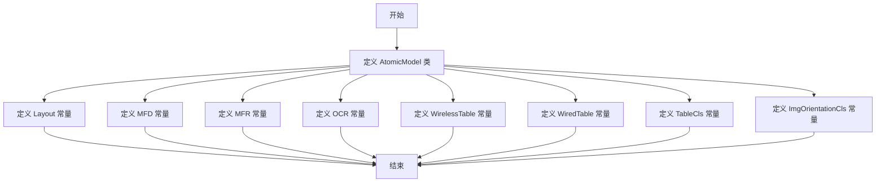

# `MinerU\mineru\backend\pipeline\model_list.py` 详细设计文档

AtomicModel 是一个配置类（类似枚举），用于定义各种模型类型的字符串常量标识符，包括布局模型(Layout)、文档格式检测(MFD)、文档字段识别(MFR)、光学字符识别(OCR)、无线表格(WirelessTable)、有线表格(WiredTable)、表格分类(TableCls)和图像方向分类(ImgOrientationCls)等，用于系统中不同模型组件的标识和引用。

## 整体流程



## 类结构

```
AtomicModel (配置/枚举类)
└── 类属性常量 (8个)
```

## 全局变量及字段


### `AtomicModel.Layout`
    
布局配置标识符

类型：`str`
    


### `AtomicModel.MFD`
    
多功能设备标识符

类型：`str`
    


### `AtomicModel.MFR`
    
多功能读取器标识符

类型：`str`
    


### `AtomicModel.OCR`
    
光学字符识别标识符

类型：`str`
    


### `AtomicModel.WirelessTable`
    
无线表标识符

类型：`str`
    


### `AtomicModel.WiredTable`
    
有线表标识符

类型：`str`
    


### `AtomicModel.TableCls`
    
表格类标识符

类型：`str`
    


### `AtomicModel.ImgOrientationCls`
    
图像方向类标识符

类型：`str`
    
    

## 全局函数及方法


## 关键组件


### AtomicModel

一个模型基类，定义了各种文档分析和识别相关的常量标识符，包括布局类型、特征检测/识别模式、OCR识别以及表格和图像方向分类等。

### Layout 属性

表示文档布局分析的常量标识符，用于区分不同的页面布局模式。

### MFD 属性

表示特征检测（Feature Detection）的常量标识符，用于图像特征点检测相关功能。

### MFR 属性

表示特征识别（Feature Recognition）的常量标识符，用于图像特征模式识别功能。

### OCR 属性

表示光学字符识别（Optical Character Recognition）的常量标识符，用于文本提取和识别功能。

### WirelessTable 属性

表示无线表格分析的常量标识符，用于处理无线通信相关的表格数据结构。

### WiredTable 属性

表示有线表格分析的常量标识符，用于处理有线网络或连接相关的表格数据。

### TableCls 属性

表示表格分类（Table Classification）的常量标识符，用于表格类型识别和分类功能。

### ImgOrientationCls 属性

表示图像方向分类（Image Orientation Classification）的常量标识符，用于识别和校正图像的方向。


## 问题及建议


### 已知问题

-   **缺少文档字符串**：类AtomicModel没有文档字符串，无法了解该类的设计意图和使用场景
-   **使用字符串常量而非枚举**：使用类属性定义字符串常量，不符合Python最佳实践，应使用Enum或Const类
-   **缺少类型注解**：所有常量缺少类型注解，降低了代码的可读性和IDE支持
-   **缺乏语义说明**：每个常量只有键名没有注释说明，无法明确Layout、MFD、MFR、OCR等缩写的具体含义
-   **命名不够规范**：常量命名使用了全大写（如WirelessTable），但按照Python惯例，类常量应使用大写字母
-   **缺乏业务逻辑**：类中仅包含静态常量，没有提供任何方法，可能不需要定义为类

### 优化建议

-   **使用Enum类替代**：将这些常量改为Enum类的成员，提供更强的类型安全和代码补全支持
-   **添加文档字符串**：为类添加类级别docstring，说明该类的用途和设计背景
-   **添加类型注解**：为常量添加str类型注解，如`Layout: str = "layout"`
-   **添加注释说明**：为每个常量添加注释，解释Layout、MFD、MFR、OCR、WirelessTable、WiredTable、TableCls、ImgOrientationCls的具体含义和用途
-   **考虑模块级常量**：如果不需要封装方法，可将这些常量定义为模块级常量，使用下划线命名法
-   **统一命名风格**：TableCls可改为TableClass，ImgOrientationCls可改为ImageOrientationClass以提高可读性


## 其它


### 1. 核心功能简述
AtomicModel类是一个配置类，用于定义系统中各种数据类型和配置项的字符串常量，包括布局、多频数据、多频响应、光学字符识别、无线/有线表格以及图像方向等关键配置标识。

### 2. 整体运行流程
该类不涉及运行流程，作为静态配置类被其他模块引用，通过类名直接访问这些常量，用于类型标识、配置键名或枚举值的场景。

### 3. 类详细信息
#### 3.1 类字段（类变量）
| 名称 | 类型 | 描述 |
|------|------|------|
| Layout | str | 布局配置标识符 |
| MFD | str | 多频数据配置标识符 |
| MFR | str | 多频响应配置标识符 |
| OCR | str | 光学字符识别配置标识符 |
| WirelessTable | str | 无线表格配置标识符 |
| WiredTable | str | 有线表格配置标识符 |
| TableCls | str | 表格分类配置标识符 |
| ImgOrientationCls | str | 图像方向分类配置标识符 |

#### 3.2 类方法
该类未定义任何实例方法或类方法。

### 4. 全局变量和全局函数
该代码片段中未包含全局变量和全局函数。

### 5. 关键组件信息
| 组件名称 | 一句话描述 |
|----------|-------------|
| AtomicModel | 定义系统配置常量的配置类，用于统一管理各类配置键名和类型标识 |

### 6. 设计目标与约束
- **设计目标**：提供统一的配置常量管理，避免魔法字符串，提升代码可读性和可维护性
- **约束**：仅包含字符串常量，不包含业务逻辑，所有属性应为类属性（不可变）

### 7. 错误处理与异常设计
- 由于该类仅包含常量定义，不涉及错误处理逻辑
- 建议在使用处进行参数校验，确保传入的常量值符合预期

### 8. 数据流与状态机
- 不涉及数据流处理
- 不涉及状态机设计

### 9. 外部依赖与接口契约
- 无外部依赖
- 接口契约：其他模块通过`AtomicModel.属性名`的方式访问配置常量

### 10. 潜在技术债务与优化空间
- **扩展性**：可考虑使用枚举类（Enum）替代字符串常量，提供更强的类型安全
- **文档完善**：建议为每个常量添加详细的文档字符串（docstring），说明其使用场景和含义
- **组织方式**：如果系统规模增大，可考虑拆分为多个配置类或模块，按功能域进行组织

### 11. 其它项目
#### 11.1 使用示例
```python
# 假设在数据处理模块中使用
def process_data(data_type: str):
    if data_type == AtomicModel.OCR:
        # 处理OCR数据
        pass
    elif data_type == AtomicModel.WirelessTable:
        # 处理无线表格数据
        pass
```

#### 11.2 版本兼容性
- 当前版本：1.0
- 向后兼容性：保证常量名称和值在后续版本中保持稳定，如需变更应通过版本升级流程管理

    