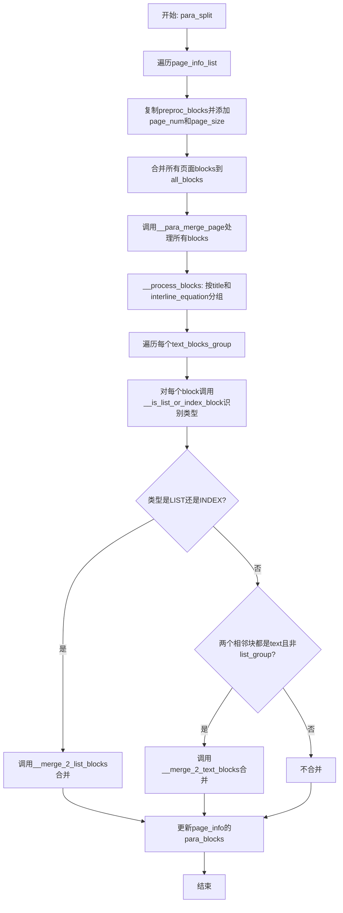
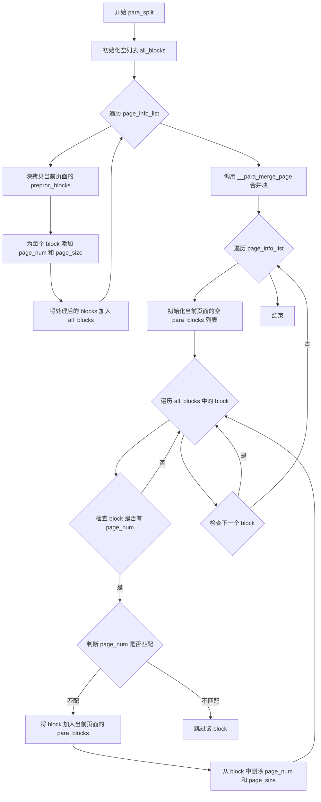
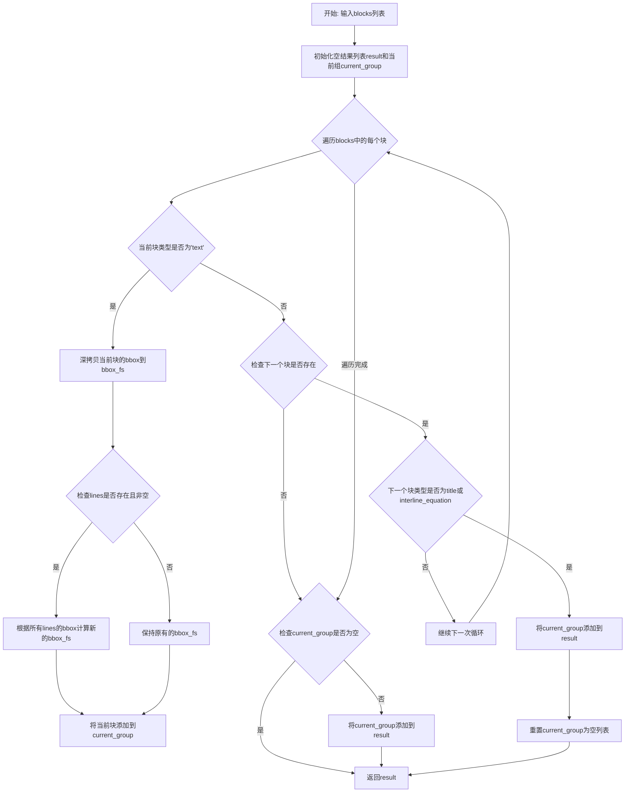
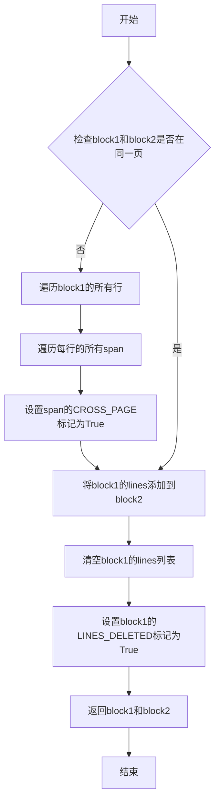
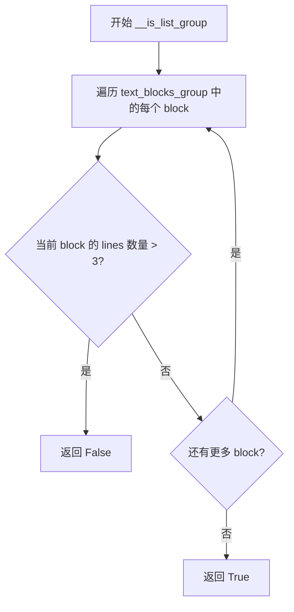
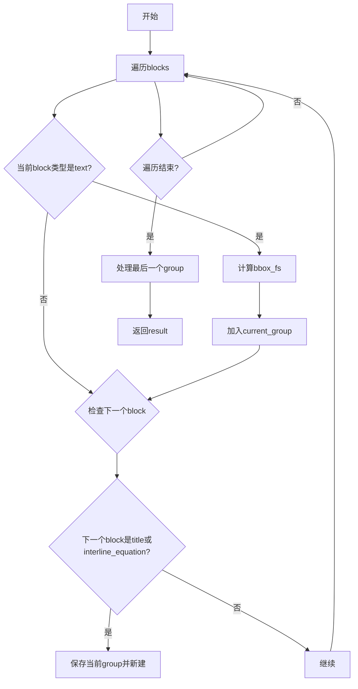
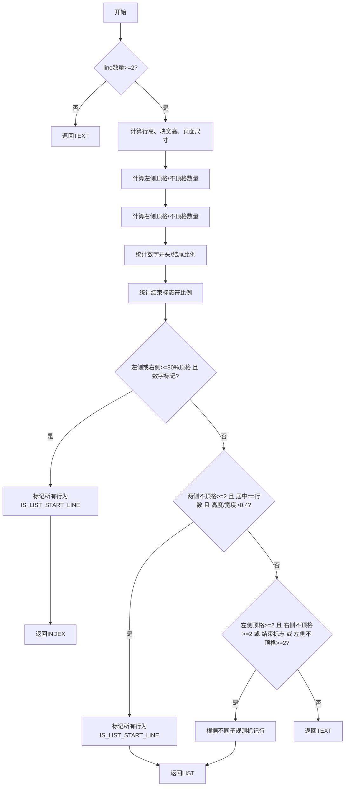
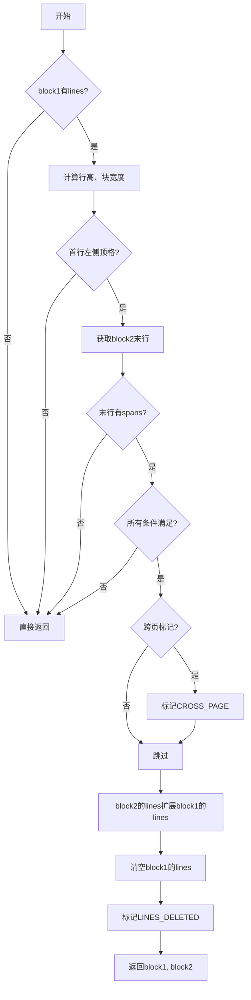

# `MinerU\mineru\backend\pipeline\para_split.py` 详细设计文档

该代码是一个文档段落分割模块,核心功能是处理PDF或图片文档的预处理块(block),通过分析块的布局、文本特征和语言属性,识别并区分文本块、列表块和索引块,然后对相邻的同类块进行合并,最终输出结构化的段落块信息。

## 整体流程



## 类结构

```
全局函数模块 (无类)
├── 常量定义
│   ├── LINE_STOP_FLAG (行停止标志)
│   ├── LIST_END_FLAG (列表结束标志)
│   └── ListLineTag (列表行标签)
├── 核心处理函数
│   ├── para_split (主入口)
│   ├── __para_merge_page (页面级合并)
│   ├── __process_blocks (块预处理分组)
│   ├── __is_list_or_index_block (块类型识别)
│   ├── __merge_2_text_blocks (文本块合并)
│   └── __merge_2_list_blocks (列表块合并)
└── 辅助函数
    └── __is_list_group (列表组判断)
```

## 全局变量及字段


### `LINE_STOP_FLAG`
    
用于判断行是否停止的标点符号集合

类型：`tuple`
    


### `LIST_END_FLAG`
    
用于判断列表项结束的标点符号集合

类型：`tuple`
    


### `ListLineTag.IS_LIST_START_LINE`
    
标记行是否为列表起始行的标识键

类型：`str`
    


### `ListLineTag.IS_LIST_END_LINE`
    
标记行是否为列表结束行的标识键

类型：`str`
    
    

## 全局函数及方法


### `para_split`

该函数接收页面信息列表，遍历每个页面的预处理块，为每个块添加页码和页面尺寸信息，然后调用跨页块合并函数处理所有块，最后将处理后的块重新分配到各页面的`para_blocks`字段中，完成文档的段落分割处理。

参数：

- `page_info_list`：`List[Dict]`，页面信息列表，每个元素包含`preproc_blocks`（预处理块）、`page_idx`（页面索引）和`page_size`（页面尺寸）

返回值：`None`，该函数直接修改输入的`page_info_list`字典，不返回任何值

#### 流程图



#### 带注释源码

```python
def para_split(page_info_list):
    """
    对页面信息列表中的预处理块进行段落分割和跨页块合并
    
    处理流程：
    1. 收集所有页面的预处理块并添加页码信息
    2. 调用 __para_merge_page 进行跨页块合并
    3. 将处理后的块重新分配到各页面的 para_blocks 字段
    
    参数:
        page_info_list: 页面信息列表，每个元素为包含 preproc_blocks, page_idx, page_size 的字典
    """
    # 步骤1：收集所有页面的预处理块
    all_blocks = []
    for page_info in page_info_list:
        # 深拷贝预处理块，避免修改原始数据
        blocks = copy.deepcopy(page_info['preproc_blocks'])
        
        # 为每个块添加页码和页面尺寸信息，用于后续跨页块识别
        for block in blocks:
            block['page_num'] = page_info['page_idx']
            block['page_size'] = page_info['page_size']
        
        # 将当前页面的块添加到总块列表
        all_blocks.extend(blocks)

    # 步骤2：执行跨页块合并处理
    # 该函数会合并属于同一段落但被分页切断的块
    __para_merge_page(all_blocks)
    
    # 步骤3：将处理后的块重新分配到各页面
    for page_info in page_info_list:
        # 初始化当前页面的段落块列表
        page_info['para_blocks'] = []
        
        # 遍历所有块，找出属于当前页面的块
        for block in all_blocks:
            if 'page_num' in block:
                if block['page_num'] == page_info['page_idx']:
                    # 将属于当前页面的块添加到结果中
                    page_info['para_blocks'].append(block)
                    
                    # 从block中删除不需要的page_num和page_size字段
                    # 这些字段仅用于合并过程中的判断，完成后应清理
                    del block['page_num']
                    del block['page_size']
```


### `__para_merge_page`

该函数是PDF文档处理流程中的核心段落合并模块，负责将同一页面的blocks按段落逻辑进行分组，并基于block类型（文本、列表、索引）执行相应的合并操作，最终实现跨block的段落重组。

参数：

- `blocks`：`List[dict]`，PDF页面预处理后的blocks列表，每个block包含类型、位置、内容等元信息

返回值：`None`，该函数直接修改传入的blocks列表，无返回值

#### 流程图

```mermaid
flowchart TD
    A[开始 __para_merge_page] --> B[调用 __process_blocks 对blocks分组]
    B --> C[遍历每个 text_blocks_group]
    C --> D{group是否为空?}
    D -->|是| E[跳过当前group]
    D -->|否| F[遍历group中每个block]
    F --> G[调用 __is_list_or_index_block 判断block类型]
    G --> H[设置 block['type'] 为判断结果]
    H --> I{group中block数量 > 1?}
    I -->|否| E
    I -->|是| J[调用 __is_list_group 判断是否为list group]
    J --> K[倒序遍历group中的blocks]
    K --> L{当前索引 i > 0?}
    L -->|否| E
    L --> M[获取 prev_block]
    M --> N{当前block和prev_block都是text且不是list group?}
    N -->|是| O[调用 __merge_2_text_blocks 合并文本块]
    N -->|否| P{当前block和prev_block都是LIST或都是INDEX?}
    P -->|是| Q[调用 __merge_2_list_blocks 合并列表块]
    P -->|否| R[不合并]
    O --> S[继续遍历]
    Q --> S
    R --> S
    S --> T{遍历完成?}
    T -->|否| K
    T -->|是| U[结束]
```

#### 带注释源码

```python
def __para_merge_page(blocks):
    """
    段落合并主函数
    1. 先通过 __process_blocks 将blocks按title和interline_equation分组
    2. 对每个group中的block判断类型(text/list/index)
    3. 根据block类型执行相应的合并逻辑
    """
    # 步骤1: 预处理blocks，按title和interline_equation分割成多个group
    page_text_blocks_groups = __process_blocks(blocks)
    
    # 步骤2: 遍历每个group进行处理
    for text_blocks_group in page_text_blocks_groups:
        if len(text_blocks_group) > 0:
            # 步骤3: 对group中的每个block判断是text还是list或index block
            for block in text_blocks_group:
                block_type = __is_list_or_index_block(block)
                block['type'] = block_type  # 设置block类型标签
                # logger.info(f"{block['type']}:{block}")

        # 步骤4: 如果group中有多个block，需要进行合并
        if len(text_blocks_group) > 1:
            # 步骤5: 判断这个group是否是list group
            # list group的特征是每个block都不超过3行
            is_list_group = __is_list_group(text_blocks_group)

            # 步骤6: 倒序遍历，从后向前合并
            # 倒序可以避免合并后索引偏移问题
            for i in range(len(text_blocks_group) - 1, -1, -1):
                current_block = text_blocks_group[i]

                # 检查是否有前一个块
                if i - 1 >= 0:
                    prev_block = text_blocks_group[i - 1]

                    # 步骤7: 根据block类型选择合并策略
                    # 情况1: 两个都是text block且不是list group，合并为连贯段落
                    if (
                        current_block['type'] == 'text'
                        and prev_block['type'] == 'text'
                        and not is_list_group
                    ):
                        __merge_2_text_blocks(current_block, prev_block)
                    # 情况2: 两个都是LIST类型，合并列表项
                    elif (
                        current_block['type'] == BlockType.LIST
                        and prev_block['type'] == BlockType.LIST
                    ) or (
                        # 情况3: 两个都是INDEX类型，合并索引项
                        current_block['type'] == BlockType.INDEX
                        and prev_block['type'] == BlockType.INDEX
                    ):
                        __merge_2_list_blocks(current_block, prev_block)

        else:
            # group中只有一个block，无需合并
            continue
```


### `__process_blocks`

该函数是文档预处理流程中的核心组成部分，负责对文档块（blocks）进行分组和边界框重置。它通过遍历所有块，将文本类型（text）的块收集到当前组中，并根据标题（title）或行间公式（interline_equation）块作为分隔符来划分不同的组，同时根据每块内行的信息重新计算块的有效边界框（bbox_fs）。

参数：

- `blocks`：`List[Dict]`，输入的文档块列表，每个块是一个包含类型、边界框、行信息等属性的字典

返回值：`List[List[Dict]]`，返回分组后的文档块列表，其中每个子列表代表一个由连续文本块组成的组

#### 流程图



#### 带注释源码

```python
def __process_blocks(blocks):
    """
    对所有block预处理
    1.通过title和interline_equation将block分组
    2.bbox边界根据line信息重置
    """
    
    result = []  # 存储最终的分组结果
    current_group = []  # 存储当前正在构建的组

    # 遍历所有块
    for i in range(len(blocks)):
        current_block = blocks[i]  # 获取当前块

        # 如果当前块是 text 类型
        if current_block['type'] == 'text':
            # 首先将原始bbox深拷贝到bbox_fs字段
            # bbox_fs代表基于lines计算后的有效边界框
            current_block['bbox_fs'] = copy.deepcopy(current_block['bbox'])
            
            # 检查当前块是否包含lines信息且不为空
            if 'lines' in current_block and len(current_block['lines']) > 0:
                # 根据所有行的bbox计算新的边界框
                # 取所有行的x1最小值、y1最小值、x2最大值、y2最大值
                current_block['bbox_fs'] = [
                    min([line['bbox'][0] for line in current_block['lines']]),  # x1最小值
                    min([line['bbox'][1] for line in current_block['lines']]),  # y1最小值
                    max([line['bbox'][2] for line in current_block['lines']]),  # x2最大值
                    max([line['bbox'][3] for line in current_block['lines']]),  # y2最大值
                ]
            
            # 将当前文本块添加到当前组
            current_group.append(current_block)

        # 检查下一个块是否存在（用于判断是否需要结束当前组）
        if i + 1 < len(blocks):
            next_block = blocks[i + 1]  # 获取下一个块
            
            # 如果下一个块不是 text 类型且是 title 或 interline_equation 类型
            # 说明遇到了分隔符，需要结束当前组
            if next_block['type'] in ['title', 'interline_equation']:
                result.append(current_group)  # 将当前组添加到结果
                current_group = []  # 重置当前组，开始新的组

    # 处理最后一个 group
    # 如果最后还有一个未添加到结果的组，需要手动添加
    if current_group:
        result.append(current_group)

    return result
```


### `__is_list_or_index_block`

该函数用于判断给定的块（block）是列表块（LIST）、索引块（INDEX）还是普通文本块（TEXT）。它通过分析块内多行的对齐方式、文本特征（如数字开头/结尾、结束符）以及排版特征（左侧/右侧是否顶格、是否居中等）来区分不同的块类型。

参数：

- `block`：`dict`，表示一个文本块，包含 `lines`（行的列表）、`bbox`（边界框）、`bbox_fs`（基于行的边界框）、`page_size`（页面尺寸）等字段

返回值：`BlockType`，返回 `BlockType.INDEX`、`BlockType.LIST` 或 `BlockType.TEXT` 之一

#### 流程图

```mermaid
flowchart TD
    A[开始 __is_list_or_index_block] --> B{len(block['lines']) >= 2?}
    B -->|否| Z[返回 BlockType.TEXT]
    B -->|是| C[计算 line_height, block_weight, block_height, page_weight, page_height]
    C --> D[初始化各种计数器 left_close_num, right_not_close_num 等]
    D --> E{检查 multiple_para_flag}
    E -->|是| F[设置 multiple_para_flag = True]
    E -->|否| G[继续收集 lines_text_list]
    F --> G
    G --> H[遍历 lines 收集文本到 lines_text_list]
    H --> I[detect_lang 获取 block_lang]
    I --> J[遍历 lines 计算各种对齐情况]
    J --> K[计算 line_end_flag 和 line_num_flag]
    K --> L{left_close_num/len >= 0.8 或 right_close_num/len >= 0.8 且 line_num_flag?}
    L -->|是| M[标记所有行为 IS_LIST_START_LINE, 返回 BlockType.INDEX]
    L -->|否| N{center_close_num == len 且 external_sides_not_close_num >= 2 且 external_sides_not_close_num/len >= 0.5 且 block_height/block_weight > 0.4?}
    N -->|是| O[标记所有行为 IS_LIST_START_LINE, 返回 BlockType.LIST]
    N -->|否| P{left_close_num >= 2 且 (right_not_close_num >= 2 或 line_end_flag 或 left_not_close_num >= 2) 且 not multiple_para_flag?}
    P -->|是| Q[根据不同子条件标记 IS_LIST_START_LINE 和 IS_LIST_END_LINE, 返回 BlockType.LIST]
    P -->|否| Z
    
    Q --> Q1{left_close_num/len > 0.8?}
    Q1 -->|是| Q2{flag_end_count == 0 且 right_close_num/len < 0.5?}
    Q2 -->|是| Q3[每行标记 IS_LIST_START_LINE]
    Q2 -->|否| Q4{line_end_flag?}
    Q4 -->|是| Q5[根据结束符标记 start/end line]
    Q4 -->|否| Q6[根据右侧空隙判断 item end]
    Q1 -->|否| Q7{num_start_count >= 2 且 num_start_count == flag_end_count?}
    Q7 -->|是| Q8[根据数字开头和结束符标记]
    Q7 -->|否| Q9[正常缩进处理]
```

#### 带注释源码

```python
def __is_list_or_index_block(block):
    # 判断一个block是list block或index block的函数
    # list block的特征:
    #   1. block内有多个line
    #   2. block内多个line左侧顶格写
    #   3. block内多个line右侧不顶格（狗牙状） 或 多个line以endflag结尾 或 左侧不顶格
    # index block的特征:
    #   1. block内有多个line
    #   2. block内多个line两侧均顶格写
    #   3. line的开头或者结尾均为数字
    
    # 首先检查block是否至少有2行
    if len(block['lines']) >= 2:
        first_line = block['lines'][0]
        # 计算行高: bbox[3] - bbox[1] 表示y方向的高度
        line_height = first_line['bbox'][3] - first_line['bbox'][1]
        # 计算block宽度: bbox_fs[2] - bbox_fs[0]
        block_weight = block['bbox_fs'][2] - block['bbox_fs'][0]
        # 计算block高度: bbox_fs[3] - bbox_fs[1]
        block_height = block['bbox_fs'][3] - block['bbox_fs'][1]
        # 获取页面尺寸
        page_weight, page_height = block['page_size']

        # 初始化各种计数器
        left_close_num = 0       # 左侧顶格行的数量
        left_not_close_num = 0   # 左侧不顶格行的数量
        right_not_close_num = 0  # 右侧不顶格行的数量
        right_close_num = 0      # 右侧顶格行的数量
        lines_text_list = []     # 存储每行的文本
        center_close_num = 0     # 居中行的数量
        external_sides_not_close_num = 0  # 两侧都不顶格行的数量
        multiple_para_flag = False  # 多段落标志
        last_line = block['lines'][-1]  # 最后一行

        # 计算block宽度与页面宽度的比例
        if page_weight == 0:
            block_weight_radio = 0
        else:
            block_weight_radio = block_weight / page_weight

        # 判断多段落情况:
        # 如果首行左边不顶格而右边顶格,末行左边顶格而右边不顶格
        if (
            first_line['bbox'][0] - block['bbox_fs'][0] > line_height / 2
            and abs(last_line['bbox'][0] - block['bbox_fs'][0]) < line_height / 2
            and block['bbox_fs'][2] - last_line['bbox'][2] > line_height
        ):
            multiple_para_flag = True

        block_text = ''

        # 遍历所有行，收集文本内容
        for line in block['lines']:
            line_text = ''

            for span in line['spans']:
                span_type = span['type']
                if span_type == ContentType.TEXT:
                    # 提取文本内容并去除首尾空格
                    line_text += span['content'].strip()
            # 添加所有文本，包括空行，保持与block['lines']长度一致
            lines_text_list.append(line_text)
            block_text = ''.join(lines_text_list)

        # 检测block的语言
        block_lang = detect_lang(block_text)

        # 再次遍历行，计算各种对齐情况
        for line in block['lines']:
            # 计算行的中心x坐标
            line_mid_x = (line['bbox'][0] + line['bbox'][2]) / 2
            # 计算block的中心x坐标
            block_mid_x = (block['bbox_fs'][0] + block['bbox_fs'][2]) / 2
            
            # 判断两侧都不顶格: 行左侧距离block左侧 > 0.7*行高 且 行右侧距离block右侧 > 0.7*行高
            if (
                line['bbox'][0] - block['bbox_fs'][0] > 0.7 * line_height
                and block['bbox_fs'][2] - line['bbox'][2] > 0.7 * line_height
            ):
                external_sides_not_close_num += 1
            
            # 判断居中: 行中心与block中心的差距小于行高的一半
            if abs(line_mid_x - block_mid_x) < line_height / 2:
                center_close_num += 1

            # 计算line左侧顶格数量
            # 顶格判断: abs(block左侧 - line左侧) < line_height/2
            if abs(block['bbox_fs'][0] - line['bbox'][0]) < line_height / 2:
                left_close_num += 1
            # 左侧不顶格: line左侧 - block左侧 > line_height
            elif line['bbox'][0] - block['bbox_fs'][0] > line_height:
                left_not_close_num += 1

            # 计算右侧是否顶格
            if abs(block['bbox_fs'][2] - line['bbox'][2]) < line_height:
                right_close_num += 1
            else:
                # 非顶格时，计算不顶格的阈值
                # 中文/日文/韩文使用固定比例 0.26 * block_weight
                if block_lang in ['zh', 'ja', 'ko']:
                    closed_area = 0.26 * block_weight
                else:
                    # 英文等语言根据block宽度比例调整阈值
                    if block_weight_radio >= 0.5:
                        closed_area = 0.26 * block_weight
                    else:
                        closed_area = 0.36 * block_weight
                # 如果右侧距离超过阈值，则认为不顶格
                if block['bbox_fs'][2] - line['bbox'][2] > closed_area:
                    right_not_close_num += 1

        # 判断lines_text_list中的元素是否有超过80%都以LIST_END_FLAG结尾
        line_end_flag = False
        # 判断lines_text_list中的元素是否有超过80%都以数字开头或都以数字结尾
        line_num_flag = False
        num_start_count = 0
        num_end_count = 0
        flag_end_count = 0

        if len(lines_text_list) > 0:
            for line_text in lines_text_list:
                if len(line_text) > 0:
                    # 检查是否以结束符结尾
                    if line_text[-1] in LIST_END_FLAG:
                        flag_end_count += 1
                    # 检查是否以数字开头
                    if line_text[0].isdigit():
                        num_start_count += 1
                    # 检查是否以数字结尾
                    if line_text[-1].isdigit():
                        num_end_count += 1

            # 超过80%的行以数字开头或结尾
            if (
                num_start_count / len(lines_text_list) >= 0.8
                or num_end_count / len(lines_text_list) >= 0.8
            ):
                line_num_flag = True
            # 超过80%的行以结束符结尾
            if flag_end_count / len(lines_text_list) >= 0.8:
                line_end_flag = True

        # 判断条件1: INDEX block
        # 左边或右边有一边至少80%顶格，且符合数字规则
        if (
            left_close_num / len(block['lines']) >= 0.8
            or right_close_num / len(block['lines']) >= 0.8
        ) and line_num_flag:
            for line in block['lines']:
                line[ListLineTag.IS_LIST_START_LINE] = True
            return BlockType.INDEX

        # 判断条件2: 全部line都居中的特殊list识别
        # 特征: 多行，大多数行都两侧不贴边，每line中点x坐标接近，block长宽比 > 0.4
        elif (
            external_sides_not_close_num >= 2
            and center_close_num == len(block['lines'])
            and external_sides_not_close_num / len(block['lines']) >= 0.5
            and block_height / block_weight > 0.4
        ):
            for line in block['lines']:
                line[ListLineTag.IS_LIST_START_LINE] = True
            return BlockType.LIST

        # 判断条件3: 正常的list识别
        # 左侧至少2行顶格，且(右侧不顶格至少2行 或 超过80%行以结束符结尾 或 左侧不顶格至少2行)，且不是多段落
        elif (
            left_close_num >= 2
            and (right_not_close_num >= 2 or line_end_flag or left_not_close_num >= 2)
            and not multiple_para_flag
        ):
            # 子条件3.1: 左边都贴边(>80%)的短item list
            if left_close_num / len(block['lines']) > 0.8:
                # 每个item只有一行的情况
                if flag_end_count == 0 and right_close_num / len(block['lines']) < 0.5:
                    for line in block['lines']:
                        if abs(block['bbox_fs'][0] - line['bbox'][0]) < line_height / 2:
                            line[ListLineTag.IS_LIST_START_LINE] = True
                # 大部分line item都有结束标识符的情况
                elif line_end_flag:
                    for i, line in enumerate(block['lines']):
                        if (
                            len(lines_text_list[i]) > 0
                            and lines_text_list[i][-1] in LIST_END_FLAG
                        ):
                            line[ListLineTag.IS_LIST_END_LINE] = True
                            if i + 1 < len(block['lines']):
                                block['lines'][i + 1][
                                    ListLineTag.IS_LIST_START_LINE
                                ] = True
                # 没有结束标识符也没有缩进，按右侧空隙判断
                else:
                    line_start_flag = False
                    for i, line in enumerate(block['lines']):
                        if line_start_flag:
                            line[ListLineTag.IS_LIST_START_LINE] = True
                            line_start_flag = False

                        if (
                            abs(block['bbox_fs'][2] - line['bbox'][2])
                            > 0.1 * block_weight
                        ):
                            line[ListLineTag.IS_LIST_END_LINE] = True
                            line_start_flag = True
            
            # 子条件3.2: 有缩进的有序list
            # start line 左侧不贴边且以数字开头，end line 以结束符结尾且数量和start line 一致
            elif num_start_count >= 2 and num_start_count == flag_end_count:
                for i, line in enumerate(block['lines']):
                    if len(lines_text_list[i]) > 0:
                        if lines_text_list[i][0].isdigit():
                            line[ListLineTag.IS_LIST_START_LINE] = True
                        if lines_text_list[i][-1] in LIST_END_FLAG:
                            line[ListLineTag.IS_LIST_END_LINE] = True
            
            # 子条件3.3: 正常有缩进的list处理
            else:
                for line in block['lines']:
                    if abs(block['bbox_fs'][0] - line['bbox'][0]) < line_height / 2:
                        line[ListLineTag.IS_LIST_START_LINE] = True
                    if abs(block['bbox_fs'][2] - line['bbox'][2]) > line_height:
                        line[ListLineTag.IS_LIST_END_LINE] = True

            return BlockType.LIST
        
        # 不满足任何list或index条件，返回文本块
        else:
            return BlockType.TEXT
    else:
        # 行数少于2，不是list或index
        return BlockType.TEXT
```


### `__merge_2_text_blocks`

该函数用于将两个文本块（block）合并为一个逻辑上的段落，通过比较两个块的布局特征（宽度、行高、对齐方式）和内容特征（起始字符、结束标记）来判断是否应该合并，主要用于PDF文本的段落重组逻辑。

参数：

- `block1`：dict，第一个文本块，包含lines、bbox、bbox_fs等字段
- `block2`：dict，第二个文本块，包含lines、bbox、bbox_fs等字段

返回值：tuple(dict, dict)，返回修改后的block1和block2，如果满足合并条件block1的lines会被清空并标记为已删除，block2的lines会包含合并后的内容

#### 流程图

```mermaid
flowchart TD
    A[开始 __merge_2_text_blocks] --> B{block1中有lines}
    B -->|否| Z[直接返回block1, block2]
    B -->|是| C[获取block1首行计算line_height]
    C --> D[计算block1和block2的宽度]
    E --> F{block1首行左侧顶格]
    F -->|否| Z
    F -->|是| G[获取block2末行和末span]
    G --> H{block2末行有spans]
    H -->|否| Z
    H -->|是| I[获取block1首行首span]
    I --> J{block1首行首span有内容]
    J -->|否| Z
    J -->|是| K[检查多个合并条件]
    K --> L{所有条件满足]
    L -->|否| Z
    L -->|是| M{block1和block2不在同一页]
    M -->|是| N[标记跨页标记CROSS_PAGE]
    M -->|否| O[将block1的lines加入block2]
    N --> O
    O --> P[清空block1的lines]
    P --> Q[标记block1为已删除LINES_DELETED]
    Q --> R[返回block1, block2]
```

#### 带注释源码

```python
def __merge_2_text_blocks(block1, block2):
    """
    合并两个文本块为一个逻辑段落
    
    合并逻辑：
    1. 检查block1首行是否左侧顶格（与block的左边界对齐）
    2. 检查block2末行是否右侧顶格（与block的右边界对齐）
    3. 检查block2末span是否以特定符号结尾
    4. 检查两个block的宽度差异
    5. 检查block1首span的首字符是否为数字或大写字母
    
    只有满足所有条件时才进行合并，用于将分散的段落片段重新组合
    """
    # 检查block1是否有行内容
    if len(block1['lines']) > 0:
        # 获取block1的首行，用于计算行高和判断对齐
        first_line = block1['lines'][0]
        # 计算行高：bbox[3] - bbox[1] = 底部 - 顶部
        line_height = first_line['bbox'][3] - first_line['bbox'][1]
        
        # 计算两个block的宽度：bbox[2] - bbox[0] = 右 - 左
        block1_weight = block1['bbox'][2] - block1['bbox'][0]
        block2_weight = block2['bbox'][2] - block2['bbox'][0]
        # 取较小宽度作为参考，用于判断宽度差异是否过大
        min_block_weight = min(block1_weight, block2_weight)
        
        # 判断block1首行是否左侧顶格：block的左边界与行的左边界差值小于行高的一半
        if abs(block1['bbox_fs'][0] - first_line['bbox'][0]) < line_height / 2:
            # 获取block2的末行
            last_line = block2['lines'][-1]
            
            # 检查block2末行是否有span内容
            if len(last_line['spans']) > 0:
                # 获取block2末行的最后一个span
                last_span = last_line['spans'][-1]
                # 重新计算行高（使用block2末行的行高）
                line_height = last_line['bbox'][3] - last_line['bbox'][1]
                
                # 检查block1首行是否有span
                if len(first_line['spans']) > 0:
                    # 获取block1首行的第一个span
                    first_span = first_line['spans'][0]
                    
                    # 检查span是否有内容
                    if len(first_span['content']) > 0:
                        # 判断首字符特征：是否为数字或大写字母
                        # 这用于判断是否是新的列表项或标题的开始
                        span_start_with_num = first_span['content'][0].isdigit()
                        span_start_with_big_char = first_span['content'][0].isupper()
                        
                        # 综合判断是否满足合并条件
                        if (
                            # 条件1: block2末行的右边界与block右边界差距不超过行高
                            # 说明block2末行是顶格的，可以作为段落的结尾
                            abs(block2['bbox_fs'][2] - last_line['bbox'][2]) < line_height
                            # 条件2: block2末span不以段落结束标志结尾
                            # 段落结束标志包括 .!?。！？)）"”:：;；
                            and not last_span['content'].endswith(LINE_STOP_FLAG)
                            # 条件3: 两个block宽度差距不超过较小宽度的1倍
                            # 宽度差异过大说明可能是不同的段落
                            and abs(block1_weight - block2_weight) < min_block_weight
                            # 条件4: block1首字符不是数字（新列表项通常以数字开头）
                            and not span_start_with_num
                            # 条件5: block1首字符不是大写字母（新章节标题可能以大写开头）
                            and not span_start_with_big_char
                        ):
                            # 如果两个block不在同一页，标记跨页关系
                            if block1['page_num'] != block2['page_num']:
                                # 遍历block1的所有行和span，标记CROSS_PAGE标志
                                for line in block1['lines']:
                                    for span in line['spans']:
                                        span[SplitFlag.CROSS_PAGE] = True
                            
                            # 执行合并：将block1的所有行添加到block2的末尾
                            block2['lines'].extend(block1['lines'])
                            # 清空block1的lines（已合并到block2）
                            block1['lines'] = []
                            # 标记block1已被删除（用于后续处理识别）
                            block1[SplitFlag.LINES_DELETED] = True

    # 返回处理后的两个block
    return block1, block2
```


### `__merge_2_list_blocks`

该函数用于合并两个列表类型（LIST）或索引类型（INDEX）的文本块。它首先检查两个块是否在同一页，如果不在同一页则将跨越页面的行标记为跨页标记，然后将第一个块的所有行追加到第二个块中，并标记第一个块为已删除状态。

参数：

- `block1`：`dict`，第一个要合并的列表块，包含 `lines`、`page_num` 等字段
- `block2`：`dict`，第二个要合并的列表块，作为合并后的目标块

返回值：`tuple`，返回合并后的两个块 `(block1, block2)`，其中 block1 被清空并标记为已删除

#### 流程图



#### 带注释源码

```
def __merge_2_list_blocks(block1, block2):
    # 如果两个块不在同一页，需要标记跨页信息
    if block1['page_num'] != block2['page_num']:
        # 遍历第一个块的所有行
        for line in block1['lines']:
            # 遍历每行的所有span（文本片段）
            for span in line['spans']:
                # 标记该span为跨页内容
                span[SplitFlag.CROSS_PAGE] = True
    
    # 将block1的所有行追加到block2中
    block2['lines'].extend(block1['lines'])
    
    # 清空block1的行内容
    block1['lines'] = []
    
    # 标记block1已被删除（后续处理中会被过滤）
    block1[SplitFlag.LINES_DELETED] = True

    # 返回处理后的两个块
    return block1, block2
```


### `__is_list_group`

该函数用于判断一组文本块（text_blocks_group）是否属于列表组（list group），通过检查组内每个块的行数是否都不超过3行来确定。

参数：

- `text_blocks_group`：`List[Dict]`，文本块列表，每个元素是一个包含 `lines` 字段的字典对象

返回值：`bool`，如果组内所有块的行数都不超过3行则返回 `True`，否则返回 `False`

#### 流程图



#### 带注释源码

```python
def __is_list_group(text_blocks_group):
    # list group的特征是一个group内的所有block都满足以下条件
    # 1.每个block都不超过3行 2. 每个block 的左边界都比较接近(逻辑简单点先不加这个规则)
    for block in text_blocks_group:
        # 检查当前block的行数是否超过3行
        if len(block['lines']) > 3:
            # 如果有任何block超过3行，则不是list group，返回False
            return False
    # 所有block都不超过3行，是list group，返回True
    return True
```

## 关键组件


### 段落分割器 (para_split)

该代码是文档处理流水线中的核心段落分割模块，通过识别列表块、索引块和文本块，并基于块的边界信息、文本特征（如数字开头/结尾、行尾标志符）进行智能合并，最终实现对多页文档的段落重组与跨页连贯性处理。

### 全局常量与枚举

#### LINE_STOP_FLAG
行结束标志符元组，包含常见的句子结束符号（句号、感叹号、问号、引号、冒号、分号等）中英文形式，用于判断文本块是否可以合并。

#### LIST_END_FLAG
列表项结束标志符元组，包含句号和分号的中英文形式，用于识别列表项的结束位置。

#### ListLineTag
列表行标签枚举类，包含两个属性：`IS_LIST_START_LINE`（标记列表项开始行）和`IS_LIST_END_LINE`（标记列表项结束行），用于在行级别标记列表结构。

### 核心函数

#### __process_blocks(blocks)

对输入的blocks列表进行预处理，按title和interline_equation类型进行分组，并重新计算每个block的bbox边界。

**参数：**
- `blocks`: List[Dict] - 页面块列表，每个块包含type、bbox、lines等字段

**返回值：**
- `result`: List[List[Dict]] - 分组后的块列表

**Mermaid流程图：**


---

#### __is_list_or_index_block(block)

核心算法函数，通过多重规则判断block是列表块、索引块还是普通文本块。识别依据包括：行数≥2、左右边界与block边界的关系、数字开头/结尾特征、行结束标志符比例等。

**参数：**
- `block`: Dict - 页面块对象，包含lines、bbox_fs、bbox等字段

**返回值：**
- `BlockType` - 枚举类型，返回BlockType.INDEX、BlockType.LIST或BlockType.TEXT

**源码注释：**
```python
# 判断list block的三种特征组合：
# 1.多行 + 左侧顶格 + 右侧不顶格（狗牙状）
# 2.多行 + 左侧顶格 + 多行以endflag结尾
# 3.多行 + 左侧不顶格
# 判断index block的特殊特征：多行 + 两侧均顶格 + 数字开头或结尾
```

**Mermaid流程图：**


---

#### __merge_2_text_blocks(block1, block2)

合并两个文本块为一个连贯段落。判断条件包括：首行左侧顶格、末行右侧顶格、宽度差异、起始字符类型（非数字、非大写字母）、跨页标记等。

**参数：**
- `block1`: Dict - 第一个文本块
- `block2`: Dict - 第二个文本块

**返回值：**
- `Tuple[Dict, Dict]` - 处理后的block1和block2

**Mermaid流程图：**


---

#### __merge_2_list_blocks(block1, block2)

合并两个列表块，处理跨页列表项的连续性。

**参数：**
- `block1`: Dict - 第一个列表块
- `block2`: Dict - 第二个列表块

**返回值：**
- `Tuple[Dict, Dict]` - 处理后的block1和block2

---

#### __is_list_group(text_blocks_group)

判断一组文本块是否为列表组（特征：每个block不超过3行）。

**参数：**
- `text_blocks_group`: List[Dict] - 文本块列表

**返回值：**
- `bool` - 是列表组返回True，否则返回False

---

#### __para_merge_page(blocks)

页面级别段落合并的主逻辑，依次执行：预处理分组、判断块类型、合并文本块、合并列表块。

**参数：**
- `blocks`: List[Dict] - 页面所有块

---

#### para_split(page_info_list)

主入口函数，对page_info_list中所有页面进行处理，完成段落分割逻辑。

**参数：**
- `page_info_list`: List[Dict] - 页面信息列表，每个元素包含preproc_blocks、page_idx、page_size

---

### 关键组件信息

#### 列表块识别算法
通过计算行的边界位置与block边界的距离比例，结合文本特征（数字开头/结尾、结束标志符）进行多规则判断，支持多种列表格式（无缩进、有缩进、居中列表、索引目录等）。

#### 跨页块合并机制
通过SplitFlag枚举标记跨页内容，确保列表项和段落在分页后仍能正确合并，同时保留原始块结构用于后续处理。

#### 块边界动态计算
基于lines的bbox信息动态计算block的bbox_fs（更精确的边界框），用于更准确的相对位置判断。

---

### 潜在技术债务与优化空间

1. **硬编码阈值问题**：多处使用0.7、0.8、0.26、0.36等 magic numbers，建议提取为配置参数
2. **语言检测开销**：每次调用__is_list_or_index_block都进行语言检测，可缓存结果
3. **重复遍历lines**：对lines_text_list进行多次遍历，可合并为单次遍历
4. **深拷贝性能**：使用copy.deepcopy处理大量块数据可能影响性能，可考虑增量更新
5. **日志冗余**：大量被注释的logger.info影响代码可读性

---

### 设计目标与约束

- **目标**：识别文档中的列表/索引结构，合并跨页段落，保持语义完整性
- **约束**：依赖mineru库的ContentType、BlockType、SplitFlag枚举和detect_lang函数
- **输入**：包含preproc_blocks的页面信息列表
- **输出**：添加para_blocks字段的页面信息列表

### 错误处理与异常设计

- 代码未显式处理异常，依赖调用方保证输入格式正确
- 边界条件处理：空lines列表、page_weight为0等情况有简单防护
- 建议添加输入验证和更详细的错误日志


## 问题及建议


### 已知问题

-   **Magic Numbers 过多**：代码中包含大量硬编码的阈值（如 0.7、0.8、0.5、0.4、0.26、0.36、0.1、2、3 等），缺乏常量定义和注释说明，后期维护困难。
-   **`__is_list_or_index_block` 函数过长**：该函数超过 200 行，包含大量嵌套的 if-else 逻辑，违反单一职责原则，难以理解和测试。
-   **重复代码逻辑**：计算 `left_close_num`、`right_close_num`、`external_sides_not_close_num` 等多个指标时，遍历 `block['lines']` 的逻辑重复出现多次。
-   **函数封装不当**：使用双下划线前缀（`__func_name`）表示私有函数，但没有将相关函数封装到类中，导致模块级别的函数调用关系混乱。
-   **缺少异常处理**：多处直接访问数组索引（如 `blocks[i]`、`line['spans'][0]`），未进行边界检查，可能导致 IndexError。
-   **变量命名不一致**：如 `block_weight_radio` 应为 `block_weight_ratio`（radio 应为 ratio 的拼写错误）。
-   **注释语言不统一**：注释中中文和英文混用，影响可读性。
-   **缺乏文档字符串**：所有函数均没有 docstring，参数和返回值含义不明确。
-   **使用 deepcopy 性能开销大**：在 `para_split` 中使用 `copy.deepcopy(page_info['preproc_blocks'])` 处理大型文档时可能带来性能问题。
-   **函数副作用不明确**：`__merge_2_text_blocks` 和 `__merge_2_list_blocks` 直接修改传入的 block 字典，没有返回值说明，且调用时未使用返回值。

### 优化建议

-   **提取 Magic Numbers**：将所有阈值定义为模块级常量或配置类，并添加注释说明每个阈值的业务含义。
-   **重构长函数**：将 `__is_list_or_index_block` 拆分为多个小函数，如 `__calculate_line_metrics`、`__check_list_conditions`、`__check_index_conditions` 等。
-   **提取公共逻辑**：将遍历 lines 并计算指标的逻辑封装为工具函数，避免重复代码。
-   **添加异常处理**：在访问数组前检查索引和键的存在性，或使用 .get() 方法提供默认值。
-   **修复拼写错误**：将 `block_weight_radio` 改为 `block_weight_ratio`。
-   **统一注释语言**：建议全英文注释或全中文注释，保持风格一致。
-   **添加文档字符串**：为每个函数添加详细的 docstring，说明参数、返回值和功能。
-   **优化 deepcopy**：考虑使用浅拷贝或只拷贝必要的字段，或在源头避免不必要的拷贝。
-   **明确函数副作用**：修改函数签名使其返回值清晰，或使用注释说明函数会修改传入参数。
-   **考虑封装为类**：将相关函数封装为一个类（如 `ParagraphSplitter`），提高代码组织性和可测试性。


## 其它


### 设计目标与约束

本模块的设计目标是实现对文档页面中文本块的智能段落分割和列表识别，主要服务于文档结构化处理流程。具体目标包括：1）准确识别不同类型的文档块（文本、列表、索引）；2）正确合并跨页的段落文本；3）处理多种语言（中文、日文、韩文及其他语言）的文档布局特征。约束条件包括：输入的blocks必须包含bbox、lines、spans等标准字段；依赖mineru项目的ContentType、BlockType、SplitFlag等枚举类定义；仅支持单页内和跨页的块合并，不支持跨章节的语义合并。

### 错误处理与异常设计

代码中错误处理机制较为薄弱，主要依赖Python内置异常传播。主要问题包括：1）__process_blocks函数未对空blocks列表进行防护，直接遍历可能导致异常；2）__is_list_or_index_block函数假设block必含lines字段，若lines为空或不存在会抛出KeyError；3）detect_lang函数调用未进行异常捕获，语言检测失败可能导致后续逻辑异常；4）索引访问时未严格校验边界，如lines_text_list为空时仍执行除法运算。建议增加：输入参数的类型和结构校验；关键函数添加try-except包裹；为detect_lang调用设置fallback默认语言；添加日志记录异常场景便于调试。

### 数据流与状态机

模块的数据流如下：输入page_info_list（包含preproc_blocks、page_idx、page_size） → 深度复制blocks并添加页码信息 → __para_merge_page处理 → 输出更新后的page_info_list（包含para_blocks）。内部状态转换：text类型块 → 判断是否为list/index → 标记BlockType.LIST/INDEX/TEXT → 相邻同类型块合并。关键状态节点包括：blocks预处理分组、列表/索引块识别、文本块合并、列表块合并、最终para_blocks构建。状态转换主要由__is_list_group、__merge_2_text_blocks、__merge_2_list_blocks三个函数驱动。

### 外部依赖与接口契约

本模块依赖以下外部组件：1）mineru.utils.enum_class.ContentType：文本Span类型枚举；2）mineru.utils.enum_class.BlockType：文档块类型枚举（TEXT/LIST/INDEX）；3）mineru.utils.enum_class.SplitFlag：跨页分割标记枚举；4）mineru.utils.language.detect_lang：语言检测函数。输入接口para_split(page_info_list)要求page_info_list为列表，每个元素包含preproc_blocks（文档块列表）、page_idx（页码）、page_size（页面尺寸元组）。输出接口修改page_info_list中每个元素的para_blocks字段。调用方需保证：blocks中的每个block包含type、bbox、lines字段；lines中每行包含bbox、spans字段；spans中每span包含type、content字段。

### 性能考虑与优化空间

当前实现存在以下性能问题：1）__process_blocks中使用多层列表推导式计算bbox_fs，时间复杂度O(n*m)，其中n为blocks数，m为lines数；2）detect_lang对每个block单独调用，未实现批量检测或缓存机制；3）深度复制使用copy.deepcopy，对于大型文档可能导致显著内存开销；4）多次遍历lines_text_list统计标志位，可合并为单次遍历。优化建议：使用numpy向量运算替代Python循环计算bbox；引入lru_cache缓存语言检测结果；考虑使用浅拷贝+字段级深拷贝替代全局deepcopy；合并多次遍历逻辑。

### 配置与常量说明

代码中定义了多个关键常量：LINE_STOP_FLAG定义了句子结束的标点符号集合，用于判断文本块是否可合并；LIST_END_FLAG定义了列表项结束的标点符号集合；ListLineTag定义了行级标记键名（IS_LIST_START_LINE、IS_LIST_END_LINE）；阈值参数包括：line_height/2（判断是否顶格）、0.7*line_height（判断两侧不顶格）、0.26/0.36*block_weight（右侧不顶格判断阈值）、0.8比例阈值（判断是否为索引/列表）。这些阈值目前为硬编码，建议提取为配置文件或构造函数参数以提高灵活性。

### 测试策略建议

当前代码缺少单元测试。建议补充以下测试用例：1）边界条件测试：空blocks、空lines、单个block、跨页blocks；2）类型识别测试：标准文本块、多行列表块、索引块、混排块；3）合并逻辑测试：应合并的相邻文本块、不应合并的不同类型块、跨页块合并；4）语言适配测试：纯中文块、纯英文块、中英混合块；5）异常输入测试：缺少必填字段、字段类型错误、数值越界。测试数据建议使用真实的PDF解析结果或模拟构造的边界场景。

### 版本与变更记录

当前代码版本为初始实现，未标注版本号。主要变更历史：无版本记录。后续可能的演进方向：1）支持更多文档块类型（表格、图表、公式等）；2）引入机器学习模型辅助块类型识别；3）支持自定义阈值配置；4）增加并行处理能力提升大规模文档处理效率；5）补充完整的单元测试和集成测试。


    