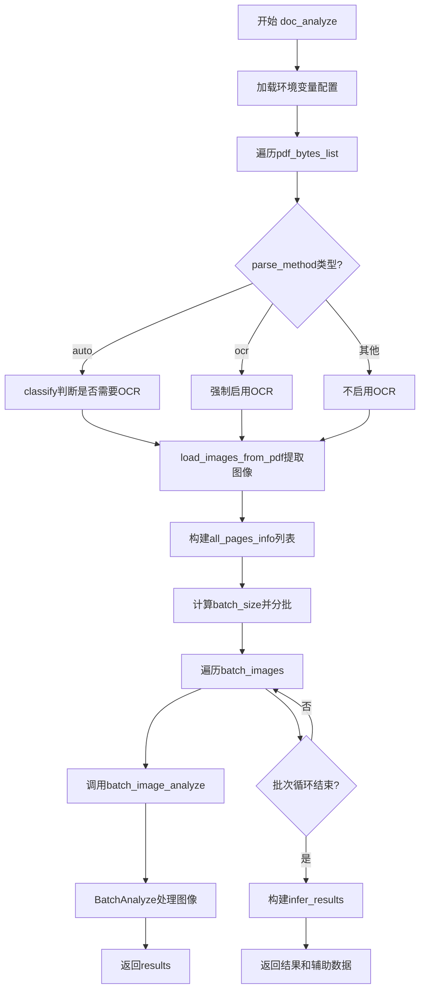
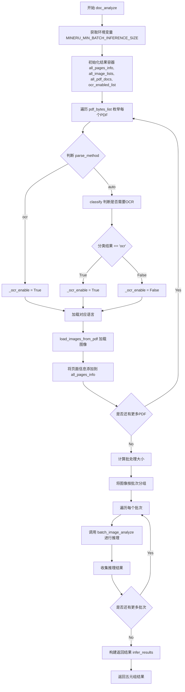
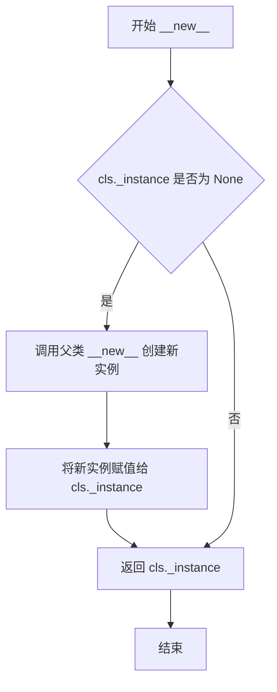

# `MinerU\mineru\backend\pipeline\pipeline_analyze.py` 详细设计文档

该代码是一个文档智能分析系统的核心模块，主要实现PDF文档的批量处理功能。它通过单例模式管理深度学习模型，从PDF中提取图像，进行OCR、布局检测、公式识别和表格识别等处理，最终返回结构化的文档分析结果。

## 整体流程



## 类结构

```
ModelSingleton (模型单例类)
├── _instance (类属性，单例实例)
├── _models (类属性，模型缓存字典)
└── get_model (实例方法，获取或创建模型)
```

## 全局变量及字段


### `PYTORCH_ENABLE_MPS_FALLBACK`
    
环境变量，允许MPS回退到CPU

类型：`str (环境变量)`
    


### `NO_ALBUMENTATIONS_UPDATE`
    
环境变量，禁止albumentations更新检查

类型：`str (环境变量)`
    


### `min_batch_inference_size`
    
批处理推理的批量大小，默认384

类型：`int`
    


### `all_pages_info`
    
存储所有页面信息的列表

类型：`List[Tuple]`
    


### `all_image_lists`
    
存储所有图像列表

类型：`List[List[dict]]`
    


### `all_pdf_docs`
    
存储所有PDF文档对象

类型：`List`
    


### `ocr_enabled_list`
    
存储每个PDF的OCR启用状态

类型：`List[bool]`
    


### `batch_images`
    
分批后的图像数据

类型：`List[List[Tuple]]`
    


### `results`
    
推理结果列表

类型：`List`
    


### `infer_results`
    
最终返回的推理结果

类型：`List[List[dict]]`
    


### `ModelSingleton._instance`
    
类属性，单例实例引用

类型：`ModelSingleton (类属性)`
    


### `ModelSingleton._models`
    
类属性，缓存的模型字典，键为(lang, formula_enable, table_enable)元组

类型：`dict (类属性)`
    
    

## 全局函数及方法


### `custom_model_init`

自定义模型初始化函数，用于根据语言、公式识别和表格识别配置初始化MineruPipelineModel模型实例。

参数：

- `lang`：可选的字符串，表示语言配置，默认为None
- `formula_enable`：布尔值，表示是否启用公式识别，默认为True
- `table_enable`：布尔值，表示是否启用表格识别，默认为True

返回值：`MineruPipelineModel`，返回初始化后的模型实例

#### 流程图

```mermaid
flowchart TD
    A[开始 custom_model_init] --> B[记录开始时间 model_init_start = time.time]
    B --> C[调用 get_device 获取设备配置]
    C --> D[创建 formula_config 字典: {enable: formula_enable}]
    D --> E[创建 table_config 字典: {enable: table_enable}]
    E --> F[构建 model_input 字典: device, table_config, formula_config, lang]
    F --> G[实例化 MineruPipelineModel(**model_input)]
    G --> H[计算初始化耗时: model_init_cost = time.time - model_init_start]
    H --> I[记录日志: logger.info model init cost]
    I --> J[返回 custom_model]
    J --> K[结束]
```

#### 带注释源码

```python
def custom_model_init(
    lang=None,
    formula_enable=True,
    table_enable=True,
):
    """
    自定义模型初始化函数
    
    参数:
        lang: 语言配置，默认None
        formula_enable: 是否启用公式识别，默认True
        table_enable: 是否启用表格识别，默认True
    
    返回:
        MineruPipelineModel: 初始化后的模型实例
    """
    # 记录模型初始化开始时间
    model_init_start = time.time()
    
    # 从配置文件读取model-dir和device
    # 调用工具函数获取当前设备配置（CPU/GPU/NPU等）
    device = get_device()

    # 构建公式识别配置字典
    formula_config = {"enable": formula_enable}
    
    # 构建表格识别配置字典
    table_config = {"enable": table_enable}

    # 组合模型输入参数
    model_input = {
        'device': device,           # 设备类型
        'table_config': table_config,  # 表格配置
        'formula_config': formula_config,  # 公式配置
        'lang': lang,               # 语言设置
    }

    # 使用输入参数实例化MineruPipelineModel模型
    custom_model = MineruPipelineModel(**model_input)

    # 计算模型初始化耗时
    model_init_cost = time.time() - model_init_start
    
    # 记录初始化耗时日志
    logger.info(f'model init cost: {model_init_cost}')

    # 返回初始化完成的模型实例
    return custom_model
```


### `doc_analyze`

主分析函数，处理PDF字节列表，根据指定的解析方法、公式启用和表格启用配置，对多个PDF文档进行批量推理分析，返回每个页面的布局检测结果、图像列表、PDF文档对象、语言列表以及OCR启用状态列表。

参数：

- `pdf_bytes_list`：`List[bytes]`，PDF文件的字节数据列表，每个元素代表一个PDF文件的字节内容
- `lang_list`：`List[str]`，语言代码列表，与`pdf_bytes_list`一一对应，指定每个PDF文档所使用的语言
- `parse_method`：`str`，解析方法，默认为`'auto'`，可选值包括`'auto'`（自动判断）、`'ocr'`（强制使用OCR）
- `formula_enable`：`bool`，是否启用公式识别，默认为`True`，设为`False`可跳过公式检测以提升性能
- `table_enable`：`bool`，是否启用表格识别，默认为`True`，设为`False`可跳过表格检测以提升性能

返回值：`Tuple[List[List[Dict]], List[List[Dict]], List[Any], List[str], List[bool]]`，返回一个五元组，包含：

- `infer_results`：推理结果列表，外层列表索引对应PDF文档序号，内层列表索引对应页面序号，每个元素包含`layout_dets`和`page_info`
- `all_image_lists`：所有PDF的图像列表，外层列表索引对应PDF文档序号，内层列表索引对应页面序号
- `all_pdf_docs`：PDF文档对象列表
- `lang_list`：输入的语言列表
- `ocr_enabled_list`：OCR启用状态列表，指示每个PDF文档是否启用了OCR处理

#### 流程图



#### 带注释源码

```python
def doc_analyze(
        pdf_bytes_list,
        lang_list,
        parse_method: str = 'auto',
        formula_enable=True,
        table_enable=True,
):
    """
    适当调大MIN_BATCH_INFERENCE_SIZE可以提高性能，更大的 MIN_BATCH_INFERENCE_SIZE会消耗更多内存，
    可通过环境变量MINERU_MIN_BATCH_INFERENCE_SIZE设置，默认值为384。
    """
    # 从环境变量获取最小批处理大小，用于控制每次推理的图像数量，平衡性能和内存占用
    min_batch_inference_size = int(os.environ.get('MINERU_MIN_BATCH_INFERENCE_SIZE', 384))

    # 收集所有页面信息
    all_pages_info = []  # 存储(dataset_index, page_index, img, ocr, lang, width, height)

    all_image_lists = []  # 存储每个PDF的所有页面图像
    all_pdf_docs = []     # 存储每个PDF的文档对象
    ocr_enabled_list = [] # 存储每个PDF的OCR启用状态
    load_images_start = time.time()
    
    # 遍历每个PDF字节列表，处理单个PDF文档
    for pdf_idx, pdf_bytes in enumerate(pdf_bytes_list):
        # 确定OCR设置：根据parse_method参数和分类结果决定是否启用OCR
        _ocr_enable = False
        if parse_method == 'auto':
            # 自动模式下，通过classify函数判断是否需要OCR
            if classify(pdf_bytes) == 'ocr':
                _ocr_enable = True
        elif parse_method == 'ocr':
            # 强制OCR模式
            _ocr_enable = True

        # 记录当前PDF的OCR启用状态
        ocr_enabled_list.append(_ocr_enable)
        # 获取当前PDF对应的语言设置
        _lang = lang_list[pdf_idx]

        # 收集每个数据集中的页面
        # 使用load_images_from_pdf将PDF字节转换为PIL图像列表和PDF文档对象
        images_list, pdf_doc = load_images_from_pdf(pdf_bytes, image_type=ImageType.PIL)
        all_image_lists.append(images_list)
        all_pdf_docs.append(pdf_doc)
        
        # 将每个页面的信息添加到总页面信息列表中
        for page_idx in range(len(images_list)):
            img_dict = images_list[page_idx]
            # 存储格式: (pdf索引, 页面索引, PIL图像, OCR启用标志, 语言)
            all_pages_info.append((
                pdf_idx, page_idx,
                img_dict['img_pil'], _ocr_enable, _lang,
            ))
    
    # 记录图像加载耗时并打印调试信息
    load_images_time = round(time.time() - load_images_start, 2)
    logger.debug(f"load images cost: {load_images_time}, speed: {round(len(all_pages_info) / load_images_time, 3)} images/s")

    # 准备批处理：将页面信息转换为(图像, OCR标志, 语言)元组列表
    images_with_extra_info = [(info[2], info[3], info[4]) for info in all_pages_info]
    batch_size = min_batch_inference_size
    # 按照批次大小分割图像列表
    batch_images = [
        images_with_extra_info[i:i + batch_size]
        for i in range(0, len(images_with_extra_info), batch_size)
    ]

    # 执行批处理：遍历每个批次进行推理
    results = []
    processed_images_count = 0
    infer_start = time.time()
    for index, batch_image in enumerate(batch_images):
        processed_images_count += len(batch_image)
        logger.info(
            f'Batch {index + 1}/{len(batch_images)}: '
            f'{processed_images_count} pages/{len(images_with_extra_info)} pages'
        )
        # 调用batch_image_analyze对当前批次进行推理分析
        batch_results = batch_image_analyze(batch_image, formula_enable, table_enable)
        results.extend(batch_results)
    
    # 记录推理耗时并打印性能信息
    infer_time = round(time.time() - infer_start, 2)
    logger.debug(f"infer finished, cost: {infer_time}, speed: {round(len(results) / infer_time, 3)} page/s")

    # 构建返回结果：按PDF文档和页面组织推理结果
    infer_results = []

    # 初始化每个PDF的结果列表
    for _ in range(len(pdf_bytes_list)):
        infer_results.append([])

    # 将推理结果与页面信息关联，构建最终的返回格式
    for i, page_info in enumerate(all_pages_info):
        pdf_idx, page_idx, pil_img, _, _ = page_info
        result = results[i]

        # 构建页面信息字典，包含页码和图像尺寸
        page_info_dict = {'page_no': page_idx, 'width': pil_img.width, 'height': pil_img.height}
        # 构建页面结果字典，包含布局检测结果和页面信息
        page_dict = {'layout_dets': result, 'page_info': page_info_dict}

        # 将结果添加到对应PDF的结果列表中
        infer_results[pdf_idx].append(page_dict)

    # 返回五元组：推理结果、图像列表、PDF文档、语言列表、OCR启用状态列表
    return infer_results, all_image_lists, all_pdf_docs, lang_list, ocr_enabled_list
```


### `batch_image_analyze`

**描述**：这是一个全局批处理图像分析函数，负责接收待分析的图像列表及配置参数，动态根据当前硬件（GPU/NPU）的显存大小计算最优的批处理比率，检查运行时环境（PyTorch版本、设备类型）以配置推理引擎，实例化`BatchAnalyze`类执行模型推理，并在推理完成后清理内存，最终返回结构化的分析结果列表。

#### 参数

- `images_with_extra_info`：`List[Tuple[Image.Image, bool, str]]`，待分析的图像列表，其中每个元素为包含PIL图像对象、OCR启用状态（布尔值）和语言代码（字符串）的元组。
- `formula_enable`：`bool`，可选参数，默认为`True`，控制是否启用公式检测功能。
- `table_enable`：`bool`，可选参数，默认为`True`，控制是否启用表格检测功能。

#### 返回值

- `List[Any]`：返回批量图像的分析结果列表，具体内容取决于`BatchAnalyze`内部实现，通常为包含布局、公式、表格等检测结果的字典列表。

#### 流程图

```mermaid
flowchart TD
    A([Start batch_image_analyze]) --> B[Import BatchAnalyze Class]
    B --> C[Get ModelSingleton Instance]
    C --> D[Get Current Device Info]
    D --> E{Is Device NPU?}
    E -- Yes --> F[Check torch_npu Availability & Set Mode]
    E -- No --> G[Get VRAM / GPU Memory]
    F --> G
    G --> H{Memory >= 16GB?}
    H -- Yes --> I[batch_ratio = 16]
    H -- No --> J{Memory >= 12GB?}
    J -- Yes --> K[batch_ratio = 8]
    J -- No --> L{Memory >= 8GB?}
    L -- Yes --> M[batch_ratio = 4]
    L -- No --> N{Memory >= 6GB?}
    N -- Yes --> O[batch_ratio = 2]
    N -- No --> P[batch_ratio = 1]
    
    I --> Q[Check PyTorch Version & Env]
    K --> Q
    M --> Q
    O --> Q
    P --> Q
    
    Q --> R{Version >= 2.8.0 or MPS or CoreX?}
    R -- Yes --> S[enable_ocr_det_batch = False]
    R -- No --> T[enable_ocr_det_batch = True]
    
    S --> U[Initialize BatchAnalyze Model]
    T --> U
    U --> V[Execute Inference: batch_model(images_with_extra_info)]
    V --> W[Clean Memory]
    W --> X([Return Results])
```

#### 带注释源码

```python
def batch_image_analyze(
        images_with_extra_info: List[Tuple[Image.Image, bool, str]],
        formula_enable=True,
        table_enable=True):
    """
    批量图像分析函数
    :param images_with_extra_info: 图像列表，包含img, ocr_enable, lang
    :param formula_enable: 是否启用公式
    :param table_enable: 是否启用表格
    :return: 分析结果列表
    """
    
    # 1. 动态导入批处理分析类（延迟导入）
    from .batch_analyze import BatchAnalyze

    # 2. 获取模型单例管理器
    model_manager = ModelSingleton()

    # 3. 获取当前设备（CPU, GPU, NPU等）
    device = get_device()

    # 4. NPU 设备特殊处理：检查 torch_npu 是否可用并设置编译模式
    if str(device).startswith('npu'):
        try:
            import torch_npu
            if torch_npu.npu.is_available():
                # 关闭 JIT 编译模式以兼容某些算子
                torch_npu.npu.set_compile_mode(jit_compile=False)
        except Exception as e:
            raise RuntimeError(
                "NPU is selected as device, but torch_npu is not available. "
                "Please ensure that the torch_npu package is installed correctly."
            ) from e

    # 5. 获取设备显存大小，用于动态决定批处理比例
    gpu_memory = get_vram(device)
    
    # 6. 根据显存大小选择最优的 batch_ratio
    # 这是一个关键的优化点，显存越大，可以一次性处理更多图像
    if gpu_memory >= 16:
        batch_ratio = 16
    elif gpu_memory >= 12:
        batch_ratio = 8
    elif gpu_memory >= 8:
        batch_ratio = 4
    elif gpu_memory >= 6:
        batch_ratio = 2
    else:
        batch_ratio = 1
        
    logger.info(
            f'GPU Memory: {gpu_memory} GB, Batch Ratio: {batch_ratio}. '
    )

    # 7. 检测环境以确定 OCR 批量检测开关
    # 部分旧版 PyTorch 或特定设备（MPS, CoreX）对批量 OCR 支持有限，需根据版本关闭或开启
    import torch
    from packaging import version
    device_type = os.getenv("MINERU_LMDEPLOY_DEVICE", "")
    if (
            version.parse(torch.__version__) >= version.parse("2.8.0")
            or str(device).startswith('mps')
            or device_type.lower() in ["corex"]
    ):
        enable_ocr_det_batch = False
    else:
        enable_ocr_det_batch = True

    # 8. 实例化批处理分析模型，传入配置参数
    batch_model = BatchAnalyze(model_manager, batch_ratio, formula_enable, table_enable, enable_ocr_det_batch)
    
    # 9. 执行推理
    results = batch_model(images_with_extra_info)

    # 10. 推理完成后清理显存，防止后续操作OOM
    clean_memory(get_device())

    return results
```

### 关键组件信息

1.  **ModelSingleton**：模型单例类，用于管理`MineruPipelineModel`的生命周期，确保同一配置下模型只初始化一次，节省资源。
2.  **BatchAnalyze**：（来自`.batch_analyze`）核心推理执行类，封装了数据预处理、模型前向传播和后处理逻辑。
3.  **get_device / get_vram**：工具函数，分别用于获取当前配置的运行设备（如 cuda:0, npu:0）和获取设备的显存大小（GB）。
4.  **clean_memory**：内存清理工具，用于在推理批次之间或之后释放显存缓存。

### 潜在的技术债务或优化空间

1.  **硬编码的显存阈值**：显存大小与`batch_ratio`的映射关系（16G->16, 12G->8等）是硬编码在函数内部的。如果需要支持新的硬件配置或不同的模型，可能需要修改源码。建议将这部分配置抽离到配置文件中。
2.  **复杂的版本检测逻辑**：关于`enable_ocr_det_batch`的判断逻辑包含了版本号比较、字符串设备名判断和环境变量读取，逻辑较为复杂且分散在业务代码中，可考虑封装为统一的`FeatureFlagManager`或配置类。
3.  **内部导入（Late Import）**：`BatchAnalyze`是在函数内部导入的。虽然这可能是为了避免循环依赖或减少启动时的开销，但不利于静态分析和类型检查。

### 其它项目

#### 设计目标与约束
- **动态资源适配**：该函数的核心设计目标是根据运行时的硬件资源（显存）动态调整批处理（Batch Processing）的大小，以在有限资源下完成推理或最大化吞吐量。
- **环境兼容性**：代码需要同时支持 NVIDIA GPU、华为 NPU 以及 Apple MPS 等多种设备，并处理不同 PyTorch 版本的兼容性问题。

#### 错误处理与异常设计
- **NPU 特定错误**：当设备指定为 NPU 但环境缺少`torch_npu`库时，函数会主动抛出`RuntimeError`，明确提示用户安装依赖，而不是在后续推理中失败。
- **静默失败风险**：如果`get_vram`获取失败或返回异常值，可能导致`batch_ratio`计算错误，需确保工具函数的稳定性。

#### 数据流与状态机
- **输入**：接收来自`doc_analyze`拆分后的页面数据（`images_with_extra_info`）。
- **状态**：函数内部会经历“设备检查” -> “资源配置计算” -> “模型初始化” -> “推理执行” -> “资源释放”这几个关键状态。
- **输出**：将推理结果（通常包含Layout检测、Formula、Table结果）传递回上层`doc_analyze`进行结果聚合。


### `ModelSingleton.__new__`

魔术方法，实现单例模式，确保 `ModelSingleton` 类在程序运行期间只存在一个实例，并通过类变量 `_models` 缓存不同配置的模型。

参数：

- `cls`：`type`，Python 自动传入的类对象，表示当前类
- `*args`：`tuple`，可变位置参数，用于传递构造函数的其他位置参数
- `**kwargs`：`dict`，可变关键字参数，用于传递构造函数的其他关键字参数

返回值：`ModelSingleton`，返回单例实例对象

#### 流程图



#### 带注释源码

```python
def __new__(cls, *args, **kwargs):
    """
    魔术方法，实现单例模式。
    
    当首次创建 ModelSingleton 实例时，会创建新实例并存入类变量 _instance。
    后续调用时直接返回已创建的实例，确保全局只有一个 ModelSingleton 对象。
    
    参数:
        cls: 类对象，Python 自动传入，表示当前类
        *args: 可变位置参数，用于传递构造函数的其他位置参数
        **kwargs: 可变关键字参数，用于传递构造函数的其他关键字参数
    
    返回:
        ModelSingleton: 单例实例
    """
    # 检查类变量 _instance 是否为空（首次创建时为空）
    if cls._instance is None:
        # 调用父类 object 的 __new__ 方法创建新实例
        cls._instance = super().__new__(cls)
    # 返回单例实例（首次创建返回新实例，后续返回已存在的实例）
    return cls._instance
```


### ModelSingleton.get_model

获取或初始化模型实例，采用单例模式确保相同参数组合的模型只会被初始化一次。

参数：

- `self`：ModelSingleton，单例实例本身
- `lang`：str | None，指定模型处理的语言，None 表示自动检测
- `formula_enable`：bool | None，指定是否启用公式识别功能
- `table_enable`：bool | None，指定是否启用表格识别功能

返回值：`MineruPipelineModel`，返回配置好的模型实例

#### 流程图

```mermaid
flowchart TD
    A[开始 get_model] --> B[构建 key = (lang, formula_enable, table_enable)]
    B --> C{key 是否在 _models 中?}
    C -->|是| D[直接返回已有模型 _models[key]]
    C -->|否| E[调用 custom_model_init 初始化新模型]
    E --> F[将新模型存入 _models[key]]
    F --> D
    D --> G[返回模型实例]
```

#### 带注释源码

```python
def get_model(
    self,
    lang=None,
    formula_enable=None,
    table_enable=None,
):
    """
    获取或初始化模型实例。
    使用 (lang, formula_enable, table_enable) 元组作为缓存键，
    确保相同配置的模型只会被创建一次，实现单例模式的模型缓存。
    
    参数:
        lang: 语言设置，支持多语言配置
        formula_enable: 是否启用公式识别
        table_enable: 是否启用表格识别
    
    返回:
        初始化好的 MineruPipelineModel 模型实例
    """
    # 根据传入参数构建缓存键
    key = (lang, formula_enable, table_enable)
    
    # 检查模型是否已存在缓存中
    if key not in self._models:
        # 缓存不存在，调用 custom_model_init 创建新模型
        self._models[key] = custom_model_init(
            lang=lang,
            formula_enable=formula_enable,
            table_enable=table_enable,
        )
    
    # 返回模型实例（无论是从缓存获取还是新创建的）
    return self._models[key]
```

## 关键组件


### ModelSingleton (模型单例)

负责模型的单例管理和惰性加载，通过(lang, formula_enable, table_enable)三元组作为缓存键，实现模型的按需初始化和复用，避免重复创建相同配置的模型实例。

### custom_model_init (自定义模型初始化)

根据传入的语言、公式识别和表格识别配置，初始化MineruPipelineModel实例，包含设备选择、公式配置和表格配置的准备工作。

### doc_analyze (文档分析主函数)

核心文档分析流程：1)遍历PDF字节列表进行OCR自动识别或强制识别；2)从PDF加载图像并收集页面信息；3)根据MIN_BATCH_INFERENCE_SIZE分批处理；4)调用batch_image_analyze执行推理；5)构建返回结果结构。

### batch_image_analyze (批量图像分析)

批量图像推理入口，根据GPU显存大小动态计算batch_ratio（显存≥16GB时为16，≥12GB时为8，≥8GB时为4，≥6GB时为2，否则为1），处理NPU和MPS设备特殊兼容逻辑，调用BatchAnalyze执行实际推理。

### 设备与显存管理

通过get_device()获取设备类型，支持CPU、NPU、MPS、GPU等，针对NPU设备检查torch_npu可用性，根据显存大小(get_vram)动态调整批处理比例以优化性能和内存占用。

### 批处理调度

基于环境变量MINERU_MIN_BATCH_INFERENCE_SIZE（默认384）进行动态分批，将页面图像列表切分为多个批次进行循环推理，支持大规模文档的分布式处理。


## 问题及建议


### 已知问题

-   **环境变量设置时机不当**：`os.environ`的环境变量设置在模块顶层（行8-9），在导入时即执行，可能影响其他模块的初始化行为，且缺乏注释说明其必要性
-   **内存碎片风险**：`all_image_lists`、`all_pdf_docs`和`all_pages_info`在`doc_analyze`中会同时存在于内存中，若处理大量PDF文档可能导致内存峰值过高，且处理完成后未主动释放
-   **重复设备检测**：`get_device()`在`custom_model_init`和`batch_image_analyze`中都被调用，存在重复计算
-   **GPU内存判断缺乏灵活性**：batch_ratio的判断使用硬编码的阈值（16/12/8/6 GB），缺乏通过配置文件或环境变量覆盖的能力
-   **OCR分类结果未缓存**：`classify(pdf_bytes)`在循环中对每个PDF调用，若处理多个PDF会重复执行分类逻辑
-   **函数返回值数量过多**：`doc_analyze`返回5个元素（infer_results, all_image_lists, all_pdf_docs, lang_list, ocr_enabled_list），调用方需要解包5个值，设计不够优雅
-   **日志级别不一致**：部分耗时操作使用`logger.debug`，部分使用`logger.info`，影响生产环境调试体验
-   **异常处理不够健壮**：NPU相关异常直接raise终止程序，缺乏优雅降级或重试机制
-   **类型提示不够精确**：`parse_method`参数仅为`str`类型，未使用`Literal`限定有效值范围

### 优化建议

-   将环境变量设置封装为独立的配置模块或添加显式的初始化函数，在应用启动时统一调用
-   考虑使用生成器模式或分批释放策略，管理大规模PDF处理时的内存使用
-   将设备检测结果缓存或通过参数传递，避免重复调用`get_device()`
-   将GPU内存阈值和batch_ratio映射关系抽取为可配置项，支持通过配置文件或环境变量覆盖
-   考虑缓存`classify`函数的OCR分类结果，或在多PDF场景下复用分类器
-   将`doc_analyze`的返回值封装为命名元组（NamedTuple）或数据类（Dataclass），提升代码可读性和类型安全性
-   统一日志级别，建议关键性能指标使用`logger.info`，详细调试信息使用`logger.debug`
-   为NPU/MPS等特殊设备添加重试机制和降级策略，提升边缘场景的鲁棒性
-   使用`Literal`类型或枚举类限定`parse_method`等字符串参数的有效取值
-   将函数内的`import`语句移至模块顶部，避免重复导入开销
-   清理不必要的注释（如行52的注释与代码实际行为不完全匹配）


## 其它


### 设计目标与约束

本文档描述的代码是一个PDF文档智能解析与布局分析系统，其核心设计目标是实现高效的PDF到结构化数据的转换。系统支持多种语言的文档处理，能够自动识别文档中的布局元素（文本、表格、公式等），并根据配置启用或禁用OCR功能。系统设计遵循以下约束条件：支持CPU、GPU（包括NPU、MPS等）多种设备运行；通过环境变量配置批处理大小以平衡性能与内存占用；模型采用单例模式管理以避免重复加载；支持动态调整批处理比例以适配不同显存的GPU设备。

### 错误处理与异常设计

代码中的错误处理主要体现在以下几个方面：设备选择验证，当指定NPU设备但torch_npu包不可用时，抛出RuntimeError并附带明确的错误信息和解决建议；模型加载保护，ModelSingleton采用单例模式确保模型只初始化一次，避免重复加载导致的内存溢出；内存管理，调用clean_memory函数在每批推理完成后释放GPU显存；异常捕获，batch_image_analyze函数中对NPU相关的导入和设置进行了try-except保护。潜在的改进空间包括：为文件加载失败、图像转换失败、模型推理超时等场景添加更详细的异常处理和重试机制；为每种可能的错误定义具体的异常类型以便调用方进行针对性处理；添加日志级别控制和错误码系统以支持更精细的错误追踪。

### 数据流与状态机

整个系统的数据流遵循以下主要状态转换：初始化状态，系统启动时加载配置、初始化设备、设置环境变量；PDF加载状态，接收pdf_bytes_list和lang_list，遍历每个PDF文档进行分类判断和图像转换；批处理准备状态，将所有页面信息聚合并根据MIN_BATCH_INFERENCE_SIZE进行分批；模型推理状态，调用BatchAnalyze对每批图像进行布局分析、公式检测、表格检测；结果组装状态，将推理结果与页面元信息组装成最终的infer_results返回。状态转换由主函数doc_analyze顺序驱动，batch_image_analyze内部根据设备类型和GPU显存动态决定batch_ratio，体现了自适应批处理的状态机特性。

### 外部依赖与接口契约

系统依赖以下外部组件和接口：PIL(Pillow)用于图像处理；loguru用于日志记录；torch用于深度学习推理；packaging用于版本解析；mineru.utils模块中的config_reader、enum_class、pdf_classify、pdf_image_tools、model_utils等工具类。关键的外部接口契约包括：doc_analyze函数接收pdf_bytes_list(List[bytes])、lang_list(List[str])、parse_method(str)、formula_enable(bool)、table_enable(bool)，返回infer_results(List)、all_image_lists(List)、all_pdf_docs(List)、lang_list(List)、ocr_enabled_list(List)；custom_model_init函数返回MineruPipelineModel实例；ModelSingleton.get_model方法根据(lang, formula_enable, table_enable)元组作为缓存键返回对应的模型实例。

### 配置管理与环境变量

系统通过环境变量实现运行时配置的可调节性，主要包括：MINERU_MIN_BATCH_INFERENCE_SIZE控制最小批处理大小，默认384，用于平衡推理速度和内存占用；PYTORCH_ENABLE_MPS_FALLBACK允许MPS设备回退到CPU；NO_ALBUMENTATIONS_UPDATE禁止albu库更新检查；MINERU_LMDEPLOY_DEVICE指定特定设备类型。配置读取通过get_device()函数统一封装，设备类型支持cpu、cuda、npu、mps等多种后端。

### 并发与批处理策略

系统采用固定批大小（MIN_BATCH_INFERENCE_SIZE）+ 动态批比例（batch_ratio）的双层批处理策略，外层批处理控制单次推理的图像数量以适配内存，内层批处理（batch_ratio）控制模型内部并行度以适配GPU算力。batch_ratio根据GPU显存大小动态计算：16GB以上显存使用16，12-16GB使用8，8-12GB使用4，6-8GB使用2，6GB以下使用1。推理过程按顺序执行batch循环，不支持多线程并行，以简化状态管理和保证结果顺序。

### 内存管理与资源释放

系统实现了多层次的内存管理机制：ModelSingleton管理模型实例生命周期，模型在首次请求时加载并缓存；batch_image_analyze在每批推理完成后调用clean_memory释放中间变量；load_images_from_pdf返回的PIL图像和PDF文档对象在doc_analyze返回后由调用方负责释放。GPU显存估算通过get_vram函数实现，该函数根据设备类型调用不同的显存查询接口。系统未实现显式的显存垃圾回收回调或显存监控告警机制。

### 日志与监控设计

系统使用loguru库进行日志记录，主要日志点包括：模型初始化耗时（model init cost）、图像加载耗时和吞吐量（load images cost, speed images/s）、推理耗时和吞吐量（infer finished, cost, speed page/s）、GPU显存和批处理比例（GPU Memory, Batch Ratio）。日志级别默认采用debug级别以保证生产环境的性能，日志格式包含时间戳、日志级别、调用位置和消息内容。改进建议：可增加结构化日志输出以便日志聚合系统解析；可添加关键指标的性能趋势监控；可记录每次请求的完整上下文以便问题排查。

### 版本兼容性与平台适配

代码对多个运行平台进行了适配处理：NPU设备需要特殊处理torch_npu模块和编译模式；MPS设备需要启用PYTORCH_ENABLE_MPS_FALLBACK；CUDA设备根据torch版本决定是否启用OCR检测批处理（2.8.0以下版本启用）；LMDeploy的CoreX设备通过MINERU_LMDEPLOY_DEVICE环境变量识别。packaging库的version.parse用于安全地比较版本号。平台检测通过get_device()函数和os.getenv()环境变量读取实现，支持的设备类型包括cpu、cuda、npu、mps、corex等。

    