# `MinerU\mineru\backend\pipeline\pipeline_magic_model.py` 详细设计文档

MagicModel是一个页面布局后处理模型，用于对多模型检测结果进行清洗、修正和整合。它通过坐标轴修正、低置信度过滤、高IoU重叠去除、脚注修正以及图像/表格重叠处理等步骤提升数据质量，并提供统一接口获取图片、表格、公式、文本等各类元素的结构化信息。

## 整体流程

```mermaid
graph TD
A[开始: MagicModel初始化] --> B[__fix_axis: 坐标轴修正]
B --> C[__fix_by_remove_low_confidence: 过滤低置信度(<0.05)]
C --> D[__fix_by_remove_high_iou_and_low_confidence: 去除高IoU低置信度]
D --> E[__fix_footnote: 修正脚注类型]
E --> F[__fix_by_remove_overlap_image_table_body: 去除图像/表格重叠]
F --> G{外部调用getter方法}
G --> H[get_imgs: 获取图片及标题脚注]
G --> I[get_tables: 获取表格及标题脚注]
G --> J[get_equations: 获取公式]
G --> K[get_text_blocks: 获取文本块]
G --> L[get_title_blocks: 获取标题块]
G --> M[get_all_spans: 获取所有span元素]
G --> N[get_discarded: 获取被丢弃块]
```

## 类结构

```
MagicModel (页面布局后处理主类)
```

## 全局变量及字段


### `MagicModel.__page_model_info`
    
页面模型信息，包含layout_dets等布局检测结果

类型：`dict`
    


### `MagicModel.__scale`
    
缩放因子，用于坐标转换

类型：`float`
    
    

## 全局函数及方法


### `bbox_relative_pos`

该函数用于计算两个边界框（bounding box）之间的相对位置关系，返回四个布尔值分别表示第一个边界框相对于第二个边界框的位置：左侧(left)、右侧(right)、下方(bottom)、上方(top)。

参数：

- `bbox1`：`list` 或 `tuple`，第一个边界框，格式为 [x1, y1, x2, y2]，其中 (x1, y1) 为左上角坐标，(x2, y2) 为右下角坐标
- `bbox2`：`list` 或 `tuple`，第二个边界框，格式为 [x1, y1, x2, y2]

返回值：`tuple[bool, bool, bool, bool]`，四个布尔值，分别表示 bbox1 相对于 bbox2 的位置关系：(left, right, bottom, top)

#### 流程图

```mermaid
flowchart TD
    A[开始] --> B[输入两个bbox: bbox1, bbox2]
    B --> C[获取bbox1和bbox2的坐标信息]
    C --> D{判断bbox1是否在bbox2的左侧}
    D -->|是| E[left = True]
    D -->|否| F[left = False]
    E --> G{判断bbox1是否在bbox2的右侧}
    F --> G
    G -->|是| H[right = True]
    G -->|否| I[right = False]
    H --> J{判断bbox1是否在bbox2的下方}
    I --> J
    J -->|是| K[bottom = True]
    J -->|否| L[bottom = False]
    K --> M{判断bbox1是否在bbox2的上方}
    L --> M
    M -->|是| N[top = True]
    M -->|否| O[top = False]
    E --> P
    F --> P
    I --> P
    N --> P
    O --> P
    P[返回 (left, right, bottom, top)]
    P --> Q[结束]
```

#### 带注释源码

```python
def bbox_relative_pos(bbox1, bbox2):
    """
    计算两个边界框之间的相对位置关系
    
    参数:
        bbox1: 第一个边界框 [x1, y1, x2, y2]
        bbox2: 第二个边界框 [x1, y1, x2, y2]
    
    返回:
        (left, right, bottom, top): 四个布尔值
            left: bbox1是否在bbox2的左侧
            right: bbox1是否在bbox2的右侧
            bottom: bbox1是否在bbox2的下方
            top: bbox1是否在bbox2的上方
    """
    # 提取bbox1的坐标
    x1_1, y1_1, x2_1, y2_1 = bbox1
    # 提取bbox2的坐标
    x1_2, y1_2, x2_2, y2_2 = bbox2
    
    # 判断左侧：bbox1的右边界在bbox2的左边界左侧
    left = x2_1 <= x1_2
    
    # 判断右侧：bbox1的左边界在bbox2的右边界右侧
    right = x1_1 >= x2_2
    
    # 判断下方：bbox1的顶边界在bbox2的底边界下方
    bottom = y2_1 <= y1_2
    
    # 判断上方：bbox1的底边界在bbox2的顶边界上方
    top = y1_1 >= y2_2
    
    return (left, right, bottom, top)
```


### `calculate_iou`

计算两个边界框（bbox）的Intersection over Union（IoU）值，即交并比，用于衡量两个矩形区域的重叠程度。

参数：

- `bbox1`：list[float] 或 tuple[float]，第一个边界框，格式为 [x0, y0, x1, y1]，其中 (x0, y0) 为左上角坐标，(x1, y1) 为右下角坐标
- `bbox2`：list[float] 或 tuple[float]，第二个边界框，格式为 [x0, y0, x1, y1]，其中 (x0, y0) 为左上角坐标，(x1, y1) 为右下角坐标

返回值：`float`，返回两个边界框的IoU值，范围在0到1之间。0表示完全不重叠，1表示完全重叠。

#### 流程图

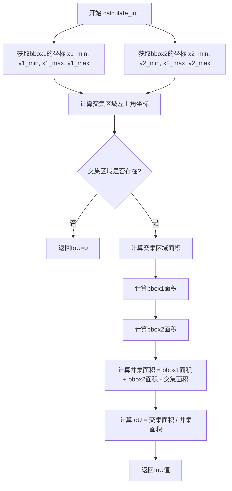

#### 带注释源码

```python
# 该函数定义位于 mineru.utils.boxbase 模块中
# 此处为基于使用方式的推断实现

def calculate_iou(bbox1, bbox2):
    """
    计算两个边界框的IoU（交并比）
    
    参数:
        bbox1: 第一个边界框 [x0, y0, x1, y1]
        bbox2: 第二个边界框 [x0, y0, x1, y1]
    
    返回:
        float: IoU值，范围[0, 1]
    """
    # 提取第一个边界框的坐标
    x1_min, y1_min = bbox1[0], bbox1[1]
    x1_max, y1_max = bbox1[2], bbox1[3]
    
    # 提取第二个边界框的坐标
    x2_min, y2_min = bbox2[0], bbox2[1]
    x2_max, y2_max = bbox2[2], bbox2[3]
    
    # 计算交集区域的左上角和右下角坐标
    inter_x_min = max(x1_min, x2_min)
    inter_y_min = max(y1_min, y2_min)
    inter_x_max = min(x1_max, x2_max)
    inter_y_max = min(y1_max, y2_max)
    
    # 计算交集区域的宽度和高度
    inter_width = max(0, inter_x_max - inter_x_min)
    inter_height = max(0, inter_y_max - inter_y_min)
    
    # 计算交集面积
    inter_area = inter_width * inter_height
    
    # 计算各自区域的面积
    area1 = (x1_max - x1_min) * (y1_max - y1_min)
    area2 = (x2_max - x2_min) * (y2_max - y2_min)
    
    # 计算并集面积
    union_area = area1 + area2 - inter_area
    
    # 避免除零错误
    if union_area == 0:
        return 0.0
    
    # 计算并返回IoU
    iou = inter_area / union_area
    
    return iou
```

#### 在MagicModel中的调用示例

在`__fix_by_remove_high_iou_and_low_confidence`方法中的使用：

```python
# 用于检测高IoU重叠的布局元素，删除置信度较低的那个
if calculate_iou(layout_det1['bbox'], layout_det2['bbox']) > 0.9:
    # 如果两个边界框的IoU大于0.9，认为是高度重叠
    # 保留置信度高的，删除置信度低的
    layout_det_need_remove = layout_det1 if layout_det1['score'] < layout_det2['score'] else layout_det2
```


### `bbox_distance`

该函数用于计算两个边界框（bounding box）之间的欧几里得距离，主要用于判断图像、表格与其注释（footnote）之间的空间关系，以便进行类别修正和关联。

参数：

- `bbox1`：list 或 tuple，第一个边界框，格式为 [x1, y1, x2, y2]，表示左上角和右下角坐标
- `bbox2`：list 或 tuple，第二个边界框，格式为 [x1, y1, x2, y2]，表示左上角和右下角坐标

返回值：`float`，返回两个边界框中心点之间的欧几里得距离

#### 流程图

```mermaid
graph TD
    A[开始计算bbox_distance] --> B[计算bbox1中心点<br/>cx1 = (x1+x2)/2, cy1 = (y1+y2)/2]
    B --> C[计算bbox2中心点<br/>cx2 = (x3+x4)/2, cy2 = (y3+y4)/2]
    C --> D[计算欧几里得距离<br/>distance = sqrt((cx2-cx1)² + (cy2-cy1)²)]
    D --> E[返回距离值]
```

#### 带注释源码

```python
# bbox_distance函数的实际实现位于mineru.utils.boxbase模块中
# 以下为推测的实现逻辑：

def bbox_distance(bbox1, bbox2):
    """
    计算两个边界框之间的欧几里得距离（基于中心点）
    
    参数:
        bbox1: 第一个边界框 [x1, y1, x2, y2]
        bbox2: 第二个边界框 [x1, y1, x2, y2]
    
    返回值:
        float: 两个边界框中心点之间的欧几里得距离
    """
    # 提取边界框坐标
    x1_min, y1_min, x1_max, y1_max = bbox1
    x2_min, y2_min, x2_max, y2_max = bbox2
    
    # 计算中心点坐标
    cx1 = (x1_min + x1_max) / 2
    cy1 = (y1_min + y1_max) / 2
    cx2 = (x2_min + x2_max) / 2
    cy2 = (y2_min + y2_max) / 2
    
    # 计算欧几里得距离
    distance = ((cx2 - cx1) ** 2 + (cy2 - cy1) ** 2) ** 0.5
    
    return distance
```

#### 在MagicModel类中的调用示例

```python
def _bbox_distance(self, bbox1, bbox2):
    """计算两个bbox之间的距离，用于判断元素关联性"""
    # 获取两个bbox的相对位置关系
    left, right, bottom, top = bbox_relative_pos(bbox1, bbox2)
    flags = [left, right, bottom, top]
    # 统计位置标志中有多少个为True
    count = sum([1 if v else 0 for v in flags])
    
    # 如果相对位置超过1个方向，说明两个bbox关系复杂，返回无穷大
    if count > 1:
        return float('inf')
    
    # 根据相对位置选择计算边（水平或垂直）
    if left or right:
        # 水平关系，计算高度
        l1 = bbox1[3] - bbox1[1]
        l2 = bbox2[3] - bbox2[1]
    else:
        # 垂直关系，计算宽度
        l1 = bbox1[2] - bbox1[0]
        l2 = bbox2[2] - bbox2[0]

    # 如果第二个bbox比第一个大太多（超过30%），返回无穷大
    if l2 > l1 and (l2 - l1) / l1 > 0.3:
        return float('inf')

    # 调用实际的bbox_distance函数计算距离
    return bbox_distance(bbox1, bbox2)
```

#### 实际使用场景

在`__fix_footnote`方法中，`_bbox_distance`被用于：
1. 计算图像（figures）与脚注（footnotes）之间的距离
2. 计算表格（tables）与脚注（footnotes）之间的距离
3. 根据距离关系判断是将脚注修正为`ImageFootnote`还是保持为`TableFootnote`

**注意**：由于`bbox_distance`函数是从`mineru.utils.boxbase`模块导入的外部函数，上述源码为根据使用方式推测的实现逻辑。如需查看实际源码，请直接查阅`mineru/utils/boxbase.py`文件。


### `get_minbox_if_overlap_by_ratio`

该函数用于计算两个边界框之间按指定比例重叠时的最小重叠区域边界框。如果两个边界框的重叠面积与较小边界框面积的比值超过指定阈值，则返回重叠区域的边界框；否则返回None。主要用于处理图像Body和表格Body之间的重叠移除逻辑。

参数：

- `bbox1`：`list` 或 `tuple`，第一个边界框，格式为 [x1, y1, x2, y2]（左上角和右下角坐标）
- `bbox2`：`list` 或 `tuple`，第二个边界框，格式为 [x1, y1, x2, y2]（左上角和右下角坐标）
- `ratio`：`float`，重叠比例阈值，用于判断两个边界框是否需要处理（当前代码中传入0.8）

返回值：`list` 或 `None`，返回两个边界框的最小重叠区域边界框 [x1, y1, x2, y2]，如果重叠比例小于阈值则返回 None

#### 流程图

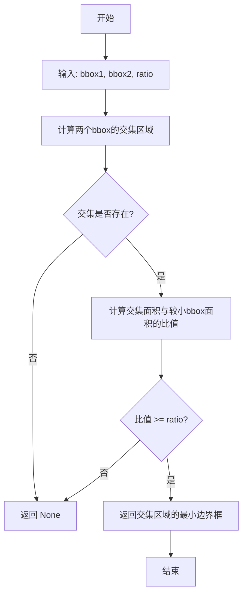

#### 带注释源码

```python
# 该函数为外部导入函数，位于 mineru.utils.boxbase 模块中
# 以下为根据调用方式推断的函数签名和逻辑说明

def get_minbox_if_overlap_by_ratio(bbox1, bbox2, ratio):
    """
    计算两个边界框按指定比例重叠时的最小重叠区域边界框
    
    参数:
        bbox1: 第一个边界框 [x1, y1, x2, y2]
        bbox2: 第二个边界框 [x1, y1, x2, y2]  
        ratio: 重叠比例阈值 (0.0-1.0)
    
    返回:
        重叠区域边界框 [x1, y1, x2, y2] 或 None
    """
    # 注意: 此函数源码位于 mineru.utils.boxbase 模块
    # 由于是外部依赖，无法直接获取其实现源码
    pass

# 在 MagicModel 中的实际调用示例:
# overlap_box = get_minbox_if_overlap_by_ratio(
#     block1['bbox'],  # 第一个图像或表格块的边界框
#     block2['bbox'],  # 第二个图像或表格块的边界框
#     0.8              # 重叠比例阈值 80%
# )
# if overlap_box is not None:
#     # 处理重叠区域...
```

#### 实际使用上下文源码

```python
def __fix_by_remove_overlap_image_table_body(self):
    """处理重叠的image_body和table_body"""
    need_remove_list = []
    layout_dets = self.__page_model_info['layout_dets']
    image_blocks = list(filter(
        lambda x: x['category_id'] == CategoryId.ImageBody, layout_dets
    ))
    table_blocks = list(filter(
        lambda x: x['category_id'] == CategoryId.TableBody, layout_dets
    ))

    def add_need_remove_block(blocks):
        for i in range(len(blocks)):
            for j in range(i + 1, len(blocks)):
                block1 = blocks[i]
                block2 = blocks[j]
                # 调用 get_minbox_if_overlap_by_ratio 检查重叠
                overlap_box = get_minbox_if_overlap_by_ratio(
                    block1['bbox'], block2['bbox'], 0.8  # 80% 重叠阈值
                )
                if overlap_box is not None:
                    # 判断哪个区块的面积更小，移除较小的区块
                    area1 = (block1['bbox'][2] - block1['bbox'][0]) * (block1['bbox'][3] - block1['bbox'][1])
                    area2 = (block2['bbox'][2] - block2['bbox'][0]) * (block2['bbox'][3] - block2['bbox'][1])
                    # ... 后续处理逻辑
```

#### 备注

该函数定义在 `mineru.utils.boxbase` 模块中，属于外部依赖。当前代码文件通过 `from mineru.utils.boxbase import ...` 导入该函数。由于未提供 `boxbase.py` 的源码，上述函数实现为基于使用方式的逻辑推断。如需获取完整源码，请参考 `mineru/utils/boxbase.py` 文件。


### CategoryId（枚举类导入）

CategoryId 是从 mineru.utils.enum_class 模块导入的枚举类，用于标识文档布局分析中不同类型的元素（如图片、表格、标题、脚注等）。该枚举类在 MagicModel 类中被广泛用于过滤、分类和处理不同类型的页面元素。

参数：该函数为枚举类导入，无传统意义上的函数参数。

返回值：`CategoryId`，返回枚举类本身，用于在整个 MagicModel 类中引用不同的文档元素类别。

#### 流程图

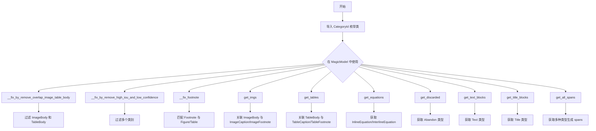

#### 带注释源码

```python
# 导入 CategoryId 枚举类，用于标识文档布局中的不同元素类型
from mineru.utils.enum_class import CategoryId, ContentType


# CategoryId 在 MagicModel 类中的具体使用示例：

# 1. 在 __fix_by_remove_overlap_image_table_body 方法中过滤图片和表格块
image_blocks = list(filter(
    lambda x: x['category_id'] == CategoryId.ImageBody, layout_dets
))
table_blocks = list(filter(
    lambda x: x['category_id'] == CategoryId.TableBody, layout_dets
))

# 2. 在 __fix_by_remove_high_iou_and_low_confidence 方法中定义的类别白名单
layout_dets = list(filter(
    lambda x: x['category_id'] in [
        CategoryId.Title,              # 标题
        CategoryId.Text,               # 文本
        CategoryId.ImageBody,          # 图片主体
        CategoryId.ImageCaption,       # 图片标题
        CategoryId.TableBody,          # 表格主体
        CategoryId.TableCaption,       # 表格标题
        CategoryId.TableFootnote,      # 表格脚注
        CategoryId.InterlineEquation_Layout,     # 行间公式（布局）
        CategoryId.InterlineEquationNumber_Layout, # 行间公式编号（布局）
    ], self.__page_model_info['layout_dets']
))

# 3. 在 __fix_footnote 方法中分类处理脚注
if obj['category_id'] == CategoryId.TableFootnote:
    footnotes.append(obj)
elif obj['category_id'] == CategoryId.ImageBody:
    figures.append(obj)
elif obj['category_id'] == CategoryId.TableBody:
    tables.append(obj)

# 根据距离将 TableFootnote 修正为 ImageFootnote
if dis_table_footnote.get(i, float('inf')) > dis_figure_footnote[i]:
    footnotes[i]['category_id'] = CategoryId.ImageFootnote

# 4. 在 get_all_spans 方法中定义允许的类别列表
allow_category_id_list = [
    CategoryId.ImageBody,              # 图片主体
    CategoryId.TableBody,               # 表格主体
    CategoryId.InlineEquation,          # 行内公式
    CategoryId.InterlineEquation_YOLO,  # 行间公式（YOLO检测）
    CategoryId.OcrText,                 # OCR识别文本
]

# 5. 在 __get_blocks_by_type 方法中按类型获取块
def __get_blocks_by_type(self, category_type: int, extra_col=None) -> list:
    # category_type 参数接收 CategoryId 枚举值
    for item in layout_dets:
        if category_id == category_type:
            # 处理对应类型的块
            pass
```

#### CategoryId 枚举类可能的定义（参考代码推断）

```python
# mineru/utils/enum_class.py 中 CategoryId 可能的定义
class CategoryId:
    """文档布局元素类别枚举"""
    Title = 1                    # 标题
    Text = 2                     # 文本段落
    ImageBody = 3                # 图片主体内容
    ImageCaption = 4             # 图片标题/说明
    ImageFootnote = 5            # 图片脚注
    TableBody = 6                # 表格主体内容
    TableCaption = 7             # 表格标题/说明
    TableFootnote = 8            # 表格脚注
    InlineEquation = 9           # 行内公式
    InterlineEquation_YOLO = 10  # 行间公式（YOLO检测）
    InterlineEquation_Layout = 11      # 行间公式（布局检测）
    InterlineEquationNumber_Layout = 12 # 行间公式编号
    Abandon = 13                  # 丢弃/无效区域
    OcrText = 14                  # OCR识别文本
    # ... 其他可能的类型
```


### `ContentType (导入-枚举类)`

ContentType 是一个从 mineru.utils.enum_class 模块导入的枚举类，用于定义文档中不同内容类型的分类标签。在 MagicModel 类的 get_all_spans 方法中，根据布局检测结果的 category_id 将不同类型的内容标记为对应的 ContentType 枚举值。

参数：
- 无（枚举类不需要实例化参数）

返回值：`ContentType` 枚举类型，返回内容类型的枚举值（如 IMAGE、TABLE、TEXT 等）

#### 流程图

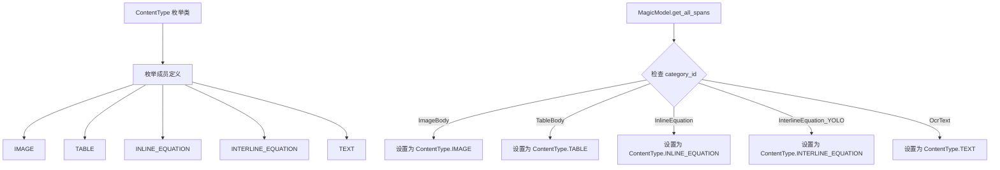

#### 带注释源码

```python
# ContentType 是从 mineru.utils.enum_class 模块导入的枚举类
# 该模块在当前代码中未显示完整定义，以下为根据代码使用情况推断的枚举成员

from mineru.utils.enum_class import CategoryId, ContentType

# ContentType 枚举类在代码中的使用示例 (MagicModel.get_all_spans 方法):
"""
class MagicModel:
    def get_all_spans(self) -> list:
        # ... 省略其他代码 ...
        
        for layout_det in layout_dets:
            category_id = layout_det['category_id']
            if category_id in allow_category_id_list:
                span = {'bbox': layout_det['bbox'], 'score': layout_det['score']}
                
                # 根据 category_id 设置对应的 ContentType
                if category_id == CategoryId.ImageBody:
                    span['type'] = ContentType.IMAGE        # 图像内容类型
                elif category_id == CategoryId.TableBody:
                    # 获取 table 模型结果
                    latex = layout_det.get('latex', None)
                    html = layout_det.get('html', None)
                    if latex:
                        span['latex'] = latex
                    elif html:
                        span['html'] = html
                    span['type'] = ContentType.TABLE        # 表格内容类型
                elif category_id == CategoryId.InlineEquation:
                    span['content'] = layout_det['latex']
                    span['type'] = ContentType.INLINE_EQUATION  # 行内公式内容类型
                elif category_id == CategoryId.InterlineEquation_YOLO:
                    span['content'] = layout_det['latex']
                    span['type'] = ContentType.INTERLINE_EQUATION  # 行间公式内容类型
                elif category_id == CategoryId.OcrText:
                    span['content'] = layout_det['text']
                    span['type'] = ContentType.TEXT          # 文本内容类型
                    
                all_spans.append(span)
        return remove_duplicate_spans(all_spans)
"""

# 根据代码推断的 ContentType 枚举成员可能包括:
# - ContentType.IMAGE: 图像内容
# - ContentType.TABLE: 表格内容  
# - ContentType.INLINE_EQUATION: 行内公式
# - ContentType.INTERLINE_EQUATION: 行间公式
# - ContentType.TEXT: 文本内容

# 该枚举类的作用是为文档布局分析结果提供统一的内容类型标识，
# 便于后续处理流程中区分不同类型的元素并进行针对性处理
```

#### 补充说明

**枚举类来源**: `mineru.utils.enum_class.ContentType`

**使用场景**: 
- 在 `MagicModel.get_all_spans()` 方法中，将布局检测的 category_id 转换为语义化的 ContentType 枚举值
- 用于区分文档中的图像、表格、公式、文本等不同内容类型
- 使得后续处理逻辑可以基于内容类型进行switch-case式的分发处理

**设计意图**:
- 提供类型安全的内容类型标识
- 替代硬编码的字符串或整数，提升代码可读性和可维护性
- 统一文档处理流程中对内容类型的认知和操作方式


### `tie_up_category_by_distance_v3`

该函数是一个基于空间距离的类别关联工具，通过接收两个回调函数（分别获取主体和客体列表），计算主体与客体之间的空间关系（距离、位置），将满足条件的客体与主体进行匹配，并返回包含主体坐标、索引及对应客体坐标列表的结果集。

参数：

- `subjects_getter`：`Callable`，一个无参数且返回主体对象列表（包含 `bbox` 和 `score` 字段的字典列表）的回调函数，用于提供待关联的主体元素。
- `objects_getter`：`Callable`，一个无参数且返回客体对象列表（包含 `bbox` 和 `score` 字段的字典列表）的回调函数，用于提供待匹配的客体元素。

返回值：`List[Dict]`，返回关联结果列表，其中每个元素为一个字典，包含以下键：
- `sub_bbox` (List[float])：主体的边界框坐标 `[x1, y1, x2, y2]`。
- `sub_idx` (int)：主体的索引。
- `obj_bboxes` (List[List[float]])：所有关联客体的边界框坐标列表。

#### 流程图

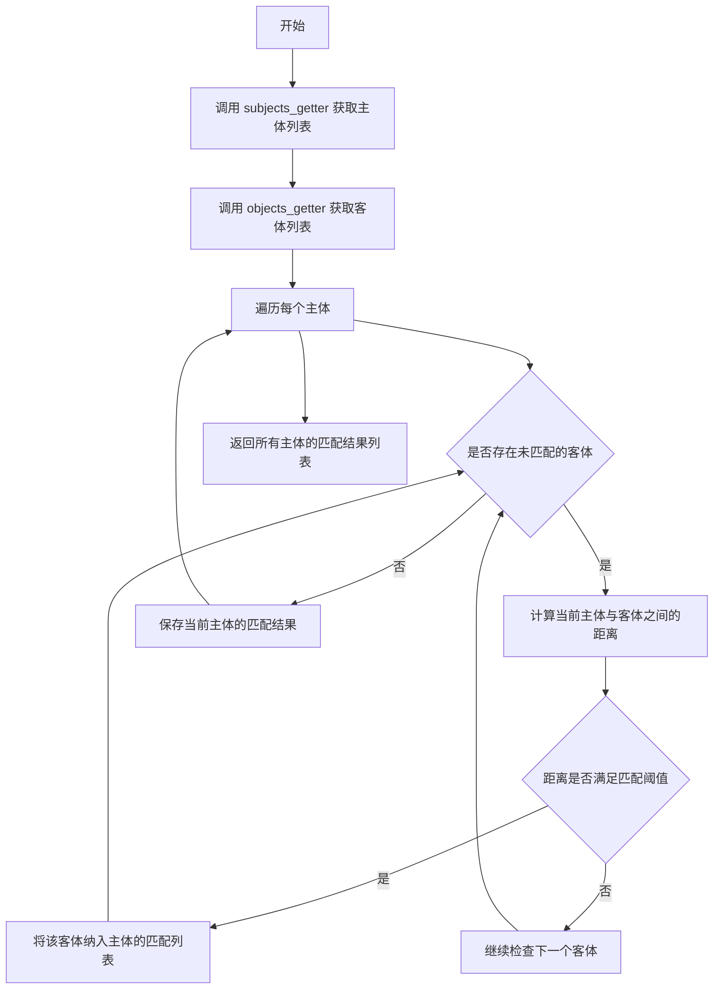

#### 带注释源码

```python
# 该函数为外部导入函数 (mineru.utils.magic_model_utils)，以下为在 MagicModel 中的调用逻辑示例

def __tie_up_category_by_distance_v3(self, subject_category_id, object_category_id):
    """
    根据类别ID获取主体和客体，并调用距离关联函数
    
    参数:
        subject_category_id: 主体元素的类别ID
        object_category_id: 客体元素的类别ID
    """
    
    def get_subjects():
        # 过滤出属于主体类别的所有元素
        raw_subjects = filter(
            lambda x: x['category_id'] == subject_category_id,
            self.__page_model_info['layout_dets']
        )
        # 提取 bbox 和 score，并去除重叠
        return reduct_overlap(
            list(
                map(
                    lambda x: {'bbox': x['bbox'], 'score': x['score']},
                    raw_subjects
                )
            )
        )

    def get_objects():
        # 过滤出属于客体类别的所有元素
        raw_objects = filter(
            lambda x: x['category_id'] == object_category_id,
            self.__page_model_info['layout_dets']
        )
        # 提取 bbox 和 score，并去除重叠
        return reduct_overlap(
            list(
                map(
                    lambda x: {'bbox': x['bbox'], 'score': x['score']},
                    raw_objects
                )
            )
        )

    # 调用核心距离关联函数，返回匹配结果
    return tie_up_category_by_distance_v3(
        get_subjects,
        get_objects
    )
```


### `reduct_overlap`

该函数为导入的外部函数，用于对具有边界框（bbox）和置信度（score）的元素列表进行重叠约简处理，根据iou和阈值去除重叠的块，保留置信度较高的块。

参数：

-  `blocks`：`list[dict]`，包含bbox和score的字典列表，每个元素代表一个检测块，通常包含 `{'bbox': [x1, y1, x2, y2], 'score': float}`

返回值：`list[dict]`，经过重叠处理后的块列表，返回结构与输入类似，每个元素包含处理后的bbox和score信息。

#### 流程图

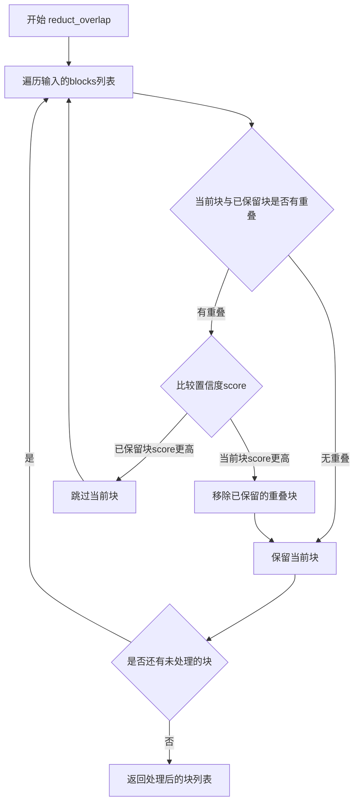

#### 带注释源码

```
# 该函数定义在 mineru.utils.magic_model_utils 模块中
# 当前代码文件中仅导入了该函数，未见其具体实现
# 根据函数名和调用方式推测源码可能如下：

def reduct_overlap(blocks: list[dict]) -> list[dict]:
    """
    对检测块进行重叠约简处理
    
    参数:
        blocks: 包含bbox和score的字典列表
                例如: [{'bbox': [x1, y1, x2, y2], 'score': 0.9}, ...]
    
    返回:
        处理后的块列表，去除了重叠的低置信度块
    """
    # 1. 按置信度从高到低排序
    sorted_blocks = sorted(blocks, key=lambda x: x.get('score', 0), reverse=True)
    
    # 2. 遍历处理重叠情况
    result = []
    for current_block in sorted_blocks:
        is_overlap = False
        for existing_block in result:
            # 计算iou
            iou = calculate_iou(current_block['bbox'], existing_block['bbox'])
            # 如果iou超过阈值，判断是否需要移除
            if iou > OVERLAP_THRESHOLD:
                is_overlap = True
                # 保留置信度高的块
                if current_block['score'] > existing_block['score']:
                    result.remove(existing_block)
                    result.append(current_block)
                break
        
        if not is_overlap:
            result.append(current_block)
    
    return result
```

#### 在MagicModel中的调用示例

```python
def __tie_up_category_by_distance_v3(self, subject_category_id, object_category_id):
    # 定义获取主体对象的函数
    def get_subjects():
        # 调用reduct_overlap对主体类别块进行重叠约简
        return reduct_overlap(
            list(
                map(
                    lambda x: {'bbox': x['bbox'], 'score': x['score']},
                    filter(
                        lambda x: x['category_id'] == subject_category_id,
                        self.__page_model_info['layout_dets'],
                    ),
                )
            )
        )

    # 定义获取客体对象的函数
    def get_objects():
        # 调用reduct_overlap对客体类别块进行重叠约简
        return reduct_overlap(
            list(
                map(
                    lambda x: {'bbox': x['bbox'], 'score': x['score']},
                    filter(
                        lambda x: x['category_id'] == object_category_id,
                        self.__page_model_info['layout_dets'],
                    ),
                )
            )
        )

    # 调用通用方法进行类别关联
    return tie_up_category_by_distance_v3(
        get_subjects,
        get_objects
    )
```


### `MagicModel.__init__`

构造函数，执行所有数据修正流程，包括坐标轴修正、低置信度数据过滤、高IoU去重、脚注类型修正以及重叠图像与表格处理。

参数：

-  `page_model_info`：`dict`，页面模型信息，包含布局检测结果（layout_dets）等
-  `scale`：`float`，缩放因子，用于将坐标从原始尺寸缩放到标准尺寸

返回值：`None`，无返回值

#### 流程图

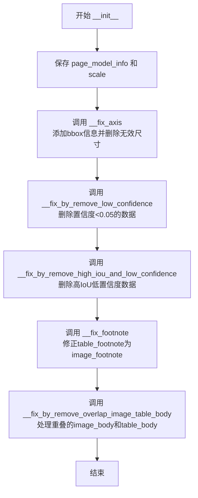

#### 带注释源码

```python
def __init__(self, page_model_info: dict, scale: float):
    """
    构造函数，执行所有数据修正流程
    
    参数:
        page_model_info: dict, 页面模型信息，包含布局检测结果
        scale: float, 缩放因子，用于坐标转换
    """
    # 存储页面模型信息（私有属性）
    self.__page_model_info = page_model_info
    # 存储缩放因子（私有属性）
    self.__scale = scale
    
    """为所有模型数据添加bbox信息(缩放，poly->bbox)"""
    # 第一步：修正坐标轴，将多边形poly转换为边界框bbox，并进行缩放
    self.__fix_axis()
    
    """删除置信度特别低的模型数据(<0.05),提高质量"""
    # 第二步：移除置信度低于0.05的低质量检测结果
    self.__fix_by_remove_low_confidence()
    
    """删除高iou(>0.9)数据中置信度较低的那个"""
    # 第三步：对于IoU超过0.9的重复检测，保留置信度较高的那个
    self.__fix_by_remove_high_iou_and_low_confidence()
    
    """将部分tbale_footnote修正为image_footnote"""
    # 第四步：根据距离关系将部分table_footnote修正为image_footnote
    self.__fix_footnote()
    
    """处理重叠的image_body和table_body"""
    # 第五步：处理图像区块和表格区块之间的重叠，移除较小的区块并扩展较大的区块
    self.__fix_by_remove_overlap_image_table_body()
```


### `MagicModel.__fix_axis`

将poly（多边形）转换为bbox（边界框）并进行缩放，同时删除宽度或高度小于等于0的块。

参数： 无

返回值：`None`，无返回值

#### 流程图

```mermaid
flowchart TD
    A[开始 __fix_axis] --> B[创建空列表 need_remove_list]
    B --> C[从 page_model_info 获取 layout_dets]
    C --> D{遍历 layout_dets 中的每个 layout_det}
    D -->|还有元素| E[从 layout_det['poly'] 提取坐标 x0, y0, x1, y1]
    E --> F[根据 scale 缩放坐标并转换为整数 bbox]
    F --> G[将 bbox 赋值给 layout_det['bbox']]
    G --> H{检查 bbox 宽高是否 <= 0}
    H -->|是| I[将该 layout_det 加入 need_remove_list]
    H -->|否| J[继续下一个元素]
    I --> D
    J --> D
    D -->|遍历完成| K[从 layout_dets 移除 need_remove_list 中的所有元素]
    K --> L[结束]
```

#### 带注释源码

```python
def __fix_axis(self):
    """将poly转换为bbox并进行缩放，删除宽高<=0的块"""
    # 用于存储需要删除的布局元素
    need_remove_list = []
    # 从页面模型信息中获取布局检测结果列表
    layout_dets = self.__page_model_info['layout_dets']
    
    # 遍历所有布局检测结果
    for layout_det in layout_dets:
        # 从poly（多边形）中提取坐标
        # poly格式为 [x0, y0, x1, y1, x2, y2, x3, y3]（4个顶点）
        x0, y0, _, _, x1, y1, _, _ = layout_det['poly']
        
        # 根据缩放比例将坐标转换为整数边界框
        # bbox格式为 [x0, y0, x1, y1]（左上角和右下角坐标）
        bbox = [
            int(x0 / self.__scale),  # 缩放后的左边界
            int(y0 / self.__scale),  # 缩放后的上边界
            int(x1 / self.__scale),  # 缩放后的右边界
            int(y1 / self.__scale),  # 缩放后的下边界
        ]
        
        # 将计算得到的bbox赋值给当前布局元素
        layout_det['bbox'] = bbox
        
        # 检查边界框的宽度和高度是否小于等于0
        # bbox[2] - bbox[0] 为宽度，bbox[3] - bbox[1] 为高度
        if bbox[2] - bbox[0] <= 0 or bbox[3] - bbox[1] <= 0:
            # 将宽度或高度<=0的元素标记为需要删除
            need_remove_list.append(layout_det)
    
    # 遍历需要删除的列表，从layout_dets中移除这些元素
    for need_remove in need_remove_list:
        layout_dets.remove(need_remove)
```


### `MagicModel.__fix_by_remove_low_confidence`

该方法是一个私有实例方法，用于遍历当前页面模型信息中的布局检测结果（layout_dets），筛选出置信度（score）低于或等于阈值的低质量检测框，并将它们从列表中移除，以确保后续处理的数据质量。

参数：
- （无）：该方法不接收显式输入参数，其执行依赖于实例属性 `self.__page_model_info`（包含页面布局检测数据）。

返回值：`None`：该方法直接修改了实例属性 `self.__page_model_info['layout_dets']` 的内容，不返回任何值。

#### 流程图

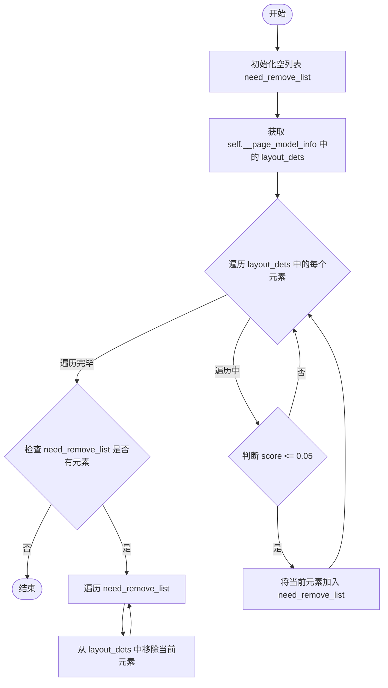

#### 带注释源码

```python
def __fix_by_remove_low_confidence(self):
    """
    删除置信度特别低的模型数据(<0.05),提高质量
    """
    # 步骤1：初始化一个列表，用于存储待移除的低置信度检测块
    need_remove_list = []
    
    # 步骤2：从页面模型信息中获取当前的布局检测列表
    layout_dets = self.__page_model_info['layout_dets']
    
    # 步骤3：遍历所有布局检测块
    for layout_det in layout_dets:
        # 步骤4：检查当前块的置信度是否小于等于阈值 0.05
        if layout_det['score'] <= 0.05:
            # 如果是低置信度，将其加入待移除列表
            need_remove_list.append(layout_det)
        else:
            # 如果置信度合格，跳过并继续下一个
            continue
    
    # 步骤5：遍历之前标记为待移除的块，将其从原始布局列表中删除
    for need_remove in need_remove_list:
        # 避免移除不存在的元素（虽然理论上应该都在）
        if need_remove in layout_dets:
            layout_dets.remove(need_remove)
```


### `MagicModel.__fix_by_remove_high_iou_and_low_confidence`

该方法为 MagicModel 类的私有方法，用于在特定类别（标题、文本、图像主体、图像标题、表格主体、表格标题、表格脚注、行内公式等）的检测框中，找出IoU大于0.9的高重叠框对，并移除其中置信度较低的那个检测框，以此提高检测质量。

参数：
- 该方法无显式参数（`self` 为隐含参数）

返回值：`None`，无返回值，直接修改 `self.__page_model_info['layout_dets']` 列表

#### 流程图

```mermaid
flowchart TD
    A[开始] --> B[初始化空列表 need_remove_list]
    B --> C[过滤出指定类别的检测框到 layout_dets]
    C --> D[外层循环 i 从 0 到 len-1]
    D --> E[内层循环 j 从 i+1 到 len-1]
    E --> F{计算 layout_dets[i] 与 layout_dets[j] 的 IoU}
    F --> G{IoU > 0.9?}
    G -->|否| H[j 循环继续]
    G -->|是| I{比较两个框的置信度 score}
    I --> J[选择置信度较低的框为待移除对象]
    J --> K{该框是否已在 need_remove_list 中?}
    K -->|否| L[将该框加入 need_remove_list]
    K -->|是| H
    L --> H
    H --> M{i 循环是否结束?]
    M -->|否| E
    M -->|是| N[遍历 need_remove_list]
    N --> O[从 self.__page_model_info['layout_dets'] 中移除各元素]
    O --> P[结束]
```

#### 带注释源码

```python
def __fix_by_remove_high_iou_and_low_confidence(self):
    """
    删除高iou(>0.9)数据中置信度较低的那个
    针对特定类别（Title, Text, ImageBody, ImageCaption, TableBody, 
    TableCaption, TableFootnote, InterlineEquation_Layout, 
    InterlineEquationNumber_Layout）的检测框进行处理
    """
    # 用于存储需要移除的检测框
    need_remove_list = []
    
    # 过滤出指定类别的检测框，这些类别的高IoU框需要处理
    layout_dets = list(filter(
        lambda x: x['category_id'] in [
            CategoryId.Title,           # 标题
            CategoryId.Text,            # 文本
            CategoryId.ImageBody,      # 图像主体
            CategoryId.ImageCaption,   # 图像标题
            CategoryId.TableBody,      # 表格主体
            CategoryId.TableCaption,   # 表格标题
            CategoryId.TableFootnote,  # 表格脚注
            CategoryId.InterlineEquation_Layout,        # 行间公式
            CategoryId.InterlineEquationNumber_Layout,   # 行间公式编号
        ], self.__page_model_info['layout_dets']
    ))
    
    # 双重循环遍历所有检测框对
    for i in range(len(layout_dets)):
        for j in range(i + 1, len(layout_dets)):
            layout_det1 = layout_dets[i]
            layout_det2 = layout_dets[j]

            # 计算两个检测框的IoU（交并比）
            if calculate_iou(layout_det1['bbox'], layout_det2['bbox']) > 0.9:
                # 当IoU大于0.9时，认为两个框高度重叠
                # 保留置信度较高的框，移除置信度较低的框
                layout_det_need_remove = (
                    layout_det1 if layout_det1['score'] < layout_det2['score'] 
                    else layout_det2
                )

                # 避免重复添加同一个框到移除列表
                if layout_det_need_remove not in need_remove_list:
                    need_remove_list.append(layout_det_need_remove)

    # 从原始布局检测列表中移除低置信度的高IoU框
    for need_remove in need_remove_list:
        self.__page_model_info['layout_dets'].remove(need_remove)
```


### `MagicModel.__fix_footnote`

该方法通过计算页面布局中 `TableFootnote`（表格脚注）与 `ImageBody`（图片主体）和 `TableBody`（表格主体）的空间距离关系，将原本被误分类为表格脚注的元素修正为图片脚注（`ImageFootnote`），从而提高脚注分类的准确性。

参数：

- 该方法为实例方法，无显式参数（隐式使用 `self` 和实例属性 `self.__page_model_info`）

返回值：`None`，该方法直接修改 `self.__page_model_info['layout_dets']` 中的元素类别

#### 流程图

```mermaid
flowchart TD
    A[开始 __fix_footnote] --> B[初始化空列表: footnotes, figures, tables]
    B --> C{遍历 layout_dets}
    C -->|category_id == TableFootnote| D[将obj加入footnotes列表]
    C -->|category_id == ImageBody| E[将obj加入figures列表]
    C -->|category_id == TableBody| F[将obj加入tables列表]
    D --> G{检查footnotes和figures是否为空}
    E --> G
    F --> G
    G -->|为空| C
    G -->|不为空| H[初始化dis_figure_footnote和dis_table_footnote字典]
    H --> I{遍历footnotes和figures组合}
    I --> J[计算脚注i与图片j的相对位置pos_flag_count]
    J --> K{pos_flag_count > 1?}
    K -->|是| I
    K -->|否| L[计算bbox距离并更新dis_figure_footnote[i]]
    L --> M{遍历footnotes和tables组合}
    M --> N[计算脚注i与表格j的相对位置pos_flag_count]
    N --> O{pos_flag_count > 1?}
    O -->|是| M
    O -->|否| P[计算bbox距离并更新dis_table_footnote[i]]
    P --> Q{遍历footnotes}
    Q --> R{检查i是否在dis_figure_footnote中}
    R -->|否| Q
    R -->|是| S{dis_table_footnote[i] > dis_figure_footnote[i]?}
    S -->|是| T[将footnotes[i]的category_id改为ImageFootnote]
    S -->|否| Q
    T --> Q
    Q --> U[结束]
```

#### 带注释源码

```python
def __fix_footnote(self):
    """
    根据距离关系将table_footnote修正为image_footnote
    
    该方法的核心逻辑：
    1. 提取页面中所有的表格脚注(TableFootnote)、图片主体(ImageBody)和表格主体(TableBody)
    2. 计算每个表格脚注与图片主体、表格主体的空间距离
    3. 如果脚注与图片的距离小于与表格的距离，则将该脚注重新分类为图片脚注(ImageFootnote)
    """
    # 用于存储不同类型的布局元素
    footnotes = []      # 表格脚注列表
    figures = []        # 图片主体列表
    tables = []         # 表格主体列表

    # 第一次遍历：从layout_dets中分离出三种类型的元素
    for obj in self.__page_model_info['layout_dets']:
        if obj['category_id'] == CategoryId.TableFootnote:
            footnotes.append(obj)      # 收集表格脚注
        elif obj['category_id'] == CategoryId.ImageBody:
            figures.append(obj)        # 收集图片主体
        elif obj['category_id'] == CategoryId.TableBody:
            tables.append(obj)         # 收集表格主体
        
        # 优化：如果footnotes或figures任一为空，提前跳过（但此逻辑在循环内有问题，应移至循环外）
        if len(footnotes) * len(figures) == 0:
            continue

    # 初始化距离字典，用于存储每个脚注到图片/表格的最小距离
    dis_figure_footnote = {}  # {脚注索引: 到最近图片的距离}
    dis_table_footnote = {}   # {脚注索引: 到最近表格的距离}

    # 第二层循环：计算每个脚注到每个图片的距离
    for i in range(len(footnotes)):
        for j in range(len(figures)):
            # bbox_relative_pos返回[left, right, bottom, top]的布尔标志
            # pos_flag_count表示两个bbox在水平或垂直方向上的重叠/相邻关系数量
            pos_flag_count = sum(
                list(
                    map(
                        lambda x: 1 if x else 0,
                        bbox_relative_pos(
                            footnotes[i]['bbox'], figures[j]['bbox']
                        ),
                    )
                )
            )
            
            # 如果位置标志超过1，说明脚注和图片在多个方向上都有关系，跳过此次计算
            if pos_flag_count > 1:
                continue
            
            # 计算脚注i与图片j的距离，并更新最小距离
            # 使用min确保每个脚注只保留与最近图片的距离
            dis_figure_footnote[i] = min(
                self._bbox_distance(figures[j]['bbox'], footnotes[i]['bbox']),
                dis_figure_footnote.get(i, float('inf')),
            )

    # 第三层循环：计算每个脚注到每个表格的距离
    for i in range(len(footnotes)):
        for j in range(len(tables)):
            # 同样计算相对位置标志
            pos_flag_count = sum(
                list(
                    map(
                        lambda x: 1 if x else 0,
                        bbox_relative_pos(
                            footnotes[i]['bbox'], tables[j]['bbox']
                        ),
                    )
                )
            )
            if pos_flag_count > 1:
                continue

            # 计算脚注i与表格j的距离，并更新最小距离
            dis_table_footnote[i] = min(
                self._bbox_distance(tables[j]['bbox'], footnotes[i]['bbox']),
                dis_table_footnote.get(i, float('inf')),
            )

    # 第四层循环：根据距离比较结果，重新分类脚注
    for i in range(len(footnotes)):
        # 跳过没有图片距离信息的脚注
        if i not in dis_figure_footnote:
            continue
        
        # 比较距离：如果到表格的距离大于到图片的距离
        # 说明该脚注更可能是图片脚注而非表格脚注
        if dis_table_footnote.get(i, float('inf')) > dis_figure_footnote[i]:
            # 执行类别修正：将TableFootnote改为ImageFootnote
            footnotes[i]['category_id'] = CategoryId.ImageFootnote
```


### `MagicModel.__fix_by_remove_overlap_image_table_body`

处理image_body和table_body之间的重叠，保留大块并扩展其边界。

参数：

- 该方法为实例方法，无需显式参数（隐式参数`self`为`MagicModel`实例）

返回值：`None`，无返回值

#### 流程图

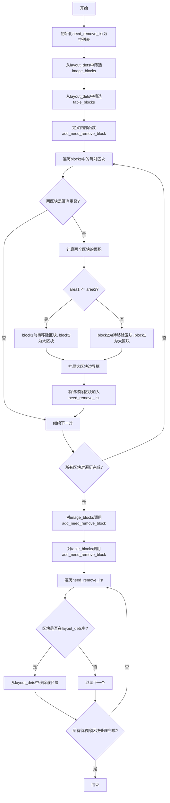

#### 带注释源码

```python
def __fix_by_remove_overlap_image_table_body(self):
    """处理image_body和table_body之间的重叠，保留大块并扩展其边界"""
    # 存储需要移除的区块列表
    need_remove_list = []
    # 从页面模型信息中获取布局检测结果
    layout_dets = self.__page_model_info['layout_dets']
    
    # 筛选出所有image_body类型的区块
    image_blocks = list(filter(
        lambda x: x['category_id'] == CategoryId.ImageBody, layout_dets
    ))
    
    # 筛选出所有table_body类型的区块
    table_blocks = list(filter(
        lambda x: x['category_id'] == CategoryId.TableBody, layout_dets
    ))

    def add_need_remove_block(blocks):
        """
        检测并处理同类区块之间的重叠
        
        参数:
            blocks: 区块列表（image_blocks或table_blocks）
        """
        # 遍历所有区块对
        for i in range(len(blocks)):
            for j in range(i + 1, len(blocks)):
                block1 = blocks[i]
                block2 = blocks[j]
                
                # 使用0.8的重叠比例阈值检测两区块是否有重叠
                # 返回重叠区域的最小边界框，如果无重叠返回None
                overlap_box = get_minbox_if_overlap_by_ratio(
                    block1['bbox'], block2['bbox'], 0.8
                )
                
                # 如果存在重叠区域
                if overlap_box is not None:
                    # 计算两个区块的面积
                    # bbox格式: [x1, y1, x2, y2]
                    area1 = (block1['bbox'][2] - block1['bbox'][0]) * (block1['bbox'][3] - block1['bbox'][1])
                    area2 = (block2['bbox'][2] - block2['bbox'][0]) * (block2['bbox'][3] - block2['bbox'][1])

                    # 面积较小的区块标记为待移除，较大的为保留区块
                    if area1 <= area2:
                        block_to_remove = block1
                        large_block = block2
                    else:
                        block_to_remove = block2
                        large_block = block1

                    # 如果该区块尚未在待移除列表中
                    if block_to_remove not in need_remove_list:
                        # 扩展大区块的边界框，包含待移除区块的区域
                        x1, y1, x2, y2 = large_block['bbox']
                        sx1, sy1, sx2, sy2 = block_to_remove['bbox']
                        # 取两个边界框的并集作为新边界
                        x1 = min(x1, sx1)
                        y1 = min(y1, sy1)
                        x2 = max(x2, sx2)
                        y2 = max(y2, sy2)
                        large_block['bbox'] = [x1, y1, x2, y2]
                        # 将待移除区块加入列表
                        need_remove_list.append(block_to_remove)

    # 处理图像-图像之间的重叠
    add_need_remove_block(image_blocks)
    # 处理表格-表格之间的重叠
    add_need_remove_block(table_blocks)

    # 从布局检测结果中移除所有标记的区块
    for need_remove in need_remove_list:
        if need_remove in layout_dets:
            layout_dets.remove(need_remove)
```


### `MagicModel._bbox_distance`

该方法用于计算两个边界框之间的距离，同时考虑它们的相对位置关系。通过判断边界框是水平还是垂直排列，以及长度差异是否过大，来决定返回计算出的距离还是无穷大。

参数：

- `bbox1`：`list`，第一个边界框
- `bbox2`：`list`，第二个边界框

返回值：`float`，两个边界框之间的距离，如果相对位置关系复杂或长度差异过大则返回正无穷

#### 流程图

```mermaid
flowchart TD
    A[开始: _bbox_distance] --> B[调用 bbox_relative_pos 获取相对位置]
    B --> C[获取 left, right, bottom, top 标志]
    C --> D[统计标志中 True 的数量 count]
    D --> E{count > 1?}
    E -->|是| F[返回 float('inf')]
    E -->|否| G{left 或 right?}
    G -->|是| H[计算高度: l1 = bbox1[3] - bbox1[1], l2 = bbox2[3] - bbox2[1]]
    G -->|否| I[计算宽度: l1 = bbox1[2] - bbox1[0], l2 = bbox2[2] - bbox2[0]]
    H --> J{l2 > l1 且 (l2 - l1) / l1 > 0.3?}
    I --> J
    J -->|是| F
    J -->|否| K[调用 bbox_distance 计算距离]
    K --> L[返回距离值]
```

#### 带注释源码

```python
def _bbox_distance(self, bbox1, bbox2):
    """
    计算两个边界框之间的距离，考虑相对位置关系
    
    参数:
        bbox1: 第一个边界框 [x1, y1, x2, y2]
        bbox2: 第二个边界框 [x1, y1, x2, y2]
    
    返回:
        float: 边界框之间的距离，如果无法计算则返回正无穷
    """
    # 调用 bbox_relative_pos 获取两个边界框的相对位置关系
    # 返回四个布尔值：左、右、下、上
    left, right, bottom, top = bbox_relative_pos(bbox1, bbox2)
    
    # 将相对位置标志放入列表
    flags = [left, right, bottom, top]
    
    # 统计有多少个方向上存在位置关系（True的数量）
    count = sum([1 if v else 0 for v in flags])
    
    # 如果在多个方向上都有位置关系（如既左又上），返回无穷大
    # 这表示两个边界框的位置关系复杂，无法简单计算距离
    if count > 1:
        return float('inf')
    
    # 根据相对位置决定使用高度还是宽度来计算长度
    if left or right:
        # 水平排列（左右关系），使用高度
        l1 = bbox1[3] - bbox1[1]  # bbox1的高度
        l2 = bbox2[3] - bbox2[1]  # bbox2的高度
    else:
        # 垂直排列（上下关系），使用宽度
        l1 = bbox1[2] - bbox1[0]  # bbox1的宽度
        l2 = bbox2[2] - bbox2[0]  # bbox2的宽度
    
    # 如果第二个边界框的长度比第一个大，且超出比例超过30%
    # 认为长度差异过大，可能不是正确的对应关系，返回无穷大
    if l2 > l1 and (l2 - l1) / l1 > 0.3:
        return float('inf')
    
    # 通过所有检查后，调用标准距离计算函数返回实际距离
    return bbox_distance(bbox1, bbox2)
```


### `MagicModel.__tie_up_category_by_distance_v3`

该方法是一个私有实例方法，通过距离关系将页面中具有特定类别ID的主体元素（如ImageBody、TableBody）与客体元素（如ImageCaption、TableCaption、ImageFootnote、TableFootnote）进行配对关联，内部定义了两个辅助函数分别获取主体和客体列表，并调用外部工具函数 `tie_up_category_by_distance_v3` 完成最终的配对逻辑。

参数：

- `self`：MagicModel 实例本身隐式参数
- `subject_category_id`：`int`，主体类别ID，用于指定需要关联的主体元素类别（如ImageBody=1、TableBody=2等）
- `object_category_id`：`int`，客体类别ID，用于指定需要关联的客体元素类别（如ImageCaption、TableCaption等）

返回值：`dict`，返回主体与客体配对关联的结果字典，包含主体边界框、客体边界框列表、主体索引等配对信息

#### 流程图

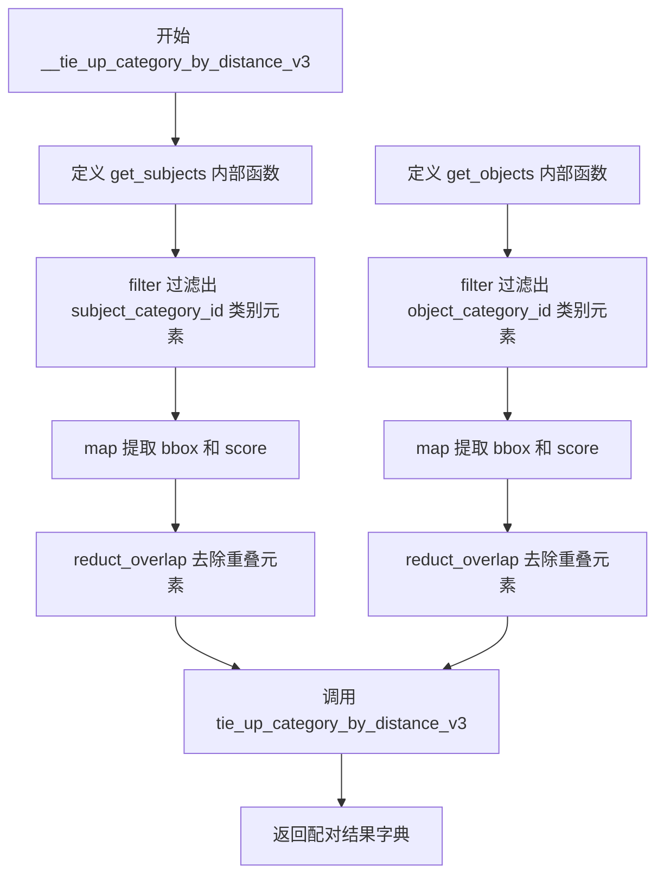

#### 带注释源码

```python
def __tie_up_category_by_distance_v3(self, subject_category_id, object_category_id):
    """
    根据距离关系将主体与客体进行配对关联
    
    参数:
        subject_category_id: int, 主体类别ID
        object_category_id: int, 客体类别ID
    
    返回:
        dict: 主体与客体配对关联的结果
    """
    
    # 定义获取主体对象的内部函数
    def get_subjects():
        # 从页面布局检测结果中筛选出指定主体类别ID的所有元素
        # 使用 filter 按 category_id 过滤
        # 使用 map 提取每个元素的 bbox 和 score 组成新字典
        # 使用 reduct_overlap 去除重叠的元素，返回去重后的主体列表
        return reduct_overlap(
            list(
                map(
                    lambda x: {'bbox': x['bbox'], 'score': x['score']},
                    filter(
                        lambda x: x['category_id'] == subject_category_id,
                        self.__page_model_info['layout_dets'],
                    ),
                )
            )
        )

    # 定义获取客体对象的内部函数
    def get_objects():
        # 从页面布局检测结果中筛选出指定客体类别ID的所有元素
        # 处理流程与 get_subjects 相同
        # 使用 reduct_overlap 去除重叠的元素，返回去重后的客体列表
        return reduct_overlap(
            list(
                map(
                    lambda x: {'bbox': x['bbox'], 'score': x['score']},
                    filter(
                        lambda x: x['category_id'] == object_category_id,
                        self.__page_model_info['layout_dets'],
                    ),
                )
            )
        )

    # 调用外部通用方法 tie_up_category_by_distance_v3
    # 传入 get_subjects 和 get_objects 两个函数引用
    # 该方法内部会调用这两个函数获取主体和客体列表，然后根据距离进行配对
    return tie_up_category_by_distance_v3(
        get_subjects,
        get_objects
    )
```


### `MagicModel.get_imgs`

获取图片及其标题和脚注列表，通过距离匹配将图片主体（ImageBody）与对应的图片标题（ImageCaption）和图片脚注（ImageFootnote）进行关联配对。

参数：  
无参数

返回值：`list`，返回图片记录列表，每条记录包含图片主体边界框、标题列表和脚注列表

#### 流程图

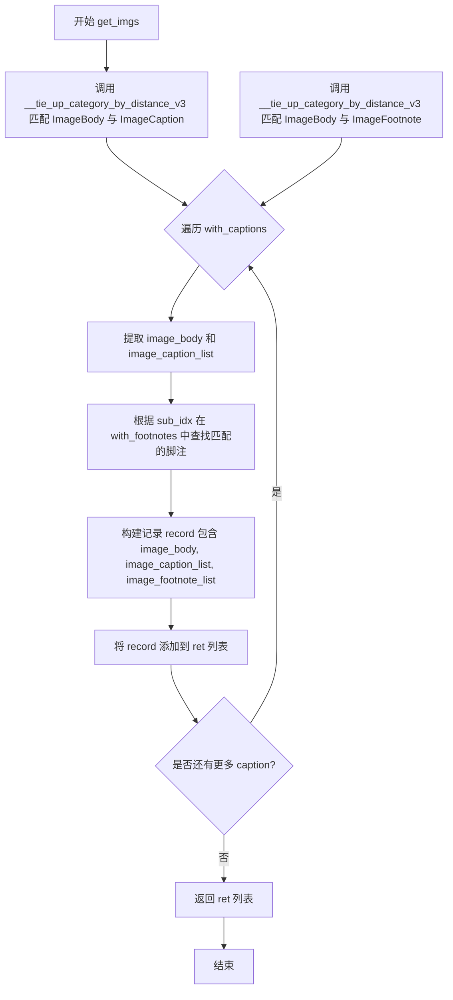

#### 带注释源码

```python
def get_imgs(self):
    """
    获取图片及其标题和脚注列表
    
    通过距离匹配算法将 ImageBody（图片主体）与对应的 
    ImageCaption（图片标题）和 ImageFootnote（图片脚注）进行关联配对，
    返回包含图片本体、标题列表和脚注列表的结构化数据。
    
    Returns:
        list: 图片记录列表，每个元素为包含以下键的字典：
            - image_body: 图片主体的边界框 [x1, y1, x2, y2]
            - image_caption_list: 图片标题边界框列表
            - image_footnote_list: 图片脚注边界框列表
    """
    # 步骤1: 使用距离匹配算法关联 ImageBody 和 ImageCaption
    # 返回格式: [{'sub_bbox': ..., 'sub_idx': ..., 'obj_bboxes': [...], 'obj_idx': ...}, ...]
    with_captions = self.__tie_up_category_by_distance_v3(
        CategoryId.ImageBody, CategoryId.ImageCaption
    )
    
    # 步骤2: 使用距离匹配算法关联 ImageBody 和 ImageFootnote
    # 返回格式同上，包含图片主体对应的脚注信息
    with_footnotes = self.__tie_up_category_by_distance_v3(
        CategoryId.ImageBody, CategoryId.ImageFootnote
    )
    
    # 步骤3: 遍历所有配对结果，构建返回记录
    ret = []
    for v in with_captions:
        # 提取当前图片主体的边界框和标题列表
        record = {
            'image_body': v['sub_bbox'],           # 图片主体边界框
            'image_caption_list': v['obj_bboxes'], # 对应的标题边界框列表
        }
        
        # 步骤4: 根据 sub_idx（图片主体的索引）在脚注列表中查找对应的脚注
        filter_idx = v['sub_idx']                  # 获取当前图片主体的索引
        # 使用 filter 查找匹配的图片脚注记录
        d = next(filter(lambda x: x['sub_idx'] == filter_idx, with_footnotes))
        
        # 步骤5: 将脚注列表添加到记录中
        record['image_footnote_list'] = d['obj_bboxes']  # 对应的脚注边界框列表
        
        # 步骤6: 将构建好的记录添加到结果列表
        ret.append(record)
    
    # 步骤7: 返回所有图片记录
    return ret
```


### `MagicModel.get_tables`

获取表格及其标题和脚注列表。该方法通过调用距离关联方法，将表格主体（TableBody）与标题（TableCaption）和脚注（TableFootnote）分别进行匹配关联，最终返回一个包含表格主体、标题列表和脚注列表的字典列表。

参数：

- 该方法没有显式参数（仅包含隐式参数 `self`）

返回值：`list`，返回表格及其标题和脚注列表。每个元素为一个字典，包含 `table_body`（表格主体边界框）、`table_caption_list`（标题边界框列表）和 `table_footnote_list`（脚注边界框列表）。

#### 流程图

```mermaid
flowchart TD
    A[开始 get_tables] --> B[调用 __tie_up_category_by_distance_v3 关联 TableBody 和 TableCaption]
    B --> C[调用 __tie_up_category_by_distance_v3 关联 TableBody 和 TableFootnote]
    C --> D[初始化空列表 ret]
    D --> E{遍历 with_captions}
    E -->|取出元素 v| F[构建 record 字典<br/>table_body: v['sub_bbox']<br/>table_caption_list: v['obj_bboxes']]
    F --> G[获取 filter_idx = v['sub_idx']]
    G --> H[从 with_footnotes 中筛选 sub_idx 等于 filter_idx 的元素]
    H --> I[将脚注列表添加到 record['table_footnote_list']]
    I --> J[将 record 添加到 ret 列表]
    J --> E
    E -->|遍历完成| K[返回 ret 列表]
    K --> L[结束]
```

#### 带注释源码

```python
def get_tables(self) -> list:
    """
    获取表格及其标题和脚注列表
    
    返回格式:
    [
        {
            'table_body': [x1, y1, x2, y2],      # 表格主体边界框
            'table_caption_list': [...],         # 标题边界框列表
            'table_footnote_list': [...]         # 脚注边界框列表
        },
        ...
    ]
    """
    # 第一步：通过距离关联方法获取表格主体与标题的关联关系
    # CategoryId.TableBody: 表格主体 category id
    # CategoryId.TableCaption: 表格标题 category id
    with_captions = self.__tie_up_category_by_distance_v3(
        CategoryId.TableBody, CategoryId.TableCaption
    )
    
    # 第二步：通过距离关联方法获取表格主体与脚注的关联关系
    # CategoryId.TableFootnote: 表格脚注 category id
    with_footnotes = self.__tie_up_category_by_distance_v3(
        CategoryId.TableBody, CategoryId.TableFootnote
    )
    
    # 第三步：遍历已关联的标题结果，构建返回数据
    ret = []
    for v in with_captions:
        # 构建单条记录，包含表格主体和标题信息
        record = {
            'table_body': v['sub_bbox'],           # 表格主体边界框
            'table_caption_list': v['obj_bboxes'], # 关联的标题边界框列表
        }
        
        # 获取当前表格主体的索引，用于匹配脚注
        filter_idx = v['sub_idx']
        
        # 从脚注关联结果中查找对应索引的脚注信息
        # 使用 next 和 filter 获取第一个匹配的脚注记录
        d = next(filter(lambda x: x['sub_idx'] == filter_idx, with_footnotes))
        
        # 将脚注边界框列表添加到记录中
        record['table_footnote_list'] = d['obj_bboxes']
        
        # 将记录添加到返回列表
        ret.append(record)
    
    # 返回包含所有表格及其标题脚注的列表
    return ret
```


### `MagicModel.get_equations`

获取行内公式、行间公式（YOLO模型识别）和行间公式块（Layout模型识别），返回三个列表组成的元组。

参数：
- 无

返回值：`tuple[list, list, list]`，返回三个列表：行内公式列表、行间公式列表、行间公式块列表。每个列表包含对应类型的公式块信息（bbox、score、latex等）。

#### 流程图

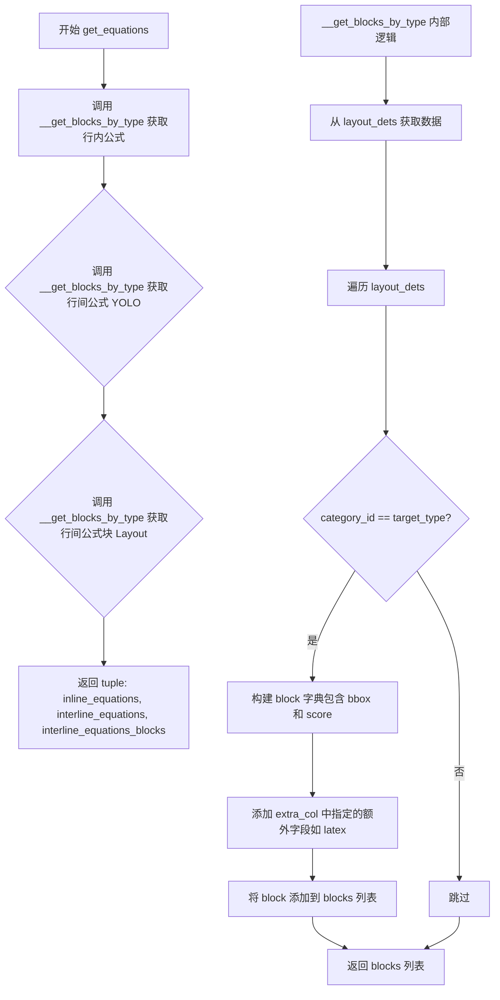

#### 带注释源码

```python
def get_equations(self) -> tuple[list, list, list]:  # 有坐标，也有字
    """
    获取行内公式、行间公式和行间公式块
    返回格式: (行内公式列表, 行间公式列表, 行间公式块列表)
    """
    # 获取行内公式（InlineEquation类型，包含latex字段）
    inline_equations = self.__get_blocks_by_type(
        CategoryId.InlineEquation, ['latex']
    )
    
    # 获取行间公式（InterlineEquation_YOLO类型，包含latex字段）
    interline_equations = self.__get_blocks_by_type(
        CategoryId.InterlineEquation_YOLO, ['latex']
    )
    
    # 获取行间公式块（InterlineEquation_Layout类型）
    interline_equations_blocks = self.__get_blocks_by_type(
        CategoryId.InterlineEquation_Layout
    )
    
    # 返回三个公式类型的列表元组
    return inline_equations, interline_equations, interline_equations_blocks
```


### `MagicModel.get_discarded`

获取被丢弃的块（类型为 Abandon 的布局块），该方法调用内部方法 `__get_blocks_by_type` 筛选出类别为 `CategoryId.Abandon` 的所有块并返回。

参数：无（该方法无显式参数，仅隐含 `self`）

返回值：`list`，返回被丢弃的块列表，每个块包含 `bbox`（边界框坐标）和 `score`（置信度）字段

#### 流程图

```mermaid
flowchart TD
    A[开始 get_discarded] --> B[调用 __get_blocks_by_type]
    B --> C[传入参数 CategoryId.Abandon]
    C --> D[遍历 layout_dets]
    D --> E{类别 == Abandon?}
    E -->|是| F[构建 block 字典<br/>包含 bbox 和 score]
    F --> G[添加到 blocks 列表]
    E -->|否| H[跳过]
    G --> I{继续遍历?}
    I -->|是| D
    I -->|否| J[返回 blocks 列表]
    H --> I
    K[结束]
    J --> K
```

#### 带注释源码

```python
def get_discarded(self) -> list:  # 自研模型，只有坐标
    """
    获取被丢弃的块
    返回类型为 Abandon 的所有布局块
    """
    # 调用内部方法 __get_blocks_by_type，筛选 CategoryId.Abandon 类型的块
    blocks = self.__get_blocks_by_type(CategoryId.Abandon)
    # 返回块列表（每个块包含 bbox 和 score）
    return blocks
```

---

**附：`__get_blocks_by_type` 私有方法源码（供理解完整逻辑）**

```python
def __get_blocks_by_type(
    self, category_type: int, extra_col=None
) -> list:
    """
    根据类别类型获取块列表
    :param category_type: 类别ID（如 CategoryId.Abandon）
    :param extra_col: 额外的列名列表（可选）
    :return: 符合条件的块列表
    """
    if extra_col is None:
        extra_col = []
    blocks = []
    # 从 page_model_info 中获取布局检测结果
    layout_dets = self.__page_model_info.get('layout_dets', [])
    for item in layout_dets:
        category_id = item.get('category_id', -1)
        bbox = item.get('bbox', None)

        # 如果类别匹配，则构建块字典
        if category_id == category_type:
            block = {
                'bbox': bbox,
                'score': item.get('score'),
            }
            # 添加额外需要的列
            for col in extra_col:
                block[col] = item.get(col, None)
            blocks.append(block)
    return blocks
```


### `MagicModel.get_text_blocks`

获取文本块的方法，用于从页面模型信息中提取文本类型的布局元素

参数：

- 无参数

返回值：`list`，返回文本块的列表，每个文本块包含边界框(bbox)和置信度(score)

#### 流程图

```mermaid
flowchart TD
    A[开始 get_text_blocks] --> B[调用私有方法 __get_blocks_by_type]
    B --> C[传入 category_type = CategoryId.Text]
    C --> D[遍历 layout_dets 列表]
    D --> E{当前元素的 category_id 是否等于 Text?}
    E -->|是| F[提取 bbox 和 score 构建块]
    F --> G[将块添加到结果列表]
    G --> H[继续遍历下一个元素]
    E -->|否| H
    H --> I{是否还有更多元素?}
    I -->|是| D
    I -->|否| J[返回块列表]
    J --> K[结束]
```

#### 带注释源码

```python
def get_text_blocks(self) -> list:  # 自研模型搞的，只有坐标，没有字
    """
    获取文本块
    返回页面布局中的文本元素列表
    
    Returns:
        list: 包含文本块的列表，每个文本块是一个字典，
              包含 'bbox'（边界框）和 'score'（置信度）字段
    """
    # 调用内部方法 __get_blocks_by_type，传入 CategoryId.Text 作为类别标识
    # 该方法会过滤出所有 category_id 等于 Text 的布局元素
    blocks = self.__get_blocks_by_type(CategoryId.Text)
    
    # 返回过滤后的文本块列表
    return blocks
```

---

**补充说明**：

该方法依赖的 `__get_blocks_by_type` 私有方法实现如下：

```python
def __get_blocks_by_type(
    self, category_type: int, extra_col=None
) -> list:
    """
    根据类别类型获取布局块
    
    参数:
        category_type: int - 布局元素的类别ID
        extra_col: list - 需要额外提取的字段列表，默认为空
    
    返回:
        list: 符合类别条件的布局块列表
    """
    if extra_col is None:
        extra_col = []
    
    blocks = []
    # 从页面模型信息中获取布局检测结果列表
    layout_dets = self.__page_model_info.get('layout_dets', [])
    
    # 遍历所有布局检测结果
    for item in layout_dets:
        category_id = item.get('category_id', -1)
        bbox = item.get('bbox', None)

        # 如果类别ID匹配目标类型
        if category_id == category_type:
            # 构建块的基本信息：边界框和置信度
            block = {
                'bbox': bbox,
                'score': item.get('score'),
            }
            # 如果有额外需要提取的字段
            for col in extra_col:
                block[col] = item.get(col, None)
            blocks.append(block)
    
    return blocks
```


### `MagicModel.get_title_blocks`

获取标题块（Title Blocks），该方法通过调用内部方法 `__get_blocks_by_type` 筛选出页面模型信息中类别为 `Title` 的所有布局检测块，并返回包含标题块边界框和置信度信息的列表。

参数：无需参数

返回值：`list`，返回标题块列表，每个元素包含 `bbox`（边界框坐标）和 `score`（置信度）字段

#### 流程图

```mermaid
flowchart TD
    A[调用 get_title_blocks] --> B[调用 __get_blocks_by_type]
    B --> C[传入 category_type=CategoryId.Title]
    C --> D[遍历 layout_dets 列表]
    D --> E{当前元素的 category_id<br/>是否等于 Title?}
    E -->|是| F[提取 bbox 和 score]
    F --> G[构建 block 字典]
    G --> H[添加到 blocks 列表]
    H --> D
    E -->|否| D
    D --> I[返回 blocks 列表]
    I --> J[返回给调用者]
```

#### 带注释源码

```python
def get_title_blocks(self) -> list:  # 自研模型，只有坐标，没字
    """
    获取标题块列表
    
    该方法专门用于从页面模型信息中提取类别为Title（标题）的布局检测块。
    标题块在自研模型中只包含坐标信息，不包含文本内容。
    
    返回:
        list: 包含标题块的列表，每个元素是一个字典，包含:
              - bbox: 边界框坐标 [x0, y0, x1, y1]
              - score: 置信度分数
    """
    # 调用私有方法 __get_blocks_by_type，传入 CategoryId.Title 作为筛选条件
    blocks = self.__get_blocks_by_type(CategoryId.Title)
    
    # 返回筛选得到的标题块列表
    return blocks


def __get_blocks_by_type(
    self, category_type: int, extra_col=None
) -> list:
    """
    根据类别类型获取布局检测块的内部方法
    
    参数:
        category_type: int, 要筛选的类别ID（如CategoryId.Title）
        extra_col: list, 可选的额外列名列表，用于提取其他字段
    
    返回:
        list: 符合指定类别条件的块列表
    """
    # 处理默认参数
    if extra_col is None:
        extra_col = []
    
    # 初始化结果列表
    blocks = []
    
    # 从页面模型信息中获取布局检测列表
    layout_dets = self.__page_model_info.get('layout_dets', [])
    
    # 遍历所有布局检测项
    for item in layout_dets:
        # 获取当前元素的类别ID
        category_id = item.get('category_id', -1)
        # 获取当前元素的边界框
        bbox = item.get('bbox', None)
        
        # 判断当前元素的类别是否匹配目标类别
        if category_id == category_type:
            # 构建基础块信息字典
            block = {
                'bbox': bbox,           # 边界框坐标
                'score': item.get('score'),  # 置信度分数
            }
            
            # 如果有额外的列需要提取
            for col in extra_col:
                block[col] = item.get(col, None)
            
            # 将构建的块添加到结果列表
            blocks.append(block)
    
    # 返回符合条件的块列表
    return blocks
```


### `MagicModel.get_all_spans`

获取所有span元素(图片、表格、公式、文本)，返回一个包含页面中所有图片、表格、公式和文本元素的列表，每个元素包含其边界框、置信度分数和内容类型等信息。

参数：

- （无参数）

返回值：`list`，返回所有span元素的列表，每个元素为字典，包含 `bbox`、`score`、`type` 字段，可能还包含 `latex`、`html` 或 `content` 等字段。

#### 流程图

```mermaid
flowchart TD
    A[开始 get_all_spans] --> B[定义 remove_duplicate_spans 内部函数]
    B --> C[初始化 all_spans 空列表]
    C --> D[定义 allow_category_id_list]
    D --> E{遍历 layout_dets 中的每个 layout_det}
    E --> F{检查 category_id 是否在 allow_category_id_list 中}
    F -->|否| G[跳过当前元素]
    F -->|是| H[创建基础 span 字典]
    H --> I{category_id == ImageBody?}
    I -->|是| J[设置 type = IMAGE]
    I -->|否| K{category_id == TableBody?}
    K -->|是| L[获取 latex/html, 设置 type = TABLE]
    K -->|否| L2{category_id == InlineEquation?}
    L2 -->|是| M[设置 content = latex, type = INLINE_EQUATION]
    L2 -->|否| L3{category_id == InterlineEquation_YOLO?}
    L3 -->|是| N[设置 content = latex, type = INTERLINE_EQUATION]
    L3 -->|否| O{category_id == OcrText?}
    O -->|是| P[设置 content = text, type = TEXT]
    O -->|否| Q[添加到 all_spans]
    J --> Q
    M --> Q
    N --> Q
    P --> Q
    G --> E
    Q --> R{遍历完成?}
    R -->|否| E
    R -->|是| S[调用 remove_duplicate_spans 去除重复]
    S --> T[返回结果列表]
```

#### 带注释源码

```python
def get_all_spans(self) -> list:
    """
    获取所有span元素(图片、表格、公式、文本)
    
    Returns:
        list: 包含所有span元素的列表，每个元素为字典，包含:
            - bbox: 边界框坐标 [x0, y0, x1, y1]
            - score: 置信度分数
            - type: 内容类型 (IMAGE/TABLE/INLINE_EQUATION/INTERLINE_EQUATION/TEXT)
            - latex/html/content: 根据类型不同可能包含的额外内容
    """
    
    def remove_duplicate_spans(spans):
        """去除重复的span元素"""
        new_spans = []
        for span in spans:
            # 检查span是否已存在于new_spans中
            if not any(span == existing_span for existing_span in new_spans):
                new_spans.append(span)
        return new_spans

    all_spans = []  # 存储所有span元素的列表
    layout_dets = self.__page_model_info['layout_dets']  # 获取布局检测结果
    
    # 定义允许的类别ID列表，这些类型的元素会被当作span处理
    allow_category_id_list = [
        CategoryId.ImageBody,           # 图片主体
        CategoryId.TableBody,           # 表格主体
        CategoryId.InlineEquation,      # 行内公式
        CategoryId.InterlineEquation_YOLO,  # 行间公式(YOLO检测)
        CategoryId.OcrText,             # OCR识别文本
    ]
    
    """当成span拼接的"""
    # 遍历所有布局检测结果
    for layout_det in layout_dets:
        category_id = layout_det['category_id']  # 获取当前元素的类别ID
        
        # 检查当前元素是否在允许的类别列表中
        if category_id in allow_category_id_list:
            # 创建基础的span字典，包含bbox和score
            span = {'bbox': layout_det['bbox'], 'score': layout_det['score']}
            
            # 根据不同的category_id设置type和额外内容
            if category_id == CategoryId.ImageBody:
                span['type'] = ContentType.IMAGE  # 设置为图片类型
                
            elif category_id == CategoryId.TableBody:
                # 获取table模型结果（latex或html格式）
                latex = layout_det.get('latex', None)
                html = layout_det.get('html', None)
                if latex:
                    span['latex'] = latex  # 包含LaTeX格式表格
                elif html:
                    span['html'] = html   # 包含HTML格式表格
                span['type'] = ContentType.TABLE  # 设置为表格类型
                
            elif category_id == CategoryId.InlineEquation:
                span['content'] = layout_det['latex']  # 包含公式LaTeX内容
                span['type'] = ContentType.INLINE_EQUATION  # 设置为行内公式类型
                
            elif category_id == CategoryId.InterlineEquation_YOLO:
                span['content'] = layout_det['latex']  # 包含公式LaTeX内容
                span['type'] = ContentType.INTERLINE_EQUATION  # 设置为行间公式类型
                
            elif category_id == CategoryId.OcrText:
                span['content'] = layout_det['text']  # 包含OCR识别的文本内容
                span['type'] = ContentType.TEXT  # 设置为文本类型
            
            # 将处理后的span添加到列表中
            all_spans.append(span)
    
    # 返回去除重复后的span列表
    return remove_duplicate_spans(all_spans)
```


### `MagicModel.__get_blocks_by_type`

根据给定的类别类型从页面布局检测结果中筛选出所有匹配的块，并可选择性地提取额外的字段信息。

参数：

-  `category_type`：`int`，类别ID，用于匹配布局块的category_id字段
-  `extra_col`：`list`，额外字段列表，指定需要从原始数据中额外提取的字段名，默认为空列表

返回值：`list`，返回匹配该类别类型的所有块组成的列表，每个块包含bbox、score以及extra_col中指定的额外字段

#### 流程图

```mermaid
flowchart TD
    A[开始 __get_blocks_by_type] --> B{extra_col是否为None}
    B -->|是| C[将extra_col设为空列表]
    B -->|否| D[使用传入的extra_col]
    C --> E[从page_model_info获取layout_dets列表]
    D --> E
    E --> F[初始化空列表blocks]
    F --> G[遍历layout_dets中的每个item]
    G --> H[获取item的category_id和bbox]
    H --> I{category_id是否等于category_type}
    I -->|否| G
    I -->|是| J[创建block字典,包含bbox和score]
    J --> K[遍历extra_col中的每个col名]
    K --> L[将item中col对应的值存入block字典]
    K --> M{block字典添加到blocks列表]
    M --> G
    G --> N[返回blocks列表]
    N --> O[结束]
```

#### 带注释源码

```python
def __get_blocks_by_type(
    self, category_type: int, extra_col=None
) -> list:
    """
    根据类别类型获取对应的块列表
    
    参数:
        category_type: int, 类别ID
        extra_col: list, 额外字段列表
    
    返回:
        list: 匹配类别类型的块列表
    """
    # 如果extra_col为None，初始化为空列表，避免后续遍历时出现空值
    if extra_col is None:
        extra_col = []
    
    # 初始化结果列表
    blocks = []
    
    # 从页面模型信息中获取布局检测结果列表
    # 使用get方法提供默认值，防止key不存在时抛出异常
    layout_dets = self.__page_model_info.get('layout_dets', [])
    
    # 遍历所有布局检测结果
    for item in layout_dets:
        # 获取当前项的类别ID，默认为-1表示无效类别
        category_id = item.get('category_id', -1)
        # 获取当前项的边界框
        bbox = item.get('bbox', None)

        # 检查当前项的类别是否匹配目标类别
        if category_id == category_type:
            # 创建块字典，包含边界框和置信度分数
            block = {
                'bbox': bbox,
                'score': item.get('score'),
            }
            
            # 遍历额外字段列表，将指定的额外字段提取到块中
            for col in extra_col:
                block[col] = item.get(col, None)
            
            # 将构建好的块添加到结果列表
            blocks.append(block)
    
    # 返回所有匹配的块
    return blocks
```

## 关键组件


### 坐标轴修复与缩放 (__fix_axis)

将多边形坐标(poly)转换为边界框(bbox)，并根据缩放因子进行坐标调整，同时移除宽高小于等于0的无效检测结果。

### 低置信度数据过滤 (__fix_by_remove_low_confidence)

移除置信度(score)低于0.05的模型检测结果，以提高输出质量。

### 高IoU冲突解决 (__fix_by_remove_high_iou_and_low_confidence)

当两个检测框的IoU大于0.9时，保留置信度较高的那个，移除较低的，用于消除重复检测。

### 图像与表格重叠处理 (__fix_by_remove_overlap_image_table_body)

处理image_body和table_body之间的重叠情况，通过面积比较移除较小的区块，并扩展较大区块的边界框。

### 脚注类别修正 (__fix_footnote)

根据距离关系将table_footnote修正为image_footnote，通过计算脚注与图片、表格的相对位置来判断正确类别。

### 分类距离关联 (__tie_up_category_by_distance_v3)

根据空间距离关系将主体对象（如ImageBody）与客体对象（如ImageCaption、ImageFootnote）进行关联配对。

### 图像块提取 (get_imgs)

返回图像主体及其对应的标题列表和脚注列表的关联结果。

### 表格块提取 (get_tables)

返回表格主体及其对应的标题列表和脚注列表的关联结果。

### 方程块提取 (get_equations)

分别提取行内公式(InlineEquation)、行间公式YOLO检测结果(InterlineEquation_YOLO)和行间公式布局结果(InterlineEquation_Layout)。

### 全部Span整合 (get_all_spans)

将ImageBody、TableBody、InlineEquation、InterlineEquation_YOLO和OcrText等不同类型的检测结果整合为统一的span列表，并去除重复项。

### 按类别获取块 (__get_blocks_by_type)

根据指定的category_id从布局检测结果中筛选对应的块，可额外提取指定列数据。

## 问题及建议


### 已知问题

1. **直接修改输入数据，缺乏不可变性**：代码直接修改 `self.__page_model_info` 字典和其中的元素（如 `layout_det['bbox'] = bbox`），没有保留原始数据副本，导致无法回滚或对比处理前后的差异。

2. **列表删除操作效率低下**：多处使用 `layout_dets.remove(need_remove)` 在循环中删除元素，每次 remove 操作都是 O(n) 复杂度，总时间复杂度可达 O(n²)。例如 `__fix_axis`、`__fix_by_remove_low_confidence`、`__fix_by_remove_high_iou_and_low_confidence` 等方法都存在此问题。

3. **magic number 硬编码**：置信度阈值 0.05、IOU 阈值 0.9、重叠比率 0.8 等关键参数直接写在代码中，缺乏可配置性。

4. **`get_imgs` 和 `get_tables` 方法缺少异常处理**：使用 `next(filter(...))` 时，如果找不到对应 `sub_idx` 的元素会直接抛出 `StopIteration` 异常，导致程序崩溃。

5. **`__fix_by_remove_overlap_image_table_body` 中的逻辑缺陷**：在扩展 `large_block` 的边界框后，`need_remove_list` 中可能已存在的元素未被及时检查，可能导致后续循环中引用已修改的对象时出现预期外行为。

6. **重复代码模式**：多个 fix 方法都使用 `need_remove_list` 收集待删除元素，然后遍历删除，代码重复度高，可抽象为通用方法。

7. **`__init__` 方法注释与实现不符**：注释描述"为所有模型数据添加bbox信息"，但实际实现包含删除操作（删除高度或宽度小于等于0的 spans）。

8. **嵌套循环性能问题**：`__fix_by_remove_high_iou_and_low_confidence` 使用双重循环比较所有元素对，时间复杂度为 O(n²)，数据量大时性能较差。

9. **变量命名一致性问题**：类外部方法 `_bbox_distance` 使用单下划线前缀，而其他私有方法使用双下划线前缀，命名风格不统一。

10. **输入数据缺乏验证**：构造函数未对 `page_model_info` 和 `scale` 的有效性进行校验，可能导致后续操作出现隐蔽错误。

### 优化建议

1. **采用不可变数据模式**：在处理前创建 `layout_dets` 的深拷贝，或使用新列表存储处理结果而非直接修改原数据。

2. **使用列表推导式替代循环删除**：将 `for ... remove` 模式改为 `layout_dets = [x for x in layout_dets if x not in need_remove_list]` 或使用 `filter`。

3. **提取配置参数**：将阈值参数提取为类属性或配置文件常量，如 `self._confidence_threshold = 0.05`、`self._iou_threshold = 0.9` 等。

4. **添加异常处理**：在 `get_imgs` 和 `get_tables` 中使用 `next(..., None)` 或 try-except 包裹，提供默认值或明确的错误处理。

5. **重构重复逻辑**：抽取通用的"收集-删除"模式为私有方法，如 `_remove_blocks(layout_dets, predicate)`。

6. **优化嵌套循环**：对于高 IOU 过滤，可考虑使用空间索引（如 R-tree）或分桶策略降低比较次数。

7. **统一命名规范**：确定私有方法的命名风格（单下划线或双下划线），保持一致性。

8. **添加输入验证**：在 `__init__` 中检查 `page_model_info` 是否包含必要字段、`scale` 是否大于 0 等。


## 其它


### 设计目标与约束

本模块主要用于PDF文档版面分析的预处理和后处理，核心目标是提高布局检测质量，通过多轮数据清洗和修复操作，生成高质量的结构化文档元素。主要设计约束包括：1）输入为page_model_info字典，包含layout_dets列表；2）所有坐标基于原始尺寸，输出时按scale缩放；3）仅处理特定category_id的元素，不改变其他元素；4）算法复杂度控制在O(n²)以内，主要针对元素间两两比较操作。

### 错误处理与异常设计

代码整体采用静默失败策略，对于边界情况返回空列表而非抛出异常。具体处理方式包括：1）过滤操作使用filter函数，当无匹配元素时返回空列表；2）distance计算中使用float('inf')表示无法计算的情况；3）dict.get()方法配合默认值避免KeyError；4）next()函数配合filter在无匹配时返回StopIteration异常，但在get_imgs和get_tables中通过索引匹配保证能获取到对应元素；5）移除操作前先检查元素是否存在于列表中。当前代码缺乏显式的异常捕获机制，潜在的异常点包括：layout_dets为None时的遍历、poly字段缺失时的解包、scale为0时的除零错误。

### 数据流与状态机

MagicModel作为状态管理器，内部维护page_model_info和scale两个核心状态。整个处理流程呈线性状态机模式：初始化→fix_axis(坐标转换)→fix_by_remove_low_confidence(低置信度过滤)→fix_by_remove_high_iou_and_low_confidence(IOU去重)→fix_footnote(脚注修正)→fix_by_remove_overlap_image_table_body(重叠处理)。每个fix方法都是无副作用的原地修改操作，通过need_remove_list记录待删除元素后统一移除。数据流动方向：输入dict→内部状态→各类getter方法→返回结构化结果(get_imgs返回图像+标题+脚注列表，get_tables返回表格+标题+脚注列表，get_all_spans返回拼接用的span列表)。

### 外部依赖与接口契约

主要依赖三个外部模块：1）mineru.utils.boxbase：bbox_relative_pos(计算边界盒相对位置)、calculate_iou(计算IOU)、bbox_distance(计算边界盒距离)、get_minbox_if_overlap_by_ratio(检测重叠)；2）mineru.utils.enum_class：CategoryId(分类枚举)、ContentType(内容类型枚举)；3）mineru.utils.magic_model_utils：tie_up_category_by_distance_v3(按距离关联类别)、reduct_overlap(重叠规约)。接口契约方面：输入page_model_info必须包含layout_dets键，每个layout_det需包含poly、category_id、score字段；输出各类getter方法返回list of dict，结构相对稳定但可能随版本变化。

### 性能考量与优化空间

当前实现存在以下性能瓶颈：1）多重嵌套循环导致O(n²)复杂度，如__fix_by_remove_overlap_image_table_body和__fix_by_remove_high_iou_and_low_confidence；2）频繁的list.remove()操作在Python中为O(n)；3）重复遍历layout_dets列表获取不同category_id的元素。优化建议：1）使用set存储need_remove_list替代list避免重复添加；2）考虑使用索引而非实际删除，或一次性构建新列表；3）预建category_id到元素列表的映射缓存；4）__fix_footnote中的距离计算可考虑空间索引优化。当前代码未包含任何性能监控或缓存机制。

### 线程安全与并发考量

MagicModel实例非线程安全，核心问题在于：1）实例方法直接修改__page_model_info字典内容，属于非原子操作；2）多个getter方法可能并发读取同一状态；3）迭代过程中修改列表结构。若在多线程环境使用，建议：1）实例化时进行深拷贝；2）获取结果时使用不可变数据结构；3）或在类外部加锁保护。当前代码未做线程安全处理。

### 配置参数说明

构造函数接收两个参数：1）page_model_info: dict - 页面模型信息字典，必须包含layout_dets键，结构为list[dict]，每个dict需包含poly(8点坐标)、category_id(整数)、score(浮点数)字段，可选包含latex、html、text等识别结果；2）scale: float - 缩放比例，用于坐标归一化，建议值为1.0或实际页面尺寸比例。内部阈值通过硬编码方式定义：低置信度阈值0.05、高IOU阈值0.9、重叠判定比例0.8、脚注距离判定阈值0.3(长宽差比例)。这些阈值当前不支持外部配置。

    