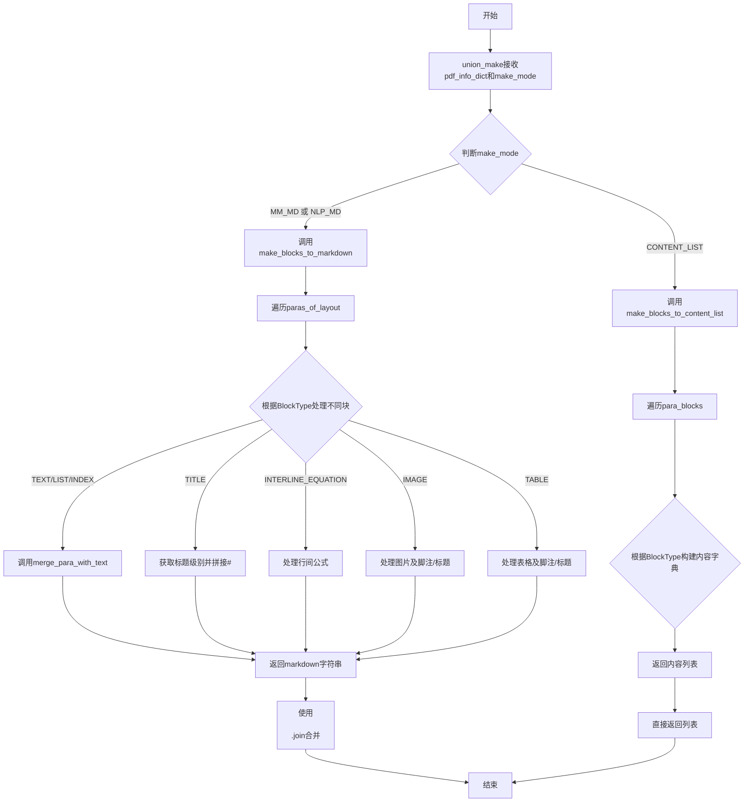
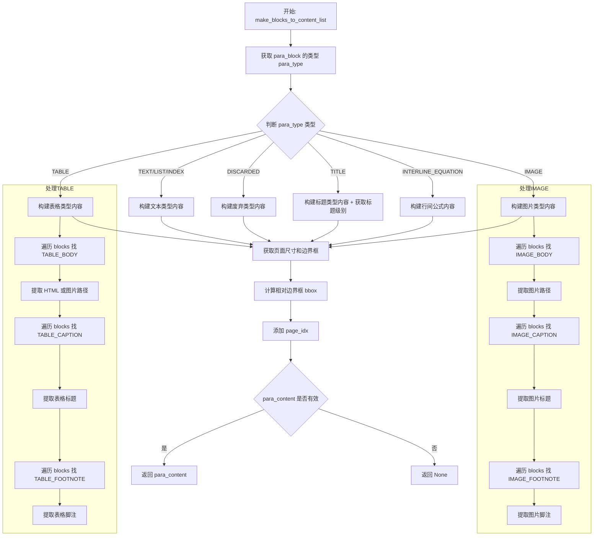
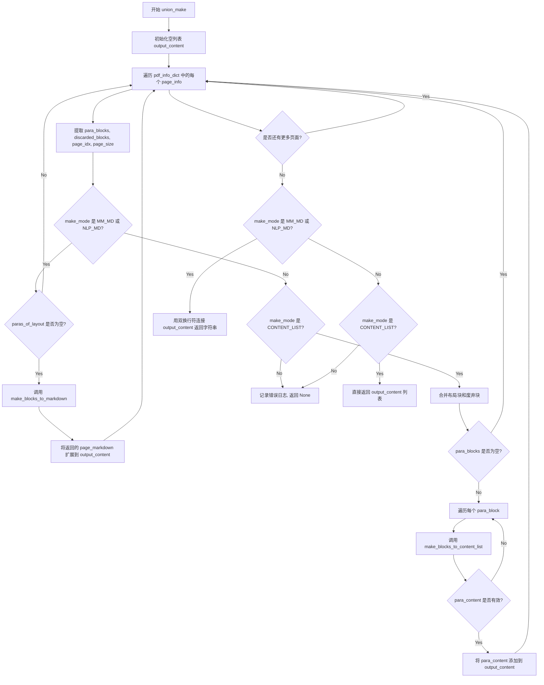
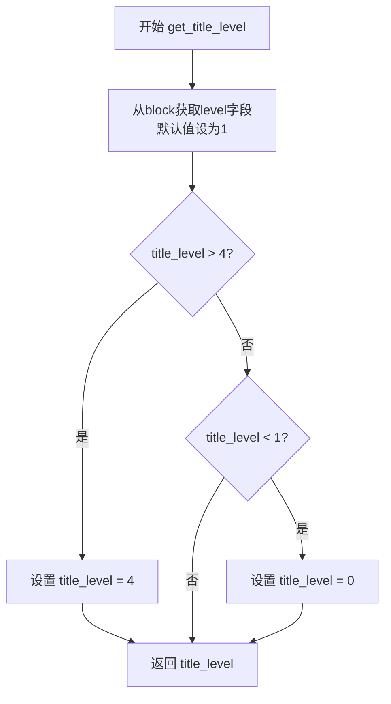
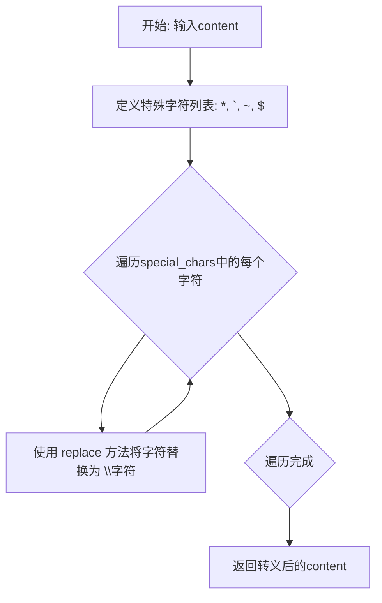

# `MinerU\mineru\backend\pipeline\pipeline_middle_json_mkcontent.py` 详细设计文档

该文件是mineru项目中的核心转换模块，负责将PDF文档的布局块（para_blocks）根据不同的输出模式（Markdown内容、纯文本内容、JSON内容列表）进行转换和组装，支持文本、标题、列表、公式、图片、表格等多种块类型的处理，并处理语言相关的文本格式（如CJK文本的空格处理、西方文本的连字符处理）和LaTeX公式分隔符配置。

## 整体流程



## 类结构

```
无类定义 (基于函数的模块)
└── 全局变量与函数集合
    ├── 配置相关: latex_delimiters_config, default_delimiters, delimiters, display_left_delimiter, display_right_delimiter, inline_left_delimiter, inline_right_delimiter
    ├── 核心转换函数: make_blocks_to_markdown, make_blocks_to_content_list, union_make
    ├── 辅助函数: merge_para_with_text, get_title_level, escape_special_markdown_char
```

## 全局变量及字段


### `latex_delimiters_config`
    
从配置文件读取的LaTeX分隔符配置，可能为字典或None

类型：`dict | None`
    


### `default_delimiters`
    
默认的LaTeX分隔符配置，包含display和inline模式的左右分隔符

类型：`dict`
    


### `delimiters`
    
实际使用的LaText分隔符配置，当latex_delimiters_config存在时优先使用

类型：`dict`
    


### `display_left_delimiter`
    
显示公式(行间公式)的左分隔符，默认为'$$'

类型：`str`
    


### `display_right_delimiter`
    
显示公式(行间公式)的右分隔符，默认为'$$'

类型：`str`
    


### `inline_left_delimiter`
    
行内公式的左分隔符，默认为'$'

类型：`str`
    


### `inline_right_delimiter`
    
行内公式的右分隔符，默认为'$'

类型：`str`
    


    

## 全局函数及方法


### `make_blocks_to_markdown`

该函数是PDF/文档解析模块中的核心转换函数，负责将经过布局分析后的段落块（para_block）根据不同的块类型（文本、标题、公式、图片、表格等）转换为对应的Markdown格式字符串，并返回一个包含所有转换后Markdown文本的列表。

参数：

- `paras_of_layout`：`List[dict]`，待转换的布局段落块列表，每个段落块包含类型、文本内容、样式信息等
- `mode`：`MakeMode`，生成模式，枚举类型，决定如何处理特定类型的块（如NLP_MD模式会跳过图片和表格，MM_MD模式会包含多媒体）
- `img_buket_path`：`str`，可选参数，图片存储的基础路径，用于拼接生成Markdown中的图片链接，默认为空字符串

返回值：`List[str]`，返回转换后的Markdown文本列表，每个元素对应一个段落块转换后的结果

#### 流程图

```mermaid
flowchart TD
    A[开始 make_blocks_to_markdown] --> B[初始化空列表 page_markdown]
    B --> C{遍历 paras_of_layout 中的每个 para_block}
    C --> D{根据 para_block['type'] 判断块类型}
    D -->|TEXT/LIST/INDEX| E[调用 merge_para_with_text 获取文本]
    D -->|TITLE| F[获取标题级别并拼接#号]
    D -->|INTERLINE_EQUATION| G{检查公式内容是否存在}
    G -->|有content| E
    G -->|无content| H[生成图片链接格式]
    D -->|IMAGE| I{判断 mode 类型}
    I -->|NLP_MD| J[跳过当前块 continue]
    I -->|MM_MD| K{检查是否存在图片脚注}
    K -->|有脚注| L[依次拼接caption→image→footnote]
    K -->|无脚注| M[依次拼接image→caption]
    D -->|TABLE| N{判断 mode 类型}
    N -->|NLP_MD| J
    N -->|MM_MD| O[依次拼接caption→body→footnote]
    E --> P{para_text 是否为空}
    F --> P
    H --> P
    L --> P
    M --> P
    O --> P
    P -->|是| C
    P -->|否| Q[将 para_text.strip() 加入 page_markdown]
    Q --> C
    C -->|遍历完成| R[返回 page_markdown 列表]
```

#### 带注释源码

```python
def make_blocks_to_markdown(paras_of_layout,
                                      mode,
                                      img_buket_path='',
                                      ):
    """
    将布局段落块列表转换为Markdown格式的文本列表
    
    参数:
        paras_of_layout: 布局段落块列表，每个元素包含type、lines等字段
        mode: 生成模式，决定如何处理图片和表格等多媒体内容
        img_buket_path: 图片资源的基础路径
        
    返回:
        包含转换后Markdown文本的列表
    """
    # 初始化返回的Markdown文本列表
    page_markdown = []
    
    # 遍历每一个段落块
    for para_block in paras_of_layout:
        para_text = ''  # 当前段落转换后的文本
        para_type = para_block['type']  # 获取段落类型
        
        # 根据不同的段落类型采用不同的处理策略
        if para_type in [BlockType.TEXT, BlockType.LIST, BlockType.INDEX]:
            # 普通文本、列表、索引类型：直接合并文本内容
            para_text = merge_para_with_text(para_block)
            
        elif para_type == BlockType.TITLE:
            # 标题类型：获取标题级别并添加对应的Markdown标题标记
            title_level = get_title_level(para_block)
            para_text = f'{"#" * title_level} {merge_para_with_text(para_block)}'
            
        elif para_type == BlockType.INTERLINE_EQUATION:
            # 行间公式类型：检查公式内容是否存在
            if len(para_block['lines']) == 0 or len(para_block['lines'][0]['spans']) == 0:
                continue  # 空公式块则跳过
            if para_block['lines'][0]['spans'][0].get('content', ''):
                # 存在LaTeX公式内容
                para_text = merge_para_with_text(para_block)
            else:
                # 公式为图片形式，生成Markdown图片链接
                para_text += f""
                
        elif para_type == BlockType.IMAGE:
            # 图片类型：根据生成模式决定处理方式
            if mode == MakeMode.NLP_MD:
                continue  # NLP模式跳过图片
            elif mode == MakeMode.MM_MD:
                # 多媒体Markdown模式：处理图片及相关说明
                # 检测是否存在图片脚注
                has_image_footnote = any(block['type'] == BlockType.IMAGE_FOOTNOTE for block in para_block['blocks'])
                
                if has_image_footnote:
                    # 存在脚注时：按caption→image→footnote顺序拼接
                    for block in para_block['blocks']:  # 1st.拼image_caption
                        if block['type'] == BlockType.IMAGE_CAPTION:
                            para_text += merge_para_with_text(block) + '  \n'
                    for block in para_block['blocks']:  # 2nd.拼image_body
                        if block['type'] == BlockType.IMAGE_BODY:
                            for line in block['lines']:
                                for span in line['spans']:
                                    if span['type'] == ContentType.IMAGE:
                                        if span.get('image_path', ''):
                                            para_text += f""
                    for block in para_block['blocks']:  # 3rd.拼image_footnote
                        if block['type'] == BlockType.IMAGE_FOOTNOTE:
                            para_text += '  \n' + merge_para_with_text(block)
                else:
                    # 无脚注时：按image→caption顺序拼接
                    for block in para_block['blocks']:  # 1st.拼image_body
                        if block['type'] == BlockType.IMAGE_BODY:
                            for line in block['lines']:
                                for span in line['spans']:
                                    if span['type'] == ContentType.IMAGE:
                                        if span.get('image_path', ''):
                                            para_text += f""
                    for block in para_block['blocks']:  # 2nd.拼image_caption
                        if block['type'] == BlockType.IMAGE_CAPTION:
                            para_text += '  \n' + merge_para_with_text(block)
                            
        elif para_type == BlockType.TABLE:
            # 表格类型：根据生成模式决定处理方式
            if mode == MakeMode.NLP_MD:
                continue  # NLP模式跳过表格
            elif mode == MakeMode.MM_MD:
                # 多媒体Markdown模式：处理表格及相关说明
                for block in para_block['blocks']:  # 1st.拼table_caption
                    if block['type'] == BlockType.TABLE_CAPTION:
                        para_text += merge_para_with_text(block) + '  \n'
                for block in para_block['blocks']:  # 2nd.拼table_body
                    if block['type'] == BlockType.TABLE_BODY:
                        for line in block['lines']:
                            for span in line['spans']:
                                if span['type'] == ContentType.TABLE:
                                    # 根据表格处理方式选择HTML或图片
                                    if span.get('html', ''):
                                        para_text += f"\n{span['html']}\n"
                                    elif span.get('image_path', ''):
                                        para_text += f""
                for block in para_block['blocks']:  # 3rd.拼table_footnote
                    if block['type'] == BlockType.TABLE_FOOTNOTE:
                        para_text += '\n' + merge_para_with_text(block) + '  '

        # 过滤空段落块，避免在最终结果中包含空行
        if para_text.strip() == '':
            continue
        else:
            # 将转换后的段落文本添加到结果列表
            page_markdown.append(para_text.strip())

    return page_markdown
```


### `merge_para_with_text`

该函数是PDF/文档到Markdown转换流程中的核心文本处理函数，负责将结构化的段落块（包含多行、多样式文本片段）合并为单一的Markdown兼容文本字符串，同时处理语言检测、特殊字符转义、公式分隔符包装、连字符处理以及基于语言（中日韩/西方）的空格插入逻辑。

参数：

- `para_block`：`Dict`，段落块对象，包含`lines`（行列表）和`spans`（跨列表）结构，每个span包含`type`（内容类型）和`content`（文本内容）等字段

返回值：`str`，合并并处理后的文本字符串

#### 流程图

```mermaid
flowchart TD
    A[开始: merge_para_with_text] --> B[初始化 block_text = '']
    B --> C[遍历para_block中所有lines和spans]
    C --> D{span类型是否为TEXT}
    D -->|是| E[调用full_to_half_exclude_marks转换全角到半角]
    E --> F[拼接span['content']到block_text]
    D -->|否| G[跳过非文本span]
    F --> G
    G --> H[调用detect_lang检测block_text的语言]
    H --> I[初始化para_text = '']
    I --> J[遍历para_block中所有lines]
    
    J --> K{当前行索引>0 且 当前行是列表起始行}
    K -->|是| L[添加换行符到para_text]
    K -->|否| M[继续]
    
    L --> M
    M --> N[遍历当前行中所有spans]
    
    N --> O{获取span_type}
    O -->|TEXT| P[调用escape_special_markdown_char转义内容]
    O -->|INLINE_EQUATION| Q[包装内联公式: $content$]
    O -->|INTERLINE_EQUATION| R[包装行间公式: $$content$$]
    O -->|其他| S[跳过]
    
    P --> T
    Q --> T
    R --> T
    S --> T
    
    T --> U{content是否为空}
    U -->|否| V{span_type是否为INTERLINE_EQUATION}
    V -->|是| W[直接追加content到para_text并继续]
    V -->|否| X[判断block_lang是否在CJK语言集合]
    
    W --> Y
    X -->|是-CJK| Z{是否为行末span且不是内联公式}
    X -->|否-西方| AA{是否为行末span且是TEXT或INLINE_EQUATION}
    
    Z -->|是| AB[直接追加content]
    Z -->|否| AC[追加content + 空格]
    AA -->|是-连字符| AD[判断下一行首字母是否小写]
    AA -->|否| AE[追加content + 空格]
    
    AD -->|是| AF[追加content去掉末尾连字符]
    AD -->|否| AG[追加content保留连字符不加空格]
    AF --> Y
    AG --> Y
    AB --> Y
    AC --> Y
    AE --> Y
    
    U -->|是| Y[继续下一个span]
    Y --> N
    N --> J
    J --> AH[返回para_text]
```

#### 带注释源码

```python
def merge_para_with_text(para_block):
    """
    将段落块（包含多行多span）合并为单一文本字符串
    处理文本转义、公式包装、连字符处理和语言相关的空格插入
    
    参数:
        para_block: 段落块字典，包含lines列表，每行包含spans列表
            结构示例: {'lines': [{'spans': [{'type': 'TEXT', 'content': 'Hello'}]}]}
    
    返回:
        合并后的文本字符串
    """
    # ------------------------------
    # 第一阶段：收集全文用于语言检测
    # ------------------------------
    block_text = ''
    # 遍历段落中所有行和span，收集纯文本内容用于语言检测
    for line in para_block['lines']:  # 遍历所有行
        for span in line['spans']:    # 遍历当前行所有span
            if span['type'] in [ContentType.TEXT]:
                # 将全角字符转换为半角（排除标点符号）
                span['content'] = full_to_half_exclude_marks(span['content'])
                block_text += span['content']  # 累加文本用于语言检测
    
    # 使用语言检测工具判断文本语种（CJK vs 西方语言）
    block_lang = detect_lang(block_text)

    # ------------------------------
    # 第二阶段：构建最终文本
    # ------------------------------
    para_text = ''
    # 再次遍历所有行，这次进行实际的文本拼接和格式化
    for i, line in enumerate(para_block['lines']):
        
        # 如果当前行是列表的起始行（通过ListLineTag.IS_LIST_START_LINE标记）
        # 在中文排版中需要额外换行
        if i >= 1 and line.get(ListLineTag.IS_LIST_START_LINE, False):
            para_text += '  \n'  # Markdown列表需要双空格换行

        # 遍历当前行的所有span
        for j, span in enumerate(line['spans']):
            
            span_type = span['type']  # 获取span的内容类型
            content = ''
            
            # 根据不同内容类型进行相应处理
            if span_type == ContentType.TEXT:
                # 文本类型：转义Markdown特殊字符（* ` ~ $）
                content = escape_special_markdown_char(span['content'])
                
            elif span_type == ContentType.INLINE_EQUATION:
                # 内联公式：用$...$包裹
                if span.get('content', ''):
                    content = f"{inline_left_delimiter}{span['content']}{inline_right_delimiter}"
                    
            elif span_type == ContentType.INTERLINE_EQUATION:
                # 行间公式：用$$...$$包裹（带换行）
                if span.get('content', ''):
                    content = f"\n{display_left_delimiter}\n{span['content']}\n{display_right_delimiter}\n"

            # 去除内容首尾空白
            content = content.strip()

            # 只有非空内容才进行处理
            if content:
                
                # 行间公式特殊处理：直接追加不加空格
                if span_type == ContentType.INTERLINE_EQUATION:
                    para_text += content
                    continue

                # 定义CJK语言集合(中日韩)
                cjk_langs = {'zh', 'ja', 'ko'}
                
                # 判断当前span是否为该行的最后一个span
                is_last_span = j == len(line['spans']) - 1

                # 根据语言环境采用不同的排版规则
                if block_lang in cjk_langs: 
                    # 中文/日语/韩文语境：换行不需要空格分隔
                    # 但是行内公式结尾仍需加空格
                    if is_last_span and span_type not in [ContentType.INLINE_EQUATION]:
                        para_text += content  # 行末直接追加
                    else:
                        para_text += f'{content} '  # 非行末加空格
                        
                else:
                    # 西方文本语境：每行末尾需要空格分隔
                    if span_type in [ContentType.TEXT, ContentType.INLINE_EQUATION]:
                        # 处理行末连字符的特殊情况
                        # 如果span是行的最后一个且末尾带有-连字符
                        if (
                                is_last_span
                                and span_type == ContentType.TEXT
                                and is_hyphen_at_line_end(content)  # 判断是否在行末
                        ):
                            # 检查下一行的第一个span是否是小写字母开头
                            if (
                                    i + 1 < len(para_block['lines'])
                                    and para_block['lines'][i + 1].get('spans')
                                    and para_block['lines'][i + 1]['spans'][0].get('type') == ContentType.TEXT
                                    and para_block['lines'][i + 1]['spans'][0].get('content', '')
                                    and para_block['lines'][i + 1]['spans'][0]['content'][0].islower()
                            ):
                                # 下一行首字母小写：删除连字符（表示单词被拆分）
                                para_text += content[:-1]
                            else:
                                # 没有下一行或下一行不是小写开头：保留连字符但不加空格
                                para_text += content
                        else:
                            # 普通情况：content间需要空格分隔
                            para_text += f'{content} '
            else:
                # 空内容跳过
                continue

    return para_text
```


### `make_blocks_to_content_list`

该函数是 PDF/文档处理流程中的核心转换函数，负责将布局分析得到的段落块（para_block）根据其类型（文本、标题、公式、图片、表格等）转换为统一的内容列表格式，同时处理图片路径、计算相对边界框，并附加页码索引信息。

参数：

-  `para_block`：`dict`，包含段落块的完整信息，包括类型(type)、行(lines)、跨度(spans)、边界框(bbox)等
-  `img_buket_path`：`str`，图片存储bucket的基础路径，用于拼接完整的图片URL
-  `page_idx`：`int`，当前段落所在页面的索引编号
-  `page_size`：`tuple`，页面尺寸，格式为 (page_width, page_height)，用于计算相对坐标

返回值：`dict`，返回包含内容类型、文本/图片路径、边界框等信息的字典，根据段落类型不同返回结构有所差异；若段落无效则返回 None

#### 流程图



#### 带注释源码

```python
def make_blocks_to_content_list(para_block, img_buket_path, page_idx, page_size):
    """
    将段落块转换为统一的内容列表格式
    
    参数:
        para_block: 段落块字典，包含类型、行、跨度等信息
        img_buket_path: 图片存储路径前缀
        page_idx: 页码索引
        page_size: 页面尺寸 (宽, 高)
    
    返回:
        包含内容信息的字典，或 None（无效段落时）
    """
    # 获取段落类型
    para_type = para_block['type']
    # 初始化内容字典
    para_content = {}
    
    # 处理文本、列表、索引类型
    if para_type in [
        BlockType.TEXT,
        BlockType.LIST,
        BlockType.INDEX,
    ]:
        para_content = {
            'type': ContentType.TEXT,
            'text': merge_para_with_text(para_block),  # 合并段落文本
        }
    # 处理废弃类型
    elif para_type == BlockType.DISCARDED:
        para_content = {
            'type': para_type,
            'text': merge_para_with_text(para_block),
        }
    # 处理标题类型
    elif para_type == BlockType.TITLE:
        para_content = {
            'type': ContentType.TEXT,
            'text': merge_para_with_text(para_block),
        }
        # 获取标题级别并添加到内容中
        title_level = get_title_level(para_block)
        if title_level != 0:
            para_content['text_level'] = title_level
    # 处理行间公式类型
    elif para_type == BlockType.INTERLINE_EQUATION:
        # 检查公式是否存在
        if len(para_block['lines']) == 0 or len(para_block['lines'][0]['spans']) == 0:
            return None
        # 构建公式内容，包含图片路径
        para_content = {
            'type': ContentType.EQUATION,
            'img_path': f"{img_buket_path}/{para_block['lines'][0]['spans'][0].get('image_path', '')}",
        }
        # 如果有文本内容，添加文本和格式标记
        if para_block['lines'][0]['spans'][0].get('content', ''):
            para_content['text'] = merge_para_with_text(para_block)
            para_content['text_format'] = 'latex'
    # 处理图片类型
    elif para_type == BlockType.IMAGE:
        # 初始化图片内容结构，包含标题和脚注列表
        para_content = {
            'type': ContentType.IMAGE, 
            'img_path': '', 
            BlockType.IMAGE_CAPTION: [], 
            BlockType.IMAGE_FOOTNOTE: []
        }
        # 遍历子块提取图片信息
        for block in para_block['blocks']:
            # 提取图片主体路径
            if block['type'] == BlockType.IMAGE_BODY:
                for line in block['lines']:
                    for span in line['spans']:
                        if span['type'] == ContentType.IMAGE:
                            if span.get('image_path', ''):
                                para_content['img_path'] = f"{img_buket_path}/{span['image_path']}"
            # 提取图片标题
            if block['type'] == BlockType.IMAGE_CAPTION:
                para_content[BlockType.IMAGE_CAPTION].append(merge_para_with_text(block))
            # 提取图片脚注
            if block['type'] == BlockType.IMAGE_FOOTNOTE:
                para_content[BlockType.IMAGE_FOOTNOTE].append(merge_para_with_text(block))
    # 处理表格类型
    elif para_type == BlockType.TABLE:
        # 初始化表格内容结构
        para_content = {
            'type': ContentType.TABLE, 
            'img_path': '', 
            BlockType.TABLE_CAPTION: [], 
            BlockType.TABLE_FOOTNOTE: []
        }
        # 遍历子块提取表格信息
        for block in para_block['blocks']:
            # 提取表格主体
            if block['type'] == BlockType.TABLE_BODY:
                for line in block['lines']:
                    for span in line['spans']:
                        if span['type'] == ContentType.TABLE:
                            # 优先使用HTML格式，其次使用图片
                            if span.get('html', ''):
                                para_content[BlockType.TABLE_BODY] = f"{span['html']}"
                            if span.get('image_path', ''):
                                para_content['img_path'] = f"{img_buket_path}/{span['image_path']}"
            # 提取表格标题
            if block['type'] == BlockType.TABLE_CAPTION:
                para_content[BlockType.TABLE_CAPTION].append(merge_para_with_text(block))
            # 提取表格脚注
            if block['type'] == BlockType.TABLE_FOOTNOTE:
                para_content[BlockType.TABLE_FOOTNOTE].append(merge_para_with_text(block))

    # 获取页面尺寸
    page_width, page_height = page_size
    # 获取边界框
    para_bbox = para_block.get('bbox')
    if para_bbox:
        # 将绝对坐标转换为千分比相对坐标
        x0, y0, x1, y1 = para_bbox
        para_content['bbox'] = [
            int(x0 * 1000 / page_width),   # 左侧相对位置(千分比)
            int(y0 * 1000 / page_height),  # 顶部相对位置(千分比)
            int(x1 * 1000 / page_width),   # 右侧相对位置(千分比)
            int(y1 * 1000 / page_height),  # 底部相对位置(千分比)
        ]

    # 添加页码索引
    para_content['page_idx'] = page_idx

    return para_content
```


### `union_make`

该函数是PDF文档处理的核心入口，根据指定的制作模式（Markdown或内容列表）遍历PDF页面信息，将布局块和废弃块转换为相应的输出格式，支持NLP_MD、MM_MD和CONTENT_LIST三种模式。

参数：

- `pdf_info_dict`：`list`，PDF文档的页面信息列表，每个元素包含页面布局块、废弃块、页码和页面尺寸
- `make_mode`：`str`，制作模式，枚举类型MakeMode的值，决定输出格式（NLP_MD、MM_MD或CONTENT_LIST）
- `img_buket_path`：`str`，可选参数，图片存储桶路径，用于拼接图片URL

返回值：`str` 或 `list` 或 `None`，根据make_mode返回Markdown格式字符串（NLP_MD/MM_MD模式）或内容字典列表（CONTENT_LIST模式），不支持的模式返回None

#### 流程图



#### 带注释源码

```python
def union_make(pdf_info_dict: list,
               make_mode: str,
               img_buket_path: str = '',
               ):
    """
    PDF文档处理的核心入口函数
    
    参数:
        pdf_info_dict: PDF文档的页面信息列表，每个元素为包含页面布局块、废弃块、页码和尺寸的字典
        make_mode: 制作模式，决定输出格式
        img_buket_path: 图片存储桶路径
    
    返回:
        根据make_mode返回不同格式的结果
    """
    output_content = []  # 初始化输出内容列表
    
    # 遍历PDF的每一页信息
    for page_info in pdf_info_dict:
        # 从页面信息中提取布局块、废弃块、页码和页面尺寸
        paras_of_layout = page_info.get('para_blocks')
        paras_of_discarded = page_info.get('discarded_blocks')
        page_idx = page_info.get('page_idx')
        page_size = page_info.get('page_size')
        
        # 处理Markdown模式（MM_MD或NLP_MD）
        if make_mode in [MakeMode.MM_MD, MakeMode.NLP_MD]:
            # 如果没有布局块则跳过该页
            if not paras_of_layout:
                continue
            # 调用函数将布局块转换为Markdown
            page_markdown = make_blocks_to_markdown(paras_of_layout, make_mode, img_buket_path)
            # 将转换后的Markdown添加到输出内容中
            output_content.extend(page_markdown)
        # 处理内容列表模式
        elif make_mode == MakeMode.CONTENT_LIST:
            # 合并布局块和废弃块
            para_blocks = (paras_of_layout or []) + (paras_of_discarded or [])
            # 如果没有有效块则跳过
            if not para_blocks:
                continue
            # 遍历每个段落块，转换为内容字典
            for para_block in para_blocks:
                para_content = make_blocks_to_content_list(para_block, img_buket_path, page_idx, page_size)
                # 只添加有效的内容
                if para_content:
                    output_content.append(para_content)

    # 根据模式返回相应格式的结果
    if make_mode in [MakeMode.MM_MD, MakeMode.NLP_MD]:
        # Markdown模式返回用双换行符连接的字符串
        return '\n\n'.join(output_content)
    elif make_mode == MakeMode.CONTENT_LIST:
        # 内容列表模式返回字典列表
        return output_content
    else:
        # 不支持的模式记录错误并返回None
        logger.error(f"Unsupported make mode: {make_mode}")
        return None
```


### `get_title_level`

该函数用于从标题块中提取标题级别，并根据预设规则将其限制在0到4的有效范围内，确保标题层级不会超出Markdown支持的H1-H4范围。

参数：

- `block`：`dict`，表示包含标题层级信息的段落块对象，从中提取 `level` 字段

返回值：`int`，返回处理后的标题级别（0-4之间的整数）

#### 流程图



#### 带注释源码

```python
def get_title_level(block):
    """
    获取标题层级，并确保层级在有效范围内（0-4）
    
    Args:
        block: 包含标题信息的段落块字典，必须包含 'level' 字段，
               或者使用默认值1
    
    Returns:
        int: 标准化后的标题层级，范围在0-4之间
             0: 表示无效或未识别级别的标题
             1-4: 对应Markdown的H1-H4
    """
    # 从block字典中获取level字段，如果不存在则默认值为1
    title_level = block.get('level', 1)
    
    # 如果级别超过4，则限制为4（Markdown只支持到H4）
    if title_level > 4:
        title_level = 4
    # 如果级别小于1，则设为0（表示无效标题级别）
    elif title_level < 1:
        title_level = 0
    
    # 返回标准化后的标题层级
    return title_level
```


### `escape_special_markdown_char`

该函数用于转义文本内容中对 Markdown 语法具有特殊意义的字符，防止这些字符在生成 Markdown 文档时被解释为格式标记。

参数：

-  `content`：`str`，需要转义的文本内容，可能包含 Markdown 特殊字符

返回值：`str`，返回转义后的文本内容，其中特殊字符已添加反斜杠转义

#### 流程图



#### 带注释源码

```python
def escape_special_markdown_char(content):
    """
    转义正文里对markdown语法有特殊意义的字符
    
    该函数处理以下特殊字符:
    - *: 星号，用于加粗或列表
    - `: 反引号，用于代码块
    - ~: 波浪号，用于删除线
    - $: 美元符号，用于LaTeX公式
    """
    # 定义需要在Markdown中转义的特殊字符列表
    special_chars = ["*", "`", "~", "$"]
    
    # 遍历每个特殊字符，添加反斜杠进行转义
    for char in special_chars:
        # 使用replace方法将每个特殊字符替换为转义版本
        # 例如: * 替换为 \*
        content = content.replace(char, "\\" + char)

    # 返回转义处理后的内容
    return content
```

## 关键组件


### 布局块到Markdown转换器 (make_blocks_to_markdown)

该函数是顶层入口函数，负责将PDF页面布局分析结果（para_blocks）根据不同的BlockType（TEXT, TITLE, INTERLINE_EQUATION, IMAGE, TABLE等）转换为对应的Markdown文本片段，并根据MakeMode决定是否跳过某些块类型。

### 段落文本合并器 (merge_para_with_text)

核心处理函数，负责将段落块（para_block）中的lines和spans合并为连续的文本字符串。包含多项关键逻辑：全角转半角转换、CJK与西方文本的空格处理差异、行末连字符检测与删除、内联公式与行间公式的LaTeX定界符包装、以及特殊Markdown字符转义。

### 内容列表构建器 (make_blocks_to_content_list)

将布局块转换为结构化字典格式的函数，输出包含type、text、img_path、bbox、page_idx等字段的字典，用于后续NLP任务或内容索引。支持提取IMAGE和TABLE的caption与footnote。

### 统一MAKE入口 (union_make)

根据make_mode参数分发处理流程的顶层函数，支持三种模式：NLP_MD（纯文本markdown）、MM_MD（多模态markdown）和CONTENT_LIST（结构化内容列表）。负责遍历pdf_info_dict中的所有页面并汇总输出。

### LaTeX定界符配置 (delimiters)

全局配置对象，从配置文件读取或使用默认定界符（display: $$...$$, inline: $...$），用于包装内联公式和行间公式文本。

### 标题级别提取器 (get_title_level)

从块元数据中提取标题级别，并将其限制在0-4范围内，确保Markdown标题语法（# ## ### ####）的正确性。

### 特殊字符转义器 (escape_special_markdown_char)

对Markdown敏感字符（* ` ~ $）进行反斜杠转义，防止在生成的Markdown文档中产生语法冲突或格式错误。

### CJK语言判断与空格处理逻辑

在merge_para_with_text中实现的语言感知排版规则：CJK语境下行末span不添加空格，西方文本语境下各span之间需要空格分隔，且需处理连字符删除逻辑。


## 问题及建议


### 已知问题

-   **模块级副作用**：在模块顶层调用 `get_latex_delimiter_config()` 可能在导入时就执行，可能导致测试困难和意外行为
-   **魔法数字和硬编码**：`title_level > 4` 阈值、`cjk_langs` 集合、`special_chars` 列表硬编码在函数内部，扩展性差
-   **字符串拼接性能**：使用 `+=` 在循环中拼接字符串，在处理大量内容时效率较低，应使用列表收集最后 `join`
-   **函数职责过载**：`merge_para_with_text` 函数承担了太多职责（遍历结构、语言检测、CJK/西方文本处理、连字符处理），违反单一职责原则
-   **代码重复**：IMAGE 和 TABLE 块的遍历和处理逻辑高度相似，存在重复代码
-   **类型不明确**：大量使用字典作为数据结构，字段名使用字符串常量（如 `BlockType.IMAGE_CAPTION` 作为字典键），缺乏类型提示和静态检查
-   **嵌套层级过深**：条件判断（if-elif-else）嵌套层级较深，影响代码可读性
-   **错误处理不完善**：多处使用 `if span.get('image_path', '')` 隐式处理空值，缺少明确的异常处理机制
-   **变量命名问题**：`img_buket_path` 存在拼写错误（应为 bucket），且变量命名不够直观
-   **边界条件**：`merge_para_with_text` 中对空内容和空行的处理逻辑复杂，可能存在边界情况遗漏

### 优化建议

-   将配置相关的全局变量延迟到函数调用时初始化，或使用单例模式/依赖注入
-   将硬编码的配置值（语言集合、特殊字符等）提取为模块级常量或配置文件
-   使用 `list.append()` + `''.join()` 模式替代字符串 `+=` 拼接
-   拆分 `merge_para_with_text` 为多个职责单一的函数：语言检测、CJK处理、西方文本处理、连字符处理等
-   提取 IMAGE 和 TABLE 块的公共遍历逻辑为通用辅助函数
-   使用 dataclass 或 TypedDict 定义清晰的数据结构，增强类型安全
-   使用早返回（early return）模式减少嵌套层级
-   统一空值检查方式，使用显式的 None 检查或 Optional 类型
-   修正 `img_buket_path` 为 `img_bucket_path`
-   添加类型注解（Type Hints）提高代码可维护性

## 其它


### 设计目标与约束

本模块旨在将PDF文档的布局块（para_blocks）转换为Markdown格式或结构化内容列表，支持多种内容类型（文本、标题、列表、公式、图片、表格）的统一处理。设计约束包括：1）仅支持预定义的BlockType和ContentType类型；2）Markdown输出遵循CommonMark规范；3）图片路径需要通过img_buket_path参数指定基础路径；4）公式渲染使用LaTeX语法，通过配置获取分隔符。

### 错误处理与异常设计

本模块错误处理策略如下：1）对于空块或无效块（如INTERLINE_EQUATION无内容），直接continue跳过，不抛出异常；2）不支持的make_mode会在union_make函数中记录错误日志并返回None；3）缺少必要的配置时使用默认值（如latex_delimiters_config为空时使用default_delimiters）；4）bbox计算时若page_size为0可能导致除零错误，但代码中未做防护；5）所有外部依赖（如detect_lang、full_to_half_exclude_marks）的异常未捕获，可能向上传播。

### 数据流与状态机

数据流遵循以下路径：输入PDF信息字典（包含para_blocks、discarded_blocks、page_idx、page_size）→ union_make函数分发→ 根据make_mode选择处理分支→ make_blocks_to_markdown或make_blocks_to_content_list处理单个页面→ 最终输出Markdown字符串或内容列表。状态机体现在：BlockType的多种状态（TEXT、LIST、INDEX、TITLE、INTERLINE_EQUATION、IMAGE、TABLE等）的条件分支处理，以及IMAGE/TABLE处理中IMAGE_CAPTION/IMAGE_BODY/IMAGE_FOOTNOTE的顺序拼接逻辑。

### 外部依赖与接口契约

本模块依赖以下外部模块：1）loguru.logger用于日志记录；2）mineru.utils.char_utils中的full_to_half_exclude_marks和is_hyphen_at_line_end用于字符转换和连字符处理；3）mineru.utils.config_reader.get_latex_delimiter_config获取LaTeX分隔符配置；4）mineru.backend.pipeline.para_split.ListLineTag获取列表行标签；5）mineru.utils.enum_class中的BlockType、ContentType、MakeMode枚举类；6）mineru.utils.language.detect_lang用于语言检测。接口契约：union_make输入为pdf_info_dict列表，每个元素包含para_blocks、discarded_blocks、page_idx、page_size；make_mode支持MM_MD、NLP_MD、CONTENT_LIST三种模式。

### 性能考虑

性能优化点：1）使用列表推导式和extend而非循环append；2）字符串拼接使用+=在Python中效率较低，可考虑使用列表收集最后join；3）多次遍历para_block['blocks']进行类型匹配，可合并为单次遍历；4）图片和表格的html/image_path获取存在重复计算。潜在瓶颈：1）detect_lang对每个文本块调用，可能存在IO或模型推理开销；2）大规模PDF页面处理时内存占用较高。

### 安全性考虑

本模块主要处理文档内容，安全风险较低，但存在以下注意点：1）escape_special_markdown_char仅转义有限的特殊字符（*、`、~、$），未处理反斜杠本身和其他潜在冲突字符；2）图片路径拼接未做路径遍历防护（path traversal），恶意构造的image_path可能导致目录穿越；3）HTML内容（表格的html字段）直接拼接未做XSS防护，在前端渲染时可能存在风险。

### 配置管理

配置通过get_latex_delimiter_config()动态获取，支持运行时配置覆盖。默认配置default_delimiters作为降级方案，确保在无配置时仍能正常工作。配置项包括display和inline两种公式模式的左右分隔符。当前硬编码的特殊字符转义列表（escape_special_markdown_char）可考虑抽取为配置项。

### 测试策略建议

建议测试场景：1）各类BlockType的空值、边界值处理；2）make_mode为不支持值时的错误返回；3）中英日韩不同语言环境的文本拼接逻辑；4）连字符处理的边界情况（行末-后接大写字母、小写字母、无字符等）；5）表格同时存在html和image_path时的优先级；6）图片脚注存在与不存在时的不同拼接顺序。

### 版本兼容性

本模块使用Python 3语法，依赖的枚举类（BlockType、ContentType、MakeMode）需保持向后兼容。detect_lang函数可能依赖第三方NLP库，需注意模型版本更新导致的检测结果差异。LaTeX分隔符配置需与前端Markdown渲染器版本匹配。


    