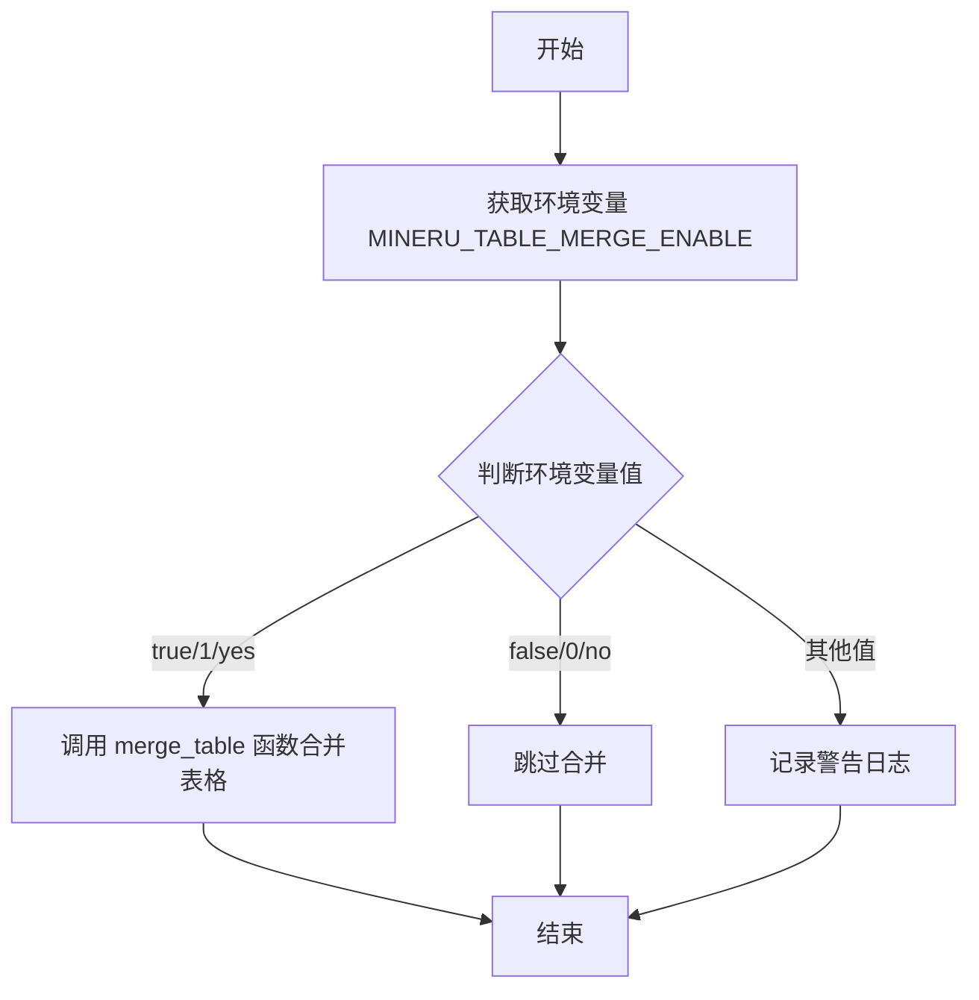
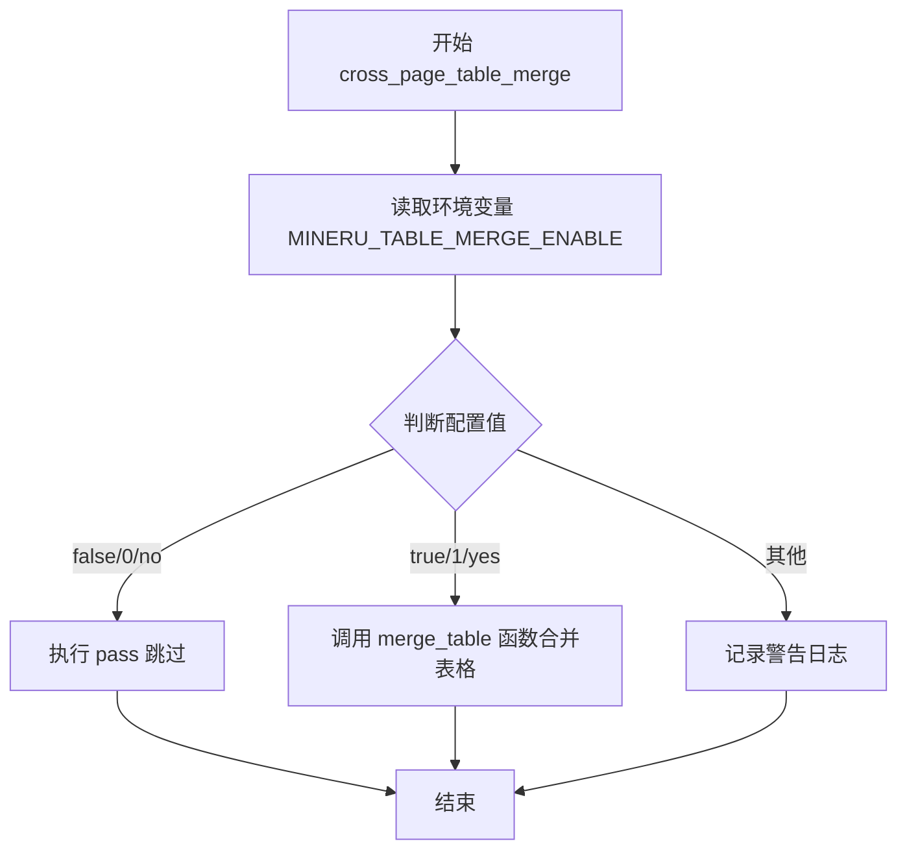
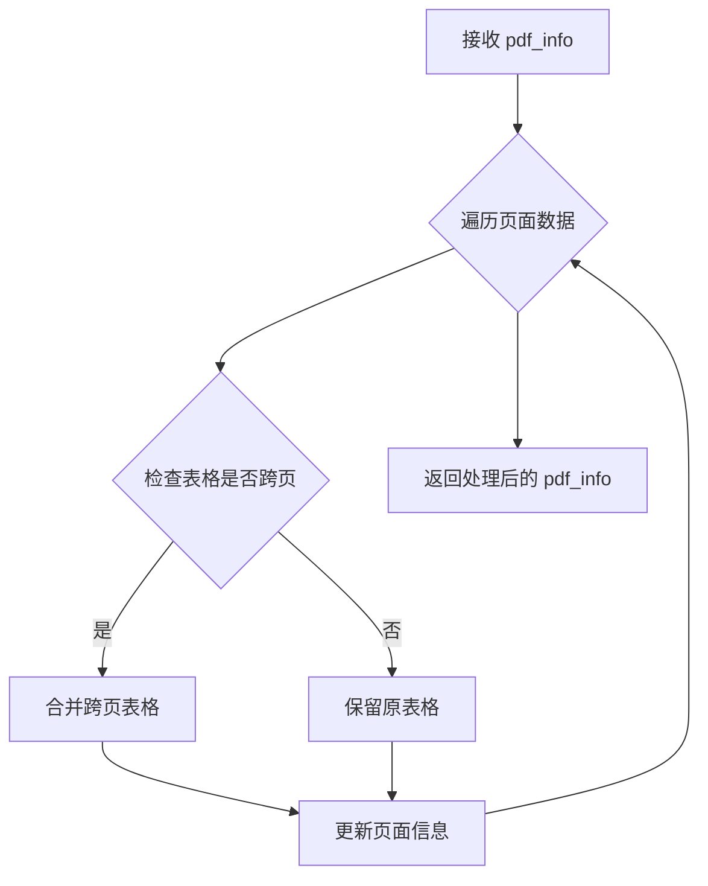

# `MinerU\mineru\backend\utils.py` 详细设计文档

该模块用于处理PDF文档中跨页表格的合并功能，通过环境变量控制是否启用表格合并，根据配置调用merge_table函数或跳过处理

## 整体流程

```mermaid
graph TD
    A[开始 cross_page_table_merge] --> B[读取环境变量 MINERU_TABLE_MERGE_ENABLE]
    B --> C{环境变量值是否为 'true'/'1'/'yes'?}
    C -- 是 --> D[调用 merge_table(pdf_info)]
    D --> E[结束]
    C -- 否 --> F{环境变量值是否为 'false'/'0'/'no'?}
    F -- 是 --> G[pass 跳过处理]
    G --> E
    F -- 否 --> H[记录警告日志 unknown config]
    H --> E
```

## 类结构

```
cross_page_table_merge (模块)
└── cross_page_table_merge (全局函数)
```

## 全局变量及字段


### `pdf_info`
    
PDF文档每页信息的字典列表，作为函数输入参数

类型：`list[dict]`
    


### `is_merge_table`
    
从环境变量MINERU_TABLE_MERGE_ENABLE获取的表格合并配置值，默认为'true'

类型：`str`
    


    

## 全局函数及方法


### `cross_page_table_merge`

该函数用于合并跨页表格，通过读取环境变量 `MINERU_TABLE_MERGE_ENABLE` 来控制是否执行多页表格合并操作，根据配置决定是否调用底层 `merge_table` 函数处理 PDF 中的跨页表格。

参数：

- `pdf_info`：`list[dict]`，包含 PDF 每一页信息的字典列表

返回值：`None`，该函数不返回任何值

#### 流程图



#### 带注释源码

```python
import os

from loguru import logger

from mineru.utils.table_merge import merge_table


def cross_page_table_merge(pdf_info: list[dict]):
    """Merge tables that span across multiple pages in a PDF document.

    Args:
        pdf_info (list[dict]): A list of dictionaries containing information about each page in the PDF.

    Returns:
        None
    """
    # 从环境变量获取表格合并功能开关配置，默认为 'true'
    is_merge_table = os.getenv('MINERU_TABLE_MERGE_ENABLE', 'true')
    
    # 判断环境变量配置值是否为启用状态（true/1/yes）
    if is_merge_table.lower() in ['true', '1', 'yes']:
        # 调用底层表格合并函数处理跨页表格
        merge_table(pdf_info)
    # 判断环境变量配置值是否为禁用状态（false/0/no）
    elif is_merge_table.lower() in ['false', '0', 'no']:
        # 不执行任何操作，跳过表格合并
        pass
    else:
        # 配置值无效时记录警告日志
        logger.warning(f'unknown MINERU_TABLE_MERGE_ENABLE config: {is_merge_table}, pass')
        pass
```


# 详细设计文档

## 1. 代码概述

这段代码实现了一个跨页表格合并功能，通过环境变量控制是否启用表格合并操作，主要用于处理PDF文档中跨越多个页面的表格数据。

## 2. 文件整体运行流程

```
cross_page_table_merge 函数执行流程：
1. 从环境变量读取 MINERU_TABLE_MERGE_ENABLE 配置
2. 判断配置值是否为启用状态（true/1/yes）
3. 如果启用，调用 merge_table 函数执行表格合并
4. 如果禁用，直接跳过（pass）
5. 如果配置值未知，记录警告日志并跳过
```

---

## 3. 类详细信息

本代码不包含类定义，仅包含模块级函数。

---

## 4. 全局变量和全局函数详细信息

### 4.1 全局变量

| 名称 | 类型 | 描述 |
|------|------|------|
| `os` | `module` | Python标准库os模块，用于读取环境变量 |
| `logger` | `Logger` | loguru库提供的日志记录器实例 |

### 4.2 全局函数

#### `cross_page_table_merge`

参数：

- `pdf_info`：`list[dict]`，包含PDF文档每页信息的字典列表

返回值：`None`，该函数无返回值

#### 流程图



#### 带注释源码

```python
import os

from loguru import logger

# 从 mineru.utils.table_merge 模块导入 merge_table 函数
from mineru.utils.table_merge import merge_table


def cross_page_table_merge(pdf_info: list[dict]):
    """Merge tables that span across multiple pages in a PDF document.

    Args:
        pdf_info (list[dict]): A list of dictionaries containing information about each page in the PDF.

    Returns:
        None
    """
    # 从环境变量读取表格合并功能开关配置，默认为'true'
    is_merge_table = os.getenv('MINERU_TABLE_MERGE_ENABLE', 'true')
    
    # 判断配置值是否为启用状态（支持多种表示方式）
    if is_merge_table.lower() in ['true', '1', 'yes']:
        # 启用状态：调用 merge_table 函数执行跨页表格合并
        merge_table(pdf_info)
    # 判断配置值是否为禁用状态
    elif is_merge_table.lower() in ['false', '0', 'no']:
        # 禁用状态：什么都不做，直接跳过
        pass
    else:
        # 配置值无效：记录警告日志并跳过
        logger.warning(f'unknown MINERU_TABLE_MERGE_ENABLE config: {is_merge_table}, pass')
        pass
```

---

## 5. 关于 `merge_table` 函数

**注意**：用户提供的要求是提取 `merge_table` 函数（来自 `mineru.utils.table_merge`），但**当前代码中未提供该函数的实现源码**。

根据代码中的调用方式，我可以推断 `merge_table` 的设计意图：

| 名称 | 参数名称 | 参数类型 | 参数描述 | 返回值类型 | 返回值描述 |
|------|----------|----------|----------|------------|------------|
| `merge_table` | `pdf_info` | `list[dict]` | 包含PDF每页信息的字典列表，可能包含表格数据 | `None` 或 `list[dict]` | 无返回值或返回合并后的PDF信息 |

**推测的流程图**：



**建议**：如需获取 `merge_table` 的完整详细设计文档（包括mermaid流程图和带注释源码），需要提供该函数的具体实现代码。

---

## 6. 关键组件信息

| 组件名称 | 一句话描述 |
|----------|------------|
| `os.getenv` | 用于读取环境变量配置，控制功能开关 |
| `logger.warning` | 用于记录无效配置值的警告日志 |
| `merge_table` | 实际执行跨页表格合并的核心函数（外部依赖） |

---

## 7. 潜在技术债务或优化空间

1. **硬编码的环境变量名**：`'MINERU_TABLE_MERGE_ENABLE'` 建议提取为配置常量
2. **Magic Strings**：配置值判断列表 `['true', '1', 'yes']` 建议定义为常量类
3. **缺少配置缓存**：每次调用都读取环境变量，可考虑缓存配置值
4. **无错误处理**：`merge_table` 调用失败时无异常捕获和处理
5. **日志信息不够详细**：警告日志未包含时间戳和上下文信息

---

## 8. 其它项目

### 设计目标与约束

- **目标**：支持PDF文档中跨页表格的自动合并功能
- **约束**：通过环境变量控制功能启用/禁用，默认为启用状态

### 错误处理与异常设计

- 当前代码未对 `merge_table` 函数调用可能产生的异常进行处理
- 建议添加 try-except 块捕获可能的异常并记录日志

### 数据流与状态机

- 输入：PDF页面信息列表（`pdf_info`）
- 处理：根据环境变量决定是否执行表格合并
- 输出：无返回值（直接修改传入的 `pdf_info` 或由 `merge_table` 内部处理）

### 外部依赖与接口契约

| 依赖项 | 用途 | 接口契约 |
|--------|------|----------|
| `mineru.utils.table_merge.merge_table` | 跨页表格合并核心逻辑 | 接受 `list[dict]` 类型参数 |
| `loguru.logger` | 日志记录 | 标准日志接口 |
| `os.getenv` | 读取环境变量 | 返回字符串类型 |

## 关键组件


### cross_page_table_merge 函数

主入口函数，根据环境变量配置决定是否执行跨页表格合并操作

### merge_table 函数

实际执行表格合并逻辑的核心函数，处理跨页表格的合并算法

### MINERU_TABLE_MERGE_ENABLE 环境变量

控制表格合并功能的开关配置，支持多种值（true/1/yes/false/0/no）进行灵活控制

### 配置解析与校验逻辑

对环境变量值进行规范化处理和小写转换，验证配置合法性并给出警告提示


## 问题及建议


### 已知问题

-   **环境变量名硬编码**：环境变量名 `'MINERU_TABLE_MERGE_ENABLE'` 直接写在代码中，未提取为常量，导致维护困难，若需修改需全局替换
-   **环境变量判断逻辑重复**：对 `is_merge_table.lower()` 调用了两次（`in ['true', ...]` 和 `in ['false', ...]`），效率低下且可读性差
-   **缺少异常处理**：调用 `merge_table(pdf_info)` 时未捕获可能发生的异常，若合并失败会导致整个流程中断
-   **返回值与文档不一致**：函数文档说明返回 `None`，但实际 `merge_table` 可能会修改 `pdf_info` 对象，产生副作用却不明确告知调用方
-   **缺少成功状态日志**：仅在配置无效时打印警告，合并成功或跳过时均无日志记录，不利于问题排查和流程追踪
-   **环境变量解析可简化**：当前使用 `os.getenv` 获取字符串后进行多重判断，可考虑使用配置类或解析库统一管理
-   **函数职责不单一**：该函数同时承担了配置读取、逻辑判断、执行合并三个职责，符合单一职责原则

### 优化建议

-   将环境变量名提取为模块级常量，如 `TABLE_MERGE_ENABLE_ENV = 'MINERU_TABLE_MERGE_ENABLE'`
-   将环境变量判断结果存储到变量中，避免重复调用 `.lower()` 方法
-   添加 `try-except` 块捕获 `merge_table` 可能抛出的异常，并记录错误日志
-   考虑在合并成功或跳过时添加 `logger.info` 日志，记录合并的表格数量或跳过原因
-   考虑使用 `python-dotenv` 或配置类统一管理配置项，提高可维护性
-   若 `merge_table` 会修改 `pdf_info`，应在文档中明确说明副作用，或考虑返回新的 `pdf_info` 对象

## 其它


### 设计目标与约束

本模块旨在解决PDF文档中表格跨越多页时被错误分割的问题，通过环境变量控制合并功能的启用与禁用，实现灵活的配置管理。设计约束包括：仅支持通过环境变量配置，不支持运行时动态配置；依赖外部的merge_table函数完成实际的合并逻辑。

### 错误处理与异常设计

代码中对环境变量值进行了白名单验证，当配置值不在预期范围内时，记录警告日志并跳过合并操作。对于merge_table函数可能抛出的异常，当前实现未进行捕获，建议根据业务需求补充异常处理逻辑，防止异常扩散影响主流程。

### 数据流与状态机

数据流为：读取环境变量 → 验证配置值 → 根据结果决定是否调用merge_table。状态机包含三种状态：启用状态（true/1/yes）执行合并、禁用状态（false/0/no）跳过合并、未知状态记录警告并跳过合并。

### 外部依赖与接口契约

本模块依赖三个外部组件：os模块用于读取环境变量、loguru用于日志记录、mineru.utils.table_merge.merge_table执行实际合并。其中merge_table函数的输入参数pdf_info应为包含每页信息的字典列表，输出为None（原地修改pdf_info）。

### 配置文件与参数说明

主要配置项为环境变量MINERU_TABLE_MERGE_ENABLE，支持的值包括：true、1、yes（启用合并），false、0、no（禁用合并），其他值（记录警告并禁用）。建议在部署文档中明确说明该环境变量的作用和可选值。

### 性能考虑

当前实现在每次调用时都会读取环境变量，如需优化可考虑在模块初始化时读取并缓存配置值。对于大规模PDF处理场景，merge_table函数的性能可能是主要瓶颈，建议进行性能测试并针对性优化。

### 安全性考虑

代码本身不涉及用户输入处理，安全性风险较低。但需注意merge_table函数对pdf_info数据的处理应防止恶意构造的数据导致的问题，建议在调用前对pdf_info进行基本的数据验证。

### 测试相关

建议补充以下测试用例：环境变量为各种合法值时的行为测试、环境变量为非法值时的警告日志测试、merge_table函数抛出异常时的异常处理测试、pdf_info为空列表或None时的边界条件测试。

### 版本兼容性

当前代码使用了Python 3.9+的类型提示语法（list[dict]），需要Python 3.9及以上版本。loguru库需要单独安装，兼容版本需根据loguru官方文档确定。
    