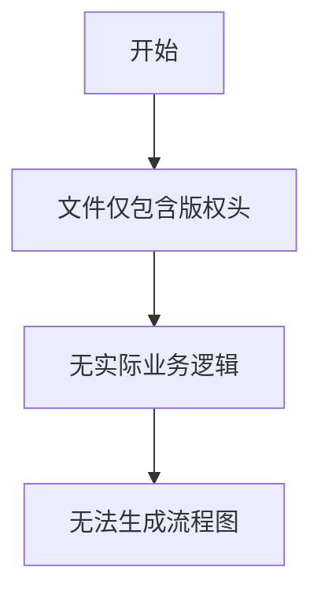

# `MinerU\mineru\backend\vlm\__init__.py` 详细设计文档

该代码文件仅包含版权声明，未提供实际的可分析源代码内容。

## 整体流程



## 类结构

```
该文件无类定义
```

## 全局变量及字段


    

## 全局函数及方法


## 关键组件


### 代码分析结果

提供的源代码仅包含版权声明，不包含任何功能性实现代码。因此无法识别任何关键组件（如张量索引与惰性加载、反量化支持、量化策略等）。

### 建议

如需生成详细设计文档，请提供包含实际功能实现的代码文件。


## 问题及建议


### 已知问题

- 代码文件仅包含版权声明，无任何实际实现代码，无法进行有效的功能分析和文档生成
- 缺少必要的模块入口、类定义或函数实现
- 缺少模块文档字符串（docstring）来说明模块用途

### 优化建议

- 补充完整的代码实现或提供实际的业务逻辑代码以供分析
- 添加模块级文档字符串，说明模块的核心功能、作者、版本等信息
- 如果是占位文件，建议明确标注为"TODO"或"Placeholder"状态，并说明预期的实现内容
- 建议添加基本的代码框架（如必要的导入、类结构等）以便进行架构分析


## 其它


### 设计目标与约束

由于提供的代码仅包含版权声明，未包含实际功能实现，无法确定具体的设计目标与约束。

### 错误处理与异常设计

由于提供的代码仅包含版权声明，未包含实际功能实现，无法设计具体的错误处理与异常机制。

### 数据流与状态机

由于提供的代码仅包含版权声明，未包含实际功能实现，无法绘制数据流图或状态机图。

### 外部依赖与接口契约

由于提供的代码仅包含版权声明，未包含实际功能实现，无法确定外部依赖和接口契约。

### 安全性考虑

由于提供的代码仅包含版权声明，未包含实际功能实现，无法进行安全性分析。

### 性能要求

由于提供的代码仅包含版权声明，未包含实际功能实现，无法设定性能要求。

### 兼容性设计

由于提供的代码仅包含版权声明，未包含实际功能实现，无法设计兼容性方案。

### 配置管理

由于提供的代码仅包含版权声明，未包含实际功能实现，无法设计配置管理方案。

### 版本控制策略

由于提供的代码仅包含版权声明，未包含实际功能实现，无法制定版本控制策略。

### 测试策略

由于提供的代码仅包含版权声明，未包含实际功能实现，无法制定测试策略。

### 部署架构

由于提供的代码仅包含版权声明，未包含实际功能实现，无法设计部署架构。

### 监控与运维

由于提供的代码仅包含版权声明，未包含实际功能实现，无法设计监控与运维方案。

    