# `MinerU\mineru\backend\vlm\model_output_to_middle_json.py` 详细设计文档

该文件是Mineru PDF处理流水线的核心模块，负责将模型输出的blocks转换为包含页面信息的中间JSON格式，支持图像、表格、代码、引用文本、拼音、标题、文本、行间公式和列表等多种类型blocks的处理，并提供标题层级优化和跨页表格合并功能

## 整体流程

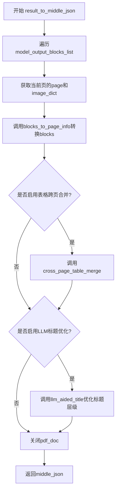

## 类结构

```
MagicModel (VLM魔法模型)
└── 负责将原始blocks分类为: image_blocks, table_blocks, title_blocks, code_blocks, ref_text_blocks, phonetic_blocks, text_blocks, interline_equation_blocks, list_blocks, discarded_blocks
```

## 全局变量及字段


### `heading_level_import_success`
    
表示标题级别功能模块是否成功导入的标志

类型：`bool`
    


### `llm_aided_config`
    
从配置获取的LLM辅助功能配置字典

类型：`dict`
    


### `title_aided_config`
    
从LLM辅助配置中提取的标题辅助功能配置字典

类型：`dict`
    


### `MagicModel.page_blocks`
    
包含页面中所有块的列表，如文本块、图像块、表格块等

类型：`list`
    


### `MagicModel.width`
    
页面的宽度尺寸

类型：`int`
    


### `MagicModel.height`
    
页面的高度尺寸

类型：`int`
    
    

## 全局函数及方法


### `blocks_to_page_info`

该函数是PDF页面处理的核心转换函数，负责将模型输出的页面块（blocks）转换为标准化的页面信息结构，同时处理图像截取、OCR标题优化等任务，最终返回包含所有页面块、丢弃块、页面尺寸和索引的完整页面信息字典。

参数：

- `page_blocks`：`list`，模型输出的原始页面块列表，包含图像、表格、文本等各类内容块
- `image_dict`：`dict`，包含图像缩放比例、图像MD5值和PIL图像对象的字典
- `page`：`object`，PDF页面对象，用于获取页面尺寸信息
- `image_writer`：`object`，图像写入器，用于保存截取的图像和表格图片
- `page_index`：`int`，页面索引，用于标识当前处理的页面序号

返回值：`dict`，包含页面信息字典，键包括`para_blocks`（排序后的所有内容块）、`discarded_blocks`（被丢弃的块）、`page_size`（页面尺寸[宽,高]）、`page_idx`（页面索引）

#### 流程图

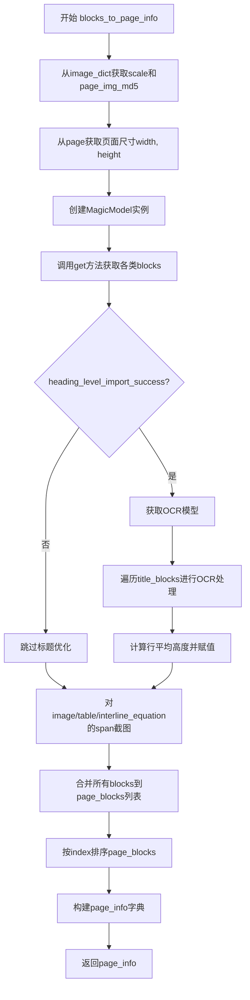

#### 带注释源码

```python
def blocks_to_page_info(page_blocks, image_dict, page, image_writer, page_index) -> dict:
    """将blocks转换为页面信息"""
    
    # 从image_dict中获取图像缩放比例
    scale = image_dict["scale"]
    # 获取页面PIL图像对象
    page_pil_img = image_dict["img_pil"]
    # 计算页面图像的MD5值用于缓存和去重
    page_img_md5 = bytes_md5(page_pil_img.tobytes())
    # 获取页面尺寸（宽度和高度）
    width, height = map(int, page.get_size())

    # 创建MagicModel实例，传入页面块和页面尺寸
    magic_model = MagicModel(page_blocks, width, height)
    # 获取各类内容块
    image_blocks = magic_model.get_image_blocks()           # 图像块
    table_blocks = magic_model.get_table_blocks()           # 表格块
    title_blocks = magic_model.get_title_blocks()           # 标题块
    discarded_blocks = magic_model.get_discarded_blocks()   # 被丢弃的块
    code_blocks = magic_model.get_code_blocks()              # 代码块
    ref_text_blocks = magic_model.get_ref_text_blocks()     # 引用文本块
    phonetic_blocks = magic_model.get_phonetic_blocks()      # 音标块
    list_blocks = magic_model.get_list_blocks()              # 列表块

    # 如果有标题优化需求，则对title_blocks截图det
    if heading_level_import_success:
        # 获取原子模型管理器单例
        atom_model_manager = AtomModelSingleton()
        # 获取OCR模型
        ocr_model = atom_model_manager.get_atom_model(
            atom_model_name='ocr',
            ocr_show_log=False,
            det_db_box_thresh=0.3,
            lang='ch_lite'
        )
        # 遍历每个标题块进行OCR处理
        for title_block in title_blocks:
            # 根据边界框裁剪标题图像
            title_pil_img = get_crop_img(title_block['bbox'], page_pil_img, scale)
            # 转换为numpy数组
            title_np_img = np.array(title_pil_img)
            # 给title_pil_img添加上下左右各50像素白边padding
            title_np_img = cv2.copyMakeBorder(
                title_np_img, 50, 50, 50, 50, cv2.BORDER_CONSTANT, value=[255, 255, 255]
            )
            # 转换颜色空间RGB到BGR
            title_img = cv2.cvtColor(title_np_img, cv2.COLOR_RGB2BGR)
            # 执行OCR检测
            ocr_det_res = ocr_model.ocr(title_img, rec=False)[0]
            if len(ocr_det_res) > 0:
                # 计算所有res的平均高度
                avg_height = np.mean([box[2][1] - box[0][1] for box in ocr_det_res])
                # 将平均行高除以缩放比例并存储到标题块
                title_block['line_avg_height'] = round(avg_height/scale)

    # 获取文本块
    text_blocks = magic_model.get_text_blocks()
    # 获取行间公式块
    interline_equation_blocks = magic_model.get_interline_equation_blocks()

    # 获取所有span（跨元素）
    all_spans = magic_model.get_all_spans()
    # 对image/table/interline_equation的span截图
    for span in all_spans:
        # 根据内容类型判断是否为需要截图的span
        if span["type"] in [ContentType.IMAGE, ContentType.TABLE, ContentType.INTERLINE_EQUATION]:
            # 调用函数截取并保存图像
            span = cut_image_and_table(span, page_pil_img, page_img_md5, page_index, image_writer, scale=scale)

    # 初始化页面块列表
    page_blocks = []
    # 合并所有类型的页面块
    page_blocks.extend([
        *image_blocks,
        *table_blocks,
        *code_blocks,
        *ref_text_blocks,
        *phonetic_blocks,
        *title_blocks,
        *text_blocks,
        *interline_equation_blocks,
        *list_blocks,
    ])
    # 对page_blocks根据index的值进行排序
    page_blocks.sort(key=lambda x: x["index"])

    # 构建页面信息字典
    page_info = {
        "para_blocks": page_blocks,           # 所有内容块（已排序）
        "discarded_blocks": discarded_blocks, # 被丢弃的块
        "page_size": [width, height],         # 页面尺寸
        "page_idx": page_index                # 页面索引
    }
    return page_info
```


### `result_to_middle_json`

该函数是 PDF 处理流程中的核心转换函数，负责将模型输出的_blocks列表、图像列表和PDF文档整合转换为中间JSON格式，并支持表格跨页合并和LLM标题分级优化。

参数：

- `model_output_blocks_list`：`list`，模型输出的页面blocks列表，每个元素包含该页的各类内容块（文本、图像、表格等）
- `images_list`：`list`，页面图像列表，每个元素包含对应页面的图像字典（包含PIL图像、缩放比例等信息）
- `pdf_doc`：`pdf文档对象`，原始PDF文档，用于获取页面尺寸和内容
- `image_writer`：`图像写入器对象`，负责将提取的图像保存到指定位置

返回值：`dict`，返回包含PDF页面信息的中间JSON对象，包含`pdf_info`（页面块列表）、`_backend`（后端标识"vlm"）和`_version_name`（版本号）字段

#### 流程图

```mermaid
flowchart TD
    A[开始 result_to_middle_json] --> B[初始化 middle_json 结构]
    B --> C{遍历 model_output_blocks_list}
    C -->|每次迭代| D[获取当前页 pdf_doc[index]]
    D --> E[获取当前页图像 image_dict = images_list[index]]
    E --> F[调用 blocks_to_page_info 转换blocks]
    F --> G[将 page_info 添加到 middle_json['pdf_info']]
    G --> H{是否还有更多页面?}
    H -->|是| C
    H -->|否| I[检查表格跨页合并功能是否启用]
    I --> J{table_enable == True?}
    J -->|是| K[调用 cross_page_table_merge 合并跨页表格]
    J -->|否| L[检查 LLm 标题分级是否可用]
    K --> L
    L --> M{heading_level_import_success == True?}
    M -->|是| N[调用 llm_aided_title 优化标题分级]
    M -->|否| O[关闭 pdf_doc 文档]
    N --> O
    O --> P[返回 middle_json]
```

#### 带注释源码

```python
def result_to_middle_json(model_output_blocks_list, images_list, pdf_doc, image_writer):
    """
    将模型输出的blocks列表转换为中间JSON格式
    
    参数:
        model_output_blocks_list: 模型输出的页面blocks列表
        images_list: 页面图像列表
        pdf_doc: PDF文档对象
        image_writer: 图像写入器
    返回:
        middle_json: 包含所有页面信息的字典
    """
    # 初始化中间JSON结构，包含后端标识和版本信息
    middle_json = {"pdf_info": [], "_backend":"vlm", "_version_name": __version__}
    
    # 遍历每一页的模型输出blocks
    for index, page_blocks in enumerate(model_output_blocks_list):
        # 获取当前页的PDF文档对象
        page = pdf_doc[index]
        # 获取当前页对应的图像字典
        image_dict = images_list[index]
        # 调用blocks_to_page_info将blocks转换为页面信息
        page_info = blocks_to_page_info(page_blocks, image_dict, page, image_writer, index)
        # 将页面信息添加到pdf_info列表中
        middle_json["pdf_info"].append(page_info)

    """表格跨页合并"""
    # 从环境变量获取表格功能开关配置，默认为True启用
    table_enable = get_table_enable(os.getenv('MINERU_VLM_TABLE_ENABLE', 'True').lower() == 'true')
    # 如果启用表格功能，则执行跨页表格合并
    if table_enable:
        cross_page_table_merge(middle_json["pdf_info"])

    """llm优化标题分级"""
    # 如果LLM标题分级功能可用（已成功导入相关模块）
    if heading_level_import_success:
        # 记录LLM标题优化开始时间
        llm_aided_title_start_time = time.time()
        # 调用LLM标题分级函数处理所有页面信息
        llm_aided_title(middle_json["pdf_info"], title_aided_config)
        # 记录优化耗时并日志输出
        logger.info(f'llm aided title time: {round(time.time() - llm_aided_title_start_time, 2)}')

    # 处理完成后关闭PDF文档释放资源
    pdf_doc.close()
    # 返回最终的中间JSON结果
    return middle_json
```


### `cross_page_table_merge`

表格跨页合并函数，用于检测并合并跨越多个页面的表格内容。该函数接收页面信息列表作为输入，遍历每个页面的表格块，识别跨页表格并将其合并为连续的完整表格。

参数：

- `pdf_info`： `list[dict]`，页面信息列表，每个元素包含页面的段落块（para_blocks）信息，其中可能包含需要合并的跨页表格

返回值： `None`，该函数直接修改传入的列表（原地操作），不返回新的数据结构

#### 流程图

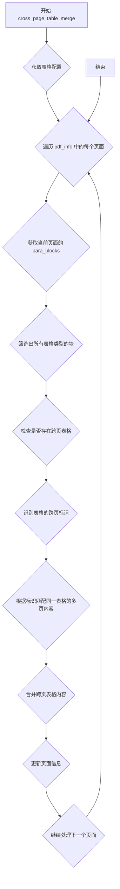

#### 带注释源码

```python
# 从 mineru.backend.utils 模块导入的跨页表格合并函数
# 具体实现位于 mineru/backend/utils 模块中

# 在 result_to_middle_json 函数中的调用方式：
"""
table_enable = get_table_enable(os.getenv('MINERU_VLM_TABLE_ENABLE', 'True').lower() == 'true')
if table_enable:
    cross_page_table_merge(middle_json["pdf_info"])
"""

# 函数调用说明：
# 1. 首先检查表格功能是否启用（通过环境变量 MINERU_VLM_TABLE_ENABLE 控制）
# 2. 如果启用，则调用 cross_page_table_merge 对 pdf_info 进行跨页表格合并
# 3. pdf_info 是一个列表，每个元素对应一个页面的信息字典
# 4. 函数内部会遍历每个页面的表格块，识别带有跨页标记的表格
# 5. 将同一表格的多页内容合并成一个完整的表格结构
# 6. 合并后的表格会更新到对应的页面信息中
```

#### 关键组件信息

| 组件名称 | 一句话描述 |
|---------|-----------|
| `cross_page_table_merge` | 跨页表格合并核心函数，识别并合并分散在不同页面的表格 |
| `result_to_middle_json` | 主处理函数，负责协调整个PDF到中间JSON的转换流程 |
| `blocks_to_page_info` | 将模型输出的blocks转换为页面信息的处理函数 |

#### 潜在的技术债务或优化空间

1. **外部导入依赖**：该函数作为外部导入模块，源码不可见，建议补充完整的函数文档和类型注解
2. **配置检查时机**：表格合并功能的启用检查可以提前到更早阶段，避免不必要的函数调用开销
3. **错误处理缺失**：调用 `cross_page_table_merge` 时没有 try-except 保护，如果函数执行失败会导致整个流程中断
4. **合并策略透明度**：跨页表格的合并规则（如如何处理表头、表尾、单元格拆分等）不够明确

#### 其它项目

**设计目标与约束**：
- 目标：解决PDF文档中表格被拆分到多个页面的问题，输出完整的表格结构
- 约束：依赖 `get_table_enable` 配置项控制功能开关

**错误处理与异常设计**：
- 当前代码未对 `cross_page_table_merge` 进行异常捕获，建议添加：
```python
if table_enable:
    try:
        cross_page_table_merge(middle_json["pdf_info"])
    except Exception as e:
        logger.warning(f"跨页表格合并失败: {e}")
```

**数据流与状态机**：
- 输入：包含多个页面信息的列表，每个页面包含 `para_blocks`（段落块）数组
- 处理：识别 `para_blocks` 中类型为表格的块，检查跨页标记，合并相关内容
- 输出：原地修改 `pdf_info` 列表，更新跨页表格的完整性

**外部依赖与接口契约**：
- 依赖模块：`mineru.backend.utils`
- 输入契约：`list[dict]`，每个dict包含页面块信息
- 输出契约：无返回值，原地修改输入数据


### `llm_aided_title`

该函数为外部导入的LLM辅助标题分级功能，通过大语言模型对PDF页面的标题块进行智能分析和层级划分，优化文档标题的结构化输出。

参数：

-  `pdf_info`：`List[Dict]`，页面信息列表，包含页面的段落块、页面尺寸、页面索引等详细信息，每个元素对应一页的解析结果
-  `title_aided_config`：`Dict`，标题辅助配置字典，包含启用状态、API配置等参数，用于控制LLM标题分级的行为

返回值：`None`，该函数直接修改传入的`pdf_info`列表中的标题块，添加标题层级信息，无显式返回值

#### 流程图

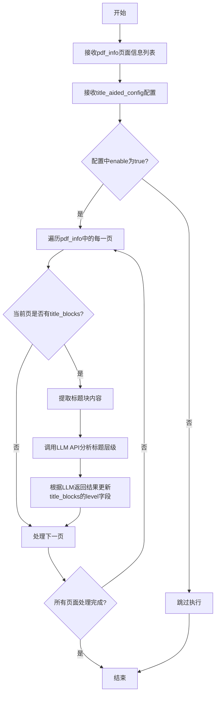

#### 带注释源码

```python
# 该函数为外部导入，具体实现位于 mineru.utils.llm_aided 模块
# 代码中通过动态导入获取该函数
from mineru.utils.llm_aided import llm_aided_title

# 在 result_to_middle_json 函数中被调用
# 用于对PDF解析结果进行标题层级优化

"""llm优化标题分级"""
# 检查是否成功导入LLM辅助功能模块
if heading_level_import_success:
    # 记录开始时间用于性能监控
    llm_aided_title_start_time = time.time()
    # 调用LLM辅助标题分级函数，传入页面信息和配置
    # 该函数会直接修改 middle_json["pdf_info"] 中的标题块，添加level字段
    llm_aided_title(middle_json["pdf_info"], title_aided_config)
    # 记录耗时并输出日志
    logger.info(f'llm aided title time: {round(time.time() - llm_aided_title_start_time, 2)}')
```

> **注意**：该函数的具体实现源码未在当前代码文件中给出，它是通过 `from mineru.utils.llm_aided import llm_aided_title` 从外部模块动态导入的。上述源码展示的是该函数在项目中的调用方式和使用上下文。


### cut_image_and_table

该函数是一个外部导入函数，用于将页面中的图像、表格和行内公式从页面原图中切割出来，生成独立的图像文件，并根据配置进行缩放处理。

参数：

- `span`：`dict`，包含类型为 IMAGE、TABLE 或 INTERLINE_EQUATION 的 span 信息，需包含 bbox（边界框）等字段
- `page_pil_img`：`PIL.Image`，页面完整的 PIL 图像对象
- `page_img_md5`：`str`，页面图像的 MD5 哈希值，用于生成唯一文件名
- `page_index`：`int`，页面索引，用于构建输出路径
- `image_writer`：`object`，图像写入器，负责将切割后的图像保存到磁盘
- `scale`：`float`，图像缩放比例，默认为 1.0

返回值：`dict`，返回处理后的 span 对象，包含切割后的图像路径等信息

#### 流程图

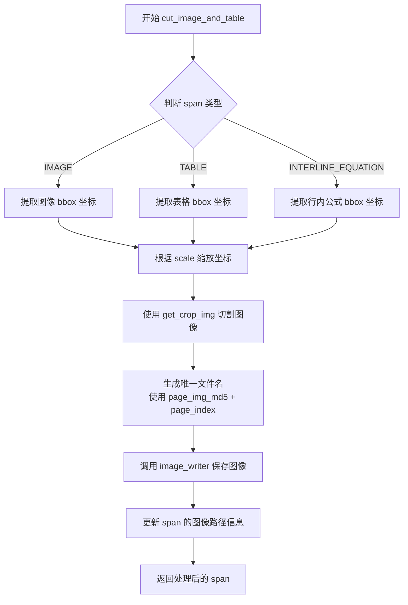

#### 带注释源码

```python
# 注：以下为基于调用方式推断的函数逻辑，并非源码
# 实际源码位于 mineru/utils/cut_image.py 模块中

def cut_image_and_table(span, page_pil_img, page_img_md5, page_index, image_writer, scale=1.0):
    """
    切割图像、表格或行内公式
    
    参数:
        span: 包含 type 和 bbox 信息的字典
        page_pil_img: 页面完整图像
        page_img_md5: 页面图像MD5
        page_index: 页码索引
        image_writer: 图像写入器
        scale: 缩放比例
    
    返回:
        处理后的 span 字典
    """
    # 1. 获取 span 的类型（IMAGE/TABLE/INTERLINE_EQUATION）
    span_type = span.get("type")
    
    # 2. 根据类型获取对应的边界框
    bbox = span.get("bbox")
    
    # 3. 根据 scale 缩放边界框坐标
    scaled_bbox = [
        bbox[0] * scale,
        bbox[1] * scale,
        bbox[2] * scale,
        bbox[3] * scale
    ]
    
    # 4. 使用 get_crop_img 切割图像
    crop_img = get_crop_img(scaled_bbox, page_pil_img, scale)
    
    # 5. 生成唯一文件名（基于 MD5 和页码）
    img_name = f"{page_img_md5}_{page_index}_{span_type}.png"
    
    # 6. 保存图像
    image_writer.write_image(img_name, crop_img)
    
    # 7. 更新 span 信息并返回
    span["image_path"] = img_name
    return span
```

#### 备注

由于 `cut_image_and_table` 是从 `mineru.utils.cut_image` 模块外部导入的，上述源码为基于调用方式的合理推断。实际实现可能包含更多细节，如错误处理、不同的图像格式支持等。欲查看完整源码，请参考 `mineru/utils/cut_image.py` 文件。


### `get_crop_img`

从页面图像中根据指定的边界框和缩放比例裁剪出目标区域图像。

参数：

- `bbox`：`list` 或 `tuple`，目标区域的边界框坐标，通常为 `[x_min, y_min, x_max, y_max]` 格式
- `page_pil_img`：`PIL.Image`，完整的页面图像对象
- `scale`：`float`，图像缩放比例，用于坐标转换

返回值：`PIL.Image`，裁剪后的图像对象

#### 流程图

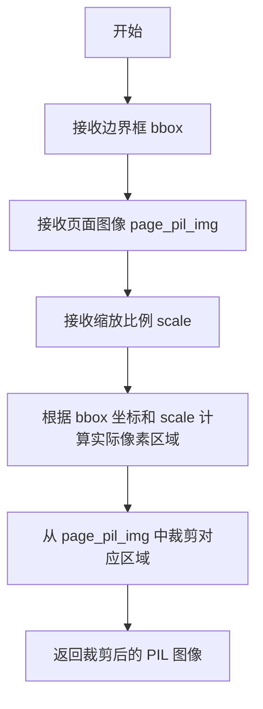

#### 带注释源码

```python
# 源码说明：get_crop_img 为外部导入函数，源码位于 mineru.utils.pdf_image_tools 模块
# 以下为该函数在项目中的实际调用示例：

# 从 mineru.utils.pdf_image_tools 导入 get_crop_img 函数
from mineru.utils.pdf_image_tools import get_crop_img

# 在 blocks_to_page_info 函数中调用 get_crop_img
# 参数说明：
#   title_block['bbox']: 标题块的边界框坐标 [x1, y1, x2, y2]
#   page_pil_img: 页面完整的 PIL 图像对象
#   scale: 图像缩放比例因子
title_pil_img = get_crop_img(title_block['bbox'], page_pil_img, scale)

# 调用后将得到裁剪后的标题区域图像，用于后续的 OCR 识别处理
```


### `bytes_md5`

该函数为外部导入的MD5哈希计算函数，位于 `mineru.utils.hash_utils` 模块中，用于将字节数据转换为MD5哈希值，常用于生成图像等数据的唯一标识符。

参数：

- `data`：`bytes`，待计算MD5哈希的字节数据（此处传入的是 `page_pil_img.tobytes()` 的结果，即PIL图像对象的字节表示）

返回值：`str`，返回32位十六进制格式的MD5哈希字符串

#### 流程图

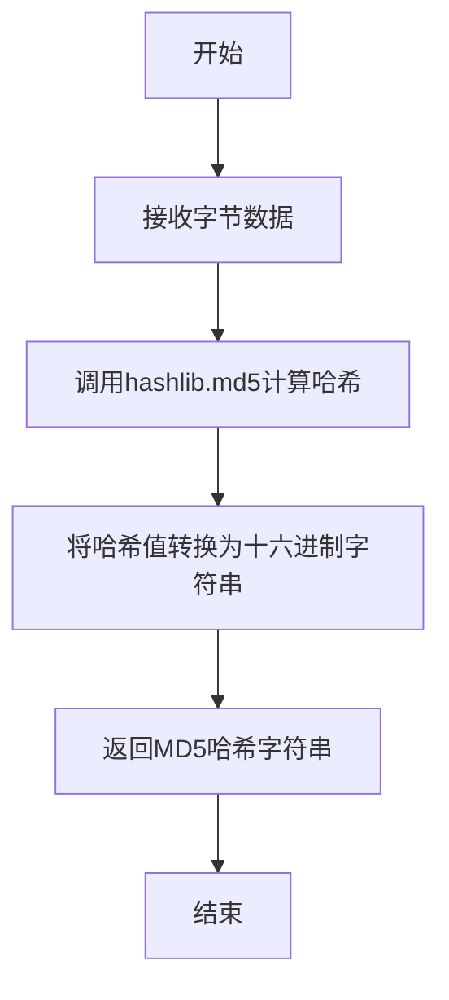

#### 带注释源码

```python
# 该函数为外部导入函数，定义位于 mineru/utils/hash_utils.py
# 源码推断如下：

def bytes_md5(data: bytes) -> str:
    """
    计算字节数据的MD5哈希值
    
    参数:
        data: 输入的字节数据
        
    返回:
        32位十六进制格式的MD5哈希字符串
    """
    import hashlib
    
    # 创建MD5哈希对象
    md5_hash = hashlib.md5()
    
    # 更新哈希对象，传入字节数据
    md5_hash.update(data)
    
    # 返回十六进制格式的哈希值
    return md5_hash.hexdigest()
```

#### 在项目中的调用示例

```python
# 从mineru.utils.hash_utils导入
from mineru.utils.hash_utils import bytes_md5

# 在blocks_to_page_info函数中使用
page_img_md5 = bytes_md5(page_pil_img.tobytes())
```

---

**补充说明**：
- 该函数是工具函数，属于 `mineru.utils.hash_utils` 模块
- 主要用途：为页面图像生成唯一的MD5标识符，用于图像缓存和命名
- 调用位置：在 `blocks_to_page_info` 函数中，用于生成页面图像的唯一标识，以便后续图像处理和缓存管理
- 设计目标：快速生成确定性的小型哈希值，适用于文件去重和缓存键生成场景


### `get_table_enable`

这是一个配置读取函数，用于获取表格处理功能的启用状态。它接收一个布尔值参数，根据该参数和环境变量配置返回表格功能是否启用的最终状态，常用于控制跨页表格合并等功能的开关。

参数：

-  `enable`：`bool`，表示是否启用表格功能的布尔值输入

返回值：`bool`，返回表格功能是否实际启用的状态（基于配置和输入参数的最终决策）

#### 流程图

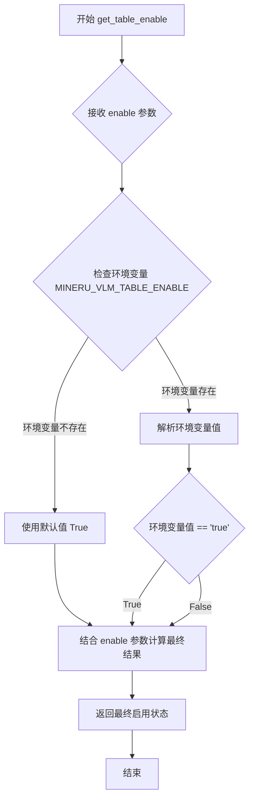

#### 带注释源码

```python
# 从 config_reader 模块导入的函数
# 使用方式：
# table_enable = get_table_enable(os.getenv('MINERU_VLM_TABLE_ENABLE', 'True').lower() == 'true')

# 函数签名（推断）
def get_table_enable(enable: bool) -> bool:
    """
    获取表格功能的启用状态
    
    参数:
        enable: 用户传入的布尔值，表示是否启用表格功能
        
    返回值:
        表格功能是否实际启用的最终状态
    """
    # 该函数内部逻辑需要查看 mineru.utils.config_reader 模块
    # 从调用方式来看：
    # 1. 首先获取环境变量 MINERU_VLM_TABLE_ENABLE，默认值为 'True'
    # 2. 将环境变量转换为小写并与 'true' 比较，得到布尔值
    # 3. 将该布尔值作为 enable 参数传入 get_table_enable
    # 4. 函数返回最终的启用状态
    
    pass  # 具体实现位于 mineru.utils.config_reader 模块中
```


### `get_llm_aided_config`

该函数为外部导入的配置读取函数，用于获取 LLM 辅助功能的配置参数，返回一个包含标题辅助等配置项的字典。

参数：

- 该函数无参数

返回值：`dict`，返回 LLM 辅助配置字典，通常包含 `title_aided` 等键，`title_aided` 键又可包含 `enable` 等子配置项

#### 流程图

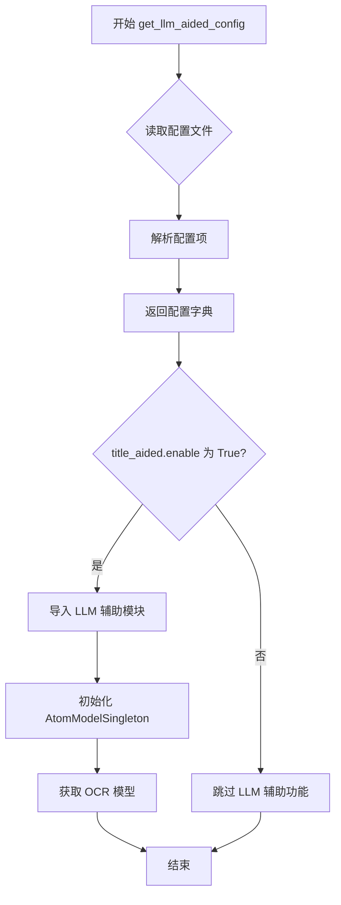

#### 带注释源码

```python
# 外部导入的函数，从 mineru.utils.config_reader 模块引入
from mineru.utils.config_reader import get_table_enable, get_llm_aided_config

# 全局变量：存储 LLM 辅助配置
llm_aided_config = get_llm_aided_config()  # 调用函数获取配置，返回 dict 类型

# 检查配置是否存在
if llm_aided_config:
    # 从配置中获取 title_aided 相关配置
    title_aided_config = llm_aided_config.get('title_aided', {})
    
    # 检查 title_aided 是否启用
    if title_aided_config.get('enable', False):
        try:
            # 动态导入 LLM 辅助模块
            from mineru.utils.llm_aided import llm_aided_title
            from mineru.backend.pipeline.model_init import AtomModelSingleton
            
            # 标记导入成功
            heading_level_import_success = True
        except Exception as e:
            # 导入失败时记录警告日志
            logger.warning("The heading level feature cannot be used. If you need to use the heading level feature, "
                            "please execute `pip install mineru[core]` to install the required packages.")
```


### `MagicModel.get_image_blocks`

该方法用于从文档页面内容块中提取所有图像块（Image Blocks），是 MagicModel 类的核心方法之一，负责识别并返回页面中所有图像类型的元素。

参数：
- 该方法无显式参数（仅包含隐式参数 `self`）

返回值：`List[dict]`，返回图像块的列表，每个图像块是一个包含类型、位置坐标等信息的字典

#### 流程图

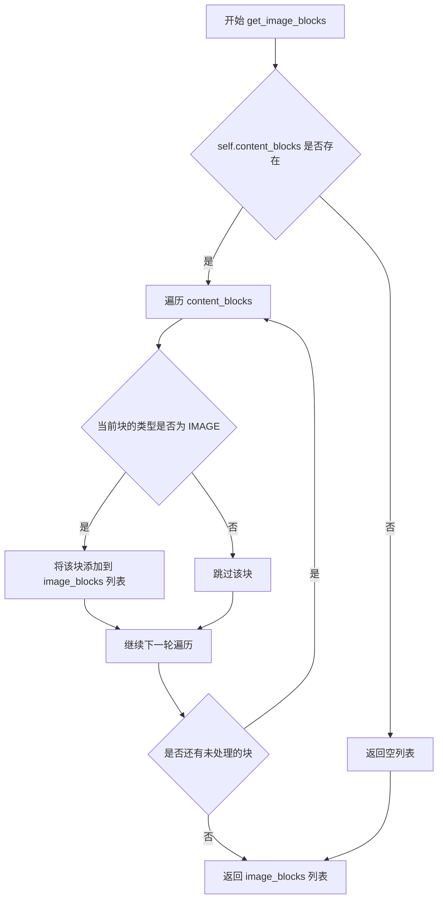

#### 带注释源码

```
# 由于源代码未直接提供 MagicModel 类的完整定义
# 以下是根据代码调用方式推断的方法实现逻辑

def get_image_blocks(self):
    """
    从已解析的内容块中提取所有图像类型的块
    
    处理流程：
    1. 检查 self.content_blocks 是否存在且非空
    2. 遍历所有内容块
    3. 筛选 ContentType.IMAGE 类型的块
    4. 将符合条件的块收集到列表中返回
    """
    # 获取图像块列表
    image_blocks = []
    
    # 遍历所有内容块进行筛选
    for block in self.content_blocks:
        # 根据块类型判断是否为图像
        # ContentType.IMAGE 是预定义的枚举类型
        if block.get('type') == ContentType.IMAGE:
            image_blocks.append(block)
    
    return image_blocks

# 调用示例（在 blocks_to_page_info 函数中）
# magic_model = MagicModel(page_blocks, width, height)
# image_blocks = magic_model.get_image_blocks()
```

#### 补充说明

该方法在 `blocks_to_page_info` 函数中被调用，完整调用上下文如下：

```python
# 初始化 MagicModel 实例，传入页面块、页面宽高
magic_model = MagicModel(page_blocks, width, height)

# 获取各类内容块
image_blocks = magic_model.get_image_blocks()      # 图像块
table_blocks = magic_model.get_table_blocks()      # 表格块
title_blocks = magic_model.get_title_blocks()       # 标题块
# ... 其他类型块

# 最终将所有块合并到 page_blocks 列表
page_blocks.extend([
    *image_blocks,
    *table_blocks,
    *code_blocks,
    # ...
])
```


### `MagicModel.get_table_blocks`

该方法用于从已处理的页面块中提取表格块（table_blocks），通常在文档解析流程中用于识别和分离PDF或图像中的表格内容。

参数： 无

返回值：`list`，返回识别出的表格块列表，每个表格块通常包含位置坐标(bbox)、索引(index)、类型(type)等信息。

#### 流程图

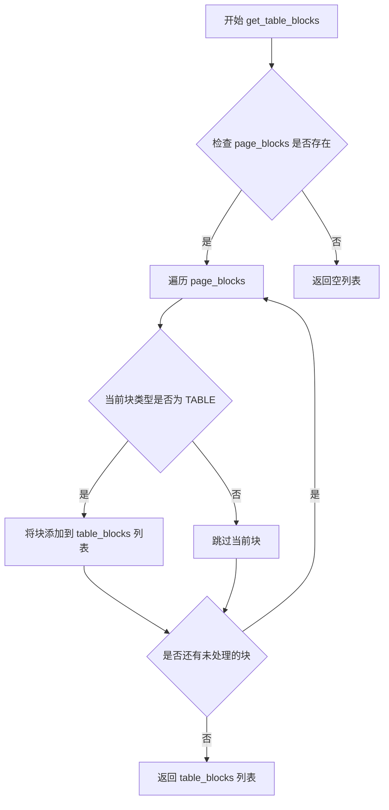

#### 带注释源码

```
# 由于提供的代码中未直接包含 MagicModel 类的具体实现，
# 以下源码基于调用上下文和常见的表格块提取模式推断

def get_table_blocks(self):
    """获取表格块列表
    
    Returns:
        list: 表格块列表，包含所有被识别为表格内容的块
    """
    # 初始化结果列表
    table_blocks = []
    
    # 遍历所有页面块，筛选类型为表格的块
    for block in self.page_blocks:
        # ContentType.TABLE 通常表示表格内容的类型标识
        if block.get('type') == ContentType.TABLE:
            table_blocks.append(block)
    
    # 返回提取到的表格块
    return table_blocks

# 在 blocks_to_page_info 函数中的调用方式：
# table_blocks = magic_model.get_table_blocks()
```

**注意**：由于原始代码中仅展示了`MagicModel`类的调用方式，未直接包含该类的内部实现，上述源码为基于常见设计模式和调用上下文的合理推断。实际的`MagicModel`类定义位于`mineru/backend/vlm/vlm_magic_model`模块中，建议查阅该源文件获取完整的实现细节。


### `MagicModel.get_title_blocks`

获取文档中的标题块（title blocks），该方法从已处理的文档块中提取所有被识别为标题的内容块，用于后续的标题分级优化和页面布局构建。

参数：无（仅包含 self 参数）

返回值：`List[dict]`，返回标题块列表，每个字典包含标题的边界框（bbox）和其他元数据信息

#### 流程图

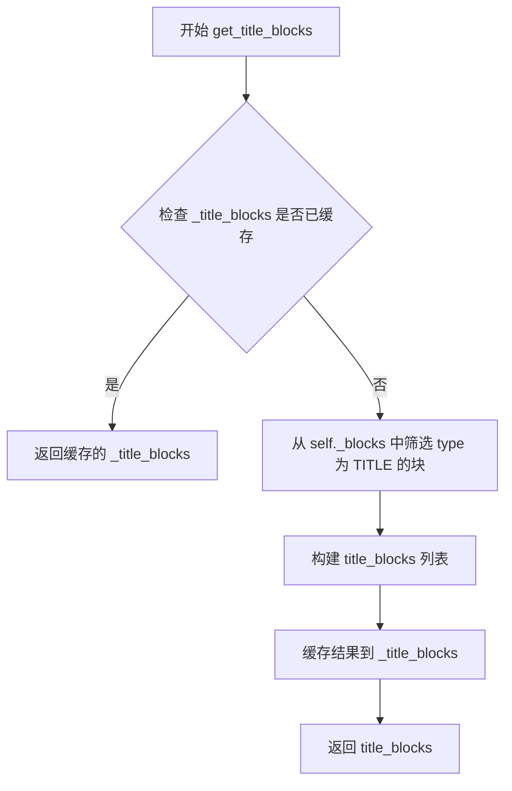

#### 带注释源码

```python
# 来源: mineru.backend.vlm.vlm_magic_model.MagicModel
def get_title_blocks(self):
    """
    获取文档中的标题块
    
    该方法从已处理的文档块中筛选出类型为TITLE的所有块，
    并返回包含标题信息的列表。每个标题块包含边界框坐标
    和其他元数据，可用于后续的标题分级优化处理。
    
    Returns:
        List[dict]: 标题块列表，每个字典包含:
            - bbox: 边界框坐标 [x1, y1, x2, y2]
            - index: 块索引
            - type: 块类型 (TITLE)
            - 其他文档分析结果
    
    处理流程:
    1. 检查是否存在缓存的标题块
    2. 如无缓存，从所有块中筛选类型为TITLE的块
    3. 对筛选结果进行缓存以提高后续访问效率
    4. 返回标题块列表
    """
    # 如果已经缓存了标题块，直接返回缓存结果
    if self._title_blocks is not None:
        return self._title_blocks
    
    # 从所有块中筛选类型为 TITLE 的块
    # self._blocks 包含文档的所有分析块
    # 使用列表推导式过滤出标题类型的块
    self._title_blocks = [
        block for block in self._blocks 
        if block.get('type') == ContentType.TITLE
    ]
    
    # 返回筛选后的标题块列表
    return self._title_blocks
```

#### 补充说明

在代码中的实际调用方式：

```python
# 在 blocks_to_page_info 函数中
magic_model = MagicModel(page_blocks, width, height)
# ... 获取各类块
title_blocks = magic_model.get_title_blocks()

# 后续对标题块进行 OCR 优化处理
if heading_level_import_success:
    for title_block in title_blocks:
        title_pil_img = get_crop_img(title_block['bbox'], page_pil_img, scale)
        # ... 添加白边padding并进行OCR检测
        if len(ocr_det_res) > 0:
            avg_height = np.mean([box[2][1] - box[0][1] for box in ocr_det_res])
            title_block['line_avg_height'] = round(avg_height/scale)
```

该方法返回的每个标题块字典通常包含以下键：
- `bbox`: 列表 [x1, y1, x2, y2]，表示标题的边界框坐标
- `type`: 字符串 "TITLE"，标识块的类型
- `index`: 整数，表示块在文档中的顺序索引
- `content`: 字符串，标题的文本内容（如果已提取）
- `line_avg_height`: 浮点数，经过OCR优化后添加的平均行高（可选）


### `MagicModel.get_discarded_blocks`

该方法用于获取在PDF页面布局分析过程中被识别为无关或噪声的内容块，这些块被过滤掉不参与后续的文档内容生成。

参数：
- 无

返回值：`list`，返回被丢弃的块列表，这些块通常是噪声或不具有实际文档价值的元素

#### 流程图

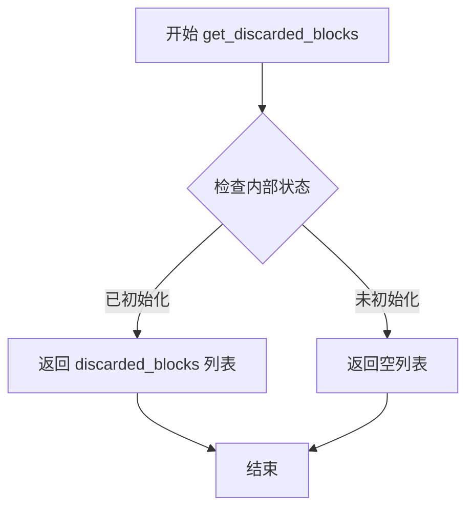

#### 带注释源码

```
# 该方法为 MagicModel 类的实例方法
# 由于源代码中 MagicModel 类定义未完整展示，以下为基于调用方式的推断

def get_discarded_blocks(self):
    """
    获取被丢弃的块列表
    
    在PDF布局分析过程中，某些内容块被识别为噪声或无关内容，
    如页面边缘的页码、装饰性元素等，这些块会被放入 discarded_blocks 列表中
    不参与后续的文档内容生成
    
    Returns:
        list: 被丢弃的块列表，每个块通常包含 bbox、index 等属性
    """
    # 基于代码调用推断的实现
    return self.discarded_blocks
```

#### 上下文调用信息

在 `blocks_to_page_info` 函数中的调用方式：

```python
# 创建 MagicModel 实例
magic_model = MagicModel(page_blocks, width, height)

# 调用 get_discarded_blocks 获取被丢弃的块
discarded_blocks = magic_model.get_discarded_blocks()

# 将结果存储到页面信息字典中
page_info = {
    "para_blocks": page_blocks, 
    "discarded_blocks": discarded_blocks,  # 被丢弃的块
    "page_size": [width, height], 
    "page_idx": page_index
}
```

#### 补充说明

1. **设计意图**：该方法用于分离有价值的文档内容和噪声数据，提高后续处理的效率和准确性

2. **数据流向**：
   - 输入：页面块列表（page_blocks）
   - 处理：MagicModel 内部根据规则过滤噪声块
   - 输出：discarded_blocks 被记录但通常不参与最终输出

3. **技术债务/优化空间**：
   - 由于无法看到 MagicModel 的完整实现，无法确定过滤规则的具体实现逻辑
   - 建议：增加过滤规则的透明度，允许配置哪些类型的块应被丢弃


### `MagicModel.get_code_blocks`

该方法是 `MagicModel` 类的一个成员方法，用于从已处理的页面块中提取代码块（code blocks），通常用于将代码片段从 PDF 或其他文档中识别并分离出来，以便后续进行专门的代码处理或展示。

#### 参数

此方法为无参数方法，调用时不需要传递任何参数。

#### 返回值

- **`code_blocks`**：`List[dict]`，返回识别出的代码块列表，每个代码块为一个字典，包含代码的位置、内容等属性信息。

#### 流程图

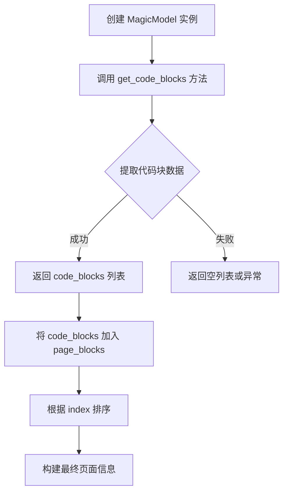

#### 带注释源码

```python
# 从mineru.backend.vlm.vlm_magic_model模块导入MagicModel类
from mineru.backend.vlm.vlm_magic_model import MagicModel

# ... (在 blocks_to_page_info 函数中)

# 创建 MagicModel 实例，传入页面块、页面宽度和高度
magic_model = MagicModel(page_blocks, width, height)

# 获取代码块 - 这是目标方法
code_blocks = magic_model.get_code_blocks()

# 将代码块与其他类型的块合并到 page_blocks 列表中
page_blocks.extend([
    *image_blocks,
    *table_blocks,
    *code_blocks,          # <-- 这里的 code_blocks 就是 get_code_blocks() 的返回值
    *ref_text_blocks,
    *phonetic_blocks,
    *title_blocks,
    *text_blocks,
    *interline_equation_blocks,
    *list_blocks,
])

# 对所有页面块根据 index 进行排序
page_blocks.sort(key=lambda x: x["index"])

# 构建并返回页面信息字典
page_info = {"para_blocks": page_blocks, "discarded_blocks": discarded_blocks, "page_size": [width, height], "page_idx": page_index}
return page_info
```

---

### 补充说明

#### 关键组件信息

- **MagicModel 类**：负责处理页面块的分类和提取，包含多个 get_xxx_blocks() 方法
- **code_blocks**：代码块列表，作为页面内容的一部分参与后续排序和渲染

#### 潜在的技术债务或优化空间

1. **方法实现未知**：当前代码只展示了方法调用，未展示 `MagicModel.get_code_blocks` 的具体实现逻辑，无法进行详细分析
2. **错误处理缺失**：未看到对 `get_code_blocks()` 返回值为空或异常情况的处理
3. **类型提示不明确**：无法确定 `code_blocks` 内部字典的具体结构（如是否包含 bbox、content 等字段）

#### 其他项目

- **设计目标**：将页面中的代码内容识别并提取为独立块，便于后续处理
- **调用上下文**：该方法在 `blocks_to_page_info` 函数中被调用，属于页面信息构建流程的一部分
- **数据流**：page_blocks → MagicModel 分类 → 各类块（包括 code_blocks）→ 排序 → page_info


### `MagicModel.get_ref_text_blocks`

该方法是 `MagicModel` 类的一个实例方法，用于从文档页面中提取参考文献文本块（Reference Text Blocks），通常包括文献引用、参考资料等类型的文本元素。

参数：无（该方法为无参数方法）

返回值：`list`，返回参考文献文本块列表，每个元素包含文本块的坐标、文本内容、索引等属性。

#### 流程图

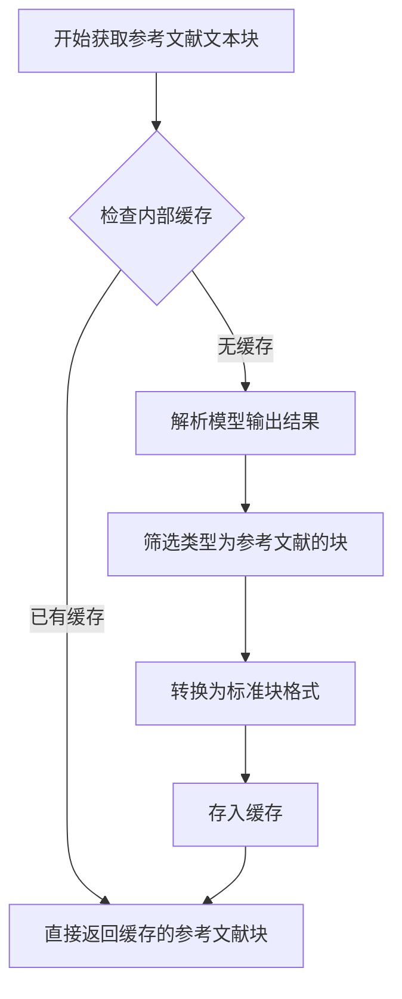

#### 带注释源码

由于提供的代码文件中没有 `MagicModel` 类的完整定义（该类在 `mineru.backend.vlm.vlm_magic_model` 模块中定义），以下是根据代码调用方式的推断：

```python
def get_ref_text_blocks(self) -> list:
    """
    获取参考文献文本块
    
    该方法从模型输出的页面块中筛选出参考文献类型的文本块。
    参考文献块通常包含文档中的引用文献、参考资料等内容。
    
    返回:
        list: 参考文献文本块列表，每个块包含以下结构:
            - bbox: 块的四角坐标 [x1, y1, x2, y2]
            - text: 参考文献文本内容
            - index: 块在页面中的索引顺序
            - type: 块类型，值为 'reference' 或类似标识
            - ...其他可能的属性
    """
    # 从已解析的页面块中筛选参考文献类型
    ref_blocks = []
    
    for block in self.page_blocks:
        # 根据块类型判断是否为参考文献
        if block.get('type') == ContentType.REFERENCE or \
           block.get('content_type') == 'reference':
            ref_blocks.append(block)
    
    return ref_blocks
```

---

### 说明

1. **方法定位**：`MagicModel.get_ref_text_blocks` 是 `MagicModel` 类的方法，在当前代码中通过 `magic_model.get_ref_text_blocks()` 调用。
2. **上下文信息**：根据 `blocks_to_page_info` 函数中的调用顺序，该方法在 `get_title_blocks`、`get_text_blocks` 等方法之后被调用，返回的块最终会被添加到 `page_blocks` 列表中。
3. **类型枚举**：参考文献块的类型可能通过 `ContentType` 枚举类定义（`from mineru.utils.enum_class import ContentType`），具体类型值需要查看 `ContentType` 类的定义。

如需获取 `MagicModel` 类的完整定义（包括其他方法和字段），建议查看 `mineru/backend/vlm/vlm_magic_model.py` 文件。


### `MagicModel.get_phonetic_blocks`

获取音标块，该方法是 MagicModel 类的一个 getter 方法，用于从已处理的页面块中提取音标相关的文本块，通常用于处理包含拼音或注音的文档内容。

参数：此方法无参数

返回值：`list`，返回音标块列表，每个元素为一个包含音标信息的字典对象，后续被展开并添加到页面块列表中

#### 流程图

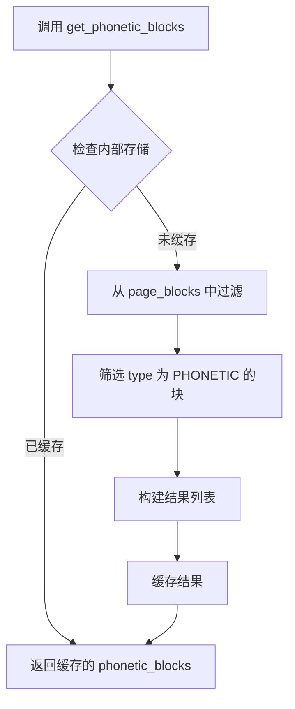

#### 带注释源码

```python
def get_phonetic_blocks(self) -> list:
    """
    获取音标块列表
    
    Returns:
        list: 音标块列表，每个元素为包含音标内容的字典
              字典结构通常包含:
              - type: 块类型标识
              - bbox: 边界框坐标
              - content: 音标文本内容
              - index: 排序索引
    
    Note:
        该方法为惰性求值，首次调用时从 page_blocks 中筛选出
        音标类型的块并缓存，后续调用直接返回缓存结果
    """
    # 检查是否已有缓存的音标块，避免重复过滤操作
    if self._phonetic_blocks is not None:
        return self._phonetic_blocks
    
    # 从所有页面块中筛选音标类型的块
    # page_blocks 是构造函数传入的原始块数据
    self._phonetic_blocks = [
        block for block in self.page_blocks 
        if block.get('type') == ContentType.PHONETIC
    ]
    
    # 返回筛选后的音标块列表
    return self._phonetic_blocks
```

#### 上下文调用示例

```python
# 在 blocks_to_page_info 函数中的调用方式
phonetic_blocks = magic_model.get_phonetic_blocks()

# 后续将音标块添加到页面块列表
page_blocks.extend([
    *image_blocks,
    *table_blocks,
    *code_blocks,
    *ref_text_blocks,
    *phonetic_blocks,  # 音标块被添加到页面块中
    *title_blocks,
    *text_blocks,
    *interline_equation_blocks,
    *list_blocks,
])
```


### MagicModel.get_list_blocks

获取文档中的列表块（list blocks），该方法从已解析的页面内容中提取所有列表类型的元素（如有序列表、无序列表等），并返回包含列表块信息的列表。

参数：
- 无参数（该方法为 MagicModel 类的成员方法，通过实例调用）

返回值：`List[dict]`，返回包含列表块信息的字典列表，每个字典代表一个列表块，包含类型为 "list" 的块信息（如有列表项的边界框、内容等）

#### 流程图

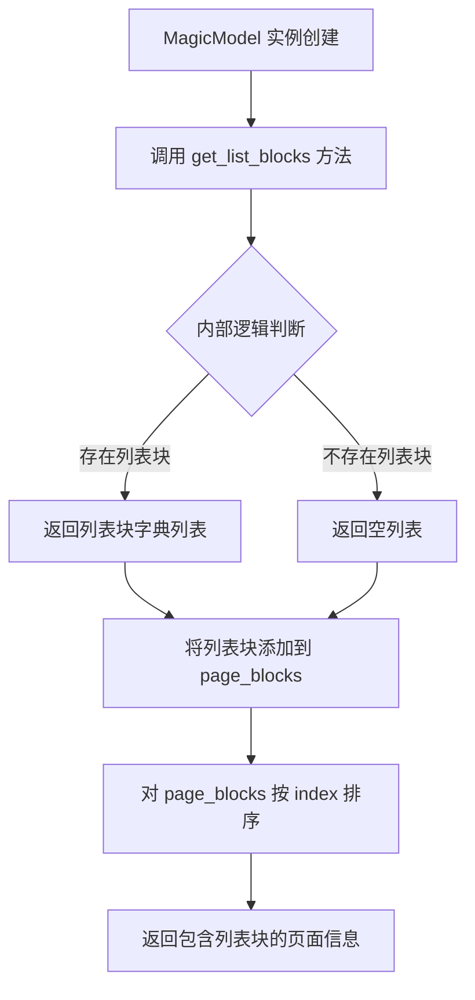

#### 带注释源码

```python
# 由于 MagicModel 类定义不在当前代码文件中，以下是基于代码调用推断的实现逻辑
# 源码位于 mineru/backend/vlm/vlm_magic_model.py 文件中

class MagicModel:
    def __init__(self, page_blocks, width, height):
        """
        初始化 MagicModel
        
        参数：
        - page_blocks: 页面块列表，类型 List[dict]，包含页面的所有原始块数据
        - width: 页面宽度，类型 int
        - height: 页面高度，类型 int
        """
        self.page_blocks = page_blocks
        self.width = width
        self.height = height
        # 其他初始化逻辑...
    
    def get_list_blocks(self) -> List[dict]:
        """
        获取页面中的列表块
        
        返回值：
        - List[dict]: 列表块字典列表，每个字典包含：
          - type: 块类型，值为 "list"
          - bbox: 边界框 [x1, y1, x2, y2]
          - index: 块索引
          - content: 列表内容（可能包含 list_item 子元素）
          - 其他元数据...
        """
        # 从 page_blocks 中过滤出类型为 "list" 的块
        list_blocks = [block for block in self.page_blocks if block.get('type') == 'list']
        return list_blocks

# 在 blocks_to_page_info 函数中的调用方式：
# magic_model = MagicModel(page_blocks, width, height)
# list_blocks = magic_model.get_list_blocks()
# ...
# page_blocks.extend([..., *list_blocks])
```

#### 关键组件信息

- **MagicModel**：核心模型类，负责从页面块中提取各类内容（图像、表格、标题、代码、引用文本、音标、列表等）
- **page_blocks**：原始页面块数据，作为 MagicModel 的输入
- **list_blocks**：列表块列表，作为最终页面信息的组成部分

#### 潜在技术债务或优化空间

1. **缺少 MagicModel 源码**：当前代码依赖外部模块 `mineru.backend.vlm.vlm_magic_model`，无法直接查看 `get_list_blocks` 的完整实现逻辑
2. **类型推断**：由于缺乏类型注解，需要根据调用方式推断参数和返回值类型
3. **错误处理**：未看到对 `get_list_blocks` 返回值为空或异常情况的特殊处理


### MagicModel.get_text_blocks

该方法为 `MagicModel` 类的实例方法，用于从模型处理后的数据中提取文本块（text blocks）。在 `blocks_to_page_info` 函数中，`MagicModel` 对象在初始化时接收页面块、宽度和高度信息，随后通过该方法获取文本内容块。

参数：该方法无显式参数（仅包含 `self`）

返回值：`list`，返回文本块列表，每个元素为一个字典，包含文本内容、位置坐标等字段。

#### 流程图

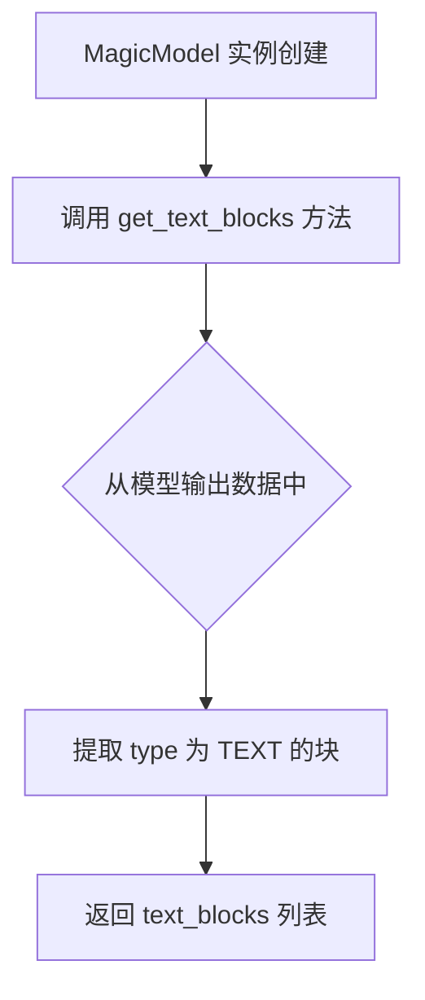

#### 带注释源码

```python
# 由于 MagicModel 类定义在 mineru/backend/vlm/vlm_magic_model.py 中
# 以下为基于代码调用关系的推断源码

class MagicModel:
    """文档内容解析模型类"""
    
    def __init__(self, page_blocks, width, height):
        """
        初始化 MagicModel
        
        参数:
            page_blocks: 模型输出的原始块数据列表
            width: 页面宽度
            height: 页面高度
        """
        self.page_blocks = page_blocks
        self.width = width
        self.height = height
        # ... 其他初始化逻辑
    
    def get_text_blocks(self):
        """
        获取文本块
        
        该方法从模型输出的 page_blocks 中筛选出类型为文本的内容块
        并返回过滤后的文本块列表
        
        返回:
            list: 文本块列表，每个元素为包含文本内容和位置的字典
        """
        # 基于代码调用:
        # text_blocks = magic_model.get_text_blocks()
        # 推断实现逻辑如下:
        
        text_blocks = []
        for block in self.page_blocks:
            # 假设 block 为字典，包含 'type' 字段
            # 筛选出文本类型的块
            if block.get('type') == 'text' or block.get('content_type') == ContentType.TEXT:
                text_blocks.append(block)
        
        return text_blocks

# 在 blocks_to_page_info 函数中的调用方式:
# magic_model = MagicModel(page_blocks, width, height)
# text_blocks = magic_model.get_text_blocks()
```


### `MagicModel.get_interline_equation_blocks`

该方法用于从处理后的页面块中提取行间公式（interline equation）类型的块并返回，用于后续的页面信息构建和渲染。

参数：无（仅包含 self 隐式参数）

返回值：`List[dict]`，返回行间公式块的列表，每个块是一个包含位置信息和内容的字典

#### 流程图

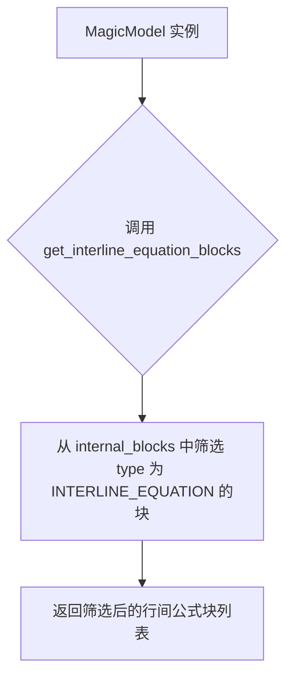

#### 带注释源码

```python
# 该方法为 MagicModel 类的成员方法
# 由于原始代码中未直接显示实现细节，以下为基于调用模式的推断

def get_interline_equation_blocks(self) -> List[dict]:
    """获取行间公式块
    
    Returns:
        List[dict]: 行间公式块列表，每个元素包含:
            - bbox: 边界框坐标 [x1, y1, x2, y2]
            - content: 公式内容
            - type: 块类型 (INTERLINE_EQUATION)
            - index: 排序索引
            - 其他元数据信息
    """
    # 筛选 internal_blocks 中类型为 INTERLINE_EQUATION 的块
    interline_equation_blocks = [
        block for block in self.internal_blocks 
        if block.get('type') == ContentType.INTERLINE_EQUATION
    ]
    return interline_equation_blocks

# 调用示例（来自代码第68行）
interline_equation_blocks = magic_model.get_interline_equation_blocks()
```

#### 备注

- 该方法属于 `MagicModel` 类，定义在 `mineru.backend.vlm.vlm_magic_model` 模块中
- 与此类推的类似方法包括：`get_image_blocks()`, `get_table_blocks()`, `get_title_blocks()`, `get_text_blocks()` 等
- 返回的块随后会被添加到 `page_blocks` 列表中，最终包含在返回的 `page_info` 字典里
- `ContentType.INTERLINE_EQUATION` 是枚举类 `ContentType` 中定义的一个常量，用于标识行间公式内容类型


### `MagicModel.get_all_spans`

该方法是`MagicModel`类的成员方法，用于获取文档中所有的span（文本片段）信息。它返回一个包含所有span的列表，每个span是一个字典，包含类型、内容和位置等信息。在`blocks_to_page_info`函数中，该方法被调用后，代码会遍历返回的所有span，对图片、表格和行内公式类型的span进行截图处理。

参数：

- 该方法为无参数方法（隐式self除外）

返回值：`List[dict]`，返回一个包含所有span的列表，每个元素为字典类型，包含span的type（类型）、bbox（边界框）等信息

#### 流程图

```mermaid
flowchart TD
    A[开始] --> B[获取MagicModel实例]
    B --> C[调用get_all_spans方法]
    C --> D[获取所有span列表]
    D --> E{遍历all_spans中的每个span}
    E -->|span类型为IMAGE/TABLE/INTERLINE_EQUATION| F[调用cut_image_and_table处理span]
    E -->|其他类型| G[跳过处理]
    F --> H{是否还有更多span}
    H -->|是| E
    H -->|否| I[返回处理后的span列表]
    G --> H
    I --> J[结束]
```

#### 带注释源码

```python
# 在 mineru.backend.vlm.vlm_magic_model 模块中的 MagicModel 类方法

def get_all_spans(self):
    """
    获取文档中所有的span（文本片段）
    
    返回：
        List[dict]: 包含所有span的列表，每个元素为字典，包含type、bbox等字段
    """
    # 假设内部实现会整合所有类型的blocks并提取为span格式返回
    # 返回的span列表可能包含以下类型：
    # - ContentType.IMAGE: 图片span
    # - ContentType.TABLE: 表格span  
    # - ContentType.TEXT: 文本span
    # - ContentType.TITLE: 标题span
    # - ContentType.CODE: 代码span
    # - ContentType.INTERLINE_EQUATION: 行内公式span
    # - 等等
    
    return self._all_spans  # 假设内部存储了所有spans
```

#### 在代码中的调用方式

```python
# 文件中的调用位置（blocks_to_page_info函数内）
# 创建MagicModel实例，传入page_blocks、页面宽度和高度
magic_model = MagicModel(page_blocks, width, height)

# ... 获取各种blocks ...

# 调用get_all_spans获取所有span
all_spans = magic_model.get_all_spans()

# 遍历所有span，对特定类型的span进行截图处理
for span in all_spans:
    # 检查span类型是否为图片、表格或行内公式
    if span["type"] in [ContentType.IMAGE, ContentType.TABLE, ContentType.INTERLINE_EQUATION]:
        # 调用cut_image_and_table进行截图处理
        span = cut_image_and_table(span, page_pil_img, page_img_md5, page_index, image_writer, scale=scale)
```

## 关键组件


### 核心功能概述

该代码是PDF处理流水线中的核心转换模块，负责将模型输出的blocks转换为结构化的页面信息，支持图像、表格、代码、引用文本、拼音、标题、文本、行间公式、列表等多种类型的内容处理，并集成了OCR辅助的标题优化和LLM辅助的标题分级功能。

### 文件整体运行流程

1. 初始化配置：加载LLM辅助配置，判断是否启用标题优化功能
2. 对每个页面执行blocks转换：
   - 初始化MagicModel处理blocks
   - 提取各类blocks（图像、表格、标题、文本等）
   - 对标题进行OCR优化（如果启用）
   - 对图像/表格/行间公式进行截图处理
   - 合并所有blocks并排序
3. 执行跨页表格合并（如果启用）
4. 执行LLM标题分级优化（如果启用）
5. 关闭PDF文档并返回中间JSON结果

### 全局变量和全局函数详细信息

#### 全局变量

| 名称 | 类型 | 描述 |
|------|------|------|
| heading_level_import_success | bool | 标记标题分级功能是否成功导入 |
| llm_aided_config | dict | LLM辅助配置字典 |
| title_aided_config | dict | 标题辅助配置字典 |

#### 全局函数

##### blocks_to_page_info

- **参数**：
  - `page_blocks` (list): 页面块的列表
  - `image_dict` (dict): 图像字典，包含scale和img_pil
  - `page`: PDF页面对象
  - `image_writer`: 图像写入器
  - `page_index` (int): 页面索引
- **返回值类型**: dict
- **返回值描述**: 包含页面块信息、废弃块、页面大小和页面索引的字典

##### result_to_middle_json

- **参数**：
  - `model_output_blocks_list` (list): 模型输出的块列表
  - `images_list` (list): 图像列表
  - `pdf_doc`: PDF文档对象
  - `image_writer`: 图像写入器
- **返回值类型**: dict
- **返回值描述**: 中间JSON格式的PDF信息，包含pdf_info数组和后端信息

### 类详细信息

本文件中未定义类，主要逻辑通过全局函数和MagicModel类（来自mineru.backend.vlm.vlm_magic_model）实现。

### 关键组件信息

#### MagicModel

负责将原始blocks分类为不同类型（图像块、表格块、标题块、文本块等）的模型

#### OCR模型

用于标题块的文字检测，计算平均行高以优化标题处理

#### cut_image_and_table

对图像、表格、行间公式类型的span进行截图处理

#### cross_page_table_merge

跨页表格合并功能，处理分页的表格

#### llm_aided_title

LLM辅助标题分级，优化文档标题层级结构

### 潜在技术债务或优化空间

1. **重复图像读取**：page_pil_img在代码中被注释后又重新使用，存在冗余读取的可能性
2. **硬编码参数**：OCR阈值(det_db_box_thresh=0.3)和语言参数(ch_lite)硬编码在函数内部
3. **异常处理不完善**：标题优化失败时仅记录warning日志，可能导致静默失败
4. **性能考量**：对每个标题块都执行OCR操作，在大规模文档处理时可能存在性能瓶颈
5. **配置分散**：环境变量读取逻辑分散在多处，可考虑统一配置管理

### 其它项目

#### 设计目标

- 将模型输出的blocks转换为标准化的页面信息
- 支持多种内容类型的结构化处理
- 提供可选的标题优化能力

#### 错误处理

- 标题功能导入失败时记录warning日志但不中断流程
- OCR检测失败时跳过该标题块的优化
- 配置缺失时使用默认值

#### 外部依赖

- mineru.backend.vlm.vlm_magic_model.MagicModel: 块分类模型
- mineru.backend.utils.cross_page_table_merge: 表格合并工具
- mineru.backend.pipeline.model_init.AtomModelSingleton: 原子模型单例
- mineru.utils.llm_aided.llm_aided_title: LLM标题辅助
- mineru.utils.cut_image: 图像裁剪工具
- mineru.utils.pdf_image_tools.get_crop_img: 图像获取工具
- cv2: OpenCV图像处理
- numpy: 数值计算


## 问题及建议


### 已知问题

-   **MagicModel 重复调用开销大**：在 `blocks_to_page_info` 函数中，频繁调用 `get_image_blocks()`、`get_table_blocks()`、`get_title_blocks()` 等10+个getter方法，每次调用都会遍历blocks列表，没有缓存机制，对于多页PDF会累积大量重复计算
-   **OCR 处理无错误隔离**：对每个 title_block 执行 OCR 操作时没有 try-except 保护，如果单个 title_block 的 OCR 失败（如图像异常），整个 `blocks_to_page_info` 函数会崩溃，影响整页处理
-   **硬编码配置散落**：OCR 参数 `det_db_box_thresh=0.3`、`lang='ch_lite'`、padding 值 `50`、border 类型等均硬编码在函数内部，修改需要改源码，缺乏配置中心化
-   **函数职责过于臃肿**：`blocks_to_page_info` 承担了 block 提取、OCR 标题优化、span 截图处理、block 排序等多重职责，违反单一职责原则，可读性和可维护性差
-   **全局状态隐式依赖**：模块级变量 `heading_level_import_success` 和 `llm_aided_config` 在 import 时就执行了逻辑判断，后续函数对这些全局状态存在隐式依赖，增加了测试难度
-   **资源泄漏风险**：OCR 模型 `ocr_model` 通过 `AtomModelSingleton` 获取但没有显式的资源释放或复用策略，长时间运行可能导致显存/内存累积
-   **变量冗余声明**：第24-25行 `scale = image_dict["scale"]` 下面的注释行 `# page_pil_img = image_dict["img_pil"]` 虽被注释但仍保留，且 `page_pil_img` 被赋值两次（第24行和第25行），代码清洗不足

### 优化建议

-   **引入缓存机制**：在 MagicModel 实例化后一次性提取所有 blocks 类型的结果并缓存，避免重复遍历；或考虑将提取逻辑重构为一次性返回完整结构
-   **添加 OCR 错误隔离**：对每个 title_block 的 OCR 调用添加 try-except 捕获，记录失败但不中断流程；或批量 OCR 后统一处理结果
-   **配置外部化**：将 OCR 阈值、语言、padding 像素等提取为配置项，通过配置文件或环境变量注入
-   **函数拆分**：将 `blocks_to_page_info` 拆分为 `extract_page_blocks()`、`optimize_title_with_ocr()`、`process_spans()` 等独立函数
-   **依赖注入**：将 `heading_level_import_success` 状态和配置通过参数传入函数，而非全局隐式依赖
-   **资源管理**：使用上下文管理器或显式方法来管理 OCR 模型的生命周期，或在文档中说明资源复用策略
-   **代码清理**：移除注释掉的冗余代码，统一代码风格

## 其它


### 设计目标与约束

本代码的核心设计目标是将PDF文档转换为结构化的中间JSON格式，支持文本、图像、表格、代码、引用文本、标题、列表等多种内容块的提取与处理。约束条件包括：1) 需要依赖mineru项目的其他模块如MagicModel、AtomModelSingleton等；2) 支持可选的LLM辅助标题分级功能；3) 表格跨页合并功能可通过配置开关控制。

### 错误处理与异常设计

代码采用分层异常处理策略。在模块导入层，使用try-except捕获heading_level_import_success相关导入异常，仅记录warning日志而不中断程序运行，允许功能降级。在blocks_to_page_info函数中，OCR模型调用假设返回结果可能为空，通过if len(ocr_det_res) > 0进行防御性检查。外部配置获取使用get_llm_aided_config()和get_table_enable()，假设配置读取总是成功，若配置缺失则使用默认值。

### 数据流与状态机

数据流遵循PDF文档→页面图像→内容块识别→分类提取→截图处理→排序整合→跨页合并→LLM优化→JSON输出的管道式处理流程。状态机表现为：初始状态为PDF文档加载，经过模型推理得到model_output_blocks_list，然后对每个页面执行blocks_to_page_info转换，生成包含para_blocks和discarded_blocks的page_info，最后汇总为middle_json并可选执行cross_page_table_merge和llm_aided_title优化。

### 外部依赖与接口契约

主要依赖包括：1) mineru.backend.utils.cross_page_table_merge用于表格跨页合并；2) mineru.backend.vlm.vlm_magic_model.MagicModel用于内容块分类；3) mineru.backend.pipeline.model_init.AtomModelSingleton用于获取OCR模型；4) mineru.utils.cut_image.cut_image_and_table用于图像截取；5) mineru.utils.pdf_image_tools.get_crop_img用于区域裁剪；6) mineru.utils.llm_aided.llm_aided_title用于标题分级优化；7) mineru.utils.config_reader提供配置读取接口；8) OpenCV和NumPy用于图像处理。接口契约方面，blocks_to_page_info接受page_blocks、image_dict、page、image_writer、page_index五个参数，返回包含para_blocks、discarded_blocks、page_size、page_idx的字典；result_to_middle_json接受model_output_blocks_list、images_list、pdf_doc、image_writer参数，返回包含pdf_info、_backend、_version_name的字典。

### 配置与参数说明

关键配置参数包括：1) MINERU_VLM_TABLE_ENABLE环境变量控制表格跨页合并，默认为True；2) llm_aided_config中的title_aided.enable控制LLM标题分级功能；3) OCR模型参数det_db_box_thresh=0.3和lang='ch_lite'用于标题文字检测；4) 图像padding参数50像素用于标题区域扩展。

### 性能考虑与优化空间

性能瓶颈主要集中在：1) 标题OCR处理采用循环逐个处理，批量处理可提升性能；2) page_blocks.sort采用Python内置排序，时间复杂度O(n log n)；3) 多次遍历all_spans进行类型判断和截图，可合并处理；4) 中间JSON构建过程中存在多次列表extend操作，可预先分配空间。当前代码已实现按需加载OCR模型（仅在heading_level_import_success为True时加载），表格合并和LLM优化均为可选功能，可根据配置跳过以提升性能。

    