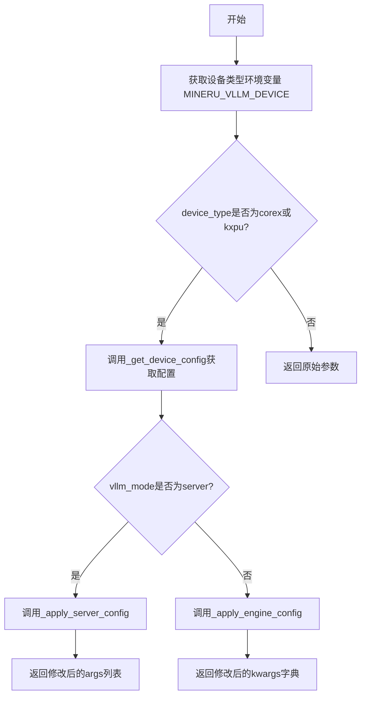
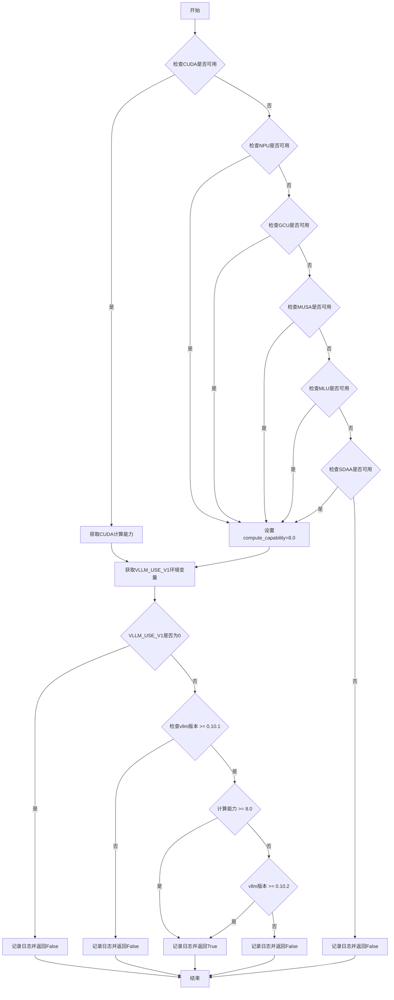
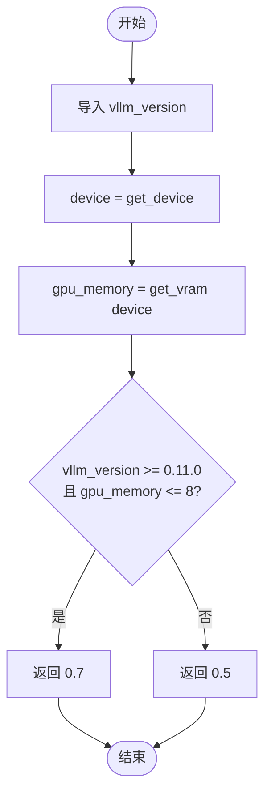
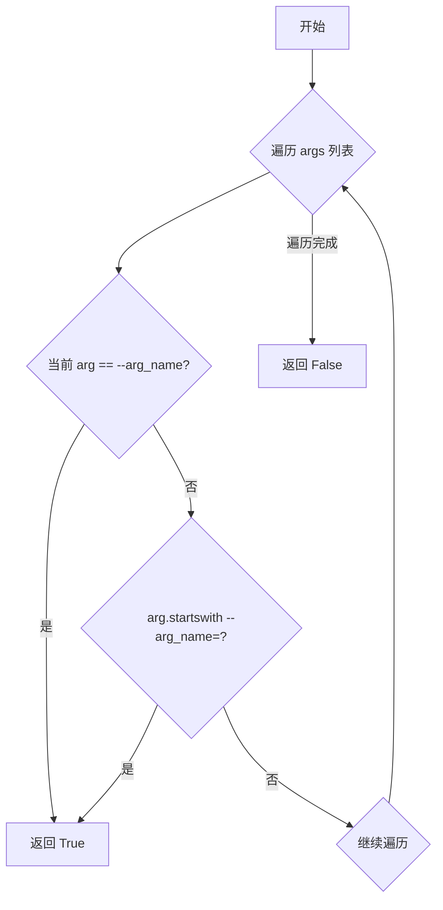
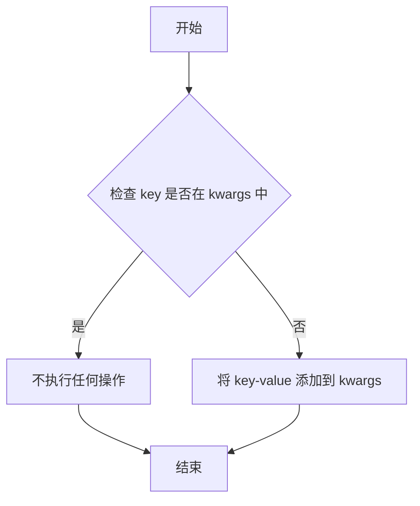
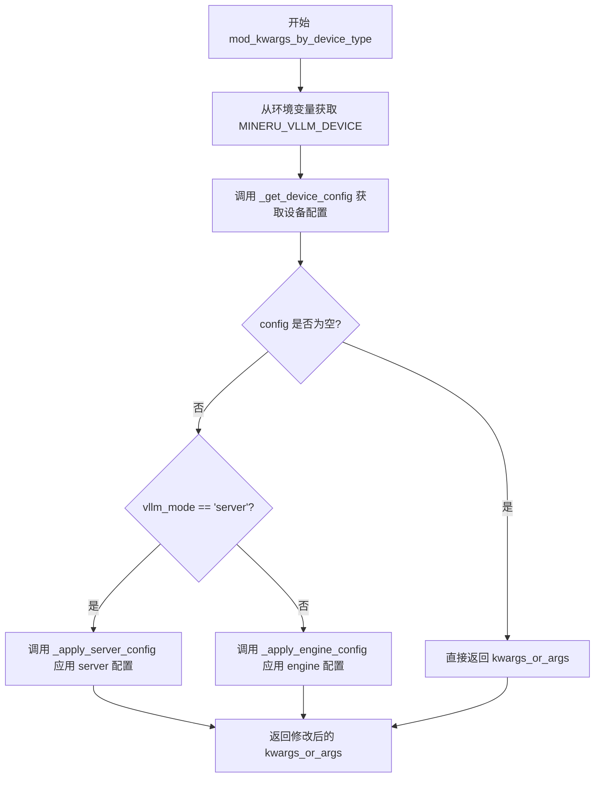

```mermaid
flowchart TD
    A[开始 _get_device_config] --> B[定义 DEVICE_CONFIGS 内部配置字典]
    B --> C{device_type 是否有效}
    C -->|是| D[调用 lower&#40;&#41; 转换为小写]
    D --> E[从配置字典中获取对应配置]
    E --> F{配置是否存在}
    F -->|是| G[返回配置字典]
    F -->|否| H[返回 None]
    C -->|否| H
    G --> I[结束]
    H --> I
```

# `MinerU\mineru\backend\vlm\utils.py` 详细设计文档

该代码是一个VLLM配置管理模块，主要用于根据不同的硬件环境（CUDA、NPU、GCU等）和软件版本（vllm版本、计算能力）动态调整推理引擎的配置参数，包括自定义logits处理器启用状态、LMDeploy后端选择、GPU内存利用率、批处理大小以及针对不同设备类型（corex、kxpu等）的编译和运行时配置。

## 整体流程



## 类结构

```
该文件为模块文件，无类定义
所有函数均为模块级函数
辅助函数以下划线前缀标识为私有函数
```

## 全局变量及字段


### `device_type`
    
设备类型，用于指定运行后端（如cuda、ascend等）

类型：`str`
    


### `vllm_use_v1_str`
    
从环境变量获取的VLLM_USE_V1字符串值

类型：`str`
    


### `vllm_use_v1`
    
解析后的VLLM_USE_V1整数配置值

类型：`int`
    


### `compute_capability`
    
计算设备的计算能力版本号（如8.0）

类型：`str`
    


### `vllm_version`
    
vllm库的版本号字符串

类型：`str`
    


### `device`
    
当前运行设备标识

类型：`str`
    


### `gpu_memory`
    
GPU显存大小（GB）

类型：`float`
    


### `batch_size`
    
根据显存计算的默认批处理大小

类型：`int`
    


### `lmdeploy_backend`
    
lmdeploy后端类型（pytorch或turbomind）

类型：`str`
    


### `config`
    
设备配置字典，包含编译和运行参数

类型：`dict`
    


### `kwargs_or_args`
    
vllm配置参数，server模式为list，engine模式为dict

类型：`dict | list`
    


### `vllm_mode`
    
vllm运行模式（server、sync_engine、async_engine）

类型：`str`
    


### `args`
    
命令行参数列表

类型：`list`
    


### `arg_name`
    
命令行参数名称

类型：`str`
    


### `value`
    
命令行参数值

类型：`str`
    


### `flag_name`
    
命令行flag名称

类型：`str`
    


### `kwargs`
    
vllm引擎配置参数字典

类型：`dict`
    


### `key`
    
配置字典的键名

类型：`str`
    


### `compilation_config`
    
vllm编译配置对象

类型：`CompilationConfig`
    


    

## 全局函数及方法


### `enable_custom_logits_processors`

该函数用于检测当前环境是否满足启用自定义 logits 处理器的条件，通过检查 CUDA/NPU/GCU/MUSA/MLU/SDAA 硬件支持、VLLM 版本以及计算能力来判断是否返回 True。

参数：该函数无参数。

返回值：`bool`，返回 True 表示启用自定义 logits 处理器，返回 False 表示禁用。

#### 流程图



#### 带注释源码

```python
def enable_custom_logits_processors() -> bool:
    """检测是否启用自定义logits处理器
    
    通过检查以下条件决定是否启用:
    1. 硬件支持: CUDA/NPU/GCU/MUSA/MLU/SDAA
    2. VLLM_USE_V1环境变量
    3. vllm版本要求
    4. GPU计算能力要求
    
    Returns:
        bool: 是否启用自定义logits处理器
    """
    import torch
    from vllm import __version__ as vllm_version

    # 检查CUDA是否可用，如果可用则获取计算能力
    if torch.cuda.is_available():
        major, minor = torch.cuda.get_device_capability()
        # 正确计算Compute Capability
        compute_capability = f"{major}.{minor}"
    # 检查NPU (华为昇腾) 是否可用
    elif hasattr(torch, 'npu') and torch.npu.is_available():
        compute_capability = "8.0"
    # 检查GCU是否可用
    elif hasattr(torch, 'gcu') and torch.gcu.is_available():
        compute_capability = "8.0"
    # 检查MUSA (摩尔线程) 是否可用
    elif hasattr(torch, 'musa') and torch.musa.is_available():
        compute_capability = "8.0"
    # 检查MLU (寒武纪) 是否可用
    elif hasattr(torch, 'mlu') and torch.mlu.is_available():
        compute_capability = "8.0"
    # 检查SDAA (天数智芯) 是否可用
    elif hasattr(torch, 'sdaa') and torch.sdaa.is_available():
        compute_capability = "8.0"
    # 无可用硬件时，禁用自定义logits处理器
    else:
        logger.info("CUDA not available, disabling custom_logits_processors")
        return False

    # 安全地处理环境变量
    vllm_use_v1_str = os.getenv('VLLM_USE_V1', "1")
    if vllm_use_v1_str.isdigit():
        vllm_use_v1 = int(vllm_use_v1_str)
    else:
        vllm_use_v1 = 1

    # 检查VLLM_USE_V1设置
    if vllm_use_v1 == 0:
        logger.info("VLLM_USE_V1 is set to 0, disabling custom_logits_processors")
        return False
    # 检查vllm版本是否满足最低要求
    elif version.parse(vllm_version) < version.parse("0.10.1"):
        logger.info(f"vllm version: {vllm_version} < 0.10.1, disable custom_logits_processors")
        return False
    # 检查计算能力是否满足要求
    elif version.parse(compute_capability) < version.parse("8.0"):
        # 计算能力不足但vllm版本足够新时，仍可启用
        if version.parse(vllm_version) >= version.parse("0.10.2"):
            logger.info(f"compute_capability: {compute_capability} < 8.0, but vllm version: {vllm_version} >= 0.10.2, enable custom_logits_processors")
            return True
        else:
            logger.info(f"compute_capability: {compute_capability} < 8.0 and vllm version: {vllm_version} < 0.10.2, disable custom_logits_processors")
            return False
    else:
        # 所有条件都满足，启用自定义logits处理器
        logger.info(f"compute_capability: {compute_capability} >= 8.0 and vllm version: {vllm_version} >= 0.10.1, enable custom_logits_processors")
        return True
```


### `set_lmdeploy_backend`

根据输入的设备类型确定并返回合适的 LMDeploy 后端类型（"pytorch" 或 "turbomind"），该函数会根据不同的硬件平台和计算能力自动选择最优的后端实现。

参数：

- `device_type`：`str`，目标设备类型，支持 "cuda"、"ascend"、"maca"、"camb" 等

返回值：`str`，返回对应的 LMDeploy 后端类型，"pytorch" 或 "turbomind"

#### 流程图

```mermaid
flowchart TD
    A[开始 set_lmdeploy_backend] --> B{device_type lower in ['ascend', 'maca', 'camb']?}
    B -->|Yes| C[返回 'pytorch']
    B -->|No| D{device_type lower == 'cuda'?}
    D -->|No| E[抛出 ValueError: Unsupported lmdeploy device type]
    D -->|Yes| F{torch.cuda.is_available()?}
    F -->|No| G[抛出 ValueError: CUDA is not available.]
    F -->|Yes| H{is_windows_environment?}
    H -->|Yes| I[返回 'turbomind']
    H -->|No| J{is_linux_environment?}
    J -->|No| K[抛出 ValueError: Unsupported operating system.]
    J -->|Yes| L[获取 compute_capability]
    L --> M{version.parse(compute_capability) >= 8.0?}
    M -->|Yes| N[返回 'pytorch']
    M -->|No| O[返回 'turbomind']
```

#### 带注释源码

```python
def set_lmdeploy_backend(device_type: str) -> str:
    """
    根据设备类型设置合适的 LMDeploy 后端
    
    Args:
        device_type: 目标设备类型字符串
        
    Returns:
        str: LMDeploy 后端类型，'pytorch' 或 'turbomind'
        
    Raises:
        ValueError: 当设备类型不支持或运行环境不满足要求时
    """
    # 1. 处理非 CUDA 设备类型（Ascend、MACA、Camb 等）
    # 这些设备类型目前仅支持 pytorch 后端
    if device_type.lower() in ["ascend", "maca", "camb"]:
        lmdeploy_backend = "pytorch"
    
    # 2. 处理 CUDA 设备类型
    elif device_type.lower() in ["cuda"]:
        import torch
        
        # 2.1 检查 CUDA 是否可用
        if not torch.cuda.is_available():
            raise ValueError("CUDA is not available.")
        
        # 2.2 Windows 系统统一使用 turbomind 后端
        if is_windows_environment():
            lmdeploy_backend = "turbomind"
        
        # 2.3 Linux 系统根据计算能力选择后端
        elif is_linux_environment():
            # 获取 GPU 计算能力（如 7.0, 8.0, 9.0 等）
            major, minor = torch.cuda.get_device_capability()
            compute_capability = f"{major}.{minor}"
            
            # 计算能力 >= 8.0 使用 pytorch 后端
            # 计算能力 < 8.0 使用 turbomind 后端
            if version.parse(compute_capability) >= version.parse("8.0"):
                lmdeploy_backend = "pytorch"
            else:
                lmdeploy_backend = "turbomind"
        
        # 2.4 其他操作系统抛出异常
        else:
            raise ValueError("Unsupported operating system.")
    
    # 3. 不支持的设备类型
    else:
        raise ValueError(f"Unsupported lmdeploy device type: {device_type}")
    
    return lmdeploy_backend
```


### `set_default_gpu_memory_utilization`

该函数用于根据 vLLM 版本和 GPU 显存大小动态设置默认的 GPU 显存利用率。当 vLLM 版本大于等于 0.11.0 且 GPU 显存小于等于 8GB 时，返回 0.7 以支持更大批处理；否则返回 0.5 作为保守默认值。

参数：此函数无参数。

返回值：`float`，返回默认的 GPU 显存利用率值（0.7 或 0.5）

#### 流程图



#### 带注释源码

```python
def set_default_gpu_memory_utilization() -> float:
    """根据 vLLM 版本和 GPU 显存大小设置默认的 GPU 显存利用率
    
    逻辑说明:
    - 当 vLLM 版本 >= 0.11.0 且 GPU 显存 <= 8GB 时，返回 0.7 以支持更大批处理
    - 其他情况返回 0.5 作为保守默认值
    
    Returns:
        float: GPU 显存利用率值
    """
    # 导入 vLLM 版本信息，用于版本兼容性判断
    from vllm import __version__ as vllm_version
    
    # 获取当前设备类型（cuda/npu/cpu 等）
    device = get_device()
    
    # 获取设备的 VRAM 大小（单位：GB）
    gpu_memory = get_vram(device)
    
    # 判断条件：vLLM 版本 >= 0.11.0 且 GPU 显存 <= 8GB
    if version.parse(vllm_version) >= version.parse("0.11.0") and gpu_memory <= 8:
        # 新版本 vLLM 在小显存设备上可使用更高利用率
        return 0.7
    else:
        # 保守默认配置，确保兼容性
        return 0.5
```


### `set_default_batch_size`

根据当前设备的 GPU 显存（VRAM）大小动态计算并返回默认的推理批处理大小（Batch Size），以在性能和显存占用间取得平衡。若获取显存信息失败，则捕获异常并返回最小默认值 1。

参数：
- （无参数）

返回值：`int`，返回推荐的默认批处理大小。

#### 流程图

```mermaid
graph TD
    A([开始]) --> B[获取设备信息 device = get_device()]
    B --> C[获取显存大小 gpu_memory = get_vram(device)]
    C --> D{显存大小 >= 16 GB?}
    D -- 是 --> E[batch_size = 8]
    D -- 否 --> F{显存大小 >= 8 GB?}
    F -- 是 --> G[batch_size = 4]
    F -- 否 --> H[batch_size = 1]
    E --> I[记录日志: GPU memory & batch_size]
    G --> I
    H --> I
    I --> J([返回 batch_size])
    
    C -.->|发生异常| K[except 块]
    K --> L[记录警告日志]
    L --> M[batch_size = 1]
    M --> J
```

#### 带注释源码

```python
def set_default_batch_size() -> int:
    """
    根据GPU显存大小设置默认的批处理大小。
    
    Returns:
        int: 推荐的默认批处理大小。
    """
    try:
        # 获取当前配置的设备
        device = get_device()
        # 获取该设备的显存大小（单位：GB）
        gpu_memory = get_vram(device)

        # 根据显存大小分级设置 batch_size
        if gpu_memory >= 16:
            batch_size = 8
        elif gpu_memory >= 8:
            batch_size = 4
        else:
            batch_size = 1
        
        # 记录实际使用的显存和批处理大小，供调试参考
        logger.info(f'gpu_memory: {gpu_memory} GB, batch_size: {batch_size}')

    except Exception as e:
        # 异常处理：获取显存失败时，使用保守的最小批处理大小
        logger.warning(f'Error determining VRAM: {e}, using default batch_ratio: 1')
        batch_size = 1
    
    return batch_size
```


### `_get_device_config`

该函数根据传入的设备类型字符串，从预定义的配置字典中查找并返回对应的设备配置参数。如果设备类型不存在于配置中，则返回 `None`。主要用于为不同的硬件平台（如 CoreX、KunlunXP 等）提供特定的 vLLM 运行参数。

参数：

- `device_type`：`str`，设备类型标识符（如 "corex"、"kxpu" 等）

返回值：`dict | None`，返回设备对应的配置字典，如果未找到对应配置则返回 `None`

#### 流程图



#### 带注释源码

```python
def _get_device_config(device_type: str) -> dict | None:
    """获取不同设备类型的配置参数"""

    # 各设备类型的配置定义
    # 该字典存储了不同设备特定的 vLLM 配置参数
    # 包括编译配置、块大小、数据类型、执行器后端等选项
    DEVICE_CONFIGS = {
        # "musa": {
        #     "compilation_config_dict": {
        #         "cudagraph_capture_sizes": [1, 2, 3, 4, 5, 6, 7, 8, 10, 12, 14, 16, 18, 20, 24, 28, 30],
        #         "simple_cuda_graph": True
        #     },
        #     "block_size": 32,
        # },
        
        # CoreX 设备配置
        # 使用 FULL_DECODE_ONLY 模式的 CUDA 图编译，级别为 0
        "corex": {
            "compilation_config_dict": {
                "cudagraph_mode": "FULL_DECODE_ONLY",
                "level": 0
            },
        },
        
        # KunlunXP (kxpu) 设备配置
        # 包含自定义算子列表、块大小、数据类型、分布式执行器后端等
        "kxpu": {
            "compilation_config_dict": {
                "splitting_ops": [
                    "vllm.unified_attention", "vllm.unified_attention_with_output",
                    "vllm.unified_attention_with_output_kunlun", "vllm.mamba_mixer2",
                    "vllm.mamba_mixer", "vllm.short_conv", "vllm.linear_attention",
                    "vllm.plamo2_mamba_mixer", "vllm.gdn_attention", "vllm.sparse_attn_indexer"
                ]
            },
            "block_size": 128,
            "dtype": "float16",
            "distributed_executor_backend": "mp",
            "enable_chunked_prefill": False,
            "enable_prefix_caching": False,
        },
    }

    # 使用 dict.get() 方法安全获取配置
    # 如果设备类型不存在，返回 None
    return DEVICE_CONFIGS.get(device_type.lower())
```


### `_check_server_arg_exists`

检查命令行参数列表中是否已存在指定参数，用于避免重复添加相同的命令行参数。

参数：

- `args`：`list`，命令行参数列表，例如 `["--model", "--tensor-parallel-size", "2"]`
- `arg_name`：`str`，要检查的参数名称（不含 `--` 前缀），例如 `"model"`

返回值：`bool`，如果参数已存在返回 `True`，否则返回 `False`

#### 流程图



#### 带注释源码

```python
def _check_server_arg_exists(args: list, arg_name: str) -> bool:
    """检查命令行参数列表中是否已存在指定参数
    
    Args:
        args: 命令行参数列表，例如 ["--model", "--tensor-parallel-size", "2"]
        arg_name: 要检查的参数名称（不含 -- 前缀），例如 "model"
    
    Returns:
        bool: 如果参数已存在返回 True，否则返回 False
    
    Example:
        >>> args = ["--model", "--tensor-parallel-size", "2"]
        >>> _check_server_arg_exists(args, "model")
        True
        >>> _check_server_arg_exists(args, "gpu-memory-utilization")
        False
    """
    # 使用 any() 遍历列表，只要有一个元素满足条件就返回 True
    # 检查两种形式：
    # 1. 完整匹配：arg == "--model"（无值参数）
    # 2. 前缀匹配：arg.startswith("--model=")（带值参数）
    return any(
        arg == f"--{arg_name}" or arg.startswith(f"--{arg_name}=") 
        for arg in args
    )
```


### `_add_server_arg_if_missing`

向命令行参数列表中添加参数（如果该参数尚未存在）。该函数是命令行参数处理工具的一部分，确保特定的配置参数被正确传递给 VLLM 服务器。

参数：

-  `args`：`list`，命令行参数列表，用于存储所有服务器启动参数
-  `arg_name`：`str`，要添加的参数名称（不包括前导 `--`）
-  `value`：`str`，参数对应的值

返回值：`None`，该函数直接修改传入的 `args` 列表，不返回任何值

#### 流程图

```mermaid
flowchart TD
    A[开始] --> B{检查参数是否存在}
    B --> C{_check_server_arg_exists}
    C -->|存在| D[不进行任何操作]
    C -->|不存在| E[构建参数字符串]
    E --> F["args.extend(['--{arg_name}', value])"]"]
    D --> G[结束]
    F --> G
```

#### 带注释源码

```python
def _add_server_arg_if_missing(args: list, arg_name: str, value: str) -> None:
    """如果参数不存在，则添加到命令行参数列表
    
    该函数用于确保某些必要的命令行参数被添加到 VLLM 服务器启动参数中。
    它会先检查参数是否已经存在，避免重复添加相同的参数。
    
    Args:
        args: 现有的命令行参数列表，会被直接修改
        arg_name: 参数名称（不包含 -- 前缀），例如 'model' 或 'tensor-parallel-size'
        value: 参数的值，会被转换为字符串添加到参数列表中
        
    Returns:
        None: 直接修改传入的 args 列表，无返回值
        
    Example:
        >>> args = ['--model', 'llama-2']
        >>> _add_server_arg_if_missing(args, 'gpu-memory-utilization', '0.8')
        >>> args
        ['--model', 'llama-2', '--gpu-memory-utilization', '0.8']
        
        >>> # 重复添加不会产生重复参数
        >>> _add_server_arg_if_missing(args, 'gpu-memory-utilization', '0.9')
        >>> args
        ['--model', 'llama-2', '--gpu-memory-utilization', '0.8']
    """
    # 先检查参数是否已经存在，避免重复添加
    # _check_server_arg_exists 会检查两种形式:
    # 1. '--arg_name' (单独参数)
    # 2. '--arg_name=value' (键值对形式)
    if not _check_server_arg_exists(args, arg_name):
        # 使用 extend 方法同时添加参数名和值
        # 格式为: ['--arg_name', 'value']
        args.extend([f"--{arg_name}", value])
```


### `_add_server_flag_if_missing`

该函数用于在命令行参数列表中添加不存在的 flag（布尔类型的命令行参数），确保某些必要的配置标志被正确传递给 vLLM 服务。

参数：

- `args`：`list`，命令行参数列表，用于存储所有的命令行参数
- `flag_name`：`str`，要添加的 flag 名称（不带前缀的纯名称）

返回值：`None`，该函数直接修改传入的 `args` 列表，无返回值

#### 流程图

```mermaid
flowchart TD
    A[开始] --> B{flag 是否已存在?}
    B -->|是<br>_check_server_arg_exists 返回 True| C[不做任何操作]
    B -->|否<br>_check_server_arg_exists 返回 False| D[执行 args.append<br>f"--{flag_name}"]
    C --> E[结束]
    D --> E
```

#### 带注释源码

```python
def _add_server_flag_if_missing(args: list, flag_name: str) -> None:
    """如果 flag 不存在，则添加到命令行参数列表
    
    用于添加布尔类型的命令行参数（如 --enable-chunked-prefill, --no-enable-chunked-prefill）
    与 _add_server_arg_if_missing 的区别在于：flag 不需要指定值，直接追加到列表末尾
    
    Args:
        args: 命令行参数列表，会被直接修改
        flag_name: 要添加的 flag 名称（不含 -- 前缀）
    """
    # 先检查该 flag 是否已经存在于 args 列表中
    # _check_server_arg_exists 会检查 --flag_name 或 --flag_name=xxx 格式的参数
    if not _check_server_arg_exists(args, flag_name):
        # 只有当 flag 不存在时才添加，避免重复参数
        # 添加格式为 --flag_name（无值）
        args.append(f"--{flag_name}")
```


### `_add_engine_kwarg_if_missing`

该函数是一个简单的辅助工具函数，用于在字典中安全地添加键值对，仅当目标键不存在时才执行添加操作，避免覆盖已有的配置项。

参数：

- `kwargs`：`dict`，目标字典，用于存储引擎关键字参数
- `key`：`str`，要添加的键名
- `value`：任意类型，要添加的键对应的值

返回值：`None`，该函数无返回值（修改操作就地完成）

#### 流程图



#### 带注释源码

```python
def _add_engine_kwarg_if_missing(kwargs: dict, key: str, value) -> None:
    """如果参数不存在，则添加到 kwargs 字典"""
    # 仅当键不存在时才添加，避免覆盖已有配置
    if key not in kwargs:
        kwargs[key] = value
```


### `mod_kwargs_by_device_type`

根据设备类型修改 vllm 配置参数的函数，用于在不同的运行模式（server、sync_engine、async_engine）下应用特定的设备配置。

参数：

- `kwargs_or_args`：`dict | list`，配置参数，server 模式为 list，engine 模式为 dict
- `vllm_mode`：`str`，vllm 运行模式 ("server", "sync_engine", "async_engine")

返回值：`dict | list`，修改后的配置参数

#### 流程图



#### 带注释源码

```python
def mod_kwargs_by_device_type(kwargs_or_args: dict | list, vllm_mode: str) -> dict | list:
    """根据设备类型修改 vllm 配置参数

    Args:
        kwargs_or_args: 配置参数，server 模式为 list，engine 模式为 dict
        vllm_mode: vllm 运行模式 ("server", "sync_engine", "async_engine")

    Returns:
        修改后的配置参数
    """
    # 从环境变量获取设备类型，默认为空字符串
    device_type = os.getenv("MINERU_VLLM_DEVICE", "")
    
    # 获取对应设备类型的配置字典
    config = _get_device_config(device_type)

    # 如果没有找到对应设备类型的配置，直接返回原始参数，不做任何修改
    if config is None:
        return kwargs_or_args

    # 根据 vllm 运行模式选择不同的配置应用策略
    if vllm_mode == "server":
        # server 模式：将配置作为命令行参数添加到 args 列表
        _apply_server_config(kwargs_or_args, config)
    else:
        # engine 模式：将配置作为 kwargs 字典参数传入
        _apply_engine_config(kwargs_or_args, config, vllm_mode)

    # 返回修改后的配置参数
    return kwargs_or_args
```


### `_apply_server_config`

该函数用于根据设备配置字典为 vLLM server 模式构建命令行参数，将配置参数转换为 vLLM 服务器命令行可接受的格式，特别处理 `compilation_config_dict` 以及布尔类型参数的否定形式。

参数：

- `args`：`list`，服务器命令行参数列表，会被原地修改
- `config`：`dict`，设备配置字典，包含编译配置和其他服务器参数

返回值：`None`，无返回值，结果直接修改 `args` 列表

#### 流程图

```mermaid
flowchart TD
    A[开始: _apply_server_config] --> B{遍历 config.items}
    B --> C{当前键值对: key, value}
    C --> D{key == 'compilation_config_dict'?}
    D -->|是| E[将 value 序列化为 JSON 字符串]
    E --> F[调用 _add_server_arg_if_missing 添加 --compilation-config]
    D -->|否| G[转换 key 格式: block_size → block-size]
    G --> H{key 是布尔型且 value 为 False?}
    H -->|是| I[构建否定 flag: no-{arg_name}]
    I --> J[调用 _add_server_flag_if_missing 添加 flag]
    H -->|否| K[调用 _add_server_arg_if_missing 添加 --{arg-name} {value}]
    F --> L{继续遍历下一个键值对?}
    J --> L
    K --> L
    L -->|是| B
    L -->|否| M[结束]
```

#### 带注释源码

```python
def _apply_server_config(args: list, config: dict) -> None:
    """应用 server 模式的配置
    
    将设备特定的配置字典转换为 vLLM server 命令行参数。
    特别处理 compilation_config_dict 和布尔型参数的否定形式。
    
    Args:
        args: 服务器命令行参数列表，会被原地修改
        config: 设备配置字典，包含编译配置和其他参数
    """
    import json

    # 遍历配置字典中的每个键值对
    for key, value in config.items():
        # 特殊处理 compilation_config_dict，将其序列化为 JSON 格式
        if key == "compilation_config_dict":
            # 使用紧凑的 JSON 序列化（无空格）
            _add_server_arg_if_missing(
                args, "compilation-config",
                json.dumps(value, separators=(',', ':'))
            )
        else:
            # 将键名格式从 snake_case 转换为 kebab-case
            # 例如: block_size -> block-size
            arg_name = key.replace("_", "-")
            
            # 处理布尔型参数的否定形式
            # 例如: enable-chunked-prefill=False -> no-enable-chunked-prefill
            if arg_name in {"enable-chunked-prefill", "enable-prefix-caching"} and value is False:
                _add_server_flag_if_missing(args, f"no-{arg_name}")
                continue
            
            # 将其他参数值转换为字符串并添加到参数列表
            _add_server_arg_if_missing(args, arg_name, str(value))
```


### `_apply_engine_config`

该函数用于根据设备类型配置 VLLM 引擎模式下的参数，特别是处理编译配置（CompilationConfig）和其它引擎参数，根据不同的 VLLM 运行模式（同步/异步）采取不同的处理方式。

参数：

- `kwargs`：`dict`，VLLM 引擎配置的关键字参数字典，用于传递给引擎初始化
- `config`：`dict`，设备配置字典，包含编译配置字典（compilation_config_dict）和其它参数（如 block_size、dtype 等）
- `vllm_mode`：`str`，VLLM 运行模式，值为 "sync_engine"（同步引擎）或 "async_engine"（异步引擎）

返回值：`None`，该函数直接修改传入的 `kwargs` 字典，不返回任何值

#### 流程图

```mermaid
flowchart TD
    A[开始 _apply_engine_config] --> B{尝试导入 CompilationConfig}
    B -->|成功| C[遍历 config 字典的键值对]
    B -->|失败| D[抛出 ImportError 异常]
    D --> Z[结束]
    
    C --> E{当前键是否为 compilation_config_dict?}
    E -->|是| F{vllm_mode == sync_engine?}
    E -->|否| I[调用 _add_engine_kwarg_if_missing 添加普通参数]
    I --> H
    
    F -->|是| G[直接使用 value 作为 compilation_config]
    F -->|否| J{vllm_mode == async_engine?}
    J -->|是| K[使用 CompilationConfig(**value) 创建编译配置]
    J -->|否| L[跳过当前配置项]
    L --> H
    
    G --> M[调用 _add_engine_kwarg_if_missing 添加编译配置]
    K --> M
    M --> H
    
    H{还有更多配置项?}
    H -->|是| C
    H -->|否| Z[结束]
```

#### 带注释源码

```python
def _apply_engine_config(kwargs: dict, config: dict, vllm_mode: str) -> None:
    """应用 engine 模式的配置
    
    Args:
        kwargs: VLLM 引擎配置的关键字参数字典
        config: 设备配置字典，包含编译配置和引擎参数
        vllm_mode: VLLM 运行模式 ("sync_engine" 或 "async_engine")
    """
    # 动态导入 vllm 的 CompilationConfig 类，用于构造编译配置对象
    try:
        from vllm.config import CompilationConfig
    except ImportError:
        # 如果导入失败，提示用户需要安装 vllm
        raise ImportError("Please install vllm to use the vllm-async-engine backend.")

    # 遍历设备配置字典中的所有键值对
    for key, value in config.items():
        if key == "compilation_config_dict":
            # 处理编译配置字典，根据 vllm_mode 采用不同的处理策略
            
            if vllm_mode == "sync_engine":
                # 同步引擎模式：直接使用原始字典作为编译配置
                compilation_config = value
            elif vllm_mode == "async_engine":
                # 异步引擎模式：使用 vllm 的 CompilationConfig 类构造配置对象
                compilation_config = CompilationConfig(**value)
            else:
                # 其它模式（如 server 模式）不处理，跳过
                continue
            
            # 将编译配置添加到 kwargs 中（如果不存在则添加）
            _add_engine_kwarg_if_missing(kwargs, "compilation_config", compilation_config)
        else:
            # 处理普通引擎参数（如 block_size、dtype、distributed_executor_backend 等）
            # 添加到 kwargs 中（如果不存在则添加）
            _add_engine_kwarg_if_missing(kwargs, key, value)
```

#### 相关依赖函数

- `_add_engine_kwarg_if_missing(kwargs: dict, key: str, value)`：辅助函数，用于将键值对添加到 kwargs 字典中，如果键已存在则不覆盖

## 关键组件


### enable_custom_logits_processors

检测并返回是否启用自定义logits处理器，基于CUDA/NPU/GCU等计算设备的计算能力和vLLM版本号来决定是否开启自定义logits处理器功能。

### set_lmdeploy_backend

根据指定的设备类型（ascend/maca/camb/cuda）动态选择lmdeploy的后端实现（pytorch或turbomind），并处理Windows和Linux平台以及不同计算能力的CUDA设备差异。

### set_default_gpu_memory_utilization

根据vLLM版本和GPU显存大小设置默认的GPU内存利用率，vLLM>=0.11.0且显存<=8GB时返回0.7，否则返回0.5。

### set_default_batch_size

根据GPU显存大小动态确定默认的批处理大小：显存>=16GB时batch_size=8，>=8GB时batch_size=4，否则为1，包含异常处理和日志记录。

### _get_device_config

定义并返回不同设备类型（corex、kxpu等）的vLLM配置参数，包括compilation_config_dict、block_size、dtype、distributed_executor_backend等配置项。

### _check_server_arg_exists

检查命令行参数列表中是否已存在指定参数，支持精确匹配和键值对形式（--arg 和 --arg=value）。

### _add_server_arg_if_missing

如果命令行参数不存在，则将其添加到参数列表中，格式为 --参数名 值。

### _add_server_flag_if_missing

如果命令行flag不存在，则将其添加到参数列表中作为纯标志位（无值）。

### _add_engine_kwarg_if_missing

如果engine配置字典中不存在指定键值对，则将其添加到kwargs字典中。

### mod_kwargs_by_device_type

根据MINERU_VLLM_DEVICE环境变量指定的设备类型，修改vLLM的server模式或engine模式配置参数，调用相应的_apply_server_config或_apply_engine_config函数。

### _apply_server_config

将设备配置应用到server模式，将compilation_config_dict序列化为JSON格式，并处理参数命名转换（下划线转横线）以及布尔标志位的no-前缀处理。

### _apply_engine_config

将设备配置应用到engine模式，根据vllm_mode（sync_engine或async_engine）以不同方式创建CompilationConfig对象，并将其添加到kwargs中。


## 问题及建议


### 已知问题

- **环境变量处理缺乏验证**：`os.getenv('VLLM_USE_V1')` 和 `os.getenv("MINERU_VLLM_DEVICE")` 均未做默认值或有效性校验，可能导致意外行为
- **版本号硬编码**：多处使用硬编码版本号（如 "0.10.1"、"0.10.2"、"0.11.0"），难以维护和统一管理
- **重复导入 torch**：在 `set_lmdeploy_backend()` 和 `enable_custom_logits_processors()` 中重复导入 torch，应在模块级别统一导入
- **异常捕获过于宽泛**：`set_default_batch_size()` 使用 `except Exception` 捕获所有异常，应捕获具体异常类型
- **嵌套逻辑过深**：`enable_custom_logits_processors()` 函数包含大量嵌套的 if-elif-else，代码可读性差
- **设备能力判断逻辑重复**：compute_capability 的获取和比较逻辑在多处重复，未提取为公共函数
- **类型注解不完整**：部分函数参数和返回值缺少类型注解，如 `_add_engine_kwarg_if_missing` 的 value 参数
- **静默失败风险**：`mod_kwargs_by_device_type()` 当 config 为 None 时直接返回原参数，可能掩盖配置错误
- **GPU 内存单位不明确**：`gpu_memory <= 8` 的比较缺少单位注释，不清楚是 GB 还是其他单位
- **DEVICE_CONFIGS 不完整**：注释中存在已注释的 "musa" 配置，表明某些设备支持不完整或处于试验阶段

### 优化建议

- 将所有硬编码版本号提取为模块级常量（如 `MIN_VLLM_VERSION_FOR_LOGITS_PROCESSORS = "0.10.1"`）
- 在模块顶部统一导入所有依赖（torch、json 等），避免函数内重复导入
- 使用早期返回（early return）模式重构 `enable_custom_logits_processors()`，减少嵌套层级
- 抽取 `_get_compute_capability()` 公共函数，避免在多处重复计算设备计算能力
- 为环境变量添加校验和默认值，例如 `os.getenv('VLLM_USE_V1', '1')` 并在函数内验证合法性
- 将具体的异常类型替换宽泛的 Exception，例如使用 `KeyError` 或 `ValueError`
- 为所有函数补充完整的类型注解和 docstring
- 在 `mod_kwargs_by_device_type()` 中，当 config 为 None 时添加警告日志而非静默返回
- 添加明确的单位注释说明 GPU 内存单位（GB）
- 考虑使用 dataclass 或配置文件管理设备配置，提高可维护性


## 其它


### 设计目标与约束

本模块的设计目标是提供一个统一的接口，根据不同的硬件环境（CUDA、NPU、GCU、MUSA、MLU、SDAA）和软件版本（vLLM版本、Compute Capability）自动配置最优的推理后端参数。核心约束包括：1）仅支持Linux和Windows操作系统；2）依赖vLLM≥0.10.1版本以支持自定义logits处理器；3）需要GPU Compute Capability≥8.0或vLLM≥0.10.2才能启用某些特性；4）lmdeploy后端选择受限于特定设备类型。

### 错误处理与异常设计

本模块采用分层错误处理策略：1）对于可恢复的配置问题（如环境变量解析失败），使用默认值降级处理并记录警告日志；2）对于不可恢复的错误（如CUDA不可用、操作系统不支持），抛出ValueError异常并携带明确的错误信息；3）关键函数如`set_lmdeploy_backend()`在设备类型不支持时主动抛出异常，避免后续调用失败；4）异常信息包含具体的上下文（如设备类型、版本号），便于问题诊断。

### 数据流与状态机

数据流主要分为三个阶段：初始化阶段→配置查询阶段→参数应用阶段。状态转换逻辑：1）`enable_custom_logits_processors()`通过检查硬件可用性、环境变量、vLLM版本、Compute Capability进行多级决策，返回布尔值决定是否启用特性；2）`set_lmdeploy_backend()`根据设备类型和操作系统选择后端类型（pytorch/turbomind）；3）`mod_kwargs_by_device_type()`根据vLLM运行模式（server/sync_engine/async_engine）选择不同的配置应用策略。

### 外部依赖与接口契约

核心外部依赖包括：1）`torch`库 - 用于检测CUDA、NPU、GCU、MUSA、MLU、SDAA等硬件支持；2）`vllm`库 - 获取版本号和配置类；3）`packaging.version` - 用于版本比较；4）`loguru` - 日志记录；5）内部模块`mineru.utils`提供系统环境检测、设备获取、VRAM查询功能。接口契约方面：`enable_custom_logits_processors()`返回bool类型；`set_lmdeploy_backend()`接收str类型device_type返回str类型backend；`set_default_gpu_memory_utilization()`返回float类型；`set_default_batch_size()`返回int类型；`mod_kwargs_by_device_type()`接收dict|list类型和str类型vllm_mode，返回同类型参数。

### 版本兼容性策略

版本兼容性通过以下策略保障：1）vLLM版本检查使用`packaging.version.parse()`进行语义化版本比较；2）针对不同版本范围提供差异化配置：vLLM<0.10.1禁用自定义logits处理器、vLLM≥0.11.0且GPU内存≤8GB时调整内存利用率为0.7；3）Compute Capability与vLLM版本组合判断：CC<8.0时需要vLLM≥0.10.2才能启用特定特性；4）通过环境变量`VLLM_USE_V1`允许用户手动控制vLLM v1引擎使用。

### 平台特定实现细节

平台差异化处理体现在：1）Windows平台lmdeploy后端固定为turbomind；2）Linux平台根据Compute Capability选择后端，CC≥8.0使用pytorch否则使用turbomind；3）非CUDA设备（ascend/maca/camb）统一使用pytorch后端；4）不同加速器（NPU/GCU/MUSA/MLU/SDAA）的Compute Capability统一假定为8.0；5）通过`is_windows_environment()`和`is_linux_environment()`辅助函数封装平台判断逻辑。

### 性能优化考量

模块在性能方面做了以下优化：1）版本比较使用`packaging.version.parse()`避免重复解析；2）GPU设备能力查询`torch.cuda.get_device_capability()`仅在需要时调用；3）配置字典`DEVICE_CONFIGS`预先定义，减少运行时计算；4）`_check_server_arg_exists()`使用生成器表达式`any()`实现短路求值；5）通过环境变量`MINERU_VLLM_DEVICE`缓存设备类型避免重复获取。

### 安全性考虑

安全性措施包括：1）环境变量`VLLM_USE_V1`进行数字化验证，非数字字符会被默认处理为1；2）版本比较使用安全的解析库而非字符串比较；3）外部配置注入通过白名单机制限制可用键值；4）配置文件路径和参数值进行类型检查和格式验证；5）避免使用`eval()`或`exec()`等动态执行机制。

### 配置管理与持久化

配置管理采用多层策略：1）环境变量层：`MINERU_VLLM_DEVICE`用于指定设备类型，`VLLM_USE_V1`控制vLLM引擎版本；2）硬编码默认配置层：`DEVICE_CONFIGS`字典定义各设备类型的默认参数；3）动态计算层：根据实际硬件能力（VRAM、Compute Capability）动态调整参数；4）参数覆盖机制：`_add_*_if_missing`系列函数确保默认配置不被覆盖除非显式指定。

### 可维护性与扩展性

代码可维护性设计：1）函数命名清晰遵循PEP8规范；2）每个函数职责单一，符合单一职责原则；3）设备配置通过`DEVICE_CONFIGS`字典集中管理，便于添加新设备支持；4）`_get_device_config()`返回None表示未识别设备，不抛出异常，保持调用方灵活性；5）私有函数以单下划线前缀标记，明确公开接口边界。扩展性方面：添加新设备只需在`DEVICE_CONFIGS`添加配置项，无需修改业务逻辑代码。

### 日志与监控

日志策略采用`loguru`库实现：1）信息级别日志记录配置决策过程和最终选择；2）警告级别日志记录降级处理和异常情况；3）日志内容包含关键上下文信息（如GPU内存、批处理大小、设备类型、版本号）；4）日志格式自动包含时间戳、线程信息，便于问题追溯；5）关键决策点（如是否启用自定义logits处理器）均有日志输出。

### 单元测试与验证策略

测试应覆盖以下场景：1）不同vLLM版本（<0.10.1、0.10.1-0.10.2、≥0.10.2、≥0.11.0）的行为验证；2）不同Compute Capability（<8.0、≥8.0）的后端选择；3）不同GPU内存（<8GB、8-16GB、≥16GB）的批处理大小设置；4）不同设备类型（cuda/ascend/kxpu/corex）的配置应用；5）vllm_mode为server/sync_engine/async_engine的不同处理逻辑；6）环境变量缺失或异常值的降级处理；7）Windows和Linux平台的差异化行为。

    