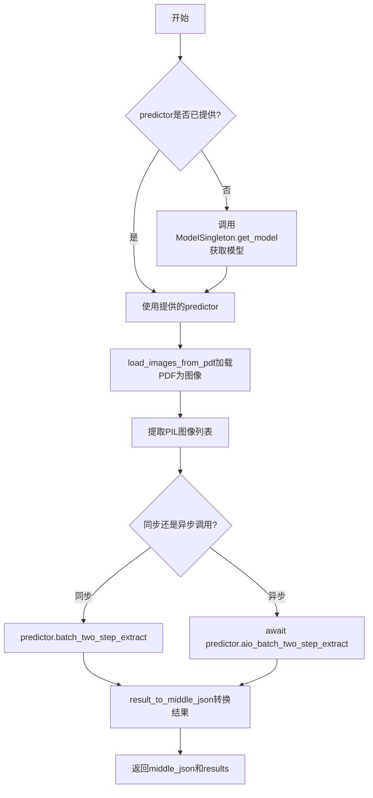
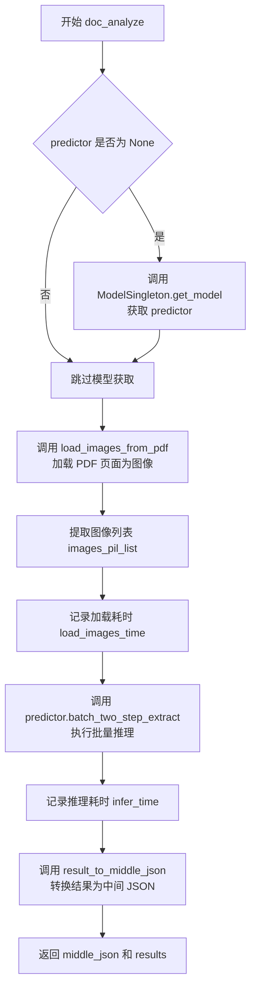

# `MinerU\mineru\backend\vlm\vlm_analyze.py` 详细设计文档

该代码实现了一个文档分析API，通过ModelSingleton单例模式管理多种深度学习后端（transformers、vllm-engine、vllm-async-engine、lmdeploy-engine、mlx-engine、http-client）的模型实例，提供同步和异步的PDF文档分析功能，将PDF转换为图像后调用视觉语言模型进行双阶段提取，最终输出结构化的中间JSON结果。

## 整体流程



## 类结构

```
ModelSingleton (单例模型管理器)
└── get_model (根据后端类型创建不同模型实例)
    ├── transformers后端 (Qwen2VLForConditionalGeneration)
    ├── mlx-engine后端 (mlx_vlm)
    ├── vllm-engine后端 (vllm.LLM)
    ├── vllm-async-engine后端 (AsyncLLM)
    ├── lmdeploy-engine后端 (VLAsyncEngine)
    └── http-client后端 (MinerUClient直连)
```

## 全局变量及字段


### `ModelSingleton._instance`
    
单例实例，用于确保ModelSingleton类只有一个全局实例

类型：`ModelSingleton | None`
    


### `ModelSingleton._models`
    
缓存的模型实例，以(backend, model_path, server_url)元组为键存储MinerUClient实例

类型：`dict`
    
    

## 全局函数及方法


### `doc_analyze`

`doc_analyze` 是一个同步文档分析函数，用于接收 PDF 字节数据，通过指定的后端（transformers/vllm-engine/lmdeploy-engine 等）加载视觉语言模型，将 PDF 页面转换为 PIL 图像列表，然后调用模型的批量两步提取方法进行推理，最终将推理结果转换为中间 JSON 格式并返回。

参数：

- `pdf_bytes`：`bytes`，PDF 文件的字节数据，作为待分析的文档输入
- `image_writer`：`DataWriter | None`，可选的图像写入器，用于保存 PDF 页面转换后的图像
- `predictor`：`MinerUClient | None`，可选的 MinerUClient 预测器实例，若未提供则根据 backend 自动创建
- `backend`：`str`，模型后端类型，默认为 "transformers"，支持 "transformers"、"vllm-engine"、"vllm-async-engine"、"lmdeploy-engine"、"mlx-engine"、"http-client"
- `model_path`：`str | None`，模型路径，若未提供则自动下载
- `server_url`：`str | None`，服务器 URL，仅 http-client 后端需要
- `**kwargs`：可变关键字参数，传递给模型初始化或预测器的额外配置参数

返回值：`(dict, list)`，返回一个元组，包含 `middle_json`（字典类型，结构化的中间 JSON 结果）和 `results`（列表类型，模型的原始推理结果）

#### 流程图



#### 带注释源码

```python
def doc_analyze(
    pdf_bytes,                      # PDF 文件的原始字节数据
    image_writer: DataWriter | None,  # 可选的图像写入器，用于保存图像
    predictor: MinerUClient | None = None,  # 可选的预测器实例
    backend="transformers",         # 视觉语言模型的后端类型
    model_path: str | None = None,  # 模型本地路径或自动下载路径
    server_url: str | None = None, # HTTP 后端的服务器地址
    **kwargs,                       # 传递给模型初始化的额外参数
):
    """
    同步文档分析入口函数
    
    流程：
    1. 如果未提供 predictor，则通过 ModelSingleton 获取或创建
    2. 将 PDF 字节加载为 PIL 图像列表
    3. 调用模型的批量提取方法进行推理
    4. 将推理结果转换为中间 JSON 格式返回
    """
    
    # 步骤1：如果没有提供预测器，则根据 backend 创建
    if predictor is None:
        predictor = ModelSingleton().get_model(backend, model_path, server_url, **kwargs)

    # 步骤2：加载 PDF 页面为图像，记录耗时用于性能监控
    load_images_start = time.time()
    images_list, pdf_doc = load_images_from_pdf(pdf_bytes, image_type=ImageType.PIL)
    # 从字典列表中提取 PIL 图像对象
    images_pil_list = [image_dict["img_pil"] for image_dict in images_list]
    # 计算图像加载耗时
    load_images_time = round(time.time() - load_images_start, 2)
    logger.debug(f"load images cost: {load_images_time}, speed: {round(len(images_pil_list)/load_images_time, 3)} images/s")

    # 步骤3：调用模型的批量两步提取方法进行推理
    infer_start = time.time()
    results = predictor.batch_two_step_extract(images=images_pil_list)
    infer_time = round(time.time() - infer_start, 2)
    logger.debug(f"infer finished, cost: {infer_time}, speed: {round(len(results)/infer_time, 3)} page/s")

    # 步骤4：将模型结果转换为中间 JSON 格式，包含图像和 PDF 文档信息
    middle_json = result_to_middle_json(results, images_list, pdf_doc, image_writer)
    
    # 返回中间 JSON 和原始结果
    return middle_json, results
```


### `aio_doc_analyze`

异步文档分析函数，用于将PDF文档转换为结构化的中间JSON格式。该函数通过加载PDF、调用多模态大模型进行视觉理解，提取文档中的文本、布局、表格等信息，并最终将结果转换为中间JSON格式供后续处理。

参数：

- `pdf_bytes`：`bytes`，PDF文件的字节数据
- `image_writer`：`DataWriter | None`，用于写入图像数据的DataWriter对象，可为None
- `predictor`：`MinerUClient | None`，预配置的MinerUClient预测器对象，如果为None则自动创建
- `backend`：`str`，模型后端类型，默认为"transformers"，支持vllm-engine、lmdeploy-engine等
- `model_path`：`str | None`，模型路径，如果为None则自动下载
- `server_url`：`str | None`，远程服务器URL，用于http-client后端
- `**kwargs`：其他关键字参数，将传递给模型初始化或推理过程

返回值：`(dict, list)`，返回元组包含中间JSON字典和推理结果列表。第一个元素`middle_json`是包含文档结构化信息的字典，第二个元素`results`是原始推理结果列表。

#### 流程图

```mermaid
flowchart TD
    A[开始 aio_doc_analyze] --> B{predictor 是否为 None?}
    B -->|是| C[调用 ModelSingleton().get_model 创建 predictor]
    B -->|否| D[使用传入的 predictor]
    C --> E[加载 PDF 图像]
    D --> E
    E --> F[load_images_from_pdf 获取图像列表和 PDF 文档]
    F --> G[提取 PIL 图像列表]
    G --> H[记录图像加载时间并日志输出]
    H --> I[调用 aio_batch_two_step_extract 异步推理]
    I --> J[记录推理时间并日志输出]
    J --> K[调用 result_to_middle_json 转换结果]
    K --> L[返回 middle_json 和 results]
```

#### 带注释源码

```python
async def aio_doc_analyze(
    pdf_bytes,  # PDF文件的字节数据
    image_writer: DataWriter | None,  # 可选的图像写入器
    predictor: MinerUClient | None = None,  # 可选的预测器实例
    backend="transformers",  # 默认为transformers后端
    model_path: str | None = None,  # 可选的模型路径
    server_url: str | None = None,  # 可选的服务器URL
    **kwargs,  # 其他传递参数
):
    # 如果未提供predictor，则通过单例模式获取模型实例
    if predictor is None:
        predictor = ModelSingleton().get_model(backend, model_path, server_url, **kwargs)

    # 记录图像加载开始时间
    load_images_start = time.time()
    # 调用工具函数从PDF字节加载图像，返回图像列表和PDF文档对象
    images_list, pdf_doc = load_images_from_pdf(pdf_bytes, image_type=ImageType.PIL)
    # 从图像字典列表中提取PIL图像对象
    images_pil_list = [image_dict["img_pil"] for image_dict in images_list]
    # 计算图像加载耗时
    load_images_time = round(time.time() - load_images_start, 2)
    # 记录图像加载性能日志
    logger.debug(f"load images cost: {load_images_time}, speed: {round(len(images_pil_list)/load_images_time, 3)} images/s")

    # 记录推理开始时间
    infer_start = time.time()
    # 异步调用预测器的两步提取方法处理图像列表
    results = await predictor.aio_batch_two_step_extract(images=images_pil_list)
    # 计算推理耗时
    infer_time = round(time.time() - infer_start, 2)
    # 记录推理性能日志
    logger.debug(f"infer finished, cost: {infer_time}, speed: {round(len(results)/infer_time, 3)} page/s")
    
    # 将推理结果转换为中间JSON格式，包含图像列表和PDF文档信息
    middle_json = result_to_middle_json(results, images_list, pdf_doc, image_writer)
    # 返回中间JSON和原始结果
    return middle_json, results
```


### `ModelSingleton.__new__`

实现单例模式，确保 `ModelSingleton` 类只有一个实例，并在首次创建时初始化类属性。

参数：

- `cls`：`type`，类本身，用于创建实例
- `*args`：`tuple`，可变位置参数，用于传递给父类的构造函数
- `**kwargs`：`dict`，可变关键字参数，用于传递给父类构造函数的关键字参数

返回值：`ModelSingleton`，返回单例实例，如果已存在则返回现有实例，否则创建新实例

#### 流程图

```mermaid
flowchart TD
    A[开始 __new__] --> B{cls._instance 是否为 None?}
    B -- 是 --> C[调用 super().__new__ 创建新实例]
    C --> D[将新实例赋值给 cls._instance]
    D --> E[返回 cls._instance]
    B -- 否 --> E
    E[结束 __new__]
```

#### 带注释源码

```python
def __new__(cls, *args, **kwargs):
    """
    创建单例实例的魔术方法，确保类只有一个实例
    
    参数:
        cls: 类本身，用于创建实例
        *args: 可变位置参数，传递给父类
        **kwargs: 可变关键字参数，传递给父类
    
    返回:
        返回单例实例
    """
    # 检查类属性 _instance 是否为空
    if cls._instance is None:
        # 如果为空，调用父类的 __new__ 方法创建新实例
        cls._instance = super().__new__(cls)
    # 返回单例实例（无论是否新创建）
    return cls._instance
```


### `ModelSingleton.get_model`

获取或创建模型实例的单例方法，根据指定的后端类型（transformers、mlx-engine、vllm-engine、vllm-async-engine、lmdeploy-engine、http-client）初始化相应的模型引擎，并返回封装好的 MinerUClient 客户端实例。

参数：

- `self`：ModelSingleton，单例实例自身
- `backend`：`str`，推理后端类型，可选值为 "transformers"、"mlx-engine"、"vllm-engine"、"vllm-async-engine"、"lmdeploy-engine"、"http-client"
- `model_path`：`str | None`，模型本地路径或 HuggingFace 模型 ID，为 None 时自动下载
- `server_url`：`str | None`，仅 http-client 后端使用，远程推理服务地址
- `**kwargs`：可变关键字参数，包含 batch_size、max_concurrency、http_timeout、server_headers、max_retries、retry_backoff_factor 等配置

返回值：`MinerUClient`，封装了模型、处理器、后端引擎的客户端对象，用于执行批量推理

#### 流程图

```mermaid
flowchart TD
    A[开始 get_model] --> B{检查缓存 key<br/>(backend, model_path, server_url)}
    B -->|已缓存| C[直接返回缓存的 MinerUClient]
    B -->|未缓存| D[开始初始化模型]
    D --> E{backend 类型?}
    E -->|transformers| F[加载 Qwen2VLForConditionalGeneration<br/>和 AutoProcessor]
    E -->|mlx-engine| G[使用 mlx_vlm.load 加载模型]
    E -->|vllm-engine| H[初始化 vllm.LLM 同步引擎]
    E -->|vllm-async-engine| I[初始化 AsyncLLM 异步引擎]
    E -->|lmdeploy-engine| J[初始化 VLAsyncEngine]
    E -->|http-client| K[不加载本地模型]
    F --> L[设置 batch_size]
    G --> L
    H --> L
    I --> L
    J --> L
    K --> L
    L --> M[创建 MinerUClient 实例]
    M --> N[存入 _models 缓存]
    N --> O[记录初始化耗时]
    O --> C
```

#### 带注释源码

```python
def get_model(
    self,
    backend: str,
    model_path: str | None,
    server_url: str | None,
    **kwargs,
) -> MinerUClient:
    """
    获取或创建模型实例
    
    参数:
        backend: 推理后端类型 (transformers/mlx-engine/vllm-engine/vllm-async-engine/lmdeploy-engine/http-client)
        model_path: 模型路径，为None时自动下载
        server_url: HTTP后端的服务地址
        **kwargs: 包含 batch_size, max_concurrency, http_timeout, server_headers, max_retries, retry_backoff_factor
    
    返回:
        MinerUClient: 模型客户端封装
    """
    # 构建缓存key，用于单例缓存模型实例
    key = (backend, model_path, server_url)
    
    # 检查是否已存在缓存的模型
    if key not in self._models:
        start_time = time.time()  # 记录开始时间用于性能监控
        model = None              # transformers/mlx 后端的模型对象
        processor = None          # transformers 后端的处理器
        vllm_llm = None           # vllm-engine 同步引擎
        lmdeploy_engine = None    # lmdeploy 引擎
        vllm_async_llm = None     # vllm-async-engine 异步引擎
        
        # 从 kwargs 提取各后端专用参数
        batch_size = kwargs.get("batch_size", 0)  # transformers 后端批处理大小
        max_concurrency = kwargs.get("max_concurrency", 100)  # HTTP客户端最大并发数
        http_timeout = kwargs.get("http_timeout", 600)  # HTTP请求超时时间
        server_headers = kwargs.get("server_headers", None)  # HTTP请求头
        max_retries = kwargs.get("max_retries", 3)  # HTTP请求最大重试次数
        retry_backoff_factor = kwargs.get("retry_backoff_factor", 0.5)  # HTTP重试退避因子
        
        # 从 kwargs 中移除这些参数，避免传递给不相关的初始化函数
        for param in ["batch_size", "max_concurrency", "http_timeout", 
                      "server_headers", "max_retries", "retry_backoff_factor"]:
            if param in kwargs:
                del kwargs[param]
        
        # 非 HTTP 后端且未提供模型路径时，自动下载模型
        if backend not in ["http-client"] and not model_path:
            model_path = auto_download_and_get_model_root_path("/", "vlm")
        
        # -------------------- transformers 后端 --------------------
        if backend == "transformers":
            try:
                from transformers import (
                    AutoProcessor,
                    Qwen2VLForConditionalGeneration,
                )
                from transformers import __version__ as transformers_version
            except ImportError:
                raise ImportError("Please install transformers to use the transformers backend.")
            
            # 根据 transformers 版本选择 dtype 参数名称
            if version.parse(transformers_version) >= version.parse("4.56.0"):
                dtype_key = "dtype"
            else:
                dtype_key = "torch_dtype"
            
            device = get_device()  # 获取设备类型
            # 加载 Qwen2VL 模型
            model = Qwen2VLForConditionalGeneration.from_pretrained(
                model_path,
                device_map={"": device},
                **{dtype_key: "auto"},
            )
            # 加载处理器
            processor = AutoProcessor.from_pretrained(
                model_path,
                use_fast=True,
            )
            # 默认批处理大小
            if batch_size == 0:
                batch_size = set_default_batch_size()
        
        # -------------------- mlx-engine 后端 (Apple Silicon) --------------------
        elif backend == "mlx-engine":
            # 检查 macOS 版本支持
            mlx_supported = is_mac_os_version_supported()
            if not mlx_supported:
                raise EnvironmentError("mlx-engine backend is only supported on macOS 13.5+ with Apple Silicon.")
            try:
                from mlx_vlm import load as mlx_load
            except ImportError:
                raise ImportError("Please install mlx-vlm to use the mlx-engine backend.")
            
            # 使用 mlx_vlm 加载模型和处理器
            model, processor = mlx_load(model_path)
        
        # -------------------- 其他后端 (vllm/lmdeploy) --------------------
        else:
            # 设置 OpenMP 线程数为1，避免多核竞争
            if os.getenv('OMP_NUM_THREADS') is None:
                os.environ["OMP_NUM_THREADS"] = "1"
            
            # ===== vllm-engine 同步引擎 =====
            if backend == "vllm-engine":
                try:
                    import vllm
                except ImportError:
                    raise ImportError("Please install vllm to use the vllm-engine backend.")
                
                # 根据设备类型调整 vllm 参数
                kwargs = mod_kwargs_by_device_type(kwargs, vllm_mode="sync_engine")
                
                # 处理 compilation_config (支持 JSON 字符串或字典)
                if "compilation_config" in kwargs:
                    if isinstance(kwargs["compilation_config"], str):
                        try:
                            kwargs["compilation_config"] = json.loads(kwargs["compilation_config"])
                        except json.JSONDecodeError:
                            logger.warning(f"Failed to parse compilation_config as JSON: {kwargs['compilation_config']}")
                            del kwargs["compilation_config"]
                
                # 设置默认 GPU 显存利用率
                if "gpu_memory_utilization" not in kwargs:
                    kwargs["gpu_memory_utilization"] = set_default_gpu_memory_utilization()
                # 设置模型路径
                if "model" not in kwargs:
                    kwargs["model"] = model_path
                # 启用自定义 logits 处理器
                if enable_custom_logits_processors() and ("logits_processors" not in kwargs):
                    from mineru_vl_utils import MinerULogitsProcessor
                    kwargs["logits_processors"] = [MinerULogitsProcessor]
                
                # 初始化 vllm 同步引擎
                vllm_llm = vllm.LLM(**kwargs)
            
            # ===== vllm-async-engine 异步引擎 =====
            elif backend == "vllm-async-engine":
                try:
                    from vllm.engine.arg_utils import AsyncEngineArgs
                    from vllm.v1.engine.async_llm import AsyncLLM
                    from vllm.config import CompilationConfig
                except ImportError:
                    raise ImportError("Please install vllm to use the vllm-async-engine backend.")
                
                kwargs = mod_kwargs_by_device_type(kwargs, vllm_mode="async_engine")
                
                # 处理 compilation_config (支持字典和 JSON 字符串)
                if "compilation_config" in kwargs:
                    if isinstance(kwargs["compilation_config"], dict):
                        kwargs["compilation_config"] = CompilationConfig(**kwargs["compilation_config"])
                    elif isinstance(kwargs["compilation_config"], str):
                        try:
                            config_dict = json.loads(kwargs["compilation_config"])
                            kwargs["compilation_config"] = CompilationConfig(**config_dict)
                        except (json.JSONDecodeError, TypeError) as e:
                            logger.warning(f"Failed to parse compilation_config: {kwargs['compilation_config']}, error: {e}")
                            del kwargs["compilation_config"]
                
                if "gpu_memory_utilization" not in kwargs:
                    kwargs["gpu_memory_utilization"] = set_default_gpu_memory_utilization()
                if "model" not in kwargs:
                    kwargs["model"] = model_path
                if enable_custom_logits_processors() and ("logits_processors" not in kwargs):
                    from mineru_vl_utils import MinerULogitsProcessor
                    kwargs["logits_processors"] = [MinerULogitsProcessor]
                
                # 初始化 vllm 异步引擎
                vllm_async_llm = AsyncLLM.from_engine_args(AsyncEngineArgs(**kwargs))
            
            # ===== lmdeploy-engine 引擎 =====
            elif backend == "lmdeploy-engine":
                try:
                    from lmdeploy import PytorchEngineConfig, TurbomindEngineConfig
                    from lmdeploy.serve.vl_async_engine import VLAsyncEngine
                except ImportError:
                    raise ImportError("Please install lmdeploy to use the lmdeploy-engine backend.")
                
                # 默认缓存配置
                if "cache_max_entry_count" not in kwargs:
                    kwargs["cache_max_entry_count"] = 0.5
                
                # 获取设备类型 (cuda/ascend/maca/camb)
                device_type = os.getenv("MINERU_LMDEPLOY_DEVICE", "")
                if device_type == "":
                    if "lmdeploy_device" in kwargs:
                        device_type = kwargs.pop("lmdeploy_device")
                        if device_type not in ["cuda", "ascend", "maca", "camb"]:
                            raise ValueError(f"Unsupported lmdeploy device type: {device_type}")
                    else:
                        device_type = "cuda"
                
                # 获取后端类型 (pytorch/turbomind)
                lm_backend = os.getenv("MINERU_LMDEPLOY_BACKEND", "")
                if lm_backend == "":
                    if "lmdeploy_backend" in kwargs:
                        lm_backend = kwargs.pop("lmdeploy_backend")
                        if lm_backend not in ["pytorch", "turbomind"]:
                            raise ValueError(f"Unsupported lmdeploy backend: {lm_backend}")
                    else:
                        lm_backend = set_lmdeploy_backend(device_type)
                
                logger.info(f"lmdeploy device is: {device_type}, lmdeploy backend is: {lm_backend}")
                
                # 根据后端类型创建配置
                if lm_backend == "pytorch":
                    kwargs["device_type"] = device_type
                    backend_config = PytorchEngineConfig(**kwargs)
                elif lm_backend == "turbomind":
                    backend_config = TurbomindEngineConfig(**kwargs)
                else:
                    raise ValueError(f"Unsupported lmdeploy backend: {lm_backend}")
                
                # 设置 lmdeploy 日志级别
                log_level = 'ERROR'
                from lmdeploy.utils import get_logger
                lm_logger = get_logger('lmdeploy')
                lm_logger.setLevel(log_level)
                if os.getenv('TM_LOG_LEVEL') is None:
                    os.environ['TM_LOG_LEVEL'] = log_level
                
                # 初始化 lmdeploy 异步引擎
                lmdeploy_engine = VLAsyncEngine(
                    model_path,
                    backend=lm_backend,
                    backend_config=backend_config,
                )
        
        # 创建并缓存 MinerUClient 实例
        self._models[key] = MinerUClient(
            backend=backend,
            model=model,
            processor=processor,
            lmdeploy_engine=lmdeploy_engine,
            vllm_llm=vllm_llm,
            vllm_async_llm=vllm_async_llm,
            server_url=server_url,
            batch_size=batch_size,
            max_concurrency=max_concurrency,
            http_timeout=http_timeout,
            server_headers=server_headers,
            max_retries=max_retries,
            retry_backoff_factor=retry_backoff_factor,
        )
        
        # 记录初始化耗时
        elapsed = round(time.time() - start_time, 2)
        logger.info(f"get {backend} predictor cost: {elapsed}s")
    
    # 返回缓存的或新创建的客户端
    return self._models[key]
```

## 关键组件


### ModelSingleton

单例模式实现的多后端模型管理器，支持transformers、mlx-engine、vllm-engine、vllm-async-engine、lmdeploy-engine和http-client等多种推理后端，统一管理模型实例缓存与生命周期。

### 多后端模型加载策略

根据backend参数动态选择不同的模型加载方式，包括transformers直接加载、vllm同步/异步引擎、lmdeploy的pytorch/turbomind后端、以及mlx-engine（macOS专用），并支持OMP线程数自动配置。

### 量化与dtype适配

根据transformers版本自动选择dtype或torch_dtype参数实现模型量化加载，通过version.parse对比实现4.56.0前后的兼容性处理。

### PDF图像加载与预处理

调用load_images_from_pdf将PDF字节流转换为PIL图像列表，包含图像加载性能监控日志，支持ImageType枚举指定输出格式。

### 批量两步提取推理

调用MinerUClient的batch_two_step_extract和aio_batch_two_step_extract实现同步/异步批量推理，返回结构化结果列表，包含推理性能指标计算。

### 结果转中间JSON

调用result_to_middle_json将模型推理结果、图像列表、PDF文档对象和数据写入器整合转换为标准中间JSON格式。

### 模型配置参数透传

通过kwargs实现后端特定参数（如gpu_memory_utilization、compilation_config、cache_max_entry_count等）的动态注入与适配，支持JSON字符串解析和设备类型自动推断。

### LMDeploy后端与设备适配

支持cuda/ascend/maca/camb多种设备类型和pytorch/turbomind后端引擎的自动选择与配置，通过环境变量MINERU_LMDEPLOY_DEVICE和MINERU_LMDEPLOY_BACKEND实现运行时切换。

### HTTP客户端后端配置

提供max_concurrency、http_timeout、server_headers、max_retries、retry_backoff_factor等参数支持外部服务器推理场景，包含参数隔离移除逻辑避免污染其他后端。

### 日志与性能监控

使用loguru记录模型加载耗时、图像加载速度、推理吞吐率等关键性能指标，支持DEBUG级别详细输出。


## 问题及建议


### 已知问题

-   **线程安全问题**：`ModelSingleton._models` 字典在多线程环境下没有锁保护，`get_model` 方法中先检查key是否存在再创建模型的过程不是原子操作，可能导致多个线程同时创建相同的模型实例
-   **kwargs 直接被修改**：调用 `get_model` 时传入的 `kwargs` 字典在函数内部被直接修改（通过 `del` 删除参数），这会影响调用者持有的原始字典，可能导致意外的副作用
-   **重复代码**：`vllm-engine` 和 `vllm-async-engine` 的初始化逻辑有大量重复代码；`doc_analyze` 和 `aio_doc_analyze` 中图像加载和处理逻辑几乎完全重复
-   **缓存无限增长**：`ModelSingleton._models` 字典没有缓存淘汰机制，随着使用会无限增长，可能导致内存泄漏
-   **资源管理缺失**：没有提供释放模型资源的方法（显式清理显存/内存），缺少 `clear()` 或 `release()` 方法
-   **硬编码的 Magic Numbers**：多处硬编码的默认值如 `max_concurrency=100`、`http_timeout=600`、`retry_backoff_factor=0.5` 等缺乏统一的配置管理
-   **环境变量覆盖问题**：在 `lmdeploy-engine` 分支中，使用 `os.getenv` 和 `kwargs.pop` 的逻辑复杂且容易出错，当环境变量和参数同时存在时行为不明确
-   **类型注解不一致**：混合使用了 Python 3.10+ 的 `|` 语法和 `typing.Union`，代码风格不统一
-   **模型路径验证缺失**：当 `backend` 不是 `http-client` 且 `model_path` 为 `None` 时，调用 `auto_download_and_get_model_root_path` 但未检查其返回值有效性
-   **条件导入位置不当**：部分导入语句（如 `from mlx_vlm import load`）放在条件分支内部，增加了代码执行路径的复杂性

### 优化建议

-   **添加线程锁**：使用 `threading.Lock` 保护 `_models` 字典的读写操作，确保 `get_model` 方法的线程安全
-   **修复 kwargs 修改问题**：在处理参数前先创建 `kwargs` 的副本，避免修改原始字典
-   **提取公共逻辑**：将 vllm 初始化和图像加载的公共逻辑抽取为独立函数，减少代码重复
-   **实现缓存管理**：添加最大缓存数量限制或 LRU 淘汰机制，或提供显式的缓存清理接口
-   **添加资源释放方法**：实现 `ModelSingleton` 的清理方法，支持显式释放模型资源
-   **统一配置管理**：创建配置类或使用配置文件集中管理所有默认参数（超时、重试、并发数等）
-   **简化环境变量逻辑**：重构 `lmdeploy-engine` 的设备类型和后端选择逻辑，使用更清晰的优先级规则
-   **添加模型路径验证**：在调用 `auto_download_and_get_model_root_path` 后检查返回值是否为有效路径，无效时抛出明确异常
-   **使用结构化日志**：将性能指标日志改为 JSON 格式或使用专门的指标收集库，便于后续分析
-   **统一导入风格**：要么全部使用 `|` 语法，要么统一使用 `typing` 模块，保持代码风格一致
</think>

## 其它


### 设计目标与约束

本模块的核心设计目标是提供一个统一的PDF文档分析接口，支持多种深度学习推理后端（transformers、mlx-engine、vllm-engine、vllm-async-engine、lmdeploy-engine、http-client），通过单例模式管理模型实例以避免重复加载带来的资源消耗。约束条件包括：后端必须从预定义列表中选择、model_path在非http-client后端时必须提供、mlx-engine后端仅支持macOS 13.5+且需要Apple Silicon、lmdeploy后端需要指定device_type和backend类型。

### 错误处理与异常设计

代码采用分层异常处理策略。导入依赖失败时抛出ImportError并提示安装对应库；环境不满足时抛出EnvironmentError（如mlx-engine的macOS版本限制）；参数值非法时抛出ValueError（如lmdeploy的device_type和backend类型校验）；JSON解析失败时记录warning并删除无效参数。异常信息通过logger输出，不向上层抛出以保证服务稳定性。

### 数据流与状态机

数据流为：PDF字节 → load_images_from_pdf()提取图像列表 → predictor.batch_two_step_extract()或aio_batch_two_step_extract()执行推理 → result_to_middle_json()转换结果。状态转换包括：初始态→模型加载态→图像加载态→推理态→结果转换态→完成态。异步版本（aio_doc_analyze）使用await等待推理结果。

### 外部依赖与接口契约

主要依赖包括：transformers（4.56.0+版本检测）、vllm（支持sync和async引擎）、lmdeploy（PytorchEngineConfig/TurbomindEngineConfig）、mlx-vlm（macOS后端）、mineru_vl_utils（MinerUClient、MinerULogitsProcessor）。接口契约方面：get_model()接受backend/model_path/server_url及kwargs参数返回MinerUClient；doc_analyze()和aio_doc_analyze()接受pdf_bytes/image_writer/predictor等参数返回(middle_json, results)元组。

### 性能考虑与优化点

性能优化措施包括：ModelSingleton缓存已加载模型避免重复初始化；transformers后端根据版本选择dtype_key；vllm/lmdeploy设置gpu_memory_utilization和cache_max_entry_count；lmdeploy支持多后端切换；批量处理图像提高吞吐量。潜在优化空间：增加模型预热机制、支持模型热加载、图像预处理的异步化、推理结果流式返回。

### 并发与线程安全

ModelSingleton使用类变量_instance和_models实现单例，get_model()方法在多线程环境下通过字典key查询保证原子性，但首次创建模型时存在竞态条件风险。aio_doc_analyze()支持asyncio并发，batch_two_step_extract()和aio_batch_two_step_extract()分别对应同步/异步调用。max_concurrency参数控制http-client后端的并发请求数。

### 配置管理与环境变量

代码使用多种环境变量和配置参数：OMP_NUM_THREADS设置线程数；MINERU_LMDEPLOY_DEVICE指定设备类型（cuda/ascend/maca/camb）；MINERU_LMDEPLOY_BACKEND指定后端类型（pytorch/turbomind）；TM_LOG_LEVEL设置lmdeploy日志级别。kwargs传入的参数包括gpu_memory_utilization、compilation_config、batch_size、max_concurrency、http_timeout、server_headers、max_retries、retry_backoff_factor等。

### 资源管理与生命周期

模型资源通过ModelSingleton._models字典缓存，生命周期与进程相同。vllm_llm、vllm_async_llm、lmdeploy_engine、model、processor等对象在首次调用get_model()时创建并缓存。image_writer用于写入图像文件资源。需要注意及时释放不再使用的predictor实例。

### 安全性考虑

输入验证包括：backend参数必须在允许列表中；lmdeploy的device_type和backend类型校验；server_url和model_path的null检查。敏感信息处理：server_headers如包含认证信息需妥善保管；模型路径需校验防止路径遍历攻击。日志输出需注意不打印敏感信息。

### 监控与可观测性

代码通过logger记录关键性能指标：模型加载耗时（get {backend} predictor cost: {elapsed}s）；图像加载耗时和速度；推理耗时和吞吐量（page/s）。日志级别使用logger.debug()，可通过配置调整。推理时间统计覆盖完整流程。

### 部署与运维相关

部署时需根据环境选择后端：本地GPU推荐vllm-engine或lmdeploy-engine；macOS使用mlx-engine；远程服务使用http-client；CPU或开发调试使用transformers。模型路径可通过auto_download_and_get_model_root_path自动下载。运维需关注GPU内存使用、模型加载时间、推理吞吐量等指标。

### 测试策略

测试应覆盖：多种后端的模型加载和推理；异常场景（依赖缺失、参数非法、环境不满足）；性能基准（加载时间、推理速度）；并发安全（多线程/多异步任务）；数据流完整性（PDF到middle_json的转换）。建议使用mock进行单元测试，集成测试覆盖实际后端。

### 兼容性考虑

代码已处理版本兼容性：transformers版本检测（4.56.0+使用dtype vs torch_dtype）。不同后端间的参数传递通过mod_kwargs_by_device_type适配。vllm的compilation_config支持dict和JSON字符串两种格式。返回值格式统一为(middle_json, results)。Python类型注解使用|语法（3.10+）。


    