# `MinerU\mineru\backend\vlm\vlm_magic_model.py` 详细设计文档

MagicModel是一个文档后处理解析模型，负责将PDF或文档的页面块(page_blocks)解析并分类为不同类型(图像、表格、代码、文本、标题等)，同时处理块之间的关联关系(如标题-正文、脚注-正文)，并提取和清理内容中的LaTeX公式、代码块等特殊元素。

## 整体流程

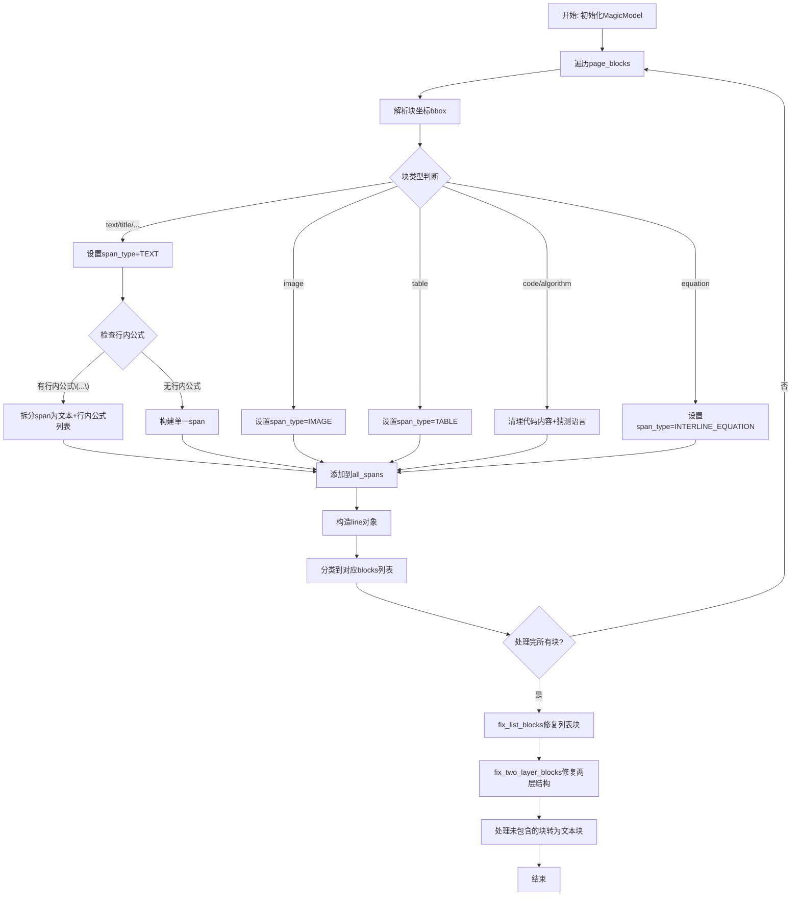

## 类结构

```
MagicModel (主类)
├── 构造函数 __init__
│   ├── 字段: page_blocks, all_spans, image_blocks, table_blocks, code_blocks...
│   └── 方法: get_list_blocks, get_image_blocks, get_table_blocks...
└── 全局辅助函数
    ├── isolated_formula_clean
    ├── code_content_clean
    ├── clean_content
    ├── __tie_up_category_by_index
    ├── get_type_blocks
    ├── fix_two_layer_blocks
    └── fix_list_blocks
```

## 全局变量及字段


### `blocks`
    
解析过程中的临时块列表

类型：`list`
    


### `need_fix_blocks`
    
需要修复的两层结构块

类型：`list`
    


### `fixed_blocks`
    
修复后的块列表

类型：`list`
    


### `not_include_blocks`
    
未包含在修复中的块

类型：`list`
    


### `processed_indices`
    
已处理的块索引集合

类型：`set`
    


### `need_remove_blocks`
    
需要移除的块列表(用于列表块修复)

类型：`list`
    


### `temp_text_blocks`
    
临时文本块列表(文本+引用文本)

类型：`list`
    


### `misplaced_captions`
    
位置不正确的标题列表

类型：`list`
    


### `misplaced_footnotes`
    
位置不正确的脚注列表

类型：`list`
    


### `MagicModel.page_blocks`
    
输入的页面块列表

类型：`list`
    


### `MagicModel.all_spans`
    
所有解析后的span列表

类型：`list`
    


### `MagicModel.image_blocks`
    
图像块列表

类型：`list`
    


### `MagicModel.table_blocks`
    
表格块列表

类型：`list`
    


### `MagicModel.interline_equation_blocks`
    
行间公式块列表

类型：`list`
    


### `MagicModel.text_blocks`
    
文本块列表

类型：`list`
    


### `MagicModel.title_blocks`
    
标题块列表

类型：`list`
    


### `MagicModel.code_blocks`
    
代码块列表

类型：`list`
    


### `MagicModel.discarded_blocks`
    
丢弃的块列表(页眉/页脚等)

类型：`list`
    


### `MagicModel.ref_text_blocks`
    
引用文本块列表

类型：`list`
    


### `MagicModel.phonetic_blocks`
    
注音块列表

类型：`list`
    


### `MagicModel.list_blocks`
    
列表块列表

类型：`list`
    
    

## 全局函数及方法


### `isolated_formula_clean`

该函数是一个轻量级的字符串处理工具，主要用于清理隔离公式（isolated formula）两端的 LaTeX 包装符号 `\[` 和 `\]`，并去除首尾空白字符，使其成为干净的 LaTeX 公式字符串供后续渲染或处理使用。

参数：

-  `txt`：`str`，待清理的隔离公式字符串，通常以 `\[` 开头并以 `\]` 结尾

返回值：`str`，返回去除包装符号和首尾空格后的干净 LaTeX 公式字符串

#### 流程图

```mermaid
flowchart TD
    A[开始: 输入 txt] --> B[创建副本 latex = txt[:]]
    B --> C{latex 是否以 \[ 开头?}
    C -->|是| D[去除前两个字符: latex = latex[2:]]
    C -->|否| E{latex 是否以 \] 结尾?}
    D --> E
    E -->|是| F[去除最后两个字符: latex = latex[:-2]]
    E -->|否| G[执行 strip: latex.strip()]
    F --> G
    G --> H[返回 latex]
```

#### 带注释源码

```python
def isolated_formula_clean(txt):
    """清理隔离公式，去除\[和\]包装，输出干净的LaTeX公式字符串"""
    latex = txt[:]  # 创建输入字符串的副本，避免直接修改原对象
    if latex.startswith("\\["):  # 检查字符串是否以 \[ 开头
        latex = latex[2:]  # 去除前两个字符，即 \[ 
    if latex.endswith("\\]"):  # 检查字符串是否以 \] 结尾
        latex = latex[:-2]  # 去除最后两个字符，即 \]
    latex = latex.strip()  # 去除首尾空白字符
    return latex  # 返回清理后的公式字符串
```

#### 关键组件信息

| 组件名称 | 一句话描述 |
|---------|-----------|
| `isolated_formula_clean` | 去除 LaTeX 隔离公式两端包装符号的清理函数 |

#### 潜在的技术债务或优化空间

1. **缺乏输入验证**：函数未对输入进行空值检查或类型校验，若传入非字符串类型可能导致异常
2. **仅支持单一包装格式**：仅处理 `\[...\]` 格式，未考虑 `$...$`、`$$...$$` 或其他 LaTeX 数学模式包装
3. **未处理嵌套情况**：若公式内部包含 `\[` 或 `\]` 子串，简单的头尾检查可能产生误判
4. **函数职责单一**：作为工具函数可考虑迁移至专门的工具类或模块，提升代码组织性

#### 其它项目

- **设计目标**：提供一种简洁的隔离公式清理能力，适配 MinerU 项目中对于行间公式（interline equation）的预处理流程
- **约束**：输入应为字符串，函数不修改原对象（副本操作）
- **错误处理**：当前无异常捕获机制，依赖调用方保证输入合法
- **调用场景**：在 `MagicModel.__init__` 方法中，当块类型为 `equation` 时，用于清理块内容中的隔离公式


### `code_content_clean`

清理代码内容，移除Markdown代码块的开始和结束标记（如三个反引号），并返回清理后的纯代码文本。

参数：

-  `content`：`str`，需要清理的代码内容字符串，可能包含Markdown代码块标记

返回值：`str`，移除Markdown代码块标记后的纯代码内容，如果输入为空则返回空字符串

#### 流程图

```mermaid
flowchart TD
    A[开始 code_content_clean] --> B{content 是否为空}
    B -->|是| C[返回空字符串 '']
    B -->|否| D[将 content 按行分割为列表]
    D --> E[初始化 start_idx = 0, end_idx = len(lines)]
    E --> F{第一行是否以 '```' 开头}
    F -->|是| G[start_idx = 1]
    F -->|否| H[start_idx 保持 0]
    G --> I{最后一行是否等于 '```'}
    H --> I
    I -->|是| J[end_idx = end_idx - 1]
    I -->|否| K{start_idx < end_idx}
    J --> K
    K -->|是| L[返回 lines[start_idx:end_idx] 合并的字符串并去除首尾空格]
    K -->|否| M[返回空字符串 '']
```

#### 带注释源码

```python
def code_content_clean(content):
    """清理代码内容，移除Markdown代码块的开始和结束标记"""
    # 如果内容为空，直接返回空字符串
    if not content:
        return ""

    # 将内容按行分割成列表
    lines = content.splitlines()
    start_idx = 0  # 起始索引，用于跳过开头的标记
    end_idx = len(lines)  # 结束索引

    # 处理开头的三个反引号（如 ```python）
    if lines and lines[0].startswith("```"):
        start_idx = 1  # 跳过第一行（代码块开始标记）

    # 处理结尾的三个反引号（结束标记 ```）
    if lines and end_idx > start_idx and lines[end_idx - 1].strip() == "```":
        end_idx -= 1  # 跳过最后一行（代码块结束标记）

    # 只有在有内容时才进行join操作
    if start_idx < end_idx:
        # 提取中间部分并去除首尾空格
        return "\n".join(lines[start_idx:end_idx]).strip()
    return ""  # 如果没有有效内容，返回空字符串
```


### `clean_content`

该函数用于清理内容中的LaTeX显示公式，将`\[x\]`格式的公式转换为`[x]`格式。

参数：

-  `content`：`str`，需要清理的文本内容，可能包含LaTeX显示公式

返回值：`str`，清理后的文本内容，LaTeX显示公式已被转换为方括号格式

#### 流程图

```mermaid
flowchart TD
    A[开始 clean_content] --> B{content是否存在且非空}
    B -->|否| C[直接返回原content]
    B -->|是| D{检查\[和\]数量是否匹配且大于0}
    D -->|否| C
    D -->|是| E[定义replace_pattern函数]
    E --> F[使用正则表达式\\\[.*?\\\]查找所有匹配]
    F --> G[对每个匹配调用replace_pattern]
    G --> H[提取匹配内容去掉\[和\]]
    H --> I[返回用[]包裹的内容]
    I --> J[返回清理后的content]
    C --> J
```

#### 带注释源码

```python
def clean_content(content):
    """清理内容中的LaTeX显示公式\[x\]为[x]
    
    参数:
        content: 需要清理的文本内容，可能包含LaTeX显示公式
        
    返回:
        清理后的文本内容，LaTeX显示公式已被转换为方括号格式
    """
    # 检查content是否存在、是否非空
    # 并且检查\[和\]的数量是否匹配且大于0
    if content and content.count("\\[") == content.count("\\]") and content.count("\\[") > 0:
        
        # 定义内部函数来处理每个正则匹配
        def replace_pattern(match):
            # 提取\[和\]之间的内容
            inner_content = match.group(1)
            # 返回用方括号包裹的内容
            return f"[{inner_content}]"

        # 定义正则表达式模式，匹配\[...\]
        # \\\[ 转义为 \[, .*? 为非贪婪匹配任意字符
        pattern = r'\\\[(.*?)\\\]'
        # 使用re.sub进行替换，对每个匹配调用replace_pattern函数
        content = re.sub(pattern, replace_pattern, content)

    # 返回清理后的内容
    return content
```


### `__tie_up_category_by_index`

基于index的主客体关联包装函数，用于将特定类型的块（如图像、表格、代码等）与其标题、脚注进行关联匹配。该函数首先筛选出符合主体和客体类型的块，然后调用通用的`tie_up_category_by_index`方法完成关联。

参数：

- `blocks`：`list`，页面中所有的块列表，每个块包含bbox、lines、index、angle、type等信息
- `subject_block_type`：`str`，主体块的类型，如`"image_body"`、`"table_body"`、`"code_body"`
- `object_block_type`：`str`，客体块的类型，如`"image_caption"`、`"image_footnote"`等

返回值：`Any`，返回`tie_up_category_by_index`函数的结果，通常是一个包含主客体关联信息的列表，每个元素包含`sub_bbox`（主体边界框）、`obj_bboxes`（客体边界框列表）、`sub_idx`（主体索引）等字段

#### 流程图

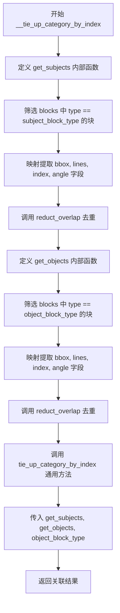

#### 带注释源码

```python
def __tie_up_category_by_index(blocks, subject_block_type, object_block_type):
    """基于index的主客体关联包装函数"""
    
    # 定义获取主体对象的内部函数
    def get_subjects():
        # 使用 filter 筛选出类型为 subject_block_type 的所有块
        # 使用 map 提取每个块的关键字段：bbox, lines, index, angle
        # 使用 reduct_overlap 对提取的块进行重叠去除处理
        return reduct_overlap(
            list(
                map(
                    lambda x: {"bbox": x["bbox"], "lines": x["lines"], "index": x["index"], "angle": x["angle"]},
                    filter(
                        lambda x: x["type"] == subject_block_type,
                        blocks,
                    ),
                )
            )
        )

    # 定义获取客体对象的内部函数
    def get_objects():
        # 使用 filter 筛选出类型为 object_block_type 的所有块
        # 使用 map 提取每个块的关键字段：bbox, lines, index, angle
        # 使用 reduct_overlap 对提取的块进行重叠去除处理
        return reduct_overlap(
            list(
                map(
                    lambda x: {"bbox": x["bbox"], "lines": x["lines"], "index": x["index"], "angle": x["angle"]},
                    filter(
                        lambda x: x["type"] == object_block_type,
                        blocks,
                    ),
                )
            )
        )

    # 调用通用的主客体关联方法，返回关联结果
    # get_subjects: 获取主体对象的函数
    # get_objects: 获取客体对象的函数
    # object_block_type: 客体块的类型，用于确定关联规则
    return tie_up_category_by_index(
        get_subjects,
        get_objects,
        object_block_type=object_block_type
    )
```


### `get_type_blocks`

获取带标题和脚注的块集合。该函数接收页面块列表和块类型，通过主客体关联方法将指定类型的块（如图片、表格、代码）与其标题（caption）和脚注（footnote）进行匹配关联，最终返回包含主体块、标题列表和脚注列表的结构化数据。

参数：

- `blocks`：`list`，页面块列表，包含各种类型的块（如 image_body、image_caption、image_footnote 等）
- `block_type`：`Literal["image", "table", "code"]`，块类型，用于指定要关联的块类型

返回值：`list[dict]`，返回包含主体块及其标题、脚注列表的字典列表，每个字典包含 `{block_type}_body`（主体块）、`{block_type}_caption_list`（标题列表）、`{block_type}_footnote_list`（脚注列表）

#### 流程图

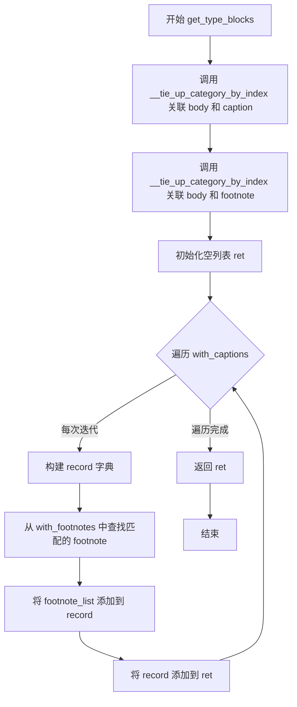

#### 带注释源码

```python
def get_type_blocks(blocks, block_type: Literal["image", "table", "code"]):
    """
    获取带标题和脚注的块集合
    
    参数:
        blocks: 页面块列表
        block_type: 块类型，可选值为 "image", "table", "code"
    
    返回:
        包含主体块、标题列表和脚注列表的字典列表
    """
    # 使用主客体关联方法，将 body 与 caption 进行关联
    # 例如：block_type="image" 时，关联 image_body 和 image_caption
    with_captions = __tie_up_category_by_index(blocks, f"{block_type}_body", f"{block_type}_caption")
    
    # 使用主客体关联方法，将 body 与 footnote 进行关联
    # 例如：block_type="image" 时，关联 image_body 和 image_footnote
    with_footnotes = __tie_up_category_by_index(blocks, f"{block_type}_body", f"{block_type}_footnote")
    
    # 初始化返回列表
    ret = []
    
    # 遍历所有带标题的块记录
    for v in with_captions:
        # 构建单条记录，包含主体块和标题列表
        record = {
            f"{block_type}_body": v["sub_bbox"],           # 主体块的边界框信息
            f"{block_type}_caption_list": v["obj_bboxes"], # 标题块的边界框列表
        }
        
        # 获取当前主体的索引，用于匹配对应的脚注
        filter_idx = v["sub_idx"]
        
        # 从脚注列表中查找索引匹配的主体，获取其脚注列表
        # 使用 next 函数配合 filter 进行查找
        d = next(filter(lambda x: x["sub_idx"] == filter_idx, with_footnotes))
        
        # 将脚注列表添加到记录中
        record[f"{block_type}_footnote_list"] = d["obj_bboxes"]
        
        # 将记录添加到返回列表
        ret.append(record)
    
    # 返回结果列表
    return ret
```


### `fix_two_layer_blocks`

该函数用于修复两层结构（标题/正文/脚注），将主体块（body）、标题块（caption）和脚注块（footnote）组合成统一的两层结构，并处理不合规的 caption 和 footnote（位置不正确或index不连续）。

参数：

- `blocks`：`list`，输入的块列表，包含 image、table 或 code 类型的块
- `fix_type`：`Literal["image", "table", "code"]`，修复类型，指定要修复的块类型

返回值：`tuple[list, list]`，返回元组包含两个元素：
- 第一个元素：修复后的两层结构块列表
- 第二个元素：未包含的块列表（无法纳入两层结构的块）

#### 流程图

```mermaid
flowchart TD
    A[开始 fix_two_layer_blocks] --> B[调用 get_type_blocks 获取需要修复的块]
    B --> C{fix_type 是否为 table 或 image?}
    C -->|是| D[特殊处理表格/图片类型]
    C -->|否| E[跳过特殊处理]
    D --> D1[检查 footnote 位置是否在 body 之后]
    D --> D2[重新分配不合规的 footnote]
    D --> D3[检查 caption 连续性并过滤]
    D --> D4[检查 footnote 连续性并过滤]
    D1 --> D2
    D2 --> D3
    D3 --> D4
    D4 --> F[遍历每个 block 构建两层结构]
    E --> F
    F --> G[为 body 设置类型为 {fix_type}_body]
    F --> H[为 caption 设置类型为 {fix_type}_caption]
    F --> I[为 footnote 设置类型为 {fix_type}_footnote]
    G --> J[构建 two_layer_block 字典]
    H --> J
    I --> J
    J --> K[将 caption_list 和 footnote_list 添加到 blocks]
    K --> L[按 index 排序 blocks]
    L --> M[将处理后的块添加到 fixed_blocks]
    M --> N[收集未处理的块到 not_include_blocks]
    N --> O[返回 fixed_blocks 和 not_include_blocks]
```

#### 带注释源码

```python
def fix_two_layer_blocks(blocks, fix_type: Literal["image", "table", "code"]):
    """
    修复两层结构（标题/正文/脚注）
    
    该函数将主体块（body）、标题块（caption）和脚注块（footnote）
    组合成统一的两层结构，并处理位置不正确或index不连续的caption和footnote。
    
    参数:
        blocks: 输入的块列表
        fix_type: 修复类型，可选值为 "image", "table", "code"
    
    返回:
        tuple: (修复后的两层结构块列表, 未包含的块列表)
    """
    # 第一步：获取需要修复的块（包含body、caption和footnote的关联信息）
    need_fix_blocks = get_type_blocks(blocks, fix_type)
    fixed_blocks = []
    not_include_blocks = []
    processed_indices = set()  # 用于跟踪已处理的块索引

    # 特殊处理表格和图片类型，确保标题在表格前，脚注在表格后
    if fix_type in ["table", "image"]:
        # 存储位置不正确的caption和footnote
        misplaced_captions = []
        misplaced_footnotes = []

        # 第一步：移除不符合位置要求的footnote（应在body后或同位置）
        for block_idx, block in enumerate(need_fix_blocks):
            body = block[f"{fix_type}_body"]
            body_index = body["index"]

            # 检查footnote应在body后或同位置
            valid_footnotes = []
            for footnote in block[f"{fix_type}_footnote_list"]:
                if footnote["index"] >= body_index:
                    valid_footnotes.append(footnote)
                else:
                    misplaced_footnotes.append((footnote, block_idx))
            block[f"{fix_type}_footnote_list"] = valid_footnotes

        # 第三步：重新分配不合规的footnote到合适的body
        for footnote, original_block_idx in misplaced_footnotes:
            footnote_index = footnote["index"]
            best_block_idx = None
            min_distance = float('inf')

            # 寻找索引小于等于footnote_index的最近body
            for idx, block in enumerate(need_fix_blocks):
                body_index = block[f"{fix_type}_body"]["index"]
                if body_index <= footnote_index and idx != original_block_idx:
                    distance = footnote_index - body_index
                    if distance < min_distance:
                        min_distance = distance
                        best_block_idx = idx

            if best_block_idx is not None:
                # 找到合适的body，添加到对应block的footnote_list
                need_fix_blocks[best_block_idx][f"{fix_type}_footnote_list"].append(footnote)
            else:
                # 没找到合适的body，作为普通block处理
                not_include_blocks.append(footnote)

        # 第四步：将每个block的caption_list和footnote_list中不连续index的元素提出来作为普通block处理
        for block in need_fix_blocks:
            caption_list = block[f"{fix_type}_caption_list"]
            footnote_list = block[f"{fix_type}_footnote_list"]
            body_index = block[f"{fix_type}_body"]["index"]

            # 处理caption_list (从body往前看,caption在body之前)
            if caption_list:
                # 按index降序排列,从最接近body的开始检查
                caption_list.sort(key=lambda x: x["index"], reverse=True)
                filtered_captions = [caption_list[0]]
                for i in range(1, len(caption_list)):
                    prev_index = caption_list[i - 1]["index"]
                    curr_index = caption_list[i]["index"]

                    # 检查是否连续
                    if curr_index == prev_index - 1:
                        filtered_captions.append(caption_list[i])
                    else:
                        # 检查gap中是否只有body_index
                        gap_indices = set(range(curr_index + 1, prev_index))
                        if gap_indices == {body_index}:
                            # gap中只有body_index,不算真正的gap
                            filtered_captions.append(caption_list[i])
                        else:
                            # 出现真正的gap,后续所有caption都作为普通block
                            not_include_blocks.extend(caption_list[i:])
                            break
                # 恢复升序
                filtered_captions.reverse()
                block[f"{fix_type}_caption_list"] = filtered_captions

            # 处理footnote_list (从body往后看,footnote在body之后)
            if footnote_list:
                # 按index升序排列,从最接近body的开始检查
                footnote_list.sort(key=lambda x: x["index"])
                filtered_footnotes = [footnote_list[0]]
                for i in range(1, len(footnote_list)):
                    # 检查是否与前一个footnote连续
                    if footnote_list[i]["index"] == footnote_list[i - 1]["index"] + 1:
                        filtered_footnotes.append(footnote_list[i])
                    else:
                        # 出现gap,后续所有footnote都作为普通block
                        not_include_blocks.extend(footnote_list[i:])
                        break
                block[f"{fix_type}_footnote_list"] = filtered_footnotes

    # 构建两层结构blocks
    for block in need_fix_blocks:
        body = block[f"{fix_type}_body"]
        caption_list = block[f"{fix_type}_caption_list"]
        footnote_list = block[f"{fix_type}_footnote_list"]

        # 设置各部分的类型
        body["type"] = f"{fix_type}_body"
        for caption in caption_list:
            caption["type"] = f"{fix_type}_caption"
            processed_indices.add(caption["index"])
        for footnote in footnote_list:
            footnote["type"] = f"{fix_type}_footnote"
            processed_indices.add(footnote["index"])

        processed_indices.add(body["index"])

        # 构建两层结构块
        two_layer_block = {
            "type": fix_type,
            "bbox": body["bbox"],
            "blocks": [body],
            "index": body["index"],
        }
        # 将caption和footnote添加到blocks中
        two_layer_block["blocks"].extend([*caption_list, *footnote_list])
        # 对blocks按index排序以保持顺序
        two_layer_block["blocks"].sort(key=lambda x: x["index"])

        fixed_blocks.append(two_layer_block)

    # 添加未处理的blocks（未被任何两层结构包含的块）
    for block in blocks:
        block.pop("type", None)  # 移除原有的type字段
        if block["index"] not in processed_indices and block not in not_include_blocks:
            not_include_blocks.append(block)

    return fixed_blocks, not_include_blocks
```


### `fix_list_blocks`

该函数用于修复列表块与文本块的关联关系，通过计算文本块与列表块的空间重叠度，将高度重叠的文本块（包含 `text_blocks` 和 `ref_text_blocks`）归入对应的列表块中，并移除已分配的块，同时为每个列表块确定其子类型。

参数：

- `list_blocks`：`list`，待处理的列表块列表，函数将为其添加 `blocks` 字段并确定 `sub_type`
- `text_blocks`：`list`，文本块列表，函数会移除已与列表块关联的文本块
- `ref_text_blocks`：`list`，引用文本块列表，函数会移除已与列表块关联的引用文本块

返回值：`tuple[list, list, list]`，返回一个包含三个元素的元组，分别是处理后的列表块列表、剩余的文本块列表、剩余的引用文本块列表

#### 流程图

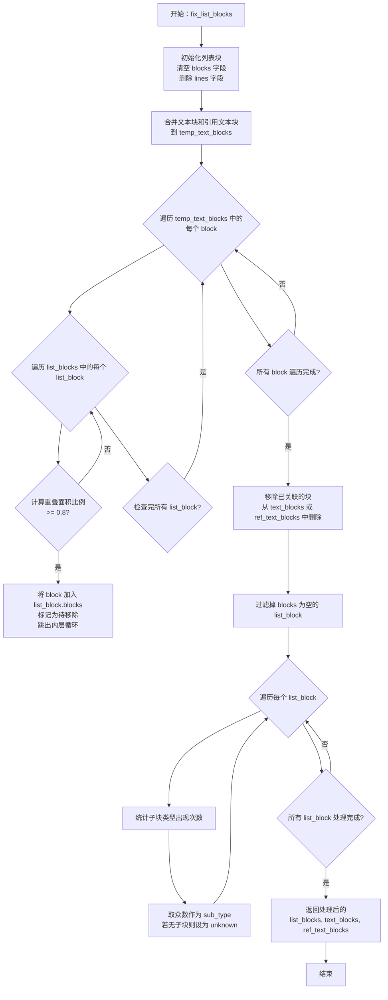

#### 带注释源码

```python
def fix_list_blocks(list_blocks, text_blocks, ref_text_blocks):
    """
    修复列表块与文本块的关联关系
    
    该函数执行以下操作：
    1. 初始化每个列表块的 blocks 字段（用于存储关联的子块）
    2. 将与列表块空间重叠度 >= 80% 的文本块/引用文本块移入对应列表块
    3. 从原文本块列表中移除已关联的块
    4. 为每个列表块确定 sub_type（基于包含子块的众数类型）
    """
    
    # 步骤1：初始化列表块结构
    # 为每个列表块创建空的 blocks 列表，并删除原有的 lines 字段
    for list_block in list_blocks:
        list_block["blocks"] = []
        if "lines" in list_block:
            del list_block["lines"]

    # 步骤2：合并文本块和引用文本块进行统一处理
    temp_text_blocks = text_blocks + ref_text_blocks
    need_remove_blocks = []  # 存储已与列表块关联的块，后续从原列表中移除
    
    # 步骤3：遍历所有文本类块，寻找与列表块空间重叠的块
    for block in temp_text_blocks:
        for list_block in list_blocks:
            # 计算当前文本块与列表块的重叠面积比例
            if calculate_overlap_area_in_bbox1_area_ratio(block["bbox"], list_block["bbox"]) >= 0.8:
                # 重叠度 >= 80%，认为该块属于该列表块
                list_block["blocks"].append(block)
                need_remove_blocks.append(block)
                # 一个文本块只关联一个列表块，找到后跳出内层循环
                break

    # 步骤4：从原始列表中移除已关联的块
    for block in need_remove_blocks:
        if block in text_blocks:
            text_blocks.remove(block)
        elif block in ref_text_blocks:
            ref_text_blocks.remove(block)

    # 步骤5：移除没有任何关联块的列表块
    list_blocks = [lb for lb in list_blocks if lb["blocks"]]

    # 步骤6：为每个列表块确定 sub_type
    for list_block in list_blocks:
        # 统计 list_block["blocks"] 中所有 block 的 type，用众数作为 list_block 的 sub_type
        type_count = {}
        for sub_block in list_block["blocks"]:
            sub_block_type = sub_block["type"]
            if sub_block_type not in type_count:
                type_count[sub_block_type] = 0
            type_count[sub_block_type] += 1

        if type_count:
            # 取出现次数最多的类型作为子类型
            list_block["sub_type"] = max(type_count, key=type_count.get)
        else:
            list_block["sub_type"] = "unknown"

    # 返回处理后的列表块、剩余的文本块、剩余的引用文本块
    return list_blocks, text_blocks, ref_text_blocks
```


### `MagicModel.__init__`

该方法是 `MagicModel` 类的构造函数，负责解析页面块列表（page_blocks），根据块类型（文本、图像、表格、代码、公式等）进行分类处理，并初始化各类块的存储列表，同时处理代码块的子类型推断和语言猜测，以及修复两层结构块（图像、表格、代码）和列表块的关联关系。

参数：

- `page_blocks`：`list`，页面块列表，每个元素为包含 `bbox`、`type`、`content`、`angle` 等键的字典
- `width`：`int` 或 `float`，页面的实际宽度，用于将归一化的 bbox 坐标转换为像素坐标
- `height`：`int` 或 `float`，页面的实际高度，用于将归一化的 bbox 坐标转换为像素坐标

返回值：`None`，该方法为构造函数，不返回任何值，但通过 `self` 属性存储解析后的各类块数据

#### 流程图

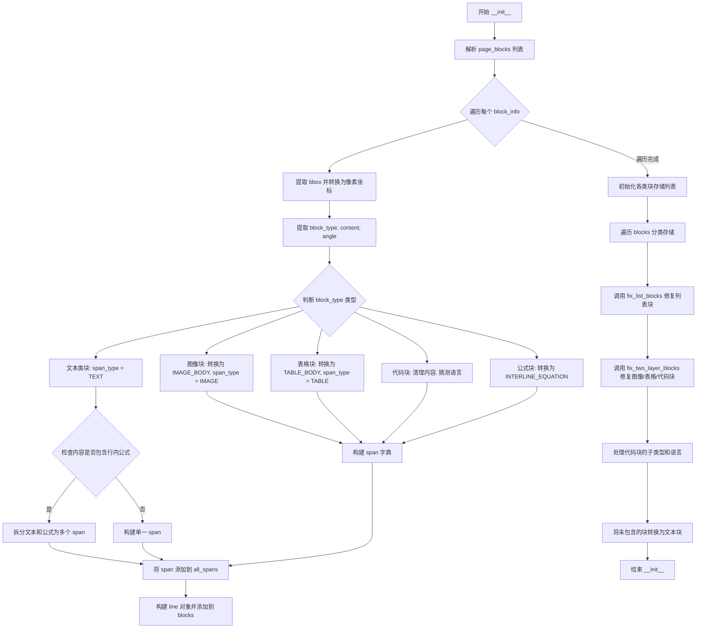

#### 带注释源码

```python
def __init__(self, page_blocks: list, width, height):
    """初始化 MagicModel，解析页面块并分类存储"""
    self.page_blocks = page_blocks

    blocks = []
    self.all_spans = []
    # 解析每个块
    for index, block_info in enumerate(page_blocks):
        block_bbox = block_info["bbox"]
        try:
            # 将归一化坐标转换为像素坐标
            x1, y1, x2, y2 = block_bbox
            x_1, y_1, x_2, y_2 = (
                int(x1 * width),
                int(y1 * height),
                int(x2 * width),
                int(y2 * height),
            )
            # 修正坐标顺序，确保 x1 < x2, y1 < y2
            if x_2 < x_1:
                x_1, x_2 = x_2, x_1
            if y_2 < y_1:
                y_1, y_2 = y_2, y_1
            block_bbox = (x_1, y_1, x_2, y_2)
            block_type = block_info["type"]
            block_content = block_info["content"]
            block_angle = block_info["angle"]
        except Exception as e:
            # 如果解析失败，可能是因为格式不正确，跳过这个块
            logger.warning(f"Invalid block format: {block_info}, error: {e}")
            continue

        span_type = "unknown"
        code_block_sub_type = None
        guess_lang = None

        # 根据 block_type 确定 span_type 和转换后的 block_type
        if block_type in [
            "text", "title", "image_caption", "image_footnote",
            "table_caption", "table_footnote", "code_caption",
            "ref_text", "phonetic", "header", "footer",
            "page_number", "aside_text", "page_footnote", "list"
        ]:
            span_type = ContentType.TEXT
        elif block_type in ["image"]:
            block_type = BlockType.IMAGE_BODY
            span_type = ContentType.IMAGE
        elif block_type in ["table"]:
            block_type = BlockType.TABLE_BODY
            span_type = ContentType.TABLE
        elif block_type in ["code", "algorithm"]:
            block_content = code_content_clean(block_content)
            code_block_sub_type = block_type
            block_type = BlockType.CODE_BODY
            span_type = ContentType.TEXT
            guess_lang = guess_language_by_text(block_content)
        elif block_type in ["equation"]:
            block_type = BlockType.INTERLINE_EQUATION
            span_type = ContentType.INTERLINE_EQUATION

        # code 和 algorithm 类型的块，如果内容中包含行内公式，则需要将块类型切换为algorithm
        switch_code_to_algorithm = False

        # 构建 span 对象
        if span_type in ["image", "table"]:
            span = {
                "bbox": block_bbox,
                "type": span_type,
            }
            if span_type == ContentType.TABLE:
                span["html"] = block_content
        elif span_type in [ContentType.INTERLINE_EQUATION]:
            span = {
                "bbox": block_bbox,
                "type": span_type,
                "content": isolated_formula_clean(block_content),
            }
        else:
            # 文本类块的处理
            if block_content:
                block_content = clean_content(block_content)

            # 检查是否包含行内公式 \(...\) 
            if block_content and block_content.count("\\(") == block_content.count("\\)") and block_content.count("\\(") > 0:
                switch_code_to_algorithm = True

                # 生成包含文本和公式的span列表
                spans = []
                last_end = 0

                # 查找所有公式
                for match in re.finditer(r'\\\((.+?)\\\)', block_content):
                    start, end = match.span()

                    # 添加公式前的文本
                    if start > last_end:
                        text_before = block_content[last_end:start]
                        if text_before.strip():
                            spans.append({
                                "bbox": block_bbox,
                                "type": ContentType.TEXT,
                                "content": text_before
                            })

                    # 添加公式（去除\(和\)）
                    formula = match.group(1)
                    spans.append({
                        "bbox": block_bbox,
                        "type": ContentType.INLINE_EQUATION,
                        "content": formula.strip()
                    })

                    last_end = end

                # 添加最后一个公式后的文本
                if last_end < len(block_content):
                    text_after = block_content[last_end:]
                    if text_after.strip():
                        spans.append({
                            "bbox": block_bbox,
                            "type": ContentType.TEXT,
                            "content": text_after
                        })

                span = spans
            else:
                span = {
                    "bbox": block_bbox,
                    "type": span_type,
                    "content": block_content,
                }

        # 处理span类型并添加到all_spans
        if isinstance(span, dict) and "bbox" in span:
            self.all_spans.append(span)
            spans = [span]
        elif isinstance(span, list):
            self.all_spans.extend(span)
            spans = span
        else:
            raise ValueError(f"Invalid span type: {span_type}, expected dict or list, got {type(span)}")

        # 构造line对象
        if block_type in [BlockType.CODE_BODY]:
            if switch_code_to_algorithm and code_block_sub_type == "code":
                code_block_sub_type = "algorithm"
            line = {"bbox": block_bbox, "spans": spans, "extra": {"type": code_block_sub_type, "guess_lang": guess_lang}}
        else:
            line = {"bbox": block_bbox, "spans": spans}

        blocks.append(
            {
                "bbox": block_bbox,
                "type": block_type,
                "angle": block_angle,
                "lines": [line],
                "index": index,
            }
        )

    # 初始化各类块的存储列表
    self.image_blocks = []
    self.table_blocks = []
    self.interline_equation_blocks = []
    self.text_blocks = []
    self.title_blocks = []
    self.code_blocks = []
    self.discarded_blocks = []
    self.ref_text_blocks = []
    self.phonetic_blocks = []
    self.list_blocks = []
    
    # 遍历解析后的blocks，按类型分类存储
    for block in blocks:
        if block["type"] in [BlockType.IMAGE_BODY, BlockType.IMAGE_CAPTION, BlockType.IMAGE_FOOTNOTE]:
            self.image_blocks.append(block)
        elif block["type"] in [BlockType.TABLE_BODY, BlockType.TABLE_CAPTION, BlockType.TABLE_FOOTNOTE]:
            self.table_blocks.append(block)
        elif block["type"] in [BlockType.CODE_BODY, BlockType.CODE_CAPTION]:
            self.code_blocks.append(block)
        elif block["type"] == BlockType.INTERLINE_EQUATION:
            self.interline_equation_blocks.append(block)
        elif block["type"] == BlockType.TEXT:
            self.text_blocks.append(block)
        elif block["type"] == BlockType.TITLE:
            self.title_blocks.append(block)
        elif block["type"] in [BlockType.REF_TEXT]:
            self.ref_text_blocks.append(block)
        elif block["type"] in [BlockType.PHONETIC]:
            self.phonetic_blocks.append(block)
        elif block["type"] in [BlockType.HEADER, BlockType.FOOTER, BlockType.PAGE_NUMBER, BlockType.ASIDE_TEXT, BlockType.PAGE_FOOTNOTE]:
            self.discarded_blocks.append(block)
        elif block["type"] == BlockType.LIST:
            self.list_blocks.append(block)
        else:
            continue

    # 调用修复函数处理列表块、图像块、表格块、代码块
    self.list_blocks, self.text_blocks, self.ref_text_blocks = fix_list_blocks(self.list_blocks, self.text_blocks, self.ref_text_blocks)
    self.image_blocks, not_include_image_blocks = fix_two_layer_blocks(self.image_blocks, BlockType.IMAGE)
    self.table_blocks, not_include_table_blocks = fix_two_layer_blocks(self.table_blocks, BlockType.TABLE)
    self.code_blocks, not_include_code_blocks = fix_two_layer_blocks(self.code_blocks, BlockType.CODE)
    
    # 处理代码块的子类型和语言猜测
    for code_block in self.code_blocks:
        for block in code_block['blocks']:
            if block['type'] == BlockType.CODE_BODY:
                if len(block["lines"]) > 0:
                    line = block["lines"][0]
                    code_block["sub_type"] = line["extra"]["type"]
                    if code_block["sub_type"] in ["code"]:
                        code_block["guess_lang"] = line["extra"]["guess_lang"]
                    del line["extra"]
                else:
                    code_block["sub_type"] = "code"
                    code_block["guess_lang"] = "txt"

    # 将未包含在两层结构中的块转换为文本块
    for block in not_include_image_blocks + not_include_table_blocks + not_include_code_blocks:
        block["type"] = BlockType.TEXT
        self.text_blocks.append(block)
```


### `MagicModel.get_list_blocks`

获取当前文档页面中的所有列表块（List Blocks），该方法返回在文档解析过程中被识别为列表类型的块集合。

参数： 无

返回值：`list`，返回存储在实例属性 `self.list_blocks` 中的列表块集合，这些块在初始化时通过 `fix_list_blocks` 函数处理关联的文本和引用文本块后形成。

#### 流程图

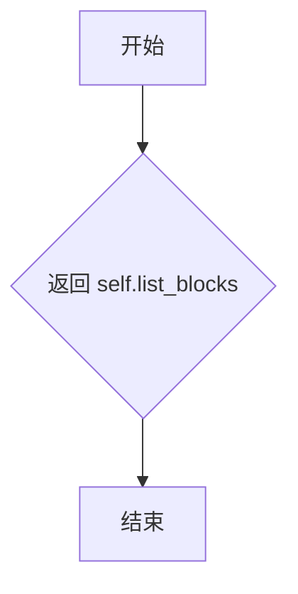

#### 带注释源码

```python
def get_list_blocks(self):
    """
    获取列表块列表
    
    返回在文档解析过程中被识别为列表类型的块集合。
    这些块在 MagicModel 初始化时通过 fix_list_blocks 函数处理，
    将与列表块重叠度大于等于 80% 的文本块和引用文本块关联到列表块中。
    
    Returns:
        list: 列表块集合，每个列表块包含以下结构：
            - bbox: 边界框坐标
            - type: 块类型（BlockType.LIST）
            - angle: 旋转角度
            - lines: 行数据（处理后已删除，转移至 blocks）
            - index: 原始索引
            - blocks: 关联的子块列表
            - sub_type: 主导子块类型（通过众数计算）
    """
    return self.list_blocks
```


### `MagicModel.get_image_blocks`

该方法是一个简单的getter方法，用于获取在`MagicModel`类初始化过程中解析和处理后的图片块列表。该列表包含了图片的主体块、标题块和脚注块，并经过`fix_two_layer_blocks`函数处理以修复两层块结构。

参数：

- `self`：`MagicModel`，隐式参数，表示类的实例本身

返回值：`list`，返回图片块列表，其中每个元素是一个包含`bbox`、`type`、`angle`、`lines`、`index`等字段的字典。如果图片块包含标题或脚注，还会有`blocks`字段构成两层结构。

#### 流程图

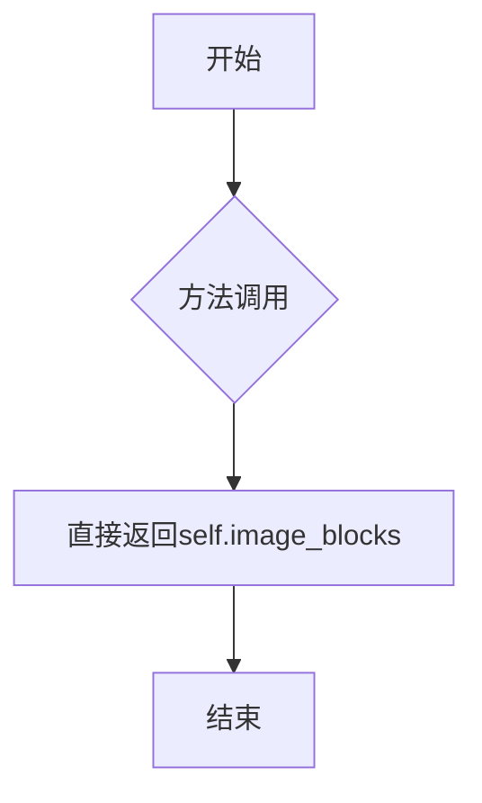

#### 带注释源码

```python
def get_image_blocks(self):
    """
    获取图片块列表
    
    该方法返回在__init__方法中解析并处理后的图片块。
    图片块的类型包括:
    - BlockType.IMAGE_BODY: 图片主体
    - BlockType.IMAGE_CAPTION: 图片标题
    - BlockType.IMAGE_FOOTNOTE: 图片脚注
    
    这些块在初始化时经过fix_two_layer_blocks处理，
    可能形成两层结构（主体+标题+脚注）
    
    Returns:
        list: 图片块列表，每个元素是一个字典，包含以下常见字段:
              - bbox: 边界框坐标 (x1, y1, x2, y2)
              - type: 块类型
              - angle: 旋转角度
              - lines: 行内容列表
              - index: 索引
              - blocks: 子块列表（如果有两层结构）
    """
    return self.image_blocks
```


### `MagicModel.get_table_blocks`

获取当前页面中所有表格块的列表，包括表格主体、表格标题和表格脚注

参数：

- 无

返回值：`list`，返回包含所有表格块的列表，列表中的每个元素都是一个字典，包含表格块的 bbox、type、lines、index 等信息

#### 流程图

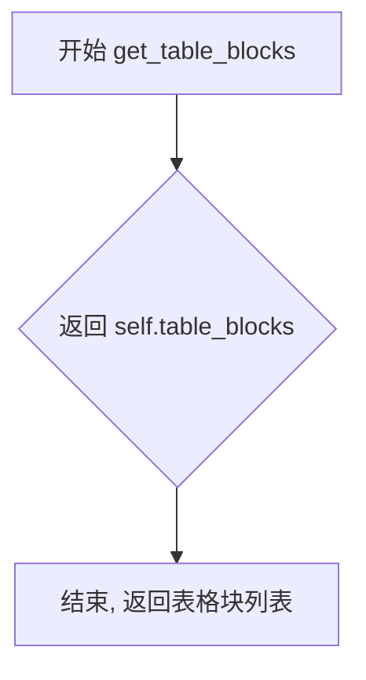

#### 带注释源码

```python
def get_table_blocks(self):
    """
    获取表格块的列表
    
    该方法返回当前页面中所有表格块的列表，包括：
    - 表格主体 (TABLE_BODY)
    - 表格标题 (TABLE_CAPTION)
    - 表格脚注 (TABLE_FOOTNOTE)
    
    这些块在 MagicModel 初始化时通过解析 page_blocks 并根据 block_type 进行分类筛选后填充到 self.table_blocks 中。
    
    Returns:
        list: 包含所有表格块的列表，每个元素是一个字典，包含以下键：
            - bbox: 表格块的边界框坐标 (x1, y1, x2, y2)
            - type: 表格块的类型
            - angle: 表格块的角度
            - lines: 表格块的内容行
            - index: 表格块的索引
    """
    return self.table_blocks
```


### `MagicModel.get_code_blocks`

该方法是 `MagicModel` 类的简单访问器方法，用于获取在初始化阶段解析并存储的代码块列表。该方法直接返回 `self.code_blocks` 属性，该属性在类的 `__init__` 方法中根据块的类型（`CODE_BODY` 或 `CODE_CAPTION`）从所有页面块中筛选并收集而来。

参数： 无

返回值：`list`，返回存储在 `self.code_blocks` 中的代码块列表，每个代码块包含边界框、类型、角度、包含代码行的子块以及可能的子类型和语言猜测信息。

#### 流程图

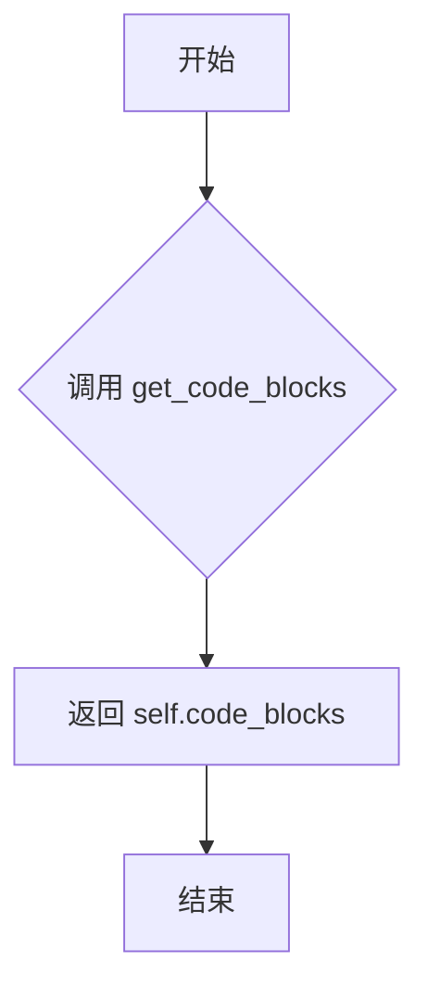

#### 带注释源码

```python
def get_code_blocks(self):
    """
    获取解析出的代码块列表
    
    该方法是一个简单的访问器（getter），用于返回在 __init__ 方法中
    根据块类型筛选出的代码块。代码块在初始化时通过检查 block['type']
    是否属于 [BlockType.CODE_BODY, BlockType.CODE_CAPTION] 来收集。
    
    Returns:
        list: 代码块列表，每个代码块是一个字典，包含以下键：
            - bbox: 边界框坐标 (x1, y1, x2, y2)
            - type: 块类型 (CODE_BODY 或 CODE_CAPTION)
            - angle: 旋转角度
            - lines: 代码行列表，每行包含 spans 和 bbox
            - index: 块索引
            - sub_type: 代码子类型 ('code' 或 'algorithm')
            - guess_lang: 猜测的编程语言
            - blocks: 两层结构中的子块列表（包含 body, caption, footnote）
    """
    return self.code_blocks
```


### `MagicModel.get_ref_text_blocks`

获取在文档解析过程中识别出的引用文本块（如参考文献、引用等），这些块在初始化时根据块类型被筛选并存储到 `ref_text_blocks` 列表中。

参数：

- `self`：`MagicModel` 实例，隐式参数，指向当前 MagicModel 对象

返回值：`list`，返回存储在 `self.ref_text_blocks` 中的引用文本块列表，每个元素包含块的位置信息（bbox）、类型、角度、包含的行数据以及原始索引等完整信息

#### 流程图

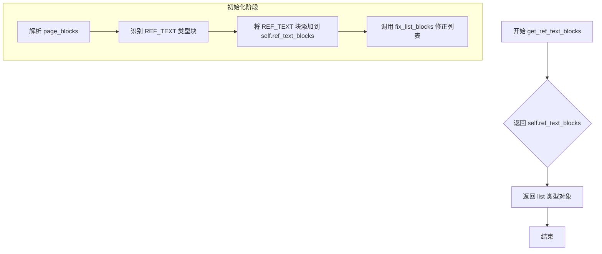

#### 带注释源码

```python
def get_ref_text_blocks(self):
    """
    获取引用文本块列表
    
    该方法返回在MagicModel初始化过程中被识别为引用文本类型的块。
    引用文本块（ref_text）通常包括文档中的参考文献、引用文献等内容，
    在__init__方法中通过块类型过滤得出。
    
    Returns:
        list: 引用文本块列表，每个块包含以下结构：
            - bbox: 块的边界框坐标 (x1, y1, x2, y2)
            - type: 块类型 (BlockType.REF_TEXT)
            - angle: 块的角度
            - lines: 块包含的行数据列表
            - index: 块的原始索引
    """
    return self.ref_text_blocks
```


### `MagicModel.get_phonetic_blocks`

该方法是一个简单的getter访问器，用于获取在初始化阶段筛选出的音标（phonetic）类型块。它直接返回实例属性`self.phonetic_blocks`，该属性在`MagicModel`构造函数中被填充，包含了所有type为`BlockType.PHONETIC`的文档块。

参数： 无

返回值：`list[dict]`，返回音标块列表。每个元素为一个字典，包含`bbox`（边界框）、`type`（块类型）、`angle`（角度）、`lines`（行内容）和`index`（索引）等字段。

#### 流程图

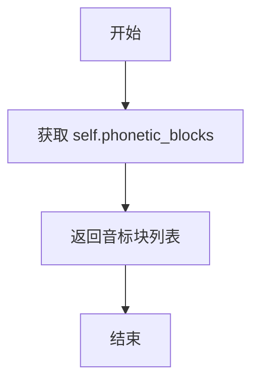

#### 带注释源码

```python
def get_phonetic_blocks(self):
    """
    获取音标块列表
    
    该方法返回在__init__阶段筛选出的所有音标(phonetic)类型的块。
    筛选逻辑位于__init__方法中，当block["type"] == BlockType.PHONETIC时
    会将对应block添加到self.phonetic_blocks列表中。
    
    Returns:
        list: 音标块列表，每个元素为包含bbox、type、angle、lines、index等键的字典
    """
    return self.phonetic_blocks
```


### `MagicModel.get_title_blocks`

该方法是一个简单的getter访问器，用于获取在类初始化过程中已分类并存储的标题块（title_blocks）列表。该方法是MagicModel类对外提供的多个块获取方法之一，用于返回被识别为标题类型的页面块。

参数：
- 该方法无显式参数（隐含参数`self`为类实例自身）

返回值：`list`，返回存储在类实例中的`title_blocks`列表，其中每个元素代表一个被识别为标题类型的块（block），包含该块的边界框（bbox）、类型（type）、角度（angle）、行内容（lines）以及索引（index）等信息。

#### 流程图

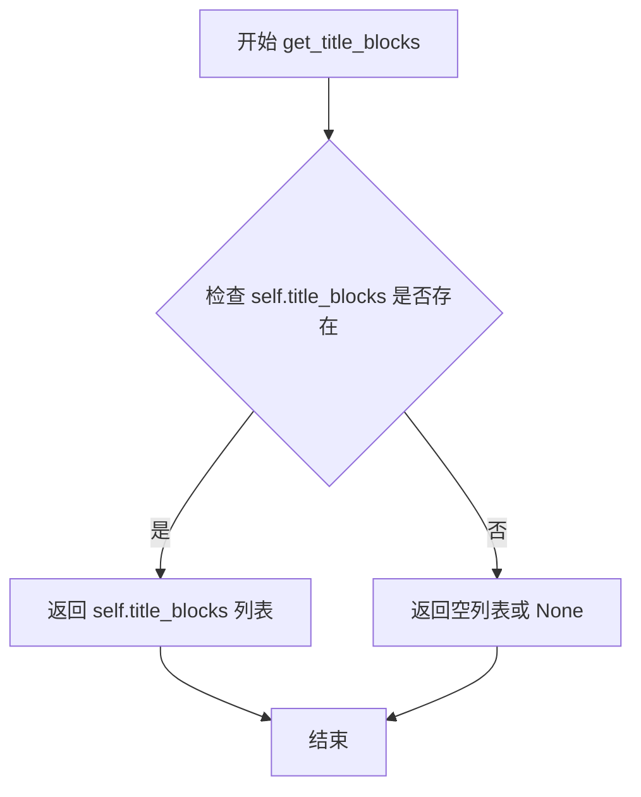

#### 带注释源码

```python
def get_title_blocks(self):
    """
    获取文档中被识别为标题类型的块列表
    
    该方法返回在 __init__ 初始化阶段被分类为 BlockType.TITLE 的所有块。
    这些块是在解析 page_blocks 时，根据 block_type 字段被识别为 "title" 的块。
    
    返回值:
        list: 标题块列表，每个元素为一个 dict，包含以下键值：
            - bbox: 块的边界框坐标 (x1, y1, x2, y2)
            - type: 块类型，值为 BlockType.TITLE
            - angle: 块的旋转角度
            - lines: 块内包含的行数据列表
            - index: 块在原始列表中的索引位置
    """
    return self.title_blocks
```


### `MagicModel.get_text_blocks`

该方法用于获取文档中所有文本类型的块（text blocks），在MagicModel类初始化时已经对page_blocks进行了分类处理，将类型为BlockType.TEXT的块放入了text_blocks列表中，同时也将未能正确归类到image、table、code的块重新标记为TEXT类型并加入该列表。

参数：无（仅包含self参数）

返回值：`list`，返回文档中所有的文本块列表，每个元素包含bbox、type、angle、lines、index等属性。

#### 流程图

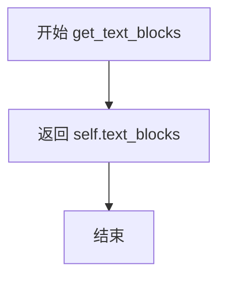

#### 带注释源码

```python
def get_text_blocks(self):
    """
    获取文档中的文本块列表
    
    Returns:
        list: 包含所有文本块的列表，每个文本块是一个字典，
              具有 bbox、type、angle、lines、index 等属性
    """
    return self.text_blocks
```


### `MagicModel.get_interline_equation_blocks`

获取行间公式块的列表

参数：

- 无

返回值：`list`，返回行间公式块列表，包含所有被识别为行间公式（BlockType.INTERLINE_EQUATION）的页面块，每个块包含bbox、type、angle、lines和index信息

#### 流程图

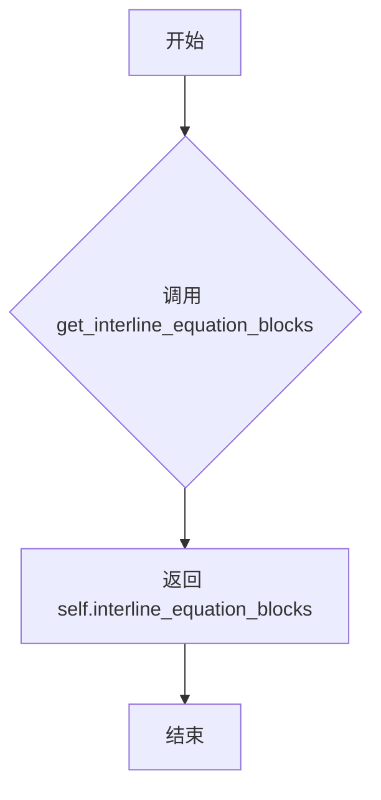

#### 带注释源码

```python
def get_interline_equation_blocks(self):
    """
    获取行间公式块列表
    
    返回在__init__方法中被识别并分类为BlockType.INTERLINE_EQUATION的所有页面块。
    这些块在初始化时通过遍历page_blocks，根据block_type是否为'equation'进行分类收集。
    
    返回:
        list: 行间公式块列表，每个元素是一个包含以下键的字典:
            - bbox: 块的边界框坐标 (x1, y1, x2, y2)
            - type: 块类型 (BlockType.INTERLINE_EQUATION)
            - angle: 块的旋转角度
            - lines: 包含spans的行列表
            - index: 块在原始列表中的索引
    """
    return self.interline_equation_blocks
```


### `MagicModel.get_discarded_blocks`

该方法用于获取在文档解析过程中被丢弃的页面辅助元素块（如页眉、页脚、页码、旁注和脚注等），这些块通常不包含文档的核心内容，属于页面版式的辅助信息。

参数：无

返回值：`list`，返回被丢弃的块列表，列表中每个元素为一个包含 `bbox`、`type`、`angle`、`lines`、`index` 等属性的字典。

#### 流程图

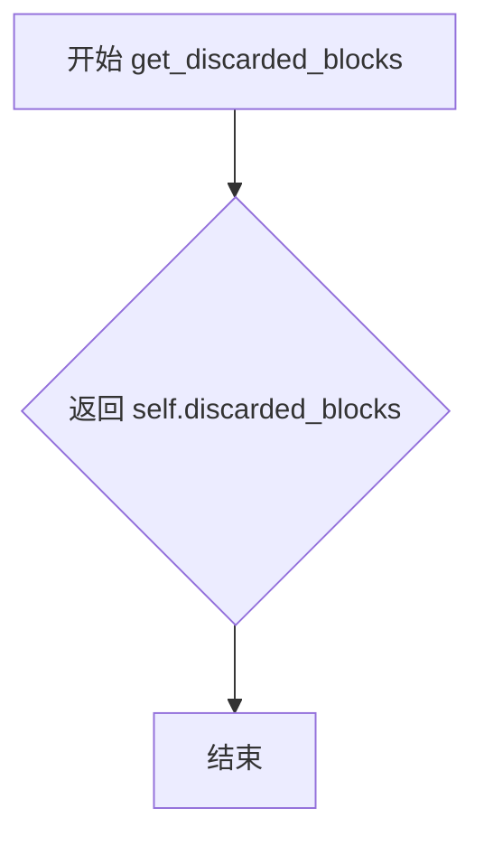

#### 带注释源码

```python
def get_discarded_blocks(self):
    """
    获取被丢弃的块列表
    
    这些块包括：
    - HEADER: 页眉
    - FOOTER: 页脚
    - PAGE_NUMBER: 页码
    - ASIDE_TEXT: 旁注
    - PAGE_FOOTNOTE: 脚注
    
    Returns:
        list: 被丢弃的块列表，每个元素为包含以下键的字典:
            - bbox: 块的边界框坐标 (x1, y1, x2, y2)
            - type: 块类型
            - angle: 块的旋转角度
            - lines: 块内的行数据
            - index: 块在原始列表中的索引
    """
    return self.discarded_blocks
```


### `MagicModel.get_all_spans`

该方法是 `MagicModel` 类的简单访问器方法，用于返回在初始化阶段收集和构建的所有文档元素 spans 列表，这些 spans 包含了文本、图像、表格、代码、公式等各类内容的边界框、类型和内容信息。

参数： 无

返回值：`list`，返回存储在 `self.all_spans` 中的所有 span 元素的列表，每个 span 是一个字典，包含 `bbox`（边界框）、`type`（内容类型）等字段。

#### 流程图

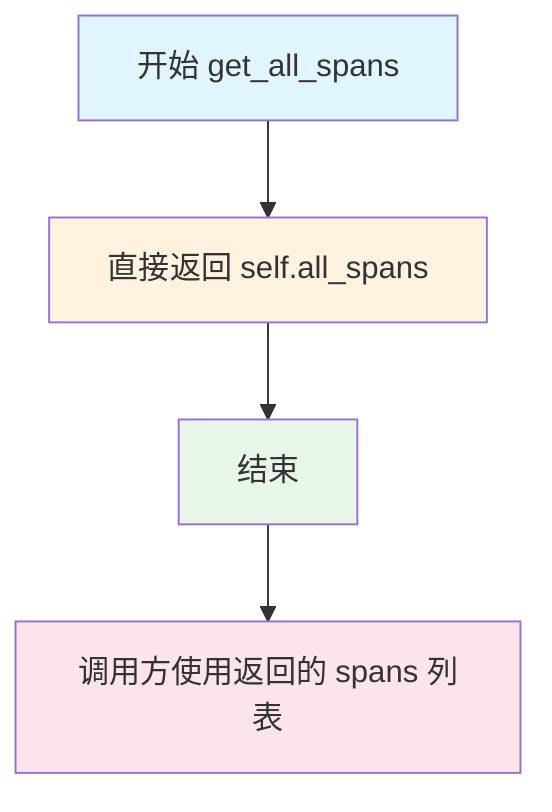

#### 带注释源码

```python
def get_all_spans(self):
    """
    获取所有 span 元素的列表
    
    该方法是 MagicModel 类的简单访问器方法，用于返回在 __init__ 方法中
    通过解析 page_blocks 构建的所有 span 元素。这些 span 包含了文档中
    各种内容类型的详细信息，如文本、图像、表格、代码、公式等。
    
    Returns:
        list: 包含所有 span 的列表，每个 span 是一个字典，包含以下常见字段：
              - bbox: 边界框坐标 (x1, y1, x2, y2)
              - type: 内容类型 (TEXT, IMAGE, TABLE, INLINE_EQUATION 等)
              - content: 文本内容 (对于文本类型)
              - html: HTML 内容 (对于表格类型)
    
    Example:
        # 使用示例
        magic_model = MagicModel(page_blocks, width, height)
        all_spans = magic_model.get_all_spans()
        for span in all_spans:
            print(f"Type: {span.get('type')}, BBox: {span.get('bbox')}")
    """
    return self.all_spans
```

## 关键组件


### MagicModel 类

核心文档布局分析与处理类，负责解析PDF页面块（page_blocks），将其分类为图像、表格、代码、文本、公式等不同类型，并构建两级块结构（body + caption + footnote）。该类实现了多种类型块的getter方法，支持获取所有解析后的页面元素。

### 块解析与分类引擎

在`__init__`方法中实现的核心逻辑，遍历page_blocks列表，根据block_type将原始数据转换为标准化的内部表示。代码包含对15+种文本类型（text、title、caption等）、图像、表格、代码、公式等类型的映射处理，并处理坐标转换（归一化坐标到像素坐标）和异常捕获。

### 文本与公式混合处理组件

通过正则表达式`re.finditer(r'\\\((.+?)\\\)', block_content)`识别行内公式`\(...\)`，将包含公式的文本块拆分为多个span，分别标记为TEXT或INLINE_EQUATION类型。实现了switch_code_to_algorithm逻辑，当代码块中包含行内公式时自动将块类型切换为algorithm。

### 两层块结构修复器（fix_two_layer_blocks函数）

处理图像、表格、代码块的caption（标题）和footnote（注脚）关联逻辑。函数通过`get_type_blocks`获取body-caption-body-footnote的候选关联，然后进行三步修复：(1)过滤位置不合规的footnote，(2)重新分配未匹配的footnote到最近的body，(3)提取caption/footnote列表中间断开的元素作为普通文本块处理。

### 列表块修复器（fix_list_blocks函数）

解决列表元素与文本块重叠问题。通过`calculate_overlap_area_in_bbox1_area_ratio`计算重叠面积比例，当重叠率≥0.8时将文本块移入列表块的blocks列表。最后使用众数算法统计列表内子块的type，确定list_block的sub_type。

### 代码内容清理器（code_content_clean函数）

移除Markdown代码块标记（三个反引号```），处理代码块开头和结尾的标记行，仅保留实际代码内容。支持处理单行和多行代码块格式。

### 孤立公式清理器（isolated_formula_clean函数）

处理行间公式，移除LaTeX行间公式标记`\[`和`\]`，返回纯净的公式内容。

### 内容清洗器（clean_content函数）

将行内公式标记`\[...\]`转换为Markdown链接格式``，统一公式表示方式。

### 主客体关联包装器（__tie_up_category_by_index函数）

基于索引的块关联封装函数，调用`reduct_overlap`和`tie_up_category_by_index`实现主体（如image_body）与客体（如image_caption、image_footnote）的匹配。

### 类型块获取器（get_type_blocks函数）

通用函数，用于获取带标题和注脚的特定类型块（如image、table、code），返回包含body、caption_list、footnote_list的结构化数据。

### 块分类存储属性

MagicModel类中定义的多个列表属性：`image_blocks`、`table_blocks`、`code_blocks`、`text_blocks`、`title_blocks`、`list_blocks`、`ref_text_blocks`、`phonetic_blocks`、`interline_equation_blocks`、`discarded_blocks`，分别存储不同类型的解析结果块。

### 坐标边界框处理组件

在解析循环中实现，处理归一化坐标(x1,y1,x2,y2)到像素坐标的转换，包含坐标交换逻辑（确保x1<x2, y1<y2）和异常处理。


## 问题及建议


### 已知问题

-   **魔法数字与硬编码值**：代码中存在多个硬编码的阈值和字符串，如重叠率判断 `>= 0.8`、各种 block_type 的字符串字面量（如 `"code_body"`, `"image_body"` 等），这些值散落在多处不利于维护和配置。
-   **函数职责过于庞杂**：`MagicModel.__init__` 方法承担了数据解析、块分类、修复处理等多重职责，代码行数过长（超过 200 行），违反单一职责原则。
-   **重复代码逻辑**：`fix_two_layer_blocks` 函数中对 image、table、code 三类块的处理逻辑高度相似，仅在字符串拼接处有所不同，未进行有效抽象。
-   **类型注解不完整**：部分函数参数和返回值缺少类型注解，如 `fix_list_blocks`、`fix_two_layer_blocks` 等函数的返回类型未明确标注。
-   **错误处理过于简单**：异常捕获时仅记录警告后 `continue`，可能导致部分有效数据被无声忽略，且未对 `block_info` 的必需字段进行预校验。
-   **数据结构使用随意**：大量使用普通字典而非 `dataclass` 或 `TypedDict`，导致数据结构定义模糊，字段访问缺乏 IDE 提示和类型安全保障。
-   **全局函数设计不合理**：多个本应作为类方法或工具函数的全局函数（如 `clean_content`、`code_content_clean`）暴露在模块顶层，增加了命名空间污染和潜在命名冲突风险。
-   **注释不足或过时**：关键的业务逻辑（如公式解析、列表块修复策略）缺乏必要的注释说明，部分注释已失效（如 `# 第三步` 与实际代码顺序不符）。
-   **性能隐患**：在 `__init__` 中多次遍历 `blocks` 列表，使用 `filter` + `map` 组合而非更高效的实现；在 `fix_list_blocks` 中使用 `list.remove` 导致 O(n) 时间复杂度。
-   **边界条件处理不严**：对坐标 bbox 的处理（如 `x_2 < x_1` 的交换）缺乏统一的工具函数，代码重复且易遗漏边界情况。

### 优化建议

-   **抽取配置与常量**：将所有 block_type 字符串、重叠阈值等常量提取为枚举类或配置常量，如定义 `BlockTypeEnum` 或 `Config` 类集中管理。
-   **拆分巨型构造函数**：将 `__init__` 中的逻辑拆分为多个私有方法，如 `_parse_blocks()`、`_classify_blocks()`、`_fix_blocks()` 等，提升可读性和可测试性。
-   **抽象重复逻辑**：对 `fix_two_layer_blocks` 中的共性逻辑进行函数抽象，传入 block_type 参数以消除重复代码。
-   **完善类型注解**：为所有函数补充完整的类型注解，采用 `TypedDict` 定义块的数据结构，提高代码的可维护性。
-   **改进错误处理**：对必需的字段进行预校验，区分致命错误和可忽略的错误，对无效数据采用更明确的处理策略（如记录到专门的日志或单独收集）。
-   **引入数据结构**：使用 `@dataclass` 或 `TypedDict` 定义块的结构化类型，用数据类替代字典字面量，提升代码清晰度。
-   **重构全局函数**：将工具性函数归入工具模块（如 `mineru.utils.blocks`），或定义为类的私有方法，避免顶层全局函数泛滥。
-   **补充关键注释**：为公式解析逻辑、块修复策略、分类规则等核心逻辑补充清晰的注释，说明业务背景和处理意图。
-   **优化性能**：使用集合（set）替代列表进行成员检查和去重，避免在循环中直接修改列表（用列表推导式替代 `list.remove`），考虑使用生成器处理大数据量场景。
-   **统一边界处理**：提取坐标处理逻辑为工具函数，如 `normalize_bbox()`，确保所有 bbox 处理遵循一致的规则。


## 其它


### 1. 一段话描述

MagicModel是一个文档布局分析模型，用于解析PDF或文档页面中的各种内容块（文本、标题、图像、表格、代码、公式等），将其分类整理为结构化数据，并建立caption、footnote与主体内容之间的关联关系，同时支持列表块的修复和多层嵌套块的处理。

### 2. 文件的整体运行流程

```
┌─────────────────────────────────────────────────────────────────────────────┐
│                           MagicModel 初始化流程                              │
└─────────────────────────────────────────────────────────────────────────────┘
                                    │
                                    ▼
┌─────────────────────────────────────────────────────────────────────────────┐
│  1. 接收输入: page_blocks(页面块列表), width, height                        │
└─────────────────────────────────────────────────────────────────────────────┘
                                    │
                                    ▼
┌─────────────────────────────────────────────────────────────────────────────┐
│  2. 遍历每个block:                                                           │
│     - 解析bbox坐标并进行边界校正                                              │
│     - 根据block_type设置span_type                                           │
│     - 处理特殊内容(代码/公式/图像/表格)                                        │
│     - 构建spans列表(含内联公式解析)                                           │
│     - 构造line对象                                                           │
└─────────────────────────────────────────────────────────────────────────────┘
                                    │
                                    ▼
┌─────────────────────────────────────────────────────────────────────────────┐
│  3. 分类存储: 将blocks按类型分别存储到对应列表                                │
│     (image_blocks, table_blocks, code_blocks, text_blocks等)                │
└─────────────────────────────────────────────────────────────────────────────┘
                                    │
                                    ▼
┌─────────────────────────────────────────────────────────────────────────────┐
│  4. 修复处理:                                                                │
│     - fix_list_blocks: 修复列表块中的文本关联                                │
│     - fix_two_layer_blocks: 修复图像/表格/代码的两层结构                     │
│         (处理caption和footnote的位置关系)                                    │
└─────────────────────────────────────────────────────────────────────────────┘
                                    │
                                    ▼
┌─────────────────────────────────────────────────────────────────────────────┐
│  5. 提取code子类型和语言: 为code_blocks设置sub_type和guess_lang              │
└─────────────────────────────────────────────────────────────────────────────┘
                                    │
                                    ▼
┌─────────────────────────────────────────────────────────────────────────────┐
│  6. 未匹配blocks降级处理: 将未纳入两层结构的caption/footnote降级为text_block │
└─────────────────────────────────────────────────────────────────────────────┘
```

### 3. 类的详细信息

#### 3.1 类名: MagicModel

#### 3.2 类字段

| 名称 | 类型 | 描述 |
|------|------|------|
| page_blocks | list | 输入的原始页面块列表 |
| all_spans | list | 所有解析后的span列表 |
| image_blocks | list | 图像相关块列表(含body/caption/footnote) |
| table_blocks | list | 表格相关块列表(含body/caption/footnote) |
| code_blocks | list | 代码相关块列表(含body/caption) |
| text_blocks | list | 文本块列表 |
| title_blocks | list | 标题块列表 |
| list_blocks | list | 列表块列表 |
| ref_text_blocks | list | 引用文本块列表 |
| phonetic_blocks | list | 音标块列表 |
| interline_equation_blocks | list | 行间公式块列表 |
| discarded_blocks | list | 丢弃的块列表(页眉/页脚/页码等) |

#### 3.3 类方法

##### __init__

| 项目 | 详情 |
|------|------|
| 名称 | __init__ |
| 参数 | page_blocks: list, width: int, height: int |
| 参数描述 | page_blocks为页面块列表，width和height为页面尺寸 |
| 返回值类型 | None |
| 返回值描述 | 初始化MagicModel对象并完成所有解析和分类工作 |
| mermaid流程图 | 见下方 |
| 带注释源码 | 见下方 |

```mermaid
flowchart TD
    A[开始__init__] --> B[遍历page_blocks]
    B --> C{解析block}
    C -->|成功| D[确定block_type和span_type]
    C -->|失败| E[记录警告日志并跳过]
    D --> F{span_type类型}
    F -->|image/table| G[构建span含html]
    F -->|INTERLINE_EQUATION| H[构建span含content]
    F -->|TEXT且含内联公式| I[解析内联公式生成spans列表]
    F -->|TEXT普通| J[构建普通span]
    G --> K[添加span到all_spans]
    H --> K
    I --> K
    J --> K
    K --> L[构建line对象]
    L --> M[添加到blocks列表]
    M --> N{遍历结束?}
    N -->|否| B
    N -->|是| O[按type分类blocks]
    O --> P[fix_list_blocks修复列表]
    P --> Q[fix_two_layer_blocks修复两层结构]
    Q --> R[提取code子类型和语言]
    R --> S[降级未匹配blocks为text]
    S --> T[结束__init__]
```

```python
def __init__(self, page_blocks: list, width, height):
    """初始化MagicModel，解析并分类所有页面块"""
    self.page_blocks = page_blocks
    
    blocks = []
    self.all_spans = []
    
    # 遍历每个块进行解析
    for index, block_info in enumerate(page_blocks):
        block_bbox = block_info["bbox"]
        try:
            # 坐标转换和边界校正
            x1, y1, x2, y2 = block_bbox
            x_1, y_1, x_2, y_2 = (
                int(x1 * width),
                int(y1 * height),
                int(x2 * width),
                int(y2 * height),
            )
            # 交换确保x1<x2, y1<y2
            if x_2 < x_1:
                x_1, x_2 = x_2, x_1
            if y_2 < y_1:
                y_1, y_2 = y_2, y_1
            block_bbox = (x_1, y_1, x_2, y_2)
            
            block_type = block_info["type"]
            block_content = block_info["content"]
            block_angle = block_info["angle"]
        except Exception as e:
            # 格式解析失败时记录警告并跳过
            logger.warning(f"Invalid block format: {block_info}, error: {e}")
            continue
        
        # 根据block_type确定span_type
        span_type = "unknown"
        code_block_sub_type = None
        guess_lang = None
        
        if block_type in [...]:  # 文本类类型
            span_type = ContentType.TEXT
        elif block_type in ["image"]:
            block_type = BlockType.IMAGE_BODY
            span_type = ContentType.IMAGE
        elif block_type in ["table"]:
            block_type = BlockType.TABLE_BODY
            span_type = ContentType.TABLE
        elif block_type in ["code", "algorithm"]:
            # 清理代码内容并猜测语言
            block_content = code_content_clean(block_content)
            code_block_sub_type = block_type
            block_type = BlockType.CODE_BODY
            span_type = ContentType.TEXT
            guess_lang = guess_language_by_text(block_content)
        elif block_type in ["equation"]:
            block_type = BlockType.INTERLINE_EQUATION
            span_type = ContentType.INTERLINE_EQUATION
        
        # 构建span对象
        if span_type in ["image", "table"]:
            span = {
                "bbox": block_bbox,
                "type": span_type,
            }
            if span_type == ContentType.TABLE:
                span["html"] = block_content
        elif span_type == ContentType.INTERLINE_EQUATION:
            span = {
                "bbox": block_bbox,
                "type": span_type,
                "content": isolated_formula_clean(block_content),
            }
        else:
            # 处理文本内容，包括内联公式解析
            if block_content:
                block_content = clean_content(block_content)
            
            # 检测并解析内联公式 \(...\) 
            if block_content and block_content.count("\\(") == block_content.count("\\)") and block_content.count("\\(") > 0:
                spans = []
                last_end = 0
                for match in re.finditer(r'\\\((.+?)\\\)', block_content):
                    start, end = match.span()
                    if start > last_end:
                        text_before = block_content[last_end:start]
                        if text_before.strip():
                            spans.append({
                                "bbox": block_bbox,
                                "type": ContentType.TEXT,
                                "content": text_before
                            })
                    formula = match.group(1)
                    spans.append({
                        "bbox": block_bbox,
                        "type": ContentType.INLINE_EQUATION,
                        "content": formula.strip()
                    })
                    last_end = end
                if last_end < len(block_content):
                    text_after = block_content[last_end:]
                    if text_after.strip():
                        spans.append({
                            "bbox": block_bbox,
                            "type": ContentType.TEXT,
                            "content": text_after
                        })
                span = spans
            else:
                span = {
                    "bbox": block_bbox,
                    "type": span_type,
                    "content": block_content,
                }
        
        # 添加span到all_spans
        if isinstance(span, dict) and "bbox" in span:
            self.all_spans.append(span)
            spans = [span]
        elif isinstance(span, list):
            self.all_spans.extend(span)
            spans = span
        else:
            raise ValueError(f"Invalid span type: {span_type}")
        
        # 构造line对象
        if block_type in [BlockType.CODE_BODY]:
            line = {"bbox": block_bbox, "spans": spans, "extra": {"type": code_block_sub_type, "guess_lang": guess_lang}}
        else:
            line = {"bbox": block_bbox, "spans": spans}
        
        blocks.append({
            "bbox": block_bbox,
            "type": block_type,
            "angle": block_angle,
            "lines": [line],
            "index": index,
        })
    
    # 按类型分类存储blocks
    self.image_blocks = []
    self.table_blocks = []
    self.interline_equation_blocks = []
    self.text_blocks = []
    self.title_blocks = []
    self.code_blocks = []
    self.discarded_blocks = []
    self.ref_text_blocks = []
    self.phonetic_blocks = []
    self.list_blocks = []
    
    for block in blocks:
        if block["type"] in [...]:  # 分类逻辑
            ...
    
    # 修复列表和两层结构
    self.list_blocks, self.text_blocks, self.ref_text_blocks = fix_list_blocks(...)
    self.image_blocks, not_include_image_blocks = fix_two_layer_blocks(self.image_blocks, BlockType.IMAGE)
    self.table_blocks, not_include_table_blocks = fix_two_layer_blocks(self.table_blocks, BlockType.TABLE)
    self.code_blocks, not_include_code_blocks = fix_two_layer_blocks(self.code_blocks, BlockType.CODE)
    
    # 提取code子类型
    for code_block in self.code_blocks:
        for block in code_block['blocks']:
            if block['type'] == BlockType.CODE_BODY:
                if len(block["lines"]) > 0:
                    line = block["lines"][0]
                    code_block["sub_type"] = line["extra"]["type"]
                    if code_block["sub_type"] in ["code"]:
                        code_block["guess_lang"] = line["extra"]["guess_lang"]
                    del line["extra"]
                else:
                    code_block["sub_type"] = "code"
                    code_block["guess_lang"] = "txt"
    
    # 降级未匹配的blocks
    for block in not_include_image_blocks + not_include_table_blocks + not_include_code_blocks:
        block["type"] = BlockType.TEXT
        self.text_blocks.append(block)
```

##### get_list_blocks

| 项目 | 详情 |
|------|------|
| 名称 | get_list_blocks |
| 参数 | 无 |
| 参数描述 | 无 |
| 返回值类型 | list |
| 返回值描述 | 返回解析后的列表块列表 |

##### get_image_blocks

| 项目 | 详情 |
|------|------|
| 名称 | get_image_blocks |
| 参数 | 无 |
| 参数描述 | 无 |
| 返回值类型 | list |
| 返回值描述 | 返回解析后的图像块列表 |

##### get_table_blocks

| 项目 | 详情 |
|------|------|
| 名称 | get_table_blocks |
| 参数 | 无 |
| 参数描述 | 无 |
| 返回值类型 | list |
| 返回值描述 | 返回解析后的表格块列表 |

##### get_code_blocks

| 项目 | 详情 |
|------|------|
| 名称 | get_code_blocks |
| 参数 | 无 |
| 参数描述 | 无 |
| 返回值类型 | list |
| 返回值描述 | 返回解析后的代码块列表 |

##### get_ref_text_blocks

| 项目 | 详情 |
|------|------|
| 名称 | get_ref_text_blocks |
| 参数 | 无 |
| 参数描述 | 无 |
| 返回值类型 | list |
| 返回值描述 | 返回解析后的引用文本块列表 |

##### get_phonetic_blocks

| 项目 | 详情 |
|------|------|
| 名称 | get_phonetic_blocks |
| 参数 | 无 |
| 参数描述 | 无 |
| 返回值类型 | list |
| 返回值描述 | 返回解析后的音标块列表 |

##### get_title_blocks

| 项目 | 详情 |
|------|------|
| 名称 | get_title_blocks |
| 参数 | 无 |
| 参数描述 | 无 |
| 返回值类型 | list |
| 返回值描述 | 返回解析后的标题块列表 |

##### get_text_blocks

| 项目 | 详情 |
|------|------|
| 名称 | get_text_blocks |
| 参数 | 无 |
| 参数描述 | 无 |
| 返回值类型 | list |
| 返回值描述 | 返回解析后的文本块列表 |

##### get_interline_equation_blocks

| 项目 | 详情 |
|------|------|
| 名称 | get_interline_equation_blocks |
| 参数 | 无 |
| 参数描述 | 无 |
| 返回值类型 | list |
| 返回值描述 | 返回解析后的行间公式块列表 |

##### get_discarded_blocks

| 项目 | 详情 |
|------|------|
| 名称 | get_discarded_blocks |
| 参数 | 无 |
| 参数描述 | 无 |
| 返回值类型 | list |
| 返回值描述 | 返回解析后的丢弃块列表(页眉/页脚/页码等) |

##### get_all_spans

| 项目 | 详情 |
|------|------|
| 名称 | get_all_spans |
| 参数 | 无 |
| 参数描述 | 无 |
| 返回值类型 | list |
| 返回值描述 | 返回所有解析后的span列表 |

#### 3.4 全局变量

本文件无全局变量。

#### 3.5 全局函数

##### isolated_formula_clean

| 项目 | 详情 |
|------|------|
| 名称 | isolated_formula_clean |
| 参数 | txt: str |
| 参数描述 | 待清理的行间公式文本 |
| 返回值类型 | str |
| 返回值描述 | 移除行间公式标记\[\]后的纯净LaTeX内容 |
| 带注释源码 | 见下方 |

```python
def isolated_formula_clean(txt):
    """清理行间公式内容，移除\[和\]标记"""
    latex = txt[:]
    if latex.startswith("\\["): 
        latex = latex[2:]
    if latex.endswith("\\]"): 
        latex = latex[:-2]
    latex = latex.strip()
    return latex
```

##### code_content_clean

| 项目 | 详情 |
|------|------|
| 名称 | code_content_clean |
| 参数 | content: str |
| 参数描述 | 待清理的代码内容，可能包含Markdown代码块标记 |
| 返回值类型 | str |
| 返回值描述 | 移除Markdown代码块开始和结束标记后的代码内容 |
| 带注释源码 | 见下方 |

```python
def code_content_clean(content):
    """清理代码内容，移除Markdown代码块的开始和结束标记"""
    if not content:
        return ""
    
    lines = content.splitlines()
    start_idx = 0
    end_idx = len(lines)
    
    # 移除开头的三个反引号
    if lines and lines[0].startswith("```"):
        start_idx = 1
    
    # 移除结尾的三个反引号
    if lines and end_idx > start_idx and lines[end_idx - 1].strip() == "```":
        end_idx -= 1
    
    # 合并有效行
    if start_idx < end_idx:
        return "\n".join(lines[start_idx:end_idx]).strip()
    return ""
```

##### clean_content

| 项目 | 详情 |
|------|------|
| 名称 | clean_content |
| 参数 | content: str |
| 参数描述 | 待清理的文本内容 |
| 返回值类型 | str |
| 返回值描述 | 将行间公式标记\[...\]转换为[...]格式 |
| 带注释源码 | 见下方 |

```python
def clean_content(content):
    """将行间公式\[x\]转换为[x]格式"""
    if content and content.count("\\[") == content.count("\\]") and content.count("\\[") > 0:
        def replace_pattern(match):
            inner_content = match.group(1)
            return f"[{inner_content}]"
        
        pattern = r'\\\[(.*?)\\\]'
        content = re.sub(pattern, replace_pattern, content)
    
    return content
```

##### __tie_up_category_by_index

| 项目 | 详情 |
|------|------|
| 名称 | __tie_up_category_by_index |
| 参数 | blocks: list, subject_block_type: str, object_block_type: str |
| 参数描述 | blocks为块列表，subject_block_type为主体块类型，object_block_type为客体块类型 |
| 返回值类型 | dict |
| 返回值描述 | 返回主体与客体块的关联结果 |
| 带注释源码 | 见下方 |

```python
def __tie_up_category_by_index(blocks, subject_block_type, object_block_type):
    """基于index的主客体关联包装函数"""
    def get_subjects():
        # 获取主体对象列表
        return reduct_overlap(
            list(
                map(
                    lambda x: {"bbox": x["bbox"], "lines": x["lines"], "index": x["index"], "angle": x["angle"]},
                    filter(
                        lambda x: x["type"] == subject_block_type,
                        blocks,
                    ),
                )
            )
        )
    
    def get_objects():
        # 获取客体对象列表
        return reduct_overlap(
            list(
                map(
                    lambda x: {"bbox": x["bbox"], "lines": x["lines"], "index": x["index"], "angle": x["angle"]},
                    filter(
                        lambda x: x["type"] == object_block_type,
                        blocks,
                    ),
                )
            )
        )
    
    # 调用通用方法进行关联
    return tie_up_category_by_index(
        get_subjects,
        get_objects,
        object_block_type=object_block_type
    )
```

##### get_type_blocks

| 项目 | 详情 |
|------|------|
| 名称 | get_type_blocks |
| 参数 | blocks: list, block_type: Literal["image", "table", "code"] |
| 参数描述 | blocks为块列表，block_type为块类型 |
| 返回值类型 | list |
| 返回值描述 | 返回包含body、caption_list和footnote_list的结构化数据 |
| 带注释源码 | 见下方 |

```python
def get_type_blocks(blocks, block_type: Literal["image", "table", "code"]):
    """获取指定类型块的body、caption和footnote关联信息"""
    with_captions = __tie_up_category_by_index(blocks, f"{block_type}_body", f"{block_type}_caption")
    with_footnotes = __tie_up_category_by_index(blocks, f"{block_type}_body", f"{block_type}_footnote")
    ret = []
    for v in with_captions:
        record = {
            f"{block_type}_body": v["sub_bbox"],
            f"{block_type}_caption_list": v["obj_bboxes"],
        }
        filter_idx = v["sub_idx"]
        d = next(filter(lambda x: x["sub_idx"] == filter_idx, with_footnotes))
        record[f"{block_type}_footnote_list"] = d["obj_bboxes"]
        ret.append(record)
    return ret
```

##### fix_two_layer_blocks

| 项目 | 详情 |
|------|------|
| 名称 | fix_two_layer_blocks |
| 参数 | blocks: list, fix_type: Literal["image", "table", "code"] |
| 参数描述 | blocks为待修复的块列表，fix_type为修复类型 |
| 返回值类型 | tuple[list, list] |
| 返回值描述 | 返回修复后的两层结构块列表和未纳入的块列表 |
| mermaid流程图 | 见下方 |
| 带注释源码 | 见下方 |

```mermaid
flowchart TD
    A[开始fix_two_layer_blocks] --> B[调用get_type_blocks获取关联信息]
    B --> C{fix_type是table或image?}
    C -->|是| D[特殊处理表格/图像]
    C -->|否| E[直接构建两层结构]
    D --> F[检查footnote位置合法性]
    F --> G[重新分配不合规footnote]
    G --> H[过滤不连续的caption和footnote]
    H --> E
    E --> I[构建two_layer_block结构]
    I --> J[添加未处理的blocks到not_include]
    J --> K[结束返回fixed_blocks和not_include_blocks]
```

```python
def fix_two_layer_blocks(blocks, fix_type: Literal["image", "table", "code"]):
    """修复两层块结构(处理caption和footnote的关联)"""
    need_fix_blocks = get_type_blocks(blocks, fix_type)
    fixed_blocks = []
    not_include_blocks = []
    processed_indices = set()
    
    # 特殊处理表格类型
    if fix_type in ["table", "image"]:
        misplaced_captions = []
        misplaced_footnotes = []
        
        # 验证footnote位置(应在body后)
        for block_idx, block in enumerate(need_fix_blocks):
            body = block[f"{fix_type}_body"]
            body_index = body["index"]
            
            valid_footnotes = []
            for footnote in block[f"{fix_type}_footnote_list"]:
                if footnote["index"] >= body_index:
                    valid_footnotes.append(footnote)
                else:
                    misplaced_footnotes.append((footnote, block_idx))
            block[f"{fix_type}_footnote_list"] = valid_footnotes
        
        # 重新分配不合规footnote
        for footnote, original_block_idx in misplaced_footnotes:
            footnote_index = footnote["index"]
            best_block_idx = None
            min_distance = float('inf')
            
            for idx, block in enumerate(need_fix_blocks):
                body_index = block[f"{fix_type}_body"]["index"]
                if body_index <= footnote_index and idx != original_block_idx:
                    distance = footnote_index - body_index
                    if distance < min_distance:
                        min_distance = distance
                        best_block_idx = idx
            
            if best_block_idx is not None:
                need_fix_blocks[best_block_idx][f"{fix_type}_footnote_list"].append(footnote)
            else:
                not_include_blocks.append(footnote)
        
        # 过滤不连续的caption和footnote
        for block in need_fix_blocks:
            caption_list = block[f"{fix_type}_caption_list"]
            footnote_list = block[f"{fix_type}_footnote_list"]
            body_index = block[f"{fix_type}_body"]["index"]
            
            # 处理caption(应在body前)
            if caption_list:
                caption_list.sort(key=lambda x: x["index"], reverse=True)
                filtered_captions = [caption_list[0]]
                for i in range(1, len(caption_list)):
                    prev_index = caption_list[i - 1]["index"]
                    curr_index = caption_list[i]["index"]
                    
                    if curr_index == prev_index - 1:
                        filtered_captions.append(caption_list[i])
                    else:
                        gap_indices = set(range(curr_index + 1, prev_index))
                        if gap_indices == {body_index}:
                            filtered_captions.append(caption_list[i])
                        else:
                            not_include_blocks.extend(caption_list[i:])
                            break
                filtered_captions.reverse()
                block[f"{fix_type}_caption_list"] = filtered_captions
            
            # 处理footnote(应在body后)
            if footnote_list:
                footnote_list.sort(key=lambda x: x["index"])
                filtered_footnotes = [footnote_list[0]]
                for i in range(1, len(footnote_list)):
                    if footnote_list[i]["index"] == footnote_list[i - 1]["index"] + 1:
                        filtered_footnotes.append(footnote_list[i])
                    else:
                        not_include_blocks.extend(footnote_list[i:])
                        break
                block[f"{fix_type}_footnote_list"] = filtered_footnotes
    
    # 构建两层结构
    for block in need_fix_blocks:
        body = block[f"{fix_type}_body"]
        caption_list = block[f"{fix_type}_caption_list"]
        footnote_list = block[f"{fix_type}_footnote_list"]
        
        body["type"] = f"{fix_type}_body"
        for caption in caption_list:
            caption["type"] = f"{fix_type}_caption"
            processed_indices.add(caption["index"])
        for footnote in footnote_list:
            footnote["type"] = f"{fix_type}_footnote"
            processed_indices.add(footnote["index"])
        
        processed_indices.add(body["index"])
        
        two_layer_block = {
            "type": fix_type,
            "bbox": body["bbox"],
            "blocks": [body],
            "index": body["index"],
        }
        two_layer_block["blocks"].extend([*caption_list, *footnote_list])
        two_layer_block["blocks"].sort(key=lambda x: x["index"])
        
        fixed_blocks.append(two_layer_block)
    
    # 添加未处理的blocks
    for block in blocks:
        block.pop("type", None)
        if block["index"] not in processed_indices and block not in not_include_blocks:
            not_include_blocks.append(block)
    
    return fixed_blocks, not_include_blocks
```

##### fix_list_blocks

| 项目 | 详情 |
|------|------|
| 名称 | fix_list_blocks |
| 参数 | list_blocks: list, text_blocks: list, ref_text_blocks: list |
| 参数描述 | 分别为列表块、文本块和引用文本块 |
| 返回值类型 | tuple[list, list, list] |
| 返回值描述 | 返回修复后的列表块、文本块和引用文本块 |
| 带注释源码 | 见下方 |

```python
def fix_list_blocks(list_blocks, text_blocks, ref_text_blocks):
    """修复列表块，将重叠的文本块关联到列表块中"""
    for list_block in list_blocks:
        list_block["blocks"] = []
        if "lines" in list_block:
            del list_block["lines"]
    
    temp_text_blocks = text_blocks + ref_text_blocks
    need_remove_blocks = []
    for block in temp_text_blocks:
        for list_block in list_blocks:
            # 检查重叠率>=0.8则纳入列表块
            if calculate_overlap_area_in_bbox1_area_ratio(block["bbox"], list_block["bbox"]) >= 0.8:
                list_block["blocks"].append(block)
                need_remove_blocks.append(block)
                break
    
    # 从原列表中移除已关联的blocks
    for block in need_remove_blocks:
        if block in text_blocks:
            text_blocks.remove(block)
        elif block in ref_text_blocks:
            ref_text_blocks.remove(block)
    
    # 移除空的list_block
    list_blocks = [lb for lb in list_blocks if lb["blocks"]]
    
    # 统计子块类型众数作为list_block的sub_type
    for list_block in list_blocks:
        type_count = {}
        for sub_block in list_block["blocks"]:
            sub_block_type = sub_block["type"]
            if sub_block_type not in type_count:
                type_count[sub_block_type] = 0
            type_count[sub_block_type] += 1
        
        if type_count:
            list_block["sub_type"] = max(type_count, key=type_count.get)
        else:
            list_block["sub_type"] = "unknown"
    
    return list_blocks, text_blocks, ref_text_blocks
```

### 4. 关键组件信息

| 名称 | 一句话描述 |
|------|------------|
| MagicModel | 核心文档布局分析类，负责解析和分类页面块 |
| page_blocks | 原始页面块输入数据结构 |
| span | 文档内容的最小粒度单元，包含位置、类型和内容 |
| line | 由spans组成的行结构 |
| block | 包含bbox、type、lines的块结构 |
| two_layer_block | 两层嵌套结构(主体+caption+footnote) |
| fix_two_layer_blocks | 修复图像/表格/代码的caption和footnote关联 |
| fix_list_blocks | 修复列表块与文本块的关联关系 |
| ContentType | 内容类型枚举(TEXT/IMAGE/TABLE/INLINE_EQUATION/INTERLINE_EQUATION等) |
| BlockType | 块类型枚举(IMAGE_BODY/TABLE_BODY/CODE_BODY/TEXT/TITLE等) |

### 5. 潜在的技术债务或优化空间

1. **异常处理不足**: `__init__`中使用try-except捕获异常后直接continue，可能导致部分数据丢失而不被感知，建议记录更详细的错误信息并提供失败块列表的查询接口。

2. **正则表达式性能**: 内联公式解析使用`re.finditer`在循环中每次都编译正则表达式，建议将正则表达式预编译为模块级常量。

3. **重复代码**: `fix_two_layer_blocks`中对caption和footnote的处理逻辑相似，可提取为通用函数减少重复。

4. **类型注解不完整**: 部分函数参数缺少类型注解(如`width`, `height`)，且`block_info["content"]`等字段类型未明确定义。

5. **魔法数字**: 代码中存在硬编码数值(如重叠率阈值0.8)，建议提取为配置常量。

6. **函数职责过重**: `__init__`方法行数过多(>200行)，承担了过多职责，建议拆分为多个私有方法。

7. **缺乏单元测试**: 未发现针对各个函数(尤其是fix_two_layer_blocks和fix_list_blocks)的单元测试。

8. **日志记录不统一**: 部分地方使用`logger.warning`，部分使用`print`，应统一使用日志框架。

### 6. 其它项目

#### 6.1 设计目标与约束

- **设计目标**: 将非结构化的PDF页面块解析为结构化的文档元素，建立元素间的语义关联( caption/footnote )，支持多种内容类型的分类和提取。
- **输入约束**: page_blocks必须包含bbox、type、content、angle字段；width和height必须为正数。
- **输出约束**: 各类型blocks列表不包含未处理块，未匹配元素统一降级为text_block。

#### 6.2 错误处理与异常设计

- **格式解析错误**: 当block_info缺少必要字段或格式错误时，记录warning日志并跳过该块。
- **span类型错误**: 当span既不是dict也不是list时，抛出ValueError异常。
- **空内容处理**: code_content_clean和clean_content均处理空输入情况。
- **降级策略**: 无法纳入两层结构的caption/footnote自动降级为普通text_block。

#### 6.3 数据流与状态机

```
输入(page_blocks) 
    → 解析坐标 
    → 类型映射(block_type→span_type) 
    → 内容处理(清理/公式解析) 
    → 构建spans/lines 
    → 分类存储 
    → 关联修复(fix_list/fix_two_layer) 
    → 降级处理 
    → 输出(各类blocks)
```

主要状态转换：
- block_type: 原始类型 → 规范化类型(如image→IMAGE_BODY)
- span_type: unknown → TEXT/IMAGE/TABLE/EQUATION
- 块归属: 未分类 → 按类型分类 → 两层结构/普通块

#### 6.4 外部依赖与接口契约

| 依赖模块 | 用途 | 接口契约 |
|----------|------|----------|
| loguru.logger | 日志记录 | 记录warning级别解析失败信息 |
| mineru.utils.boxbase.calculate_overlap_area_in_bbox1_area_ratio | 计算重叠率 | 输入两个bbox元组，返回重叠面积比(0-1) |
| mineru.utils.enum_class.ContentType | 内容类型枚举 | TEXT, IMAGE, TABLE, INTERLINE_EQUATION, INLINE_EQUATION |
| mineru.utils.enum_class.BlockType | 块类型枚举 | IMAGE_BODY, TABLE_BODY, CODE_BODY, TEXT, TITLE等 |
| mineru.utils.guess_suffix_or_lang.guess_language_by_text | 语言猜测 | 输入文本，返回语言标识字符串 |
| mineru.utils.magic_model_utils.reduct_overlap | 重叠块去重 | 输入块列表，返回去重后的块列表 |
| mineru.utils.magic_model_utils.tie_up_category_by_index | 主客体关联 | 基于index关联主体和客体块 |

#### 6.5 配置参数

| 参数名 | 默认值 | 描述 |
|--------|--------|------|
| 重叠率阈值 | 0.8 | fix_list_blocks中判断文本是否属于列表块的阈值 |
| 行内公式标记 | \\\\( \\\\)、\\\\[ \\\\] | 正则表达式匹配行内/行间公式 |
| 代码块标记 | ``` | Markdown代码块的反引号标记 |

#### 6.6 边界情况处理

1. **空输入**: page_blocks为空列表时，所有输出列表均为空。
2. **坐标异常**: x2<x1或y2<y1时进行交换校正。
3. **公式不配对**: 当\\(数量不等于\\)数量时，不进行公式解析。
4. **无匹配caption/footnote**: 降级为普通text_block处理。
5. **列表块无重叠文本**: list_block保留但blocks为空，最终被过滤。

    