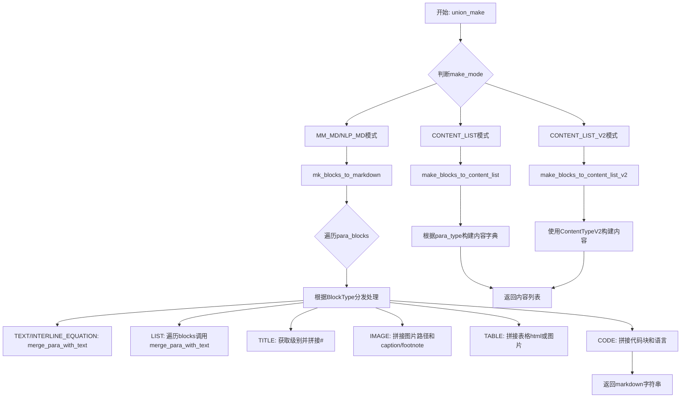
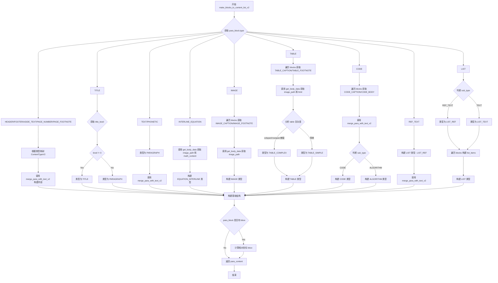
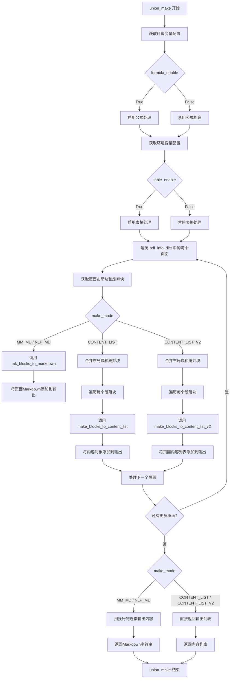
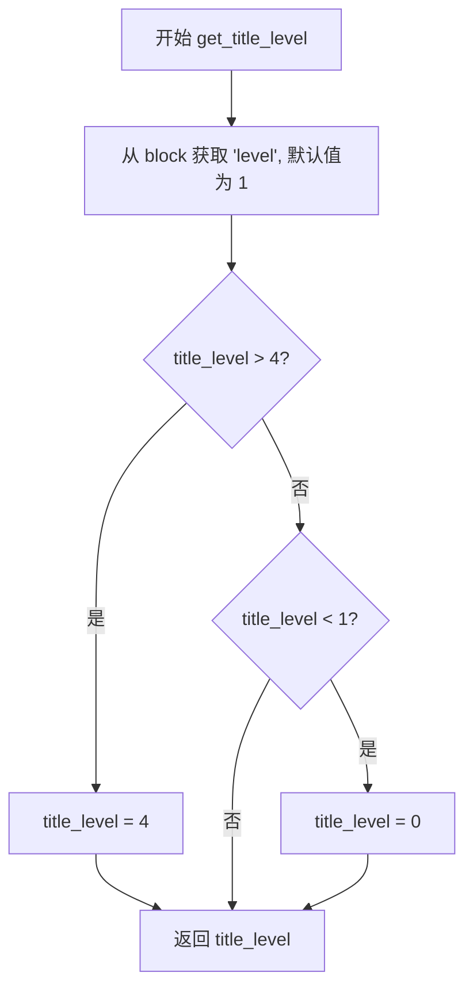

# `MinerU\mineru\backend\vlm\vlm_middle_json_mkcontent.py` 详细设计文档

该代码是一个PDF文档处理后端模块，主要负责将PDF解析后的结构化块数据（包含文本、公式、图像、表格、代码等元素）转换为Markdown格式或结构化内容列表，支持多种输出模式（MM_MD、NLP_MD、CONTENT_LIST、CONTENT_LIST_V2），并针对CJK（中日韩）语言和西方语言的文本排版差异进行了专门处理。

## 整体流程



## 类结构

```
无类定义（纯函数模块）
主要功能模块
├── 全局配置（delimiters相关）
├── 核心转换函数
│   ├── merge_para_with_text / merge_para_with_text_v2
│   ├── mk_blocks_to_markdown
│   ├── make_blocks_to_content_list
│   ├── make_blocks_to_content_list_v2
│   ├── get_body_data
│   └── union_make（主入口）
└── 辅助函数
    └── get_title_level
```

## 全局变量及字段


### `latex_delimiters_config`
    
从配置文件读取的LaTeX分隔符配置，包含display和inline模式的左右分隔符

类型：`dict 或 None`
    


### `default_delimiters`
    
默认的LaTeX分隔符配置，当配置文件为空时使用，包含display模式的$$和inline模式的$分隔符

类型：`dict`
    


### `delimiters`
    
实际使用的LaTeX分隔符配置，优先使用配置文件中的值，否则回退到默认配置

类型：`dict`
    


### `display_left_delimiter`
    
行间（display）公式的左分隔符，通常为$$

类型：`str`
    


### `display_right_delimiter`
    
行间（display）公式的右分隔符，通常为$$

类型：`str`
    


### `inline_left_delimiter`
    
行内（inline）公式的左分隔符，通常为$

类型：`str`
    


### `inline_right_delimiter`
    
行内（inline）公式的右分隔符，通常为$

类型：`str`
    


    

## 全局函数及方法


### `merge_para_with_text`

该函数用于将PDF解析后的段落块（包含文本、行内公式、行间公式等多种内容类型）合并成单一的Markdown格式文本字符串，同时处理CJK语言与西方语言的空格逻辑以及连字符的特殊处理。

参数：

- `para_block`：`dict`，段落块对象，包含 `lines`（行列表）和 `spans`（跨度列表）的嵌套结构，每个span包含 `type`（内容类型）和 `content`（文本内容）字段
- `formula_enable`：`bool`，是否启用公式渲染（默认为 `True`），为 `False` 时行间公式将输出为图片链接
- `img_buket_path`：`str`，图片Bucket路径（默认为空字符串），用于拼接行间公式的图片URL

返回值：`str`，返回合并处理后的Markdown文本字符串

#### 流程图

```mermaid
flowchart TD
    A[开始 merge_para_with_text] --> B[初始化 block_text = '']
    B --> C[遍历 para_block['lines'] 和 spans]
    C --> D{span['type'] == ContentType.TEXT?}
    D -->|是| E[全角转半角转换 content]
    D -->|否| F[跳过]
    E --> G[累加到 block_text]
    G --> H[调用 detect_lang 检测语言]
    H --> I[初始化 para_text = '']
    I --> J[再次遍历 lines 和 spans]
    J --> K{根据 span_type 处理内容}
    K -->|TEXT| L[直接使用 span['content']]
    K -->|INLINE_EQUATION| M[用 $...$ 包裹]
    K -->|INTERLINE_EQUATION| N{formula_enable?}
    N -->|是| O[用 $$...$$ 包裹]
    N -->|否| P[生成  格式]
    L --> Q{判断是否为行末span}
    M --> Q
    O --> Q
    P --> Q
    Q --> R{语言类型为CJK?}
    R -->|是| S{是行末且非行内公式?}
    R -->|否| T{末尾有连字符且为文本?}
    S -->|是| U[不加空格追加]
    S -->|否| V[加空格追加]
    T -->|是| W{下一行首字符小写?}
    T -->|否| X[加空格追加]
    W -->|是| Y[删除连字符后追加]
    W -->|否| Z[保留连字符追加]
    U --> AA{span_type == INTERLINE_EQUATION?}
    V --> AA
    X --> AA
    Y --> AA
    Z --> AA
    AA -->|是| BB[直接追加不加分隔符]
    AA -->|否| CC[循环继续]
    BB --> CC
    CC --> DD{还有更多spans?}
    DD -->|是| J
    DD -->|否| EE[返回 para_text]
```

#### 带注释源码

```python
def merge_para_with_text(para_block, formula_enable=True, img_buket_path=''):
    """
    将段落块合并为Markdown格式的文本
    
    参数:
        para_block: 段落块字典，包含lines和spans结构
        formula_enable: 是否启用公式渲染
        img_buket_path: 图片存储路径前缀
    
    返回:
        合并后的文本字符串
    """
    # ========== 第一步：提取纯文本并检测语言 ==========
    block_text = ''
    # 遍历所有行和跨度，收集文本内容用于语言检测
    for line in para_block['lines']:
        for span in line['spans']:
            if span['type'] in [ContentType.TEXT]:
                # 将全角字符转换为半角（排除标点符号）
                span['content'] = full_to_half_exclude_marks(span['content'])
                block_text += span['content']
    
    # 检测段落语言类型（CJK或西方语言）
    block_lang = detect_lang(block_text)

    # ========== 第二步：构建合并后的文本 ==========
    para_text = ''
    # 再次遍历处理各种内容类型
    for i, line in enumerate(para_block['lines']):
        for j, span in enumerate(line['spans']):
            span_type = span['type']
            content = ''
            
            # 根据span类型提取或转换内容
            if span_type == ContentType.TEXT:
                # 普通文本直接使用
                content = span['content']
            elif span_type == ContentType.INLINE_EQUATION:
                # 行内公式用 $...$ 包裹
                content = f"{inline_left_delimiter}{span['content']}{inline_right_delimiter}"
            elif span_type == ContentType.INTERLINE_EQUATION:
                # 行间公式处理
                if formula_enable:
                    # 启用公式时用 $$...$$ 包裹（多行格式）
                    content = f"\n{display_left_delimiter}\n{span['content']}\n{display_right_delimiter}\n"
                else:
                    # 禁用公式时输出为图片链接
                    if span.get('image_path', ''):
                        content = f""

            # 去除内容首尾空白
            content = content.strip()
            if content:
                # 行间公式特殊处理：直接追加不加分隔符
                if span_type == ContentType.INTERLINE_EQUATION:
                    para_text += content
                    continue

                # 定义CJK语言集合(中日韩)
                cjk_langs = {'zh', 'ja', 'ko'}
                # logger.info(f'block_lang: {block_lang}, content: {content}')

                # 判断是否为当前行的最后一个span
                is_last_span = j == len(line['spans']) - 1

                if block_lang in cjk_langs:  # 中文/日语/韩文语境
                    # CJK语言：换行不需要空格分隔
                    # 但如果是行内公式结尾，还是要加空格
                    if is_last_span and span_type != ContentType.INLINE_EQUATION:
                        para_text += content
                    else:
                        para_text += f'{content} '
                else:
                    # 西方文本语境：每行的最后一个span需要判断是否要去除连字符
                    if span_type in [ContentType.TEXT, ContentType.INLINE_EQUATION]:
                        # 如果span是line的最后一个且末尾带有-连字符
                        # 那么末尾不应该加空格，同时应该把-删除
                        if (
                                is_last_span
                                and span_type == ContentType.TEXT
                                and is_hyphen_at_line_end(content)
                        ):
                            # 如果下一行的第一个span是小写字母开头，删除连字符（连字符用于断词）
                            if (
                                    i+1 < len(para_block['lines'])
                                    and para_block['lines'][i + 1].get('spans')
                                    and para_block['lines'][i + 1]['spans'][0].get('type') == ContentType.TEXT
                                    and para_block['lines'][i + 1]['spans'][0].get('content', '')
                                    and para_block['lines'][i + 1]['spans'][0]['content'][0].islower()
                            ):
                                para_text += content[:-1]  # 删除连字符
                            else:
                                # 如果没有下一行，或下一行不是小写开头，保留连字符但不加空格
                                para_text += content
                        else:
                            # 西方文本语境：content间需要空格分隔
                            para_text += f'{content} '
    
    return para_text
```


### `mk_blocks_to_markdown`

该函数是文档到Markdown转换的核心函数，负责将解析后的页面元素块（包含文本、公式、列表、标题、图片、表格、代码等）根据不同的渲染模式转换为Markdown格式的文本片段数组。

参数：

- `para_blocks`：`list`，页面段落块列表，每个元素是一个包含类型和内容的字典
- `make_mode`：`MakeMode`，渲染模式，枚举类型，NLP_MD表示纯文本模式（跳过图片和表格），MM_MD表示多模态模式
- `formula_enable`：`bool`，是否启用公式渲染，True时将公式转为LaTeX，False时转图片
- `table_enable`：`bool`，是否启用表格HTML渲染，True时优先使用HTML表格，False时只用图片
- `img_buket_path`：`str`，图片Bucket路径前缀，用于拼接完整的图片URL

返回值：`list`，返回转换后的Markdown文本片段列表

#### 流程图

```mermaid
flowchart TD
    A[开始 mk_blocks_to_markdown] --> B[初始化空列表 page_markdown]
    B --> C{遍历 para_blocks 中的每个 para_block}
    C --> D[获取 para_block 的类型 para_type]
    D --> E{根据 para_type 分支处理}
    
    E --> F1[TEXT/INTERLINE_EQUATION/PHONETIC/REF_TEXT]
    E --> F2[LIST]
    E --> F3[TITLE]
    E --> F4[IMAGE]
    E --> F5[TABLE]
    E --> F6[CODE]
    
    F1 --> F1a[调用 merge_para_with_text]
    F2 --> F2a[遍历 blocks 调用 merge_para_with_text 并拼接换行]
    F3 --> F3a[获取标题级别并拼接 # 符号]
    F4 --> F4a{判断 make_mode}
    F4a -->|NLP_MD| F4b[跳过不处理]
    F4a -->|MM_MD| F4c{检查是否有 IMAGE_FOOTNOTE}
    F4c -->|有脚注| F4d[按 Caption → Body → Footnote 顺序拼接]
    F4c -->|无脚注| F4e[按 Body → Caption 顺序拼接]
    F5 --> F5a{判断 make_mode}
    F5a -->|NLP_MD| F5b[跳过不处理]
    F5a -->|MM_MD| F5c[按 Caption → Body → Footnote 顺序拼接]
    F6 --> F6a[按 Caption → Body 顺序拼接代码块]
    
    F1a --> G[检查 para_text 是否为空]
    F2a --> G
    F3a --> G
    F4d --> G
    F4e --> G
    F5c --> G
    F6a --> G
    
    G -->|空| C
    G -->|非空| H[将 para_text.strip() 加入 page_markdown]
    H --> C
    
    C --> I[返回 page_markdown 列表]
```

#### 带注释源码

```python
def mk_blocks_to_markdown(para_blocks, make_mode, formula_enable, table_enable, img_buket_path=''):
    """
    将页面段落块列表转换为Markdown格式的文本片段列表
    
    参数:
        para_blocks: 页面段落块列表
        make_mode: 渲染模式，NLP_MD或MM_MD
        formula_enable: 是否启用公式渲染
        table_enable: 是否启用表格HTML渲染
        img_buket_path: 图片存储路径前缀
    
    返回:
        Markdown文本片段列表
    """
    # 初始化结果列表
    page_markdown = []
    
    # 遍历页面中的每个段落块
    for para_block in para_blocks:
        para_text = ''
        para_type = para_block['type']
        
        # 根据段落类型采用不同的处理策略
        if para_type in [BlockType.TEXT, BlockType.INTERLINE_EQUATION, BlockType.PHONETIC, BlockType.REF_TEXT]:
            # 文本/行间公式/注音/引用文本：直接合并为纯文本
            para_text = merge_para_with_text(para_block, formula_enable=formula_enable, img_buket_path=img_buket_path)
            
        elif para_type == BlockType.LIST:
            # 列表类型：遍历每个列表项，合并文本后换行拼接
            for block in para_block['blocks']:
                item_text = merge_para_with_text(block, formula_enable=formula_enable, img_buket_path=img_buket_path)
                para_text += f"{item_text}  \n"
                
        elif para_type == BlockType.TITLE:
            # 标题类型：根据级别添加对应数量的 # 符号
            title_level = get_title_level(para_block)
            para_text = f'{"#" * title_level} {merge_para_with_text(para_block)}'
            
        elif para_type == BlockType.IMAGE:
            # 图片类型：根据模式决定是否处理及处理顺序
            if make_mode == MakeMode.NLP_MD:
                # NLP模式跳过图片
                continue
            elif make_mode == MakeMode.MM_MD:
                # 检测是否存在图片脚注
                has_image_footnote = any(block['type'] == BlockType.IMAGE_FOOTNOTE for block in para_block['blocks'])
                
                # 如果存在图片脚注，则按 Caption → Body → Footnote 顺序拼接
                if has_image_footnote:
                    for block in para_block['blocks']:  # 1st.拼接 image_caption
                        if block['type'] == BlockType.IMAGE_CAPTION:
                            para_text += merge_para_with_text(block) + '  \n'
                    for block in para_block['blocks']:  # 2nd.拼接 image_body
                        if block['type'] == BlockType.IMAGE_BODY:
                            for line in block['lines']:
                                for span in line['spans']:
                                    if span['type'] == ContentType.IMAGE:
                                        if span.get('image_path', ''):
                                            para_text += f""
                    for block in para_block['blocks']:  # 3rd.拼接 image_footnote
                        if block['type'] == BlockType.IMAGE_FOOTNOTE:
                            para_text += '  \n' + merge_para_with_text(block)
                else:
                    # 无脚注时按 Body → Caption 顺序拼接
                    for block in para_block['blocks']:  # 1st.拼接 image_body
                        if block['type'] == BlockType.IMAGE_BODY:
                            for line in block['lines']:
                                for span in line['spans']:
                                    if span['type'] == ContentType.IMAGE:
                                        if span.get('image_path', ''):
                                            para_text += f""
                    for block in para_block['blocks']:  # 2nd.拼接 image_caption
                        if block['type'] == BlockType.IMAGE_CAPTION:
                            para_text += '  \n' + merge_para_with_text(block)
                            
        elif para_type == BlockType.TABLE:
            # 表格类型：根据模式和配置决定渲染方式
            if make_mode == MakeMode.NLP_MD:
                continue
            elif make_mode == MakeMode.MM_MD:
                for block in para_block['blocks']:  # 1st.拼 table_caption
                    if block['type'] == BlockType.TABLE_CAPTION:
                        para_text += merge_para_with_text(block) + '  \n'
                for block in para_block['blocks']:  # 2nd.拼 table_body
                    if block['type'] == BlockType.TABLE_BODY:
                        for line in block['lines']:
                            for span in line['spans']:
                                if span['type'] == ContentType.TABLE:
                                    # 根据 table_enable 决定优先使用 HTML 还是图片
                                    if table_enable:
                                        if span.get('html', ''):
                                            para_text += f"\n{span['html']}\n"
                                        elif span.get('image_path', ''):
                                            para_text += f""
                                    else:
                                        if span.get('image_path', ''):
                                            para_text += f""
                for block in para_block['blocks']:  # 3rd.拼 table_footnote
                    if block['type'] == BlockType.TABLE_FOOTNOTE:
                        para_text += '\n' + merge_para_with_text(block) + '  '
                        
        elif para_type == BlockType.CODE:
            # 代码块类型：处理代码标题和代码主体
            sub_type = para_block["sub_type"]
            for block in para_block['blocks']:  # 1st.拼 code_caption
                if block['type'] == BlockType.CODE_CAPTION:
                    para_text += merge_para_with_text(block) + '  \n'
            for block in para_block['blocks']:  # 2nd.拼 code_body
                if block['type'] == BlockType.CODE_BODY:
                    if sub_type == BlockType.CODE:
                        # 普通代码：使用检测到的语言渲染代码块
                        guess_lang = para_block["guess_lang"]
                        para_text += f"```{guess_lang}\n{merge_para_with_text(block)}\n```"
                    elif sub_type == BlockType.ALGORITHM:
                        # 算法块：直接输出文本
                        para_text += merge_para_with_text(block)
        
        # 过滤空段落，只保留有效内容
        if para_text.strip() == '':
            continue
        else:
            page_markdown.append(para_text.strip())
    
    return page_markdown
```


### `make_blocks_to_content_list`

该函数是PDF解析模块中的核心转换函数，负责将不同类型的段落块（para_block）根据其BlockType（如文本、列表、标题、公式、图片、表格、代码等）进行分类处理，提取文本内容、元数据和位置信息，并转换为统一结构的内容字典返回。

参数：

- `para_block`：`dict`，输入的段落块对象，包含类型、文本内容、子块等结构化数据
- `img_buket_path`：`str`，图片存储路径的前缀，用于拼接完整的图片URL
- `page_idx`：`int`，当前段落所在的页码索引
- `page_size`：`tuple`，页面尺寸，格式为 (page_width, page_height)，用于计算相对坐标

返回值：`dict`，根据段落类型返回不同结构的字典，包含类型标识、文本内容、图片路径、标题、脚注、边界框坐标、页码索引等信息

#### 流程图

```mermaid
flowchart TD
    A[开始 make_blocks_to_content_list] --> B[获取 para_block['type']]
    B --> C{判断 para_type 类型}
    
    C -->|TEXT/REF_TEXT/PHONETIC/HEADER/FOOTER/PAGE_NUMBER/ASIDE_TEXT/PAGE_FOOTNOTE| D[调用 merge_para_with_text 提取文本]
    D --> E[构建 para_content 字典]
    
    C -->|LIST| F[遍历 para_block['blocks']]
    F --> G[对每个block调用 merge_para_with_text]
    G --> H[构建 list_items 列表]
    H --> E
    
    C -->|TITLE| I[调用 get_title_level 获取标题级别]
    I --> J[调用 merge_para_with_text 提取文本]
    J --> K[构建包含 text_level 的 para_content]
    
    C -->|INTERLINE_EQUATION| L[调用 merge_para_with_text 提取公式]
    L --> M[构建 type=EQUATION 的 para_content]
    
    C -->|IMAGE| N[遍历 para_block['blocks']]
    N --> O{判断 block['type']}
    O -->|IMAGE_BODY| P[提取 img_path]
    O -->|IMAGE_CAPTION| Q[追加标题文本到列表]
    O -->|IMAGE_FOOTNOTE| R[追加脚注文本到列表]
    N --> S[构建 IMAGE 类型 para_content]
    
    C -->|TABLE| T[遍历 para_block['blocks']]
    T --> U{判断 block['type']}
    U -->|TABLE_BODY| V[提取 html 和 img_path]
    U -->|TABLE_CAPTION| W[追加标题文本]
    U -->|TABLE_FOOTNOTE| X[追加脚注文本]
    T --> Y[构建 TABLE 类型 para_content]
    
    C -->|CODE| Z[遍历 para_block['blocks']]
    Z --> AA{判断 block['type']}
    AA -->|CODE_BODY| AB[提取代码内容]
    AA -->|CODE_CAPTION| AC[追加代码标题]
    Z --> AD[构建 CODE 类型 para_content]
    
    E --> AE[计算 bbox 相对坐标]
    AE --> AF[添加 page_idx 到 para_content]
    AF --> AG[返回 para_content]
    
    K --> AE
    M --> AE
    S --> AE
    Y --> AE
    AD --> AE
```

#### 带注释源码

```python
def make_blocks_to_content_list(para_block, img_buket_path, page_idx, page_size):
    """
    将段落块转换为统一的内容列表格式
    
    参数:
        para_block: 段落块字典，包含type、lines、blocks等字段
        img_buket_path: 图片存储路径前缀
        page_idx: 页码索引
        page_size: 页面尺寸元组 (width, height)
    
    返回:
        包含段落内容信息的字典
    """
    # 1. 获取段落类型
    para_type = para_block['type']
    # 2. 初始化内容字典
    para_content = {}
    
    # 3. 根据不同段落类型进行分类处理
    if para_type in [
        BlockType.TEXT,
        BlockType.REF_TEXT,
        BlockType.PHONETIC,
        BlockType.HEADER,
        BlockType.FOOTER,
        BlockType.PAGE_NUMBER,
        BlockType.ASIDE_TEXT,
        BlockType.PAGE_FOOTNOTE,
    ]:
        # 文本类段落：直接提取文本内容
        para_content = {
            'type': para_type,
            'text': merge_para_with_text(para_block),
        }
        
    elif para_type == BlockType.LIST:
        # 列表类段落：遍历子块提取列表项
        para_content = {
            'type': para_type,
            'sub_type': para_block.get('sub_type', ''),
            'list_items': [],  # 初始化空列表
        }
        # 遍历列表中的每个块
        for block in para_block['blocks']:
            item_text = merge_para_with_text(block)
            if item_text.strip():
                para_content['list_items'].append(item_text)
                
    elif para_type == BlockType.TITLE:
        # 标题类段落：提取标题级别和文本
        title_level = get_title_level(para_block)
        para_content = {
            'type': ContentType.TEXT,
            'text': merge_para_with_text(para_block),
        }
        # 如果标题级别有效，添加到内容中
        if title_level != 0:
            para_content['text_level'] = title_level
            
    elif para_type == BlockType.INTERLINE_EQUATION:
        # 行间公式：提取LaTeX公式文本
        para_content = {
            'type': ContentType.EQUATION,
            'text': merge_para_with_text(para_block),
            'text_format': 'latex',
        }
        
    elif para_type == BlockType.IMAGE:
        # 图片类段落：提取图片路径、标题和脚注
        para_content = {
            'type': ContentType.IMAGE,
            'img_path': '',
            BlockType.IMAGE_CAPTION: [],      # 图片标题列表
            BlockType.IMAGE_FOOTNOTE: []      # 图片脚注列表
        }
        # 遍历图片的子块
        for block in para_block['blocks']:
            # 提取图片主体中的路径
            if block['type'] == BlockType.IMAGE_BODY:
                for line in block['lines']:
                    for span in line['spans']:
                        if span['type'] == ContentType.IMAGE:
                            if span.get('image_path', ''):
                                para_content['img_path'] = f"{img_buket_path}/{span['image_path']}"
            # 提取图片标题
            if block['type'] == BlockType.IMAGE_CAPTION:
                para_content[BlockType.IMAGE_CAPTION].append(merge_para_with_text(block))
            # 提取图片脚注
            if block['type'] == BlockType.IMAGE_FOOTNOTE:
                para_content[BlockType.IMAGE_FOOTNOTE].append(merge_para_with_text(block))
                
    elif para_type == BlockType.TABLE:
        # 表格类段落：提取HTML、表格路径、标题和脚注
        para_content = {
            'type': ContentType.TABLE,
            'img_path': '',
            BlockType.TABLE_CAPTION: [],       # 表格标题列表
            BlockType.TABLE_FOOTNOTE: []       # 表格脚注列表
        }
        # 遍历表格的子块
        for block in para_block['blocks']:
            # 提取表格主体数据
            if block['type'] == BlockType.TABLE_BODY:
                for line in block['lines']:
                    for span in line['spans']:
                        if span['type'] == ContentType.TABLE:
                            # 优先使用HTML格式
                            if span.get('html', ''):
                                para_content[BlockType.TABLE_BODY] = f"{span['html']}"
                            # 备用图片格式
                            if span.get('image_path', ''):
                                para_content['img_path'] = f"{img_buket_path}/{span['image_path']}"
            # 提取表格标题
            if block['type'] == BlockType.TABLE_CAPTION:
                para_content[BlockType.TABLE_CAPTION].append(merge_para_with_text(block))
            # 提取表格脚注
            if block['type'] == BlockType.TABLE_FOOTNOTE:
                para_content[BlockType.TABLE_FOOTNOTE].append(merge_para_with_text(block))
                
    elif para_type == BlockType.CODE:
        # 代码类段落：提取代码内容、标题和语言类型
        para_content = {
            'type': BlockType.CODE,
            'sub_type': para_block["sub_type"],
            BlockType.CODE_CAPTION: []         # 代码标题列表
        }
        # 遍历代码块的子块
        for block in para_block['blocks']:
            # 提取代码主体内容
            if block['type'] == BlockType.CODE_BODY:
                para_content[BlockType.CODE_BODY] = merge_para_with_text(block)
                # 如果是代码块，添加语言猜测结果
                if para_block["sub_type"] == BlockType.CODE:
                    para_content["guess_lang"] = para_block["guess_lang"]
            # 提取代码标题
            if block['type'] == BlockType.CODE_CAPTION:
                para_content[BlockType.CODE_CAPTION].append(merge_para_with_text(block))

    # 4. 计算边界框的相对坐标（转换为1000x1000坐标系）
    page_width, page_height = page_size
    para_bbox = para_block.get('bbox')
    if para_bbox:
        x0, y0, x1, y1 = para_bbox
        para_content['bbox'] = [
            int(x0 * 1000 / page_width),    # 左侧相对坐标
            int(y0 * 1000 / page_height),   # 顶部相对坐标
            int(x1 * 1000 / page_width),    # 右侧相对坐标
            int(y1 * 1000 / page_height),   # 底部相对坐标
        ]

    # 5. 添加页码索引
    para_content['page_idx'] = page_idx

    # 6. 返回构建好的内容字典
    return para_content
```


### `make_blocks_to_content_list_v2`

该函数是 `make_blocks_to_content_list` 的 V2 版本，用于将 PDF 解析后的段落块（para_block）根据不同的块类型（BlockType）转换为统一的内容列表格式（content list），支持页面元素（页眉、页脚、页码）、标题、段落、行间公式、图片、表格、代码块、引用文本和列表等多种类型，并计算相对坐标。

参数：

- `para_block`：`Dict`，包含段落块数据，键值包括 `type`（块类型）、`lines`（行数据）、`blocks`（子块）、`bbox`（边界框）等
- `img_buket_path`：`str`，图片存储路径前缀，用于拼接图片完整路径
- `page_size`：`Tuple[int, int]`，页面尺寸，格式为 `(page_width, page_height)`，用于计算相对坐标

返回值：`Dict`，转换后的内容字典，包含 `type`（内容类型 V2）、`content`（内容详情）、`bbox`（相对坐标）等字段

#### 流程图



#### 带注释源码

```python
def make_blocks_to_content_list_v2(para_block, img_buket_path, page_size):
    """
    将段落块转换为统一的内容列表格式 V2
    
    参数:
        para_block: 段落块字典，包含 type、lines、blocks、bbox 等
        img_buket_path: 图片存储路径前缀
        page_size: 页面尺寸 (page_width, page_height)
    
    返回:
        包含类型、内容和坐标的内容字典
    """
    # 获取段落类型
    para_type = para_block['type']
    # 初始化内容字典
    para_content = {}
    
    # 处理页面元素：页眉、页脚、旁白、页码、脚注
    if para_type in [
        BlockType.HEADER,
        BlockType.FOOTER,
        BlockType.ASIDE_TEXT,
        BlockType.PAGE_NUMBER,
        BlockType.PAGE_FOOTNOTE,
    ]:
        # 根据段落类型映射到 ContentTypeV2 枚举
        if para_type == BlockType.HEADER:
            content_type = ContentTypeV2.PAGE_HEADER
        elif para_type == BlockType.FOOTER:
            content_type = ContentTypeV2.PAGE_FOOTER
        elif para_type == BlockType.ASIDE_TEXT:
            content_type = ContentTypeV2.PAGE_ASIDE_TEXT
        elif para_type == BlockType.PAGE_NUMBER:
            content_type = ContentTypeV2.PAGE_NUMBER
        elif para_type == BlockType.PAGE_FOOTNOTE:
            content_type = ContentTypeV2.PAGE_FOOTNOTE
        else:
            raise ValueError(f"Unknown para_type: {para_type}")
        
        # 构建页面元素内容结构
        para_content = {
            'type': content_type,
            'content': {
                f"{content_type}_content": merge_para_with_text_v2(para_block),
            }
        }
    
    # 处理标题块
    elif para_type == BlockType.TITLE:
        # 获取标题级别
        title_level = get_title_level(para_block)
        if title_level != 0:
            # 有效标题：类型为 TITLE
            para_content = {
                'type': ContentTypeV2.TITLE,
                'content': {
                    "title_content": merge_para_with_text_v2(para_block),
                    "level": title_level
                }
            }
        else:
            # 无效标题降级为段落
            para_content = {
                'type': ContentTypeV2.PARAGRAPH,
                'content': {
                    "paragraph_content": merge_para_with_text_v2(para_block),
                }
            }
    
    # 处理文本和音标块
    elif para_type in [
        BlockType.TEXT,
        BlockType.PHONETIC
    ]:
        para_content = {
            'type': ContentTypeV2.PARAGRAPH,
            'content': {
                'paragraph_content': merge_para_with_text_v2(para_block),
            }
        }
    
    # 处理行间公式块
    elif para_type == BlockType.INTERLINE_EQUATION:
        # 提取图片路径和公式内容
        image_path, math_content = get_body_data(para_block)
        para_content = {
            'type': ContentTypeV2.EQUATION_INTERLINE,
            'content': {
                'math_content': math_content,
                'math_type': 'latex',
                'image_source': {'path': f"{img_buket_path}/{image_path}"},
            }
        }
    
    # 处理图片块
    elif para_type == BlockType.IMAGE:
        image_caption = []
        image_footnote = []
        # 获取图片路径
        image_path, _ = get_body_data(para_block)
        image_source = {
            'path': f"{img_buket_path}/{image_path}",
        }
        # 遍历子块提取说明和脚注
        for block in para_block['blocks']:
            if block['type'] == BlockType.IMAGE_CAPTION:
                image_caption.extend(merge_para_with_text_v2(block))
            if block['type'] == BlockType.IMAGE_FOOTNOTE:
                image_footnote.extend(merge_para_with_text_v2(block))
        
        para_content = {
            'type': ContentTypeV2.IMAGE,
            'content': {
                'image_source': image_source,
                'image_caption': image_caption,
                'image_footnote': image_footnote,
            }
        }
    
    # 处理表格块
    elif para_type == BlockType.TABLE:
        table_caption = []
        table_footnote = []
        # 获取图片路径和 HTML
        image_path, html = get_body_data(para_block)
        image_source = {
            'path': f"{img_buket_path}/{image_path}",
        }
        # 判断表格嵌套层级
        if html.count("<table") > 1:
            table_nest_level = 2
        else:
            table_nest_level = 1
        
        # 判断表格复杂度（是否包含合并单元格）
        if (
                "colspan" in html or
                "rowspan" in html or
                table_nest_level > 1
        ):
            table_type = ContentTypeV2.TABLE_COMPLEX
        else:
            table_type = ContentTypeV2.TABLE_SIMPLE

        # 遍历子块提取说明和脚注
        for block in para_block['blocks']:
            if block['type'] == BlockType.TABLE_CAPTION:
                table_caption.extend(merge_para_with_text_v2(block))
            if block['type'] == BlockType.TABLE_FOOTNOTE:
                table_footnote.extend(merge_para_with_text_v2(block))
        
        para_content = {
            'type': ContentTypeV2.TABLE,
            'content': {
                'image_source': image_source,
                'table_caption': table_caption,
                'table_footnote': table_footnote,
                'html': html,
                'table_type': table_type,
                'table_nest_level': table_nest_level,
            }
        }
    
    # 处理代码块
    elif para_type == BlockType.CODE:
        code_caption = []
        code_content = []
        # 遍历子块提取说明和代码内容
        for block in para_block['blocks']:
            if block['type'] == BlockType.CODE_CAPTION:
                code_caption.extend(merge_para_with_text_v2(block))
            if block['type'] == BlockType.CODE_BODY:
                code_content = merge_para_with_text_v2(block)
        
        # 根据子类型区分代码和算法
        sub_type = para_block["sub_type"]
        if sub_type == BlockType.CODE:
            para_content = {
                'type': ContentTypeV2.CODE,
                'content': {
                    'code_caption': code_caption,
                    'code_content': code_content,
                    'code_language': para_block.get('guess_lang', 'txt'),
                }
            }
        elif sub_type == BlockType.ALGORITHM:
            para_content = {
                'type': ContentTypeV2.ALGORITHM,
                'content': {
                    'algorithm_caption': code_caption,
                    'algorithm_content': code_content,
                }
            }
        else:
            raise ValueError(f"Unknown code sub_type: {sub_type}")
    
    # 处理引用文本块
    elif para_type == BlockType.REF_TEXT:
        para_content = {
            'type': ContentTypeV2.LIST,
            'content': {
                'list_type': ContentTypeV2.LIST_REF,
                'list_items': [
                    {
                        'item_type': 'text',
                        'item_content': merge_para_with_text_v2(para_block),
                    }
                ],
            }
        }
    
    # 处理列表块
    elif para_type == BlockType.LIST:
        # 根据子类型确定列表类型
        if 'sub_type' in para_block:
            if para_block['sub_type'] == BlockType.REF_TEXT:
                list_type = ContentTypeV2.LIST_REF
            elif para_block['sub_type'] == BlockType.TEXT:
                list_type = ContentTypeV2.LIST_TEXT
            else:
                raise ValueError(f"Unknown list sub_type: {para_block['sub_type']}")
        else:
            list_type = ContentTypeV2.LIST_TEXT
        
        # 构建列表项
        list_items = []
        for block in para_block['blocks']:
            item_content = merge_para_with_text_v2(block)
            if item_content:
                list_items.append({
                    'item_type': 'text',
                    'item_content': item_content,
                })
        
        para_content = {
            'type': ContentTypeV2.LIST,
            'content': {
                'list_type': list_type,
                'list_items': list_items,
            }
        }

    # 计算相对坐标（将像素坐标转换为千分比坐标）
    page_width, page_height = page_size
    para_bbox = para_block.get('bbox')
    if para_bbox:
        x0, y0, x1, y1 = para_bbox
        para_content['bbox'] = [
            int(x0 * 1000 / page_width),
            int(y0 * 1000 / page_height),
            int(x1 * 1000 / page_width),
            int(y1 * 1000 / page_height),
        ]

    return para_content
```


### `get_body_data`

该函数用于从 `para_block` 中提取图像路径和HTML内容，支持 IMAGE、TABLE、INTERLINE_EQUATION 等块类型，返回图像路径和对应的内容（HTML或LaTeX）。

参数：

- `para_block`：`dict`，包含段落块的字典结构，可能包含 `blocks` 或 `lines` 字段，用于定位图像、表格或公式数据

返回值：`tuple`，返回包含两个字符串的元组 `(image_path, content)`，其中 image_path 为图像路径，content 为 HTML 内容（表格）或空字符串（图片/公式）

#### 流程图

```mermaid
flowchart TD
    A[开始 get_body_data] --> B{para_block 是否有 'blocks' 键}
    B -->|是| C[遍历 blocks]
    B -->|否| H[调用 get_data_from_spans para_block.get lines]
    C --> D{当前 block 类型是 IMAGE_BODY/TABLE_BODY/CODE_BODY}
    D -->|是| E[调用 get_data_from_spans 获取 lines 数据]
    D -->|否| C
    E --> F{result 不等于('', '')}
    F -->|是| G[返回 result]
    F -->|否| C
    C --> I{遍历完成}
    I -->|是| J[返回 ('', '')]
    H --> G
    J --> K[结束]
    
    subgraph get_data_from_spans
    L[遍历 lines] --> M[遍历 spans]
    M --> N{span_type}
    N -->|TABLE| O[返回 image_path, html]
    N -->|IMAGE| P[返回 image_path, '']
    N -->|INTERLINE_EQUATION| Q[返回 image_path, content]
    N -->|TEXT| R[返回 '', content]
    N -->|其他| S[继续遍历]
    O --> T[返回结果]
    P --> T
    Q --> T
    R --> T
    S --> M
    M --> U[遍历完成]
    U --> V[返回 ('', '')]
    end
```

#### 带注释源码

```python
def get_body_data(para_block):
    """
    Extract image_path and html from para_block
    Returns:
        - For IMAGE/INTERLINE_EQUATION: (image_path, '')
        - For TABLE: (image_path, html)
        - Default: ('', '')
    """

    def get_data_from_spans(lines):
        """
        从 lines 中提取数据
        遍历每一行的 span，根据 span 类型返回不同的结果
        """
        for line in lines:
            for span in line.get('spans', []):
                span_type = span.get('type')
                if span_type == ContentType.TABLE:
                    # 表格类型：返回图片路径和 HTML 内容
                    return span.get('image_path', ''), span.get('html', '')
                elif span_type == ContentType.IMAGE:
                    # 图片类型：返回图片路径，空内容
                    return span.get('image_path', ''), ''
                elif span_type == ContentType.INTERLINE_EQUATION:
                    # 行间公式：返回图片路径和公式内容（LaTeX）
                    return span.get('image_path', ''), span.get('content', '')
                elif span_type == ContentType.TEXT:
                    # 文本类型：返回空路径和文本内容
                    return '', span.get('content', '')
        # 未找到任何有效数据，返回空元组
        return '', ''

    # 处理嵌套的 blocks 结构
    # 如果 para_block 包含 'blocks' 字段，说明是复合块（如图片、表格、代码块）
    if 'blocks' in para_block:
        for block in para_block['blocks']:
            block_type = block.get('type')
            # 只处理 BODY 类型的块（IMAGE_BODY, TABLE_BODY, CODE_BODY）
            if block_type in [BlockType.IMAGE_BODY, BlockType.TABLE_BODY, BlockType.CODE_BODY]:
                result = get_data_from_spans(block.get('lines', []))
                # 如果找到有效数据则返回，否则继续遍历其他 blocks
                if result != ('', ''):
                    return result
        # 所有 blocks 遍历完毕未找到有效数据
        return '', ''

    # 处理直接包含 lines 的结构
    # 适用于简单的行间公式块等
    return get_data_from_spans(para_block.get('lines', []))
```


### `merge_para_with_text_v2`

该函数用于将PDF解析后的段落块（para_block）转换为结构化的内容列表，支持文本、音标、行内公式等不同类型span的处理，并根据语言环境（CJK或西方语言）进行适当的空格和连字符处理。

参数：

- `para_block`：`Dict`，包含段落块的结构化数据，至少包含 `lines` 字段，每个 line 包含 `spans` 列表，每个 span 有 `type` 和 `content` 字段

返回值：`List[Dict]`，返回结构化的内容列表，每个元素为包含 `type` 和 `content` 字段的字典

#### 流程图

```mermaid
flowchart TD
    A[开始: merge_para_with_text_v2] --> B[遍历para_block所有lines和spans]
    B --> C[收集TEXT类型内容并检测语言block_lang]
    C --> D[初始化para_content列表]
    D --> E[外层循环: 遍历para_block的lines]
    E --> F[内层循环: 遍历line的spans]
    F --> G{span.content是否为空?}
    G -->|否| H[跳过当前span]
    G -->|是| I{span_type == TEXT?}
    I -->|是| J{para_type == PHONETIC?}
    I -->|否| K{span_type == INLINE_EQUATION?}
    J -->|是| L[设置span_type = SPAN_PHONETIC]
    J -->|否| M[设置span_type = SPAN_TEXT]
    K -->|是| N[设置span_type = SPAN_EQUATION_INLINE]
    K -->|否| O[其他类型处理]
    L --> P{span_type == SPAN_TEXT?}
    M --> P
    N --> Q{span_type in [SPAN_PHONETIC, SPAN_EQUATION_INLINE]?}
    P -->|是| R{语言检测: block_lang in CJK?}
    R -->|是: CJK| S{是否为最后一个span?}
    R -->|否: 西方语言| T{行末有连字符?}
    S -->|是| U[不添加空格]
    S -->|否| V[添加空格]
    T -->|是| W{下一行首span是小写开头?}
    T -->|否| X[添加空格]
    W -->|是| Y[删除连字符]
    W -->|否| Z[保留连字符不添空]
    U --> AA[构建span_content]
    V --> AA
    X --> AA
    Y --> AA
    Z --> AA
    Q -->|是| AB[直接构建span_content]
    O --> AC[记录警告日志]
    AA --> AD{para_content末尾元素与当前span_type相同?}
    AB --> AD
    AD -->|是| AE[合并到最后一个元素content]
    AD -->|否| AF[新增span元素到para_content]
    AE --> AG[继续下一span]
    AF --> AG
    AC --> AG
    H --> AG
    AG --> AH{是否还有更多spans?}
    AH -->|是| F
    AH -->|否| AI{是否还有更多lines?}
    AI -->|是| E
    AI -->|否| AJ[返回para_content]
    AJ --> AK[结束]
```

#### 带注释源码

```python
def merge_para_with_text_v2(para_block):
    """
    将PDF解析后的段落块转换为结构化的内容列表
    
    处理逻辑:
    1. 遍历所有lines和spans,收集文本内容用于语言检测
    2. 根据语言环境(CJK/西方)决定文本间的空格处理
    3. 处理行末连字符的合并逻辑
    4. 合并相同类型的连续spans
    """
    # 第一步:收集文本内容并检测语言
    block_text = ''
    for line in para_block['lines']:
        for span in line['spans']:
            if span['type'] in [ContentType.TEXT]:
                # 将全角字符转换为半角(排除标点)
                span['content'] = full_to_half_exclude_marks(span['content'])
                block_text += span['content']
    # 检测段落语言类型(CJK或西方语言)
    block_lang = detect_lang(block_text)

    # 第二步:构建结构化内容列表
    para_content = []
    para_type = para_block['type']
    
    # 遍历所有行和span
    for i, line in enumerate(para_block['lines']):
        for j, span in enumerate(line['spans']):
            span_type = span['type']
            # 只处理有实际内容的span
            if span.get("content", '').strip():
                # 确定span的最终类型(考虑PHONETIC特殊情况)
                if span_type == ContentType.TEXT:
                    if para_type == BlockType.PHONETIC:
                        span_type = ContentTypeV2.SPAN_PHONETIC
                    else:
                        span_type = ContentTypeV2.SPAN_TEXT
                # 行内公式类型转换
                if span_type == ContentType.INLINE_EQUATION:
                    span_type = ContentTypeV2.SPAN_EQUATION_INLINE
                
                # 处理普通文本类型
                if span_type in [
                    ContentTypeV2.SPAN_TEXT,
                ]:
                    # CJK语言集合(中日韩)
                    cjk_langs = {'zh', 'ja', 'ko'}
                    
                    # 判断是否为当前行的最后一个span
                    is_last_span = j == len(line['spans']) - 1

                    if block_lang in cjk_langs:  # 中文/日语/韩文语境
                        # 行末不需要空格,但行内公式结尾需要空格
                        if is_last_span:
                            span_content = span['content']
                        else:
                            span_content = f"{span['content']} "
                    else:  # 西方语言语境
                        # 处理行末连字符:如果span是行末且末尾有连字符
                        if (
                                is_last_span
                                and is_hyphen_at_line_end(span['content'])
                        ):
                            # 检查下一行:如果下一行首span是小写字母开头,删除连字符实现连写
                            if (
                                    i + 1 < len(para_block['lines'])
                                    and para_block['lines'][i + 1].get('spans')
                                    and para_block['lines'][i + 1]['spans'][0].get('type') == ContentType.TEXT
                                    and para_block['lines'][i + 1]['spans'][0].get('content', '')
                                    and para_block['lines'][i + 1]['spans'][0]['content'][0].islower()
                            ):
                                span_content = span['content'][:-1]  # 删除连字符
                            else:  # 没有下一行或下一行不是小写开头,保留连字符
                                span_content = span['content']
                        else:
                            # 正常情况:添加空格分隔
                            span_content = f"{span['content']} "

                    # 合并相同类型的连续span以优化输出
                    if para_content and para_content[-1]['type'] == span_type:
                        para_content[-1]['content'] += span_content
                    else:
                        span_content = {
                            'type': span_type,
                            'content': span_content,
                        }
                        para_content.append(span_content)

                # 处理音标和行内公式类型
                elif span_type in [
                    ContentTypeV2.SPAN_PHONETIC,
                    ContentTypeV2.SPAN_EQUATION_INLINE,
                ]:
                    span_content = {
                        'type': span_type,
                        'content': span['content'],
                    }
                    para_content.append(span_content)
                else:
                    # 未知span类型记录警告
                    logger.warning(f"Unknown span type in merge_para_with_text_v2: {span_type}")
    
    return para_content
```


### `union_make`

该函数是文档处理的核心入口函数，负责根据指定的生成模式（make_mode）将PDF解析后的页面信息（pdf_info_dict）转换为不同格式的输出，包括Markdown文本、内容列表（V1或V2版本）。它通过遍历每个页面，根据块类型调用相应的转换函数，最终整合所有页面的输出内容。

参数：

- `pdf_info_dict`：`list`，PDF解析后的页面信息列表，每个元素包含页面布局块、废弃块、页码和页面尺寸等信息
- `make_mode`：`str`，生成模式，决定输出格式。取值为`MakeMode.MM_MD`（多模态Markdown）、`MakeMode.NLP_MD`（NLP Markdown）、`MakeMode.CONTENT_LIST`（内容列表V1）或`MakeMode.CONTENT_LIST_V2`（内容列表V2）
- `img_buket_path`：`str`，可选参数，图片存储的基础路径，默认为空字符串

返回值：`str | list | None`，根据`make_mode`返回不同的格式。当为Markdown模式时返回拼接的Markdown字符串；当为内容列表模式时返回包含各页面内容对象的列表；否则返回None

#### 流程图



#### 带注释源码

```python
def union_make(pdf_info_dict: list,
               make_mode: str,
               img_buket_path: str = '',
               ):
    """
    根据生成模式将PDF解析信息转换为指定格式的输出
    
    参数:
        pdf_info_dict: PDF解析后的页面信息列表
        make_mode: 生成模式，决定输出格式
        img_buket_path: 图片存储的基础路径
    
    返回:
        根据make_mode返回不同格式的内容
    """

    # 从环境变量获取公式和表格的启用配置
    # MINERU_VLM_FORMULA_ENABLE: 控制是否处理公式内容
    # MINERU_VLM_TABLE_ENABLE: 控制是否处理表格内容
    formula_enable = get_formula_enable(os.getenv('MINERU_VLM_FORMULA_ENABLE', 'True').lower() == 'true')
    table_enable = get_table_enable(os.getenv('MINERU_VLM_TABLE_ENABLE', 'True').lower() == 'true')

    # 初始化输出内容列表
    output_content = []
    
    # 遍历PDF的每一页信息
    for page_info in pdf_info_dict:
        # 获取当前页面的布局块（主要内容包括文本、公式、表格等）
        paras_of_layout = page_info.get('para_blocks')
        # 获取当前页面的废弃块（无法分类的内容）
        paras_of_discarded = page_info.get('discarded_blocks')
        # 获取页码从0开始索引
        page_idx = page_info.get('page_idx')
        # 获取页面尺寸（宽高）
        page_size = page_info.get('page_size')
        
        # 根据生成模式选择不同的处理逻辑
        if make_mode in [MakeMode.MM_MD, MakeMode.NLP_MD]:
            # Markdown生成模式
            # 检查是否存在布局块
            if not paras_of_layout:
                # 如果没有布局块，跳过该页面
                continue
            # 调用函数将段落块转换为Markdown格式
            page_markdown = mk_blocks_to_markdown(paras_of_layout, make_mode, formula_enable, table_enable, img_buket_path)
            # 将当前页面的Markdown内容添加到输出列表
            output_content.extend(page_markdown)
            
        elif make_mode == MakeMode.CONTENT_LIST:
            # 内容列表V1模式
            # 合并布局块和废弃块作为段落块
            para_blocks = (paras_of_layout or []) + (paras_of_discarded or [])
            # 检查是否存在段落块
            if not para_blocks:
                continue
            # 遍历每个段落块
            for para_block in para_blocks:
                # 将段落块转换为内容对象（包含类型、文本、位置等信息）
                para_content = make_blocks_to_content_list(para_block, img_buket_path, page_idx, page_size)
                # 将内容对象添加到输出列表
                output_content.append(para_content)
                
        elif make_mode == MakeMode.CONTENT_LIST_V2:
            # 内容列表V2模式（更规范的结构化输出）
            # 参考规范文档: https://github.com/drunkpig/llm-webkit-mirror/blob/dev6/docs/specification/output_format/content_list_spec.md
            # 合并布局块和废弃块
            para_blocks = (paras_of_layout or []) + (paras_of_discarded or [])
            # 用于存储当前页面的所有内容
            page_contents = []
            # 检查是否存在段落块
            if para_blocks:
                # 遍历每个段落块
                for para_block in para_blocks:
                    # 将段落块转换为V2版本的内容对象
                    para_content = make_blocks_to_content_list_v2(para_block, img_buket_path, page_size)
                    # 将内容对象添加到当前页面内容列表
                    page_contents.append(para_content)
            # 将当前页面的内容列表作为整体添加到输出
            output_content.append(page_contents)

    # 根据生成模式返回不同格式的最终结果
    if make_mode in [MakeMode.MM_MD, MakeMode.NLP_MD]:
        # Markdown模式：用双换行符拼接所有页面的Markdown内容
        return '\n\n'.join(output_content)
    elif make_mode in [MakeMode.CONTENT_LIST, MakeMode.CONTENT_LIST_V2]:
        # 内容列表模式：直接返回列表
        return output_content
    
    # 如果模式不匹配任何已知类型，返回None
    return None
```


### `get_title_level`

该函数用于从段落块中提取标题层级，并根据预设规则对层级进行规范化处理（最高为4级，最低为0级，返回0表示无效标题）。

参数：

- `block`：`dict`，段落块（para_block）字典对象，包含 'level' 键用于表示标题级别

返回值：`int`，规范化后的标题层级（0-4之间的整数）

#### 流程图



#### 带注释源码

```python
def get_title_level(block):
    """
    从段落块中提取并规范化标题层级
    
    参数:
        block: 包含 'level' 键的段落块字典
        
    返回:
        规范化后的标题层级 (0-4)
        - 0: 无效标题级别
        - 1-4: 有效标题级别
    """
    # 从 block 中获取 'level' 字段，默认值为 1
    # 如果未指定 level，默认视为一级标题
    title_level = block.get('level', 1)
    
    # 如果标题级别超过 4，则限制为最高 4 级
    # Markdown 通常支持到 h6，但该系统限制为 h4
    if title_level > 4:
        title_level = 4
    # 如果标题级别小于 1，则视为无效标题，返回 0
    # 这在处理非标题内容时被调用方用于判断
    elif title_level < 1:
        title_level = 0
        
    return title_level
```

## 关键组件


### LaTeX公式定界符配置

负责管理和配置LaTeX公式的显示和行内定界符，支持从配置文件读取或使用默认值。

### 段落文本合并函数 (merge_para_with_text)

将段落块（包含文本、行内公式、行间公式）合并为单个文本字符串，处理CJK语言的空格逻辑和西方文本的连字符处理。

### Markdown生成函数 (mk_blocks_to_markdown)

遍历所有段落块，根据块类型（文本、列表、标题、图像、表格、代码等）调用相应的处理函数，生成Markdown格式的列表。

### 内容列表生成函数V1 (make_blocks_to_content_list)

将段落块转换为结构化的内容字典，包含类型、文本、bbox等信息，支持文本、列表、标题、公式、图像、表格、代码等块类型。

### 内容列表生成函数V2 (make_blocks_to_content_list_v2)

V1的升级版本，使用ContentTypeV2枚举类型，生成更规范化的内容列表结构，支持更详细的元数据如表格复杂度、嵌套层级等。

### 块体数据提取函数 (get_body_data)

从段落块中提取图像路径和HTML内容，支持IMAGE、INTERLINE_EQUATION、TABLE等类型，处理嵌套的blocks结构和直接的lines结构。

### 段落文本合并函数V2 (merge_para_with_text_v2)

V1的升级版本，返回结构化的span列表而非纯文本，每个span包含类型和内容，支持文本、音标、行内公式等不同类型。

### 统一处理入口函数 (union_make)

主函数，根据make_mode参数分发处理：MM_MD/NLP_MD模式生成Markdown字符串，CONTENT_LIST模式生成V1内容列表，CONTENT_LIST_V2模式生成V2内容列表。

### 标题级别获取函数 (get_title_level)

从块中获取标题级别并限制在0-4范围内，确保Markdown标题级别有效。

### 块类型与内容类型枚举

定义在mineru.utils.enum_class中的MakeMode、BlockType、ContentType、ContentTypeV2枚举，支撑整个转换系统的类型判断和流程控制。


## 问题及建议


### 已知问题

- **字典字面量语法错误**：`make_blocks_to_content_list`函数中使用了`BlockType.IMAGE_CAPTION`作为字典键（如`BlockType.IMAGE_CAPTION: []`），这会导致运行时错误，应使用字符串字面量`'IMAGE_CAPTION'`
- **代码重复**：`merge_para_with_text`和`merge_para_with_text_v2`函数包含大量重复的逻辑（语言检测、CJK处理、连字符处理），违反了DRY原则
- **字符串拼接效率低下**：多处使用`+=`进行字符串拼接（如`block_text += span['content']`、`para_text += content`），在大文本场景下性能较差，应使用列表+join方式
- **缺少输入校验**：多个函数未对`para_block`、`img_buket_path`等关键参数进行None或空值校验，可能导致运行时异常
- **魔法字符串与数字**：环境变量`'True'`、`'False'`、标题层级限制`1-4`等硬编码值散落在代码中，降低了可维护性
- **枚举混用问题**：在`make_blocks_to_content_list`中混用了`ContentType`和`BlockType`枚举作为字典键，导致类型不一致
- **未使用的导入**：`os`模块被导入但主要在`union_make`函数中使用，可以考虑优化导入位置

### 优化建议

- 修复字典键语法错误，将`BlockType.IMAGE_CAPTION`改为字符串`'IMAGE_CAPTION'`
- 抽取`merge_para_with_text`和`merge_para_with_text_v2`的公共逻辑到私有辅助函数，消除重复代码
- 将字符串拼接改为列表append+join方式，提升大规模文本处理性能
- 在函数入口添加参数校验，使用Optional类型提示和early return模式处理边界情况
- 将硬编码的配置值抽取到配置文件中，通过配置类统一管理
- 统一枚举使用规范，建议全部使用字符串作为字典键以保持JSON序列化一致性
- 使用`functools.lru_cache`缓存`get_formula_enable`和`get_table_enable`等配置读取结果，避免重复读取

## 其它


### 设计目标与约束

本模块的设计目标是将PDF文档的解析结果（para_blocks）转换为多种输出格式，包括Markdown、CONTENT_LIST和CONTENT_LIST_V2。核心约束包括：1）支持多种块类型（文本、公式、表格、图像、代码、标题等）的转换；2）处理CJK（中文、日文、韩文）和西方文本的空格分隔逻辑差异；3）支持公式和表格的启用/禁用配置；4）根据make_mode参数决定输出格式。

### 错误处理与异常设计

代码中主要通过以下方式处理错误：1）使用logger.warning记录未知span类型；2）对于未知的para_type或sub_type，抛出ValueError异常；3）对于可能为空的数据，使用get()方法提供默认值；4）在get_body_data函数中，当无法提取数据时返回空字符串元组。潜在改进：增加更详细的错误码定义，对不同类型的错误进行分类处理。

### 数据流与状态机

数据流主要分为三条路径：1）Markdown生成路径：para_blocks → mk_blocks_to_markdown → 逐块处理 → 合并为markdown字符串；2）内容列表V1路径：para_blocks → make_blocks_to_content_list → 字典形式的内容项列表；3）内容列表V2路径：para_blocks → make_blocks_to_content_list_v2 → 结构化的内容项列表。状态转换主要体现在BlockType到ContentType/ContentTypeV2的映射过程。

### 外部依赖与接口契约

本模块依赖以下外部组件：1）loguru库用于日志记录；2）mineru.utils.char_utils中的full_to_half_exclude_marks和is_hyphen_at_line_end函数；3）mineru.utils.config_reader中的配置读取函数；4）mineru.utils.enum_class中定义的枚举类；5）mineru.utils.language中的detect_lang函数。接口契约：输入为包含para_blocks的字典列表，每个para_block包含type、lines、spans等结构；输出为根据make_mode生成的字符串或列表。

### 性能考虑与优化空间

性能优化点：1）merge_para_with_text和merge_para_with_text_v2存在大量重复逻辑，可考虑合并；2）get_body_data函数中多次遍历blocks和spans，可优化为单次遍历；3）字符串拼接使用+=操作符，在大量块时效率较低，可考虑使用列表join方式；4）detect_lang在每个段落都调用一次，可考虑缓存已处理段落的语言检测结果。

### 配置管理

代码使用配置文件管理以下参数：1）latex_delimiters_config：从配置读取LaTeX分隔符，支持display和inline两种模式；2）formula_enable：通过环境变量MINERU_VLM_FORMULA_ENABLE控制公式启用；3）table_enable：通过环境变量MINERU_VLM_TABLE_ENABLE控制表格启用。默认配置包含fallback的default_delimiters。

### 边界条件处理

代码对以下边界条件进行了处理：1）空块过滤：para_text.strip()为空时跳过；2）行末连字符处理：根据下一行首字符小写判断是否删除连字符；3）语言边界：CJK语言不添加空格分隔；4）表格/图像嵌套结构：处理caption、body、footnote的顺序拼接；5）bbox归一化：将坐标转换为千分比格式。

### 代码组织与模块化

代码组织特点：1）按功能划分为文本合并、Markdown生成、内容列表生成等函数；2）版本区分：merge_para_with_text和merge_para_with_text_v2分别对应不同版本的内容列表格式；3）辅助函数：get_body_data和get_title_level作为独立工具函数。改进建议：可进一步将不同输出模式的处理逻辑拆分为独立类或模块。


    