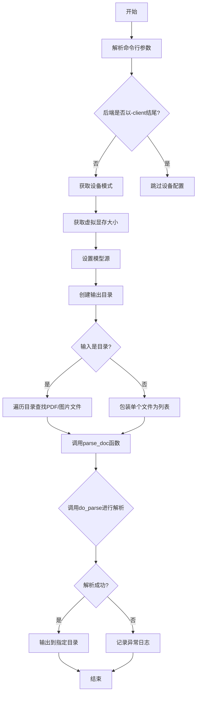
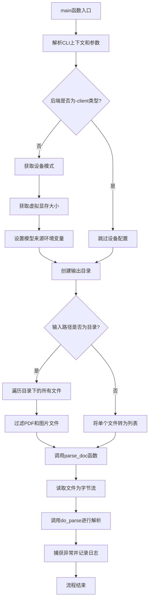
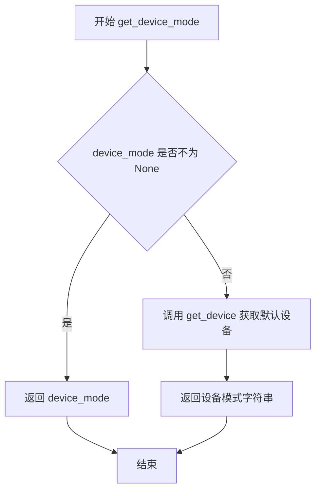
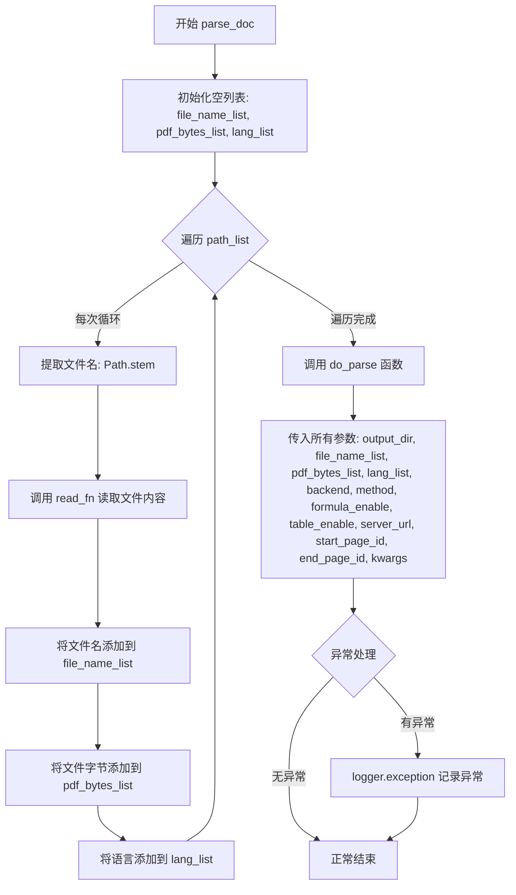

# `MinerU\mineru\cli\client.py` 详细设计文档

这是一个PDF文档解析CLI工具，支持多种后端（pipeline、vlm-http-client、hybrid-http-client等）进行文本提取、OCR、公式识别和表格识别，通过命令行参数配置输入输出路径、解析方法、语言等选项。

## 整体流程



## 类结构

```
CLI入口 (无类定义)
└── main (主函数，Click命令)
    ├── get_device_mode (内部函数)
    ├── get_virtual_vram_size (内部函数)
    └── parse_doc (内部函数)
```

## 全局变量及字段


### `log_level`
    
从环境变量获取的日志级别，默认为INFO

类型：`str`
    


### `pdf_suffixes`
    
PDF文件后缀列表（从common导入）

类型：`list`
    


### `image_suffixes`
    
图片文件后缀列表（从common导入）

类型：`list`
    


    

## 全局函数及方法


### `main`

CLI主入口函数，使用Click框架构建，支持PDF/图片文档解析功能。通过多种后端和解析方法将本地PDF或图片文件解析为结构化数据，并输出到指定目录。

参数：

- `ctx`：`click.Context`，Click框架的上下文对象，包含命令行的上下文信息
- `input_path`：`str`，输入的本地文件路径或目录路径，支持pdf、png、jpg、jpeg文件
- `output_dir`：`str`，输出的本地目录路径
- `method`：`str`，PDF解析方法，可选值为'auto'、'txt'、'ocr'，默认为'auto'
- `backend`：`str`，解析PDF的后端，可选值为'pipeline'、'vlm-http-client'、'hybrid-http-client'、'vlm-auto-engine'、'hybrid-auto-engine'，默认为'hybrid-auto-engine'
- `lang`：`str`，PDF语言选项，用于提高OCR准确性，可选包括'ch'、'ch_server'、'ch_lite'、'en'、'korean'等，默认为'ch'
- `server_url`：`str | None`，当后端为`<vlm/hybrid>-http-client`时需要指定服务器URL，例如`http://127.0.0.1:30000`
- `start_page_id`：`int`，PDF解析起始页，从0开始，默认为0
- `end_page_id`：`int | None`，PDF解析结束页，从0开始，默认为None表示解析到最后一页
- `formula_enable`：`bool`，是否启用公式解析，默认为True
- `table_enable`：`bool`，是否启用表格解析，默认为True
- `device_mode`：`str | None`，模型推理设备模式，如"cpu"、"cuda"、"cuda:0"、"npu"等，仅适用于pipeline后端
- `virtual_vram`：`int | None`，单个进程占用的GPU内存上限，仅适用于pipeline后端
- `model_source`：`str`，模型仓库来源，可选'huggingface'、'modelscope'、'local'，默认为'huggingface'
- `**kwargs`：剩余的未知参数，由arg_parse函数处理

返回值：`None`，该函数无返回值，通过副作用完成文件解析操作

#### 流程图



#### 带注释源码

```python
# Copyright (c) Opendatalab. All rights reserved.
import os
import sys

import click
from pathlib import Path
from loguru import logger

# 配置日志级别，从环境变量读取，默认为INFO
log_level = os.getenv("MINERU_LOG_LEVEL", "INFO").upper()
logger.remove()  # 移除默认handler
logger.add(sys.stderr, level=log_level)  # 添加新handler，输出到标准错误流

from mineru.utils.cli_parser import arg_parse
from mineru.utils.config_reader import get_device
from mineru.utils.guess_suffix_or_lang import guess_suffix_by_path
from mineru.utils.model_utils import get_vram
from ..version import __version__
from .common import do_parse, read_fn, pdf_suffixes, image_suffixes


# 定义Click命令装饰器
# context_settings: 允许未知选项和额外参数
@click.command(context_settings=dict(ignore_unknown_options=True, allow_extra_args=True))
# 传递Click上下文到函数
@click.pass_context
# 版本选项装饰器
@click.version_option(__version__,
                      '--version',
                      '-v',
                      help='display the version and exit')
# 输入路径选项
@click.option(
    '-p',
    '--path',
    'input_path',
    type=click.Path(exists=True),
    required=True,
    help='local filepath or directory. support pdf, png, jpg, jpeg files',
)
# 输出目录选项
@click.option(
    '-o',
    '--output',
    'output_dir',
    type=click.Path(),
    required=True,
    help='output local directory',
)
# 解析方法选项
@click.option(
    '-m',
    '--method',
    'method',
    type=click.Choice(['auto', 'txt', 'ocr']),
    help="""\b
    the method for parsing pdf:
      auto: Automatically determine the method based on the file type.
      txt: Use text extraction method.
      ocr: Use OCR method for image-based PDFs.
    Without method specified, 'auto' will be used by default.
    Adapted only for the case where the backend is set to 'pipeline' and 'hybrid-*'.""",
    default='auto',
)
# 后端选项
@click.option(
    '-b',
    '--backend',
    'backend',
    type=click.Choice(['pipeline', 'vlm-http-client', 'hybrid-http-client', 'vlm-auto-engine', 'hybrid-auto-engine',]),
    help="""\b
    the backend for parsing pdf:
      pipeline: More general.
      vlm-auto-engine: High accuracy via local computing power.
      vlm-http-client: High accuracy via remote computing power(client suitable for openai-compatible servers).
      hybrid-auto-engine: Next-generation high accuracy solution via local computing power.
      hybrid-http-client: High accuracy but requires a little local computing power(client suitable for openai-compatible servers).
    Without method specified, hybrid-auto-engine will be used by default.""",
    default='hybrid-auto-engine',
)
# 语言选项
@click.option(
    '-l',
    '--lang',
    'lang',
    type=click.Choice(['ch', 'ch_server', 'ch_lite', 'en', 'korean', 'japan', 'chinese_cht', 'ta', 'te', 'ka', 'th', 'el',
                       'latin', 'arabic', 'east_slavic', 'cyrillic', 'devanagari']),
    help="""
    Input the languages in the pdf (if known) to improve OCR accuracy.
    Without languages specified, 'ch' will be used by default.
    Adapted only for the case where the backend is set to 'pipeline' and 'hybrid-*'.
    """,
    default='ch',
)
# 服务器URL选项
@click.option(
    '-u',
    '--url',
    'server_url',
    type=str,
    help="""
    When the backend is `<vlm/hybrid>-http-client`, you need to specify the server_url, for example:`http://127.0.0.1:30000`
    """,
    default=None,
)
# 起始页选项
@click.option(
    '-s',
    '--start',
    'start_page_id',
    type=int,
    help='The starting page for PDF parsing, beginning from 0.',
    default=0,
)
# 结束页选项
@click.option(
    '-e',
    '--end',
    'end_page_id',
    type=int,
    help='The ending page for PDF parsing, beginning from 0.',
    default=None,
)
# 公式解析选项
@click.option(
    '-f',
    '--formula',
    'formula_enable',
    type=bool,
    help='Enable formula parsing. Default is True. ',
    default=True,
)
# 表格解析选项
@click.option(
    '-t',
    '--table',
    'table_enable',
    type=bool,
    help='Enable table parsing. Default is True. ',
    default=True,
)
# 设备模式选项
@click.option(
    '-d',
    '--device',
    'device_mode',
    type=str,
    help="""Device mode for model inference, e.g., "cpu", "cuda", "cuda:0", "npu", "npu:0", "mps".
         Adapted only for the case where the backend is set to "pipeline". """,
    default=None,
)
# 虚拟显存选项
@click.option(
    '--vram',
    'virtual_vram',
    type=int,
    help='Upper limit of GPU memory occupied by a single process. Adapted only for the case where the backend is set to "pipeline". ',
    default=None,
)
# 模型来源选项
@click.option(
    '--source',
    'model_source',
    type=click.Choice(['huggingface', 'modelscope', 'local']),
    help="""
    The source of the model repository. Default is 'huggingface'.
    """,
    default='huggingface',
)


def main(
        ctx,
        input_path, output_dir, method, backend, lang, server_url,
        start_page_id, end_page_id, formula_enable, table_enable,
        device_mode, virtual_vram, model_source, **kwargs
):
    """CLI主入口函数，处理PDF/图片解析任务"""
    
    # 使用arg_parse解析额外的未知参数
    kwargs.update(arg_parse(ctx))

    # 仅对非HTTP客户端后端配置设备和显存
    if not backend.endswith('-client'):
        # 定义获取设备模式的内部函数
        def get_device_mode() -> str:
            if device_mode is not None:
                return device_mode
            else:
                return get_device()
        
        # 如果环境变量未设置，则设置设备模式
        if os.getenv('MINERU_DEVICE_MODE', None) is None:
            os.environ['MINERU_DEVICE_MODE'] = get_device_mode()

        # 定义获取虚拟显存大小的内部函数
        def get_virtual_vram_size() -> int:
            if virtual_vram is not None:
                return virtual_vram
            else:
                return get_vram(get_device_mode())
        
        # 如果环境变量未设置，则设置虚拟显存大小
        if os.getenv('MINERU_VIRTUAL_VRAM_SIZE', None) is None:
            os.environ['MINERU_VIRTUAL_VRAM_SIZE']= str(get_virtual_vram_size())

        # 如果环境变量未设置，则设置模型来源
        if os.getenv('MINERU_MODEL_SOURCE', None) is None:
            os.environ['MINERU_MODEL_SOURCE'] = model_source

    # 确保输出目录存在
    os.makedirs(output_dir, exist_ok=True)

    # 定义文档解析的内部函数
    def parse_doc(path_list: list[Path]):
        """解析文档列表的核心函数"""
        try:
            file_name_list = []
            pdf_bytes_list = []
            lang_list = []
            # 遍历路径列表，读取文件内容
            for path in path_list:
                file_name = str(Path(path).stem)  # 获取文件名（不含扩展名）
                pdf_bytes = read_fn(path)  # 读取文件为字节流
                file_name_list.append(file_name)
                pdf_bytes_list.append(pdf_bytes)
                lang_list.append(lang)
            
            # 调用do_parse执行实际解析
            do_parse(
                output_dir=output_dir,
                pdf_file_names=file_name_list,
                pdf_bytes_list=pdf_bytes_list,
                p_lang_list=lang_list,
                backend=backend,
                parse_method=method,
                formula_enable=formula_enable,
                table_enable=table_enable,
                server_url=server_url,
                start_page_id=start_page_id,
                end_page_id=end_page_id,
                **kwargs,
            )
        except Exception as e:
            # 捕获异常并记录日志
            logger.exception(e)

    # 判断输入路径是目录还是文件
    if os.path.isdir(input_path):
        doc_path_list = []
        # 遍历目录下的所有文件
        for doc_path in Path(input_path).glob('*'):
            # 根据文件后缀判断是否为支持的文档格式
            if guess_suffix_by_path(doc_path) in pdf_suffixes + image_suffixes:
                doc_path_list.append(doc_path)
        # 解析目录中的所有文档
        parse_doc(doc_path_list)
    else:
        # 解析单个文件
        parse_doc([Path(input_path)])


if __name__ == '__main__':
    main()
```


### `get_device_mode`

获取设备运行模式（CPU/CUDA/NPU/MPS），用于确定模型推理所使用的硬件设备。

参数：该函数无参数

返回值：`str`，返回设备模式字符串，例如 "cpu"、"cuda"、"npu"、"mps" 等

#### 流程图



#### 带注释源码

```python
def get_device_mode() -> str:
    """
    获取设备运行模式
    
    优先级：
    1. 如果命令行参数 device_mode 不为 None，使用命令行传入的值
    2. 否则调用 get_device() 函数自动检测可用设备
    
    Returns:
        str: 设备模式字符串，如 'cpu', 'cuda', 'npu', 'mps' 等
    """
    if device_mode is not None:
        # 优先级1: 使用命令行参数指定的设备模式
        return device_mode
    else:
        # 优先级2: 自动检测系统可用设备
        # get_device() 函数会检测 CUDA、NPU、MPS 等可用后端
        return get_device()
```


### `get_virtual_vram_size`

获取虚拟显存大小限制。如果用户通过命令行参数指定了虚拟显存大小，则直接返回该值；否则自动检测当前设备的显存大小。

参数： 无

返回值：`int`，返回虚拟显存大小限制（单位为MB）

#### 流程图

```mermaid
flowchart TD
    A[开始] --> B{virtual_vram 是否不为 None?}
    B -->|是| C[返回 virtual_vram]
    B -->|否| D[调用 get_vram get_device_mode()]
    D --> E[返回 get_vram 结果]
    C --> F[结束]
    E --> F
```

#### 带注释源码

```python
def get_virtual_vram_size() -> int:
    """
    获取虚拟显存大小限制
    
    如果用户通过命令行参数 --vram 指定了虚拟显存大小，则直接返回该值；
    否则自动检测当前设备的显存大小。
    
    Returns:
        int: 虚拟显存大小限制，单位为MB
    """
    if virtual_vram is not None:
        # 如果用户在命令行指定了 --vram 参数，直接使用该值
        return virtual_vram
    else:
        # 否则自动检测当前设备的显存大小
        # 先获取设备模式（如 'cuda', 'cpu', 'mps' 等），再查询对应显存大小
        return get_vram(get_device_mode())
```


### `main.parse_doc`

内部函数，执行实际的文档解析逻辑，接收文件路径列表，读取文件内容并调用 `do_parse` 进行处理

参数：

- `path_list`：`list[Path]`，要解析的文档路径列表

返回值：`None`，无返回值（该函数没有 return 语句）

#### 流程图



#### 带注释源码

```python
def parse_doc(path_list: list[Path]):
    """
    内部函数，执行实际的文档解析逻辑
    
    参数:
        path_list: Path对象的列表，包含要解析的文档路径
    """
    try:
        # 初始化文件名列表
        file_name_list = []
        # 初始化PDF字节列表
        pdf_bytes_list = []
        # 初始化语言列表
        lang_list = []
        
        # 遍历所有输入路径
        for path in path_list:
            # 提取文件名（不含扩展名）
            file_name = str(Path(path).stem)
            # 读取文件内容为字节
            pdf_bytes = read_fn(path)
            # 添加到对应列表
            file_name_list.append(file_name)
            pdf_bytes_list.append(pdf_bytes)
            lang_list.append(lang)
        
        # 调用核心解析函数 do_parse
        do_parse(
            output_dir=output_dir,          # 输出目录
            pdf_file_names=file_name_list,  # 文件名列表
            pdf_bytes_list=pdf_bytes_list,  # 文件字节列表
            p_lang_list=lang_list,          # 语言列表
            backend=backend,                # 后端类型
            parse_method=method,            # 解析方法
            formula_enable=formula_enable,  # 是否启用公式解析
            table_enable=table_enable,     # 是否启用表格解析
            server_url=server_url,         # 服务器URL
            start_page_id=start_page_id,   # 起始页码
            end_page_id=end_page_id,       # 结束页码
            **kwargs,                       # 额外参数
        )
    except Exception as e:
        # 捕获异常并记录日志
        logger.exception(e)
```

## 关键组件


### Click命令行接口

使用Click框架定义CLI命令，包含多个命令行选项如输入路径、输出目录、解析方法、后端类型、语言、起始/结束页码、公式解析、表格解析、设备模式、虚拟显存、模型源等。

### main函数

CLI主入口函数，负责参数解析、环境变量配置、目录创建和文档解析流程调用。根据输入是文件还是目录，调用parse_doc处理单个或多个文档。

### parse_doc内部函数

核心文档解析函数，读取PDF文件或图像，将文件名、文件字节、语言列表传递给do_parse函数执行实际解析，并处理异常情况。

### 日志系统配置

使用loguru库配置日志系统，从环境变量MINERU_LOG_LEVEL读取日志级别，默认INFO级别，输出到stderr。

### 环境变量配置模块

动态设置MINERU_DEVICE_MODE、MINERU_VIRTUAL_VRAM_SIZE、MINERU_MODEL_SOURCE等环境变量，用于在pipeline等后端模式下配置设备模式和显存限制。

### 文件后缀验证

通过guess_suffix_by_path函数和pdf_suffixes、image_suffixes列表验证输入文件是否为支持的PDF或图像格式。

### 后端适配逻辑

根据backend是否以'-client'结尾判断是否为远程调用模式，从而决定是否需要配置本地设备模式和虚拟显存等参数。


## 问题及建议


### 已知问题

- **全局日志配置风险**：在模块顶层直接调用`logger.remove()`和`logger.add(sys.stderr, ...)`，若该模块被多次导入或在其他上下文中使用，可能导致日志处理器异常或日志丢失
- **环境变量污染**：`MINERU_DEVICE_MODE`、`MINERU_VIRTUAL_VRAM_SIZE`、`MINERU_MODEL_SOURCE`在函数内部动态设置，可能影响同一进程中的其他调用，且未考虑已有环境变量被覆盖的情况
- **异常处理不完善**：`parse_doc`函数中捕获异常后仅记录日志，不进行重试或向用户报告哪些文件处理失败，导致静默失败
- **目录遍历不支持递归**：使用`Path(input_path).glob('*')`仅遍历当前层级，无法处理嵌套目录结构，且未过滤隐藏文件
- **文件类型判断逻辑冗余**：`guess_suffix_by_path`函数结果与`pdf_suffixes + image_suffixes`列表比较，但这些后缀列表定义在`common`模块中，未在此处直接使用，逻辑可读性较差
- **类型注解不一致**：部分变量如`file_name_list`、`pdf_bytes_list`等未添加类型注解，而`path_list`有注解，影响代码可维护性
- **默认值设置位置不当**：设备模式和虚拟显存大小的默认值逻辑（`get_device_mode()`和`get_virtual_vram_size()`）定义在`main`函数内部，若后续有其他入口调用相关功能，需重复该逻辑

### 优化建议

- 将日志配置封装为函数或提供初始化方法，避免全局副作用；或使用上下文管理器控制日志行为
- 考虑使用配置类或配置对象统一管理环境变量，而非在函数内部直接修改`os.environ`
- 为`parse_doc`添加重试机制或返回处理结果统计，并向用户报告失败的文件列表
- 添加`--recursive`选项支持递归遍历目录；或添加文件过滤参数让用户指定文件模式
- 统一类型注解风格，为所有函数参数和返回值添加类型注解
- 将设备检测和显存计算逻辑提取为独立工具函数，供`main`和其他入口点复用

## 其它


### 设计目标与约束

该CLI工具的核心设计目标是提供一个通用的PDF文档解析命令行接口，支持多种解析方法（自动、纯文本、OCR）、多种后端引擎（pipeline、vlm、hybrid）、多语言支持以及灵活的设备配置。设计约束包括：必须提供输入路径和输出目录；后端为非client模式时需自动检测设备并设置虚拟显存；支持的输入文件格式限于PDF和常见图片格式（png、jpg、jpeg）；方法参数仅适用于pipeline和hybrid后端。

### 错误处理与异常设计

代码采用分层异常处理策略。在main函数中，使用try-except捕获parse_doc内部的所有异常，并通过logger.exception(e)记录完整堆栈信息。关键风险点包括：输入路径不存在（由click.Path(exists=True)验证）、文件读取失败（read_fn可能抛异常）、解析引擎内部错误（do_parse调用可能失败）。对于可预见的错误（如后端类型不匹配），代码通过条件判断进行预防性处理。对于不可预见的异常，保留堆栈信息以便调试。

### 数据流与状态机

数据流遵循以下路径：用户输入 → CLI参数解析 → 输入路径验证 → 文件扫描（目录模式） → 文件读取 → PDF字节流传入do_parse → 后端处理 → 输出文件生成。状态转换如下：初始状态 → 验证输入路径 → 判断是文件还是目录 → 若是目录则遍历筛选合法文件 → 进入解析阶段 → 解析完成或异常退出。CLI采用无状态设计，每次调用独立完成一个任务，不维护跨请求状态。

### 外部依赖与接口契约

主要外部依赖包括：click框架用于CLI构建；loguru用于日志记录；mineru内部模块包括cli_parser（参数解析）、config_reader（设备配置）、guess_suffix_or_lang（文件类型推断）、model_utils（显存计算）、common（解析核心逻辑）。对do_parse函数的调用构成了核心接口契约，传入参数包括output_dir、pdf_file_names、pdf_bytes_list、p_lang_list、backend、parse_method、formula_enable、table_enable、server_url、start_page_id、end_page_id等，返回值通过文件输出而非函数返回值体现。

### 配置文件与参数设计

命令行参数通过@click装饰器定义，形成参数配置体系。环境变量作为运行时配置的补充：MINERU_LOG_LEVEL控制日志级别，MINERU_DEVICE_MODE指定设备模式，MINERU_VIRTUAL_VRAM_SIZE设置虚拟显存上限，MINERU_MODEL_SOURCE指定模型来源。参数设计遵循CLI惯例，支持短选项（-p、-o、-m等）和长选项（--path、--output、--method等），大部分参数提供默认值以降低使用门槛。

### 性能考虑与资源管理

代码在性能方面有以下考量：目录模式下使用Path.glob遍历文件，对于大目录可能存在性能瓶颈；PDF文件以字节流形式一次性加载到内存（pdf_bytes_list），大文件场景可能导致内存压力；通过virtual_vram参数限制单进程GPU显存占用，避免资源争抢；使用exist_ok=True创建输出目录，减少文件系统调用开销。潜在优化点包括：分批处理大目录、增量式读取PDF、添加并行处理选项。

### 安全性考虑

输入验证通过click.Path(exists=True)确保输入路径存在但未验证文件内容安全性；输出路径通过os.makedirs创建但未做路径遍历攻击防护（如../../../etc/passwd）；环境变量直接设置未做合法性校验；调用do_parse时传入的kwargs可能包含未知参数，存在接口渗透风险。建议增加输出路径的规范化处理和参数白名单机制。

### 测试策略

该CLI工具适合采用以下测试策略：单元测试针对辅助函数如guess_suffix_by_path、get_device、get_vram进行输入输出验证；集成测试模拟完整解析流程，验证从参数解析到文件输出的端到端功能；参数边界测试覆盖默认值、非法值、边界值场景；Mock测试针对外部依赖（文件系统、模型推理）进行隔离测试。由于代码中异常被捕获并记录，建议增加异常场景的日志验证测试。

### 部署与运行环境

运行环境要求Python 3.8+；依赖库包括click、loguru、pathlib（标准库）；GPU后端需要CUDA或NPU驱动支持；HTTP客户端后端需要网络可达的推理服务器。部署方式为通过pip安装mineru包后直接调用CLI命令。跨平台支持：代码本身兼容Windows、Linux、macOS，但device_mode中的npu选项仅适用于特定硬件平台。

### 版本兼容性

代码导入了..version模块的__version__变量，通过@click.version_option集成版本查询功能。向后兼容性考虑：kwargs.update(arg_parse(ctx))设计允许传递额外参数给下游解析器，但可能引入隐式依赖；后端选项采用硬编码枚举，新增后端需修改代码。API稳定性：作为CLI工具，主要通过命令行参数暴露接口，参数变更应遵循语义化版本原则。

### 日志与监控

日志系统基于loguru实现，配置包括：默认日志级别从环境变量MINERU_LOG_LEVEL读取（默认INFO），输出到sys.stderr。日志记录策略：正常流程无冗余日志，仅在异常时通过logger.exception(e)输出完整堆栈。监控层面：未集成指标采集或追踪系统，建议后续添加解析成功率、耗时、内存占用等业务指标。

### 国际化与本地化

CLI的帮助文档和错误提示目前为英文，未集成i18n机制。lang参数用于指定PDF内容的语言以优化OCR识别效果，与程序界面语言属于不同概念。支持的OCR语言包括：中文（ch、ch_server、ch_lite、chinese_cht）、英语（en）、韩语（korean）、日语（japan）、泰米尔语（ta）、泰卢固语（te）、卡纳达语（ka）、泰语（th）、希腊语（el）、拉丁语（arabic）、阿拉伯语（arabic）、西里尔语（cyrillic、east_slavic）、天城文（devanagari）等。


    