# `MinerU\mineru\cli\common.py` 详细设计文档

MinuR项目的主API入口文件，负责协调PDF文档的解析工作。通过支持pipeline、vlm（视觉语言模型）和hybrid三种后端，该模块将PDF或图像文件转换为结构化的Markdown、JSON内容和中间表示，同时提供布局可视化、公式识别和表格处理等高级功能。

## 整体流程

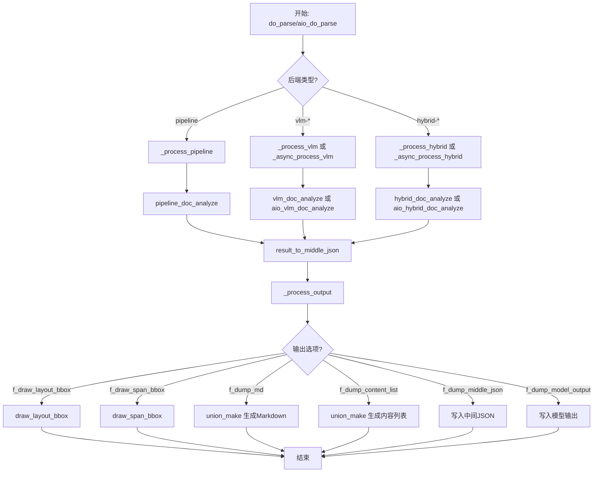

## 类结构

```
API入口模块 (无类定义)
├── 全局配置
│   ├── pdf_suffixes
│   ├── image_suffixes
│   └── 环境变量设置
├── 工具函数
│   ├── read_fn
│   ├── prepare_env
│   ├── convert_pdf_bytes_to_bytes_by_pypdfium2
│   └── _prepare_pdf_bytes
├── 处理函数
process_output
process_pipeline
process_vlm
async_process_vlm
process_hybrid
async_process_hybrid
└── 主入口函数
    ├── do_parse (同步)
    └── aio_do_parse (异步)
```

## 全局变量及字段


### `pdf_suffixes`
    
支持的PDF文件后缀列表

类型：`list[str]`
    


### `image_suffixes`
    
支持的图片文件后缀列表，包含png/jpeg/jp2/webp/gif/bmp/jpg/tiff

类型：`list[str]`
    


    

## 全局函数及方法


### `read_fn`

该函数是数据预处理模块的核心读取接口，负责读取指定路径的文件，并根据文件类型返回统一的PDF字节格式。对于图片文件，函数会自动调用图像转PDF工具将其转换为PDF格式；对于PDF文件则直接返回原字节数据；若文件类型不明确则抛出异常。

参数：

- `path`：`str` 或 `Path`，待读取文件的路径，支持字符串或Path对象

返回值：`bytes`，PDF格式的字节数据

#### 流程图

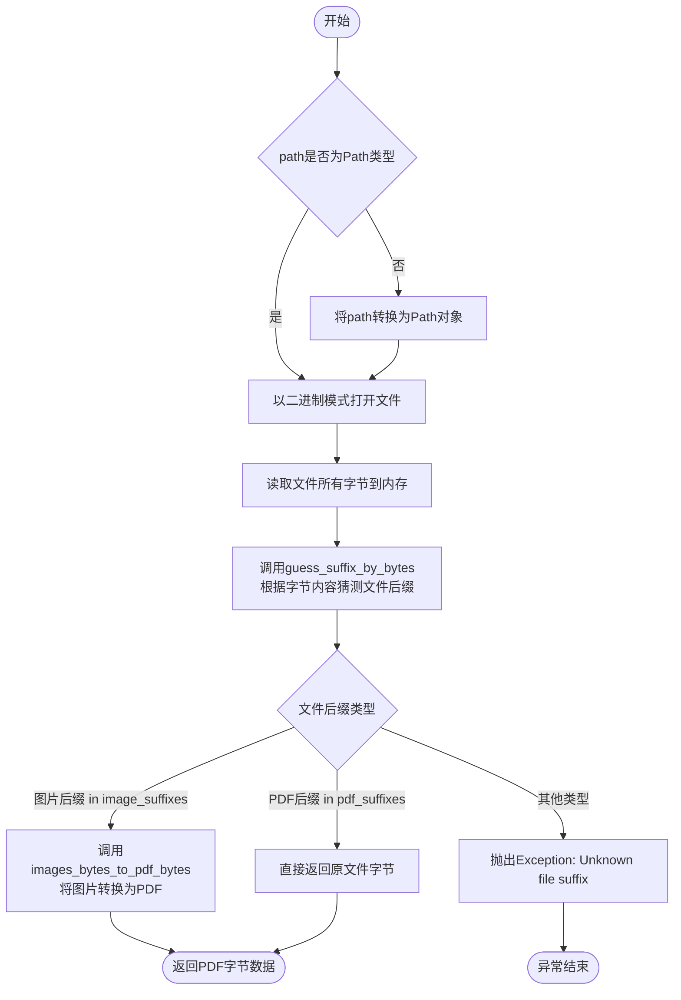

#### 带注释源码

```python
def read_fn(path):
    """
    读取文件并根据文件类型返回PDF字节数据
    
    Args:
        path: 文件路径，str或Path类型
        
    Returns:
        bytes: PDF格式的字节数据
        
    Raises:
        Exception: 当文件后缀无法识别时抛出
    """
    # 将字符串路径转换为Path对象，确保统一处理
    if not isinstance(path, Path):
        path = Path(path)
    
    # 以二进制读取模式打开文件
    with open(str(path), "rb") as input_file:
        # 读取文件的全部字节内容
        file_bytes = input_file.read()
        
        # 根据文件字节内容（魔术字节）和文件名猜测真实文件类型
        file_suffix = guess_suffix_by_bytes(file_bytes, path)
        
        # 判断是否为图片文件类型列表
        if file_suffix in image_suffixes:
            # 图片文件需要转换为PDF格式返回
            return images_bytes_to_pdf_bytes(file_bytes)
        # 判断是否为PDF文件类型列表
        elif file_suffix in pdf_suffixes:
            # PDF文件直接返回原始字节数据
            return file_bytes
        else:
            # 无法识别的文件类型抛出异常
            raise Exception(f"Unknown file suffix: {file_suffix}")
```


### `prepare_env`

该函数用于准备输出环境，根据输出目录、PDF文件名和解析方法创建必要的目录结构，包括主输出目录和图像子目录，并返回图像目录和主目录的路径。

参数：

- `output_dir`：`str`，基础输出目录路径
- `pdf_file_name`：`str`，PDF文件的名称（不含扩展名）
- `parse_method`：`str`，解析方法的名称，用于构建目录层级

返回值：`tuple[str, str]`，返回元组 `(local_image_dir, local_md_dir)`，其中 local_image_dir 是图像存储目录路径，local_md_dir 是主输出目录路径

#### 流程图

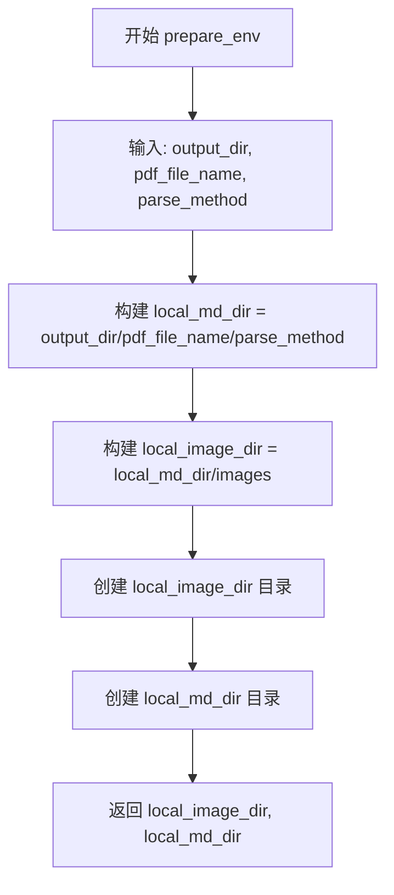

#### 带注释源码

```python
def prepare_env(output_dir, pdf_file_name, parse_method):
    """
    准备输出环境，创建必要的目录结构
    
    参数:
        output_dir: 基础输出目录路径
        pdf_file_name: PDF文件名（不含扩展名）
        parse_method: 解析方法名称，用于构建子目录
    
    返回:
        tuple: (local_image_dir, local_md_dir) 图像目录和主输出目录
    """
    # 拼接主输出目录路径: output_dir/pdf_file_name/parse_method
    local_md_dir = str(os.path.join(output_dir, pdf_file_name, parse_method))
    # 拼接图像目录路径: output_dir/pdf_file_name/parse_method/images
    local_image_dir = os.path.join(str(local_md_dir), "images")
    # 创建图像目录，若已存在则不报错
    os.makedirs(local_image_dir, exist_ok=True)
    # 创建主输出目录，若已存在则不报错
    os.makedirs(local_md_dir, exist_ok=True)
    # 返回图像目录和主输出目录的路径
    return local_image_dir, local_md_dir
```


### `convert_pdf_bytes_to_bytes_by_pypdfium2`

该函数使用 pypdfium2 库对 PDF 字节数据进行裁剪处理，根据指定的起始页码和结束页码提取PDF的指定页面，生成一个新的PDF字节数据并返回。

参数：

- `pdf_bytes`：`bytes`，输入的原始 PDF 文件字节数据
- `start_page_id`：`int`，起始页码，默认为 0，表示从第一页开始（注意：PDF页码从0开始计数）
- `end_page_id`：`int | None`，结束页码，默认为 None，表示到最后一页结束

返回值：`bytes`，裁剪后的 PDF 字节数据，如果裁剪失败则返回原始 PDF 字节数据

#### 流程图

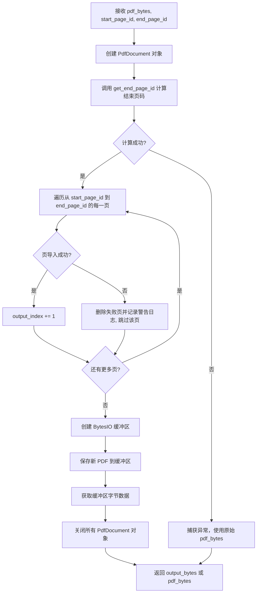

#### 带注释源码

```python
def convert_pdf_bytes_to_bytes_by_pypdfium2(pdf_bytes, start_page_id=0, end_page_id=None):
    """
    使用 pypdfium2 库裁剪 PDF 字节数据，指定起始和结束页码
    
    参数:
        pdf_bytes: 输入的 PDF 字节数据
        start_page_id: 起始页码，默认为 0（第一页）
        end_page_id: 结束页码，默认为 None（最后一页）
    
    返回:
        裁剪后的 PDF 字节数据，失败时返回原始字节数据
    """
    # 从字节数据创建 PDF 文档对象
    pdf = pdfium.PdfDocument(pdf_bytes)
    # 创建一个新的空白 PDF 文档用于存放裁剪后的页面
    output_pdf = pdfium.PdfDocument.new()
    
    try:
        # 计算实际结束页码，如果传入 None 则使用 PDF 总页数
        end_page_id = get_end_page_id(end_page_id, len(pdf))

        # 逐页导入,失败则跳过
        output_index = 0
        # 遍历指定页码范围内的每一页
        for page_index in range(start_page_id, end_page_id + 1):
            try:
                # 将当前页导入到新 PDF 文档中
                output_pdf.import_pages(pdf, pages=[page_index])
                output_index += 1
            except Exception as page_error:
                # 如果导入失败，删除已添加的页面并记录警告
                output_pdf.del_page(output_index)
                logger.warning(f"Failed to import page {page_index}: {page_error}, skipping this page.")
                continue

        # 将新PDF保存到内存缓冲区
        output_buffer = io.BytesIO()
        output_pdf.save(output_buffer)

        # 获取字节数据
        output_bytes = output_buffer.getvalue()
    except Exception as e:
        # 整体转换失败时，记录警告并返回原始 PDF 字节数据
        logger.warning(f"Error in converting PDF bytes: {e}, Using original PDF bytes.")
        output_bytes = pdf_bytes
    
    # 关闭 PDF 文档对象释放资源
    pdf.close()
    output_pdf.close()
    
    # 返回裁剪后的字节数据或原始字节数据
    return output_bytes
```


### `_prepare_pdf_bytes`

批量预处理PDF字节数据列表，根据指定的页码范围提取PDF页面，输出处理后的PDF字节数据列表。

参数：

- `pdf_bytes_list`：`list[bytes]`，待处理的PDF字节数据列表
- `start_page_id`：`int`，提取的起始页码（从0开始计数）
- `end_page_id`：`int | None`，提取的结束页码（包含该页），若为None则表示处理到最后一页

返回值：`list[bytes]`，处理后的PDF字节数据列表，每个元素对应原始列表中对应PDF的指定页面范围

#### 流程图

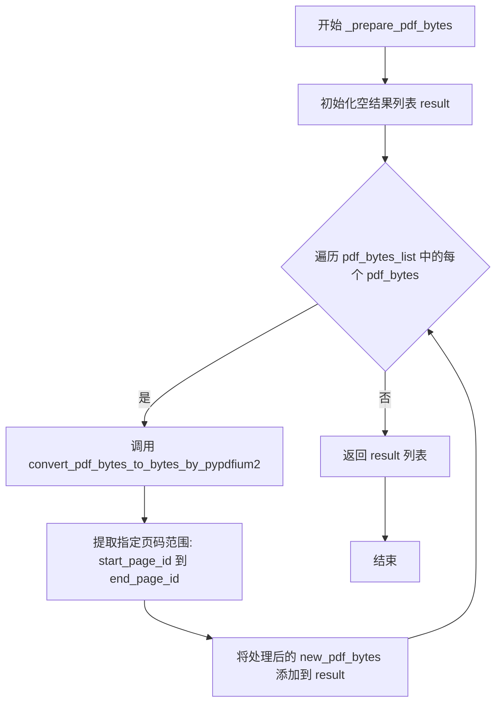

#### 带注释源码

```python
def _prepare_pdf_bytes(pdf_bytes_list, start_page_id, end_page_id):
    """
    准备处理PDF字节数据
    
    遍历PDF字节列表，对每个PDF应用页码范围裁剪，生成新的PDF字节数据。
    该函数是PDF预处理流程的关键环节，用于支持多页PDF的指定页面解析。
    
    参数:
        pdf_bytes_list: list[bytes] - PDF字节数据列表，每个元素对应一个PDF文件的字节内容
        start_page_id: int - 起始页码，从0开始计数
        end_page_id: int | None - 结束页码（包含该页），None表示处理到最后一页
        
    返回:
        list[bytes] - 处理后的PDF字节数据列表，长度与输入列表相同
    """
    # 初始化结果列表，用于存储处理后的PDF字节数据
    result = []
    
    # 遍历输入的每个PDF字节数据
    for pdf_bytes in pdf_bytes_list:
        # 调用底层转换函数，根据页码范围提取PDF页面
        # convert_pdf_bytes_to_bytes_by_pypdfium2 函数内部会处理页码边界、异常等情况
        new_pdf_bytes = convert_pdf_bytes_to_bytes_by_pypdfium2(pdf_bytes, start_page_id, end_page_id)
        
        # 将处理后的PDF字节添加到结果列表
        result.append(new_pdf_bytes)
    
    # 返回处理完成的结果列表
    return result
```

---

#### 依赖函数说明

该函数依赖于 `convert_pdf_bytes_to_bytes_by_pypdfium2` 函数，该函数使用 `pypdfium2` 库实现PDF页面的提取与重组：

```python
def convert_pdf_bytes_to_bytes_by_pypdfium2(pdf_bytes, start_page_id=0, end_page_id=None):
    """
    使用pypdfium2库将PDF字节数据按页码范围提取并转换为新的PDF字节
    
    关键逻辑:
    1. 使用pdfium.PdfDocument加载PDF
    2. 调用get_end_page_id计算实际结束页码
    3. 逐页import_pages到新PDF对象，跳过失败页面
    4. 将新PDF保存到BytesIO缓冲区并返回字节数据
    """
    # ... 实现细节见原始代码
```

#### 调用上下文

该函数在 `do_parse` 和 `aio_do_parse` 函数中被调用，用于在PDF解析前预处理PDF字节数据：

```python
# 在 do_parse 函数中
pdf_bytes_list = _prepare_pdf_bytes(pdf_bytes_list, start_page_id, end_page_id)
```

这确保了无论后端是 pipeline、VLM 还是 hybrid，处理的都是经过页码裁剪的PDF数据。


### `_process_output`

该函数是 PDF 解析流程中的**结果输出模块**，负责将解析推理阶段产生的中间数据（`pdf_info`, `middle_json`, `model_output`）根据调用方传入的开关标志（flag），渲染并持久化到本地文件系统。它支持输出 Markdown 文件、内容列表 JSON、可视化边界框的 PDF 以及原始文件副本。

#### 参数

- `pdf_info`：字典，包含 PDF 的结构化信息（如页面尺寸、布局块等）。
- `pdf_bytes`：字节串，PDF 文件的原始二进制内容。
- `pdf_file_name`：字符串，PDF 文件的名称（不含路径），用于构造输出文件名。
- `local_md_dir`：字符串，目标 Markdown 文件的输出目录路径。
- `local_image_dir`：字符串，目标图片的输出目录路径。
- `md_writer`：`FileBasedDataWriter` 实例，用于执行具体的文件写入操作。
- `f_draw_layout_bbox`：布尔值，是否生成并保存包含布局边界框的可视化 PDF。
- `f_draw_span_bbox`：布尔值，是否生成并保存包含Span（行内元素）边界框的可视化 PDF。
- `f_dump_orig_pdf`：布尔值，是否保存原始输入的 PDF 文件。
- `f_dump_md`：布尔值，是否生成并保存 Markdown 格式的解析结果。
- `f_dump_content_list`：布尔值，是否生成并保存结构化的内容列表 JSON。
- `f_dump_middle_json`：布尔值，是否保存中间层级的 JSON 数据。
- `f_dump_model_output`：布尔值，是否保存原始模型推理的原始输出 JSON。
- `f_make_md_mode`：`MakeMode` 枚举，指定生成 Markdown 或内容列表时使用的策略（如 MM_MD, CONTENT_LIST 等）。
- `middle_json`：字典，由推理后处理生成的中间 JSON 结构，包含了提取出的文本、坐标、样式信息。
- `model_output`：字典（可选），模型推理的原始结果，仅在需要保存原始输出时传递。
- `is_pipeline`：布尔值，标记当前调用来源于 Pipeline 后端还是 VLM/Hybrid 后端，以决定内容生成的函数逻辑。

#### 返回值

`None`。该函数通过副作用（写入文件）完成工作，不返回任何数据。

#### 流程图

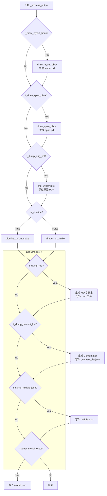

#### 带注释源码

```python
def _process_output(
        pdf_info,
        pdf_bytes,
        pdf_file_name,
        local_md_dir,
        local_image_dir,
        md_writer,
        f_draw_layout_bbox,
        f_draw_span_bbox,
        f_dump_orig_pdf,
        f_dump_md,
        f_dump_content_list,
        f_dump_middle_json,
        f_dump_model_output,
        f_make_md_mode,
        middle_json,
        model_output=None,
        is_pipeline=True
):
    # 注意：f_draw_line_sort_bbox 在此函数中定义为 False，但在后续逻辑中未被使用，属于死代码或未完成功能
    f_draw_line_sort_bbox = False 
    
    # 动态导入，避免循环依赖
    from mineru.backend.pipeline.pipeline_middle_json_mkcontent import union_make as pipeline_union_make
    
    """处理输出文件"""
    
    # 1. 处理布局可视化 PDF
    if f_draw_layout_bbox:
        draw_layout_bbox(pdf_info, pdf_bytes, local_md_dir, f"{pdf_file_name}_layout.pdf")

    # 2. 处理 Span 可视化 PDF
    if f_draw_span_bbox:
        draw_span_bbox(pdf_info, pdf_bytes, local_md_dir, f"{pdf_file_name}_span.pdf")

    # 3. 处理原始 PDF 存档
    if f_dump_orig_pdf:
        md_writer.write(
            f"{pdf_file_name}_origin.pdf",
            pdf_bytes,
        )

    # 注意：以下分支逻辑中 f_draw_line_sort_bbox 始终为 False，此代码块永不执行
    if f_draw_line_sort_bbox:
        draw_line_sort_bbox(pdf_info, pdf_bytes, local_md_dir, f"{pdf_file_name}_line_sort.pdf")

    # 获取图片目录的基名，用于在 Markdown 中拼接图片路径
    image_dir = str(os.path.basename(local_image_dir))

    # 4. 处理 Markdown 和 Content List 的生成逻辑
    # 根据 is_pipeline 标志选择不同的生成函数（Pipeline 后端 vs VLM/Hybrid 后端）
    if f_dump_md or f_dump_content_list:
        # 选择联合生成函数：Pipeline 使用 pipeline_union_make，VLM 使用 vlm_union_make
        make_func = pipeline_union_make if is_pipeline else vlm_union_make
        
        # 如果需要生成 Markdown
        if f_dump_md:
            # 调用内容生成函数，传入 pdf_info, 生成模式和图片目录
            md_content_str = make_func(pdf_info, f_make_md_mode, image_dir)
            md_writer.write_string(
                f"{pdf_file_name}.md",
                md_content_str,
            )

        # 如果需要生成内容列表 JSON
        if f_dump_content_list:
            content_list = make_func(pdf_info, MakeMode.CONTENT_LIST, image_dir)
            md_writer.write_string(
                f"{pdf_file_name}_content_list.json",
                json.dumps(content_list, ensure_ascii=False, indent=4),
            )
            
            # 如果不是 Pipeline 模式，额外生成一版 V2 格式的内容列表
            if not is_pipeline:
                content_list_v2 = make_func(pdf_info, MakeMode.CONTENT_LIST_V2, image_dir)
                md_writer.write_string(
                    f"{pdf_file_name}_content_list_v2.json",
                    json.dumps(content_list_v2, ensure_ascii=False, indent=4),
                )

    # 5. 保存中间 JSON (Middle JSON)
    if f_dump_middle_json:
        md_writer.write_string(
            f"{pdf_file_name}_middle.json",
            json.dumps(middle_json, ensure_ascii=False, indent=4),
        )

    # 6. 保存模型原始输出
    if f_dump_model_output:
        md_writer.write_string(
            f"{pdf_file_name}_model.json",
            json.dumps(model_output, ensure_ascii=False, indent=4),
        )

    logger.info(f"local output dir is {local_md_dir}")
```


### `_process_pipeline`

该函数是处理 Pipeline 后端的同步逻辑核心函数，负责调用 Pipeline 分析器对 PDF 字节数据进行推理分析，生成中间 JSON，并调用输出处理模块将结果写入指定目录。

参数：

- `output_dir`：`str`，输出目录路径，用于存储处理结果
- `pdf_file_names`：`list[str]`，PDF 文件名列表，与 `pdf_bytes_list` 一一对应
- `pdf_bytes_list`：`list[bytes]`，PDF 文件字节数据列表
- `p_lang_list`：`list[str]`，语言列表，用于指定每个 PDF 的语言
- `parse_method`：`str`，解析方法，如 "auto" 等
- `p_formula_enable`：`bool`，是否启用公式识别
- `p_table_enable`：`bool`，是否启用表格识别
- `f_draw_layout_bbox`：`bool`，是否绘制布局边界框
- `f_draw_span_bbox`：`bool`，是否绘制跨度边界框
- `f_dump_md`：`bool`，是否输出 Markdown 文件
- `f_dump_middle_json`：`bool`，是否输出中间 JSON 文件
- `f_dump_model_output`：`bool`，是否输出模型原始输出
- `f_dump_orig_pdf`：`bool`，是否保留原始 PDF 文件
- `f_dump_content_list`：`bool`，是否输出内容列表 JSON
- `f_make_md_mode`：`MakeMode`，Markdown 生成模式

返回值：`None`，该函数无返回值，结果直接写入文件系统

#### 流程图

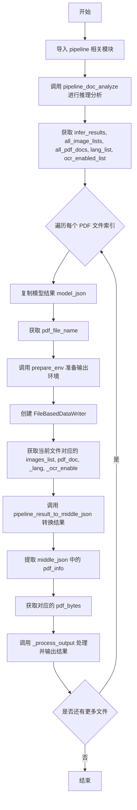

#### 带注释源码

```python
def _process_pipeline(
        output_dir,
        pdf_file_names,
        pdf_bytes_list,
        p_lang_list,
        parse_method,
        p_formula_enable,
        p_table_enable,
        f_draw_layout_bbox,
        f_draw_span_bbox,
        f_dump_md,
        f_dump_middle_json,
        f_dump_model_output,
        f_dump_orig_pdf,
        f_dump_content_list,
        f_make_md_mode,
):
    """处理pipeline后端逻辑"""
    # 延迟导入，避免循环依赖
    from mineru.backend.pipeline.model_json_to_middle_json import result_to_middle_json as pipeline_result_to_middle_json
    from mineru.backend.pipeline.pipeline_analyze import doc_analyze as pipeline_doc_analyze

    # 调用 pipeline 分析器进行推理，返回推理结果、图像列表、PDF文档、语言列表、OCR启用状态列表
    infer_results, all_image_lists, all_pdf_docs, lang_list, ocr_enabled_list = (
        pipeline_doc_analyze(
            pdf_bytes_list, p_lang_list, parse_method=parse_method,
            formula_enable=p_formula_enable, table_enable=p_table_enable
        )
    )

    # 遍历每个 PDF 文件的处理结果
    for idx, model_list in enumerate(infer_results):
        # 深拷贝模型结果，保留原始输出
        model_json = copy.deepcopy(model_list)
        # 获取当前 PDF 文件名
        pdf_file_name = pdf_file_names[idx]
        # 准备输出环境，创建本地图像目录和 Markdown 目录
        local_image_dir, local_md_dir = prepare_env(output_dir, pdf_file_name, parse_method)
        # 创建基于文件的数据写入器
        image_writer, md_writer = FileBasedDataWriter(local_image_dir), FileBasedDataWriter(local_md_dir)

        # 获取当前文件对应的图像列表、PDF 文档、语言和 OCR 启用状态
        images_list = all_image_lists[idx]
        pdf_doc = all_pdf_docs[idx]
        _lang = lang_list[idx]
        _ocr_enable = ocr_enabled_list[idx]

        # 将模型结果转换为中间 JSON 格式
        middle_json = pipeline_result_to_middle_json(
            model_list, images_list, pdf_doc, image_writer,
            _lang, _ocr_enable, p_formula_enable
        )

        # 从中间 JSON 中提取 pdf_info
        pdf_info = middle_json["pdf_info"]
        # 获取当前 PDF 的字节数据
        pdf_bytes = pdf_bytes_list[idx]

        # 调用输出处理函数，将结果写入指定目录
        _process_output(
            pdf_info, pdf_bytes, pdf_file_name, local_md_dir, local_image_dir,
            md_writer, f_draw_layout_bbox, f_draw_span_bbox, f_dump_orig_pdf,
            f_dump_md, f_dump_content_list, f_dump_middle_json, f_dump_model_output,
            f_make_md_mode, middle_json, model_json, is_pipeline=True
        )
```


### `_process_vlm`

同步处理VLM后端逻辑，遍历PDF文件列表，调用VLM分析器进行文档分析，并输出处理结果到指定目录。

参数：

- `output_dir`：`str`，输出目录路径
- `pdf_file_names`：`list[str]`，PDF文件名列表
- `pdf_bytes_list`：`list[bytes]`，PDF字节数据列表
- `backend`：`str`，VLM后端类型（如huggingface、vllm-engine等）
- `f_draw_layout_bbox`：`bool`，是否绘制布局边界框
- `f_draw_span_bbox`：`bool`，是否绘制span边界框（此函数中固定为False）
- `f_dump_md`：`bool`，是否导出MD文件
- `f_dump_middle_json`：`bool`，是否导出中间JSON
- `f_dump_model_output`：`bool`，是否导出模型输出
- `f_dump_orig_pdf`：`bool`，是否导出原始PDF
- `f_dump_content_list`：`bool`，是否导出内容列表
- `f_make_md_mode`：`MakeMode`，生成MD的模式
- `server_url`：`str | None`，服务器URL（当backend以"client"结尾时使用）
- `**kwargs`：其他关键字参数，传递给VLM分析器

返回值：`None`，无返回值

#### 流程图

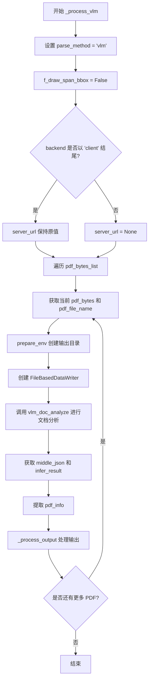

#### 带注释源码

```python
def _process_vlm(
        output_dir,
        pdf_file_names,
        pdf_bytes_list,
        backend,
        f_draw_layout_bbox,
        f_draw_span_bbox,
        f_dump_md,
        f_dump_middle_json,
        f_dump_model_output,
        f_dump_orig_pdf,
        f_dump_content_list,
        f_make_md_mode,
        server_url=None,
        **kwargs,
):
    """同步处理VLM后端逻辑"""
    # 设置解析方法为VLM
    parse_method = "vlm"
    # VLM后端不支持span bbox绘制，强制设为False
    f_draw_span_bbox = False
    
    # 如果backend不是以"client"结尾，则不使用server_url
    # 只有客户端模式才需要server_url
    if not backend.endswith("client"):
        server_url = None

    # 遍历每个PDF文件进行处理
    for idx, pdf_bytes in enumerate(pdf_bytes_list):
        # 获取当前PDF的文件名
        pdf_file_name = pdf_file_names[idx]
        
        # 准备输出环境，创建必要的目录结构
        # 返回image目录路径和md输出目录路径
        local_image_dir, local_md_dir = prepare_env(output_dir, pdf_file_name, parse_method)
        
        # 创建文件写入器，用于写入图片和MD文件
        image_writer, md_writer = FileBasedDataWriter(local_image_dir), FileBasedDataWriter(local_md_dir)

        # 调用VLM文档分析器进行文档分析
        # 返回中间JSON格式的结果和推理结果
        middle_json, infer_result = vlm_doc_analyze(
            pdf_bytes, image_writer=image_writer, backend=backend, server_url=server_url, **kwargs,
        )

        # 从中间JSON中提取PDF信息
        pdf_info = middle_json["pdf_info"]

        # 调用通用输出处理函数
        # 处理并保存各种格式的输出文件
        _process_output(
            pdf_info, pdf_bytes, pdf_file_name, local_md_dir, local_image_dir,
            md_writer, f_draw_layout_bbox, f_draw_span_bbox, f_dump_orig_pdf,
            f_dump_md, f_dump_content_list, f_dump_middle_json, f_dump_model_output,
            f_make_md_mode, middle_json, infer_result, is_pipeline=False
        )
```


### `_async_process_vlm`

该函数是一个异步协程，用于处理基于视觉语言模型（VLM）的PDF文档解析流程。它接收PDF文件列表，通过`aio_vlm_doc_analyze`调用VLM后端进行异步推理，并将解析结果（包含中间JSON、Markdown内容、图像等）写入指定的输出目录。

参数：

- `output_dir`：`str`，输出目录的路径，用于存放生成的图像、Markdown文件和JSON文件。
- `pdf_file_names`：`list[str]`，PDF文件名列表，与`pdf_bytes_list`一一对应。
- `pdf_bytes_list`：`list[bytes]`，PDF文件的字节数据列表。
- `backend`：`str`，VLM推理后端标识符（如'huggingface', 'openai'等）。
- `f_draw_layout_bbox`：`bool`，是否绘制并保存布局边界框。
- `f_draw_span_bbox`：`bool`，是否绘制并保存Span边界框（内部强制设为False）。
- `f_dump_md`：`bool`，是否生成并保存Markdown格式的文档内容。
- `f_dump_middle_json`：`bool`，是否保存中间结构的JSON数据。
- `f_dump_model_output`：`bool`，是否保存原始模型输出结果。
- `f_dump_orig_pdf`：`bool`，是否保存原始PDF文件的副本。
- `f_dump_content_list`：`bool`，是否保存内容列表（JSON格式）。
- `f_make_md_mode`：`MakeMode`，指定生成Markdown的模式（如MM_MD）。
- `server_url`：`str`，可选参数，提供给后端的服务器URL，仅当backend以"client"结尾时有效。
- `**kwargs`：`dict`，传递给VLM分析引擎的其他额外关键字参数。

返回值：`None`，该函数通过异步调用执行副作用（写入文件），不返回显式的业务数据。

#### 流程图

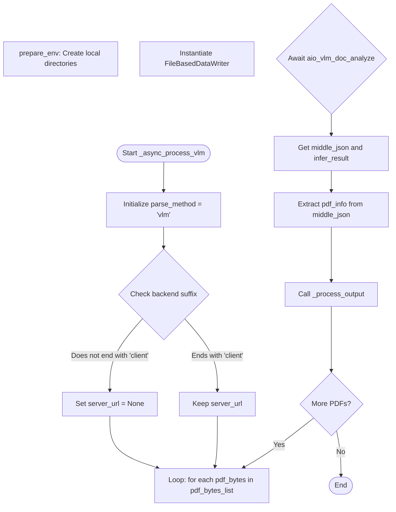

#### 带注释源码

```python
async def _async_process_vlm(
        output_dir,
        pdf_file_names,
        pdf_bytes_list,
        backend,
        f_draw_layout_bbox,
        f_draw_span_bbox,
        f_dump_md,
        f_dump_middle_json,
        f_dump_model_output,
        f_dump_orig_pdf,
        f_dump_content_list,
        f_make_md_mode,
        server_url=None,
        **kwargs,
):
    """异步处理VLM后端逻辑"""
    # 设定解析方法为 VLM
    parse_method = "vlm"
    # VLM 后端通常不生成 span bbox，强制关闭
    f_draw_span_bbox = False
    
    # 如果 backend 不是以 "client" 结尾，则视为本地模型，server_url 无效
    if not backend.endswith("client"):
        server_url = None

    # 遍历每一个 PDF 文件
    for idx, pdf_bytes in enumerate(pdf_bytes_list):
        pdf_file_name = pdf_file_names[idx]
        
        # 准备输出目录结构
        local_image_dir, local_md_dir = prepare_env(output_dir, pdf_file_name, parse_method)
        
        # 初始化数据写入器
        image_writer, md_writer = FileBasedDataWriter(local_image_dir), FileBasedDataWriter(local_md_dir)

        # 异步调用 VLM 文档分析引擎
        middle_json, infer_result = await aio_vlm_doc_analyze(
            pdf_bytes, image_writer=image_writer, backend=backend, server_url=server_url, **kwargs,
        )

        # 从返回的 middle_json 中提取 pdf_info
        pdf_info = middle_json["pdf_info"]

        # 处理并保存输出结果（MD, JSON, 图片等）
        _process_output(
            pdf_info, pdf_bytes, pdf_file_name, local_md_dir, local_image_dir,
            md_writer, f_draw_layout_bbox, f_draw_span_bbox, f_dump_orig_pdf,
            f_dump_md, f_dump_content_list, f_dump_middle_json, f_dump_model_output,
            f_make_md_mode, middle_json, infer_result, is_pipeline=False
        )
```


### `_process_hybrid`

同步处理hybrid后端逻辑的入口函数，负责协调传统方法和VLM模型进行PDF文档分析，将处理结果输出到指定目录。

参数：

- `output_dir`：`str`，输出目录的根路径，用于存放所有处理结果
- `pdf_file_names`：`list[str]`，待处理的PDF文件名列表，与`pdf_bytes_list`一一对应
- `pdf_bytes_list`：`list[bytes]`，PDF文件的字节数据列表，每个元素对应一个PDF文件
- `h_lang_list`：`list[str]`，语言列表，用于指定每个PDF文档的语言
- `parse_method`：`str`，解析方法（如"auto"等），传递给hybrid分析器
- `inline_formula_enable`：`bool`，是否启用行内公式识别
- `backend`：`str`，VLM后端类型（如"vllm-engine"、"huggingface"等）
- `f_draw_layout_bbox`：`bool`，是否绘制布局边界框并保存到PDF
- `f_draw_span_bbox`：`bool`，是否绘制span边界框并保存到PDF（hybrid模式固定为False）
- `f_dump_md`：`bool`，是否将处理结果保存为Markdown文件
- `f_dump_middle_json`：`bool`，是否保存中间JSON格式的处理结果
- `f_dump_model_output`：`bool`，是否保存模型原始输出
- `f_dump_orig_pdf`：`bool`，是否保存原始输入PDF文件
- `f_dump_content_list`：`bool`，是否保存内容列表JSON文件
- `f_make_md_mode`：`MakeMode`，Markdown生成模式（如`MakeMode.MM_MD`）
- `server_url`：`str | None`，远程推理服务的URL，仅当backend以"client"结尾时生效
- `**kwargs`：`dict`，其他可选参数，传递给hybrid分析器

返回值：`None`，该函数通过回调`_process_output`将结果写入文件系统

#### 流程图

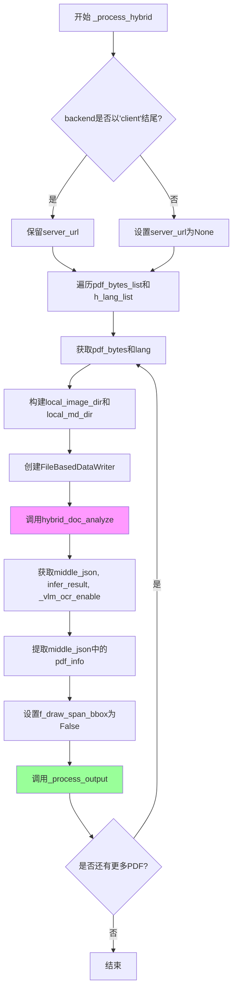

#### 带注释源码

```python
def _process_hybrid(
        output_dir,
        pdf_file_names,
        pdf_bytes_list,
        h_lang_list,
        parse_method,
        inline_formula_enable,
        backend,
        f_draw_layout_bbox,
        f_draw_span_bbox,
        f_dump_md,
        f_dump_middle_json,
        f_dump_model_output,
        f_dump_orig_pdf,
        f_dump_content_list,
        f_make_md_mode,
        server_url=None,
        **kwargs,
):
    # 动态导入hybrid分析模块，避免循环依赖
    from mineru.backend.hybrid.hybrid_analyze import doc_analyze as hybrid_doc_analyze
    
    """同步处理hybrid后端逻辑"""
    
    # 仅当backend以"client"结尾时才使用远程server_url
    # 否则设置为None，使用本地推理服务
    if not backend.endswith("client"):
        server_url = None

    # 遍历每个PDF文件进行逐个处理
    for idx, (pdf_bytes, lang) in enumerate(zip(pdf_bytes_list, h_lang_list)):
        # 获取当前PDF的文件名
        pdf_file_name = pdf_file_names[idx]
        
        # 准备输出目录：创建hybrid_{parse_method}子目录
        local_image_dir, local_md_dir = prepare_env(
            output_dir, 
            pdf_file_name, 
            f"hybrid_{parse_method}"
        )
        
        # 创建数据写入器，分别用于图像和Markdown/JSON文件
        image_writer, md_writer = (
            FileBasedDataWriter(local_image_dir), 
            FileBasedDataWriter(local_md_dir)
        )

        # 调用hybrid核心分析函数
        # 结合传统OCR方法和VLM模型进行文档理解
        middle_json, infer_result, _vlm_ocr_enable = hybrid_doc_analyze(
            pdf_bytes,
            image_writer=image_writer,
            backend=backend,
            parse_method=parse_method,
            language=lang,
            inline_formula_enable=inline_formula_enable,
            server_url=server_url,
            **kwargs,
        )

        # 从middle_json中提取pdf_info，用于后续处理
        pdf_info = middle_json["pdf_info"]

        # 在hybrid模式下，固定关闭span bbox绘制
        # （原因：VLM+OCR混合模式下span绘制逻辑不同）
        # f_draw_span_bbox = not _vlm_ocr_enable
        f_draw_span_bbox = False

        # 调用通用输出处理函数
        # 将分析结果写入各种格式的输出文件
        _process_output(
            pdf_info, pdf_bytes, pdf_file_name, local_md_dir, local_image_dir,
            md_writer, f_draw_layout_bbox, f_draw_span_bbox, f_dump_orig_pdf,
            f_dump_md, f_dump_content_list, f_dump_middle_json, f_dump_model_output,
            f_make_md_mode, middle_json, infer_result, is_pipeline=False
        )
```


### `_async_process_hybrid`

异步处理 hybrid 后端逻辑的函数，用于对多个 PDF 文件进行混合模式（hybrid）解析，支持 VLM 和 OCR 混合处理，并通过异步方式提升处理效率。

参数：

- `output_dir`：`str`，输出目录路径，指定解析结果存放的根目录
- `pdf_file_names`：`list[str]`，PDF 文件名列表，与 `pdf_bytes_list` 一一对应
- `pdf_bytes_list`：`list[bytes]`，PDF 字节数据列表，每个元素对应一个 PDF 文件的二进制内容
- `h_lang_list`：`list[str]`，语言列表，用于指定每个 PDF 文件的语言（支持多语言如 "ch", "en" 等）
- `parse_method`：`str`，解析方法，如 "auto" 或其他自定义解析方式
- `inline_formula_enable`：`bool`，是否启用内联公式识别
- `backend`：`str`，推理后端类型，如 "vllm-engine", "huggingface" 等
- `f_draw_layout_bbox`：`bool`，是否绘制并保存布局边界框可视化 PDF
- `f_draw_span_bbox`：`bool`，是否绘制并保存 Span 边界框可视化 PDF（hybrid 模式下固定为 False）
- `f_dump_md`：`bool`，是否生成并保存 Markdown 格式的输出文件
- `f_dump_middle_json`：`bool`，是否生成并保存中间 JSON 结果
- `f_dump_model_output`：`bool`，是否保存模型原始输出结果
- `f_dump_orig_pdf`：`bool`，是否保存原始 PDF 文件副本
- `f_dump_content_list`：`bool`，是否生成并保存内容列表 JSON
- `f_make_md_mode`：`MakeMode`，生成 Markdown 的模式，枚举类型（如 MM_MD, CONTENT_LIST 等）
- `server_url`：`str`（可选），远程推理服务器的 URL，当 backend 以 "client" 结尾时生效
- `**kwargs`：`dict`（可选），传递给底层推理引擎的其他可选参数

返回值：`None`，函数直接处理并写入文件，不返回数据

#### 流程图

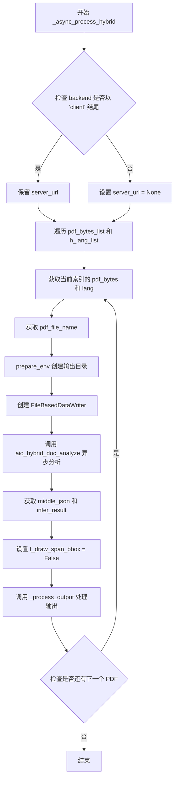

#### 带注释源码

```python
async def _async_process_hybrid(
        output_dir,
        pdf_file_names,
        pdf_bytes_list,
        h_lang_list,
        parse_method,
        inline_formula_enable,
        backend,
        f_draw_layout_bbox,
        f_draw_span_bbox,
        f_dump_md,
        f_dump_middle_json,
        f_dump_model_output,
        f_dump_orig_pdf,
        f_dump_content_list,
        f_make_md_mode,
        server_url=None,
        **kwargs,
):
    # 从 mineru.backend.hybrid.hybrid_analyze 导入异步分析函数
    from mineru.backend.hybrid.hybrid_analyze import aio_doc_analyze as aio_hybrid_doc_analyze
    
    """异步处理hybrid后端逻辑"""
    
    # 如果 backend 不是以 "client" 结尾，则不使用远程服务器
    # 这样可以支持本地推理后端（如 vllm-engine, huggingface 等）
    if not backend.endswith("client"):
        server_url = None

    # 遍历所有 PDF 文件，逐个处理
    for idx, (pdf_bytes, lang) in enumerate(zip(pdf_bytes_list, h_lang_list)):
        # 获取当前 PDF 对应的文件名
        pdf_file_name = pdf_file_names[idx]
        
        # 准备输出目录结构，目录名包含 hybrid_ 前缀以区分不同后端
        # 例如: output_dir/pipeline_auto/hybrid_auto/
        local_image_dir, local_md_dir = prepare_env(output_dir, pdf_file_name, f"hybrid_{parse_method}")
        
        # 创建图像和 Markdown 文件的写入器
        image_writer, md_writer = FileBasedDataWriter(local_image_dir), FileBasedDataWriter(local_md_dir)

        # 调用异步的 hybrid 文档分析函数
        # 该函数会返回中间 JSON、推理结果以及 VLM OCR 是否启用的标志
        middle_json, infer_result, _vlm_ocr_enable = await aio_hybrid_doc_analyze(
            pdf_bytes,
            image_writer=image_writer,
            backend=backend,
            parse_method=parse_method,
            language=lang,
            inline_formula_enable=inline_formula_enable,
            server_url=server_url,
            **kwargs,
        )

        # 从中间 JSON 中提取 PDF 信息
        pdf_info = middle_json["pdf_info"]

        # 在 hybrid 模式下，无论 _vlm_ocr_enable 值如何，都不绘制 span bbox
        # 这是因为 hybrid 模式的输出格式与 pipeline/VLM 模式不同
        # f_draw_span_bbox = not _vlm_ocr_enable  # 原逻辑已注释
        f_draw_span_bbox = False

        # 调用通用的输出处理函数
        # is_pipeline=False 表示使用 VLM 模式的输出生成函数
        _process_output(
            pdf_info, pdf_bytes, pdf_file_name, local_md_dir, local_image_dir,
            md_writer, f_draw_layout_bbox, f_draw_span_bbox, f_dump_orig_pdf,
            f_dump_md, f_dump_content_list, f_dump_middle_json, f_dump_model_output,
            f_make_md_mode, middle_json, infer_result, is_pipeline=False
        )
```


### `do_parse`

该函数是 PDF 解析的主入口函数，同步执行 PDF 解析，支持 pipeline、vlm、hybrid 三种后端模式，根据传入的 `backend` 参数分发到对应的处理函数，最终将解析结果输出到指定目录。

参数：

- `output_dir`：`str`，输出目录路径，用于存放解析结果文件
- `pdf_file_names`：`list[str]`，PDF 文件名列表，与 `pdf_bytes_list` 一一对应
- `pdf_bytes_list`：`list[bytes]`，PDF 文件的字节数据列表，每个元素对应一个 PDF 文件的原始字节
- `p_lang_list`：`list[str]`，语言列表，指定每个 PDF 文件的语言（如 "ch"、"en" 等）
- `backend`：`str`，解析后端类型，可选值为 "pipeline"、"vlm-*" 或 "hybrid-*"（默认为 "pipeline"）
- `parse_method`：`str`，解析方法，"auto" 表示自动选择（默认为 "auto"）
- `formula_enable`：`bool`，是否启用公式识别（默认为 True）
- `table_enable`：`bool`，是否启用表格识别（默认为 True）
- `server_url`：`str | None`，VLM 或 Hybrid 后端的服务器 URL，仅当 backend 以 "client" 结尾时生效
- `f_draw_layout_bbox`：`bool`，是否绘制布局边界框并输出 PDF（默认为 True）
- `f_draw_span_bbox`：`bool`，是否绘制 Span 边界框并输出 PDF（默认为 True）
- `f_dump_md`：`bool`，是否输出 Markdown 文件（默认为 True）
- `f_dump_middle_json`：`bool`，是否输出中间 JSON 文件（默认为 True）
- `f_dump_model_output`：`bool`，是否输出模型推理结果 JSON 文件（默认为 True）
- `f_dump_orig_pdf`：`bool`，是否保留原始 PDF 文件（默认为 True）
- `f_dump_content_list`：`bool`，是否输出内容列表 JSON 文件（默认为 True）
- `f_make_md_mode`：`MakeMode`，Markdown 生成模式，枚举类型（默认为 MakeMode.MM_MD）
- `start_page_id`：`int`，起始页码，从 0 开始计数（默认为 0）
- `end_page_id`：`int | None`，结束页码，None 表示处理到最后一页（默认为 None）
- `**kwargs`：可变关键字参数，传递给底层后端处理函数

返回值：`None`，无返回值（解析结果直接写入文件系统）

#### 流程图

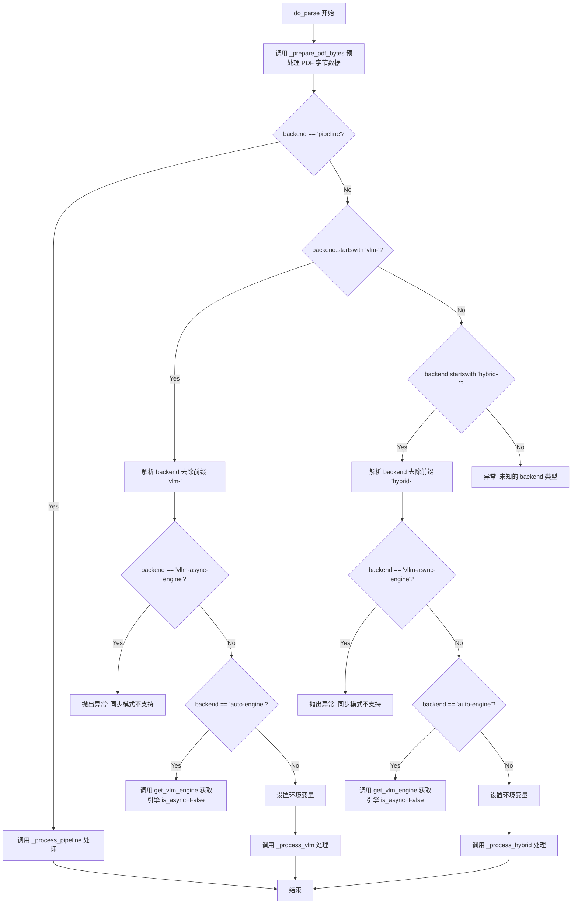

#### 带注释源码

```python
def do_parse(
        output_dir,
        pdf_file_names: list[str],
        pdf_bytes_list: list[bytes],
        p_lang_list: list[str],
        backend="pipeline",
        parse_method="auto",
        formula_enable=True,
        table_enable=True,
        server_url=None,
        f_draw_layout_bbox=True,
        f_draw_span_bbox=True,
        f_dump_md=True,
        f_dump_middle_json=True,
        f_dump_model_output=True,
        f_dump_orig_pdf=True,
        f_dump_content_list=True,
        f_make_md_mode=MakeMode.MM_MD,
        start_page_id=0,
        end_page_id=None,
        **kwargs,
):
    """
    主入口函数，同步执行 PDF 解析。
    
    支持三种后端模式：
    1. pipeline - 使用传统 OCR 和深度学习模型进行解析
    2. vlm-* - 使用视觉语言模型进行解析
    3. hybrid-* - 混合模式，结合 pipeline 和 VLM
    """
    
    # 预处理 PDF 字节数据：根据 start_page_id 和 end_page_id 裁剪 PDF 页面
    pdf_bytes_list = _prepare_pdf_bytes(pdf_bytes_list, start_page_id, end_page_id)

    # 根据 backend 类型分发到不同的处理函数
    if backend == "pipeline":
        # Pipeline 后端：使用传统模型进行解析
        _process_pipeline(
            output_dir, pdf_file_names, pdf_bytes_list, p_lang_list,
            parse_method, formula_enable, table_enable,
            f_draw_layout_bbox, f_draw_span_bbox, f_dump_md, f_dump_middle_json,
            f_dump_model_output, f_dump_orig_pdf, f_dump_content_list, f_make_md_mode
        )
    else:
        # VLM 后端处理分支
        if backend.startswith("vlm-"):
            # 去除 "vlm-" 前缀，获取实际后端类型
            backend = backend[4:]

            # vllm-async-engine 不支持同步模式
            if backend == "vllm-async-engine":
                raise Exception("vlm-vllm-async-engine backend is not supported in sync mode, please use vlm-vllm-engine backend")

            # auto-engine 自动选择推理引擎
            if backend == "auto-engine":
                backend = get_vlm_engine(inference_engine='auto', is_async=False)

            # 设置环境变量，传递给 VLM 后端
            os.environ['MINERU_VLM_FORMULA_ENABLE'] = str(formula_enable)
            os.environ['MINERU_VLM_TABLE_ENABLE'] = str(table_enable)

            # 调用 VLM 同步处理函数
            _process_vlm(
                output_dir, pdf_file_names, pdf_bytes_list, backend,
                f_draw_layout_bbox, f_draw_span_bbox, f_dump_md, f_dump_middle_json,
                f_dump_model_output, f_dump_orig_pdf, f_dump_content_list, f_make_md_mode,
                server_url, **kwargs,
            )
        # Hybrid 后端处理分支
        elif backend.startswith("hybrid-"):
            # 去除 "hybrid-" 前缀，获取实际后端类型
            backend = backend[7:]

            # vllm-async-engine 不支持同步模式
            if backend == "vllm-async-engine":
                raise Exception(
                    "hybrid-vllm-async-engine backend is not supported in sync mode, please use hybrid-vllm-engine backend")

            # auto-engine 自动选择推理引擎
            if backend == "auto-engine":
                backend = get_vlm_engine(inference_engine='auto', is_async=False)

            # 设置环境变量，传递给 Hybrid 后端
            os.environ['MINERU_VLM_TABLE_ENABLE'] = str(table_enable)
            os.environ['MINERU_VLM_FORMULA_ENABLE'] = "true"

            # 调用 Hybrid 同步处理函数
            _process_hybrid(
                output_dir, pdf_file_names, pdf_bytes_list, p_lang_list, parse_method, formula_enable, backend,
                f_draw_layout_bbox, f_draw_span_bbox, f_dump_md, f_dump_middle_json,
                f_dump_model_output, f_dump_orig_pdf, f_dump_content_list, f_make_md_mode,
                server_url, **kwargs,
            )
```


### `aio_do_parse`

#### 描述

`aio_do_parse` 是一个异步入口函数，用于协调不同后端（Pipeline、VLM、Hybrid）对 PDF 文档进行解析。它首先对传入的 PDF 字节流进行预处理（截取页码范围），然后根据 `backend` 参数路由到对应的异步处理函数（对于 VLM 和 Hybrid 后端），或同步处理函数（对于 Pipeline 后端）。该函数还负责配置环境变量以控制公式和表格的解析开关。

#### 参数

- `output_dir`：`str` 或 `Path`，指定解析结果（图片、JSON、MD 文件）的输出目录。
- `pdf_file_names`：`list[str]`，PDF 文件名列表，用于命名输出文件。
- `pdf_bytes_list`：`list[bytes]`，PDF 文件的原始字节数据列表。
- `p_lang_list`：`list[str]`，对应的语言列表（如 `["ch", "en"]`）。
- `backend`：`str`，解析后端引擎，默认为 `"pipeline"`。支持 `"vlm-*"` 和 `"hybrid-*"`。
- `parse_method`：`str`，解析方法，默认为 `"auto"`。
- `formula_enable`：`bool`，是否启用公式检测，默认为 `True`。
- `table_enable`：`bool`，是否启用表格检测，默认为 `True`。
- `server_url`：`str`，可选的外部服务 URL。
- `f_draw_layout_bbox`：`bool`，是否绘制布局边框并保存为 PDF。
- `f_draw_span_bbox`：`bool`，是否绘制 Span 边框并保存为 PDF。
- `f_dump_md`：`bool`，是否生成 Markdown 文件。
- `f_dump_middle_json`：`bool`，是否生成中间 JSON 文件。
- `f_dump_model_output`：`bool`，是否保存模型原始输出。
- `f_dump_orig_pdf`：`bool`，是否保存原始 PDF 副本。
- `f_dump_content_list`：`bool`，是否生成内容列表 JSON。
- `f_make_md_mode`：`MakeMode`，Markdown 生成模式，默认为 `MM_MD`。
- `start_page_id`：`int`，处理的起始页码。
- `end_page_id`：`int`，处理的结束页码。
- `**kwargs`：`dict`，传递给后端处理器的额外关键字参数。

#### 返回值

`None`。该函数通过副作用（写入文件）输出结果，不直接返回数据。

#### 流程图

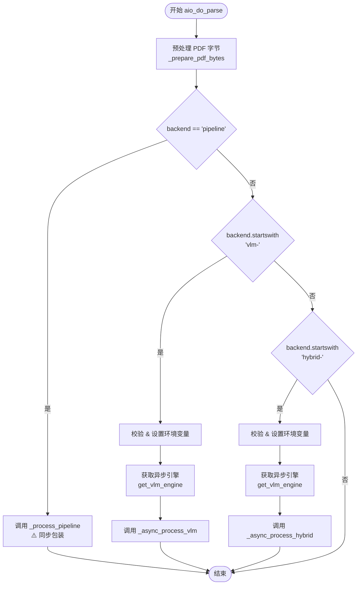

#### 带注释源码

```python
async def aio_do_parse(
        output_dir,
        pdf_file_names: list[str],
        pdf_bytes_list: list[bytes],
        p_lang_list: list[str],
        backend="pipeline",
        parse_method="auto",
        formula_enable=True,
        table_enable=True,
        server_url=None,
        f_draw_layout_bbox=True,
        f_draw_span_bbox=True,
        f_dump_md=True,
        f_dump_middle_json=True,
        f_dump_model_output=True,
        f_dump_orig_pdf=True,
        f_dump_content_list=True,
        f_make_md_mode=MakeMode.MM_MD,
        start_page_id=0,
        end_page_id=None,
        **kwargs,
):
    # 1. 预处理：根据页码范围截取或转换 PDF 字节
    # 将处理好的字节数据存回列表
    pdf_bytes_list = _prepare_pdf_bytes(pdf_bytes_list, start_page_id, end_page_id)

    # 2. 路由逻辑：根据 backend 参数选择不同的处理管道
    if backend == "pipeline":
        # Pipeline 模式在异步函数中暂不支持完全异步，使用同步处理方式
        # 注意：这部分可能会阻塞事件循环
        _process_pipeline(
            output_dir, pdf_file_names, pdf_bytes_list, p_lang_list,
            parse_method, formula_enable, table_enable,
            f_draw_layout_bbox, f_draw_span_bbox, f_dump_md, f_dump_middle_json,
            f_dump_model_output, f_dump_orig_pdf, f_dump_content_list, f_make_md_mode
        )
    else:
        # 处理 VLM 后缀 (例如 vlm-huggingface -> huggingface)
        if backend.startswith("vlm-"):
            backend = backend[4:]

            # 3. 引擎校验：VLM 后端在异步模式下的特殊限制
            if backend == "vllm-engine":
                raise Exception("vlm-vllm-engine backend is not supported in async mode, please use vlm-vllm-async-engine backend")

            # 自动选择推理引擎
            if backend == "auto-engine":
                backend = get_vlm_engine(inference_engine='auto', is_async=True)

            # 4. 设置环境变量：向子进程或推理引擎传递配置
            os.environ['MINERU_VLM_FORMULA_ENABLE'] = str(formula_enable)
            os.environ['MINERU_VLM_TABLE_ENABLE'] = str(table_enable)

            # 5. 异步执行 VLM 解析
            await _async_process_vlm(
                output_dir, pdf_file_names, pdf_bytes_list, backend,
                f_draw_layout_bbox, f_draw_span_bbox, f_dump_md, f_dump_middle_json,
                f_dump_model_output, f_dump_orig_pdf, f_dump_content_list, f_make_md_mode,
                server_url, **kwargs,
            )
        # 处理 Hybrid 后缀
        elif backend.startswith("hybrid-"):
            backend = backend[7:]

            # 引擎校验
            if backend == "vllm-engine":
                raise Exception("hybrid-vllm-engine backend is not supported in async mode, please use hybrid-vllm-async-engine backend")

            if backend == "auto-engine":
                backend = get_vlm_engine(inference_engine='auto', is_async=True)

            # 设置环境变量
            os.environ['MINERU_VLM_TABLE_ENABLE'] = str(table_enable)
            os.environ['MINERU_VLM_FORMULA_ENABLE'] = "true"

            # 异步执行 Hybrid 解析
            await _async_process_hybrid(
                output_dir, pdf_file_names, pdf_bytes_list, p_lang_list, parse_method, formula_enable, backend,
                f_draw_layout_bbox, f_draw_span_bbox, f_dump_md, f_dump_middle_json,
                f_dump_model_output, f_dump_orig_pdf, f_dump_content_list, f_make_md_mode,
                server_url, **kwargs,
            )
```

### 整体文件运行流程与关键组件

#### 1. 整体运行流程
该模块是 Mineru PDF 解析库的核心 API 层。
1.  **入口**：提供 `do_parse`（同步）和 `aio_do_parse`（异步）两个导出函数。
2.  **读取**：`read_fn` 负责从文件路径读取并自动识别图片或 PDF 格式。
3.  **预处理**：`_prepare_pdf_bytes` 调用 `convert_pdf_bytes_to_bytes_by_pypdfium2` 进行 PDF 裁剪和重组。
4.  **后端分发**：
    *   **Pipeline**：调用本地模型（OCR、Layout、Table、Formula）进行推理。
    *   **VLM**：调用视觉大模型（如 LLaVA, Qwen-VL）进行端到端解析。
    *   **Hybrid**：混合模式，结合本地 OCR 和 VLM。
5.  **输出**：`_process_output` 负责将解析结果（Middle JSON）转换为 Markdown、Content List 或调试图片。

#### 2. 关键组件信息

*   **`_prepare_pdf_bytes`**：PDF 字节预处理工具，处理页码截断。
*   **`convert_pdf_bytes_to_bytes_by_pypdfium2`**：使用 pypdfium2 库操作 PDF 流。
*   **`pipeline_union_make` / `vlm_union_make`**：内容生成器，将解析出的 JSON 结构拼装成 Markdown 文本。
*   **`get_vlm_engine`**：工厂函数，根据字符串名称动态加载 VLM 推理引擎。

#### 3. 潜在技术债务与优化空间

*   **异步不一致性**：`aio_do_parse` 函数中，如果 `backend` 是 `"pipeline"`，实际上调用的是同步函数 `_process_pipeline`。这会导致在异步上下文中阻塞主线程，降低并发性能。**建议**：将 `_process_pipeline` 内部的逻辑提取为完全异步的实现，或在此处使用 `asyncio.to_thread` 包装。
*   **环境变量滥用**：使用 `os.environ` 在运行时全局设置配置（如 `MINERU_VLM_FORMULA_ENABLE`），这在多线程/多请求并发时可能导致竞争条件。**建议**：将这些配置通过参数传递或上下文管理器传递。
*   **引擎字符串硬编码**：后端名称的截取逻辑（如 `backend[4:]`）散布在代码中，如果后端命名规则变化，维护成本较高。

#### 4. 其它项目

*   **错误处理**：代码中使用了大量的 `try-except` 块（如 `convert_pdf_bytes_to_bytes_by_pypdfium2`），但在主入口 `do_parse` 和 `aio_do_parse` 中，主要依赖下层函数抛出异常，缺少对文件不存在、权限问题等的统一捕获和日志记录。
*   **外部依赖**：
    *   `pypdfium2`：用于 PDF 渲染和操作。
    *   `mineru.backend.*`：私有后端模块，耦合度较高。

## 关键组件


### PDF字节处理与转换组件

负责将PDF字节数据进行页面裁剪和转换，使用pypdfium2库实现逐页导入，支持指定起始和结束页码，失败时跳过当前页并记录警告日志

### 多后端路由组件

作为主入口点，根据backend参数（pipeline/vlm/hybrid）路由到不同的处理后端，支持同步和异步模式，处理VLM和Hybrid后端的引擎类型转换与环境变量设置

### Pipeline后端处理组件

调用pipeline后端的文档分析模块，进行OCR、布局检测、表格识别等处理，生成中间JSON结果并输出多种格式（Markdown、JSON内容列表、原始PDF等）

### VLM后端处理组件

支持同步和异步两种模式处理VLM（Vision-Language Model）后端，调用VLM分析接口生成中间JSON和推理结果，处理服务器端点和客户端连接逻辑

### Hybrid后端处理组件

混合使用多种后端进行文档分析，支持同步和异步处理模式，结合OCR和VLM能力，处理语言检测和内联公式识别

### 输出处理组件

根据配置参数生成多种输出文件，包括布局/跨度边界框可视化PDF、原始PDF、Markdown内容、JSON格式的中间结果和模型输出，以及内容列表

### PDF预处理组件

对PDF字节列表进行统一预处理，应用页面范围筛选，确保输入数据符合后续处理要求

### 环境准备组件

创建输出目录结构，包括Markdown输出目录和图像存储目录，返回图像目录路径和主输出目录路径

## 问题及建议


### 已知问题

- **异常处理不完善**：`convert_pdf_bytes_to_bytes_by_pypdfium2` 函数捕获异常后使用原始PDF字节，但 `_process_pipeline`、`_process_vlm` 等核心函数没有任何异常处理，一旦单个文件处理失败，整个批处理会中断。
- **硬编码魔法字符串**：多处使用 `backend[4:]` 和 `backend[7:]` 提取后端类型，数字缺乏解释，且 `backend.endswith("client")` 的判断逻辑晦涩难懂。
- **代码重复严重**：`_process_vlm` 与 `_async_process_vlm`、`_process_hybrid` 与 `_async_process_hybrid` 代码几乎完全相同，仅同步/异步实现有差异，可通过模板方法模式重构。
- **环境变量全局状态管理混乱**：通过 `os.environ` 设置 `MINERU_VLM_FORMULA_ENABLE`、`MINERU_VLM_TABLE_ENABLE`、`TOKENIZERS_PARALLELISM` 等全局状态，分散在多处且未做线程安全保护，可能导致并发问题。
- **资源泄漏风险**：`pdf_doc`（PdfDocument对象）创建后未明确调用 `close()`，虽然依赖Python垃圾回收但不够可靠；`image_writer` 和 `md_writer` 同样缺乏显式资源释放。
- **内存效率问题**：使用 `copy.deepcopy(model_list)` 创建深拷贝，对于大型PDF的模型输出会造成不必要的内存占用。
- **类型提示不完整**：关键函数如 `prepare_env`、`_process_output` 缺少参数和返回值类型注解，降低了代码可维护性和IDE支持。
- **无用代码**：`f_draw_line_sort_bbox` 变量被硬编码为 `False` 且从未生效，`f_draw_span_bbox` 在VLM和Hybrid后端被强制设为False但仍作为参数传递。
- **函数命名不一致**：公共入口 `do_parse` 和内部函数 `_process_*` 命名风格不统一，参数顺序在同步/异步版本间也存在差异。
- **缺少日志追踪**：关键步骤如PDF字节转换成功、模型推理完成等缺少详细日志，不利于生产环境问题排查。

### 优化建议

- 为核心处理函数添加 try-except 包装，实现部分失败时的优雅降级或跳过机制，避免单文件失败导致整批处理终止。
- 定义后端类型枚举或常量类，将 `backend[4:]`、`backend[7:]` 等硬编码替换为可读性更强的配置对象。
- 提取 `_process_vlm` 和 `_async_process_vlm` 的公共逻辑到基类函数或使用装饰器模式消除重复代码。
- 改用配置类或参数对象替代全局环境变量，或在函数调用链中显式传递配置参数而非修改全局状态。
- 使用上下文管理器（with语句）或显式调用 `close()` 方法管理 `pdf_doc`、`image_writer`、`md_writer` 等资源。
- 考虑使用引用而非深拷贝，或在确定无需修改原始数据时直接传递引用。
- 完善所有函数的类型注解，特别是复杂参数如 `pdf_bytes_list`、`model_output` 等。
- 清理未使用的 `f_draw_line_sort_bbox` 变量，统一 `f_draw_span_bbox` 的处理逻辑。
- 统一函数命名规范和参数顺序，在文档字符串中明确说明各参数含义。
- 在关键路径添加结构化日志，记录处理阶段、耗时、状态等信息，便于生产监控。


## 其它


### 设计目标与约束

本代码的设计目标是为mineru项目提供一个统一的PDF文档解析入口，支持多种后端（pipeline、vlm、hybrid）的同步和异步处理，并能够生成多种输出格式（markdown、JSON、中间JSON等）。主要约束包括：1）pipeline模式暂不支持异步；2）vlm-vllm-async-engine后端不支持同步模式；3）hybrid-vllm-engine后端不支持异步模式；4）仅支持特定的PDF和图片格式。

### 错误处理与异常设计

代码采用了分层异常处理策略。在`convert_pdf_bytes_to_bytes_by_pypdfium2`函数中，使用try-except捕获PDF转换过程中的异常，失败时跳过该页并记录警告日志，最终返回原始PDF字节。在文件读取`read_fn`中，对未知文件后缀抛出Exception。在后端处理函数中，对各环节可能出现的异常进行了捕获并通过logger记录。整体上采用“失败安全”模式，保证主流程不因单个文件或页面处理失败而中断。

### 数据流与状态机

数据流主要分为三阶段：1）输入预处理阶段：read_fn读取文件并根据后缀转换为PDF字节，_prepare_pdf_bytes对PDF字节进行页码范围截取；2）分析处理阶段：根据backend参数选择pipeline_doc_analyze、vlm_doc_analyze或hybrid_doc_analyze进行文档分析，生成middle_json；3）输出生成阶段：_process_output根据标志位生成layout/span可视化PDF、原始PDF、markdown、content_list、middle_json、model_output等文件。状态机主要体现在backend从"pipeline"到"vlm-*"再到"hybrid-*"的分支处理，以及同步到异步的流程差异。

### 外部依赖与接口契约

主要外部依赖包括：1）pypdfium2用于PDF文档操作；2）FileBasedDataWriter用于文件写入；3）mineru内部模块（pipeline/vlm/hybrid后端分析模块、union_make生成模块、draw_bbox可视化模块、get_vlm_engine引擎获取模块等）。接口契约方面，do_parse和aio_do_parse是主要入口函数，接受output_dir、pdf_file_names、pdf_bytes_list、p_lang_list、backend等参数，返回值为None（结果写入文件系统）。backend参数支持"pipeline"、"vlm-*"、"hybrid-*"三种格式，其中*vlm-*和*hybrid-*后缀支持huggingface、vllm-engine、vllm-async-engine、auto-engine等具体引擎。

### 性能考虑与优化策略

代码通过以下方式考虑性能：1）使用io.BytesIO进行内存缓冲避免频繁磁盘IO；2）对图片文件直接转换为PDF字节而非保存临时文件；3）逐页导入PDF并跳过失败页面，避免整份文档处理失败；4）在环境变量中设置TOKENIZERS_PARALLELISM为false避免tokenizer并行警告；5）对于M1 Mac设备禁用cudnn以兼容处理。潜在优化点包括：pipeline模式可考虑支持异步处理以提升并发性能，大批量文件处理时可考虑并行化策略。

### 安全性考虑与权限控制

代码本身不直接涉及用户认证和访问控制，主要依赖文件系统权限。安全性考虑包括：1）文件路径通过Path对象规范化处理；2）输出目录通过os.makedirs创建时使用默认权限；3）环境变量用于配置设备类型（MINERU_LMDEPLOY_DEVICE）和后端参数。需要注意的潜在风险：用户传入的pdf_file_names未做严格校验可能存在路径遍历风险，建议在生产环境中对输出路径进行安全检查。

### 配置管理与环境适配

配置主要通过以下方式管理：1）函数参数：如backend、parse_method、formula_enable、table_enable、start_page_id、end_page_id等；2）环境变量：MINERU_LMDEPLOY_DEVICE用于指定设备类型，MINERU_VLM_FORMULA_ENABLE和MINERU_VLM_TABLE_ENABLE用于VLM后端开关，TOKENIZERS_PARALLELISM全局设置；3）server_url参数用于指定远程服务地址。环境适配方面，通过检测os.getenv("MINERU_LMDEPLOY_DEVICE")是否为"maca"来特殊处理M1 Mac设备，通过backend.endswith("client")判断是否使用远程服务。

### 测试策略与验证方案

代码中包含主函数`__main__`块作为简单的集成测试入口，可通过传入实际PDF路径验证功能。单元测试应覆盖：1）read_fn对各类文件后缀的识别和转换；2）convert_pdf_bytes_to_bytes_by_pypdfium2的页码截取和异常处理；3）_prepare_pdf_bytes的批量处理；4）各后端处理函数的数据流转；5）_process_output的各输出标志位组合。集成测试应验证不同backend参数下的完整流程，以及同步/异步模式的正确性。

### 版本兼容性与依赖管理

代码依赖的外部包包括：loguru（日志）、pypdfium2（PDF处理），以及mineru项目内部的多个模块。pypdfium2是C扩展绑定，对Python版本有一定要求。代码中使用了typing模块的list[str]语法（Python 3.9+），建议在requirements.txt中明确Python版本要求>=3.9。对于vlm和hybrid后端，还依赖于transformers、torch等深度学习框架，这些依赖应在项目级requirements中明确声明版本范围。

### 部署架构与运维支持

本代码通常作为mineru项目的内部模块被调用，非独立部署组件。部署时需注意：1）确保MINERU_LMDEPLOY_DEVICE环境变量根据硬件配置正确设置；2）对于使用远程推理服务的情况，需确保server_url可达；3）输出目录需要具备写入权限；4）对于大文件处理需确保磁盘空间充足。日志输出使用loguru，可通过配置日志轮转和级别，运维时建议关注warning级别日志以发现处理异常的文件或页面。

    