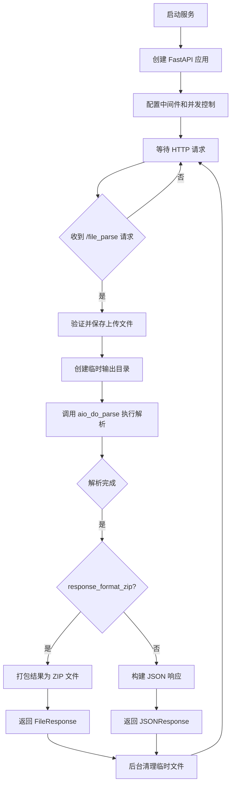
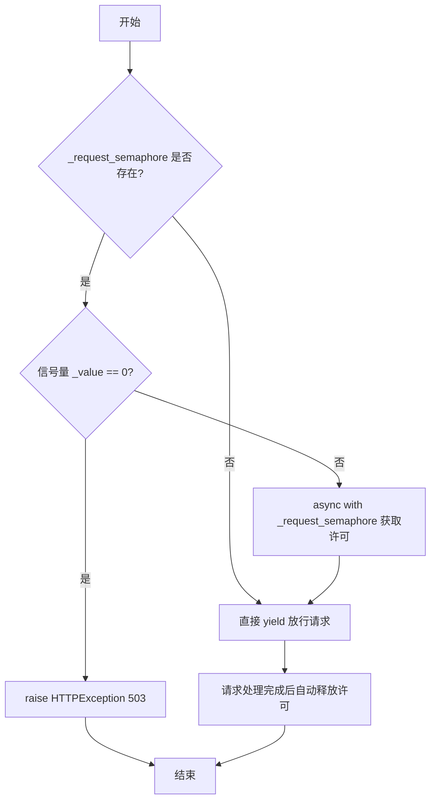
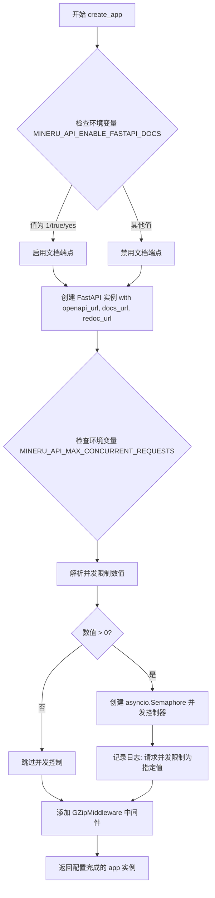
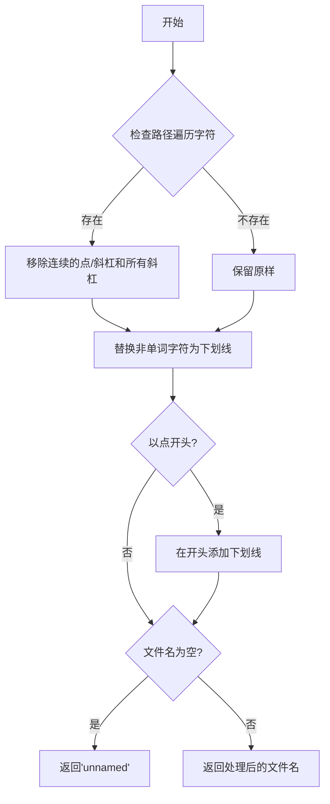
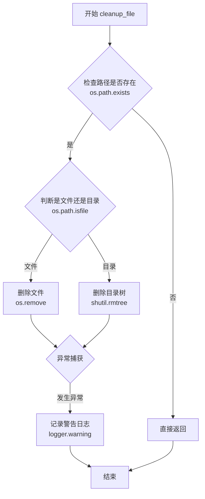
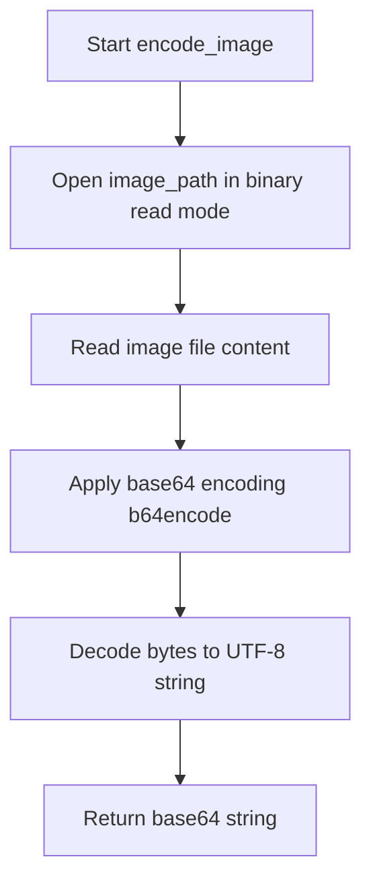
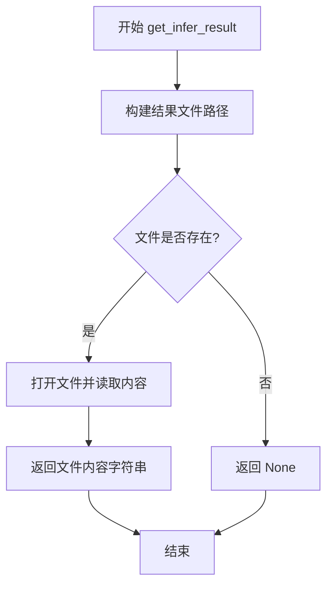
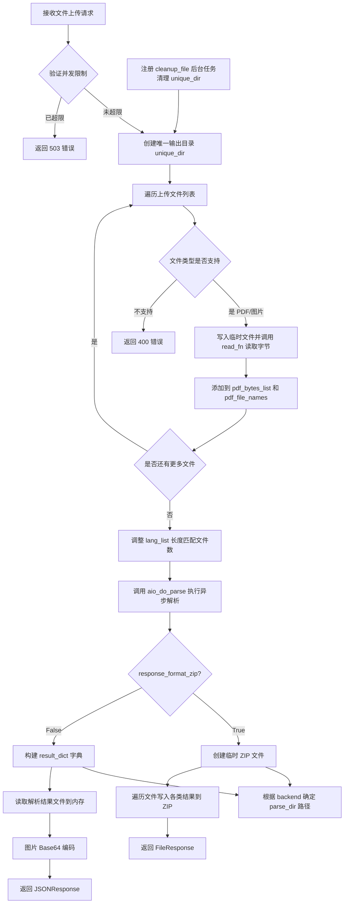
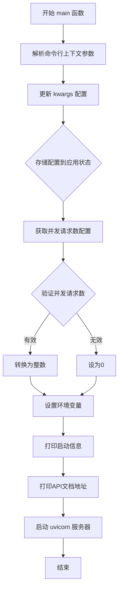

# `MinerU\mineru\cli\fast_api.py` 详细设计文档

这是一个基于 FastAPI 的 PDF/图像解析服务，提供 RESTful API 接口，支持多种解析后端（pipeline、vlm、hybrid），可提取文本、公式、表格等内容，支持返回 Markdown、JSON 或 ZIP 格式的结果，并具备并发控制和临时文件清理机制。

## 整体流程



## 类结构

```
FastAPI Application (mineru.cli.fast_api)
├── 全局变量
│   ├── _request_semaphore (并发控制器)
│   ├── log_level (日志级别)
│   └── app (FastAPI 实例)
├── 依赖函数
│   └── limit_concurrency (并发限制)
├── 工具函数
│   ├── create_app (创建应用)
│   ├── sanitize_filename (文件名清理)
│   ├── cleanup_file (文件清理)
│   ├── encode_image (图像编码)
│   └── get_infer_result (读取结果)
├── API 端点
│   └── parse_pdf (POST /file_parse)
└── CLI 命令
    └── main (启动服务)
```

## 全局变量及字段


### `_request_semaphore`
    
并发控制器，用于限制同时处理的请求数量，通过信号量实现

类型：`Optional[asyncio.Semaphore]`
    


### `log_level`
    
日志级别，从环境变量MINERU_LOG_LEVEL读取，默认为INFO

类型：`str`
    


### `app`
    
FastAPI应用实例，通过create_app()函数创建，包含API路由和中间件配置

类型：`FastAPI`
    


    

## 全局函数及方法


### `limit_concurrency`

这是一个FastAPI依赖函数，用于控制并发请求数量。它通过信号量机制限制同时处理的请求数量，当并发数达到上限时返回503错误，否则获取信号量许可后放行请求。

参数： 无

返回值：`AsyncGenerator[None, None]` 或 `None`，一个异步生成器，在请求处理期间持有信号量许可，请求结束后自动释放

#### 流程图



#### 带注释源码

```python
# 并发控制依赖函数
async def limit_concurrency():
    """
    FastAPI 依赖函数，用于限制并发请求数量
    通过信号量机制控制同时处理的请求数量
    """
    # 检查是否配置了并发控制器（_request_semaphore）
    if _request_semaphore is not None:
        # 检查信号量是否已用尽，如果是则拒绝请求
        # _value 表示当前可用的信号量许可数量
        if _request_semaphore._value == 0:
            # 抛出 503 错误，提示服务器已达最大容量
            raise HTTPException(
                status_code=503,
                detail=f"Server is at maximum capacity: {os.getenv('MINERU_API_MAX_CONCURRENT_REQUESTS', 'unset')}. Please try again later.",
            )
        # 获取信号量许可，进入临界区
        async with _request_semaphore:
            # yield 将控制权交给请求处理函数
            # 请求处理完成后，自动释放信号量许可
            yield
    else:
        # 如果未配置信号量（max_concurrent_requests <= 0），直接放行
        yield
```


### `create_app`

`create_app` 函数用于初始化并配置 FastAPI 应用实例，包括设置 OpenAPI 文档端点、并发控制器和 GZip 中间件。

参数：

- 该函数无参数

返回值：`FastAPI`，返回配置好的 FastAPI 应用实例

#### 流程图



#### 带注释源码

```python
def create_app():
    """
    创建并配置 FastAPI 应用实例
    
    该函数完成以下配置：
    1. 根据环境变量决定是否启用 OpenAPI 文档端点
    2. 初始化并发控制器（可选）
    3. 添加 GZip 压缩中间件
    
    Returns:
        FastAPI: 配置完成的 FastAPI 应用实例
    """
    # By default, the OpenAPI documentation endpoints (openapi_url, docs_url, redoc_url) are enabled.
    # To disable the FastAPI docs and schema endpoints, set the environment variable MINERU_API_ENABLE_FASTAPI_DOCS=0.
    # 检查环境变量，确定是否启用 FastAPI 文档界面
    enable_docs = str(os.getenv("MINERU_API_ENABLE_FASTAPI_DOCS", "1")).lower() in (
        "1",
        "true",
        "yes",
    )
    # 创建 FastAPI 实例，根据 enable_docs 配置文档端点
    app = FastAPI(
        openapi_url="/openapi.json" if enable_docs else None,  # OpenAPI schema 端点
        docs_url="/docs" if enable_docs else None,              # Swagger UI 文档端点
        redoc_url="/redoc" if enable_docs else None,             # ReDoc 文档端点
    )

    # 初始化并发控制器：从环境变量MINERU_API_MAX_CONCURRENT_REQUESTS读取
    # 使用 global 关键字声明，以便在模块级别修改全局变量 _request_semaphore
    global _request_semaphore
    try:
        # 尝试从环境变量获取最大并发请求数，默认值为 0（表示不限制）
        max_concurrent_requests = int(
            os.getenv("MINERU_API_MAX_CONCURRENT_REQUESTS", "0")
        )
    except ValueError:
        # 如果环境变量值无法转换为整数，则设为 0（不限制）
        max_concurrent_requests = 0

    # 如果配置了最大并发数，则创建信号量控制器
    if max_concurrent_requests > 0:
        # 创建 asyncio.Semaphore 实例用于限制并发请求数
        _request_semaphore = asyncio.Semaphore(max_concurrent_requests)
        # 记录日志，告知用户并发限制已启用
        logger.info(f"Request concurrency limited to {max_concurrent_requests}")

    # 添加 GZip 压缩中间件，最小压缩大小为 1000 字节
    # 这可以减小响应体大小，提高网络传输效率
    app.add_middleware(GZipMiddleware, minimum_size=1000)
    
    # 返回配置完成的 FastAPI 应用实例
    return app
```


### `sanitize_filename`

格式化压缩文件的文件名，移除路径遍历字符，保留 Unicode 字母、数字、._-，禁止隐藏文件。

参数：

- `filename`：`str`，原始文件名

返回值：`str`，处理后的安全文件名

#### 流程图



#### 带注释源码

```python
def sanitize_filename(filename: str) -> str:
    """
    格式化压缩文件的文件名
    移除路径遍历字符, 保留 Unicode 字母、数字、._-
    禁止隐藏文件
    """
    # 步骤1: 移除路径遍历相关的特殊字符
    # - r"[/\\.]{2,}"  匹配连续两个或更多的斜杠、点
    # - [/\\]  匹配单个斜杠或反斜杠
    # 结果: 消除路径分隔符，防止路径遍历攻击(如 ../../../etc/passwd)
    sanitized = re.sub(r"[/\\.]{2,}|[/\\]", "", filename)
    
    # 步骤2: 保留允许的字符，替换其他字符为下划线
    # - \w  匹配Unicode字母、数字、下划线
    # - .  允许点号
    # - -  允许连字符
    # flags=re.UNICODE 确保支持Unicode字符(如中文文件名)
    sanitized = re.sub(r"[^\w.-]", "_", sanitized, flags=re.UNICODE)
    
    # 步骤3: 禁止隐藏文件(以.开头的文件)
    # 将 . 开头的文件前面加上下划线，如 .gitignore -> _gitignore
    if sanitized.startswith("."):
        sanitized = "_" + sanitized[1:]
    
    # 步骤4: 确保文件名不为空
    # 如果处理后为空(如原始文件名全是禁止字符)，返回默认名称
    return sanitized or "unnamed"
```


### `cleanup_file`

清理临时文件或目录，删除给定的文件或目录（如果存在），并忽略删除失败的情况。

参数：

- `file_path`：`str`，要清理的文件或目录的路径

返回值：`None`，无返回值，仅执行清理操作

#### 流程图



#### 带注释源码

```python
def cleanup_file(file_path: str) -> None:
    """清理临时文件或目录"""
    try:
        # 检查传入的路径是否存在
        if os.path.exists(file_path):
            # 判断是否为文件
            if os.path.isfile(file_path):
                # 如果是文件，直接删除文件
                os.remove(file_path)
            # 判断是否为目录
            elif os.path.isdir(file_path):
                # 如果是目录，递归删除目录及其内容
                shutil.rmtree(file_path)
    except Exception as e:
        # 捕获删除过程中的异常并记录警告日志
        logger.warning(f"fail clean file {file_path}: {e}")
```


### `encode_image`

该函数用于将图像文件转换为 Base64 编码的字符串格式，以便在 JSON 响应中直接传输图像数据。

参数：

- `image_path`：`str`，要编码的图像文件的路径

返回值：`str`，返回 Base64 编码后的图像数据字符串（UTF-8 格式）

#### 流程图



#### 带注释源码

```python
def encode_image(image_path: str) -> str:
    """
    Encode image using base64
    将图像文件编码为 Base64 字符串，用于在 JSON 响应中传输图像
    
    参数:
        image_path: str - 要编码的图像文件的路径
    
    返回:
        str - Base64 编码后的图像数据字符串
    """
    # 以二进制读取模式打开图像文件
    with open(image_path, "rb") as f:
        # 读取文件内容并进行 base64 编码，最后解码为 UTF-8 字符串返回
        return b64encode(f.read()).decode()
```


### `get_infer_result`

从结果目录中读取推理结果文件的内容，支持多种文件格式（.md, .json等）

参数：

- `file_suffix_identifier`：`str`，文件后缀标识符（如 ".md"、"_middle.json"）
- `pdf_name`：`str`，PDF 文件名称（不含后缀）
- `parse_dir`：`str`，解析结果输出目录路径

返回值：`Optional[str]`，返回文件内容字符串；若文件不存在则返回 None

#### 流程图



#### 带注释源码

```python
def get_infer_result(
    file_suffix_identifier: str, pdf_name: str, parse_dir: str
) -> Optional[str]:
    """从结果文件中读取推理结果"""
    # 拼接完整的结果文件路径：parse_dir + pdf_name + file_suffix_identifier
    result_file_path = os.path.join(parse_dir, f"{pdf_name}{file_suffix_identifier}")
    # 检查结果文件是否存在
    if os.path.exists(result_file_path):
        # 以 UTF-8 编码打开文件并读取全部内容
        with open(result_file_path, "r", encoding="utf-8") as fp:
            return fp.read()
    # 文件不存在时返回 None
    return None
```


### `parse_pdf`

该函数是 FastAPI 的核心路由处理函数，负责接收 PDF/图片上传、调用后端解析引擎（pipeline/vlm/hybrid）、并返回 Markdown、JSON、图片等多样化结果，支持同步/异步处理和 ZIP 打包下载。

参数：

- `background_tasks`：`BackgroundTasks`，FastAPI 后台任务对象，用于注册清理任务
- `files`：`List[UploadFile]`，待解析的 PDF 或图片文件列表
- `output_dir`：`str`，本地输出目录，默认为 "./output"
- `lang_list`：`List[str]`，OCR 语言列表，用于提升识别精度，支持多种语言组合
- `backend`：`str`，解析后端引擎，可选 pipeline/vlm-auto-engine/vlm-http-client/hybrid-auto-engine/hybrid-http-client
- `parse_method`：`str`，解析方法（仅适用于 pipeline/hybrid 后端），可选 auto/txt/ocr
- `formula_enable`：`bool`，是否启用公式解析，默认为 True
- `table_enable`：`bool`，是否启用表格解析，默认为 True
- `server_url`：`Optional[str]`，OpenAI 兼容的服务器 URL（仅用于 http-client 后端）
- `return_md`：`bool`，是否在响应中返回 Markdown 内容，默认为 True
- `return_middle_json`：`bool`，是否返回中间 JSON 结果
- `return_model_output`：`bool`，是否返回模型输出 JSON
- `return_content_list`：`bool`，是否返回内容列表 JSON
- `return_images`：`bool`，是否返回提取的图片（Base64 编码）
- `response_format_zip`：`bool`，是否以 ZIP 文件格式返回结果，默认为 False
- `start_page_id`：`int`，解析起始页码（从 0 开始），默认为 0
- `end_page_id`：`int`，解析结束页码（从 0 开始），默认为 99999

返回值：`Union[FileResponse, JSONResponse]`，根据 `response_format_zip` 参数返回 ZIP 文件下载或 JSON 响应

#### 流程图



#### 带注释源码

```python
@app.post(path="/file_parse", dependencies=[Depends(limit_concurrency)])  # 注册并发限制依赖
async def parse_pdf(
    background_tasks: BackgroundTasks,  # FastAPI 后台任务管理
    files: List[UploadFile] = File(  # 文件上传字段
        ..., description="Upload pdf or image files for parsing"
    ),
    output_dir: str = Form("./output", description="Output local directory"),  # 输出目录
    lang_list: List[str] = Form(  # 语言列表表单
        ["ch"],
        description="""(Adapted only for pipeline and hybrid backend)Input the languages..."""
    ),
    backend: str = Form(  # 后端引擎选择
        "hybrid-auto-engine",
        description="""The backend for parsing: pipeline/vlm-auto-engine/..."""
    ),
    parse_method: str = Form(  # 解析方法
        "auto",
        description="""(Adapted only for pipeline and hybrid backend)..."""
    ),
    formula_enable: bool = Form(True, description="Enable formula parsing."),
    table_enable: bool = Form(True, description="Enable table parsing."),
    server_url: Optional[str] = Form(  # HTTP 后端服务器地址
        None,
        description="(Adapted only for <vlm/hybrid>-http-client backend)..."
    ),
    return_md: bool = Form(True, description="Return markdown content in response"),
    return_middle_json: bool = Form(False, description="Return middle JSON in response"),
    return_model_output: bool = Form(False, description="Return model output JSON in response"),
    return_content_list: bool = Form(False, description="Return content list JSON in response"),
    return_images: bool = Form(False, description="Return extracted images in response"),
    response_format_zip: bool = Form(False, description="Return results as a ZIP file"),
    start_page_id: int = Form(0, description="The starting page for PDF parsing"),
    end_page_id: int = Form(99999, description="The ending page for PDF parsing"),
):
    """FastAPI 路由：解析 PDF/图片文件并返回结构化结果"""
    
    # 获取命令行配置参数（从 app.state.config 读取）
    config = getattr(app.state, "config", {})

    try:
        # 步骤1: 创建唯一的输出目录，使用 UUID 避免冲突
        unique_dir = os.path.join(output_dir, str(uuid.uuid4()))
        os.makedirs(unique_dir, exist_ok=True)
        # 注册后台清理任务，函数结束后删除临时目录
        background_tasks.add_task(cleanup_file, unique_dir)

        # 步骤2: 处理上传的 PDF/图片文件
        pdf_file_names = []  # 存储文件名（不含扩展名）
        pdf_bytes_list = []  # 存储文件字节数据

        for file in files:
            # 读取上传文件内容
            content = await file.read()
            file_path = Path(file.filename)

            # 创建临时文件用于处理
            temp_path = Path(unique_dir) / file_path.name
            with open(temp_path, "wb") as f:
                f.write(content)

            # 通过文件后缀判断类型，并检查是否在支持列表中
            file_suffix = guess_suffix_by_path(temp_path)
            if file_suffix in pdf_suffixes + image_suffixes:
                try:
                    # 使用 read_fn 读取文件为字节流
                    pdf_bytes = read_fn(temp_path)
                    pdf_bytes_list.append(pdf_bytes)
                    pdf_file_names.append(file_path.stem)
                    os.remove(temp_path)  # 删除临时文件释放空间
                except Exception as e:
                    return JSONResponse(
                        status_code=400,
                        content={"error": f"Failed to load file: {str(e)}"},
                    )
            else:
                return JSONResponse(
                    status_code=400,
                    content={"error": f"Unsupported file type: {file_suffix}"},
                )

        # 步骤3: 调整语言列表长度，确保与文件数量一致
        actual_lang_list = lang_list
        if len(actual_lang_list) != len(pdf_file_names):
            # 若语言数量不匹配，使用第一个语言或默认 "ch" 填充
            actual_lang_list = [
                actual_lang_list[0] if actual_lang_list else "ch"
            ] * len(pdf_file_names)

        # 步骤4: 调用异步解析函数执行核心处理逻辑
        await aio_do_parse(
            output_dir=unique_dir,
            pdf_file_names=pdf_file_names,
            pdf_bytes_list=pdf_bytes_list,
            p_lang_list=actual_lang_list,
            backend=backend,
            parse_method=parse_method,
            formula_enable=formula_enable,
            table_enable=table_enable,
            server_url=server_url,
            f_draw_layout_bbox=False,
            f_draw_span_bbox=False,
            f_dump_md=return_md,
            f_dump_middle_json=return_middle_json,
            f_dump_model_output=return_model_output,
            f_dump_orig_pdf=False,
            f_dump_content_list=return_content_list,
            start_page_id=start_page_id,
            end_page_id=end_page_id,
            **config,  # 展开命令行配置
        )

        # 步骤5: 根据 response_format_zip 决定返回格式
        if response_format_zip:
            # 构建 ZIP 文件响应
            zip_fd, zip_path = tempfile.mkstemp(suffix=".zip", prefix="mineru_results_")
            os.close(zip_fd)
            background_tasks.add_task(cleanup_file, zip_path)  # 清理 ZIP 文件

            with zipfile.ZipFile(zip_path, "w", compression=zipfile.ZIP_DEFLATED) as zf:
                for pdf_name in pdf_file_names:
                    # 规范化文件名防止路径遍历攻击
                    safe_pdf_name = sanitize_filename(pdf_name)

                    # 根据不同后端确定解析结果目录结构
                    if backend.startswith("pipeline"):
                        parse_dir = os.path.join(unique_dir, pdf_name, parse_method)
                    elif backend.startswith("vlm"):
                        parse_dir = os.path.join(unique_dir, pdf_name, "vlm")
                    elif backend.startswith("hybrid"):
                        parse_dir = os.path.join(unique_dir, pdf_name, f"hybrid_{parse_method}")
                    else:
                        logger.warning(f"Unknown backend type: {backend}, skipping {pdf_name}")
                        continue

                    if not os.path.exists(parse_dir):
                        continue

                    # 条件写入 Markdown 文件
                    if return_md:
                        path = os.path.join(parse_dir, f"{pdf_name}.md")
                        if os.path.exists(path):
                            zf.write(path, arcname=os.path.join(safe_pdf_name, f"{safe_pdf_name}.md"))

                    # 条件写入中间 JSON
                    if return_middle_json:
                        path = os.path.join(parse_dir, f"{pdf_name}_middle.json")
                        if os.path.exists(path):
                            zf.write(path, arcname=os.path.join(safe_pdf_name, f"{safe_pdf_name}_middle.json"))

                    # 条件写入模型输出
                    if return_model_output:
                        path = os.path.join(parse_dir, f"{pdf_name}_model.json")
                        if os.path.exists(path):
                            zf.write(path, arcname=os.path.join(safe_pdf_name, f"{safe_pdf_name}_model.json"))

                    # 条件写入内容列表
                    if return_content_list:
                        path = os.path.join(parse_dir, f"{pdf_name}_content_list.json")
                        if os.path.exists(path):
                            zf.write(path, arcname=os.path.join(safe_pdf_name, f"{safe_pdf_name}_content_list.json"))

                    # 条件写入图片文件
                    if return_images:
                        images_dir = os.path.join(parse_dir, "images")
                        image_paths = glob.glob(os.path.join(glob.escape(images_dir), "*.jpg"))
                        for image_path in image_paths:
                            zf.write(
                                image_path,
                                arcname=os.path.join(safe_pdf_name, "images", os.path.basename(image_path)),
                            )

            return FileResponse(path=zip_path, media_type="application/zip", filename="results.zip")
        else:
            # 构建 JSON 格式响应
            result_dict = {}
            for pdf_name in pdf_file_names:
                result_dict[pdf_name] = {}
                data = result_dict[pdf_name]

                # 解析目录路径（同 ZIP 逻辑）
                if backend.startswith("pipeline"):
                    parse_dir = os.path.join(unique_dir, pdf_name, parse_method)
                elif backend.startswith("vlm"):
                    parse_dir = os.path.join(unique_dir, pdf_name, "vlm")
                elif backend.startswith("hybrid"):
                    parse_dir = os.path.join(unique_dir, pdf_name, f"hybrid_{parse_method}")
                else:
                    logger.warning(f"Unknown backend type: {backend}, skipping {pdf_name}")
                    continue

                # 读取各类型结果文件到内存
                if os.path.exists(parse_dir):
                    if return_md:
                        data["md_content"] = get_infer_result(".md", pdf_name, parse_dir)
                    if return_middle_json:
                        data["middle_json"] = get_infer_result("_middle.json", pdf_name, parse_dir)
                    if return_model_output:
                        data["model_output"] = get_infer_result("_model.json", pdf_name, parse_dir)
                    if return_content_list:
                        data["content_list"] = get_infer_result("_content_list.json", pdf_name, parse_dir)
                    if return_images:
                        images_dir = os.path.join(parse_dir, "images")
                        safe_pattern = os.path.join(glob.escape(images_dir), "*.jpg")
                        image_paths = glob.glob(safe_pattern)
                        # 将图片转为 Base64 编码嵌入 JSON
                        data["images"] = {
                            os.path.basename(image_path): f"data:image/jpeg;base64,{encode_image(image_path)}"
                            for image_path in image_paths
                        }

            return JSONResponse(
                status_code=200,
                content={"backend": backend, "version": __version__, "results": result_dict},
            )
    except Exception as e:
        # 统一异常处理，返回 500 错误
        logger.exception(e)
        return JSONResponse(status_code=500, content={"error": f"Failed to process file: {str(e)}"})
```


### `main`

这是MinerU FastAPI服务的CLI入口函数，使用Click框架构建命令行接口，负责解析命令行参数、配置应用状态并启动uvicorn服务器。

参数：

- `ctx`：`click.Context`，Click框架的上下文对象，用于传递上下文信息和访问未解析的参数
- `host`：`str`，服务器监听的主机地址，默认为"127.0.0.1"
- `port`：`int`，服务器监听的端口号，默认为8000
- `reload`：`bool`，是否启用开发模式下的自动重载功能
- `**kwargs`：`dict`，从命令行传入的额外参数，包括各种配置选项（如`mineru_api_max_concurrent_requests`等），通过`arg_parse`解析得到

返回值：`None`，该函数不返回任何值，直接启动uvicorn服务器

#### 流程图



#### 带注释源码

```python
@click.command(
    # 忽略未知选项并允许额外参数，允许传入未被click.option定义的参数
    context_settings=dict(ignore_unknown_options=True, allow_extra_args=True)
)
@click.pass_context
@click.option("--host", default="127.0.0.1", help="Server host (default: 127.0.0.1)")
@click.option("--port", default=8000, type=int, help="Server port (default: 8000)")
@click.option("--reload", is_flag=True, help="Enable auto-reload (development mode)")
def main(ctx, host, port, reload, **kwargs):
    """
    启动MinerU FastAPI服务器的命令行入口
    
    Args:
        ctx: Click上下文对象，包含未解析的命令行参数
        host: 服务器监听地址
        port: 服务器监听端口
        reload: 是否启用热重载
        **kwargs: 通过arg_parse解析的额外配置参数
    """
    # 从Click上下文解析出额外的命令行参数
    # arg_parse 负责处理MinerU特有的配置选项
    kwargs.update(arg_parse(ctx))

    # 将配置参数存储到FastAPI应用状态中
    # 这些配置会在处理请求时通过 app.state.config 访问
    app.state.config = kwargs

    # 将 CLI 的并发参数同步到环境变量，确保 uvicorn 重载子进程可见
    # uvicorn在reload模式下会fork子进程，需要通过环境变量传递配置
    try:
        # 尝试获取并转换并发请求数配置
        mcr = int(kwargs.get("mineru_api_max_concurrent_requests", 0) or 0)
    except ValueError:
        # 如果转换失败，默认为0（无限制）
        mcr = 0
    # 设置环境变量，供create_app中的并发控制器读取
    os.environ["MINERU_API_MAX_CONCURRENT_REQUESTS"] = str(mcr)

    """启动MinerU FastAPI服务器的命令行入口"""
    # 打印服务启动信息
    print(f"Start MinerU FastAPI Service: http://{host}:{port}")
    # 打印API文档访问地址
    print(f"API documentation: http://{host}:{port}/docs")

    # 启动uvicorn服务器
    # "mineru.cli.fast_api:app" 指定了应用模块路径
    # host和port控制监听地址
    # reload控制是否启用开发模式自动重载
    uvicorn.run("mineru.cli.fast_api:app", host=host, port=port, reload=reload)
```

## 关键组件


### FastAPI应用与并发控制器

基于FastAPI的Web服务，提供文件解析API端点，通过信号量实现并发请求控制，支持基于环境变量的并发限制配置

### 文件解析核心逻辑

处理PDF/图像文件上传的统一入口，调用`aio_do_parse`执行实际解析，支持多种后端（pipeline/vlm/hybrid）、多种语言、公式/表格解析开关

### 响应构建与序列化

根据请求参数动态构建JSON或ZIP响应，支持返回Markdown内容、中间JSON、模型输出、内容列表及提取的图像数据

### 临时文件生命周期管理

使用`uuid`创建唯一输出目录，通过`BackgroundTasks`注册清理任务，确保解析完成后临时文件被自动删除

### 多后端路径解析

根据backend类型动态构建解析结果目录路径，支持pipeline/vlm/hybrid三种后端及其对应的parse_method子目录结构

### 命令行参数注入

通过Click框架将CLI参数注入应用状态，使解析函数能够访问语言、模型路径等配置


## 问题及建议


### 已知问题

-   **并发控制存在竞态条件**：`limit_concurrency` 函数中先检查 `_request_semaphore._value == 0`，然后再 `async with _request_semaphore`，这两步之间存在时间窗口，可能导致信号量已被其他请求获取，产生竞态条件。

-   **全局状态管理不规范**：使用全局变量 `_request_semaphore` 存储信号量，并在 `create_app` 中使用 `global` 声明修改，不符合最佳实践，且在多进程环境下不可用。

-   **文件处理循环缺乏原子性**：在 `for file in files` 循环中，如果某个文件处理失败（返回 JSONResponse），会导致已成功处理的文件被丢弃，且其他待处理文件被忽略。

-   **临时文件泄漏风险**：在文件处理循环中，创建临时文件后只在 `read_fn` 成功时才删除，如果后续步骤抛出异常，临时文件可能未被清理。

-   **代码重复**：构建 `parse_dir` 路径的逻辑在 ZIP 响应和 JSON 响应构建代码中重复出现多次（至少4处），违反 DRY 原则。

-   **API 参数过多**：`parse_pdf` 函数有超过 20 个参数，全部使用 `Form` 声明，缺少参数分组和验证模型，可维护性差。

-   **配置重复读取**：`MINERU_API_MAX_CONCURRENT_REQUESTS` 环境变量在 `create_app` 和 `main` 函数中重复读取和处理。

-   **缺少请求超时控制**：没有对文件上传、解析过程设置明确的超时时间，可能导致请求无限期挂起。

-   **路径遍历防护不足**：`output_dir` 参数未进行安全验证，理论上可能存在路径遍历风险。

### 优化建议

-   **重构并发控制**：移除先检查再获取的两步操作，直接使用 `async with _request_semaphore`，让 FastAPI 依赖注入系统自动处理限流，或者使用 `fastapi-limiter` 等成熟库。

-   **消除全局状态**：使用 FastAPI 的 `app.state` 或依赖注入方式管理信号量，避免全局变量带来的状态管理问题。

-   **改进文件处理流程**：先将所有文件保存到临时目录，统一处理，最后统一清理，而不是在循环中逐个处理和清理。

-   **提取公共逻辑**：将 `parse_dir` 路径构建逻辑抽取为独立函数，如 `get_parse_dir(backend, pdf_name, parse_method)`。

-   **使用 Pydantic 模型**：为 `parse_pdf` 的复杂参数创建 Pydantic 请求模型类，提高类型安全和验证能力。

-   **添加请求超时**：使用 `asyncio.timeout` 或 FastAPI 的超时配置为文件上传和解析操作设置合理超时。

-   **统一配置管理**：创建配置类或使用 `pydantic-settings` 集中管理环境变量配置，避免重复读取。

-   **增强错误处理**：在文件循环中收集错误而不是立即返回，汇总后统一响应，提高用户体验。

## 其它


### 设计目标与约束

**设计目标**：
1. 提供统一的RESTful API接口，用于将PDF和图像文件解析为结构化文档（markdown、JSON等格式）
2. 支持多种解析后端（pipeline、vlm、hybrid），满足不同精度和性能需求
3. 实现并发请求控制，防止服务过载
4. 支持多种输出格式（JSON、ZIP），便于前端集成和批量处理

**约束条件**：
1. 依赖本地模型推理资源，vlm和hybrid后端需要GPU支持
2. HTTP客户端模式需要外部OpenAI兼容服务器
3. 最大并发数受环境变量MINERU_API_MAX_CONCURRENT_REQUESTS限制
4. 临时文件需要在后台任务中清理，避免磁盘空间耗尽

### 错误处理与异常设计

**异常处理策略**：
1. **请求级别异常**：通过HTTPException返回，状态码包括400（请求格式错误、不支持的文件类型）、503（服务容量已满）、500（服务器内部错误）
2. **文件处理异常**：捕获文件读取失败、临时文件创建失败等，返回400错误并附带具体错误信息
3. **解析异常**：在aio_do_parse调用中捕获，转换为500错误返回
4. **清理异常**：cleanup_file函数中的异常仅记录警告，不影响主流程

**关键错误码**：
- 400：无效的文件类型、文件读取失败、参数验证失败
- 503：并发数达到上限
- 500：解析过程异常、文件IO异常

### 数据流与状态机

**主数据流**：
```
请求入口(/file_parse) 
→ 接收上传文件 
→ 创建临时目录 
→ 文件类型校验与转换 
→ 调用aio_do_parse进行解析 
→ 根据response_format_zip决定返回格式 
→ 清理临时文件 → 返回响应
```

**状态转换**：
1. 初始状态：接收请求 → 创建unique_dir
2. 处理状态：文件读取 → 格式转换 → 解析调用
3. 完成状态：结果封装 → JSON/ZIP响应
4. 清理状态：BackgroundTasks触发cleanup_file

**并发控制状态机**：
- 请求进入 → 检查信号量可用性 → 获取信号量 → 处理完成 → 释放信号量

### 外部依赖与接口契约

**外部依赖**：
1. **mineru.cli.common**：提供aio_do_parse、read_fn、pdf_suffixes、image_suffixes
2. **mineru.utils.cli_parser**：提供arg_parse函数用于CLI参数解析
3. **mineru.utils.guess_suffix_or_lang**：提供guess_suffix_by_path函数
4. **mineru.version**：提供__version__版本信息
5. **FastAPI/Uvicorn**：Web框架和ASGI服务器
6. **click**：命令行参数解析

**接口契约**：
- 端点：POST /file_parse
- 认证：通过Depends(limit_concurrency)进行并发控制
- 请求格式：multipart/form-data
- 响应格式：JSON或application/zip
- OpenAPI文档：/openapi.json（当MINERU_API_ENABLE_FASTAPI_DOCS=1时）

### 安全性考虑

1. **文件安全**：sanitize_filename函数防止路径遍历攻击，禁止隐藏文件
2. **并发限制**：通过信号量防止资源耗尽
3. **环境变量隔离**：敏感配置通过环境变量注入
4. **临时文件清理**：确保临时目录和文件被及时清理，防止磁盘空间泄漏

### 性能优化建议

1. 考虑使用流式处理大文件，减少内存占用
2. 优化ZIP压缩级别，平衡压缩率和CPU消耗
3. 实现结果缓存机制，避免重复解析
4. 考虑使用异步IO操作替代部分同步文件操作

### 部署与运维相关

1. **环境变量配置**：
   - MINERU_LOG_LEVEL：日志级别
   - MINERU_API_MAX_CONCURRENT_REQUESTS：最大并发数
   - MINERU_API_ENABLE_FASTAPI_DOCS：是否启用API文档

2. **健康检查**：建议添加/health端点用于服务健康探测

3. **优雅关闭**：确保BackgroundTasks在服务停止前完成执行

### 测试策略建议

1. 单元测试：测试sanitize_filename、cleanup_file等工具函数
2. 集成测试：测试/file_parse端点的各种参数组合
3. 压力测试：验证并发控制机制的有效性
4. 异常测试：验证各类错误场景的异常处理

    