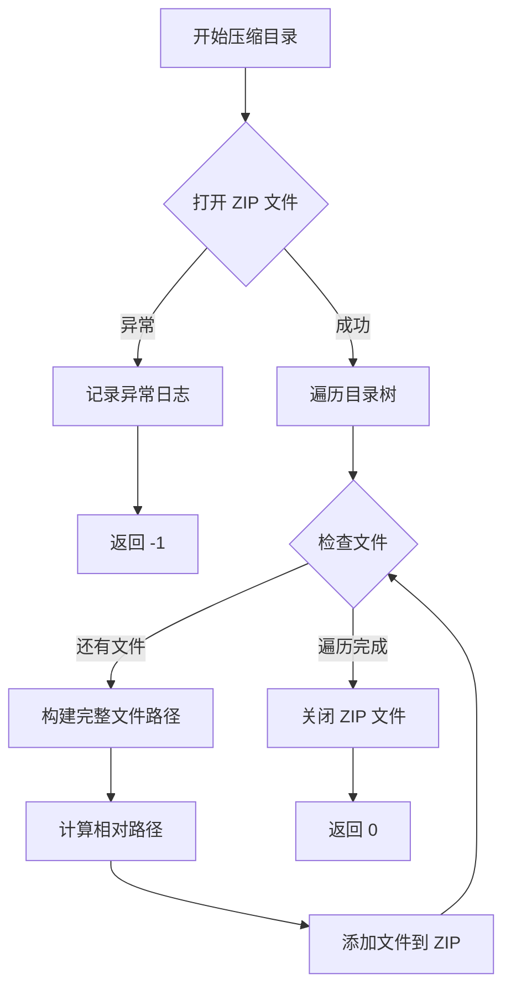
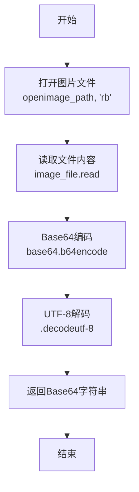
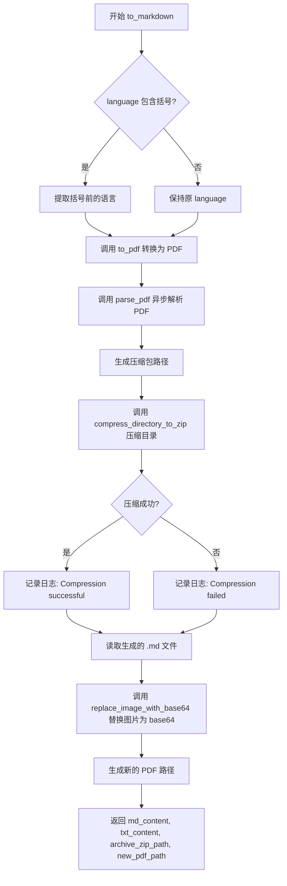
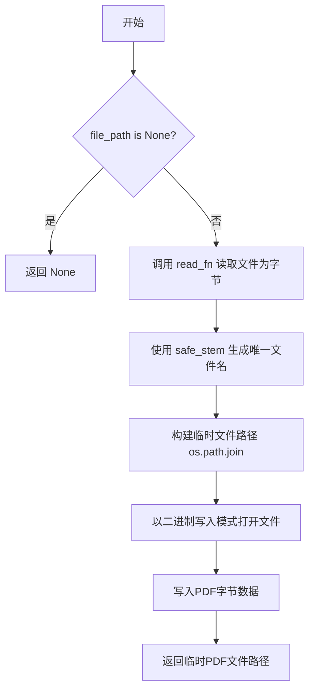
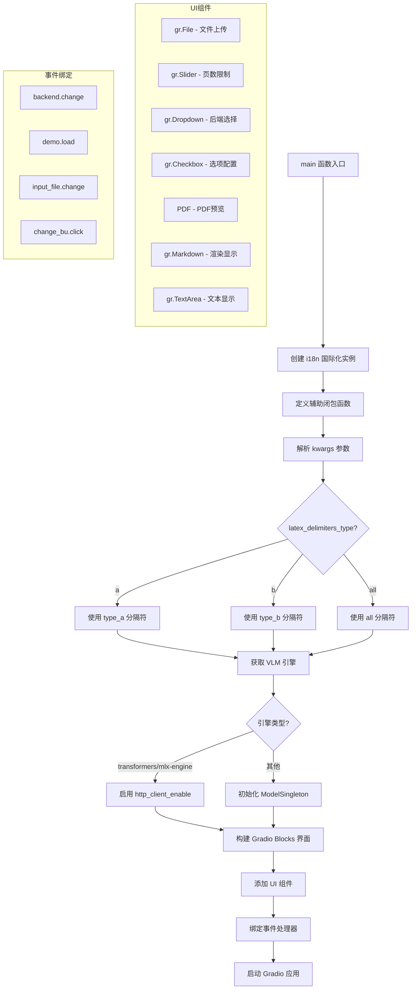

# `MinerU\mineru\cli\gradio_app.py` 详细设计文档

这是一个基于 Gradio 构建的 Web 服务应用（CLI），用于将 PDF 文档和图片高精度转换为 Markdown 格式，支持 OCR、视觉大模型(VLM)及混合后端，并提供交互式预览。

## 整体流程

```mermaid
graph TD
    Start(启动程序) --> Main[main: 初始化 Gradio UI 和 Click CLI]
    Main --> UI_Ready[等待用户输入]
    UI_Ready --> Upload[用户上传文件 (PDF/Image)]
    Upload --> Input_File_Change[input_file.change: 触发 to_pdf]
    Input_File_Change --> to_pdf[to_pdf: 将图片转换为 PDF]
    to_pdf --> PDF_Preview[更新 PDF 预览组件]
    UI_Ready --> Convert_Click[用户点击 Convert 按钮]
    Convert_Click --> to_markdown[to_markdown: 异步执行转换流程]
    to_markdown --> parse_pdf[parse_pdf: 准备环境并调用解析核心]
    parse_pdf --> aio_do_parse[调用后端解析服务]
    aio_do_parse --> Output_Files[生成 MD 和 Layout PDF]
    Output_Files --> Compress[compress_directory_to_zip: 打包结果]
    Compress --> Process_MD[replace_image_with_base64: 处理图片链接]
    Process_MD --> Return_Result[返回 MD 内容、文本、ZIP、PDF]
    Return_Result --> Update_UI[更新 UI 组件]
```

## 类结构

```
mineru_app.py (主程序入口模块)
└── (无用户自定义类，基于函数的脚本)
```

## 全局变量及字段


### `log_level`
    
日志级别，从环境变量MINERU_LOG_LEVEL获取，默认为INFO

类型：`str`
    


### `header`
    
HTML头部内容，从resources/header.html文件读取，用于Gradio界面渲染

类型：`str`
    


### `header_path`
    
HTML头部文件的完整路径，指向resources/header.html

类型：`str`
    


### `latex_delimiters_type_a`
    
LaTeX数学公式分隔符类型A配置，包含$$和$两种分隔符及其显示模式

类型：`List[Dict[str, Any]]`
    


### `latex_delimiters_type_b`
    
LaTeX数学公式分隔符类型B配置，包含\(\)和\[\]两种分隔符及其显示模式

类型：`List[Dict[str, Any]]`
    


### `latex_delimiters_type_all`
    
所有LaTeX分隔符配置，合并类型A和类型B的所有分隔符

类型：`List[Dict[str, Any]]`
    


### `other_lang`
    
其他支持的语言列表，包含中文、英文、日文、韩文等主要语言及变体

类型：`List[str]`
    


### `add_lang`
    
附加支持的语言列表，包含拉丁语、阿拉伯语、西里尔语、梵文等语言及详细语种

类型：`List[str]`
    


### `all_lang`
    
所有支持的语言列表，通过合并other_lang和add_lang得到

类型：`List[str]`
    


    

## 全局函数及方法


### `parse_pdf`

该函数是 PDF 文档解析的核心异步入口，负责根据配置的后端类型（VLM、OCR、Pipeline 或 Hybrid）调用相应的解析引擎，将 PDF 文档转换为 Markdown 格式，并返回解析结果目录和文件名。

参数：

- `doc_path`：`str`，待解析的 PDF 文档路径
- `output_dir`：`str`，解析结果输出目录
- `end_page_id`：`int`，解析的结束页码（-1 表示解析到最后一页）
- `is_ocr`：`bool`，是否强制启用 OCR 识别
- `formula_enable`：`bool`，是否启用公式识别
- `table_enable`：`bool`，是否启用表格识别
- `language`：`str`，OCR 识别语言设置
- `backend`：`str`，解析后端类型（如 "vlm-auto-engine"、"pipeline"、"hybrid-auto-engine" 等）
- `url`：`str`，当使用 HTTP Client 后端时的服务器地址

返回值：`Tuple[str, str] | None`，成功时返回 (本地 Markdown 目录路径, 文件名)，失败时返回 None

#### 流程图

```mermaid
flowchart TD
    A[开始 parse_pdf] --> B[创建输出目录]
    B --> C[生成唯一文件名]
    C --> D[读取 PDF 文件数据]
    D --> E{backend 以 'vlm' 开头?}
    E -->|是| F[parse_method = 'vlm']
    E -->|否| G{is_ocr 为真?}
    G -->|是| H[parse_method = 'ocr']
    G -->|否| I[parse_method = 'auto']
    F --> J{backend 以 'hybrid' 开头?}
    H --> J
    I --> J
    J -->|是| K[env_name = hybrid_{parse_method}]
    J -->|否| L[env_name = parse_method]
    K --> M[prepare_env 创建环境目录]
    L --> M
    M --> N[调用 aio_do_parse 异步解析]
    N --> O[返回 local_md_dir 和 file_name]
    O --> P[结束]
    
    style A fill:#f9f,stroke:#333
    style P fill:#9f9,stroke:#333
```

#### 带注释源码

```python
async def parse_pdf(doc_path, output_dir, end_page_id, is_ocr, formula_enable, table_enable, language, backend, url):
    """
    异步解析 PDF 文档的核心函数
    
    参数:
        doc_path: PDF 文件路径
        output_dir: 输出目录
        end_page_id: 结束页码
        is_ocr: 是否强制 OCR
        formula_enable: 是否启用公式识别
        table_enable: 是否启用表格识别
        language: OCR 语言
        backend: 解析后端
        url: HTTP 服务地址
    """
    # 确保输出目录存在，不存在则创建
    os.makedirs(output_dir, exist_ok=True)

    try:
        # 生成唯一的文件名，使用安全文件名 + 时间戳
        file_name = f'{safe_stem(Path(doc_path).stem)}_{time.strftime("%y%m%d_%H%M%S")}'
        
        # 读取 PDF 文件为字节数据
        pdf_data = read_fn(doc_path)
        
        # 根据 backend 确定 parse_method
        # VLM 后端使用 'vlm' 方法
        if backend.startswith("vlm"):
            parse_method = "vlm"
        else:
            # 非 VLM 后端根据 is_ocr 决定使用 'ocr' 还是 'auto'
            parse_method = 'ocr' if is_ocr else 'auto'

        # 根据 backend 类型准备环境目录名称
        if backend.startswith("hybrid"):
            # Hybrid 后端使用 hybrid_{parse_method} 命名
            env_name = f"hybrid_{parse_method}"
        else:
            # 其他后端直接使用 parse_method 命名
            env_name = parse_method

        # 准备环境目录，返回图片目录和 Markdown 目录
        local_image_dir, local_md_dir = prepare_env(output_dir, file_name, env_name)

        # 调用异步解析函数执行实际的 PDF 解析
        await aio_do_parse(
            output_dir=output_dir,
            pdf_file_names=[file_name],
            pdf_bytes_list=[pdf_data],
            p_lang_list=[language],
            parse_method=parse_method,
            end_page_id=end_page_id,
            formula_enable=formula_enable,
            table_enable=table_enable,
            backend=backend,
            server_url=url,
        )
        
        # 返回解析后的 Markdown 目录和文件名
        return local_md_dir, file_name
    
    except Exception as e:
        # 捕获异常并记录日志，返回 None 表示解析失败
        logger.exception(e)
        return None
```


### `compress_directory_to_zip`

该函数用于将指定目录中的所有文件和子目录递归压缩成一个 ZIP 归档文件，支持相对路径保持目录结构，成功返回 0，失败返回 -1 并记录异常日志。

参数：

- `directory_path`：`str`，要压缩的目录路径
- `output_zip_path`：`str`，输出的 ZIP 文件路径

返回值：`int`，成功返回 0，失败返回 -1

#### 流程图



#### 带注释源码

```python
def compress_directory_to_zip(directory_path, output_zip_path):
    """压缩指定目录到一个 ZIP 文件。

    :param directory_path: 要压缩的目录路径
    :param output_zip_path: 输出的 ZIP 文件路径
    """
    try:
        # 使用 ZIP_DEFLATED 压缩方法创建 ZIP 文件
        with zipfile.ZipFile(output_zip_path, 'w', zipfile.ZIP_DEFLATED) as zipf:

            # 遍历目录中的所有文件和子目录
            for root, dirs, files in os.walk(directory_path):
                for file in files:
                    # 构建完整的文件路径
                    file_path = os.path.join(root, file)
                    # 计算相对于原始目录的路径，保持目录结构
                    arcname = os.path.relpath(file_path, directory_path)
                    # 添加文件到 ZIP 文件，使用相对路径作为归档名
                    zipf.write(file_path, arcname)
        # 成功完成压缩
        return 0
    except Exception as e:
        # 捕获并记录任何异常
        logger.exception(e)
        return -1
```


### `image_to_base64`

将图片文件转换为Base64编码的字符串，用于在Markdown文档中嵌入图片数据。

参数：

- `image_path`：`str`，图片文件的路径

返回值：`str`，Base64编码的图片数据字符串

#### 流程图



#### 带注释源码

```python
def image_to_base64(image_path):
    """将图片文件转换为Base64编码的字符串。
    
    :param image_path: 图片文件的路径
    :return: Base64编码的图片数据字符串
    """
    # 以二进制只读模式打开图片文件
    with open(image_path, 'rb') as image_file:
        # 读取文件内容，使用base64进行编码，然后解码为UTF-8字符串返回
        return base64.b64encode(image_file.read()).decode('utf-8')
```


### `replace_image_with_base64`

该函数用于将 Markdown 文档中的 `.jpg` 图片链接转换为 Base64 编码的数据 URI（Data URI），从而将图片内容直接嵌入到 Markdown 中，而无需依赖外部文件路径。它使用正则表达式匹配图片语法，并仅对特定格式（.jpg）进行处理。

参数：

-  `markdown_text`：`str`，原始的 Markdown 文本内容。
-  `image_dir_path`：`str`，图片文件所在的本地目录路径，用于拼接相对路径获取完整图片文件路径。

返回值：`str`，替换后的 Markdown 文本，其中 `.jpg` 图片已被替换为 Base64 编码的字符串。

#### 流程图

```mermaid
flowchart TD
    A([输入: markdown_text, image_dir_path]) --> B[定义正则匹配规则: ]
    B --> C{使用 re.sub 遍历匹配项}
    C --> D{当前匹配项路径是否以 .jpg 结尾?}
    D -- 否 --> E[返回原始匹配文本]
    D -- 是 --> F[拼接完整图片路径]
    F --> G[调用 image_to_base64 转为 Base64]
    G --> H[构造 Data URI 字符串]
    H --> I[返回替换后的字符串]
    E --> I
    I --> J([返回最终 Markdown 文本])
```

#### 带注释源码

```python
def replace_image_with_base64(markdown_text, image_dir_path):
    """
    将 Markdown 文本中的 .jpg 图片链接替换为 Base64 编码。

    :param markdown_text: Markdown 格式的文本
    :param image_dir_path: 图片存储的目录路径
    :return: 替换后的 Markdown 文本
    """
    # 匹配Markdown中的图片标签，例如 
    # 正则解释：\!\[ ... \]\( ... \)
    # group(1) 捕获括号内的路径部分
    pattern = r'\!\[(?:[^\]]*)\]\(([^)]+)\)'

    # 定义替换逻辑的内部函数
    def replace(match):
        # 获取图片的相对路径
        relative_path = match.group(1)
        
        # 只处理以 .jpg 结尾的图片
        if relative_path.endswith('.jpg'):
            # 拼接出磁盘上的完整文件路径
            full_path = os.path.join(image_dir_path, relative_path)
            
            # 将图片文件转换为 Base64 字符串
            base64_image = image_to_base64(full_path)
            
            # 返回新的 Markdown 图片语法，使用 Data URI
            return f''
        else:
            # 其他格式（如 .png, .gif）的图片保持原样，不做处理
            return match.group(0)

    # 应用正则替换并返回结果
    return re.sub(pattern, replace, markdown_text)
```


### `to_markdown`

该函数是一个异步函数，用于将 PDF 文件转换为 Markdown 格式，支持 OCR、公式识别和表格识别等功能，并返回转换后的 Markdown 内容、原始文本、压缩包路径和新的 PDF 路径。

参数：

- `file_path`：`str` 或 `Path`，输入文件的路径
- `end_pages`：`int`，要转换的结束页码，默认为 10
- `is_ocr`：`bool`，是否强制启用 OCR 识别，默认为 False
- `formula_enable`：`bool`，是否启用公式识别，默认为 True
- `table_enable`：`bool`，是否启用表格识别，默认为 True
- `language`：`str`，OCR 语言设置，默认为 "ch"
- `backend`：`str`，解析后端类型，默认为 "pipeline"
- `url`：`str` 或 `None`，服务器 URL（用于 http-client 后端），默认为 None

返回值：`Tuple[str, str, str, str]`，返回包含四个元素的元组：
1. `md_content`：转换后的 Markdown 内容（图片已替换为 base64）
2. `txt_content`：原始 Markdown 文本内容
3. `archive_zip_path`：输出目录的压缩包路径
4. `new_pdf_path`：带布局的 PDF 文件路径

#### 流程图



#### 带注释源码

```python
async def to_markdown(file_path, end_pages=10, is_ocr=False, formula_enable=True, table_enable=True, language="ch", backend="pipeline", url=None):
    """
    将 PDF 文件转换为 Markdown 格式的异步函数
    
    参数:
        file_path: 输入文件路径 (str 或 Path)
        end_pages: 结束页码 (int)
        is_ocr: 是否强制启用 OCR (bool)
        formula_enable: 是否启用公式识别 (bool)
        table_enable: 是否启用表格识别 (bool)
        language: OCR 语言设置 (str)
        backend: 解析后端类型 (str)
        url: 服务器 URL，用于 http-client 后端 (str 或 None)
    
    返回:
        Tuple[str, str, str, str]: (md_content, txt_content, archive_zip_path, new_pdf_path)
    """
    # 如果 language 包含括号，则提取括号前的内容作为实际语言
    # 例如: "ch (Chinese, English, Chinese Traditional)" -> "ch"
    if '(' in language and ')' in language:
        language = language.split('(')[0].strip()
    
    # 将输入文件转换为 PDF 格式
    file_path = to_pdf(file_path)
    
    # 获取识别的 md 文件以及压缩包文件路径
    # 调用异步 parse_pdf 函数进行文档解析
    local_md_dir, file_name = await parse_pdf(
        file_path, 
        './output', 
        end_pages - 1, 
        is_ocr, 
        formula_enable, 
        table_enable, 
        language, 
        backend, 
        url
    )
    
    # 构建压缩包路径，使用 md_dir 的 SHA256 哈希值命名
    archive_zip_path = os.path.join('./output', str_sha256(local_md_dir) + '.zip')
    
    # 压缩输出目录为 ZIP 文件
    zip_archive_success = compress_directory_to_zip(local_md_dir, archive_zip_path)
    
    # 根据压缩结果记录日志
    if zip_archive_success == 0:
        logger.info('Compression successful')
    else:
        logger.error('Compression failed')
    
    # 读取生成的 Markdown 文件内容
    md_path = os.path.join(local_md_dir, file_name + '.md')
    with open(md_path, 'r', encoding='utf-8') as f:
        txt_content = f.read()
    
    # 将 Markdown 中的图片替换为 base64 编码
    md_content = replace_image_with_base64(txt_content, local_md_dir)
    
    # 返回转换后的 PDF 路径
    new_pdf_path = os.path.join(local_md_dir, file_name + '_layout.pdf')

    return md_content, txt_content, archive_zip_path, new_pdf_path
```


### `safe_stem`

该函数用于处理文件路径，提取文件名主名并对特殊字符进行安全化处理，确保文件名只包含字母、数字、下划线和点，防止因特殊字符导致的文件操作问题。

参数：

- `file_path`：`str` 或 `Path`，需要处理的文件路径

返回值：`str`，安全化处理后的文件名主名

#### 流程图

```mermaid
flowchart TD
    A[开始] --> B[接收 file_path 参数]
    B --> C[调用 Path(file_path).stem 获取文件名主名]
    C --> D{使用正则表达式 r'[^\w.]' 匹配非安全字符}
    D --> E[将匹配到的字符替换为下划线 '_']
    E --> F[返回处理后的字符串]
    F --> G[结束]
```

#### 带注释源码

```python
def safe_stem(file_path):
    """
    安全化处理文件名主名，只保留字母、数字、下划线和点。
    
    该函数主要用于处理可能包含特殊字符的文件名，
    将不安全的字符替换为下划线，以避免文件操作时出现错误。
    
    参数:
        file_path: 文件路径，可以是字符串或 Path 对象
    
    返回:
        处理后的文件名主名（不含扩展名）
    """
    # 使用 pathlib 的 Path 对象获取文件名的 stem（主名，不含扩展名）
    stem = Path(file_path).stem
    
    # 只保留字母、数字、下划线和点，其他字符替换为下划线
    # \w 匹配字母、数字、下划线
    # . 匹配点号
    # [^...] 表示取反，即匹配不在指定字符集中的字符
    return re.sub(r'[^\w.]', '_', stem)
```


### `to_pdf`

该函数将输入文件（PDF或图片）转换为PDF格式，通过读取源文件内容并写入到同名PDF文件中，返回临时生成的PDF文件路径。

参数：

- `file_path`：`str`，输入文件的路径，支持PDF或图片格式

返回值：`str`，返回生成的临时PDF文件的完整路径；若输入为None则返回None

#### 流程图



#### 带注释源码

```python
def to_pdf(file_path):
    """将输入文件转换为PDF格式
    
    :param file_path: 输入文件路径，支持PDF或图片格式
    :return: 临时PDF文件路径，失败返回None
    """
    
    # 参数校验：若文件路径为空直接返回
    if file_path is None:
        return None

    # 调用read_fn读取文件内容为字节流
    pdf_bytes = read_fn(file_path)

    # 生成唯一文件名：使用safe_stem处理原文件名并添加.pdf后缀
    # 示例：input.jpg -> input.pdf
    unique_filename = f'{safe_stem(file_path)}.pdf'

    # 构建完整的临时文件路径（与原文件相同目录）
    tmp_file_path = os.path.join(os.path.dirname(file_path), unique_filename)

    # 将字节数据写入PDF文件（二进制写入模式）
    with open(tmp_file_path, 'wb') as tmp_pdf_file:
        tmp_pdf_file.write(pdf_bytes)

    # 返回生成的临时PDF文件路径，供后续处理使用
    return tmp_file_path
```


### `main`

这是整个程序的入口函数，使用Click框架构建命令行接口，并基于Gradio构建Web界面。该函数负责初始化国际化支持、配置后端引擎、构建交互式UI组件（文件上传、PDF预览、转换选项等），并处理PDF到Markdown的转换流程。

参数：

- `ctx`：`click.Context`，Click框架的上下文对象，用于处理命令行参数
- `example_enable`：`bool`，是否启用示例文件功能，默认为True
- `http_client_enable`：`bool`，是否启用HTTP客户端后端以连接OpenAI兼容服务器，默认为False
- `api_enable`：`bool`，是否启用Gradio API服务，默认为True
- `max_convert_pages`：`int`，最大转换页数限制，默认为1000
- `server_name`：`str`，Gradio应用服务器名称，默认为None
- `server_port`：`int`，Gradio应用服务器端口，默认为None
- `latex_delimiters_type`：`str`，LaTeX分隔符类型，可选值为'a'、'b'、'all'，默认为'all'
- `**kwargs`：动态关键字参数，传递给后端模型的其他配置

返回值：`None`，该函数直接启动Gradio应用，不返回任何值

#### 流程图



#### 带注释源码

```python
@click.command(context_settings=dict(ignore_unknown_options=True, allow_extra_args=True))
@click.pass_context
@click.option(
    '--enable-example',
    'example_enable',
    type=bool,
    help="Enable example files for input."
         "The example files to be input need to be placed in the `example` folder within the directory where the command is currently executed.",
    default=True,
)
@click.option(
    '--enable-http-client',
    'http_client_enable',
    type=bool,
    help="Enable http-client backend to link openai-compatible servers.",
    default=False,
)
@click.option(
    '--enable-api',
    'api_enable',
    type=bool,
    help="Enable gradio API for serving the application.",
    default=True,
)
@click.option(
    '--max-convert-pages',
    'max_convert_pages',
    type=int,
    help="Set the maximum number of pages to convert from PDF to Markdown.",
    default=1000,
)
@click.option(
    '--server-name',
    'server_name',
    type=str,
    help="Set the server name for the Gradio app.",
    default=None,
)
@click.option(
    '--server-port',
    'server_port',
    type=int,
    help="Set the server port for the Gradio app.",
    default=None,
)
@click.option(
    '--latex-delimiters-type',
    'latex_delimiters_type',
    type=click.Choice(['a', 'b', 'all']),
    help="Set the type of LaTeX delimiters to use in Markdown rendering:"
         "'a' for type '$', 'b' for type '()[]', 'all' for both types.",
    default='all',
)
def main(ctx,
        example_enable,
        http_client_enable,
        api_enable, max_convert_pages,
        server_name, server_port, latex_delimiters_type, **kwargs
):
    """主函数入口，构建Gradio Web应用界面"""
    
    # 创建 i18n 实例，支持中英文国际化
    i18n = gr.I18n(
        en={...},  # 英文翻译字典
        zh={...},  # 中文翻译字典
    )

    # 根据后端类型获取公式识别标签（闭包函数以支持 i18n）
    def get_formula_label(backend_choice): ...
    def get_formula_info(backend_choice): ...
    def get_backend_info(backend_choice): ...
    
    # 更新界面函数，根据选择的后端动态显示/隐藏相关选项
    def update_interface(backend_choice): ...

    # 解析额外的命令行参数
    kwargs.update(arg_parse(ctx))

    # 根据参数选择LaTeX分隔符类型
    if latex_delimiters_type == 'a':
        latex_delimiters = latex_delimiters_type_a
    elif latex_delimiters_type == 'b':
        latex_delimiters = latex_delimiters_type_b
    elif latex_delimiters_type == 'all':
        latex_delimiters = latex_delimiters_type_all
    else:
        raise ValueError(f"Invalid latex delimiters type: {latex_delimiters_type}.")

    # 获取VLM引擎实例
    vlm_engine = get_vlm_engine("auto", is_async=True)
    
    # 根据引擎类型决定是否启用HTTP客户端
    if vlm_engine in ["transformers", "mlx-engine"]:
        http_client_enable = True
    else:
        # 初始化模型单例
        try:
            from mineru.backend.vlm.vlm_analyze import ModelSingleton
            model_singleton = ModelSingleton()
            predictor = model_singleton.get_model(vlm_engine, None, None, **kwargs)
        except Exception as e:
            logger.exception(e)

    # 构建Gradio Blocks界面
    with gr.Blocks() as demo:
        gr.HTML(header)  # 添加HTML头部
        
        # 左侧列：输入控制
        with gr.Column(variant='panel', scale=5):
            # 文件上传组件
            input_file = gr.File(label=i18n("upload_file"), file_types=suffixes)
            
            # 页数限制滑块
            max_pages = gr.Slider(1, max_convert_pages, max_convert_pages, step=1, ...)
            
            # 后端选择下拉框
            backend = gr.Dropdown(drop_list, label=i18n("backend"), ...)
            
            # 隐藏的服务器URL输入框（HTTP客户端模式时显示）
            with gr.Row(visible=False) as client_options:
                url = gr.Textbox(...)
            
            # 识别选项区域
            with gr.Row(equal_height=True):
                with gr.Column():
                    # 表格识别开关
                    table_enable = gr.Checkbox(label=i18n("table_enable"), ...)
                    # 公式识别开关
                    formula_enable = gr.Checkbox(label=get_formula_label(preferred_option), ...)
                with gr.Column(visible=False) as ocr_options:
                    # OCR语言选择
                    language = gr.Dropdown(all_lang, ...)
                    # 强制OCR开关
                    is_ocr = gr.Checkbox(label=i18n("force_ocr"), ...)
            
            # 转换和清除按钮
            change_bu = gr.Button(i18n("convert"))
            clear_bu = gr.ClearButton(value=i18n("clear"))
            
            # PDF预览组件
            pdf_show = PDF(label=i18n("pdf_preview"), ...)
            
            # 示例文件展示
            if example_enable:
                gr.Examples(...)

        # 右侧列：输出结果
        with gr.Column(variant='panel', scale=5):
            # 输出文件
            output_file = gr.File(label=i18n("convert_result"), ...)
            
            # 结果展示标签页
            with gr.Tabs():
                # Markdown渲染标签页
                with gr.Tab(i18n("md_rendering")):
                    md = gr.Markdown(latex_delimiters=latex_delimiters, ...)
                # Markdown文本标签页
                with gr.Tab(i18n("md_text")):
                    md_text = gr.TextArea(...)

        # 事件绑定处理
        # 后端选择变化时更新界面
        backend.change(fn=update_interface, inputs=[backend], outputs=[...])
        # 页面加载时初始化界面
        demo.load(fn=update_interface, inputs=[backend], outputs=[...])
        # 文件上传变化时转换为PDF
        input_file.change(fn=to_pdf, inputs=input_file, outputs=pdf_show, ...)
        # 点击转换按钮时执行转换
        change_bu.click(fn=to_markdown, inputs=[...], outputs=[...], ...)

    # 启动Gradio应用
    demo.launch(
        server_name=server_name,
        server_port=server_port,
        show_api=api_enable,
        i18n=i18n
    )
```

## 关键组件


### PDF解析引擎 (parse_pdf)

核心异步PDF解析函数，负责协调PDF文件的完整处理流程，包括环境准备、解析方法选择和结果输出

### 图片转Base64编码器 (image_to_base64)

将图片文件转换为Base64编码字符串的工具函数，支持图片数据的直接嵌入

### Markdown图片替换器 (replace_image_with_base64)

正则表达式匹配的Markdown图片标签替换器，自动将本地图片路径转换为Base64内联数据，支持.jpg格式自动转换

### 目录压缩模块 (compress_directory_to_zip)

使用zipfile库将指定目录递归压缩为ZIP文件的工具函数，支持完整文件结构保持

### 多后端支持引擎 (get_vlm_engine)

动态选择VLM推理引擎的工厂函数，根据配置自动选择transformers、mlx-engine或其他后端

### 国际化i18n系统

Gradio I18n实例，提供中英文双语UI文本支持，涵盖上传提示、识别选项、按钮标签等完整界面文案

### LaTeX公式渲染配置

预定义的LaTeX分隔符类型配置，支持type_a($$/$)、type_b(\(\)/\[\])及all混合模式

### Gradio界面构建器 (main)

Click命令行装饰的主函数，整合PDF预览、参数配置、事件绑定的一站式Web应用入口

### 文件名安全处理 (safe_stem)

正则表达式过滤函数，移除文件名中除字母、数字、下划线、点以外的所有特殊字符

### 动态界面更新控制器 (update_interface)

根据后端类型智能切换OCR选项、公式标签、客户端配置的响应式界面更新闭包函数

### 解析结果ZIP归档生成

结合sha256哈希值命名和目录压缩的输出产物封装逻辑


## 问题及建议


### 已知问题

- **空值检查缺失**：`parse_pdf` 函数在异常时返回 `None`，但 `to_markdown` 函数未检查返回值就直接使用 `local_md_dir`，会导致 `FileNotFoundError` 或 `TypeError`
- **临时文件未清理**：`to_pdf` 函数创建临时 PDF 文件后从未删除，随着使用时间增长会占用大量磁盘空间
- **路径遍历风险**：`replace_image_with_base64` 和 `compress_directory_to_zip` 函数直接使用用户传入的路径拼接，未验证路径合法性
- **阻塞式文件操作**：`compress_directory_to_zip` 和 `replace_image_with_base64` 是同步函数，在异步上下文中会阻塞事件循环
- **类型注解完全缺失**：整个代码库没有使用任何类型注解，降低了代码可维护性和 IDE 支持
- **资源未正确管理**：`to_markdown` 函数中 `archive_zip_path` 的生成依赖于 `local_md_dir`，但未处理中间步骤失败的情况
- **硬编码输出目录**：多处硬编码 `./output` 路径，缺乏可配置性
- **日志中英文混用**：日志输出混合中英文，降低了日志可读性和统一性
- **后端初始化异常被吞掉**：在 `main` 函数中，VLM 引擎初始化失败时仅记录日志，继续使用可能导致后续调用时出错
- **示例文件路径未验证**：`gr.Examples` 中的文件路径未检查是否存在就直接使用
- **正则表达式重复编译**：`replace_image_with_base64` 中的正则表达式在每次调用时都会重新编译

### 优化建议

- 在 `to_markdown` 函数开头添加 `if local_md_dir is None: raise ValueError("PDF parsing failed")` 检查
- 实现临时文件管理机制，使用 `tempfile` 模块或维护清理队列
- 对所有用户输入的路径进行规范化验证，使用 `Path.resolve()` 并检查是否在允许目录内
- 将 `compress_directory_to_zip` 和 `replace_image_with_base64` 改为异步函数或移至线程池执行
- 为所有函数和变量添加类型注解，使用 Python 的 `typing` 模块
- 将 `./output` 等硬编码路径提取为配置项或命令行参数
- 统一日志语言，建议全部使用英文
- 将 VLM 引擎初始化结果进行状态检查，初始化失败时禁用相关功能或给出明确提示
- 预编译正则表达式为模块级常量：`IMAGE_PATTERN = re.compile(r'\!\[(?:[^\]]*)\]\(([^)]+)\)')`
- 添加请求超时和文件大小限制，防止资源耗尽

## 其它


### 设计目标与约束

本项目旨在构建一个基于Web界面的PDF文档智能解析系统，将PDF文件转换为结构化的Markdown格式，支持多语言OCR、表格识别和公式识别功能。核心设计目标包括：提供高精度文档解析能力、支持多种解析后端（pipeline/vlm/hybrid）、实现用户友好的Gradio交互界面、支持中英文国际化。

主要技术约束包括：VLM后端仅支持中英文文档；http-client后端需要OpenAI兼容的服务器；最大转换页数限制为1000页；部分功能依赖特定的Gradio版本。

### 错误处理与异常设计

系统采用分层异常处理策略：

1. **parse_pdf函数**：捕获所有异常并记录日志，返回(None, None)表示解析失败
2. **compress_directory_to_zip函数**：捕获压缩异常，返回-1表示失败，返回0表示成功
3. **to_markdown函数**：依赖parse_pdf的返回值处理，若local_md_dir为None可能导致后续操作失败
4. **main函数**：通过try-except捕获VLM引擎初始化异常，保证Web界面能够正常启动

日志使用loguru库，配置日志级别可通过MINERU_LOG_LEVEL环境变量控制，默认为INFO级别。

### 数据流与状态机

系统数据流主要分为三个阶段：

1. **输入阶段**：用户上传PDF/图片文件 → to_pdf函数转换为标准PDF格式 → PDF预览显示
2. **解析阶段**：parse_pdf根据后端类型选择解析方法 → 调用aio_do_parse执行解析 → 生成Markdown文件和图片资源
3. **输出阶段**：压缩输出目录为ZIP → 读取Markdown内容 → 替换图片为Base64编码 → 返回转换结果

关键状态转换：
- 初始状态 → 文件上传状态 → 解析中状态 → 完成状态/错误状态
- 后端选择影响解析方法：vlm后端使用VLM解析，pipeline使用OCR/auto，hybrid使用混合模式

### 外部依赖与接口契约

主要外部依赖包括：

1. **gradio**：Web框架，提供UI组件和事件处理
2. **click**：命令行参数解析
3. **loguru**：日志记录
4. **mineru模块**：核心解析功能（prepare_env, read_fn, aio_do_parse, get_vlm_engine等）
5. **gradio_pdf**：PDF预览组件
6. **base64, zipfile, os, re, pathlib**：标准库

外部服务接口：
- http-client后端需要OpenAI兼容的服务器（默认http://localhost:30000）
- VLM引擎支持transformers/mlx-engine/auto等类型

### 性能考虑与优化空间

当前实现存在以下性能考量：

1. **文件处理**：每次转换都会创建临时PDF文件，可考虑流式处理减少IO
2. **图片Base64替换**：对大文档可能存在内存压力，建议分块处理或使用流式传输
3. **ZIP压缩**：同步压缩可能阻塞异步流程，建议使用异步压缩
4. **VLM模型加载**：模型在启动时加载，首次调用有冷启动延迟

优化建议：
- 添加缓存机制避免重复解析相同文件
- 支持断点续传解析大文档
- 实现后台任务队列处理长时间任务
- 添加进度条反馈解析进度

### 安全性考虑

当前版本安全考虑：

1. **文件路径处理**：使用safe_stem函数过滤文件名，仅保留字母、数字、下划线和点，防止路径注入
2. **用户输入**：通过file_types参数限制可上传文件类型
3. **服务器URL**：http-client后端的URL为预定义值，用户可自定义需注意SSRF风险

安全建议：
- 添加文件大小限制防止资源耗尽
- 对用户提供的URL进行白名单验证
- 考虑添加认证机制保护API接口
- 敏感操作添加审计日志

### 配置管理与环境变量

系统支持以下环境变量：

1. **MINERU_LOG_LEVEL**：日志级别，默认INFO，支持DEBUG/WARNING/ERROR等

命令行配置选项：
- --enable-example：启用示例文件
- --enable-http-client：启用http-client后端
- --enable-api：启用Gradio API
- --max-convert-pages：最大转换页数（默认1000）
- --server-name：服务器名称
- --server-port：服务器端口
- --latex-delimiters-type：LaTeX分隔符类型（a/b/all）

### 版本兼容性

代码中存在版本兼容性问题：

1. **Gradio版本差异**：
   - copy按钮和footer_links：gradio 6+使用buttons参数，低版本使用show_copy_button
   - api_visibility参数：gradio 6+使用api_visibility，低版本使用api_name
   - 当前代码使用兼容写法（同时包含两种写法）

2. **Python版本要求**：需要支持async/await语法（Python 3.7+）

### 测试策略建议

当前代码缺乏单元测试，建议补充：

1. **单元测试**：
   - safe_stem函数：测试各种特殊字符过滤
   - compress_directory_to_zip：测试正常压缩和异常情况
   - image_to_base64和replace_image_with_base64：测试图片编码和替换逻辑

2. **集成测试**：
   - 完整解析流程测试（PDF到Markdown转换）
   - 各后端解析器测试
   - Gradio界面组件测试

3. **性能测试**：
   - 大文档解析时间测试
   - 并发请求处理能力测试

### 部署与运维

部署建议：

1. **依赖管理**：使用requirements.txt或pyproject.toml管理依赖
2. **环境准备**：需要安装PyTorch或其他深度学习框架
3. **模型下载**：首次运行自动下载VLM模型
4. **端口配置**：默认端口7860，可通过--server-port自定义
5. **多语言支持**：内置中英文i18n支持

运维注意事项：
- 监控日志文件大小和磁盘空间
- 定期清理临时文件和输出目录
- 大规模部署时考虑使用GPU资源


    