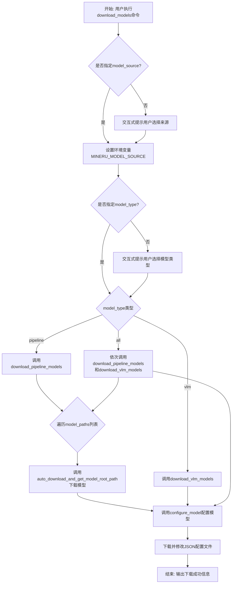
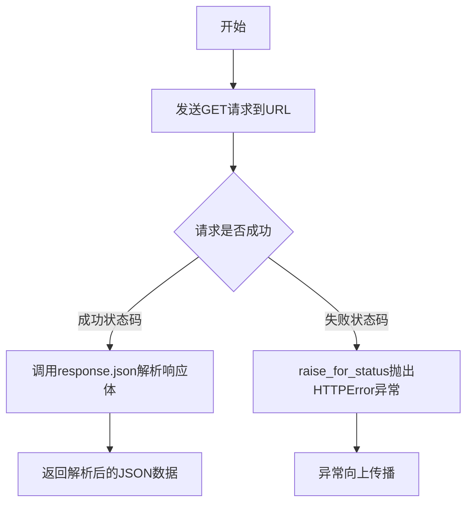
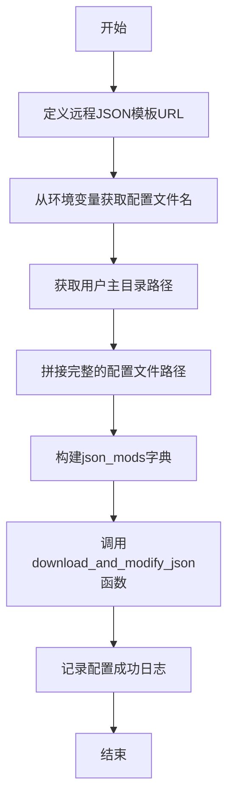
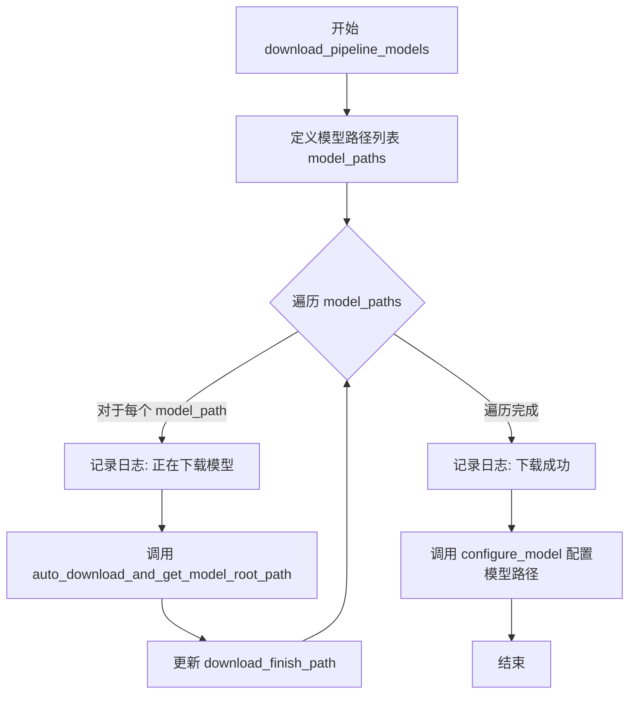
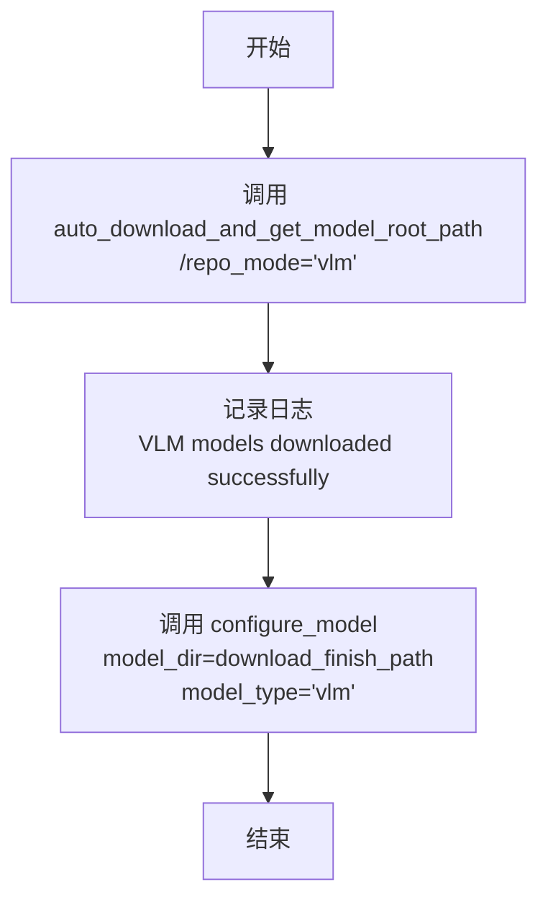
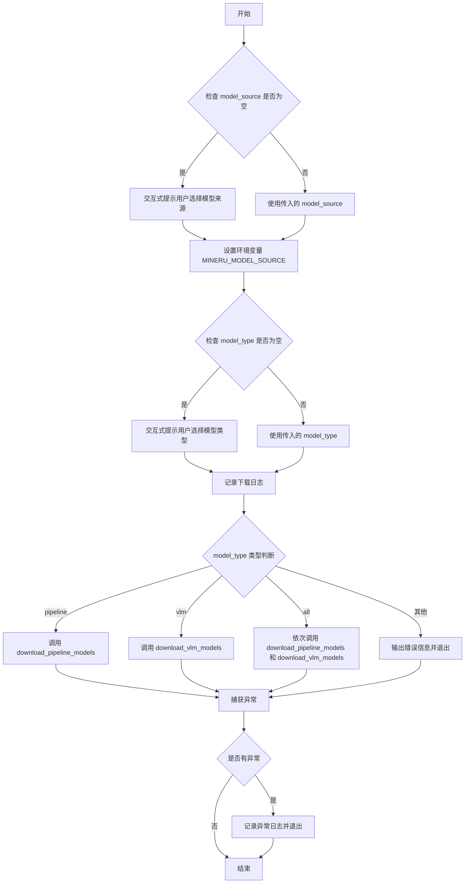

# `MinerU\mineru\cli\models_download.py` 详细设计文档

这是一个MinerU模型的下载工具脚本，支持从HuggingFace或ModelScope下载pipeline或VLM类型的机器学习模型，并自动完成配置文件的下载和修改。

## 整体流程



## 类结构

```
download_json (全局函数)
download_and_modify_json (全局函数)
configure_model (全局函数)
download_pipeline_models (全局函数)
download_vlm_models (全局函数)
download_models (全局函数/CLI命令)
```

## 全局变量及字段


### `model_paths`
    
pipeline模型路径列表，包含多个ModelPath枚举值

类型：`list[ModelPath]`
    


### `download_finish_path`
    
模型下载完成的路径

类型：`str`
    


### `json_url`
    
配置文件远程URL

类型：`str`
    


### `config_file_name`
    
配置文件名

类型：`str`
    


### `home_dir`
    
用户主目录路径

类型：`str`
    


### `config_file`
    
完整配置文件路径

类型：`str`
    


### `json_mods`
    
JSON修改内容字典

类型：`dict`
    


### `model_source`
    
模型来源(huggingface/modelscope)

类型：`str`
    


### `model_type`
    
模型类型(pipeline/vlm/all)

类型：`str`
    


    

## 全局函数及方法


### `download_json`

该函数是一个用于从指定URL下载并解析JSON文件的工具函数，通过发送HTTP GET请求获取远程JSON数据，在请求成功后自动将响应体解析为Python字典或列表并返回。

参数：

- `url`：`str`，需要下载的JSON文件的URL地址

返回值：`dict` 或 `list`，返回解析后的JSON数据，通常为字典或列表类型

#### 流程图



#### 带注释源码

```python
def download_json(url):
    """下载JSON文件"""
    # 发送HTTP GET请求到指定的URL
    response = requests.get(url)
    # 检查响应状态码，如果请求失败则抛出HTTPError异常
    response.raise_for_status()
    # 解析JSON响应体并返回解析后的Python对象（通常是dict或list）
    return response.json()
```

---

### 补充信息

#### 关键组件信息

| 组件名称 | 一句话描述 |
|---------|-----------|
| requests | Python HTTP客户端库，用于发送网络请求 |
| response.raise_for_status() | 用于检查HTTP响应状态码，遇到错误时抛出异常 |

#### 潜在的技术债务或优化空间

1. **缺乏重试机制**：网络请求可能因临时性故障失败，没有实现重试逻辑
2. **超时设置缺失**：请求没有设置超时时间，可能导致无限期等待
3. **错误处理不足**：虽然调用了`raise_for_status()`，但没有针对网络异常（如连接超时、DNS解析失败等）的专门处理
4. **日志缺失**：下载过程没有日志记录，不利于问题排查

#### 其它项目

**错误处理与异常设计**：
- 使用`requests.get()`可能抛出`requests.exceptions.RequestException`（如连接超时、DNS错误等）
- 使用`raise_for_status()`会在HTTP状态码为4xx或5xx时抛出`requests.exceptions.HTTPError`

**外部依赖与接口契约**：
- 依赖`requests`库
- 输入需要是有效的JSON格式的URL地址
- 假设远程服务器返回的是有效的JSON数据


### `download_and_modify_json`

该函数用于从指定URL下载JSON配置文件，并在本地版本低于1.3.1时更新配置文件，同时根据传入的修改字典合并或替换配置内容，最后将处理后的JSON保存到本地文件。

参数：

- `url`：`str`，远程JSON文件的URL地址
- `local_filename`：`str`，本地JSON文件的保存路径
- `modifications`：`dict`，需要合并或替换到JSON中的键值对字典

返回值：`None`，该函数执行完成后直接返回None

#### 流程图

```mermaid
flowchart TD
    A([开始]) --> B{本地文件是否存在}
    B -->|是| C[读取本地JSON文件]
    B -->|否| D[下载JSON文件]
    C --> E{config_version < '1.3.1'}
    E -->|是| D
    E -->|否| F[使用本地数据]
    D --> G[遍历modifications字典]
    F --> G
    G --> H{当前key在data中}
    H -->|否| J[跳过该key]
    H -->|是| I{data[key]是否为字典}
    I -->|是| K[合并字典 data[key].update]
    I -->|否| L[直接替换 data[key] = value]
    J --> M{还有未处理的key}
    K --> M
    L --> M
    M -->|是| G
    M -->|否| N[保存到本地文件 with utf-8编码]
    N --> O([结束])
```

#### 带注释源码

```python
def download_and_modify_json(url, local_filename, modifications):
    """下载JSON并修改内容
    
    Args:
        url: 远程JSON文件的URL地址
        local_filename: 本地保存路径
        modifications: 需要合并到JSON的键值对
    """
    # 判断本地文件是否存在
    if os.path.exists(local_filename):
        # 存在则读取本地JSON文件
        data = json.load(open(local_filename))
        # 获取配置版本号，默认'0.0.0'
        config_version = data.get('config_version', '0.0.0')
        # 如果版本低于1.3.1，则重新下载
        if config_version < '1.3.1':
            data = download_json(url)
    else:
        # 文件不存在，直接下载
        data = download_json(url)

    # 遍历修改字典，修改JSON内容
    for key, value in modifications.items():
        # 只处理已存在的键
        if key in data:
            # 如果是字典类型，则合并更新（保留原有字段）
            if isinstance(data[key], dict):
                # 合并新值到现有字典
                data[key].update(value)
            else:
                # 非字典类型直接替换
                data[key] = value

    # 保存修改后的JSON到本地文件
    # 使用utf-8编码确保中文正常显示，indent=4美化JSON格式
    with open(local_filename, 'w', encoding='utf-8') as f:
        json.dump(data, f, ensure_ascii=False, indent=4)
```


### `configure_model`

该函数用于配置 MinerU 模型的配置文件，通过下载远程 JSON 模板并根据传入的模型目录和类型修改本地配置文件。

参数：

- `model_dir`：str，模型文件所在的目录路径
- `model_type`：str，模型类型（如 "pipeline" 或 "vlm"），用于在配置文件中标识模型类型

返回值：`None`，该函数无返回值，仅执行配置文件的下载和修改操作

#### 流程图



#### 带注释源码

```python
def configure_model(model_dir, model_type):
    """配置模型"""
    # 定义远程JSON模板文件的URL地址
    json_url = 'https://gcore.jsdelivr.net/gh/opendatalab/MinerU@master/mineru.template.json'
    
    # 从环境变量获取配置文件名，默认为 'mineru.json'
    config_file_name = os.getenv('MINERU_TOOLS_CONFIG_JSON', 'mineru.json')
    
    # 获取当前用户的主目录路径
    home_dir = os.path.expanduser('~')
    
    # 拼接完整的配置文件路径（主目录 + 文件名）
    config_file = os.path.join(home_dir, config_file_name)

    # 构建需要修改的JSON内容字典
    # 格式：{'models-dir': {'模型类型': 模型目录路径}}
    json_mods = {
        'models-dir': {
            f'{model_type}': model_dir
        }
    }

    # 调用函数下载并修改JSON配置文件
    download_and_modify_json(json_url, config_file, json_mods)
    
    # 输出配置成功的日志信息，包含配置文件路径
    logger.info(f'The configuration file has been successfully configured, the path is: {config_file}')
```


### `download_pipeline_models`

该函数负责下载 MinerU 项目所需的 Pipeline 模型集合，遍历预定义的模型路径列表逐一下载每个模型，下载完成后调用配置函数将模型路径写入配置文件，完成 Pipeline 模型的下载与配置流程。

参数：该函数无参数

返回值：`None`，无返回值

#### 流程图



#### 带注释源码

```python
def download_pipeline_models():
    """下载Pipeline模型"""
    # 定义需要下载的Pipeline模型路径列表，包含10个模型
    model_paths = [
        ModelPath.doclayout_yolo,           # 文档布局YOLO模型
        ModelPath.yolo_v8_mfd,              # YOLOv8文档帧检测模型
        ModelPath.unimernet_small,          # UniMerNet小规模模型
        ModelPath.pytorch_paddle,           # PyTorch转Paddle模型
        ModelPath.layout_reader,            # 布局阅读器模型
        ModelPath.slanet_plus,              # SLaNet Plus模型
        ModelPath.unet_structure,           # UNet结构模型
        ModelPath.paddle_table_cls,         # Paddle表格分类模型
        ModelPath.paddle_orientation_classification,  # Paddle方向分类模型
        ModelPath.pp_formulanet_plus_m,      # PP FormulaNet Plus M模型
    ]
    
    download_finish_path = ""  # 初始化下载完成路径为空字符串
    # 遍历模型路径列表，依次下载每个模型
    for model_path in model_paths:
        logger.info(f"Downloading model: {model_path}")  # 记录当前正在下载的模型
        # 调用自动下载工具函数下载模型，指定repo_mode为'pipeline'
        download_finish_path = auto_download_and_get_model_root_path(model_path, repo_mode='pipeline')
    
    # 所有模型下载完成后，记录成功日志及最终路径
    logger.info(f"Pipeline models downloaded successfully to: {download_finish_path}")
    # 调用配置函数，将下载路径写入配置文件，model_type指定为"pipeline"
    configure_model(download_finish_path, "pipeline")
```


### `download_vlm_models`

该函数负责下载VLM（Vision-Language Model，视觉语言模型）模型，调用自动下载工具获取模型文件，并完成模型配置。

参数：

- 该函数无参数

返回值：`None`，无返回值，仅执行下载和配置操作

#### 流程图



#### 带注释源码

```python
def download_vlm_models():
    """下载VLM模型"""
    # 调用自动下载工具函数，传入根路径"/"和VLM仓库模式
    # 该函数会从预配置源（HuggingFace或ModelScope）下载VLM模型
    # 返回值 download_finish_path 为模型下载后的本地根目录路径
    download_finish_path = auto_download_and_get_model_root_path("/", repo_mode='vlm')
    
    # 记录下载成功的日志信息，包含模型存储路径
    logger.info(f"VLM models downloaded successfully to: {download_finish_path}")
    
    # 调用配置函数，将下载的模型路径配置到mineru.json配置文件中
    # model_type 指定为 'vlm'，用于区分pipeline模型配置项
    configure_model(download_finish_path, "vlm")
```


### `download_models`

该函数是 MinerU 模型的下载入口，通过 Click 框架实现 CLI 命令交互，支持用户选择模型来源（HuggingFace 或 ModelScope）和模型类型（pipeline、VLM 或 all），并根据选择调用相应的下载函数完成模型文件的获取和配置。

参数：

- `model_source`：`str`，模型仓库来源，可选值为 'huggingface' 或 'modelscope'，通过命令行选项 `-s/--source` 指定
- `model_type`：`str`，模型类型，可选值为 'pipeline'、'vlm' 或 'all'，通过命令行选项 `-m/--model_type` 指定

返回值：`None`，该函数作为 Click 命令入口执行，无返回值

#### 流程图



#### 带注释源码

```python
@click.command()
@click.option(
    '-s',
    '--source',
    'model_source',
    type=click.Choice(['huggingface', 'modelscope']),
    help="""
        The source of the model repository. 
        """,
    default=None,
)
@click.option(
    '-m',
    '--model_type',
    'model_type',
    type=click.Choice(['pipeline', 'vlm', 'all']),
    help="""
        The type of the model to download.
        """,
    default=None,
)
def download_models(model_source, model_type):
    """Download MinerU model files.

    Supports downloading pipeline or VLM models from ModelScope or HuggingFace.
    """
    # 如果未显式指定则交互式输入下载来源
    if model_source is None:
        # 提示用户选择模型下载来源，默认值为 huggingface
        model_source = click.prompt(
            "Please select the model download source: ",
            type=click.Choice(['huggingface', 'modelscope']),
            default='huggingface'
        )

    # 如果环境变量未设置，则将用户选择的来源设置为环境变量
    if os.getenv('MINERU_MODEL_SOURCE', None) is None:
        os.environ['MINERU_MODEL_SOURCE'] = model_source

    # 如果未显式指定则交互式输入模型类型
    if model_type is None:
        # 提示用户选择模型类型，默认值为 all
        model_type = click.prompt(
            "Please select the model type to download: ",
            type=click.Choice(['pipeline', 'vlm', 'all']),
            default='all'
        )

    # 记录下载信息日志
    logger.info(f"Downloading {model_type} model from {os.getenv('MINERU_MODEL_SOURCE', None)}...")

    try:
        # 根据模型类型选择对应的下载函数
        if model_type == 'pipeline':
            # 下载 pipeline 类型的模型
            download_pipeline_models()
        elif model_type == 'vlm':
            # 下载 VLM 类型的模型
            download_vlm_models()
        elif model_type == 'all':
            # 下载所有类型的模型
            download_pipeline_models()
            download_vlm_models()
        else:
            # 不支持的模型类型，输出错误信息并退出
            click.echo(f"Unsupported model type: {model_type}", err=True)
            sys.exit(1)

    except Exception as e:
        # 捕获下载过程中的异常，记录日志并退出
        logger.exception(f"An error occurred while downloading models: {str(e)}")
        sys.exit(1)
```

## 关键组件


### download_json

用于从指定URL下载JSON文件，返回解析后的JSON对象。使用requests库发起HTTP GET请求，并通过raise_for_status检查请求是否成功。

### download_and_modify_json

实现JSON配置文件的下载与本地修改功能。包含版本检查逻辑（config_version < '1.3.1'时重新下载），支持字典类型配置的合并操作及其他类型配置的直接替换，最后将修改后的内容保存到本地文件。

### configure_model

负责配置MinerU模型的路径信息。从环境变量获取配置文件名（默认mineru.json），构建用户home目录下的完整配置路径，调用download_and_modify_json完成配置更新，并输出配置完成的日志信息。

### download_pipeline_models

定义Pipeline模型下载任务，枚举了10个模型路径（doclayout_yolo、yolo_v8_mfd、unimernet_small等），遍历调用auto_download_and_get_model_root_path逐个下载，下载完成后调用configure_model配置模型目录为pipeline类型。

### download_vlm_models

实现VLM（视觉语言模型）模型的下载功能。直接调用auto_download_and_get_model_root_path下载根路径下的VLM模型，完成后调用configure_model配置模型目录为vlm类型。

### download_models

CLI主命令入口函数，支持通过命令行选项-s/--source指定模型来源（huggingface/modelscope），通过-m/--model_type指定模型类型（pipeline/vlm/all）。包含交互式输入提示逻辑，自动设置环境变量MINERU_MODEL_SOURCE，根据model_type参数调用对应的下载函数或全部下载，并实现统一的异常捕获与错误退出机制。

### 枚举类ModelPath

定义在mineru.utils.enum_class模块中，提供模型路径的枚举常量，用于标识各个模型的具体路径标识符。

### auto_download_and_get_model_root_path

来自mineru.utils.models_download_utils模块的自动下载工具函数，支持根据传入的模型路径和repo_mode（pipeline/vlm）参数自动下载模型并返回模型根目录路径。


## 问题及建议


### 已知问题

-   **版本比较逻辑错误**：`download_and_modify_json` 函数中 `config_version < '1.3.1'` 使用字符串比较而非语义版本号比较，可能导致错误的版本判断（如 '1.10.0' < '1.3.1' 返回 True）
-   **文件句柄泄漏**：`json.load(open(local_filename))` 未使用 with 语句，可能导致文件句柄未正确关闭
-   **网络请求无超时**：`requests.get(url)` 没有设置 timeout 参数，可能导致请求无限期等待
-   **逻辑缺陷**：当版本号小于 '1.3.1' 时重新下载 JSON，但下载后直接跳过了后续的修改逻辑，导致配置更新失效
-   **串行下载效率低**：`download_pipeline_models` 中模型列表串行下载，可以改为并行下载以提高效率
-   **硬编码配置**：模型路径列表硬编码在函数中，缺乏灵活性，难以动态扩展

### 优化建议

-   使用 `packaging.version` 或 `semver` 库进行语义版本号比较
-   使用 `with open(local_filename) as f: json.load(f)` 确保文件句柄正确关闭
-   为 `requests.get()` 添加 timeout 参数（如 `timeout=30`），并考虑添加重试机制
-   修复版本检查后的逻辑流程，确保下载后仍能执行后续修改操作
-   使用 `concurrent.futures.ThreadPoolExecutor` 并行下载模型，提高下载效率
-   将模型路径列表提取为配置或常量，便于维护和扩展
-   添加请求重试机制（使用 `urllib3.util.retry` 或 `tenacity` 库）应对网络不稳定情况
-   考虑添加下载进度条（如 `tqdm`）提升用户体验

## 其它


### 设计目标与约束

本代码的设计目标是实现一个自动化下载MinerU项目所需模型文件的命令行工具，支持从HuggingFace或ModelScope两个模型源下载pipeline或vlm类型的模型，并自动配置模型路径到用户配置文件中。约束条件包括：需要网络连接才能下载模型，下载的模型文件较大需要保证磁盘空间充足，配置文件默认存放在用户主目录下且可通过环境变量自定义。

### 错误处理与异常设计

代码采用了多层异常处理机制。在download_json函数中使用requests库的raise_for_status()方法捕获HTTP错误；在download_and_modify_json函数中处理文件不存在的情况；在download_models主函数中使用try-except块捕获所有异常并通过logger.exception记录完整堆栈信息，最后以sys.exit(1)退出程序。异常处理的设计遵循了"快速失败"原则，确保错误发生时能够及时反馈给用户。

### 数据流与状态机

数据流从用户输入开始，经过命令行参数解析（model_source和model_type），然后根据model_type选择对应的下载路径：pipeline类型调用download_pipeline_models()，vlm类型调用download_vlm_models()，all类型则依次执行两者。每个下载函数内部会遍历预定义的模型路径列表，逐个调用auto_download_and_get_model_root_path进行下载，下载完成后统一调用configure_model进行配置写入。状态转换主要包括：等待用户输入 -> 下载中 -> 配置中 -> 完成。

### 外部依赖与接口契约

本代码依赖以下外部包：click（命令行交互）、requests（HTTP请求）、loguru（日志记录）。同时依赖项目内部模块：mineru.utils.enum_class.ModelPath（模型路径枚举）和mineru.utils.models_download_utils.auto_download_and_get_model_root_path（模型下载函数）。接口契约方面，ModelPath枚举定义了所有可下载的模型标识，auto_download_and_get_model_root_path函数接受模型路径和repo_mode参数，返回下载完成后的模型根目录路径。

### 配置管理设计

配置管理采用JSON文件形式，默认路径为用户主目录下的mineru.json，可通过MINERU_TOOLS_CONFIG_JSON环境变量自定义。配置文件包含config_version字段用于版本控制，当版本低于1.3.1时会重新下载远程配置。配置内容通过json_mods字典进行修改，支持嵌套字典的合并更新操作。model_source可通过MINERU_MODEL_SOURCE环境变量或命令行参数指定，具有运行时覆盖环境变量的优先级。

### 安全性考虑

代码在安全性方面存在以下考量：配置文件路径使用os.path.expanduser('~')获取用户主目录，避免路径注入风险；文件写入使用UTF-8编码并设置ensure_ascii=False保证中文正常处理；HTTP请求未设置超时时间，可能存在连接风险；环境变量读取未做严格校验。但代码未实现以下安全措施：未对下载的JSON内容进行Schema验证、未对远程URL进行校验、未实现下载文件的完整性校验（hash验证）。

### 性能考虑

当前实现的性能瓶颈主要体现在：download_pipeline_models函数中模型串行下载，10个模型依次下载耗时较长，可以考虑使用线程池或asyncio并发下载；download_and_modify_json函数中每次调用都会读取整个配置文件，配置较大时会有IO开销；未实现断点续传功能，大文件下载中断需要重新开始。建议后续优化方向包括：实现模型并行下载机制、增加下载进度显示和断点续传支持、对配置文件读写操作进行缓存。

### 部署和运维相关

部署方式为Python包形式，通过pip install或直接运行脚本即可使用。运维方面需要关注：网络连通性（需要访问HuggingFace或ModelScope）、磁盘空间（pipeline模型约2-3GB，vlm模型更大）、配置文件权限（需要写入用户主目录）。建议生产环境部署时配置日志轮转、设置HTTP请求超时、监控下载成功率等指标。


    