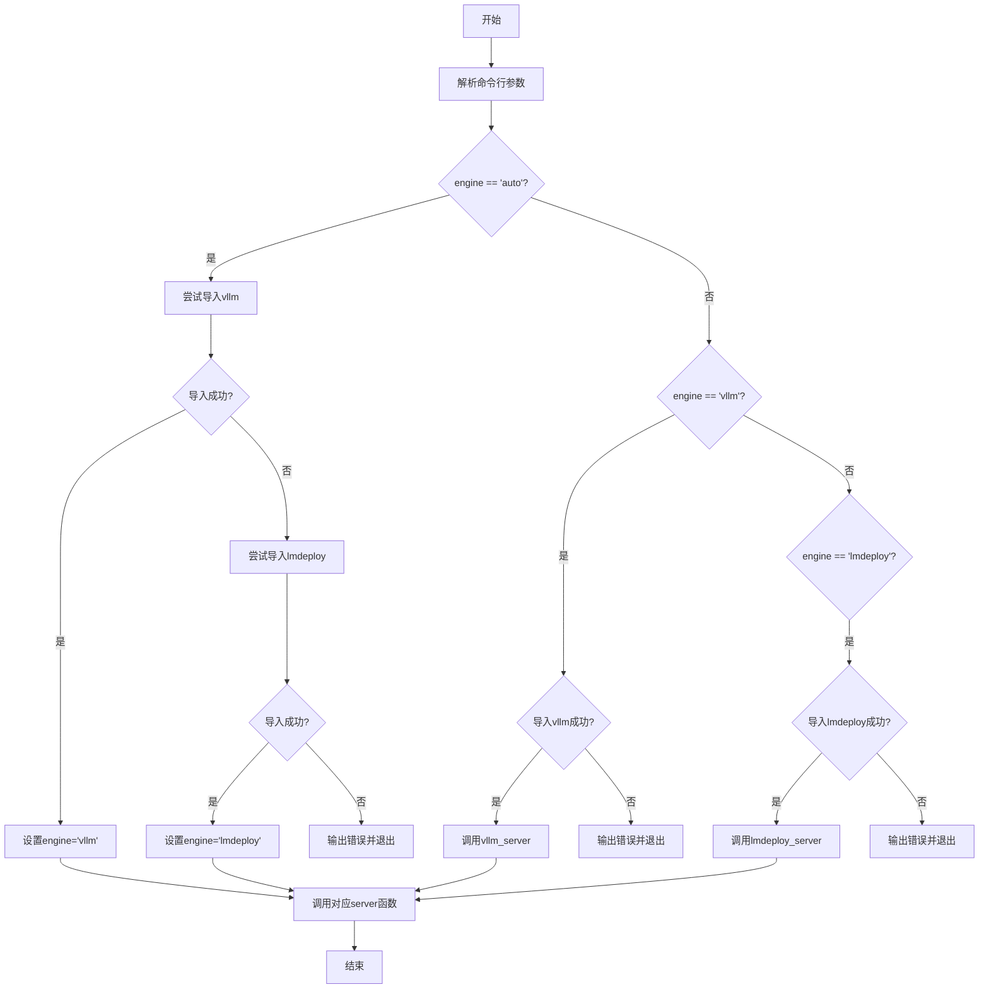
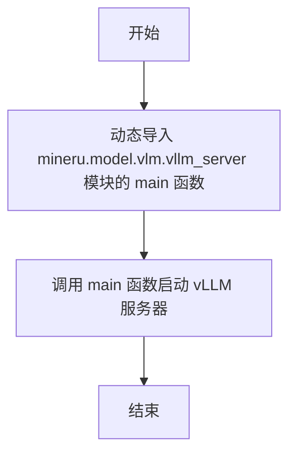
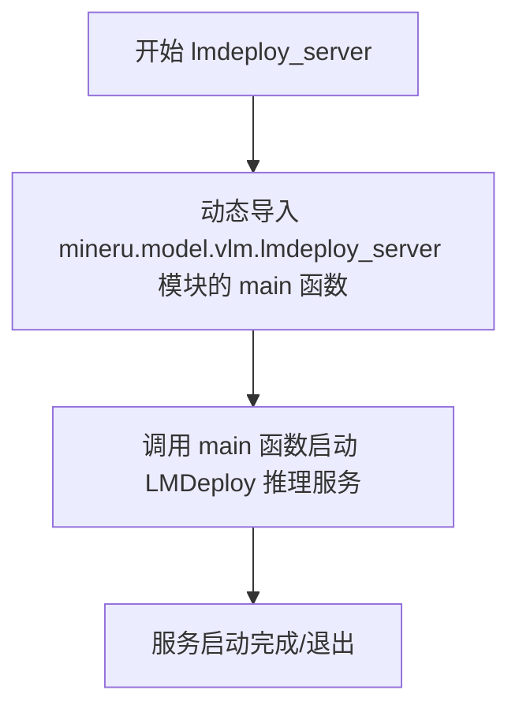

# `MinerU\mineru\cli\vlm_server.py` 详细设计文档

这是一个命令行工具，用于启动支持OpenAI API的VLM（视觉语言模型）推理服务器。它允许用户选择推理引擎（vllm或lmdeploy），并具备自动检测功能，如果未指定引擎则自动选择可用的推理后端。

## 整体流程



## 类结构

```
此文件为脚本文件，无类定义
包含3个全局函数
```

## 全局变量及字段


### `sys.argv`
    
系统命令行参数列表，包含脚本名称和所有传递给Python脚本的命令行参数

类型：`list`
    


    

## 全局函数及方法


### `vllm_server`

启动vLLM推理服务器，通过动态导入方式加载`mineru.model.vlm.vllm_server`模块的main函数并执行。

参数：

- 无

返回值：`None`，无返回值

#### 流程图



#### 带注释源码

```python
def vllm_server():
    """
    启动vLLM推理服务器
    
    该函数通过动态导入方式加载mineru.model.vlm.vllm_server模块中的main函数，
    并调用该main函数来启动vLLM推理服务器。
    采用延迟导入（lazy import）的方式，可以避免在模块加载时就必须安装vllm包。
    """
    # 动态导入vllm_server模块的main函数
    # 这种导入方式将依赖延迟到函数调用时，避免顶层导入错误
    from mineru.model.vlm.vllm_server import main
    
    # 调用main函数启动vLLM服务器
    # main函数内部会完成服务器的所有初始化和启动逻辑
    main()
```


### `lmdeploy_server`

启动 LMDeploy 推理服务器的入口函数，通过动态导入 `mineru.model.vlm.lmdeploy_server` 模块的 `main` 函数并调用它来启动 LMDeploy 推理服务。

参数：无

返回值：无返回值（通过调用 `main()` 函数启动服务）

#### 流程图



#### 带注释源码

```python
def lmdeploy_server():
    """
    启动 LMDeploy 推理服务器
    
    该函数作为 LMDeploy 推理服务的入口点，通过动态导入方式
    加载 mineru.model.vlm.lmdeploy_server 模块中的 main 函数，
    并调用它来启动实际的 LMDeploy 推理服务器。
    
    动态导入的优点：
    - 延迟加载依赖，只有在真正需要时才导入 lmdeploy 相关模块
    - 避免在模块级别导入可能不存在的可选依赖
    """
    # 动态导入 lmdeploy_server 模块中的 main 函数
    # 这种导入方式使得 lmdeploy 成为可选依赖
    from mineru.model.vlm.lmdeploy_server import main
    
    # 调用 main 函数启动 LMDeploy 推理服务
    # main 函数的实现位于 mineru.model.vlm.lmdeploy_server 模块中
    main()
```


### `openai_server`

`openai_server` 是主命令行入口函数，负责自动检测或根据用户指定选择推理引擎（vLLM 或 LMDeploy），并路由到对应的 VLM 服务器启动函数。

参数：

- `ctx`：`click.Context`，Click 框架的上下文对象，包含未解析的命令行参数
- `inference_engine`：`str`，推理引擎选择，支持 'auto'（自动检测）、'vllm'、'lmdeploy'，默认为 'auto'

返回值：`None`，该函数通过调用子服务器函数启动服务，不直接返回结果

#### 流程图

```mermaid
flowchart TD
    A[Start openai_server] --> B[设置 sys.argv = [sys.argv[0]] + ctx.args]
    B --> C{推理引擎是否为 'auto'?}
    
    C -->|Yes| D{尝试导入 vllm}
    D -->|成功| E[设置 inference_engine = 'vllm']
    E --> K{推理引擎为 'vllm'?}
    D -->|失败| F{尝试导入 lmdeploy}
    F -->|成功| G[设置 inference_engine = 'lmdeploy']
    G --> L{推理引擎为 'lmdeploy'?}
    F -->|失败| H[日志输出错误: 未安装 vLLM 或 LMDeploy]
    H --> I[sys.exit(1)]
    
    C -->|No| J{推理引擎为 'vllm'?}
    J -->|Yes| K
    J -->|No| L
    
    K -->|成功| M[调用 vllm_server]
    K -->|失败| N[日志输出错误: vLLM 未安装]
    N --> I
    
    L -->|成功| O[调用 lmdeploy_server]
    L -->|失败| P[日志输出错误: LMDeploy 未安装]
    P --> I
    
    M --> Z[End]
    O --> Z
```

#### 带注释源码

```python
@click.command(context_settings=dict(ignore_unknown_options=True, allow_extra_args=True))
@click.option(
    '-e',
    '--engine',
    'inference_engine',
    type=click.Choice(['auto', 'vllm', 'lmdeploy']),  # 允许的推理引擎选项
    default='auto',  # 默认自动检测
    help='Select the inference engine used to accelerate VLM inference, default is "auto".',
)
@click.pass_context
def openai_server(ctx, inference_engine):
    """
    主命令行入口函数，负责引擎选择和路由。
    根据 inference_engine 参数或自动检测结果，选择 vLLM 或 LMDeploy 作为推理引擎，
    并调用对应的服务器启动函数。
    """
    # 将 Click 上下文的未解析参数传递给 sys.argv，供子进程使用
    sys.argv = [sys.argv[0]] + ctx.args
    
    # 自动检测模式：尝试自动选择可用的推理引擎
    if inference_engine == 'auto':
        # 首先尝试导入 vLLM
        try:
            import vllm
            inference_engine = 'vllm'
            logger.info("Using vLLM as the inference engine for VLM server.")
        except ImportError:
            # vLLM 不可用，尝试 LMDeploy
            logger.info("vLLM not found, attempting to use LMDeploy as the inference engine for VLM server.")
            try:
                import lmdeploy
                inference_engine = 'lmdeploy'
                # 成功导入后再记录日志（避免之前的位置产生误导）
                logger.info("Using LMDeploy as the inference engine for VLM server.")
            except ImportError:
                # 两者都不可用，输出错误并退出
                logger.error("Neither vLLM nor LMDeploy is installed. Please install at least one of them.")
                sys.exit(1)

    # 根据选择的推理引擎启动对应的服务器
    if inference_engine == 'vllm':
        try:
            import vllm
        except ImportError:
            logger.error("vLLM is not installed. Please install vLLM or choose LMDeploy as the inference engine.")
            sys.exit(1)
        # 调用 vLLM 服务器启动函数
        vllm_server()
    elif inference_engine == 'lmdeploy':
        try:
            import lmdeploy
        except ImportError:
            logger.error("LMDeploy is not installed. Please install LMDeploy or choose vLLM as the inference engine.")
            sys.exit(1)
        # 调用 LMDeploy 服务器启动函数
        lmdeploy_server()
```

## 关键组件


### 推理引擎选择器

负责根据用户指定或自动检测结果选择合适的推理引擎（vLLM 或 LMDeploy），并启动对应的推理服务。

### vLLM 服务器启动器

导入并调用 vLLM 推理引擎的 main 函数，启动基于 vLLM 的推理服务器。

### LMDeploy 服务器启动器

导入并调用 LMDeploy 推理引擎的 main 函数，启动基于 LMDeploy 的推理服务器。

### 自动检测机制

尝试自动检测系统中已安装的推理引擎，优先选择 vLLM，若未安装则回退至 LMDeploy。

### 错误处理模块

针对 vLLM 和 LMDeploy 的导入失败提供明确的错误提示和退出机制，确保用户了解缺失的依赖。

## 问题及建议


### 已知问题

-   **重复导入检查**：在 `inference_engine == 'auto'` 分支中已经导入并设置了 `vllm` 或 `lmdeploy`，但后续在 `inference_engine == 'vllm'` 和 `elif inference_engine == 'lmdeploy'` 中又重复进行了导入检查，导致代码冗余和逻辑不一致
-   **sys.argv 直接修改**：直接修改全局 `sys.argv` 状态，可能对其他模块或后续代码执行造成意外影响，不是良好的实践
-   **缺乏异常处理**：`vllm_server()` 和 `lmdeploy_server()` 函数调用时没有 try-except 包装，如果内部 `main()` 函数抛出异常，程序会直接崩溃且无友好错误提示
-   **日志消息位置不当**：在 auto 模式成功导入 lmdeploy 时，先执行了 `inference_engine = 'lmdeploy'`，然后才打印成功日志，逻辑顺序可以优化
-   **auto 模式逻辑缺陷**：当前 auto 模式优先选择 vllm，只有 vllm 导入失败才尝试 lmdeploy，缺乏更智能的引擎选择策略（如检查 GPU 兼容性等）
-   **缺少类型注解**：所有函数参数和返回值都缺少类型注解，降低了代码可读性和 IDE 支持
-   **硬编码模块路径**：`from mineru.model.vlm.vllm_server import main` 和 `from mineru.model.vlm.lmdeploy_server import main` 采用硬编码路径，扩展性差
-   **exit code 缺乏区分**：所有错误场景统一使用 `sys.exit(1)`，没有区分不同类型的错误码，不利于上层调用者进行错误诊断

### 优化建议

-   重构导入检查逻辑：可以在 auto 模式检查后直接调用对应函数，避免重复的导入检查；或者使用配置字典统一管理引擎和对应的导入检查逻辑
-   使用参数传递替代 sys.argv 修改：考虑将 `ctx.args` 作为参数传递给子模块的 main 函数，而非修改全局 sys.argv
-   添加异常处理：在调用 `vllm_server()` 和 `lmdeploy_server()` 时添加 try-except，捕获异常后记录日志并以合适的 exit code 退出
-   优化日志输出：将日志消息移到更合理的位置，确保日志顺序与实际执行逻辑一致
-   增强 auto 模式策略：可以添加更多检测逻辑（如 GPU 型号、显存大小等）来辅助选择最优推理引擎
-   添加类型注解：为所有函数添加明确的类型注解，提升代码质量和可维护性
-   抽象引擎加载逻辑：使用配置或注册机制管理推理引擎，减少硬编码，便于扩展新引擎
-   细化 exit code：定义不同错误场景对应的 exit code（如 1 表示引擎未安装，2 表示引擎启动失败等），便于错误诊断


## 其它


### 设计目标与约束

本代码旨在提供一个统一的CLI入口，根据用户选择或自动检测结果启动vLLM或LMDeploy作为后端的VLM（视觉语言模型）推理服务器。主要设计约束包括：1) 必须安装至少一种推理引擎；2) 支持自动检测和手动指定两种模式；3) 保持对Click命令行参数的无缝传递。

### 错误处理与异常设计

本代码采用显式检查加错误退出的错误处理策略。主要错误场景包括：1) 推理引擎未安装时记录错误日志并调用sys.exit(1)退出；2) 自动检测模式下两种引擎都不可用时的错误处理。所有错误都会通过loguru记录详细错误信息，帮助用户定位问题。

### 数据流与状态机

程序运行时存在以下状态转换：初始状态 -> 解析命令行参数 -> 判断engine参数是否为'auto' -> 若为'auto'则进入自动检测分支（尝试导入vllm，失败则尝试导入lmdeploy，都失败则报错退出） -> 根据最终确定的engine选择对应分支 -> 调用相应的server启动函数。

### 外部依赖与接口契约

核心外部依赖包括：1) click库用于CLI命令定义和参数解析；2) loguru用于日志记录；3) vllm或lmdeploy作为推理引擎。接口契约方面：- openai_server函数接受ctx（Click上下文）和inference_engine（推理引擎名称）参数；- vllm_server和lmdeploy_server分别调用对应模块的main函数；- 通过sys.argv传递额外参数给下游服务器进程。

### 性能考虑

自动检测模式下的性能开销主要来自动态导入库的尝试，建议在明确知道使用哪种引擎时直接指定以避免不必要的导入尝试。程序本身无运行时性能瓶颈，属于轻量级启动器。

### 安全性考虑

代码通过sys.argv直接传递命令行参数给下游服务器，存在一定的命令注入风险，但仅限于传递用户原本可通过命令行传递的参数。建议在生产环境中对ctx.args进行必要的校验。

### 兼容性考虑

当前支持Python 3.8+（需视click和loguru的版本要求而定）。vllm和lmdeploy的版本兼容性需要参考各自官方文档。本代码作为入口文件，兼容性主要取决于下游推理引擎的版本策略。

### 扩展性设计

代码结构具有良好的扩展性：1) 通过添加新的engine分支可轻松支持其他推理引擎；2) 自动检测逻辑可通过配置文件扩展支持优先级自定义；3) Click的context_settings允许传递额外参数给子命令。

### 部署相关

本文件作为独立入口点部署，建议通过setuptools或pip安装为console_script。部署时需确保目标环境已安装至少一种推理引擎（vllm或lmdeploy），并配置好相应的环境变量和依赖。


    