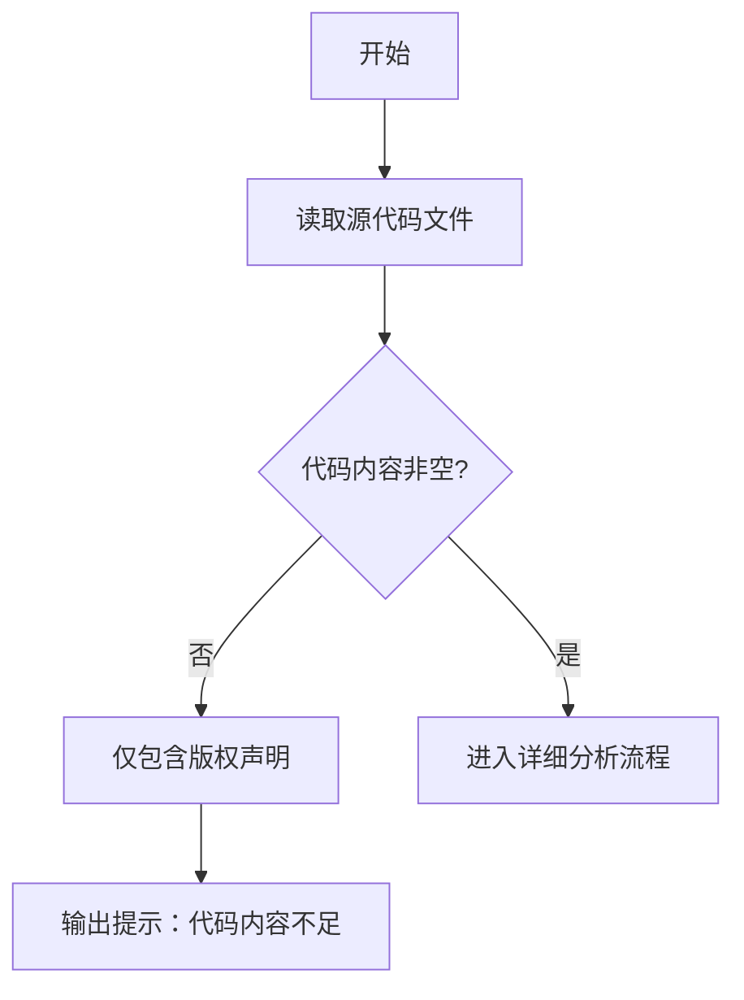

# `MinerU\mineru\data\__init__.py` 详细设计文档

该文件仅包含版权声明信息，无实际功能代码可分析

## 整体流程



## 类结构

```
无类结构可分析
```

## 全局变量及字段


    

## 全局函数及方法


## 关键组件


### 组件1

无法识别有效组件。提供的源代码仅包含版权声明，无实际实现代码可供分析。


## 问题及建议


### 已知问题

-   代码片段中仅包含版权声明，无实际实现代码可分析

### 优化建议

-   当前提供的代码片段不包含任何可分析的业务逻辑、类、函数或变量定义，无法进行深入的技术债务或优化空间分析
-   建议提供完整的源代码文件以便进行全面的架构分析和设计文档生成


## 其它


### 设计目标与约束

由于代码仅包含版权声明（`# Copyright (c) Opendatalab. All rights reserved.`），未提供任何功能性代码，因此无法确定具体的设计目标与约束。正常情况下应包含：业务目标、性能要求、安全性约束、兼容性要求等。

### 错误处理与异常设计

无相关代码可供分析。正常情况下应包含：异常类型定义、错误码体系、异常传播机制、降级策略等。

### 数据流与状态机

无相关代码可供分析。正常情况下应包含：数据输入来源、数据处理流程、数据输出目标、状态转换逻辑等。

### 外部依赖与接口契约

无相关代码可供分析。正常情况下应包含：第三方库依赖、MVP/接口定义、API契约、版本兼容性等。

### 安全性设计

无相关代码可供分析。正常情况下应包含：身份认证、授权控制、数据加密、输入验证、安全审计等。

### 性能与扩展性

无相关代码可供分析。正常情况下应包含：性能指标、瓶颈分析、扩展策略、缓存设计、负载均衡等。

### 配置与运维

无相关代码可供分析。正常情况下应包含：配置项定义、环境变量、日志规范、监控告警、部署策略等。

### 测试策略

无相关代码可供分析。正常情况下应包含：单元测试、集成测试、端到端测试、测试覆盖率目标等。

### 版本演进与迁移

无相关代码可供分析。正常情况下应包含：版本号规则、API版本管理、向后兼容性、数据迁移策略等。

### 总结

当前提供的代码片段仅包含版权声明，不足以生成完整的详细设计文档。若需要完整的详细设计文档，请提供具有实际业务逻辑的代码文件。

    