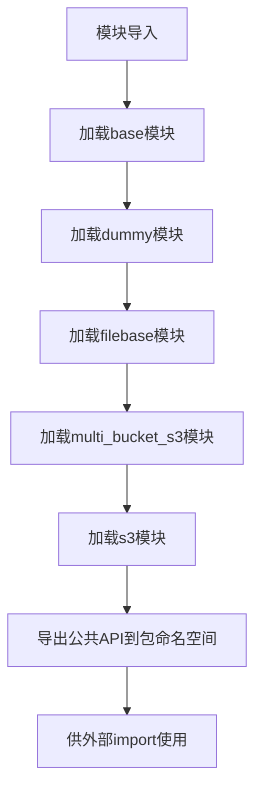

# `MinerU\mineru\data\data_reader_writer\__init__.py` 详细设计文档

这是一个数据读写模块的包初始化文件，导出了各种数据读取和写入类的公共API，包括基础抽象类、文件基础类、S3云存储类和虚拟测试类，为上层应用提供统一的数据输入输出接口。

## 整体流程



## 类结构

```
DataReader (抽象基类)
├── FileBasedDataReader (文件数据读取)
├── S3DataReader (S3单bucket读取)
└── MultiBucketS3DataReader (S3多bucket读取)
DataWriter (抽象基类)
├── FileBasedDataWriter (文件数据写入)
├── S3DataWriter (S3单bucket写入)
├── MultiBucketS3DataWriter (S3多bucket写入)
└── DummyDataWriter (虚拟空写入)
```

## 全局变量及字段


### `__all__`
    
定义模块公开API的导出列表，控制from module import *时导入的成员

类型：`list`
    


    

## 全局函数及方法


## 关键组件


### DataReader

基础抽象数据读取器类，定义了数据读取的标准接口和契约

### DataWriter

基础抽象数据写入器类，定义了数据写入的标准接口和契约

### DummyDataWriter

虚拟数据写入器实现，用于测试或无需实际写入的场景

### FileBasedDataReader

基于本地文件系统的数据读取器，支持从本地磁盘读取数据

### FileBasedDataWriter

基于本地文件系统的数据写入器，支持将数据写入本地磁盘

### S3DataReader

基于Amazon S3的数据读取器，支持从S3存储桶读取数据

### S3DataWriter

基于Amazon S3的数据写入器，支持将数据写入S3存储桶

### MultiBucketS3DataReader

多Bucket S3数据读取器，支持从多个S3存储桶读取数据

### MultiBucketS3DataWriter

多Bucket S3数据写入器，支持将数据写入多个S3存储桶


## 问题及建议


### 已知问题

- 缺乏模块级和类级的文档字符串，无法快速了解各数据读写类的用途和使用场景
- 未使用类型注解（Type Hints），降低了代码的可读性和静态类型检查工具的效力
- 缺少版本管理和变更日志，无法追踪API的演进历史
- 未提供工厂模式或配置类来动态创建数据读写实例，使用方需直接导入具体实现类
- 没有导出自定义异常类，调用方无法精确捕获特定的数据读写错误
- 缺少测试相关的导入或测试工具的集成指示
- 未定义抽象基类（ABC）的显式接口契约，新实现类可能不符合预期的行为规范

### 优化建议

- 为每个导出的类添加 docstring，说明其功能、适用场景和典型用法
- 引入类型注解，如 `def get_reader() -> Type[DataReader]: ...`
- 添加 `__version__` 变量和 `CHANGELOG.md` 文件来管理版本信息
- 实现工厂类或注册机制（如 `DataReaderRegistry`），支持按配置动态加载实现
- 创建自定义异常类（如 `DataReadError`, `DataWriteError`）并纳入 `__all__`
- 提供测试夹具（fixtures）或 mock 工具的导出，便于单元测试
- 确保 `DataReader` 和 `DataWriter` 继承自 `abc.ABC` 并使用 `@abstractmethod` 定义核心方法，形成明确的接口契约


## 其它


### 设计目标与约束

本模块旨在提供一个统一的数据读写抽象层，支持多种数据源（本地文件、S3存储、多Bucket S3存储等），实现数据读写逻辑的解耦和可扩展性。设计目标包括：1）提供清晰的接口定义（DataReader、DataWriter抽象类）；2）支持多种存储后端；3）便于扩展新的数据源类型。约束条件包括：需要Python 3.x环境，依赖boto3库用于S3操作。

### 错误处理与异常设计

本模块应定义统一的异常体系，包括：DataReadError（数据读取异常）、DataWriteError（数据写入异常）、ConfigurationError（配置异常）、ConnectionError（连接异常）等。所有具体实现类应抛出这些标准异常，便于上层调用者统一处理。异常应包含有意义的错误信息，建议包含失败的操作、路径/键、原始异常原因等上下文信息。

### 数据流与状态机

数据读取流程：调用方通过DataReader接口读取数据，具体实现类（如S3DataReader）负责建立连接、获取数据、返回结果。数据写入流程：调用方通过DataWriter接口写入数据，具体实现类负责验证数据、建立连接、写入数据。状态机描述：Reader/Writer生命周期包括初始化、就绪（已建立连接）、工作中（执行读写操作）、异常、关闭等状态。

### 外部依赖与接口契约

主要外部依赖包括：1）boto3库：用于AWS S3操作；2）Python标准库：用于文件操作；3）mock或其他测试框架：用于单元测试。接口契约方面：DataReader接口约定read()方法返回字节数据或字符串，参数为路径/键；DataWriter接口约定write()方法接受数据参数和目标路径/键，返回写入结果或写入状态。

### 安全性考虑

S3相关实现需考虑：1）凭证管理：优先使用IAM角色、环境变量、配置文件等方式管理访问密钥，避免硬编码；2）传输安全：生产环境应使用HTTPS协议；3）权限控制：遵循最小权限原则，仅授予必要的数据访问权限；4）敏感信息日志：确保日志中不记录敏感凭证信息。

### 性能考虑

性能优化方向：1）连接复用：S3客户端应考虑连接池或会话复用；2）大文件处理：对于大文件应支持分块读取/写入；3）并发支持：可考虑提供异步接口或并发读写能力；4）缓存机制：可考虑对频繁读取的数据进行本地缓存。性能指标建议：定义读写延迟、吞吐量等SLA要求。

### 版本兼容性

本模块应遵循语义化版本规范（SemVer）。接口兼容性策略：1）DataReader和DataWriter作为抽象基类，其方法签名应保持稳定；2）新增方法应保持向后兼容；3）若需破坏性变更，应在主版本号升级时进行，并提供迁移指南。建议在文档中明确标注各版本的API稳定性等级。

### 配置管理

模块应提供灵活的配置机制：1）S3配置：支持通过环境变量、配置文件、代码参数等方式配置endpoint、region、credentials等；2）文件路径配置：支持相对路径和绝对路径；3）默认值设计：应为常用参数设置合理的默认值，减少配置负担；4）配置验证：启动时应验证配置有效性，尽早发现配置错误。

    