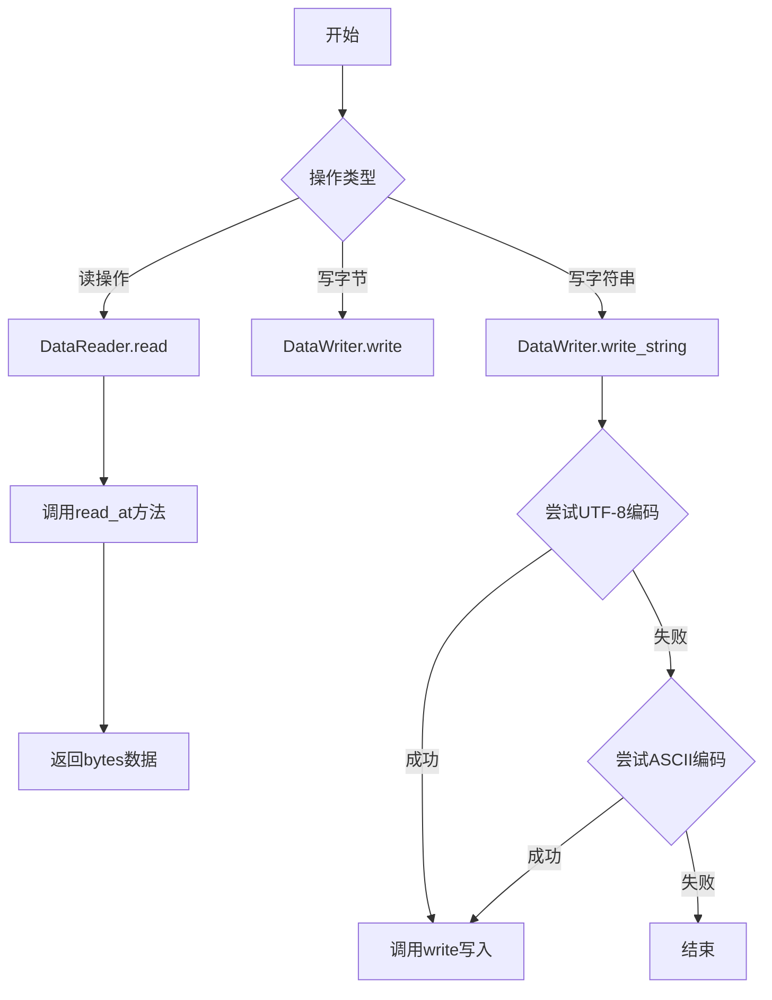
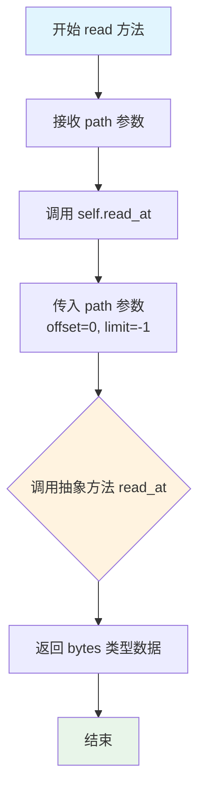
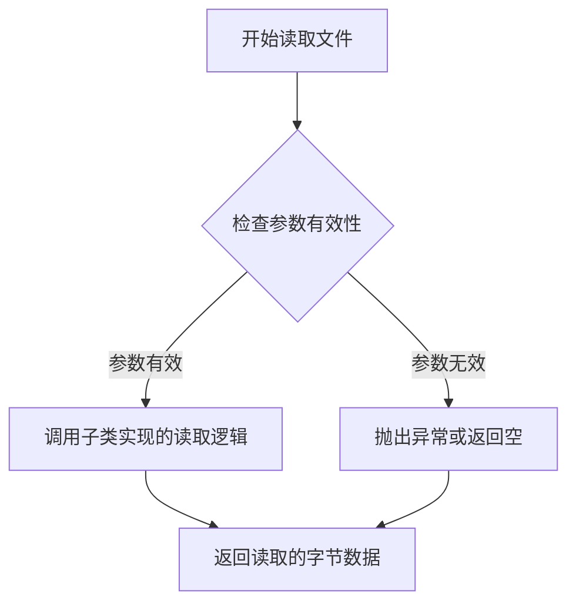
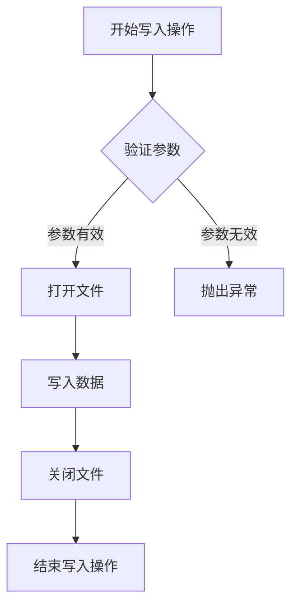
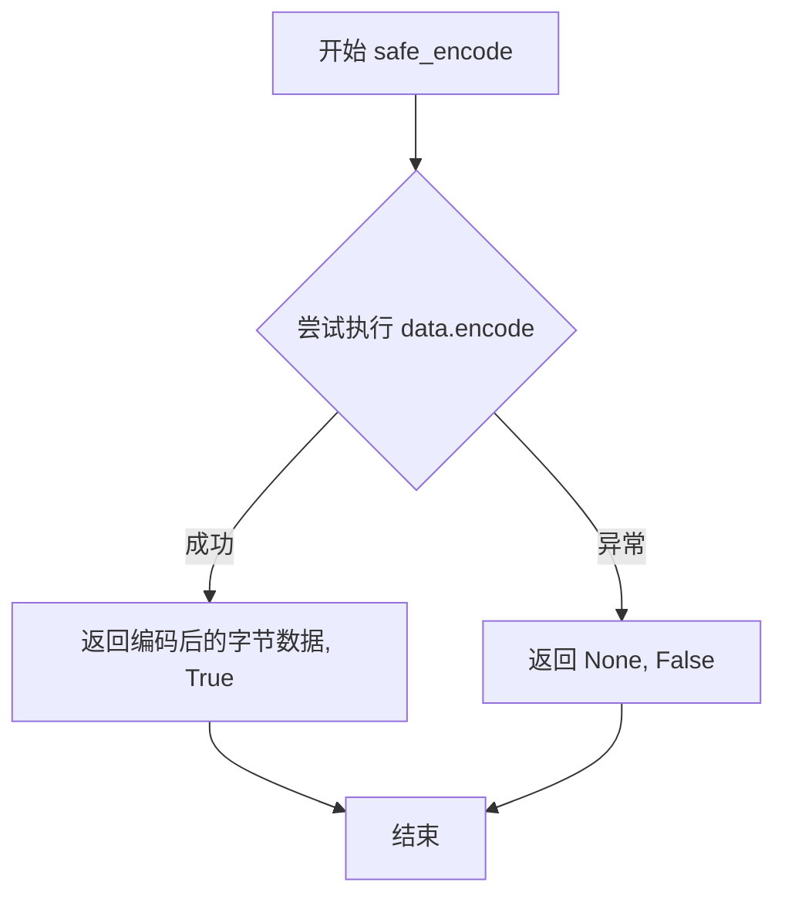

# `MinerU\mineru\data\data_reader_writer\base.py` 详细设计文档

该代码定义了一套抽象的数据读写接口框架，DataReader提供统一的文件读取抽象，支持指定偏移量和读取长度的细粒度控制；DataWriter提供字节写入和字符串写入能力，字符串写入时会自动尝试UTF-8或ASCII编码转换。

## 整体流程



## 类结构

```
DataReader (ABC)
└── read() / read_at() [抽象方法]
DataWriter (ABC)
└── write() [抽象方法] / write_string()
```

## 全局变量及字段


    

## 全局函数及方法


### `DataReader.read`

读取文件并返回文件内容的字节数据。

参数：

- `path`：`str`，要读取的文件路径

返回值：`bytes`，文件的内容

#### 流程图



#### 带注释源码

```python
def read(self, path: str) -> bytes:
    """Read the file.

    Args:
        path (str): file path to read

    Returns:
        bytes: the content of the file
    """
    # 委托给 read_at 方法执行实际读取操作
    # 使用默认参数 offset=0（从头开始）和 limit=-1（读取全部内容）
    return self.read_at(path)
```


### `DataReader.read_at`

该方法是一个抽象方法，定义了在指定路径的文件中从特定偏移量开始读取特定长度数据的接口。子类需要实现此方法以提供具体的文件读取逻辑，支持部分内容读取（通过 offset 和 limit 参数控制）。

参数：

- `path`：`str`，要读取的文件路径
- `offset`：`int`，可选参数，表示从文件开头跳过的字节数，默认为 0
- `limit`：`int`，可选参数，表示要读取的字节长度，默认为 -1（表示读取到文件末尾）

返回值：`bytes`，读取到的文件内容

#### 流程图



#### 带注释源码

```python
@abstractmethod
def read_at(self, path: str, offset: int = 0, limit: int = -1) -> bytes:
    """Read the file at offset and limit.

    Args:
        path (str): the file path
        offset (int, optional): the number of bytes skipped. Defaults to 0.
        limit (int, optional): the length of bytes want to read. Defaults to -1.

    Returns:
        bytes: the content of the file
    """
    pass
```


### `DataWriter.write`

将数据写入指定的文件路径。该方法是抽象方法，由子类具体实现，负责将二进制数据持久化到文件系统中。

参数：

- `path`：`str`，目标文件路径，指定数据写入的位置
- `data`：`bytes`，要写入的二进制数据内容

返回值：`None`，无返回值

#### 流程图



#### 带注释源码

```python
@abstractmethod
def write(self, path: str, data: bytes) -> None:
    """Write the data to the file.

    Args:
        path (str): the target file where to write
        data (bytes): the data want to write
    """
    pass
```

**源码说明：**

- `@abstractmethod`：装饰器，表示该方法为抽象方法，必须由子类实现
- `self`：隐式参数，指向调用该方法的实例
- `path: str`：目标文件路径，字符串类型
- `data: bytes`：要写入的二进制数据，字节类型
- `None`：无返回值
- `pass`：抽象方法占位符，表示该方法由子类实现


### `DataWriter.write_string`

将字符串数据写入文件，自动处理字符编码转换。该方法尝试使用 UTF-8 编码将字符串转换为字节数据，如果失败则回退到 ASCII 编码，最终调用抽象方法 `write` 完成文件写入操作。

参数：

-  `path`：`str`，目标文件路径
-  `data`：`str`，要写入的字符串数据

返回值：`None`，无返回值

#### 流程图

```mermaid
flowchart TD
    A[开始 write_string] --> B[调用 safe_encode with 'utf-8']
    B --> C{编码是否成功?}
    C -->|是| D[调用 self.write(path, bit_data)]
    C -->|否| E[尝试 'ascii' 编码]
    E --> F{编码是否成功?}
    F -->|是| D
    F -->|否| G[静默结束，不写入任何数据]
    D --> H[结束]
    G --> H
```

#### 带注释源码

```python
def write_string(self, path: str, data: str) -> None:
    """将数据写入文件，数据将被编码为字节

    参数:
        path (str): 目标文件路径
        data (str): 要写入的数据
    """

    # 定义内部安全编码函数，用于尝试将字符串编码为字节
    def safe_encode(data: str, method: str):
        try:
            # 尝试使用指定编码方法转换字符串为字节
            # errors='replace' 表示替换无法编码的字符，而非抛出异常
            bit_data = data.encode(encoding=method, errors='replace')
            return bit_data, True  # 编码成功，返回数据和成功标志
        except:  # noqa
            # 静默捕获所有异常，返回None和失败标志
            # 注意：这里使用了裸except，忽略了具体异常类型
            return None, False

    # 遍历编码方法列表，优先尝试 UTF-8，失败则回退到 ASCII
    for method in ['utf-8', 'ascii']:
        bit_data, flag = safe_encode(data, method)
        if flag:
            # 编码成功时，调用抽象方法 write 执行实际写入
            self.write(path, bit_data)
            break  # 写入成功后跳出循环，避免重复写入
```


### `DataWriter.write_string.safe_encode`

`safe_encode` 是一个定义在 `DataWriter.write_string` 方法内部的嵌套辅助函数，用于尝试将字符串数据按指定编码方法转换为字节数据，并返回编码结果及成功标志。

参数：

- `data`：`str`，需要编码的字符串数据
- `method`：`str`，编码方式（如 'utf-8'、'ascii'）

返回值：`(bytes | None, bool)`，返回元组包含编码后的字节数据（或失败时为 None）和布尔成功标志

#### 流程图



#### 带注释源码

```python
def safe_encode(data: str, method: str):
    """内部辅助函数：尝试将字符串按指定方法编码为字节
    
    Args:
        data (str): 需要编码的字符串
        method (str): 编码方法（如 'utf-8', 'ascii'）
    
    Returns:
        tuple: (编码后的字节数据或None, 是否成功标志)
    """
    try:
        # 使用指定编码方法尝试编码字符串
        # errors='replace' 会将无法编码的字符替换为 ? 而不是抛出异常
        bit_data = data.encode(encoding=method, errors='replace')
        # 编码成功，返回字节数据和成功标志 True
        return bit_data, True
    except:  # noqa
        # 捕获所有异常（此处存在技术债务：过于宽泛的异常捕获）
        # 编码失败，返回 None 和失败标志 False
        return None, False
```


## 关键组件


### DataReader 抽象类

数据读取的抽象基类，定义了读取文件的标准接口，支持全量读取和基于偏移/限制的分块读取。

### DataWriter 抽象类

数据写入的抽象基类，定义了写入文件的标准接口，支持字节写入和字符串写入（带编码自动回退）。

### read() 方法

通用读取接口，内部调用 read_at() 实现，用于简化调用者的使用。

### read_at() 抽象方法

支持偏移量和长度限制的文件读取抽象方法，由子类实现具体读取逻辑。

### write() 抽象方法

写入字节数据到指定文件的抽象方法，由子类实现具体写入逻辑。

### write_string() 方法

将字符串写入文件的方法，内部通过 safe_encode 内部函数实现编码自动回退（UTF-8 优先，失败则回退到 ASCII）。

### safe_encode 内部函数

字符串编码的安全处理函数，使用 try-except 捕获编码异常，支持指定编码方法和错误替换策略。


## 问题及建议


### 已知问题

-   **异常捕获不规范**：`write_string` 方法中使用裸 `except:` 捕获所有异常并使用 `# noqa` 忽略警告，隐藏了真实的错误信息，不利于调试和错误追踪。
-   **编码失败时静默失败**：`write_string` 方法在 UTF-8 和 ASCII 编码都失败时，方法直接结束而不会抛出异常或给出任何提示，导致数据未写入但调用者无法感知。
-   **缺乏参数验证**：未对文件路径、offset、limit 等参数进行有效性校验，可能导致潜在的运行时错误。
-   **不支持资源管理**：缺少 `__enter__` 和 `__exit__` 方法，不支持上下文管理器协议，无法确保资源正确释放。
-   **内部函数重复定义**：`safe_encode` 函数在每次调用 `write_string` 时都会重新定义，造成不必要的性能开销。
-   **返回值类型不一致隐患**：`DataReader.read` 方法声明返回 `bytes`，但实际调用 `read_at` 的返回类型取决于子类实现，缺少类型检查。
-   **设计约定不明确**：`limit=-1` 表示无限制读取的约定未在文档中明确说明，且负数其他值的行为未定义。

### 优化建议

-   **改进异常处理**：使用具体的异常类型（如 `UnicodeEncodeError`），避免裸 `except:`，并在捕获后记录或重新抛出有意义的异常。
-   **增加错误反馈**：当所有编码方式都失败时，应抛出明确的异常或返回失败状态，确保调用者知道写入操作未成功。
-   **添加参数验证**：在方法入口处校验路径非空、offset 非负、limit 为正数或-1，拒绝无效参数并抛出 `ValueError`。
-   **实现上下文管理器**：为类添加 `__enter__` 和 `__exit__` 方法，或提供 `close()` 方法，确保文件句柄等资源被正确关闭。
-   **提取公共函数**：将 `safe_encode` 提升为静态方法或模块级函数，避免重复创建。
-   **明确设计约定**：在文档中明确规定 `limit=-1` 的语义，并考虑使用 `Optional[int]` 配合 `None` 替代 `-1 表示无限制 的隐式约定。
-   **增加类型注解完整性**：为内部函数 `safe_encode` 添加完整的类型注解，确保返回类型明确。

## 其它


### 设计目标与约束

本模块旨在提供统一的文件读写抽象接口，支持多种数据源（本地文件、网络文件等）的统一访问方式。DataReader类专注于读取操作，支持偏移量和长度限制；DataWriter类专注于写入操作，支持字节和字符串两种数据格式的写入。设计遵循开闭原则，便于扩展新的数据读写实现。

### 错误处理与异常设计

代码中错误处理较弱，存在以下问题：1）DataReader的read和read_at方法没有异常处理机制，当文件不存在、权限不足或读取错误时会直接抛出异常；2）DataWriter的write_string方法中的safe_encode函数使用裸except捕获异常，可能隐藏真正的错误信息；3）建议为不同的错误场景定义具体的异常类（如FileNotFoundError、PermissionError、EncodingError等），并在适当的地方进行抛出和捕获。

### 数据流与状态机

DataReader的读取流程为：read()方法接收完整文件路径，调用read_at()方法，read_at()根据offset和limit参数决定读取文件的起始位置和读取长度。DataWriter的写入流程为：write()方法直接写入字节数据，write_string()方法先将字符串编码为字节再调用write()方法。编码尝试顺序为utf-8，失败则尝试ascii，若都失败则使用errors='replace'策略替换无法编码的字符。

### 外部依赖与接口契约

本模块仅依赖Python标准库中的abc模块（用于定义抽象基类）和typing模块（类型提示）。接口契约如下：DataReader的read_at方法为抽象方法，所有子类必须实现；DataReader的read方法提供了默认实现，调用read_at；DataWriter的write方法为抽象方法，子类必须实现；DataWriter的write_string方法提供了默认实现。所有方法的path参数必须为有效的文件路径字符串，data参数必须为bytes类型（write方法）或str类型（write_string方法）。

### 性能考虑

当前实现未包含任何缓存机制或性能优化。对于大文件读取，read_at方法的limit参数允许分块读取，但缺少流式处理的支持。write_string方法中的编码尝试逻辑在每次调用时都会执行，可以考虑缓存编码方法或提供预编码接口以提升性能。

### 线程安全

代码中未包含任何线程同步机制。DataReader和DataWriter的实例在多线程环境下共享使用时可能存在竞态条件，特别是涉及文件指针操作时。建议在具体实现类中添加适当的锁机制，或在文档中明确说明此类非线程安全的特性。

### 资源管理

代码中未实现任何资源管理机制（如上下文管理器）。建议DataReader和DataWriter的具体实现类实现__enter__和__exit__方法以支持with语句，确保文件句柄等资源得到正确释放。

### 扩展性设计

当前抽象类设计良好，易于扩展。可以继承DataReader实现网络数据读取、内存数据读取、加密文件读取等；可以继承DataWriter实现追加写入、事务性写入、压缩写入等。write_string方法的编码尝试顺序可以提取为配置项，便于在不同场景下调整。


    