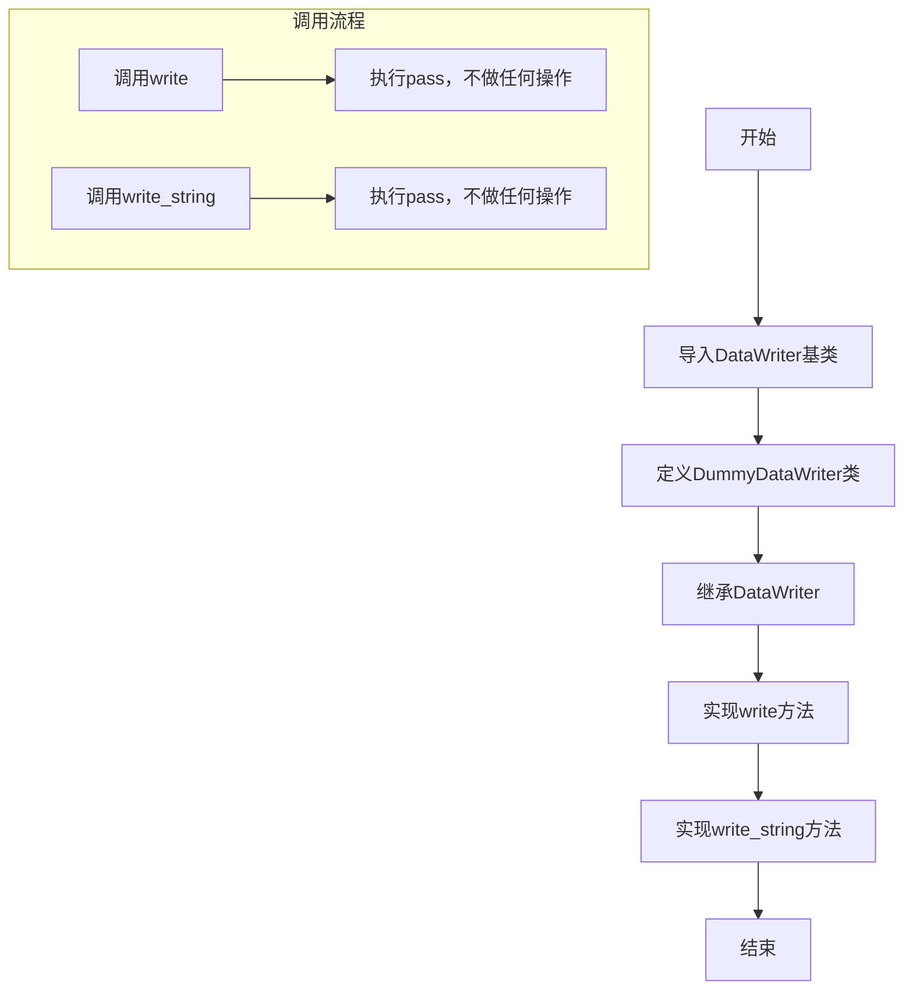
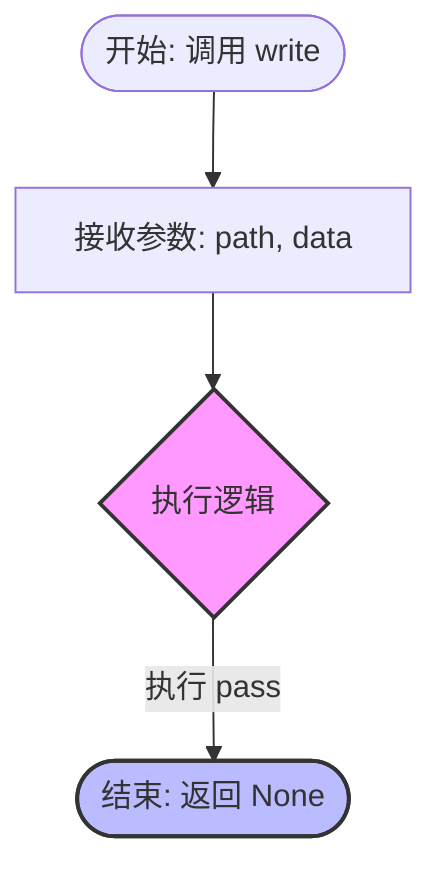
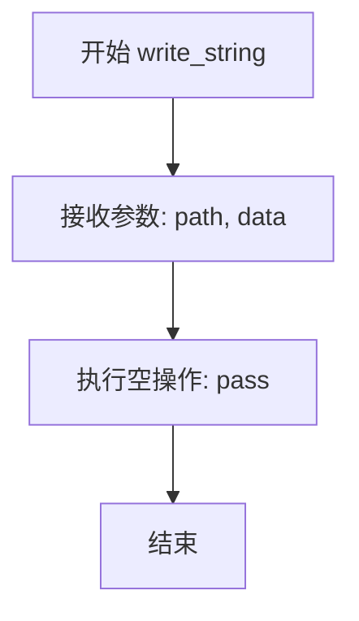
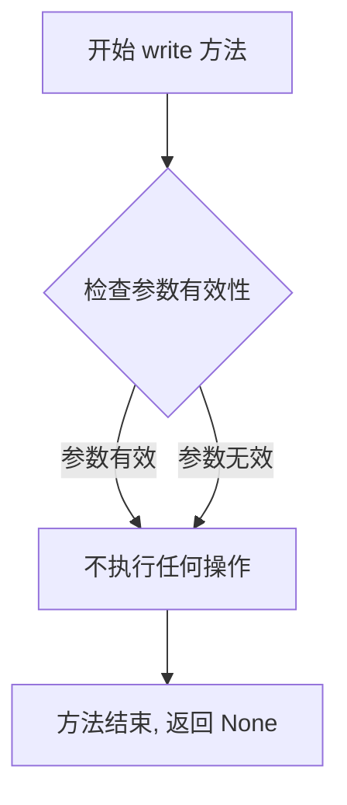
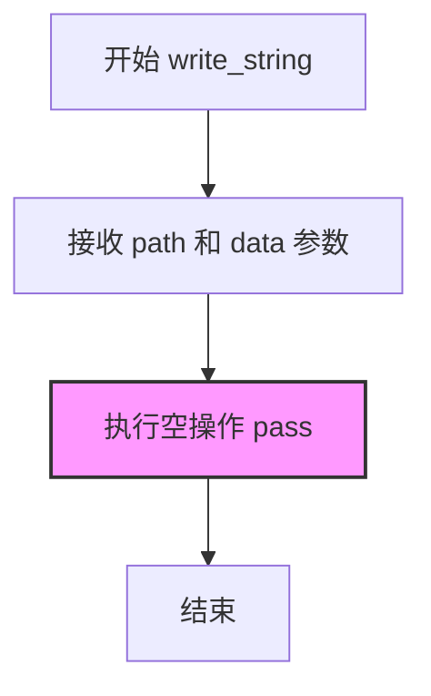

# `MinerU\mineru\data\data_reader_writer\dummy.py` 详细设计文档

一个虚拟数据写入器类，实现DataWriter抽象基类，提供空操作的write和write_string方法，用于测试或作为默认写入器

## 整体流程



## 类结构

```
DataWriter (抽象基类)
└── DummyDataWriter (虚拟写入器实现类)
```

## 全局变量及字段


    

## 全局函数及方法


### `DummyDataWriter.write`

这是一个空实现（Stub）的写入方法。该方法继承自 `DataWriter` 基类，接收文件路径和二进制数据，但执行逻辑仅为 `pass`，不进行任何实际的文件 I/O 操作。通常用于测试环境、干燥运行（Dry Run）模式或需要忽略写入结果的场景。

参数：

- `path`：`str`，指定要写入的文件路径（在该实现中未被使用）。
- `data`：`bytes`，要写入的二进制数据（在该实现中未被使用）。

返回值：`None`，该方法不返回任何值。

#### 流程图



#### 带注释源码

```python
def write(self, path: str, data: bytes) -> None:
    """
    Dummy write method that does nothing.
    
    这是一个虚拟的写入方法，用于模拟写入操作。
    它接受路径和数据，但实际上不执行任何操作。
    """
    pass
```


### `DummyDataWriter.write_string`

Dummy write_string method that does nothing.

参数：

-  `path`：`str`，写入目标路径
-  `data`：`str`，写入的字符串数据

返回值：`None`，无返回值

#### 流程图



#### 带注释源码

```python
def write_string(self, path: str, data: str) -> None:
    """
    Dummy write_string method that does nothing.
    
    参数:
        path: str - 写入目标路径
        data: str - 写入的字符串数据
    
    返回值:
        None - 无返回值
    """
    pass  # 空操作，不执行任何写入操作
```


### `DummyDataWriter.write`

该方法是 `DummyDataWriter` 类对基类 `DataWriter` 中 `write` 方法的空实现，不执行任何实际操作，仅作为占位符使用。

参数：

- `self`：隐藏的实例参数，表示当前 `DummyDataWriter` 类的实例对象
- `path`：`str`，目标文件的路径，用于指定数据写入位置
- `data`：`bytes`，要写入的二进制数据内容

返回值：`None`，该方法不返回任何值

#### 流程图



#### 带注释源码

```python
def write(self, path: str, data: bytes) -> None:
    """Dummy write method that does nothing."""
    # 该方法是一个空实现（stub），用于：
    # 1. 满足基类 DataWriter 的抽象方法契约
    # 2. 在测试场景中作为不执行实际写入的替代实现
    # 3. 提供与正式 DataWriter 相同的方法签名
    
    # 参数 path: str - 指定要写入的文件路径（此处未使用）
    # 参数 data: bytes - 要写入的二进制数据（此处未使用）
    
    pass  # 空操作，直接返回 None
```


### `DummyDataWriter.write_string`

DummyDataWriter 类中的 write_string 方法是一个空实现，用于测试或占位目的，不执行实际的字符串写入操作。

参数：

- `self`：DummyDataWriter，当前类的实例对象
- `path`：`str`，要写入的目标文件路径
- `data`：`str`，要写入的字符串数据

返回值：`None`，无返回值

#### 流程图



#### 带注释源码

```python
def write_string(self, path: str, data: str) -> None:
    """
    Dummy write_string method that does nothing.
    
    这是一个空实现的写入字符串方法，仅用于测试或作为基类方法的占位符。
    该方法不执行任何实际操作，直接返回。
    
    参数：
        path: str - 目标文件路径（在此实现中未被使用）
        data: str - 要写入的字符串数据（在此实现中未被使用）
    
    返回值：
        None - 无返回值
    """
    pass  # 空操作，不执行任何写入逻辑
```

## 关键组件


### DummyDataWriter类

继承自DataWriter的虚拟数据写入器实现，所有写入操作均为空实现（pass），主要用于测试场景或作为占位符。

### write方法

将二进制数据写入指定路径的空实现方法，不执行任何实际写入操作。

### write_string方法

将字符串数据写入指定路径的空实现方法，不执行任何实际写入操作。


## 问题及建议


### 已知问题

- **空实现无实际功能**：write和write_string方法均为空实现（pass），不执行任何实际操作，在生产环境中使用可能导致数据丢失而不被察觉
- **缺少基类约束**：继承自DataWriter但未验证是否实现了基类定义的抽象方法或属性，可能导致运行时错误
- **无错误处理**：方法签名未包含任何异常处理机制，无法捕获或报告写入失败
- **缺少文档说明**：类级别的文档字符串缺失，未说明该桩实现的用途、使用场景或为何设计为空操作
- **潜在死代码**：该类可能在生产代码中毫无用处，若仅为测试目的，应明确标记或移除
- **无日志输出**：空实现没有任何日志记录，导致调用方无法判断操作是否真正执行

### 优化建议

- 添加类级别的docstring，说明DummyDataWriter是用于测试或作为默认桩实现的用途
- 考虑添加日志记录或返回值来指示操作状态，而非静默失败
- 若为测试桩，建议添加is_active或enabled标志，允许动态启用/禁用空操作行为
- 验证DataWriter基类，确保DummyDataWriter正确实现所有必需的抽象成员
- 考虑添加类型注解的完整性检查，确保方法签名与基类一致
- 如该类确实无需使用，建议移除以避免代码混淆和维护负担

## 其它


### 设计目标与约束

DummyDataWriter的设计目标是为测试和开发环境提供一个不需要实际写入数据的DataWriter实现。其约束包括：不执行任何实际的IO操作，不抛出异常，不保存任何数据，仅作为接口的空实现用于依赖注入或占位。

### 错误处理与异常设计

由于是Dummy实现，该类不进行任何实际的数据写入操作，因此不涉及错误处理逻辑。所有方法均以pass语句直接返回，不抛出任何异常。调用方应知晓这是一个空实现，不应依赖其进行实际数据持久化。

### 数据流与状态机

该类不维护任何状态，数据流为单向输入即丢弃。write方法接收bytes类型数据，write_string方法接收str类型数据，两者均不进行任何处理直接返回。状态机简单明了：调用 -> 空操作 -> 返回。

### 外部依赖与接口契约

该类依赖base模块中的DataWriter抽象基类。必须实现DataWriter定义的write和write_string方法。接口契约要求：write方法接收str类型的path和bytes类型的data，返回None；write_string方法接收str类型的path和str类型的data，返回None。

### 使用场景

DummyDataWriter适用于以下场景：单元测试中作为DataWriter的mock对象；开发阶段临时替代真实的数据写入实现；当需要忽略数据写入但保持接口调用完整性时作为占位符。

### 测试策略

由于该类为空实现，测试重点应验证：类正确实现了DataWriter接口；方法签名符合预期；调用方法不会抛出异常。可以使用pytest的反射机制检查方法是否存在，或通过实例化并调用方法验证无异常抛出。

### 性能特性

该类的性能开销极低，仅涉及方法调用的栈帧分配，无任何IO操作或计算逻辑。在性能敏感的路径中作为替代方案时不会引入额外开销。

### 线程安全性

由于不涉及任何共享状态或IO操作，该类是线程安全的。多个线程可以并发调用其方法而无需任何同步机制。

### 扩展性建议

当前实现为完全空实现，未来可考虑：添加可选的内存缓冲功能以记录调用历史；添加开关控制是否实际执行写入；添加回调机制以在写入时触发自定义逻辑。这些扩展需要在保持向后兼容性的前提下进行。

    